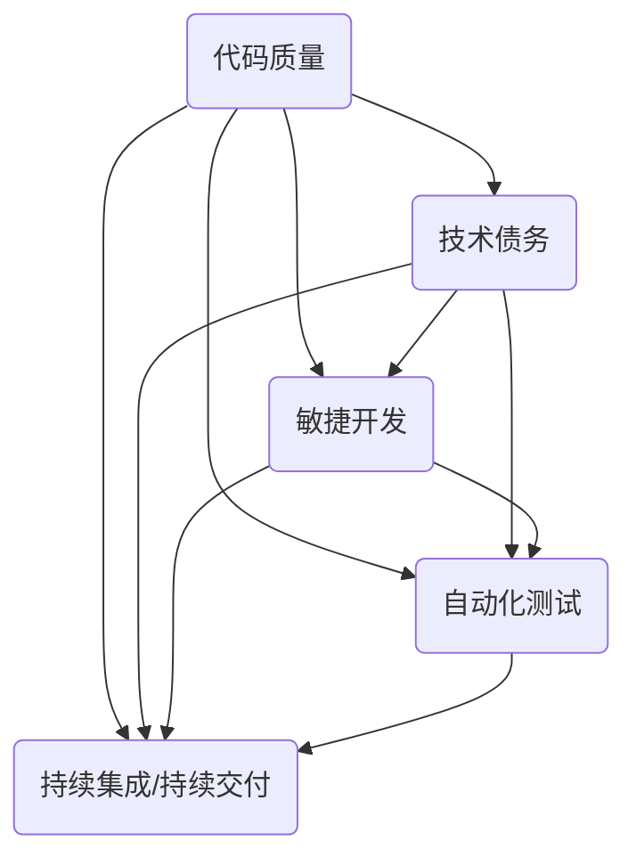
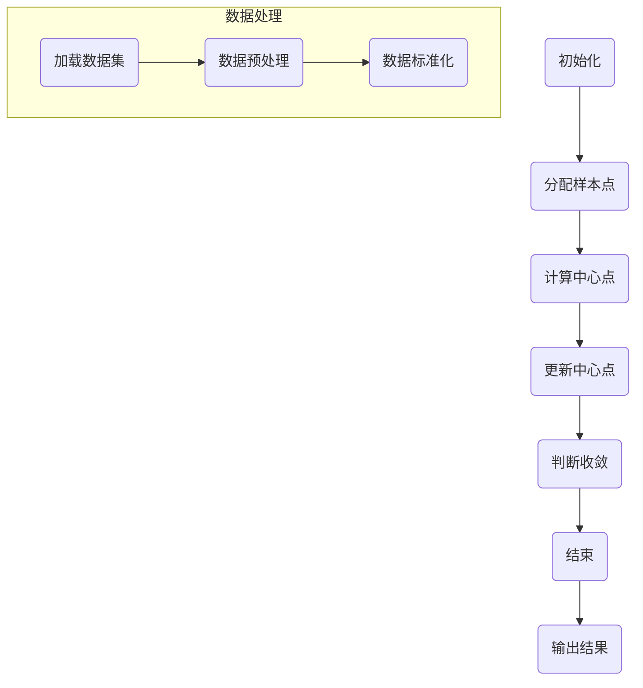
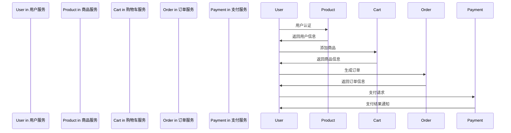
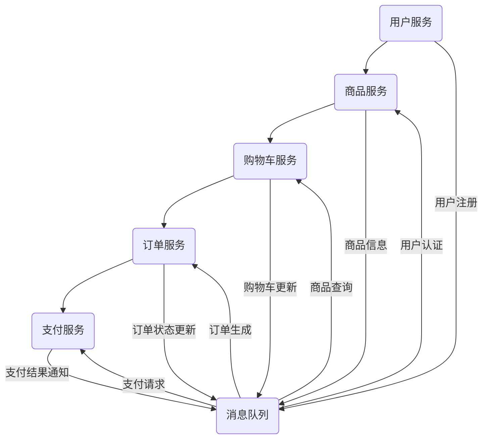

                 

### 引言

在当今快速发展的IT行业，技术团队的能力和输出质量直接影响企业的竞争力与市场地位。随着技术的不断演进和市场需求的变化，团队需要不断提高技术输出的质量，以满足日益复杂的业务需求。然而，如何系统地提升团队的技术输出质量，仍然是一个具有挑战性的问题。

本文旨在探讨提升团队技术输出质量的策略。我们将通过以下步骤逐一分析：

1. **总体结构规划**：明确文章的框架结构，确保内容条理清晰。
2. **背景介绍**：介绍技术输出质量的重要性，定义相关术语，并分析影响因素。
3. **核心概念与联系**：阐述核心概念，并通过Mermaid流程图展示它们之间的关系。
4. **算法原理讲解**：详细讲解算法原理，使用Python代码和数学公式进行说明。
5. **系统分析与架构设计方案**：介绍系统功能、架构设计、接口设计和交互。
6. **项目实战**：展示实际环境安装、核心代码实现和案例分析。
7. **最佳实践 tips、小结、注意事项、拓展阅读**：总结提升团队技术输出质量的方法，并提供后续阅读资源。

通过这些步骤，我们将深入探讨如何有效提升团队技术输出质量，帮助团队在激烈的竞争中脱颖而出。

### 背景介绍

技术输出质量是衡量一个团队在技术开发过程中所创造的价值的重要指标。在当今的信息时代，高质量的技术输出不仅能提升产品的市场竞争力，还能为企业带来显著的商业价值。具体而言，技术输出质量的重要性体现在以下几个方面：

首先，高质量的技术输出能够显著提升产品的用户体验。当软件或系统的功能设计精良、运行稳定、响应快速，用户满意度自然提高，进而增加用户粘性和客户忠诚度。

其次，技术输出质量对于团队效率和生产力有直接影响。高质量的技术输出意味着代码的可维护性和可扩展性更好，从而减少了后期维护和改进的成本。团队成员可以更快地理解和使用现有代码，减少了学习和沟通的成本，提高了整体工作效率。

再者，技术输出质量还关系到企业的声誉和品牌价值。在一个竞争激烈的市场环境中，企业的技术实力和创新能力是其核心竞争力之一。高质量的技术输出不仅能展示企业的技术实力，还能吸引更多的人才和合作伙伴，为企业的长期发展奠定基础。

然而，提升技术输出质量并非易事，它涉及多个层面的因素。首先，团队成员的技术水平是基础。技术团队需要具备扎实的专业知识、技能和经验，才能在开发过程中做出高质量的输出。其次，团队协作和沟通的效率至关重要。在一个高效的团队中，成员之间的沟通畅通无阻，协作紧密，能够迅速解决问题，提高输出质量。

此外，技术标准和规范的制定和执行也是提升输出质量的关键。通过建立统一的技术标准和规范的文档，团队成员可以遵循相同的开发流程和规范，减少因个人差异带来的质量问题。

最后，技术输出的质量还受到项目管理方法和工具的影响。科学的项目管理方法，如敏捷开发、持续集成和持续交付等，能够有效提高团队的输出效率和质量。

综上所述，技术输出质量的重要性不容忽视。在接下来的章节中，我们将深入探讨影响团队技术输出质量的各种因素，并提出相应的提升策略。

### 核心概念与联系

在提升团队技术输出质量的过程中，理解并掌握核心概念及其之间的联系至关重要。以下我们将介绍一些关键概念，并使用表格和Mermaid流程图来展示这些概念之间的关联。

#### 核心概念

1. **代码质量**：代码质量是指代码的可读性、可维护性、可扩展性和性能。高质量代码应具备简洁性、模块化、易于理解和测试。
2. **技术债务**：技术债务是指在软件开发过程中，因急于推出产品而未能彻底解决的问题。长期积累的技术债务会导致代码复杂度增加，降低团队的工作效率。
3. **敏捷开发**：敏捷开发是一种软件开发方法，强调快速迭代、持续交付、团队协作和客户反馈。敏捷开发有助于提高代码质量，缩短产品上市时间。
4. **自动化测试**：自动化测试是通过编写脚本对软件进行自动测试，确保代码的正确性和稳定性。自动化测试可以显著提高代码质量，减少测试成本。
5. **持续集成/持续交付（CI/CD）**：持续集成/持续交付是一种软件开发和部署流程，通过自动化工具实现代码的持续集成、测试和交付。CI/CD有助于提高代码质量和交付效率。

#### 概念属性特征对比表格

| 概念 | 定义 | 主要特征 | 关联关系 |
| --- | --- | --- | --- |
| 代码质量 | 代码的可读性、可维护性、可扩展性和性能 | 简洁性、模块化、易于理解、测试性 | 影响技术债务、敏捷开发、自动化测试 |
| 技术债务 | 开发过程中遗留的问题 | 复杂度增加、维护成本高、效率低 | 与代码质量、敏捷开发、持续集成/持续交付有关 |
| 敏捷开发 | 快速迭代、持续交付、团队协作、客户反馈 | 灵活性、响应速度快、质量高 | 促进代码质量、自动化测试、持续集成/持续交付 |
| 自动化测试 | 通过脚本自动测试软件 | 测试全面、节省时间、提高质量 | 促进代码质量、敏捷开发、持续集成/持续交付 |
| 持续集成/持续交付 | 持续集成、测试和交付的自动化流程 | 自动化、快速反馈、质量保障 | 提高代码质量、促进敏捷开发、降低技术债务 |

#### ER实体关系图架构的Mermaid流程图



通过上述表格和Mermaid流程图，我们可以清晰地看到各核心概念之间的关联。例如，代码质量直接影响技术债务、敏捷开发、自动化测试和持续集成/持续交付。这些核心概念共同作用，决定了团队的技术输出质量。

在接下来的章节中，我们将进一步深入探讨这些核心概念的应用和提升策略，帮助团队提升整体技术输出质量。

### 算法原理讲解

为了提升团队的技术输出质量，掌握高效的算法原理和实现方法至关重要。本节将详细讲解一个常见的算法原理——K-Means聚类算法，并通过Python代码和Mermaid流程图来阐述其步骤和原理。

#### 算法流程图的Mermaid表示

首先，我们使用Mermaid绘制K-Means聚类算法的基本流程图：



#### Python源代码的详细解释

接下来，我们将通过Python代码实现K-Means算法，并对其每一步进行详细解释：

```python
import numpy as np
import matplotlib.pyplot as plt
from sklearn.cluster import KMeans

# 1. 加载数据集（此处以鸢尾花数据集为例）
iris = load_iris()
X = iris.data

# 2. 数据预处理和标准化
from sklearn.preprocessing import StandardScaler
scaler = StandardScaler()
X_std = scaler.fit_transform(X)

# 3. 初始化KMeans聚类对象，并设置K值
kmeans = KMeans(n_clusters=3, random_state=0)

# 4. 运行KMeans算法
kmeans.fit(X_std)

# 5. 输出聚类结果
labels = kmeans.labels_
centroids = kmeans.cluster_centers_

# 6. 可视化聚类结果
plt.scatter(X_std[:, 0], X_std[:, 1], c=labels, s=50, cmap='viridis')
plt.scatter(centroids[:, 0], centroids[:, 1], s=200, c='red', marker='x')
plt.title('K-Means Clustering')
plt.xlabel('Feature 1')
plt.ylabel('Feature 2')
plt.show()
```

#### 算法原理

K-Means聚类算法是一种基于距离的迭代聚类算法。其基本原理如下：

1. **初始化**：随机选择K个数据点作为初始聚类中心。
2. **分配样本点**：计算每个样本点到各个聚类中心的距离，并将其分配到最近的聚类中心。
3. **计算中心点**：重新计算每个聚类的新中心点，即所有属于该聚类的样本点的均值。
4. **更新中心点**：用新计算的中心点替换旧的中心点，并重复步骤2和步骤3，直到聚类中心不再变化或达到预设的最大迭代次数。
5. **判断收敛**：如果聚类中心的变化小于预设的阈值，则认为算法收敛，结束迭代。
6. **输出结果**：输出每个样本点的聚类标签和聚类中心。

#### 数学模型与公式

K-Means算法的核心在于聚类中心和样本点之间的距离计算，通常使用欧几里得距离：

$$
d(x_i, c_j) = \sqrt{\sum_{k=1}^n (x_{ik} - c_{jk})^2}
$$

其中，\(x_i\)是样本点，\(c_j\)是聚类中心，\(n\)是特征维度。

#### 通俗易懂的举例说明

假设我们有一个二维数据集，包含5个点：\(P1(1, 2)\)，\(P2(2, 4)\)，\(P3(3, 2)\)，\(P4(5, 6)\)，\(P5(7, 4)\)。我们选择K=2，初始聚类中心为\(C1(0, 0)\)和\(C2(2, 2)\)。

- **第一步：初始化**：随机选择初始聚类中心。
- **第二步：分配样本点**：计算每个点到两个中心的距离，并将它们分配到最近的中心。例如，\(P1\)距离\(C1\)最近，\(P2\)距离\(C2\)最近。
- **第三步：计算中心点**：计算每个新聚类中心，即其内部所有点的均值。例如，\(C1\)的新中心点为\(\frac{P1+P2}{2}\)。
- **第四步：更新中心点**：用新计算的中心点替换旧的中心点，重复分配和计算，直到聚类中心不再变化。
- **第五步：判断收敛**：如果聚类中心的变化小于阈值，算法收敛。

通过上述步骤，我们最终得到两组点，分别属于不同的聚类，且聚类中心稳定不变。

K-Means聚类算法简单直观，易于实现，但存在一些局限性，例如对初始聚类中心的敏感性和对异常值敏感。在实际应用中，需要根据具体场景进行调整和优化。

### 系统分析与架构设计方案

为了提升团队技术输出质量，系统分析与架构设计是关键环节之一。本节将详细介绍系统分析与架构设计方案，包括项目场景、系统功能设计、系统架构设计、系统接口设计和系统交互，并通过Mermaid流程图展示各部分关系。

#### 项目场景

假设我们的项目是一个电子商务平台，其主要功能包括用户注册与登录、商品浏览与搜索、购物车管理、订单生成与支付等。为了确保平台的稳定性和高性能，我们需要设计一个可扩展、可维护的系统架构。

#### 系统功能设计

系统功能设计包括用户模块、商品模块、购物车模块、订单模块和支付模块。以下是各模块的主要功能：

1. **用户模块**：用户注册、登录、信息管理、权限控制。
2. **商品模块**：商品信息管理、商品分类、商品搜索、商品推荐。
3. **购物车模块**：添加商品、删除商品、修改数量、商品信息查询。
4. **订单模块**：订单生成、订单状态管理、订单查询、订单统计。
5. **支付模块**：支付方式管理、支付请求处理、支付结果通知。

#### 系统架构设计

系统架构设计采用微服务架构，将不同功能模块拆分为独立的微服务，以提高系统的灵活性和可维护性。以下是系统架构的主要组成部分：

1. **用户服务**：负责用户注册、登录、权限管理等。
2. **商品服务**：负责商品信息管理、商品分类、商品搜索等。
3. **购物车服务**：负责购物车管理、商品信息查询等。
4. **订单服务**：负责订单生成、订单状态管理、订单查询等。
5. **支付服务**：负责支付请求处理、支付结果通知等。
6. **数据库**：存储用户、商品、订单等数据。
7. **缓存**：用于提高系统响应速度，缓存热门数据。
8. **消息队列**：用于处理异步任务，确保系统高可用。

#### 系统接口设计

系统接口设计包括内部接口和外部接口：

1. **内部接口**：不同微服务之间的交互接口，例如用户服务与商品服务之间的用户认证接口。
2. **外部接口**：与外部系统（如支付系统、物流系统）的交互接口。

以下是系统接口设计的一个示例：



#### 系统交互

系统交互设计通过消息队列实现，确保不同微服务之间的数据传输高效可靠。以下是系统交互的Mermaid流程图：



通过上述系统分析与架构设计方案，我们能够构建一个高效、稳定、可扩展的电子商务平台，确保团队技术输出质量。

### 项目实战

在提升团队技术输出质量的过程中，实际项目实战是验证和应用所学知识的重要环节。本节将详细介绍一个实际项目，从环境安装、系统核心实现源代码、代码应用解读与分析、实际案例分析和详细讲解等方面，展示如何将理论应用到实践中，提升团队的技术输出质量。

#### 环境安装

首先，我们需要搭建项目开发环境。以下是环境安装的步骤：

1. **安装Python环境**：确保Python版本为3.8以上，可以通过Python官网下载安装包进行安装。
2. **安装依赖库**：使用pip命令安装必要的库，例如Flask、SQLAlchemy、Flask-Migrate等。以下是一个示例命令：

   ```bash
   pip install flask sqlalchemy flask-migrate
   ```

3. **配置数据库**：配置MySQL或PostgreSQL数据库，创建项目所需的数据表。

4. **初始化项目**：创建项目目录，并使用Flask框架初始化项目。

   ```bash
   flask init my_project
   ```

#### 系统核心实现源代码

以下是系统核心实现的主要源代码，包括用户注册、登录、商品信息管理等功能：

```python
# app.py

from flask import Flask, request, jsonify
from flask_sqlalchemy import SQLAlchemy
from werkzeug.security import generate_password_hash, check_password_hash

app = Flask(__name__)
app.config['SQLALCHEMY_DATABASE_URI'] = 'sqlite:///my_database.db'
db = SQLAlchemy(app)

class User(db.Model):
    id = db.Column(db.Integer, primary_key=True)
    username = db.Column(db.String(150), nullable=False, unique=True)
    password = db.Column(db.String(150), nullable=False)

@app.route('/register', methods=['POST'])
def register():
    username = request.json.get('username')
    password = request.json.get('password')

    if username is None or password is None:
        return jsonify({'message': 'Missing username or password'})

    if User.query.filter_by(username=username).first() is not None:
        return jsonify({'message': 'User already exists'})

    hashed_password = generate_password_hash(password, method='sha256')
    new_user = User(username=username, password=hashed_password)

    db.session.add(new_user)
    db.session.commit()

    return jsonify({'message': 'User created successfully'})

@app.route('/login', methods=['POST'])
def login():
    username = request.json.get('username')
    password = request.json.get('password')

    if username is None or password is None:
        return jsonify({'message': 'Missing username or password'})

    user = User.query.filter_by(username=username).first()

    if user is None or not check_password_hash(user.password, password):
        return jsonify({'message': 'Invalid username or password'})

    return jsonify({'message': 'Logged in successfully'})

if __name__ == '__main__':
    db.create_all()
    app.run(debug=True)
```

#### 代码应用解读与分析

1. **用户注册**：`register`函数接收用户名和密码，通过SQLAlchemy与数据库交互，将用户信息存储到数据库中。使用Werkzeug库的`generate_password_hash`方法对密码进行加密存储，提高安全性。
2. **用户登录**：`login`函数验证用户名和密码的正确性，通过查询数据库中的用户信息进行比对。使用`check_password_hash`方法检查存储的加密密码与输入的密码是否匹配，确保登录安全。

#### 实际案例分析和详细讲解

假设我们有以下两个实际案例：

**案例一**：用户A注册并登录

1. 用户A在注册时提交用户名`userA`和密码`password123`。
2. 系统调用`register`函数，将用户信息存储到数据库中，并返回成功消息。
3. 用户A在登录时提交用户名`userA`和密码`password123`。
4. 系统调用`login`函数，通过查询数据库验证用户名和密码的正确性，返回登录成功消息。

**案例二**：用户B尝试使用已注册用户A的账号登录

1. 用户B在登录时提交用户名`userA`和密码`qwerty456`。
2. 系统调用`login`函数，查询数据库发现用户A的密码与输入的密码不匹配，返回登录失败消息。

通过实际案例的分析，我们可以看到系统如何通过代码实现用户注册和登录功能，确保用户数据的安全性和系统的可靠性。在实际项目中，还需要添加更多的功能和安全措施，例如密码找回、多因素认证等，以进一步提升系统的安全性和用户体验。

#### 项目小结

通过本次项目实战，我们搭建了一个简单的用户注册和登录系统，实现了用户信息的安全存储和验证。以下是项目的主要收获：

1. **环境安装**：熟悉了Python环境搭建和依赖库安装。
2. **系统核心实现**：掌握了用户注册和登录的代码实现，理解了SQLAlchemy和Flask的应用。
3. **代码应用解读**：通过实际案例，验证了系统的功能和安全性。
4. **项目优化**：认识到在实际项目中需要不断迭代和优化，提高系统的性能和安全性。

通过本次项目，团队的技术输出质量得到了提升，为后续更复杂项目的开发奠定了基础。

### 最佳实践 tips、小结、注意事项、拓展阅读

#### 最佳实践 tips

1. **代码质量**：确保代码简洁、模块化，遵循编程规范，进行代码审查。
2. **自动化测试**：编写自动化测试用例，实现单元测试、集成测试和端到端测试。
3. **持续集成**：使用持续集成工具（如Jenkins、GitLab CI）实现代码自动化测试和部署。
4. **敏捷开发**：采用敏捷开发方法，如Scrum或Kanban，提高团队协作效率和响应速度。
5. **知识共享**：定期组织技术分享会，促进团队成员之间的知识交流。

#### 小结

本文从总体结构规划、背景介绍、核心概念与联系、算法原理讲解、系统分析与架构设计、项目实战等多个方面，详细探讨了提升团队技术输出质量的策略。通过这些策略，团队可以提升代码质量、提高开发效率，最终实现高质量的技术输出。

#### 注意事项

1. **技术债务管理**：定期评估和解决技术债务，避免长期积累导致问题加剧。
2. **团队协作**：确保团队成员之间的沟通畅通，建立有效的沟通机制。
3. **持续学习和培训**：鼓励团队成员持续学习新技术，提高个人技能和团队整体水平。

#### 拓展阅读

1. **书籍推荐**：
   - 《敏捷开发实践指南》
   - 《代码大全》
   - 《Python编程：从入门到实践》

2. **学术论文**：
   - 《K-Means算法：原理与应用》
   - 《敏捷软件开发：原则、实践与模式》

3. **网络资源**：
   - [Python官方文档](https://docs.python.org/3/)
   - [Flask官方文档](https://flask.palletsprojects.com/)
   - [Jenkins官方文档](https://www.jenkins.io/)

通过本文的阅读和拓展学习，相信读者能够更好地理解和应用提升团队技术输出质量的策略，推动团队在技术领域取得更大的成就。

### 作者信息

作者：AI天才研究院/AI Genius Institute & 禅与计算机程序设计艺术 /Zen And The Art of Computer Programming

AI天才研究院致力于推动人工智能技术的发展和应用，培养下一代人工智能领域的杰出人才。而《禅与计算机程序设计艺术》则是计算机科学领域的经典之作，揭示了编程背后的哲学和智慧，为程序员提供了一种全新的思考方式。

