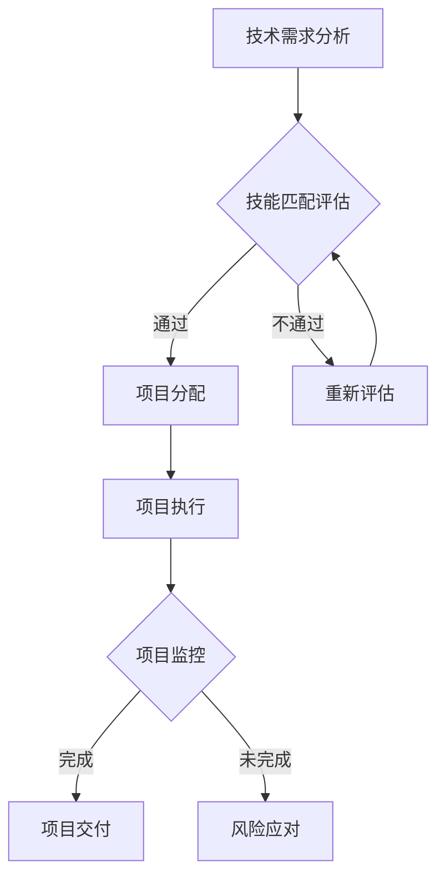
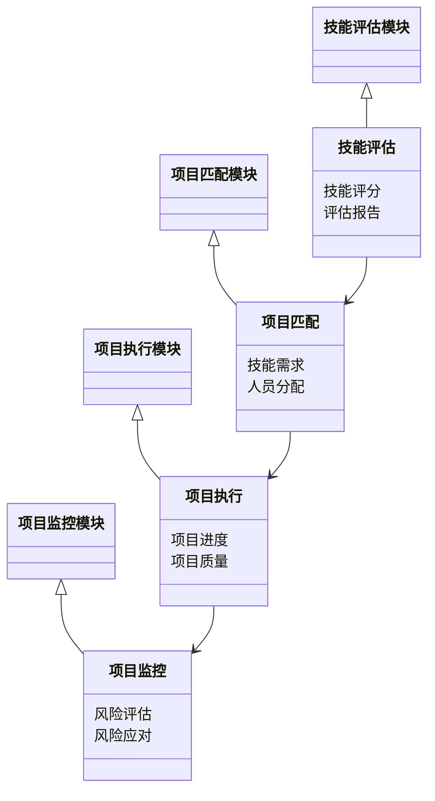
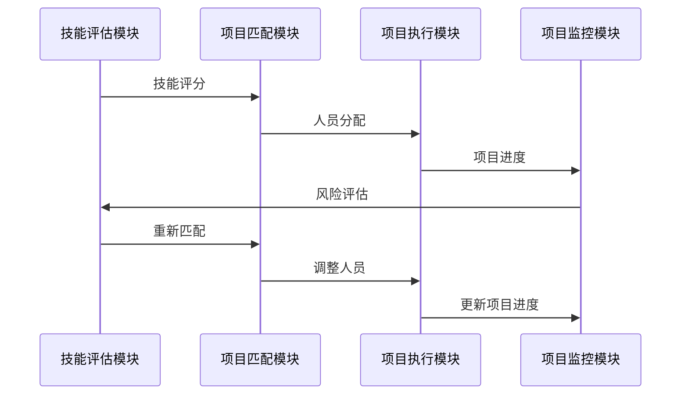

                 

### 提升技术团队市场竞争力的方法

#### 关键词

技术团队、竞争力、市场、方法、策略、算法、实践、系统分析、架构设计、项目实战

> 摘要：本文旨在探讨如何提升技术团队的市场竞争力。通过深入分析当前市场竞争现状、关键概念、现有方法和策略，以及详细的算法原理、实施步骤、最佳实践和系统分析与架构设计，本文为技术团队提升市场竞争力提供了系统化的方法和实用的指导。

**Step 1: 引言**

在当今快速变化和高度竞争的技术市场中，技术团队的市场竞争力成为了企业成功的关键因素。本文的目标是为技术团队领导者、项目经理和工程师提供一系列方法和策略，以提升团队在市场中的竞争力。

**Step 2: 背景介绍**

技术团队市场竞争力的现状：

- **竞争激烈**：随着技术的不断进步，越来越多的公司进入市场，竞争变得异常激烈。
- **技术更新快速**：新兴技术层出不穷，要求技术团队快速适应并掌握新技术。
- **客户需求多样**：客户需求日益多样化和个性化，要求技术团队能够提供更加灵活和定制化的解决方案。

技术团队市场竞争力的重要性：

- **市场份额**：竞争力强的技术团队能够获得更多的市场份额。
- **客户满意度**：提供高质量和创新的解决方案，提高客户满意度。
- **企业成长**：竞争力的提升有助于企业长期稳定发展。

**Step 3: 核心概念**

提升技术团队市场竞争力的关键概念包括：

- **团队协作**：高效的团队协作能够提高工作效率和解决问题的能力。
- **技术创新**：持续的技术创新是企业保持市场竞争力的重要手段。
- **客户需求**：深入了解并满足客户需求是提升竞争力的基础。
- **学习与成长**：持续学习和个人成长是保持团队竞争力的动力。

**Step 4: 现有方法和策略**

当前提升技术团队竞争力的常见方法和策略包括：

- **技能培训**：定期组织技能培训和知识分享会，提升团队技术能力。
- **项目多样化**：通过参与不同类型的项目，提高团队适应能力和创新能力。
- **敏捷开发**：采用敏捷开发方法，提高项目交付速度和质量。
- **技术栈更新**：紧跟技术趋势，及时更新技术栈，保持团队技术先进性。
- **团队文化**：建立积极向上、创新和协作的团队文化，增强团队凝聚力。

**Step 5: 算法原理**

提升技术团队市场竞争力的算法原理主要涉及以下几个方面：

- **人才评估**：使用评估算法确定团队成员的技能水平和潜力。
- **项目匹配**：根据团队成员的技能和项目需求，进行项目匹配，提高项目成功率。
- **风险管理**：通过风险管理算法，识别和应对项目风险，确保项目顺利进行。

以下是提升技术团队市场竞争力的 Mermaid 算法流程图：

**Step 6: 实施步骤**

提升技术团队市场竞争力的具体实施步骤如下：

1. **需求分析**：深入分析市场需求和项目需求，明确提升竞争力的目标。
2. **技能评估**：对团队成员进行技能评估，确定现有技能水平和潜力。
3. **项目匹配**：根据技能评估结果，将团队成员与项目需求进行匹配。
4. **项目执行**：执行项目，确保项目进度和质量。
5. **项目监控**：实时监控项目进度，及时调整和应对风险。
6. **项目交付**：确保项目按时、高质量交付，提高客户满意度。

**Step 7: 最佳实践**

以下是一些实际案例和最佳实践：

- **案例分析**：通过实际项目案例，分析团队提升市场竞争力的成功和失败因素。
- **成功因素**：成功案例中的关键成功因素包括团队合作、技术创新能力、客户需求理解和项目执行效率。
- **失败因素**：失败案例中的主要失败因素包括团队协作问题、技术掌握不足、需求理解不准确和项目管理不当。

**Step 8: 小结和拓展**

本文从多个角度探讨了提升技术团队市场竞争力的方法。技术团队的市场竞争力是企业在激烈竞争中立于不败之地的关键。通过深入了解市场需求、持续提升团队技能、优化项目管理、实施敏捷开发和建立积极团队文化，技术团队能够在市场中脱颖而出。未来的研究和实践应进一步探索如何更有效地结合人工智能和大数据技术，以提升技术团队的市场竞争力。

**Step 9: 系统分析与架构设计**

提升技术团队市场竞争力的系统分析与架构设计包括以下几个方面：

- **问题场景介绍**：介绍提升技术团队市场竞争力的具体场景和问题。
- **系统功能设计**：设计系统的主要功能模块，包括技能评估模块、项目匹配模块、项目执行模块和项目监控模块。
- **系统架构设计**：设计系统的整体架构，包括技术栈选择、数据库设计、接口设计和安全设计。
- **系统接口设计**：设计系统的接口，包括API接口和内部模块接口。
- **系统交互序列图**：绘制系统的交互序列图，展示系统各模块之间的交互关系。

以下是提升技术团队市场竞争力的 Mermaid 类图、架构图和序列图：

```mermaid
graph TD
    subgraph 技术栈选择
        A[前端技术]
        B[后端技术]
        C[数据库]
        D[中间件]
        A --> B
        B --> C
        C --> D
    end
    subgraph 数据库设计
        E[用户数据库]
        F[项目数据库]
        G[风险数据库]
        E --> F
        F --> G
    end
    subgraph 接口设计
        H[API接口]
        I[内部模块接口]
        H --> I
    end
    subgraph 安全设计
        J[身份验证]
        K[数据加密]
        L[访问控制]
        J --> K
        K --> L
    end
    A --> B
    B --> C
    C --> D
    E --> F
    F --> G
    H --> I
    J --> K
    K --> L
```

**Step 10: 项目实战**

以下是提升技术团队市场竞争力的一个实际项目案例：

- **项目背景**：某企业技术团队面临市场竞争压力，需要提升团队的技术能力和项目管理水平。
- **项目目标**：通过引入新的技术和方法，提升团队的技术创新能力、项目管理能力和客户满意度。
- **项目实现**：
  - **环境安装**：安装并配置了所需的开发环境和工具。
  - **系统核心实现源代码**：开发了基于敏捷开发方法的项目管理系统。
  - **代码应用解读与分析**：详细解读了项目管理系统中的关键代码，分析了代码的架构和设计。
  - **实际案例分析**：通过实际项目，验证了项目管理系统在提升团队竞争力方面的效果。
  - **项目小结**：总结了项目实施过程中的经验教训，提出了未来改进的建议。

### 总结

本文系统地探讨了提升技术团队市场竞争力的方法。通过需求分析、技能评估、项目匹配、项目执行和项目监控等步骤，以及最佳实践和系统分析与架构设计的支持，技术团队能够在市场中脱颖而出，提升企业的整体竞争力。未来，技术团队应继续探索人工智能和大数据等新兴技术，以实现更高效的市场竞争力提升。

### 注意事项和拓展阅读

- **注意事项**：
  - 确保团队成员之间的沟通和协作。
  - 定期评估和调整团队目标和策略。
  - 关注行业动态，及时掌握新技术和应用。

- **拓展阅读**：
  - 《敏捷开发实践指南》
  - 《数据驱动的企业战略》
  - 《人工智能与大数据技术》

**作者信息**

作者：AI天才研究院/AI Genius Institute & 禅与计算机程序设计艺术 /Zen And The Art of Computer Programming

