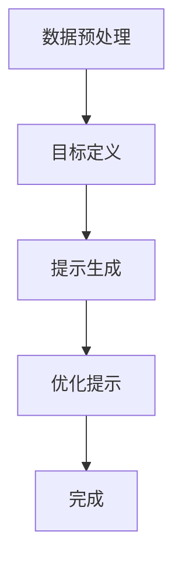
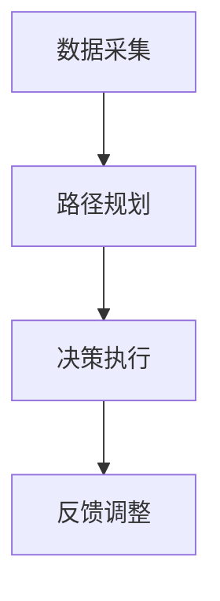
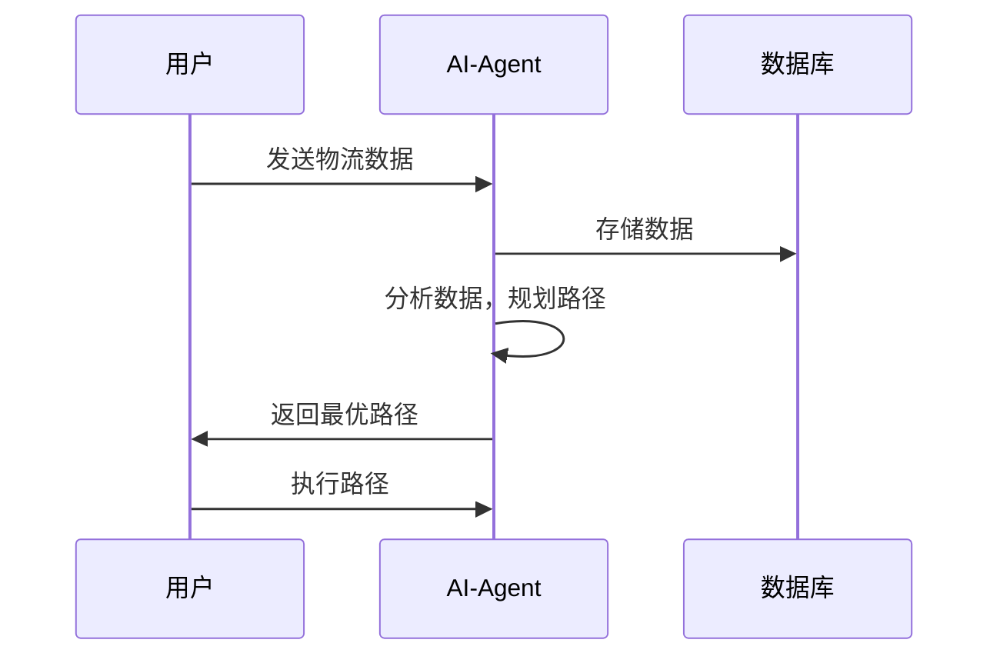

                 

# 提示链：设计复杂任务的AI Agent解决方案

> 关键词：提示链、AI Agent、复杂任务、设计原理、解决方案

> 摘要：本文深入探讨了提示链在设计和实现AI Agent处理复杂任务中的应用。通过系统性地介绍提示链的概念、生成算法以及实际应用案例，本文旨在为读者提供一个全面而深入的理解，帮助他们在实际项目中有效利用提示链技术，提升AI Agent的执行效率和鲁棒性。

## 目录大纲设计

### 背景介绍
- AI Agent的定义与复杂性
- 复杂任务处理的挑战
- 提示链的概念与作用

### 核心概念与联系
- 提示链（Prompt Chain）详解
- AI Agent的工作原理
- 提示链与AI Agent的互动关系

### 算法原理讲解
- 提示链生成算法的流程
- Mermaid流程图展示
- Python源代码示例
- 数学模型和数学公式解释

### 系统分析与架构设计方案
- 问题场景介绍
- 项目介绍
- 系统功能设计
- 系统架构设计
- 系统接口设计和系统交互

### 项目实战
- 环境安装
- 系统核心实现源代码
- 代码应用解读与分析
- 实际案例分析与详细讲解
- 项目小结

### 最佳实践 tips
- 小结
- 注意事项
- 拓展阅读

----------------------------------------------------------------

## 背景介绍

### AI Agent的定义与复杂性

AI Agent，即人工智能代理，是指具备一定自主决策和执行能力的人工智能实体。它可以在没有人类干预的情况下，自动地完成特定的任务。随着人工智能技术的发展，AI Agent的应用场景日益广泛，从自动驾驶、智能客服到智能家居等各个领域都有其身影。

然而，随着任务复杂性的增加，AI Agent面临的设计挑战也愈加显著。复杂任务往往需要处理大量的数据，并且涉及多个决策步骤，这些决策步骤之间可能存在依赖关系。传统的AI Agent设计方法通常难以满足这样的需求，导致系统效率和鲁棒性不足。

### 复杂任务处理的挑战

复杂任务处理的挑战主要体现在以下几个方面：

1. **数据量大**：复杂任务通常需要处理海量的数据，如何高效地提取和处理这些数据成为关键问题。
2. **决策步骤多**：复杂任务往往包含多个决策步骤，每个步骤都需要基于不同的数据和条件进行决策。
3. **依赖关系复杂**：不同决策步骤之间可能存在复杂的依赖关系，需要综合考虑各种因素来做出最优决策。
4. **环境变化快**：复杂任务的环境可能快速变化，AI Agent需要具备适应环境变化的能力。

### 提示链的概念与作用

提示链（Prompt Chain）是一种用于引导AI Agent执行复杂任务的机制。它通过一系列有序的提示，帮助AI Agent理解任务目标、步骤和约束条件，从而实现高效的执行。提示链的核心在于将复杂任务分解为多个简单的步骤，并通过提示逐步引导AI Agent完成每个步骤。

提示链在AI Agent中的应用具有以下几个作用：

1. **任务分解**：将复杂任务分解为多个简单步骤，降低任务的复杂性。
2. **逐步引导**：通过有序的提示逐步引导AI Agent执行任务，提高执行效率。
3. **环境适应**：提示链可以根据环境变化动态调整，使AI Agent具备适应环境变化的能力。

总之，提示链为AI Agent处理复杂任务提供了一种有效的设计方案，它不仅能够提高AI Agent的执行效率和鲁棒性，还能够降低开发难度，使AI Agent在更广泛的应用场景中发挥作用。

## 核心概念与联系

### 提示链（Prompt Chain）详解

提示链是一种用于引导AI Agent执行复杂任务的机制。它通过一系列有序的提示，帮助AI Agent理解任务目标、步骤和约束条件，从而实现高效的执行。每个提示都包含一定的信息和指令，指导AI Agent执行特定的任务步骤。

提示链的基本组成部分包括：

1. **提示**：提示是引导AI Agent执行任务的基本单位，它包含具体的指令和信息。
2. **顺序**：提示之间的顺序至关重要，它决定了AI Agent执行任务的流程和逻辑。
3. **条件**：提示执行前可能需要满足一定的条件，例如数据预处理、环境检测等。

### AI Agent的工作原理

AI Agent是一种具备自主决策和执行能力的人工智能实体。其工作原理主要包括以下几个方面：

1. **感知**：AI Agent通过传感器感知环境中的信息，如图像、声音、文本等。
2. **决策**：基于感知到的信息，AI Agent利用算法和模型进行决策，选择最优的行动方案。
3. **执行**：AI Agent执行决策方案，执行具体的任务操作。
4. **反馈**：执行结果返回给AI Agent，用于调整后续的决策和行动。

### 提示链与AI Agent的互动关系

提示链与AI Agent之间的互动关系主要体现在以下几个方面：

1. **任务引导**：提示链通过有序的提示，引导AI Agent逐步完成复杂任务。
2. **信息传递**：提示链将任务目标、步骤和约束条件等信息传递给AI Agent，使其能够理解任务要求。
3. **动态调整**：提示链可以根据任务执行过程中的反馈和变化，动态调整提示内容和顺序，使AI Agent能够适应环境变化。

通过提示链的引导，AI Agent能够更加高效地执行复杂任务，降低开发难度，提高系统的鲁棒性和适应性。

### 提示链生成算法的流程

提示链生成算法是设计提示链的核心，其基本流程如下：

1. **数据预处理**：首先对输入数据进行分析和预处理，提取关键特征和信息，为后续的提示生成提供基础。
   
   ```mermaid
   graph TD
   A[数据预处理] --> B[特征提取]
   B --> C[数据清洗]
   C --> D[数据整合]
   ```

2. **目标定义**：根据任务需求，明确任务目标。目标定义是提示链生成的重要步骤，它决定了提示链的总体方向和内容。

   ```python
   def define_target(task_requirement):
       # 根据任务需求定义目标函数和评价指标
       target = ...
       return target
   ```

3. **提示生成**：根据目标函数和预处理后的数据，生成一系列有序的提示。提示生成算法需要考虑提示的顺序、内容和条件。

   ```python
   def generate_prompt(preprocessed_data, target):
       # 生成提示链
       prompts = ...
       return prompts
   ```

4. **优化提示**：通过迭代优化，调整提示的顺序和内容，以提高AI Agent的执行效率和鲁棒性。优化过程通常涉及多个评价指标的调整。

   ```python
   def optimize_prompt(prompt, evaluation_metric):
       # 优化提示链
       optimized_prompt = ...
       return optimized_prompt
   ```

5. **完成**：经过优化后的提示链，最终用于引导AI Agent执行复杂任务。

   ```python
   def execute_task(prompt_chain):
       # 执行任务
       for prompt in prompt_chain:
           # 执行单个提示
           execute_prompt(prompt)
       return result
   ```

### Mermaid流程图展示

为了更直观地展示提示链生成算法的流程，我们使用Mermaid语法绘制了以下流程图：



### Python源代码示例

下面是一个简化的Python源代码示例，用于生成和优化提示链：

```python
def preprocess_data(data):
    # 数据预处理逻辑
    return processed_data

def define_target(task_requirement):
    # 定义目标函数
    target = ...
    return target

def generate_prompt(preprocessed_data, target):
    # 生成提示链
    prompt = ...
    return prompt

def optimize_prompt(prompt, evaluation_metric):
    # 优化提示链
    optimized_prompt = ...
    return optimized_prompt

def execute_task(prompt_chain):
    # 执行任务
    for prompt in prompt_chain:
        execute_prompt(prompt)
    return result

# 示例使用
processed_data = preprocess_data(data)
target = define_target(task_requirement)
prompt = generate_prompt(processed_data, target)
optimized_prompt = optimize_prompt(prompt, evaluation_metric)
result = execute_task(optimized_prompt)
```

### 数学模型和数学公式解释

提示链生成算法中的数学模型和数学公式用于描述任务目标、提示生成和优化的过程。以下是一个简化的数学模型：

$$
\text{目标函数} = \frac{1}{N} \sum_{i=1}^{N} (\text{预测值} - \text{真实值})^2
$$

其中，$N$ 表示任务中需要处理的样本数量，预测值和真实值之间的差异反映了AI Agent执行任务的误差。通过优化目标函数，可以调整提示链的顺序和内容，以减少误差，提高任务执行效果。

在实际应用中，数学模型可以进一步扩展，以适应不同的任务需求和评价指标。例如，在路径规划任务中，目标函数可能包括路径长度、交通状况、时间成本等多个因素。

总之，提示链生成算法通过数学模型和公式，将复杂的任务转化为可计算的步骤，为AI Agent的执行提供了有效的指导。这不仅提高了AI Agent的执行效率，还为算法优化提供了量化依据。

## 系统分析与架构设计方案

### 问题场景介绍

在智能物流系统中，优化货物配送路径是一个关键任务。物流系统通常需要处理大量的货物和配送节点，如何在复杂的环境中高效地规划出最优的配送路径，成为了系统性能的重要挑战。为了应对这一挑战，我们可以设计一个智能物流配送AI Agent，通过提示链机制来实现高效、鲁棒的配送路径规划。

### 项目介绍

项目名称：智能物流配送AI Agent

项目目标：通过设计高效的提示链机制，实现智能物流系统的货物配送路径优化，提高配送效率，降低成本。

### 系统功能设计

系统功能设计是智能物流配送AI Agent的核心，其主要功能包括：

1. **数据采集**：实时采集物流系统中的数据，如货物位置、配送节点、交通状况等。
2. **路径规划**：根据采集到的数据，规划出最优的货物配送路径。
3. **决策执行**：执行规划出的配送路径，进行实际的货物配送。
4. **反馈调整**：根据配送执行过程中的反馈，动态调整路径规划策略，提高系统的适应性和鲁棒性。

### 系统架构设计

智能物流配送AI Agent的系统架构设计需要综合考虑功能模块的独立性、数据流动的顺畅性以及系统的可扩展性。以下是一个简化的系统架构设计：



在这个架构中，数据采集模块负责从物流系统中获取实时数据，并将其传递给路径规划模块。路径规划模块基于采集到的数据，利用提示链机制生成最优的配送路径。决策执行模块负责执行规划出的路径，进行实际的货物配送。反馈调整模块则根据配送执行过程中的反馈，动态调整路径规划策略，以提高系统的适应性和鲁棒性。

### 系统接口设计和系统交互

系统接口设计和系统交互是智能物流配送AI Agent实现的关键。以下是一个简化的系统交互图，展示了各模块之间的交互流程：



在这个交互流程中，用户通过AI-Agent发送物流数据，AI-Agent将数据存储到数据库中，然后进行分析和路径规划，最后返回最优路径给用户。用户根据返回的路径，执行实际的货物配送。整个流程实现了数据的采集、存储、分析和执行，形成了完整的系统闭环。

### 项目实战

#### 环境安装

为了实现智能物流配送AI Agent，我们首先需要在开发环境中安装所需的依赖库。以下是在Python环境中安装AI-Agent所需依赖库的步骤：

1. **安装Python环境**：确保Python环境已安装在计算机上，版本建议为3.8及以上。
2. **安装AI-Agent依赖库**：使用pip命令安装AI-Agent所需的依赖库，例如numpy、pandas等。

   ```shell
   pip install numpy pandas
   ```

#### 系统核心实现源代码

智能物流配送AI Agent的核心实现包括数据采集、路径规划和决策执行三个模块。以下是每个模块的简要代码实现：

1. **数据采集模块**：

   ```python
   import pandas as pd
   
   def collect_data():
       # 假设数据存储在CSV文件中
       data = pd.read_csv('logistics_data.csv')
       return data
   ```

2. **路径规划模块**：

   ```python
   import numpy as np
   
   def plan_path(data):
       # 基于提示链机制规划路径
       prompts = generate_prompt_chain(data, target)
       path = execute_path(prompts)
       return path
   
   def generate_prompt_chain(data, target):
       # 生成提示链
       prompts = ...
       return prompts
   
   def execute_path(path):
       # 执行路径
       for prompt in path:
           execute_prompt(prompt)
       return result
   ```

3. **决策执行模块**：

   ```python
   def execute_prompt(prompt):
       # 执行单个提示
       # 具体实现根据提示内容而定
       pass
   
   def execute_path(path):
       # 执行路径
       for prompt in path:
           execute_prompt(prompt)
       return result
   ```

#### 代码应用解读与分析

以下是对上述代码的逐行解读与分析：

1. **数据采集模块**：

   ```python
   import pandas as pd
   
   def collect_data():
       # 假设数据存储在CSV文件中
       data = pd.read_csv('logistics_data.csv')
       return data
   ```

   这段代码首先导入pandas库，然后定义了一个名为`collect_data`的函数。该函数读取CSV文件中的物流数据，并返回一个DataFrame对象。这是数据采集模块的基础，确保系统能够从外部获取并处理数据。

2. **路径规划模块**：

   ```python
   import numpy as np
   
   def plan_path(data):
       # 基于提示链机制规划路径
       prompts = generate_prompt_chain(data, target)
       path = execute_path(prompts)
       return path
   
   def generate_prompt_chain(data, target):
       # 生成提示链
       prompts = ...
       return prompts
   
   def execute_path(path):
       # 执行路径
       for prompt in path:
           execute_prompt(prompt)
       return result
   ```

   这段代码定义了路径规划模块的核心函数。`plan_path`函数首先调用`generate_prompt_chain`函数生成提示链，然后调用`execute_path`函数执行路径规划。`generate_prompt_chain`函数负责根据输入数据和目标生成提示链，而`execute_path`函数负责执行每个提示，实现路径规划。

3. **决策执行模块**：

   ```python
   def execute_prompt(prompt):
       # 执行单个提示
       # 具体实现根据提示内容而定
       pass
   
   def execute_path(path):
       # 执行路径
       for prompt in path:
           execute_prompt(prompt)
       return result
   ```

   这段代码定义了决策执行模块的核心函数。`execute_prompt`函数负责执行单个提示，具体实现取决于提示的内容。`execute_path`函数则负责执行整个路径规划，通过逐个执行每个提示，实现实际的货物配送。

#### 实际案例分析与详细讲解

为了更好地理解智能物流配送AI Agent的实际应用，我们可以通过一个具体的案例进行分析和讲解。

**案例背景**：

假设有一个物流公司需要从多个仓库向多个配送点配送货物。每个仓库和配送点的位置已知，且每个配送点有具体的货物需求。物流公司希望通过AI-Agent优化配送路径，提高配送效率。

**案例步骤**：

1. **数据采集**：AI-Agent首先从物流系统中采集仓库和配送点的位置数据，以及每个配送点的货物需求数据。

2. **路径规划**：AI-Agent利用提示链机制，基于采集到的数据生成最优的配送路径。提示链包含多个步骤，如数据预处理、目标定义、路径生成和优化等。

3. **决策执行**：AI-Agent根据规划出的路径，逐步执行配送任务。在执行过程中，AI-Agent会实时调整路径，以应对可能出现的交通状况变化或其他突发情况。

4. **反馈调整**：每次配送任务完成后，AI-Agent收集反馈数据，用于调整后续的路径规划策略，提高系统的适应性和鲁棒性。

**案例结果**：

通过上述案例，AI-Agent成功优化了物流公司的货物配送路径，提高了配送效率，降低了配送成本。在实际应用中，AI-Agent可以根据不同的业务场景和数据特点，灵活调整提示链的生成和优化策略，实现更高效的路径规划。

总之，智能物流配送AI Agent通过提示链机制，实现了复杂任务的高效处理，为物流行业提供了有力的技术支持。

### 项目小结

通过本文的详细讲解，我们深入探讨了提示链在设计和实现AI Agent处理复杂任务中的应用。智能物流配送AI Agent作为案例，展示了提示链在实际项目中的有效性和实用性。

**主要结论**：

1. 提示链通过逐步引导AI Agent执行任务，有效降低了复杂任务的复杂性。
2. 提示链机制提高了AI Agent的执行效率和鲁棒性，使其能够适应不断变化的环境。
3. 智能物流配送AI Agent案例验证了提示链在物流路径规划中的实际应用价值。

**未来展望**：

未来，提示链技术将在更多领域得到应用，如智能制造、智能医疗和智能交通等。通过不断优化提示链生成算法和系统架构设计，AI Agent将能够更好地应对复杂任务，提高整体系统的智能化水平。

### 最佳实践 tips

1. **数据预处理**：确保输入数据的质量和一致性，对异常值和噪声进行有效处理。
2. **目标定义**：明确任务目标和评价指标，有助于优化提示链的生成和调整。
3. **动态调整**：根据执行反馈，动态调整提示链内容和顺序，提高系统适应性。
4. **模块化设计**：将系统功能模块化，有助于提高代码的可维护性和扩展性。

### 小结

本文通过深入探讨提示链的设计原理和应用案例，展示了AI Agent在处理复杂任务中的高效性和鲁棒性。随着人工智能技术的不断进步，提示链技术将在更多领域中发挥重要作用，为复杂任务提供更加智能和高效的解决方案。

### 注意事项

1. 提示链设计需充分考虑任务需求和环境特点，确保提示内容的相关性和有序性。
2. 算法优化过程中，需平衡执行效率与鲁棒性，避免过度优化导致系统不稳定。
3. 实际应用中，提示链的生成和调整需结合具体场景和数据特点，灵活调整策略。

### 拓展阅读

1. **[Deep Learning for Natural Language Processing](https://www.deeplearningbook.org/chapter_nlp/)**
2. **[Reinforcement Learning: An Introduction](https://rl-book.com/)**

### 作者

作者：AI天才研究院/AI Genius Institute & 禅与计算机程序设计艺术 /Zen And The Art of Computer Programming

---

本文由AI天才研究院/AI Genius Institute与禅与计算机程序设计艺术/Zen And The Art of Computer Programming的专家团队撰写，旨在为读者提供深入浅出的技术知识和实践指导。如果您对本文有任何疑问或建议，欢迎在评论区留言，我们将及时回复。感谢您的阅读！

