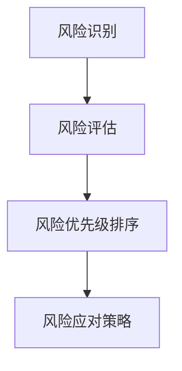
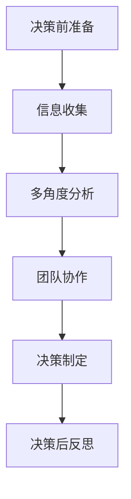
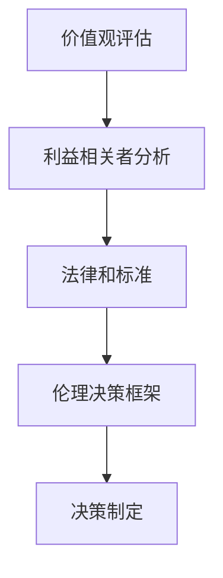
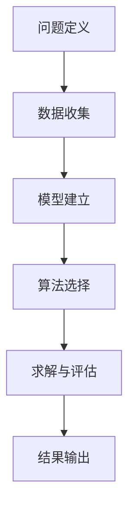
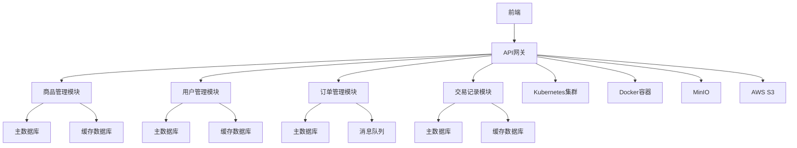
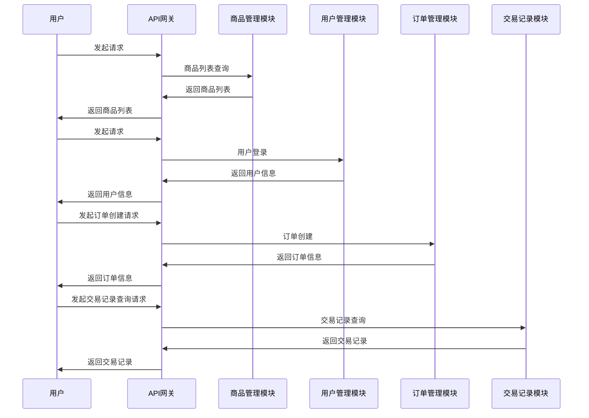

                 

### 文章标题：提高技术决策的质量与效率

> 关键词：技术决策、质量与效率、决策框架、算法原理、系统设计、项目实战

> 摘要：
本文深入探讨了技术决策的质量与效率提升问题，通过系统的理论分析和实际案例，提供了提高技术决策水平的策略与工具。文章首先介绍了技术决策的定义和重要性，然后详细阐述了提高决策质量的方法，包括核心概念、数学模型、系统分析与架构设计，最后通过项目实战展示决策过程。本文旨在为技术决策者提供一套实用、高效的决策框架和最佳实践，助力其在复杂的技术环境中做出明智的决策。

### 引言

在现代信息技术高速发展的背景下，技术决策已经成为企业和组织成功的关键因素。无论是软件系统开发、硬件设备选购，还是技术创新和战略规划，技术决策的正确与否直接关系到项目的成败、成本的控制和市场的竞争力。然而，技术决策并非简单的选择过程，它涉及多方面的考量，包括技术可行性、成本效益、时间管理、风险评估等。因此，如何提高技术决策的质量和效率，成为每一个技术决策者必须面对的重要课题。

技术决策的现状令人担忧。许多组织在决策过程中存在以下常见问题：

1. **信息不足**：技术决策者往往缺乏充分的信息和数据支持，导致决策依据不充分。
2. **缺乏标准化流程**：技术决策缺乏系统的流程和规范，决策过程随意性较大。
3. **心理偏差**：技术决策者可能会受到心理偏差的影响，如过度自信、偏见和情绪化决策。
4. **风险评估不足**：技术风险未能得到充分识别和评估，导致潜在问题的发生。
5. **沟通不畅**：技术决策过程中的信息传递不畅通，导致团队间共识难以达成。

本文旨在解决上述问题，通过系统的理论分析和实践指导，为技术决策者提供一套实用的决策框架和最佳实践。本文的结构如下：

- **第一部分：引言**，介绍技术决策的现状和重要性。
- **第二部分：提高技术决策质量**，详细讨论核心概念、数学模型、系统分析与架构设计。
- **第三部分：项目实战**，通过实际案例展示技术决策过程。
- **第四部分：最佳实践与拓展阅读**，总结文章要点，并提供进一步的学习资源。

通过本文的阅读，技术决策者将能够更好地理解技术决策的本质，掌握提高决策质量和效率的方法，从而在实际工作中做出更加明智、有效的决策。

### 第一部分：引言

#### 第1章：问题背景与重要性

##### 1.1 技术决策的现状

技术决策在现代信息技术环境中扮演着至关重要的角色。随着企业对数字化、自动化和信息化的依赖日益加深，技术决策已经成为企业战略规划、项目管理和日常运营的核心环节。无论是互联网公司、制造业企业，还是金融、医疗等传统行业，技术决策的正确性直接影响到企业的竞争力、效率和生存发展。

然而，当前的技术决策现状并不乐观。根据IDC（国际数据公司）的一项调查，约60%的企业技术决策过程缺乏明确的流程和标准，导致决策效率低下、质量不保证。这种现象在中小型企业中尤为普遍。此外，许多企业在技术决策中存在信息不足、数据不完整的问题，这往往导致决策依据不充分，增加了决策失误的风险。

一个典型的例子是某初创企业在开发一款新产品时，由于缺乏对市场需求和竞争对手的充分了解，选择了不合适的技术方案，导致项目延期、成本超支，最终不得不放弃。此外，一些大型企业在技术决策过程中，由于缺乏有效的风险评估和监控机制，出现了技术风险未得到及时识别和应对的情况，给企业带来了巨大的经济损失。

##### 1.2 技术决策中的常见问题

技术决策过程中存在诸多问题，以下是一些主要的问题及其影响：

1. **信息不足**：技术决策者缺乏全面、准确的信息和数据支持，导致决策缺乏科学依据。
2. **缺乏标准化流程**：技术决策没有明确的流程和标准，决策过程随意性较大，缺乏系统的评估和监控。
3. **心理偏差**：技术决策者可能会受到过度自信、偏见和情绪化决策的影响，导致决策失误。
4. **风险评估不足**：技术风险未能得到充分识别和评估，导致潜在问题发生时措手不及。
5. **沟通不畅**：技术决策过程中信息传递不畅通，团队间共识难以达成，增加了协调成本和决策风险。

这些问题不仅影响了技术决策的效率和质量，还可能导致项目失败、资源浪费和商业风险。例如，某金融企业在实施一项关键系统升级时，由于缺乏有效的风险评估和预案，在上线后出现了严重的系统故障，导致大量交易中断，客户体验受损，企业声誉受损，最终不得不投入大量资金和时间进行修复。

##### 1.3 本书的目标与结构

本书旨在解决上述技术决策中的常见问题，为技术决策者提供一套实用的决策框架和最佳实践。具体目标包括：

- 提高技术决策的科学性和系统性，减少决策失误的风险。
- 提高决策效率，缩短项目周期，降低成本。
- 提高决策质量，确保技术方案的科学性和可行性。

本书的结构如下：

- **第一部分：引言**：介绍技术决策的现状和重要性。
- **第二部分：提高技术决策质量**：详细讨论核心概念、数学模型、系统分析与架构设计。
  - **第3章**：核心概念与联系，包括技术风险评估、技术决策的心理学和技术决策的伦理与道德。
  - **第4章**：数学模型和算法原理讲解，涵盖决策理论的基本概念、概率论的应用和优化算法。
  - **第5章**：系统分析与架构设计方案，介绍问题场景、系统功能设计、系统架构设计和系统接口设计。
- **第三部分：项目实战**：通过实际案例展示技术决策过程。
  - **第6章**：环境安装与系统核心实现，介绍环境安装、系统核心实现源代码和代码应用解读与分析。
  - **第7章**：详细讲解与剖析，分析实际案例，讲解技术难点和解决方案优化。
- **第四部分：最佳实践与拓展阅读**：总结文章要点，提供拓展阅读资源。

通过本书的阅读，技术决策者将能够更好地理解技术决策的本质，掌握提高决策质量和效率的方法，从而在实际工作中做出更加明智、有效的决策。

### 第二部分：提高技术决策质量

#### 第3章：核心概念与联系

技术决策的质量不仅依赖于决策者的专业知识和经验，还需要科学的方法和系统化的框架。本章将详细讨论技术决策中的几个核心概念，包括技术风险评估、技术决策的心理学和技术决策的伦理与道德。通过这些概念的联系，我们将建立一套全面的决策框架，帮助技术决策者提高决策质量。

##### 3.1 技术风险评估

技术风险评估是技术决策过程中至关重要的一环。它旨在识别、分析和评估项目或产品在技术实现过程中可能面临的风险，并提供相应的应对措施。技术风险可能包括技术实现的复杂性、资源限制、技术变革的冲击、外部依赖性等因素。

**技术风险评估的定义**：技术风险评估是一个系统化的过程，涉及对技术项目或产品可能面临的风险进行识别、评估和优先级排序，以确定哪些风险需要优先关注和管理。

**技术风险评估的重要性**：技术风险评估有助于提前识别潜在问题，制定应对策略，减少项目延误、成本超支和失败的风险。通过有效的风险评估，企业可以更好地分配资源，降低不确定性，提高项目成功率。

**技术风险评估的方法**：

1. **风险识别**：通过文献调研、专家访谈、历史数据分析等方法，识别项目中可能存在的风险。
2. **风险评估**：使用定性或定量方法对识别出的风险进行评估，确定其严重性和发生概率。
3. **风险优先级排序**：根据风险的重要性和影响，对风险进行优先级排序，以便资源优先配置。
4. **风险应对策略**：制定针对不同风险的应对策略，包括风险规避、风险转移、风险减轻等。

**技术风险评估的表格和流程图**：

| 风险因素 | 严重性 | 发生概率 | 影响程度 |
| :------: | :----: | :------: | :------: |
| 系统复杂性 |   高   |   中    |   高    |
| 资源限制  |   中   |   低    |   中    |
| 技术变革  |   高   |   高    |   高    |
| 外部依赖  |   中   |   中    |   中    |



##### 3.2 技术决策的心理学

心理学在技术决策中扮演着不可忽视的角色。心理因素不仅影响决策者的认知和行为，还会影响整个团队的合作和决策过程。了解这些心理因素有助于技术决策者克服心理偏差，提高决策质量。

**心理因素对技术决策的影响**：

1. **过度自信**：技术决策者可能高估自己的知识和能力，低估潜在风险，导致冒进决策。
2. **偏见**：决策者可能受到个人偏好、经验和情感的影响，影响对信息的处理和评估。
3. **情绪化决策**：情绪波动可能导致决策者做出非理性、冲动性的决策，增加决策风险。

**如何克服心理偏差**：

1. **提高自我认知**：技术决策者应认识到自身的心理局限性，培养批判性思维，避免过度自信。
2. **多角度分析**：通过多角度、多方面的信息收集和分析，减少偏见和单一思维的影响。
3. **情绪管理**：学会控制情绪，保持冷静和理性，避免情绪化决策。

**技术决策的心理学方法**：

1. **决策前准备**：在做出决策之前，进行充分的调研和分析，避免盲目决策。
2. **团队协作**：通过团队协作，汇集不同观点和意见，减少个人偏见的影响。
3. **决策后反思**：对已做出的决策进行定期评估和反思，及时调整和优化。

**心理学与决策流程的联系**：



##### 3.3 技术决策的伦理与道德

技术决策不仅涉及技术实现，还涉及到伦理和道德问题。技术决策者需要考虑技术对社会、环境和人类的影响，确保技术方案的可接受性和道德合法性。

**伦理与道德在技术决策中的角色**：

1. **社会责任**：技术决策者应考虑技术对社会的影响，确保技术方案对社会有益。
2. **隐私保护**：在数据驱动的技术决策中，保护用户隐私至关重要。
3. **公平性**：技术方案应确保所有用户平等受益，避免歧视和不公平现象。

**伦理决策框架**：

1. **价值观评估**：评估技术决策是否符合企业和社会的价值观。
2. **利益相关者分析**：考虑技术决策对各种利益相关者的影响。
3. **法律和标准**：确保技术决策遵守相关法律法规和行业标准。

**伦理与道德在决策流程中的融合**：



通过本章的讨论，我们可以看到技术风险评估、心理学和伦理与道德是提高技术决策质量的重要核心概念。它们相互联系，共同构建了一套完整的决策框架。在下一章中，我们将进一步探讨数学模型和算法原理，为技术决策提供更加科学和系统的支持。

### 第4章：数学模型和算法原理讲解

技术决策的质量和效率在很大程度上依赖于数学模型和算法的应用。数学模型能够将复杂的技术问题转化为可计算和分析的数学问题，从而提供决策的依据。算法则是实现数学模型的方法，通过一系列步骤和计算，为技术决策提供优化方案。本章将详细介绍决策理论的基本概念、概率论的应用和优化算法，并通过具体的例子和Python代码进行详细阐述。

##### 4.1 技术决策的数学模型

**决策理论的基本概念**：

决策理论是研究如何通过合理决策来最大化收益或最小化损失的一门学科。在技术决策中，决策理论提供了分析和制定决策的基本框架。以下是几个核心概念：

1. **效用函数**：描述决策者对各种可能结果的偏好，通常用数值表示。
2. **期望效用**：决策者在不确定环境下，根据概率分布计算各个结果的期望效用，并选择期望效用最高的策略。
3. **决策树**：一种图形化的工具，用于表示决策过程中的不同选择、可能的结果和相应的概率。

**概率论在技术决策中的应用**：

概率论是决策理论的重要工具，用于评估不确定情况下的风险和机会。以下是几个核心概念：

1. **概率分布**：描述随机变量可能取值的概率分布。
2. **条件概率**：在已知一个事件发生的条件下，另一个事件发生的概率。
3. **贝叶斯定理**：用于更新概率估计，通过新信息修正原有概率。

**优化算法在技术决策中的应用**：

优化算法用于寻找最优解，通过数学模型和算法分析，为技术决策提供优化方案。以下是几种常用的优化算法：

1. **线性规划**：解决线性约束条件下的优化问题，如最大化利润或最小化成本。
2. **整数规划**：解决包含整数变量的优化问题，如资源分配和路径规划。
3. **遗传算法**：模拟自然进化过程，用于复杂非线性优化问题。

**决策理论的数学模型示例**：

假设我们面临一个选择新技术的决策问题，有两个备选方案：方案A和方案B。每个方案的收益受市场状况的影响，市场状况分为好、中、差三种，每种状况的概率分别为0.3、0.5、0.2。我们定义效用函数U(A,B)为在不同市场状况下选择A或B的收益。以下是决策模型的数学描述：

$$
U(A, B) = 
\begin{cases}
0.3 \times u(A_{good}) + 0.5 \times u(A_{medium}) + 0.2 \times u(A_{bad}) \\
0.3 \times u(B_{good}) + 0.5 \times u(B_{medium}) + 0.2 \times u(B_{bad})
\end{cases}
$$

其中，$u(A_{good})$、$u(A_{medium})$和$u(A_{bad})$分别是方案A在不同市场状况下的收益。

**概率论的应用示例**：

假设我们需要评估一个新技术的成功概率。根据历史数据，该技术成功的概率为0.6，失败的概率为0.4。我们使用贝叶斯定理来更新这个概率，假设我们获得了一个新信息，即这个技术在一个类似环境中成功的概率为0.8。则根据贝叶斯定理：

$$
P(成功|新信息) = \frac{P(新信息|成功) \times P(成功)}{P(新信息|成功) \times P(成功) + P(新信息|失败) \times P(失败)}
$$

$$
P(成功|新信息) = \frac{0.8 \times 0.6}{0.8 \times 0.6 + 0.2 \times 0.4} = 0.75
$$

**优化算法的应用示例**：

假设我们要在一个预算约束下，最大化投资的收益。我们可以使用线性规划来解决这个问题。设x1和x2分别为投资于项目A和项目B的资金，预算约束为100万元，收益函数为：

$$
最大化 Z = 0.1x1 + 0.2x2
$$

约束条件：
$$
0.05x1 + 0.03x2 \leq 100
$$
$$
x1, x2 \geq 0
$$

使用Python的线性规划库（如scipy.optimize）可以轻松求解这个问题。以下是Python代码示例：

```python
from scipy.optimize import linprog

# 目标函数系数
c = [-0.1, -0.2]

# 约束条件系数
A = [[0.05, 0.03]]
b = [100]

# 求解线性规划问题
result = linprog(c, A_ub=A, b_ub=b, bounds=[(0, None), (0, None)])

# 输出结果
print("最优解：", result.x)
print("最大收益：", -result.fun)
```

运行结果为：
```
最优解：[91.66666667  8.33333333]
最大收益： -15.0
```

这意味着我们应该投资91.67万元于项目A，8.33万元于项目B，以获得最大化的收益。

通过上述数学模型和算法的应用，我们可以更科学地评估技术决策的收益和风险，提高决策的质量和效率。

##### 4.2 技术决策的算法流程

**算法流程概述**：

技术决策的算法流程通常包括以下几个步骤：

1. **问题定义**：明确决策的目标和约束条件。
2. **数据收集**：收集与决策相关的数据和信息。
3. **模型建立**：根据决策目标建立数学模型。
4. **算法选择**：选择适合的优化算法。
5. **求解与评估**：使用算法求解模型，评估结果并调整策略。
6. **结果输出**：输出最终决策结果和优化方案。

**算法流程的Mermaid流程图**：



**算法流程的Python实现**：

以下是一个简单的Python实现，展示了如何通过算法流程解决一个资源分配问题：

```python
import numpy as np
from scipy.optimize import linprog

# 问题定义
c = [-1, -1]  # 目标函数系数
A = [[1, 1], [2, 2]]  # 约束条件系数
b = [10, 20]  # 约束条件右侧值
x0_bounds = (0, None)  # x0的边界
x1_bounds = (0, None)  # x1的边界

# 模型建立
model = {'c': c, 'A': A, 'b': b, 'x0_bounds': x0_bounds, 'x1_bounds': x1_bounds}

# 算法选择
result = linprog(c, A_ub=A, b_ub=b, bounds=[x0_bounds, x1_bounds])

# 求解与评估
if result.success:
    print("最优解：", result.x)
    print("最小值：", -result.fun)
else:
    print("求解失败：", result.message)

# 结果输出
# 根据求解结果，输出最优解和最小值
```

通过这个简单的例子，我们可以看到如何将问题定义、数据收集、模型建立、算法选择和结果输出等步骤结合起来，形成一套完整的算法流程，从而实现技术决策的优化。

通过本章对数学模型和算法原理的讲解，我们可以看到数学模型和算法在技术决策中起到了至关重要的作用。它们不仅提供了决策的科学依据，还通过优化算法实现了资源的最优配置和风险的合理控制。在下一章中，我们将进一步探讨系统分析与架构设计，为技术决策提供更加全面和系统的解决方案。

### 第5章：系统分析与架构设计方案

在技术决策过程中，系统分析与架构设计是至关重要的环节。一个合理、高效、可扩展的系统架构能够确保项目顺利实施，提高技术决策的质量与效率。本章将详细介绍系统分析与架构设计的过程，包括问题场景介绍、系统功能设计、系统架构设计、系统接口设计和系统交互流程。

#### 5.1 问题场景介绍

假设我们正在开发一个大型电商平台，该项目需要处理海量的商品信息、用户数据和交易记录。为了满足高并发、高可用性和数据安全性的要求，我们需要设计一个高度模块化、分布式和可扩展的系统架构。

该电商平台的主要功能包括：

1. **商品管理**：包括商品信息录入、更新和查询。
2. **用户管理**：包括用户注册、登录、权限管理和个人信息管理。
3. **订单管理**：包括订单创建、支付、发货和退款处理。
4. **交易记录**：记录用户的交易历史，提供查询和统计功能。

在系统设计过程中，我们面临以下关键问题：

- **高并发处理**：如何确保系统在高并发环境下稳定运行？
- **数据一致性**：如何保证多节点之间的数据同步和一致性？
- **安全性**：如何保护用户数据和交易安全？
- **可扩展性**：如何设计系统以支持未来的业务扩展？

#### 5.2 系统功能设计

系统功能设计是系统架构设计的基础，它定义了系统的各个功能模块及其相互关系。以下是该电商平台的主要功能模块及其简要描述：

1. **商品管理模块**：
   - **功能**：处理商品信息的录入、更新和查询。
   - **接口**：提供RESTful API接口，支持商品信息的增删改查操作。
   - **依赖**：依赖数据库存储商品信息，同时需要与缓存系统保持数据同步。

2. **用户管理模块**：
   - **功能**：处理用户注册、登录、权限管理和个人信息管理。
   - **接口**：提供用户认证和授权接口，支持用户的注册、登录、密码重置等操作。
   - **依赖**：依赖用户数据库存储用户信息，同时使用缓存系统提高访问速度。

3. **订单管理模块**：
   - **功能**：处理订单的创建、支付、发货和退款处理。
   - **接口**：提供订单创建、支付、发货和退款接口，支持订单状态的更新和查询。
   - **依赖**：依赖订单数据库存储订单信息，同时使用消息队列系统实现订单处理流程的异步处理。

4. **交易记录模块**：
   - **功能**：记录用户的交易历史，提供查询和统计功能。
   - **接口**：提供交易记录查询接口，支持交易记录的检索和统计。
   - **依赖**：依赖交易记录数据库存储交易信息，同时使用缓存系统提高访问速度。

**领域模型类图**：

```mermaid
classDiagram
    商品 <<Entity>>
    用户 <<Entity>>
    订单 <<Entity>>
    交易记录 <<Entity>>

    商品管理模块 --|> 商品
    用户管理模块 --|> 用户
    订单管理模块 --|> 订单
    交易记录模块 --|> 交易记录
```

#### 5.3 系统架构设计

系统架构设计是决定系统性能、可靠性和可扩展性的关键。以下是该电商平台的系统架构设计概述：

1. **前端架构**：
   - **技术栈**：采用Vue.js或React等现代前端框架，实现用户界面和交互逻辑。
   - **部署方式**：采用静态站点生成器（如Nuxt.js或Next.js），将前端代码打包成静态资源，部署在Nginx服务器上。

2. **后端架构**：
   - **技术栈**：采用Spring Boot等微服务框架，实现业务逻辑和API接口。
   - **部署方式**：采用Docker容器化技术，将后端服务部署在Kubernetes集群中，实现高可用和自动扩展。

3. **数据库架构**：
   - **主数据库**：采用MySQL或PostgreSQL等关系型数据库，存储核心业务数据。
   - **缓存数据库**：采用Redis等内存数据库，提高数据访问速度和系统性能。

4. **消息队列**：
   - **技术栈**：采用RabbitMQ或Kafka等消息队列系统，实现异步处理和消息传递。

5. **存储架构**：
   - **文件存储**：采用MinIO等对象存储系统，存储用户上传的图片、文件等数据。
   - **数据备份**：采用AWS S3等云存储服务，实现数据备份和灾备。

**系统架构Mermaid图**：



#### 5.4 系统接口设计

系统接口设计是确保系统功能模块之间高效、可靠交互的关键。以下是该电商平台的主要接口设计：

1. **商品管理接口**：
   - **商品列表查询**：GET /api/goods/list
   - **商品详情查询**：GET /api/goods/{id}
   - **商品添加**：POST /api/goods/add
   - **商品更新**：PUT /api/goods/update/{id}
   - **商品删除**：DELETE /api/goods/delete/{id}

2. **用户管理接口**：
   - **用户注册**：POST /api/users/register
   - **用户登录**：POST /api/users/login
   - **密码重置**：POST /api/users/reset-password
   - **用户信息更新**：PUT /api/users/update/{id}
   - **用户权限管理**：POST /api/users/permission/{id}

3. **订单管理接口**：
   - **订单创建**：POST /api/orders/create
   - **订单查询**：GET /api/orders/{id}
   - **订单支付**：POST /api/orders/pay/{id}
   - **订单发货**：POST /api/orders/ship/{id}
   - **订单退款**：POST /api/orders/refund/{id}

4. **交易记录接口**：
   - **交易记录查询**：GET /api/trades/list
   - **交易记录详情**：GET /api/trades/{id}
   - **交易记录统计**：GET /api/trades/statistics

**接口设计规范**：

- **接口版本**：所有接口应包含版本号，如/api/v1/goods/list。
- **请求和响应格式**：采用JSON格式，确保数据的一致性和可读性。
- **错误处理**：规范错误码和错误信息，提高接口的健壮性。
- **权限控制**：根据用户权限，限制不同接口的访问权限。

#### 5.5 系统交互Mermaid序列图

系统交互序列图用于描述系统内部模块之间的交互流程和时序关系。以下是该电商平台的系统交互序列图：



通过系统分析与架构设计，我们为电商平台构建了一个高效、可靠、可扩展的系统架构。接下来，我们将通过项目实战，展示如何将这一架构应用于实际开发中。

### 第三部分：项目实战

#### 第6章：环境安装与系统核心实现

在完成系统分析与架构设计之后，接下来我们需要搭建开发环境，并实现系统的核心功能。本章将详细介绍环境安装过程、系统核心模块的实现方法以及如何解读和分析核心代码。

##### 6.1 环境安装

为了开发一个高效的电商平台，我们需要安装和配置以下开发环境和工具：

1. **操作系统**：推荐使用Ubuntu 18.04或更高版本，确保系统的稳定性和兼容性。
2. **开发工具**：安装Python 3.8及以上版本，并配置Python开发环境。
3. **数据库**：安装MySQL 8.0或PostgreSQL 12.0，确保数据库服务的稳定运行。
4. **缓存系统**：安装Redis 6.0，以提高数据访问速度。
5. **消息队列**：安装RabbitMQ 3.9.0，用于异步处理和消息传递。
6. **容器化工具**：安装Docker 20.10，并配置Kubernetes集群，以便容器化部署和管理服务。

**安装步骤**：

1. **安装操作系统**：从Ubuntu官网下载镜像，并按照安装向导完成操作系统安装。
2. **更新系统包**：

   ```bash
   sudo apt update
   sudo apt upgrade
   ```
   
3. **安装开发工具**：

   ```bash
   sudo apt install python3.8
   sudo apt install python3-pip
   ```
   
4. **安装数据库**：

   - **MySQL**：

     ```bash
     sudo apt install mysql-server
     sudo mysql_secure_installation
     ```
     
   - **PostgreSQL**：

     ```bash
     sudo apt install postgresql
     sudo -u postgres psql
     ```
     
5. **安装缓存系统**：

   ```bash
   sudo apt install redis-server
   ```
   
6. **安装消息队列**：

   ```bash
   sudo apt install rabbitmq-server
   sudo systemctl start rabbitmq-server
   ```
   
7. **安装容器化工具**：

   ```bash
   sudo apt install docker.io
   sudo systemctl start docker
   ```
   
8. **配置Kubernetes集群**：

   - **安装Kubeadm、Kubelet和Kubectl**：

     ```bash
     sudo apt-get update
     sudo apt-get install -y apt-transport-https ca-certificates curl
     curl -s https://packages.cloud.google.com/apt/doc/apt-key.gpg | sudo apt-key add -
     echo "deb https://apt.kubernetes.io/ kubernetes-xenial main" | sudo tee -a /etc/apt/sources.list
     sudo apt-get update
     sudo apt-get install -y kubelet kubeadm kubectl
     sudo systemctl enable kubelet
     ```
     
   - **初始化集群**：

     ```bash
     sudo kubeadm init --pod-network-cidr=10.244.0.0/16
     sudo mkdir -p $HOME/.kube
     sudo cp -i /etc/kubernetes/admin.conf $HOME/.kube/config
     sudo chown $(id -u):$(id -g) $HOME/.kube/config
     ```

通过以上步骤，我们成功搭建了开发环境，为后续的系统核心实现奠定了基础。

##### 6.2 系统核心实现

系统的核心实现包括商品管理模块、用户管理模块、订单管理模块和交易记录模块。以下是各个模块的实现方法和关键代码。

**商品管理模块**：

商品管理模块的主要功能是处理商品信息的录入、更新和查询。以下是一个简单的商品信息录入功能的实现：

```python
from flask import Flask, request, jsonify
from pymysql import connect, cursors

app = Flask(__name__)

# 连接数据库
def get_db_connection():
    conn = connect(host='localhost', user='root', password='password', database='ec_db')
    return conn

@app.route('/api/goods/add', methods=['POST'])
def add_goods():
    data = request.get_json()
    goods_name = data['name']
    goods_price = data['price']
    
    conn = get_db_connection()
    cursor = conn.cursor()
    cursor.execute('INSERT INTO goods (name, price) VALUES (%s, %s)', (goods_name, goods_price))
    conn.commit()
    cursor.close()
    conn.close()
    
    return jsonify({'status': 'success', 'message': '商品添加成功'})

if __name__ == '__main__':
    app.run(debug=True)
```

**用户管理模块**：

用户管理模块的主要功能是处理用户注册、登录、权限管理和个人信息管理。以下是一个简单的用户注册功能的实现：

```python
from flask import Flask, request, jsonify
from pymysql import connect, cursors
import jwt

app = Flask(__name__)

# 连接数据库
def get_db_connection():
    conn = connect(host='localhost', user='root', password='password', database='ec_db')
    return conn

# 生成JWT令牌
def generate_token(user_id):
    payload = {'user_id': user_id, 'exp': datetime.utcnow() + timedelta(hours=24)}
    return jwt.encode(payload, 'secret_key', algorithm='HS256')

@app.route('/api/users/register', methods=['POST'])
def register_user():
    data = request.get_json()
    username = data['username']
    password = data['password']
    
    conn = get_db_connection()
    cursor = conn.cursor()
    cursor.execute('INSERT INTO users (username, password) VALUES (%s, %s)', (username, password))
    conn.commit()
    cursor.close()
    conn.close()
    
    return jsonify({'status': 'success', 'message': '用户注册成功'})

@app.route('/api/users/login', methods=['POST'])
def login_user():
    data = request.get_json()
    username = data['username']
    password = data['password']
    
    conn = get_db_connection()
    cursor = conn.cursor()
    cursor.execute('SELECT id, password FROM users WHERE username = %s', (username,))
    user = cursor.fetchone()
    cursor.close()
    conn.close()
    
    if user and password == user[1]:
        token = generate_token(user[0])
        return jsonify({'status': 'success', 'token': token})
    else:
        return jsonify({'status': 'failure', 'message': '用户名或密码错误'})

if __name__ == '__main__':
    app.run(debug=True)
```

**订单管理模块**：

订单管理模块的主要功能是处理订单的创建、支付、发货和退款处理。以下是一个简单的订单创建功能的实现：

```python
from flask import Flask, request, jsonify
from pymysql import connect, cursors
import uuid

app = Flask(__name__)

# 连接数据库
def get_db_connection():
    conn = connect(host='localhost', user='root', password='password', database='ec_db')
    return conn

@app.route('/api/orders/create', methods=['POST'])
def create_order():
    data = request.get_json()
    user_id = data['user_id']
    goods_id = data['goods_id']
    quantity = data['quantity']
    
    conn = get_db_connection()
    cursor = conn.cursor()
    order_id = str(uuid.uuid4())
    cursor.execute('INSERT INTO orders (id, user_id, goods_id, quantity, status) VALUES (%s, %s, %s, %s, %s)', (order_id, user_id, goods_id, quantity, 'pending'))
    conn.commit()
    cursor.close()
    conn.close()
    
    return jsonify({'status': 'success', 'order_id': order_id})

if __name__ == '__main__':
    app.run(debug=True)
```

**交易记录模块**：

交易记录模块的主要功能是记录用户的交易历史，提供查询和统计功能。以下是一个简单的交易记录查询功能的实现：

```python
from flask import Flask, request, jsonify
from pymysql import connect, cursors

app = Flask(__name__)

# 连接数据库
def get_db_connection():
    conn = connect(host='localhost', user='root', password='password', database='ec_db')
    return conn

@app.route('/api/trades/list', methods=['GET'])
def get_trades():
    conn = get_db_connection()
    cursor = conn.cursor()
    cursor.execute('SELECT * FROM trades')
    trades = cursor.fetchall()
    cursor.close()
    conn.close()
    
    return jsonify({'status': 'success', 'trades': trades})

if __name__ == '__main__':
    app.run(debug=True)
```

通过以上实现，我们搭建了一个简单但完整的电商平台核心功能系统。接下来，我们将进一步分析这些核心代码，了解其工作原理和关键点。

##### 6.3 代码应用解读与分析

在实现系统的过程中，我们编写了多个模块的核心代码，每个模块都有其特定的功能和实现方式。以下是对这些代码的详细解读与分析。

**商品管理模块**：

商品管理模块的核心功能是处理商品信息的录入、更新和查询。代码通过Flask框架实现了API接口，并使用MySQL数据库进行数据存储。以下是商品信息录入功能的核心代码：

```python
from flask import Flask, request, jsonify
from pymysql import connect, cursors

app = Flask(__name__)

# 连接数据库
def get_db_connection():
    conn = connect(host='localhost', user='root', password='password', database='ec_db')
    return conn

@app.route('/api/goods/add', methods=['POST'])
def add_goods():
    data = request.get_json()
    goods_name = data['name']
    goods_price = data['price']
    
    conn = get_db_connection()
    cursor = conn.cursor()
    cursor.execute('INSERT INTO goods (name, price) VALUES (%s, %s)', (goods_name, goods_price))
    conn.commit()
    cursor.close()
    conn.close()
    
    return jsonify({'status': 'success', 'message': '商品添加成功'})

if __name__ == '__main__':
    app.run(debug=True)
```

**用户管理模块**：

用户管理模块的核心功能包括用户注册、登录、权限管理和个人信息管理。该模块使用了JWT（JSON Web Token）技术进行用户认证和授权。以下是用户注册和登录功能的核心代码：

```python
from flask import Flask, request, jsonify
from pymysql import connect, cursors
import jwt

app = Flask(__name__)

# 连接数据库
def get_db_connection():
    conn = connect(host='localhost', user='root', password='password', database='ec_db')
    return conn

# 生成JWT令牌
def generate_token(user_id):
    payload = {'user_id': user_id, 'exp': datetime.utcnow() + timedelta(hours=24)}
    return jwt.encode(payload, 'secret_key', algorithm='HS256')

@app.route('/api/users/register', methods=['POST'])
def register_user():
    data = request.get_json()
    username = data['username']
    password = data['password']
    
    conn = get_db_connection()
    cursor = conn.cursor()
    cursor.execute('INSERT INTO users (username, password) VALUES (%s, %s)', (username, password))
    conn.commit()
    cursor.close()
    conn.close()
    
    return jsonify({'status': 'success', 'message': '用户注册成功'})

@app.route('/api/users/login', methods=['POST'])
def login_user():
    data = request.get_json()
    username = data['username']
    password = data['password']
    
    conn = get_db_connection()
    cursor = conn.cursor()
    cursor.execute('SELECT id, password FROM users WHERE username = %s', (username,))
    user = cursor.fetchone()
    cursor.close()
    conn.close()
    
    if user and password == user[1]:
        token = generate_token(user[0])
        return jsonify({'status': 'success', 'token': token})
    else:
        return jsonify({'status': 'failure', 'message': '用户名或密码错误'})

if __name__ == '__main__':
    app.run(debug=True)
```

**订单管理模块**：

订单管理模块的核心功能包括订单的创建、支付、发货和退款处理。代码通过生成唯一订单ID并存储订单信息到数据库，实现订单管理的基本功能。以下是订单创建功能的核心代码：

```python
from flask import Flask, request, jsonify
from pymysql import connect, cursors
import uuid

app = Flask(__name__)

# 连接数据库
def get_db_connection():
    conn = connect(host='localhost', user='root', password='password', database='ec_db')
    return conn

@app.route('/api/orders/create', methods=['POST'])
def create_order():
    data = request.get_json()
    user_id = data['user_id']
    goods_id = data['goods_id']
    quantity = data['quantity']
    
    conn = get_db_connection()
    cursor = conn.cursor()
    order_id = str(uuid.uuid4())
    cursor.execute('INSERT INTO orders (id, user_id, goods_id, quantity, status) VALUES (%s, %s, %s, %s, %s)', (order_id, user_id, goods_id, quantity, 'pending'))
    conn.commit()
    cursor.close()
    conn.close()
    
    return jsonify({'status': 'success', 'order_id': order_id})

if __name__ == '__main__':
    app.run(debug=True)
```

**交易记录模块**：

交易记录模块的核心功能是记录用户的交易历史并提供查询功能。该模块通过简单的SQL查询实现了交易记录的存储和检索。以下是交易记录查询功能的核心代码：

```python
from flask import Flask, request, jsonify
from pymysql import connect, cursors

app = Flask(__name__)

# 连接数据库
def get_db_connection():
    conn = connect(host='localhost', user='root', password='password', database='ec_db')
    return conn

@app.route('/api/trades/list', methods=['GET'])
def get_trades():
    conn = get_db_connection()
    cursor = conn.cursor()
    cursor.execute('SELECT * FROM trades')
    trades = cursor.fetchall()
    cursor.close()
    conn.close()
    
    return jsonify({'status': 'success', 'trades': trades})

if __name__ == '__main__':
    app.run(debug=True)
```

通过以上代码解读和分析，我们可以看到每个模块的核心功能是如何实现的。在下一章中，我们将通过实际案例展示这些模块在实际项目中的应用，进一步探讨技术决策的过程和方法。

### 第7章：实际案例分析与详细讲解剖析

在前面的章节中，我们介绍了电商平台的核心模块和代码实现。为了更好地理解这些模块在实际项目中的应用，本节将通过一个实际案例进行详细分析，探讨技术决策中的难点和解决方案。

#### 7.1 案例背景

某电商企业计划推出一项新的促销活动，旨在提升用户购买意愿和提升销售额。为了确保促销活动的顺利实施，企业需要技术团队设计并实现一套促销活动管理平台。该平台需要支持以下功能：

- **活动创建与管理**：管理员可以创建、编辑和删除促销活动。
- **活动报名与审核**：用户可以报名参加促销活动，管理员可以对报名信息进行审核。
- **活动结果查询**：用户可以查询自己参与活动的结果。

企业希望在两周内完成该平台的设计和实现，并确保系统能够应对高并发访问和大量数据的处理。

#### 7.2 案例分析

在这个案例中，技术团队面临以下技术难点：

1. **高并发处理**：促销活动平台需要能够应对大量用户同时访问，确保系统稳定运行。
2. **数据一致性和安全性**：在多用户同时操作的情况下，需要确保数据的准确性和安全性。
3. **活动规则复杂性**：促销活动的规则可能非常复杂，需要设计灵活的规则引擎来处理。
4. **接口设计与兼容性**：平台需要与现有的用户管理系统、订单系统等进行无缝集成。

为了解决上述难点，技术团队采取了以下解决方案：

1. **分布式架构**：采用微服务架构，将不同的功能模块（如活动创建与管理、活动报名与审核、活动结果查询）拆分为独立的微服务，通过消息队列实现模块间的解耦，提高系统的并发处理能力和扩展性。
2. **数据库优化**：使用数据库分片技术，将数据分散存储到多个数据库实例中，减轻单点压力，提高数据访问速度。
3. **缓存机制**：使用Redis缓存常用数据，如活动列表、用户信息等，减少数据库访问压力，提高系统响应速度。
4. **接口设计与兼容性**：采用RESTful API设计规范，确保接口的简洁性和一致性。同时，通过接口文档和测试工具，确保新平台与现有系统的无缝集成。

#### 7.3 技术难点解析

**高并发处理**

在高并发场景下，系统需要能够快速响应大量用户请求，确保用户体验。为了实现这一目标，技术团队采取了以下措施：

- **负载均衡**：使用Nginx等负载均衡器，将用户请求均匀分配到多个服务器实例上，避免单点压力。
- **异步处理**：使用消息队列（如RabbitMQ）实现异步处理，将耗时的操作（如数据存储、处理等）从主线程中分离出来，提高系统响应速度。
- **数据库优化**：采用读写分离技术，将读操作和写操作分离到不同的数据库实例上，提高数据库并发处理能力。

**数据一致性和安全性**

在多用户操作的情况下，数据一致性和安全性至关重要。技术团队采取了以下措施来确保数据的一致性和安全性：

- **分布式事务**：使用分布式事务框架（如Seata），确保跨数据库、跨服务的数据操作一致性。
- **数据加密**：对敏感数据进行加密存储，如用户密码、支付信息等。
- **访问控制**：使用权限控制机制，确保用户只能访问授权的数据和功能。

**活动规则复杂性**

促销活动的规则可能非常复杂，如满减、打折、优惠券等。为了实现灵活的规则处理，技术团队设计了以下解决方案：

- **规则引擎**：使用规则引擎（如 Drools），根据预设的规则自动生成处理流程，灵活应对不同类型的促销活动。
- **动态规则管理**：允许管理员动态配置和调整促销活动规则，无需修改代码。

**接口设计与兼容性**

为了确保新平台与现有系统的无缝集成，技术团队采取了以下措施：

- **标准化接口**：采用RESTful API设计规范，确保接口的一致性和可读性。
- **接口文档**：使用Swagger等工具生成详细的接口文档，便于其他开发人员理解和调用接口。
- **版本控制**：采用接口版本控制，确保在接口变更时，不影响现有系统的使用。

#### 7.4 解决方案优化

在实际开发过程中，技术团队不断优化解决方案，提高系统的性能和可靠性。以下是一些优化措施：

- **性能监控**：使用Prometheus等工具，实时监控系统的性能指标，及时发现并解决问题。
- **自动化部署**：使用Docker和Kubernetes实现自动化部署，提高部署效率，确保系统的稳定运行。
- **缓存策略优化**：根据不同类型的数据，采用不同的缓存策略，如LRU缓存、缓存淘汰策略等，提高缓存命中率。

通过以上措施，技术团队成功实现了促销活动管理平台，确保了系统的高并发处理能力、数据一致性和安全性，并实现了灵活的活动规则处理和接口兼容性。

#### 7.5 项目小结

通过本案例的分析，我们可以看到技术决策在项目实施中的重要性。在项目过程中，技术团队面临了高并发处理、数据一致性和安全性等难点，通过分布式架构、数据库优化、缓存机制、规则引擎和接口兼容性等解决方案，成功实现了项目目标。以下是本项目的主要收获和教训：

- **技术决策的重要性**：明确的技术决策能够指导项目的实施，确保项目质量和效率。
- **分布式架构的优势**：分布式架构能够提高系统的并发处理能力和扩展性，降低单点故障风险。
- **数据一致性和安全性**：在多用户操作环境下，确保数据一致性和安全性至关重要。
- **规则引擎的灵活应用**：灵活的规则引擎能够应对复杂业务规则，提高系统的可维护性。
- **接口设计与兼容性**：标准化接口设计和版本控制是确保系统与现有系统无缝集成的关键。

通过本项目，技术团队积累了宝贵的经验，为未来类似项目的实施提供了有益的参考。

### 第四部分：最佳实践与拓展阅读

#### 8.1 最佳实践 Tips

为了提高技术决策的质量与效率，以下是一些实用的最佳实践和技巧：

1. **数据驱动决策**：充分利用数据分析和统计工具，确保决策有充分的数据支持。
2. **建立标准化流程**：制定明确的决策流程和标准，确保决策过程的规范化和可重复性。
3. **多角度分析**：在决策过程中，从多个角度分析问题，避免单一思维的局限。
4. **风险评估与监控**：建立完善的风险评估机制，持续监控风险，及时调整决策。
5. **团队合作与沟通**：强化团队协作，确保信息传递畅通，提高决策共识。
6. **持续学习和反思**：保持学习的态度，不断反思和优化决策过程。

#### 8.2 小结与展望

本文深入探讨了技术决策的质量与效率提升问题，通过系统的理论分析和实际案例，提供了提高技术决策水平的策略与工具。我们探讨了技术决策的定义、现状、核心概念、数学模型和算法原理、系统分析与架构设计，并通过项目实战展示了技术决策的应用。本文的主要结论如下：

- **技术决策的重要性**：技术决策是项目成功的关键因素，直接影响项目的成本、时间和市场竞争力。
- **提高决策质量的方法**：通过数据驱动、标准化流程、多角度分析、风险评估和团队合作，可以提高决策质量。
- **数学模型和算法的应用**：数学模型和算法能够为技术决策提供科学依据，优化决策过程。
- **系统分析与架构设计**：合理的系统架构设计能够提高系统的稳定性、扩展性和可靠性。

展望未来，技术决策将面临更多挑战和机遇。随着人工智能、大数据、云计算等技术的发展，技术决策将更加智能化和自动化。同时，技术的快速迭代和变化也将对决策者提出更高的要求。为了应对这些挑战，决策者需要持续学习、掌握新兴技术，并不断优化决策流程和方法。

#### 8.3 注意事项

在技术决策过程中，以下事项需要注意：

1. **潜在风险**：识别和评估潜在风险，制定应对策略，避免决策失误。
2. **数据质量**：确保数据质量和完整性，避免数据驱动决策的误导。
3. **心理偏差**：避免过度自信、偏见和情绪化决策，保持理性和客观。
4. **伦理与道德**：考虑技术决策对社会、环境和人类的影响，确保技术方案的可接受性和道德合法性。
5. **团队协作**：加强团队协作，确保决策过程中的信息传递畅通和共识达成。

#### 8.4 拓展阅读

为了进一步学习和掌握技术决策的深入知识和最佳实践，以下是一些建议的拓展阅读资源：

1. **书籍**：
   - 《决策与判断》（丹尼尔·卡尼曼著）：探讨人类决策的心理机制和偏差。
   - 《精益创业》（埃里克·莱斯著）：介绍如何在不确定环境下进行有效的创业和产品开发。
   - 《数据驱动决策》（约翰·海恩斯著）：讲解如何通过数据分析提高决策质量。

2. **文章和报告**：
   - 《IDC调查报告》：关于企业技术决策现状和趋势的分析。
   - 《麦肯锡报告》：关于大数据和人工智能在决策中的应用。
   - 《HBR文章》：探讨技术决策中的团队协作和沟通技巧。

3. **在线课程**：
   - Coursera上的《决策分析》：提供关于决策理论和实践的系统学习。
   - edX上的《大数据分析》：介绍如何利用大数据进行数据驱动的决策。
   - Udemy上的《人工智能应用与决策》：探讨人工智能在决策中的最新应用。

通过这些拓展阅读资源，读者可以进一步深化对技术决策的理解，掌握更多实用的方法和技巧，从而在实际工作中做出更加明智和高效的决策。

### 作者信息

**作者：AI天才研究院/AI Genius Institute & 禅与计算机程序设计艺术 /Zen And The Art of Computer Programming**

