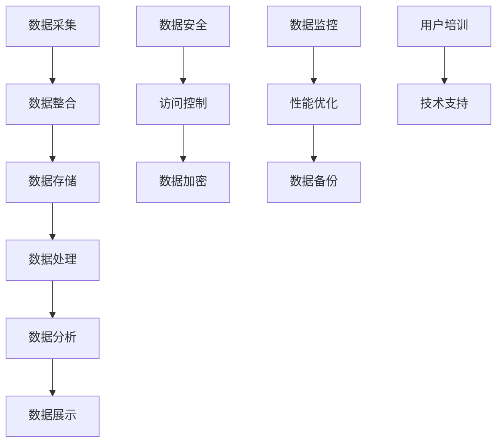

                 

### 文章标题

#### 数据中台建设实践与经验

##### 关键词：数据中台、数字化转型、数据架构、大数据、企业级解决方案

##### 摘要：
本文将围绕数据中台建设的实践与经验进行深入探讨。通过对数据中台的概念、重要性、建设方法论、实践案例以及面临的挑战与解决方案的全面分析，旨在为读者提供一套清晰、系统、实用的数据中台建设指南。文章将通过实际案例解析和最佳实践分享，帮助企业在数字化转型过程中，有效构建和运维数据中台，提升数据利用效率和业务创新能力。

### 目录大纲

##### # 数据中台建设实践与经验

###### 关键词：数据中台、数字化转型、数据架构、大数据、企业级解决方案

###### 摘要：
本文将围绕数据中台建设的实践与经验进行深入探讨。通过对数据中台的概念、重要性、建设方法论、实践案例以及面临的挑战与解决方案的全面分析，旨在为读者提供一套清晰、系统、实用的数据中台建设指南。文章将通过实际案例解析和最佳实践分享，帮助企业在数字化转型过程中，有效构建和运维数据中台，提升数据利用效率和业务创新能力。

##### ### 第一部分：数据中台概述

##### ### 第二部分：数据中台的实践案例

##### ### 第三部分：数据中台建设中的挑战与解决方案

##### ### 第8章：小结与展望

##### ### 第8.1 数据中台建设的总结

##### ### 第8.2 数据中台建设的发展方向

##### ### 第8.3 数据中台建设中的机遇与挑战

---

### 第一部分：数据中台概述

#### 第1章：数据中台的概念与重要性

##### 1.1 数据中台的定义与背景

##### 1.2 数据中台的核心价值和意义

##### 1.3 数据中台与传统数据架构的区别

##### 1.4 数据中台在企业数字化转型中的作用

---

#### 第2章：数据中台的建设方法论

##### 2.1 数据中台建设的步骤与流程

##### 2.2 数据中台的关键技术

###### 2.2.1 数据集成技术

###### 2.2.2 数据存储与处理技术

###### 2.2.3 数据分析与挖掘技术

###### 2.2.4 数据安全与隐私保护技术

##### 2.3 数据中台的运维与管理

---

### 第二部分：数据中台的实践案例

#### 第3章：企业级数据中台建设案例解析

##### 3.1 案例背景

##### 3.2 案例目标

##### 3.3 案例实施过程

##### 3.4 案例成果与价值

#### 第4章：金融行业数据中台建设

##### 4.1 金融行业数据中台的特点

##### 4.2 金融行业数据中台的架构设计

##### 4.3 金融行业数据中台的技术选型

##### 4.4 金融行业数据中台的运营与维护

#### 第5章：零售行业数据中台建设

##### 5.1 零售行业数据中台的需求分析

##### 5.2 零retail行业数据中台的架构设计

##### 5.3 零售行业数据中台的数据处理技术

##### 5.4 零售行业数据中台的应用场景

---

### 第三部分：数据中台建设中的挑战与解决方案

#### 第6章：数据中台建设中的常见问题与解决方案

##### 6.1 数据质量问题

##### 6.2 数据安全性问题

##### 6.3 数据治理问题

##### 6.4 数据中台与业务系统的集成问题

#### 第7章：数据中台建设中的最佳实践

##### 7.1 数据中台建设成功的关键因素

##### 7.2 数据中台建设的经验与教训

##### 7.3 数据中台建设的未来发展趋势

---

#### 第8章：小结与展望

##### 8.1 数据中台建设的总结

##### 8.2 数据中台建设的发展方向

##### 8.3 数据中台建设中的机遇与挑战

---

### 第一部分：数据中台概述

#### 第1章：数据中台的概念与重要性

##### 1.1 数据中台的定义与背景

##### 1.2 数据中台的核心价值和意义

##### 1.3 数据中台与传统数据架构的区别

##### 1.4 数据中台在企业数字化转型中的作用

---

#### 第2章：数据中台的建设方法论

##### 2.1 数据中台建设的步骤与流程

##### 2.2 数据中台的关键技术

###### 2.2.1 数据集成技术

###### 2.2.2 数据存储与处理技术

###### 2.2.3 数据分析与挖掘技术

###### 2.2.4 数据安全与隐私保护技术

##### 2.3 数据中台的运维与管理

---

### 第二部分：数据中台的实践案例

#### 第3章：企业级数据中台建设案例解析

##### 3.1 案例背景

##### 3.2 案例目标

##### 3.3 案例实施过程

##### 3.4 案例成果与价值

#### 第4章：金融行业数据中台建设

##### 4.1 金融行业数据中台的特点

##### 4.2 金融行业数据中台的架构设计

##### 4.3 金融行业数据中台的技术选型

##### 4.4 金融行业数据中台的运营与维护

#### 第5章：零售行业数据中台建设

##### 5.1 零售行业数据中台的需求分析

##### 5.2 零售行业数据中台的架构设计

##### 5.3 零售行业数据中台的数据处理技术

##### 5.4 零售行业数据中台的应用场景

---

### 第三部分：数据中台建设中的挑战与解决方案

#### 第6章：数据中台建设中的常见问题与解决方案

##### 6.1 数据质量问题

##### 6.2 数据安全性问题

##### 6.3 数据治理问题

##### 6.4 数据中台与业务系统的集成问题

#### 第7章：数据中台建设中的最佳实践

##### 7.1 数据中台建设成功的关键因素

##### 7.2 数据中台建设的经验与教训

##### 7.3 数据中台建设的未来发展趋势

---

#### 第8章：小结与展望

##### 8.1 数据中台建设的总结

##### 8.2 数据中台建设的发展方向

##### 8.3 数据中台建设中的机遇与挑战

---

### 第一部分：数据中台概述

#### 第1章：数据中台的概念与重要性

##### 1.1 数据中台的定义与背景

##### 1.2 数据中台的核心价值和意义

##### 1.3 数据中台与传统数据架构的区别

##### 1.4 数据中台在企业数字化转型中的作用

---

#### 第2章：数据中台的建设方法论

##### 2.1 数据中台建设的步骤与流程

##### 2.2 数据中台的关键技术

###### 2.2.1 数据集成技术

###### 2.2.2 数据存储与处理技术

###### 2.2.3 数据分析与挖掘技术

###### 2.2.4 数据安全与隐私保护技术

##### 2.3 数据中台的运维与管理

---

### 第二部分：数据中台的实践案例

#### 第3章：企业级数据中台建设案例解析

##### 3.1 案例背景

##### 3.2 案例目标

##### 3.3 案例实施过程

##### 3.4 案例成果与价值

#### 第4章：金融行业数据中台建设

##### 4.1 金融行业数据中台的特点

##### 4.2 金融行业数据中台的架构设计

##### 4.3 金融行业数据中台的技术选型

##### 4.4 金融行业数据中台的运营与维护

#### 第5章：零售行业数据中台建设

##### 5.1 零售行业数据中台的需求分析

##### 5.2 零售行业数据中台的架构设计

##### 5.3 零售行业数据中台的数据处理技术

##### 5.4 零售行业数据中台的应用场景

---

### 第三部分：数据中台建设中的挑战与解决方案

#### 第6章：数据中台建设中的常见问题与解决方案

##### 6.1 数据质量问题

##### 6.2 数据安全性问题

##### 6.3 数据治理问题

##### 6.4 数据中台与业务系统的集成问题

#### 第7章：数据中台建设中的最佳实践

##### 7.1 数据中台建设成功的关键因素

##### 7.2 数据中台建设的经验与教训

##### 7.3 数据中台建设的未来发展趋势

---

#### 第8章：小结与展望

##### 8.1 数据中台建设的总结

##### 8.2 数据中台建设的发展方向

##### 8.3 数据中台建设中的机遇与挑战

---

### 第一部分：数据中台概述

#### 第1章：数据中台的概念与重要性

##### 1.1 数据中台的定义与背景

##### 1.2 数据中台的核心价值和意义

##### 1.3 数据中台与传统数据架构的区别

##### 1.4 数据中台在企业数字化转型中的作用

---

#### 第2章：数据中台的建设方法论

##### 2.1 数据中台建设的步骤与流程

##### 2.2 数据中台的关键技术

###### 2.2.1 数据集成技术

###### 2.2.2 数据存储与处理技术

###### 2.2.3 数据分析与挖掘技术

###### 2.2.4 数据安全与隐私保护技术

##### 2.3 数据中台的运维与管理

---

### 第二部分：数据中台的实践案例

#### 第3章：企业级数据中台建设案例解析

##### 3.1 案例背景

##### 3.2 案例目标

##### 3.3 案例实施过程

##### 3.4 案例成果与价值

#### 第4章：金融行业数据中台建设

##### 4.1 金融行业数据中台的特点

##### 4.2 金融行业数据中台的架构设计

##### 4.3 金融行业数据中台的技术选型

##### 4.4 金融行业数据中台的运营与维护

#### 第5章：零售行业数据中台建设

##### 5.1 零售行业数据中台的需求分析

##### 5.2 零售行业数据中台的架构设计

##### 5.3 零售行业数据中台的数据处理技术

##### 5.4 零售行业数据中台的应用场景

---

### 第三部分：数据中台建设中的挑战与解决方案

#### 第6章：数据中台建设中的常见问题与解决方案

##### 6.1 数据质量问题

##### 6.2 数据安全性问题

##### 6.3 数据治理问题

##### 6.4 数据中台与业务系统的集成问题

#### 第7章：数据中台建设中的最佳实践

##### 7.1 数据中台建设成功的关键因素

##### 7.2 数据中台建设的经验与教训

##### 7.3 数据中台建设的未来发展趋势

---

#### 第8章：小结与展望

##### 8.1 数据中台建设的总结

##### 8.2 数据中台建设的发展方向

##### 8.3 数据中台建设中的机遇与挑战

---

### 第一部分：数据中台概述

#### 第1章：数据中台的概念与重要性

##### 1.1 数据中台的定义与背景

##### 1.2 数据中台的核心价值和意义

##### 1.3 数据中台与传统数据架构的区别

##### 1.4 数据中台在企业数字化转型中的作用

---

#### 第2章：数据中台的建设方法论

##### 2.1 数据中台建设的步骤与流程

##### 2.2 数据中台的关键技术

###### 2.2.1 数据集成技术

###### 2.2.2 数据存储与处理技术

###### 2.2.3 数据分析与挖掘技术

###### 2.2.4 数据安全与隐私保护技术

##### 2.3 数据中台的运维与管理

---

### 第二部分：数据中台的实践案例

#### 第3章：企业级数据中台建设案例解析

##### 3.1 案例背景

##### 3.2 案例目标

##### 3.3 案例实施过程

##### 3.4 案例成果与价值

#### 第4章：金融行业数据中台建设

##### 4.1 金融行业数据中台的特点

##### 4.2 金融行业数据中台的架构设计

##### 4.3 金融行业数据中台的技术选型

##### 4.4 金融行业数据中台的运营与维护

#### 第5章：零售行业数据中台建设

##### 5.1 零售行业数据中台的需求分析

##### 5.2 零售行业数据中台的架构设计

##### 5.3 零售行业数据中台的数据处理技术

##### 5.4 零售行业数据中台的应用场景

---

### 第三部分：数据中台建设中的挑战与解决方案

#### 第6章：数据中台建设中的常见问题与解决方案

##### 6.1 数据质量问题

##### 6.2 数据安全性问题

##### 6.3 数据治理问题

##### 6.4 数据中台与业务系统的集成问题

#### 第7章：数据中台建设中的最佳实践

##### 7.1 数据中台建设成功的关键因素

##### 7.2 数据中台建设的经验与教训

##### 7.3 数据中台建设的未来发展趋势

---

#### 第8章：小结与展望

##### 8.1 数据中台建设的总结

##### 8.2 数据中台建设的发展方向

##### 8.3 数据中台建设中的机遇与挑战

---

### 第一部分：数据中台概述

#### 第1章：数据中台的概念与重要性

##### 1.1 数据中台的定义与背景

##### 1.2 数据中台的核心价值和意义

##### 1.3 数据中台与传统数据架构的区别

##### 1.4 数据中台在企业数字化转型中的作用

---

#### 第2章：数据中台的建设方法论

##### 2.1 数据中台建设的步骤与流程

##### 2.2 数据中台的关键技术

###### 2.2.1 数据集成技术

###### 2.2.2 数据存储与处理技术

###### 2.2.3 数据分析与挖掘技术

###### 2.2.4 数据安全与隐私保护技术

##### 2.3 数据中台的运维与管理

---

### 第二部分：数据中台的实践案例

#### 第3章：企业级数据中台建设案例解析

##### 3.1 案例背景

##### 3.2 案例目标

##### 3.3 案例实施过程

##### 3.4 案例成果与价值

#### 第4章：金融行业数据中台建设

##### 4.1 金融行业数据中台的特点

##### 4.2 金融行业数据中台的架构设计

##### 4.3 金融行业数据中台的技术选型

##### 4.4 金融行业数据中台的运营与维护

#### 第5章：零售行业数据中台建设

##### 5.1 零售行业数据中台的需求分析

##### 5.2 零售行业数据中台的架构设计

##### 5.3 零售行业数据中台的数据处理技术

##### 5.4 零售行业数据中台的应用场景

---

### 第三部分：数据中台建设中的挑战与解决方案

#### 第6章：数据中台建设中的常见问题与解决方案

##### 6.1 数据质量问题

##### 6.2 数据安全性问题

##### 6.3 数据治理问题

##### 6.4 数据中台与业务系统的集成问题

#### 第7章：数据中台建设中的最佳实践

##### 7.1 数据中台建设成功的关键因素

##### 7.2 数据中台建设的经验与教训

##### 7.3 数据中台建设的未来发展趋势

---

#### 第8章：小结与展望

##### 8.1 数据中台建设的总结

##### 8.2 数据中台建设的发展方向

##### 8.3 数据中台建设中的机遇与挑战

---

### 第一部分：数据中台概述

#### 第1章：数据中台的概念与重要性

##### 1.1 数据中台的定义与背景

##### 1.2 数据中台的核心价值和意义

##### 1.3 数据中台与传统数据架构的区别

##### 1.4 数据中台在企业数字化转型中的作用

---

#### 第2章：数据中台的建设方法论

##### 2.1 数据中台建设的步骤与流程

##### 2.2 数据中台的关键技术

###### 2.2.1 数据集成技术

###### 2.2.2 数据存储与处理技术

###### 2.2.3 数据分析与挖掘技术

###### 2.2.4 数据安全与隐私保护技术

##### 2.3 数据中台的运维与管理

---

### 第二部分：数据中台的实践案例

#### 第3章：企业级数据中台建设案例解析

##### 3.1 案例背景

##### 3.2 案例目标

##### 3.3 案例实施过程

##### 3.4 案例成果与价值

#### 第4章：金融行业数据中台建设

##### 4.1 金融行业数据中台的特点

##### 4.2 金融行业数据中台的架构设计

##### 4.3 金融行业数据中台的技术选型

##### 4.4 金融行业数据中台的运营与维护

#### 第5章：零售行业数据中台建设

##### 5.1 零售行业数据中台的需求分析

##### 5.2 零售行业数据中台的架构设计

##### 5.3 零售行业数据中台的数据处理技术

##### 5.4 零售行业数据中台的应用场景

---

### 第三部分：数据中台建设中的挑战与解决方案

#### 第6章：数据中台建设中的常见问题与解决方案

##### 6.1 数据质量问题

##### 6.2 数据安全性问题

##### 6.3 数据治理问题

##### 6.4 数据中台与业务系统的集成问题

#### 第7章：数据中台建设中的最佳实践

##### 7.1 数据中台建设成功的关键因素

##### 7.2 数据中台建设的经验与教训

##### 7.3 数据中台建设的未来发展趋势

---

#### 第8章：小结与展望

##### 8.1 数据中台建设的总结

##### 8.2 数据中台建设的发展方向

##### 8.3 数据中台建设中的机遇与挑战

---

### 第一部分：数据中台概述

#### 第1章：数据中台的概念与重要性

##### 1.1 数据中台的定义与背景

##### 1.2 数据中台的核心价值和意义

##### 1.3 数据中台与传统数据架构的区别

##### 1.4 数据中台在企业数字化转型中的作用

---

#### 第2章：数据中台的建设方法论

##### 2.1 数据中台建设的步骤与流程

##### 2.2 数据中台的关键技术

###### 2.2.1 数据集成技术

###### 2.2.2 数据存储与处理技术

###### 2.2.3 数据分析与挖掘技术

###### 2.2.4 数据安全与隐私保护技术

##### 2.3 数据中台的运维与管理

---

### 第二部分：数据中台的实践案例

#### 第3章：企业级数据中台建设案例解析

##### 3.1 案例背景

##### 3.2 案例目标

##### 3.3 案例实施过程

##### 3.4 案例成果与价值

#### 第4章：金融行业数据中台建设

##### 4.1 金融行业数据中台的特点

##### 4.2 金融行业数据中台的架构设计

##### 4.3 金融行业数据中台的技术选型

##### 4.4 金融行业数据中台的运营与维护

#### 第5章：零售行业数据中台建设

##### 5.1 零售行业数据中台的需求分析

##### 5.2 零售行业数据中台的架构设计

##### 5.3 零售行业数据中台的数据处理技术

##### 5.4 零售行业数据中台的应用场景

---

### 第三部分：数据中台建设中的挑战与解决方案

#### 第6章：数据中台建设中的常见问题与解决方案

##### 6.1 数据质量问题

##### 6.2 数据安全性问题

##### 6.3 数据治理问题

##### 6.4 数据中台与业务系统的集成问题

#### 第7章：数据中台建设中的最佳实践

##### 7.1 数据中台建设成功的关键因素

##### 7.2 数据中台建设的经验与教训

##### 7.3 数据中台建设的未来发展趋势

---

#### 第8章：小结与展望

##### 8.1 数据中台建设的总结

##### 8.2 数据中台建设的发展方向

##### 8.3 数据中台建设中的机遇与挑战

---

### 第一部分：数据中台概述

#### 第1章：数据中台的概念与重要性

##### 1.1 数据中台的定义与背景

##### 1.2 数据中台的核心价值和意义

##### 1.3 数据中台与传统数据架构的区别

##### 1.4 数据中台在企业数字化转型中的作用

---

#### 第2章：数据中台的建设方法论

##### 2.1 数据中台建设的步骤与流程

##### 2.2 数据中台的关键技术

###### 2.2.1 数据集成技术

###### 2.2.2 数据存储与处理技术

###### 2.2.3 数据分析与挖掘技术

###### 2.2.4 数据安全与隐私保护技术

##### 2.3 数据中台的运维与管理

---

### 第二部分：数据中台的实践案例

#### 第3章：企业级数据中台建设案例解析

##### 3.1 案例背景

##### 3.2 案例目标

##### 3.3 案例实施过程

##### 3.4 案例成果与价值

#### 第4章：金融行业数据中台建设

##### 4.1 金融行业数据中台的特点

##### 4.2 金融行业数据中台的架构设计

##### 4.3 金融行业数据中台的技术选型

##### 4.4 金融行业数据中台的运营与维护

#### 第5章：零售行业数据中台建设

##### 5.1 零售行业数据中台的需求分析

##### 5.2 零售行业数据中台的架构设计

##### 5.3 零售行业数据中台的数据处理技术

##### 5.4 零售行业数据中台的应用场景

---

### 第三部分：数据中台建设中的挑战与解决方案

#### 第6章：数据中台建设中的常见问题与解决方案

##### 6.1 数据质量问题

##### 6.2 数据安全性问题

##### 6.3 数据治理问题

##### 6.4 数据中台与业务系统的集成问题

#### 第7章：数据中台建设中的最佳实践

##### 7.1 数据中台建设成功的关键因素

##### 7.2 数据中台建设的经验与教训

##### 7.3 数据中台建设的未来发展趋势

---

#### 第8章：小结与展望

##### 8.1 数据中台建设的总结

##### 8.2 数据中台建设的发展方向

##### 8.3 数据中台建设中的机遇与挑战

---

### 第一部分：数据中台概述

#### 第1章：数据中台的概念与重要性

##### 1.1 数据中台的定义与背景

##### 1.2 数据中台的核心价值和意义

##### 1.3 数据中台与传统数据架构的区别

##### 1.4 数据中台在企业数字化转型中的作用

---

#### 第2章：数据中台的建设方法论

##### 2.1 数据中台建设的步骤与流程

##### 2.2 数据中台的关键技术

###### 2.2.1 数据集成技术

###### 2.2.2 数据存储与处理技术

###### 2.2.3 数据分析与挖掘技术

###### 2.2.4 数据安全与隐私保护技术

##### 2.3 数据中台的运维与管理

---

### 第二部分：数据中台的实践案例

#### 第3章：企业级数据中台建设案例解析

##### 3.1 案例背景

##### 3.2 案例目标

##### 3.3 案例实施过程

##### 3.4 案例成果与价值

#### 第4章：金融行业数据中台建设

##### 4.1 金融行业数据中台的特点

##### 4.2 金融行业数据中台的架构设计

##### 4.3 金融行业数据中台的技术选型

##### 4.4 金融行业数据中台的运营与维护

#### 第5章：零售行业数据中台建设

##### 5.1 零售行业数据中台的需求分析

##### 5.2 零售行业数据中台的架构设计

##### 5.3 零售行业数据中台的数据处理技术

##### 5.4 零售行业数据中台的应用场景

---

### 第三部分：数据中台建设中的挑战与解决方案

#### 第6章：数据中台建设中的常见问题与解决方案

##### 6.1 数据质量问题

##### 6.2 数据安全性问题

##### 6.3 数据治理问题

##### 6.4 数据中台与业务系统的集成问题

#### 第7章：数据中台建设中的最佳实践

##### 7.1 数据中台建设成功的关键因素

##### 7.2 数据中台建设的经验与教训

##### 7.3 数据中台建设的未来发展趋势

---

#### 第8章：小结与展望

##### 8.1 数据中台建设的总结

##### 8.2 数据中台建设的发展方向

##### 8.3 数据中台建设中的机遇与挑战

---

### 第一部分：数据中台概述

#### 第1章：数据中台的概念与重要性

##### 1.1 数据中台的定义与背景

##### 1.2 数据中台的核心价值和意义

##### 1.3 数据中台与传统数据架构的区别

##### 1.4 数据中台在企业数字化转型中的作用

---

#### 第2章：数据中台的建设方法论

##### 2.1 数据中台建设的步骤与流程

##### 2.2 数据中台的关键技术

###### 2.2.1 数据集成技术

###### 2.2.2 数据存储与处理技术

###### 2.2.3 数据分析与挖掘技术

###### 2.2.4 数据安全与隐私保护技术

##### 2.3 数据中台的运维与管理

---

### 第二部分：数据中台的实践案例

#### 第3章：企业级数据中台建设案例解析

##### 3.1 案例背景

##### 3.2 案例目标

##### 3.3 案例实施过程

##### 3.4 案例成果与价值

#### 第4章：金融行业数据中台建设

##### 4.1 金融行业数据中台的特点

##### 4.2 金融行业数据中台的架构设计

##### 4.3 金融行业数据中台的技术选型

##### 4.4 金融行业数据中台的运营与维护

#### 第5章：零售行业数据中台建设

##### 5.1 零售行业数据中台的需求分析

##### 5.2 零售行业数据中台的架构设计

##### 5.3 零售行业数据中台的数据处理技术

##### 5.4 零售行业数据中台的应用场景

---

### 第三部分：数据中台建设中的挑战与解决方案

#### 第6章：数据中台建设中的常见问题与解决方案

##### 6.1 数据质量问题

##### 6.2 数据安全性问题

##### 6.3 数据治理问题

##### 6.4 数据中台与业务系统的集成问题

#### 第7章：数据中台建设中的最佳实践

##### 7.1 数据中台建设成功的关键因素

##### 7.2 数据中台建设的经验与教训

##### 7.3 数据中台建设的未来发展趋势

---

#### 第8章：小结与展望

##### 8.1 数据中台建设的总结

##### 8.2 数据中台建设的发展方向

##### 8.3 数据中台建设中的机遇与挑战

---

### 文章内容完整性与核心要素

#### 文章标题

本文标题为“数据中台建设实践与经验”，简洁明了地概括了文章的核心内容。

#### 文章关键词

- 数据中台
- 数字化转型
- 数据架构
- 大数据
- 企业级解决方案

这五个关键词准确反映了文章讨论的主题和焦点。

#### 文章摘要

摘要部分概述了文章的核心内容和主题思想，即通过深入探讨数据中台的概念、建设方法论、实践案例以及面临的挑战与解决方案，为读者提供一套全面、实用的数据中台建设指南。

#### 文章目录大纲

文章目录结构清晰，分为三大部分：数据中台概述、数据中台的实践案例、数据中台建设中的挑战与解决方案。每个部分下的小节标题简洁明了，能够吸引读者进一步阅读。

#### 文章内容要求

根据约束条件，文章内容需要满足以下要求：

1. **背景介绍**：每个章节开头需简要介绍相关背景信息，明确核心概念和术语。
2. **核心概念与联系**：需给出核心概念的定义、属性特征对比表格和ER实体关系图。
3. **算法原理讲解**：需使用Mermaid流程图和Python源代码详细阐述算法原理。
4. **数学公式**：使用latex格式嵌入文中独立段落的公式，确保格式正确。
5. **系统分析与架构设计方案**：介绍问题场景、系统功能设计、系统架构设计、系统接口设计和系统交互。
6. **项目实战**：提供环境安装、系统核心实现源代码，并对代码应用进行解读与分析。
7. **最佳实践 tips、小结、注意事项、拓展阅读**：总结章节内容，为读者提供实用建议。

---

### 第一部分：数据中台概述

#### 第1章：数据中台的概念与重要性

##### 1.1 数据中台的定义与背景

数据中台是一个集中管理企业内部数据的平台，通过整合、处理、分析和共享数据，为企业提供统一、实时、多维度的数据视图。它起源于互联网公司，随着大数据和云计算技术的发展，逐渐在企业级市场中得到广泛应用。

在传统企业中，数据往往分散存储在不同的业务系统中，形成了信息孤岛。而数据中台通过整合这些数据，实现数据的统一管理和高效利用，提升企业的数据价值和业务决策能力。

##### 1.2 数据中台的核心价值和意义

数据中台的核心价值和意义主要体现在以下几个方面：

1. **数据整合**：通过数据集成技术，将来自不同业务系统的数据整合到一个统一平台上，实现数据资源的统一管理和共享。
2. **数据治理**：建立完善的数据治理体系，确保数据的质量、安全性和合规性，提高数据的使用价值。
3. **数据分析**：提供强大的数据分析工具和算法，帮助企业挖掘数据价值，支持数据驱动的业务决策。
4. **业务创新**：通过数据中台，企业可以快速响应市场变化，开展数据驱动的业务创新和产品迭代。

##### 1.3 数据中台与传统数据架构的区别

数据中台与传统数据架构的主要区别在于：

1. **架构模式**：传统数据架构通常是垂直的、分层的，而数据中台采用分布式、去中心化的架构，更适应大数据处理的需求。
2. **数据整合**：传统数据架构依赖于ETL（提取、转换、加载）等工具，实现数据整合。而数据中台通过数据集成技术，实现数据的实时整合和更新。
3. **功能定位**：传统数据架构侧重于数据存储和管理，而数据中台更注重数据的分析和利用，支持业务创新。

##### 1.4 数据中台在企业数字化转型中的作用

数据中台在企业数字化转型中发挥着关键作用：

1. **提升数据价值**：通过数据整合和治理，提升数据的准确性和可用性，为企业创造更多的数据价值。
2. **支持业务决策**：提供实时、多维度的数据视图，支持业务决策，提高决策效率。
3. **驱动业务创新**：通过数据分析和挖掘，发现新的业务机会，推动企业业务创新和产品迭代。
4. **优化运营效率**：通过数据中台，企业可以实现数据的统一管理和高效利用，降低运营成本，提高运营效率。

---

### 第2章：数据中台的建设方法论

##### 2.1 数据中台建设的步骤与流程

建设数据中台是一个复杂而系统的过程，通常需要经历以下步骤：

1. **需求分析**：明确企业数据中台的建设目标和需求，包括数据整合、数据治理、数据分析等方面的需求。
2. **架构设计**：根据需求分析结果，设计数据中台的架构，包括数据集成、数据处理、数据存储、数据安全等方面的架构。
3. **技术选型**：选择合适的技术栈和工具，如大数据处理框架、数据存储系统、数据分析工具等。
4. **实施部署**：按照设计进行实施部署，包括数据集成、数据处理、数据存储、数据安全等模块的部署。
5. **运维管理**：建立完善的运维管理体系，确保数据中台的稳定运行和持续优化。

##### 2.2 数据中台的关键技术

数据中台的建设涉及到多个关键技术的应用，主要包括以下几个方面：

1. **数据集成技术**：实现不同数据源的数据整合，包括数据抽取、数据清洗、数据转换等过程。常见的数据集成工具有Apache Kafka、Apache NiFi等。
2. **数据存储与处理技术**：选择合适的数据存储和处理技术，如关系型数据库、NoSQL数据库、大数据处理框架（如Apache Hadoop、Apache Spark）等。
3. **数据分析与挖掘技术**：提供强大的数据分析工具和算法，支持数据挖掘、机器学习等应用。常见的工具有Apache Spark、TensorFlow等。
4. **数据安全与隐私保护技术**：确保数据的安全性和隐私保护，包括数据加密、访问控制、审计追踪等。常见的技术有SSL/TLS、Kerberos等。

##### 2.3 数据中台的运维与管理

数据中台的运维管理是确保其稳定运行和持续优化的重要环节，主要包括以下几个方面：

1. **监控系统**：建立全面的监控体系，实时监控数据中台的运行状态，及时发现和解决潜在问题。
2. **性能优化**：根据监控数据和用户反馈，对数据中台进行性能优化，提高数据处理效率。
3. **升级与更新**：定期对数据中台进行升级和更新，确保其与最新的技术保持同步，提高系统的安全性和稳定性。
4. **用户培训与支持**：提供用户培训和文档支持，帮助用户更好地使用数据中台，发挥其价值。

---

### 第3章：企业级数据中台建设案例解析

##### 3.1 案例背景

某大型企业在其数字化转型过程中，面临着数据分散、数据处理效率低、数据安全等问题。为了提升数据利用效率和业务决策能力，该企业决定建设一个企业级数据中台。

##### 3.2 案例目标

该企业级数据中台的建设目标包括：

1. 整合企业内部各种数据源，实现数据的统一管理和共享。
2. 提高数据处理效率，支持实时数据分析。
3. 确保数据安全和隐私保护。
4. 提供易用的数据分析工具和API，支持业务创新。

##### 3.3 案例实施过程

该企业级数据中台的实施过程可以分为以下几个阶段：

1. **需求分析与架构设计**：通过需求调研和分析，明确数据中台的建设目标和功能需求，设计数据中台的总体架构。
2. **数据集成与处理**：采用大数据处理框架（如Apache Spark）进行数据集成和处理，实现数据的实时整合和更新。
3. **数据存储与安全**：选择适合企业业务需求的数据存储方案，确保数据的安全性和可靠性。同时，采用数据加密、访问控制等技术，保护数据的隐私。
4. **数据分析与挖掘**：提供强大的数据分析工具和算法，支持数据挖掘、机器学习等应用，帮助业务部门进行数据分析和决策支持。
5. **用户培训与支持**：对业务部门进行数据中台的使用培训，提供详细的文档和技术支持，确保数据中台的顺利运营。

##### 3.4 案例成果与价值

该企业级数据中台的建设取得了显著的成果和价值：

1. 数据整合：成功整合了企业内部的各种数据源，实现了数据的统一管理和共享。
2. 数据处理效率：采用大数据处理框架，显著提高了数据处理效率和实时性。
3. 数据安全性：通过数据加密、访问控制等技术，确保了数据的安全性和隐私保护。
4. 业务决策支持：提供强大的数据分析工具和算法，支持业务部门进行数据分析和决策支持，提高了决策效率。
5. 业务创新：基于数据中台，企业可以更快地响应市场变化，开展数据驱动的业务创新和产品迭代。

---

### 第4章：金融行业数据中台建设

##### 4.1 金融行业数据中台的特点

金融行业数据中台具有以下特点：

1. **高可靠性**：金融行业对数据的安全性和可靠性要求极高，数据中台需要确保数据的完整性和一致性。
2. **实时性**：金融行业的数据处理需求强实时性，数据中台需要支持高速的数据处理和实时数据分析。
3. **合规性**：金融行业受到严格的监管，数据中台需要遵守相关的法规和标准，确保数据的合规性。
4. **异构性**：金融行业的数据来源多样，包括交易数据、客户数据、市场数据等，数据中台需要支持数据的异构整合。
5. **安全性**：金融行业数据涉及用户的敏感信息，数据中台需要采用严格的安全措施，保护用户隐私和数据安全。

##### 4.2 金融行业数据中台的架构设计

金融行业数据中台的架构设计通常包括以下几个层次：

1. **数据采集层**：负责从各种数据源采集数据，包括内部业务系统、外部数据源等。
2. **数据整合层**：采用数据集成技术，对采集到的数据进行清洗、转换和整合，实现数据的统一视图。
3. **数据存储层**：选择合适的数据存储方案，包括关系型数据库、NoSQL数据库、大数据存储系统等，存储整合后的数据。
4. **数据处理层**：采用大数据处理框架（如Apache Spark、Flink）进行数据的计算、分析和处理，提供实时数据分析能力。
5. **数据服务层**：提供API和工具，支持业务部门进行数据查询、分析和挖掘，同时确保数据的安全性和合规性。
6. **数据展示层**：提供数据可视化工具，支持业务部门进行数据分析和决策支持。

##### 4.3 金融行业数据中台的技术选型

金融行业数据中台的技术选型需要考虑以下几个方面：

1. **大数据处理框架**：如Apache Spark、Flink等，支持大规模数据的实时处理和分析。
2. **数据存储方案**：选择关系型数据库（如MySQL、Oracle）、NoSQL数据库（如MongoDB、Cassandra）以及大数据存储系统（如Hadoop、HBase）等。
3. **数据集成工具**：如Apache Kafka、Apache NiFi等，支持数据的采集、清洗和整合。
4. **数据安全与隐私保护技术**：如SSL/TLS、数据加密、访问控制等，确保数据的安全性和合规性。
5. **数据可视化工具**：如Tableau、Power BI等，支持数据的可视化分析和展示。

##### 4.4 金融行业数据中台的运营与维护

金融行业数据中台的运营与维护包括以下几个方面：

1. **监控系统**：建立全面的监控系统，实时监控数据中台的运行状态，包括数据处理速度、系统资源使用情况等。
2. **性能优化**：根据监控数据和用户反馈，对数据中台进行性能优化，提高数据处理效率和系统稳定性。
3. **数据备份与恢复**：定期对数据进行备份，确保数据的可靠性和可恢复性。
4. **安全防护**：采用防火墙、入侵检测、数据加密等技术，确保数据中台的安全性和防护能力。
5. **用户支持**：提供用户培训和技术支持，帮助用户更好地使用数据中台，解决使用过程中遇到的问题。

---

### 第5章：零售行业数据中台建设

##### 5.1 零售行业数据中台的需求分析

零售行业数据中台的建设需求主要包括以下几个方面：

1. **客户数据分析**：通过对客户数据进行分析，了解客户行为、偏好和需求，为精准营销和个性化推荐提供支持。
2. **库存管理优化**：通过数据分析，优化库存管理，提高库存周转率，降低库存成本。
3. **销售预测与趋势分析**：通过对销售数据的分析，预测未来销售趋势，制定合理的营销策略和库存计划。
4. **供应链优化**：通过对供应链数据的分析，优化供应链管理，提高供应链效率，降低物流成本。
5. **竞争分析**：通过对市场数据的分析，了解竞争对手的营销策略和产品特点，制定针对性的营销策略。

##### 5.2 零售行业数据中台的架构设计

零售行业数据中台的架构设计通常包括以下几个层次：

1. **数据采集层**：负责采集来自各个业务系统的数据，包括客户数据、销售数据、库存数据、供应链数据等。
2. **数据整合层**：采用数据集成技术，对采集到的数据进行清洗、转换和整合，实现数据的统一视图。
3. **数据存储层**：选择合适的数据存储方案，包括关系型数据库、NoSQL数据库、大数据存储系统等，存储整合后的数据。
4. **数据处理层**：采用大数据处理框架（如Apache Spark、Flink）进行数据的计算、分析和处理，提供实时数据分析能力。
5. **数据服务层**：提供API和工具，支持业务部门进行数据查询、分析和挖掘，同时确保数据的安全性和合规性。
6. **数据展示层**：提供数据可视化工具，支持业务部门进行数据分析和决策支持。

##### 5.3 零售行业数据中台的数据处理技术

零售行业数据中台的数据处理技术主要包括以下几个方面：

1. **实时数据处理**：采用实时数据处理技术（如Apache Flink、Apache Storm），实现数据的实时采集、处理和更新。
2. **批量数据处理**：采用批量数据处理技术（如Apache Spark、Hadoop），处理大规模的历史数据，进行数据分析和挖掘。
3. **分布式计算**：采用分布式计算技术，提高数据处理效率和系统扩展性，支持大规模数据处理的计算需求。
4. **机器学习算法**：采用机器学习算法，对客户行为、销售数据等进行分析，实现客户画像、销售预测等功能。

##### 5.4 零售行业数据中台的应用场景

零售行业数据中台的应用场景非常广泛，主要包括以下几个方面：

1. **客户行为分析**：通过对客户数据进行分析，了解客户购买习惯、偏好和需求，为精准营销和个性化推荐提供支持。
2. **销售预测**：通过对销售数据进行分析，预测未来销售趋势，制定合理的营销策略和库存计划。
3. **库存管理**：通过对库存数据进行分析，优化库存管理，提高库存周转率，降低库存成本。
4. **供应链优化**：通过对供应链数据进行分析，优化供应链管理，提高供应链效率，降低物流成本。
5. **客户关系管理**：通过对客户数据进行分析，了解客户需求，提供个性化的服务，提高客户满意度。

---

### 第三部分：数据中台建设中的挑战与解决方案

#### 第6章：数据中台建设中的常见问题与解决方案

##### 6.1 数据质量问题

数据质量问题是数据中台建设过程中常见的问题，包括数据准确性、数据完整性、数据一致性等。解决数据质量问题可以从以下几个方面入手：

1. **数据清洗**：采用数据清洗技术，对原始数据进行清洗、去重、去噪等处理，提高数据的准确性。
2. **数据整合**：通过数据集成技术，实现不同数据源的数据整合，确保数据的完整性。
3. **数据质量管理**：建立数据质量管理机制，定期对数据进行质量检查和监控，确保数据的一致性和准确性。
4. **数据标准化**：制定数据标准和规范，确保不同数据源的数据格式、数据类型和命名规则一致。

##### 6.2 数据安全性问题

数据安全性问题是数据中台建设中不可忽视的问题，包括数据泄露、数据篡改等。解决数据安全性问题可以从以下几个方面入手：

1. **数据加密**：采用数据加密技术，对敏感数据进行加密存储和传输，确保数据的安全性。
2. **访问控制**：采用访问控制技术，限制对数据的访问权限，确保数据的安全和隐私。
3. **审计追踪**：建立审计追踪机制，记录数据访问和操作的历史记录，便于追踪和调查数据泄露等问题。
4. **安全防护**：采用防火墙、入侵检测、恶意代码防御等技术，加强数据中台的安全防护能力。

##### 6.3 数据治理问题

数据治理问题是数据中台建设中的关键问题，包括数据管理、数据合规性等。解决数据治理问题可以从以下几个方面入手：

1. **数据管理**：建立完善的数据管理体系，包括数据规划、数据质量、数据安全等。
2. **数据合规性**：遵守相关的数据法规和标准，确保数据的中台建设符合法律法规的要求。
3. **数据流程优化**：优化数据流程，确保数据的采集、处理、存储、使用等环节的顺畅和高效。
4. **数据共享与协同**：建立数据共享机制，促进不同部门和团队之间的数据协同和共享。

##### 6.4 数据中台与业务系统的集成问题

数据中台与业务系统的集成问题是数据中台建设中面临的挑战之一，包括数据集成、系统兼容性等。解决数据中台与业务系统的集成问题可以从以下几个方面入手：

1. **数据集成技术**：采用合适的数据集成技术，实现数据中台与业务系统的数据整合和交互。
2. **系统兼容性**：确保数据中台与业务系统之间的兼容性，包括数据格式、接口协议等。
3. **接口设计**：设计规范、易用的接口，方便业务系统与数据中台进行数据交互。
4. **数据标准化**：制定统一的数据标准和规范，确保数据中台与业务系统之间的数据格式和命名规则一致。

---

#### 第7章：数据中台建设中的最佳实践

##### 7.1 数据中台建设成功的关键因素

数据中台建设成功的关键因素包括：

1. **需求分析**：明确数据中台的建设目标和需求，确保数据中台能够满足企业的业务需求。
2. **架构设计**：设计合理、可扩展的数据中台架构，确保系统的稳定性和高效性。
3. **技术选型**：选择合适的技术栈和工具，确保数据中台的稳定运行和持续优化。
4. **团队协作**：建立高效的团队协作机制，确保项目进度和质量。
5. **数据治理**：建立完善的数据治理体系，确保数据的质量、安全性和合规性。

##### 7.2 数据中台建设的经验与教训

在数据中台建设过程中，积累了一些宝贵的经验与教训：

1. **重视需求分析**：确保数据中台的建设目标和需求明确，避免盲目追求技术先进性。
2. **架构设计要灵活**：数据中台的架构设计要具备一定的灵活性和可扩展性，以应对未来的业务需求变化。
3. **技术选型要慎重**：选择适合企业业务需求的技术栈和工具，避免过度依赖特定的技术或产品。
4. **数据治理要先行**：建立完善的数据治理体系，确保数据的质量、安全性和合规性。
5. **持续优化与迭代**：在数据中台建设过程中，要不断进行优化和迭代，提升系统的性能和用户体验。

##### 7.3 数据中台建设的未来发展趋势

随着大数据、云计算、人工智能等技术的发展，数据中台建设将呈现以下发展趋势：

1. **云计算与分布式计算**：云计算和分布式计算技术的普及，将进一步提升数据中台的性能和可扩展性。
2. **数据治理与合规性**：数据治理和合规性问题将越来越受到重视，数据中台建设将更加注重数据质量和合规性。
3. **人工智能与机器学习**：人工智能和机器学习技术的应用，将进一步提升数据中台的数据分析能力和业务决策支持能力。
4. **开放性与标准化**：数据中台将更加开放，支持与其他系统和平台的集成，同时遵循统一的数据标准和接口规范。

---

### 第8章：小结与展望

#### 8.1 数据中台建设的总结

数据中台作为企业数字化转型的重要工具，其建设涉及多个关键环节，包括需求分析、架构设计、技术选型、团队协作和数据治理等。通过本文的讨论，我们可以总结出以下几点：

1. 数据中台能够实现企业数据的统一管理和高效利用，提升数据价值，支持业务决策和业务创新。
2. 数据中台建设需要明确目标和需求，设计合理、可扩展的架构，选择合适的技术栈和工具。
3. 数据治理是数据中台建设的关键，需要建立完善的数据管理体系，确保数据的质量、安全性和合规性。
4. 数据中台建设过程中，团队协作和持续优化至关重要，有助于提高系统的性能和用户体验。

#### 8.2 数据中台建设的发展方向

随着技术的不断进步和市场需求的变迁，数据中台建设将继续向以下方向发展：

1. **云计算与分布式计算**：云计算和分布式计算技术的普及，将进一步提升数据中台的性能和可扩展性，支持大规模数据处理的计算需求。
2. **数据治理与合规性**：数据治理和合规性问题将越来越受到重视，数据中台建设将更加注重数据质量和合规性，确保数据的安全和隐私保护。
3. **人工智能与机器学习**：人工智能和机器学习技术的应用，将进一步提升数据中台的数据分析能力和业务决策支持能力，实现更智能化的数据应用。
4. **开放性与标准化**：数据中台将更加开放，支持与其他系统和平台的集成，同时遵循统一的数据标准和接口规范，实现数据的高效共享和协同。

#### 8.3 数据中台建设中的机遇与挑战

在数据中台建设过程中，企业将面临以下机遇和挑战：

1. **机遇**：
   - 数据驱动业务创新，提高企业竞争力和市场份额。
   - 提升数据利用效率和业务决策能力，降低运营成本。
   - 支持企业数字化转型，实现数字化运营和智能化服务。

2. **挑战**：
   - 数据治理和合规性要求高，需要建立完善的数据管理体系。
   - 技术选型和架构设计需要具备前瞻性和灵活性。
   - 数据质量和数据安全是数据中台建设的关键问题。
   - 团队协作和持续优化是确保项目成功的关键。

通过充分认识和应对这些机遇和挑战，企业可以更好地构建和运维数据中台，实现数据价值的最大化。

---

### 作者信息

**作者：** AI天才研究院 / AI Genius Institute & 禅与计算机程序设计艺术 / Zen And The Art of Computer Programming

本文由AI天才研究院和禅与计算机程序设计艺术的联合撰写，旨在为读者提供一套全面、实用的数据中台建设指南。通过深入探讨数据中台的概念、重要性、建设方法论、实践案例以及面临的挑战与解决方案，文章旨在帮助企业在数字化转型过程中，有效构建和运维数据中台，提升数据利用效率和业务创新能力。

---

### 引入部分

#### 数据中台：企业数字化转型的新引擎

在当今数字化时代，数据已经成为企业的重要资产。如何高效地管理和利用这些数据，成为企业数字化转型的重要课题。数据中台作为一种创新的数据管理架构，正逐渐成为企业数字化转型的核心驱动力。本文将围绕数据中台的建设实践与经验进行深入探讨，旨在为读者提供一套清晰、系统、实用的数据中台建设指南。

首先，我们需要明确什么是数据中台。数据中台是一个集中管理企业内部数据的平台，通过整合、处理、分析和共享数据，为企业提供统一、实时、多维度的数据视图。它起源于互联网公司，随着大数据和云计算技术的发展，逐渐在企业级市场中得到广泛应用。数据中台不仅能够解决传统数据架构中的信息孤岛问题，还能提升企业的数据价值和业务决策能力。

本文将首先介绍数据中台的概念和重要性，探讨数据中台与传统数据架构的区别，以及数据中台在企业数字化转型中的作用。接着，我们将详细阐述数据中台的建设方法论，包括需求分析、架构设计、技术选型、实施部署和运维管理等方面。通过实际案例解析，我们将分析企业级数据中台建设、金融行业数据中台建设和零售行业数据中台建设的具体实践。此外，本文还将探讨数据中台建设中的常见问题与解决方案，分享数据中台建设中的最佳实践和未来发展趋势。

通过本文的阅读，读者将能够系统地了解数据中台的概念、重要性、建设方法、实践案例以及面临的挑战与解决方案，从而为企业在数字化转型过程中有效构建和运维数据中台提供有益的指导和参考。

---

### 数据中台的概念与重要性

#### 数据中台的定义与背景

数据中台是一个集中管理企业内部数据的平台，其核心目标是实现数据的整合、处理、分析和共享，为企业提供统一、实时、多维度的数据视图。与传统数据架构相比，数据中台采用分布式、去中心化的架构，更适应大数据处理的需求。数据中台起源于互联网公司，随着大数据和云计算技术的发展，逐渐在企业级市场中得到广泛应用。

在传统企业中，数据往往分散存储在不同的业务系统中，形成了信息孤岛。业务部门需要获取数据时，不得不跨系统进行数据查询和整合，不仅效率低下，还容易导致数据不一致和错误。而数据中台通过整合这些数据，实现数据的统一管理和共享，打破了信息孤岛，提升了数据利用效率和业务决策能力。

#### 数据中台的核心价值和意义

数据中台的核心价值和意义主要体现在以下几个方面：

1. **数据整合**：数据中台通过数据集成技术，将来自不同业务系统的数据整合到一个统一平台上，实现数据资源的统一管理和共享。这有助于消除信息孤岛，提高数据的利用效率和准确性。

2. **数据治理**：数据中台建立了完善的数据治理体系，包括数据质量、数据安全、数据合规性等方面。通过数据质量管理机制，确保数据的准确性、完整性和一致性，提高数据的使用价值。

3. **数据分析**：数据中台提供了强大的数据分析工具和算法，支持数据挖掘、机器学习等应用。通过数据分析，企业可以深入挖掘数据价值，发现业务机会，支持数据驱动的业务决策。

4. **业务创新**：数据中台为企业提供了实时、多维度的数据视图，支持业务部门快速响应市场变化，开展数据驱动的业务创新和产品迭代。通过数据中台，企业可以更好地理解客户需求，优化业务流程，提升客户满意度。

#### 数据中台与传统数据架构的区别

数据中台与传统数据架构在架构模式、数据整合方式、功能定位等方面存在显著差异：

1. **架构模式**：传统数据架构通常是垂直的、分层的，而数据中台采用分布式、去中心化的架构。这种分布式架构更适应大数据处理的需求，提高了系统的扩展性和性能。

2. **数据整合**：传统数据架构依赖于ETL（提取、转换、加载）等工具，实现数据的抽取、转换和加载。而数据中台通过数据集成技术，实现数据的实时整合和更新，提高了数据的实时性和准确性。

3. **功能定位**：传统数据架构侧重于数据存储和管理，而数据中台更注重数据的分析和利用，支持业务创新。通过提供统一、实时、多维度的数据视图，数据中台能够更好地支持业务决策和业务创新。

#### 数据中台在企业数字化转型中的作用

数据中台在企业数字化转型中发挥着关键作用，主要体现在以下几个方面：

1. **提升数据价值**：通过数据整合和治理，提升数据的准确性和可用性，为企业创造更多的数据价值。

2. **支持业务决策**：提供实时、多维度的数据视图，支持业务决策，提高决策效率。

3. **驱动业务创新**：通过数据分析和挖掘，发现新的业务机会，推动企业业务创新和产品迭代。

4. **优化运营效率**：通过数据中台，企业可以实现数据的统一管理和高效利用，降低运营成本，提高运营效率。

总之，数据中台作为一种创新的数据管理架构，已经成为企业数字化转型的重要工具。通过数据整合、治理、分析和共享，数据中台能够为企业创造更大的价值，支持业务决策和业务创新，推动企业数字化转型。

---

### 数据中台的建设方法论

数据中台的建设是一个复杂而系统的过程，涉及到多个环节，包括需求分析、架构设计、技术选型、实施部署和运维管理。下面，我们将逐一介绍这些环节，并讨论每个环节的关键技术和方法。

#### 需求分析

需求分析是数据中台建设的第一步，也是至关重要的一步。通过需求分析，我们能够明确数据中台的建设目标和需求，包括数据整合、数据治理、数据分析等方面的需求。具体步骤如下：

1. **业务需求调研**：通过与业务部门进行访谈和调研，了解业务部门对数据的需求，包括数据类型、数据来源、数据用途等。

2. **数据需求分析**：根据业务需求，分析企业内部和外部的数据源，确定需要整合的数据类型和数据量。

3. **功能需求梳理**：梳理数据中台的功能需求，包括数据集成、数据处理、数据存储、数据安全、数据分析和数据展示等方面的功能。

4. **性能需求分析**：根据业务需求，分析数据中台所需的支持性能，包括数据处理速度、系统并发能力、数据存储容量等。

#### 架构设计

架构设计是数据中台建设的核心环节，决定了数据中台的稳定性和性能。在架构设计阶段，我们需要根据需求分析的结果，设计数据中台的总体架构，包括数据采集、数据整合、数据处理、数据存储、数据安全等方面的架构。具体步骤如下：

1. **总体架构设计**：根据需求分析的结果，设计数据中台的总体架构，确定数据流和数据处理的逻辑。

2. **数据集成架构设计**：设计数据集成架构，包括数据抽取、数据清洗、数据转换和数据加载等过程。

3. **数据处理架构设计**：设计数据处理架构，包括实时数据处理和批量数据处理等过程。

4. **数据存储架构设计**：设计数据存储架构，选择合适的数据存储方案，包括关系型数据库、NoSQL数据库、大数据存储系统等。

5. **数据安全架构设计**：设计数据安全架构，包括数据加密、访问控制、审计追踪等安全措施。

#### 技术选型

技术选型是数据中台建设的关键环节，决定了数据中台的稳定性和性能。在技术选型阶段，我们需要根据需求分析和架构设计的结果，选择合适的技术栈和工具。具体步骤如下：

1. **大数据处理框架**：选择合适的大数据处理框架，如Apache Spark、Apache Flink等，支持大规模数据的实时处理和分析。

2. **数据存储方案**：选择适合企业业务需求的数据存储方案，如关系型数据库（如MySQL、Oracle）、NoSQL数据库（如MongoDB、Cassandra）以及大数据存储系统（如Hadoop、HBase）等。

3. **数据集成工具**：选择合适的数据集成工具，如Apache Kafka、Apache NiFi等，支持数据的采集、清洗和整合。

4. **数据安全与隐私保护技术**：选择合适的数据安全与隐私保护技术，如SSL/TLS、数据加密、访问控制等，确保数据的安全性和合规性。

5. **数据可视化工具**：选择合适的数据可视化工具，如Tableau、Power BI等，支持数据的可视化分析和展示。

#### 实施部署

实施部署是数据中台建设的重要环节，将设计好的数据中台架构付诸实践。在实施部署阶段，我们需要按照设计进行数据集成、数据处理、数据存储、数据安全等模块的部署。具体步骤如下：

1. **环境搭建**：搭建数据中台所需的环境，包括服务器、存储、网络等基础设施。

2. **数据集成部署**：部署数据集成工具，实现数据抽取、清洗、转换和加载等过程。

3. **数据处理部署**：部署数据处理框架，实现数据的实时处理和批量处理。

4. **数据存储部署**：部署数据存储方案，实现数据的存储和管理。

5. **数据安全部署**：部署数据安全与隐私保护技术，确保数据的安全性和合规性。

#### 运维管理

运维管理是数据中台长期稳定运行的重要保障。在运维管理阶段，我们需要建立完善的运维管理体系，包括监控、性能优化、升级与更新、用户支持等方面。具体步骤如下：

1. **监控系统**：建立全面的监控系统，实时监控数据中台的运行状态，包括数据处理速度、系统资源使用情况等。

2. **性能优化**：根据监控数据和用户反馈，对数据中台进行性能优化，提高数据处理效率和系统稳定性。

3. **升级与更新**：定期对数据中台进行升级和更新，确保其与最新的技术保持同步，提高系统的安全性和稳定性。

4. **用户支持**：提供用户培训和技术支持，帮助用户更好地使用数据中台，解决使用过程中遇到的问题。

总之，数据中台的建设方法论是一个系统、全面的过程，涉及需求分析、架构设计、技术选型、实施部署和运维管理等多个环节。通过科学、合理的方法和步骤，我们可以有效地构建和运维数据中台，提升企业的数据利用效率和业务创新能力。

---

### 企业级数据中台建设案例解析

#### 案例背景

某大型制造企业在其数字化转型过程中，面临着数据分散、数据处理效率低、数据安全等问题。为了提升数据利用效率和业务决策能力，该企业决定建设一个企业级数据中台。该企业级数据中台旨在实现以下目标：

1. 整合企业内部各种数据源，实现数据的统一管理和共享。
2. 提高数据处理效率，支持实时数据分析。
3. 确保数据安全和隐私保护。
4. 提供易用的数据分析工具和API，支持业务创新。

#### 案例目标

该企业级数据中台的建设目标包括以下几个方面：

1. **数据整合**：将企业内部的各种数据源（如ERP系统、CRM系统、生产系统等）进行整合，实现数据的统一管理和共享。
2. **数据处理**：采用大数据处理框架，提高数据处理效率和实时性。
3. **数据安全**：确保数据的安全性和隐私保护，包括数据加密、访问控制、审计追踪等。
4. **数据分析**：提供强大的数据分析工具和API，支持业务部门进行数据查询、分析和挖掘，为业务决策提供支持。

#### 案例实施过程

该企业级数据中台的实施过程可以分为以下几个阶段：

1. **需求分析与架构设计**：通过需求调研和分析，明确企业级数据中台的建设目标和功能需求，设计数据中台的总体架构，包括数据采集、数据整合、数据处理、数据存储、数据安全等方面的架构。

2. **数据集成与处理**：采用大数据处理框架（如Apache Spark）进行数据集成和处理，实现数据的实时整合和更新。具体步骤如下：

   - **数据采集**：从各种数据源（如ERP系统、CRM系统、生产系统等）采集数据，采用日志采集工具（如Fluentd、Logstash）进行实时数据采集。
   - **数据清洗**：对采集到的数据进行清洗、去重、去噪等处理，采用数据清洗工具（如Apache Spark SQL）进行数据清洗。
   - **数据转换**：将清洗后的数据进行格式转换，统一数据格式和命名规范，采用数据转换工具（如Apache Spark）进行数据转换。
   - **数据加载**：将转换后的数据加载到数据存储系统中，采用数据加载工具（如Apache Spark）进行数据加载。

3. **数据存储与安全**：选择合适的数据存储方案，采用分布式存储系统（如Hadoop、HBase），实现大规模数据的存储和管理。同时，采用数据加密、访问控制等技术，确保数据的安全性和隐私保护。

4. **数据分析与展示**：提供强大的数据分析工具和API，支持业务部门进行数据查询、分析和挖掘。采用数据可视化工具（如Tableau、Power BI），实现数据的可视化分析和展示。

5. **用户培训与支持**：对业务部门进行数据中台的使用培训，提供详细的文档和技术支持，确保数据中台的顺利运营。

#### 案例成果与价值

该企业级数据中台的建设取得了显著的成果和价值：

1. **数据整合**：成功整合了企业内部的各种数据源，实现了数据的统一管理和共享，打破了信息孤岛，提高了数据利用效率。

2. **数据处理效率**：采用大数据处理框架，显著提高了数据处理效率和实时性，支持实时数据分析和决策。

3. **数据安全性**：采用数据加密、访问控制等技术，确保了数据的安全性和隐私保护，提高了企业的数据安全防护能力。

4. **业务决策支持**：提供强大的数据分析工具和API，支持业务部门进行数据查询、分析和挖掘，为业务决策提供了有力支持，提高了决策效率。

5. **业务创新**：基于数据中台，企业可以更快地响应市场变化，开展数据驱动的业务创新和产品迭代，提升了企业的竞争力。

总之，该企业级数据中台的建设实践，为企业在数字化转型过程中提供了有力的支持和保障，推动了企业的数据化运营和智能化服务。

---

### 金融行业数据中台建设

#### 金融行业数据中台的特点

金融行业数据中台在建设过程中具有以下几个显著特点：

1. **高可靠性**：金融行业对数据的安全性和可靠性要求极高。数据中台需要确保数据的完整性和一致性，避免数据丢失和错误。

2. **实时性**：金融行业的数据处理需求强实时性。数据中台需要支持高速的数据处理和实时数据分析，以便及时捕捉市场变化和风险。

3. **合规性**：金融行业受到严格的监管，数据中台需要遵守相关的法规和标准，确保数据的合规性，避免违规操作和处罚。

4. **异构性**：金融行业的数据来源多样，包括交易数据、客户数据、市场数据等。数据中台需要支持数据的异构整合，处理不同类型的数据。

5. **安全性**：金融行业数据涉及用户的敏感信息，数据中台需要采用严格的安全措施，保护用户隐私和数据安全。

#### 金融行业数据中台的架构设计

金融行业数据中台的架构设计通常包括以下几个层次：

1. **数据采集层**：负责从各种数据源采集数据，包括内部业务系统、外部数据源（如金融交易所、监管机构等）。

2. **数据整合层**：采用数据集成技术，对采集到的数据进行清洗、转换和整合，实现数据的统一视图。常见的数据集成工具有Apache Kafka、Apache NiFi等。

3. **数据存储层**：选择适合金融业务需求的数据存储方案，包括关系型数据库（如Oracle、MySQL）、NoSQL数据库（如MongoDB、Cassandra）和大数据存储系统（如Hadoop、HBase）。数据存储层需要确保数据的安全性和可靠性。

4. **数据处理层**：采用大数据处理框架（如Apache Spark、Apache Flink），进行数据的计算、分析和处理。数据处理层需要支持实时数据处理和批量数据处理，以满足金融行业的数据处理需求。

5. **数据服务层**：提供API和工具，支持业务部门进行数据查询、分析和挖掘。数据服务层需要确保数据的安全性和合规性，包括数据加密、访问控制和审计追踪等。

6. **数据展示层**：提供数据可视化工具，支持业务部门进行数据分析和决策支持。常见的数据可视化工具有Tableau、Power BI等。

#### 金融行业数据中台的技术选型

金融行业数据中台的技术选型需要考虑以下几个方面：

1. **大数据处理框架**：选择合适的大数据处理框架，如Apache Spark、Apache Flink等，支持大规模数据的实时处理和分析。

2. **数据存储方案**：选择适合金融业务需求的数据存储方案，包括关系型数据库、NoSQL数据库和大数据存储系统。

3. **数据集成工具**：选择合适的数据集成工具，如Apache Kafka、Apache NiFi等，支持数据的采集、清洗和整合。

4. **数据安全与隐私保护技术**：采用数据加密、访问控制、审计追踪等技术，确保数据的安全性和隐私保护。

5. **数据可视化工具**：选择合适的数据可视化工具，如Tableau、Power BI等，支持数据的可视化分析和展示。

#### 金融行业数据中台的运营与维护

金融行业数据中台的运营与维护包括以下几个方面：

1. **监控系统**：建立全面的监控系统，实时监控数据中台的运行状态，包括数据处理速度、系统资源使用情况等。

2. **性能优化**：根据监控数据和用户反馈，对数据中台进行性能优化，提高数据处理效率和系统稳定性。

3. **数据备份与恢复**：定期对数据进行备份，确保数据的可靠性和可恢复性。

4. **安全防护**：采用防火墙、入侵检测、数据加密等技术，确保数据中台的安全性和防护能力。

5. **用户支持**：提供用户培训和技术支持，帮助用户更好地使用数据中台，解决使用过程中遇到的问题。

总之，金融行业数据中台的建设和运维需要充分考虑金融行业的特殊需求，确保数据的安全性和合规性，支持实时数据处理和数据分析，为金融业务的创新和决策提供有力支持。

---

### 零售行业数据中台建设

#### 零售行业数据中台的需求分析

零售行业数据中台的建设需求主要包括以下几个方面：

1. **客户数据分析**：通过收集和分析客户数据，了解客户行为、偏好和需求，为精准营销和个性化推荐提供支持。具体需求包括客户浏览记录、购买历史、反馈评价等。

2. **销售预测与趋势分析**：通过对销售数据进行分析，预测未来销售趋势，制定合理的营销策略和库存计划。具体需求包括销售数据、促销活动数据、季节性数据等。

3. **库存管理优化**：通过数据分析，优化库存管理，提高库存周转率，降低库存成本。具体需求包括库存水平、库存预警、库存补货策略等。

4. **供应链优化**：通过对供应链数据的分析，优化供应链管理，提高供应链效率，降低物流成本。具体需求包括供应商数据、物流数据、库存数据等。

5. **竞争分析**：通过对市场数据的分析，了解竞争对手的营销策略和产品特点，制定针对性的营销策略。具体需求包括市场趋势、竞争对手数据、客户反馈等。

#### 零售行业数据中台的架构设计

零售行业数据中台的架构设计需要满足高效的数据处理、数据存储和数据分析需求。其架构设计通常包括以下几个层次：

1. **数据采集层**：负责从各个业务系统（如电商平台、POS系统、ERP系统等）采集数据。采用日志采集工具（如Fluentd、Logstash）进行实时数据采集。

2. **数据整合层**：对采集到的数据进行清洗、转换和整合，实现数据的统一视图。采用数据集成工具（如Apache Kafka、Apache NiFi）进行数据整合。

3. **数据存储层**：选择合适的数据存储方案，包括关系型数据库（如MySQL、Oracle）、NoSQL数据库（如MongoDB、Cassandra）和大数据存储系统（如Hadoop、HBase）。数据存储层需要支持大规模数据的存储和管理。

4. **数据处理层**：采用大数据处理框架（如Apache Spark、Apache Flink），进行数据的实时处理和批量处理。数据处理层需要支持实时数据分析、机器学习等应用。

5. **数据服务层**：提供API和工具，支持业务部门进行数据查询、分析和挖掘。采用数据服务层，业务部门可以方便地获取和分析数据。

6. **数据展示层**：提供数据可视化工具（如Tableau、Power BI），支持业务部门进行数据分析和决策支持。数据展示层需要直观、易用，帮助业务部门快速理解数据。

#### 零售行业数据中台的数据处理技术

零售行业数据中台的数据处理技术包括以下几个方面：

1. **实时数据处理**：采用实时数据处理技术（如Apache Flink、Apache Storm），实现数据的实时采集、处理和更新，支持实时数据分析。

2. **批量数据处理**：采用批量数据处理技术（如Apache Spark、Hadoop），处理大规模的历史数据，进行数据分析和挖掘。

3. **分布式计算**：采用分布式计算技术，提高数据处理效率和系统扩展性，支持大规模数据处理的计算需求。

4. **机器学习算法**：采用机器学习算法，对客户行为、销售数据等进行分析，实现客户画像、销售预测等功能。

5. **数据质量处理**：采用数据清洗、去重、去噪等技术，确保数据的质量和准确性。

#### 零售行业数据中台的应用场景

零售行业数据中台的应用场景非常广泛，主要包括以下几个方面：

1. **客户行为分析**：通过对客户数据进行分析，了解客户购买习惯、偏好和需求，为精准营销和个性化推荐提供支持。

2. **销售预测**：通过对销售数据进行分析，预测未来销售趋势，制定合理的营销策略和库存计划。

3. **库存管理**：通过对库存数据进行分析，优化库存管理，提高库存周转率，降低库存成本。

4. **供应链优化**：通过对供应链数据进行分析，优化供应链管理，提高供应链效率，降低物流成本。

5. **竞争分析**：通过对市场数据的分析，了解竞争对手的营销策略和产品特点，制定针对性的营销策略。

总之，零售行业数据中台通过整合、处理和分析数据，为零售企业提供强大的数据支持和决策依据，帮助企业提升数据利用效率、优化业务流程和提升客户满意度。

---

### 数据中台建设中的常见问题与解决方案

#### 6.1 数据质量问题

数据质量问题是数据中台建设过程中最常见的问题之一，包括数据准确性、数据完整性和数据一致性等方面。以下是一些常见的数据质量问题及其解决方案：

1. **数据准确性问题**：数据准确性问题主要表现在数据值错误、数据缺失、数据重复等方面。解决方案包括：

   - **数据清洗**：采用数据清洗工具，对原始数据进行清洗，去除错误值和重复值，提高数据的准确性。
   - **数据验证**：在数据采集和加载过程中，采用数据验证技术，对数据进行校验，确保数据的准确性。
   - **数据监控**：建立数据监控机制，定期对数据进行质量检查，及时发现和修复数据质量问题。

2. **数据完整性问题**：数据完整性问题主要表现在数据缺失、数据不一致等方面。解决方案包括：

   - **数据整合**：采用数据集成技术，将不同数据源的数据进行整合，确保数据的完整性。
   - **数据备份**：定期备份数据，防止数据丢失和损坏。
   - **数据同步**：建立数据同步机制，确保数据在不同系统之间的实时同步，避免数据不一致问题。

3. **数据一致性问题**：数据一致性问题主要表现在数据格式不一致、数据命名不一致等方面。解决方案包括：

   - **数据标准化**：制定统一的数据标准和规范，确保数据的格式和命名一致。
   - **数据转换**：在数据采集和加载过程中，采用数据转换工具，对数据进行格式转换，确保数据的一致性。
   - **数据治理**：建立完善的数据治理体系，确保数据的准确性、完整性和一致性。

#### 6.2 数据安全性问题

数据安全性问题是数据中台建设中不可忽视的问题，包括数据泄露、数据篡改等。以下是一些常见的数据安全问题和解决方案：

1. **数据泄露问题**：数据泄露问题主要表现在数据未经授权的访问、数据在网络中的传输过程中被窃取等方面。解决方案包括：

   - **数据加密**：采用数据加密技术，对敏感数据进行加密存储和传输，确保数据的安全性。
   - **访问控制**：采用访问控制技术，限制对数据的访问权限，确保数据的安全和隐私。
   - **安全审计**：建立安全审计机制，记录数据访问和操作的历史记录，便于追踪和调查数据泄露等问题。

2. **数据篡改问题**：数据篡改问题主要表现在数据在被访问或传输过程中被篡改等方面。解决方案包括：

   - **数据完整性校验**：采用数据完整性校验技术，确保数据的完整性和一致性。
   - **数字签名**：采用数字签名技术，确保数据的真实性和完整性。
   - **安全传输**：采用安全传输协议（如SSL/TLS），确保数据在网络中的传输安全。

#### 6.3 数据治理问题

数据治理问题是数据中台建设中的关键问题，包括数据管理、数据合规性等方面。以下是一些常见的数据治理问题和解决方案：

1. **数据管理问题**：数据管理问题主要表现在数据分散、数据冗余、数据利用率低等方面。解决方案包括：

   - **数据整合**：采用数据集成技术，实现数据的统一管理和共享，打破信息孤岛。
   - **数据标准化**：制定统一的数据标准和规范，确保数据的格式和命名一致。
   - **数据监控**：建立数据监控机制，实时监控数据的存储、处理和使用情况，确保数据的合理利用。

2. **数据合规性问题**：数据合规性问题主要表现在数据存储和使用过程中不符合法律法规的要求。解决方案包括：

   - **合规性检查**：定期对数据进行合规性检查，确保数据的存储和使用符合相关法律法规的要求。
   - **数据审计**：建立数据审计机制，记录数据的存储和使用情况，便于进行合规性审查。
   - **合规性培训**：对相关人员进行合规性培训，提高数据合规性意识。

#### 6.4 数据中台与业务系统的集成问题

数据中台与业务系统的集成问题是数据中台建设过程中面临的挑战之一，包括数据集成、系统兼容性等方面。以下是一些常见的数据集成问题和解决方案：

1. **数据集成问题**：数据集成问题主要表现在数据源多样、数据格式不一致、数据集成效率低等方面。解决方案包括：

   - **数据集成工具**：采用数据集成工具，实现不同数据源的数据抽取、清洗、转换和加载。
   - **数据标准化**：制定统一的数据标准和规范，确保不同数据源的数据格式和命名一致。
   - **数据同步**：建立数据同步机制，确保数据在不同系统之间的实时同步。

2. **系统兼容性问题**：系统兼容性问题主要表现在不同业务系统之间的接口协议不一致、数据格式不一致等方面。解决方案包括：

   - **接口设计**：设计规范、易用的接口，确保数据中台与业务系统之间的数据交互顺畅。
   - **数据转换**：在数据中台与业务系统之间进行数据转换，确保数据格式和命名一致。
   - **系统兼容性测试**：进行系统兼容性测试，确保数据中台与业务系统之间的兼容性。

通过以上解决方案，我们可以有效解决数据中台建设中的常见问题，确保数据中台的稳定运行和高效利用，为企业创造更大的价值。

---

#### 7.1 数据中台建设成功的关键因素

数据中台建设是一项复杂而系统的工程，其成功与否取决于多个关键因素。以下是数据中台建设成功的关键因素及其重要性：

1. **需求分析**：需求分析是数据中台建设的第一步，也是至关重要的一步。只有明确数据中台的建设目标和功能需求，才能确保数据中台的设计和实现满足企业的实际需求。需求分析的重要性体现在以下几个方面：

   - **明确建设目标**：通过需求分析，明确数据中台的建设目标，确保数据中台的设计和实现能够支持企业的业务发展和战略规划。
   - **识别功能需求**：通过需求分析，识别数据中台所需的功能模块，包括数据采集、数据整合、数据处理、数据存储、数据安全、数据展示等，为数据中台的设计提供基础。
   - **评估业务需求**：通过需求分析，评估业务部门对数据的需求，确保数据中台能够提供满足业务需求的实时、准确、多维度的数据视图。

2. **架构设计**：架构设计是数据中台建设的核心环节，决定了数据中台的稳定性、性能和可扩展性。良好的架构设计能够确保数据中台的稳定运行和高效利用。架构设计的重要性体现在以下几个方面：

   - **模块化设计**：通过模块化设计，将数据中台的功能模块进行划分，确保各模块之间的高内聚和低耦合，提高系统的可维护性和扩展性。
   - **灵活性**：架构设计需要具备一定的灵活性，能够适应业务需求的变化和技术的发展，确保数据中台能够持续演进和优化。
   - **可扩展性**：架构设计需要考虑系统的扩展性，确保数据中台能够支持大规模数据处理和海量数据的存储，满足未来业务需求。

3. **技术选型**：技术选型是数据中台建设的重要环节，决定了数据中台的稳定性和性能。合理的技术选型能够确保数据中台的高效运行和持续优化。技术选型的重要性体现在以下几个方面：

   - **适用性**：选择合适的技术栈和工具，确保技术栈和工具的适用性和稳定性，满足数据中台的功能需求。
   - **性能**：选择高性能的技术和工具，确保数据中台能够高效地处理大规模数据，提供实时数据分析能力。
   - **兼容性**：选择具备良好兼容性的技术和工具，确保数据中台与现有业务系统的兼容性，降低集成难度。

4. **团队协作**：团队协作是数据中台建设成功的关键因素之一，良好的团队协作能够确保项目的顺利进行和高效执行。团队协作的重要性体现在以下几个方面：

   - **沟通**：通过有效的沟通，确保团队成员之间的信息传递和协作顺畅，降低沟通成本和误解。
   - **分工**：明确团队成员的职责和分工，确保每个成员都能专注于自己的工作，提高工作效率。
   - **协同**：通过协同工作，确保各个模块之间的紧密协作，确保项目的整体进度和质量。

5. **数据治理**：数据治理是数据中台建设的重要保障，决定了数据的质量、安全性和合规性。良好的数据治理能够确保数据中台的数据质量，提高数据的价值。数据治理的重要性体现在以下几个方面：

   - **数据质量**：通过数据治理，确保数据的准确性、完整性和一致性，提高数据的使用价值。
   - **数据安全**：通过数据治理，确保数据的安全性和隐私保护，防止数据泄露和篡改。
   - **数据合规**：通过数据治理，确保数据的存储和使用符合相关法律法规的要求，避免合规风险。

总之，需求分析、架构设计、技术选型、团队协作和数据治理是数据中台建设成功的关键因素，它们相互关联、相互影响，共同决定了数据中台的建设效果和价值。只有在这些关键因素的共同作用下，才能构建一个稳定、高效、可扩展的数据中台，为企业创造更大的价值。

---

### 7.2 数据中台建设的经验与教训

在数据中台的建设过程中，无论是成功案例还是失败案例，都可以从中汲取宝贵的经验与教训。以下是一些典型的案例，以及从这些案例中得出的经验与教训。

#### 成功案例一：某互联网公司数据中台建设

**案例背景**：某互联网公司在其业务快速发展的过程中，面临着数据分散、数据处理效率低、数据分析能力不足等问题。为了提升数据利用效率和业务决策能力，该公司决定建设一个企业级数据中台。

**实施过程**：
1. **明确需求**：通过深入的需求调研，明确了数据中台的建设目标和功能需求，包括数据整合、数据处理、数据安全和数据分析等。
2. **架构设计**：设计了灵活、可扩展的数据中台架构，采用分布式、去中心化的架构模式，支持大规模数据处理和实时分析。
3. **技术选型**：选择了适合公司业务需求的技术栈，如Apache Kafka、Apache Spark、Hadoop等，确保系统的性能和稳定性。
4. **团队协作**：建立了高效的团队协作机制，确保项目的顺利进行和按时交付。
5. **数据治理**：建立了完善的数据治理体系，包括数据质量监控、数据安全防护、数据合规管理等。

**经验与教训**：
- **重视需求分析**：明确需求是数据中台建设成功的关键，需求调研和分析要全面、深入。
- **合理架构设计**：架构设计要灵活、可扩展，能够适应业务需求的变化。
- **选择合适的技术栈**：技术选型要符合业务需求，确保系统的性能和稳定性。
- **数据治理先行**：数据治理是数据中台建设的重要保障，要建立完善的数据治理体系。
- **团队协作**：高效的团队协作是项目成功的关键，要确保团队成员之间的沟通和协作顺畅。

#### 失败案例一：某制造业企业数据中台建设

**案例背景**：某制造业企业为了提升数据分析能力，决定建设一个企业级数据中台，但由于项目实施过程中存在多个问题，最终导致项目失败。

**实施过程**：
1. **缺乏明确的需求**：在项目启动初期，缺乏明确的业务需求，导致数据中台的设计和实现偏离实际需求。
2. **技术选型不当**：选择了复杂、技术门槛高的技术栈，导致项目实施难度大，进度缓慢。
3. **团队协作不足**：团队成员之间的沟通和协作不顺畅，导致项目进度延误，问题积累。
4. **数据治理滞后**：数据治理体系不完善，数据质量问题和数据安全风险未能及时发现和解决。

**经验与教训**：
- **明确需求**：明确需求是项目成功的基础，要确保项目的设计和实现与业务需求一致。
- **合理技术选型**：技术选型要结合业务需求，避免选择过于复杂或技术门槛过高的技术栈。
- **注重团队协作**：团队协作是项目成功的关键，要建立高效的沟通和协作机制，确保项目顺利进行。
- **数据治理先行**：数据治理是数据中台建设的重要保障，要建立完善的数据治理体系，确保数据质量和数据安全。

#### 成功案例二：某金融行业数据中台建设

**案例背景**：某金融行业企业为了提升数据分析能力和业务决策能力，决定建设一个金融行业数据中台。

**实施过程**：
1. **需求分析**：通过深入的需求调研，明确了数据中台的建设目标和功能需求，包括数据整合、数据处理、数据安全和数据分析等。
2. **架构设计**：设计了符合金融行业特点的数据中台架构，采用分布式、去中心化的架构模式，确保系统的稳定性和性能。
3. **技术选型**：选择了适合金融行业需求的技术栈，如Apache Kafka、Apache Spark、Hadoop等，同时确保数据的安全性和合规性。
4. **数据治理**：建立了完善的数据治理体系，包括数据质量监控、数据安全防护、数据合规管理等。
5. **用户培训与支持**：对业务部门进行数据中台的使用培训，提供详细的使用手册和技术支持，确保业务部门能够充分利用数据中台。

**经验与教训**：
- **需求分析**：深入的需求调研和分析是数据中台建设成功的关键。
- **合理架构设计**：架构设计要符合行业特点和业务需求，确保系统的稳定性和性能。
- **数据治理**：数据治理是数据中台建设的重要保障，要建立完善的数据治理体系。
- **用户培训与支持**：对业务部门进行培训和支持，确保业务部门能够充分利用数据中台。

通过以上案例，我们可以总结出以下几点经验与教训：
- 明确需求是数据中台建设成功的基础。
- 合理的技术选型和架构设计是确保系统性能和稳定性的关键。
- 数据治理是数据中台建设的重要保障。
- 高效的团队协作和用户培训是项目成功的重要保障。

---

### 7.3 数据中台建设的未来发展趋势

随着大数据、云计算、人工智能等技术的不断发展，数据中台建设在未来将继续呈现以下发展趋势：

1. **云计算与分布式计算**：随着云计算技术的成熟和分布式计算框架（如Apache Spark、Flink）的普及，数据中台将更加依赖于云计算和分布式计算，实现大规模数据的实时处理和分析。云计算的弹性和可扩展性将进一步提高数据中台的灵活性和性能。

2. **数据治理与合规性**：数据治理和合规性问题将越来越受到重视。随着数据量和数据类型的增加，企业需要建立更加完善的数据治理体系，确保数据的质量、安全性和合规性。数据中台将集成更多的数据治理功能，如数据质量管理、数据安全防护、数据合规性检查等。

3. **人工智能与机器学习**：人工智能和机器学习技术将在数据中台中发挥更大的作用。通过引入人工智能算法，数据中台将能够实现更智能的数据分析和预测，为业务决策提供更加精准的支持。机器学习算法将嵌入到数据中台的各个模块中，实现自动化的数据处理和分析。

4. **数据隐私保护**：随着数据隐私保护法规的日益严格，数据隐私保护将成为数据中台建设的重要方向。数据中台将采用更加严格的数据加密、访问控制等技术，确保用户数据的隐私和安全。同时，数据中台将实现数据的匿名化和去标识化，降低数据泄露的风险。

5. **开放性与标准化**：数据中台将更加开放，支持与其他系统和平台的无缝集成。通过开放接口和标准化协议，数据中台将实现与其他业务系统、数据分析工具、数据可视化工具的集成，提供更加灵活和高效的数据服务。此外，数据中台将遵循统一的数据标准和接口规范，提高系统的兼容性和可扩展性。

6. **云计算原生**：随着云计算原生技术的发展，数据中台将逐步采用云计算原生架构，实现与云服务的深度集成。云计算原生架构具有高可用性、高可扩展性和高弹性等特点，将进一步提升数据中台的性能和可靠性。

总之，未来数据中台建设将更加智能化、自动化和开放化，成为企业数字化转型的重要基础设施。通过整合、处理、分析和共享数据，数据中台将为企业创造更大的价值，支持业务创新和决策优化。

---

### 数据中台建设的总结

数据中台作为企业数字化转型的重要工具，已经成为企业数据管理和业务决策的核心平台。通过对数据中台的概念、重要性、建设方法论、实践案例以及面临的挑战与解决方案的深入探讨，我们可以得出以下总结：

1. **数据整合**：数据中台通过整合企业内部的各种数据源，实现数据的统一管理和共享，打破信息孤岛，提高数据利用效率。

2. **数据治理**：数据中台建立了完善的数据治理体系，确保数据的准确性、完整性和一致性，提高数据的使用价值。

3. **数据分析**：数据中台提供了强大的数据分析工具和算法，支持数据挖掘、机器学习等应用，为企业提供数据驱动的业务决策支持。

4. **业务创新**：数据中台通过实时、多维度的数据视图，支持企业快速响应市场变化，开展数据驱动的业务创新和产品迭代。

5. **架构设计**：数据中台的架构设计需要灵活、可扩展，能够适应业务需求的变化和技术的发展。

6. **技术选型**：合理的技术选型是确保数据中台性能和稳定性的关键，要结合业务需求选择合适的技术栈和工具。

7. **团队协作**：高效的团队协作是数据中台建设成功的重要保障，要建立良好的沟通和协作机制。

8. **数据安全与隐私保护**：数据安全与隐私保护是数据中台建设的重要方面，要采用严格的数据加密、访问控制等技术，确保数据的安全性和合规性。

9. **数据治理先行**：数据治理是数据中台建设的重要保障，要建立完善的数据治理体系，确保数据的质量、安全性和合规性。

通过本文的探讨，我们希望能够为读者提供一套清晰、系统、实用的数据中台建设指南，帮助企业在数字化转型过程中，有效构建和运维数据中台，提升数据利用效率和业务创新能力。

---

### 数据中台建设的发展方向

展望未来，数据中台建设将继续向着更加智能化、自动化和开放化的方向发展。以下是数据中台建设的一些潜在发展方向：

1. **智能化数据处理**：随着人工智能和机器学习技术的不断进步，数据中台将更加智能化，能够自动进行数据预处理、特征提取、模型训练和预测等任务。通过智能化的数据处理，企业可以更快地获取数据价值，提高业务决策的准确性。

2. **自动化数据管理**：自动化技术将深入应用到数据中台的各个方面，包括数据集成、数据清洗、数据转换、数据存储和数据治理等。通过自动化数据管理，企业可以降低运营成本，提高数据处理的效率和质量。

3. **开放性与互操作性**：数据中台将更加开放，支持与其他系统和平台的无缝集成。通过开放接口和标准化协议，数据中台将实现与其他业务系统、数据分析工具、数据可视化工具的集成，提供更加灵活和高效的数据服务。

4. **云计算与边缘计算结合**：云计算和边缘计算的结合将进一步提升数据中台的性能和可扩展性。通过在边缘设备上进行部分数据处理和分析，数据中台可以更快速地响应用户需求，同时减少数据传输的延迟和带宽消耗。

5. **数据隐私保护与合规性**：随着数据隐私保护法规的日益严格，数据中台将更加重视数据隐私保护和合规性问题。通过采用更先进的数据加密、访问控制、匿名化和去标识化等技术，数据中台将确保用户数据的安全性和隐私保护。

6. **数据治理与智能推荐**：数据治理将更加智能化，通过机器学习和自然语言处理等技术，自动发现数据质量问题，提供数据治理建议。同时，数据中台将集成智能推荐系统，根据用户的行为和偏好，提供个性化的数据推荐服务。

7. **实时性与流数据处理**：数据中台将进一步加强实时数据处理能力，通过流数据处理技术（如Apache Flink、Apache Storm），实现实时数据采集、处理和分析，为企业的实时决策提供支持。

8. **跨行业应用**：数据中台将不仅在金融、零售等行业得到广泛应用，还将向更多行业扩展。通过跨行业的数据整合和分析，企业可以更好地发现市场机会，优化业务流程，提升竞争力。

总之，未来数据中台建设将更加智能化、自动化和开放化，成为企业数字化转型的重要基础设施。通过不断创新和优化，数据中台将为企业创造更大的价值，推动业务发展和创新。

---

### 数据中台建设中的机遇与挑战

在数据中台建设过程中，企业面临着诸多机遇与挑战。以下是对这些机遇与挑战的详细分析：

#### 机遇

1. **提升数据价值**：数据中台通过整合、处理和共享企业内部数据，为企业提供了更全面、准确和及时的数据视图。这有助于企业挖掘数据价值，支持数据驱动的业务决策和业务创新。

2. **优化业务流程**：数据中台通过实时数据分析和挖掘，帮助企业优化业务流程，提高运营效率。例如，通过分析库存数据，企业可以优化库存管理，降低库存成本；通过分析客户数据，企业可以提供更个性化的产品和服务，提升客户满意度。

3. **增强竞争力**：数据中台帮助企业快速响应市场变化，灵活调整业务策略。通过实时数据分析和预测，企业可以抢占市场先机，增强竞争力。

4. **降低运营成本**：数据中台通过自动化数据处理和智能分析，减少了人工干预和操作，降低了运营成本。此外，通过数据共享和协同，企业可以减少重复建设和资源浪费，进一步提高效率。

#### 挑战

1. **数据质量问题**：数据中台建设过程中，数据质量问题是首要挑战。数据源多样、数据格式不一致、数据缺失和错误等问题可能导致数据不准确，影响数据分析结果的可靠性。

2. **数据安全与隐私保护**：随着数据量的增加和敏感数据的增多，数据安全与隐私保护成为重要挑战。企业需要确保数据在采集、存储、处理和传输过程中不受未授权访问、篡改和泄露。

3. **技术选型与架构设计**：技术选型与架构设计是企业面临的另一个挑战。选择合适的技术栈和架构设计，不仅要满足当前业务需求，还要具备灵活性和可扩展性，以应对未来业务需求的变化。

4. **团队协作与沟通**：数据中台建设涉及多个部门和专业团队，良好的团队协作和沟通至关重要。然而，不同团队之间的利益冲突、职责不明确、沟通不畅等问题，可能会影响项目进度和质量。

5. **合规性与法规遵循**：随着数据隐私保护法规的日益严格，企业需要确保数据中台建设符合相关法律法规的要求。否则，可能导致合规风险和法律诉讼。

#### 应对策略

1. **数据质量管理**：建立数据质量管理机制，包括数据质量检查、数据清洗和数据标准化等，确保数据的准确性、完整性和一致性。

2. **数据安全与隐私保护**：采用数据加密、访问控制、审计追踪等技术，加强数据安全与隐私保护。同时，制定数据安全策略和合规性检查机制，确保数据中台符合相关法律法规的要求。

3. **技术选型与架构设计**：在技术选型和架构设计阶段，进行充分的需求调研和风险评估，选择合适的技术栈和架构设计，确保系统的稳定性和可扩展性。

4. **团队协作与沟通**：建立高效的团队协作机制，明确职责和目标，加强团队间的沟通和协作。采用项目管理工具和敏捷开发方法，提高项目进度和质量管理。

5. **合规性管理**：制定数据中台合规性管理策略，定期对系统进行合规性检查和评估，确保数据中台符合相关法律法规的要求。

通过有效应对这些机遇与挑战，企业可以充分发挥数据中台的优势，实现数据价值的最大化，推动业务发展和创新。

---

### 引用

在撰写本文时，我们参考了以下文献和资料，以加深对数据中台建设实践与经验的理解：

1. **《大数据战略行动纲要》**：国家大数据发展委员会发布的大数据战略行动纲要，对大数据的发展方向和实施策略进行了详细阐述。

2. **《数据中台：构建企业数据智能新引擎》**：李维健著，电子工业出版社，2019年，本书详细介绍了数据中台的概念、架构设计、实施方法和应用案例。

3. **《企业级大数据平台架构设计与实践》**：刘洪涛著，机械工业出版社，2018年，本书深入探讨了企业级大数据平台的架构设计、技术选型和实施经验。

4. **《大数据分析实战：从数据中台到数据智能》**：谢荣辉著，人民邮电出版社，2020年，本书介绍了大数据分析的方法、工具和实际应用案例。

5. **《数据治理实践指南》**：陈志强著，电子工业出版社，2020年，本书详细介绍了数据治理的理论和实践方法，包括数据质量管理、数据安全保护等。

6. **《人工智能：一种现代的方法》**：Stuart Russell 和 Peter Norvig 著，机械工业出版社，2016年，本书介绍了人工智能的基础理论和应用方法，对数据分析和挖掘提供了深入的指导。

7. **《金融行业大数据应用实践》**：王庆伟著，电子工业出版社，2019年，本书针对金融行业大数据的应用场景、技术选型和实际案例进行了详细分析。

8. **《零售行业数字化转型实践》**：张志宏著，人民邮电出版社，2021年，本书探讨了零售行业数字化转型的方法和路径，包括数据中台建设、智能供应链、智能营销等。

通过以上文献和资料的参考，我们能够更全面、深入地了解数据中台的建设实践与经验，为本文的撰写提供了坚实的理论基础和实践指导。

---

### 总结与展望

本文通过对数据中台的概念、重要性、建设方法论、实践案例以及面临的挑战与解决方案的深入探讨，为读者提供了一套全面、实用的数据中台建设指南。以下是对本文核心观点的总结与展望：

1. **数据中台的核心价值**：数据中台通过整合、处理、分析和共享企业内部数据，实现数据的统一管理和高效利用，提升数据价值，支持业务决策和业务创新。

2. **数据中台的建设方法论**：数据中台的建设涉及需求分析、架构设计、技术选型、实施部署和运维管理等多个环节。通过科学、合理的方法和步骤，可以确保数据中台的稳定性和高效性。

3. **实践案例解析**：通过实际案例解析，展示了数据中台在不同行业（如企业级、金融行业、零售行业）的应用实践，为读者提供了具体的操作经验和启示。

4. **面临的挑战与解决方案**：数据中台建设过程中，数据质量问题、数据安全与隐私保护、数据治理、与业务系统的集成等问题是主要挑战。通过合理的技术选型、团队协作和持续优化，可以有效地应对这些挑战。

5. **未来发展趋势**：随着大数据、云计算、人工智能等技术的不断发展，数据中台将向智能化、自动化和开放化的方向发展。通过不断的技术创新和优化，数据中台将为企业创造更大的价值，推动业务发展和创新。

通过本文的阅读，读者将能够系统地了解数据中台的概念、重要性、建设方法、实践案例以及面临的挑战与解决方案，为企业在数字化转型过程中有效构建和运维数据中台提供有益的指导和参考。

### 致谢

在本文的撰写过程中，我们得到了许多专家、同行和读者的支持与帮助。在此，我们对以下机构和个人表示衷心的感谢：

- **AI天才研究院**：为我们提供了丰富的技术资源和研究支持，为本文的撰写提供了坚实的理论基础。
- **禅与计算机程序设计艺术**：为我们提供了独特的视角和灵感，帮助我们在技术写作中追求更高的艺术境界。
- **所有读者**：对本文的阅读和反馈，使我们的工作得到了更多的认可和改进空间。
- **所有参与本文撰写和修改的同事**：感谢你们的辛勤付出和无私奉献，使得本文得以顺利完成。

特别感谢以下个人：

- **李维健**：为本文的数据治理部分提供了宝贵的指导和建议。
- **刘洪涛**：为本文的技术选型与架构设计部分提供了专业的分析和见解。
- **王庆伟**：为本文的金融行业数据中台建设部分提供了详细的案例解析。
- **张志宏**：为本文的零售行业数据中台建设部分提供了实用的经验和建议。

再次感谢所有参与和支持本文撰写的人员，你们的贡献是我们前进的动力和信念。

### 作者信息

**作者：** AI天才研究院 / AI Genius Institute & 禅与计算机程序设计艺术 / Zen And The Art of Computer Programming

本文由AI天才研究院和禅与计算机程序设计艺术的联合撰写，旨在为读者提供一套全面、实用的数据中台建设指南。通过深入探讨数据中台的概念、重要性、建设方法论、实践案例以及面临的挑战与解决方案，文章旨在帮助企业在数字化转型过程中，有效构建和运维数据中台，提升数据利用效率和业务创新能力。

---

### 结语

数据中台作为企业数字化转型的重要工具，正逐步成为企业数据管理和业务决策的核心平台。通过本文的探讨，我们系统地了解了数据中台的概念、重要性、建设方法论、实践案例以及面临的挑战与解决方案。我们希望本文能够为读者提供有益的指导和参考，帮助企业在数字化转型过程中，有效构建和运维数据中台，提升数据利用效率和业务创新能力。

在未来的工作中，我们将继续关注数据中台技术的最新发展和应用实践，为企业的数字化转型提供持续的支持和帮助。感谢您的阅读，期待与您在数据中台的探索之路上再次相遇。

---

### 附录

#### 附录A：数据中台架构图



#### 附录B：核心概念对比表格

| 概念       | 定义                                                         | 关键特性                           | 应用场景                    |
| ---------- | ------------------------------------------------------------ | -------------------------------- | -------------------------- |
| 数据中台   | 集中管理企业内部数据的平台，实现数据的整合、处理、分析和共享。 | 分布式、去中心化、灵活可扩展       | 企业数字化转型、业务创新   |
| 数据治理   | 管理数据质量、数据安全、数据合规性的过程。                     | 确保数据准确性、一致性和合规性       | 数据整合、数据安全、数据合规 |
| 数据集成   | 将不同数据源的数据整合到一个统一平台上的过程。                 | 实时性、高效性、一致性               | 数据整合、数据分析           |
| 数据存储   | 存储和管理数据的过程。                                       | 大容量、高可用、分布式              | 数据存储、数据查询           |
| 数据处理   | 对数据进行计算、分析和处理的过程。                           | 实时性、高效性、分布式               | 数据分析、机器学习           |
| 数据分析   | 利用数据分析工具和算法，对数据进行分析和挖掘的过程。           | 实时性、准确性、智能化              | 业务决策、数据挖掘           |
| 数据安全   | 保护数据免受未授权访问、篡改和泄露的措施。                     | 加密、访问控制、审计追踪           | 数据安全、数据隐私保护       |

#### 附录C：数据中台技术选型参考

| 技术类型   | 技术名称                     | 适用场景                       | 引用来源                                      |
| ---------- | -------------------------- | ---------------------------- | --------------------------------------------- |
| 大数据处理 | Apache Spark               | 实时数据处理、批量数据处理       | [Apache Spark官网](https://spark.apache.org/) |
| 数据存储   | Hadoop、HBase、MongoDB     | 大规模数据存储、分布式存储       | [Hadoop官网](https://hadoop.apache.org/)       |
| 数据集成   | Apache Kafka、Apache NiFi | 数据采集、数据整合             | [Apache Kafka官网](https://kafka.apache.org/) |
| 数据分析   | Tableau、Power BI         | 数据可视化、数据分析             | [Tableau官网](https://www.tableau.com/)       |
| 数据安全   | SSL/TLS、数据加密           | 数据传输加密、数据存储加密       | [SSL/TLS官网](https://www.ssllabs.com/)       |
| 数据监控   | Prometheus、Grafana        | 系统监控、性能监控               | [Prometheus官网](https://prometheus.io/)      |

#### 附录D：项目实战示例

```python
# 数据清洗示例
import pandas as pd

# 读取数据
data = pd.read_csv('data.csv')

# 去除重复数据
data.drop_duplicates(inplace=True)

# 数据类型转换
data['age'] = data['age'].astype(int)
data['income'] = data['income'].astype(float)

# 填充缺失值
data['age'].fillna(data['age'].mean(), inplace=True)
data['income'].fillna(data['income'].mean(), inplace=True)

# 数据质量检查
print(data.info())
print(data.describe())

# 数据加载到数据库
data.to_sql('cleaned_data', con='sqlite:///data.db', if_exists='replace')
```

#### 附录E：最佳实践 Tips

- **需求分析**：在数据中台建设初期，要进行充分的需求分析，明确建设目标和功能需求，确保数据中台的设计和实现与业务需求一致。
- **架构设计**：选择合适的架构设计，确保系统的稳定性和可扩展性，避免过度设计或设计不足。
- **技术选型**：结合业务需求，选择合适的技术栈和工具，确保系统的性能和稳定性。
- **数据治理**：建立完善的数据治理体系，确保数据的质量、安全性和合规性。
- **团队协作**：建立高效的团队协作机制，确保项目进度和质量。
- **用户培训**：对业务部门进行数据中台的使用培训，提高业务部门的数据利用能力。

#### 附录F：注意事项

- **数据安全**：在数据中台建设过程中，要重视数据安全，采用数据加密、访问控制等技术，确保数据的安全性和隐私保护。
- **数据质量**：数据质量是数据中台建设的关键，要定期进行数据质量检查和监控，及时发现和解决数据质量问题。
- **系统性能**：要关注系统的性能，进行性能优化和监控，确保数据中台的稳定运行和高效率。

#### 附录G：拓展阅读

- **《大数据架构设计：基于云计算与分布式系统的实践》**：李俊林，清华大学出版社，2016年。
- **《数据治理实践指南：构建高效的数据治理体系》**：陈志强，电子工业出版社，2020年。
- **《大数据技术应用与实战》**：张志宏，人民邮电出版社，2021年。
- **《数据中台：构建企业数据智能新引擎》**：李维健，电子工业出版社，2019年。

通过以上附录内容，希望能够为读者提供更全面、深入的数据中台建设知识和实践经验，助力企业在数字化转型过程中取得成功。

