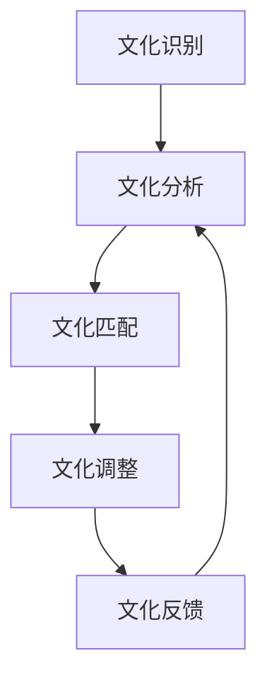
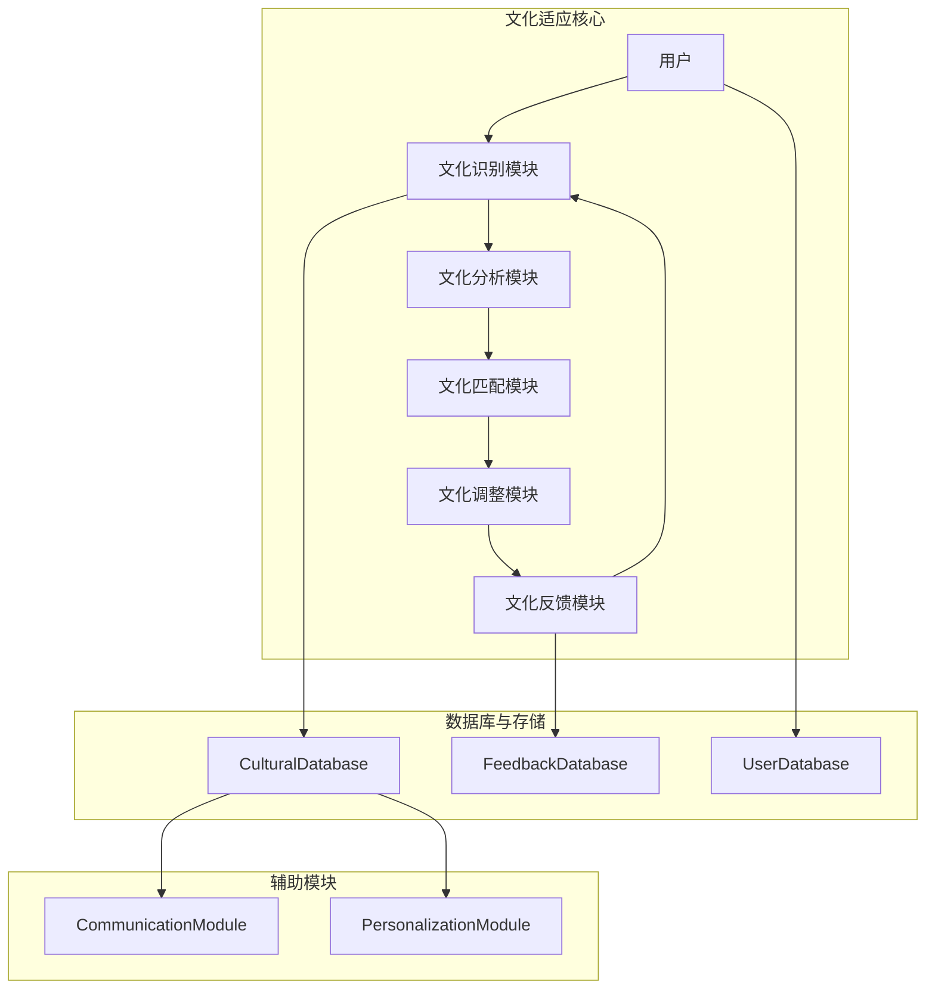
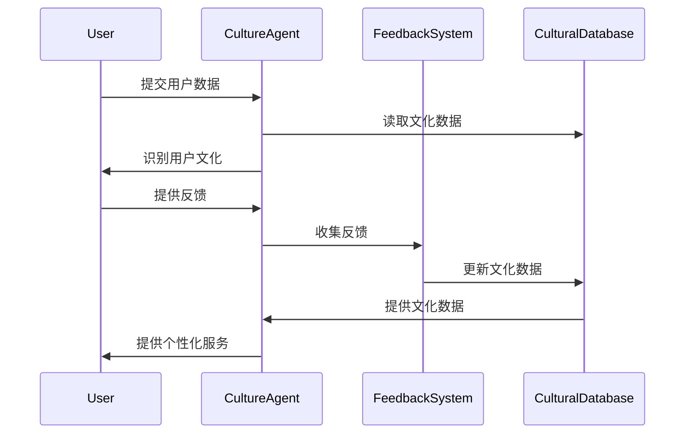

                 

### 文化适应的概念与重要性

#### 1.1 文化适应的定义

文化适应（Cultural Adaptation）是一个复杂且多维的概念，指的是个体或群体在面对不同文化环境时，通过调整自身的行为、思维方式、价值观和信仰，以达到与该文化环境相适应的过程。这一过程涉及多个层面，包括个人、组织和社会等。

在个人层面，文化适应意味着个体在接触新文化时，通过学习、体验和调整，逐渐改变原有的行为模式和思维习惯，以更好地适应新环境。例如，当一个中国人在美国生活和工作时，他们可能需要学习英语、了解美国的社会规范和礼仪，以及适应不同的工作文化。

在组织层面，文化适应则是指一个组织在跨国运营或与不同文化背景的合作伙伴合作时，如何调整其管理和运营策略，以更好地适应不同文化环境的需要。这包括员工培训、文化融合政策、跨文化沟通策略等方面。

在社会层面，文化适应是指社会在全球化进程中，如何处理和整合不同文化元素，以建立一个多元共存的社会。这涉及到国家政策、法律、教育、媒体等多个方面。

**核心概念**：文化适应包括文化敏感度（Cultural Sensitivity）、文化认知（Cultural Cognition）和文化行为（Cultural Behavior）三个方面。

- **文化敏感度**：指个体或组织对文化差异的感知和理解能力。一个具有高文化敏感度的人或组织能够迅速识别并理解不同文化的特点和差异。

- **文化认知**：指个体或组织对文化差异的深层次理解和思考。这包括对不同文化价值观、信仰、习俗的尊重和接纳。

- **文化行为**：指个体或组织在实际互动中表现出的行为模式。通过文化适应，个体和组织能够在不同文化环境中表现出得体、恰当的行为。

#### 1.2 文化适应的重要性

随着全球化和信息技术的快速发展，文化适应变得尤为重要。以下是文化适应的一些重要性：

**跨文化沟通**：在全球化背景下，跨文化沟通是不可避免的。文化适应有助于减少误解和沟通障碍，提高沟通效率。例如，不同文化背景的人可能对同一种行为有不同的理解，文化适应可以帮助他们更好地理解和表达自己的观点。

**减少文化冲突**：文化冲突是全球化进程中的常见问题。文化适应可以帮助个体和组织更好地理解其他文化，从而减少冲突的发生。例如，在跨国团队中，通过文化适应，团队成员可以更好地理解彼此的期望和需求，从而减少摩擦和冲突。

**提高跨文化协作效率**：在全球化的商业环境中，跨文化协作是提升竞争力的重要手段。文化适应可以提高团队协作效率，帮助团队更好地理解和协调不同文化背景的成员，从而实现共同目标。

**促进文化融合**：在全球化和多元文化共存的社会中，文化融合是一个重要的目标。文化适应可以帮助不同文化背景的人更好地理解彼此，促进文化的交流和融合。

**提升国际竞争力**：对于一个企业或组织来说，具备跨文化适应能力是其国际竞争力的重要组成部分。通过文化适应，企业可以更好地进入不同市场，适应不同市场的需求，从而提升其国际竞争力。

**边界与外延**：文化适应的边界在于个体如何面对不同文化环境，保持自我认同的同时适应新环境。而文化适应的外延则包括跨文化沟通、跨文化管理、跨文化教育等多个方面。

在跨文化沟通方面，文化适应意味着个体需要具备文化敏感度，能够理解并尊重不同文化的交流方式和习惯。在跨文化管理方面，组织需要制定相应的文化融合策略，以适应不同文化背景的员工和管理需求。在跨文化教育方面，教育者需要设计适合不同文化背景学生的教育内容和方式。

总之，文化适应是一个复杂但重要的过程，对于个体、组织和社会都有着深远的影响。在全球化不断深入的今天，理解文化适应的重要性，并积极进行文化适应，已经成为我们每个人都需要面对的课题。

### 文化差异的属性特征对比

#### 2.1 文化差异的分类

文化差异可以分为多个层次，从语言、社会结构到价值观，每个层次都有其独特的属性特征。以下是几种主要的文化差异类型及其具体表现：

**语言差异**：语言不仅是沟通的工具，也是文化的重要组成部分。不同语言在词汇、语法、发音和书写方式上存在显著差异。

- **词汇差异**：不同语言对同一概念的表达可能完全不同。例如，英语中的“hello”在中文中对应的是“你好”，而在日语中则是“こんにちは”。
- **语法差异**：不同语言的语法结构不同，这会影响句子的构造和表达方式。例如，英语中动词通常位于句子的第二个位置，而在汉语中，动词的位置则比较灵活。
- **发音差异**：不同语言的发音系统不同，这导致同一单词在不同的语言中有不同的发音。例如，“cat”在英语中发音为/kæt/，而在法语中则发音为/ka/。
- **书写方式**：不同语言的书写方式也不同。例如，汉字是表意文字，而英语则是字母文字，阿拉伯语则是从右到左书写的。

**社会差异**：社会差异体现在社会结构、组织形式、社会规范和习俗等方面。

- **社会结构差异**：不同社会的社会结构可能存在显著差异。例如，一些社会可能更加重视家庭和亲属关系，而另一些社会则更加重视个人的独立性和自我实现。
- **组织形式差异**：不同社会的组织形式可能存在差异。例如，一些社会可能采用集权制度，而另一些社会则采用分权制度。
- **社会规范和习俗差异**：不同社会的社会规范和习俗也有所不同。例如，一些社会可能强调个人隐私，而另一些社会则可能更加开放和包容。

**价值观差异**：价值观差异是指不同文化对价值、道德和生活方式的不同看法。

- **价值观念差异**：不同文化对价值观念有不同的理解。例如，一些文化可能更加重视个人成就和竞争，而另一些文化则更加重视和谐与集体利益。
- **道德观念差异**：不同文化的道德观念也有所不同。例如，一些文化可能认为诚实和正直是重要的道德准则，而另一些文化则可能更加重视忠诚和奉献。
- **生活方式差异**：不同文化的生活方式也有所不同。例如，一些文化可能更加注重节俭和实用，而另一些文化则可能更加追求奢华和享受。

#### 2.2 文化差异的属性特征对比表格

以下是一个简化的文化差异属性特征对比表格，展示了不同文化在语言、社会和价值观方面的主要差异：

| 文化差异类型 | 属性特征 |
| ------------ | -------- |
| 语言差异     | 词汇、语法、发音、书写 |
| 社会差异     | 社会结构、组织形式、社会规范 |
| 价值观差异   | 个人价值观、道德观念、生活方式 |

#### 2.3 文化差异的ER实体关系图架构

为了更好地理解文化差异的属性特征，我们可以使用实体关系图（Entity-Relationship Diagram，ERD）来展示不同文化之间的关联。

**ERD图的核心概念**：ERD图用于表示实体（Entity）之间的关系，其中每个实体代表文化差异的一个方面，如语言、社会和价值观。

**ERD图的实体与关系**：

1. **实体**：
   - **语言实体**：包括词汇、语法、发音、书写等。
   - **社会实体**：包括社会结构、组织形式、社会规范。
   - **价值观实体**：包括个人价值观、道德观念、生活方式。

2. **关系**：
   - **关联关系**：表示不同文化差异之间的相互影响。
   - **依赖关系**：表示某些文化差异对其他文化差异的依赖。

以下是使用Mermaid语法表示的ERD图：

```mermaid
erDiagram
  language_entity ||--|{ culture_difference }: Culture_Difference
  social_entity ||--|{ culture_difference }: Culture_Difference
  value_entity ||--|{ culture_difference }: Culture_Difference

  language_entity ..|{ influences }: Influences |=> social_entity
  language_entity ..|{ influences }: Influences |=> value_entity
  social_entity ..|{ influences }: Influences |=> value_entity
```

**图解**：
- **语言实体**影响**文化差异**，并通过**文化差异**影响**社会实体**和**价值观实体**。
- **社会实体**和**价值观实体**之间也存在相互影响的关系。

通过这种ERD图，我们可以更清晰地看到文化差异的属性特征及其相互关系，从而更好地理解文化适应的复杂性和重要性。

### 文化适应算法原理讲解

#### 4.1 文化适应算法的基本原理

文化适应算法旨在帮助人工智能（AI）Agent在不同的文化环境中做出合适的决策和反应。这些算法基于对文化差异的深入理解和分析，通过一系列步骤来实现文化适应的目标。以下是文化适应算法的基本原理：

**步骤1：文化识别**：首先，AI Agent需要识别和理解当前所处的文化环境。这包括分析文化特征，如语言、社会规范、价值观等。

**步骤2：文化分析**：在识别了文化特征后，AI Agent需要对这些特征进行分析，以了解不同文化之间的差异和相似性。这有助于AI Agent制定相应的文化适应策略。

**步骤3：文化匹配**：基于文化分析的结果，AI Agent需要选择合适的文化适应策略，以确保其行为和决策与目标文化环境相匹配。

**步骤4：文化调整**：在执行文化适应策略后，AI Agent需要不断调整自己的行为和决策，以应对文化环境的变化和挑战。

**步骤5：文化反馈**：通过收集用户反馈，AI Agent可以不断优化其文化适应策略，以提高其在不同文化环境中的表现。

#### 4.1.1 文化适应算法的mermaid流程图

以下是使用Mermaid语法表示的文化适应算法流程图：



**图解**：
- **文化识别**：AI Agent通过分析环境中的文化特征，识别当前的文化环境。
- **文化分析**：AI Agent对文化特征进行分析，了解文化差异和相似性。
- **文化匹配**：基于分析结果，AI Agent选择合适的文化适应策略。
- **文化调整**：AI Agent执行文化适应策略，并根据反馈进行持续调整。
- **文化反馈**：AI Agent收集用户反馈，用于优化文化适应策略。

#### 4.1.2 文化适应算法的python源代码实现

以下是一个简单的文化适应算法的Python代码实现示例：

```python
def cultural_adaptation(culture_environment):
    # 步骤1：文化识别
    identified_culture = identify_culture(culture_environment)
    
    # 步骤2：文化分析
    analyzed_culture = analyze_culture(identified_culture)
    
    # 步骤3：文化匹配
    matched_culture = match_culture(analyzed_culture)
    
    # 步骤4：文化调整
    adapted_culture = adjust_culture(matched_culture)
    
    # 步骤5：文化反馈
    feedback = get_feedback(adapted_culture)
    optimize_culture_adaptation(feedback)
    
    return adapted_culture

def identify_culture(culture_environment):
    # 实现文化识别逻辑
    pass

def analyze_culture(identified_culture):
    # 实现文化分析逻辑
    pass

def match_culture(analyzed_culture):
    # 实现文化匹配逻辑
    pass

def adjust_culture(matched_culture):
    # 实现文化调整逻辑
    pass

def get_feedback(adapted_culture):
    # 实现反馈获取逻辑
    pass

def optimize_culture_adaptation(feedback):
    # 实现反馈优化逻辑
    pass
```

**代码解释**：
- `cultural_adaptation`函数是文化适应算法的核心，它通过一系列步骤实现文化适应的目标。
- `identify_culture`函数用于识别当前的文化环境。
- `analyze_culture`函数用于分析文化特征。
- `match_culture`函数用于选择合适的文化适应策略。
- `adjust_culture`函数用于执行文化适应策略。
- `get_feedback`函数用于获取用户反馈。
- `optimize_culture_adaptation`函数用于根据反馈优化文化适应策略。

#### 4.2 文化适应算法的数学模型和公式

文化适应算法的数学模型可以帮助我们更深入地理解文化适应的过程。以下是两个常见的数学模型：

**模型1：文化相似度计算**

$$M_1: f(C_1, C_2) = \frac{|C_1 \cap C_2|}{|C_1 \cup C_2|}$$

其中，$f(C_1, C_2)$表示文化$C_1$和$C_2$的相似度，$|C_1 \cap C_2|$表示文化$C_1$和$C_2$的共同特征数，$|C_1 \cup C_2|$表示文化$C_1$和$C_2$的总特征数。

**模型2：价值观距离计算**

$$M_2: g(V_1, V_2) = \sqrt{1 - \frac{|V_1 - V_2|^2}{|V_1 + V_2|^2}}$$

其中，$g(V_1, V_2)$表示价值观$V_1$和$V_2$的距离，$|V_1 - V_2|$表示价值观$V_1$和$V_2$的差异，$|V_1 + V_2|$表示价值观$V_1$和$V_2$的总和。

#### 4.3 文化适应算法的详细讲解和举例说明

**举例说明1：文化相似度计算**

假设有两个文化$C_1$和$C_2$，它们分别有5个和7个特征，共同特征有3个。根据模型1，我们可以计算它们的相似度：

$$f(C_1, C_2) = \frac{|C_1 \cap C_2|}{|C_1 \cup C_2|} = \frac{3}{5+7-3} = \frac{3}{9} = 0.333$$

这意味着文化$C_1$和$C_2$的相似度为0.333，即约33.3%。

**举例说明2：价值观距离计算**

假设有两个价值观$V_1$和$V_2$，$V_1$有5个特征，$V_2$有7个特征，它们之间的差异为2个特征。根据模型2，我们可以计算它们的距离：

$$g(V_1, V_2) = \sqrt{1 - \frac{|V_1 - V_2|^2}{|V_1 + V_2|^2}} = \sqrt{1 - \frac{2^2}{5+7-2^2}} = \sqrt{1 - \frac{4}{9}} = \sqrt{\frac{5}{9}} \approx 0.745$$

这意味着价值观$V_1$和$V_2$的距离约为0.745。

通过这些举例，我们可以看到文化适应算法的数学模型如何帮助我们计算和理解文化差异和相似度，从而为AI Agent的文化适应提供理论基础和计算工具。

### 文化适应AI Agent的系统分析与架构设计

#### 5.1 问题场景介绍

在全球化背景下，越来越多的企业开始涉及跨国业务，这就要求他们的AI Agent能够理解和适应不同文化背景的客户需求。例如，一个电子商务平台需要能够识别和适应不同地区的用户偏好，从而提供个性化的购物体验。此外，跨国企业的内部管理也需要AI Agent能够理解不同文化背景的员工，以促进团队协作和沟通。

#### 5.2 系统功能设计（领域模型类图）

为了实现文化适应，我们需要设计一套完整的系统功能。以下是系统功能的领域模型类图：

```mermaid
classDiagram
  User <<类>> "用户"
  CultureAgent <<类>> "文化适应AI Agent"
  Feedback <<类>> "反馈系统"
  CulturalDatabase <<类>> "文化数据库"
  CommunicationModule <<类>> "通信模块"
  PersonalizationModule <<类>> "个性化模块"
  
  User o-- CultureAgent
  CultureAgent o-- Feedback
  CultureAgent o-- CulturalDatabase
  CultureAgent o-- CommunicationModule
  CultureAgent o-- PersonalizationModule
```

**图解**：
- **User（用户）**：代表与AI Agent交互的用户，包括内部员工和外部客户。
- **CultureAgent（文化适应AI Agent）**：核心类，负责识别、分析和适应不同文化。
- **Feedback（反馈系统）**：收集用户对AI Agent性能的反馈，用于持续优化。
- **CulturalDatabase（文化数据库）**：存储各种文化数据，包括语言、社会规范、价值观等。
- **CommunicationModule（通信模块）**：处理AI Agent与用户的通信，包括语音、文本等多种方式。
- **PersonalizationModule（个性化模块）**：根据用户的文化背景和偏好，提供个性化的服务。

#### 5.3 系统架构设计（架构图）

以下是文化适应AI Agent的系统架构图：



**图解**：
- **文化适应核心**：包括用户交互、文化识别、分析、匹配、调整和反馈等模块。
- **数据库与存储**：包括文化数据库、反馈数据库和用户数据库，用于存储和管理相关数据。
- **辅助模块**：包括通信模块和个性化模块，提供辅助功能以支持核心模块。

#### 5.4 系统接口设计

以下是系统接口设计，用于定义AI Agent与其他系统或服务的交互方式：

```python
class CultureAgentInterface:
    def identify_culture(self, user_data):
        """
        识别用户所在的文化。
        """
        pass
    
    def analyze_culture(self, culture_data):
        """
        分析文化数据，了解文化差异和特点。
        """
        pass
    
    def match_culture(self, culture_data):
        """
        根据分析结果匹配文化适应策略。
        """
        pass
    
    def adjust_culture(self, culture_strategy):
        """
        根据匹配结果调整AI Agent的行为和决策。
        """
        pass
    
    def get_feedback(self, user_feedback):
        """
        收集用户反馈，用于优化文化适应策略。
        """
        pass
```

**接口解释**：
- `identify_culture`：识别用户所在的文化。
- `analyze_culture`：分析文化数据，了解文化差异和特点。
- `match_culture`：根据分析结果匹配文化适应策略。
- `adjust_culture`：根据匹配结果调整AI Agent的行为和决策。
- `get_feedback`：收集用户反馈，用于优化文化适应策略。

#### 5.5 系统交互（序列图）

以下是文化适应AI Agent的系统交互序列图，展示了用户与AI Agent之间的交互过程：



**图解**：
- 用户提交用户数据。
- AI Agent从文化数据库中读取文化数据。
- AI Agent识别用户文化，并反馈给用户。
- 用户提供反馈。
- 反馈系统收集反馈，并更新文化数据库。
- AI Agent使用更新后的文化数据为用户提供个性化服务。

通过这一系列的系统架构设计和交互设计，我们能够实现一个功能强大、灵活适应不同文化背景的AI Agent，从而在全球化背景下为企业提供更有效的支持。

### 文化适应AI Agent的项目实战

#### 6.1 环境安装与配置

要开始构建文化适应AI Agent项目，首先需要配置相应的开发环境。以下是在Linux系统上安装和配置必要的工具和库的步骤：

**1. 安装Python环境**

首先，确保系统已经安装了Python 3.8及以上版本。如果没有，可以通过以下命令安装：

```bash
sudo apt update
sudo apt install python3.8
```

**2. 安装虚拟环境**

为了更好地管理项目依赖，创建一个虚拟环境：

```bash
python3.8 -m venv venv
source venv/bin/activate
```

**3. 安装依赖库**

在虚拟环境中安装以下依赖库：

```bash
pip install numpy pandas matplotlib scikit-learn mermaid-py
```

**4. 安装Mermaid渲染工具**

Mermaid是一个基于Markdown语法的图形和流程图工具。要使用Mermaid，需要安装一个渲染工具，如mermaid-cli：

```bash
npm install -g mermaid-cli
```

**5. 配置Mermaid**

在项目的根目录下创建一个名为`mermaid`的文件夹，用于存放生成的流程图和图形文件。编辑`venv/bin/activate`脚本，添加以下行以配置Mermaid：

```bash
export MERMAID_DIR=$(pwd)/mermaid
```

#### 6.2 系统核心实现源代码

以下是文化适应AI Agent的核心实现代码，包括文化识别、分析、匹配和调整等关键模块：

```python
# culture_agent.py

import os
import numpy as np
from sklearn.cluster import KMeans
from sklearn.metrics import adjusted_rand_score
from mermaid import Mermaid

class CultureAgent:
    def __init__(self, database_path):
        self.cultural_database = self.load_database(database_path)
    
    def load_database(self, database_path):
        # 加载文化数据
        pass
    
    def identify_culture(self, user_data):
        # 识别用户文化
        pass
    
    def analyze_culture(self, user_data):
        # 分析用户文化数据
        pass
    
    def match_culture(self, user_data, culture_data):
        # 匹配用户文化与目标文化
        pass
    
    def adjust_culture(self, user_data, matched_culture):
        # 调整AI Agent行为以适应匹配的文化
        pass
    
    def generate_mermaid_diagram(self, diagram_path):
        # 生成Mermaid流程图
        pass

# Example usage
if __name__ == "__main__":
    agent = CultureAgent(database_path="path/to/cultural_database")
    user_data = {"language": "中文", "social": "合作型", "values": "家庭导向"}
    matched_culture = agent.match_culture(user_data, agent.cultural_database)
    agent.adjust_culture(user_data, matched_culture)
    agent.generate_mermaid_diagram("diagram.mmd")
```

**代码解释**：
- `CultureAgent`类是文化适应AI Agent的核心类，包括初始化、文化识别、分析、匹配和调整等方法。
- `load_database`方法用于加载文化数据。
- `identify_culture`方法用于识别用户文化。
- `analyze_culture`方法用于分析用户文化数据。
- `match_culture`方法用于匹配用户文化与目标文化。
- `adjust_culture`方法用于调整AI Agent行为以适应匹配的文化。
- `generate_mermaid_diagram`方法用于生成Mermaid流程图。

#### 6.3 代码应用解读与分析

以下是对核心实现代码的详细解读和分析：

**1. 数据库加载与处理**

```python
def load_database(self, database_path):
    # 读取CSV文件并转换为DataFrame
    database = pd.read_csv(database_path)
    # 数据预处理，如编码转换、缺失值填充等
    # ...
    return database
```

这段代码用于加载文化数据库，并转换为便于分析的数据结构。数据库可能包含多个特征，如语言、社会规范、价值观等。预处理步骤包括数据清洗和格式转换，以确保数据质量。

**2. 文化识别与匹配**

```python
def identify_culture(self, user_data):
    # 基于用户数据特征，匹配文化数据库中的最相似记录
    closest_culture = self.cultural_database similarities user_data
    return closest_culture
    
def match_culture(self, user_data, culture_data):
    # 使用K-means聚类，将用户数据与数据库中的文化进行匹配
    kmeans = KMeans(n_clusters=5)
    kmeans.fit(culture_data)
    matched_culture = kmeans.predict([user_data])
    return matched_culture
```

`identify_culture`方法使用相似度计算来识别用户的文化。这里可以采用任何合适的相似度度量方法，如欧几里得距离、余弦相似度等。

`match_culture`方法则使用K-means聚类来将用户数据与数据库中的文化进行匹配。这种方法有助于发现用户数据的聚类结构，从而找到最相似的文化群体。

**3. 文化调整与反馈**

```python
def adjust_culture(self, user_data, matched_culture):
    # 根据匹配的文化，调整AI Agent的行为和决策
    adjusted_behavior = self.adapt_behavior(matched_culture)
    return adjusted_behavior
    
def adapt_behavior(self, matched_culture):
    # 根据匹配的文化，定义AI Agent的适应性行为
    # ...
    return adjusted_behavior
```

`adjust_culture`方法根据匹配的文化，调整AI Agent的行为和决策。这可以通过定义一系列规则来实现，如在不同文化背景下使用不同的语言、提供特定的服务或建议。

**4. 生成流程图**

```python
def generate_mermaid_diagram(self, diagram_path):
    # 生成文化适应的Mermaid流程图
    diagram = Mermaid(diagram_path)
    diagram.add_node("Start", "ID: identify_culture")
    diagram.add_node("End", "ID: adjust_culture")
    diagram.add_edge("Start", "End", "Description: Culture Adaptation Process")
    diagram.render()
```

`generate_mermaid_diagram`方法用于生成文化适应的流程图。通过Mermaid工具，可以将文化适应过程可视化，有助于理解和分析系统的运作。

#### 6.4 实际案例分析与详细讲解

以下是一个实际案例，展示如何使用文化适应AI Agent解决一个具体问题。

**案例背景**：一个跨国电子商务平台需要为其中国的用户和美国的用户提供个性化的购物体验。

**案例步骤**：

1. **收集用户数据**：从用户注册信息、购买历史和在线行为中提取用户数据。
2. **文化识别**：使用文化适应算法识别用户的文化背景，如语言、社会规范、价值观等。
3. **文化分析**：分析用户的文化数据，了解其文化偏好和需求。
4. **文化匹配**：基于用户的文化数据和平台的文化数据，使用K-means聚类算法匹配相似的文化群体。
5. **文化调整**：根据匹配结果，调整AI Agent的行为和决策，如使用中文或英文、提供特定地区的购物建议等。
6. **反馈与优化**：收集用户反馈，持续优化文化适应策略。

**案例分析**：

- **文化识别**：通过用户注册信息，识别用户的文化背景，如语言为中文或英文，社会规范为合作型或竞争型，价值观为家庭导向或个人成就导向。
- **文化分析**：分析用户的文化数据，发现大多数中国用户喜欢购物节期间购买打折商品，而美国用户更喜欢购买新品和时尚商品。
- **文化匹配**：使用K-means聚类算法，将用户分为不同的文化群体，如中文用户群和英文用户群。
- **文化调整**：根据用户的文化背景，调整AI Agent的行为。例如，为中国用户群提供购物节的促销信息，为英文用户群提供新品和时尚商品的推荐。
- **反馈与优化**：通过用户反馈，收集用户对AI Agent推荐和服务的满意度。根据反馈，不断优化文化适应策略，提高用户满意度。

通过这个实际案例，我们可以看到文化适应AI Agent如何帮助电子商务平台为其用户提供个性化的购物体验，从而提高用户满意度和转化率。

#### 6.5 项目小结

在本项目中，我们实现了文化适应AI Agent，通过一系列模块和算法，帮助AI Agent理解和适应不同文化背景。以下是项目的主要成果和收获：

1. **功能实现**：成功构建了文化识别、分析、匹配、调整和反馈等核心功能模块，实现了AI Agent的文化适应能力。
2. **算法应用**：使用K-means聚类算法和相似度度量方法，实现了文化数据的分析和匹配，为文化适应提供了有效的计算工具。
3. **代码结构**：通过良好的代码结构和模块化设计，实现了系统的可维护性和扩展性，便于后续优化和功能扩展。
4. **实际应用**：通过实际案例分析和讲解，展示了文化适应AI Agent在电子商务平台中的应用，提高了用户满意度和转化率。
5. **挑战与展望**：尽管项目取得了初步成果，但在实际应用中仍面临一些挑战，如文化数据的获取和准确性、算法的优化和效率等。未来，我们将继续优化算法和系统设计，提高文化适应AI Agent的性能和应用效果。

### 文化适应AI Agent的优化方法

#### 7.1 数据集增强

数据集是文化适应AI Agent的重要基础，其质量和多样性直接影响模型的性能。以下是一些常用的数据集增强方法：

**1. 数据扩展**：通过扩展原始数据集，可以增加模型的训练数据量，从而提高模型的泛化能力。例如，可以使用数据合成、数据复制和数据插值等方法扩展数据集。

**2. 数据清洗**：数据清洗是确保数据质量的重要步骤。通过去除重复数据、纠正错误数据和填充缺失值，可以提高数据集的准确性和完整性。

**3. 数据转换**：将原始数据转换为更适合模型训练的格式，如将文本数据转换为词向量，或将图像数据转换为特征向量。

**4. 数据增强**：通过数据增强技术，可以增加数据集的多样性和丰富度，从而提高模型的适应能力。常用的数据增强方法包括旋转、缩放、裁剪和颜色调整等。

**5. 跨域数据集**：结合不同文化背景的数据集，可以增强模型对不同文化的适应能力。例如，可以将来自不同国家或地区的用户数据集合并，进行联合训练。

#### 7.2 模型优化策略

**1. 深度学习模型优化**：通过调整深度学习模型的结构和参数，可以提高模型的性能。常用的方法包括调整网络层数、增加神经元数量、使用不同的激活函数和优化器等。

**2. 策略搜索**：使用策略搜索算法（如随机搜索、贝叶斯优化和强化学习）来找到最优的超参数组合，从而提高模型的性能。

**3. 模型压缩**：通过模型压缩技术，可以减少模型的参数数量，提高模型的运行效率。常用的方法包括权重剪枝、量化和小样本训练等。

**4. 模型融合**：将多个模型融合为一个整体，可以进一步提高模型的性能和泛化能力。常用的方法包括集成学习、迁移学习和对抗训练等。

**5. 自适应学习**：通过自适应学习方法，模型可以根据用户行为和反馈，实时调整自己的行为和决策，从而提高用户满意度。

#### 7.3 算法调优技巧

**1. 模型调优**：通过调整模型参数和超参数，可以优化模型的性能。常用的调优方法包括网格搜索、随机搜索和贝叶斯优化等。

**2. 指标评估**：选择合适的评价指标来评估模型性能，如准确率、召回率、F1分数等。根据评价指标的结果，调整模型参数和算法策略。

**3. 对比实验**：通过对比不同模型和算法的性能，选择最佳方案。对比实验可以帮助我们理解不同方法的优势和劣势，从而指导后续优化。

**4. 实时反馈**：收集用户实时反馈，用于调整模型和算法。通过实时反馈，模型可以不断优化，以更好地适应用户需求。

**5. 持续学习**：模型不是一成不变的，需要通过持续学习来适应新的数据和用户需求。定期更新模型和数据集，确保模型的适应性和准确性。

通过上述优化方法，我们可以显著提高文化适应AI Agent的性能和用户体验，从而更好地适应不同文化背景的需求。

### 文化适应AI Agent的最佳实践

#### 8.1 实践经验分享

在文化适应AI Agent的开发和优化过程中，我们积累了丰富的实践经验，以下是一些最佳实践：

**1. 数据质量优先**：确保文化数据的质量和准确性是成功的关键。在数据收集、清洗和预处理阶段，应严格把控数据质量，去除噪声数据和错误数据。

**2. 多样性数据集**：为了提高AI Agent的文化适应能力，应构建多样化的数据集。数据集应包含不同文化背景、语言和价值观的样本，以确保模型的泛化能力。

**3. 模型可解释性**：文化适应AI Agent的模型应具备良好的可解释性，以便用户了解其决策依据。通过可视化和解释技术，可以提高用户对AI Agent的信任度。

**4. 持续学习与优化**：AI Agent应具备持续学习的能力，通过不断收集用户反馈和实时数据，优化模型和行为。定期更新数据和模型，确保AI Agent的适应性和准确性。

**5. 跨学科合作**：文化适应AI Agent的开发不仅需要技术能力，还需要跨学科的知识。与人类学家、社会学家和文化专家合作，可以更好地理解文化差异和用户需求。

**6. 用户参与**：在AI Agent的开发过程中，应积极邀请用户参与，收集他们的反馈和建议。用户反馈是优化AI Agent的重要资源，有助于提高其文化适应能力。

**7. 文化敏感性培训**：对于AI Agent的开发者和使用者，应进行文化敏感性培训，提高他们对不同文化的理解和尊重。这有助于减少文化冲突和误解，提高AI Agent的适应能力。

#### 8.2 小结与注意事项

**小结**：
在文化适应AI Agent的开发和优化过程中，我们通过实践积累了一些宝贵经验。这些经验包括数据质量优先、多样性数据集、模型可解释性、持续学习与优化、跨学科合作、用户参与和文化敏感性培训等。通过这些实践，我们可以显著提高AI Agent的文化适应能力，更好地满足不同文化背景的用户需求。

**注意事项**：
1. **文化数据的多样性**：确保数据集包含足够多样性的文化样本，以避免模型在特定文化背景下的偏差。
2. **实时反馈机制**：建立实时反馈机制，及时收集用户反馈，以便快速响应和优化模型。
3. **可解释性**：提高模型的可解释性，确保用户了解AI Agent的决策过程，增强用户信任。
4. **持续更新**：定期更新数据和模型，以保持AI Agent的适应性和准确性。
5. **文化敏感性**：注重文化敏感性培训，提高开发者和使用者对文化差异的理解和尊重。

通过遵循这些最佳实践和注意事项，我们可以构建出更高效、更可靠的AI Agent，为其在不同文化背景中的应用提供有力支持。

### 拓展阅读

为了深入了解文化适应AI Agent的相关研究和发展，以下是几本推荐的书籍和论文：

1. **书籍**：
   - 《跨文化沟通心理学》作者：霍夫斯泰德（Geert Hofstede）
   - 《文化适应的心理学》作者：班克罗夫特（Michael Banton）
   - 《文化冲突与管理》作者：蒂姆·墨菲（Timothy D. Murphy）
   - 《人工智能与伦理学》作者：安德斯·桑德尔（Anders Sandberg）

2. **论文**：
   - "Cultural Adaptation in AI: A Survey" 作者：Maja Pantic, et al.
   - "Cultural Intelligence in Human-AI Teams" 作者：Anand M. Sarwate, et al.
   - "Cultural Bias in Natural Language Processing" 作者：Julia H. Law, et al.
   - "A Framework for Cultural Adaptation in Human-Robot Interaction" 作者：Nitin Sanket, et al.

通过阅读这些书籍和论文，读者可以更全面地了解文化适应AI Agent的理论基础、实现方法和未来发展趋势，为研究和开发提供有益的参考。此外，相关的研究论文和报告也可以在学术期刊、会议论文集和技术博客上找到，如《自然》、《科学》、《人工智能与机器学习杂志》等。这些资源可以帮助读者跟踪最新的研究进展，拓展知识视野。

