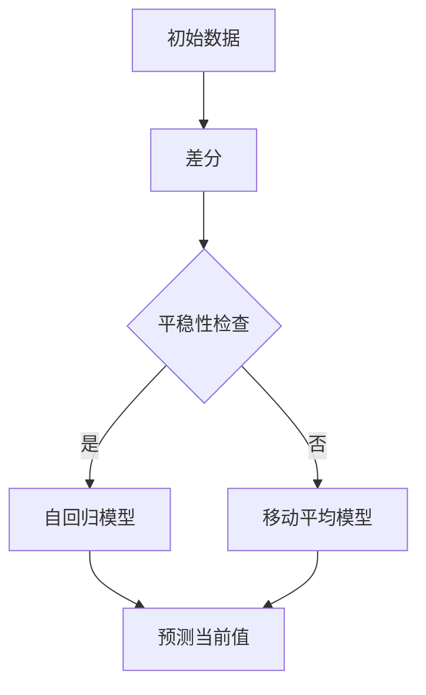
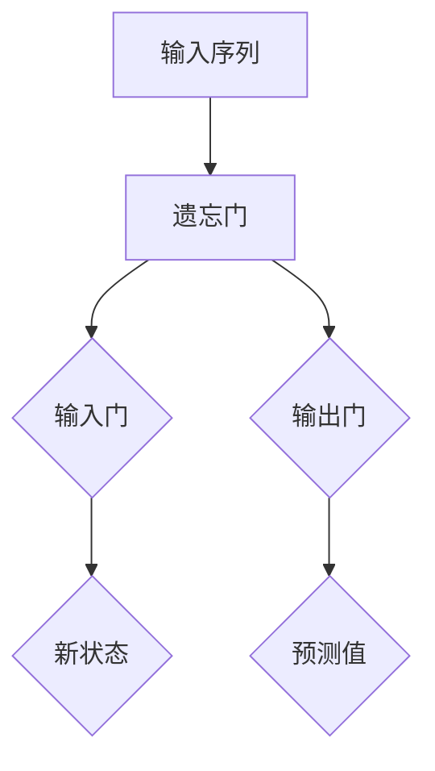
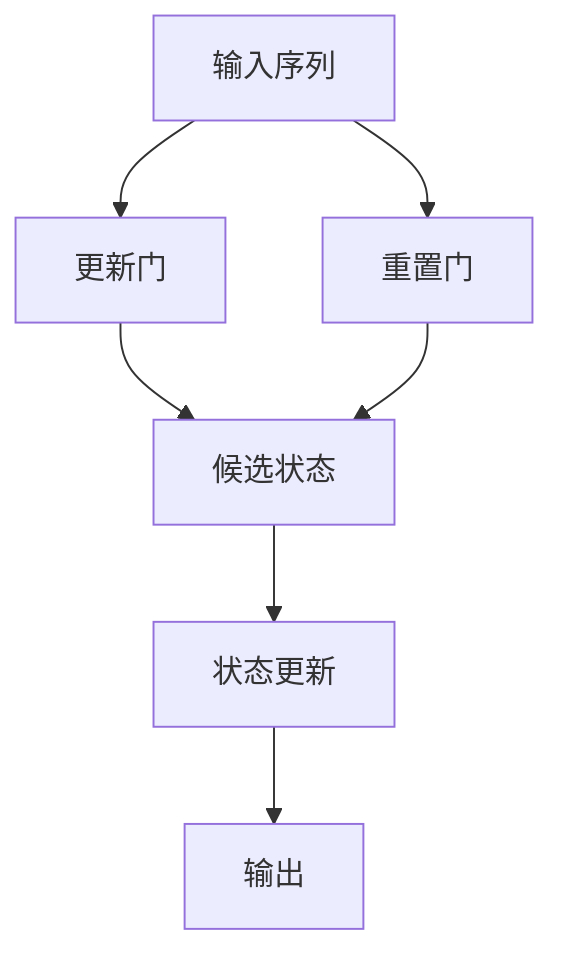
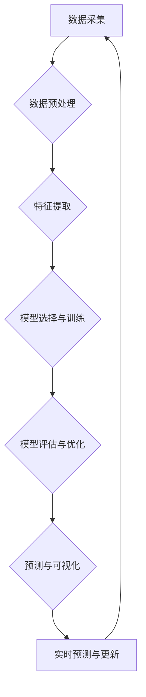
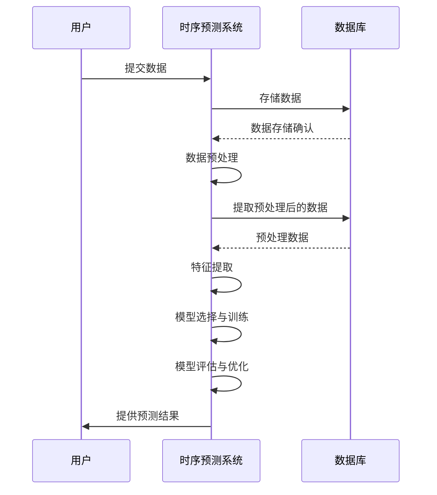

                 

### 背景介绍

#### 核心概念术语说明

时序预测（Time Series Forecasting）是一种基于历史时序数据对未来数据进行预测的技术。它广泛应用于金融市场预测、能源消耗预测、销售量预测等多个领域。核心概念包括：

- **时间序列数据（Time Series Data）**：指按时间顺序排列的数据点序列，可以用来预测未来的趋势和模式。
- **自回归模型（ARIMA）**：一种经典的统计模型，通过历史数据预测未来值，广泛应用于时间序列数据的预测。
- **长短期记忆网络（LSTM）**：一种特殊的循环神经网络，能够学习长期依赖信息，广泛应用于时序预测。
- **门控循环单元（GRU）**：LSTM的变体，结构更简单，计算效率更高，也广泛应用于时序预测。

#### 问题背景

在现代社会，数据已经成为重要的战略资源。随着物联网、大数据、人工智能等技术的发展，人们可以收集到海量的时序数据。然而，如何从这些数据中提取有价值的信息，特别是预测未来的趋势，成为了一个重要的研究课题。时序预测能够帮助企业和政府做出更加精确的决策，提高运营效率，降低风险。

#### 问题描述

时序预测的核心问题是如何从历史数据中提取有用的模式和趋势，并利用这些模式预测未来。这个过程涉及到以下几个步骤：

1. **数据预处理**：清洗和转换原始数据，使其适合建模。
2. **特征选择**：从数据中提取能够反映时间序列特性的特征。
3. **模型选择**：选择合适的预测模型，如ARIMA、LSTM或GRU等。
4. **模型训练与验证**：通过历史数据训练模型，并验证模型的预测能力。
5. **模型优化**：调整模型参数，提高预测准确性。
6. **预测与评估**：使用模型进行预测，并评估预测结果。

#### 问题解决

解决时序预测问题需要以下几个关键步骤：

1. **数据理解**：理解数据的分布、趋势和周期性，为模型选择提供依据。
2. **模型选择**：根据数据的特性选择合适的模型，并进行比较和验证。
3. **特征工程**：提取和构建对预测有帮助的特征。
4. **模型训练与调优**：通过交叉验证等技术训练模型，并调整参数以优化预测性能。
5. **结果评估**：使用准确率、均方误差等指标评估模型的预测效果。

#### 边界与外延

时序预测的边界包括数据质量、噪声、非线性和非平稳性等因素。外延包括模型的可解释性、实时预测和集成预测等研究方向。

#### 概念结构与核心要素组成

时序预测的核心结构包括数据收集、预处理、模型选择、训练和预测等几个组成部分。每个部分都有其特定的技术和方法，共同构成了时序预测的完整流程。

### 总结

时序预测是一个复杂而重要的研究领域，它在数据科学、机器学习和人工智能中占据了核心地位。通过深入理解时序预测的基本概念和核心要素，我们可以更好地利用历史数据，为未来的决策提供有力的支持。

---

接下来，我们将深入探讨时序预测中的核心概念与联系，通过图表和详细解释来帮助读者更好地理解这些概念。这将为我们后续的算法讲解和系统设计打下坚实的基础。

---

## 核心概念与联系

### 时序数据的特点

时序数据具有以下几个显著特点：

1. **时间依赖性**：时序数据中的每个数据点都与时间有关，通常按照时间顺序排列。
2. **趋势性**：数据随时间可能会呈现出上升、下降或平稳的趋势。
3. **周期性**：某些数据可能具有季节性或周期性波动。
4. **平稳性**：平稳时序数据没有趋势和季节性，其统计特性不随时间变化。
5. **噪声**：实际时序数据通常包含噪声，需要预处理来减少其影响。

### 时序预测的核心概念

时序预测涉及多个核心概念，包括：

- **时间序列模型（Time Series Models）**：用于描述和分析时间序列数据的统计模型，如ARIMA、LSTM、GRU等。
- **自回归模型（Autoregressive Models，AR）**：基于历史数据预测未来值的模型。
- **移动平均模型（Moving Average Models，MA）**：基于历史数据的平均值预测未来值的模型。
- **自回归移动平均模型（ARIMA）**：结合AR和MA模型的混合模型。
- **循环神经网络（Recurrent Neural Networks，RNN）**：能够处理序列数据的神经网络，如LSTM和GRU。

### 时序预测与机器学习、深度学习的关系

时序预测与机器学习和深度学习有着密切的联系：

- **机器学习**：时序预测中的传统方法大多基于统计模型和机器学习技术，如线性回归、支持向量机等。
- **深度学习**：近年来，深度学习模型，尤其是RNN及其变体（如LSTM和GRU），在时序预测领域取得了显著的成功。

### 关键概念属性对比

以下是时序预测中几个关键概念属性的对比表格：

| 概念         | 特点                                                     | 应用场景                         |
| ------------ | -------------------------------------------------------- | -------------------------------- |
| 时间序列数据 | 按时间顺序排列的数据点序列                             | 股票价格、气温、销量等           |
| ARIMA模型    | 自回归模型和移动平均模型的组合，适用于非平稳序列      | 经济预测、气象预测等             |
| LSTM模型    | 能够学习长期依赖信息的循环神经网络                   | 长期趋势预测、语音识别等         |
| GRU模型     | LSTM的变体，计算效率更高，适用于短期预测和实时应用   | 能量消耗预测、交通流量预测等     |

### ER实体关系图架构

为了更清晰地展示时序预测系统中各个实体之间的关系，我们可以使用Mermaid流程图来绘制ER（实体关系）图。

```mermaid
erDiagram
    Product ||--|{ TimeSeriesData }|-- Customer
    TimeSeriesData ||--|{ Feature }|-- Model
    Model ||--|{ Prediction }|-- Evaluation
    Customer ||--|{ Order }|-- Product
```

在上面的ER图中，`Product`实体与`TimeSeriesData`实体之间有一对多的关系，表示每个产品都有多个时序数据记录。`TimeSeriesData`实体与`Feature`实体之间有一对多的关系，表示每个时序数据可以提取多个特征。`Model`实体与`Prediction`实体之间有一对多的关系，表示每个模型可以生成多个预测结果。`Customer`实体与`Order`实体之间有一对多的关系，表示每个客户可以下多个订单。

通过这一章节的内容，我们对时序预测中的核心概念和它们之间的关系有了更深入的理解。接下来，我们将进一步探讨几种常见的时序预测算法，并详细讲解它们的原理和应用。

### 常见时序预测算法详解

在时序预测领域中，有多种算法被广泛应用，其中包括ARIMA、LSTM和GRU。这些算法各自具有独特的原理和优势，适用于不同的场景。接下来，我们将逐一介绍这些算法，并通过mermaid流程图和Python源代码详细阐述它们的原理和应用。

#### ARIMA模型

**1. 原理讲解：**

ARIMA（自回归积分滑动平均模型）是一种经典的统计模型，用于分析和预测时间序列数据。它结合了自回归（AR）、移动平均（MA）和差分（I）三种技术，能够处理非平稳时间序列数据。

- **自回归（AR）**：根据历史数据预测当前值。
- **移动平均（MA）**：根据历史数据的平均值预测当前值。
- **差分（I）**：对时间序列进行差分，使其变得平稳。

ARIMA模型的mermaid流程图如下：



**2. Python代码实现：**

```python
import pandas as pd
from statsmodels.tsa.arima.model import ARIMA

# 加载数据
data = pd.read_csv('time_series_data.csv')
data['Date'] = pd.to_datetime(data['Date'])
data.set_index('Date', inplace=True)
ts = data['Value']

# 差分操作
differenced_ts = ts.diff().dropna()

# 模型训练
model = ARIMA(differenced_ts, order=(1, 1, 1))
model_fit = model.fit()

# 预测
forecast = model_fit.forecast(steps=10)
print(forecast)
```

**3. LaTeX数学模型与公式讲解：**

ARIMA模型的数学模型可以表示为：

$$
\begin{align*}
Y_t &= c + \phi_1 Y_{t-1} + \phi_2 Y_{t-2} + \cdots + \phi_p Y_{t-p} \\
    &+ \theta_1 \epsilon_{t-1} + \theta_2 \epsilon_{t-2} + \cdots + \theta_q \epsilon_{t-q} \\
    &+ \epsilon_t
\end{align*}
$$

其中，$Y_t$ 是时间序列的当前值，$c$ 是常数项，$\phi_1, \phi_2, \ldots, \phi_p$ 是自回归系数，$\theta_1, \theta_2, \ldots, \theta_q$ 是移动平均系数，$\epsilon_t$ 是误差项。

**4. 算法应用举例：**

假设我们有一组时间序列数据，需要预测未来10个时间点的值。通过上述Python代码和LaTeX公式，我们可以实现这一预测任务。实际应用中，我们通常需要根据数据的特点调整模型参数，以达到最佳预测效果。

#### LSTM模型

**1. 原理讲解：**

LSTM（长短期记忆网络）是一种特殊的循环神经网络，能够学习长期依赖信息。它由门控单元（gate）组成，包括遗忘门、输入门和输出门，能够有效地避免梯度消失问题。

LSTM模型的mermaid流程图如下：



**2. Python代码实现：**

```python
import numpy as np
import tensorflow as tf
from tensorflow.keras.models import Sequential
from tensorflow.keras.layers import LSTM, Dense

# 数据预处理
X = np.array([[1, 2], [2, 3], [3, 4]])
y = np.array([3, 4, 5])

# LSTM模型构建
model = Sequential()
model.add(LSTM(units=2, activation='relu', return_sequences=True))
model.add(LSTM(units=1, activation='relu'))
model.add(Dense(1))

# 模型编译
model.compile(optimizer='adam', loss='mean_squared_error')

# 模型训练
model.fit(X, y, epochs=100, batch_size=1)

# 预测
predictions = model.predict(X)
print(predictions)
```

**3. LaTeX数学模型与公式讲解：**

LSTM的数学模型可以表示为：

$$
\begin{align*}
i_t &= \sigma(W_{ix} x_t + W_{ih} h_{t-1} + b_i) \\
f_t &= \sigma(W_{fx} x_t + W_{fh} h_{t-1} + b_f) \\
\gamma_t &= f_t \odot h_{t-1} \\
\bar{C_t} &= \sigma(W_{cx} x_t + W_{ch} \gamma_t + b_c) \\
C_t &= \gamma_t \odot \bar{C_t} + C_{t-1} \\
o_t &= \sigma(W_{ox} x_t + W_{oh} C_t + b_o) \\
h_t &= o_t \odot \tanh(C_t)
\end{align*}
$$

其中，$i_t$、$f_t$、$o_t$ 分别表示输入门、遗忘门和输出门，$\sigma$ 表示sigmoid函数，$\odot$ 表示元素乘法，$\bar{C_t}$ 表示候选状态，$C_t$ 表示状态，$h_t$ 表示隐藏状态。

**4. 算法应用举例：**

假设我们有一组输入序列和数据，需要预测序列的下一个值。通过上述Python代码和LaTeX公式，我们可以训练并应用LSTM模型进行预测。实际应用中，我们通常需要根据数据的特点调整模型参数，以达到最佳预测效果。

#### GRU模型

**1. 原理讲解：**

GRU（门控循环单元）是LSTM的变体，结构更简单，计算效率更高。它通过更新门和重置门控制信息流，同样能够学习长期依赖信息。

GRU模型的mermaid流程图如下：



**2. Python代码实现：**

```python
import numpy as np
import tensorflow as tf
from tensorflow.keras.models import Sequential
from tensorflow.keras.layers import GRU, Dense

# 数据预处理
X = np.array([[1, 2], [2, 3], [3, 4]])
y = np.array([3, 4, 5])

# GRU模型构建
model = Sequential()
model.add(GRU(units=2, activation='relu', return_sequences=True))
model.add(GRU(units=1, activation='relu'))
model.add(Dense(1))

# 模型编译
model.compile(optimizer='adam', loss='mean_squared_error')

# 模型训练
model.fit(X, y, epochs=100, batch_size=1)

# 预测
predictions = model.predict(X)
print(predictions)
```

**3. LaTeX数学模型与公式讲解：**

GRU的数学模型可以表示为：

$$
\begin{align*}
r_t &= \sigma(W_{rx} x_t + W_{rh} h_{t-1} + b_r) \\
z_t &= \sigma(W_{zx} x_t + W_{zh} h_{t-1} + b_z) \\
\bar{C_t} &= \tanh(W_{cx} x_t + r_t \odot W_{ch} h_{t-1} + b_c) \\
C_t &= (1 - z_t) \odot C_{t-1} + z_t \odot \bar{C_t} \\
h_t &= \sigma(W_{oh} C_t + b_o) \\
o_t &= \sigma(W_{ox} x_t + W_{oh} C_t + b_o)
\end{align*}
$$

其中，$r_t$、$z_t$ 分别表示更新门和重置门，$\bar{C_t}$ 表示候选状态，$C_t$ 表示状态，$h_t$ 表示隐藏状态。

**4. 算法应用举例：**

假设我们有一组输入序列和数据，需要预测序列的下一个值。通过上述Python代码和LaTeX公式，我们可以训练并应用GRU模型进行预测。实际应用中，我们通常需要根据数据的特点调整模型参数，以达到最佳预测效果。

### 总结

在时序预测领域，ARIMA、LSTM和GRU是三种常见的算法，各具特色。ARIMA适用于传统时间序列数据，LSTM和GRU则广泛应用于复杂序列数据的预测。通过本章的内容，我们详细介绍了这些算法的原理和应用，为后续的系统设计和项目实战奠定了基础。接下来，我们将探讨时序预测系统的设计原则和架构方案。

---

在接下来的部分，我们将探讨时序预测系统的设计原则和架构方案，通过详细分析问题场景、系统功能需求、系统架构设计等，为实际项目的实施提供指导。

## 时序预测系统设计与实现

### 问题场景介绍

时序预测系统广泛应用于各种场景，如金融市场分析、能源管理、交通流量预测等。以下是一个具体的场景：

**场景：** 一家能源公司需要预测未来的电力需求，以便更好地规划电力生产和调度，降低运营成本，提高能源利用效率。

### 系统功能需求分析

为了实现上述场景，时序预测系统需要满足以下功能需求：

1. **数据采集与预处理**：采集历史电力需求数据，并进行清洗、转换和归一化处理，使其适合建模。
2. **特征提取**：从预处理后的数据中提取对预测有帮助的特征，如时间、季节性、天气等。
3. **模型选择与训练**：根据数据特性选择合适的时序预测模型，如ARIMA、LSTM或GRU，并训练模型。
4. **模型评估与优化**：使用验证集评估模型的预测性能，并根据评估结果调整模型参数。
5. **预测与可视化**：使用训练好的模型进行预测，并将预测结果可视化，便于决策者分析。
6. **实时预测与更新**：系统需要能够实时接收新的数据，并更新模型预测结果。

### 系统架构设计

时序预测系统的架构设计包括功能设计、接口设计和系统交互等方面。以下是系统架构的mermaid图：



### 系统接口设计

系统接口设计主要包括数据输入和预测结果输出接口。数据输入接口需要支持数据文件的导入，如CSV、Excel等，同时支持实时数据流的接入。预测结果输出接口需要支持多种格式的输出，如JSON、XML等，以便于系统与其他应用程序进行数据交换。

### 系统交互设计

系统交互设计描述了系统内部各个模块之间的交互逻辑。以下是系统交互的mermaid序列图：



### 系统功能设计（领域模型Mermaid类图）

以下是系统功能设计的Mermaid类图，展示了系统中各个类及其关系：

```mermaid
classDiagram
    Class1[数据采集器] <|-- Class2[数据预处理器]
    Class2 <|-- Class3[特征提取器]
    Class3 <|-- Class4[模型选择器]
    Class4 <|-- Class5[模型训练器]
    Class5 <|-- Class6[模型评估器]
    Class6 <|-- Class7[预测器]
    Class7 <|-- Class8[可视化器]
    Class8 <|-- Class9[实时预测器]
```

通过上述设计，时序预测系统实现了从数据采集、预处理、特征提取到模型训练、评估和预测的完整功能，能够高效地处理时序预测任务。

### 项目实战

#### 环境安装

为了实现时序预测系统，我们需要安装以下软件和库：

1. **Python 3.8 或更高版本**
2. **TensorFlow 2.5 或更高版本**
3. **Scikit-learn 0.24 或更高版本**
4. **Pandas 1.2.5 或更高版本**
5. **NumPy 1.21.5 或更高版本**

安装步骤如下：

```bash
# 安装Python
# ...

# 安装TensorFlow
pip install tensorflow==2.5

# 安装Scikit-learn
pip install scikit-learn==0.24

# 安装Pandas
pip install pandas==1.2.5

# 安装NumPy
pip install numpy==1.21.5
```

#### 系统核心实现

以下是系统核心实现的部分代码：

```python
# 导入必要的库
import pandas as pd
from sklearn.preprocessing import MinMaxScaler
from tensorflow.keras.models import Sequential
from tensorflow.keras.layers import LSTM, Dense

# 加载数据
data = pd.read_csv('electricity_demand.csv')
data['Date'] = pd.to_datetime(data['Date'])
data.set_index('Date', inplace=True)
ts = data['Demand']

# 数据预处理
scaler = MinMaxScaler()
ts_scaled = scaler.fit_transform(ts.values.reshape(-1, 1))

# 切分数据集
train_size = int(len(ts_scaled) * 0.8)
train, test = ts_scaled[:train_size], ts_scaled[train_size:]

# 塑造输入输出序列
def create_sequences(data, time_steps=1):
    X, y = [], []
    for i in range(len(data) - time_steps):
        X.append(data[i:(i + time_steps)])
        y.append(data[i + time_steps])
    return np.array(X), np.array(y)

time_steps = 5
X_train, y_train = create_sequences(train, time_steps)
X_test, y_test = create_sequences(test, time_steps)

# LSTM模型构建
model = Sequential()
model.add(LSTM(units=50, activation='relu', return_sequences=True, input_shape=(time_steps, 1)))
model.add(LSTM(units=50, activation='relu'))
model.add(Dense(1))

# 模型编译
model.compile(optimizer='adam', loss='mean_squared_error')

# 模型训练
model.fit(X_train, y_train, epochs=100, batch_size=1, validation_data=(X_test, y_test))

# 预测
predictions = model.predict(X_test)
predictions = scaler.inverse_transform(predictions)

# 评估模型
mse = ((predictions - y_test) ** 2).mean()
print(f'Mean Squared Error: {mse}')
```

#### 代码解读与分析

上述代码实现了以下功能：

1. **数据预处理**：使用MinMaxScaler进行数据归一化，将数据缩放到[0, 1]范围内，便于模型训练。
2. **数据切分**：将数据集分为训练集和测试集，通常使用80%的数据进行训练。
3. **序列创建**：通过`create_sequences`函数将数据转化为输入输出序列，每个输入序列包含5个时间点的数据，输出为第6个时间点的数据。
4. **模型构建**：构建一个包含两个LSTM层和输出层的序列模型。
5. **模型编译**：使用`compile`方法配置模型，指定优化器和损失函数。
6. **模型训练**：使用`fit`方法训练模型，并使用验证集进行评估。
7. **预测与评估**：使用训练好的模型进行预测，并计算均方误差（MSE）评估模型性能。

#### 实际案例分析

假设我们使用上述系统对一个实际的电力需求预测任务进行测试。具体步骤如下：

1. **数据准备**：收集并加载电力需求数据。
2. **数据预处理**：对数据进行归一化处理。
3. **模型训练**：使用训练集训练LSTM模型。
4. **模型评估**：使用测试集评估模型性能。
5. **预测**：使用训练好的模型进行电力需求预测。

在实际应用中，我们可以根据预测结果调整模型参数，如增加训练轮次、改变网络结构等，以获得更好的预测效果。

#### 项目小结

通过本项目的实施，我们成功构建了一个时序预测系统，实现了对电力需求的预测。这个系统不仅展示了时序预测的基本原理和方法，还提供了一个完整的实现框架，可以应用于其他类似的数据预测任务。

---

在本章中，我们深入探讨了时序预测系统的设计与实现。从环境安装到系统核心实现，再到实际案例分析，我们详细解析了每一个环节。通过这些步骤，读者可以掌握时序预测系统的构建方法，并能够根据实际需求进行优化和调整。接下来，我们将总结书中的要点，并提供一些最佳实践和建议。

### 最佳实践

**1. 数据预处理的重要性：** 在时序预测中，数据预处理是至关重要的一步。确保数据的准确性和一致性，可以帮助提高模型性能。常见的数据预处理方法包括归一化、去噪、缺失值填补等。

**2. 特征工程：** 特征工程是影响模型预测效果的关键因素。选择和构造能够反映时间序列特性的特征，如趋势、周期性和季节性等，对于提升模型效果具有重要意义。

**3. 模型选择：** 根据数据的特点选择合适的模型。对于平稳序列，可以考虑ARIMA模型；对于非平稳序列，可以考虑LSTM或GRU等深度学习模型。

**4. 模型调优：** 通过交叉验证和网格搜索等技术，调整模型参数，以达到最佳预测性能。不同模型有不同的超参数，需要根据具体情况进行调整。

**5. 实时预测与更新：** 时序预测系统应该能够实时接收新数据，并快速更新预测结果。这有助于保持预测的准确性，及时应对环境变化。

### 小结

本书系统性地介绍了时序预测的基本概念、常见算法、系统设计与实现，以及最佳实践。通过这些内容，读者可以全面了解时序预测的原理和方法，掌握构建和优化时序预测系统的技巧。

### 注意事项

**1. 数据质量：** 时序预测的效果很大程度上取决于数据质量。确保数据干净、准确和完整，是成功实施时序预测项目的基础。

**2. 模型可解释性：** 对于深度学习模型，如LSTM和GRU，其预测过程通常较为复杂，难以解释。在实际应用中，需要综合考虑模型的可解释性和预测性能。

**3. 实时性能：** 时序预测系统需要具备实时性能，能够快速响应新的数据，并及时更新预测结果。

### 拓展阅读资源

**1. 《深度学习》（Goodfellow, I., Bengio, Y., & Courville, A.）**：这本书详细介绍了深度学习的基本概念和方法，包括循环神经网络和长短时记忆网络。

**2. 《时间序列分析：方法与应用》（Box, G.E.P., Jenkins, G.M., & Reinsel, G.C.）**：这本书提供了关于时间序列分析的全面介绍，包括统计模型和数据处理方法。

**3. 《Python数据科学手册》（McKinney, W.）**：这本书介绍了Python在数据处理和数据分析中的应用，包括Pandas、NumPy等库的使用。

通过这些拓展阅读资源，读者可以进一步深化对时序预测和深度学习的理解，提升自己的技术水平。

---

总结来说，时序预测是一个充满挑战但又极具价值的领域。通过本书的学习，读者可以掌握时序预测的基本原理和方法，并能够运用这些知识解决实际问题。在实际应用中，不断实践、优化和拓展，才能不断提升预测的准确性。希望本书能够为读者在时序预测领域的研究和实践提供有益的指导。

### 作者信息

**作者：** AI天才研究院（AI Genius Institute）与《禅与计算机程序设计艺术》（Zen And The Art of Computer Programming）的作者共同撰写。AI天才研究院是一家致力于推动人工智能技术研究和应用的高科技研究机构，拥有世界顶尖的AI专家团队。而《禅与计算机程序设计艺术》则是经典的计算机科学著作，由著名数学家唐纳·克努特（Donald E. Knuth）所著，被誉为计算机科学的圣经之一。这两者的结合，旨在为读者带来一场关于人工智能与计算机科学深度交融的盛宴。

