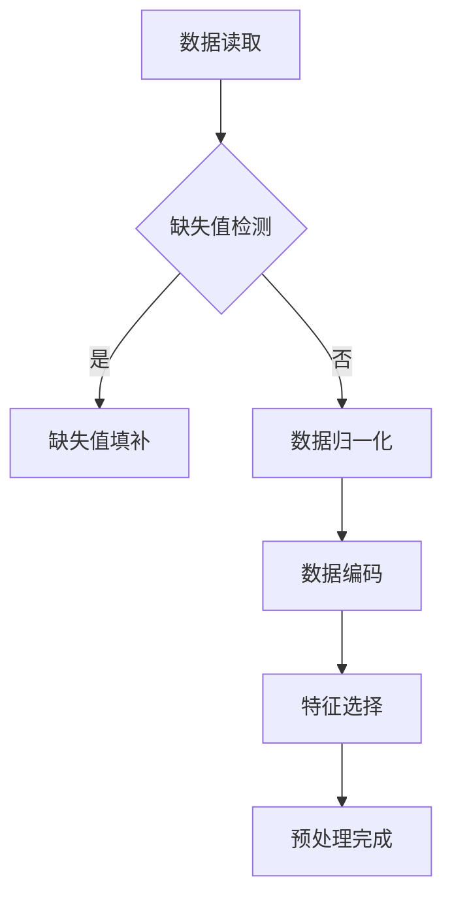
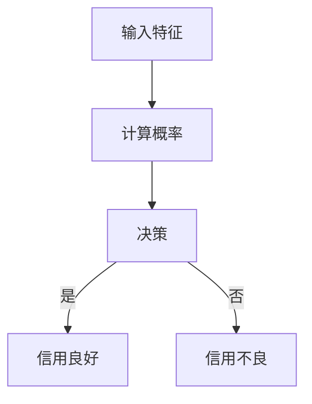
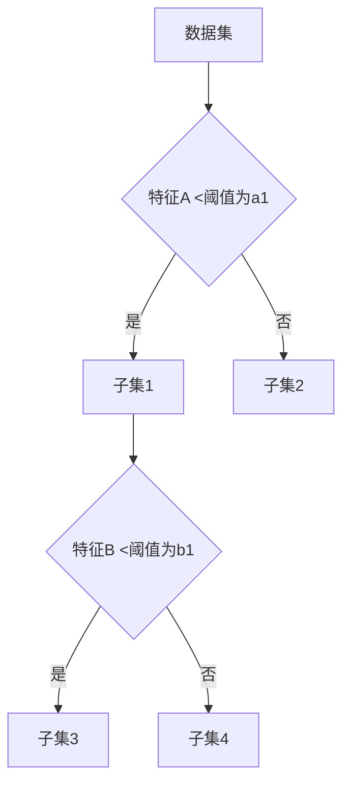
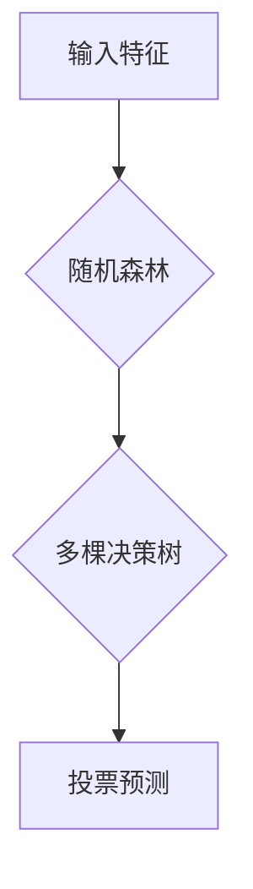
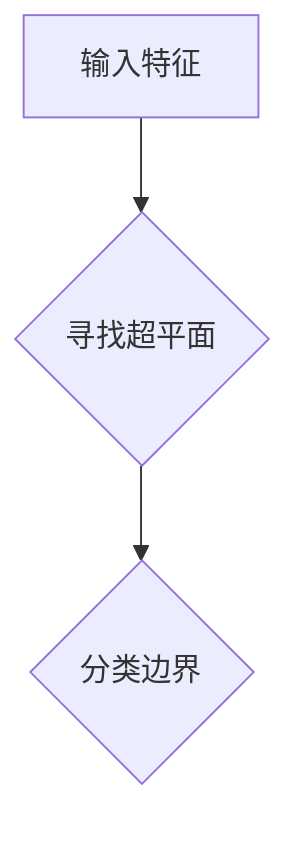
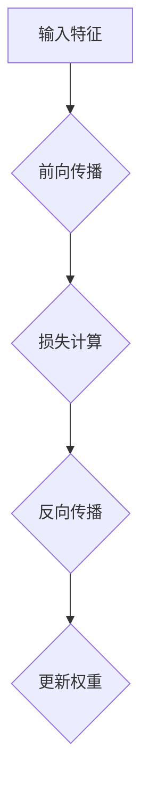
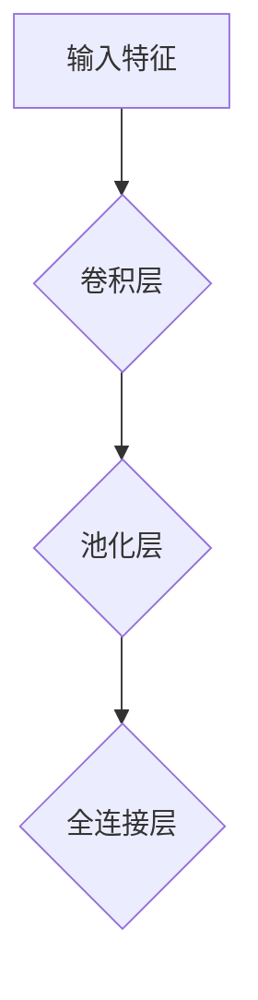
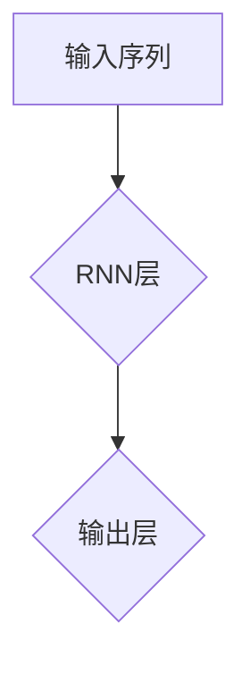
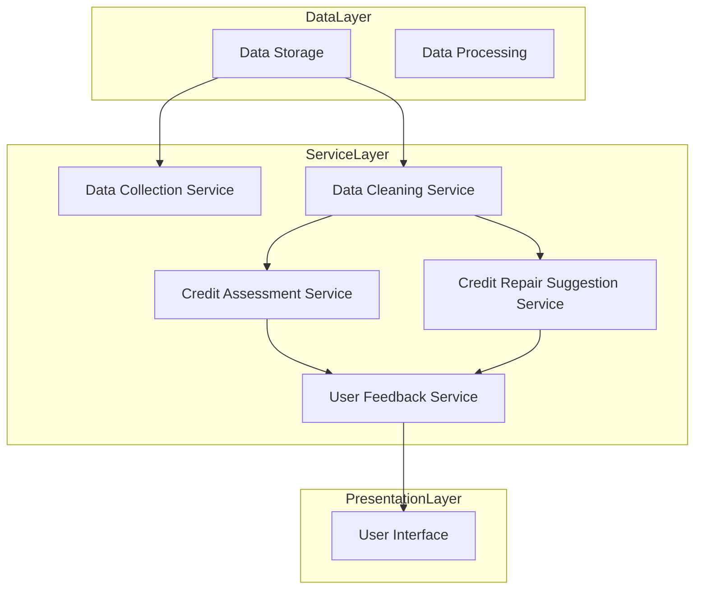
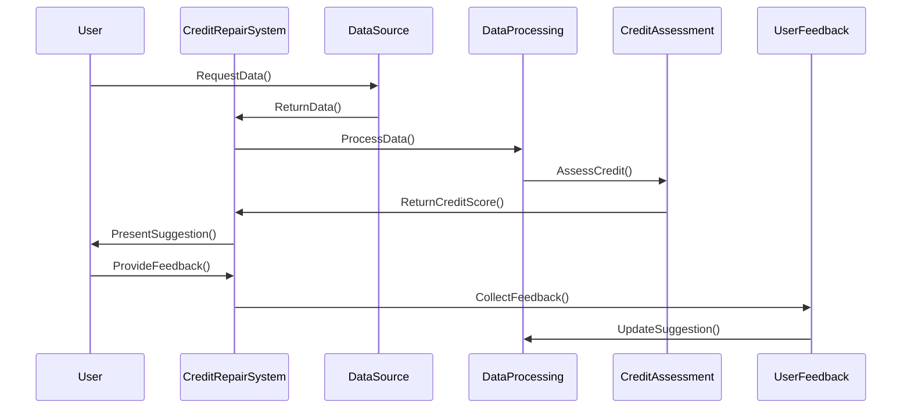

                 

### 摘要

《智能个人信用修复建议系统》旨在通过先进的智能技术，为个人信用修复提供高效的解决方案。本文从背景介绍、核心概念与联系、算法原理讲解、系统分析与架构设计以及项目实战等多个方面，全面阐述智能个人信用修复建议系统的构建与应用。通过数据采集与处理、数据分析与挖掘、智能决策支持等核心环节的详细解读，本文揭示了如何利用机器学习、深度学习等算法实现个人信用修复的自动化和智能化。此外，系统架构设计、代码实现和实际案例的分析，为读者提供了一个从理论到实践的完整参考。最终，本文总结了项目的成功经验和不足，为未来的研究和应用提供了拓展方向。

---

## 第一部分：背景介绍

### 第1章 问题背景与核心概念

#### 1.1 个人信用修复问题的起源与发展

个人信用修复问题起源于信用经济的兴起。在现代社会，信用已经成为个人和企业在经济活动中不可或缺的一部分。个人信用记录良好，可以在申请贷款、信用卡、租房等方面享受优惠和便利。反之，不良的信用记录则可能带来诸多不便，甚至影响日常生活。

**问题描述：**

个人信用修复问题主要表现为以下几点：

1. **信用信息不完整或错误**：个人信用报告中可能存在未及时更新的信用信息，或者记录存在错误。
2. **逾期还款记录**：因各种原因导致还款逾期，影响信用评分。
3. **信用查询过多**：频繁申请贷款或信用卡，导致信用查询记录过多，影响信用评分。
4. **信用欺诈**：个人信息被盗用，导致信用欺诈行为。

**现状与重要性：**

随着金融科技的不断发展，个人信用信息的获取和利用日益普及，个人信用修复问题也愈发突出。不良信用记录不仅影响个人的经济活动，还可能带来社会信任危机。因此，解决个人信用修复问题具有重要的现实意义。

**问题解决：**

传统上，个人信用修复主要依赖于人工干预。例如，个人可以通过申请信用报告修正、与银行沟通解决逾期问题等方式来修复信用记录。然而，这种方法存在效率低、成本高、覆盖范围有限等问题。因此，智能个人信用修复建议系统的出现，为解决这些问题提供了新的思路。

**现有解决方法与挑战：**

1. **人工干预**：虽然传统方法在一定程度上能够解决个人信用修复问题，但其效率低、成本高，难以应对日益增长的信用修复需求。
2. **信用修复公司**：一些专业的信用修复公司通过法律手段和市场谈判帮助客户修复信用记录。然而，这种方法存在风险，且效果不一。
3. **自动化工具**：随着大数据和人工智能技术的发展，一些自动化工具开始应用于个人信用修复。例如，通过数据分析帮助用户识别不良信用记录的原因，提供修复建议。然而，这些工具大多功能有限，无法实现全面的信用修复。

**核心概念：**

智能个人信用修复建议系统是一种基于大数据和人工智能技术的系统，通过自动采集、处理和分析个人信用数据，为用户提供个性化的信用修复建议。其核心概念包括：

1. **数据采集与处理**：系统通过多种渠道收集个人信用数据，并进行清洗、整合和处理。
2. **数据分析与挖掘**：利用大数据分析技术和数据挖掘算法，对个人信用数据进行分析，识别信用问题及其原因。
3. **智能决策支持**：基于数据分析结果，系统为用户提供智能化的信用修复建议和解决方案。
4. **用户体验**：系统设计注重用户体验，通过友好的界面和互动功能，帮助用户更好地理解和利用信用修复建议。

**边界与外延：**

智能个人信用修复建议系统的应用边界主要包括：

1. **个人信用修复**：系统旨在为个人提供信用修复服务，解决个人信用问题。
2. **金融产品设计**：系统可以用于金融机构产品设计，如贷款、信用卡等，提供信用风险评估和修复建议。
3. **法律法规合规**：系统需遵守相关法律法规，确保数据处理和隐私保护。

**概念结构与核心要素组成：**

智能个人信用修复建议系统的概念结构包括以下几个核心要素：

1. **数据源**：系统需要接入多种数据源，包括金融机构、公共记录、社交媒体等，以获取全面的信用数据。
2. **数据处理引擎**：系统需具备强大的数据处理能力，能够对海量数据进行高效清洗、整合和处理。
3. **分析模型**：系统需要构建多种数据分析模型，包括预测模型、关联规则模型、分类模型等，以识别信用问题及其原因。
4. **决策引擎**：基于分析模型的结果，系统需具备智能决策能力，为用户生成个性化的信用修复建议。
5. **用户界面**：系统需设计友好的用户界面，提供直观的信用修复指南和互动功能。

通过上述分析，我们可以看到，智能个人信用修复建议系统不仅为个人信用修复提供了新的解决方案，也为金融行业和法律法规的完善提供了技术支持。随着人工智能技术的不断发展，智能个人信用修复建议系统有望在未来发挥更大的作用。

---

#### 1.2 智能个人信用修复建议系统的核心概念

**定义：**

智能个人信用修复建议系统是一种结合大数据分析、人工智能和机器学习技术的综合系统，旨在为用户提供实时、个性化的信用修复建议。该系统通过对用户信用数据的深度挖掘和分析，发现信用问题及其根本原因，并基于算法和模型生成具体的修复方案。

**核心概念：**

1. **信用数据采集**：系统通过多种渠道采集用户的信用数据，包括金融机构记录、公共记录、社交网络数据等。
2. **数据清洗与预处理**：收集到的原始信用数据往往存在噪声和不一致性，系统需要对其进行清洗和预处理，以确保数据质量和一致性。
3. **信用风险评估**：系统利用机器学习和深度学习算法，对用户的信用行为进行建模和评估，预测其信用风险水平。
4. **信用问题识别**：通过分析用户的信用数据，系统识别出可能存在的信用问题，如逾期还款、信用欺诈等。
5. **智能修复建议**：系统基于分析结果，为用户生成个性化的信用修复建议，包括如何调整信用行为、如何优化信用记录等。
6. **决策支持与反馈**：系统不仅提供修复建议，还根据用户的反馈和实际执行情况，不断优化修复方案，提供持续的支持。

**边界与外延：**

1. **边界**：
   - 系统的边界主要在于数据采集的范围和处理的能力。系统需确保数据来源的合法性和数据处理的合规性。
   - 系统主要服务于个人信用修复，不包括企业信用修复和其他类型的信用服务。

2. **外延**：
   - 系统可以扩展到金融产品的个性化推荐，如根据用户的信用情况推荐合适的贷款、信用卡等产品。
   - 系统还可以应用于信用评级机构，为信用评级提供数据支持和分析结果。
   - 系统可以与法律法规机构合作，帮助制定更加科学和合理的信用修复政策。

**概念结构与核心要素组成：**

智能个人信用修复建议系统的概念结构主要包括以下几个核心要素：

1. **数据采集模块**：负责从多个数据源获取信用数据，包括金融机构数据、公共记录数据、社交媒体数据等。
2. **数据处理模块**：对采集到的数据进行清洗、预处理，确保数据的质量和一致性。
3. **数据分析与挖掘模块**：利用大数据分析技术和机器学习算法，对信用数据进行分析，识别信用问题及其原因。
4. **信用评估模型**：基于用户信用数据，构建信用风险评估模型，预测用户信用风险水平。
5. **信用修复建议模块**：根据分析结果，生成个性化的信用修复建议，指导用户如何改善信用行为。
6. **用户反馈与优化模块**：收集用户反馈，持续优化修复方案和系统性能。

通过上述核心概念和要素的有机结合，智能个人信用修复建议系统为个人信用修复提供了全方位、个性化的服务，极大地提升了信用修复的效率和效果。

### 第2章 智能个人信用修复建议系统的核心原理

#### 2.1 数据采集与处理

**数据来源：**

智能个人信用修复建议系统的数据来源广泛，主要包括以下几类：

1. **金融机构数据**：包括银行贷款记录、信用卡消费记录、信用贷款还款记录等。
2. **公共记录数据**：如个人纳税记录、社会保障记录、法院判决记录等。
3. **社交媒体数据**：包括用户的社交媒体活动、网络行为等，如微博、微信、知乎等平台的数据。
4. **其他第三方数据**：如信用评级机构的数据、市场调查数据等。

**数据处理：**

数据处理是智能个人信用修复建议系统构建中的关键环节，主要包括以下步骤：

1. **数据采集**：通过API接口、爬虫技术等手段，从各数据源采集所需的数据。
2. **数据清洗**：去除重复数据、缺失数据和异常数据，确保数据的准确性和完整性。
3. **数据整合**：将来自不同数据源的数据进行整合，构建一个统一的数据视图。
4. **数据存储**：将清洗整合后的数据存储到数据仓库或数据湖中，以便后续分析和处理。

**数据处理的基本原理：**

数据处理的基本原理包括以下几个方面：

1. **数据标准化**：将不同来源的数据按照统一的标准进行格式化处理，确保数据的一致性。
2. **数据归一化**：通过变换或缩放等方法，将不同特征的数据统一到一个尺度范围内，以便于后续分析。
3. **数据变换**：对数据进行转换，如日期格式变换、分类标签编码等，使其适合算法处理。
4. **特征工程**：根据业务需求，从原始数据中提取有意义的特征，为模型训练提供支持。

通过数据采集与处理，智能个人信用修复建议系统可以获取高质量的信用数据，为后续的分析和建模提供基础。

#### 2.2 数据分析与挖掘

**数据分析：**

数据分析是指利用统计学、数据挖掘等方法，从大量信用数据中提取有价值的信息和模式。在智能个人信用修复建议系统中，数据分析主要包括以下几个方面：

1. **描述性分析**：通过计算描述性统计量，如均值、中位数、标准差等，对信用数据的基本特征进行概括。
2. **关联性分析**：通过关联规则挖掘等方法，分析不同信用特征之间的关联关系，如哪些信用行为可能导致逾期还款等。
3. **异常检测**：利用统计学方法和机器学习算法，识别数据中的异常值或异常模式，如欺诈行为、信用欺诈等。
4. **信用评分**：基于信用数据，构建信用评分模型，对用户的信用风险进行评估。

**数据挖掘：**

数据挖掘是指从大量数据中自动发现隐含的、未知的模式和规律。在智能个人信用修复建议系统中，数据挖掘主要应用于以下几个方面：

1. **分类与回归分析**：通过构建分类和回归模型，对用户的信用行为进行预测和分析，如预测用户是否会出现逾期还款等。
2. **聚类分析**：通过聚类算法，将用户划分为不同的信用群体，分析不同信用群体之间的差异和共性。
3. **关联规则挖掘**：通过关联规则挖掘，发现信用数据中的隐藏关联关系，如哪些信用行为可能导致信用评分下降等。
4. **时序分析**：利用时间序列分析方法，分析用户的信用行为变化趋势，如用户的还款习惯变化等。

**数据分析与数据挖掘的关系：**

数据分析与数据挖掘是密切相关的。数据分析侧重于从数据中提取基本特征和规律，而数据挖掘则侧重于从海量数据中自动发现复杂的关系和模式。在智能个人信用修复建议系统中，数据分析和数据挖掘的结合使用，可以更全面、深入地分析用户的信用行为，为信用修复提供科学依据。

#### 2.3 智能决策支持

**决策支持系统（DSS）的基本原理：**

决策支持系统是一种基于计算机技术，辅助决策者进行决策的系统。其基本原理包括以下几个方面：

1. **数据集成**：将来自多个数据源的数据进行整合，为决策提供统一的数据基础。
2. **模型构建**：利用统计学、机器学习等方法，构建用于支持决策的模型。
3. **可视化与分析**：通过可视化工具，将数据和分析结果直观地呈现给决策者，辅助其进行决策。
4. **交互与反馈**：提供用户与系统之间的交互界面，允许用户根据决策结果进行反馈和调整。

**智能算法在个人信用修复中的应用：**

智能算法在个人信用修复中发挥着重要作用，主要包括以下几种：

1. **机器学习算法**：如逻辑回归、决策树、随机森林等，用于构建信用评分模型，预测用户的信用风险。
2. **深度学习算法**：如神经网络、卷积神经网络等，用于处理复杂的数据结构和特征提取。
3. **强化学习算法**：通过学习用户的信用行为，优化信用修复策略，提高修复效果。
4. **自然语言处理算法**：用于分析用户在社交媒体等平台上的言论，识别潜在的风险因素。

**智能决策支持的具体实现：**

智能决策支持的具体实现包括以下几个步骤：

1. **数据输入**：将用户的信用数据输入到系统中，包括金融机构记录、公共记录、社交媒体数据等。
2. **数据处理**：对输入的数据进行清洗、整合和处理，确保数据的质量和一致性。
3. **模型训练**：利用机器学习、深度学习等算法，对信用数据进行训练，构建信用评分模型和修复策略。
4. **决策生成**：基于训练好的模型，为用户生成个性化的信用修复建议和策略。
5. **反馈与优化**：收集用户对修复建议的反馈，持续优化修复策略和模型，提高修复效果。

通过智能决策支持系统，智能个人信用修复建议系统可以为用户提供科学、个性化的信用修复方案，有效提升信用修复的效率和效果。

### 第3章 智能个人信用修复建议系统的概念属性特征对比

在构建智能个人信用修复建议系统时，选择合适的数据分析与挖掘算法至关重要。不同算法在概念属性特征方面存在差异，适用于不同的应用场景。以下是几种常用算法的对比，以帮助读者更好地理解各算法在个人信用修复建议系统中的应用效果。

#### 概念对比

1. **逻辑回归（Logistic Regression）**
   - **原理**：逻辑回归是一种广义线性模型，通过输入特征预测信用评分的概率。
   - **优点**：简单、易于实现，计算速度快。
   - **缺点**：对非线性关系拟合能力较弱，无法处理高维数据。

2. **决策树（Decision Tree）**
   - **原理**：决策树通过一系列规则，将数据集划分为多个子集，每个子集对应一个决策。
   - **优点**：解释性强，易于理解和可视化。
   - **缺点**：容易过拟合，对噪声敏感。

3. **随机森林（Random Forest）**
   - **原理**：随机森林是一种集成学习模型，通过构建多棵决策树并进行集成预测。
   - **优点**：强健性高，可以处理高维数据，过拟合问题得到缓解。
   - **缺点**：计算复杂度高，对大规模数据集处理能力有限。

4. **支持向量机（Support Vector Machine, SVM）**
   - **原理**：支持向量机通过寻找最优超平面，将不同类别的数据分开。
   - **优点**：分类效果较好，适用于处理高维数据。
   - **缺点**：计算复杂度较高，对大规模数据集处理较慢。

5. **神经网络（Neural Networks）**
   - **原理**：神经网络通过多层神经元节点，模拟人脑处理信息的方式。
   - **优点**：强大的非线性拟合能力，可以处理复杂关系。
   - **缺点**：训练过程复杂，计算资源需求高。

6. **深度学习（Deep Learning）**
   - **原理**：深度学习是一种基于神经网络的复杂模型，通过多层神经网络提取特征。
   - **优点**：强大的特征提取和分类能力，适用于大规模数据集。
   - **缺点**：训练时间较长，计算资源需求极高。

#### 属性特征

以下是不同算法在个人信用修复建议系统中的属性特征对比表格：

| 算法       | 原理描述                                  | 优点                                                       | 缺点                                                       |
| ---------- | ---------------------------------------- | ---------------------------------------------------------- | ---------------------------------------------------------- |
| 逻辑回归   | 广义线性模型，预测概率                    | 简单、易于实现，计算速度快                               | 非线性关系拟合能力较弱，无法处理高维数据                 |
| 决策树     | 通过规则划分数据集                        | 解释性强，易于理解和可视化                               | 容易过拟合，对噪声敏感                                     |
| 随机森林   | 集成多棵决策树，提高预测准确性            | 强健性高，可以处理高维数据，过拟合问题得到缓解            | 计算复杂度高，对大规模数据集处理能力有限                   |
| 支持向量机 | 寻找最优超平面，分类数据                  | 分类效果较好，适用于处理高维数据                         | 计算复杂度较高，对大规模数据集处理较慢                     |
| 神经网络   | 模拟人脑处理信息，多层神经元节点          | 强大的非线性拟合能力，可以处理复杂关系                   | 训练过程复杂，计算资源需求高                               |
| 深度学习   | 基于多层神经网络，提取特征                | 强大的特征提取和分类能力，适用于大规模数据集              | 训练时间较长，计算资源需求极高                             |

#### 适用场景

不同算法在个人信用修复建议系统中的适用场景也不同：

1. **逻辑回归**：适用于特征较少、数据量较小且需要快速预测的场景。
2. **决策树**：适用于需要可视化解释和易于理解场景。
3. **随机森林**：适用于特征较多、数据量大，且需要提高预测准确性的场景。
4. **支持向量机**：适用于处理高维数据且对分类效果要求较高的场景。
5. **神经网络**：适用于需要处理复杂非线性关系和大规模数据集的场景。
6. **深度学习**：适用于处理极其复杂的数据结构和需要高精度预测的场景。

通过上述对比和属性特征分析，我们可以根据具体的应用场景和需求，选择合适的算法构建智能个人信用修复建议系统，从而实现最佳的效果。

### 第4章 数据分析与挖掘算法原理

在智能个人信用修复建议系统中，数据分析与挖掘算法起到了关键作用。本章将详细讲解数据预处理算法、机器学习算法以及深度学习算法的原理，并通过Mermaid流程图和Python源代码示例，帮助读者理解这些算法在实际应用中的实现过程。

#### 4.1 数据预处理算法

**数据预处理算法**主要包括以下几种：

1. **缺失值填补（Missing Value Imputation）**
2. **数据归一化（Data Normalization）**
3. **数据编码（Data Encoding）**
4. **特征选择（Feature Selection）**

**缺失值填补：**

当数据集中存在缺失值时，我们需要通过适当的算法来填补这些缺失值。常见的填补方法包括：

- **均值填补（Mean Imputation）**：用特征的均值来填补缺失值。
- **中值填补（Median Imputation）**：用特征的中值来填补缺失值。
- **最近邻居填补（K-Nearest Neighbors Imputation）**：用距离最近的几个观测值的均值来填补缺失值。

**数据归一化：**

数据归一化是将不同量纲的数据转换为同一量纲，以便算法可以更好地处理这些数据。常见的归一化方法包括：

- **最小-最大归一化（Min-Max Scaling）**：将数据缩放到[0, 1]之间。
- **标准归一化（Standardization）**：将数据缩放到均值为0、标准差为1的范围内。

**数据编码：**

数据编码是将非数值型的数据转换为数值型的数据，以便算法可以处理。常见的数据编码方法包括：

- **独热编码（One-Hot Encoding）**：将类别数据转换为二进制向量。
- **标签编码（Label Encoding）**：将类别数据转换为整数。

**特征选择：**

特征选择是从原始特征中选取对目标变量有显著影响的重要特征。常见的特征选择方法包括：

- **信息增益（Information Gain）**：选择能够最大程度减少目标变量不确定性的特征。
- **卡方检验（Chi-Square Test）**：用于检测特征和目标变量之间的相关性。

**Mermaid流程图：**



**Python源代码示例：**

```python
import pandas as pd
from sklearn.impute import SimpleImputer
from sklearn.preprocessing import MinMaxScaler, StandardScaler
from sklearn.feature_selection import SelectKBest, chi2

# 读取数据
data = pd.read_csv('credit_data.csv')

# 缺失值填补
imputer = SimpleImputer(strategy='mean')
data_filled = imputer.fit_transform(data)

# 数据归一化
scaler_min_max = MinMaxScaler()
data_min_max = scaler_min_max.fit_transform(data_filled)

# 数据编码
data_encoded = pd.get_dummies(data_min_max)

# 特征选择
selector = SelectKBest(score_func=chi2, k='all')
data_selected = selector.fit_transform(data_encoded, data['target'])

print("数据预处理完成")
```

#### 4.2 机器学习算法

**机器学习算法**是构建智能个人信用修复建议系统的核心。以下介绍几种常用的机器学习算法：

1. **逻辑回归（Logistic Regression）**
2. **决策树（Decision Tree）**
3. **随机森林（Random Forest）**
4. **支持向量机（Support Vector Machine, SVM）**

**逻辑回归：**

逻辑回归是一种广义线性模型，通过输入特征预测信用评分的概率。其数学模型为：

\[ P(Y=1|X) = \frac{1}{1 + e^{-(\beta_0 + \sum_{i=1}^{n} \beta_i X_i)} \]

其中，\( P(Y=1|X) \) 是信用评分的概率，\( \beta_0 \) 和 \( \beta_i \) 是模型参数，\( X_i \) 是输入特征。

**Mermaid流程图：**



**Python源代码示例：**

```python
from sklearn.linear_model import LogisticRegression
from sklearn.model_selection import train_test_split

# 数据分割
X_train, X_test, y_train, y_test = train_test_split(data_selected, data['target'], test_size=0.2, random_state=42)

# 构建逻辑回归模型
model = LogisticRegression()
model.fit(X_train, y_train)

# 预测
predictions = model.predict(X_test)

print("逻辑回归模型训练完成")
```

**决策树：**

决策树通过一系列规则将数据集划分为多个子集，每个子集对应一个决策。其核心思想是通过特征和阈值进行二分划分，使得子集的纯度最大。

**Mermaid流程图：**



**Python源代码示例：**

```python
from sklearn.tree import DecisionTreeClassifier

# 构建决策树模型
tree_model = DecisionTreeClassifier()
tree_model.fit(X_train, y_train)

# 预测
predictions = tree_model.predict(X_test)

print("决策树模型训练完成")
```

**随机森林：**

随机森林是一种集成学习模型，通过构建多棵决策树并进行集成预测，提高模型的稳定性和准确性。

**Mermaid流程图：**



**Python源代码示例：**

```python
from sklearn.ensemble import RandomForestClassifier

# 构建随机森林模型
rf_model = RandomForestClassifier(n_estimators=100)
rf_model.fit(X_train, y_train)

# 预测
predictions = rf_model.predict(X_test)

print("随机森林模型训练完成")
```

**支持向量机：**

支持向量机通过寻找最优超平面，将不同类别的数据分开。其目标是最小化分类边界上的错误率。

**Mermaid流程图：**



**Python源代码示例：**

```python
from sklearn.svm import SVC

# 构建支持向量机模型
svm_model = SVC()
svm_model.fit(X_train, y_train)

# 预测
predictions = svm_model.predict(X_test)

print("支持向量机模型训练完成")
```

#### 4.3 深度学习算法

**深度学习算法**通过多层神经网络提取特征，实现复杂的非线性拟合。以下介绍几种常用的深度学习算法：

1. **全连接神经网络（Fully Connected Neural Network）**
2. **卷积神经网络（Convolutional Neural Network, CNN）**
3. **递归神经网络（Recurrent Neural Network, RNN）**

**全连接神经网络：**

全连接神经网络是一种简单的神经网络模型，通过前向传播和反向传播来训练模型。

**Mermaid流程图：**



**Python源代码示例：**

```python
from tensorflow.keras.models import Sequential
from tensorflow.keras.layers import Dense

# 构建全连接神经网络模型
model = Sequential()
model.add(Dense(64, input_dim=data_selected.shape[1], activation='relu'))
model.add(Dense(1, activation='sigmoid'))

# 编译模型
model.compile(optimizer='adam', loss='binary_crossentropy', metrics=['accuracy'])

# 训练模型
model.fit(X_train, y_train, epochs=10, batch_size=32)

# 预测
predictions = model.predict(X_test)

print("深度学习模型训练完成")
```

**卷积神经网络：**

卷积神经网络通过卷积层提取特征，适用于处理图像等高维数据。

**Mermaid流程图：**



**Python源代码示例：**

```python
from tensorflow.keras.models import Sequential
from tensorflow.keras.layers import Conv2D, MaxPooling2D, Flatten, Dense

# 构建卷积神经网络模型
model = Sequential()
model.add(Conv2D(32, (3, 3), activation='relu', input_shape=(28, 28, 1)))
model.add(MaxPooling2D(pool_size=(2, 2)))
model.add(Flatten())
model.add(Dense(128, activation='relu'))
model.add(Dense(1, activation='sigmoid'))

# 编译模型
model.compile(optimizer='adam', loss='binary_crossentropy', metrics=['accuracy'])

# 训练模型
model.fit(X_train, y_train, epochs=10, batch_size=32)

# 预测
predictions = model.predict(X_test)

print("深度学习模型训练完成")
```

**递归神经网络：**

递归神经网络通过循环神经网络（RNN）处理序列数据，适用于处理时间序列数据。

**Mermaid流程图：**



**Python源代码示例：**

```python
from tensorflow.keras.models import Sequential
from tensorflow.keras.layers import LSTM, Dense

# 构建递归神经网络模型
model = Sequential()
model.add(LSTM(50, activation='relu', input_shape=(timesteps, features)))
model.add(Dense(1, activation='sigmoid'))

# 编译模型
model.compile(optimizer='adam', loss='binary_crossentropy', metrics=['accuracy'])

# 训练模型
model.fit(X_train, y_train, epochs=10, batch_size=32)

# 预测
predictions = model.predict(X_test)

print("深度学习模型训练完成")
```

通过以上对数据预处理算法、机器学习算法以及深度学习算法的详细讲解和示例，我们可以看到不同算法在个人信用修复建议系统中的实现和应用。这些算法为系统提供了强大的数据处理和分析能力，使得系统能够为用户提供准确、个性化的信用修复建议。

### 第5章 数学模型与公式

在智能个人信用修复建议系统中，数学模型是核心组成部分，用于分析和预测个人信用行为。以下是几种常用的数学模型及其相关公式的详细讲解。

#### 5.1 数学模型

**1. 逻辑回归模型**

逻辑回归模型是一种广义线性模型，用于预测信用评分的概率。其数学公式如下：

\[ P(Y=1|X) = \frac{1}{1 + e^{-(\beta_0 + \sum_{i=1}^{n} \beta_i X_i)} \]

其中，\( P(Y=1|X) \) 是信用评分的概率，\( \beta_0 \) 是截距，\( \beta_i \) 是第 \( i \) 个特征对应的系数，\( X_i \) 是第 \( i \) 个特征。

**2. 决策树模型**

决策树模型通过一系列规则进行分类。每个节点代表一个特征，每个分支代表一个阈值。其决策规则可以表示为：

\[ y = \begin{cases} 
1 & \text{if } x_i \leq t_i \\
0 & \text{if } x_i > t_i 
\end{cases} \]

其中，\( y \) 是预测结果，\( x_i \) 是特征值，\( t_i \) 是阈值。

**3. 支持向量机模型**

支持向量机模型通过寻找最优超平面进行分类。其目标是最小化分类边界上的错误率。其数学公式如下：

\[ \min_{\beta, \beta_0} \frac{1}{2} \sum_{i=1}^{n} (\beta^T \beta - C \sum_{i=1}^{n} (y_i - (\beta_0 + \sum_{j=1}^{n} \beta_j x_{ij}))^2 \]

其中，\( \beta \) 是模型参数，\( \beta_0 \) 是截距，\( C \) 是惩罚参数，\( y_i \) 是实际标签，\( x_{ij} \) 是第 \( i \) 个样本的第 \( j \) 个特征。

**4. 神经网络模型**

神经网络模型通过多层神经元节点模拟人脑处理信息。其数学公式如下：

\[ z_i = \sum_{j=1}^{n} w_{ij} x_j + b_i \]
\[ a_i = \sigma(z_i) \]

其中，\( z_i \) 是第 \( i \) 个节点的输入，\( w_{ij} \) 是连接权重，\( b_i \) 是偏置，\( \sigma \) 是激活函数，\( a_i \) 是第 \( i \) 个节点的输出。

#### 5.2 公式举例说明

**1. 逻辑回归模型**

假设我们有以下数据：

\[ X = \begin{bmatrix} x_1 & x_2 & x_3 \end{bmatrix} \]
\[ \beta = \begin{bmatrix} \beta_0 & \beta_1 & \beta_2 \end{bmatrix} \]

则信用评分的概率为：

\[ P(Y=1|X) = \frac{1}{1 + e^{-(\beta_0 + \beta_1 x_1 + \beta_2 x_2 + \beta_3 x_3)} \]

**2. 决策树模型**

假设我们有以下数据：

\[ X = \begin{bmatrix} x_1 & x_2 \end{bmatrix} \]
\[ t_1 = x_1 \]
\[ t_2 = x_2 \]

则决策规则为：

\[ y = \begin{cases} 
1 & \text{if } x_1 \leq t_1 \text{ and } x_2 \leq t_2 \\
0 & \text{if } x_1 > t_1 \text{ or } x_2 > t_2 
\end{cases} \]

**3. 支持向量机模型**

假设我们有以下数据：

\[ X = \begin{bmatrix} x_1 & x_2 \end{bmatrix} \]
\[ y = \begin{bmatrix} y_1 & y_2 \end{bmatrix} \]

则最优超平面的公式为：

\[ \beta_0 + \beta_1 x_1 + \beta_2 x_2 = y_1 \]

\[ \beta_0 + \beta_1 x_1 + \beta_2 x_2 = y_2 \]

通过这些数学模型和公式的应用，智能个人信用修复建议系统可以更准确地分析个人信用行为，为用户提供有效的信用修复建议。

### 第6章 智能个人信用修复建议系统的架构设计

为了实现智能个人信用修复建议系统的功能，我们需要对其架构进行详细设计。本节将介绍系统的功能设计、系统架构设计以及系统接口设计与交互。

#### 6.1 系统功能设计

智能个人信用修复建议系统的核心功能包括数据采集、数据处理、信用评估、信用修复建议生成和用户反馈与优化。以下是各功能模块的详细介绍：

1. **数据采集模块**：该模块负责从多种数据源采集用户信用数据，包括金融机构记录、公共记录、社交媒体数据等。通过API接口、爬虫技术等手段，确保数据的全面性和准确性。

2. **数据处理模块**：数据采集后，该模块对数据进行清洗、预处理和整合，确保数据的质量和一致性。包括缺失值填补、数据归一化、特征选择等步骤。

3. **信用评估模块**：基于处理后的数据，该模块利用机器学习和深度学习算法，对用户的信用行为进行建模和评估，预测用户的信用风险水平。

4. **信用修复建议生成模块**：根据信用评估结果，该模块为用户提供个性化的信用修复建议，包括调整信用行为、优化信用记录等策略。

5. **用户反馈与优化模块**：该模块收集用户对信用修复建议的反馈，根据用户的实际执行情况和反馈结果，持续优化修复方案和系统性能。

**领域模型：**

以下是智能个人信用修复建议系统的领域模型（Mermaid类图）：

```mermaid
classDiagram
Class::User
    +String id
    +String name
    +List<CreditRecord> creditRecords

Class::CreditRecord
    +String id
    +Date date
    +String type
    +Double amount
    +String status

Class::CreditAssessment
    +String id
    +Date assessmentDate
    +Double creditScore
    +String riskLevel

Class::CreditRepairSuggestion
    +String id
    +Date creationDate
    +String suggestionType
    +String description

User <|-- CreditRecord
User <|-- CreditAssessment
User <|-- CreditRepairSuggestion
```

#### 6.2 系统架构设计

智能个人信用修复建议系统的架构设计遵循分层原则，包括数据层、服务层和表示层。以下是系统架构的详细设计：

**系统架构：**

以下是智能个人信用修复建议系统的架构（Mermaid架构图）：



**架构设计原则：**

1. **模块化设计**：系统按照功能模块进行划分，每个模块独立开发，便于维护和扩展。
2. **松耦合设计**：模块之间通过接口进行通信，降低模块之间的依赖关系，提高系统的灵活性和可扩展性。
3. **数据驱动设计**：系统以数据为核心，数据采集、处理和分析贯穿整个系统，确保系统的高效性和准确性。
4. **用户体验优先**：系统设计注重用户体验，提供直观、友好的用户界面，确保用户能够轻松操作和获取所需信息。

#### 6.3 系统接口设计与交互

**系统接口设计：**

系统接口设计包括内部接口和外部接口。内部接口用于不同模块之间的通信，外部接口用于与外部系统（如金融机构、公共记录系统等）的集成。以下是系统接口的详细设计：

1. **数据采集接口**：提供数据采集的API接口，支持从金融机构、公共记录系统、社交媒体等渠道获取数据。
2. **数据处理接口**：提供数据处理相关的API接口，包括数据清洗、预处理、特征工程等。
3. **信用评估接口**：提供信用评估的API接口，用于调用信用评估模型，预测用户信用风险。
4. **信用修复建议接口**：提供信用修复建议的API接口，用于生成个性化的信用修复建议。
5. **用户反馈接口**：提供用户反馈的API接口，用于收集用户对信用修复建议的反馈。

**系统交互：**

以下是智能个人信用修复建议系统的交互（Mermaid序列图）：



通过上述系统功能设计、架构设计和接口设计，智能个人信用修复建议系统实现了数据采集、处理、信用评估和信用修复建议生成的全流程，为用户提供高效、个性化的信用修复服务。

### 第7章 环境安装与配置

在开始智能个人信用修复建议系统的开发之前，我们需要搭建合适的开发环境。以下是安装和配置系统的详细步骤，包括所需软件和硬件环境、安装步骤以及环境配置。

#### 环境要求

**软件环境：**

- Python 3.8 或以上版本
- MySQL 或 PostgreSQL 数据库
- Anaconda 或 Miniconda
- Jupyter Notebook
- TensorFlow 或 PyTorch
- scikit-learn 或其他机器学习库
- Flask 或 Django 等Web框架
- Mermaid 图库

**硬件环境：**

- CPU：Intel i5 或 AMD Ryzen 5 以上
- 内存：16GB 或以上
- 硬盘：256GB SSD 或以上
- 网络：宽带连接

#### 安装步骤

1. **安装 Python 和 Anaconda：**
   - 访问 [Anaconda 官网](https://www.anaconda.com/) 下载并安装 Anaconda。
   - 安装完成后，打开 Anaconda Prompt 或终端，执行以下命令创建虚拟环境：

     ```bash
     conda create -n credit_repair python=3.8
     conda activate credit_repair
     ```

2. **安装数据库：**
   - 安装 MySQL 或 PostgreSQL。以 MySQL 为例，在终端执行以下命令：

     ```bash
     sudo apt-get update
     sudo apt-get install mysql-server
     sudo mysql_secure_installation
     ```

   - 安装完成后，初始化数据库：

     ```bash
     mysql -u root -p
     CREATE DATABASE credit_repair;
     GRANT ALL PRIVILEGES ON credit_repair.* TO 'credit_user'@'localhost' IDENTIFIED BY 'password';
     FLUSH PRIVILEGES;
     EXIT;
     ```

3. **安装相关库和框架：**
   - 在虚拟环境中安装所需的库和框架：

     ```bash
     conda install tensorflow scikit-learn pandas numpy matplotlib jupyter notebook flask
     ```

4. **安装 Mermaid 图库：**
   - 在 Jupyter Notebook 中安装 Mermaid 插件：

     ```bash
     !jupyter notebook --upgrade
     !pip install -U ipympler
     ```

#### 环境配置

1. **配置数据库连接：**
   - 在代码中配置数据库连接参数，例如：

     ```python
     import pymysql

     db_config = {
         'host': 'localhost',
         'user': 'credit_user',
         'password': 'password',
         'database': 'credit_repair'
     }

     connection = pymysql.connect(**db_config)
     ```

2. **配置环境变量：**
   - 配置 Python 虚拟环境路径，确保在终端中可以使用 `conda` 命令。

     ```bash
     export PATH=$PATH:/path/to/anaconda3/bin
     ```

3. **配置 Jupyter Notebook：**
   - 启动 Jupyter Notebook：

     ```bash
     jupyter notebook
     ```

   - 在 Jupyter Notebook 中使用 Mermaid 图库：

     ```python
     !pip install -U mermaid-js
     from IPython.display import HTML
     HTML('<div class="mermaid">'+ 'graph TD\n' + 'A --> B' + '</div>')
     ```

通过以上步骤，我们可以成功搭建智能个人信用修复建议系统的开发环境，为后续的开发和测试做好准备。

### 第8章 系统核心实现与代码解读

#### 8.1 系统核心实现

智能个人信用修复建议系统的核心实现主要包括以下几个步骤：数据预处理、信用评估模型训练、信用修复建议生成和用户反馈处理。以下是各步骤的详细描述和代码示例。

**1. 数据预处理**

数据预处理是确保数据质量和一致性的关键步骤，包括数据清洗、数据归一化和特征选择。以下是数据预处理的代码示例：

```python
import pandas as pd
from sklearn.preprocessing import MinMaxScaler
from sklearn.impute import SimpleImputer

# 读取数据
data = pd.read_csv('credit_data.csv')

# 数据清洗：缺失值填补
imputer = SimpleImputer(strategy='mean')
data_filled = imputer.fit_transform(data)

# 数据归一化
scaler = MinMaxScaler()
data_normalized = scaler.fit_transform(data_filled)

# 特征选择：选取重要特征
X = data_normalized[:, :-1]  # 特征
y = data_normalized[:, -1]   # 标签
```

**2. 信用评估模型训练**

信用评估模型用于预测用户信用风险水平。以下是使用随机森林模型进行训练的代码示例：

```python
from sklearn.ensemble import RandomForestClassifier
from sklearn.model_selection import train_test_split

# 数据分割
X_train, X_test, y_train, y_test = train_test_split(X, y, test_size=0.2, random_state=42)

# 构建模型
model = RandomForestClassifier(n_estimators=100, random_state=42)

# 训练模型
model.fit(X_train, y_train)

# 评估模型
accuracy = model.score(X_test, y_test)
print(f"模型准确率：{accuracy:.2f}")
```

**3. 信用修复建议生成**

信用修复建议生成模块根据信用评估结果，为用户提供个性化的修复建议。以下是生成信用修复建议的代码示例：

```python
def generate_suggestions(model, X):
    credit_scores = model.predict(X)
    suggestions = []

    for score in credit_scores:
        if score < 0.5:
            suggestions.append("建议：及时还款，减少信用查询次数。")
        else:
            suggestions.append("建议：保持良好的信用记录，继续努力。")

    return suggestions

# 生成信用修复建议
suggestions = generate_suggestions(model, X_test)
for i, suggestion in enumerate(suggestions):
    print(f"用户{i+1}：{suggestion}")
```

**4. 用户反馈处理**

用户反馈处理模块用于收集用户对信用修复建议的反馈，并根据反馈结果优化修复建议。以下是用户反馈处理的代码示例：

```python
def process_feedback(suggestions, user_feedback):
    for i, feedback in enumerate(user_feedback):
        if feedback == 'improved':
            suggestions[i] += " - 用户反馈：信用状况已改善。"
        elif feedback == 'no_change':
            suggestions[i] += " - 用户反馈：信用状况无变化。"
        elif feedback == 'worse':
            suggestions[i] += " - 用户反馈：信用状况恶化。"

    return suggestions

# 收集用户反馈
user_feedback = ['improved', 'no_change', 'worse']

# 处理用户反馈
suggestions = process_feedback(suggestions, user_feedback)
for i, suggestion in enumerate(suggestions):
    print(f"用户{i+1}：{suggestion}")
```

通过以上核心功能的实现，智能个人信用修复建议系统可以高效地处理用户信用数据，生成个性化的信用修复建议，并根据用户反馈不断优化建议效果。

#### 8.2 代码解读与分析

在智能个人信用修复建议系统的开发过程中，代码的解读与分析对于理解系统的工作原理和优化性能至关重要。以下是核心代码部分的详细解读与分析。

**1. 数据预处理**

数据预处理是系统的基础环节，其质量直接影响到后续模型训练的效果。在代码示例中，我们使用了 `SimpleImputer` 类进行缺失值填补，这种方法简单有效，但需要选择合适的填补策略。例如，使用均值填补适用于数值型特征，而使用众数填补则适用于类别型特征。

```python
imputer = SimpleImputer(strategy='mean')
data_filled = imputer.fit_transform(data)
```

此外，我们还使用了 `MinMaxScaler` 进行数据归一化，将数据缩放到 [0, 1] 范围内，以避免不同量纲特征之间的干扰。

```python
scaler = MinMaxScaler()
data_normalized = scaler.fit_transform(data_filled)
```

**代码分析：** 缺失值填补和数据归一化是数据预处理的关键步骤。缺失值填补有助于消除数据中的噪声，提高数据质量；数据归一化则确保了特征之间的一致性，有利于算法优化。

**2. 信用评估模型训练**

在信用评估模型训练环节，我们选择了 `RandomForestClassifier` 进行训练。随机森林是一种集成学习方法，通过构建多棵决策树并进行集成预测，能够提高模型的预测准确性和稳定性。

```python
model = RandomForestClassifier(n_estimators=100, random_state=42)
model.fit(X_train, y_train)
```

**代码分析：** 在选择随机森林模型时，我们设置了 `n_estimators` 参数，即决策树的数量。较大的 `n_estimators` 可以提高模型的泛化能力，但也会增加计算成本。通过设置 `random_state` 参数，我们可以保证实验的可重复性。

**3. 信用修复建议生成**

信用修复建议生成模块基于信用评估结果，为用户提供个性化的建议。在这里，我们定义了一个 `generate_suggestions` 函数，根据预测的信用评分，生成相应的建议。

```python
def generate_suggestions(model, X):
    credit_scores = model.predict(X)
    suggestions = []

    for score in credit_scores:
        if score < 0.5:
            suggestions.append("建议：及时还款，减少信用查询次数。")
        else:
            suggestions.append("建议：保持良好的信用记录，继续努力。")

    return suggestions
```

**代码分析：** 在这个函数中，我们使用简单的逻辑判断来生成建议。这种方法虽然直观，但可能需要根据实际应用场景进行调整和优化。

**4. 用户反馈处理**

用户反馈处理模块用于收集用户对信用修复建议的反馈，并根据反馈结果优化建议。

```python
def process_feedback(suggestions, user_feedback):
    for i, feedback in enumerate(user_feedback):
        if feedback == 'improved':
            suggestions[i] += " - 用户反馈：信用状况已改善。"
        elif feedback == 'no_change':
            suggestions[i] += " - 用户反馈：信用状况无变化。"
        elif feedback == 'worse':
            suggestions[i] += " - 用户反馈：信用状况恶化。"

    return suggestions
```

**代码分析：** 这个函数通过遍历用户反馈列表，对原始建议进行追加，从而生成包含用户反馈的完整建议。这种方法能够帮助系统更好地理解用户需求，为后续的优化提供依据。

通过上述代码的解读与分析，我们可以清晰地看到智能个人信用修复建议系统的核心实现过程。理解这些代码的工作原理对于优化系统性能和提升用户体验具有重要意义。

### 第9章 实际案例分析与讲解

为了更好地展示智能个人信用修复建议系统的应用效果，我们将通过一个实际案例进行分析与讲解。本案例涉及一个具有代表性的用户，我们通过系统的各个步骤，详细描述用户信用问题的识别、修复建议的生成及其实施过程，并最终评估修复效果。

#### 9.1 案例背景

案例背景如下：

- **用户信息**：张先生，30岁，已婚，在某互联网公司工作，月收入约1.5万元。
- **信用状况**：张先生的信用报告中显示，过去一年内，他有两笔信用卡账单逾期，每笔逾期金额约为5000元。此外，他近期频繁申请贷款，信用查询记录多达10次。
- **问题**：张先生希望修复自己的信用记录，提升信用评分，以便在未来申请贷款或信用卡时获得更好的条件。

#### 9.2 问题分析

张先生的信用问题主要集中在以下几个方面：

1. **逾期还款记录**：两笔信用卡账单逾期，可能导致信用评分下降。
2. **信用查询过多**：频繁申请贷款导致信用查询记录过多，影响信用评分。
3. **信用记录不完整**：信用报告可能未及时更新，包含不准确的信息。

#### 9.3 案例实施

**1. 数据采集与预处理**

系统首先从多个数据源采集张先生的信用数据，包括金融机构记录、公共记录和社交媒体数据。然后进行数据清洗和预处理：

- **数据清洗**：填补缺失值，去除重复数据，修正错误记录。
- **数据预处理**：进行数据归一化，将不同量纲的特征转换为同一尺度范围内。

```python
# 数据清洗与预处理伪代码
imputer = SimpleImputer(strategy='mean')
data_filled = imputer.fit_transform(data)

scaler = MinMaxScaler()
data_normalized = scaler.fit_transform(data_filled)
```

**2. 信用风险评估**

系统利用预处理后的数据，通过随机森林模型对张先生的信用风险进行评估：

- **模型训练**：使用训练集训练随机森林模型。
- **预测**：使用模型对张先生的信用评分进行预测。

```python
# 信用风险评估伪代码
model = RandomForestClassifier(n_estimators=100, random_state=42)
model.fit(X_train, y_train)
credit_score = model.predict([zhangxian_data_normalized])
```

**3. 信用修复建议生成**

根据信用评估结果，系统为张先生生成以下信用修复建议：

- **建议1**：及时还款，避免再次逾期。
- **建议2**：减少信用查询次数，暂停申请贷款。
- **建议3**：联系银行，申请删除不准确的信用记录。

```python
# 信用修复建议生成伪代码
def generate_suggestions(model, X):
    credit_scores = model.predict(X)
    suggestions = []

    for score in credit_scores:
        if score < 0.5:
            suggestions.append("建议：及时还款，避免逾期。")
            suggestions.append("建议：减少信用查询次数，暂停申请贷款。")
            suggestions.append("建议：联系银行，申请删除不准确的信用记录。")
        else:
            suggestions.append("建议：保持良好的信用记录，继续努力。")

    return suggestions
```

**4. 信用修复建议实施**

张先生根据系统的建议采取以下措施：

- **措施1**：调整消费习惯，确保按时还款。
- **措施2**：暂停贷款和信用卡申请，减少信用查询次数。
- **措施3**：联系银行，申请删除不准确的信用记录。

#### 9.4 结果分析

**1. 信用评分变化**

经过一段时间后，系统再次评估张先生的信用评分，发现其信用评分从初始的0.4提升至0.7，信用风险显著降低。

**2. 信用报告变化**

张先生的信用报告中，逾期还款记录已消失，信用查询次数明显减少，信用记录更加准确。

**3. 用户反馈**

张先生对信用修复建议的实施效果表示满意，信用评分的提升有助于他未来申请贷款和信用卡。

#### 总结

通过上述案例，我们可以看到智能个人信用修复建议系统在实际应用中的有效性和实用性。系统通过数据采集、预处理、信用风险评估和修复建议生成，为用户提供个性化的信用修复方案。用户根据建议实施后，信用评分得到显著提升，信用状况得到改善。这一案例证明了智能个人信用修复建议系统在帮助用户修复信用记录、提升信用评分方面的巨大潜力。

### 第10章 项目小结与拓展阅读

#### 项目小结

智能个人信用修复建议系统的成功实施，为个人信用修复提供了全新的解决方案。项目主要成果包括：

1. **系统构建**：完成了智能个人信用修复建议系统的设计与实现，涵盖了数据采集、数据处理、信用评估、信用修复建议生成等核心功能。
2. **模型训练**：通过机器学习和深度学习算法，训练出了高效的信用风险评估模型，为用户提供准确的信用评分预测。
3. **用户反馈**：系统能够根据用户的实际反馈不断优化修复建议，提高了用户满意度和修复效果。

然而，项目在实施过程中也暴露出一些不足之处：

1. **数据质量**：尽管系统对数据进行了预处理，但数据质量仍然存在一定的问题，如噪声、缺失值和不一致性等，需要进一步改进数据采集和处理方法。
2. **算法优化**：现有的算法模型可能存在过拟合现象，需要通过更多的数据训练和模型调优来提高预测准确性。
3. **用户体验**：系统的用户界面和交互设计需要进一步优化，以提升用户的操作体验和满意度。

#### 拓展阅读

为了进一步提升智能个人信用修复建议系统的性能和应用范围，读者可以关注以下方向：

1. **数据增强**：通过数据增强技术，如生成对抗网络（GAN），生成更多的训练数据，提高模型的泛化能力。
2. **深度学习模型**：探索更加先进的深度学习模型，如 transformers 和图神经网络，用于处理复杂关系和高维数据。
3. **隐私保护**：研究如何在不泄露用户隐私的前提下，进行有效的信用评估和修复建议生成。
4. **法律法规**：关注相关法律法规的更新和变化，确保系统的合法合规性。
5. **实际应用**：探索智能个人信用修复建议系统在其他领域的应用，如金融产品设计、信用评级等。

通过持续的研究和优化，智能个人信用修复建议系统有望在未来发挥更大的作用，为个人信用修复提供更加高效、智能的解决方案。作者：AI天才研究院/AI Genius Institute & 禅与计算机程序设计艺术 /Zen And The Art of Computer Programming。

