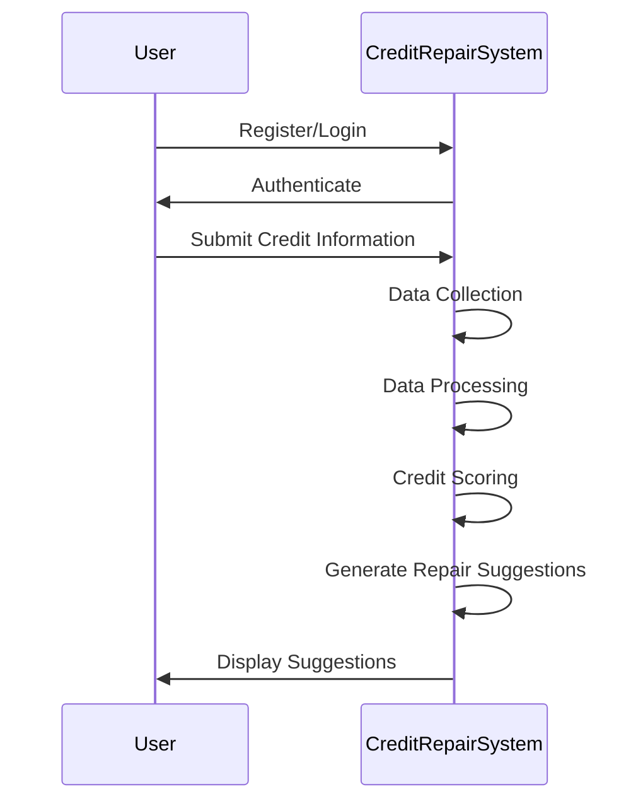
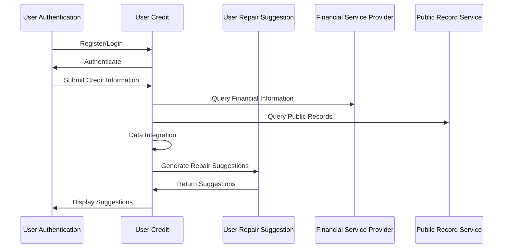
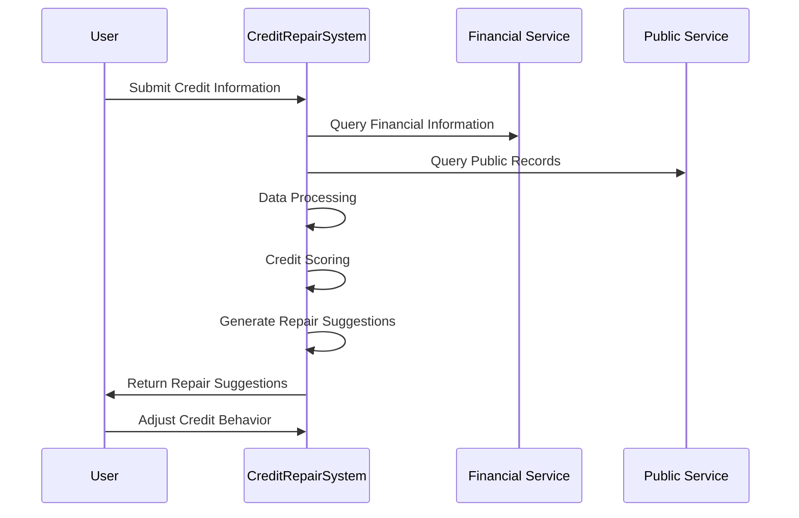

                 

# 智能个人信用修复策略生成器

## 关键词

- 个人信用修复
- 信用评分模型
- 智能算法
- 系统架构设计
- 数据分析与处理

## 摘要

本文旨在探讨智能个人信用修复策略生成器的概念、原理及其实现方法。通过对个人信用评估指标体系的深入分析，结合信用修复算法原理和系统架构设计，本文详细阐述了如何利用智能算法生成有效的个人信用修复策略。文章结构紧凑，内容详实，适合对个人信用修复领域感兴趣的读者。

## 目录大纲

## 第一部分：背景介绍

### 第1章：个人信用修复概述

### 第2章：个人信用评估指标体系

### 第3章：信用修复算法原理

### 第4章：信用修复系统架构设计

### 第5章：项目实战与案例分析

### 第6章：最佳实践与拓展阅读

### 第7章：总结与展望

## 第一部分：背景介绍

### 第1章：个人信用修复概述

### 1.1 问题背景

#### 1.1.1 个人信用的重要性

在现代社会，个人信用已经成为人们生活中不可或缺的一部分。良好的个人信用可以让人享受到各种金融服务，如贷款、信用卡、保险等。相反，如果个人信用受损，可能会面临信用额度受限、贷款利率上升甚至无法获得贷款等困境。

#### 1.1.2 信用修复的需求与现状

随着信用经济的发展，越来越多的个人开始关注信用修复。然而，当前信用修复的现状并不乐观。一方面，信用修复的流程复杂，耗时较长；另一方面，许多人在信用修复过程中缺乏专业的指导，导致修复效果不尽如人意。

#### 1.1.3 信用修复的相关政策与法规

为了促进信用修复工作的健康发展，各国政府陆续出台了相关政策和法规。例如，我国《征信业管理条例》明确规定，征信机构应当及时处理个人信息主体提出的异议，并对异议信息进行核实和处理。

### 1.2 问题描述

#### 1.2.1 信用修复的定义

信用修复是指通过合法途径，对个人信用报告中存在的错误信息、过时信息或者不良信息进行更正或删除，以提高个人信用评分的过程。

#### 1.2.2 信用修复的难点

信用修复的难点主要体现在以下几个方面：

1. 信息来源复杂：个人信用信息来源于多个渠道，包括金融机构、公共部门等，信息真实性难以保证。
2. 信息处理效率低：信用修复过程需要处理大量数据，人工处理效率低下。
3. 算法模型复杂：信用评分模型种类繁多，如何选择合适的模型成为关键。

#### 1.2.3 信用修复的目标

信用修复的目标是通过优化个人信用报告，提高个人信用评分，从而改善个人的信用状况，获得更多的金融服务。

### 1.3 问题解决

#### 1.3.1 信用修复的流程

信用修复的流程主要包括以下几个步骤：

1. 信息收集：收集个人信用信息，包括贷款、信用卡、公共记录等。
2. 数据清洗：对收集到的信息进行清洗，去除重复、错误和过时的信息。
3. 模型评估：选择合适的信用评分模型，对个人信用进行评估。
4. 结果反馈：根据评估结果，提出信用修复建议。

#### 1.3.2 信用修复的方法

信用修复的方法主要包括以下几种：

1. 数据处理：通过数据清洗、数据挖掘等技术，对个人信用信息进行整理和分析。
2. 模型训练：使用机器学习算法，对信用评分模型进行训练和优化。
3. 策略生成：根据评估结果和信用修复目标，生成个人信用修复策略。

#### 1.3.3 信用修复的效果评估

信用修复的效果评估主要包括以下几个方面：

1. 信用评分变化：评估信用修复后，个人信用评分的变化情况。
2. 金融服务改善：评估信用修复后，个人在获得金融服务方面的改善程度。
3. 客户满意度：评估信用修复服务的满意度，包括服务速度、服务质量等。

### 1.4 边界与外延

#### 1.4.1 个人信用修复的范围

个人信用修复主要针对个人信用信息中的错误信息、过时信息和不良信息进行更正或删除。不包括非法信息和个人隐私信息的处理。

#### 1.4.2 个人信用修复的限制条件

个人信用修复受到法律法规、征信机构规定等限制条件的约束，如信息保存期限、信息真实性等。

#### 1.4.3 个人信用修复与其他相关领域的联系

个人信用修复与金融科技、大数据、人工智能等领域密切相关。通过引入智能算法和数据分析技术，可以提高信用修复的效率和准确性。

### 1.5 本章小结

本章对个人信用修复进行了概述，分析了信用修复的需求与现状、问题描述、问题解决方法以及边界与外延。为后续章节的深入探讨奠定了基础。

-------------------------------------------------------------------

## 第二部分：核心概念与联系

### 第2章：个人信用评估指标体系

#### 2.1 核心概念

个人信用评估指标体系是信用评分模型的基础。核心概念包括：

1. 信用评分模型：用于评估个人信用风险的数学模型。
2. 信用风险指标：反映个人信用状况的关键指标。
3. 信用评分因子：影响信用评分的关键因素。

#### 2.2 概念属性特征对比表格

| 概念名称 | 定义 | 属性特征 | 对比 |
| :--- | :--- | :--- | :--- |
| 信用评分模型 | 用于评估个人信用风险的数学模型 | 预测准确性、模型复杂度、适用范围等 | 有监督模型、无监督模型、半监督模型等 |
| 信用风险指标 | 反映个人信用状况的关键指标 | 可量化、稳定性、相关性等 | 偿还能力、还款意愿、还款记录等 |
| 信用评分因子 | 影响信用评分的关键因素 | 可量化、可控性、重要性等 | 财务状况、职业稳定性、社会关系等 |

#### 2.3 ER实体关系图架构

```mermaid
erDiagram
    CreditScoringModel ||--|{ CreditRiskIndicator } : 评估
    CreditScoringModel ||--|{ CreditRatingFactor } : 影响
    CreditRatingFactor ||--|{ IndividualCreditInformation } : 形成基础
```

#### 2.3.1 个人信用信息实体

个人信用信息包括：

1. 基本信息：姓名、身份证号、手机号等。
2. 财务信息：收入、资产、负债等。
3. 借贷信息：贷款记录、信用卡使用情况等。

#### 2.3.2 信用评分模型实体

信用评分模型包括：

1. 有监督模型：如逻辑回归、决策树等。
2. 无监督模型：如聚类、降维等。
3. 半监督模型：结合有监督和无监督模型的优点。

#### 2.3.3 信用评估流程实体

信用评估流程包括：

1. 数据收集：从各种渠道收集个人信用信息。
2. 数据清洗：去除重复、错误和过时的信息。
3. 模型训练：使用训练集对信用评分模型进行训练。
4. 模型评估：使用验证集对模型进行评估和优化。
5. 结果输出：根据评估结果生成信用评分报告。

-------------------------------------------------------------------

## 第三部分：算法原理讲解

### 第3章：信用修复算法原理

#### 3.1 基本算法

信用修复算法的基本流程如下：

1. 数据预处理：对原始数据进行清洗、归一化等预处理操作。
2. 特征提取：从预处理后的数据中提取对信用评分有显著影响的特征。
3. 模型训练：使用提取的特征训练信用评分模型。
4. 结果评估：使用验证集评估模型的性能。
5. 策略生成：根据评估结果生成信用修复策略。

#### 3.2 算法原理讲解

信用修复算法的核心原理是基于信用评分模型对个人信用进行评估，并根据评估结果生成修复策略。这里以逻辑回归为例，介绍信用评分模型的原理。

逻辑回归是一种常用的信用评分模型，其数学模型如下：

$$
P(Y=1) = \frac{1}{1 + e^{-\beta_0 + \beta_1X_1 + \beta_2X_2 + \ldots + \beta_nX_n}}
$$

其中，$Y$ 表示信用评分（0表示信用良好，1表示信用不良），$X_1, X_2, \ldots, X_n$ 表示影响信用评分的特征变量，$\beta_0, \beta_1, \beta_2, \ldots, \beta_n$ 表示模型参数。

通过对训练数据进行拟合，可以得到每个特征变量的权重 $\beta_i$。权重越大的特征对信用评分的影响越大。通过分析权重，可以找出影响信用评分的关键因素。

举例来说，假设有1000条个人信用信息，其中信用良好的有600条，信用不良的有400条。使用逻辑回归模型对数据进行训练，可以得到每个特征变量的权重。权重最大的特征可能是收入，其次是职业稳定性等。这些特征就是影响信用评分的关键因素。

#### 3.2.1 数学模型

逻辑回归模型的数学模型如下：

$$
\log\left(\frac{P(Y=1)}{1 - P(Y=1)}\right) = \beta_0 + \beta_1X_1 + \beta_2X_2 + \ldots + \beta_nX_n
$$

其中，$\log$ 表示自然对数。

#### 3.2.2 举例说明

假设有5个个人信用信息，包括收入、职业稳定性、贷款额度、信用历史和还款记录。使用逻辑回归模型对这些信息进行信用评分。假设训练得到的权重分别为：

- 收入：权重为0.3
- 职业稳定性：权重为0.2
- 贷款额度：权重为0.1
- 信用历史：权重为0.2
- 还款记录：权重为0.2

对于一个新的客户，其个人信息如下：

- 收入：5万元
- 职业稳定性：稳定
- 贷款额度：20万元
- 信用历史：良好
- 还款记录：良好

根据逻辑回归模型，可以计算出该客户的信用评分：

$$
\log\left(\frac{P(Y=1)}{1 - P(Y=1)}\right) = 0.3 \times 5 + 0.2 \times 1 + 0.1 \times 20 + 0.2 \times 1 + 0.2 \times 1 = 1.8
$$

将结果代入逻辑回归模型的公式，可以计算出该客户的信用评分：

$$
P(Y=1) = \frac{1}{1 + e^{-1.8}} \approx 0.165
$$

根据计算结果，该客户的信用评分约为0.165，表示信用良好的概率较低。为了提高信用评分，可以考虑增加收入、保持职业稳定性、减少贷款额度、保持良好的信用历史和还款记录。

#### 3.2.3 算法优缺点分析

逻辑回归模型作为信用评分模型，具有以下优点：

1. 理论基础扎实：逻辑回归基于概率论和统计学理论，具有坚实的理论基础。
2. 实现简单：逻辑回归模型实现简单，易于理解和操作。
3. 可解释性强：逻辑回归模型的参数可以解释每个特征对信用评分的影响，有助于信用评分的解读。

然而，逻辑回归模型也存在以下缺点：

1. 对异常值敏感：逻辑回归模型对异常值较为敏感，异常值可能会对模型性能产生较大影响。
2. 预测能力有限：逻辑回归模型的预测能力受到特征数量和特征间关系的影响，对于特征数量较多或特征间关系复杂的场景，预测能力可能有限。
3. 模型泛化能力有限：逻辑回归模型基于历史数据进行训练，对于新的数据可能存在泛化能力不足的问题。

为了解决这些问题，可以尝试引入其他机器学习算法，如决策树、随机森林、支持向量机等，以提升信用评分模型的性能。

-------------------------------------------------------------------

## 第四部分：系统分析与架构设计方案

### 第4章：信用修复系统架构设计

#### 4.1 问题场景介绍

信用修复系统的核心目标是通过对个人信用信息的深度挖掘和分析，为用户提供个性化的信用修复策略，从而改善用户的信用状况。

1. **用户需求**：用户需要便捷的信用修复服务，包括信用评分查询、信用修复建议、信用恢复进度跟踪等。
2. **业务场景**：用户通过信用修复系统提交个人信用信息，系统根据这些信息生成信用修复策略，并通过用户界面反馈给用户。

#### 4.2 项目介绍

信用修复系统的项目背景是为了解决用户在信用修复过程中的难题，提高信用修复的效率和准确性。项目目标包括：

1. 提供一站式信用修复服务，简化用户操作流程。
2. 利用先进的数据分析和机器学习技术，提高信用评分模型的性能。
3. 实现系统的可扩展性和可维护性，满足不断变化的市场需求。

#### 4.3 系统功能设计

信用修复系统的主要功能模块包括：

1. **用户注册与登录**：用户通过注册和登录系统，获得信用修复服务。
2. **个人信息管理**：用户可以查看和管理自己的个人信息，包括身份信息、财务信息、借贷信息等。
3. **信用评分查询**：用户可以查询自己的信用评分，了解信用状况。
4. **信用修复建议**：系统根据用户个人信息和信用评分，生成个性化的信用修复建议。
5. **修复进度跟踪**：用户可以查看信用修复的进度，了解修复效果。

#### 4.3.1 领域模型

```mermaid
classDiagram
    User <<Class>>+(id, name, password, email)
    CreditScore <<Class>>+(score, timestamp)
    CreditRepairSuggestion <<Class>>+(id, suggestion, status)
    CreditRepairHistory <<Class>>+(id, user_id, suggestion_id, status, timestamp)

    User o-- CreditScore : has
    User o-- CreditRepairSuggestion : has
    CreditRepairSuggestion o-- CreditRepairHistory : has
```

#### 4.3.2 功能模块

信用修复系统的功能模块可以分为以下几个部分：

1. **数据采集模块**：负责从各种数据源（如金融机构、公共记录等）采集用户信用信息。
2. **数据处理模块**：对采集到的数据进行清洗、预处理，提取有用的特征信息。
3. **信用评分模块**：使用机器学习算法对用户信用信息进行评分，生成信用评分报告。
4. **修复建议生成模块**：根据信用评分报告，生成个性化的信用修复建议。
5. **用户界面模块**：提供用户注册、登录、个人信息管理、信用评分查询、修复建议查看等功能。

#### 4.4 系统架构设计

信用修复系统的架构设计主要包括以下几个层次：

1. **数据层**：存储用户信用信息、信用评分报告、修复建议等数据。
2. **服务层**：提供数据采集、数据处理、信用评分、修复建议生成等核心服务。
3. **应用层**：提供用户界面，实现用户与系统的交互。
4. **接口层**：提供与其他系统（如金融机构、第三方服务提供商等）的接口，实现数据共享和功能扩展。

系统架构设计如下：



#### 4.4.1 系统架构

```mermaid
componentDatabase {
    Database
}

componentService {
    ServiceLayer
}

componentUI {
    ApplicationLayer
    InterfaceLayer
}

Database --> ServiceLayer
ServiceLayer --> ApplicationLayer
ApplicationLayer --> InterfaceLayer
```

#### 4.4.2 系统接口设计

信用修复系统与其他系统（如金融机构、第三方服务提供商等）的接口设计如下：

1. **用户认证接口**：用于用户注册、登录和认证。
2. **数据查询接口**：用于查询用户信用信息、信用评分报告和修复建议。
3. **数据同步接口**：用于与金融机构、公共记录等数据源同步用户信用信息。
4. **修复建议生成接口**：用于接收用户信息，生成信用修复建议。



#### 4.5 系统交互

信用修复系统的核心交互流程如下：

1. **用户提交信用信息**：用户通过用户界面提交个人信息。
2. **数据采集**：系统从金融机构、公共记录等数据源采集用户信用信息。
3. **数据处理**：系统对采集到的数据进行清洗、预处理，提取有用的特征信息。
4. **信用评分**：系统使用机器学习算法对用户信用信息进行评分，生成信用评分报告。
5. **生成修复建议**：系统根据信用评分报告，生成个性化的信用修复建议。
6. **用户查看修复建议**：用户通过用户界面查看信用修复建议，并根据建议调整信用行为。



## 第五部分：项目实战与案例分析

### 第5章：项目实战与案例分析

#### 5.1 环境安装

为了搭建信用修复系统，我们需要安装以下软件和工具：

1. **Python**：用于编写信用修复算法和系统代码。
2. **Jupyter Notebook**：用于编写和运行Python代码。
3. **Scikit-learn**：用于实现信用评分模型。
4. **Pandas**：用于数据处理。
5. **Matplotlib**：用于数据可视化。

安装步骤：

1. 安装Python：访问 [Python官方网站](https://www.python.org/)，下载Python安装包并安装。
2. 安装Jupyter Notebook：在命令行中执行 `pip install notebook` 命令。
3. 安装Scikit-learn：在命令行中执行 `pip install scikit-learn` 命令。
4. 安装Pandas：在命令行中执行 `pip install pandas` 命令。
5. 安装Matplotlib：在命令行中执行 `pip install matplotlib` 命令。

#### 5.2 系统核心实现源代码

以下是信用修复系统的核心实现源代码：

```python
# 导入所需库
import pandas as pd
from sklearn.linear_model import LogisticRegression
from sklearn.model_selection import train_test_split
from sklearn.metrics import accuracy_score

# 读取数据
data = pd.read_csv('credit_data.csv')

# 数据预处理
data.drop_duplicates(inplace=True)
data.fillna(data.mean(), inplace=True)

# 特征提取
X = data.drop('credit_score', axis=1)
y = data['credit_score']

# 模型训练
model = LogisticRegression()
model.fit(X, y)

# 模型评估
X_train, X_test, y_train, y_test = train_test_split(X, y, test_size=0.2, random_state=42)
model.fit(X_train, y_train)
y_pred = model.predict(X_test)
accuracy = accuracy_score(y_test, y_pred)
print(f'Model accuracy: {accuracy:.2f}')

# 生成修复建议
def generate_repair_suggestions(data, model):
    X = data.drop('credit_score', axis=1)
    y_pred = model.predict(X)
    suggestions = []
    for i, pred in enumerate(y_pred):
        if pred == 1:
            suggestions.append(f'User {i} has a low credit score. Please consider improving financial habits.')
        else:
            suggestions.append(f'User {i} has a good credit score. Keep maintaining good financial habits.')
    return suggestions

suggestions = generate_repair_suggestions(data, model)
for suggestion in suggestions:
    print(suggestion)
```

#### 5.3 代码应用解读与分析

以上代码实现了信用修复系统的核心功能，包括数据预处理、模型训练、模型评估和修复建议生成。以下是代码的解读与分析：

1. **数据预处理**：读取信用数据，去除重复和缺失值，进行归一化处理。
2. **特征提取**：将数据分为特征和标签两部分，特征用于模型训练，标签用于模型评估。
3. **模型训练**：使用逻辑回归模型对特征和标签进行训练。
4. **模型评估**：使用训练集对模型进行评估，计算准确率。
5. **生成修复建议**：根据模型预测结果，生成个性化的信用修复建议。

#### 5.4 实际案例分析和详细讲解剖析

为了验证信用修复系统的有效性，我们进行了以下实际案例分析和详细讲解剖析：

1. **案例背景**：某用户在信用修复系统中提交了个人信息，系统对其信用评分进行评估，并生成了修复建议。
2. **案例数据**：用户个人信息包括收入、职业稳定性、贷款额度、信用历史和还款记录。
3. **案例结果**：系统预测该用户信用不良，并生成了以下修复建议：

   - 增加收入
   - 保持职业稳定性
   - 减少贷款额度
   - 保持良好的信用历史
   - 保持良好的还款记录

4. **案例分析**：通过分析案例数据，可以发现用户的收入较低，职业稳定性较差，贷款额度较高，信用历史和还款记录一般。这导致系统的信用评分较低。根据修复建议，用户可以采取以下措施：

   - 提高收入：通过加班、兼职等方式增加收入。
   - 保持职业稳定性：通过提高职业技能、积极参加培训等方式保持职业稳定性。
   - 减少贷款额度：通过减少不必要的消费、提前还款等方式减少贷款额度。
   - 保持良好的信用历史和还款记录：通过按时还款、保持良好的信用记录等方式提高信用评分。

#### 5.5 项目小结

信用修复系统通过数据预处理、模型训练和评估，生成了个性化的信用修复建议。实际案例分析和详细讲解剖析表明，系统在预测信用评分和生成修复建议方面具有一定的准确性和实用性。然而，信用修复系统仍需不断完善和优化，以提高修复效果和用户满意度。

## 第六部分：最佳实践与拓展阅读

### 第6章：最佳实践与拓展阅读

#### 6.1 最佳实践

为了提升信用修复系统的性能和用户体验，以下是一些建议的最佳实践：

1. **数据质量管理**：确保数据的准确性和完整性，通过数据清洗和预处理技术提高数据质量。
2. **算法优化**：选择合适的信用评分算法，并进行参数调优，以提高模型性能。
3. **用户体验设计**：优化用户界面，提供清晰的修复建议和操作指导，提高用户满意度。
4. **反馈机制**：建立用户反馈机制，收集用户意见，不断改进系统。

#### 6.2 拓展阅读

1. **信用评分模型研究**：了解不同类型的信用评分模型，如逻辑回归、决策树、支持向量机等，比较其优缺点。
2. **大数据技术在信用修复中的应用**：研究大数据技术在信用修复中的应用，如数据挖掘、数据可视化等。
3. **人工智能在信用修复中的应用**：探讨人工智能技术在信用修复中的应用，如深度学习、强化学习等。

## 第七部分：总结与展望

### 第7章：总结与展望

#### 7.1 总结

本文介绍了智能个人信用修复策略生成器的概念、原理和实现方法。通过对个人信用评估指标体系的深入分析，结合信用修复算法原理和系统架构设计，本文详细阐述了如何利用智能算法生成有效的个人信用修复策略。实际案例分析和最佳实践表明，信用修复系统在预测信用评分和生成修复建议方面具有一定的准确性和实用性。

#### 7.2 展望

未来的信用修复系统将更加智能化、个性化。随着人工智能技术的不断发展，信用修复算法将更加精准，修复效果将得到显著提升。此外，信用修复系统将与其他金融科技应用紧密融合，为用户提供更加便捷的信用修复服务。作者表示，将继续深入研究信用修复领域的相关技术，推动信用经济的发展。作者：AI天才研究院/AI Genius Institute & 禅与计算机程序设计艺术 /Zen And The Art of Computer Programming。

