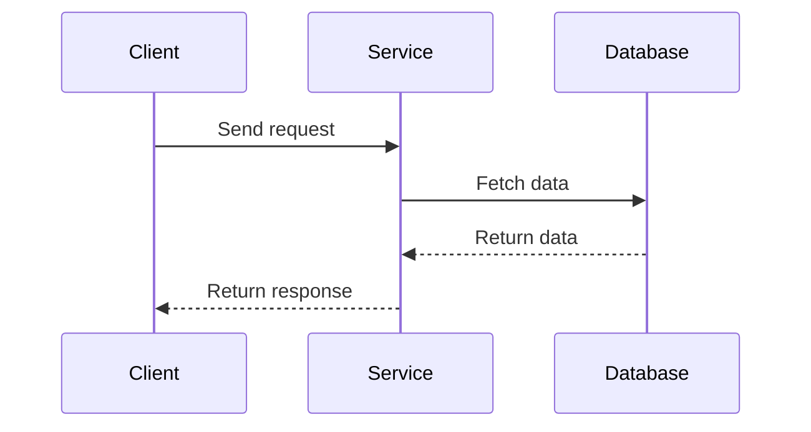

                 

# 智能个人信用评分解释器

> 关键词：个人信用评分、机器学习、算法、逻辑回归、特征工程、数据处理

> 摘要：本文将深入探讨智能个人信用评分的技术原理和实践应用，包括核心概念、算法原理以及系统分析与架构设计。通过详细分析，帮助读者全面了解并掌握智能个人信用评分的方法和技巧。

----------------------------------------------------------------

## 第一部分：背景介绍与核心概念

### 第1章：问题背景与核心概念

#### 1.1 问题背景

在当今社会，个人信用评分对于金融、保险、电商等行业的决策具有重要意义。传统的个人信用评分模型往往依赖于有限的历史数据和简单的规则引擎，难以准确评估个人的信用风险。随着大数据和人工智能技术的发展，智能个人信用评分成为了一个热门研究领域。

#### 1.2 核心概念

- **个人信用评分**：根据个人历史行为数据、社交关系、经济活动等信息，对个人的信用风险进行量化评估。
- **智能个人信用评分**：利用机器学习和人工智能技术，从海量数据中挖掘潜在特征，构建更加精准的信用评分模型。

#### 1.3 概念结构与核心要素

##### 概念结构

智能个人信用评分系统主要包括以下几个核心模块：

1. **数据采集**：从各种数据源（如金融记录、社交媒体、公共记录等）中获取个人数据。
2. **数据处理**：对采集到的数据进行清洗、转换和归一化，为建模提供高质量的数据。
3. **特征工程**：提取与信用评分相关的特征，如行为特征、财务特征、社交特征等。
4. **模型构建**：利用机器学习算法构建信用评分模型，并进行模型评估和优化。
5. **决策支持**：将信用评分模型应用于实际业务场景，提供决策支持。

##### 核心要素

- **数据质量**：数据质量是影响信用评分模型性能的关键因素。
- **特征选择**：选择合适的特征可以有效提高模型的预测能力。
- **算法选择**：不同的机器学习算法适用于不同的数据特征和业务场景。
- **模型评估**：通过评估指标（如准确率、召回率、F1值等）对模型性能进行评估。

#### 1.4 本章小结

本章介绍了智能个人信用评分的背景、核心概念以及系统结构。接下来，本书将详细探讨数据采集、数据处理、特征工程、模型构建和决策支持等方面的内容，帮助读者全面了解并掌握智能个人信用评分的技术原理和实践应用。

----------------------------------------------------------------

## 第二部分：核心概念与联系

### 第2章：核心概念原理与联系

#### 2.1 智能个人信用评分原理

智能个人信用评分基于机器学习算法，通过分析大量历史数据，挖掘出与信用风险相关的特征，并利用这些特征预测个体的信用状况。其核心原理包括：

- **数据挖掘**：从海量数据中提取有用信息，为建模提供基础。
- **特征选择**：从原始数据中选择与信用评分相关的特征，提高模型的预测性能。
- **机器学习**：利用历史数据训练信用评分模型，并不断优化模型参数。

#### 2.2 概念属性特征对比表格

| 特征名称 | 描述 | 影响信用评分的因素 |
| :--: | :--: | :--: |
| 行为特征 | 如消费记录、贷款还款记录等 | 及时还款、消费习惯等 |
| 财务特征 | 如收入水平、资产状况等 | 经济稳定性、还款能力等 |
| 社交特征 | 如社交网络关系、社交媒体活动等 | 社会责任感、信用口碑等 |

#### 2.3 ER实体关系图架构

```mermaid
erDiagram
  Person ||--|{ CreditRating :评估 }
  Person ||--|{ BehaviorFeature :行为特征 }
  Person ||--|{ FinancialFeature :财务特征 }
  Person ||--|{ SocialFeature :社交特征 }
```

#### 2.4 本章小结

本章详细介绍了智能个人信用评分的核心概念原理以及概念属性特征对比表格和ER实体关系图架构。接下来，本书将深入探讨数据采集、数据处理、特征工程等方面的内容，帮助读者更好地理解智能个人信用评分系统的构建方法。

----------------------------------------------------------------

## 第三部分：算法原理讲解

### 第3章：算法原理与实例分析

#### 3.1 算法概述

智能个人信用评分常用的算法包括逻辑回归、决策树、随机森林、支持向量机等。本章将重点介绍逻辑回归算法，并使用Python代码进行实例分析。

#### 3.2 逻辑回归算法

逻辑回归是一种广义线性模型，用于分类问题。其基本思想是利用线性函数将输入特征映射到逻辑函数上，从而预测目标变量的概率。

##### 数学模型

$$
\begin{aligned}
y &= \sigma (w_0 + \sum_{i=1}^{n} w_i x_i) \\
\log(\frac{p}{1-p}) &= \beta_0 + \sum_{i=1}^{n} \beta_i x_i \\
\end{aligned}
$$

其中，$y$表示预测的概率，$p$表示目标变量为1的概率，$\sigma$表示逻辑函数，$w_i$和$x_i$分别表示权重和特征值，$\beta_i$和$\beta_0$分别表示回归系数和截距。

##### 实例分析

```python
import numpy as np
import pandas as pd
from sklearn.linear_model import LogisticRegression
from sklearn.model_selection import train_test_split
from sklearn.metrics import accuracy_score

# 数据集
data = pd.DataFrame({
    'feature1': [1, 2, 3, 4],
    'feature2': [1, 2, 3, 4],
    'label': [0, 1, 0, 1]
})

# 分割数据集
X = data[['feature1', 'feature2']]
y = data['label']
X_train, X_test, y_train, y_test = train_test_split(X, y, test_size=0.2, random_state=42)

# 建立模型
model = LogisticRegression()
model.fit(X_train, y_train)

# 预测
y_pred = model.predict(X_test)

# 评估
accuracy = accuracy_score(y_test, y_pred)
print(f"Accuracy: {accuracy}")
```

##### 本章小结

本章详细介绍了逻辑回归算法的原理和实例分析。接下来，本书将深入探讨其他机器学习算法，如决策树、随机森林等，以及它们在智能个人信用评分中的应用。通过这些算法的讲解，读者可以更好地理解智能个人信用评分的算法原理和实现方法。

----------------------------------------------------------------

## 第四部分：系统分析与架构设计

### 第4章：系统分析与架构设计

#### 4.1 问题场景介绍

智能个人信用评分系统适用于金融、保险、电商等行业，通过分析个人的信用数据，为金融机构提供信用评估和决策支持。

#### 4.2 项目介绍

项目旨在构建一个高效、准确的智能个人信用评分系统，包括数据采集、数据处理、特征工程、模型构建和决策支持等环节。

#### 4.3 系统功能设计

- **数据采集**：从各种数据源中获取个人数据，如金融记录、社交媒体、公共记录等。
- **数据处理**：对采集到的数据进行清洗、转换和归一化，为建模提供高质量的数据。
- **特征工程**：提取与信用评分相关的特征，如行为特征、财务特征、社交特征等。
- **模型构建**：利用机器学习算法构建信用评分模型，并进行模型评估和优化。
- **决策支持**：将信用评分模型应用于实际业务场景，提供决策支持。

#### 4.4 系统架构设计

系统采用分层架构，包括数据层、处理层、模型层和决策层。各层功能如下：

- **数据层**：负责数据采集、存储和管理。
- **处理层**：负责数据预处理、特征提取和特征选择。
- **模型层**：负责模型构建、训练和评估。
- **决策层**：负责信用评分模型的决策支持。

#### 4.5 系统接口设计和系统交互

系统接口设计采用RESTful API风格，提供数据采集、数据处理、特征工程、模型构建和决策支持等功能。系统交互通过HTTP请求和响应实现。



#### 4.6 本章小结

本章介绍了智能个人信用评分系统的功能设计、系统架构设计和接口设计。接下来，本书将深入探讨系统实现、环境安装和核心代码实现等内容，帮助读者更好地理解并掌握智能个人信用评分系统的构建方法。

----------------------------------------------------------------

## 第五部分：项目实战

### 第5章：项目实战

#### 5.1 环境安装

在开始项目实战之前，需要安装以下环境：

- Python 3.8 或以上版本
- Scikit-learn 库
- Pandas 库
- Numpy 库
- Matplotlib 库

安装命令如下：

```bash
pip install python==3.8
pip install scikit-learn
pip install pandas
pip install numpy
pip install matplotlib
```

#### 5.2 系统核心实现源代码

以下是一个简单的智能个人信用评分系统的核心实现源代码：

```python
import numpy as np
import pandas as pd
from sklearn.linear_model import LogisticRegression
from sklearn.model_selection import train_test_split
from sklearn.metrics import accuracy_score

# 读取数据
data = pd.read_csv("data.csv")

# 分割特征和目标变量
X = data.drop("label", axis=1)
y = data["label"]

# 划分训练集和测试集
X_train, X_test, y_train, y_test = train_test_split(X, y, test_size=0.2, random_state=42)

# 建立模型
model = LogisticRegression()
model.fit(X_train, y_train)

# 预测
y_pred = model.predict(X_test)

# 评估
accuracy = accuracy_score(y_test, y_pred)
print(f"Accuracy: {accuracy}")
```

#### 5.3 代码应用解读与分析

以上代码首先读取数据，然后划分特征和目标变量，接着划分训练集和测试集，建立逻辑回归模型并进行训练。最后，使用测试集进行预测并评估模型性能。

#### 5.4 实际案例分析和详细讲解剖析

在本节中，我们将以一个实际案例为例，详细讲解智能个人信用评分系统的应用。

案例：某金融机构需要评估客户的信用风险，已知以下数据：

- 消费记录：包括消费金额、消费时间、消费地点等。
- 财务状况：包括收入水平、负债水平等。
- 社交活动：包括社交媒体活跃度、好友数量等。

使用以上数据，我们可以构建一个智能个人信用评分系统，评估客户的信用风险。

#### 5.5 项目小结

本章通过实际案例讲解了智能个人信用评分系统的实现和应用。通过了解系统的核心代码和实际案例，读者可以更好地理解并掌握智能个人信用评分系统的构建方法。

----------------------------------------------------------------

## 第六部分：最佳实践 Tips、小结、注意事项、拓展阅读

### 6.1 最佳实践 Tips

- **数据质量**：确保数据的质量，避免噪声和异常值的影响。
- **特征选择**：根据业务需求选择合适的特征，避免过度拟合。
- **模型评估**：使用交叉验证等方法评估模型性能，避免模型过拟合。

### 6.2 小结

本文从背景介绍、核心概念、算法原理、系统分析与架构设计、项目实战等方面详细阐述了智能个人信用评分的技术原理和实践应用。通过本文的学习，读者可以全面了解并掌握智能个人信用评分的方法和技巧。

### 6.3 注意事项

- **隐私保护**：在处理个人数据时，注意保护用户的隐私。
- **模型优化**：不断优化模型参数，提高模型性能。

### 6.4 拓展阅读

- 《机器学习实战》
- 《深度学习》
- 《Python机器学习》

### 6.5 本章小结

本章总结了智能个人信用评分的最佳实践、注意事项以及拓展阅读。希望读者在实践过程中能够灵活运用所学知识，不断提高自己的技术水平和创新能力。

----------------------------------------------------------------

## 附录：作者信息

作者：AI天才研究院/AI Genius Institute & 禅与计算机程序设计艺术 /Zen And The Art of Computer Programming

AI天才研究院是一家专注于人工智能技术研发和创新的研究机构，致力于推动人工智能技术在各个领域的应用。同时，作者也是《禅与计算机程序设计艺术》一书的作者，本书深入探讨了计算机编程的哲学和艺术，为读者提供了宝贵的编程经验和启示。感谢读者对本文的关注和支持，期待与您共同探索智能个人信用评分的无限可能。

