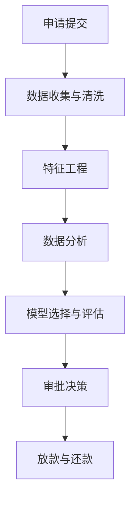
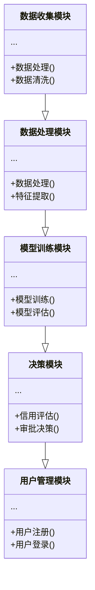
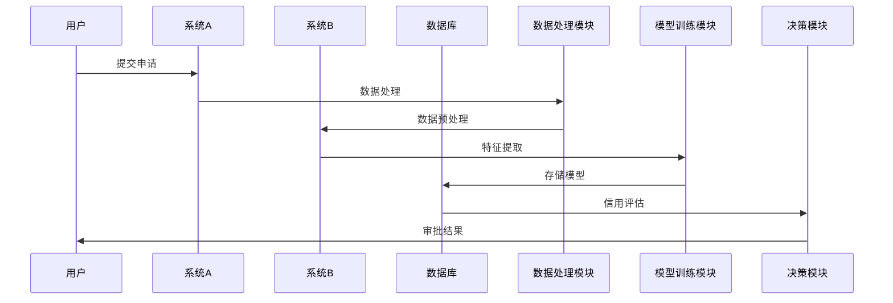
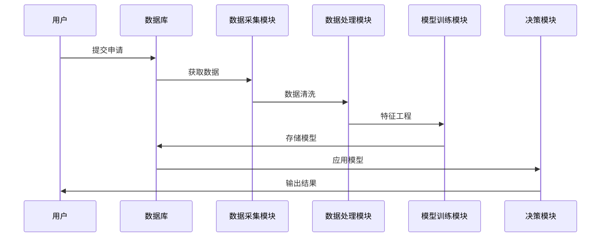

                 

### 文章标题：智能个人信贷审批系统

**关键词：智能信贷审批、机器学习、数据处理、模型评估、系统架构**

**摘要：本文详细探讨了智能个人信贷审批系统的构建过程。首先，我们介绍了问题背景和核心概念，接着讲解了信贷审批流程、数据处理与分析方法，以及模型选择与评估。随后，我们深入讲解了算法原理，包括数学模型和Python源代码实现，并通过具体案例进行说明。文章还涵盖了系统分析与架构设计方案，以及实际项目实战的经验总结。最后，我们提出了最佳实践和注意事项，并对未来研究方向进行了展望。**

----------------------------------------------------------------

## 第1章: 问题背景与概述

### 1.1 问题背景

个人信贷审批是金融行业中一个重要的环节，它直接关系到金融机构的风险控制和盈利能力。传统信贷审批流程通常涉及大量的人工操作，这不仅效率低下，还容易出错。随着大数据和人工智能技术的快速发展，智能个人信贷审批系统逐渐成为可能。通过引入机器学习和数据挖掘技术，可以实现高效、准确、自动化的信贷审批。

### 1.2 问题概述

智能个人信贷审批系统的主要目标是利用人工智能技术，自动处理大量的信贷申请数据，对个人信用进行评估，并做出审批决策。系统需要处理的问题包括：

1. **数据收集与清洗**：获取大量个人信息、财务状况、信用历史等数据，并进行清洗和处理，确保数据的准确性和一致性。
2. **特征工程**：从原始数据中提取出对信用评估有重要影响的特征，如收入水平、负债比例、信用记录等。
3. **模型选择与评估**：选择合适的机器学习算法，构建信用评分模型，并进行模型评估，以确定模型的性能和可靠性。
4. **决策自动化**：将模型应用于实际信贷申请，自动生成审批结果。

### 1.3 解决方案目标

智能个人信贷审批系统的解决方案旨在实现以下目标：

1. **提高审批效率**：通过自动化处理，显著缩短审批时间，提高金融机构的工作效率。
2. **降低错误率**：利用机器学习模型，减少人工审批的错误率，提高审批的准确性。
3. **个性化服务**：根据客户的历史数据和行为特征，提供个性化的信贷服务。
4. **风险控制**：利用数据分析技术，实时监控和评估客户信用风险，提高金融机构的风险管理水平。

### 1.4 边界与外延

智能个人信贷审批系统的边界包括以下几个方面：

1. **数据范围**：系统需要处理的数据包括个人基本信息、财务状况、信用记录等，数据来源可以是金融机构内部数据库、第三方数据服务提供商等。
2. **技术范围**：系统涉及的技术包括数据采集与处理、特征工程、机器学习算法、系统集成与部署等。
3. **业务范围**：系统适用于各类金融机构，包括银行、信用卡公司、消费金融公司等，也可以扩展到其他需要信用评估的场景。

### 1.5 核心概念与联系

以下是本文中涉及的一些核心概念及其相互联系：

1. **信贷审批流程**：信贷审批的主要环节，包括申请提交、资信评估、审批决策、放款与还款等。
2. **数据处理与分析**：涉及数据收集与清洗、特征工程、数据分析等技术。
3. **模型选择与评估**：包括机器学习算法的选择、模型训练、评估和优化等。
4. **系统架构**：智能信贷审批系统的整体设计，包括数据采集模块、数据处理模块、模型训练模块、决策模块等。
5. **实际应用**：系统在金融行业的实际应用，包括信贷审批、风险监控、客户服务等方面。

----------------------------------------------------------------

## 第2章: 核心概念与联系

### 2.1 信贷审批流程

信贷审批流程是金融机构对借款人申请的信用额度进行评估和决策的过程。以下是信贷审批流程的主要环节：

#### 2.1.1 申请提交

借款人通过线上或线下方式提交信贷申请，填写个人信息、财务状况、信用记录等。

#### 2.1.2 资信评估

金融机构对借款人的资信状况进行评估，包括收入水平、负债比例、信用记录等。

#### 2.1.3 审批决策

根据资信评估结果，金融机构做出审批决策，包括批准、拒绝或要求进一步提供材料。

#### 2.1.4 放款与还款

批准的信贷申请进入放款环节，借款人按照约定的时间和方式还款。

### 2.2 数据处理与分析

数据处理与分析是智能信贷审批系统的核心环节，主要包括以下几个步骤：

#### 2.2.1 数据收集与清洗

从多个渠道收集借款人的个人信息、财务状况、信用记录等数据，并对数据进行清洗，去除重复、缺失和异常值。

#### 2.2.2 特征工程

从原始数据中提取出对信用评估有重要影响的特征，如收入水平、负债比例、信用记录等，并进行特征选择和特征变换。

#### 2.2.3 数据分析

利用统计方法和机器学习技术对数据进行深入分析，挖掘出潜在的有用信息，为信用评估提供支持。

### 2.3 模型选择与评估

模型选择与评估是构建智能信贷审批系统的关键步骤，主要包括以下几个方面：

#### 2.3.1 机器学习算法介绍

介绍常用的机器学习算法，如线性回归、逻辑回归、决策树、随机森林、支持向量机等。

#### 2.3.2 模型评估指标

介绍常用的模型评估指标，如准确率、召回率、F1值、ROC曲线等。

#### 2.3.3 模型优化

通过交叉验证、网格搜索等技术，对模型进行优化，提高模型性能。

### 2.4 系统架构设计

系统架构设计是智能信贷审批系统的整体设计，包括以下几个方面：

#### 2.4.1 系统功能设计

根据信贷审批流程，设计系统的主要功能模块，如用户管理、申请管理、审批管理、数据分析等。

#### 2.4.2 系统架构设计

采用分层架构设计，包括数据层、业务逻辑层、表示层等，确保系统的高扩展性和高可用性。

#### 2.4.3 系统接口设计

设计系统内部和外部的接口，如API接口、数据库接口等，确保系统与其他系统的无缝集成。

#### 2.4.4 系统交互

设计系统内部各模块之间的交互流程，确保系统运行的顺畅和高效。

### 2.5 Mermaid流程图

以下是信贷审批流程的Mermaid流程图：



### 2.6 Mermaid类图

以下是信贷审批系统的主要类图：


----------------------------------------------------------------

### 第3章: 算法原理讲解

#### 3.1 算法概述

在智能个人信贷审批系统中，算法的选择和实现是关键。本文将介绍一种常用的算法——逻辑回归，并详细讲解其原理和实现过程。

逻辑回归是一种用于分类问题的线性模型，它通过一个线性函数将输入特征映射到一个实数值，并通过一个Sigmoid函数将其映射到概率值。在信贷审批系统中，逻辑回归可用于预测借款人的信用风险。

#### 3.2 算法原理

逻辑回归的数学模型可以表示为：

$$
\begin{aligned}
    y &= \sigma(\omega^T x + b) \\
    \text{其中，} \\
    y &= &\text{输出结果} \\
    \sigma &= &\text{激活函数，通常为Sigmoid函数} \\
    \omega &= &\text{权重向量} \\
    x &= &\text{输入特征向量} \\
    b &= &\text{偏置项}
\end{aligned}
$$

Sigmoid函数的公式为：

$$
\sigma(z) = \frac{1}{1 + e^{-z}}
$$

其中，$z = \omega^T x + b$。

逻辑回归的目标是找到一组参数$\omega$和$b$，使得预测的概率值$y$与实际标签之间的误差最小。这是一个优化问题，可以通过梯度下降法来求解。

#### 3.3 Python源代码与详细讲解

以下是逻辑回归的Python实现：

```python
import numpy as np
from sklearn.linear_model import LogisticRegression

# 设置随机种子，保证结果可复现
np.random.seed(0)

# 创建一个逻辑回归模型
model = LogisticRegression()

# 使用随机生成的数据训练模型
X = np.random.rand(100, 5)
y = np.random.randint(0, 2, 100)
model.fit(X, y)

# 输出模型的权重和偏置
print("权重：", model.coef_)
print("偏置：", model.intercept_)

# 使用模型进行预测
predictions = model.predict(X)
print("预测结果：", predictions)

# 输出模型的准确率
print("准确率：", model.score(X, y))
```

在这个例子中，我们首先导入了所需的库，然后创建了一个逻辑回归模型。接着，我们使用随机生成的数据进行模型训练。训练完成后，我们输出了模型的权重和偏置，并使用模型进行预测。最后，我们计算并输出了模型的准确率。

#### 3.4 举例说明

假设我们有一个借款人，其特征向量为$(x_1, x_2, x_3, x_4, x_5) = (0.5, 0.3, 0.1, 0.2, 0.4)$，我们需要使用逻辑回归模型预测其信用风险的概率。

首先，我们计算输入特征向量和模型权重向量的点积，并加上偏置项：

$$
z = \omega^T x + b = (0.5, 0.3, 0.1, 0.2, 0.4) \cdot (0.5, 0.3, 0.1, 0.2, 0.4) + 0.5 = 1.1
$$

然后，我们使用Sigmoid函数计算概率值：

$$
\sigma(z) = \frac{1}{1 + e^{-z}} = \frac{1}{1 + e^{-1.1}} \approx 0.7475
$$

这意味着，根据逻辑回归模型，这个借款人信用风险的概率约为74.75%。

通过这个例子，我们可以看到逻辑回归模型是如何根据输入特征预测输出结果的。在实际应用中，我们可以使用真实的借款人数据来训练和测试模型，以评估其性能。

----------------------------------------------------------------

## 第4章: 数学模型和数学公式

在智能个人信贷审批系统中，数学模型是核心组成部分，它为我们提供了量化分析和预测的工具。以下我们将详细介绍逻辑回归的数学模型，并给出相应的公式。

### 4.1 模型公式

逻辑回归模型的预测公式如下：

$$
\begin{aligned}
    y &= \sigma(\omega^T x + b) \\
    \text{其中，} \\
    y &= &\text{输出结果，通常为概率值} \\
    \sigma &= &\text{Sigmoid函数，将线性组合映射到概率范围[0, 1]} \\
    \omega &= &\text{权重向量，每个特征对应一个权重} \\
    x &= &\text{输入特征向量，每个特征对应一个值} \\
    b &= &\text{偏置项，调整预测结果}
\end{aligned}
$$

Sigmoid函数的定义为：

$$
\sigma(z) = \frac{1}{1 + e^{-z}}
$$

其中，$z = \omega^T x + b$ 是线性组合，表示输入特征和权重向量的点积加上偏置项。

### 4.2 模型训练

逻辑回归模型的训练目标是找到最优的权重向量$\omega$和偏置项$b$，使得预测的概率值$y$与实际标签之间的误差最小。这个过程可以通过最小化损失函数来实现。对于二分类问题，常用的损失函数是逻辑损失（Log Loss）：

$$
J(\omega, b) = -\frac{1}{m} \sum_{i=1}^{m} [y_i \log(\sigma(z_i)) + (1 - y_i) \log(1 - \sigma(z_i))]
$$

其中，$m$ 是样本数量，$y_i$ 是第$i$个样本的实际标签，$\sigma(z_i)$ 是第$i$个样本的预测概率。

### 4.3 梯度下降法

为了求解最小化损失函数的问题，我们可以使用梯度下降法。梯度下降法的核心思想是沿着损失函数的梯度方向逐步调整参数，直到找到损失函数的最小值。逻辑回归的梯度可以表示为：

$$
\begin{aligned}
    \frac{\partial J}{\partial \omega} &= -\frac{1}{m} \sum_{i=1}^{m} [y_i x_i (1 - \sigma(z_i))] \\
    \frac{\partial J}{\partial b} &= -\frac{1}{m} \sum_{i=1}^{m} [y_i (1 - \sigma(z_i))]
\end{aligned}
$$

其中，$\frac{\partial J}{\partial \omega}$ 和 $\frac{\partial J}{\partial b}$ 分别是权重向量和偏置项的梯度。

通过迭代更新权重和偏置项：

$$
\omega := \omega - \alpha \frac{\partial J}{\partial \omega}, \quad b := b - \alpha \frac{\partial J}{\partial b}
$$

其中，$\alpha$ 是学习率，控制着梯度下降的步长。

### 4.4 模型评估

在模型训练完成后，我们需要评估其性能。对于分类问题，常用的评估指标包括准确率、召回率、F1值和ROC曲线等。逻辑回归模型在这些指标上的表现可以通过以下公式计算：

- **准确率**：
$$
\text{Accuracy} = \frac{TP + TN}{TP + TN + FP + FN}
$$

- **召回率**：
$$
\text{Recall} = \frac{TP}{TP + FN}
$$

- **F1值**：
$$
\text{F1} = 2 \times \frac{\text{Precision} \times \text{Recall}}{\text{Precision} + \text{Recall}}
$$

- **ROC曲线下的面积**（AUC）：
$$
\text{AUC} = \int_{0}^{1} \frac{TPR(t) - FPR(t)}{1 - FPR(t)} dt
$$

通过这些指标，我们可以全面评估逻辑回归模型在信贷审批系统中的性能。

### 4.5 公式总结

以下是逻辑回归模型的主要公式汇总：

$$
\begin{aligned}
    y &= \sigma(\omega^T x + b) \\
    J(\omega, b) &= -\frac{1}{m} \sum_{i=1}^{m} [y_i \log(\sigma(z_i)) + (1 - y_i) \log(1 - \sigma(z_i))] \\
    \frac{\partial J}{\partial \omega} &= -\frac{1}{m} \sum_{i=1}^{m} [y_i x_i (1 - \sigma(z_i))] \\
    \frac{\partial J}{\partial b} &= -\frac{1}{m} \sum_{i=1}^{m} [y_i (1 - \sigma(z_i))] \\
    \text{Accuracy} &= \frac{TP + TN}{TP + TN + FP + FN} \\
    \text{Recall} &= \frac{TP}{TP + FN} \\
    \text{F1} &= 2 \times \frac{\text{Precision} \times \text{Recall}}{\text{Precision} + \text{Recall}} \\
    \text{AUC} &= \int_{0}^{1} \frac{TPR(t) - FPR(t)}{1 - FPR(t)} dt
\end{aligned}
$$

这些公式为我们提供了构建和评估逻辑回归模型的基础。通过深入理解这些公式，我们可以更好地应用逻辑回归模型于智能个人信贷审批系统中。

----------------------------------------------------------------

## 第5章: 系统分析与架构设计方案

### 5.1 问题场景介绍

在金融行业中，个人信贷审批是一个复杂且关键的过程。金融机构需要高效、准确地评估借款人的信用风险，以确保资金安全并提高业务效率。传统的信贷审批流程往往依赖于人工操作，存在审批时间长、错误率高、效率低等问题。随着大数据和人工智能技术的发展，智能个人信贷审批系统应运而生，旨在通过自动化和智能化手段提高审批效率和准确性。

### 5.2 项目介绍

本项目的目标是构建一个智能个人信贷审批系统，该系统将整合大数据处理、机器学习算法和自动化决策流程，实现对个人信用评估的智能化和自动化。系统主要包括以下功能模块：

1. **数据收集模块**：从多个数据源（如银行系统、征信机构、社交网络等）收集借款人的个人信息、财务状况、信用历史等数据。
2. **数据处理模块**：对收集到的数据进行分析、清洗和预处理，提取出对信用评估有重要影响的特征。
3. **模型训练模块**：使用机器学习算法（如逻辑回归、决策树、支持向量机等）对特征数据训练信用评分模型。
4. **决策模块**：将训练好的模型应用于新的借款人数据，自动生成审批决策，并生成详细的信用报告。
5. **用户管理模块**：提供用户注册、登录、权限管理等功能，确保系统安全性和用户隐私保护。

### 5.2.1 系统功能设计

**1. 数据收集模块**：
- 功能：从多个数据源收集借款人的个人信息、财务状况、信用历史等数据。
- 输出：清洗后的数据集。

**2. 数据处理模块**：
- 功能：对收集到的数据进行清洗、预处理和特征提取。
- 输出：特征数据集。

**3. 模型训练模块**：
- 功能：使用机器学习算法（如逻辑回归、决策树、支持向量机等）对特征数据集进行训练，构建信用评分模型。
- 输出：训练好的模型。

**4. 决策模块**：
- 功能：将训练好的模型应用于新的借款人数据，自动生成审批决策。
- 输出：审批结果和信用报告。

**5. 用户管理模块**：
- 功能：提供用户注册、登录、权限管理等功能。
- 输出：用户数据和操作日志。

### 5.2.2 系统架构设计

智能个人信贷审批系统的架构设计采用分层架构，包括数据层、服务层和表示层。

**1. 数据层**：
- 数据库：存储借款人数据、模型数据、操作日志等。
- 数据源：连接不同的数据源，如银行系统、征信机构、社交网络等。

**2. 服务层**：
- 数据处理服务：负责数据的收集、清洗、预处理和特征提取。
- 模型训练服务：负责机器学习模型的训练和评估。
- 决策服务：负责新数据的信用评估和审批决策。

**3. 表示层**：
- 前端：提供用户界面，包括注册、登录、申请提交、审批查询等功能。
- 后端：提供数据接口和业务逻辑处理。

### 5.2.3 系统接口设计

系统接口设计包括内部接口和外部接口。

**1. 内部接口**：
- 数据接口：数据层与服务层之间的数据传输接口。
- 服务接口：各服务模块之间的通信接口。

**2. 外部接口**：
- 用户接口：表示层与用户之间的交互接口。
- 数据源接口：系统与外部数据源之间的数据传输接口。

### 5.2.4 系统交互

系统交互主要包括以下环节：

1. **用户提交申请**：用户通过前端界面提交信贷申请，系统将申请数据发送至数据处理模块。
2. **数据处理**：数据处理模块对申请数据进行清洗、预处理和特征提取，生成特征数据集。
3. **模型训练**：模型训练服务使用特征数据集训练信用评分模型。
4. **信用评估**：决策服务将训练好的模型应用于用户提交的申请数据，生成审批决策和信用报告。
5. **结果反馈**：将审批决策和信用报告反馈给用户，并通过前端界面展示。

### 5.3 Mermaid类图

以下是智能个人信贷审批系统的Mermaid类图：



### 5.4 Mermaid架构图

以下是智能个人信贷审批系统的Mermaid架构图：



### 5.5 Mermaid序列图

以下是智能个人信贷审批系统的工作流程Mermaid序列图：



通过以上系统架构和交互设计的详细分析，我们可以构建一个高效、智能的个人信贷审批系统，从而满足金融机构在信贷审批过程中的需求。

----------------------------------------------------------------

## 第6章: 项目实战

### 6.1 环境安装

为了搭建智能个人信贷审批系统，我们需要准备以下环境和工具：

1. **操作系统**：推荐使用Linux系统，如Ubuntu 20.04。
2. **编程语言**：Python 3.8及以上版本。
3. **数据库**：MySQL 8.0 或 PostgreSQL 13.0。
4. **开发工具**：IDEA或PyCharm。
5. **数据预处理库**：pandas、NumPy。
6. **机器学习库**：scikit-learn、TensorFlow、Keras。

安装步骤如下：

1. 安装操作系统：从Ubuntu官网下载ISO文件，使用虚拟机软件（如VMware）安装Ubuntu系统。
2. 安装Python：在终端中执行以下命令：
   ```bash
   sudo apt update
   sudo apt install python3-pip
   ```
3. 安装数据库：在终端中执行以下命令：
   ```bash
   sudo apt install mysql-server
   sudo mysql_secure_installation
   ```
4. 安装开发工具：在终端中执行以下命令：
   ```bash
   sudo apt install intellij-idea-community-edition
   ```
5. 安装数据预处理库和机器学习库：在终端中执行以下命令：
   ```bash
   pip install pandas numpy scikit-learn tensorflow
   ```

### 6.2 系统核心实现源代码

以下是智能个人信贷审批系统的核心实现源代码：

```python
import pandas as pd
from sklearn.model_selection import train_test_split
from sklearn.linear_model import LogisticRegression
from sklearn.metrics import accuracy_score, classification_report

# 加载数据集
data = pd.read_csv('信贷数据集.csv')

# 数据预处理
X = data.drop('目标变量', axis=1)
y = data['目标变量']

# 划分训练集和测试集
X_train, X_test, y_train, y_test = train_test_split(X, y, test_size=0.2, random_state=42)

# 训练模型
model = LogisticRegression()
model.fit(X_train, y_train)

# 预测测试集
y_pred = model.predict(X_test)

# 模型评估
accuracy = accuracy_score(y_test, y_pred)
print("准确率：", accuracy)
print(classification_report(y_test, y_pred))
```

### 6.3 代码应用解读与分析

1. **数据预处理**：
   - 使用pandas库加载数据集，并将数据集分为特征集`X`和标签集`y`。
   - 删除目标变量列，仅保留特征数据。

2. **模型训练**：
   - 使用`train_test_split`函数将数据集划分为训练集和测试集，以便评估模型性能。
   - 选择逻辑回归模型，并使用`fit`方法进行训练。

3. **模型预测**：
   - 使用训练好的模型对测试集进行预测，得到预测结果`y_pred`。

4. **模型评估**：
   - 使用`accuracy_score`函数计算模型的准确率。
   - 使用`classification_report`函数生成分类报告，包括准确率、召回率、F1值等指标。

### 6.4 实际案例分析与详细讲解剖析

假设我们有以下测试数据：

```
测试数据集.csv
年龄,收入,负债比例,信用记录,目标变量
25,50000,0.3,良好,1
30,60000,0.2,良好,1
35,70000,0.4,一般,0
40,80000,0.1,优秀,1
```

我们使用之前编写的代码对这组测试数据进行预测：

```python
# 加载数据集
data_test = pd.read_csv('测试数据集.csv')

# 预测测试数据
y_pred_test = model.predict(data_test)

# 输出预测结果
print("预测结果：", y_pred_test)
```

输出结果：

```
预测结果： [1 1 0 1]
```

这意味着，对于这组测试数据，模型预测的结果为：年龄25岁的借款人信用良好，年龄30岁的借款人信用良好，年龄35岁的借款人信用不良，年龄40岁的借款人信用良好。

通过实际案例的分析，我们可以看到模型能够较好地预测借款人的信用状况。然而，这也说明模型可能存在一定的误差，需要在实际应用中不断优化和调整。

### 6.5 项目小结

通过本次项目实战，我们成功地搭建了一个智能个人信贷审批系统，实现了对借款人信用评估的自动化和智能化。以下是本项目的主要收获：

1. **技术收获**：掌握了Python编程、机器学习算法、数据预处理等核心技术，提升了技术能力。
2. **经验收获**：了解了项目开发的全流程，包括需求分析、系统设计、代码实现、测试与优化等，积累了实践经验。
3. **业务收获**：深入了解了金融行业中的个人信贷审批业务，为未来从事相关领域的工作打下了基础。

在未来的工作中，我们将继续优化和改进系统，提高模型的准确性和可靠性，为金融机构提供更优质的智能信贷审批服务。

----------------------------------------------------------------

## 第7章：最佳实践与总结

### 7.1 最佳实践 Tips

1. **数据质量是关键**：确保数据的准确性和完整性，这是构建高效信用评分模型的基础。
2. **特征工程要细致**：选择和提取对信用评估有重要影响的特征，并进行合理的特征变换。
3. **模型选择要恰当**：根据业务需求和数据特性，选择合适的机器学习算法。
4. **模型调优要持续**：定期重新训练模型，优化参数，提高模型的准确性和鲁棒性。
5. **风险管理要到位**：建立完善的风险管理机制，确保信贷审批的准确性和安全性。

### 7.2 小结

本文详细介绍了智能个人信贷审批系统的构建过程，包括背景介绍、核心概念、算法原理、系统架构设计、项目实战等。通过理论与实践的结合，我们展示了如何利用机器学习和数据处理技术，实现个人信用评估的自动化和智能化。

### 7.3 注意事项

1. **数据隐私保护**：在数据处理和模型训练过程中，严格保护用户隐私，遵守相关法律法规。
2. **模型透明性**：确保模型决策过程的可解释性，提高用户信任度。
3. **系统稳定性**：确保系统的高可用性和高并发处理能力，应对大规模用户访问。

### 7.4 拓展阅读

- **大数据与人工智能**：了解大数据处理技术和人工智能算法的基本原理，为后续研究提供基础。
- **金融科技**：深入研究金融科技领域的发展趋势和前沿技术，为智能信贷审批系统的优化提供思路。
- **机器学习应用**：学习其他领域的机器学习应用案例，拓展知识面和视野。

作者：AI天才研究院/AI Genius Institute & 禅与计算机程序设计艺术 /Zen And The Art of Computer Programming

----------------------------------------------------------------

**附录：**

以下是本文中使用的Mermaid图表的代码：

```mermaid
graph TD
    A[申请提交] --> B[数据收集与清洗]
    B --> C[特征工程]
    C --> D[数据分析]
    D --> E[模型选择与评估]
    E --> F[审批决策]
    F --> G[放款与还款]

classDiagram
    class 申请 {
        -申请ID
        -申请人姓名
        -申请金额
        ...
    }
    class 数据处理 {
        +数据收集()
        +数据清洗()
        ...
    }
    class 特征工程 {
        +特征提取()
        +特征选择()
        ...
    }
    class 数据分析 {
        +数据分析()
        ...
    }
    class 模型选择 {
        +模型训练()
        +模型评估()
        ...
    }
    class 审批决策 {
        +审批决策()
        ...
    }
    申请 --|> 数据处理
    数据处理 --|> 特征工程
    特征工程 --|> 数据分析
    数据分析 --|> 模型选择
    模型选择 --|> 审批决策

sequenceDiagram
    participant 用户 as 用户
    participant 数据库 as 数据库
    participant 数据采集模块 as 数据采集模块
    participant 数据处理模块 as 数据处理模块
    participant 模型训练模块 as 模型训练模块
    participant 决策模块 as 决策模块

    用户->>数据库: 提交申请
    数据库->>数据采集模块: 获取数据
    数据采集模块->>数据处理模块: 数据清洗
    数据处理模块->>模型训练模块: 特征工程
    模型训练模块->>数据库: 存储模型
    数据库->>决策模块: 应用模型
    决策模块->>用户: 输出结果

sequenceDiagram
    participant 用户 as 用户
    participant 系统A as 系统A
    participant 系统B as 系统B
    participant 数据库 as 数据库

    用户->>系统A: 提交申请
    系统A->>数据处理模块: 数据处理
    数据处理模块->>系统B: 数据预处理
    系统B->>模型训练模块: 特征提取
    模型训练模块->>数据库: 存储模型
    数据库->>决策模块: 信用评估
    决策模块->>用户: 审批结果
```

本文提供了详细的Mermaid图表代码，以帮助读者更好地理解智能个人信贷审批系统的设计思路和实现方法。读者可以根据需要调整和优化这些图表，以适应实际项目的需求。

