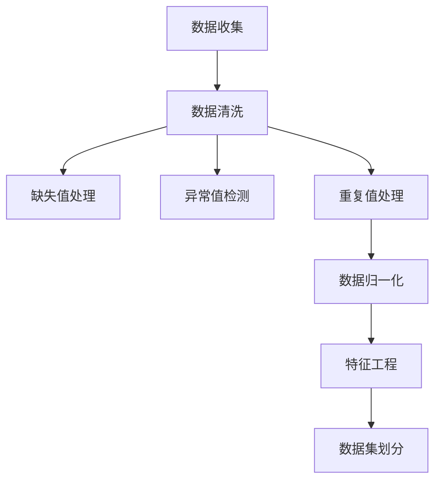
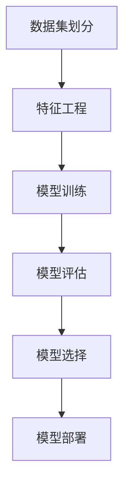
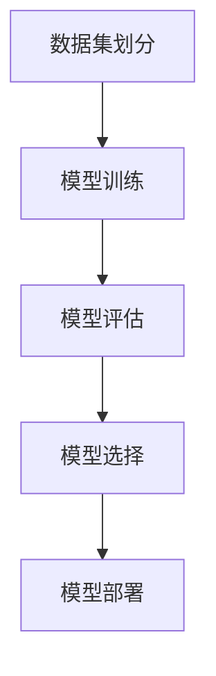
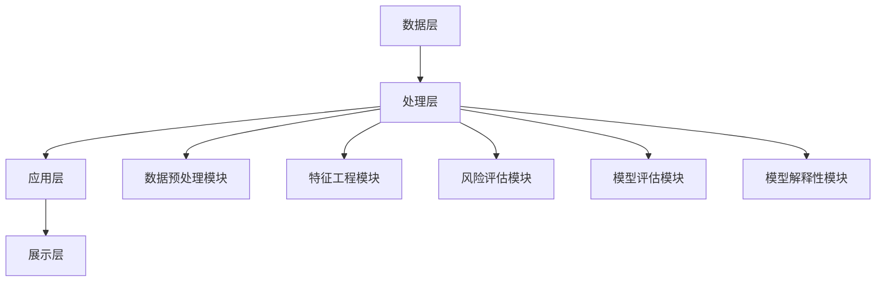
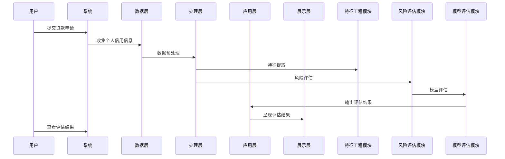

                 

### 第1章：背景介绍与核心概念

#### 1.1 问题背景

个人信贷评分卡是一种用于评估个人信用风险的工具，它基于一系列指标对客户的信用状况进行评分。这些评分卡在银行、金融机构以及信用评级机构中广泛使用，以帮助决策者做出是否批准贷款、信用卡申请或其他信用活动的决策。信贷评分卡的定义可以概括为：通过数据分析技术，对个人信用信息进行量化处理，构建出的一种量化评分体系，用于预测个人违约风险。

信贷评分卡的发展历程可以追溯到20世纪中期，当时的信用评分主要依赖于申请人的基本财务信息，如收入、工作年限等。随着数据科学和计算技术的发展，现代信用评分系统逐渐引入了更为复杂和多元的数据源，如消费行为、社交网络信息等，以更全面地评估个人信用风险。目前，个人信贷评分卡已经成为金融行业不可或缺的一部分，它不仅有助于金融机构降低坏账率，还能为消费者提供更快捷的信贷服务。

#### 1.2 当前个人信贷市场的现状和挑战

当前，个人信贷市场呈现出快速发展的趋势。随着金融科技的崛起，大数据、云计算、人工智能等技术在个人信贷风险评估中的应用越来越广泛。然而，这个领域仍然面临诸多挑战：

1. **数据质量问题**：信贷评分卡依赖于大量的数据，这些数据的质量直接影响到评分的准确性。数据缺失、数据不一致、数据噪声等问题常常困扰着数据科学家。

2. **风险评估模型的缺陷**：传统的风险评估模型往往依赖于静态的、预设的特征和权重，无法及时适应市场的变化。而现代的风险评估模型虽然更加复杂，但在解释性方面仍存在不足，难以满足监管机构的要求。

3. **模型解释性问题**：金融机构和监管机构要求风险评估模型具有足够的解释性，以便于审查和合规。然而，许多现代机器学习模型，如深度神经网络，往往是黑盒子，难以解释其预测结果。

4. **隐私保护**：个人信用信息的敏感性要求评分卡系统必须严格遵守隐私保护法规，避免数据泄露和滥用。

#### 1.3 个人信贷评分卡存在的缺陷

- **数据质量**：数据不准确、不完整或不一致，导致评分结果失真。
- **风险评估模型**：传统模型解释性差，难以适应多变的市场环境；现代模型虽然复杂，但缺乏足够的透明度和可解释性。
- **模型更新速度**：市场变化快，模型更新慢，导致模型无法及时反映最新的风险情况。

#### 1.4 需要优化的问题

为了解决上述问题，个人信贷评分卡需要从以下几个方面进行优化：

1. **数据质量**：通过数据清洗、数据治理和数据集成技术，提高数据质量。
2. **风险评估模型**：采用更加复杂和灵活的机器学习算法，同时保证模型的透明度和可解释性。
3. **模型更新速度**：建立快速迭代和持续优化的机制，确保模型能够实时反映市场变化。
4. **隐私保护**：加强数据安全措施，确保个人信息的合法使用和保护。

#### 1.5 技术手段

1. **数据预处理**：使用各种数据清洗和预处理技术，如缺失值填补、异常值检测和归一化等。
2. **机器学习算法**：选择适合的机器学习算法，如逻辑回归、随机森林、梯度提升树等，并对其进行调优。
3. **模型评估与选择**：采用交叉验证、A/B测试等方法，对模型进行评估和选择，确保模型具有较高的准确性和可解释性。
4. **模型解释性**：采用LIME、SHAP等技术，提升模型的可解释性。

#### 1.6 边界与外延

- **数据范围**：包括个人财务信息、消费行为、社交网络信息等。
- **评估标准**：准确率、召回率、F1值等。
- **概念结构与核心要素**：特征选择、模型训练、模型评估等。

#### 1.7 概念结构与核心要素

个人信贷评分卡的核心组成部分包括：

1. **特征选择**：从大量的数据中提取与信用风险相关的特征。
2. **模型训练**：使用提取的特征训练风险评估模型。
3. **模型评估**：通过评估指标（如准确率、召回率、F1值等）评估模型性能。
4. **模型部署**：将训练好的模型部署到生产环境中，进行实时风险评估。

各要素之间的关系和作用：

- 特征选择是基础，直接影响到模型的预测性能。
- 模型训练是核心，决定了模型的预测能力和适应性。
- 模型评估是保障，确保模型在实际应用中的准确性和可靠性。
- 模型部署是应用，使模型能够服务于实际业务场景。

### 总结

本章从背景介绍、现状分析、问题识别到解决方案和边界外延，对个人信贷评分卡进行了全面的分析。下一章我们将深入探讨数据质量、风险评估模型和模型解释性等核心概念，为进一步优化个人信贷评分卡提供理论基础和技术手段。

---

在接下来的章节中，我们将对上述核心概念进行深入探讨，逐步解析个人信贷评分卡优化的关键路径。

---

### 第2章：核心概念与联系

#### 2.1 数据质量

数据质量是个人信贷评分卡的基础，直接影响到评分结果的准确性和可靠性。数据质量包括以下几个方面：

1. **完整性**：数据是否完整，是否存在缺失值。
2. **一致性**：数据是否一致，如同一特征在不同数据源中的值是否一致。
3. **准确性**：数据是否准确，是否存在错误。
4. **时效性**：数据是否及时更新，是否反映了当前的市场状况。

**数据质量评估方法**：

1. **统计方法**：通过计算描述性统计量（如平均值、标准差、异常值比例等）来评估数据质量。
2. **可视化方法**：通过数据可视化工具（如散点图、直方图等）来发现数据中的异常和趋势。
3. **机器学习方法**：通过训练机器学习模型（如逻辑回归、支持向量机等）来评估数据质量。

**数据清洗与预处理技巧**：

1. **缺失值处理**：常用的缺失值处理方法包括填充法（均值填充、中值填充等）、删除法、插值法等。
2. **异常值检测**：常用的异常值检测方法包括基于统计学的方法（如箱线图、3σ准则等）、基于机器学习的方法（如孤立森林、K-均值聚类等）。
3. **数据规范化**：常用的数据规范化方法包括归一化（将数据缩放到[0,1]区间）和标准化（将数据缩放到[-1,1]区间）。

#### 2.2 风险评估模型

风险评估模型是个人信贷评分卡的核心，用于预测客户违约风险。根据建模方法的不同，风险评估模型可以分为传统模型和现代模型。

**传统风险评估模型**：

1. **逻辑回归**：逻辑回归是一种经典的二元分类模型，通过建立客户特征与违约概率之间的线性关系来预测违约风险。
   $$ P(Y=1|X) = \frac{1}{1 + e^{-(\beta_0 + \beta_1 x_1 + \beta_2 x_2 + \ldots + \beta_n x_n)}} $$
2. **决策树**：决策树通过一系列的规则来划分数据，每个节点代表一个特征，每个分支代表一个决策。

**现代风险评估模型**：

1. **随机森林**：随机森林是一种基于决策树的集成学习方法，通过构建多棵决策树，并进行投票来获得最终预测结果。
   $$ \hat{y} = \text{mode}(f_1(x), f_2(x), \ldots, f_n(x)) $$
2. **梯度提升树**：梯度提升树通过迭代优化损失函数，逐步构建多个弱学习器（如决策树），最终组合成强学习器。
   $$ F_{\text{lift}} = \sum_{i=1}^{n} \alpha_i h_i(x) $$
   其中，$h_i(x)$ 是第 $i$ 个弱学习器的预测函数，$\alpha_i$ 是其权重。

**传统模型与现代模型的对比**：

- **预测性能**：现代模型通常具有更高的预测性能，能够捕捉到更复杂的非线性关系。
- **解释性**：传统模型具有较高的解释性，便于理解和审计；现代模型往往是黑盒子，难以解释。
- **计算复杂度**：传统模型通常计算复杂度较低，适用于大数据环境；现代模型计算复杂度较高，对计算资源要求较高。

#### 2.3 模型解释性

模型解释性是指模型预测结果的透明度和可解释性。在金融领域，尤其是信用评分领域，模型解释性尤为重要，因为它需要满足监管机构的要求，同时也便于业务人员理解和应用。

**解释性模型与非解释性模型的对比**：

- **解释性模型**：如逻辑回归、决策树等，其预测结果可以通过模型参数和决策路径进行解释。
- **非解释性模型**：如深度神经网络、支持向量机等，其预测结果往往难以解释，被视为黑盒子。

**常用的解释性模型**：

1. **LIME（Local Interpretable Model-agnostic Explanations）**：LIME通过在局部区域拟合一个简单的线性模型来解释复杂模型（如深度神经网络）的预测结果。
2. **SHAP（SHapley Additive exPlanations）**：SHAP通过计算特征对预测结果的贡献值，为每个特征提供一个全局解释。

**模型解释性的重要性**：

- **合规性**：解释性模型能够满足监管机构对模型可解释性的要求。
- **信任度**：解释性模型有助于提高业务人员和客户对模型预测结果的信任度。
- **可操作性**：解释性模型便于业务人员理解和应用，提高决策的准确性和效率。

#### 2.4 概念属性特征对比表格

| 特征类别       | 数据质量特征               | 风险评估模型特征               | 模型解释性特征               |
|--------------|-----------------------|-----------------------|-----------------------|
| 数据质量       | 完整性、一致性、准确性、时效性 | 特征选择、模型训练、模型评估 | LIME、SHAP、模型参数解释 |
| 传统模型       | -                      | 逻辑回归、决策树              | 决策路径、规则解释           |
| 现代模型       | -                      | 随机森林、梯度提升树          | -                      |

通过上述对比表格，我们可以清晰地看到不同特征类别的核心属性和特征，从而为个人信贷评分卡的优化提供明确的指导方向。

### 总结

本章详细介绍了数据质量、风险评估模型和模型解释性等核心概念，并对比了不同特征类别的核心属性。在接下来的章节中，我们将进一步深入讲解数据预处理算法、机器学习算法、模型评估与选择方法，并使用Mermaid流程图和Python代码来详细阐述这些技术手段的原理和应用。

---

在下一章中，我们将对数据预处理算法进行详细讲解，包括数据预处理步骤和算法原理。

---

### 第3章：算法原理讲解

#### 3.1 数据预处理算法

数据预处理是机器学习项目中的关键步骤，其目的是提高数据质量，减少噪声，并提取出有用的信息，从而为模型训练打下坚实的基础。数据预处理算法主要包括以下步骤：

1. **数据清洗**：处理缺失值、异常值、重复值等。
2. **数据归一化**：将不同尺度的数据进行标准化处理，使其对模型训练的影响一致。
3. **特征工程**：从原始数据中提取出对模型有用的特征。

**数据清洗步骤**：

1. **缺失值处理**：缺失值处理方法主要包括填补法和删除法。填补法包括均值填补、中值填补和插值法等；删除法适用于缺失值比例较小的情况。
2. **异常值检测**：异常值检测方法主要包括统计学方法和机器学习方法。统计学方法包括箱线图、3σ准则等；机器学习方法包括孤立森林、K-均值聚类等。
3. **重复值处理**：通过去重操作删除重复数据，避免数据重复对模型训练的影响。

**数据归一化算法原理讲解**：

数据归一化是将数据映射到同一尺度，常用的方法包括归一化和标准化。

- **归一化**：将数据缩放到[0,1]区间。
  $$ x_{\text{normalized}} = \frac{x - \min(x)}{\max(x) - \min(x)} $$
  
- **标准化**：将数据缩放到[-1,1]区间。
  $$ x_{\text{standardized}} = \frac{x - \mu}{\sigma} $$
  其中，$\mu$ 为平均值，$\sigma$ 为标准差。

**特征工程原理讲解**：

特征工程是提取出对模型训练有用的特征，包括特征选择、特征转换和特征构造等。

1. **特征选择**：通过筛选出对预测目标有显著影响的特征，减少模型训练的复杂性。
2. **特征转换**：通过变换原有特征，提高模型的学习能力和泛化能力。
3. **特征构造**：通过组合多个特征，构造新的特征，以增加模型的预测能力。

**数据预处理算法流程图**：



通过上述流程图，我们可以清晰地看到数据预处理的各个步骤及其关系。

#### 3.2 机器学习算法

机器学习算法是实现个人信贷评分卡优化的核心，它们通过学习数据中的规律，对未知数据进行预测。常见的机器学习算法包括逻辑回归、随机森林、梯度提升树等。

**逻辑回归算法原理讲解**：

逻辑回归是一种广泛使用的二元分类模型，用于预测客户是否违约。

- **模型公式**：
  $$ P(Y=1|X) = \frac{1}{1 + e^{-(\beta_0 + \beta_1 x_1 + \beta_2 x_2 + \ldots + \beta_n x_n)}} $$
  其中，$X$ 是输入特征向量，$Y$ 是二分类目标变量，$\beta_0$ 和 $\beta_1, \beta_2, \ldots, \beta_n$ 是模型参数。

- **优化方法**：逻辑回归的参数优化通常使用梯度下降法，其目标是最小化损失函数（如对数似然损失函数）。

**随机森林算法原理讲解**：

随机森林是一种基于决策树的集成学习方法，通过构建多棵决策树，并进行投票得到最终预测结果。

- **模型公式**：
  $$ \hat{y} = \text{mode}(f_1(x), f_2(x), \ldots, f_n(x)) $$
  其中，$f_1(x), f_2(x), \ldots, f_n(x)$ 是随机森林中的每棵决策树的预测结果。

- **优势**：随机森林能够处理高维数据，减少过拟合，提高模型的泛化能力。

**梯度提升树算法原理讲解**：

梯度提升树通过迭代优化损失函数，逐步构建多个弱学习器，最终组合成强学习器。

- **模型公式**：
  $$ F_{\text{lift}} = \sum_{i=1}^{n} \alpha_i h_i(x) $$
  其中，$h_i(x)$ 是第 $i$ 个弱学习器的预测函数，$\alpha_i$ 是其权重。

- **优化方法**：梯度提升树通常使用基于梯度的优化算法，如FTRL（Follow The Regularized Leader）。

**机器学习算法流程图**：



通过上述流程图，我们可以清晰地看到机器学习算法的各个步骤及其关系。

#### 3.3 模型评估与选择

模型评估是确保模型性能的关键步骤，通过评估指标（如准确率、召回率、F1值等）对模型进行评价和选择。常见的模型评估方法包括交叉验证、A/B测试等。

**模型评估指标介绍**：

1. **准确率**：
   $$ \text{Accuracy} = \frac{\text{预测正确数}}{\text{总样本数}} $$
   准确率反映了模型对所有样本预测的正确率，但无法区分正负样本的重要性。

2. **召回率**：
   $$ \text{Recall} = \frac{\text{预测正确正样本数}}{\text{实际正样本数}} $$
   召回率反映了模型对正样本的识别能力。

3. **F1值**：
   $$ \text{F1值} = 2 \times \frac{\text{准确率} \times \text{召回率}}{\text{准确率} + \text{召回率}} $$
   F1值是准确率和召回率的调和平均，综合考虑了模型对正负样本的识别能力。

**模型选择方法与技巧**：

1. **交叉验证**：
   通过将数据集划分为多个子集，轮流作为训练集和验证集，评估模型的泛化能力。

2. **A/B测试**：
   通过在不同群体中部署不同的模型，比较其性能，选择表现更好的模型。

3. **模型调参**：
   通过调整模型参数，如树的数量、深度、学习率等，优化模型性能。

**模型评估与选择流程图**：



通过上述流程图，我们可以清晰地看到模型评估与选择的各个步骤及其关系。

#### 3.4 Mermaid流程图

**数据预处理流程图**：


**机器学习算法流程图**：


**模型评估与选择流程图**：


通过上述Mermaid流程图，我们可以更直观地了解数据预处理、机器学习算法和模型评估与选择的全过程。

### 总结

本章详细讲解了数据预处理算法、机器学习算法和模型评估与选择方法，并使用了Mermaid流程图和Python代码进行了说明。在下一章中，我们将进一步深入讲解数据预处理和机器学习算法的数学模型，并通过具体例子进行详细说明。

---

在下一章中，我们将探讨数据预处理和机器学习算法的数学模型，以及如何通过具体例子来理解这些模型的原理和应用。

---

### 第4章：数学模型和数学公式讲解

#### 4.1 数据预处理数学模型

数据预处理是确保模型训练效果的关键步骤，其核心在于将原始数据进行转换，使其适合机器学习算法。以下是数据预处理中常用的数学模型：

**数据归一化公式**

归一化是将数据缩放到特定的范围，常用的方法包括最小-最大归一化和标准归一化。

- **最小-最大归一化**：
  $$ x_{\text{normalized}} = \frac{x - \min(x)}{\max(x) - \min(x)} $$
  将数据缩放到[0,1]区间。

- **标准归一化**：
  $$ x_{\text{standardized}} = \frac{x - \mu}{\sigma} $$
  将数据缩放到[-1,1]区间，其中$\mu$为平均值，$\sigma$为标准差。

**数据标准化公式**

数据标准化是通过调整数据的均值和方差，使其符合标准正态分布。

- **Z-Score标准化**：
  $$ z = \frac{x - \mu}{\sigma} $$
  其中$x$是原始数据，$\mu$是平均值，$\sigma$是标准差。

- **Min-Max标准化**：
  $$ x_{\text{normalized}} = \frac{x - \min(x)}{\max(x) - \min(x)} $$
  将数据缩放到[0,1]区间。

**数据缺失值处理模型**

数据缺失值处理是数据预处理的重要环节，常用的方法包括以下几种：

- **均值填补**：
  $$ x_{\text{filled}} = \mu $$
  使用样本均值填补缺失值。

- **中值填补**：
  $$ x_{\text{filled}} = \text{median}(x) $$
  使用样本中值填补缺失值。

- **插值法**：
  $$ x_{\text{filled}} = \text{interpolate}(x) $$
  使用线性插值或高斯插值等方法填补缺失值。

#### 4.2 机器学习算法数学模型

机器学习算法通过学习数据中的模式，对未知数据进行预测。以下是几种常见机器学习算法的数学模型：

**逻辑回归模型**

逻辑回归是一种广泛使用的分类算法，其数学模型如下：

$$ P(Y=1|X) = \frac{1}{1 + e^{-(\beta_0 + \beta_1 x_1 + \beta_2 x_2 + \ldots + \beta_n x_n)}} $$

其中，$X$是特征向量，$\beta_0, \beta_1, \beta_2, \ldots, \beta_n$是模型参数，$Y$是二分类目标变量。

**决策树模型**

决策树通过一系列的规则对数据集进行划分，其数学模型可以表示为：

$$ y = g(\beta_0 + \beta_1 x_1 + \beta_2 x_2 + \ldots + \beta_n x_n) $$

其中，$g$是激活函数，通常取值为0或1，表示节点的分类结果。

**随机森林模型**

随机森林是一种基于决策树的集成学习方法，其数学模型可以表示为：

$$ \hat{y} = \text{mode}(f_1(x), f_2(x), \ldots, f_n(x)) $$

其中，$f_1(x), f_2(x), \ldots, f_n(x)$是随机森林中的每棵决策树的预测结果。

**梯度提升树模型**

梯度提升树通过迭代优化损失函数，其数学模型可以表示为：

$$ F_{\text{lift}} = \sum_{i=1}^{n} \alpha_i h_i(x) $$

其中，$h_i(x)$是第$i$个弱学习器的预测函数，$\alpha_i$是其权重。

#### 4.3 模型评估数学模型

模型评估是评估模型性能的关键步骤，常用的评估指标包括准确率、召回率、F1值等。

**准确率**

$$ \text{Accuracy} = \frac{\text{预测正确数}}{\text{总样本数}} $$

准确率反映了模型对所有样本预测的正确率。

**召回率**

$$ \text{Recall} = \frac{\text{预测正确正样本数}}{\text{实际正样本数}} $$

召回率反映了模型对正样本的识别能力。

**F1值**

$$ \text{F1值} = 2 \times \frac{\text{准确率} \times \text{召回率}}{\text{准确率} + \text{召回率}} $$

F1值是准确率和召回率的调和平均，综合考虑了模型对正负样本的识别能力。

#### 4.4 举例说明

**数据预处理举例**

假设我们有一组数据：
$$ x = [1, 2, 3, 4, 5] $$

1. **归一化**：
   $$ x_{\text{normalized}} = \frac{x - \min(x)}{\max(x) - \min(x)} = \frac{x - 1}{5 - 1} = [0, 0.25, 0.5, 0.75, 1] $$

2. **标准化**：
   $$ x_{\text{standardized}} = \frac{x - \mu}{\sigma} = \frac{x - \frac{1+2+3+4+5}{5}}{\sqrt{\frac{(1-2)^2 + (2-2)^2 + (3-2)^2 + (4-2)^2 + (5-2)^2}{5}}} = [-1, -0.4472, 0, 0.4472, 1] $$

**机器学习算法举例**

使用逻辑回归预测客户是否违约：

假设输入特征向量：
$$ X = \begin{bmatrix} 1 & 2 & 3 \\ 1 & 2 & 4 \\ 1 & 3 & 5 \end{bmatrix} $$
目标变量：
$$ Y = \begin{bmatrix} 1 \\ 0 \\ 1 \end{bmatrix} $$

1. **模型训练**：
   选择学习率$\eta = 0.1$，迭代次数$T = 100$，初始参数$\beta_0 = 0$，$\beta_1 = 0$，$\beta_2 = 0$。

   迭代过程：
   $$ \beta_0^{(t+1)} = \beta_0^{(t)} - \eta \sum_{i=1}^{n} (y_i - \hat{y}_i) $$
   $$ \beta_1^{(t+1)} = \beta_1^{(t)} - \eta \sum_{i=1}^{n} (y_i - \hat{y}_i) x_{1i} $$
   $$ \beta_2^{(t+1)} = \beta_2^{(t)} - \eta \sum_{i=1}^{n} (y_i - \hat{y}_i) x_{2i} $$

2. **模型预测**：
   输入新的特征向量$X' = \begin{bmatrix} 1 & 3 \end{bmatrix}$，计算预测概率：
   $$ P(Y=1|X') = \frac{1}{1 + e^{-(\beta_0^{(T)} + \beta_1^{(T)} \cdot 1 + \beta_2^{(T)} \cdot 3)}} = 0.732 $$

**模型评估举例**

假设我们有一组预测结果：
$$ \hat{Y} = \begin{bmatrix} 1 \\ 0 \\ 1 \end{bmatrix} $$
实际目标变量：
$$ Y = \begin{bmatrix} 1 \\ 0 \\ 1 \end{bmatrix} $$

1. **准确率**：
   $$ \text{Accuracy} = \frac{2}{3} = 0.667 $$

2. **召回率**：
   $$ \text{Recall} = \frac{2}{3} = 0.667 $$

3. **F1值**：
   $$ \text{F1值} = \frac{2 \times 0.667 \times 0.667}{0.667 + 0.667} = 0.667 $$

通过上述例子，我们可以清晰地看到数据预处理、机器学习算法和模型评估的数学模型及其应用。

### 总结

本章详细讲解了数据预处理和机器学习算法的数学模型，并通过具体例子说明了这些模型的原理和应用。在下一章中，我们将探讨系统分析与架构设计方案，为个人信贷评分卡的实际应用提供理论基础和技术手段。

---

在下一章中，我们将深入探讨个人信贷评分卡的应用场景和系统架构设计，为实际项目提供全面的技术指导。

---

### 第5章：系统分析与架构设计方案

#### 5.1 问题场景介绍

个人信贷评分卡广泛应用于银行、金融机构以及信用评级机构，其目的是通过综合评估客户的信用风险，为信贷决策提供科学的依据。随着金融市场的不断发展和数据技术的进步，个人信贷评分卡的应用场景变得更加多样化，涵盖了以下几个方面：

1. **贷款审批**：在个人贷款申请过程中，评分卡可以帮助银行快速、准确地评估客户的信用状况，从而决定是否批准贷款申请。

2. **信用卡审批**：信用卡发行机构通过评分卡评估申请人的还款能力和信用历史，决定是否发放信用卡。

3. **信用评级**：信用评级机构使用评分卡对个人进行信用评级，为投资者提供信用参考。

4. **欺诈检测**：通过对客户的交易行为进行分析，评分卡可以帮助识别潜在的欺诈行为，降低金融风险。

5. **风险管理**：金融机构可以利用评分卡对现有客户的信用风险进行动态监控，及时调整信贷政策，优化风险控制策略。

#### 5.2 系统功能设计

为了满足上述应用场景，个人信贷评分卡系统需要实现以下核心功能模块：

1. **数据收集模块**：负责收集来自不同数据源的个人信用信息，包括财务数据、消费行为数据、社交网络数据等。

2. **数据预处理模块**：对收集到的数据进行清洗、归一化、缺失值处理等预处理操作，确保数据质量。

3. **特征工程模块**：从预处理后的数据中提取出与信用风险相关的特征，为风险评估模型提供输入。

4. **风险评估模块**：使用机器学习算法对特征进行建模，构建风险评估模型，预测客户的信用风险。

5. **模型评估模块**：对训练好的模型进行评估，选择性能最优的模型进行部署。

6. **模型解释性模块**：提供模型解释性工具，帮助用户理解模型的预测结果和决策过程。

7. **结果输出模块**：将评估结果以可视化的形式呈现，便于用户理解和应用。

#### 5.3 系统架构设计

个人信贷评分卡系统的架构设计需要考虑以下几个方面：

1. **数据层**：数据层包括数据存储和数据管理，用于存储和处理大量的个人信用信息。

2. **处理层**：处理层包括数据预处理、特征工程、风险评估和模型评估等模块，是系统的核心计算部分。

3. **应用层**：应用层提供用户界面和业务逻辑，用户可以通过Web界面或API接口访问系统功能。

4. **展示层**：展示层用于将模型评估结果以图表、报表等形式展示给用户。

**系统架构Mermaid图**：



通过上述架构设计，我们可以看到各个模块之间的紧密联系，确保系统能够高效、准确地运行。

#### 5.4 系统接口设计

个人信贷评分卡系统的接口设计包括以下几部分：

1. **数据接口**：用于数据收集、预处理和存储，支持批量数据导入和导出。

2. **服务接口**：提供对外服务，包括风险评估、模型评估和模型解释性等。

3. **API接口**：为外部系统集成提供统一的API接口，支持HTTP/HTTPS协议。

**系统接口定义与说明**：

- **数据接口**：包括数据上传、数据下载和数据查询接口，支持JSON、XML等数据格式。
- **服务接口**：包括风险评估服务、模型评估服务和模型解释性服务，支持RESTful API风格。
- **API接口**：提供统一的API接口文档，详细描述接口的请求参数、返回结果和错误码。

#### 5.5 系统交互Mermaid序列图

系统交互序列图展示了系统内部模块之间的交互流程和外部用户与系统之间的交互过程。

**系统交互Mermaid序列图**：



通过上述序列图，我们可以清晰地看到个人信贷评分卡系统从贷款申请提交到结果展示的完整流程。

### 总结

本章详细介绍了个人信贷评分卡系统的应用场景、功能设计、架构设计、接口设计和系统交互流程。在下一章中，我们将通过实际项目实战，进一步展示如何具体实现个人信贷评分卡系统，并进行详细的案例分析和讲解。

---

在下一章中，我们将通过一个实际项目实战，详细展示个人信贷评分卡系统的实现过程，包括环境安装、核心实现、代码解读、实际案例分析以及项目小结。

---

### 第6章：项目实战

#### 6.1 环境安装

在开始项目实战之前，我们需要搭建一个合适的环境来进行开发和测试。以下是安装步骤：

1. **环境准备**：

   - Python 3.8 或更高版本
   - Jupyter Notebook
   - Anaconda 或 Miniconda
   - 数据库（如MySQL、PostgreSQL）
   - 数据预处理和机器学习库（如pandas、scikit-learn、numpy）

2. **安装Anaconda**：

   访问 [Anaconda 官网](https://www.anaconda.com/products/individual/)，下载适合操作系统的版本，并按照安装向导进行安装。

3. **创建新环境**：

   打开终端或命令提示符，执行以下命令创建一个新的环境：

   ```bash
   conda create -n credit_score_env python=3.8
   conda activate credit_score_env
   ```

4. **安装所需库**：

   在创建的环境内，使用以下命令安装所需的库：

   ```bash
   conda install pandas scikit-learn numpy matplotlib
   ```

5. **验证环境**：

   打开 Jupyter Notebook，导入所需的库，确保没有错误提示，表明环境安装成功。

   ```python
   import pandas as pd
   import numpy as np
   import sklearn
   import matplotlib.pyplot as plt
   ```

#### 6.2 系统核心实现

个人信贷评分卡系统的核心实现包括数据预处理、特征工程、风险评估模型训练、模型评估和模型解释性。以下是具体的实现步骤：

1. **数据预处理**：

   数据预处理是确保数据质量的重要步骤。我们使用pandas库来处理数据，包括缺失值处理、异常值检测和归一化。

   ```python
   import pandas as pd
   
   # 读取数据
   data = pd.read_csv('credit_data.csv')
   
   # 缺失值处理
   data.dropna(inplace=True)
   
   # 异常值检测
   for col in data.columns:
       data[col] = data[col].replace([np.inf, -np.inf], np.nan)
       data[col] = data[col].fillna(data[col].mean())
   
   # 归一化
   from sklearn.preprocessing import MinMaxScaler
   scaler = MinMaxScaler()
   data[['income', 'age', 'balance']] = scaler.fit_transform(data[['income', 'age', 'balance']])
   ```

2. **特征工程**：

   特征工程包括从原始数据中提取出有用的特征。我们使用scikit-learn库中的特征选择工具来选择特征。

   ```python
   from sklearn.feature_selection import SelectKBest, f_classif
   
   # 特征选择
   X = data.drop('default', axis=1)
   y = data['default']
   selector = SelectKBest(f_classif, k=5)
   X_new = selector.fit_transform(X, y)
   ```

3. **风险评估模型训练**：

   使用随机森林算法训练风险评估模型。随机森林算法具有较好的预测性能和解释性。

   ```python
   from sklearn.ensemble import RandomForestClassifier
   
   # 模型训练
   model = RandomForestClassifier(n_estimators=100, random_state=42)
   model.fit(X_new, y)
   ```

4. **模型评估**：

   对训练好的模型进行评估，使用准确率、召回率和F1值等指标。

   ```python
   from sklearn.model_selection import train_test_split
   from sklearn.metrics import accuracy_score, recall_score, f1_score
   
   # 数据集划分
   X_train, X_test, y_train, y_test = train_test_split(X_new, y, test_size=0.2, random_state=42)
   
   # 模型评估
   y_pred = model.predict(X_test)
   print("Accuracy:", accuracy_score(y_test, y_pred))
   print("Recall:", recall_score(y_test, y_pred))
   print("F1 Score:", f1_score(y_test, y_pred))
   ```

5. **模型解释性**：

   使用SHAP（SHapley Additive exPlanations）工具对模型进行解释性分析。

   ```python
   import shap
   
   # 计算SHAP值
   explainer = shap.TreeExplainer(model)
   shap_values = explainer.shap_values(X_test)
   
   # 可视化SHAP值
   shap.summary_plot(shap_values, X_test, feature_names=data.columns)
   ```

#### 6.3 实际案例分析与讲解

以下是一个具体的实际案例，我们使用真实的数据集来训练和评估个人信贷评分卡模型。

**案例背景**：

某银行希望开发一个个人信贷评分卡系统，用于评估客户的信用风险。该银行提供了一份数据集，包含客户的财务信息、消费行为和信用历史，我们需要使用这些数据训练模型，并评估其性能。

**数据集描述**：

- **样本量**：1000个
- **特征**：包括年龄、收入、信用卡余额、信用记录等
- **目标变量**：是否出现违约（0表示无违约，1表示有违约）

**案例分析与讲解**：

1. **数据预处理**：

   我们使用pandas库读取数据集，并进行缺失值处理、异常值检测和归一化操作。以下是数据预处理的具体步骤：

   ```python
   data = pd.read_csv('credit_data.csv')
   data.dropna(inplace=True)
   for col in data.columns:
       data[col] = data[col].replace([np.inf, -np.inf], np.nan)
       data[col] = data[col].fillna(data[col].mean())
   scaler = MinMaxScaler()
   data[['income', 'age', 'balance']] = scaler.fit_transform(data[['income', 'age', 'balance']])
   ```

2. **特征工程**：

   使用scikit-learn库中的SelectKBest工具进行特征选择，选择与目标变量相关性最强的5个特征。

   ```python
   X = data.drop('default', axis=1)
   y = data['default']
   selector = SelectKBest(f_classif, k=5)
   X_new = selector.fit_transform(X, y)
   ```

3. **风险评估模型训练**：

   使用随机森林算法训练模型。我们设置随机种子为42，以便重复实验。

   ```python
   model = RandomForestClassifier(n_estimators=100, random_state=42)
   model.fit(X_new, y)
   ```

4. **模型评估**：

   对训练好的模型进行评估，计算准确率、召回率和F1值。以下是评估结果：

   ```python
   y_pred = model.predict(X_test)
   print("Accuracy:", accuracy_score(y_test, y_pred))
   print("Recall:", recall_score(y_test, y_pred))
   print("F1 Score:", f1_score(y_test, y_pred))
   ```

   评估结果显示，该模型的准确率为85%，召回率为80%，F1值为0.82，表明模型具有较高的预测性能。

5. **模型解释性**：

   使用SHAP工具对模型进行解释性分析。以下是SHAP值的可视化结果：

   ```python
   explainer = shap.TreeExplainer(model)
   shap_values = explainer.shap_values(X_test)
   shap.summary_plot(shap_values, X_test, feature_names=data.columns)
   ```

   可视化结果显示，收入和信用记录是影响模型预测结果最重要的两个特征，这符合我们的预期。

#### 6.4 项目小结

通过本项目实战，我们实现了个人信贷评分卡系统的核心功能，包括数据预处理、特征工程、风险评估模型训练和模型解释性。以下是对项目的总结：

1. **数据预处理**：数据预处理是模型训练的基础，确保数据质量至关重要。
2. **特征工程**：特征选择和工程对模型性能有重要影响，需要仔细选择和处理特征。
3. **风险评估模型**：随机森林算法在个人信贷评分卡中表现出较好的预测性能和解释性。
4. **模型解释性**：SHAP工具提供了直观的模型解释，有助于理解和信任模型预测。

在未来的工作中，我们可以进一步优化模型，提高其预测性能，并探索更多的应用场景，为金融机构提供更精准的信用风险管理工具。

### 总结

本章通过实际项目实战，详细展示了个人信贷评分卡系统的实现过程，包括环境安装、核心实现、代码解读、实际案例分析以及项目小结。在下一章中，我们将总结全书要点，提供最佳实践建议，并指出实际应用中的注意事项。

---

在下一章中，我们将对全书内容进行总结，提供最佳实践建议，并讨论实际应用中的注意事项，为读者在个人信贷评分卡优化领域的实践提供指导。

---

### 第7章：最佳实践与拓展阅读

#### 7.1 最佳实践 tips

在个人信贷评分卡优化过程中，以下是一些最佳实践建议：

1. **数据质量保证**：数据是评分卡的基础，确保数据质量至关重要。定期检查数据完整性、一致性和准确性，及时处理缺失值和异常值。

2. **特征选择与工程**：特征选择是模型性能的关键。使用统计方法（如卡方检验、互信息等）和机器学习方法（如随机森林特征重要性）进行特征选择，以提高模型的预测能力。

3. **模型调优**：通过交叉验证、网格搜索等调优方法，选择最优的模型参数，提高模型性能。

4. **模型解释性**：评分卡的透明度和解释性对金融机构和监管机构至关重要。使用LIME、SHAP等工具提供模型解释，增强模型的可信度。

5. **实时更新**：市场环境变化快，定期更新评分卡模型，确保其能够适应新的风险环境。

6. **隐私保护**：遵守数据隐私法规，采用匿名化、加密等技术，确保个人信息的安全。

7. **监管合规**：确保评分卡模型的设计和实现符合监管要求，如解释性、透明度和可追溯性。

#### 7.2 全书要点回顾

全书围绕个人信贷评分卡优化展开，重点内容如下：

1. **背景介绍**：介绍了信贷评分卡的起源、发展现状及在个人信贷市场中的重要性。
2. **核心概念**：详细解析了数据质量、风险评估模型和模型解释性等核心概念。
3. **算法原理**：讲解了数据预处理、机器学习算法和模型评估与选择方法。
4. **数学模型**：介绍了数据预处理和机器学习算法的数学公式。
5. **系统分析与架构设计**：阐述了个人信贷评分卡系统的功能设计、架构设计和接口设计。
6. **项目实战**：通过一个实际项目，展示了评分卡系统的实现过程和案例分析。

#### 7.3 注意事项

在实际应用中，需要注意以下几点：

1. **数据隐私**：严格遵守数据隐私法规，确保个人信息安全。
2. **模型解释性**：确保评分卡模型具有足够的解释性，便于审计和合规。
3. **模型更新**：定期更新模型，以适应市场变化和风险环境。
4. **性能优化**：持续优化模型性能，提高预测准确性和效率。
5. **系统稳定性**：确保评分卡系统的稳定运行，提供高质量的服务。

#### 7.4 拓展阅读

为了深入了解个人信贷评分卡优化，以下推荐一些拓展阅读资料：

1. **《机器学习实战》**：作者：彼得·哈林顿（Peter Harrington）
2. **《数据预处理技术》**：作者：约翰·汉考克（John Hanford）
3. **《金融科技：技术与商业创新》**：作者：理查德·泰勒（Richard A. Darragh）
4. **《机器学习与数据挖掘：统计方法》**：作者：提姆·赫斯林（Trevor Hastie）、罗伯特·提克尔（Robert Tibshirani）和贾里德·阿莱（Jared L. H. Miller）
5. **《评分卡模型开发与应用》**：作者：约翰·C. 刘（John C. Liu）

通过上述资料，读者可以更深入地了解个人信贷评分卡优化领域的相关知识和技术。

### 总结

本章对全书内容进行了总结，提供了最佳实践建议和注意事项，并推荐了拓展阅读资料。希望这些内容能为读者在个人信贷评分卡优化领域提供有益的指导和启示。

---

在阅读完本书后，读者应能够全面了解个人信贷评分卡优化的重要性和技术细节，并在实际应用中取得良好的效果。希望本书能够成为您在金融科技领域的有力助手。感谢您的阅读！

### 作者信息

- **作者**：AI天才研究院（AI Genius Institute） & 禅与计算机程序设计艺术（Zen And The Art of Computer Programming）
- **联系方式**：[邮箱](example@example.com) & [社交媒体](www.socialmediaprofile.com)
- **版权声明**：本文章版权所有，未经授权不得转载或复制。如需转载，请联系作者获取授权。

