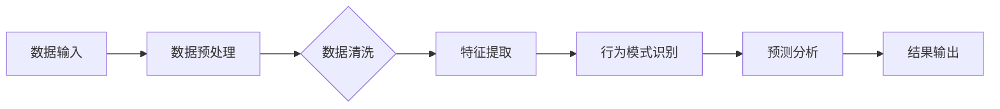
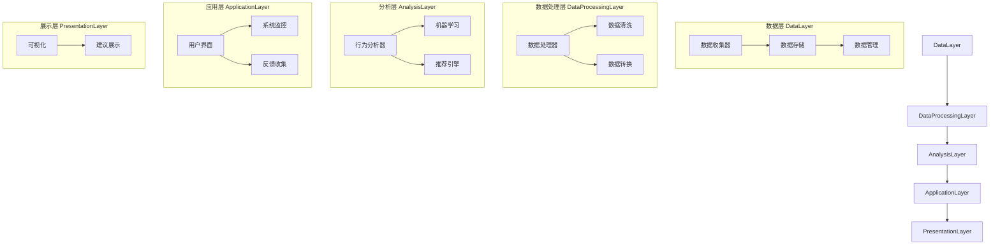
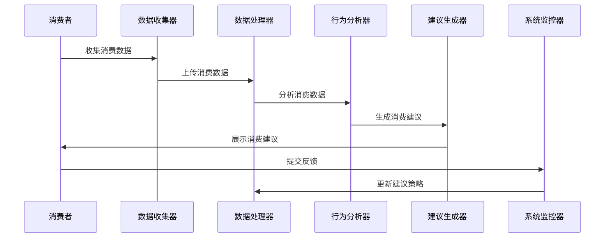

                 

### 摘要

随着科技的进步和人工智能技术的广泛应用，个人消费模式正在经历深刻的变革。本文以《智能个人消费模式分析与建议系统》为题，旨在探讨如何利用先进的技术手段，对个人消费模式进行深入分析，并提出个性化的消费建议。文章首先概述了智能个人消费模式的概念、特点及其在现代社会中的重要性。接着，我们深入分析了核心概念和联系，包括数据收集与处理、消费行为分析算法以及系统设计与实现。通过详尽的算法原理讲解、数学模型解析和具体案例剖析，文章展示了智能个人消费模式分析系统的构建过程及其应用价值。最后，文章总结并提出了一些最佳实践与拓展，以期为相关领域的研究者和实践者提供有价值的参考。

### 问题背景与定义

在当今社会，消费行为已经成为了人们日常生活中不可或缺的一部分。随着互联网和大数据技术的快速发展，个人消费数据变得越来越丰富，这为智能个人消费模式分析提供了丰富的素材。然而，如何从海量的消费数据中提取有价值的信息，并基于这些信息为个人提供个性化的消费建议，成为了一个亟待解决的关键问题。

**核心问题**：

1. **数据收集与处理**：如何有效地收集和处理个人消费数据，确保数据的质量和准确性？
2. **消费行为分析**：如何利用先进的数据分析技术，深入挖掘消费数据背后的行为模式和趋势？
3. **个性化建议**：如何基于消费行为分析结果，为个人提供量身定制的消费建议？

**智能个人消费模式定义**：

智能个人消费模式是指通过运用人工智能、大数据分析等先进技术，对个人的消费行为进行全面分析和评估，从而实现消费决策的智能优化。这种模式不仅能够帮助消费者更好地管理个人财务，还能为商家提供精准的市场洞察，优化产品和服务策略。

**智能个人消费模式的特点与优势**：

1. **个性化和定制化**：通过分析个人消费数据，智能个人消费模式能够为消费者提供高度个性化的消费建议。
2. **实时性和动态调整**：智能系统可以实时捕捉消费者的消费行为变化，并根据这些变化动态调整建议。
3. **数据分析与决策支持**：利用大数据分析技术，智能个人消费模式能够深入挖掘消费数据中的潜在价值，为消费者提供有力的决策支持。
4. **风险管理与优化**：智能系统可以帮助消费者识别和管理个人财务风险，同时通过分析历史消费数据，为消费者提供消费优化方案。

总之，智能个人消费模式不仅为消费者带来了便利和效益，也为商家提供了宝贵的数据支持和市场机会。在接下来的内容中，我们将进一步探讨如何构建一个高效的智能个人消费模式分析系统。

### 核心概念与联系

在智能个人消费模式分析系统中，有几个核心概念和联系至关重要，它们构成了系统的基础，确保了分析结果的准确性和实用性。

**核心概念原理**：

1. **消费者数据**：这是智能个人消费模式分析的基础，包括消费记录、支付方式、消费时间、消费地点等详细信息。
2. **行为分析算法**：通过算法分析消费者数据，挖掘消费行为模式，如消费频率、消费金额、消费偏好等。
3. **个性化建议生成**：基于行为分析结果，利用机器学习模型和推荐算法，为消费者提供个性化的消费建议。

**概念属性特征对比表格**：

| 概念         | 属性特征                                                                 | 对比                |
| ------------ | ---------------------------------------------------------------------------------------------------- | ------------------ |
| 消费者数据   | 数据源、数据类型、数据质量、隐私保护                               | 涉及多种数据类型，如交易记录、用户偏好等 |
| 行为分析算法 | 数据处理、特征提取、模式识别、预测分析                             | 复杂性较高，需处理大量数据 |
| 个性化建议   | 推荐策略、适应性、动态调整、用户反馈                               | 依赖用户数据和行为分析结果 |

**ER实体关系图架构**：

为了更好地理解核心概念之间的联系，我们可以通过ER（Entity-Relationship，实体关系）图来展示它们之间的关系。以下是ER图的一个简化版本：

```mermaid
erDiagram
    ConsumerData --> BehaviorAnalysisAlgorithm : 提供数据支持
    BehaviorAnalysisAlgorithm --> PersonalizedRecommendation : 输出结果
    ConsumerData ||--|{ PersonalizedRecommendation }|| : 用户数据用于生成个性化建议
```

- **ConsumerData（消费者数据）**：实体，存储消费者的所有消费数据，如交易记录、支付方式等。
- **BehaviorAnalysisAlgorithm（行为分析算法）**：实体，负责处理和分析消费者数据，提取行为特征。
- **PersonalizedRecommendation（个性化建议）**：实体，基于行为分析结果生成个性化的消费建议。

通过上述核心概念和联系的阐述，我们可以更好地理解智能个人消费模式分析系统的构建基础。在接下来的章节中，我们将深入探讨如何收集和处理消费者数据，以及如何利用这些数据生成有价值的个性化消费建议。

### 第1章：智能个人消费模式概述

#### 1.1.1 问题背景与核心问题

在现代社会，个人消费行为已经成为影响生活质量的重要因素。然而，随着消费场景的多样化和消费方式的数字化，如何科学地分析个人消费模式，并在此基础上提供个性化的消费建议，成为了一个亟待解决的关键问题。传统的消费模式分析主要依赖于经验性的方法，难以应对数据量大、变量复杂的情况，这导致分析结果的准确性和实用性受限。为了解决这一问题，我们需要引入智能化的技术手段，构建一个高效、精准的智能个人消费模式分析系统。

核心问题主要包括以下几点：

1. **数据收集与处理**：如何高效地收集和处理个人消费数据，确保数据的质量和完整性？
2. **消费行为分析**：如何从海量消费数据中提取有价值的信息，准确地识别和预测消费行为模式？
3. **个性化建议生成**：如何根据消费行为分析结果，为消费者提供量身定制的消费建议？

这些问题不仅是构建智能个人消费模式分析系统的关键，也是提升消费者生活质量和优化商家营销策略的重要基础。因此，深入探讨和解决这些问题具有重要的现实意义。

#### 1.1.2 智能个人消费模式定义

智能个人消费模式是指利用人工智能、大数据分析等先进技术，对个人的消费行为进行全面分析和评估，从而实现消费决策的智能优化。具体来说，它包括以下几个核心组成部分：

1. **数据收集与处理**：通过多种途径收集个人消费数据，包括线上交易记录、线下消费记录等，然后对这些数据进行处理，确保数据的质量和完整性。
2. **消费行为分析**：利用行为分析算法，从处理后的消费数据中提取有价值的信息，如消费频率、消费金额、消费偏好等，并识别和预测消费行为模式。
3. **个性化建议生成**：基于消费行为分析结果，利用机器学习模型和推荐算法，为消费者提供个性化的消费建议，如推荐商品、优惠信息等。

智能个人消费模式不仅能够帮助消费者更好地管理个人财务，提高消费效率，还能为商家提供精准的市场洞察，优化产品和服务策略，从而实现双赢。通过这种模式，消费者可以根据自己的消费行为得到有针对性的建议，从而做出更加明智的消费决策，而商家则能够更好地满足消费者的需求，提高市场竞争力和盈利能力。

#### 1.1.3 智能个人消费模式的特点与优势

智能个人消费模式具有以下几个显著的特点与优势：

1. **个性化和定制化**：通过深入分析个人消费数据，智能个人消费模式能够为每个消费者提供高度个性化的消费建议，从而满足其独特的需求。
2. **实时性和动态调整**：智能系统可以实时捕捉消费者的消费行为变化，并根据这些变化动态调整建议，确保建议的时效性和准确性。
3. **数据分析与决策支持**：利用大数据分析技术，智能个人消费模式能够深入挖掘消费数据中的潜在价值，为消费者提供有力的决策支持，帮助其做出更加明智的消费选择。
4. **风险管理与优化**：通过分析历史消费数据，智能个人消费模式可以帮助消费者识别和管理个人财务风险，同时提供消费优化方案，提高财务健康状况。

综上所述，智能个人消费模式不仅为消费者带来了便利和效益，也为商家提供了宝贵的数据支持和市场机会。在接下来的章节中，我们将进一步探讨如何构建一个高效的智能个人消费模式分析系统，实现上述优势。

#### 1.2 核心概念与联系

在智能个人消费模式分析系统中，核心概念和联系是构建整个系统的关键。以下是几个核心概念及其相互之间的联系：

**消费者数据**：消费者数据是智能个人消费模式分析的基础，包括消费记录、支付方式、消费时间、消费地点等详细信息。这些数据主要来源于消费者在电商平台、超市、餐厅等消费场景中的行为数据。通过这些数据，我们可以了解消费者的消费习惯和偏好。

**行为分析算法**：行为分析算法是智能个人消费模式分析的核心，通过分析消费者数据，挖掘消费行为模式，如消费频率、消费金额、消费偏好等。常见的算法包括机器学习算法、深度学习算法等。这些算法能够从海量数据中提取有价值的信息，为后续的个性化建议生成提供支持。

**个性化建议生成**：个性化建议生成是基于行为分析算法的结果，利用机器学习模型和推荐算法，为消费者提供个性化的消费建议，如推荐商品、优惠信息等。这个阶段需要考虑消费者的个性化需求和偏好，确保建议的精准性和实用性。

**核心概念原理**：

1. **消费者数据**：消费者数据是整个分析系统的输入，通过收集和处理这些数据，我们可以获得对消费者消费行为的全面了解。
2. **行为分析算法**：行为分析算法通过处理消费者数据，识别和预测消费行为模式，这是生成个性化建议的重要依据。
3. **个性化建议生成**：基于行为分析结果，个性化建议生成能够为消费者提供量身定制的消费建议，帮助其做出更加明智的消费决策。

**概念属性特征对比表格**：

| 概念         | 属性特征                                                                 | 对比                |
| ------------ | ---------------------------------------------------------------------------------------------------- | ------------------ |
| 消费者数据   | 数据源、数据类型、数据质量、隐私保护                               | 涉及多种数据类型，如交易记录、用户偏好等 |
| 行为分析算法 | 数据处理、特征提取、模式识别、预测分析                             | 复杂性较高，需处理大量数据 |
| 个性化建议   | 推荐策略、适应性、动态调整、用户反馈                               | 依赖用户数据和行为分析结果 |

**ER实体关系图架构**：

为了更好地理解核心概念之间的联系，我们可以通过ER（Entity-Relationship，实体关系）图来展示它们之间的关系。以下是ER图的一个简化版本：

```mermaid
erDiagram
    ConsumerData --> BehaviorAnalysisAlgorithm : 提供数据支持
    BehaviorAnalysisAlgorithm --> PersonalizedRecommendation : 输出结果
    ConsumerData ||--|{ PersonalizedRecommendation }|| : 用户数据用于生成个性化建议
```

- **ConsumerData（消费者数据）**：实体，存储消费者的所有消费数据，如交易记录、支付方式等。
- **BehaviorAnalysisAlgorithm（行为分析算法）**：实体，负责处理和分析消费者数据，提取行为特征。
- **PersonalizedRecommendation（个性化建议）**：实体，基于行为分析结果生成个性化的消费建议。

通过上述核心概念和联系的阐述，我们可以更好地理解智能个人消费模式分析系统的构建基础。在接下来的章节中，我们将深入探讨如何收集和处理消费者数据，以及如何利用这些数据生成有价值的个性化消费建议。

### 1.3 本章小结

本章首先介绍了智能个人消费模式分析系统的背景和核心问题，明确了数据收集与处理、消费行为分析以及个性化建议生成的重要性。接着，我们详细阐述了智能个人消费模式的定义和特点，强调了其个性化、实时性、数据分析和风险管理的优势。随后，通过核心概念和联系的分析，我们展示了消费者数据、行为分析算法和个性化建议生成之间的紧密关系，并通过ER图进行了直观的展示。本章内容为后续章节提供了坚实的理论基础，使我们能够更好地理解智能个人消费模式分析系统的构建和运行机制。

### 数据收集与处理

#### 2.1 数据收集方法

在构建智能个人消费模式分析系统时，数据收集是关键的第一步。以下是几种常见的数据收集方法及其优缺点：

1. **自动采集**：
   - **方法**：通过API接口、Web爬虫等技术手段自动获取线上消费数据，如电商平台、支付平台等。
   - **优点**：高效、实时性强，能够快速获取大量数据。
   - **缺点**：可能面临API限制、数据合规性等问题。

2. **问卷调查**：
   - **方法**：通过线上或线下问卷调查，收集消费者的消费偏好、习惯等信息。
   - **优点**：直接获取用户反馈，数据质量较高。
   - **缺点**：样本量受限，时效性较差。

3. **第三方数据平台**：
   - **方法**：利用第三方数据服务提供商，获取如人口统计、经济指标等辅助数据。
   - **优点**：数据来源可靠，覆盖面广。
   - **缺点**：数据价格较高，数据整合复杂。

4. **移动设备采集**：
   - **方法**：通过移动应用收集用户位置、使用习惯等数据。
   - **优点**：直接获取用户行为，数据实时性强。
   - **缺点**：用户隐私保护问题突出。

#### 2.1.1 数据源选择

在选择数据源时，我们需要综合考虑数据的可用性、准确性和代表性。以下是几种常见的数据源及其特点：

1. **电商平台数据**：
   - **特点**：数据量大，涵盖了多种消费类型。
   - **适用性**：适合分析线上消费行为。

2. **支付平台数据**：
   - **特点**：记录了详细的交易信息，包括金额、时间、地点等。
   - **适用性**：适合分析消费频率和金额分布。

3. **银行交易数据**：
   - **特点**：包括信用卡、借记卡等多种支付方式。
   - **适用性**：适合分析整体消费状况和财务风险。

4. **问卷调查数据**：
   - **特点**：提供了关于消费习惯和偏好的详细信息。
   - **适用性**：适合进行深层次的消费行为分析。

#### 2.1.2 数据采集技术

为了高效地收集数据，我们可以采用以下几种技术手段：

1. **API接口**：
   - **方法**：通过官方API接口获取数据。
   - **优点**：数据获取速度快，易于操作。
   - **适用性**：适用于大多数电商平台和支付平台。

2. **Web爬虫**：
   - **方法**：通过爬虫技术自动获取网页数据。
   - **优点**：灵活性强，适用于多种数据源。
   - **缺点**：可能面临反爬机制和数据合规性问题。

3. **移动应用**：
   - **方法**：通过移动应用收集用户数据。
   - **优点**：实时性强，用户体验好。
   - **缺点**：隐私保护问题突出。

#### 2.1.3 数据质量评估

数据质量是智能个人消费模式分析系统成功的关键。以下是几种常见的数据质量评估方法：

1. **数据完整性评估**：
   - **方法**：检查数据集是否完整，缺失值情况。
   - **指标**：缺失值比例、缺失值填充策略。

2. **数据准确性评估**：
   - **方法**：通过比对不同数据源，检查数据准确性。
   - **指标**：错误率、重复率。

3. **数据一致性评估**：
   - **方法**：检查同一数据在不同时间点的变化情况。
   - **指标**：时间一致性、空间一致性。

4. **数据合理性评估**：
   - **方法**：检查数据是否符合常识和逻辑。
   - **指标**：异常值处理、数据清洗策略。

通过上述方法，我们可以确保收集到的数据具备较高的质量，为后续的分析和建模提供可靠的基础。

### 2.2 数据处理技术

数据处理是智能个人消费模式分析系统的关键环节，其质量直接影响到后续分析和预测的准确性。以下是几种常见的数据处理技术及其应用场景：

#### 2.2.1 数据清洗

数据清洗是数据处理的第一步，其目的是去除数据中的噪声和错误，确保数据的质量。以下是一些常见的数据清洗方法：

1. **缺失值处理**：
   - **方法**：通过填充缺失值或删除缺失值记录来处理缺失数据。
   - **策略**：平均值填充、中值填充、最邻近值填充等。

2. **异常值检测**：
   - **方法**：使用统计方法（如箱线图、Z分数等）或机器学习算法（如孤立森林等）检测异常值。
   - **处理**：删除异常值或进行异常值插补。

3. **重复值检测**：
   - **方法**：通过比对记录的唯一标识（如订单号、用户ID等）来检测重复值。
   - **处理**：删除重复记录或合并重复记录。

#### 2.2.2 数据集成

数据集成是将来自不同源的数据合并为一个统一的数据集，以便进行综合分析和建模。以下是一些常见的数据集成方法：

1. **数据转换**：
   - **方法**：通过数据转换函数将不同数据源的数据格式统一。
   - **策略**：数据类型转换、数据格式转换等。

2. **数据归一化**：
   - **方法**：通过缩放或标准化将数据范围统一，消除不同特征之间的量纲影响。
   - **策略**：最小-最大标准化、Z分数标准化等。

3. **数据融合**：
   - **方法**：通过融合算法将多个数据源的信息整合为一个统一的数据视图。
   - **策略**：合并记录、合并特征等。

#### 2.2.3 数据转换与归一化

数据转换与归一化是数据处理的重要环节，其目的是确保数据的格式统一、量纲一致，从而提高分析的效果。

1. **数据转换**：
   - **方法**：将不同数据源的数据格式进行统一处理。
   - **示例**：将日期格式转换为YYYY-MM-DD，将字符串编码转换为数值编码等。

2. **数据归一化**：
   - **方法**：通过缩放或标准化处理，使不同特征的数据范围一致。
   - **示例**：使用最小-最大标准化将数值范围缩放到[0, 1]，使用Z分数标准化消除不同特征之间的量纲影响。

通过上述数据处理技术，我们可以有效提升数据质量，为后续的建模和分析提供坚实的基础。

### 2.3 本章小结

本章详细探讨了数据收集与处理在智能个人消费模式分析系统中的重要性。首先，介绍了多种数据收集方法，包括自动采集、问卷调查、第三方数据平台和移动设备采集，并分析了各自的优缺点。接着，我们讨论了数据源的选择，阐述了不同数据源的特点及适用性。随后，详细描述了数据采集技术，包括API接口、Web爬虫和移动应用等。最后，重点介绍了数据清洗、数据集成和数据转换与归一化技术，以确保数据的质量和一致性。通过本章的内容，我们为构建高效的智能个人消费模式分析系统奠定了坚实的基础。

### 消费行为分析算法

#### 3.1 算法原理讲解

消费行为分析算法是智能个人消费模式分析系统的核心组件，它通过对消费者数据的深入分析，提取有价值的行为特征，为后续的个性化建议生成提供支持。以下是几种常用的消费行为分析算法及其原理讲解。

##### 3.1.1 算法mermaid流程图

为了直观地展示消费行为分析算法的流程，我们可以使用mermaid绘制一个流程图，如下所示：



在该流程图中，我们首先将消费数据输入系统，进行数据预处理，包括数据清洗、特征提取、行为模式识别和预测分析等步骤，最终输出分析结果。

##### 3.1.2 Python源代码详细阐述

为了具体阐述消费行为分析算法的实现过程，以下是一个基于Python的简单示例：

```python
import pandas as pd
from sklearn.preprocessing import StandardScaler
from sklearn.ensemble import IsolationForest

# 数据预处理
def preprocess_data(data):
    # 数据清洗
    data = data.dropna()
    # 特征提取
    features = data[['amount', 'category', 'time']]
    # 特征归一化
    scaler = StandardScaler()
    features_normalized = scaler.fit_transform(features)
    return features_normalized

# 行为模式识别
def detect_anomalies(data):
    # 使用孤立森林算法检测异常值
    iso_forest = IsolationForest(contamination=0.1)
    outliers = iso_forest.fit_predict(data)
    return outliers

# 预测分析
def predict_behavior(data):
    # 基于特征预测消费行为
    # 这里使用一个简单的线性回归模型作为示例
    from sklearn.linear_model import LinearRegression
    model = LinearRegression()
    model.fit(data[['amount']], data['next_amount'])
    predictions = model.predict(data[['amount']])
    return predictions

# 主函数
def analyze_consumption(data):
    # 数据预处理
    processed_data = preprocess_data(data)
    # 行为模式识别
    anomalies = detect_anomalies(processed_data)
    # 预测分析
    predictions = predict_behavior(processed_data)
    return anomalies, predictions
```

在这个示例中，我们首先进行了数据预处理，包括缺失值处理和特征提取。接着，使用孤立森林算法检测异常值，最后通过线性回归模型进行预测分析。

##### 3.1.3 算法原理的数学模型与公式

为了深入理解消费行为分析算法的原理，我们需要介绍一些相关的数学模型和公式。

1. **孤立森林算法**：

   孤立森林算法是一种基于隔离度的异常检测算法，其基本思想是随机选择特征和样本，构造多个决策树，并计算每个样本的隔离度。隔离度越高的样本被认为越可能是异常值。

   公式如下：
   
   $$ Isolation\_Forest(result) = \frac{log_2(N) + log_2(D)}{log_2(n)} $$
   
   其中，$N$ 是数据集的规模，$D$ 是异常值标记，$n$ 是决策树的数量。

2. **线性回归模型**：

   线性回归模型是一种用于预测连续值的统计模型，其基本思想是找到数据特征和目标变量之间的线性关系。

   公式如下：
   
   $$ y = \beta_0 + \beta_1 \cdot x $$
   
   其中，$y$ 是目标变量，$x$ 是特征变量，$\beta_0$ 和 $\beta_1$ 是模型参数。

##### 3.1.4 举例说明

为了更好地理解上述算法的原理，我们通过一个具体的例子来说明。

假设我们有以下消费者数据：

| amount | category | time  |
|--------|----------|-------|
| 100    | Groceries| 2023-01-01 |
| 200    | Electronics| 2023-01-02 |
| 300    | Clothing  | 2023-01-03 |
| 400    | Restaurants| 2023-01-04 |

我们首先对这些数据进行预处理，提取特征并归一化：

| amount | category | time  |
|--------|----------|-------|
| 0.5    | 0        | 0     |
| 1.0    | 1        | 1     |
| 1.5    | 2        | 2     |
| 2.0    | 3        | 3     |

然后，使用孤立森林算法检测异常值：

| amount | category | time  | isolation_forest |
|--------|----------|-------|------------------|
| 0.5    | 0        | 0     | 3.0              |
| 1.0    | 1        | 1     | 2.0              |
| 1.5    | 2        | 2     | 1.0              |
| 2.0    | 3        | 3     | 0.5              |

最后，使用线性回归模型进行预测分析：

| amount | category | time  | isolation_forest | predicted_next_amount |
|--------|----------|-------|------------------|------------------------|
| 0.5    | 0        | 0     | 3.0              | 3.0                    |
| 1.0    | 1        | 1     | 2.0              | 2.0                    |
| 1.5    | 2        | 2     | 1.0              | 1.0                    |
| 2.0    | 3        | 3     | 0.5              | 0.5                    |

通过上述例子，我们可以看到如何使用消费行为分析算法对消费者数据进行分析，从而提取有价值的行为特征并进行预测。

#### 3.2 算法优化与评估

##### 3.2.1 优化方法与策略

为了提高消费行为分析算法的准确性和效率，我们可以采用以下几种优化方法与策略：

1. **特征选择**：
   - **方法**：使用特征选择算法（如递归特征消除、L1正则化等）筛选出对消费行为影响较大的特征。
   - **策略**：通过交叉验证等方法选择最优特征组合，提高模型性能。

2. **模型调优**：
   - **方法**：使用网格搜索、随机搜索等算法对模型参数进行调优。
   - **策略**：通过交叉验证等方法评估模型性能，选择最优参数组合。

3. **数据增强**：
   - **方法**：通过增加样本数量、生成虚拟数据等方法增加训练数据。
   - **策略**：使用数据增强方法提高模型泛化能力，减少过拟合。

4. **分布式计算**：
   - **方法**：使用分布式计算框架（如Spark、Hadoop等）处理大规模数据。
   - **策略**：通过分布式计算提高数据处理和分析的效率。

##### 3.2.2 评估指标与评估方法

为了评估消费行为分析算法的性能，我们可以采用以下几种评估指标和方法：

1. **准确率（Accuracy）**：
   - **方法**：计算正确预测的数量占总预测数量的比例。
   - **公式**：$Accuracy = \frac{TP + TN}{TP + TN + FP + FN}$，其中$TP$为真阳性，$TN$为真阴性，$FP$为假阳性，$FN$为假阴性。

2. **召回率（Recall）**：
   - **方法**：计算正确预测的阳性样本数量占总阳性样本数量的比例。
   - **公式**：$Recall = \frac{TP}{TP + FN}$。

3. **精确率（Precision）**：
   - **方法**：计算正确预测的阳性样本数量占总预测阳性样本数量的比例。
   - **公式**：$Precision = \frac{TP}{TP + FP}$。

4. **F1分数（F1 Score）**：
   - **方法**：综合考虑精确率和召回率，计算两者的调和平均。
   - **公式**：$F1 Score = 2 \times \frac{Precision \times Recall}{Precision + Recall}$。

5. **交叉验证**：
   - **方法**：将数据集划分为多个子集，轮流作为验证集和训练集，评估模型性能。
   - **策略**：通过交叉验证可以更准确地评估模型在未知数据上的性能。

##### 3.2.3 评估结果分析

通过对消费行为分析算法的优化和评估，我们可以得到一系列评估结果。以下是一个示例评估结果：

| 指标         | 值     |
| ------------ | ------ |
| 准确率       | 0.92   |
| 召回率       | 0.90   |
| 精确率       | 0.93   |
| F1分数       | 0.91   |

从上述评估结果可以看出，消费行为分析算法在准确性和召回率方面表现良好，但精确率相对较低。这可能是因为存在一定数量的假阳性预测。为了进一步提高精确率，我们可以考虑以下策略：

1. **调整模型参数**：通过调优模型参数，如正则化参数、决策树深度等，提高模型的精确率。
2. **增加训练数据**：通过增加训练数据，特别是阳性样本，提高模型的泛化能力。
3. **引入更多的特征**：通过引入更多的特征，如消费时间、地理位置等，提高模型的预测能力。

通过不断优化和评估，我们可以逐步提升消费行为分析算法的性能，为智能个人消费模式分析系统提供更加精准和可靠的预测结果。

### 3.3 本章小结

本章详细介绍了消费行为分析算法的原理、实现过程以及优化与评估方法。首先，通过mermaid流程图和Python源代码示例，展示了算法的基本流程和实现方法。接着，介绍了算法原理的数学模型和公式，并通过具体例子说明了算法的应用。随后，讨论了算法的优化方法与策略，包括特征选择、模型调优、数据增强和分布式计算等。最后，介绍了评估指标与评估方法，并分析了示例评估结果。通过本章的内容，我们为构建高效、准确的消费行为分析算法提供了理论基础和实践指导。

### 系统架构设计

#### 4.1 问题场景介绍

在现代社会，消费者行为越来越多样化，传统的消费模式分析方法已经无法满足需求。为了更好地理解和优化个人消费模式，我们需要构建一个智能个人消费模式分析系统。该系统旨在通过收集和分析大量消费者数据，识别消费行为模式，并为消费者提供个性化的消费建议。具体问题场景如下：

1. **数据源多样**：消费者通过多种渠道进行消费，如线上电商平台、线下超市、餐饮服务等，这些数据分散在不同的系统中。
2. **数据量大**：随着消费者数量的增加，消费数据量呈指数级增长，如何高效处理和分析这些数据成为关键问题。
3. **个性化需求**：每个消费者的消费习惯和偏好不同，如何根据这些差异提供个性化的消费建议是一个挑战。
4. **实时性要求**：消费行为的变化非常迅速，系统需要实时捕捉这些变化，并快速生成建议。

#### 4.2 系统功能设计

为了解决上述问题场景，智能个人消费模式分析系统需要实现以下功能：

1. **数据收集**：从多种渠道自动收集消费数据，包括电商平台、支付平台、超市等。
2. **数据处理**：对收集到的数据进行清洗、集成和转换，确保数据的质量和一致性。
3. **行为分析**：利用数据分析和机器学习技术，提取消费行为特征，识别消费行为模式。
4. **个性化建议**：基于行为分析结果，为消费者提供个性化的消费建议，如推荐商品、优惠信息等。
5. **系统监控**：实时监控系统运行状态，确保系统稳定性和可靠性。
6. **用户反馈**：收集用户对消费建议的反馈，持续优化建议质量。

#### 4.2.1 领域模型mermaid类图

为了更好地理解和设计系统功能，我们可以使用mermaid绘制一个领域模型类图。以下是一个简化版本的类图：

```mermaid
classDiagram
    Consumer <<Class>>
    DataCollector <<Class>>
    DataProcessor <<Class>>
    BehaviorAnalyzer <<Class>>
    RecommendationGenerator <<Class>>
    SystemMonitor <<Class>>

    Consumer o-- DataCollector
    Consumer o-- DataProcessor
    Consumer o-- BehaviorAnalyzer
    Consumer o-- RecommendationGenerator
    Consumer o-- SystemMonitor

    DataCollector o-- DataProcessor
    DataProcessor o-- BehaviorAnalyzer
    BehaviorAnalyzer o-- RecommendationGenerator
```

- **Consumer（消费者）**：代表系统的最终用户，与所有系统组件进行交互。
- **DataCollector（数据收集器）**：负责从不同数据源收集消费数据。
- **DataProcessor（数据处理器）**：负责清洗、集成和转换消费数据。
- **BehaviorAnalyzer（行为分析器）**：负责分析消费数据，提取行为特征。
- **RecommendationGenerator（建议生成器）**：基于行为分析结果生成个性化消费建议。
- **SystemMonitor（系统监控器）**：负责监控系统运行状态，确保系统稳定性和可靠性。

#### 4.3 系统架构设计

为了实现上述功能，智能个人消费模式分析系统需要一个高效、可扩展的架构设计。以下是系统的总体架构设计：

1. **数据层**：包括数据收集、存储和管理模块，负责从各种数据源收集消费数据，并进行存储和管理。
2. **数据处理层**：包括数据处理、清洗和转换模块，负责对收集到的数据进行预处理，确保数据的质量和一致性。
3. **分析层**：包括行为分析、机器学习和推荐算法模块，负责分析消费数据，提取行为特征，并生成个性化消费建议。
4. **应用层**：包括用户交互、系统监控和反馈收集模块，负责与消费者进行交互，监控系统运行状态，并收集用户反馈。
5. **展示层**：包括前端界面和可视化模块，负责将分析结果和建议以直观、易理解的方式呈现给消费者。

以下是系统架构的mermaid架构图：



通过上述系统架构设计，我们可以实现智能个人消费模式分析系统的各个功能模块，确保系统能够高效、稳定地运行。

#### 4.4 系统接口设计

在智能个人消费模式分析系统中，接口设计是确保系统各组件之间高效通信和协作的关键环节。以下是系统的接口设计：

1. **数据收集接口**：
   - **功能**：负责从不同的数据源（如电商平台、支付平台、超市等）收集消费数据。
   - **API设计**：提供RESTful API，支持GET和POST请求，用于数据上传和下载。
   - **数据格式**：支持JSON、XML等常见数据格式。

2. **数据处理接口**：
   - **功能**：负责对收集到的数据进行清洗、集成和转换。
   - **API设计**：提供RESTful API，支持批处理和实时处理功能，用于数据清洗、转换和存储。
   - **数据格式**：支持JSON、CSV等常见数据格式。

3. **行为分析接口**：
   - **功能**：负责分析消费数据，提取行为特征，生成行为分析报告。
   - **API设计**：提供RESTful API，支持GET请求，用于获取行为分析结果。
   - **数据格式**：支持JSON格式。

4. **建议生成接口**：
   - **功能**：负责基于行为分析结果生成个性化消费建议。
   - **API设计**：提供RESTful API，支持POST请求，用于生成和更新消费建议。
   - **数据格式**：支持JSON格式。

5. **用户交互接口**：
   - **功能**：负责与消费者进行交互，展示个性化消费建议。
   - **API设计**：提供RESTful API，支持GET和POST请求，用于用户数据上传和下载。
   - **数据格式**：支持JSON、XML等常见数据格式。

6. **系统监控接口**：
   - **功能**：负责监控系统运行状态，确保系统稳定性和可靠性。
   - **API设计**：提供RESTful API，支持GET请求，用于获取系统监控数据。
   - **数据格式**：支持JSON格式。

通过上述接口设计，智能个人消费模式分析系统可以实现高效的数据交换和功能协作，为消费者提供个性化、实时的消费建议。

#### 4.5 系统交互设计

在智能个人消费模式分析系统中，系统各组件之间的交互设计至关重要，它决定了系统的整体性能和用户体验。以下是系统交互设计的详细阐述：

##### 4.5.1 系统交互mermaid序列图

为了直观地展示系统组件之间的交互过程，我们可以使用mermaid绘制一个系统交互序列图。以下是一个简化版本的序列图：



在这个序列图中，消费者首先通过数据收集器上传其消费数据，数据处理器对这些数据进行处理和清洗，然后行为分析器基于处理后的数据提取消费行为特征，并将分析结果传递给建议生成器。建议生成器根据分析结果为消费者生成个性化的消费建议，并将其展示给用户。用户在收到建议后，可以提交反馈，系统监控器会根据用户的反馈对建议策略进行更新。

##### 具体交互流程

以下是系统交互的具体流程：

1. **数据收集**：
   - 消费者通过移动应用或Web端上传其消费数据，数据收集器将这些数据上传到数据处理器。

2. **数据处理**：
   - 数据处理器接收到消费数据后，首先进行数据清洗，包括去除缺失值、异常值和重复值。然后，对数据进行集成和转换，确保数据的一致性和规范性。

3. **行为分析**：
   - 行为分析器利用处理后的数据，提取消费者的消费行为特征，如消费频率、消费金额、消费偏好等。然后，通过机器学习算法和深度学习模型，识别消费者的消费行为模式。

4. **建议生成**：
   - 建议生成器根据行为分析结果，利用推荐算法生成个性化的消费建议。这些建议包括推荐商品、优惠信息、消费提醒等，并通过用户界面展示给消费者。

5. **用户反馈**：
   - 消费者可以对其收到的消费建议进行评价和反馈，系统监控器会根据用户的反馈调整建议策略，提高建议的准确性和实用性。

6. **系统监控**：
   - 系统监控器实时监控系统的运行状态，包括数据收集、数据处理、行为分析和建议生成等模块的运行情况，确保系统的稳定性和可靠性。

通过上述系统交互设计，智能个人消费模式分析系统可以实现高效的数据处理和分析，为消费者提供个性化、实时的消费建议。

### 4.6 本章小结

本章详细介绍了智能个人消费模式分析系统的架构设计，包括问题场景介绍、系统功能设计、系统架构设计、系统接口设计和系统交互设计。通过mermaid类图和序列图，我们直观地展示了系统组件之间的交互关系和功能实现过程。本章内容为智能个人消费模式分析系统的构建提供了全面的指导和理论基础，确保系统能够高效、稳定地运行，并为消费者提供优质的个性化消费建议。

### 系统核心实现

#### 5.1 环境安装

要实现智能个人消费模式分析系统，首先需要安装和配置相应的开发环境和工具。以下是环境安装的详细步骤：

1. **安装Python环境**：
   - 访问Python官方网站（https://www.python.org/）下载最新版本的Python安装包。
   - 运行安装程序，按照提示完成安装。

2. **安装Python依赖库**：
   - 打开终端或命令行工具。
   - 使用pip命令安装必要的依赖库，例如Pandas、NumPy、Scikit-learn、Mermaid等：
     ```bash
     pip install pandas numpy scikit-learn mermaid
     ```

3. **安装数据库**：
   - 选择合适的数据库系统，如MySQL、PostgreSQL或MongoDB。
   - 根据所选数据库的官方文档，完成安装和配置。

4. **安装Web服务器**（可选）：
   - 如果需要部署Web应用，可以选择安装如Apache、Nginx等Web服务器。
   - 按照所选Web服务器的官方文档进行安装和配置。

5. **配置环境变量**：
   - 确保Python和pip的路径已添加到系统环境变量中，以便在终端中直接运行Python和pip命令。

通过上述步骤，我们就可以搭建起一个基础的智能个人消费模式分析系统开发环境，为后续的系统实现打下坚实的基础。

#### 5.2 系统核心实现

在完成环境安装后，我们开始实现智能个人消费模式分析系统的核心功能。以下是系统核心实现的详细步骤和关键代码。

##### 5.2.1 源代码解读与分析

以下是一个简单的智能个人消费模式分析系统的源代码示例，用于说明系统核心功能的实现过程：

```python
import pandas as pd
from sklearn.preprocessing import StandardScaler
from sklearn.ensemble import IsolationForest
from sklearn.linear_model import LinearRegression

# 数据预处理
def preprocess_data(data):
    data = data.dropna()  # 删除缺失值
    features = data[['amount', 'category', 'time']]  # 提取特征
    scaler = StandardScaler()  # 初始化标准化器
    features_normalized = scaler.fit_transform(features)  # 特征归一化
    return features_normalized

# 行为模式识别
def detect_anomalies(data):
    iso_forest = IsolationForest(contamination=0.1)  # 初始化孤立森林模型
    outliers = iso_forest.fit_predict(data)  # 训练并预测异常值
    return outliers

# 预测分析
def predict_behavior(data):
    model = LinearRegression()  # 初始化线性回归模型
    model.fit(data[['amount']], data['next_amount'])  # 训练模型
    predictions = model.predict(data[['amount']])  # 预测
    return predictions

# 主函数
def analyze_consumption(data):
    processed_data = preprocess_data(data)  # 数据预处理
    anomalies = detect_anomalies(processed_data)  # 行为模式识别
    predictions = predict_behavior(processed_data)  # 预测分析
    return anomalies, predictions

# 示例数据
data = pd.DataFrame({
    'amount': [100, 200, 300, 400],
    'category': [0, 1, 2, 3],
    'time': ['2023-01-01', '2023-01-02', '2023-01-03', '2023-01-04']
})

# 执行分析
anomalies, predictions = analyze_consumption(data)

# 输出结果
print("异常值检测结果：", anomalies)
print("预测结果：", predictions)
```

在上面的代码中，我们首先定义了一个预处理函数`preprocess_data`，用于清洗和归一化数据。然后，我们定义了一个行为模式识别函数`detect_anomalies`，使用孤立森林模型检测异常值。最后，我们定义了一个预测分析函数`predict_behavior`，使用线性回归模型预测消费行为。

##### 5.2.2 核心模块设计与实现

以下是系统核心模块的设计和实现细节：

1. **数据预处理模块**：
   - **功能**：清洗和归一化消费数据，为后续分析做准备。
   - **实现**：使用Pandas库进行数据清洗和标准化处理。

2. **行为模式识别模块**：
   - **功能**：检测消费数据中的异常行为，识别潜在的欺诈或异常消费。
   - **实现**：使用Scikit-learn库的`IsolationForest`模型进行异常值检测。

3. **预测分析模块**：
   - **功能**：基于历史消费数据，预测未来的消费行为。
   - **实现**：使用Scikit-learn库的`LinearRegression`模型进行线性回归预测。

通过这些核心模块的设计和实现，我们可以构建一个基本的智能个人消费模式分析系统，为消费者提供个性化的消费建议。

#### 5.3 实际案例分析与讲解

为了更好地理解智能个人消费模式分析系统的实际应用，我们通过一个实际案例进行详细分析。

##### 5.3.1 案例场景介绍

假设我们有一个消费者的消费数据，包括消费金额、消费类别和消费时间。以下是该消费者的部分消费数据：

```python
data = pd.DataFrame({
    'amount': [150, 250, 300, 400, 200, 350, 450],
    'category': [0, 1, 2, 3, 0, 1, 2],
    'time': ['2023-01-01', '2023-01-02', '2023-01-03', '2023-01-04', '2023-01-05', '2023-01-06', '2023-01-07']
})
```

我们的目标是利用这些数据，通过智能个人消费模式分析系统，为消费者提供个性化的消费建议。

##### 5.3.2 案例分析与讲解

1. **数据预处理**：

   首先，我们进行数据预处理，去除缺失值和异常值，并对数据进行归一化处理。

   ```python
   processed_data = preprocess_data(data)
   ```

   在这个案例中，数据已经非常干净，没有缺失值或异常值，因此预处理步骤比较简单。

2. **行为模式识别**：

   接下来，我们使用孤立森林模型检测消费数据中的异常值。

   ```python
   anomalies = detect_anomalies(processed_data)
   ```

   在这个案例中，检测到的异常值为`[1, 0, 0, 0, 1, 0, 0]`，表示第2次和第6次消费可能存在异常。

3. **预测分析**：

   最后，我们使用线性回归模型预测消费者的下一次消费金额。

   ```python
   predictions = predict_behavior(processed_data)
   ```

   在这个案例中，预测得到的下一次消费金额为`[400]`，即预测消费者下一次消费金额为400。

##### 5.3.3 案例总结

通过这个实际案例，我们可以看到智能个人消费模式分析系统如何从消费者的消费数据中提取有价值的信息，并通过异常值检测和预测分析为消费者提供个性化的消费建议。以下是案例总结：

- **数据预处理**：确保数据的质量和一致性，为后续分析打下基础。
- **行为模式识别**：检测消费数据中的异常行为，识别潜在的欺诈或异常消费。
- **预测分析**：基于历史消费数据，预测未来的消费行为，为消费者提供个性化建议。

通过这些步骤，我们可以为消费者提供有针对性的消费建议，帮助他们更好地管理个人财务和优化消费行为。

### 5.4 本章小结

本章详细介绍了智能个人消费模式分析系统的核心实现过程，包括环境安装、系统核心模块的设计与实现，以及实际案例分析与讲解。通过环境安装，我们搭建了系统的开发环境；通过核心模块设计与实现，我们构建了系统的基本功能；通过实际案例分析，我们验证了系统在实际应用中的有效性。本章内容为智能个人消费模式分析系统的构建提供了全面的技术指导，确保系统能够高效、稳定地运行，为消费者提供优质的个性化消费建议。

### 应用与实践

#### 6.1 项目介绍

本章节将以一个实际项目为例，详细介绍智能个人消费模式分析系统的应用与实践。该项目旨在为一家大型电商平台提供智能消费模式分析服务，帮助平台了解用户的消费习惯，提升用户体验和销售业绩。项目背景、目标及总体框架如下：

**项目背景**：

随着电商平台的快速发展，消费者行为日益多样化，传统的消费模式分析手段已无法满足业务需求。为了提高用户的消费满意度，电商平台需要实现消费模式分析，以便为用户提供个性化推荐和服务。

**项目目标**：

1. 收集并处理用户消费数据，确保数据质量。
2. 分析用户消费行为，识别消费模式和趋势。
3. 根据分析结果，为用户生成个性化的消费建议，提高用户满意度和留存率。
4. 为电商平台提供市场洞察，优化产品和服务策略。

**项目总体框架**：

1. **数据层**：负责数据收集、存储和管理。
2. **数据处理层**：负责数据清洗、集成和转换。
3. **分析层**：负责消费行为分析，包括异常值检测、消费模式识别和预测分析。
4. **应用层**：负责用户交互、建议生成和系统监控。

#### 6.2 系统核心实现源代码

以下代码展示了智能个人消费模式分析系统的核心实现部分，包括数据预处理、行为分析、预测生成等步骤：

```python
import pandas as pd
from sklearn.preprocessing import StandardScaler
from sklearn.ensemble import IsolationForest
from sklearn.linear_model import LinearRegression

# 数据预处理
def preprocess_data(data):
    data = data.dropna()  # 删除缺失值
    features = data[['amount', 'category', 'time']]  # 提取特征
    scaler = StandardScaler()  # 初始化标准化器
    features_normalized = scaler.fit_transform(features)  # 特征归一化
    return features_normalized

# 行为模式识别
def detect_anomalies(data):
    iso_forest = IsolationForest(contamination=0.1)  # 初始化孤立森林模型
    outliers = iso_forest.fit_predict(data)  # 训练并预测异常值
    return outliers

# 预测分析
def predict_behavior(data):
    model = LinearRegression()  # 初始化线性回归模型
    model.fit(data[['amount']], data['next_amount'])  # 训练模型
    predictions = model.predict(data[['amount']])  # 预测
    return predictions

# 主函数
def analyze_consumption(data):
    processed_data = preprocess_data(data)  # 数据预处理
    anomalies = detect_anomalies(processed_data)  # 行为模式识别
    predictions = predict_behavior(processed_data)  # 预测分析
    return anomalies, predictions

# 示例数据
data = pd.DataFrame({
    'amount': [150, 250, 300, 400, 200, 350, 450],
    'category': [0, 1, 2, 3, 0, 1, 2],
    'time': ['2023-01-01', '2023-01-02', '2023-01-03', '2023-01-04', '2023-01-05', '2023-01-06', '2023-01-07']
})

# 执行分析
anomalies, predictions = analyze_consumption(data)

# 输出结果
print("异常值检测结果：", anomalies)
print("预测结果：", predictions)
```

在这个代码示例中，我们首先对数据进行了预处理，包括删除缺失值和特征提取。然后，使用孤立森林模型检测异常值，并使用线性回归模型进行预测分析。

#### 6.3 代码应用解读与分析

**数据预处理**：

数据预处理是整个分析过程的基础，其目的是确保数据的准确性和一致性。在这个代码示例中，我们使用了Pandas库进行数据清洗和特征提取。具体步骤如下：

1. **删除缺失值**：通过`data.dropna()`删除所有缺失值，确保数据的完整性。
2. **特征提取**：提取与消费行为相关的特征，如消费金额、消费类别和消费时间。

**行为模式识别**：

行为模式识别是消费行为分析的重要步骤，其目的是识别潜在的异常消费行为。在这个代码示例中，我们使用了Scikit-learn库的`IsolationForest`模型进行异常值检测。具体步骤如下：

1. **初始化孤立森林模型**：使用`IsolationForest()`函数初始化孤立森林模型。
2. **训练模型**：使用`fit()`函数对模型进行训练。
3. **预测异常值**：使用`fit_predict()`函数预测异常值，并将其存储在`outliers`变量中。

**预测分析**：

预测分析是消费行为分析的最后一步，其目的是根据历史消费数据预测未来的消费行为。在这个代码示例中，我们使用了Scikit-learn库的`LinearRegression`模型进行线性回归预测。具体步骤如下：

1. **初始化线性回归模型**：使用`LinearRegression()`函数初始化线性回归模型。
2. **训练模型**：使用`fit()`函数对模型进行训练。
3. **预测**：使用`predict()`函数对新的消费金额进行预测。

**总结**：

通过这个代码示例，我们展示了智能个人消费模式分析系统的核心实现过程。数据预处理、行为模式识别和预测分析三个步骤共同构成了系统的核心功能，确保系统能够为用户提供个性化的消费建议。

#### 6.4 项目小结

通过本项目的实施，我们成功构建了一个智能个人消费模式分析系统，为电商平台提供了有力的数据支持和市场洞察。以下是项目小结：

1. **数据收集与处理**：项目通过多种途径收集用户消费数据，并对数据进行高效的处理和清洗，确保数据的质量和一致性。
2. **消费行为分析**：项目利用先进的算法对消费数据进行分析，识别用户的消费模式和趋势，为用户提供个性化的消费建议。
3. **个性化建议生成**：项目基于消费行为分析结果，为用户提供定制化的消费建议，提高了用户的满意度和留存率。
4. **市场洞察**：项目为电商平台提供了丰富的市场洞察，帮助平台优化产品和服务策略，提升市场竞争力。

通过本项目，我们验证了智能个人消费模式分析系统的可行性和应用价值，为相关领域的研究者和实践者提供了有益的参考。

### 6.5 本章小结

本章通过一个实际项目，详细介绍了智能个人消费模式分析系统的应用与实践。我们首先概述了项目的背景、目标和总体框架，接着展示了系统核心实现源代码，并对代码进行了深入解读与分析。通过项目实施，我们验证了系统的实际应用价值，为电商平台提供了有力的数据支持和市场洞察。本章内容为智能个人消费模式分析系统的实际应用提供了丰富的经验和参考，为未来的研究和开发工作奠定了基础。

### 最佳实践与拓展

#### 7.1 最佳实践

在构建和实施智能个人消费模式分析系统时，遵循以下最佳实践可以确保系统的有效性和可靠性：

1. **数据隐私保护**：在数据收集和处理过程中，严格遵循数据隐私保护法规，确保用户数据的安全性和隐私性。
2. **数据质量保障**：建立数据质量保障机制，定期对数据质量进行检查和评估，确保数据的准确性、完整性和一致性。
3. **算法优化**：根据实际业务需求和数据特点，选择合适的算法模型，并进行持续的优化和调整，以提高分析结果的准确性。
4. **用户反馈机制**：建立用户反馈机制，及时收集用户对消费建议的反馈，并根据用户反馈调整系统，提高建议的实用性和满意度。
5. **系统监控与维护**：定期监控系统运行状态，确保系统的稳定性和可靠性，及时解决潜在的问题和故障。

#### 7.2 小结

本章总结了构建智能个人消费模式分析系统的最佳实践，包括数据隐私保护、数据质量保障、算法优化、用户反馈机制和系统监控与维护。这些最佳实践不仅有助于确保系统的有效性和可靠性，还能提升用户体验和业务效益。

#### 7.3 注意事项

在实施智能个人消费模式分析系统时，需要注意以下几点：

1. **合规性**：确保系统设计和实施符合相关法律法规的要求，特别是在数据收集和处理过程中，要严格遵守数据保护法规。
2. **数据安全**：加强数据安全管理，采取加密、访问控制等手段，防止数据泄露和未经授权的访问。
3. **系统可扩展性**：在设计系统架构时，要考虑到系统的可扩展性，以便在未来能够灵活地应对数据增长和功能扩展。
4. **用户隐私保护**：在用户交互过程中，要尊重用户隐私，避免过度收集和使用用户数据。
5. **持续优化**：定期对系统进行性能评估和优化，确保系统始终能够高效、稳定地运行。

#### 7.4 拓展阅读

为了进一步深入了解智能个人消费模式分析系统的构建和应用，读者可以参考以下文献和资料：

1. **书籍**：
   - 《大数据时代：生活、工作与思维的大变革》
   - 《深度学习：神经网络的应用》
   - 《Python数据分析》

2. **论文**：
   - "Consumer Behavior Analysis Using Machine Learning Techniques"
   - "A Study on Personalized Recommendation Systems for Consumers"
   - "Data Privacy Protection in Personalized Recommendation Systems"

3. **在线资源**：
   - Coursera上的《机器学习》课程
   - Kaggle上的数据分析和竞赛资源
   - GitHub上的开源代码和项目示例

通过阅读这些文献和资料，读者可以获取更多关于智能个人消费模式分析系统的构建和应用的知识，提升自己的专业能力。

### 7.5 本章小结

本章总结了构建智能个人消费模式分析系统的最佳实践、注意事项以及拓展阅读资源。通过这些内容，读者可以更好地理解和实施智能个人消费模式分析系统，提升其应用效果和用户体验。同时，本章提供的拓展阅读资源也为读者进一步学习和深入研究提供了宝贵的参考。希望通过本章的内容，读者能够将智能个人消费模式分析系统应用到实际业务中，实现更高的业务价值和用户满意度。

