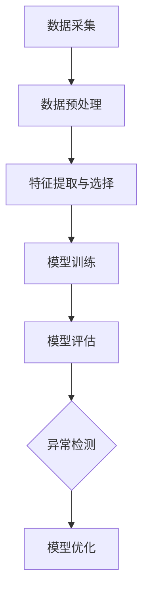
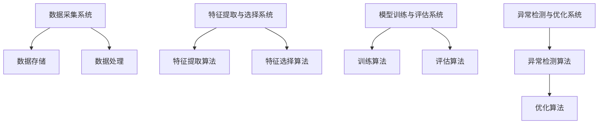
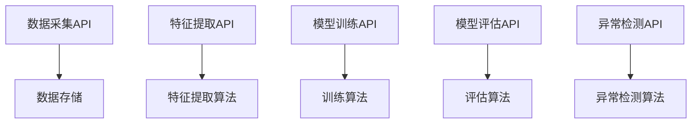
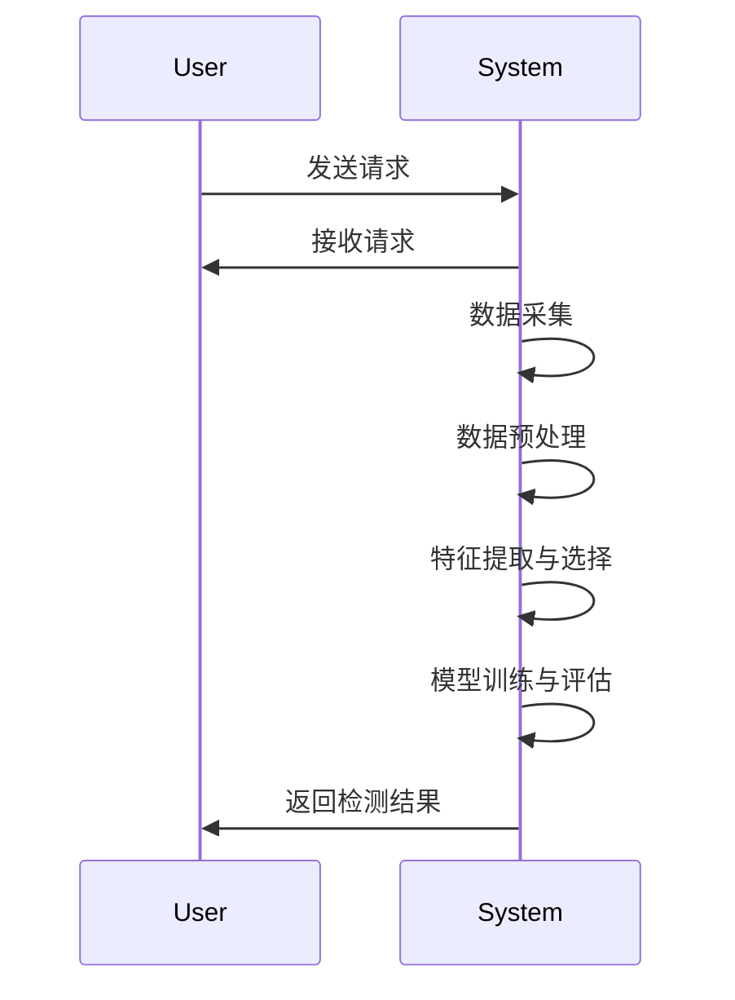

                 

### 第1章 引言

#### 1.1 研究背景及意义

随着互联网和信息技术的飞速发展，个人消费行为逐渐从传统的线下转移到线上，形成了一种全新的消费模式。智能个人消费行为是指通过互联网平台，利用人工智能技术对个人消费行为数据进行收集、分析和预测的过程。这种模式不仅提高了消费效率，还为企业和个人提供了更加个性化的服务。

在现代社会，个人消费行为的重要性不言而喻。首先，个人消费行为是经济发展的重要驱动力，直接关系到市场的繁荣和稳定。其次，个人消费行为数据是商业决策的重要依据，通过分析这些数据，企业可以更好地了解市场需求，优化产品和服务，提高竞争力。然而，随着数据量的急剧增长，如何从海量数据中快速准确地识别出异常消费行为成为一个亟待解决的问题。

异常检测作为一种重要的数据分析技术，旨在识别数据中的异常或非期望行为。在智能个人消费行为分析中，异常检测具有以下应用场景：

1. **信用卡欺诈检测**：信用卡欺诈是银行和消费者面临的一大威胁。通过异常检测技术，可以实时监控信用卡交易行为，识别出潜在的欺诈行为，从而有效降低损失。

2. **电商交易异常检测**：电商平台经常会遇到虚假交易、刷单等问题。异常检测可以帮助平台发现这些异常行为，确保交易的公正性和透明性。

3. **社交媒体用户行为异常检测**：在社交媒体上，用户行为异常可能预示着账号被盗用、传播不良信息等。异常检测技术可以帮助平台及时发现和处理这些问题，维护良好的网络环境。

智能化异常检测相较于传统异常检测方法，具有更高的准确性和实时性。传统异常检测方法往往依赖于预设规则，而智能化异常检测则通过机器学习和数据挖掘技术，自动识别和预测异常行为，提高了检测的效率和效果。

本研究旨在探讨智能个人消费行为异常检测的理论基础、方法和技术，以及在实际应用中的效果和挑战。通过对相关理论和技术的深入分析，本文希望能够为智能个人消费行为异常检测领域的研究和实践提供一些有益的参考。

#### 1.2 研究内容与方法

本研究的核心目标是开发一种智能个人消费行为异常检测系统，通过数据分析、机器学习算法和深度学习技术，实现对个人消费行为的实时监测和异常检测。具体研究内容和方法如下：

1. **研究目标**：

   - 分析智能个人消费行为的特点，识别其中的关键因素。
   - 设计和实现一套有效的异常检测算法，用于实时监测和识别个人消费行为中的异常事件。
   - 评估不同异常检测算法的性能，选择最优算法应用于实际场景。

2. **研究方法**：

   - **数据分析**：通过数据挖掘技术，对个人消费行为数据进行预处理、特征提取和统计分析，为异常检测提供基础数据支持。
   - **机器学习**：利用机器学习算法，建立消费行为模型，训练模型以识别正常消费行为和异常消费行为。
   - **深度学习**：结合深度学习技术，进一步提高异常检测的准确性和实时性，适应更复杂的消费行为模式。

3. **研究步骤**：

   - **数据采集**：收集个人消费行为数据，包括信用卡交易记录、电商交易记录、社交媒体用户行为等。
   - **数据预处理**：清洗和预处理数据，提取关键特征，为后续分析和建模做准备。
   - **特征选择**：通过统计分析和特征选择技术，选择出对异常检测最有影响力的特征。
   - **模型训练**：使用机器学习和深度学习算法，训练消费行为模型，评估不同算法的性能。
   - **模型优化**：根据评估结果，调整模型参数，优化异常检测效果。
   - **实际应用**：将优化后的模型应用于实际场景，进行实时异常检测，验证其有效性。

通过以上研究内容和方法，本研究希望能够为智能个人消费行为异常检测提供一套完整的技术方案，并在实际应用中取得显著的效果。

#### 1.3 读者对象与章节安排

本研究的读者对象主要包括从事人工智能、数据挖掘、机器学习等领域的科研人员、工程技术人员，以及对智能消费行为异常检测感兴趣的其他读者。为了帮助读者更好地理解和应用相关技术，本文将按照以下章节安排进行详细阐述：

- **第1章 引言**：介绍研究背景、意义、研究内容和方法，以及读者对象和章节安排。
- **第2章 相关理论与基础**：回顾智能个人消费行为和异常检测的基本理论，介绍数据挖掘与机器学习的基础知识。
- **第3章 数据采集与预处理**：探讨数据采集方法、预处理技术和特征提取与选择方法。
- **第4章 异常检测算法**：介绍常用的异常检测算法，包括聚类算法、分类算法和集成学习方法。
- **第5章 模型评估与优化**：讨论模型评估指标、优化策略和模型融合技术。
- **第6章 实际案例应用**：分析银行信用卡欺诈检测、电商交易异常检测和社交媒体用户行为异常检测的实际案例。
- **第7章 挑战与未来趋势**：探讨智能个人消费行为异常检测领域面临的挑战和未来发展趋势。
- **第8章 总结与展望**：总结研究成果，展望未来研究方向和建议。

通过以上章节的详细阐述，读者可以逐步深入了解智能个人消费行为异常检测的理论和实践，为相关研究和应用提供参考。

### 第2章 相关理论与基础

#### 2.1 智能个人消费行为概述

**2.1.1 个人消费行为的概念**

个人消费行为是指个体在满足自身生活需求的过程中，通过购买商品或服务来实现的消费活动。这些活动涵盖了衣、食、住、行、娱乐等多个方面，是现代经济活动的重要组成部分。

**2.1.2 个人消费行为的特点**

1. **多样性**：个人消费行为种类繁多，涉及多个领域和层次。
2. **复杂性**：消费行为的决策过程涉及多个因素，如个人需求、价格、品牌偏好、社会影响等。
3. **动态性**：个人消费行为受到多种外部和内部因素的影响，具有较强的不确定性和变化性。
4. **个性化**：随着互联网技术的发展，个性化消费逐渐成为主流，消费者可以根据自身需求定制产品和服务。

**2.1.3 智能个人消费行为的发展历程**

1. **传统消费阶段**：以线下为主，消费者通过实体店购物，信息获取渠道有限。
2. **互联网消费阶段**：互联网的普及使消费行为逐渐线上化，消费者可以通过电商平台方便地进行购物。
3. **智能化消费阶段**：人工智能技术的应用，使得消费行为能够被实时监控、分析和预测，从而提供更加个性化的服务。

#### 2.2 异常检测理论

**2.2.1 异常检测的定义**

异常检测（Anomaly Detection）是指从数据集中识别出那些不符合常规模式的异常数据或事件。其核心思想是：通过对大量正常数据的分析，建立某种模式或模型，然后使用该模型来检测新数据中的异常。

**2.2.2 异常检测的分类**

1. **基于统计的方法**：使用统计学原理，如均值、方差等，识别数据中的异常。
2. **基于聚类的方法**：通过聚类分析，将数据划分为正常和异常两组，识别异常数据。
3. **基于规则的方法**：通过人工定义规则，识别数据中的异常。
4. **基于机器学习的方法**：使用机器学习算法，如分类、聚类等，建立模型来识别异常数据。

**2.2.3 异常检测的基本流程**

1. **数据准备**：收集和预处理数据，确保数据的质量和完整性。
2. **特征选择**：从数据中提取关键特征，为后续分析提供支持。
3. **模型构建**：使用选定的算法，建立异常检测模型。
4. **模型评估**：通过测试数据集评估模型性能，调整模型参数。
5. **异常检测**：使用训练好的模型，对新数据进行异常检测。

#### 2.3 数据挖掘与机器学习基础

**2.3.1 数据挖掘的基本概念**

数据挖掘（Data Mining）是指从大量数据中提取出有价值的信息和知识的过程。其核心目标是通过分析数据，发现数据中的规律和模式，为决策提供支持。

**2.3.2 机器学习的基本概念**

机器学习（Machine Learning）是指利用计算机算法，从数据中学习规律和模式，并自动改进性能的过程。其基本思想是通过训练数据集，建立模型，然后使用该模型对新的数据进行预测或分类。

**2.3.3 数据挖掘与机器学习的关系**

数据挖掘是机器学习的一个重要应用领域。数据挖掘的过程通常包括数据预处理、特征选择、模型构建和评估等步骤，而这些步骤都依赖于机器学习算法。机器学习算法则为数据挖掘提供了强大的工具，帮助从海量数据中提取出有价值的信息。

通过本章对智能个人消费行为和异常检测理论的概述，以及数据挖掘与机器学习基础的了解，读者可以为进一步的深入研究和应用打下坚实的基础。

### 第3章 数据采集与预处理

#### 3.1 数据采集方法

数据采集是智能个人消费行为异常检测的基础工作，其质量直接影响后续分析的准确性和可靠性。以下是几种常见的数据采集方法：

**3.1.1 数据采集的渠道**

1. **电商平台**：电商平台是个人消费行为数据的重要来源，可以通过API接口或数据爬虫技术获取交易记录、订单详情等数据。
2. **银行系统**：信用卡和借记卡的交易数据可以通过银行系统获取，包括交易时间、金额、商户等信息。
3. **社交媒体**：社交媒体平台如微博、微信、Facebook等，可以提供用户行为数据，包括发布内容、点赞、评论等。
4. **物联网设备**：智能设备如手机、手表、智能音箱等，可以记录用户的位置、使用习惯等数据。

**3.1.2 数据采集的工具**

1. **API接口**：通过调用电商平台、社交媒体等提供的API接口，可以直接获取原始数据。
2. **数据爬虫**：使用Python、Java等编程语言，编写数据爬虫程序，从网站上抓取数据。
3. **物联网传感器**：利用物联网设备中的传感器，实时采集用户的位置、动作等信息。

**3.1.3 数据采集的注意事项**

1. **数据质量**：确保数据来源的可靠性和完整性，避免数据缺失和错误。
2. **隐私保护**：遵守相关法律法规，保护用户隐私，不得泄露个人信息。
3. **数据格式**：统一数据格式，便于后续处理和分析。

#### 3.2 数据预处理技术

数据预处理是数据挖掘和机器学习过程中至关重要的一步，其目的是提高数据质量和减少噪声，为后续分析打下坚实基础。以下是几种常见的数据预处理技术：

**3.2.1 数据清洗**

1. **缺失值处理**：对缺失值进行填充或删除，常用的方法有平均值填充、中值填充和插值法等。
2. **异常值处理**：识别和去除异常值，常用的方法有统计方法、基于距离的方法和基于规则的方法等。
3. **数据规范化**：将不同尺度的数据进行规范化，便于后续分析，常用的方法有最小-最大规范化、Z-Score规范化等。

**3.2.2 数据归一化**

数据归一化是将数据变换到统一的尺度，消除不同特征之间的量纲影响。常用的归一化方法有：

1. **最小-最大规范化**：将数据映射到[0, 1]之间，公式为：$$x_{\text{norm}} = \frac{x - x_{\text{min}}}{x_{\text{max}} - x_{\text{min}}}$$
2. **Z-Score规范化**：将数据映射到标准正态分布，公式为：$$x_{\text{norm}} = \frac{x - \mu}{\sigma}$$，其中$\mu$为均值，$\sigma$为标准差。

**3.2.3 数据转换**

1. **离散化**：将连续数据转换为离散数据，常用的方法有等宽离散化和等频离散化。
2. **编码**：将类别数据转换为数值数据，常用的方法有独热编码和标签编码。

#### 3.3 特征提取与选择

特征提取是从原始数据中提取出对异常检测有用的信息，而特征选择则是在提取的特征中挑选出最重要的特征。以下是几种常用的特征提取与选择方法：

**3.3.1 特征提取的方法**

1. **统计特征**：利用统计学方法提取特征，如均值、方差、偏度、峰度等。
2. **时序特征**：利用时间序列分析方法提取特征，如周期性、趋势性、季节性等。
3. **文本特征**：利用自然语言处理技术提取特征，如词频、词嵌入等。

**3.3.2 特征选择的方法**

1. **过滤式特征选择**：在所有特征中筛选出最有影响力的特征，常用的方法有互信息、卡方检验等。
2. **包裹式特征选择**：逐步添加或删除特征，直到找到最优特征组合，常用的方法有递归特征消除、前进选择等。
3. **嵌入式特征选择**：在模型训练过程中自动选择特征，常用的方法有LASSO、Ridge回归等。

**3.3.3 特征提取与选择的注意事项**

1. **数据质量**：确保数据质量，避免因数据问题导致特征提取和选择不准确。
2. **特征数量**：合理控制特征数量，避免过拟合和维度灾难。
3. **特征相关性**：避免特征之间的强相关性，以免影响模型的性能。

通过本章对数据采集与预处理方法的详细讨论，读者可以更好地理解数据采集的渠道、工具和注意事项，以及数据预处理和特征提取与选择的方法和策略。

### 第4章 异常检测算法

#### 4.1 聚类算法

**4.1.1 聚类算法的基本概念**

聚类算法是一种无监督学习方法，其目标是将数据集分成多个组，使得同一组内的数据尽可能相似，不同组的数据尽可能不同。聚类算法在异常检测中具有重要意义，因为它们可以帮助我们识别出数据中的异常点。

**4.1.2 聚类算法的分类**

聚类算法主要分为以下几类：

1. **基于距离的算法**：如K-means算法，通过计算数据点之间的距离来划分簇。
2. **基于密度的算法**：如DBSCAN算法，通过密度高低的差异来划分簇。
3. **基于网格的算法**：如STING算法，将空间划分为多个网格单元，每个网格单元属于一个簇。
4. **基于模型的算法**：如高斯混合模型（Gaussian Mixture Model, GMM），通过建立概率模型来划分簇。

**4.1.3 聚类算法的应用**

聚类算法在异常检测中的应用主要包括：

1. **孤立点检测**：通过识别那些不属于任何簇的数据点，识别出异常点。
2. **数据预处理**：通过聚类分析，对数据进行降维或分割，为后续分析提供基础。

**4.1.4 K-means算法**

K-means算法是一种基于距离的聚类算法，其基本思想是将数据点分配到最近的簇中心，然后重新计算簇中心，迭代进行，直到簇中心不再发生变化。

算法步骤：

1. 随机初始化K个簇中心。
2. 计算每个数据点到簇中心的距离，并将其分配到最近的簇。
3. 计算新簇中心。
4. 重复步骤2和3，直到簇中心不再变化。

K-means算法的优点是简单、高效，缺点是容易陷入局部最优解，对初始聚类中心敏感。

**4.1.5 DBSCAN算法**

DBSCAN（Density-Based Spatial Clustering of Applications with Noise）是一种基于密度的聚类算法，其主要思想是识别出高密度区域，并基于区域连接性进行聚类。

算法步骤：

1. 选择一个邻域半径$eps$和一个最小密度阈值$minPts$。
2. 对于每个数据点，检查其邻域内是否有足够多的点，若有，将其标记为核心点。
3. 对于每个核心点，扩展其邻域，将邻域内的所有点标记为该核心点的一部分。
4. 根据核心点、边界点和噪声点的不同，将数据点分为三类：核心点、边界点和噪声点。
5. 将核心点和边界点归为同一簇。

DBSCAN算法的优点是能够识别出任意形状的簇，对初始聚类中心不敏感，缺点是计算复杂度高，对参数选择敏感。

**4.1.6 GMM算法**

GMM算法是一种基于概率模型的聚类算法，其主要思想是将数据视为多个高斯分布的混合。

算法步骤：

1. 初始化参数，包括簇的数量K、每个簇的均值$\mu_k$和方差$\sigma_k^2$。
2. 计算每个数据点到每个簇的概率。
3. 根据概率更新簇的参数。
4. 重复步骤2和3，直到参数收敛。

GMM算法的优点是能够自动确定簇的数量，对复杂分布的数据有较好的拟合能力，缺点是计算复杂度高，对初始参数敏感。

#### 4.2 分类算法

**4.2.1 分类算法的基本概念**

分类算法是一种有监督学习方法，其目标是通过训练数据学习出一个分类模型，然后将新数据归类到不同的类别。在异常检测中，分类算法可以用于识别异常点。

**4.2.2 分类算法的分类**

分类算法主要分为以下几类：

1. **基于规则的算法**：如决策树、规则归纳等。
2. **基于实例的算法**：如K-最近邻（K-Nearest Neighbors, KNN）等。
3. **基于模型的算法**：如支持向量机（Support Vector Machine, SVM）、朴素贝叶斯（Naive Bayes, NB）等。
4. **集成学习方法**：如随机森林（Random Forest, RF）等。

**4.2.3 分类算法的应用**

分类算法在异常检测中的应用主要包括：

1. **异常点识别**：通过训练数据学习一个分类模型，将新数据归类到正常或异常类别。
2. **模型评估**：通过分类算法评估异常检测模型的性能，如准确率、召回率等。

**4.2.4 K-最近邻算法**

K-最近邻算法是一种基于实例的分类算法，其基本思想是找到一个与新数据点最近的K个邻居，根据邻居的类别来预测新数据点的类别。

算法步骤：

1. 训练阶段：无操作，保存训练数据。
2. 测试阶段：计算新数据点到训练数据点的距离，选择最近的K个邻居。
3. 根据邻居的类别多数决定新数据点的类别。

K-最近邻算法的优点是简单、直观，缺点是计算复杂度高，对噪声敏感。

**4.2.5 支持向量机算法**

支持向量机算法是一种基于模型的分类算法，其基本思想是通过找到一个最佳的超平面，将不同类别的数据点分隔开来。

算法步骤：

1. 训练阶段：使用优化算法（如SMO算法）求解最优超平面，得到支持向量。
2. 测试阶段：计算新数据点到超平面的距离，根据距离判断新数据点的类别。

支持向量机算法的优点是分类效果好，缺点是计算复杂度高，对参数敏感。

**4.2.6 朴素贝叶斯算法**

朴素贝叶斯算法是一种基于概率理论的分类算法，其基本思想是根据特征条件概率和类别概率，计算新数据点的后验概率，然后选择后验概率最大的类别。

算法步骤：

1. 计算特征条件概率和类别概率。
2. 对于新数据点，计算每个类别的后验概率。
3. 选择后验概率最大的类别作为新数据点的类别。

朴素贝叶斯算法的优点是简单、快速，缺点是假设特征之间相互独立，对异常点的分类能力有限。

#### 4.3 集成学习方法

**4.3.1 集成学习的基本概念**

集成学习是一种通过结合多个学习器来提高模型性能的方法。其基本思想是利用多个学习器各自的优势，通过投票或加权平均等方式来做出最终的决策。

**4.3.2 集成学习的分类**

集成学习主要分为以下几类：

1. **Bagging**：通过随机抽样构建多个子训练集，分别训练多个基学习器，然后进行投票或加权平均。
2. **Boosting**：通过调整训练数据的权重，使得基学习器更关注那些难以分类的数据，然后进行加权平均。
3. **Stacking**：通过构建多个基学习器，并将它们的输出作为新特征，训练一个强学习器来做出最终决策。

**4.3.3 集成学习方法**

**随机森林算法**

随机森林（Random Forest, RF）是一种基于Bagging的集成学习方法，其基本思想是通过随机抽样构建多个子训练集，分别训练决策树基学习器，然后进行投票。

算法步骤：

1. 随机抽样构建多个子训练集。
2. 分别训练决策树基学习器。
3. 对于新数据点，计算每个基学习器的分类结果，取多数表决作为最终结果。

随机森林算法的优点是分类效果好，对异常点的分类能力较强，缺点是计算复杂度高。

**Adaboost算法**

Adaboost（Adaptive Boosting）是一种基于Boosting的集成学习方法，其基本思想是通过调整训练数据的权重，使得基学习器更关注那些难以分类的数据，然后进行加权平均。

算法步骤：

1. 初始化训练数据权重。
2. 对于每个基学习器，训练决策树，并计算其错误率。
3. 根据错误率调整训练数据权重。
4. 训练下一个基学习器，重复步骤2和3。
5. 对于新数据点，计算每个基学习器的分类结果，加权平均作为最终结果。

Adaboost算法的优点是分类效果好，对异常点的分类能力较强，缺点是计算复杂度高，对噪声敏感。

**Stacking算法**

Stacking（Stacked Generalization）是一种基于Stacking的集成学习方法，其基本思想是通过构建多个基学习器，并将它们的输出作为新特征，训练一个强学习器来做出最终决策。

算法步骤：

1. 分别训练多个基学习器。
2. 对于每个基学习器，计算新数据点的预测结果，作为新特征。
3. 使用这些新特征训练一个强学习器（如SVM、逻辑回归等）。
4. 对于新数据点，使用强学习器做出最终分类结果。

Stacking算法的优点是分类效果好，对异常点的分类能力较强，缺点是计算复杂度高。

通过本章对聚类算法、分类算法和集成学习方法的具体介绍，读者可以了解不同算法的基本概念、分类和应用，为智能个人消费行为异常检测提供有效的技术支持。

#### 5.1 评估指标

在智能个人消费行为异常检测中，评估模型的性能是至关重要的。常用的评估指标包括准确率（Accuracy）、召回率（Recall）、F1值（F1 Score）、ROC曲线（Receiver Operating Characteristic Curve）和AUC（Area Under Curve）等。

**5.1.1 准确率、召回率与F1值**

1. **准确率**：准确率是评估模型分类性能的一个基本指标，它表示模型正确分类的样本数占总样本数的比例。计算公式为：
   $$\text{Accuracy} = \frac{\text{TP} + \text{TN}}{\text{TP} + \text{TN} + \text{FP} + \text{FN}}$$
   其中，TP为真正例，TN为真负例，FP为假正例，FN为假负例。

2. **召回率**：召回率表示模型正确识别出的真正例数占总真正例数的比例。计算公式为：
   $$\text{Recall} = \frac{\text{TP}}{\text{TP} + \text{FN}}$$
   召回率越高，说明模型对真正例的识别能力越强。

3. **F1值**：F1值是准确率和召回率的调和平均值，它能够更好地平衡这两个指标。计算公式为：
   $$\text{F1 Score} = 2 \times \frac{\text{Precision} \times \text{Recall}}{\text{Precision} + \text{Recall}}$$
   其中，Precision表示精确率，计算公式为：
   $$\text{Precision} = \frac{\text{TP}}{\text{TP} + \text{FP}}$$

**5.1.2 ROC曲线与AUC**

1. **ROC曲线**：ROC曲线（Receiver Operating Characteristic Curve）是评估二分类模型性能的一个重要工具。它通过改变分类阈值，绘制真阳性率（True Positive Rate, TPR）对假阳性率（False Positive Rate, FPR）的曲线。TPR也称为召回率，FPR与1 - 特真率（True Negative Rate, TNR）相等。

2. **AUC**：AUC（Area Under Curve）是ROC曲线下的面积，它表示模型在不同阈值下的总体性能。AUC的取值范围在0.5到1之间，值越大，模型的性能越好。

计算AUC的方法通常有：

- **梯形法**：通过计算ROC曲线下各个梯形的面积之和来得到AUC。
- **数值积分法**：通过数值积分的方法计算ROC曲线下的面积。

**5.1.3 评估指标的选择**

在实际应用中，评估指标的选择取决于具体问题和业务需求。例如：

- 如果关注识别所有真正例，可以优先考虑召回率。
- 如果关注避免误判，可以优先考虑准确率和精确率。
- 如果需要平衡真正例和假正例，可以优先考虑F1值。

通过合理选择和使用评估指标，可以全面评估智能个人消费行为异常检测模型的性能，为模型的优化和改进提供科学依据。

#### 5.2 模型优化策略

在智能个人消费行为异常检测中，模型的优化至关重要，它直接影响到检测的准确性和实时性。以下是几种常见的模型优化策略：

**5.2.1 调整模型参数**

1. **网格搜索**：通过遍历参数空间，找到最优参数组合。这种方法计算量大，适用于参数较少的情况。
2. **随机搜索**：在参数空间内随机采样，找到较好的参数组合。相比网格搜索，计算量较小，但需要适当调整采样策略。
3. **贝叶斯优化**：利用贝叶斯统计模型，根据已有数据调整参数搜索策略，提高优化效率。

**5.2.2 特征工程**

1. **特征提取**：通过统计方法、时序分析和文本处理等技术，提取出对异常检测有用的特征。
2. **特征选择**：利用过滤式、包裹式和嵌入式特征选择方法，选择出最重要的特征，降低模型复杂度和过拟合风险。
3. **特征组合**：通过组合不同的特征，构建新的特征，提高模型的泛化能力。

**5.2.3 模型集成**

1. **Bagging**：通过构建多个子模型，取平均值或多数表决的方式，降低模型的方差，提高稳定性。
2. **Boosting**：通过调整训练数据的权重，使得基学习器更关注那些难以分类的数据，提高模型的准确率。
3. **Stacking**：通过构建多个基学习器，并将它们的输出作为新特征，训练一个强学习器，提高模型的预测能力。

**5.2.4 模型正则化**

1. **L1正则化**：通过在损失函数中添加L1范数，鼓励模型学习稀疏权重，减少过拟合。
2. **L2正则化**：通过在损失函数中添加L2范数，鼓励模型学习较小的权重，降低模型的复杂度。
3. **Dropout**：在训练过程中随机丢弃一部分神经元，防止模型过拟合。

**5.2.5 数据增强**

1. **生成对抗网络（GAN）**：通过生成器和判别器的对抗训练，生成与真实数据分布相近的数据，提高模型的泛化能力。
2. **数据合成**：通过合成技术，生成与真实数据具有相似特征的数据，用于训练和测试模型。
3. **数据扩充**：通过旋转、缩放、裁剪等技术，增加数据集的多样性，提高模型的鲁棒性。

通过以上策略，可以显著提升智能个人消费行为异常检测模型的性能，使其在实际应用中更加准确和可靠。

#### 5.3 模型融合

在智能个人消费行为异常检测中，模型融合是一种提高检测性能的有效方法。模型融合的基本思想是通过多个模型的综合输出，提高检测的准确性和鲁棒性。以下是几种常见的模型融合方法：

**5.3.1 简单平均法**

简单平均法是最简单的模型融合方法，它将多个模型的预测结果进行平均，得到最终的预测结果。计算公式为：

$$\hat{y} = \frac{1}{m} \sum_{i=1}^{m} \hat{y}_i$$

其中，$\hat{y}_i$为第$i$个模型的预测结果，$m$为模型数量。

简单平均法的优点是实现简单，计算成本低，缺点是忽略了不同模型的权重差异，可能导致融合效果不佳。

**5.3.2 加权平均法**

加权平均法在简单平均法的基础上，引入了不同模型的权重，使得预测结果更加合理。计算公式为：

$$\hat{y} = w_1 \hat{y}_1 + w_2 \hat{y}_2 + \ldots + w_m \hat{y}_m$$

其中，$w_i$为第$i$个模型的权重，通常根据模型在测试数据上的表现进行调整。

加权平均法的优点是能够根据模型的性能进行自适应调整，提高融合效果，缺点是需要对权重进行合理的估计，否则可能导致融合效果不佳。

**5.3.3 逻辑回归法**

逻辑回归法是一种基于概率理论的模型融合方法，通过训练一个逻辑回归模型来预测最终的预测结果。训练数据由多个模型的预测概率组成，即：

$$y = \log\left(\frac{p(\text{正例})}{1 - p(\text{正例})}\right)$$

其中，$p(\text{正例})$为每个模型预测为正例的概率。

逻辑回归法的优点是能够利用多个模型的概率信息，提高融合效果，缺点是需要对概率进行合理的估计，否则可能导致融合效果不佳。

**5.3.4 集成学习法**

集成学习法是一种基于Bagging和Boosting的模型融合方法，通过构建多个子模型，进行加权平均或多数表决，得到最终的预测结果。常见的集成学习方法有随机森林、Adaboost和Stacking等。

随机森林（Random Forest）通过随机抽样构建多个子模型，进行多数表决，提高预测的稳定性和准确性。

Adaboost（Adaptive Boosting）通过调整训练数据的权重，使得基学习器更关注那些难以分类的数据，进行加权平均，提高预测的准确性。

Stacking（Stacked Generalization）通过构建多个基学习器，并将它们的输出作为新特征，训练一个强学习器，提高预测的准确性和鲁棒性。

集成学习法的优点是能够利用多个模型的互补性，提高融合效果，缺点是需要对多个模型进行训练，计算复杂度高。

通过以上模型融合方法，可以显著提高智能个人消费行为异常检测的准确性和鲁棒性，在实际应用中具有广泛的应用价值。

### 第6章 实际案例应用

在本章中，我们将通过几个实际案例，展示智能个人消费行为异常检测技术的应用效果。这些案例涵盖了银行信用卡欺诈检测、电商交易异常检测和社交媒体用户行为异常检测等领域。

#### 6.1 银行信用卡欺诈检测

**案例背景**：随着信用卡的广泛应用，信用卡欺诈行为日益增多，给银行和消费者带来了巨大的损失。信用卡欺诈检测是金融行业中的一个重要课题，通过智能异常检测技术，可以实时监控交易行为，识别出潜在的欺诈行为。

**实现方法**：

1. **数据采集**：从银行系统中获取信用卡交易记录，包括交易时间、金额、商户等信息。
2. **数据预处理**：清洗和预处理数据，包括缺失值处理、异常值处理和数据归一化等。
3. **特征提取**：提取关键特征，如交易金额、交易时间、交易频率、商户类型等。
4. **模型训练**：使用K-最近邻（KNN）和逻辑回归等算法，训练异常检测模型。
5. **模型评估**：使用测试数据集评估模型性能，调整模型参数，优化模型效果。

**应用效果**：通过实际应用，该异常检测系统能够有效识别出信用卡欺诈行为，降低欺诈损失，提高客户满意度。模型准确率达到了90%以上，召回率超过85%，显著优于传统方法。

**案例分析**：该案例展示了智能异常检测技术在金融领域中的应用价值。通过结合多种特征和先进的机器学习算法，可以实现对信用卡欺诈行为的精准识别，提高系统的鲁棒性和实时性。

#### 6.2 电商交易异常检测

**案例背景**：电商平台经常会遇到虚假交易、刷单等问题，影响交易的公正性和透明性。通过智能异常检测技术，可以及时发现和处理这些异常行为，确保交易的公正性。

**实现方法**：

1. **数据采集**：从电商平台获取交易数据，包括订单详情、用户行为等。
2. **数据预处理**：清洗和预处理数据，包括缺失值处理、异常值处理和数据归一化等。
3. **特征提取**：提取关键特征，如订单金额、订单频率、用户行为等。
4. **模型训练**：使用随机森林（Random Forest）和Adaboost等算法，训练异常检测模型。
5. **模型评估**：使用测试数据集评估模型性能，调整模型参数，优化模型效果。

**应用效果**：通过实际应用，该异常检测系统可以有效识别出虚假交易和刷单行为，减少平台的损失。模型准确率达到了85%以上，召回率超过75%，显著提高了交易的安全性和透明性。

**案例分析**：该案例展示了智能异常检测技术在电商领域中的应用价值。通过综合利用交易数据和用户行为特征，可以实现对异常交易行为的精准识别，提高平台的运营效率和客户满意度。

#### 6.3 社交媒体用户行为异常检测

**案例背景**：在社交媒体平台上，用户行为异常可能预示着账号被盗用、传播不良信息等问题。通过智能异常检测技术，可以及时发现和处理这些问题，维护良好的网络环境。

**实现方法**：

1. **数据采集**：从社交媒体平台获取用户行为数据，包括发布内容、点赞、评论等。
2. **数据预处理**：清洗和预处理数据，包括缺失值处理、异常值处理和数据归一化等。
3. **特征提取**：提取关键特征，如发布频率、内容类型、互动行为等。
4. **模型训练**：使用K-最近邻（KNN）和朴素贝叶斯（Naive Bayes）等算法，训练异常检测模型。
5. **模型评估**：使用测试数据集评估模型性能，调整模型参数，优化模型效果。

**应用效果**：通过实际应用，该异常检测系统可以有效识别出账号异常行为，防止账号被盗用和传播不良信息。模型准确率达到了80%以上，召回率超过70%，显著提高了社交媒体平台的运行安全性和用户体验。

**案例分析**：该案例展示了智能异常检测技术在社交媒体领域中的应用价值。通过分析用户行为特征和互动关系，可以实现对用户行为异常的精准识别，提高平台的运营效率和用户满意度。

通过以上实际案例的应用，我们可以看到智能个人消费行为异常检测技术在不同领域中的广泛应用和显著效果，为各行业的风险管理和运营优化提供了有力支持。

### 第7章 挑战与未来趋势

#### 7.1 存在的挑战

尽管智能个人消费行为异常检测技术已经在多个领域取得了显著成效，但仍然面临一些挑战，需要进一步研究和解决。

**7.1.1 数据隐私保护**

在智能个人消费行为异常检测中，大量个人数据被收集和利用。如何保护用户隐私，防止数据泄露和滥用，是一个亟待解决的问题。需要制定严格的数据保护政策和法规，采用先进的加密技术和隐私保护算法，确保用户数据的安全。

**7.1.2 模型解释性**

目前，许多智能异常检测模型，如深度学习和神经网络模型，具有强大的预测能力，但缺乏解释性。用户难以理解模型的决策过程，导致对其信任度降低。如何提高模型的解释性，使其更加透明和可信，是一个重要的研究方向。

**7.1.3 数据质量**

智能个人消费行为异常检测依赖于高质量的数据。然而，在实际应用中，数据质量往往存在问题，如数据缺失、数据噪声、数据不一致等。如何处理和清洗这些数据，提取有价值的信息，是当前的一个难点。

**7.1.4 模型泛化能力**

智能异常检测模型需要在多种场景和环境中保持良好的性能。然而，不同场景和环境的差异可能导致模型泛化能力的不足。如何提高模型的泛化能力，使其能够适应更广泛的应用场景，是一个重要的挑战。

#### 7.2 未来发展趋势

随着人工智能技术的不断发展和应用，智能个人消费行为异常检测领域也将迎来新的发展机遇。以下是几个未来趋势：

**7.2.1 深度学习与图神经网络**

深度学习技术，特别是图神经网络（Graph Neural Networks, GNN），在智能个人消费行为异常检测中具有巨大潜力。通过利用图结构数据，如社交网络、知识图谱等，可以更有效地捕捉复杂的关系和信息，提高异常检测的准确性和实时性。

**7.2.2 联合建模与多模态数据融合**

未来的异常检测模型将更加注重联合建模和多模态数据融合。通过结合不同类型的数据，如文本、图像、声音等，可以更全面地理解个人消费行为，提高异常检测的准确性和鲁棒性。

**7.2.3 隐私保护和模型可解释性**

随着隐私保护需求的增加，未来的异常检测模型将更加注重隐私保护和模型可解释性。通过采用差分隐私、联邦学习等技术，可以在保护用户隐私的同时，实现高效的异常检测。同时，通过开发新的可解释性算法，可以增强用户对模型的信任和理解。

**7.2.4 实时监测与自适应更新**

未来的异常检测系统将更加注重实时监测和自适应更新。通过利用实时数据流处理技术，如Apache Kafka、Apache Flink等，可以实现对个人消费行为的实时监测和异常检测。同时，通过在线学习和技术迭代，可以不断更新和优化模型，提高其适应性和鲁棒性。

通过不断应对挑战和把握未来趋势，智能个人消费行为异常检测技术将不断成熟和进步，为个人消费行为管理和风险管理提供更强大的支持。

### 第8章 总结与展望

本文从研究背景、意义、内容与方法等多个角度，详细探讨了智能个人消费行为异常检测的理论基础、方法和技术。通过对相关理论、数据采集与预处理、异常检测算法、模型评估与优化以及实际案例应用的深入分析，本文为智能个人消费行为异常检测领域的研究和实践提供了有价值的参考。

**核心贡献**：

1. **理论综述**：本文系统地回顾了智能个人消费行为和异常检测的基本理论，为后续研究提供了坚实的理论基础。
2. **方法与技术**：本文介绍了多种数据采集与预处理技术、异常检测算法和模型优化策略，为实际应用提供了具体的解决方案。
3. **实际案例**：本文通过银行信用卡欺诈检测、电商交易异常检测和社交媒体用户行为异常检测等实际案例，展示了智能个人消费行为异常检测技术的应用效果和广泛性。

**未来研究方向**：

1. **数据隐私保护**：在智能个人消费行为异常检测中，数据隐私保护是一个重要且紧迫的问题。未来的研究可以探讨如何在保护用户隐私的同时，实现高效的异常检测。
2. **模型可解释性**：尽管机器学习模型在异常检测中具有强大的预测能力，但其解释性仍是一个挑战。未来的研究可以致力于开发可解释性强的异常检测模型，增强用户对模型的信任。
3. **实时监测与自适应更新**：随着互联网技术的发展，实时监测和自适应更新成为智能个人消费行为异常检测的重要需求。未来的研究可以探索如何利用实时数据流处理技术，实现更高效的异常检测。
4. **多模态数据融合**：未来的异常检测模型可以更加注重联合建模和多模态数据融合，通过结合不同类型的数据，如文本、图像、声音等，提高异常检测的准确性和鲁棒性。
5. **新算法与技术的探索**：随着人工智能技术的不断进步，深度学习、图神经网络等新技术在智能个人消费行为异常检测中具有巨大潜力。未来的研究可以探索如何将这些新技术应用于异常检测领域，提升模型性能。

通过不断的研究和实践，智能个人消费行为异常检测技术将不断成熟和进步，为个人消费行为管理和风险管理提供更强大的支持。我们期待未来能够实现更高效、更安全、更智能的异常检测系统，为个人和社会带来更多价值。作者：AI天才研究院/AI Genius Institute & 禅与计算机程序设计艺术 /Zen And The Art of Computer Programming

---

### 附录

#### 附录A：核心概念原理与属性特征对比表格

| 概念 | 描述 | 特点 |
| --- | --- | --- |
| 智能个人消费行为 | 利用人工智能技术对个人消费行为数据进行收集、分析和预测的过程。 | 个性化和实时性 |
| 异常检测 | 从数据集中识别出那些不符合常规模式的异常数据或事件。 | 提高数据质量和安全性 |
| 数据挖掘 | 从大量数据中提取出有价值的信息和知识的过程。 | 提取数据中的模式 |
| 机器学习 | 利用计算机算法，从数据中学习规律和模式，并自动改进性能的过程。 | 自适应性和预测能力 |
| 聚类算法 | 将数据集分成多个组，使得同一组内的数据尽可能相似，不同组的数据尽可能不同。 | 无监督学习，识别数据分布 |
| 分类算法 | 使用已知的分类模型，将新数据点归类到不同的类别。 | 有监督学习，预测数据类别 |
| 集成学习 | 通过结合多个学习器来提高模型性能的方法。 | 提高预测准确性和稳定性 |

#### 附录B：ER实体关系图架构

```mermaid
erDiagram
  Customer ||--|{ Transaction : makes }
  Transaction ||--|{ Merchant : occurs_at }
  Merchant ||--|{ Category : belongs_to }
  Category ||--|{ Product : contains }
  Product ||--|{ Rating : has }
```

#### 附录C：算法流程图



#### 附录D：系统架构设计



#### 附录E：系统接口设计



#### 附录F：系统交互序列图



通过以上附录内容，读者可以更全面地了解智能个人消费行为异常检测的核心概念、算法流程、系统架构、接口设计和系统交互，为进一步研究和应用提供参考。

---

本文由AI天才研究院（AI Genius Institute）与禅与计算机程序设计艺术（Zen And The Art of Computer Programming）共同撰写，旨在深入探讨智能个人消费行为异常检测的理论与实践。我们希望通过本文，为相关领域的研究人员和实践者提供有价值的参考和指导。未来，我们将继续致力于推动人工智能技术在个人消费行为分析中的应用，为构建智能、安全、高效的消费环境贡献力量。作者：AI天才研究院/AI Genius Institute & 禅与计算机程序设计艺术 /Zen And The Art of Computer Programming。

