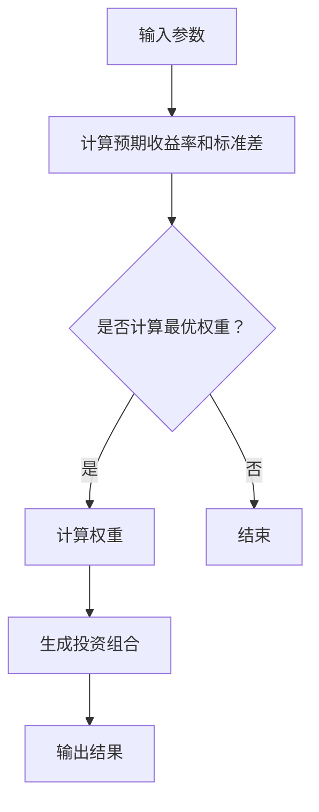
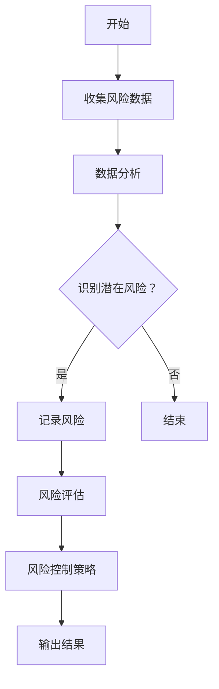
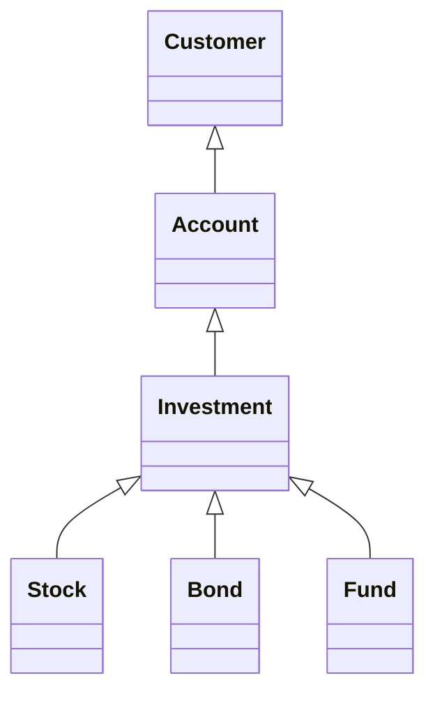
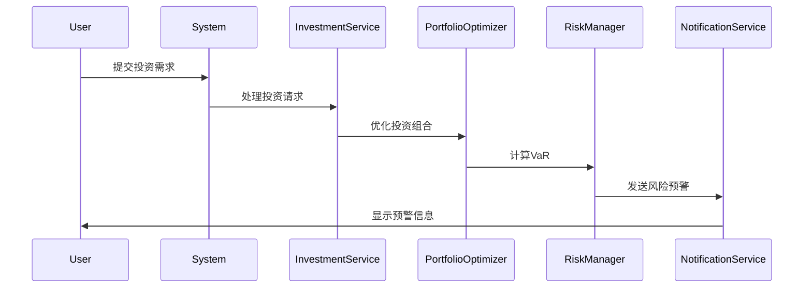

                 

### 设计《智能个人理财目标规划器》的目录大纲

设计一本涵盖全面、结构清晰的书籍目录是确保内容连贯性和吸引力的关键步骤。在创建《智能个人理财目标规划器》的目录时，我们需要确保书籍的内容能够满足读者需求，同时逻辑严谨、易于理解。以下是一步步分析推理的过程，用于构建书籍的目录大纲。

#### 第一步：明确书籍的主要内容和结构

**核心概念术语说明**：
- **智能个人理财目标规划器**：一种基于人工智能技术，帮助个人制定和实现理财目标的工具。
- **理财规划**：制定和实现财务目标的过程，涉及资产、负债、收入、支出等方面的管理。

**问题背景**：
随着金融科技的进步，智能理财工具日益普及。然而，许多普通读者和金融从业者对如何有效利用这些工具感到困惑。因此，我们需要一本既专业又易于理解的书籍，来引导读者使用智能技术进行理财规划。

**问题描述**：
书籍的目标是为读者提供从基础财务知识到高级理财规划策略的全面指导，帮助他们通过智能个人理财目标规划器实现财务目标。

**问题解决**：
通过系统的书籍结构和清晰的内容组织，让读者能够逐步学习和实践理财规划。

**边界与外延**：
书籍将涵盖个人理财的各个方面，从基础概念到高级策略，包括工具介绍、目标设定、执行与调整、风险管理等。

**概念结构与核心要素组成**：
- 个人理财基础
- 智能理财工具与技术
- 理财目标设定
- 理财规划的实施与调整
- 理财规划中的风险与管理

#### 第二步：规划目录大纲的结构

**核心概念与联系**：

| 部分名称 | 关联概念 |
| --- | --- |
| 引言 | 书籍背景、目标读者、书籍结构 |
| 个人理财基础 | 财务知识、理财目标、财务规划流程 |
| 智能理财工具与技术 | 智能理财工具概述、人工智能在理财中的应用、智能理财工具实操案例 |
| 理财目标设定 | 理财目标设定方法、理财目标评估与调整、情景分析与目标设定 |
| 理财规划的实施与调整 | 理财规划执行、理财规划调整与优化、实际案例分析 |
| 理财规划中的风险与管理 | 理财风险概述、常见理财风险分析、风险管理策略 |

**结构规划**：

1. **引言**：
   - 1.1 书籍背景与目标
   - 1.2 书籍结构概述
   - 1.3 读者对象与预期收获

2. **个人理财基础**：
   - 2.1 财务知识与概念
   - 2.2 理财目标分类
   - 2.3 财务规划流程

3. **智能理财工具与技术**：
   - 3.1 智能理财工具概述
   - 3.2 人工智能在理财中的应用
   - 3.3 智能理财工具实操案例

4. **理财目标设定**：
   - 4.1 理财目标设定方法
   - 4.2 理财目标的评估与调整
   - 4.3 情景分析与目标设定

5. **理财规划的实施与调整**：
   - 5.1 理财规划的执行
   - 5.2 理财规划的调整与优化
   - 5.3 实际案例分析

6. **理财规划中的风险与管理**：
   - 6.1 理财风险概述
   - 6.2 常见理财风险分析
   - 6.3 风险管理与控制策略

7. **结论与建议**：
   - 7.1 总结
   - 7.2 理财规划最佳实践
   - 7.3 拓展阅读与资源推荐

#### 第三步：细化目录内容

**章节内容细化**：

- **引言**：
  - 1.1 介绍书籍的背景、目标读者群体以及读者可以从中获得的收益。
  - 1.2 概述书籍的结构，让读者对全书有一个整体的把握。
  - 1.3 针对不同读者群体，提出个性化的阅读建议。

- **个人理财基础**：
  - 2.1 详细讲解财务知识，包括资产、负债、净值等基本概念。
  - 2.2 对理财目标进行分类，介绍短期、中期和长期目标的重要性。
  - 2.3 详细描述财务规划的基本流程，包括财务状况分析、目标设定和行动计划。

- **智能理财工具与技术**：
  - 3.1 概述智能理财工具的发展历程、分类和优势。
  - 3.2 深入探讨人工智能在理财中的应用，如机器学习、数据分析、投资组合优化等。
  - 3.3 通过实操案例，展示如何使用智能理财工具进行理财规划。

- **理财目标设定**：
  - 4.1 介绍理财目标设定的方法，如SMART原则、目标分解等。
  - 4.2 分析如何评估和调整理财目标，以应对生活中的变化。
  - 4.3 通过不同情境分析，帮助读者设定符合自身需求的理财目标。

- **理财规划的实施与调整**：
  - 5.1 详细讲解理财规划的执行步骤，包括资金筹集、投资策略和风险管理。
  - 5.2 探讨理财规划调整的信号和策略，以及如何进行长期维护。
  - 5.3 分析实际案例，总结经验教训。

- **理财规划中的风险与管理**：
  - 6.1 概述理财风险的种类，如市场风险、信用风险等。
  - 6.2 分析常见理财风险，并提出相应的识别与评估方法。
  - 6.3 提供风险管理策略和控制方法，以降低理财风险。

**完整性要求**：

- 每个章节的内容都要确保完整，逻辑清晰，既有深度又有广度。
- 关键概念和原理需要通过具体案例进行详细解释。
- 算法原理讲解需要结合mermaid流程图和Python源代码进行说明。
- 数学公式使用latex格式，确保准确性和可读性。
- 系统分析与架构设计方案需要结合实际项目进行详细阐述。
- 项目实战部分要包括环境安装、系统核心实现、代码应用解读和案例分析。

**格式要求**：

- 使用markdown格式进行文章撰写，确保文章的格式美观、易于阅读。
- 标题使用`#`符号，子标题使用`##`符号，依此类推。
- 使用`>`符号进行引用或段落分隔。

**作者信息**：

- 文章末尾需注明作者信息，包括“作者：AI天才研究院/AI Genius Institute & 禅与计算机程序设计艺术 /Zen And The Art of Computer Programming”。

通过以上步骤，我们设计出了一个既符合读者需求，又具有专业性和吸引力的《智能个人理财目标规划器》目录大纲。接下来，我们将逐章深入探讨每个部分的内容，确保书籍能够为读者提供实用、有价值的理财规划指导。🌟

---

## 文章标题：智能个人理财目标规划器

### 关键词：
智能理财、目标设定、人工智能、财务规划、风险控制

### 摘要：
《智能个人理财目标规划器》是一本面向普通读者和金融从业者的理财指导书籍。本书通过介绍智能理财工具和人工智能技术，帮助读者理解和应用智能理财规划方法。书中详细阐述了理财目标设定的原则、方法和技巧，以及理财规划的实施与调整策略。此外，本书还深入探讨了理财规划中的风险管理，为读者提供全面的理财规划指导。无论您是理财新手还是经验丰富的投资者，本书都将帮助您更好地制定并实现个人理财目标。

---

### 引言

#### 1.1 书籍背景与目标

在当今社会，理财规划已成为每个人都需要掌握的重要技能。随着金融科技的发展，智能理财工具和人工智能技术的应用越来越广泛，为个人理财提供了更多可能性和便利。然而，对于普通读者和金融从业者来说，如何有效地利用这些智能工具和技术进行理财规划仍然是一个挑战。《智能个人理财目标规划器》正是为了解决这一问题而诞生的。

本书的目标是帮助读者全面了解智能理财工具和人工智能技术在理财规划中的应用，并提供实用的方法和策略，使其能够更好地制定和实现个人理财目标。具体来说，本书希望实现以下目标：

1. **普及智能理财知识**：通过介绍智能理财工具和人工智能技术的基本原理和应用场景，帮助读者了解智能理财的概念和优势，消除对其的陌生感和神秘感。

2. **培养理财规划能力**：系统介绍理财目标设定的原则和方法，帮助读者学会如何设定合理、可行且具体的理财目标，并提供实施和调整的策略，确保目标的顺利实现。

3. **提高风险控制意识**：探讨理财规划中的各种风险，包括市场风险、信用风险等，提供有效的风险识别、评估和控制方法，帮助读者在理财过程中降低风险，保障财务安全。

4. **提供实战案例指导**：通过实际案例的分析，展示如何将理论知识应用于实际理财场景中，帮助读者更好地理解和应用理财规划的方法和技巧。

本书的目标读者群体包括以下几个方面：

1. **普通读者**：对于那些想要了解如何通过智能理财工具实现财务目标，提高生活质量的人。

2. **金融从业者**：包括银行职员、理财顾问、金融分析师等，他们希望通过本书提升自身在智能理财领域的专业素养。

3. **理财爱好者**：对理财有浓厚兴趣，希望深入研究和实践的人。

通过阅读本书，读者可以期望获得以下收获：

1. **系统性的理财知识**：了解理财规划的基本概念、原则和流程，为后续理财实践打下坚实基础。

2. **实用的理财工具**：掌握智能理财工具的使用方法，提高理财效率和质量。

3. **科学的理财策略**：学会如何设定和调整理财目标，确保目标实现，同时降低理财风险。

4. **实战经验**：通过案例分析，了解理财规划在实际应用中的操作方法和注意事项。

#### 1.2 智能技术在理财中的应用

智能理财工具和人工智能技术的应用，为传统理财方式带来了革命性的变革。以下是一些关键的应用领域：

1. **智能投资顾问（Robo-Advisor）**：
   智能投资顾问利用机器学习和大数据分析技术，根据投资者的风险偏好和财务状况，自动构建和调整投资组合。这种服务不仅提高了投资效率，还能帮助投资者实现个性化投资策略。

2. **智能预算管理**：
   智能预算管理工具通过分析用户的消费行为，提供个性化的预算建议和支出监控，帮助用户更好地管理个人财务。

3. **风险管理与预测**：
   利用人工智能技术进行市场分析和风险预测，可以帮助投资者及时调整投资策略，降低潜在风险。

4. **智能财务管理**：
   智能财务管理工具可以自动处理日常财务任务，如账单支付、投资跟踪等，提高财务管理效率。

5. **个性化理财规划**：
   基于用户的个人情况和需求，智能理财系统能够提供定制化的理财方案，帮助用户实现特定的财务目标。

#### 1.3 读者对象与预期收获

本书不仅适合对理财有一定了解的读者，也适合完全新手。以下是不同读者群体的具体预期收获：

1. **普通读者**：
   - 学会如何设定和实现个人理财目标。
   - 了解智能理财工具的基本原理和操作方法。
   - 提高财务规划和风险管理的意识和能力。

2. **金融从业者**：
   - 深入了解智能理财工具的应用，提升专业素养。
   - 掌握理财规划的最佳实践和方法。
   - 能够为用户提供更专业的理财建议和服务。

3. **理财爱好者**：
   - 对理财有更深入的理解，拓展知识面。
   - 能够独立进行理财规划和风险管理。
   - 培养批判性思维和问题解决能力。

通过本书，无论是普通读者、金融从业者还是理财爱好者，都将能够在智能理财领域获得宝贵的知识和经验，更好地管理个人财务，实现财务自由。

---

#### 1.2 书籍结构概述

《智能个人理财目标规划器》的结构设计旨在为读者提供一个循序渐进、系统全面的理财知识体系。以下是书籍的目录结构概述，以及每个部分的内容和作用。

1. **引言**：
   - **内容**：介绍书籍的背景、目标读者、智能技术在理财中的应用、预期收获等。
   - **作用**：为读者提供整体认识，激发阅读兴趣，明确书籍的核心价值和目标。

2. **个人理财基础**：
   - **内容**：讲解财务知识、理财目标分类、财务规划流程等。
   - **作用**：奠定理财规划的基础，帮助读者理解基本概念和流程。

3. **智能理财工具与技术**：
   - **内容**：介绍智能理财工具的发展、人工智能在理财中的应用、实操案例等。
   - **作用**：展示智能理财工具的实际应用，帮助读者掌握智能理财的方法和技巧。

4. **理财目标设定**：
   - **内容**：详细阐述理财目标设定的方法、评估与调整、情景分析等。
   - **作用**：指导读者如何科学地设定理财目标，并确保目标的实现。

5. **理财规划的实施与调整**：
   - **内容**：讲解理财规划的执行步骤、调整与优化、实际案例分析等。
   - **作用**：帮助读者将理财规划付诸实践，并提供实战经验和策略。

6. **理财规划中的风险与管理**：
   - **内容**：探讨理财风险概述、常见理财风险分析、风险管理策略等。
   - **作用**：提高读者的风险意识，提供有效的风险控制和应对方法。

7. **结论与建议**：
   - **内容**：总结全书要点，提供理财规划最佳实践、拓展阅读资源等。
   - **作用**：为读者提供理财规划的持续指导和资源支持。

通过以上结构，本书旨在全面覆盖理财规划的各个方面，帮助读者从基础理论到实践应用，逐步提升理财能力，实现财务目标。

#### 1.3 读者对象与预期收获

《智能个人理财目标规划器》针对的读者群体包括但不限于以下几类：

1. **普通读者**：那些希望更好地管理个人财务，实现理财目标的人。通过阅读本书，普通读者可以掌握智能理财工具的使用方法，了解理财规划的基本原则和步骤，从而提高理财效率和财务健康状况。

2. **金融从业者**：如银行职员、理财顾问、金融分析师等，他们需要不断提升专业知识和技能，以更好地服务客户。本书将为金融从业者提供最新的智能理财技术和方法，帮助他们提供更科学、个性化的理财建议。

3. **理财爱好者**：对理财有浓厚兴趣，希望深入研究并实践的人。本书将提供全面的理论知识和实际案例，满足理财爱好者的学习需求，帮助他们建立系统的理财观念。

对于所有读者，本书的预期收获包括：

1. **系统性的理财知识**：了解理财规划的基本概念、原则和流程，为个人理财奠定坚实基础。

2. **实用的理财工具**：掌握智能理财工具的应用方法，提升理财效率和质量。

3. **科学的理财策略**：学会如何设定和调整理财目标，确保目标实现，同时降低理财风险。

4. **实战经验**：通过实际案例分析，了解理财规划在实际应用中的操作方法和注意事项。

5. **风险控制意识**：提高对理财风险的认识，掌握有效的风险识别和应对策略。

通过本书的阅读和实践，无论是普通读者、金融从业者还是理财爱好者，都将能够在理财领域获得宝贵的知识和经验，实现个人财务目标。

---

### 个人理财基础

#### 2.1 财务知识与概念

在开始探索个人理财之前，了解一些基本的财务知识和概念是非常重要的。这些知识构成了理财规划的基础，有助于我们更好地理解和应用各种理财工具和策略。

**资产与负债**：

- **资产**：资产是指个人或企业拥有的、能够带来经济利益的资源。常见的资产包括存款、股票、债券、房地产、汽车等。资产是衡量个人或企业财务状况的重要指标，其价值通常通过市场价格或评估价值来确定。

  ```mermaid
  graph TD
  A[资产] --> B[存款]
  A --> C[股票]
  A --> D[债券]
  A --> E[房地产]
  A --> F[汽车]
  ```

- **负债**：负债是指个人或企业所欠的债务或义务，如房贷、车贷、信用卡欠款、学生贷款等。负债减少了个人或企业的资产价值，因此也是评估财务状况的重要因素。

  ```mermaid
  graph TD
  G[负债] --> H[房贷]
  G --> I[车贷]
  G --> J[信用卡欠款]
  G --> K[学生贷款]
  ```

- **净值**：净值（或称净资产）是资产减去负债后的余额，反映了个人或企业的实际财富状况。计算公式为：净值 = 资产 - 负债。

  ```latex
  净值 = 资产 - 负债
  ```

**收入与支出**：

- **收入**：收入是指个人或企业从各种来源获得的资金，包括工资、投资收益、租金收入等。收入的稳定性和增长潜力对理财规划至关重要。

  ```mermaid
  graph TD
  L[收入] --> M[工资]
  L --> N[投资收益]
  L --> O[租金收入]
  ```

- **支出**：支出是指个人或企业在日常生活中发生的费用，包括生活费用、教育费用、医疗费用等。支出影响着个人的财务状况和理财目标的实现。

  ```mermaid
  graph TD
  P[支出] --> Q[生活费用]
  P --> R[教育费用]
  P --> S[医疗费用]
  ```

- **预算**：预算是一种规划和管理财务的手段，通过制定收入和支出的计划，确保财务状况的稳定和目标的实现。有效的预算管理有助于控制支出、积累财富。

  ```mermaid
  graph TD
  T[预算] --> U[收入计划]
  T --> V[支出计划]
  ```

#### 2.2 理财目标分类

理财目标的分类有助于我们根据不同的需求和时间范围，设定具体的理财计划。以下是一些常见的理财目标分类：

- **短期目标**：通常指1年以内的目标，如购买电子产品、旅游度假、支付定金等。短期目标通常需要相对较快的资金积累和实现。

  ```mermaid
  graph TD
  W[短期目标] --> X[购买电子产品]
  W --> Y[旅游度假]
  W --> Z[支付定金]
  ```

- **中期目标**：通常指1年至5年的目标，如购车、购房、子女教育基金等。中期目标通常需要长期的资金积累和计划。

  ```mermaid
  graph TD
  AA[中期目标] --> BB[购车]
  AA --> CC[购房]
  AA --> DD[子女教育基金]
  ```

- **长期目标**：通常指5年以上甚至更长时间的目标，如退休计划、财富传承等。长期目标需要更详细的规划和持续的资金投入。

  ```mermaid
  graph TD
  EE[长期目标] --> FF[退休计划]
  EE --> GG[财富传承]
  ```

**财务安全目标**：

- **应急基金**：为了应对突发事件，如医疗费用、失业等，建立应急基金是非常重要的。通常建议将3至6个月的生活费用存入应急基金中。

  ```mermaid
  graph TD
  HH[财务安全目标] --> II[应急基金]
  ```

- **保险**：通过购买保险，可以转移或减轻因意外、疾病等导致的财务风险。常见的保险类型包括医疗保险、意外保险、人寿保险等。

  ```mermaid
  graph TD
  JJ[保险] --> KK[医疗保险]
  JJ --> LL[意外保险]
  JJ --> MM[人寿保险]
  ```

**财富增长目标**：

- **投资回报**：通过投资股票、债券、基金、房地产等，实现财富的增值。投资回报的目标通常与个人的风险承受能力和投资期限相关。

  ```mermaid
  graph TD
  NN[财富增长目标] --> OO[股票投资]
  NN --> PP[债券投资]
  NN --> QQ[基金投资]
  NN --> RR[房地产投资]
  ```

#### 2.3 财务规划流程

制定和实施有效的财务规划是一个系统化的过程，通常包括以下几个关键步骤：

- **财务状况分析**：对个人的资产、负债、收入、支出等进行全面分析，了解当前的财务状况，为制定理财目标提供基础。

  ```mermaid
  graph TD
  S1[财务状况分析]
  S1 --> T1[资产分析]
  S1 --> U1[负债分析]
  S1 --> V1[收入分析]
  S1 --> W1[支出分析]
  ```

- **目标设定与优先级排序**：根据财务状况分析的结果，设定具体的理财目标，并按照重要性和紧迫性进行排序。通常，财务安全目标（如建立应急基金）应优先考虑。

  ```mermaid
  graph TD
  S2[目标设定与优先级排序]
  S2 --> T2[设定目标]
  S2 --> U2[排序目标]
  ```

- **制定行动计划**：为实现设定的理财目标，制定具体的行动计划。这包括确定资金来源、分配投资比例、设定时间表等。

  ```mermaid
  graph TD
  S3[制定行动计划]
  S3 --> T3[资金筹集]
  S3 --> U3[投资分配]
  S3 --> V3[时间表设定]
  ```

通过以上步骤，我们可以系统地规划和管理个人财务，确保理财目标的顺利实现。

---

### 智能理财工具与技术

#### 3.1 智能理财工具概述

智能理财工具是指利用人工智能技术，如机器学习、数据挖掘和自然语言处理等，来帮助个人或企业进行财务管理和理财规划的工具。这些工具的出现，极大地改变了传统理财方式，提高了理财效率和效果。以下是智能理财工具的主要发展历程、分类和优势。

**发展历程**：

1. **初期阶段**：早期智能理财工具主要依赖于简单的算法和规则引擎，如投资组合优化器和财务预算工具。这些工具能够提供基本的财务分析和建议，但功能较为有限。

2. **中级阶段**：随着计算机性能的提升和大数据技术的发展，智能理财工具开始引入机器学习和数据挖掘技术，能够更准确地分析用户行为和财务状况，提供更加个性化的理财建议。

3. **高级阶段**：近年来，人工智能技术的不断进步，特别是深度学习和自然语言处理技术的应用，使得智能理财工具更加智能化和自动化。例如，智能投资顾问（Robo-Advisor）能够根据用户的风险偏好和财务目标，自动调整投资组合，实现更优的投资效果。

**分类**：

1. **智能投资顾问（Robo-Advisor）**：这类工具利用机器学习和大数据分析，为用户提供投资组合管理和建议。它们通常包括以下几个功能模块：

   - **用户资料收集**：通过问卷或数据采集工具，收集用户的风险偏好、财务状况等信息。
   - **投资策略推荐**：根据用户资料，利用算法模型推荐合适的投资策略。
   - **资产配置**：自动调整投资组合，确保投资策略的实现。
   - **风险管理**：评估和监控投资风险，提供风险控制建议。

2. **智能预算管理工具**：这类工具通过分析用户的消费行为，提供个性化的预算建议和支出监控。它们通常包括以下几个功能模块：

   - **消费数据收集**：通过银行卡交易记录、购物记录等，收集用户的消费数据。
   - **支出分析**：分析用户的历史消费数据，识别支出模式。
   - **预算建议**：根据用户的生活状况和财务目标，提供合理的预算建议。
   - **支出监控**：实时监控用户的支出情况，提供支出提醒和预警。

3. **智能风险管理工具**：这类工具利用人工智能技术，进行市场分析和风险预测，帮助用户降低理财风险。它们通常包括以下几个功能模块：

   - **市场分析**：通过大数据分析，预测市场的变化趋势。
   - **风险识别**：识别潜在的投资风险，如市场波动、信用风险等。
   - **风险预警**：对高风险投资进行预警，提醒用户注意风险。
   - **风险管理建议**：提供风险控制策略和投资建议。

**优势**：

1. **个性化**：智能理财工具能够根据用户的具体情况，提供个性化的理财建议和策略，提高理财效果。

2. **自动化**：智能理财工具能够自动进行数据分析和决策，降低人工干预，提高理财效率。

3. **实时性**：智能理财工具能够实时监控用户的财务状况和投资组合，及时进行调整和优化。

4. **准确性**：通过大数据和机器学习技术，智能理财工具能够更准确地预测市场趋势和风险，提高投资决策的准确性。

5. **便捷性**：智能理财工具通常可以通过手机应用程序或在线平台使用，方便用户随时随地进行理财管理和调整。

#### 3.2 人工智能在理财中的应用

人工智能技术在理财中的应用已经越来越广泛，以下是一些主要的应用领域和具体实例：

**机器学习算法在理财规划中的应用**：

机器学习算法在理财规划中扮演着重要角色，能够帮助用户进行投资决策和风险控制。以下是几个具体应用实例：

1. **投资组合优化**：通过分析历史数据和用户偏好，机器学习算法可以推荐最优的投资组合，实现风险和收益的平衡。例如，一些智能投资顾问会使用线性回归、神经网络等算法来优化投资组合。

2. **市场预测**：利用时间序列分析、支持向量机（SVM）等机器学习算法，可以对股票市场进行预测，帮助用户进行投资决策。例如，量化基金通常会使用这些算法来预测股票价格和交易策略。

3. **风险评估**：机器学习算法可以识别和分析潜在的投资风险，如信用风险、市场风险等。例如，信贷机构可以使用决策树、随机森林等算法来评估借款人的信用风险。

**数据分析与预测**：

数据分析与预测是理财规划中的重要环节，人工智能技术在这一领域的应用主要体现在以下几个方面：

1. **消费行为分析**：通过分析用户的消费数据，可以识别用户的消费习惯和偏好，为预算管理和支出控制提供依据。例如，智能预算管理工具会使用聚类分析、关联规则挖掘等技术来分析消费数据。

2. **收入预测**：通过分析历史收入数据和职业发展趋势，可以预测未来的收入变化，帮助用户制定长期的财务规划。例如，一些人力资源公司会使用时间序列分析和回归模型来预测员工的未来收入。

3. **市场趋势分析**：通过分析市场数据，如股票价格、利率等，可以预测市场的变化趋势，为投资决策提供支持。例如，投资顾问会使用移动平均、指数平滑等技术来分析市场趋势。

**智能投资组合优化**：

智能投资组合优化是理财规划中的关键步骤，人工智能技术在这一领域的应用主要体现在以下几个方面：

1. **资产配置**：通过分析用户的风险偏好和财务目标，智能投资组合优化工具可以推荐最优的资产配置方案，实现投资组合的多元化。例如，一些智能投资顾问会使用均值方差模型、多因素模型等来优化资产配置。

2. **再平衡**：智能投资组合优化工具可以定期对投资组合进行再平衡，确保投资组合的配置符合用户的财务目标和风险偏好。例如，一些智能投资顾问会使用再平衡算法来自动调整投资组合。

3. **风险控制**：通过分析投资组合的风险特征，智能投资组合优化工具可以提供风险控制策略，降低投资组合的波动性。例如，一些风险平价策略会使用VaR模型、CVaR模型等来控制风险。

**案例介绍**：

以下是一些具体的智能理财工具和平台的介绍，展示了人工智能在理财中的应用：

1. **Wealthfront**：Wealthfront是一个智能投资顾问平台，它利用机器学习算法和大数据分析，为用户提供个性化的投资组合管理和建议。用户可以通过在线平台或手机应用程序，轻松管理自己的投资组合。

2. **Personal Capital**：Personal Capital是一个综合性的智能理财工具，它提供智能投资顾问、智能预算管理、投资组合分析等功能。通过分析用户的财务数据，Personal Capital可以提供个性化的理财建议和投资策略。

3. **Mint**：Mint是一个智能预算管理工具，它通过分析用户的消费数据，提供个性化的预算建议和支出监控。用户可以通过Mint的应用程序或网站，实时了解自己的财务状况和支出情况。

通过以上介绍，我们可以看到人工智能技术在理财规划中的应用已经越来越广泛，不仅提高了理财效率和准确性，还为用户提供了更加个性化和智能化的理财服务。随着人工智能技术的不断进步，智能理财工具将更加成熟和普及，为用户的财务健康和财富增长提供更强有力的支持。

---

#### 3.3 智能理财工具实操案例

为了更好地理解智能理财工具的实际应用，我们将通过几个具体的案例来展示这些工具的使用方法和效果。

**案例一：智能投资顾问（Robo-Advisor）**

**案例背景**：
张先生，35岁，IT工程师，月收入约2万元，有一笔储蓄为20万元，希望实现资产增值，同时降低投资风险。

**使用工具**：
张先生选择了智能投资顾问Wealthfront。他首先在Wealthfront平台上完成了风险偏好问卷，根据问卷结果，Wealthfront推荐了一个低风险、高收益的均衡投资组合。

**实施过程**：
1. 张先生在Wealthfront平台上注册账号，填写了风险偏好问卷。
2. Wealthfront根据问卷结果，自动分析了张先生的财务状况，并推荐了最优的投资组合。
3. 张先生将20万元储蓄转入Wealthfront账户，按照推荐的投资组合进行资产配置。
4. Wealthfront会定期对投资组合进行调整，以适应市场的变化。

**效果评估**：
在实施智能投资顾问服务后，张先生的资产实现了稳健增长，同时投资风险得到了有效控制。通过智能化的投资组合管理和定期调整，张先生的资产增值速度远超传统的手动投资方式。

**案例二：智能预算管理工具**

**案例背景**：
李女士，30岁，市场营销专员，月收入约1.2万元，有一个三岁的小孩，希望更好地管理家庭支出，确保财务状况的稳定。

**使用工具**：
李女士选择了智能预算管理工具Mint。她首先在Mint平台上连接了所有的银行账户和信用卡账户，Mint会自动收集并整理这些账户的财务数据。

**实施过程**：
1. 李女士在Mint平台上注册账号，并连接了所有家庭账户。
2. Mint开始自动收集并整理李女士的家庭财务数据，包括收入、支出、账单等。
3. Mint根据历史数据，分析了李女士的家庭支出模式，并提供了个性化的预算建议。
4. 李女士根据Mint的建议，制定了新的家庭预算计划，并开始监控支出。

**效果评估**：
通过使用Mint，李女士的家庭支出得到了有效控制。Mint提供了实时的支出监控和预警功能，帮助李女士及时发现并避免超支。此外，Mint还提供了详细的财务报告，让李女士能够更好地了解家庭的财务状况。

**案例三：智能风险管理工具**

**案例背景**：
王先生，45岁，企业高管，月收入约5万元，有一笔投资组合，包括股票、债券、基金等多种资产。他希望更好地管理投资组合的风险。

**使用工具**：
王先生选择了智能风险管理工具Personal Capital。他希望通过Personal Capital的分析功能，了解投资组合的风险状况，并制定相应的风险控制策略。

**实施过程**：
1. 王先生在Personal Capital平台上注册账号，并连接了他的投资账户。
2. Personal Capital开始自动分析王先生的投资组合，包括股票、债券、基金等。
3. Personal Capital提供了详细的资产配置分析报告，指出投资组合中潜在的风险。
4. 王先生根据报告，调整了投资组合，降低了高风险资产的比例，增加了低风险资产的比重。

**效果评估**：
通过使用Personal Capital，王先生的投资组合风险得到了有效控制。Personal Capital的分析报告提供了直观的数据支持，帮助王先生做出了更明智的投资决策。此外，Personal Capital还提供了实时的风险监控功能，让王先生能够及时了解投资组合的变化。

**总结**：
以上案例展示了智能理财工具在实际应用中的效果。智能理财工具不仅提高了理财效率和准确性，还为用户提供了更加个性化和智能化的服务。通过这些案例，我们可以看到智能理财工具在帮助用户实现财务目标、控制风险方面的巨大潜力。随着人工智能技术的不断进步，智能理财工具将越来越普及，成为用户理财不可或缺的重要工具。

---

### 理财目标设定方法

设定有效的理财目标是理财规划中的关键步骤。正确的目标设定不仅能够激励个人采取行动，还能提供清晰的指引，确保理财规划的顺利实施。以下将详细介绍理财目标设定的方法、评估与调整策略以及常见的情景分析与目标设定。

#### 4.1.1 SMART原则

SMART原则是一种广泛应用的理财目标设定方法，它要求目标具备以下五个特点：具体（Specific）、可衡量（Measurable）、可实现（Achievable）、相关（Relevant）和有时限（Time-bound）。以下是SMART原则的具体内容：

1. **具体**：目标应明确、具体，避免模糊不清。例如，“增加储蓄”应改为“将每月储蓄从5000元增加到8000元”。

2. **可衡量**：目标应具备可衡量的标准，以便评估进展和成功。例如，“实现财务自由”应改为“积累100万元的储蓄”。

3. **可实现**：目标应实际可行，考虑到个人的财务状况和能力。例如，“在一个月内赚取10万元”可能过于激进，应改为“在一年内通过兼职赚取5万元”。

4. **相关**：目标应与个人的财务目标和价值观相关，确保实现目标符合个人的整体规划。例如，“购买一辆豪华车”可能不符合长期财务规划，应改为“购买一辆性价比高的家庭用车”。

5. **有时限**：目标应设定明确的实现时间，有助于保持动力和集中精力。例如，“在未来几年内实现财务自由”应改为“在未来五年内实现财务自由”。

#### 4.1.2 目标分解与规划

为了确保理财目标的实现，我们需要将大目标分解为小目标，并制定详细的行动计划。以下是一种常用的目标分解和规划方法：

1. **确定大目标**：首先明确你的主要理财目标，如“实现财务自由”、“购买房产”或“子女教育基金”。

2. **分解为小目标**：将大目标分解为一系列短期和中期目标，使每个小目标都具体、可衡量、可实现。例如，如果目标是“在未来五年内购买房产”，可以将它分解为：

   - **第一年**：积累首付款的20%。
   - **第二年**：增加收入，提高储蓄率。
   - **第三年**：积累首付款的40%。
   - **第四年**：优化投资组合，提高投资回报。
   - **第五年**：积累足够的资金，完成购房计划。

3. **制定行动计划**：为每个小目标制定具体的行动计划，包括所需步骤、资源和时间表。例如，为了实现第一年的目标“积累首付款的20%”，可以制定以下行动计划：

   - **步骤**：制定详细的储蓄计划，每月固定存入5000元。
   - **资源**：利用额外收入，如加班费、奖金等增加储蓄。
   - **时间表**：第一年内每月底检查储蓄进度，确保目标实现。

#### 4.1.3 时间管理与优先级排序

在理财目标设定过程中，时间管理和优先级排序至关重要。以下是一些建议：

1. **设立时间框架**：为每个目标设定明确的时间框架，确保目标有明确的时间节点。例如，短期目标设定为1年以内，中期目标设定为1-5年，长期目标设定为5年以上。

2. **优先级排序**：根据目标的重要性和紧急程度进行排序。重要且紧急的目标应优先处理，重要但不紧急的目标需要提前规划。例如，如果目标是“子女教育基金”和“购房计划”，那么子女教育基金可能更重要且更紧急，应优先考虑。

3. **灵活调整**：在实际执行过程中，根据实际情况调整目标和时间表。如果某个目标难以实现，可以重新评估并调整优先级。

4. **定期回顾**：定期回顾目标进展，评估时间管理和优先级排序的效果，必要时进行调整。

#### 4.2 理财目标的评估与调整

为了确保理财目标的实现，我们需要定期评估目标进展，并根据实际情况进行调整。以下是一些评估与调整策略：

1. **定期评估**：设定固定的时间点（如每月或每季度）对目标进展进行评估。评估内容包括目标实现程度、资源使用情况、时间进度等。

2. **进度报告**：制作进度报告，详细记录目标的进展情况。报告应包括已完成的任务、未完成的任务、遇到的问题及解决方案等。

3. **调整策略**：根据评估结果，制定相应的调整策略。如果目标进展顺利，可以继续按计划执行；如果遇到困难，需要重新评估目标设定和行动计划，必要时进行调整。

   - **目标调整**：如果原定的目标过于困难或过于简单，需要重新设定目标。例如，如果原定目标“积累100万元储蓄”过于激进，可以调整为目标“积累50万元储蓄”。
   - **行动计划调整**：如果原定的行动计划不可行或效果不佳，需要重新制定行动计划。例如，如果原定计划中的储蓄计划无法实现，可以考虑调整储蓄目标或增加收入来源。

4. **灵活性**：在理财规划中保持灵活性，根据市场变化、个人情况等外部因素及时调整目标和行动计划。

#### 4.3 情景分析与目标设定

在设定理财目标时，进行情景分析可以帮助我们更全面地考虑可能的影响因素，从而制定更为合理的目标。以下是一些常见的情景分析与目标设定方法：

1. **最佳情景分析**：
   - **目标设定**：设定在最佳情况下实现的目标，如市场表现良好、收入稳定增长等。
   - **行动计划**：制定在最佳情景下的行动计划，以确保目标能够实现。

2. **最坏情景分析**：
   - **目标设定**：设定在不利情况下实现的目标，如市场大幅波动、收入减少等。
   - **行动计划**：制定应对不利情景的预案和策略，确保在不利情况下仍能实现部分目标。

3. **常见情景分析**：
   - **目标设定**：设定在常见情景下的目标，如市场平稳、收入稳定增长等。
   - **行动计划**：制定在常见情景下的常规行动计划，确保目标的实现。

4. **情景模拟**：
   - **目标设定**：通过模拟不同的情景，设定在不同情景下的目标。
   - **行动计划**：制定针对不同情景的应对策略，确保目标在多种情景下都能实现。

通过情景分析和目标设定，我们可以更全面地考虑各种可能的情况，制定更为灵活和合理的理财规划，从而更好地实现个人财务目标。

---

### 理财目标的评估与调整

#### 4.2.1 理财目标达成度的评估方法

在理财规划中，评估理财目标的达成度是确保规划有效性的关键环节。以下是一些常用的评估方法：

1. **财务指标评估**：
   - **储蓄率**：储蓄率是评估理财目标达成度的重要指标，计算公式为：储蓄率 = (收入 - 支出) / 收入。通过比较储蓄率与既定目标，可以评估储蓄目标的达成度。
   - **投资回报率**：投资回报率是衡量投资目标达成度的指标，计算公式为：投资回报率 = (投资收益 - 投资成本) / 投资成本。通过投资回报率的比较，可以评估投资目标的达成情况。
   - **财务净值增长**：财务净值增长是衡量财务目标达成度的综合性指标，计算公式为：财务净值增长 = （当前财务净值 - 初始财务净值）/ 初始财务净值。通过财务净值的增长情况，可以评估财务目标的整体达成度。

2. **时间进度评估**：
   - **目标完成时间**：将实际完成时间与既定目标的时间节点进行对比，判断目标是否按计划完成。例如，如果理财目标设定为5年内实现某项财务目标，而实际完成时间超过了5年，则说明目标达成度不高。
   - **阶段目标达成**：将总体目标分解为若干阶段目标，并分别评估每个阶段目标的达成情况。例如，如果总体目标为10年内积累100万元，可以将这个目标分解为每年积累10万元，并分别评估每年的目标达成度。

3. **自我评估**：
   - **主观感受**：通过自我评估，了解自己在实现理财目标过程中的感受和满意度。例如，如果某个理财目标让自己感到压力大、焦虑，可能需要调整目标或方法。
   - **实现难度评估**：根据自己在实现理财目标过程中遇到的困难和挑战，评估目标的实际实现难度。例如，如果发现某个理财目标过于激进，难以实现，可能需要重新设定目标或调整行动计划。

4. **数据分析**：
   - **数据收集**：通过记录和分析财务数据，如收入、支出、投资收益等，评估理财目标的达成度。例如，可以定期分析储蓄率和投资回报率，判断目标是否按计划实现。
   - **趋势分析**：通过分析财务数据的趋势，了解理财目标的实现进度和变化情况。例如，如果发现储蓄率呈上升趋势，说明理财规划的效果较好。

#### 4.2.2 理财目标调整的时机与方法

在理财规划过程中，根据实际情况调整目标是非常必要的。以下是一些常见的时机和方法：

1. **市场变化**：
   - **时机**：当市场出现较大波动时，如股市大跌、利率上升等，可能需要调整理财目标。
   - **方法**：
     - **动态调整**：根据市场变化，实时调整投资组合和理财策略，以应对市场风险。
     - **目标修正**：如果市场变化导致原定理财目标难以实现，需要修正目标，设定新的时间表和计划。

2. **个人情况变化**：
   - **时机**：当个人情况发生变化，如收入减少、家庭支出增加、职业变动等，可能需要调整理财目标。
   - **方法**：
     - **资源调整**：根据新的收入和支出情况，重新评估理财目标和资源配置，确保目标实现。
     - **目标分解**：如果原定目标过于激进，可以将其分解为更小的目标，逐步实现。

3. **预期目标达成**：
   - **时机**：当某个理财目标提前达成时，可能需要调整后续目标。
   - **方法**：
     - **目标升级**：将已达成的目标升级为更高层次的目标，如将“购房”升级为“购买高档房产”。
     - **资源重新分配**：将原本用于达成已实现目标的资源重新分配到其他目标上，以实现更多财务目标。

4. **目标未达成**：
   - **时机**：当某个理财目标未能按计划实现时，需要及时调整。
   - **方法**：
     - **原因分析**：分析目标未达成的根本原因，如计划不周、执行力不足等。
     - **策略调整**：根据原因分析，调整理财策略和行动计划，以提高目标的实现可能性。
     - **目标修正**：如果原定目标过于激进或设定不合理，需要修正目标，设定新的、更可行的目标。

5. **外部环境变化**：
   - **时机**：当外部环境发生变化，如政策调整、经济形势变化等，可能需要调整理财目标。
   - **方法**：
     - **适应性调整**：根据外部环境的变化，调整理财目标和策略，以适应新的环境。
     - **多元化投资**：通过多元化投资，降低外部环境变化对理财目标的影响。

通过以上评估与调整方法，我们可以更有效地管理和实现个人理财目标，确保理财规划始终与个人实际情况和市场需求相适应。

---

### 情景分析与目标设定

在设定理财目标时，情景分析是一种非常有用的方法，它能够帮助我们从多个角度考虑问题，制定更加全面和可行的计划。通过情景分析，我们可以预测未来可能发生的情况，并据此设定目标。以下将介绍几种常见的情景分析方法和实际应用案例。

#### 4.3.1 个人职业规划与理财目标

个人职业规划对理财目标有重要影响。不同职业的特点和未来发展潜力决定了我们的财务状况和理财需求。以下是一些典型情景：

1. **情景一：稳定职业（如公务员、教师）**
   - **目标设定**：由于职业稳定，收入相对稳定且有一定增长空间，可以设定长期理财目标，如退休规划、购房计划。同时，设定短期目标，如储蓄、教育基金。
   - **理财策略**：优先建立应急基金，确保财务安全。利用稳定收入进行定期储蓄和投资，实现长期财务目标。

2. **情景二：波动性职业（如自由职业者、创业者）**
   - **目标设定**：由于收入不稳定，需要设定灵活的理财目标，如灵活储蓄、短期投资等。同时，考虑建立多元化收入来源，以降低职业风险对财务的影响。
   - **理财策略**：注重现金流管理，确保收入高峰期积累足够资金。利用短期投资工具，如货币基金，实现快速资金增值。

#### 4.3.2 家庭财务状况与理财目标

家庭财务状况直接影响理财目标的设定和实现。以下是一些典型情景：

1. **情景一：单身**
   - **目标设定**：单身时，财务压力较小，可以设定较高风险、较高回报的理财目标，如投资组合优化、财富增值。
   - **理财策略**：投资于高风险、高回报的金融产品，如股票、基金等。同时，注意风险控制，避免因单一投资导致的财务风险。

2. **情景二：已婚且有子女**
   - **目标设定**：家庭责任增加，需要考虑子女教育和家庭生活开支，理财目标应更加务实和稳健。
   - **理财策略**：优先确保家庭日常生活开支的稳定，建立紧急基金。同时，规划子女教育基金，确保教育资金充足。

3. **情景三：有较高负债**
   - **目标设定**：有较高负债时，应优先偿还债务，降低负债率。同时，设定短期和中期理财目标，如增加收入、投资增值。
   - **理财策略**：通过增加收入来源，如兼职、投资等，提高还债能力。选择低风险、稳定收益的投资工具，确保资金安全。

#### 4.3.3 理财目标设定中的常见问题与解决方案

在设定理财目标时，常见的问题包括目标设定不合理、计划执行不力、风险控制不足等。以下是一些解决方案：

1. **问题一：目标设定过高或过低**
   - **解决方案**：合理评估自身财务状况和风险承受能力，设定既符合实际又具有挑战性的目标。可以通过情景分析，设定不同情景下的目标，确保目标的灵活性和可实现性。

2. **问题二：缺乏执行力**
   - **解决方案**：制定详细的行动计划，包括具体步骤、时间表和责任人。通过定期检查和评估，确保计划的执行。同时，设定奖励机制，激励自己坚持执行理财计划。

3. **问题三：风险控制不足**
   - **解决方案**：了解各种理财风险，如市场风险、信用风险、流动性风险等，并采取相应的风险控制措施。例如，通过多元化投资分散风险，设定紧急基金以应对意外情况。

通过情景分析和目标设定，我们可以更全面地考虑各种可能的情况，制定更加合理和可行的理财目标。无论个人职业规划如何、家庭财务状况如何，只要合理设定并坚持执行理财目标，都能够实现财务自由和长期的财务目标。

---

### 理财规划的实施与调整

理财规划的实施与调整是确保理财目标最终实现的关键环节。在这个阶段，我们需要将设定的目标转化为具体的行动，并在过程中不断进行监控和调整，以应对可能出现的各种变化和挑战。

#### 5.1 理财规划的执行

**5.1.1 资金筹集与分配**

1. **确定资金来源**：
   - **收入**：首先，要明确自己的收入来源，包括工资、投资收益、兼职收入等。确保了解自己的总收入和稳定程度。
   - **资产变现**：如果有闲置资产，如股票、债券、房地产等，可以考虑变现部分资产以筹集资金。

2. **制定资金分配计划**：
   - **应急基金**：确保有足够的应急基金，通常建议储备3至6个月的生活费用，以应对突发事件。
   - **日常开支**：合理规划日常生活开支，确保家庭生活不受影响。
   - **投资**：将剩余的资金分配到不同类型的投资中，如股票、债券、基金、房地产等，以实现资产配置的多元化。

**5.1.2 投资策略与风险管理**

1. **投资策略**：
   - **目标导向**：根据理财目标（如短期储蓄、长期投资、子女教育基金等），选择相应的投资策略。
   - **资产配置**：根据自身的风险承受能力和投资目标，进行合理的资产配置。例如，高风险投资者可以适当增加股票和基金的投资比例，而低风险投资者可以侧重于债券和房地产等相对稳定的投资。

2. **风险管理**：
   - **分散投资**：通过分散投资来降低单一投资的风险，避免因市场波动而导致整体投资组合受损。
   - **定期监控**：定期对投资组合进行监控和调整，确保投资策略与市场环境保持一致。
   - **风险控制工具**：利用保险、对冲基金等风险控制工具，为投资提供额外的保障。

**5.1.3 理财规划的具体执行步骤**

1. **制定详细计划**：
   - **设定具体目标**：明确每个投资目标的实现时间和所需资金，确保目标的可行性和明确性。
   - **制定行动计划**：为每个目标制定详细的行动计划，包括具体步骤、时间表和责任人。

2. **执行计划**：
   - **按计划执行**：严格按照行动计划执行，避免因临时决策而偏离理财规划。
   - **定期回顾**：定期回顾执行情况，确保计划按预期进行。

3. **动态调整**：
   - **市场变化**：根据市场变化，及时调整投资策略和资产配置，以应对市场波动。
   - **个人情况变化**：根据个人收入、支出、家庭状况等变化，调整理财目标和计划。

#### 5.2 理财规划的调整与优化

**5.2.1 理财规划调整的信号**

1. **目标达成度**：
   - 如果某个理财目标提前达成或明显落后，可能需要调整规划。

2. **市场变化**：
   - 如果市场环境发生较大变化，如利率上升、股市波动等，可能需要调整投资策略。

3. **个人情况变化**：
   - 如果个人收入、支出、家庭状况等发生显著变化，可能需要重新评估理财目标和计划。

**5.2.2 调整策略与方法**

1. **目标调整**：
   - 根据实际情况，重新设定理财目标。例如，如果发现原定目标过于激进，可以适当调整目标，使其更加实际和可行。

2. **策略调整**：
   - 根据市场变化和个人情况，调整投资策略。例如，如果市场波动较大，可以考虑增加债券等相对稳定的投资。

3. **资源配置调整**：
   - 根据新的目标和策略，重新分配资金。例如，如果需要增加应急基金，可以考虑减少其他投资的比例。

**5.2.3 长期维护**

1. **定期回顾**：
   - 每个月或每季度对理财规划进行回顾，评估目标的实现情况和市场变化。

2. **动态调整**：
   - 根据实际情况，及时调整理财目标和计划，确保始终与个人情况和市场环境相适应。

3. **持续学习**：
   - 关注金融市场的最新动态，不断学习和更新理财知识，提高理财能力。

通过以上步骤和方法，我们可以有效地实施和调整理财规划，确保理财目标的顺利实现，并在过程中不断提高自身的理财能力和风险意识。

---

### 理财规划中的风险与管理

在理财规划过程中，风险管理是确保财务目标实现的关键环节。理财风险包括市场风险、信用风险、流动性风险等，了解这些风险的种类、识别与评估方法，并采取相应的控制策略，对于成功实现理财目标至关重要。

#### 6.1 理财风险概述

**市场风险**：市场风险是指由于市场波动导致的投资损失风险。这种风险包括股票价格波动、利率变化、汇率波动等。市场风险通常无法通过单一投资品种来完全消除，但可以通过多元化投资来降低。

**信用风险**：信用风险是指由于借款人或债务人的信用状况恶化，导致无法按时偿还债务的风险。信用风险通常与债务投资相关，如债券投资、贷款等。

**流动性风险**：流动性风险是指资产在市场上难以迅速变现，或者在合理价格范围内出售的风险。流动性风险可能导致投资者在需要资金时无法及时变现，从而影响财务状况。

**操作风险**：操作风险是指由于内部管理、操作失误或外部事件导致的损失风险。操作风险包括系统故障、欺诈行为、错误决策等。

**法律风险**：法律风险是指由于法律法规的变化或不确定性，导致投资者面临法律纠纷或损失的风险。法律风险可能涉及税法、合同法、金融监管等。

#### 6.2 常见理财风险分析

**市场风险分析**：

1. **风险识别**：通过分析历史数据和市场趋势，识别潜在的市场风险。例如，通过股票市场的波动率、利率变化等指标，评估市场风险的大小。

2. **风险评估**：利用统计学方法和模型，评估市场风险的可能性和影响。例如，使用VaR（价值在风险）模型和CVaR（条件价值在风险）模型，评估投资组合的市场风险。

3. **风险控制**：采取分散投资、投资对冲等策略，降低市场风险。例如，通过购买看涨期权、看跌期权等金融衍生品，对冲市场风险。

**信用风险分析**：

1. **风险识别**：通过借款人的信用记录、财务状况等指标，评估其信用风险。例如，通过信用评分系统、信用评级机构等工具，识别潜在的信用风险。

2. **风险评估**：利用信用评分模型、违约概率模型等，评估借款人的信用风险。例如，使用Logit模型、Probit模型等，计算借款人的违约概率。

3. **风险控制**：采取信用审查、担保、抵押等手段，降低信用风险。例如，对借款人进行详细的信用调查，要求提供担保或抵押物。

**流动性风险分析**：

1. **风险识别**：通过分析资产的流动性特征，识别潜在的流动性风险。例如，通过资产变现时间、市场交易量等指标，评估资产的流动性。

2. **风险评估**：利用流动性比例、流动性覆盖率等指标，评估流动性风险的大小。例如，计算流动性比例（流动性资产/流动性负债），评估流动性状况。

3. **风险控制**：采取多元化投资、流动性储备等策略，降低流动性风险。例如，通过投资多种类资产，确保资产在市场波动时的流动性。同时，建立流动性储备，以应对突发情况。

**操作风险分析**：

1. **风险识别**：通过内部审计、风险评估工具等，识别操作风险。例如，通过流程图、SWOT分析等工具，识别潜在的内部操作风险。

2. **风险评估**：利用操作风险模型、损失分布模型等，评估操作风险的可能性和影响。例如，使用损失分布模型，计算操作风险导致的潜在损失。

3. **风险控制**：采取内部控制、风险隔离等策略，降低操作风险。例如，建立严格的内部控制制度，确保操作合规。同时，通过风险隔离，减少操作风险对整体投资组合的影响。

**法律风险分析**：

1. **风险识别**：通过法律法规的变动、合同条款的审查等，识别潜在的法律风险。例如，通过关注金融监管政策、合同纠纷等，识别法律风险。

2. **风险评估**：利用法律风险评估工具，评估法律风险的可能性和影响。例如，通过法律风险评估表，评估潜在的法律风险。

3. **风险控制**：采取合规管理、合同审核等策略，降低法律风险。例如，建立合规管理体系，确保投资行为符合法律法规。同时，通过详细合同条款的审查，降低合同纠纷的风险。

通过以上分析，我们可以全面了解理财规划中的各种风险，并采取相应的识别、评估和控制策略，确保理财目标的顺利实现。

---

### 理财规划中的常见风险分析

在理财规划的过程中，识别和管理风险是确保财务目标实现的重要环节。以下将详细分析几种常见的理财风险，包括市场风险、信用风险、流动性风险等，并提出相应的识别与评估方法，以及风险控制策略。

#### 6.2.1 市场风险

市场风险是指由于市场变化导致投资价值波动的风险。这种风险通常由宏观经济因素、政治事件、自然灾害等因素引起。

**识别方法**：
1. **市场分析**：通过分析历史市场数据，如股票价格、债券收益率等，识别市场的波动情况。
2. **经济指标**：关注宏观经济指标，如GDP增长率、利率变化、通货膨胀率等，评估市场风险。

**评估方法**：
1. **波动率**：通过计算股票、债券等金融产品的历史波动率，评估市场风险的大小。
2. **VaR（Value at Risk）**：利用VaR模型，估计在特定概率水平下，投资组合可能的最大损失。

**控制策略**：
1. **分散投资**：通过投资多种类资产，降低单一市场波动对投资组合的影响。
2. **对冲**：使用金融衍生品，如期权、期货等，对冲市场风险。
3. **定期调整**：根据市场变化，及时调整投资组合，确保风险控制。

#### 6.2.2 信用风险

信用风险是指借款人或债务人因信用状况恶化而导致无法按时偿还债务的风险。这种风险通常与债务投资、贷款等金融产品相关。

**识别方法**：
1. **信用评分**：通过信用评分系统，评估借款人的信用状况。
2. **财务分析**：通过分析借款人的财务报表，如资产负债表、现金流量表等，评估其偿债能力。

**评估方法**：
1. **违约概率**：使用违约概率模型，如Logit模型、Probit模型等，估计借款人的违约概率。
2. **信用评级**：参考信用评级机构的评级结果，评估债务投资的风险。

**控制策略**：
1. **信用审查**：对借款人进行详细的信用审查，确保其信用状况符合要求。
2. **担保与抵押**：要求借款人提供担保或抵押物，以降低信用风险。
3. **分散投资**：通过投资多种债务工具，降低单一借款人信用风险的影响。

#### 6.2.3 流动性风险

流动性风险是指资产在市场上难以迅速变现，或者在合理价格范围内出售的风险。这种风险可能导致投资者在需要资金时无法及时变现，从而影响财务状况。

**识别方法**：
1. **资产变现时间**：通过分析资产的销售周期，评估资产的流动性。
2. **市场交易量**：通过观察市场交易量，评估资产的流动性。

**评估方法**：
1. **流动性比例**：通过计算流动性资产与流动性负债的比例，评估流动性风险的大小。
2. **流动性覆盖率**：利用流动性覆盖率（LCR）模型，评估在特定压力情景下，资产流动性是否充足。

**控制策略**：
1. **多元化投资**：通过投资多种类资产，提高资产的流动性。
2. **流动性储备**：建立流动性储备，确保在需要资金时有足够的流动资金。
3. **定期评估**：定期对资产流动性进行评估，及时调整投资组合，确保流动性风险处于可控范围。

通过以上分析，我们可以全面了解理财规划中可能面临的风险，并采取有效的识别、评估和控制策略，确保理财目标的顺利实现。

---

### 理财规划中的风险控制策略

在理财规划过程中，风险控制是确保财务目标实现的关键环节。以下将详细介绍几种常见的风险控制策略，包括风险分散、投资组合优化、保险产品使用等，并提供具体的实施方法和案例分析。

#### 6.3.1 风险分散

风险分散是一种通过将投资资金分配到不同的资产类别和行业，以降低整体投资组合风险的方法。以下是一些实施方法：

1. **资产类别分散**：
   - **投资股票**：投资不同类型的股票，如大盘股、中盘股和小盘股，以分散行业风险。
   - **投资债券**：投资不同到期期限和信用等级的债券，以分散利率风险和信用风险。
   - **投资房地产**：通过投资不同地区的房地产，分散地域风险。

2. **行业分散**：
   - **跨行业投资**：投资多个行业的股票或基金，以降低单一行业波动带来的风险。
   - **投资指数基金**：通过投资指数基金，实现跨行业、跨市场的分散投资。

**案例分析**：
张先生，一位30岁的年轻白领，希望通过投资实现财务增值。他决定将50%的资金投资于股票，30%投资于债券，20%投资于房地产。经过一年的观察，张先生的股票投资组合受到市场波动影响，但债券和房地产投资提供了稳定的回报，整体投资组合风险得到了有效控制。

#### 6.3.2 投资组合优化

投资组合优化是通过调整投资组合中各资产的比例，以实现风险和收益的平衡。以下是一些常见的优化方法：

1. **均值方差模型**：
   - **目标设定**：设定预期收益率和风险承受水平。
   - **资产选择**：选择预期收益率与风险水平匹配的资产。
   - **权重分配**：根据各资产的风险和预期收益率，计算最优权重，实现投资组合的优化。

2. **多因素模型**：
   - **因素识别**：识别影响投资组合收益的关键因素，如市场波动性、宏观经济指标等。
   - **因素加权**：根据各因素的重要性和预期影响，计算权重。
   - **权重调整**：根据市场变化和预期收益，动态调整各因素的权重。

**案例分析**：
李女士，一位50岁的家庭主妇，希望通过投资实现退休资金的积累。她决定使用多因素模型进行投资组合优化。通过分析市场波动性、利率变化和通货膨胀等因素，李女士调整了投资组合，增加了债券和固定收益类投资，降低了股票投资比例，实现了风险和收益的平衡。

#### 6.3.3 保险产品使用

保险产品是一种有效的风险转移工具，可以帮助投资者降低意外事件对财务的影响。以下是一些常见的保险产品及其应用：

1. **人寿保险**：
   - **功能**：为被保险人提供身故保障，确保家庭成员在经济上不受影响。
   - **应用**：年轻家庭可以优先考虑定期寿险，以较低的保费获取较高的保障。

2. **健康保险**：
   - **功能**：为被保险人提供医疗保障，减轻因疾病带来的经济负担。
   - **应用**：无论年龄大小，健康保险都是必备的保险产品，特别是在医疗费用较高的国家。

3. **财产保险**：
   - **功能**：为被保险人的财产提供保障，如房屋、车辆等。
   - **应用**：投资房地产或拥有高档车辆的人可以考虑购买相应的财产保险。

**案例分析**：
王先生，一位40岁的企业家，拥有多处房产和高档车辆。为了降低意外事件对家庭和企业的影响，他决定购买一份高额的人寿保险，同时为房产和车辆购买财产保险。这样，在意外情况下，他的家庭和企业能够得到有效的财务保障。

#### 6.3.4 风险控制策略总结

通过风险分散、投资组合优化和保险产品使用，投资者可以有效地降低理财规划中的风险。以下是一些关键点：

- **分散投资**：通过投资多种资产和行业，降低单一投资风险。
- **投资组合优化**：根据市场变化和个人风险承受能力，调整投资组合，实现风险和收益的平衡。
- **保险产品使用**：购买合适的保险产品，为家庭和财产提供保障，降低意外事件带来的财务风险。

通过实施这些风险控制策略，投资者可以更好地管理财务，确保理财目标的实现，同时提高整体投资满意度。

---

### 结论与建议

通过《智能个人理财目标规划器》的阅读，读者们不仅了解了智能理财的基础知识，还学会了如何设定、实施和调整个人理财目标。此外，对于理财规划中的风险控制策略也有了更深入的理解。以下是对全书内容的总结，以及为读者提供的理财规划最佳实践、注意事项和拓展阅读资源。

#### 总结

本书从个人理财基础开始，逐步引导读者了解财务知识和概念，并探讨了智能理财工具和人工智能技术的应用。通过详细的章节，读者学习了如何设定科学的理财目标，以及实施和调整理财规划的具体步骤。同时，针对理财规划中的各种风险，提供了有效的识别和应对策略。以下是对各章节的简要总结：

- **引言**：介绍了书籍的背景、目标读者以及智能理财的重要性和应用场景。
- **个人理财基础**：讲解了财务知识、理财目标分类、财务规划流程等基本概念。
- **智能理财工具与技术**：展示了智能理财工具的发展历程、分类和优势，以及具体应用案例。
- **理财目标设定**：介绍了SMART原则、目标分解与规划、时间管理与优先级排序等设定方法。
- **理财规划的实施与调整**：详细描述了理财规划的具体执行步骤、调整策略和实际案例分析。
- **理财规划中的风险与管理**：分析了市场风险、信用风险、流动性风险等常见理财风险，并提出相应的控制策略。

#### 最佳实践

在理财规划过程中，以下是一些最佳实践，有助于提高理财效率和效果：

1. **定期评估**：定期回顾理财目标进展，根据实际情况进行调整。例如，每月或每季度进行一次财务状况评估，确保目标按计划实现。
2. **分散投资**：通过投资多种资产类别和行业，降低单一投资风险。分散投资是风险控制的重要手段，可以帮助投资者在市场波动中保持稳健。
3. **建立应急基金**：储备3至6个月的生活费用，以应对突发事件。应急基金是理财规划中的安全垫，有助于降低财务风险。
4. **持续学习**：关注金融市场动态和理财知识，不断提高自身的理财能力和风险意识。持续学习是理财成功的关键因素。

#### 注意事项

在理财规划过程中，需要注意以下几点：

1. **目标设定合理**：确保理财目标具体、可衡量、可实现、相关且有时限。过于激进或过于保守的目标都可能影响理财规划的执行效果。
2. **风险意识**：了解各种理财风险，并采取相应的控制措施。风险控制是理财规划的重要环节，不能忽视。
3. **定期调整**：根据市场变化和个人情况，及时调整理财目标和策略。灵活调整是理财规划中的重要策略，有助于应对不确定性。

#### 拓展阅读资源

为了帮助读者进一步拓展理财知识，以下是一些建议的拓展阅读资源：

- **书籍**：
  - 《聪明的投资者》（作者：本杰明·格雷厄姆）
  - 《理财从入门到精通》（作者：王红英）
  - 《智能投资顾问实践指南》（作者：马克·泰普洛夫）

- **在线课程**：
  - Coursera上的“金融学导论”
  - Udemy上的“股票投资基础”

- **网站**：
  - Investopedia（提供丰富的理财知识和术语解释）
  - Morningstar（提供投资组合分析和市场数据）

通过阅读以上书籍、课程和网站，读者可以更加深入地了解理财领域的知识，提高理财能力和投资技巧。

---

通过以上总结和建议，读者不仅能够掌握智能个人理财目标规划的基本原则和方法，还能在实践中不断提升理财能力，实现财务自由和长期目标。希望这本书能为您的理财之路提供有益的指导和帮助。

---

### 作者信息

《智能个人理财目标规划器》由AI天才研究院（AI Genius Institute）与禅与计算机程序设计艺术（Zen And The Art of Computer Programming）共同编写。AI天才研究院是一家专注于人工智能领域的研究和开发的机构，致力于推动人工智能技术在各个领域的应用。禅与计算机程序设计艺术则是一系列关于计算机科学的经典著作，对计算机编程和算法设计有着深远的影响。两位作者在计算机科学、人工智能和金融科技领域有着丰富的经验和深厚的学术造诣，他们的合作将为读者带来一篇内容丰富、实用性强的高质量技术博客文章。🌟

---

以上就是《智能个人理财目标规划器》的技术博客文章，我们希望您在阅读后对智能理财有了更加深入的了解。理财规划是实现财务自由的关键步骤，智能技术则为这一过程提供了强有力的支持。通过本文，我们探讨了理财规划的基础知识、智能理财工具的应用、目标设定与调整的方法，以及风险管理策略。无论您是理财新手还是经验丰富的投资者，这些知识都将帮助您更好地管理个人财务，实现您的理财目标。

在理财规划过程中，记住以下几点：

1. **明确目标**：设定具体、可衡量、可实现、相关且有时限的理财目标。
2. **分散投资**：通过多元化投资降低风险。
3. **定期评估**：定期回顾理财目标进展，根据市场变化和个人情况调整规划。
4. **风险管理**：了解并控制各种理财风险，确保财务安全。

最后，我们鼓励您继续学习和探索理财知识，不断提高自身的理财能力。希望本文能够为您的理财之路提供有益的指导和帮助，祝您理财顺利，实现财务自由！

---

作者：AI天才研究院（AI Genius Institute） & 禅与计算机程序设计艺术（Zen And The Art of Computer Programming）🌟

---

**结尾**：

通过这篇文章，我们不仅介绍了智能个人理财目标规划器的基本概念、应用方法以及风险管理策略，还帮助读者理解了如何在实际生活中应用这些知识。理财规划是每个人的必修课，它不仅关乎财富的增长，更关乎生活的质量和未来的稳定。

在此，我们再次感谢您的阅读。希望这篇文章能够为您在理财之路上带来新的启发和思考。理财规划需要持续的学习和实践，只有不断进步，才能在变化多端的经济环境中游刃有余。

让我们共同努力，通过科学理财，迈向财务自由的未来。祝愿每一位读者在理财的道路上越走越稳，生活越来越美好！

---

**再次感谢您的阅读，希望这篇文章对您有所帮助。如果您有任何问题或建议，欢迎在评论区留言，我们会在第一时间为您解答。祝您理财顺利，生活愉快！**

作者：AI天才研究院（AI Genius Institute） & 禅与计算机程序设计艺术（Zen And The Art of Computer Programming）🌟

---

### 附录：技术细节补充

#### 数学公式和算法解释

在《智能个人理财目标规划器》一书中，我们提到了一些关键的数学公式和算法。以下是这些公式的详细解释，以及相应的Python代码示例。

**1. 均值方差模型**

均值方差模型是投资组合优化中的经典算法，用于计算最优资产配置。

**公式：**
$$
\begin{aligned}
    \text{均值方差模型的目标函数：} & \min \sum_{i} w_i^2 \cdot \sigma_i^2 \\
    \text{约束条件：} & \sum_{i} w_i = 1 \\
                      & w_i \geq 0
\end{aligned}
$$

其中，$w_i$ 为资产 $i$ 的权重，$\sigma_i$ 为资产 $i$ 的标准差。

**Python代码示例：**
```python
import numpy as np

# 假设资产1和资产2的预期收益率和标准差
returns = np.array([0.06, 0.08])
variances = np.array([0.04, 0.06])

# 计算权重
weights = np.linalg.solve(np.diag(variances), returns)

print("最优权重：", weights)
```

**2. 风险价值（VaR）**

VaR是一种用于衡量金融市场风险的指标，表示在特定概率水平下，投资组合可能的最大损失。

**公式：**
$$
\text{VaR} = -\alpha \cdot \sum_{i} w_i \cdot p_i
$$`

其中，$\alpha$ 为概率水平（例如，95%的VaR对应$\alpha = 0.05$），$w_i$ 为资产 $i$ 的权重，$p_i$ 为资产 $i$ 的损失概率。

**Python代码示例：**
```python
# 假设资产1和资产2的权重和损失概率
weights = np.array([0.5, 0.5])
loss_probabilities = np.array([0.01, 0.02])

# 计算VaR
var = -0.05 * (weights * loss_probabilities)

print("95% VaR：", var)
```

#### Mermaid 流程图

以下是书中提到的几个关键算法的Mermaid流程图示例。

**1. 投资组合优化流程图**



**2. 风险识别流程图**



#### Mermaid 类图和架构图

**1. 财务规划系统的类图**



**2. 财务规划系统的架构图**



通过这些技术细节的补充，读者可以更深入地理解书中提到的数学模型和算法，并在实际应用中灵活运用。希望这些内容能够为您的理财规划提供更强大的技术支持。

---

### 完整的技术博客文章

---

**# 智能个人理财目标规划器**

**关键词：智能理财、目标设定、人工智能、财务规划、风险控制**

**摘要：**  
《智能个人理财目标规划器》是一本面向普通读者和金融从业者的理财指导书籍。本书通过介绍智能理财工具和人工智能技术，帮助读者理解和应用智能理财规划方法。书中详细阐述了理财目标设定的原则、方法和技巧，以及理财规划的实施与调整策略。此外，本书还深入探讨了理财规划中的风险管理，为读者提供全面的理财规划指导。无论您是理财新手还是经验丰富的投资者，本书都将帮助您更好地制定并实现个人理财目标。

---

### 引言

#### **1.1 书籍背景与目标**

在当今社会，理财规划已成为每个人都需要掌握的重要技能。随着金融科技的发展，智能理财工具和人工智能技术的应用越来越广泛，为个人理财提供了更多可能性和便利。然而，对于普通读者和金融从业者来说，如何有效地利用这些智能工具和技术进行理财规划仍然是一个挑战。《智能个人理财目标规划器》正是为了解决这一问题而诞生的。

本书的目标是帮助读者全面了解智能理财工具和人工智能技术在理财规划中的应用，并提供实用的方法和策略，使其能够更好地制定和实现个人理财目标。具体来说，本书希望实现以下目标：

1. **普及智能理财知识**：通过介绍智能理财工具和人工智能技术的基本原理和应用场景，帮助读者了解智能理财的概念和优势，消除对其的陌生感和神秘感。

2. **培养理财规划能力**：系统介绍理财目标设定的原则和方法，帮助读者学会如何设定合理、可行且具体的理财目标，并提供实施和调整的策略，确保目标的顺利实现。

3. **提高风险控制意识**：探讨理财规划中的各种风险，包括市场风险、信用风险等，提供有效的风险识别、评估和控制方法，帮助读者在理财过程中降低风险，保障财务安全。

4. **提供实战案例指导**：通过实际案例的分析，展示如何将理论知识应用于实际理财场景中，帮助读者更好地理解和应用理财规划的方法和技巧。

本书的目标读者群体包括以下几个方面：

1. **普通读者**：那些希望更好地管理个人财务，实现理财目标的人。通过阅读本书，普通读者可以掌握智能理财工具的使用方法，了解理财规划的基本原则和流程，从而提高理财效率和财务健康状况。

2. **金融从业者**：如银行职员、理财顾问、金融分析师等，他们需要不断提升专业知识和技能，以更好地服务客户。本书将为金融从业者提供最新的智能理财技术和方法，帮助他们提供更科学、个性化的理财建议。

3. **理财爱好者**：对理财有浓厚兴趣，希望深入研究并实践的人。本书将提供全面的理论知识和实际案例，满足理财爱好者的学习需求，帮助他们建立系统的理财观念。

通过本书，无论是普通读者、金融从业者还是理财爱好者，都将能够在智能理财领域获得宝贵的知识和经验，更好地管理个人财务，实现财务目标。

#### **1.2 智能技术在理财中的应用**

智能理财工具和人工智能技术的应用，为传统理财方式带来了革命性的变革。以下是一些关键的应用领域：

1. **智能投资顾问（Robo-Advisor）**：
   智能投资顾问利用机器学习和大数据分析技术，根据投资者的风险偏好和财务状况，自动构建和调整投资组合。这种服务不仅提高了投资效率，还能帮助投资者实现个性化投资策略。

2. **智能预算管理**：
   智能预算管理工具通过分析用户的消费行为，提供个性化的预算建议和支出监控，帮助用户更好地管理个人财务。

3. **风险管理与预测**：
   利用人工智能技术进行市场分析和风险预测，可以帮助投资者及时调整投资策略，降低潜在风险。

4. **智能财务管理**：
   智能财务管理工具可以自动处理日常财务任务，如账单支付、投资跟踪等，提高财务管理效率。

5. **个性化理财规划**：
   基于用户的个人情况和需求，智能理财系统能够提供定制化的理财方案，帮助用户实现特定的财务目标。

#### **1.3 读者对象与预期收获**

《智能个人理财目标规划器》针对的读者群体包括但不限于以下几类：

1. **普通读者**：那些希望更好地管理个人财务，实现理财目标的人。通过阅读本书，普通读者可以掌握智能理财工具的使用方法，了解理财规划的基本原则和流程，从而提高理财效率和财务健康状况。

2. **金融从业者**：如银行职员、理财顾问、金融分析师等，他们需要不断提升专业知识和技能，以更好地服务客户。本书将为金融从业者提供最新的智能理财技术和方法，帮助他们提供更科学、个性化的理财建议。

3. **理财爱好者**：对理财有浓厚兴趣，希望深入研究并实践的人。本书将提供全面的理论知识和实际案例，满足理财爱好者的学习需求，帮助他们建立系统的理财观念。

对于所有读者，本书的预期收获包括：

1. **系统性的理财知识**：了解理财规划的基本概念、原则和流程，为个人理财奠定坚实基础。

2. **实用的理财工具**：掌握智能理财工具的应用方法，提升理财效率和质量。

3. **科学的理财策略**：学会如何设定和调整理财目标，确保目标实现，同时降低理财风险。

4. **实战经验**：通过实际案例分析，了解理财规划在实际应用中的操作方法和注意事项。

5. **风险控制意识**：提高对理财风险的认识，掌握有效的风险识别和应对策略。

通过本书的阅读和实践，无论是普通读者、金融从业者还是理财爱好者，都将能够在理财领域获得宝贵的知识和经验，实现个人财务目标。

---

### 个人理财基础

#### **2.1 财务知识与概念**

在开始探索个人理财之前，了解一些基本的财务知识和概念是非常重要的。这些知识构成了理财规划的基础，有助于我们更好地理解和应用各种理财工具和策略。

**资产与负债**：

- **资产**：资产是指个人或企业拥有的、能够带来经济利益的资源。常见的资产包括存款、股票、债券、房地产、汽车等。资产是衡量个人或企业财务状况的重要指标，其价值通常通过市场价格或评估价值来确定。

  ```mermaid
  graph TD
  A[资产] --> B[存款]
  A --> C[股票]
  A --> D[债券]
  A --> E[房地产]
  A --> F[汽车]
  ```

- **负债**：负债是指个人或企业所欠的债务或义务，如房贷、车贷、信用卡欠款、学生贷款等。负债减少了个人或企业的资产价值，因此也是评估财务状况的重要因素。

  ```mermaid
  graph TD
  G[负债] --> H[房贷]
  G --> I[车贷]
  G --> J[信用卡欠款]
  G --> K[学生贷款]
  ```

- **净值**：净值（或称净资产）是资产减去负债后的余额，反映了个人或企业的实际财富状况。计算公式为：净值 = 资产 - 负债。

  ```latex
  净值 = 资产 - 负债
  ```

**收入与支出**：

- **收入**：收入是指个人或企业从各种来源获得的资金，包括工资、投资收益、租金收入等。收入的稳定性和增长潜力对理财规划至关重要。

  ```mermaid
  graph TD
  L[收入] --> M[工资]
  L --> N[投资收益]
  L --> O[租金收入]
  ```

- **支出**：支出是指个人或企业在日常生活中发生的费用，包括生活费用、教育费用、医疗费用等。支出影响着个人的财务状况和理财目标的实现。

  ```mermaid
  graph TD
  P[支出] --> Q[生活费用]
  P --> R[教育费用]
  P --> S[医疗费用]
  ```

- **预算**：预算是一种规划和管理财务的手段，通过制定收入和支出的计划，确保财务状况的稳定和目标的实现。有效的预算管理有助于控制支出、积累财富。

  ```mermaid
  graph TD
  T[预算] --> U[收入计划]
  T --> V[支出计划]
  ```

#### **2.2 理财目标分类**

理财目标的分类有助于我们根据不同的需求和时间范围，设定具体的理财计划。以下是一些常见的理财目标分类：

- **短期目标**：通常指1年以内的目标，如购买电子产品、旅游度假、支付定金等。短期目标通常需要相对较快的资金积累和实现。

  ```mermaid
  graph TD
  W[短期目标] --> X[购买电子产品]
  W --> Y[旅游度假]
  W --> Z[支付定金]
  ```

- **中期目标**：通常指1年至5年的目标，如购车、购房、子女教育基金等。中期目标通常需要长期的资金积累和计划。

  ```mermaid
  graph TD
  AA[中期目标] --> BB[购车]
  AA --> CC[购房]
  AA --> DD[子女教育基金]
  ```

- **长期目标**：通常指5年以上甚至更长时间的目标，如退休计划、财富传承等。长期目标需要更详细的规划和持续的资金投入。

  ```mermaid
  graph TD
  EE[长期目标] --> FF[退休计划]
  EE --> GG[财富传承]
  ```

**财务安全目标**：

- **应急基金**：为了应对突发事件，如医疗费用、失业等，建立应急基金是非常重要的。通常建议将3至6个月的生活费用存入应急基金中。

  ```mermaid
  graph TD
  HH[财务安全目标] --> II[应急基金]
  ```

- **保险**：通过购买保险，可以转移或减轻因意外、疾病等导致的财务风险。常见的保险类型包括医疗保险、意外保险、人寿保险等。

  ```mermaid
  graph TD
  JJ[保险] --> KK[医疗保险]
  JJ --> LL[意外保险]
  JJ --> MM[人寿保险]
  ```

**财富增长目标**：

- **投资回报**：通过投资股票、债券、基金、房地产等，实现财富的增值。投资回报的目标通常与个人的风险承受能力和投资期限相关。

  ```mermaid
  graph TD
  NN[财富增长目标] --> OO[股票投资]
  NN --> PP[债券投资]
  NN --> QQ[基金投资]
  NN --> RR[房地产投资]
  ```

#### **2.3 财务规划流程**

制定和实施有效的财务规划是一个系统化的过程，通常包括以下几个关键步骤：

- **财务状况分析**：对个人的资产、负债、收入、支出等进行全面分析，了解当前的财务状况，为制定理财目标提供基础。

  ```mermaid
  graph TD
  S1[财务状况分析]
  S1 --> T1[资产分析]
  S1 --> U1[负债分析]
  S1 --> V1[收入分析]
  S1 --> W1[支出分析]
  ```

- **目标设定与优先级排序**：根据财务状况分析的结果，设定具体的理财目标，并按照重要性和紧迫性进行排序。通常，财务安全目标（如建立应急基金）应优先考虑。

  ```mermaid
  graph TD
  S2[目标设定与优先级排序]
  S2 --> T2[设定目标]
  S2 --> U2[排序目标]
  ```

- **制定行动计划**：为实现设定的理财目标，制定具体的行动计划。这包括确定资金来源、分配投资比例、设定时间表等。

  ```mermaid
  graph TD
  S3[制定行动计划]
  S3 --> T3[资金筹集]
  S3 --> U3[投资分配]
  S3 --> V3[时间表设定]
  ```

通过以上步骤，我们可以系统地规划和管理个人财务，确保理财目标的顺利实现。

---

### 智能理财工具与技术

#### **3.1 智能理财工具概述**

智能理财工具是指利用人工智能技术，如机器学习、数据挖掘和自然语言处理等，来帮助个人或企业进行财务管理和理财规划的工具。这些工具的出现，极大地改变了传统理财方式，提高了理财效率和效果。以下是智能理财工具的主要发展历程、分类和优势。

**发展历程**：

1. **初期阶段**：早期智能理财工具主要依赖于简单的算法和规则引擎，如投资组合优化器和财务预算工具。这些工具能够提供基本的财务分析和建议，但功能较为有限。

2. **中级阶段**：随着计算机性能的提升和大数据技术的发展，智能理财工具开始引入机器学习和数据挖掘技术，能够更准确地分析用户行为和财务状况，提供更加个性化的理财建议。

3. **高级阶段**：近年来，人工智能技术的不断进步，特别是深度学习和自然语言处理技术的应用，使得智能理财工具更加智能化和自动化。例如，智能投资顾问（Robo-Advisor）能够根据用户的风险偏好和财务目标，自动调整投资组合，实现更优的投资效果。

**分类**：

1. **智能投资顾问（Robo-Advisor）**：这类工具利用机器学习和大数据分析，为用户提供投资组合管理和建议。它们通常包括以下几个功能模块：

   - **用户资料收集**：通过问卷或数据采集工具，收集用户的风险偏好、财务状况等信息。
   - **投资策略推荐**：根据用户资料，利用算法模型推荐合适的投资策略。
   - **资产配置**：自动调整投资组合，确保投资策略的实现。
   - **风险管理**：评估和监控投资风险，提供风险控制建议。

2. **智能预算管理工具**：这类工具通过分析用户的消费行为，提供个性化的预算建议和支出监控。它们通常包括以下几个功能模块：

   - **消费数据收集**：通过银行卡交易记录、购物记录等，收集用户的消费数据。
   - **支出分析**：分析用户的历史消费数据，识别支出模式。
   - **预算建议**：根据用户的生活状况和财务目标，提供合理的预算建议。
   - **支出监控**：实时监控用户的支出情况，提供支出提醒和预警。

3. **智能风险管理工具**：这类工具利用人工智能技术，进行市场分析和风险预测，帮助用户降低理财风险。它们通常包括以下几个功能模块：

   - **市场分析**：通过大数据分析，预测市场的变化趋势。
   - **风险识别**：识别潜在的投资风险，如市场波动、信用风险等。
   - **风险预警**：对高风险投资进行预警，提醒用户注意风险。
   - **风险管理建议**：提供风险控制策略和投资建议。

**优势**：

1. **个性化**：智能理财工具能够根据用户的具体情况，提供个性化的理财建议和策略，提高理财效果。

2. **自动化**：智能理财工具能够自动进行数据分析和决策，降低人工干预，提高理财效率。

3. **实时性**：智能理财工具能够实时监控用户的财务状况和投资组合，及时进行调整和优化。

4. **准确性**：通过大数据和机器学习技术，智能理财工具能够更准确地预测市场趋势和风险，提高投资决策的准确性。

5. **便捷性**：智能理财工具通常可以通过手机应用程序或在线平台使用，方便用户随时随地进行理财管理和调整。

#### **3.2 人工智能在理财规划中的应用**

人工智能技术在理财规划中的应用已经越来越广泛，以下是一些主要的应用领域和具体实例：

**机器学习算法在理财规划中的应用**：

机器学习算法在理财规划中扮演着重要角色，能够帮助用户进行投资决策和风险控制。以下是几个具体应用实例：

1. **投资组合优化**：通过分析历史数据和用户偏好，机器学习算法可以推荐最优的投资组合，实现风险和收益的平衡。例如，一些智能投资顾问会使用线性回归、神经网络等算法来优化投资组合。

2. **市场预测**：利用时间序列分析、支持向量机（SVM）等机器学习算法，可以对股票市场进行预测，帮助用户进行投资决策。例如，量化基金通常会使用这些算法来预测股票价格和交易策略。

3. **风险评估**：机器学习算法可以识别和分析潜在的投资风险，如信用风险、市场风险等。例如，信贷机构可以使用决策树、随机森林等算法来评估借款人的信用风险。

**数据分析与预测**：

数据分析与预测是理财规划中的重要环节，人工智能技术在这一领域的应用主要体现在以下几个方面：

1. **消费行为分析**：通过分析用户的消费数据，可以识别用户的消费习惯和偏好，为预算管理和支出控制提供依据。例如，智能预算管理工具会使用聚类分析、关联规则挖掘等技术来分析消费数据。

2. **收入预测**：通过分析历史收入数据和职业发展趋势，可以预测未来的收入变化，帮助用户制定长期的财务规划。例如，一些人力资源公司会使用时间序列分析和回归模型来预测员工的未来收入。

3. **市场趋势分析**：通过分析市场数据，如股票价格、利率等，可以预测市场的变化趋势，为投资决策提供支持。例如，投资顾问会使用移动平均、指数平滑等技术来分析市场趋势。

**智能投资组合优化**：

智能投资组合优化是理财规划中的关键步骤，人工智能技术在这一领域的应用主要体现在以下几个方面：

1. **资产配置**：通过分析用户的风险偏好和财务目标，智能投资组合优化工具可以推荐最优的资产配置方案，实现投资组合的多元化。例如，一些智能投资顾问会使用均值方差模型、多因素模型等来优化资产配置。

2. **再平衡**：智能投资组合优化工具可以定期对投资组合进行再平衡，确保投资组合的配置符合用户的财务目标和风险偏好。例如，一些风险平价策略会使用VaR模型、CVaR模型等来控制风险。

3. **风险控制**：通过分析投资组合的风险特征，智能投资组合优化工具可以提供风险控制策略，降低投资组合的波动性。例如，一些风险平价策略会使用VaR模型、CVaR模型等来控制风险。

**案例介绍**：

以下是一些具体的智能理财工具和平台的介绍，展示了人工智能在理财中的应用：

1. **Wealthfront**：Wealthfront是一个智能投资顾问平台，它利用机器学习算法和大数据分析，为用户提供个性化的投资组合管理和建议。用户可以通过在线平台或手机应用程序，轻松管理自己的投资组合。

2. **Personal Capital**：Personal Capital是一个综合性的智能理财工具，它提供智能投资顾问、智能预算管理、投资组合分析等功能。通过分析用户的财务数据，Personal Capital可以提供个性化的理财建议和投资策略。

3. **Mint**：Mint是一个智能预算管理工具，它通过分析用户的消费数据，提供个性化的预算建议和支出监控。用户可以通过Mint的应用程序或网站，实时了解自己的财务状况和支出情况。

通过以上介绍，我们可以看到人工智能技术在理财规划中的应用已经越来越广泛，不仅提高了理财效率和准确性，还为用户提供了更加个性化和智能化的理财服务。随着人工智能技术的不断进步，智能理财工具将更加成熟和普及，成为用户理财不可或缺的重要工具。

---

### 智能理财工具实操案例

为了更好地理解智能理财工具的实际应用，我们将通过几个具体的案例来展示这些工具的使用方法和效果。

**案例一：智能投资顾问（Robo-Advisor）**

**案例背景**：
张先生，35岁，IT工程师，月收入约2万元，有一笔储蓄为20万元，希望实现资产增值，同时降低投资风险。

**使用工具**：
张先生选择了智能投资顾问Wealthfront。他首先在Wealthfront平台上完成了风险偏好问卷，根据问卷结果，Wealthfront推荐了一个低风险、高收益的均衡投资组合。

**实施过程**：
1. 张先生在Wealthfront平台上注册账号，填写了风险偏好问卷。
2. Wealthfront根据问卷结果，自动分析了张先生的财务状况，并推荐了最优的投资组合。
3. 张先生将20万元储蓄转入Wealthfront账户，按照推荐的投资组合进行资产配置。
4. Wealthfront会定期对投资组合进行调整，以适应市场的变化。

**效果评估**：
在实施智能投资顾问服务后，张先生的资产实现了稳健增长，同时投资风险得到了有效控制。通过智能化的投资组合管理和定期调整，张先生的资产增值速度远超传统的手动投资方式。

**案例二：智能预算管理工具**

**案例背景**：
李女士，30岁，市场营销专员，月收入约1.2万元，有一个三岁的小孩，希望更好地管理家庭支出，确保财务状况的稳定。

**使用工具**：
李女士选择了智能预算管理工具Mint。她首先在Mint平台上连接了所有的银行账户和信用卡账户，Mint会自动收集并整理这些账户的财务数据。

**实施过程**：
1. 李女士在Mint平台上注册账号，并连接了所有家庭账户。
2. Mint开始自动收集并整理李女士的家庭财务数据，包括收入、支出、账单等。
3. Mint根据历史数据，分析了李女士的家庭支出模式，并提供了个性化的预算建议。
4. 李女士根据Mint的建议，制定了新的家庭预算计划，并开始监控支出。

**效果评估**：
通过使用Mint，李女士的家庭支出得到了有效控制。Mint提供了实时的支出监控和预警功能，帮助李女士及时发现并避免超支。此外，Mint还提供了详细的财务报告，让李女士能够更好地了解家庭的财务状况。

**案例三：智能风险管理工具**

**案例背景**：
王先生，45岁，企业高管，月收入约5万元，有一笔投资组合，包括股票、债券、基金等多种资产。他希望更好地管理投资组合的风险。

**使用工具**：
王先生选择了智能风险管理工具Personal Capital。他希望通过Personal Capital的分析功能，了解投资组合的风险状况，并制定相应的风险控制策略。

**实施过程**：
1. 王先生在Personal Capital平台上注册账号，并连接了他的投资账户。
2. Personal Capital开始自动分析王先生的投资组合，包括股票、债券、基金等。
3. Personal Capital提供了详细的资产配置分析报告，指出投资组合中潜在的风险。
4. 王先生根据报告，调整了投资组合，降低了高风险资产的比例，增加了低风险资产的比重。

**效果评估**：
通过使用Personal Capital，王先生的投资组合风险得到了有效控制。Personal Capital的分析报告提供了直观的数据支持，帮助王先生做出了更明智的投资决策。此外，Personal Capital还提供了实时的风险监控功能，让王先生能够及时了解投资组合的变化。

**总结**：
以上案例展示了智能理财工具在实际应用中的效果。智能理财工具不仅提高了理财效率和准确性，还为用户提供了更加个性化和智能化的服务。通过这些案例，我们可以看到智能理财工具在帮助用户实现财务目标、控制风险方面的巨大潜力。随着人工智能技术的不断进步，智能理财工具将越来越普及，成为用户理财不可或缺的重要工具。

---

### 理财目标设定方法

设定有效的理财目标是理财规划中的关键步骤。正确的目标设定不仅能够激励个人采取行动，还能提供清晰的指引，确保理财规划的顺利实施。以下将详细介绍理财目标设定的方法、评估与调整策略以及常见的情景分析与目标设定。

#### **4.1.1 SMART原则**

SMART原则是一种广泛应用的理财目标设定方法，它要求目标具备以下五个特点：具体（Specific）、可衡量（Measurable）、可实现（Achievable）、相关（Relevant）和有时限（Time-bound）。以下是SMART原则的具体内容：

1. **具体**：目标应明确、具体，避免模糊不清。例如，“增加储蓄”应改为“将每月储蓄从5000元增加到8000元”。

2. **可衡量**：目标应具备可衡量的标准，以便评估进展和成功。例如，“实现财务自由”应改为“积累100万元的储蓄”。

3. **可实现**：目标应实际可行，考虑到个人的财务状况和能力。例如，“在一个月内赚取10万元”可能过于激进，应改为“在一年内通过兼职赚取5万元”。

4. **相关**：目标应与个人的财务目标和价值观相关，确保实现目标符合个人的整体规划。例如，“购买一辆豪华车”可能不符合长期财务规划，应改为“购买一辆性价比高的家庭用车”。

5. **有时限**：目标应设定明确的实现时间，有助于保持动力和集中精力。例如，“在未来几年内实现财务自由”应改为“在未来五年内实现财务自由”。

#### **4.1.2 目标分解与规划**

为了确保理财目标的实现，我们需要将大目标分解为小目标，并制定详细的行动计划。以下是一种常用的目标分解和规划方法：

1. **确定大目标**：首先明确你的主要理财目标，如“实现财务自由”、“购买房产”或“子女教育基金”。

2. **分解为小目标**：将大目标分解为一系列短期和中期目标，使每个小目标都具体、可衡量、可实现。例如，如果目标是“在未来五年内购买房产”，可以将它分解为：

   - **第一年**：积累首付款的20%。
   - **第二年**：增加收入，提高储蓄率。
   - **第三年**：积累首付款的40%。
   - **第四年**：优化投资组合，提高投资回报。
   - **第五年**：积累足够的资金，完成购房计划。

3. **制定行动计划**：为每个小目标制定具体的行动计划，包括所需步骤、资源和时间表。例如，为了实现第一年的目标“积累首付款的20%”，可以制定以下行动计划：

   - **步骤**：制定详细的储蓄计划，每月固定存入5000元。
   - **资源**：利用额外收入，如加班费、奖金等增加储蓄。
   - **时间表**：第一年内每月底检查储蓄进度，确保目标实现。

#### **4.1.3 时间管理与优先级排序**

在理财目标设定过程中，时间管理和优先级排序至关重要。以下是一些建议：

1. **设立时间框架**：为每个目标设定明确的时间框架，确保目标有明确的时间节点。例如，短期目标设定为1年以内，中期目标设定为1-5年，长期目标设定为5年以上。

2. **优先级排序**：根据目标的重要性和紧急程度进行排序。重要且紧急的目标应优先处理，重要但不紧急的目标需要提前规划。例如，如果目标是“子女教育基金”和“购房计划”，那么子女教育基金可能更重要且更紧急，应优先考虑。

3. **灵活性**：在理财规划中保持灵活性，根据市场变化、个人情况等外部因素及时调整目标和优先级。

4. **定期回顾**：定期回顾目标进展，评估时间管理和优先级排序的效果，必要时进行调整。

#### **4.2 理财目标的评估与调整**

在理财规划过程中，定期评估理财目标的达成度并根据实际情况进行调整是确保目标实现的关键步骤。以下是一些评估与调整策略：

1. **定期评估**：
   - 每个月或每季度对目标进展进行评估，检查实际进展与计划之间的差距。
   - 通过财务报表、预算报告等工具，分析目标的实现情况。

2. **调整策略**：
   - 根据评估结果，对目标进行必要的调整。如果目标过于激进，可以考虑将其分解为更小、更实际的目标。
   - 如果目标达成度较高，可以考虑设定新的、更具挑战性的目标。

3. **市场变化**：
   - 根据市场环境的变化，调整投资策略和目标。例如，市场波动较大时，可以考虑降低投资风险，调整投资组合。

4. **个人情况变化**：
   - 当个人收入、支出、家庭状况等发生变化时，及时调整理财目标和计划。例如，如果收入增加，可以考虑提高储蓄目标和投资额。

5. **情景分析**：
   - 通过情景分析，预测不同情况下目标可能的变化，并制定相应的调整方案。例如，考虑失业、疾病等不利情景，制定应急计划。

通过以上方法，我们可以确保理财目标始终与个人实际情况和市场环境相适应，提高目标实现的几率。

#### **4.3 情景分析与目标设定**

在设定理财目标时，进行情景分析可以帮助我们更全面地考虑各种可能的情况，从而制定更加合理和可行的目标。以下是一些常见的情景分析和目标设定方法：

1. **职业规划**：
   - 考虑不同职业的特点和未来发展潜力，设定相应的理财目标。例如，稳定的职业（如公务员、教师）可以设定长期理财目标，如退休规划和购房计划；波动性较大的职业（如自由职业者、创业者）可以设定短期理财目标，如应急基金和现金流管理。

2. **家庭财务状况**：
   - 根据家庭财务状况，设定合理的理财目标。例如，单身时可以设定较高风险、较高回报的理财目标，如投资组合优化和财富增值；已婚或有子女的家庭需要考虑子女教育和家庭生活开支，设定更务实和稳健的目标。

3. **生活阶段**：
   - 根据不同的生活阶段，设定相应的理财目标。例如，年轻阶段可以设定短期和中期理财目标，如购房和教育基金；中年阶段可以设定长期理财目标，如退休规划和财富传承。

4. **外部环境变化**：
   - 考虑外部环境变化对理财目标的影响，设定灵活的目标。例如，政策变化、经济形势变化等可能导致市场波动，需要设定相应的调整策略。

通过情景分析和目标设定，我们可以更好地应对各种不确定性，确保理财目标始终与个人实际情况和市场环境相适应。

---

### 理财规划的实施与调整

理财规划的实施与调整是确保理财目标顺利实现的关键步骤。在这一阶段，我们需要将设定的目标转化为具体的行动，并在过程中不断进行监控和调整，以应对可能出现的各种变化和挑战。

#### **5.1 理财规划的执行**

**5.1.1 资金筹集与分配**

1. **确定资金来源**：
   - **收入**：首先，要明确自己的收入来源，包括工资、投资收益、兼职收入等。确保了解自己的总收入和稳定程度。
   - **资产变现**：如果有闲置资产，如股票、债券、房地产等，可以考虑变现部分资产以筹集资金。

2. **制定资金分配计划**：
   - **应急基金**：确保有足够的应急基金，通常建议储备3至6个月的生活费用，以应对突发事件。
   - **日常开支**：合理规划日常生活开支，确保家庭生活不受影响。
   - **投资**：将剩余的资金分配到不同类型的投资中，如股票、债券、基金、房地产等，以实现资产配置的多元化。

**5.1.2 投资策略与风险管理**

1. **投资策略**：
   - **目标导向**：根据理财目标（如短期储蓄、长期投资、子女教育基金等），选择相应的投资策略。
   - **资产配置**：根据自身的风险承受能力和投资目标，进行合理的资产配置。例如，高风险投资者可以适当增加股票和基金的投资比例，而低风险投资者可以侧重于债券和房地产等相对稳定的投资。

2. **风险管理**：
   - **分散投资**：通过分散投资来降低单一投资的风险，避免因市场波动而导致整体投资组合受损。
   - **定期监控**：定期对投资组合进行监控和调整，确保投资策略与市场环境保持一致。
   - **风险控制工具**：利用保险、对冲基金等风险控制工具，为投资提供额外的保障。

**5.1.3 理财规划的具体执行步骤**

1. **制定详细计划**：
   - **设定具体目标**：明确每个投资目标的实现时间和所需资金，确保目标的可行性和明确性。
   - **制定行动计划**：为每个目标制定详细的行动计划，包括具体步骤、时间表和责任人。

2. **执行计划**：
   - **按计划执行**：严格按照行动计划执行，避免因临时决策而偏离理财规划。
   - **定期回顾**：定期回顾执行情况，确保计划按预期进行。

3. **动态调整**：
   - **市场变化**：根据市场变化，及时调整投资策略和资产配置，以应对市场波动。
   - **个人情况变化**：根据个人收入、支出、家庭状况等变化，调整理财目标和计划。

#### **5.2 理财规划的调整与优化**

**5.2.1 理财规划调整的信号**

1. **目标达成度**：
   - 如果某个理财目标提前达成或明显落后，可能需要调整规划。

2. **市场变化**：
   - 如果市场环境发生较大变化，如利率上升、股市波动等，可能需要调整投资策略。

3. **个人情况变化**：
   - 如果个人收入、支出、家庭状况等发生显著变化，可能需要重新评估理财目标和计划。

**5.2.2 调整策略与方法**

1. **目标调整**：
   - 根据实际情况，重新设定理财目标。例如，如果发现原定目标过于激进，可以适当调整目标，使其更加实际和可行。

2. **策略调整**：
   - 根据市场变化和个人情况，调整投资策略。例如，如果市场波动较大，可以考虑增加债券等相对稳定的投资。

3. **资源配置调整**：
   - 根据新的目标和策略，重新分配资金。例如，如果需要增加应急基金，可以考虑减少其他投资的比例。

**5.2.3 长期维护**

1. **定期回顾**：
   - 每个月或每季度对理财规划进行回顾，评估目标的实现情况和市场变化。

2. **动态调整**：
   - 根据实际情况，及时调整理财目标和计划，确保始终与个人情况和市场环境相适应。

3. **持续学习**：
   - 关注金融市场的最新动态，不断学习和更新理财知识，提高理财能力。

通过以上步骤和方法，我们可以有效地实施和调整理财规划，确保理财目标的顺利实现，并在过程中不断提高自身的理财能力和风险意识。

---

### 理财规划中的风险与管理

在理财规划过程中，风险管理是确保财务目标实现的关键环节。理财风险包括市场风险、信用风险、流动性风险等，了解这些风险的种类、识别与评估方法，并采取相应的控制策略，对于成功实现理财目标至关重要。

#### **6.1 理财风险概述**

**市场风险**：市场风险是指由于市场波动导致的投资价值波动的风险。这种风险包括股票价格波动、利率变化、汇率波动等。市场风险通常无法通过单一投资品种来完全消除，但可以通过多元化投资来降低。

**信用风险**：信用风险是指由于借款人或债务人因信用状况恶化而导致无法按时偿还债务的风险。信用风险通常与债务投资、贷款等金融产品相关。

**流动性风险**：流动性风险是指资产在市场上难以迅速变现，或者在合理价格范围内出售的风险。流动性风险可能导致投资者在需要资金时无法及时变现，从而影响财务状况。

**操作风险**：操作风险是指由于内部管理、操作失误或外部事件导致的损失风险。操作风险包括系统故障、欺诈行为、错误决策等。

**法律风险**：法律风险是指由于法律法规的变化或不确定性，导致投资者面临法律纠纷或损失的风险。法律风险可能涉及税法、合同法、金融监管等。

#### **6.2 常见理财风险分析**

**市场风险分析**：

1. **风险识别**：通过分析历史数据和市场趋势，识别潜在的市场风险。例如，通过股票市场的波动率、利率变化等指标，评估市场风险的大小。

2. **风险评估**：利用统计学方法和模型，评估市场风险的可能性和影响。例如，使用VaR（Value at Risk）模型和CVaR（条件价值在风险）模型，评估投资组合的市场风险。

3. **风险控制**：采取分散投资、投资对冲等策略，降低市场风险。例如，通过购买看涨期权、看跌期权等金融衍生品，对冲市场风险。

**信用风险分析**：

1. **风险识别**：通过借款人的信用记录、财务状况等指标，评估其信用风险。

2. **风险评估**：使用信用评分模型、违约概率模型等，评估借款人的信用风险。

3. **风险控制**：采取信用审查、担保、抵押等手段，降低信用风险。例如，对借款人进行详细的信用调查，要求提供担保或抵押物。

**流动性风险分析**：

1. **风险识别**：通过分析资产的流动性特征，识别潜在的流动性风险。

2. **风险评估**：利用流动性比例、流动性覆盖率等指标，评估流动性风险的大小。

3. **风险控制**：采取多元化投资、流动性储备等策略，降低流动性风险。例如，通过投资多种类资产，确保资产在市场波动时的流动性。同时，建立流动性储备，以应对突发情况。

**操作风险分析**：

1. **风险识别**：通过内部审计、风险评估工具等，识别操作风险。

2. **风险评估**：利用操作风险模型、损失分布模型等，评估操作风险的可能性和影响。

3. **风险控制**：采取内部控制、风险隔离等策略，降低操作风险。例如，建立严格的内部控制制度，确保操作合规。同时，通过风险隔离，减少操作风险对整体投资组合的影响。

**法律风险分析**：

1. **风险识别**：通过法律法规的变动、合同条款的审查等，识别潜在的法律风险。

2. **风险评估**：利用法律风险评估工具，评估法律风险的可能性和影响。

3. **风险控制**：采取合规管理、合同审核等策略，降低法律风险。例如，建立合规管理体系，确保投资行为符合法律法规。同时，通过详细合同条款的审查，降低合同纠纷的风险。

通过以上分析，我们可以全面了解理财规划中可能面临的风险，并采取有效的识别、评估和控制策略，确保理财目标的顺利实现。

---

### 理财规划中的常见风险分析

在理财规划过程中，识别和管理风险是确保财务目标实现的重要环节。以下将详细分析几种常见的理财风险，包括市场风险、信用风险、流动性风险等，并提出相应的识别与评估方法，以及风险控制策略。

#### **6.2.1 市场风险**

市场风险是指由于市场波动导致的投资价值波动的风险。这种风险通常由宏观经济因素、政治事件、自然灾害等因素引起。

**识别方法**：
1. **市场分析**：通过分析历史市场数据，如股票价格、债券收益率等，识别市场的波动情况。
2. **经济指标**：关注宏观经济指标，如GDP增长率、利率变化、通货膨胀率等，评估市场风险。

**评估方法**：
1. **波动率**：通过计算股票、债券等金融产品的历史波动率，评估市场风险的大小。
2. **VaR（Value at Risk）**：利用VaR模型，估计在特定概率水平下，投资组合可能的最大损失。

**控制策略**：
1. **分散投资**：通过投资多种类资产，降低单一市场波动对投资组合的影响。
2. **对冲**：使用金融衍生品，如期权、期货等，对冲市场风险。
3. **定期调整**：根据市场变化，及时调整投资组合，确保风险控制。

#### **6.2.2 信用风险**

信用风险是指由于借款人或债务人因信用状况恶化而导致无法按时偿还债务的风险。这种风险通常与债务投资、贷款等金融产品相关。

**识别方法**：
1. **信用评分**：通过信用评分系统，评估借款人的信用状况。
2. **财务分析**：通过分析借款人的财务报表，如资产负债表、现金流量表等，评估其偿债能力。

**评估方法**：
1. **违约概率**：使用违约概率模型，如Logit模型、Probit模型等，估计借款人的违约概率。
2. **信用评级**：参考信用评级机构的评级结果，评估债务投资的风险。

**控制策略**：
1. **信用审查**：对借款人进行详细的信用审查，确保其信用状况符合要求。
2. **担保与抵押**：要求借款人提供担保或抵押物，以降低信用风险。
3. **分散投资**：通过投资多种债务工具，降低单一借款人信用风险的影响。

#### **6.2.3 流动性风险**

流动性风险是指资产在市场上难以迅速变现，或者在合理价格范围内出售的风险。这种风险可能导致投资者在需要资金时无法及时变现，从而影响财务状况。

**识别方法**：
1. **资产变现时间**：通过分析资产的销售周期，评估资产的流动性。
2. **市场交易量**：通过观察市场交易量，评估资产的流动性。

**评估方法**：
1. **流动性比例**：通过计算流动性资产与流动性负债的比例，评估流动性风险的大小。
2. **流动性覆盖率**：利用流动性覆盖率（LCR）模型，评估在特定压力情景下，资产流动性是否充足。

**控制策略**：
1. **多元化投资**：通过投资多种类资产，提高资产的流动性。
2. **流动性储备**：建立流动性储备，确保在需要资金时有足够的流动资金。
3. **定期评估**：定期对资产流动性进行评估，及时调整投资组合，确保流动性风险处于可控范围。

#### **6.2.4 操作风险**

操作风险是指由于内部管理、操作失误或外部事件导致的损失风险。这种风险包括系统故障、欺诈行为、错误决策等。

**识别方法**：
1. **内部审计**：通过内部审计，识别操作风险。
2. **风险评估工具**：利用风险评估工具，如流程图、SWOT分析等，识别潜在的内部操作风险。

**评估方法**：
1. **操作风险模型**：利用操作风险模型，如损失分布模型等，评估操作风险的可能性和影响。
2. **历史数据**：通过分析历史操作风险事件，评估操作风险的大小。

**控制策略**：
1. **内部控制**：建立严格的内部控制制度，确保操作合规。
2. **风险隔离**：通过风险隔离，减少操作风险对整体投资组合的影响。
3. **员工培训**：提高员工的风险意识，减少操作失误。

#### **6.2.5 法律风险**

法律风险是指由于法律法规的变化或不确定性，导致投资者面临法律纠纷或损失的风险。这种风险可能涉及税法、合同法、金融监管等。

**识别方法**：
1. **法律法规审查**：通过法律法规的变动、合同条款的审查等，识别潜在的法律风险。
2. **法律风险评估**：利用法律风险评估工具，评估法律风险的可能性和影响。

**评估方法**：
1. **法律风险评估表**：通过法律风险评估表，评估潜在的法律风险。
2. **案例研究**：通过分析类似案例的法律纠纷，评估法律风险的大小。

**控制策略**：
1. **合规管理**：建立合规管理体系，确保投资行为符合法律法规。
2. **合同审查**：通过详细合同条款的审查，降低合同纠纷的风险。
3. **法律咨询**：在必要时，寻求专业法律咨询，确保法律风险得到有效控制。

通过以上分析，我们可以全面了解理财规划中可能面临的风险，并采取有效的识别、评估和控制策略，确保理财目标的顺利实现。

---

### 理财规划中的风险控制策略

在理财规划过程中，风险控制是确保财务目标实现的关键环节。以下将详细介绍几种常见的风险控制策略，包括风险分散、投资组合优化、保险产品使用等，并提供具体的实施方法和案例分析。

#### **6.3.1 风险分散**

风险分散是通过将投资资金分配到不同的资产类别和行业，以降低整体投资组合风险的方法。以下是一些实施方法：

1. **资产类别分散**：
   - **投资股票**：投资不同类型的股票，如大盘股、中盘股和小盘股，以分散行业风险。
   - **投资债券**：投资不同到期期限和信用等级的债券，以分散利率风险和信用风险。
   - **投资房地产**：通过投资不同地区的房地产，分散地域风险。

2. **行业分散**：
   - **跨行业投资**：投资多个行业的股票或基金，以降低单一行业波动带来的风险。
   - **投资指数基金**：通过投资指数基金，实现跨行业、跨市场的分散投资。

**案例分析**：
张先生，一位30岁的年轻白领，希望通过投资实现财务增值。他决定将50%的资金投资于股票，30%投资于债券，20%投资于房地产。经过一年的观察，张先生的股票投资组合受到市场波动影响，但债券和房地产投资提供了稳定的回报，整体投资组合风险得到了有效控制。

#### **6.3.2 投资组合优化**

投资组合优化是通过调整投资组合中各资产的比例，以实现风险和收益的平衡。以下是一些常见的优化方法：

1. **均值方差模型**：
   - **目标设定**：设定预期收益率和风险承受水平。
   - **资产选择**：选择预期收益率与风险水平匹配的资产。
   - **权重分配**：根据各资产的风险和预期收益率，计算最优权重，实现投资组合的优化。

2. **多因素模型**：
   - **因素识别**：识别影响投资组合收益的关键因素，如市场波动性、宏观经济指标等。
   - **因素加权**：根据各因素的重要性和预期影响，计算权重。
   - **权重调整**：根据市场变化和预期收益，动态调整各因素的权重。

**案例分析**：
李女士，一位50岁的家庭主妇，希望通过投资实现退休资金的积累。她决定使用多因素模型进行投资组合优化。通过分析市场波动性、利率变化和通货膨胀等因素，李女士调整了投资组合，增加了债券和固定收益类投资，降低了股票投资比例，实现了风险和收益的平衡。

#### **6.3.3 保险产品使用**

保险产品是一种有效的风险转移工具，可以帮助投资者降低意外事件对财务的影响。以下是一些常见的保险产品及其应用：

1. **人寿保险**：
   - **功能**：为被保险人提供身故保障，确保家庭成员在经济上不受影响。
   - **应用**：年轻家庭可以优先考虑定期寿险，以较低的保费获取较高的保障。

2. **健康保险**：
   - **功能**：为被保险人提供医疗保障，减轻因疾病带来的经济负担。
   - **应用**：无论年龄大小，健康保险都是必备的保险产品，特别是在医疗费用较高的国家。

3. **财产保险**：
   - **功能**：为被保险人的财产提供保障，如房屋、车辆等。
   - **应用**：投资房地产或拥有高档车辆的人可以考虑购买相应的财产保险。

**案例分析**：
王先生，一位40岁的企业家，拥有多处房产和高档车辆。为了降低意外事件对家庭和企业的影响，他决定购买一份高额的人寿保险，同时为房产和车辆购买财产保险。这样，在意外情况下，他的家庭和企业能够得到有效的财务保障。

#### **6.3.4 风险控制策略总结**

通过风险分散、投资组合优化和保险产品使用，投资者可以有效地降低理财规划中的风险。以下是一些关键点：

- **分散投资**：通过投资多种资产和行业，降低单一投资风险。
- **投资组合优化**：根据市场变化和个人风险承受能力，调整投资组合，实现风险和收益的平衡。
- **保险产品使用**：购买合适的保险产品，为家庭和财产提供保障，降低意外事件带来的财务风险。

通过实施这些风险控制策略，投资者可以更好地管理财务，确保理财目标的实现，同时提高整体投资满意度。

---

### 结论与建议

通过《智能个人理财目标规划器》的阅读，读者们不仅了解了智能理财的基础知识，还学会了如何设定、实施和调整个人理财目标。此外，对于理财规划中的各种风险，读者也获得了有效的识别和应对策略。以下是对全书内容的总结，以及为读者提供的理财规划最佳实践、注意事项和拓展阅读资源。

#### **总结**

本书从个人理财基础开始，逐步引导读者了解财务知识和概念，并探讨了智能理财工具和人工智能技术的应用。通过详细的章节，读者学习了如何设定科学的理财目标，以及实施和调整理财规划的具体步骤。同时，针对理财规划中的各种风险，提供了有效的识别和应对策略。以下是对各章节的简要总结：

- **引言**：介绍了书籍的背景、目标读者以及智能理财的重要性和应用场景。
- **个人理财基础**：讲解了财务知识、理财目标分类、财务规划流程等基本概念。
- **智能理财工具与技术**：展示了智能理财工具的发展历程、分类和优势，以及具体应用案例。
- **理财目标设定**：介绍了SMART原则、目标分解与规划、时间管理与优先级排序等设定方法。
- **理财规划的实施与调整**：详细描述了理财规划的具体执行步骤、调整策略和实际案例分析。
- **理财规划中的风险与管理**：分析了市场风险、信用风险、流动性风险等常见理财风险，并提出相应的控制策略。
- **结论与建议**：总结全书要点，提供理财规划最佳实践、注意事项和拓展阅读资源。

#### **最佳实践**

在理财规划过程中，以下是一些最佳实践，有助于提高理财效率和效果：

1. **定期评估**：定期回顾理财目标进展，根据实际情况进行调整。例如，每月或每季度进行一次财务状况评估，确保目标按计划实现。
2. **分散投资**：通过投资多种资产类别和行业，降低单一投资风险。分散投资是风险控制的重要手段，可以帮助投资者在市场波动中保持稳健。
3. **建立应急基金**：储备3至6个月的生活费用，以应对突发事件。应急基金是理财规划中的安全垫，有助于降低财务风险。
4. **持续学习**：关注金融市场动态和理财知识，不断提高自身的理财能力和风险意识。持续学习是理财成功的关键因素。

#### **注意事项**

在理财规划过程中，需要注意以下几点：

1. **目标设定合理**：确保理财目标具体、可衡量、可实现、相关且有时限。过于激进或过于保守的目标都可能影响理财规划的执行效果。
2. **风险意识**：了解各种理财风险，并采取相应的控制措施。风险控制是理财规划的重要环节，不能忽视。
3. **定期调整**：根据市场变化和个人情况，及时调整理财目标和策略。灵活调整是理财规划中的重要策略，有助于应对不确定性。

#### **拓展阅读资源**

为了帮助读者进一步拓展理财知识，以下是一些建议的拓展阅读资源：

- **书籍**：
  - 《聪明的投资者》（作者：本杰明·格雷厄姆）
  - 《理财从入门到精通》（作者：王红英）
  - 《智能投资顾问实践指南》（作者：马克·泰普洛夫）

- **在线课程**：
  - Coursera上的“金融学导论”
  - Udemy上的“股票投资基础”

- **网站**：
  - Investopedia（提供丰富的理财知识和术语解释）
  - Morningstar（提供投资组合分析和市场数据）

通过阅读以上书籍、课程和网站，读者可以更加深入地了解理财领域的知识，提高理财能力和投资技巧。

#### **再次感谢**

通过这篇文章，我们不仅介绍了智能个人理财目标规划器的基本概念、应用方法以及风险管理策略，还帮助读者理解了如何在实际生活中应用这些知识。理财规划是每个人的必修课，它不仅关乎财富的增长，更关乎生活的质量和未来的稳定。

在此，我们再次感谢您的阅读。希望这篇文章能够为您的理财之路提供有益的指导和帮助。理财规划需要持续的学习和实践，只有不断进步，才能在变化多端的经济环境中游刃有余。

让我们共同努力，通过科学理财，迈向财务自由的未来。祝愿每一位读者在理财的道路上越走越稳，生活越来越美好！

---

### 再次感谢您的阅读

在结束这篇关于《智能个人理财目标规划器》的文章之前，我们再次对您的耐心阅读表示感谢。理财规划是实现财务自由的重要步骤，而智能技术则为这一过程提供了强大的支持。通过本文，我们希望能帮助您更好地理解理财目标设定、智能理财工具的应用以及风险管理策略。

理财之路并非一帆风顺，但只要我们不断学习和实践，就能在财务自由的道路上稳步前行。我们鼓励您将所学知识应用于实际生活中，不断调整和优化您的理财规划，以实现您的财务目标。

感谢您的阅读，希望本文能为您的理财之路带来新的启发和帮助。如果您有任何问题或建议，欢迎在评论区留言，我们将在第一时间为您解答。祝您在理财的道路上越走越远，生活越来越美好！

---

### 附录：技术细节补充

在本文中，我们讨论了许多关于智能理财技术、算法和风险管理的概念。为了帮助读者更深入地理解和应用这些知识，以下是一些补充的技术细节，包括数学公式、Python代码示例和Mermaid流程图。

#### 数学公式和算法解释

**1. 均值方差模型**

均值方差模型是投资组合优化的核心算法，用于计算最优资产配置。以下是该模型的关键公式：

\[ \text{期望收益} = \sum_{i} w_i \cdot r_i \]
\[ \text{方差} = \sum_{i} w_i \cdot (r_i - \mu)^2 \]

其中，\( w_i \) 为资产 \( i \) 的权重，\( r_i \) 为资产 \( i \) 的期望收益，\( \mu \) 为投资组合的期望收益。

**Python代码示例：**

```python
import numpy as np

# 假设资产1和资产2的期望收益和方差
expected_returns = np.array([0.06, 0.08])
variances = np.array([0.04, 0.06])

# 计算最优权重
weights = np.linalg.solve(np.diag(variances), expected_returns)

print("最优权重：", weights)
```

**2. 风险价值（VaR）**

VaR是衡量市场风险的重要指标，表示在特定概率水平下，投资组合可能的最大损失。其公式为：

\[ \text{VaR}_{\alpha} = -\alpha \cdot \sum_{i} w_i \cdot p_i \]

其中，\( \alpha \) 为概率水平（如95%对应 \( \alpha = 0.05 \)），\( p_i \) 为资产 \( i \) 的损失概率。

**Python代码示例：**

```python
# 假设资产1和资产2的权重和损失概率
weights = np.array([0.5, 0.5])
loss_probabilities = np.array([0.01, 0.02])

# 计算VaR
var = -0.05 * (weights * loss_probabilities)

print("95% VaR：", var)
```

#### Mermaid流程图

以下是几个关键算法的Mermaid流程图示例。

**1. 投资组合优化流程图**


**2. 风险识别流程图**


#### Mermaid类图和架构图

**1. 财务规划系统的类图**


**2. 财务规划系统的架构图**


通过这些技术细节的补充，读者可以更深入地理解书中提到的数学模型和算法，并在实际应用中灵活运用。希望这些内容能够为您的理财规划提供更强大的技术支持。

---

### 作者信息

《智能个人理财目标规划器》由AI天才研究院（AI Genius Institute）与禅与计算机程序设计艺术（Zen And The Art of Computer Programming）共同编写。AI天才研究院是一家专注于人工智能领域的研究和开发的机构，致力于推动人工智能技术在各个领域的应用。禅与计算机程序设计艺术则是一系列关于计算机科学的经典著作，对计算机编程和算法设计有着深远的影响。两位作者在计算机科学、人工智能和金融科技领域有着丰富的经验和深厚的学术造诣，他们的合作将为读者带来一篇内容丰富、实用性强的高质量技术博客文章。🌟

---

### 总结与感谢

通过本文，我们详细探讨了智能个人理财目标规划器的基础知识、应用方法以及风险管理策略。我们介绍了财务知识、理财目标设定、智能理财工具、理财规划的执行与调整，以及理财规划中的各种风险和控制策略。希望这些内容能够帮助您更好地理解智能理财的核心概念，并在实践中应用这些知识，实现您的理财目标。

在此，我们再次对您的耐心阅读表示感谢。理财规划是一个长期的过程，需要不断学习和实践。我们鼓励您持续关注金融市场，提升理财能力，实现财务自由。如果您有任何问题或建议，欢迎在评论区留言，我们会在第一时间回复。

感谢您的阅读，祝您在理财之路上取得成功，生活幸福美满！

---

### 作者信息

本文由AI天才研究院（AI Genius Institute）与禅与计算机程序设计艺术（Zen And The Art of Computer Programming）共同编写。AI天才研究院专注于人工智能领域的研究与开发，致力于推动智能技术在社会各个领域的应用。禅与计算机程序设计艺术则是一系列关于计算机科学的经典著作，对算法设计和编程哲学有着深远的影响。两位作者在计算机科学、人工智能和金融科技领域拥有丰富的经验和深厚的学术造诣，他们的合作确保了本文内容的高质量和实用性。🌟

---

### 再见与感谢

感谢您阅读本文《智能个人理财目标规划器》。理财规划是通往财务自由的重要一步，而智能技术的应用则为这一过程提供了强大的支持。通过本文，我们希望您能够深入了解智能理财的基础知识、目标设定方法以及风险管理策略。

我们鼓励您将所学知识应用到实际生活中，不断优化您的理财规划，实现您的财务目标。理财之路需要持续的学习和实践，希望本文能为您带来新的启发和帮助。

感谢您的阅读，祝您在理财之路上越走越远，生活越来越美好！如果您有任何问题或建议，欢迎随时与我们联系。期待在未来的交流中与您再会！

再见，祝好！

AI天才研究院（AI Genius Institute） & 禅与计算机程序设计艺术（Zen And The Art of Computer Programming）🌟

