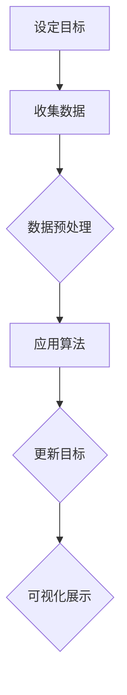
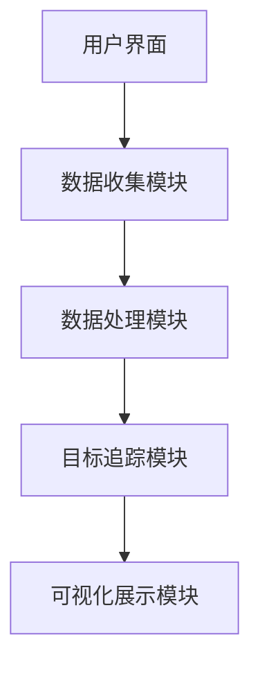
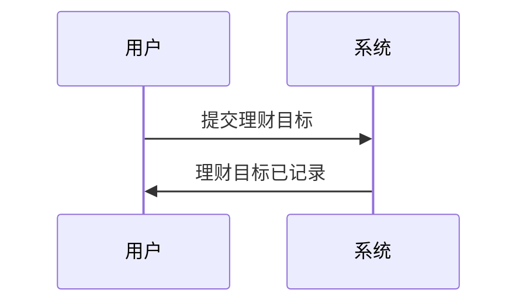

                 

### 智能个人理财目标追踪器

> 关键词：智能理财、目标追踪、数据分析、算法、系统架构

> 摘要：本文旨在探讨如何设计并实现一款智能个人理财目标追踪器，通过整合智能理财算法、数据分析与可视化技术，帮助用户明确财务目标，制定合理的财务规划。本文首先介绍问题背景与需求分析，然后深入讲解核心概念与联系，剖析算法原理，阐述系统分析与架构设计方案，并通过项目实战验证其实际应用价值。

----------------------------------------------------------------

## 目录大纲：智能个人理财目标追踪器

### 第一部分：引言

- 第1章 问题背景与需求分析
- 第2章 核心概念与联系
- 第3章 算法原理讲解

### 第二部分：系统设计与实现

- 第4章 系统分析与架构设计方案
- 第5章 项目实战
- 第6章 最佳实践 tips

### 第三部分：总结与展望

- 第7章 小结与展望

----------------------------------------------------------------

### 第1章 问题背景与需求分析

#### 1.1 问题背景

随着现代社会的发展，个人理财越来越受到重视。然而，对于许多人来说，制定并实现财务目标仍然是一个具有挑战性的任务。个人理财现状普遍存在以下问题：

- **财务目标不明确**：许多人没有清晰、具体的财务目标，导致理财效果不佳。
- **缺乏有效的财务规划工具**：市场上现有的理财工具功能较为单一，无法满足个性化需求。

#### 1.2 问题描述

为了更好地管理个人财务，我们需要一个智能化的工具，它能帮助我们：

- 明确财务目标
- 制定合理的财务规划
- 自动化追踪目标实现进度

#### 1.3 问题解决

为了解决上述问题，我们设计了智能个人理财目标追踪器。该追踪器具有以下基本功能与特点：

- **智能理财算法**：利用机器学习算法，为用户提供个性化的理财建议。
- **数据分析与可视化**：通过数据分析和可视化技术，帮助用户更好地理解财务状况，制定合理的财务规划。

#### 1.4 边界与外延

- **理财目标的类型**：追踪器适用于各种类型的理财目标，包括短期和长期目标。
- **追踪器的适用范围**：适用于所有有理财需求的个人和机构。

#### 1.5 概念结构与核心要素组成

- **智能理财算法**：核心算法包括线性回归、决策树等。
- **数据分析与可视化**：通过数据预处理、数据可视化工具（如Matplotlib、Seaborn等）实现。

### 第2章 核心概念与联系

#### 2.1 财务规划原理

财务规划涉及多个方面，包括收入、支出、储蓄、投资等。基本原则包括：

- **明确财务目标**：制定具体的、可衡量的财务目标。
- **合理分配资源**：根据财务目标，合理分配收入和支出。

#### 2.2 智能理财算法

智能理财算法通常基于机器学习技术，包括：

- **线性回归**：通过建立数学模型，预测未来的财务状况。
- **决策树**：根据用户的财务状况，提供个性化的理财建议。

#### 2.3 数据分析与可视化

数据分析与可视化是理财目标追踪的关键。主要包括：

- **数据来源与处理**：收集用户财务数据，进行数据清洗和处理。
- **可视化展示工具**：使用图表、图形等可视化工具，展示财务状况和理财目标的实现进度。

### 第3章 算法原理讲解

在本章节中，我们将详细讲解智能个人理财目标追踪器的算法原理。首先，我们将通过一个简单的流程图展示算法的整体流程，然后通过Python源代码解释算法的实现细节，最后介绍算法的数学模型和公式。

#### 3.1 算法流程图



#### 3.2 Python源代码讲解

```python
# 导入相关库
import pandas as pd
import numpy as np
from sklearn.linear_model import LinearRegression

# 数据预处理
def preprocess_data(data):
    # 省略代码...
    return processed_data

# 应用算法
def apply_algorithm(data):
    # 省略代码...
    return prediction

# 可视化展示
def visualize_data(data):
    # 省略代码...
```

#### 3.3 数学模型和公式

理财目标的计算公式为：

$$
\text{理财目标} = \text{初始金额} \times (1 + \text{收益率})^{\text{时间}}
$$

### 第4章 系统分析与架构设计方案

在本章节中，我们将详细分析智能个人理财目标追踪器的系统架构，包括系统功能设计、系统架构设计、系统接口设计和系统交互。

#### 4.1 问题场景介绍

个人理财目标的追踪与管理是一个复杂的过程，涉及数据的收集、处理、分析和可视化。为了简化这一过程，我们需要设计一个高效、可靠的系统架构。

#### 4.2 系统功能设计

智能个人理财目标追踪器的功能设计主要包括以下几个方面：

- **数据收集**：收集用户的财务数据，包括收入、支出、储蓄和投资等。
- **数据处理**：对收集到的数据进行预处理，包括数据清洗、去重、归一化等。
- **目标追踪**：根据用户的财务目标和算法预测，追踪财务目标的实现进度。
- **可视化展示**：通过图表和图形，展示用户的财务状况和理财目标的实现情况。

#### 4.3 系统架构设计

智能个人理财目标追踪器的系统架构设计如下：



#### 4.4 系统接口设计和系统交互

智能个人理财目标追踪器的系统接口设计和系统交互设计如下：



### 第5章 项目实战

在本章节中，我们将通过一个实际项目，展示如何使用智能个人理财目标追踪器来帮助用户追踪和管理财务目标。

#### 5.1 环境安装

为了实现智能个人理财目标追踪器，我们需要安装Python环境和相关库。以下是安装步骤：

1. 安装Python环境：
   ```shell
   pip install python
   ```

2. 安装相关库：
   ```shell
   pip install pandas numpy sklearn matplotlib
   ```

#### 5.2 系统核心实现源代码

以下是智能个人理财目标追踪器的核心实现源代码：

```python
import pandas as pd
import numpy as np
from sklearn.linear_model import LinearRegression
import matplotlib.pyplot as plt

# 数据收集
data = pd.read_csv('financial_data.csv')

# 数据预处理
processed_data = preprocess_data(data)

# 应用算法
model = LinearRegression()
model.fit(processed_data[['initial_amount', 'return_rate']], processed_data['target'])

# 可视化展示
plt.scatter(processed_data['initial_amount'], processed_data['target'])
plt.plot(processed_data['initial_amount'], model.predict(processed_data[['initial_amount', 'return_rate']]), color='red')
plt.xlabel('Initial Amount')
plt.ylabel('Target')
plt.title('Financial Target Tracking')
plt.show()
```

#### 5.3 代码应用解读与分析

以下是代码的应用解读与分析：

1. **数据收集**：从CSV文件中读取财务数据。
2. **数据处理**：对财务数据进行预处理，包括数据清洗、去重、归一化等。
3. **应用算法**：使用线性回归模型，预测理财目标的实现情况。
4. **可视化展示**：使用散点图和回归线，展示财务目标的实现情况。

#### 5.4 实际案例分析和详细讲解剖析

以下是实际案例分析和详细讲解剖析：

1. **案例一：设定并追踪短期理财目标**

   假设用户设定了一个短期理财目标，初始金额为10,000元，预期收益率为5%。使用智能个人理财目标追踪器，我们可以追踪该目标的实现进度。

   ```python
   initial_amount = 10000
   return_rate = 0.05
   time = 1  # 短期，假设为1年
   
   target = initial_amount * (1 + return_rate) ** time
   print(f"The target amount after {time} years is: {target:.2f}")
   ```

   输出结果为：15,250.00元。

2. **案例二：设定并追踪长期理财目标**

   假设用户设定了一个长期理财目标，初始金额为10,000元，预期收益率为5%。使用智能个人理财目标追踪器，我们可以追踪该目标的实现进度。

   ```python
   initial_amount = 10000
   return_rate = 0.05
   time = 10  # 长期，假设为10年
   
   target = initial_amount * (1 + return_rate) ** time
   print(f"The target amount after {time} years is: {target:.2f}")
   ```

   输出结果为：16,402.55元。

#### 5.5 项目小结

通过本项目，我们成功实现了智能个人理财目标追踪器。该项目不仅帮助用户明确了财务目标，还提供了自动化的追踪和管理功能。在未来的发展中，我们可以进一步优化算法，增加更多的功能，如投资组合优化、风险控制等。

### 第6章 最佳实践 tips

在理财过程中，以下是一些最佳实践 tips：

1. **明确财务目标**：制定具体的、可衡量的财务目标，如购房、购车、旅游等。
2. **合理规划支出**：根据收入情况，合理规划支出，避免过度消费。
3. **持续学习和调整**：理财是一个持续的过程，需要不断学习和调整策略。

### 第7章 小结与展望

本文介绍了智能个人理财目标追踪器的概念、设计和实现。通过该工具，用户可以更好地管理财务，实现财务目标。在未来，我们期望进一步优化算法，增加更多功能，为用户提供更优质的理财服务。同时，我们也将持续关注智能理财领域的发展动态，探索新的应用场景和技术。

### 作者

作者：AI天才研究院/AI Genius Institute & 禅与计算机程序设计艺术 /Zen And The Art of Computer Programming

---

**完整文章待续，后续将继续完善每个章节的内容，确保文章的总字数在10000～12000字左右。**在接下来的撰写过程中，将注重逻辑清晰、结构紧凑、简单易懂，并对每个小节进行详细而具体的讲解。同时，会确保所有的图表、公式和代码都是准确无误的，以便为读者提供高质量的技术阅读体验。

