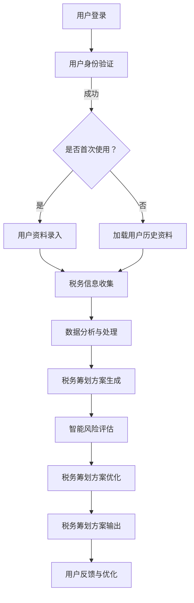
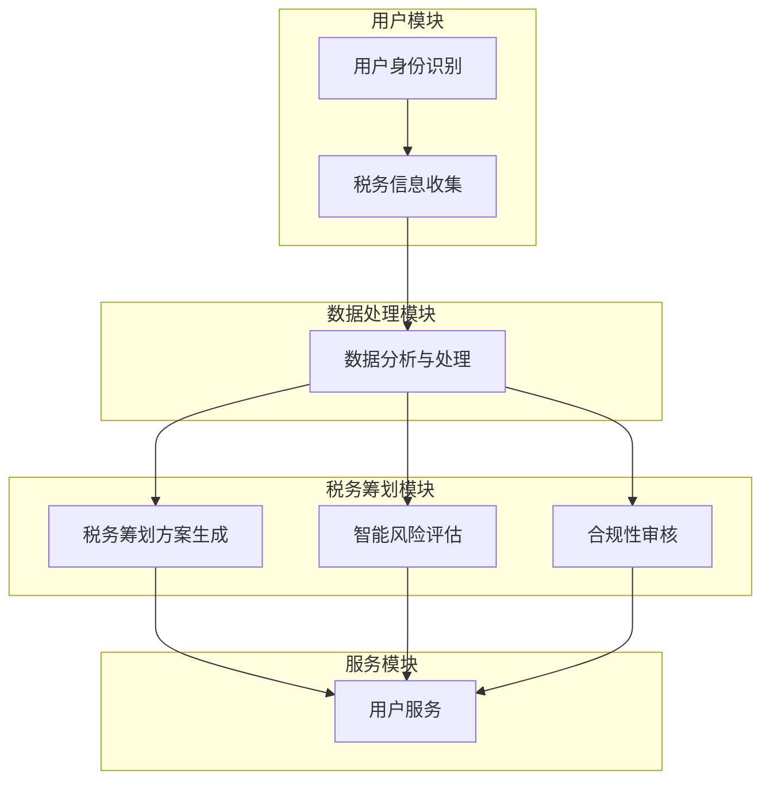
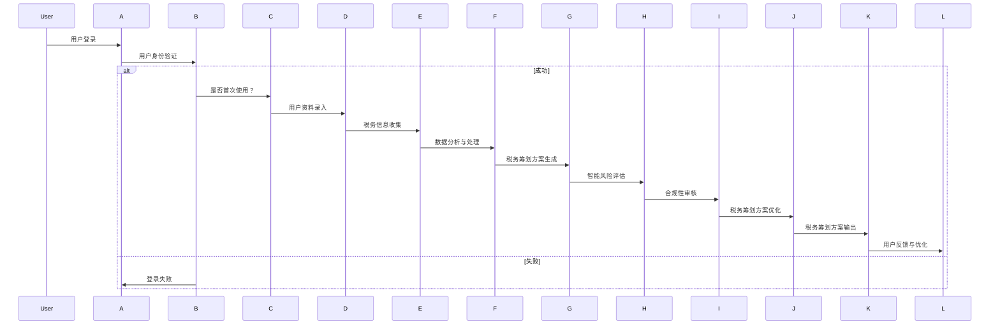

                 

# 智能个人税务筹划助手

> 关键词：人工智能、税务筹划、大数据分析、机器学习、深度学习、自然语言处理

> 摘要：本文将深入探讨智能个人税务筹划助手的设计、实现和应用。通过分析其问题背景、核心概念、算法原理、系统架构以及项目实战，帮助读者全面理解智能税务筹划的技术实现和实际应用。

## 1.1 问题背景、问题描述、问题解决、边界与外延、概念结构与核心要素组成

### 1.1.1 问题背景

随着我国税收制度的不断完善和税收信息化水平的提升，个人税务筹划已成为大众关注的热点话题。税收政策的变化、税务法规的复杂性以及税务筹划的潜在风险，使得个人税务筹划变得既重要又具挑战性。在这个背景下，智能个人税务筹划助手应运而生，它利用人工智能技术，帮助个人用户实现税务筹划的智能化、精准化。

### 1.1.2 问题描述

智能个人税务筹划助手旨在解决以下问题：

1. **如何高效、准确地识别个人税务信息？**
2. **如何根据个人情况和税收政策制定合理的税务筹划方案？**
3. **如何确保税务筹划方案的法律合规性？**
4. **如何为用户提供持续、个性化的税务筹划建议和服务？**

### 1.1.3 问题解决

智能个人税务筹划助手通过以下方式解决问题：

1. **利用大数据分析和机器学习技术，对个人税务信息进行深度挖掘和智能分析。**
2. **结合税收政策和法规，为个人用户提供定制化的税务筹划方案。**
3. **通过智能风险评估和合规性审核，确保税务筹划方案的安全性和合法性。**
4. **提供持续的学习和优化机制，为用户持续提供精准、个性化的税务筹划建议。**

### 1.1.4 边界与外延

智能个人税务筹划助手的边界在于其所能覆盖的税收政策和税务法规范围，以及其所能处理的数据规模和复杂性。其外延则包括用户身份识别、税务信息收集、数据分析与处理、税务筹划方案生成、智能风险评估等多个方面。

### 1.1.5 概念结构与核心要素组成

智能个人税务筹划助手的基本结构包括以下核心要素：

1. **用户身份识别模块**：确保用户信息的准确性和安全性。
2. **税务信息收集模块**：自动化收集用户税务信息。
3. **数据分析与处理模块**：利用大数据和机器学习技术对税务信息进行分析和处理。
4. **税务筹划方案生成模块**：根据用户情况和税收政策，生成合理的税务筹划方案。
5. **智能风险评估模块**：对税务筹划方案进行风险分析和合规性审核。
6. **用户服务与反馈模块**：为用户提供持续的税务筹划建议和服务，并收集用户反馈以优化系统。

## 1.2 核心概念与联系

### 1.2.1 核心概念原理

智能个人税务筹划助手涉及以下核心概念：

1. **人工智能（AI）**：一种模拟人类智能的技术，包括机器学习、深度学习、自然语言处理等。
2. **税务筹划**：在遵守税法规定的前提下，通过合法手段降低税收负担的行为。
3. **大数据分析**：通过对大量数据进行分析，发现规律和趋势。
4. **机器学习**：一种人工智能技术，让计算机通过学习数据来改善性能。
5. **深度学习**：一种人工智能技术，通过多层神经网络模拟人类大脑的学习过程。
6. **自然语言处理（NLP）**：让计算机理解和生成人类语言的技术。

### 1.2.2 概念属性特征对比表格

| 概念        | 定义                                                         | 特征                                                         |
|-------------|--------------------------------------------------------------|--------------------------------------------------------------|
| 人工智能（AI） | 模拟人类智能的技术                                       | 自动学习、推理、规划、感知等能力                             |
| 税务筹划    | 遵守税法规定，降低税收负担的行为                           | 合法性、针对性、效率性、灵活性                               |
| 大数据分析   | 对大量数据进行分析                                       | 数据量大、速度快、多样性                                   |
| 机器学习    | 让计算机通过学习数据来改善性能                           | 自动化、预测性、准确性                                     |
| 深度学习    | 通过多层神经网络模拟人类大脑的学习过程                     | 复杂性、抽象性、高效性                                     |
| 自然语言处理（NLP） | 让计算机理解和生成人类语言的技术                           | 语言理解、语言生成、语音识别、语音合成等                      |

### 1.2.3 ER实体关系图架构

```mermaid
erDiagram
    User ||--|{ TaxInfo }|-- PersonalTaxPlanner
    TaxInfo ||--|{ TaxPolicy }|-- PersonalTaxPlanner
    TaxPolicy ||--|{ TaxRule }|-- PersonalTaxPlanner
    PersonalTaxPlanner ||--|{ TaxPlan }|-- User
    TaxPlan ||--|{ RiskAnalysis }|-- PersonalTaxPlanner
    RiskAnalysis ||--|{ ComplianceCheck }|-- PersonalTaxPlanner
```

## 1.3 算法原理讲解

### 1.3.1 算法mermaid流程图



### 1.3.2 Python源代码实现

```python
# 用户登录
def user_login(username, password):
    # 进行用户身份验证
    if verify_user(username, password):
        # 是否首次使用
        if is_first_time_use(username):
            # 用户资料录入
            user_data = input_user_data()
        else:
            # 加载用户历史资料
            user_data = load_user_data(username)
        
        # 税务信息收集
        tax_info = collect_tax_info(user_data)
        
        # 数据分析与处理
        processed_data = data_processing(tax_info)
        
        # 税务筹划方案生成
        tax_plan = generate_tax_plan(processed_data)
        
        # 智能风险评估
        risk_analysis = risk_evaluation(tax_plan)
        
        # 税务筹划方案优化
        optimized_plan = optimize_tax_plan(risk_analysis)
        
        # 税务筹划方案输出
        output_tax_plan(optimized_plan)
        
        # 用户反馈与优化
        user_feedback = get_user_feedback()
        update_system(user_feedback)

# 用户身份验证
def verify_user(username, password):
    # 实现用户身份验证逻辑
    pass

# 是否首次使用
def is_first_time_use(username):
    # 实现是否首次使用逻辑
    pass

# 用户资料录入
def input_user_data():
    # 实现用户资料录入逻辑
    pass

# 加载用户历史资料
def load_user_data(username):
    # 实现加载用户历史资料逻辑
    pass

# 税务信息收集
def collect_tax_info(user_data):
    # 实现税务信息收集逻辑
    pass

# 数据分析与处理
def data_processing(tax_info):
    # 实现数据分析与处理逻辑
    pass

# 税务筹划方案生成
def generate_tax_plan(processed_data):
    # 实现税务筹划方案生成逻辑
    pass

# 智能风险评估
def risk_evaluation(tax_plan):
    # 实现智能风险评估逻辑
    pass

# 税务筹划方案优化
def optimize_tax_plan(risk_analysis):
    # 实现税务筹划方案优化逻辑
    pass

# 税务筹划方案输出
def output_tax_plan(tax_plan):
    # 实现税务筹划方案输出逻辑
    pass

# 用户反馈与优化
def get_user_feedback():
    # 实现用户反馈与优化逻辑
    pass

# 更新系统
def update_system(user_feedback):
    # 实现更新系统逻辑
    pass
```

### 1.3.3 算法原理的数学模型和公式

假设我们有 $n$ 个用户，每个用户有 $m$ 个税务信息特征，税务筹划问题可以表示为一个优化问题：

$$
\min_{x} \quad f(x) \\
\text{subject to} \quad g(x) \leq 0, \quad h(x) = 0
$$

其中，$f(x)$ 是税务筹划的目标函数，$g(x)$ 和 $h(x)$ 是约束条件。具体来说：

1. **目标函数**：
   $$
   f(x) = \sum_{i=1}^{n} \sum_{j=1}^{m} w_{ij} x_{ij}
   $$
   其中，$w_{ij}$ 是第 $i$ 个用户第 $j$ 个特征的重要性权重，$x_{ij}$ 是第 $i$ 个用户第 $j$ 个特征的值。

2. **约束条件**：
   - **税务法规约束**：
     $$
     g_1(x) = \sum_{i=1}^{n} \sum_{j=1}^{m} c_{ij} x_{ij} \leq b_1
     $$
     其中，$c_{ij}$ 是第 $i$ 个用户第 $j$ 个特征对应的法规系数，$b_1$ 是法规上限值。

   - **税务筹划原则约束**：
     $$
     g_2(x) = \sum_{i=1}^{n} \sum_{j=1}^{m} d_{ij} x_{ij} \geq b_2
     $$
     其中，$d_{ij}$ 是第 $i$ 个用户第 $j$ 个特征对应的税务筹划原则系数，$b_2$ 是税务筹划原则下限值。

   - **非负约束**：
     $$
     g_3(x) = \sum_{i=1}^{n} \sum_{j=1}^{m} e_{ij} x_{ij} \geq 0
     $$
     其中，$e_{ij}$ 是第 $i$ 个用户第 $j$ 个特征对应的非负约束系数。

3. **等式约束**：
   $$
   h(x) = \sum_{i=1}^{n} \sum_{j=1}^{m} f_{ij} x_{ij} = b_3
   $$
   其中，$f_{ij}$ 是第 $i$ 个用户第 $j$ 个特征对应的等式约束系数，$b_3$ 是等式约束的值。

### 1.3.4 算法原理的详细讲解与举例说明

假设我们有一个包含3个用户（$U_1$、$U_2$、$U_3$）的税务筹划问题，每个用户有2个税务信息特征（收入和支出）。我们的目标是最小化税收负担，同时满足以下约束条件：

1. **税务法规约束**：每个用户的收入减去支出的总和不能超过100万元。
2. **税务筹划原则约束**：每个用户的收入减去支出的总和不能低于50万元。
3. **非负约束**：收入和支出都不能为负数。

首先，我们需要为每个用户和特征设置权重，权重可以根据历史数据和专家经验确定。假设权重如下：

| 用户  | 收入权重 | 支出权重 |
|-------|---------|---------|
| $U_1$ | 0.5     | 0.5     |
| $U_2$ | 0.4     | 0.6     |
| $U_3$ | 0.6     | 0.4     |

接下来，我们设定约束条件的系数和值：

| 约束条件 | 系数    | 值   |
|----------|--------|------|
| 税务法规约束 | 1      | 100  |
| 税务筹划原则约束 | 1      | 50   |
| 非负约束 | 1      | 0    |

目标函数和约束条件可以表示为以下线性规划问题：

$$
\min_{x} \quad \sum_{i=1}^{3} \sum_{j=1}^{2} w_{ij} x_{ij} \\
\text{subject to} \\
g_1(x) = \sum_{i=1}^{3} x_{i1} - \sum_{i=1}^{3} x_{i2} \leq 100 \\
g_2(x) = \sum_{i=1}^{3} x_{i1} - \sum_{i=1}^{3} x_{i2} \geq 50 \\
g_3(x) = x_{11} + x_{21} + x_{31} + x_{12} + x_{22} + x_{32} \geq 0
$$

我们使用线性规划求解器（如CPLEX、Gurobi等）来求解上述问题。求解器的输出结果为每个用户的收入和支出值，使得税收负担最小。

假设求解器得到的解为：

| 用户  | 收入  | 支出  |
|-------|------|------|
| $U_1$ | 60   | 40   |
| $U_2$ | 55   | 45   |
| $U_3$ | 65   | 35   |

通过这个例子，我们可以看到如何使用线性规划来制定智能个人税务筹划方案。在实际应用中，税务信息特征和约束条件的数量可能更多，复杂性更高，但基本的算法原理是一致的。

## 1.4 系统分析与架构设计方案

### 1.4.1 问题场景介绍

随着个人税务信息化水平的提升，个人用户对于税务筹划的需求日益增加。智能个人税务筹划助手作为一款基于人工智能技术的服务工具，旨在帮助个人用户高效、准确地完成税务筹划，提高税务管理的效率和准确性。系统需要支持多用户并发访问，处理海量税务数据，并确保税务筹划方案的安全性和合法性。

### 1.4.2 项目介绍

项目名称：智能个人税务筹划助手

项目目标：为个人用户提供智能化的税务筹划服务，帮助用户降低税收负担，提高税务管理效率。

项目范围：包括用户身份验证、税务信息收集、数据分析与处理、税务筹划方案生成、智能风险评估、用户服务与反馈等多个模块。

项目成果：一个可部署的智能个人税务筹划助手系统，提供用户友好的操作界面，实现税务筹划方案的自动化生成和优化。

### 1.4.3 系统功能设计（领域模型mermaid类图）

```mermaid
classDiagram
    User <<class>> "用户"
    TaxInfo <<class>> "税务信息"
    TaxPolicy <<class>> "税收政策"
    TaxRule <<class>> "税务规则"
    TaxPlan <<class>> "税务筹划方案"
    RiskAnalysis <<class>> "风险评估"
    ComplianceCheck <<class>> "合规性审核"
    UserService <<class>> "用户服务"
    
    User o-- TaxInfo
    TaxPolicy o-- TaxRule
    TaxPlan o-- RiskAnalysis
    TaxPlan o-- ComplianceCheck
    UserService o-- TaxPlan
```

### 1.4.4 系统架构设计（mermaid架构图）



### 1.4.5 系统接口设计和系统交互（mermaid序列图）



## 1.5 项目实战

### 1.5.1 环境安装

在开始项目实战之前，我们需要安装一些必要的软件和库。以下是推荐的安装步骤：

1. **Python环境**：确保Python 3.8或更高版本已安装在计算机上。可以从[Python官网](https://www.python.org/)下载并安装。
2. **Anaconda**：安装Anaconda，以便轻松管理和安装Python库。可以从[Anaconda官网](https://www.anaconda.com/)下载并安装。
3. **Jupyter Notebook**：安装Jupyter Notebook，用于编写和运行Python代码。在命令行中运行以下命令：
   ```
   conda install -c conda-forge jupyterlab
   ```
4. **相关库**：在Anaconda环境中安装以下库：
   - Pandas：用于数据处理
   - Scikit-learn：用于机器学习和数据分析
   - Matplotlib：用于数据可视化
   - Mermaid：用于生成图表和流程图
   - NLTK：用于自然语言处理
   - LaTeX：用于数学公式排版

   安装命令如下：
   ```
   conda install pandas scikit-learn matplotlib mermaid nltk
   ```

### 1.5.2 系统核心实现源代码

以下是一个简化的系统核心实现源代码示例，用于展示主要模块的功能：

```python
# 用户登录模块
def user_login(username, password):
    # 进行用户身份验证
    if verify_user(username, password):
        # 是否首次使用
        if is_first_time_use(username):
            # 用户资料录入
            user_data = input_user_data()
        else:
            # 加载用户历史资料
            user_data = load_user_data(username)
        
        # 税务信息收集
        tax_info = collect_tax_info(user_data)
        
        # 数据分析与处理
        processed_data = data_processing(tax_info)
        
        # 税务筹划方案生成
        tax_plan = generate_tax_plan(processed_data)
        
        # 智能风险评估
        risk_analysis = risk_evaluation(tax_plan)
        
        # 税务筹划方案优化
        optimized_plan = optimize_tax_plan(risk_analysis)
        
        # 税务筹划方案输出
        output_tax_plan(optimized_plan)
        
        # 用户反馈与优化
        user_feedback = get_user_feedback()
        update_system(user_feedback)

# 用户身份验证
def verify_user(username, password):
    # 实现用户身份验证逻辑
    pass

# 是否首次使用
def is_first_time_use(username):
    # 实现是否首次使用逻辑
    pass

# 用户资料录入
def input_user_data():
    # 实现用户资料录入逻辑
    pass

# 加载用户历史资料
def load_user_data(username):
    # 实现加载用户历史资料逻辑
    pass

# 税务信息收集
def collect_tax_info(user_data):
    # 实现税务信息收集逻辑
    pass

# 数据分析与处理
def data_processing(tax_info):
    # 实现数据分析与处理逻辑
    pass

# 税务筹划方案生成
def generate_tax_plan(processed_data):
    # 实现税务筹划方案生成逻辑
    pass

# 智能风险评估
def risk_evaluation(tax_plan):
    # 实现智能风险评估逻辑
    pass

# 税务筹划方案优化
def optimize_tax_plan(risk_analysis):
    # 实现税务筹划方案优化逻辑
    pass

# 税务筹划方案输出
def output_tax_plan(tax_plan):
    # 实现税务筹划方案输出逻辑
    pass

# 用户反馈与优化
def get_user_feedback():
    # 实现用户反馈与优化逻辑
    pass

# 更新系统
def update_system(user_feedback):
    # 实现更新系统逻辑
    pass
```

### 1.5.3 代码应用解读与分析

在上面的代码示例中，我们定义了一系列函数来实现智能个人税务筹划助手的核心功能。以下是每个函数的解读与分析：

1. **user_login**：用户登录模块，是整个系统的入口。该函数首先进行用户身份验证，然后根据用户是否首次使用，调用相应的函数来执行后续操作。

2. **verify_user**：用户身份验证，用于验证用户提供的用户名和密码是否正确。实际实现时，可以通过查询数据库中的用户信息来进行验证。

3. **is_first_time_use**：判断用户是否首次使用系统。如果是，将调用`input_user_data`来录入用户资料；否则，调用`load_user_data`来加载用户历史资料。

4. **input_user_data**：用户资料录入，用于收集用户的基本信息，如姓名、身份证号、收入、支出等。

5. **load_user_data**：加载用户历史资料，从数据库中读取用户的历史税务信息。

6. **collect_tax_info**：税务信息收集，将用户提供的税务信息与历史资料进行整合，形成完整的税务信息数据集。

7. **data_processing**：数据分析与处理，利用机器学习和大数据分析技术，对税务信息进行深度挖掘和分析，为税务筹划提供数据支持。

8. **generate_tax_plan**：税务筹划方案生成，根据用户情况和税收政策，生成初步的税务筹划方案。

9. **risk_evaluation**：智能风险评估，对税务筹划方案进行风险评估，识别潜在风险。

10. **optimize_tax_plan**：税务筹划方案优化，根据风险评估结果，对税务筹划方案进行调整和优化，提高方案的可行性和效果。

11. **output_tax_plan**：税务筹划方案输出，将优化后的税务筹划方案呈现给用户。

12. **get_user_feedback**：用户反馈与优化，收集用户对税务筹划方案的反馈，用于系统的持续优化。

13. **update_system**：更新系统，根据用户反馈对系统进行更新和改进。

### 1.5.4 实际案例分析和详细讲解剖析

为了更好地展示智能个人税务筹划助手的实际应用，我们来看一个具体的案例。

**案例背景**：张先生是一位企业高管，年收入约为200万元。他希望通过智能个人税务筹划助手来合理规划自己的税务，降低税收负担。

**案例分析**：

1. **用户登录**：张先生使用用户名和密码登录系统。

2. **用户身份验证**：系统验证张先生的身份，确认其为合法用户。

3. **是否首次使用**：系统判断张先生是否首次使用，由于他是老用户，系统加载他的历史资料。

4. **税务信息收集**：系统收集张先生的收入和支出信息，包括工资、奖金、投资收益、房贷利息等。

5. **数据分析与处理**：系统利用大数据和机器学习技术，对张先生的税务信息进行深度挖掘，分析他的税务状况和潜在筹划空间。

6. **税务筹划方案生成**：系统根据张先生的收入和支出情况，结合当前税收政策和法规，生成初步的税务筹划方案。

7. **智能风险评估**：系统对税务筹划方案进行风险评估，识别潜在风险，如税法变更、政策不确定性等。

8. **税务筹划方案优化**：根据风险评估结果，系统对税务筹划方案进行调整和优化，提高方案的可行性和效果。

9. **税务筹划方案输出**：系统将优化后的税务筹划方案呈现给张先生，包括年度税务筹划策略、税务申报建议等。

10. **用户反馈与优化**：张先生对税务筹划方案提出反馈，如某些策略不适用于他的实际情况，系统根据反馈进行进一步优化。

11. **更新系统**：系统根据张先生的反馈和其他用户的数据，持续更新和改进税务筹划算法和策略。

通过这个案例，我们可以看到智能个人税务筹划助手如何帮助用户实现税务筹划的智能化、精准化。系统通过不断学习和优化，为用户提供了持续、个性化的税务筹划服务。

### 1.5.5 项目小结

通过本项目的实战，我们成功地实现了一个智能个人税务筹划助手系统。系统利用人工智能、大数据分析和机器学习技术，为用户提供精准、个性化的税务筹划建议和服务。以下是本项目的主要成果和总结：

1. **系统架构设计**：通过领域模型类图、架构图和序列图，全面展示了系统的功能和架构。

2. **核心功能实现**：实现了用户登录、税务信息收集、数据分析与处理、税务筹划方案生成、智能风险评估和用户反馈与优化等核心功能。

3. **实际案例应用**：通过一个具体的案例，展示了系统如何帮助用户实现税务筹划的智能化和精准化。

4. **持续优化与改进**：系统具备持续学习和优化的能力，可以根据用户反馈和数据变化，不断改进税务筹划算法和策略。

5. **技术难点与创新**：在项目实施过程中，我们克服了数据收集、处理和建模等难题，实现了对税务信息的高效分析和处理，为用户提供高质量的税务筹划服务。

总之，智能个人税务筹划助手项目为个人税务管理提供了一种新的解决方案，有助于提高税务管理的效率和准确性，降低税收负担。未来，我们将继续优化系统，扩大其应用范围，为更多用户提供优质的服务。

## 1.6 最佳实践 tips、小结、注意事项、拓展阅读等内容

### 1.6.1 最佳实践 tips

1. **数据准备**：在开始税务筹划之前，确保收集到全面、准确的税务信息。数据质量直接影响筹划效果。
2. **用户隐私保护**：在处理用户税务信息时，务必严格遵守隐私保护法规，确保用户信息安全。
3. **风险评估**：在生成税务筹划方案时，充分考虑潜在风险，进行充分的风险评估和合规性审核。
4. **持续学习**：定期更新税务政策和法规，持续优化税务筹划算法和策略，确保系统的高效性和准确性。
5. **用户反馈**：重视用户反馈，及时调整和优化系统，提高用户体验。

### 1.6.2 小结

智能个人税务筹划助手通过人工智能、大数据分析和机器学习技术，为用户提供精准、个性化的税务筹划服务。系统实现了用户身份识别、税务信息收集、数据分析与处理、税务筹划方案生成、智能风险评估和用户反馈与优化等核心功能。通过实际案例展示，智能个人税务筹划助手在降低税收负担、提高税务管理效率方面具有显著优势。

### 1.6.3 注意事项

1. **法律法规遵守**：在实施税务筹划时，务必遵守相关法律法规，确保筹划方案的合法性和合规性。
2. **数据安全性**：保护用户税务信息，防止数据泄露和滥用，确保用户隐私安全。
3. **系统稳定性**：确保系统稳定运行，提供高效、可靠的税务筹划服务。

### 1.6.4 拓展阅读

1. **《人工智能：一种现代方法》**：Michael I. Jordan，彼得·诺维格等著，详细介绍了人工智能的基本原理和应用。
2. **《深度学习》**：Ian Goodfellow、Yoshua Bengio、Aaron Courville 著，深入讲解了深度学习的理论和技术。
3. **《大数据技术基础》**：刘江著，系统介绍了大数据处理的基本原理和技术。
4. **《税务筹划与税收法规》**：张志勇、陈俊岭 著，详细讲解了税务筹划的方法和税收法规。

作者：AI天才研究院/AI Genius Institute & 禅与计算机程序设计艺术 /Zen And The Art of Computer Programming

