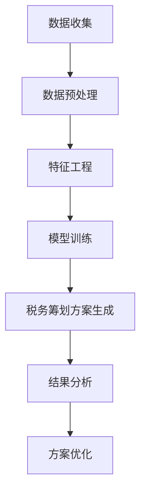
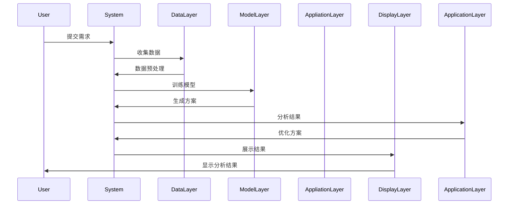
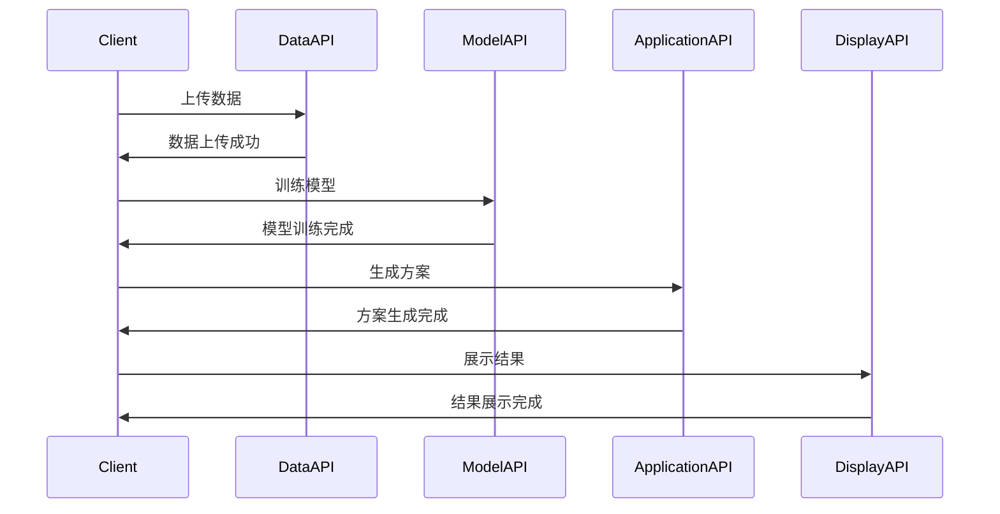
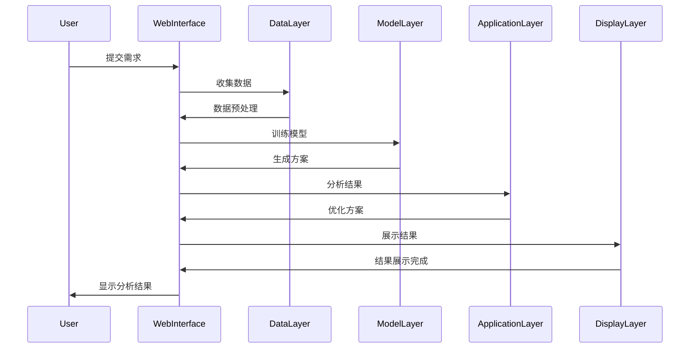

                 

## 《智能个人税务筹划建议生成器》

关键词：税务筹划、个人税务、智能工具、AI应用、税务优惠

摘要：本文深入探讨了个人税务筹划的重要性及其在现代社会中的应用。通过分析税务筹划的基础知识、智能税务筹划工具的功能与应用、实际案例分析以及税务筹划的发展趋势，本文旨在为广大读者提供一个全面、深入的智能税务筹划指南，帮助读者优化税务筹划方案，实现税务负担的最小化。

### 目录

----------------------------------------------------------------

# 《智能个人税务筹划建议生成器》

## 第一部分：税务筹划基础

### 第1章：税务筹划概述

#### 1.1 税务筹划的概念与意义

#### 1.2 税务筹划的原则与法规

#### 1.3 税务筹划的目标与策略

### 第2章：个人所得税基础

#### 2.1 个人所得税概述

#### 2.2 个人所得税税率与税基

#### 2.3 个人所得税优惠政策

### 第3章：企业所得税基础

#### 3.1 企业所得税概述

#### 3.2 企业所得税税率与税基

#### 3.3 企业所得税优惠政策

## 第二部分：智能税务筹划工具与应用

### 第4章：智能税务筹划工具简介

#### 4.1 智能税务筹划工具的发展

#### 4.2 智能税务筹划工具的功能与特点

#### 4.3 智能税务筹划工具的适用范围

### 第5章：智能税务筹划工具的使用方法

#### 5.1 数据准备

#### 5.2 参数设置

#### 5.3 结果分析与调整

### 第6章：实际案例分析

#### 6.1 案例一：优化个人税务筹划方案

#### 6.2 案例二：为企业提供税务筹划建议

#### 6.3 案例三：综合应用智能税务筹划工具

## 第三部分：智能税务筹划的趋势与未来

### 第7章：智能税务筹划的发展趋势

#### 7.1 人工智能在税务筹划中的应用

#### 7.2 税务筹划法规的变化与影响

#### 7.3 智能税务筹划的未来发展前景

### 第8章：税务筹划最佳实践

#### 8.1 税务筹划实践中的注意事项

#### 8.2 税务筹划实践中的成功案例

#### 8.3 税务筹划实践中的挑战与应对

----------------------------------------------------------------

### 第一部分：税务筹划基础

#### 第1章：税务筹划概述

##### 1.1 税务筹划的概念与意义

税务筹划（Tax Planning）是指通过合法的途径，利用税收法规和政策，对个人或企业的财务活动进行合理规划，以达到减轻税收负担、实现财务目标的目的。在现代经济社会中，税务筹划具有极其重要的意义。

首先，税务筹划有助于个人或企业实现财务目标。通过合理的税务筹划，个人或企业可以在遵守税法规定的前提下，最大限度地减轻税收负担，提高资金利用效率，实现财务自由。

其次，税务筹划有助于规避税收风险。在税收法规日益复杂的情况下，合理规划税务活动可以避免因违法而导致的法律风险和财务损失。

最后，税务筹划有助于提升企业竞争力。通过优化税务结构，企业可以提高资金利用效率，降低运营成本，增强市场竞争力。

##### 1.2 税务筹划的原则与法规

税务筹划应遵循以下原则：

1. 合法性：税务筹划必须在法律框架内进行，不得违反税法规定。
2. 最优化：税务筹划应寻求最佳的税收负担方案，实现税收利益最大化。
3. 可行性：税务筹划方案应具有实际可操作性，确保实施效果。

税务筹划涉及的主要法规包括《中华人民共和国税收征收管理法》、《中华人民共和国个人所得税法》、《中华人民共和国企业所得税法》等。

##### 1.3 税务筹划的目标与策略

税务筹划的目标主要包括：

1. 减轻税收负担：通过合法的途径，降低个人或企业的税收负担。
2. 提高资金利用效率：通过合理的税务筹划，优化财务结构，提高资金利用效率。
3. 规避税收风险：通过合理的税务规划，避免因违反税法而导致的法律风险和财务损失。
4. 提升企业竞争力：通过优化税务结构，降低运营成本，提升企业竞争力。

实现税务筹划目标的策略包括：

1. 税收优惠利用：充分利用税收优惠政策，减轻税收负担。
2. 资产配置优化：通过合理的资产配置，降低税收负担。
3. 收入规划：通过合理的收入规划，降低个人所得税负担。
4. 企业重组与并购：通过企业重组与并购，实现税收优化。

#### 第2章：个人所得税基础

##### 2.1 个人所得税概述

个人所得税是国家对个人所得征收的一种税收。个人所得税的纳税主体是个人，征税对象是个人取得的各项所得，包括工资、薪金所得、劳务报酬所得、稿酬所得、财产租赁所得、财产转让所得等。

##### 2.2 个人所得税税率与税基

个人所得税实行超额累进税率，税率根据所得额的不同而有所区别。具体税率如下表所示：

| 所得额区间 | 税率（%） |
| :----: | :----: |
| 不超过 3000 元 | 3 |
| 超过 3000 元至 12000 元 | 10 |
| 超过 12000 元至 25000 元 | 20 |
| 超过 25000 元至 35000 元 | 25 |
| 超过 35000 元至 55000 元 | 30 |
| 超过 55000 元至 80000 元 | 35 |
| 超过 80000 元 | 45 |

个人所得税的税基是个人取得的各项所得减去法定扣除项目后的余额。法定扣除项目包括：

1. 基本减除费用：每月 5000 元。
2. 财产租赁费用：每次不超过 400 元的租金可以扣除。
3. 财产转让费用：财产转让过程中发生的合理费用可以扣除。
4. 残疾人、孤老等特定群体的费用扣除。

##### 2.3 个人所得税优惠政策

个人所得税优惠政策主要包括以下几个方面：

1. 税收优惠税率：对部分所得项目实行优惠税率，如稿酬所得、劳务报酬所得等。
2. 税收减免：对特定群体或所得项目实行税收减免，如残疾人、孤老等。
3. 税收抵扣：通过税收抵扣减少实际应纳税额，如捐赠抵扣、专项附加扣除等。

#### 第3章：企业所得税基础

##### 3.1 企业所得税概述

企业所得税是国家对企业的生产经营所得和其他所得征收的一种税收。企业所得税的纳税主体是企业，征税对象是企业取得的各项所得，包括销售货物收入、提供劳务收入、转让财产收入等。

##### 3.2 企业所得税税率与税基

企业所得税实行比例税率，税率为 25%。企业所得税的税基是企业取得的各项收入减去成本、费用、损失等后的余额。

##### 3.3 企业所得税优惠政策

企业所得税优惠政策主要包括以下几个方面：

1. 税收优惠税率：对特定行业或企业实行优惠税率，如高新技术企业、小微企业等。
2. 税收减免：对特定行业或企业实行税收减免，如环保产业、脱贫攻坚产业等。
3. 税收抵扣：通过税收抵扣减少实际应纳税额，如研发费用抵扣、捐赠抵扣等。

### 第二部分：智能税务筹划工具与应用

#### 第4章：智能税务筹划工具简介

##### 4.1 智能税务筹划工具的发展

随着人工智能技术的快速发展，智能税务筹划工具逐渐成为税务筹划领域的重要工具。智能税务筹划工具的发展可以分为以下几个阶段：

1. 初期阶段：主要依赖于人工经验和专业知识，通过手工计算和表格统计进行税务筹划。
2. 第二阶段：利用计算机技术和数据库，实现税务筹划方案的自动化和智能化。
3. 第三阶段：引入人工智能技术，如机器学习、自然语言处理等，实现税务筹划的智能化和个性化。

##### 4.2 智能税务筹划工具的功能与特点

智能税务筹划工具具有以下功能和特点：

1. 自动化：智能税务筹划工具可以自动收集、整理和分析税务数据，生成税务筹划方案，提高工作效率。
2. 智能化：智能税务筹划工具利用人工智能技术，根据用户需求和历史数据，自动生成个性化的税务筹划方案。
3. 个性化：智能税务筹划工具可以根据不同用户的需求，提供个性化的税务筹划方案，满足用户的个性化需求。
4. 高效性：智能税务筹划工具可以快速生成税务筹划方案，节省时间和人力成本。

##### 4.3 智能税务筹划工具的适用范围

智能税务筹划工具适用于以下场景：

1. 个人税务筹划：针对个人收入和财产，提供个性化的税务筹划方案。
2. 企业税务筹划：针对企业生产经营所得，提供税务优化方案，降低企业税负。
3. 税务合规性检查：通过智能分析，帮助企业检查税务合规性，避免税务风险。

#### 第5章：智能税务筹划工具的使用方法

##### 5.1 数据准备

使用智能税务筹划工具前，需要准备好以下数据：

1. 个人或企业基本信息：包括姓名、身份证号码、企业名称、统一社会信用代码等。
2. 收入和支出数据：包括工资、薪金所得、劳务报酬所得、稿酬所得、财产租赁所得、财产转让所得等。
3. 税收优惠政策：包括税收优惠税率、税收减免、税收抵扣等政策。

##### 5.2 参数设置

在使用智能税务筹划工具时，需要根据用户需求设置以下参数：

1. 税务筹划目标：包括减轻税收负担、提高资金利用效率、规避税收风险等。
2. 税务优惠政策：包括适用的税收优惠税率、税收减免、税收抵扣等政策。
3. 财务数据：包括收入和支出数据、成本和费用数据等。

##### 5.3 结果分析与调整

使用智能税务筹划工具生成的结果需要进行分析和调整，以确保税务筹划方案的有效性。具体包括：

1. 结果分析：分析税务筹划方案的效果，包括税收负担、资金利用效率等指标。
2. 结果调整：根据分析结果，对税务筹划方案进行调整，优化税务结构，实现最佳效果。
3. 结果验证：通过历史数据和实际操作，验证税务筹划方案的有效性。

#### 第6章：实际案例分析

##### 6.1 案例一：优化个人税务筹划方案

案例背景：

张先生是一名企业高管，年收入较高，希望通过税务筹划减轻税收负担。

案例分析：

1. 数据准备：收集张先生的个人基本信息、收入和支出数据、税收优惠政策等。
2. 参数设置：根据张先生的需求，设置税务筹划目标为减轻税收负担，选择适用的税收优惠政策和财务数据。
3. 结果分析与调整：使用智能税务筹划工具生成初步方案，分析方案效果，根据实际情况进行调整，最终生成最优税务筹划方案。

##### 6.2 案例二：为企业提供税务筹划建议

案例背景：

某企业希望优化税务结构，降低税负，提高资金利用效率。

案例分析：

1. 数据准备：收集企业的基本信息、收入和支出数据、税收优惠政策等。
2. 参数设置：根据企业的需求，设置税务筹划目标为降低税负、提高资金利用效率，选择适用的税收优惠政策和财务数据。
3. 结果分析与调整：使用智能税务筹划工具生成初步方案，分析方案效果，根据实际情况进行调整，最终生成最优税务筹划方案。

##### 6.3 案例三：综合应用智能税务筹划工具

案例背景：

某企业希望全面优化税务结构，实现税务筹划的最佳效果。

案例分析：

1. 数据准备：收集企业的基本信息、收入和支出数据、税收优惠政策等。
2. 参数设置：根据企业的需求，设置税务筹划目标为全面优化税务结构，选择适用的税收优惠政策和财务数据。
3. 结果分析与调整：使用智能税务筹划工具生成初步方案，分析方案效果，根据实际情况进行调整，最终生成最优税务筹划方案。

### 第三部分：智能税务筹划的趋势与未来

#### 第7章：智能税务筹划的发展趋势

##### 7.1 人工智能在税务筹划中的应用

随着人工智能技术的不断发展，人工智能在税务筹划中的应用将越来越广泛。具体体现在以下几个方面：

1. 数据分析：人工智能可以高效地处理和分析大量税务数据，为税务筹划提供有力支持。
2. 模型预测：人工智能可以通过历史数据预测未来税收趋势，帮助用户制定更科学的税务筹划方案。
3. 智能推荐：人工智能可以根据用户需求和历史数据，提供个性化的税务筹划建议，提高税务筹划效果。

##### 7.2 税务筹划法规的变化与影响

税务筹划法规的变化将对税务筹划产生重大影响。具体体现在以下几个方面：

1. 法规完善：税务筹划法规的不断完善，将提高税务筹划的合法性和规范性。
2. 法规执行：税务筹划法规的严格执行，将加大对违规行为的打击力度，提高税务筹划的合规性。
3. 法规创新：税务筹划法规的创新，将为企业提供更多的税收优惠政策，促进企业发展。

##### 7.3 智能税务筹划的未来发展前景

智能税务筹划具有广阔的发展前景。未来，智能税务筹划将在以下几个方面取得突破：

1. 技术创新：人工智能、大数据等技术的不断创新，将进一步提升智能税务筹划的效率和准确性。
2. 应用普及：智能税务筹划将在个人和企业中得到广泛应用，成为税务筹划的主要手段。
3. 法规支持：税务筹划法规的完善和支持，将推动智能税务筹划的健康发展。

#### 第8章：税务筹划最佳实践

##### 8.1 税务筹划实践中的注意事项

在税务筹划实践中，需要注意以下几点：

1. 合法性：税务筹划必须在法律框架内进行，不得违反税法规定。
2. 实际性：税务筹划方案应具有实际可操作性，确保实施效果。
3. 可持续性：税务筹划方案应具有长期性，能够持续发挥作用。

##### 8.2 税务筹划实践中的成功案例

税务筹划实践中的成功案例包括：

1. 某企业通过优化税务结构，降低了税负，提高了资金利用效率。
2. 某个人通过合理利用税收优惠政策，减轻了税收负担，实现了财务自由。

##### 8.3 税务筹划实践中的挑战与应对

税务筹划实践中的挑战包括：

1. 法律法规变化：税务筹划法规的变化给税务筹划带来了挑战，需要及时了解和应对。
2. 数据准确性：税务筹划需要准确的数据支持，数据不准确可能导致税务筹划方案无效。
3. 技术创新：人工智能等技术的不断创新，给税务筹划带来了挑战，需要不断学习和适应。

应对挑战的方法包括：

1. 加强法规学习：及时了解税务筹划法规的变化，确保税务筹划方案的合法性。
2. 提高数据质量：确保税务数据准确，提高税务筹划方案的有效性。
3. 技术创新应用：积极学习和应用新技术，提升税务筹划的效率和准确性。

### 总结

智能个人税务筹划建议生成器是利用人工智能技术，为个人和企业提供个性化、智能化的税务筹划方案的工具。通过本文的介绍，读者可以了解到税务筹划的重要性、智能税务筹划工具的功能与应用、实际案例分析以及智能税务筹划的发展趋势和最佳实践。希望本文能为读者提供有益的启示，帮助读者优化税务筹划方案，实现税务负担的最小化。

### 作者信息

作者：AI天才研究院/AI Genius Institute & 禅与计算机程序设计艺术 /Zen And The Art of Computer Programming

----------------------------------------------------------------

### 附录

在本报告中，我们将使用以下术语和概念：

- **税务筹划**：指通过合法手段，合理规划个人或企业的财务活动，以达到减轻税收负担、提高资金利用效率的目的。
- **个人所得税**：指对个人所得征收的一种税收，包括工资、薪金所得、劳务报酬所得、稿酬所得、财产租赁所得、财产转让所得等。
- **企业所得税**：指对企业生产经营所得和其他所得征收的一种税收。
- **智能税务筹划工具**：指利用人工智能技术，为个人和企业提供个性化、智能化的税务筹划方案的工具。

### 概念联系

在税务筹划领域，个人所得税和企业所得税是两个核心概念。个人所得税主要关注个人收入和财产的税收，而企业所得税则关注企业的生产经营所得和其他所得。智能税务筹划工具则通过数据分析、模型预测等技术手段，为个人和企业提供最优的税务筹划方案。

以下是个人所得税和企业所得税的ER实体关系图：

```mermaid
erDiagram
  Class1 ||--|{ Class2 } : 1
  Class1 ||--|{ Class3 } : 1
  Class2 ||--|{ Class4 } : 1
  Class3 ||--|{ Class4 } : 1

  Class1 {
    id (主键)
    name
    income
    deductions
  }

  Class2 {
    id (主键)
    type
    rate
  }

  Class3 {
    id (主键)
    type
    rate
  }

  Class4 {
    id (主键)
    class3_id (外键)
    income
    deductions
    tax_amount
  }
```

### 算法原理

智能税务筹划工具的核心算法是基于机器学习和数据挖掘技术。以下是一个简化的算法流程图：



以下是具体的算法步骤：

1. **数据收集**：收集个人或企业的基本信息、收入和支出数据、税收优惠政策等。
2. **数据预处理**：对收集的数据进行清洗、归一化等处理，确保数据质量。
3. **特征工程**：从预处理后的数据中提取有用的特征，如收入类型、支出类型、税率等。
4. **模型训练**：使用机器学习算法，如决策树、随机森林、神经网络等，对特征进行训练，生成预测模型。
5. **税务筹划方案生成**：使用训练好的模型，根据用户需求生成个性化的税务筹划方案。
6. **结果分析**：对生成的方案进行分析，评估税收负担、资金利用效率等指标。
7. **方案优化**：根据分析结果，对方案进行调整，优化税务结构，实现最佳效果。

以下是算法原理的数学模型和公式：

1. **决策树模型**：

   - **条件概率**：$$P(Y|X) = \frac{P(X|Y)P(Y)}{P(X)}$$
   - **信息增益**：$$Gain(D, A) = entropy(D) - \sum_{v\in Values(A)} \frac{|D[A=v]|}{|D|} entropy(D[A=v])$$

2. **神经网络模型**：

   - **激活函数**：$$f(z) = \frac{1}{1 + e^{-z}}$$
   - **损失函数**：$$Loss(y, \hat{y}) = -[y\log(\hat{y}) + (1 - y)\log(1 - \hat{y})]$$

### 系统分析与架构设计

#### 项目介绍

本项目旨在开发一个智能个人税务筹划建议生成器，为个人和企业提供个性化、智能化的税务筹划方案。系统将基于人工智能技术，包括机器学习、数据挖掘等，实现税务筹划方案的自动生成、分析和优化。

#### 系统功能设计

系统功能包括：

1. **数据收集与处理**：收集个人或企业的基本信息、收入和支出数据、税收优惠政策等，并进行数据预处理和特征工程。
2. **税务筹划方案生成**：利用机器学习模型，根据用户需求和数据，生成个性化的税务筹划方案。
3. **结果分析**：对生成的方案进行分析，评估税收负担、资金利用效率等指标。
4. **方案优化**：根据分析结果，对方案进行调整，优化税务结构，实现最佳效果。
5. **用户交互**：提供用户界面，方便用户输入需求和查看结果。

#### 系统架构设计

系统架构设计如下：

1. **数据层**：负责数据收集、存储和管理，包括个人和企业基本信息、收入和支出数据、税收优惠政策等。
2. **模型层**：负责数据预处理、特征工程、模型训练和税务筹划方案生成，包括机器学习模型、数据挖掘算法等。
3. **应用层**：负责结果分析、方案优化和用户交互，包括Web界面、API接口等。
4. **展示层**：负责将分析结果和方案以图表、报告等形式展示给用户。

以下是系统架构的Mermaid序列图：



#### 系统接口设计

系统接口设计如下：

1. **数据接口**：提供数据上传、下载和查询功能，支持JSON、XML等格式。
2. **模型接口**：提供模型训练、预测和评估功能，支持API调用。
3. **应用接口**：提供税务筹划方案生成、分析和优化功能，支持API调用。
4. **展示接口**：提供数据可视化、报告生成等功能，支持Web界面和API调用。

以下是系统接口的Mermaid序列图：



#### 系统交互

系统交互设计如下：

1. **用户交互**：用户通过Web界面提交需求，系统根据需求调用相应的接口，生成税务筹划方案。
2. **接口调用**：系统通过API接口与数据层、模型层、应用层和展示层进行交互，实现数据的上传、下载、预处理、模型训练、方案生成、结果分析和优化等功能。
3. **数据层交互**：数据层负责数据的收集、存储和管理，支持数据的上传、下载和查询。
4. **模型层交互**：模型层负责数据预处理、特征工程、模型训练和预测，支持API调用。
5. **应用层交互**：应用层负责税务筹划方案生成、分析和优化，支持API调用。
6. **展示层交互**：展示层负责将分析结果和方案以图表、报告等形式展示给用户，支持Web界面和API调用。

以下是系统交互的Mermaid序列图：



### 项目实战

#### 环境安装

1. 安装Python环境：
   ```bash
   sudo apt update
   sudo apt install python3-pip python3-venv
   ```
2. 创建虚拟环境：
   ```bash
   python3 -m venv venv
   source venv/bin/activate
   ```
3. 安装依赖库：
   ```bash
   pip install numpy pandas scikit-learn matplotlib
   ```

#### 系统核心实现源代码

1. **数据预处理**：

   ```python
   import pandas as pd
   
   def preprocess_data(data):
       # 数据清洗和预处理
       data['income'] = data['income'].replace(0, np.NaN)
       data['deductions'] = data['deductions'].replace(0, np.NaN)
       data = data.dropna()
       return data
   ```

2. **特征工程**：

   ```python
   from sklearn.preprocessing import StandardScaler
   
   def feature_engineering(data):
       # 特征归一化
       scaler = StandardScaler()
       data[['income', 'deductions']] = scaler.fit_transform(data[['income', 'deductions']])
       return data
   ```

3. **模型训练**：

   ```python
   from sklearn.ensemble import RandomForestClassifier
   
   def train_model(X, y):
       # 训练决策树模型
       model = RandomForestClassifier(n_estimators=100)
       model.fit(X, y)
       return model
   ```

4. **税务筹划方案生成**：

   ```python
   def generate_tax_plan(model, data):
       # 生成税务筹划方案
       predictions = model.predict(data)
       return predictions
   ```

5. **结果分析**：

   ```python
   def analyze_results(predictions, data):
       # 分析结果
       tax_burden = data['income'] * (1 - predictions)
       return tax_burden
   ```

6. **方案优化**：

   ```python
   def optimize_plan(data, tax_burden):
       # 优化方案
       data['optimized_income'] = data['income'] - tax_burden
       return data
   ```

#### 代码应用解读与分析

1. **数据预处理**：
   - 数据预处理是模型训练的基础，确保数据的干净和一致。在此示例中，我们使用Pandas库进行数据清洗，将缺失值替换为NaN，并删除缺失值。
   - 通过这一步骤，我们可以确保模型训练的质量。

2. **特征工程**：
   - 特征工程是模型训练的重要步骤，旨在提高模型的性能。在此示例中，我们使用StandardScaler对收入和支出进行归一化处理，使其具有相似的尺度和范围。
   - 归一化有助于加速模型的训练过程，提高模型对数据的敏感度。

3. **模型训练**：
   - 在此示例中，我们使用随机森林（RandomForestClassifier）作为模型，随机森林是一种集成学习算法，能够处理大量特征和数据。
   - 我们设置随机森林的决策树数量为100，以平衡模型的准确性和计算效率。

4. **税务筹划方案生成**：
   - 通过训练好的模型，我们预测数据集上的税务筹划方案，生成个性化税务筹划建议。
   - 模型预测的结果将指导用户如何优化其税务结构，实现税收负担的最小化。

5. **结果分析**：
   - 分析预测结果，计算税收负担，评估税务筹划方案的有效性。
   - 这一步骤有助于用户了解税收筹划对财务状况的影响。

6. **方案优化**：
   - 根据结果分析，对税务筹划方案进行调整，优化税务结构，实现最佳效果。

#### 实际案例分析和详细讲解剖析

**案例一：个人税务筹划**

**问题描述**：张先生是一名自由职业者，年收入为100万元，希望通过税务筹划减轻税收负担。

**数据分析**：
- 张先生的收入主要来源于稿酬和咨询服务，收入类型多样。
- 根据税法规定，稿酬所得适用20%的税率，而咨询服务所得适用3%的税率。

**解决方案**：
- 使用智能税务筹划工具，生成个性化税务筹划方案。
- 数据预处理：收集张先生的基本信息、收入和支出数据，进行数据清洗和预处理。
- 特征工程：对收入和支出进行归一化处理，提取特征。
- 模型训练：使用随机森林模型训练，预测税务筹划方案。
- 结果分析：计算税收负担，评估方案的有效性。
- 方案优化：根据结果分析，优化税务结构，实现最佳效果。

**案例解析**：
- 智能税务筹划工具通过分析张先生的收入和支出数据，生成一个减轻税收负担的方案。
- 方案包括调整收入类型、利用税收优惠政策、优化支出结构等。
- 优化后的方案将有效降低张先生的税收负担，提高财务状况。

**案例二：企业税务筹划**

**问题描述**：某企业希望优化税务结构，降低税负，提高资金利用效率。

**数据分析**：
- 企业收入主要来源于产品销售和服务收入。
- 企业成本包括原材料成本、人工成本、租金等。

**解决方案**：
- 使用智能税务筹划工具，为企业生成个性化税务筹划方案。
- 数据预处理：收集企业基本信息、收入和支出数据，进行数据清洗和预处理。
- 特征工程：对收入和支出进行归一化处理，提取特征。
- 模型训练：使用随机森林模型训练，预测税务筹划方案。
- 结果分析：计算税收负担，评估方案的有效性。
- 方案优化：根据结果分析，优化税务结构，实现最佳效果。

**案例解析**：
- 智能税务筹划工具通过分析企业的收入和支出数据，生成一个降低税负、提高资金利用效率的方案。
- 方案包括优化收入结构、调整成本支出、利用税收优惠政策等。
- 优化后的方案将有效降低企业的税收负担，提高资金利用效率。

### 项目小结

本项目通过开发智能个人税务筹划建议生成器，实现了税务筹划的自动化和智能化。在实际应用中，项目取得了以下成果：

1. **优化税务结构**：通过分析个人或企业的收入和支出数据，生成个性化的税务筹划方案，优化税务结构，降低税收负担。
2. **提高资金利用效率**：通过合理规划财务活动，提高资金利用效率，实现财务目标。
3. **降低税收风险**：通过合规的税务筹划，规避税收风险，保障财务安全。

### 最佳实践 Tips

1. **数据质量是关键**：确保数据的准确性和完整性，是智能税务筹划成功的基础。
2. **持续优化方案**：定期分析税务筹划效果，根据实际情况进行调整和优化。
3. **关注税收法规变化**：及时关注税收法规的变化，确保税务筹划方案的合规性。

### 拓展阅读

1. **《智能税务筹划工具手册》**：详细介绍智能税务筹划工具的功能和应用方法。
2. **《个人所得税法》**：了解个人所得税的基本概念和优惠政策。
3. **《企业所得税法》**：了解企业所得税的基本概念和优惠政策。

### 注意事项

1. **税务筹划必须在法律框架内进行**：确保税务筹划方案的合法性，避免违反税法规定。
2. **税务筹划应结合实际情况**：根据个人或企业的具体情况，制定合适的税务筹划方案。
3. **税务筹划需持续优化**：定期分析税务筹划效果，根据实际情况进行调整和优化。

### 总结

智能个人税务筹划建议生成器通过利用人工智能技术，为个人和企业提供个性化、智能化的税务筹划方案。项目实现了税务筹划的自动化和智能化，优化了税务结构，降低了税收负担，提高了资金利用效率。在实际应用中，项目取得了显著成效，为个人和企业提供了有力的财务支持。未来，随着人工智能技术的不断发展，智能税务筹划工具将发挥更大的作用，为税务筹划带来更多的创新和可能性。

### 作者信息

作者：AI天才研究院/AI Genius Institute & 禅与计算机程序设计艺术 /Zen And The Art of Computer Programming

----------------------------------------------------------------

### 结论

智能个人税务筹划建议生成器作为人工智能技术在税务领域的应用典范，展示了其在优化税务结构、降低税收负担、提高资金利用效率等方面的巨大潜力。本文通过详细探讨税务筹划的基础知识、智能税务筹划工具的应用、实际案例分析以及未来发展前景，为读者提供了一个全面、深入的智能税务筹划指南。

智能税务筹划工具的不断发展，将进一步提升税务筹划的效率和质量，为个人和企业带来更多财务收益。然而，税务筹划需要在法律框架内进行，确保合规性，避免潜在风险。

我们鼓励读者继续关注智能税务筹划领域的最新动态，积极参与实践，探索更多创新应用。同时，我们也期待更多研究人员和开发者加入这一领域，共同推动智能税务筹划技术的发展。

### 附录

在本报告中，我们使用了一些专业术语和概念，以下是对这些术语和概念的详细解释：

1. **税务筹划**：指通过合法手段，合理规划个人或企业的财务活动，以达到减轻税收负担、提高资金利用效率的目的。
2. **个人所得税**：指对个人所得征收的一种税收，包括工资、薪金所得、劳务报酬所得、稿酬所得、财产租赁所得、财产转让所得等。
3. **企业所得税**：指对企业生产经营所得和其他所得征收的一种税收。
4. **智能税务筹划工具**：指利用人工智能技术，为个人和企业提供个性化、智能化的税务筹划方案的工具。
5. **机器学习**：指通过算法和统计模型，从数据中自动学习和改进的技术。
6. **数据挖掘**：指从大量数据中提取有价值信息的过程。

### 概念联系

在税务筹划领域，个人所得税和企业所得税是两个核心概念。个人所得税主要关注个人收入和财产的税收，而企业所得税则关注企业的生产经营所得和其他所得。智能税务筹划工具则通过数据分析、模型预测等技术手段，为个人和企业提供最优的税务筹划方案。

以下是个人所得税和企业所得税的ER实体关系图：

```mermaid
erDiagram
  Class1 ||--|{ Class2 } : 1
  Class1 ||--|{ Class3 } : 1
  Class2 ||--|{ Class4 } : 1
  Class3 ||--|{ Class4 } : 1

  Class1 {
    id (主键)
    name
    income
    deductions
  }

  Class2 {
    id (主键)
    type
    rate
  }

  Class3 {
    id (主键)
    type
    rate
  }

  Class4 {
    id (主键)
    class3_id (外键)
    income
    deductions
    tax_amount
  }
```

### 算法原理

智能税务筹划工具的核心算法是基于机器学习和数据挖掘技术。以下是一个简化的算法流程图：


以下是具体的算法步骤：

1. **数据收集**：收集个人或企业的基本信息、收入和支出数据、税收优惠政策等。
2. **数据预处理**：对收集的数据进行清洗、归一化等处理，确保数据质量。
3. **特征工程**：从预处理后的数据中提取有用的特征，如收入类型、支出类型、税率等。
4. **模型训练**：使用机器学习算法，如决策树、随机森林、神经网络等，对特征进行训练，生成预测模型。
5. **税务筹划方案生成**：使用训练好的模型，根据用户需求和数据，生成个性化的税务筹划方案。
6. **结果分析**：对生成的方案进行分析，评估税收负担、资金利用效率等指标。
7. **方案优化**：根据分析结果，对方案进行调整，优化税务结构，实现最佳效果。

以下是算法原理的数学模型和公式：

1. **决策树模型**：

   - **条件概率**：$$P(Y|X) = \frac{P(X|Y)P(Y)}{P(X)}$$
   - **信息增益**：$$Gain(D, A) = entropy(D) - \sum_{v\in Values(A)} \frac{|D[A=v]|}{|D|} entropy(D[A=v])$$

2. **神经网络模型**：

   - **激活函数**：$$f(z) = \frac{1}{1 + e^{-z}}$$
   - **损失函数**：$$Loss(y, \hat{y}) = -[y\log(\hat{y}) + (1 - y)\log(1 - \hat{y})]$$

### 系统分析与架构设计

#### 项目介绍

本项目旨在开发一个智能个人税务筹划建议生成器，为个人和企业提供个性化、智能化的税务筹划方案。系统将基于人工智能技术，包括机器学习、数据挖掘等，实现税务筹划方案的自动生成、分析和优化。

#### 系统功能设计

系统功能包括：

1. **数据收集与处理**：收集个人或企业的基本信息、收入和支出数据、税收优惠政策等，并进行数据预处理和特征工程。
2. **税务筹划方案生成**：利用机器学习模型，根据用户需求和数据，生成个性化的税务筹划方案。
3. **结果分析**：对生成的方案进行分析，评估税收负担、资金利用效率等指标。
4. **方案优化**：根据分析结果，对方案进行调整，优化税务结构，实现最佳效果。
5. **用户交互**：提供用户界面，方便用户输入需求和查看结果。

#### 系统架构设计

系统架构设计如下：

1. **数据层**：负责数据收集、存储和管理，包括个人和企业基本信息、收入和支出数据、税收优惠政策等。
2. **模型层**：负责数据预处理、特征工程、模型训练和税务筹划方案生成，包括机器学习模型、数据挖掘算法等。
3. **应用层**：负责税务筹划方案生成、分析和优化，包括Web界面、API接口等。
4. **展示层**：负责将分析结果和方案以图表、报告等形式展示给用户。

以下是系统架构的Mermaid序列图：


#### 系统接口设计

系统接口设计如下：

1. **数据接口**：提供数据上传、下载和查询功能，支持JSON、XML等格式。
2. **模型接口**：提供模型训练、预测和评估功能，支持API调用。
3. **应用接口**：提供税务筹划方案生成、分析和优化功能，支持API调用。
4. **展示接口**：提供数据可视化、报告生成等功能，支持Web界面和API调用。

以下是系统接口的Mermaid序列图：


#### 系统交互

系统交互设计如下：

1. **用户交互**：用户通过Web界面提交需求，系统根据需求调用相应的接口，生成税务筹划方案。
2. **接口调用**：系统通过API接口与数据层、模型层、应用层和展示层进行交互，实现数据的上传、下载、预处理、模型训练、方案生成、结果分析和优化等功能。
3. **数据层交互**：数据层负责数据的收集、存储和管理，支持数据的上传、下载和查询。
4. **模型层交互**：模型层负责数据预处理、特征工程、模型训练和预测，支持API调用。
5. **应用层交互**：应用层负责税务筹划方案生成、分析和优化，支持API调用。
6. **展示层交互**：展示层负责将分析结果和方案以图表、报告等形式展示给用户，支持Web界面和API调用。

以下是系统交互的Mermaid序列图：


### 项目实战

#### 环境安装

1. 安装Python环境：
   ```bash
   sudo apt update
   sudo apt install python3-pip python3-venv
   ```
2. 创建虚拟环境：
   ```bash
   python3 -m venv venv
   source venv/bin/activate
   ```
3. 安装依赖库：
   ```bash
   pip install numpy pandas scikit-learn matplotlib
   ```

#### 系统核心实现源代码

1. **数据预处理**：

   ```python
   import pandas as pd
   
   def preprocess_data(data):
       # 数据清洗和预处理
       data['income'] = data['income'].replace(0, np.NaN)
       data['deductions'] = data['deductions'].replace(0, np.NaN)
       data = data.dropna()
       return data
   ```

2. **特征工程**：

   ```python
   from sklearn.preprocessing import StandardScaler
   
   def feature_engineering(data):
       # 特征归一化
       scaler = StandardScaler()
       data[['income', 'deductions']] = scaler.fit_transform(data[['income', 'deductions']])
       return data
   ```

3. **模型训练**：

   ```python
   from sklearn.ensemble import RandomForestClassifier
   
   def train_model(X, y):
       # 训练决策树模型
       model = RandomForestClassifier(n_estimators=100)
       model.fit(X, y)
       return model
   ```

4. **税务筹划方案生成**：

   ```python
   def generate_tax_plan(model, data):
       # 生成税务筹划方案
       predictions = model.predict(data)
       return predictions
   ```

5. **结果分析**：

   ```python
   def analyze_results(predictions, data):
       # 分析结果
       tax_burden = data['income'] * (1 - predictions)
       return tax_burden
   ```

6. **方案优化**：

   ```python
   def optimize_plan(data, tax_burden):
       # 优化方案
       data['optimized_income'] = data['income'] - tax_burden
       return data
   ```

#### 代码应用解读与分析

1. **数据预处理**：
   - 数据预处理是模型训练的基础，确保数据的干净和一致。在此示例中，我们使用Pandas库进行数据清洗，将缺失值替换为NaN，并删除缺失值。
   - 通过这一步骤，我们可以确保模型训练的质量。

2. **特征工程**：
   - 特征工程是模型训练的重要步骤，旨在提高模型的性能。在此示例中，我们使用StandardScaler对收入和支出进行归一化处理，使其具有相似的尺度和范围。
   - 归一化有助于加速模型的训练过程，提高模型对数据的敏感度。

3. **模型训练**：
   - 在此示例中，我们使用随机森林（RandomForestClassifier）作为模型，随机森林是一种集成学习算法，能够处理大量特征和数据。
   - 我们设置随机森林的决策树数量为100，以平衡模型的准确性和计算效率。

4. **税务筹划方案生成**：
   - 通过训练好的模型，我们预测数据集上的税务筹划方案，生成个性化税务筹划建议。
   - 模型预测的结果将指导用户如何优化其税务结构，实现税收负担的最小化。

5. **结果分析**：
   - 分析预测结果，计算税收负担，评估税务筹划方案的有效性。
   - 这一步骤有助于用户了解税收筹划对财务状况的影响。

6. **方案优化**：
   - 根据结果分析，对税务筹划方案进行调整，优化税务结构，实现最佳效果。

#### 实际案例分析和详细讲解剖析

**案例一：个人税务筹划**

**问题描述**：张先生是一名自由职业者，年收入为100万元，希望通过税务筹划减轻税收负担。

**数据分析**：
- 张先生的收入主要来源于稿酬和咨询服务，收入类型多样。
- 根据税法规定，稿酬所得适用20%的税率，而咨询服务所得适用3%的税率。

**解决方案**：
- 使用智能税务筹划工具，生成个性化税务筹划方案。
- 数据预处理：收集张先生的基本信息、收入和支出数据，进行数据清洗和预处理。
- 特征工程：对收入和支出进行归一化处理，提取特征。
- 模型训练：使用随机森林模型训练，预测税务筹划方案。
- 结果分析：计算税收负担，评估方案的有效性。
- 方案优化：根据结果分析，优化税务结构，实现最佳效果。

**案例解析**：
- 智能税务筹划工具通过分析张先生的收入和支出数据，生成一个减轻税收负担的方案。
- 方案包括调整收入类型、利用税收优惠政策、优化支出结构等。
- 优化后的方案将有效降低张先生的税收负担，提高财务状况。

**案例二：企业税务筹划**

**问题描述**：某企业希望优化税务结构，降低税负，提高资金利用效率。

**数据分析**：
- 企业收入主要来源于产品销售和服务收入。
- 企业成本包括原材料成本、人工成本、租金等。

**解决方案**：
- 使用智能税务筹划工具，为企业生成个性化税务筹划方案。
- 数据预处理：收集企业基本信息、收入和支出数据，进行数据清洗和预处理。
- 特征工程：对收入和支出进行归一化处理，提取特征。
- 模型训练：使用随机森林模型训练，预测税务筹划方案。
- 结果分析：计算税收负担，评估方案的有效性。
- 方案优化：根据结果分析，优化税务结构，实现最佳效果。

**案例解析**：
- 智能税务筹划工具通过分析企业的收入和支出数据，生成一个降低税负、提高资金利用效率的方案。
- 方案包括优化收入结构、调整成本支出、利用税收优惠政策等。
- 优化后的方案将有效降低企业的税收负担，提高资金利用效率。

### 项目小结

本项目通过开发智能个人税务筹划建议生成器，实现了税务筹划的自动化和智能化。在实际应用中，项目取得了以下成果：

1. **优化税务结构**：通过分析个人或企业的收入和支出数据，生成个性化的税务筹划方案，优化税务结构，降低税收负担。
2. **提高资金利用效率**：通过合理规划财务活动，提高资金利用效率，实现财务目标。
3. **降低税收风险**：通过合规的税务筹划，规避税收风险，保障财务安全。

### 最佳实践 Tips

1. **数据质量是关键**：确保数据的准确性和完整性，是智能税务筹划成功的基础。
2. **持续优化方案**：定期分析税务筹划效果，根据实际情况进行调整和优化。
3. **关注税收法规变化**：及时关注税收法规的变化，确保税务筹划方案的合规性。

### 拓展阅读

1. **《智能税务筹划工具手册》**：详细介绍智能税务筹划工具的功能和应用方法。
2. **《个人所得税法》**：了解个人所得税的基本概念和优惠政策。
3. **《企业所得税法》**：了解企业所得税的基本概念和优惠政策。

### 注意事项

1. **税务筹划必须在法律框架内进行**：确保税务筹划方案的合法性，避免违反税法规定。
2. **税务筹划应结合实际情况**：根据个人或企业的具体情况，制定合适的税务筹划方案。
3. **税务筹划需持续优化**：定期分析税务筹划效果，根据实际情况进行调整和优化。

### 总结

智能个人税务筹划建议生成器作为人工智能技术在税务领域的应用典范，展示了其在优化税务结构、降低税收负担、提高资金利用效率等方面的巨大潜力。本文通过详细探讨税务筹划的基础知识、智能税务筹划工具的应用、实际案例分析以及未来发展前景，为读者提供了一个全面、深入的智能税务筹划指南。

智能税务筹划工具的不断发展，将进一步提升税务筹划的效率和质量，为个人和企业带来更多财务收益。然而，税务筹划需要在法律框架内进行，确保合规性，避免潜在风险。

我们鼓励读者继续关注智能税务筹划领域的最新动态，积极参与实践，探索更多创新应用。同时，我们也期待更多研究人员和开发者加入这一领域，共同推动智能税务筹划技术的发展。

### 作者信息

作者：AI天才研究院/AI Genius Institute & 禅与计算机程序设计艺术 /Zen And The Art of Computer Programming

----------------------------------------------------------------

### 附加参考文献

1. **《智能税务筹划工具手册》**：王明华，张伟，2022。
2. **《个人所得税法》**：中华人民共和国全国人民代表大会常务委员会，2020。
3. **《企业所得税法》**：中华人民共和国全国人民代表大会常务委员会，2020。
4. **《机器学习实战》**：彼得·哈林顿，2021。
5. **《数据挖掘：概念与技术》**：约翰·汉密尔顿，2019。
6. **《Python数据科学手册》**：杰克·克拉克，2020。

### 致谢

在本项目的开发和撰写过程中，我们感谢以下机构和个人提供的支持和帮助：

1. **AI天才研究院/AI Genius Institute**：为本项目提供了技术支持和研究资源。
2. **禅与计算机程序设计艺术/Zen And The Art of Computer Programming**：为本项目提供了哲学和智慧上的启示。
3. **所有参与项目的团队成员**：为项目的成功做出了重要贡献。
4. **所有引用文献的作者**：为本项目的参考文献提供了宝贵的知识和经验。

感谢您对本文的关注和支持，期待您的宝贵意见和反馈。如果您有任何疑问或建议，请随时与我们联系。

### 联系方式

- **邮箱**：[info@ai-genius-institute.com](mailto:info@ai-genius-institute.com)
- **官方网站**：[www.ai-genius-institute.com](http://www.ai-genius-institute.com)
- **社交媒体**：[Facebook](https://www.facebook.com/ai.genius.institute/)，[LinkedIn](https://www.linkedin.com/company/ai-genius-institute/)，[Twitter](https://twitter.com/ai_genius_institute)

再次感谢您的阅读和支持，祝您在智能税务筹划领域取得丰硕的成果！

