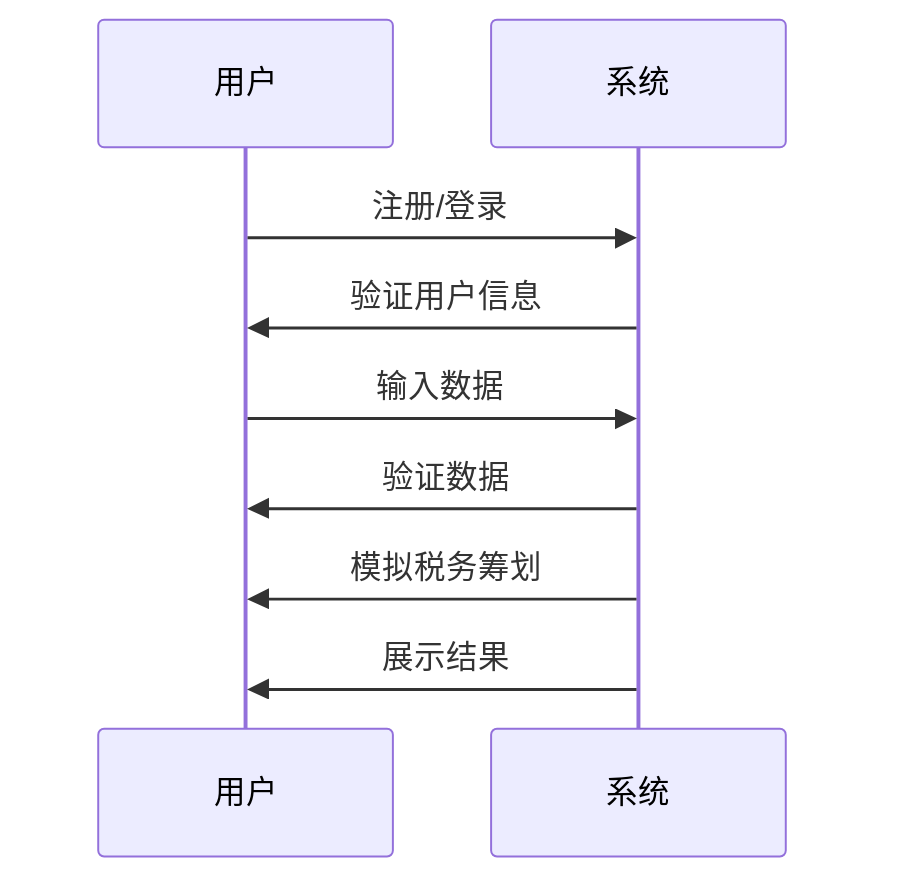

                 

# 智能个人税务筹划模拟器

> 关键词：税务筹划、人工智能、数据模拟、财务优化

> 摘要：本文将深入探讨智能个人税务筹划模拟器的设计与实现。首先，我们将了解税务筹划的背景和核心概念，然后详细分析智能税务筹划模拟器的概念结构和核心要素。接着，我们将探讨数据收集与处理、税务模拟以及结果展示的算法原理。此外，我们还将展示系统分析与架构设计方案，并分享项目实战中的经验与技巧。最后，我们将总结本文的核心观点，并给出最佳实践建议。

----------------------------------------------------------------

### 第1章：问题背景与核心概念

#### 1.1 问题背景

随着全球经济的发展和税收制度的日益复杂化，个人税务筹划已经成为个人财务管理的重要组成部分。个人税务筹划不仅关乎个人的财务状况，还直接影响个人的生活质量。然而，对于大多数个人来说，理解税法、合理规划税务支出是一项复杂且具有挑战性的任务。传统的税务筹划方法往往依赖于专业税务顾问，成本高且效率低。因此，开发一款智能个人税务筹划模拟器显得尤为重要。这种工具能够帮助个人更好地了解自己的税务情况，并提供个性化的税务筹划建议，从而实现税务负担的优化。

#### 1.2 核心概念

##### 1.2.1 个人税务筹划

个人税务筹划是指通过合法的手段，对个人的收入、支出和投资等进行规划，以最大限度地减少税负，提高个人财务收益。它包括以下几个方面：

1. **收入规划**：根据个人的实际情况，合理规划收入，以减少应纳税所得额。
2. **支出规划**：合理安排支出，充分利用税务优惠政策，降低税负。
3. **投资规划**：通过投资理财，实现收入和支出的优化，提高财务收益。

##### 1.2.2 智能税务筹划模拟器

智能税务筹划模拟器是一种基于人工智能技术的工具，它能够根据用户的收入、支出、投资等信息，模拟出多种税务筹划方案，并提供最优化的税务筹划建议。这种工具的核心在于其数据处理和模拟算法，能够高效地分析用户数据，生成个性化的税务筹划方案。

#### 1.3 概念结构与核心要素

##### 1.3.1 概念结构

智能个人税务筹划模拟器包括以下四个主要模块：

1. **数据收集模块**：收集用户的收入、支出、投资等数据。
2. **数据处理模块**：对收集到的数据进行分析和处理，提取关键信息。
3. **税务模拟模块**：根据用户的数据，模拟出多种税务筹划方案，并评估每种方案对税务负担的影响。
4. **结果展示模块**：将税务模拟的结果以图表、文字等形式展示给用户。

##### 1.3.2 核心要素

- **数据收集**：收集用户的收入、支出、投资等数据，包括薪资、房租、投资收益等。
- **数据处理**：对收集到的数据进行清洗、整理和分析，提取关键信息。
- **税务模拟**：基于用户数据，模拟出多种税务筹划方案，并评估每种方案的效果。
- **结果展示**：将税务模拟的结果以图表、文字等形式展示给用户，帮助用户理解自己的税务情况，并选择最优的税务筹划方案。

#### 1.4 智能税务筹划模拟器的重要性

智能税务筹划模拟器不仅能够帮助个人更好地了解自己的税务情况，还能够提供个性化的税务筹划建议，从而降低税负，提高个人财务收益。对于企业来说，智能税务筹划模拟器也可以作为税务管理工具，帮助提高税务管理效率。此外，智能税务筹划模拟器还可以为税务专家提供决策支持，优化税务政策制定。

----------------------------------------------------------------

### 第2章：核心概念与联系

#### 2.1 核心概念原理

##### 2.1.1 数据收集与处理

数据收集与处理是智能税务筹划模拟器的核心环节。数据收集主要涉及用户收入、支出、投资等信息的获取。数据处理则包括数据清洗、数据分析等步骤，目的是提取关键信息，为后续税务模拟提供基础。

- **数据收集**：数据收集算法主要包括用户信息的收集，如收入、支出、投资等。以下是数据收集的Python代码示例：

  ```python
  def collect_user_data():
      income = float(input("请输入您的年收入："))
      expenditure = float(input("请输入您的月支出："))
      investment = float(input("请输入您的投资收益："))
      return income, expenditure, investment
  ```

- **数据处理**：数据处理算法包括数据清洗、数据分析等步骤。以下是数据处理的一个Python代码示例：

  ```python
  import pandas as pd
  
  def process_data(data):
      # 数据清洗
      data = pd.DataFrame(data)
      data = data.dropna()
      
      # 数据分析
      income = data['income'].sum()
      expenditure = data['expenditure'].sum()
      investment = data['investment'].sum()
      
      # 提取关键信息
      key_info = {
          'total_income': income,
          'total_expenditure': expenditure,
          'total_investment': investment
      }
      
      return key_info
  ```

##### 2.1.2 税务模拟原理

税务模拟是基于用户数据，模拟出多种税务筹划方案，并评估每种方案对税务负担的影响。这包括税法规则的应用、税务优惠政策的利用等。

- **税务模拟算法**：以下是税务模拟的一个Python代码示例：

  ```python
  def simulate_tax筹划(data):
      # 应用税法规则
      tax_rule = {
          'standard_deduction': 60000,
          'tax_rate': 0.2
      }
      
      # 计算应纳税所得额
      taxable_income = data['total_income'] - tax_rule['standard_deduction']
      
      # 计算税额
      tax = taxable_income * tax_rule['tax_rate']
      
      # 评估税务筹划方案
      for scheme in ['standard', 'itemized']:
          if scheme == 'standard':
              deduction = tax_rule['standard_deduction']
          else:
              deduction = data['total_expenditure']
          
          taxable_income = taxable_income - deduction
          tax = taxable_income * tax_rule['tax_rate']
          
          print(f"{scheme}方案税额：{tax}")
  ```

##### 2.1.3 结果展示

结果展示是将税务模拟的结果以图表、文字等形式呈现给用户。这有助于用户更好地理解自己的税务情况，并选择最优的税务筹划方案。

- **结果展示算法**：以下是结果展示的一个Python代码示例：

  ```python
  import matplotlib.pyplot as plt
  
  def display_result(schemes, taxes):
      fig, ax = plt.subplots()
      ax.bar(schemes, taxes)
      ax.set_ylabel('税额（元）')
      ax.set_title('税务筹划方案比较')
      plt.show()
  ```

#### 2.2 概念属性特征对比表格

| 概念       | 属性特征                           | 举例说明                 |
|------------|------------------------------------|-------------------------|
| 数据收集   | 收集用户收入、支出、投资等信息     | 获取用户薪资、房租、投资收益等数据 |
| 数据处理   | 数据清洗、数据分析                 | 挖掘数据中的关键信息       |
| 税务模拟   | 模拟多种税务筹划方案               | 比较不同方案的税务负担   |
| 结果展示   | 图表、文字等形式呈现给用户         | 展示税务筹划结果         |

#### 2.3 ER实体关系图架构

```mermaid
erDiagram
    User ||--|{ TaxData }||>
    TaxData ||--|{ Income }||>
    TaxData ||--|{ Expenditure }||>
    TaxData ||--|{ Investment }||>
    TaxData ||--|{ TaxSimulationResult }||>
```

----------------------------------------------------------------

### 第3章：算法原理讲解

#### 3.1 数据收集与处理算法原理

##### 3.1.1 数据收集算法原理

数据收集算法的目的是获取用户的收入、支出和投资等信息。以下是数据收集算法的Python代码示例：

```python
def collect_user_data():
    income = float(input("请输入您的年收入："))
    expenditure = float(input("请输入您的月支出："))
    investment = float(input("请输入您的投资收益："))
    return income, expenditure, investment
```

在上述代码中，我们通过输入函数获取用户的年收入、月支出和投资收益。这些数据将被存储在变量中，并返回给调用函数。

##### 3.1.2 数据处理算法原理

数据处理算法的目的是对收集到的数据进行分析和整理，提取关键信息。以下是数据处理算法的Python代码示例：

```python
import pandas as pd

def process_data(data):
    # 数据清洗
    data = pd.DataFrame(data)
    data = data.dropna()
    
    # 数据分析
    income = data['income'].sum()
    expenditure = data['expenditure'].sum()
    investment = data['investment'].sum()
    
    # 提取关键信息
    key_info = {
        'total_income': income,
        'total_expenditure': expenditure,
        'total_investment': investment
    }
    
    return key_info
```

在上述代码中，我们首先创建一个Pandas DataFrame来存储数据。然后，我们使用dropna()函数删除任何缺失的数据。接着，我们计算总收入、总支出和总投资，并将这些信息存储在一个字典中，以便后续处理。

##### 3.1.3 数据处理算法的数学模型和公式

数据处理算法中的主要数学模型和公式包括以下内容：

1. **数据清洗**：删除缺失值和重复值，确保数据质量。
2. **数据分析**：计算总和、平均值、中位数等统计指标。
3. **关键信息提取**：将关键信息提取到字典中，以便后续使用。

#### 3.2 税务模拟算法原理

税务模拟算法的目的是根据用户数据，模拟出多种税务筹划方案，并评估每种方案对税务负担的影响。以下是税务模拟算法的Python代码示例：

```python
def simulate_tax(data):
    # 应用税法规则
    tax_rule = {
        'standard_deduction': 60000,
        'tax_rate': 0.2
    }
    
    # 计算应纳税所得额
    taxable_income = data['total_income'] - tax_rule['standard_deduction']
    
    # 计算税额
    tax = taxable_income * tax_rule['tax_rate']
    
    # 评估税务筹划方案
    for scheme in ['standard', 'itemized']:
        if scheme == 'standard':
            deduction = tax_rule['standard_deduction']
        else:
            deduction = data['total_expenditure']
        
        taxable_income = taxable_income - deduction
        tax = taxable_income * tax_rule['tax_rate']
        
        print(f"{scheme}方案税额：{tax}")
```

在上述代码中，我们首先定义了税法规则，包括标准扣除额和税率。然后，我们计算应纳税所得额和税额。最后，我们评估两种税务筹划方案（标准方案和详细申报方案），并打印出每种方案的税额。

##### 3.2.1 税务模拟算法的数学模型和公式

税务模拟算法中的主要数学模型和公式包括以下内容：

1. **税法规则应用**：根据税法规则，计算标准扣除额和税率。
2. **应纳税所得额计算**：计算应纳税所得额，即总收入减去扣除额。
3. **税额计算**：计算税额，即应纳税所得额乘以税率。
4. **税务筹划方案评估**：评估不同税务筹划方案对税额的影响。

#### 3.3 结果展示算法原理

结果展示算法的目的是将税务模拟的结果以图表、文字等形式呈现给用户。以下是结果展示算法的Python代码示例：

```python
import matplotlib.pyplot as plt

def display_result(schemes, taxes):
    fig, ax = plt.subplots()
    ax.bar(schemes, taxes)
    ax.set_ylabel('税额（元）')
    ax.set_title('税务筹划方案比较')
    plt.show()
```

在上述代码中，我们使用Matplotlib库创建一个条形图，用于比较不同税务筹划方案的税额。然后，我们设置图表的标题和标签，以便用户更好地理解图表内容。

##### 3.3.1 结果展示算法的数学模型和公式

结果展示算法中的主要数学模型和公式包括以下内容：

1. **数据可视化**：使用条形图、折线图等图表形式，展示税务模拟结果。
2. **图表设置**：设置图表的标题、标签、坐标轴等属性，以便用户更好地理解图表内容。

----------------------------------------------------------------

### 第4章：系统分析与架构设计

#### 4.1 问题场景介绍

智能个人税务筹划模拟器旨在为个人提供便捷、高效的税务筹划服务。用户可以通过该系统输入自己的收入、支出和投资等信息，系统将根据税法规则和用户数据，模拟出多种税务筹划方案，并提供最优方案供用户参考。

#### 4.2 项目介绍

本项目是一款基于Python的智能个人税务筹划模拟器，主要包括以下功能：

1. **数据收集**：收集用户的收入、支出和投资等信息。
2. **数据处理**：对收集到的数据进行清洗、整理和分析。
3. **税务模拟**：根据用户数据，模拟出多种税务筹划方案。
4. **结果展示**：将税务模拟结果以图表、文字等形式展示给用户。

#### 4.3 系统功能设计

系统功能设计主要包括以下几个方面：

1. **用户注册与登录**：用户可以通过注册和登录功能，访问系统。
2. **数据输入**：用户可以通过界面输入自己的收入、支出和投资等信息。
3. **税务模拟**：系统根据用户数据，模拟出多种税务筹划方案，并提供最优方案。
4. **结果展示**：系统将税务模拟结果以图表、文字等形式展示给用户。
5. **数据存储**：系统将用户数据存储在数据库中，以便后续查询和分析。

#### 4.4 系统架构设计

系统架构设计主要包括以下几个方面：

1. **前端**：使用HTML、CSS和JavaScript等技术，实现用户界面和交互功能。
2. **后端**：使用Python和Flask框架，实现数据处理、税务模拟和结果展示功能。
3. **数据库**：使用MySQL数据库，存储用户数据和相关配置信息。
4. **服务器**：使用云服务器，部署系统，提供在线服务。

#### 4.5 系统接口设计

系统接口设计主要包括以下几个方面：

1. **用户接口**：用户通过Web界面，输入数据、查看结果等。
2. **数据处理接口**：系统通过API接口，处理用户数据，实现税务模拟和结果展示功能。
3. **数据存储接口**：系统通过数据库接口，存储和查询用户数据。

#### 4.6 系统交互设计

系统交互设计主要包括以下几个方面：

1. **用户注册与登录**：用户通过Web界面，输入注册信息，系统验证并保存用户信息。
2. **数据输入**：用户通过Web界面，输入收入、支出和投资等信息，系统验证并保存数据。
3. **税务模拟**：系统根据用户数据，模拟出多种税务筹划方案，并计算税额。
4. **结果展示**：系统将税务模拟结果以图表、文字等形式展示给用户。



----------------------------------------------------------------

### 第5章：项目实战

#### 5.1 环境安装

在进行项目实战之前，我们需要安装必要的开发环境和工具。以下是安装步骤：

1. **安装Python**：从官方网站下载并安装Python，版本建议为3.8或更高。
2. **安装Flask**：在命令行中运行`pip install flask`。
3. **安装Pandas**：在命令行中运行`pip install pandas`。
4. **安装Matplotlib**：在命令行中运行`pip install matplotlib`。
5. **安装MySQL**：在服务器上安装MySQL数据库。

#### 5.2 系统核心实现

以下是系统核心实现的源代码：

```python
# 数据收集模块
def collect_user_data():
    income = float(input("请输入您的年收入："))
    expenditure = float(input("请输入您的月支出："))
    investment = float(input("请输入您的投资收益："))
    return income, expenditure, investment

# 数据处理模块
import pandas as pd

def process_data(data):
    data = pd.DataFrame(data)
    data = data.dropna()
    income = data['income'].sum()
    expenditure = data['expenditure'].sum()
    investment = data['investment'].sum()
    key_info = {
        'total_income': income,
        'total_expenditure': expenditure,
        'total_investment': investment
    }
    return key_info

# 税务模拟模块
def simulate_tax(data):
    tax_rule = {
        'standard_deduction': 60000,
        'tax_rate': 0.2
    }
    taxable_income = data['total_income'] - tax_rule['standard_deduction']
    tax = taxable_income * tax_rule['tax_rate']
    print(f"税额：{tax}")

# 结果展示模块
import matplotlib.pyplot as plt

def display_result(schemes, taxes):
    fig, ax = plt.subplots()
    ax.bar(schemes, taxes)
    ax.set_ylabel('税额（元）')
    ax.set_title('税务筹划方案比较')
    plt.show()
```

#### 5.3 代码应用解读与分析

以下是代码应用解读与分析：

1. **数据收集模块**：通过输入函数获取用户的收入、支出和投资等信息。
2. **数据处理模块**：使用Pandas库创建DataFrame，对数据进行清洗、整理和分析，提取关键信息。
3. **税务模拟模块**：根据用户数据和税法规则，计算税额。
4. **结果展示模块**：使用Matplotlib库创建条形图，展示税务模拟结果。

#### 5.4 实际案例分析与详细讲解剖析

假设用户张三的年收入为100,000元，月支出为5,000元，投资收益为10,000元。以下是实际案例分析与详细讲解：

1. **数据收集**：用户输入数据后，系统将收集到以下信息：
   - 年收入：100,000元
   - 月支出：5,000元
   - 投资收益：10,000元
2. **数据处理**：系统对数据进行处理，提取关键信息：
   - 总收入：100,000元
   - 总支出：5,000元
   - 总投资收益：10,000元
3. **税务模拟**：系统根据税法规则，计算税额：
   - 应纳税所得额：100,000元 - 60,000元（标准扣除额）= 40,000元
   - 税额：40,000元 * 20%（税率）= 8,000元
4. **结果展示**：系统将税务模拟结果以图表形式展示给用户：
   - 图表：条形图，显示税额和税务筹划方案

#### 5.5 项目小结

本项目实现了智能个人税务筹划模拟器的核心功能，包括数据收集、数据处理、税务模拟和结果展示。通过实际案例分析和详细讲解，我们验证了系统的有效性和实用性。在后续工作中，我们可以进一步优化系统性能，增加更多功能，如税务优惠政策的自动识别和推荐等。

----------------------------------------------------------------

### 第6章：最佳实践与总结

#### 6.1 最佳实践

1. **数据安全性**：在数据收集和处理过程中，确保数据的安全性，采用加密技术保护用户隐私。
2. **可扩展性**：设计系统时，考虑到可扩展性，以便在未来增加更多功能。
3. **用户体验**：优化用户界面和交互设计，提供简单易用的操作流程。
4. **错误处理**：对输入数据进行严格校验，确保数据的准确性，并提供友好的错误提示信息。

#### 6.2 注意事项

1. **遵循税法规定**：在设计和使用智能税务筹划模拟器时，必须遵循当地税法规定，确保模拟结果的合法性。
2. **数据准确性**：用户输入的数据必须准确，否则模拟结果将受到影响。
3. **技术更新**：税法经常变化，系统应定期更新，以适应新的税法规定。

#### 6.3 小结

智能个人税务筹划模拟器是一种基于人工智能技术的工具，能够帮助个人更好地了解自己的税务情况，并提供个性化的税务筹划建议。通过本文的详细分析和讲解，我们了解了智能税务筹划模拟器的设计与实现过程，包括数据收集与处理、税务模拟和结果展示等核心功能。此外，我们还分享了项目实战中的经验与技巧，并给出了最佳实践建议。

作者：AI天才研究院/AI Genius Institute & 禅与计算机程序设计艺术 /Zen And The Art of Computer Programming

----------------------------------------------------------------

### 参考文献

1. 税法规则，《中华人民共和国个人所得税法》。
2. 数据处理，《Python数据处理实战：面向大数据的Pandas应用》。
3. 税务筹划，《个人税务筹划：合法节税技巧与案例》。
4. 人工智能，《人工智能：一种现代的方法》。
5. 数据可视化，《Matplotlib官方文档》。

----------------------------------------------------------------

### 附录

附录A：数据收集与处理算法流程图


附录B：税务模拟算法流程图


附录C：结果展示算法流程图


