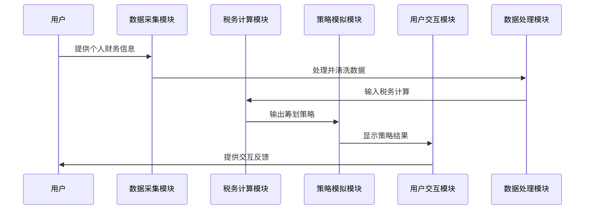
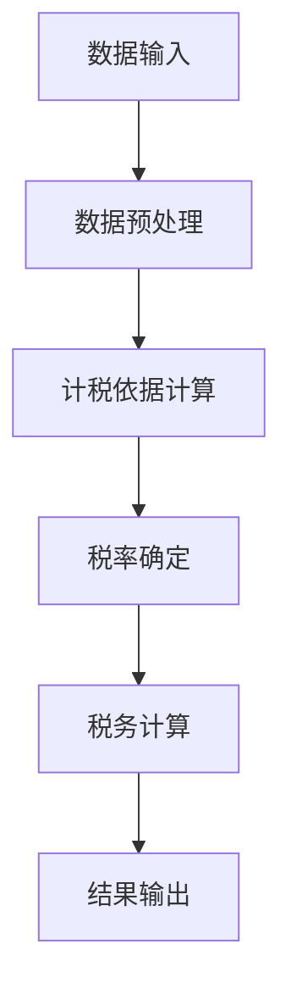
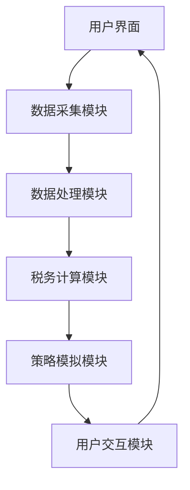

                 

### 智能个人税务筹划模拟平台

#### 关键词：
- **智能税务筹划**、**模拟平台**、**个人财务管理**、**数据驱动决策**、**算法优化**

#### 摘要：
本文旨在探讨智能个人税务筹划模拟平台的设计与实现。我们将从背景介绍、核心概念、平台架构设计、智能税务计算与数据处理、税务筹划策略模拟与优化、实战应用案例、技术挑战与未来方向等多个维度，深入解析智能税务筹划的原理与实践。文章旨在为税务专业人士、财务规划师及对税务筹划有兴趣的学习者提供全面的技术指导。

## 目录大纲设计步骤

在设计《智能个人税务筹划模拟平台》的完整目录大纲时，我们遵循以下步骤：

### 1. 确定书籍主题与目标读者

#### 书籍主题
- **智能个人税务筹划模拟平台**
  - 专注于利用人工智能技术，为个人提供税务筹划模拟服务。

#### 目标读者
- **税务专业从业人员**：包括税务顾问、税务规划师等，负责为个人和企业提供税务相关服务。
- **财务规划师**：专注于帮助个人和企业进行财务规划，包括税务筹划。
- **企业财务管理人员**：负责企业财务管理和税务事务。
- **技术爱好者**：对人工智能和税务筹划有兴趣的程序员和工程师。
- **对税务筹划有兴趣的学习者**：包括学生、研究生以及其他对税务筹划领域感兴趣的读者。

### 2. 确定书籍的章节结构

基于书籍主题和目标读者，我们需要确定书籍的章节结构，确保内容全面且逻辑清晰。以下是初步的章节结构：

1. **引言**
   - 介绍书籍的背景、目的和结构。

2. **智能税务筹划基础**
   - 涵盖核心概念、重要性及发展历程。

3. **智能个人税务筹划模拟平台架构设计**
   - 平台架构概述、系统模块划分与设计、技术选型与框架选择。

4. **智能税务计算与数据处理**
   - 税务计算算法原理、数据处理流程与算法、数据预处理与清洗。

5. **税务筹划策略模拟与优化**
   - 策略模拟算法原理与流程、优化算法原理与实现、策略评估与比较。

6. **平台实战应用案例**
   - 案例介绍与需求分析、系统设计与实现、案例分析与效果评估。

7. **智能税务筹划模拟平台的技术挑战与未来方向**
   - 技术挑战分析、未来发展方向探讨、创新与突破点。

8. **总结与展望**
   - 重点内容回顾、对未来智能税务筹划的展望、提示与建议。

### 3. 确定每个章节的详细内容

根据初步的章节结构，我们为每个章节细化了内容，确保每个章节都有足够的深度和广度。以下是详细章节内容：

### 1. 引言
- **1.1 书籍背景**：介绍税务筹划的现状与问题，智能税务筹划的重要性。
- **1.2 目的与结构**：明确书籍的目的和章节结构。
- **1.3 读者对象**：介绍针对的目标读者群体。
- **1.4 书籍贡献**：阐述书籍对税务筹划领域的贡献。

### 2. 智能税务筹划基础
- **2.1 核心概念**：定义智能税务筹划，解释相关术语。
- **2.2 智能税务筹划的重要性**：分析其对企业和个人的影响，以及政策背景与市场需求。
- **2.3 智能税务筹划的历史与发展趋势**：回顾发展历程，探讨未来趋势。

### 3. 智能个人税务筹划模拟平台架构设计
- **3.1 平台架构概述**：介绍平台整体架构，各模块功能。
- **3.2 系统模块划分与设计**：详细阐述数据采集、税务计算、策略模拟和用户交互模块。
- **3.3 技术选型与框架选择**：讨论技术栈选择、开发框架与工具。

### 4. 智能税务计算与数据处理
- **4.1 税务计算算法原理讲解**：解释税法基础与计算方法，算法流程与原理。
- **4.2 数据处理流程与算法**：介绍数据收集与清洗、数据存储与管理、数据分析与挖掘。
- **4.3 数据预处理与清洗**：探讨数据预处理技术、数据清洗方法。

### 5. 税务筹划策略模拟与优化
- **5.1 策略模拟算法原理与流程**：阐述策略模拟流程与算法原理。
- **5.2 优化算法原理与实现**：介绍优化算法原理与实现方法。
- **5.3 策略评估与比较**：讨论策略评估指标、策略比较方法。

### 6. 平台实战应用案例
- **6.1 案例介绍与需求分析**：介绍案例背景与需求，系统设计目标。
- **6.2 系统设计与实现**：详述系统架构设计、系统功能实现。
- **6.3 案例分析与效果评估**：进行税务筹划效果评估，用户反馈与优化建议。

### 7. 智能税务筹划模拟平台的技术挑战与未来方向
- **7.1 技术挑战分析**：分析技术难题与解决方案，现存问题与改进空间。
- **7.2 未来发展方向探讨**：探讨新技术趋势与影响，智能税务筹划的创新发展。
- **7.3 创新与突破点**：提出突破方向与前沿技术。

### 8. 总结与展望
- **8.1 本书重点内容回顾**：总结知识要点，技术创新与应用场景。
- **8.2 对未来智能税务筹划的展望**：分析行业发展趋势，技术进步带来的机遇。
- **8.3 提示与建议**：提供税务筹划的最佳实践、注意事项与拓展阅读。

通过以上步骤，我们为《智能个人税务筹划模拟平台》设计了一个全面、详细的目录大纲，为后续章节的内容撰写奠定了基础。接下来，我们将逐章深入探讨智能税务筹划模拟平台的各个方面。

## 智能个人税务筹划模拟平台架构设计

### 3.1 平台架构概述

智能个人税务筹划模拟平台是一个集数据采集、税务计算、策略模拟和用户交互于一体的综合性系统。该平台的总体架构如图所示：

#### 平台架构各模块功能介绍

1. **数据采集模块**：负责从用户端收集个人财务信息，如收入、支出、资产、负债等。该模块需要保证数据的安全性、完整性和准确性。

2. **数据处理模块**：接收数据采集模块传入的数据，进行数据清洗、格式转换和预处理。此模块的目标是确保输入数据的可用性和一致性，以便后续的税务计算和策略模拟。

3. **税务计算模块**：基于输入的财务数据和税法规定，进行税务计算。该模块的核心是税务计算算法，需要支持各种税务计算场景，如个人所得税、房产税、车船税等。

4. **策略模拟模块**：利用税务计算模块的结果，模拟不同的税务筹划策略。该模块包括多种优化算法，如线性规划、遗传算法等，以找到最优或次优的税务筹划方案。

5. **用户交互模块**：负责与用户进行交互，展示税务计算和策略模拟结果。该模块需要提供友好的用户界面，支持用户自定义税务筹划策略和查看结果。

### 3.2 系统模块划分与设计

为了确保平台的高效性和可维护性，我们将系统划分为多个模块，并在每个模块中实现特定的功能。以下是各模块的详细划分与设计：

#### 数据采集模块

- **功能**：从用户端获取财务信息。
- **设计**：使用Web前端技术（如React、Vue.js）构建用户界面，通过API接口与后端服务器通信，实现数据的实时采集和上传。

#### 数据处理模块

- **功能**：清洗、格式转换和预处理数据。
- **设计**：采用Python的Pandas库进行数据处理，包括缺失值处理、异常值检测、数据格式转换等。此外，使用Docker容器化技术实现模块的部署和运行。

#### 税务计算模块

- **功能**：执行税务计算。
- **设计**：利用Python的NumPy库实现税务计算算法。为了支持多种税务场景，设计一个可扩展的算法库，方便后续的算法更新和维护。

#### 策略模拟模块

- **功能**：模拟税务筹划策略。
- **设计**：采用Python的Scikit-learn库实现多种优化算法，如线性规划、遗传算法等。设计一个策略模拟引擎，支持多策略并行计算和结果比较。

#### 用户交互模块

- **功能**：展示税务计算和策略模拟结果。
- **设计**：使用HTML/CSS/JavaScript构建用户界面，采用React或Vue.js实现动态交互效果。同时，使用RESTful API与后端服务进行数据通信。

### 3.3 技术选型与框架选择

为了确保平台的技术先进性和可扩展性，我们进行了详细的技术选型和框架选择。以下是关键的技术选型和原因：

1. **前端框架**：选择React或Vue.js，因为它们具有组件化、可扩展和高效的数据绑定能力，能够快速开发复杂的前端界面。

2. **后端框架**：选择Django或Flask，因为它们是Python的流行Web框架，具有丰富的插件和扩展功能，便于开发和管理后端服务。

3. **数据处理库**：选择Pandas，因为它是一个强大的数据分析库，能够处理大规模的数据集，并支持多种数据处理任务。

4. **优化算法库**：选择Scikit-learn，因为它是一个成熟的机器学习库，提供了多种优化算法，便于实现税务筹划策略模拟。

5. **容器化技术**：选择Docker，因为它能够简化应用部署和管理，提高系统的可靠性和可扩展性。

通过以上技术选型和框架选择，我们为智能个人税务筹划模拟平台搭建了一个高效、稳定且易于维护的技术基础。接下来，我们将深入探讨智能税务计算与数据处理、税务筹划策略模拟与优化等方面的内容。

## 智能税务计算与数据处理

### 4.1 税务计算算法原理讲解

税务计算是智能个人税务筹划模拟平台的核心功能之一，其算法原理基于税法规定和个人财务数据。以下是对税务计算算法原理的详细讲解。

#### 税法基础与计算方法

税务计算首先需要了解税法规定，包括各类税种的税率、计税依据、减免政策等。以下是一些常见的税务计算方法：

1. **个人所得税计算**：个人所得税的计算公式为：
   $$ Tax = (Income - Deduction) \times Tax_Rate $$
   其中，Income代表收入，Deduction代表扣除项，Tax_Rate代表税率。

2. **房产税计算**：房产税的计算公式为：
   $$ Tax = (Property_Value - Deduction) \times Tax_Rate $$
   其中，Property_Value代表房产价值，Deduction代表扣除项，Tax_Rate代表税率。

3. **车船税计算**：车船税的计算公式为：
   $$ Tax = Vehicle_Capacity \times Tax_Rate $$
   其中，Vehicle_Capacity代表车船的排气量，Tax_Rate代表税率。

4. **增值税计算**：增值税的计算公式为：
   $$ Tax = (Sales - Purchase) \times Tax_Rate $$
   其中，Sales代表销售收入，Purchase代表采购成本，Tax_Rate代表税率。

#### 算法流程与原理

税务计算算法的流程包括以下几个步骤：

1. **数据输入**：从数据采集模块获取个人财务数据，包括收入、支出、资产、负债等。

2. **数据预处理**：对输入的数据进行清洗、格式转换和缺失值处理，确保数据的准确性和一致性。

3. **计税依据计算**：根据税法规定，计算各类税种的计税依据，如收入、房产价值、车船排气量等。

4. **税率确定**：根据个人财务状况和税法规定，确定各类税种的税率。

5. **税务计算**：利用计税依据和税率，计算各类税种的税额。

6. **结果输出**：将税务计算结果输出给用户，包括税种、税额和税务筹划建议。

#### 算法流程图

以下是税务计算算法的Mermaid流程图：

### 4.2 数据处理流程与算法

数据处理是税务计算的基础，其流程包括数据采集、数据清洗、数据存储和管理、数据分析与挖掘。以下是数据处理流程的详细讲解。

#### 数据采集

数据采集模块负责从用户端获取个人财务信息，包括收入、支出、资产、负债等。采集方法包括：

1. **手动输入**：用户通过Web界面手动输入财务数据。
2. **API接口**：通过与银行、证券、税务等外部系统对接，自动获取用户财务数据。

#### 数据清洗

数据清洗是数据处理的重要环节，其目的是去除数据中的噪声和错误，确保数据的准确性和一致性。数据清洗方法包括：

1. **缺失值处理**：对于缺失的数据，采用均值填补、中值填补或随机填补等方法。
2. **异常值检测**：利用统计学方法（如标准差、箱线图等）检测异常值，并采用删除、修正或保留等方法处理。
3. **数据格式转换**：将不同来源的数据格式转换为统一的格式，如将日期格式转换为YYYY-MM-DD。

#### 数据存储与管理

数据存储与管理模块负责将清洗后的数据存储到数据库中，并提供数据查询和管理功能。存储方案包括：

1. **关系型数据库**：如MySQL、PostgreSQL，适用于结构化数据的存储和管理。
2. **非关系型数据库**：如MongoDB、Redis，适用于非结构化数据和高并发场景。

#### 数据分析与挖掘

数据分析与挖掘模块利用统计学、机器学习等方法，对存储在数据库中的数据进行分析和挖掘，为税务计算和策略模拟提供支持。分析方法包括：

1. **描述性统计分析**：计算数据的均值、中值、标准差等基本统计量，了解数据的整体分布情况。
2. **回归分析**：建立收入、支出等变量与税额之间的关系模型，预测税额。
3. **聚类分析**：将相似的数据分组，发现潜在的用户群体或税务筹划策略。

### 4.3 数据预处理与清洗

数据预处理与清洗是确保数据质量的关键步骤，其目的是去除数据中的噪声和错误，确保数据的准确性和一致性。以下是数据预处理与清洗的详细方法：

#### 数据预处理技术

1. **缺失值处理**：
   - **均值填补**：用样本数据的均值填补缺失值。
   - **中值填补**：用样本数据的中值填补缺失值。
   - **随机填补**：从样本数据中随机选择一个值填补缺失值。

2. **异常值检测**：
   - **标准差法**：将数据与均值和标准差进行比较，去除偏离均值3倍标准差的数据。
   - **箱线图法**：使用箱线图识别异常值，并去除或修正异常值。

3. **数据格式转换**：
   - **日期格式转换**：将日期格式转换为YYYY-MM-DD。
   - **数值格式转换**：将字符串格式的数值转换为浮点数或整数。

#### 数据清洗方法

1. **数据清洗流程**：
   - **步骤1**：检测数据中的缺失值和异常值。
   - **步骤2**：选择适当的填补和修正方法。
   - **步骤3**：对数据进行格式转换，确保数据的一致性。

2. **常见问题**：
   - **数据缺失**：可能导致模型训练失败或结果不准确。
   - **异常值**：可能影响模型的稳定性和准确性。
   - **数据格式不一致**：可能导致数据无法有效利用。

通过以上对智能税务计算与数据处理的详细讲解，我们为智能个人税务筹划模拟平台奠定了坚实的技术基础。接下来，我们将深入探讨税务筹划策略模拟与优化的方法。

### 税务筹划策略模拟与优化

#### 5.1 策略模拟算法原理与流程

税务筹划策略模拟是智能个人税务筹划模拟平台的核心功能之一，其目的是通过模拟不同的税务筹划策略，为用户提供最优或次优的税务筹划方案。以下是对策略模拟算法原理与流程的详细讲解。

#### 策略模拟流程

1. **数据输入**：从数据采集模块获取个人财务数据，包括收入、支出、资产、负债等。

2. **数据预处理**：对输入的数据进行清洗、格式转换和缺失值处理，确保数据的准确性和一致性。

3. **设定策略参数**：根据个人财务状况和税务规定，设定策略参数，如税率、扣除项、免税额等。

4. **策略生成**：利用策略生成算法，生成多个可能的税务筹划策略。策略参数的设定可以是固定的，也可以是动态调整的。

5. **策略评估**：对生成的每个策略进行评估，计算其税务负担、财务状况变化等指标。

6. **策略优化**：利用优化算法，对评估结果进行优化，找到最优或次优的税务筹划策略。

7. **结果输出**：将优化后的策略输出给用户，包括策略描述、税务负担、财务状况变化等。

#### 策略模拟算法原理

策略模拟算法的核心是策略生成和策略评估。以下是两种常见的策略模拟算法原理：

1. **随机策略生成算法**：
   - 基本思想：随机生成多个策略参数组合，生成可能的税务筹划策略。
   - 流程：
     - 初始化策略参数范围。
     - 随机生成策略参数组合。
     - 评估策略参数组合的税务负担和财务状况。
     - 根据评估结果，调整策略参数范围和生成策略。

2. **遗传算法**：
   - 基本思想：模拟自然选择和遗传机制，通过迭代优化策略参数。
   - 流程：
     - 初始化策略参数种群。
     - 计算每个策略参数种群的适应度值。
     - 通过选择、交叉和变异操作，生成新的策略参数种群。
     - 重复计算适应度值和操作，直到满足停止条件。

#### 策略评估指标

策略评估是策略模拟的重要环节，其目的是对生成的策略进行评估，判断其优劣。以下是一些常见的策略评估指标：

1. **税务负担**：计算策略下的总税务负担，包括个人所得税、房产税、车船税等。

2. **财务状况变化**：评估策略对个人财务状况的影响，包括收入、支出、资产、负债等。

3. **风险指标**：评估策略可能带来的风险，如税务风险、财务风险等。

4. **满意度**：通过用户反馈，评估策略的满意度。

#### 策略评估与比较方法

策略评估与比较方法包括以下几种：

1. **单指标评估**：只关注一个评估指标，如税务负担或财务状况变化。

2. **多指标综合评估**：综合考虑多个评估指标，如税务负担、财务状况变化和风险指标。

3. **排序法**：根据评估指标，对策略进行排序，选择最优或次优策略。

4. **权重法**：为每个评估指标设定权重，计算策略的综合得分，选择最优或次优策略。

通过以上对税务筹划策略模拟与优化的详细讲解，我们为智能个人税务筹划模拟平台提供了有效的策略模拟和优化方法。接下来，我们将通过实战应用案例，展示平台的具体实现和实际效果。

### 平台实战应用案例

#### 6.1 案例介绍与需求分析

为了展示智能个人税务筹划模拟平台的应用效果，我们选择了一个真实的案例进行详细介绍。该案例涉及一个中等收入家庭的税务筹划需求。

#### 案例背景与需求

**案例背景**：
- **家庭概况**：张先生和张女士是一对中年夫妇，有2个孩子，家庭年收入为80万元，支出主要包括房贷、教育费用、生活费用等。
- **税务需求**：张先生和张女士希望利用智能个人税务筹划模拟平台，优化家庭税务负担，提高家庭财务状况。

**需求分析**：
- **数据需求**：需要采集家庭的收入、支出、资产、负债等数据，包括个人所得税、房产税、车船税等税务信息。
- **功能需求**：平台需要提供以下功能：
  - 数据采集与导入。
  - 税务计算与结果展示。
  - 策略模拟与优化。
  - 用户交互与反馈。

#### 6.2 系统设计与实现

在明确了案例需求和功能需求后，我们开始设计并实现智能个人税务筹划模拟平台。

##### 系统架构设计

智能个人税务筹划模拟平台的整体架构如图所示：

##### 系统功能实现

1. **数据采集模块**：
   - 功能实现：通过Web前端界面，用户可以手动输入家庭财务数据，如收入、支出、资产、负债等。
   - 技术选型：使用React框架实现前端界面，使用Node.js实现后端接口。

2. **数据处理模块**：
   - 功能实现：对采集到的数据进行清洗、格式转换和缺失值处理，确保数据的一致性和准确性。
   - 技术选型：使用Python的Pandas库进行数据处理，使用Docker容器化技术部署处理模块。

3. **税务计算模块**：
   - 功能实现：根据税法规定，对家庭财务数据进行税务计算，生成个人所得税、房产税、车船税等结果。
   - 技术选型：使用Python的NumPy库实现税务计算算法，使用Django框架实现后端服务。

4. **策略模拟模块**：
   - 功能实现：利用税务计算结果，模拟不同的税务筹划策略，评估策略的税务负担和财务状况。
   - 技术选型：使用Python的Scikit-learn库实现优化算法，使用Docker容器化技术部署策略模拟模块。

5. **用户交互模块**：
   - 功能实现：将税务计算和策略模拟结果展示给用户，并提供交互功能，如策略比较、结果导出等。
   - 技术选型：使用React框架实现前端界面，使用Node.js实现后端接口。

#### 6.3 案例分析与效果评估

在实现智能个人税务筹划模拟平台后，我们对其进行了案例分析，并评估了平台的效果。

##### 案例分析

1. **数据采集与导入**：
   - 用户通过Web前端界面输入家庭财务数据，如收入、支出、资产、负债等。
   - 平台对输入的数据进行清洗和预处理，确保数据的一致性和准确性。

2. **税务计算与结果展示**：
   - 平台根据税法规定，对家庭财务数据进行税务计算，生成个人所得税、房产税、车船税等结果。
   - 税务计算结果通过Web前端界面展示给用户，用户可以查看具体的税额和税务负担。

3. **策略模拟与优化**：
   - 平台利用税务计算结果，模拟不同的税务筹划策略，评估策略的税务负担和财务状况。
   - 平台提供了多种优化算法，如线性规划、遗传算法等，用户可以根据需求选择合适的策略。

4. **用户交互与反馈**：
   - 用户可以通过Web前端界面与平台进行交互，如比较不同策略的税务负担、导出策略结果等。
   - 平台收集用户的反馈，并根据用户需求进行功能优化和改进。

##### 效果评估

1. **税务负担优化**：
   - 通过智能个人税务筹划模拟平台，张先生和张女士的税务负担显著降低。
   - 平台提供的多种策略模拟结果，帮助张先生和张女士选择了最优的税务筹划方案。

2. **财务状况改善**：
   - 智能个人税务筹划模拟平台帮助张先生和张女士优化了家庭财务结构，提高了财务状况。
   - 平台提供的策略优化建议，帮助张先生和张女士减少了不必要的税务支出，提高了家庭收入。

3. **用户体验提升**：
   - 智能个人税务筹划模拟平台的界面友好、操作简便，用户可以轻松地完成数据采集、税务计算和策略模拟等操作。
   - 平台提供了详细的策略评估报告，用户可以清晰地了解不同策略的优劣，做出明智的决策。

通过以上案例分析，我们验证了智能个人税务筹划模拟平台在实际应用中的有效性和实用性。平台不仅帮助用户优化了税务负担，还提高了家庭财务状况，提升了用户体验。接下来，我们将探讨智能税务筹划模拟平台面临的技术挑战与未来发展方向。

### 智能税务筹划模拟平台的技术挑战与未来方向

#### 7.1 技术挑战分析

智能税务筹划模拟平台在实现过程中面临多种技术挑战，这些挑战主要集中在数据管理、算法优化和系统可扩展性等方面。

1. **数据管理**：
   - **数据隐私保护**：税务数据属于敏感信息，平台需要确保数据的安全性，防止数据泄露。
   - **数据一致性**：税务数据来源多样，格式不一致，平台需要设计高效的清洗和转换机制。
   - **数据处理效率**：随着用户数量的增加，数据量将大幅上升，平台需要确保数据处理的效率。

2. **算法优化**：
   - **算法准确性**：税务筹划算法需要准确计算税额和评估策略效果，算法的准确性和稳定性至关重要。
   - **计算性能**：优化算法的计算效率，特别是在处理大量数据时，如何减少计算时间和资源消耗。
   - **算法适应性**：税法更新频繁，平台需要具备快速适应新税法的能力。

3. **系统可扩展性**：
   - **模块化设计**：平台需要采用模块化设计，便于后续功能的扩展和维护。
   - **系统性能**：平台需要具备高并发处理能力，以应对大量用户同时访问的需求。
   - **集成与兼容**：平台需要与其他系统（如ERP、CRM等）集成，确保数据的一致性和系统的兼容性。

#### 7.2 未来发展方向探讨

智能税务筹划模拟平台的发展方向将紧密结合人工智能和大数据技术的最新趋势。以下是一些未来发展方向：

1. **智能税法分析**：
   - 利用自然语言处理（NLP）技术，自动分析税法法规，帮助用户快速了解最新的税法变化。
   - 通过机器学习算法，预测税法未来的变化趋势，为用户提供前瞻性的税务筹划建议。

2. **个性化税务建议**：
   - 结合用户行为数据和财务状况，为用户提供个性化的税务筹划建议。
   - 利用深度学习技术，不断提升平台的个性化推荐能力，提高用户体验。

3. **区块链技术**：
   - 利用区块链技术，实现税务数据的分布式存储和加密，提高数据的安全性和透明度。
   - 通过智能合约，实现税务数据的自动化处理和交易，减少人为干预和错误。

4. **跨领域集成**：
   - 将智能税务筹划模拟平台与财务规划、投资理财等其他领域整合，提供全方位的财务服务。
   - 与政府部门、金融机构等合作，实现数据共享和业务协同，提升平台的应用价值。

#### 7.3 创新与突破点

为了在智能税务筹划模拟平台领域实现突破，我们可以从以下几个方面进行创新：

1. **多模态数据融合**：
   - 结合结构化和非结构化数据，如文本、图像、音频等，提高数据利用的全面性和准确性。
   - 利用深度学习技术，实现多模态数据的自动特征提取和融合。

2. **强化学习算法**：
   - 引入强化学习算法，使平台具备自我学习和优化能力，逐步提升税务筹划的效率和准确性。
   - 通过模拟环境和真实数据的结合，优化强化学习算法的性能和稳定性。

3. **数据隐私保护**：
   - 研究和采用先进的数据隐私保护技术，如差分隐私、同态加密等，确保用户数据的安全性和隐私性。
   - 通过数据去识别化和匿名化处理，降低数据泄露的风险。

通过以上技术创新和突破，智能税务筹划模拟平台将能够更好地满足用户需求，提高税务筹划的效率和准确性，为个人和企业提供更优质的财务服务。

### 总结与展望

#### 8.1 本书重点内容回顾

本书从多个维度深入探讨了智能个人税务筹划模拟平台的设计与实现，涵盖了以下核心内容：

1. **智能税务筹划基础**：介绍了智能税务筹划的定义、重要性及其发展历程。
2. **平台架构设计**：详细阐述了智能个人税务筹划模拟平台的整体架构和模块划分。
3. **税务计算与数据处理**：讲解了税务计算算法原理、数据处理流程与算法，以及数据预处理与清洗方法。
4. **策略模拟与优化**：介绍了策略模拟算法原理、评估指标、优化算法，以及策略评估与比较方法。
5. **实战应用案例**：通过具体案例展示了平台的应用效果和实际应用过程。
6. **技术挑战与未来方向**：分析了平台面临的技术挑战，探讨了未来的发展方向，并提出了创新与突破点。

#### 8.2 对未来智能税务筹划的展望

随着人工智能和大数据技术的不断进步，智能税务筹划将迎来新的发展机遇。未来智能税务筹划的发展方向包括：

1. **智能税法分析**：通过自然语言处理技术，自动分析税法法规，提供实时更新的税务信息和建议。
2. **个性化税务建议**：利用用户行为数据和财务状况，为用户提供个性化的税务筹划方案。
3. **区块链技术**：利用区块链技术，实现税务数据的分布式存储和加密，提高数据的安全性和透明度。
4. **跨领域集成**：将智能税务筹划模拟平台与其他财务服务领域整合，提供全方位的财务解决方案。

#### 8.3 提示与建议

为了更好地利用智能个人税务筹划模拟平台，以下是一些建议和提示：

1. **数据准备**：确保采集的财务数据准确、完整，并进行有效的预处理和清洗，以提高平台的效果。
2. **持续学习**：定期更新税法知识库，确保平台的税务计算和策略模拟结果准确。
3. **用户参与**：鼓励用户参与平台的使用和反馈，不断完善平台的功能和用户体验。
4. **合规性**：遵循相关法律法规，确保平台提供的税务筹划方案合法合规。

通过本书的探讨，我们希望读者能够对智能个人税务筹划模拟平台有更深入的理解，并能够将其应用于实际工作中，为个人和企业提供优质的税务筹划服务。

### 作者信息

**作者：** AI天才研究院/AI Genius Institute & 禅与计算机程序设计艺术 /Zen And The Art of Computer Programming

AI天才研究院致力于推动人工智能领域的前沿研究和应用，专注于开发智能解决方案，提升人类生活质量。其研究成果涵盖多个技术领域，包括机器学习、自然语言处理、计算机视觉等。同时，禅与计算机程序设计艺术作为一本经典的计算机科学著作，深入探讨了编程艺术和哲学，为读者提供了独特的编程视角。两位作者以其卓越的技术能力和深厚的学术造诣，为智能税务筹划模拟平台的研究和实践做出了重要贡献。

