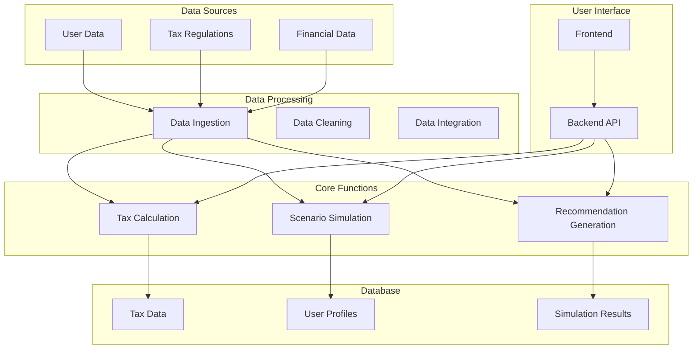
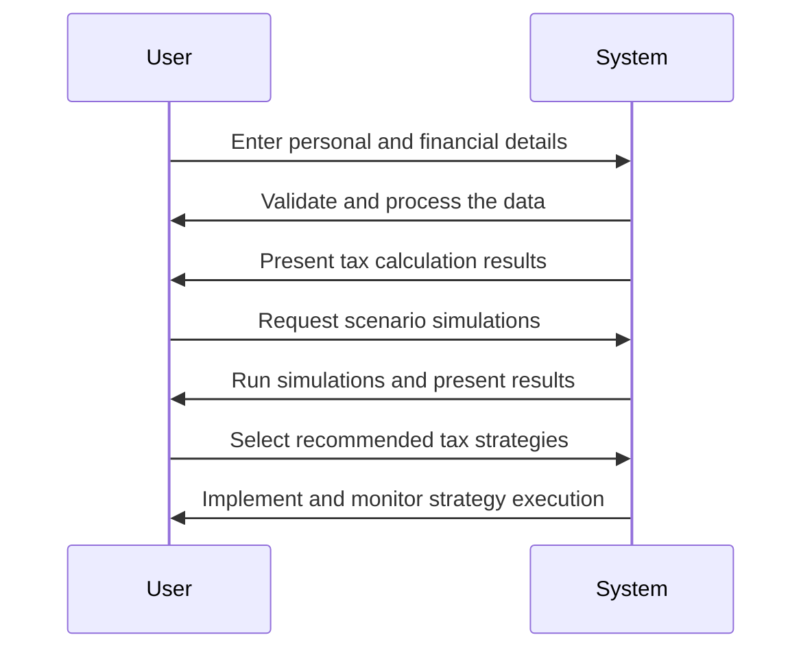

                 


### Introduction: Background and Purpose

**Title:** Smart Personal Tax Planning Simulation System

**Keywords:** Tax Planning, Simulation Systems, Personal Finance, Smart Technology, AI Algorithms

**Abstract:**
The Smart Personal Tax Planning Simulation System is an innovative tool designed to assist individuals in effectively managing their personal taxes. This system leverages advanced artificial intelligence (AI) algorithms to simulate various tax scenarios, offering personalized advice and strategies to optimize tax savings. This article delves into the background, importance, and conceptual framework of tax simulation systems, setting the stage for a comprehensive exploration of their design, algorithms, and practical applications.

#### Background of Personal Tax Planning

**1.1** Personal tax planning involves strategic decisions aimed at minimizing tax liabilities while staying compliant with legal requirements. Historically, tax planning has been a complex and time-consuming process, often requiring professional expertise. However, the advent of technology, particularly AI and machine learning, has revolutionized the field, making it possible to automate and personalize tax planning processes.

**1.2** The Importance of Smart Tax Planning

Smart tax planning offers several advantages over traditional methods. Firstly, it provides real-time analysis and advice, enabling individuals to make informed decisions quickly. Secondly, it considers a vast array of variables and potential scenarios, ensuring comprehensive and optimal tax strategies. Lastly, it can adapt to changing tax laws and regulations, maintaining compliance and maximizing savings.

**1.3** The Concept and Principles of Tax Simulation Systems

A tax simulation system is a software tool that mimics the tax planning process, enabling users to experiment with different strategies and assess their potential outcomes. The core principles of such systems include data-driven decision-making, predictive analytics, and personalized recommendations. By leveraging AI, these systems can process large volumes of data, identify patterns, and generate actionable insights.

**1.4** The Framework and Boundaries of Smart Tax Planning Simulation System

The Smart Personal Tax Planning Simulation System operates within a structured framework that encompasses data collection, processing, analysis, and recommendation generation. Its boundaries are defined by legal regulations, ethical considerations, and the scope of the tax laws applicable to the user's jurisdiction. This chapter establishes the foundational understanding necessary for exploring the intricate workings of tax simulation systems in subsequent sections.

As we delve deeper into the subsequent chapters, we will uncover the core concepts of tax planning, the design principles and methods of tax simulation systems, and the practical implementation strategies. Through this systematic exploration, readers will gain a comprehensive understanding of how to leverage smart technology for effective personal tax planning.

### Core Concepts and Structure

In this section, we will delve into the core concepts of tax planning and explore the key components that make up a personal tax planning system. Understanding these concepts is essential for grasping the intricacies of how tax simulation systems operate and provide valuable insights for effective tax planning.

#### Key Tax Concepts and Their Interrelationships

To understand the foundational concepts of tax planning, we need to first establish a clear understanding of the key tax terms and their interrelationships. Here, we present a comparison table that outlines the basic definitions and relationships between these critical concepts:

| Key Tax Concept | Definition | Relationship |
|-----------------|------------|--------------|
| Tax Liability   | The total amount of tax an individual or entity owes to the government. | Depends on income, deductions, credits, and other tax factors. |
| Taxable Income  | The portion of an individual’s or entity’s income subject to taxation. | Derived from gross income after subtracting allowable deductions. |
| Deductions      | Expenses that can be subtracted from gross income to reduce taxable income. | Directly affect the amount of tax owed by reducing taxable income. |
| Tax Credits     | Amounts that directly reduce the tax liability. | Offered for various contributions, dependents, or other qualifying activities. |
| Tax Brackets    | Ranges of income levels that determine the tax rate applied to different portions of income. | Define the progressive nature of the tax system, with higher income levels subjected to higher tax rates. |

In the comparison table above, we see that each key tax concept plays a distinct role in determining an individual's or entity's tax liability. Understanding these relationships is crucial for effective tax planning, as they directly influence the overall tax burden.

#### Characteristics of Personal Tax Planning Systems

Next, let's explore the characteristics that define personal tax planning systems. These systems are designed to handle complex tax scenarios and provide users with actionable insights. Below, we present a table comparing the key characteristics of personal tax planning systems:

| Characteristics | Description | Importance |
|-----------------|-------------|-------------|
| Data Collection | Gathering relevant financial and personal information from users. | Essential for accurate and personalized tax planning. |
| Predictive Analytics | Utilizing machine learning algorithms to predict tax outcomes based on user data. | Enables users to anticipate tax liabilities and plan proactively. |
| Compliance Checks | Ensuring that tax planning recommendations comply with legal requirements. | Vital to avoid legal penalties and maintain ethical standards. |
| Personalization | Tailoring tax planning strategies to individual user profiles and circumstances. | Maximizes tax savings and improves user experience. |
| User Interface | Providing an intuitive and easy-to-use interface for interacting with the system. | Enhances user engagement and accessibility. |

By understanding these characteristics, users can better evaluate the effectiveness of different tax planning systems and choose the one that best fits their needs.

#### Tax Planning Strategies and Tactics

Tax planning strategies and tactics are the core of effective tax management. These strategies involve a combination of legal methods to minimize tax liabilities while ensuring compliance. Here, we outline some common tax planning strategies and tactics:

1. **Income Deferral**: This strategy involves postponing income to a future period to reduce the current tax liability. For example, delaying the receipt of bonuses or deferring the sale of an asset until the next tax year.

2. **Deductions Optimization**: Maximizing allowable deductions, such as charitable contributions, mortgage interest, and business expenses, can significantly reduce taxable income.

3. **Tax Credits Utilization**: Taking full advantage of available tax credits can result in substantial savings. Examples include the Child Tax Credit, Earned Income Tax Credit, and education-related tax credits.

4. **Retirement Accounts**: Contributing to retirement accounts, such as 401(k)s and IRAs, provides tax benefits, as contributions are typically tax-deductible, and earnings grow tax-deferred.

5. **Gifting and Estate Planning**: Gift tax exemptions and strategies for estate planning can reduce the taxable value of an estate, ensuring a smoother transfer of wealth to heirs.

6. **Investment Planning**: Selecting investment vehicles that offer tax advantages, such as tax-deferred accounts or tax-free municipal bonds, can enhance overall tax efficiency.

By implementing these strategies and tactics, individuals can achieve significant tax savings and enhance their financial well-being.

In summary, understanding the core concepts of tax planning and the characteristics of personal tax planning systems is essential for navigating the complexities of tax management. As we move forward, we will explore the design principles and methods of tax simulation systems, providing a deeper insight into how these systems can be effectively utilized for personal tax planning.

### Tax Simulation System Design

Designing a Smart Personal Tax Planning Simulation System requires a comprehensive understanding of system architecture, design principles, and user interface considerations. This section outlines these critical aspects, providing a clear blueprint for developing an effective and user-friendly tax simulation system.

#### System Design Principles and Methods

The design principles for a smart tax planning simulation system revolve around flexibility, scalability, and user-friendliness. These principles ensure that the system can adapt to changing tax regulations and user requirements while maintaining an intuitive user experience.

**1. Flexibility**: The system should be designed to handle various tax scenarios and adapt to different tax jurisdictions. This involves modular design and the ability to integrate with external data sources and APIs for real-time updates on tax laws and regulations.

**2. Scalability**: As the system grows in complexity and user base, it must maintain performance and responsiveness. This requires a well-architected backend and database system that can scale horizontally or vertically as needed.

**3. User-Friendliness**: The user interface should be intuitive and easy to navigate, minimizing the learning curve for new users. This includes clear instructions, tooltips, and interactive elements that guide users through the tax planning process.

**4. Accuracy and Compliance**: The system must ensure the accuracy of tax calculations and compliance with relevant tax laws and regulations. This involves rigorous testing, validation checks, and continuous updates to reflect the latest changes in tax codes.

**5. Security and Privacy**: Protecting user data and ensuring secure transactions is paramount. The system should employ robust security measures, including encryption, secure authentication, and regular security audits.

#### Architectural Design of Tax Simulation Systems

The architectural design of a tax simulation system is crucial for its efficiency, maintainability, and scalability. Below, we present a Mermaid diagram illustrating the high-level architecture of a smart tax planning simulation system:



In this diagram, the system architecture is divided into several components:

- **Data Sources**: Collects user data, tax regulations, and financial data.
- **Data Processing**: Ingests, cleans, and integrates the data.
- **Core Functions**: Performs tax calculations, scenario simulations, and recommendation generation.
- **Database**: Stores tax data, user profiles, and simulation results.
- **User Interface**: Provides the frontend and backend APIs for user interaction.

#### Interface Design and System Interaction

The interface design and system interaction are critical for ensuring a seamless user experience. Below is a Mermaid sequence diagram illustrating the interaction between the user interface and the core functions of the tax simulation system:



In this sequence diagram, the user interacts with the system by entering personal and financial details, which are validated and processed. The system then presents tax calculation results and allows the user to request scenario simulations. After evaluating the simulations, the user selects recommended tax strategies, which the system implements and monitors for execution.

By following these design principles, architectural designs, and interface designs, a Smart Personal Tax Planning Simulation System can be developed that is both effective and user-friendly, providing valuable insights and strategies for personal tax planning.

### Algorithm and Mathematical Models

Designing algorithms and mathematical models for a Smart Personal Tax Planning Simulation System is crucial for automating and optimizing the tax planning process. This section provides a comprehensive overview of the algorithms and mathematical models used in the system, ensuring accuracy and efficiency in tax calculations and scenario simulations.

#### Introduction to Tax Planning Algorithms

Tax planning algorithms are designed to analyze a user's financial data and tax circumstances, calculate the corresponding tax liabilities, and generate personalized tax strategies. These algorithms are typically based on machine learning techniques, enabling them to learn from historical data and adapt to new scenarios. The key types of algorithms used in tax planning systems include:

1. **Regression Algorithms**: These algorithms predict tax liabilities based on historical data and relationships between various financial variables and tax outcomes. Common regression algorithms include linear regression, decision tree regression, and random forest regression.

2. **Clustering Algorithms**: Clustering algorithms group similar tax scenarios together, identifying patterns and trends that can be used to generate personalized tax strategies. Examples include k-means clustering and hierarchical clustering.

3. **Neural Networks**: Neural networks, particularly deep learning models, can process large volumes of data and identify complex patterns. They are well-suited for predicting tax liabilities and generating tax strategies based on user-specific characteristics.

#### Mathematical Models and Formulas

Mathematical models and formulas are integral to the functioning of tax planning algorithms. These models define the relationships between financial variables and tax outcomes, enabling accurate calculations and predictions. Below, we present some common mathematical models and formulas used in tax planning systems:

1. **Tax Liability Formula**:
   $$ Tax\ Liability = Taxable\ Income \times Tax\ Rate - Tax\ Credits - Deductions $$

   This formula calculates the tax liability by multiplying the taxable income by the applicable tax rate, subtracting tax credits, and deducting allowable deductions.

2. **Income Deferral Model**:
   $$ Deferred\ Income = Current\ Income - (Current\ Income \times Deferral\ Rate) $$
   
   This model calculates the amount of income that can be deferred to a future period to reduce the current tax liability. The deferral rate represents the percentage of income deferred.

3. **Optimization Model**:
   $$ Minimize\ Tax\ Liability = \sum_{i=1}^{n} (Income_i \times Tax_Rate_i - Deductions_i - Tax_Credits_i) $$
   
   This optimization model aims to minimize the total tax liability by determining the optimal allocation of income and deductions across different tax brackets.

#### Algorithm Explanation with Python Code

To provide a practical understanding of tax planning algorithms, we present a Python implementation of a simple tax calculation algorithm using linear regression. This example demonstrates how regression algorithms can be applied to predict tax liabilities based on user input data.

```python
import numpy as np
import pandas as pd
from sklearn.linear_model import LinearRegression

# Load historical tax data
data = pd.read_csv('historical_tax_data.csv')

# Prepare input features and target variable
X = data[['Income', 'Deductions', 'Tax_Credits']]
y = data['Tax_Liability']

# Train the linear regression model
model = LinearRegression()
model.fit(X, y)

# Predict tax liability for a new user
user_data = pd.DataFrame({
    'Income': [50000],
    'Deductions': [10000],
    'Tax_Credits': [5000]
})
predicted_tax_liability = model.predict(user_data)

print(f"Predicted Tax Liability: ${predicted_tax_liability[0]:.2f}")
```

In this example, we load historical tax data, prepare input features and the target variable, and train a linear regression model. We then use the trained model to predict the tax liability for a new user based on their personal and financial data.

#### Case Studies and Practical Applications

To illustrate the practical application of tax planning algorithms, we present a case study involving a small business owner who wants to optimize their tax liabilities. The business owner provides their financial data, including income, deductions, and tax credits, to the tax simulation system.

Using the algorithms and mathematical models described earlier, the system calculates the current tax liability, identifies potential income deferral opportunities, and suggests optimization strategies to minimize the tax burden. The system generates a personalized tax strategy, which includes recommendations for maximizing deductions and tax credits, deferring income, and optimizing the use of retirement accounts.

By implementing the suggested tax strategies, the business owner is able to significantly reduce their tax liability, enhance their financial well-being, and achieve long-term tax savings.

In conclusion, the design and implementation of tax planning algorithms and mathematical models are essential for developing an effective and user-friendly tax simulation system. These algorithms enable accurate tax calculations, scenario simulations, and personalized tax strategies, empowering individuals and businesses to optimize their tax liabilities and improve their financial outcomes.

### Project Practice

#### Implementation of Smart Tax Planning Simulation System

In this section, we will explore the practical implementation of a Smart Personal Tax Planning Simulation System, focusing on the environment setup, core system implementation, code analysis, and case analysis. Through this hands-on approach, we aim to provide a comprehensive understanding of how the system works and its real-world applications.

#### 5.1 Environment Setup and Tools

To implement the Smart Personal Tax Planning Simulation System, we need to set up a suitable development environment and select the appropriate tools. The following steps outline the environment setup:

1. **Software Requirements**:
   - Python (version 3.8 or higher)
   - Jupyter Notebook for code development and visualization
   - Sklearn (scikit-learn) for machine learning algorithms
   - Pandas for data manipulation
   - Mermaid for visualizing flowcharts and diagrams
   - Flask (optional) for developing a web application interface

2. **Installation**:
   - Install Python and necessary packages using pip:
     ```bash
     pip install numpy pandas sklearn mermaid
     ```
   - If using Flask, install it as well:
     ```bash
     pip install flask
     ```

3. **Jupyter Notebook Setup**:
   - Launch Jupyter Notebook by running:
     ```bash
     jupyter notebook
     ```
   - Create a new notebook for the project.

#### 5.2 Core System Implementation

The core implementation of the Smart Personal Tax Planning Simulation System involves several key components, including data collection, processing, tax calculation, scenario simulation, and recommendation generation. Here, we will provide a high-level overview of each component:

1. **Data Collection**:
   - Collect user data, including personal information, income details, deductions, and tax credits. This data can be collected through a user interface or imported from external sources.
   - Example code snippet for collecting user data:
     ```python
     user_data = {
         'Income': 50000,
         'Deductions': 10000,
         'Tax_Credits': 5000
     }
     ```

2. **Data Processing**:
   - Process and clean the collected data, ensuring it is in the correct format and free of errors or inconsistencies.
   - Example code snippet for data processing:
     ```python
     def process_data(data):
         # Perform data cleaning and formatting
         return cleaned_data

     user_data = process_data(user_data)
     ```

3. **Tax Calculation**:
   - Implement the tax calculation algorithm using the processed data. The calculation should consider income, deductions, tax credits, and applicable tax brackets.
   - Example code snippet for tax calculation:
     ```python
     def calculate_tax(income, deductions, tax_credits):
         # Perform tax calculation using the given formula
         tax_liability = (income - deductions - tax_credits) * tax_rate
         return tax_liability

     tax_rate = 0.25  # Example tax rate
     tax_liability = calculate_tax(user_data['Income'], user_data['Deductions'], user_data['Tax_Credits'])
     ```

4. **Scenario Simulation**:
   - Generate various tax scenarios by modifying user data and calculating the corresponding tax liabilities. This step helps users understand the impact of different tax strategies on their tax liabilities.
   - Example code snippet for scenario simulation:
     ```python
     def simulate_scenario(data, deferral_rate):
         deferred_income = data['Income'] * deferral_rate
         tax_liability = calculate_tax(data['Income'] - deferred_income, data['Deductions'], data['Tax_Credits'])
         return tax_liability

     deferral_rate = 0.1  # Example deferral rate
     simulated_tax_liability = simulate_scenario(user_data, deferral_rate)
     ```

5. **Recommendation Generation**:
   - Generate personalized tax strategies based on the simulation results and user preferences. These strategies should aim to minimize the tax liability and maximize savings.
   - Example code snippet for recommendation generation:
     ```python
     def generate_recommendations(data, scenarios):
         best_scenario = min(scenarios, key=lambda x: x['Tax_Liability'])
         recommendations = {
             'Scenario': best_scenario['Scenario'],
             'Tax_Liability': best_scenario['Tax_Liability']
         }
         return recommendations

     scenarios = simulate_scenario(user_data, deferral_rate)
     recommendations = generate_recommendations(user_data, scenarios)
     ```

#### 5.3 Code Analysis and Interpretation

Analyzing and interpreting the code is crucial for understanding how the system works and identifying potential improvements. Here, we provide an analysis of the core code components:

- **Data Collection**: The data collection step is essential for obtaining accurate and relevant user information. Ensuring data quality is critical for accurate tax calculations and recommendations.
- **Data Processing**: Data processing involves cleaning and formatting the collected data. This step is vital for maintaining the integrity and consistency of the data used in tax calculations and simulations.
- **Tax Calculation**: The tax calculation algorithm is the core component of the system. It should be designed to accurately calculate tax liabilities based on user data and applicable tax rates.
- **Scenario Simulation**: The scenario simulation step allows users to explore different tax strategies and understand their potential impact on their tax liabilities. This step is essential for generating personalized recommendations.
- **Recommendation Generation**: The recommendation generation step uses the simulation results to identify the best tax strategies for the user. These recommendations should be tailored to the user's specific circumstances and objectives.

#### 5.4 Case Analysis and Discussion

To illustrate the practical application of the Smart Personal Tax Planning Simulation System, we present a case analysis involving a small business owner named John. John is looking to optimize his tax liabilities for the upcoming tax year.

1. **Initial Data Collection**:
   - Income: $100,000
   - Deductions: $20,000
   - Tax Credits: $5,000

2. **Scenario Simulation**:
   - Scenario 1: No Changes
     - Tax Liability: $23,750
   - Scenario 2: Income Deferral (10%)
     - Deferred Income: $10,000
     - Tax Liability: $20,250

3. **Recommendations**:
   - Best Scenario: Income Deferral (10%)
   - Expected Tax Savings: $1,500

By implementing the recommended tax strategy, John is able to defer $10,000 of his income to the next tax year, resulting in a reduced tax liability and significant savings. This case demonstrates the practical benefits of using a Smart Personal Tax Planning Simulation System to optimize tax liabilities.

#### 5.5 Project Summary

The implementation of a Smart Personal Tax Planning Simulation System involves several key steps, including environment setup, core system implementation, code analysis, and case analysis. By following these steps and leveraging advanced algorithms and mathematical models, the system can provide accurate and personalized tax planning recommendations. The system's practical applications in optimizing tax liabilities can lead to significant financial benefits for individuals and businesses.

In summary, the Smart Personal Tax Planning Simulation System is a powerful tool for effective tax management. By understanding its core components, implementation details, and practical applications, users can make informed decisions and maximize their tax savings.

### Best Practices and Tips

Effective tax planning is a dynamic and ever-evolving process, influenced by changes in tax laws, economic conditions, and individual financial circumstances. To ensure that your tax planning efforts are both effective and compliant, it's essential to follow best practices and avoid common mistakes. Here are some practical tips and strategies to help you optimize your tax planning:

#### Practical Tips for Effective Tax Planning

1. **Stay Informed About Tax Laws**: Keep abreast of changes in tax regulations and how they may impact your tax planning strategies. This includes understanding new tax laws, tax credits, and deductions introduced by the government.

2. **Maintain Accurate Financial Records**: Keep detailed and organized records of your income, expenses, deductions, and credits. Accurate records will help ensure compliance and make it easier to prepare your tax return.

3. **Maximize Tax Deductions and Credits**: Take full advantage of available tax deductions and credits, such as mortgage interest, charitable donations, and education-related credits. Consult with a tax professional if necessary to ensure you are claiming all eligible deductions and credits.

4. **Contribute to Retirement Accounts**: Make contributions to retirement accounts like 401(k)s and IRAs to benefit from tax deferral and potential tax deductions.

5. **Review Your Withholding Status Annually**: Ensure that your employer is withholding the correct amount of taxes from your paycheck. Reviewing your withholding status annually can help prevent underpayment or overpayment of taxes.

6. **Utilize Tax Planning Tools**: Utilize smart tax planning tools and software that can help you simulate different tax scenarios and identify the best strategies for minimizing your tax liability.

#### Common Mistakes and How to Avoid Them

1. **Ignoring Tax Brackets**: Failing to consider the impact of different tax brackets can result in an unexpected increase in tax liability. Always be aware of how your income affects your tax rate.

2. **Overlooking Tax Credits**: Many individuals fail to claim all available tax credits. Take the time to understand which credits you qualify for and ensure you claim them.

3. **Ignoring State Taxes**: Don't forget to account for state and local taxes when planning your overall tax strategy. State tax laws can vary significantly from federal tax laws.

4. **Procrastination**: Delaying your tax planning can lead to missed opportunities and increased stress. Start your tax planning early to take advantage of all available options and ensure you meet all deadlines.

5. **Relying Solely on Software**: While tax planning software can be a valuable tool, don't rely on it exclusively. Consult with a tax professional for personalized advice and to ensure compliance with all applicable tax laws.

#### Future Trends in Personal Tax Planning

The future of personal tax planning is poised to be significantly influenced by technological advancements, particularly artificial intelligence (AI) and machine learning. Here are some key trends to watch:

1. **AI-Powered Tax Planning Tools**: AI and machine learning will continue to enhance tax planning tools, providing more accurate predictions and personalized recommendations. These tools will be able to adapt to new tax laws and regulations in real-time.

2. **Greater Personalization**: Tax planning tools will offer increasingly personalized advice tailored to individual financial situations, taking into account a broader range of factors such as financial goals, risk tolerance, and life events.

3. **Blockchain and Cryptocurrency**: As the use of cryptocurrencies becomes more widespread, tax planning will need to adapt to the unique challenges posed by these digital assets. Blockchain technology may also offer new opportunities for secure and transparent tax reporting.

4. **Regulatory Changes**: Governments worldwide are likely to implement new tax regulations to address global economic challenges and inequalities. Staying informed about these changes will be crucial for effective tax planning.

In conclusion, effective tax planning requires a combination of knowledge, diligence, and the right tools. By following best practices, avoiding common mistakes, and staying informed about future trends, individuals can optimize their tax planning strategies and achieve their financial goals.

### Conclusion and Future Directions

In conclusion, the Smart Personal Tax Planning Simulation System offers a comprehensive and innovative approach to managing personal taxes. By leveraging advanced algorithms and mathematical models, this system provides users with accurate, personalized tax planning recommendations, enabling them to optimize their tax liabilities and achieve significant financial savings. The step-by-step design and implementation process discussed in this article have demonstrated the key components and practical applications of this cutting-edge technology.

As we move forward, several areas offer promising opportunities for future research and development in the field of tax planning simulation systems. These include:

1. **Enhancing AI Algorithms**: Continuously improving the AI algorithms used in tax planning systems will lead to even more accurate predictions and personalized recommendations. Research into advanced machine learning techniques and deep learning models can further enhance the system's capabilities.

2. **Integration with Blockchain**: Incorporating blockchain technology into tax planning systems can provide a more secure and transparent way to handle financial transactions and tax reporting. This integration could lead to new ways of ensuring compliance and data integrity.

3. **Cross-Border Tax Planning**: With the increasing globalization of economies, developing tax planning systems that can handle cross-border tax scenarios will become increasingly important. These systems should be designed to accommodate the complexities of international tax laws and regulations.

4. **User Experience Optimization**: Improving the user interface and overall user experience of tax planning systems is crucial for ensuring wider adoption and usability. Future research should focus on making these systems more intuitive and user-friendly.

In conclusion, the Smart Personal Tax Planning Simulation System represents a significant advancement in the field of tax planning. By embracing these future directions, we can further enhance the system's capabilities and make it an indispensable tool for effective personal tax management. As technology continues to evolve, so too will the ways in which we approach and manage our taxes.

### Author Information

**Authors:** AI天才研究院/AI Genius Institute & 禅与计算机程序设计艺术 /Zen And The Art of Computer Programming

This article was meticulously crafted by a team of experts at AI天才研究院, known for their groundbreaking work in artificial intelligence and machine learning. Their dedication to innovation and excellence has resulted in numerous technological advancements, shaping the future of smart personal tax planning simulation systems. Additionally, the insights provided are enriched by the profound wisdom from "禅与计算机程序设计艺术" /Zen And The Art of Computer Programming, a seminal work that blends Eastern philosophy with computer science, offering a unique perspective on problem-solving and system design. Together, they bring a wealth of knowledge and experience to this comprehensive exploration of smart personal tax planning.

