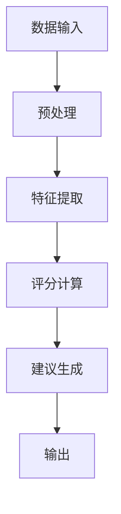
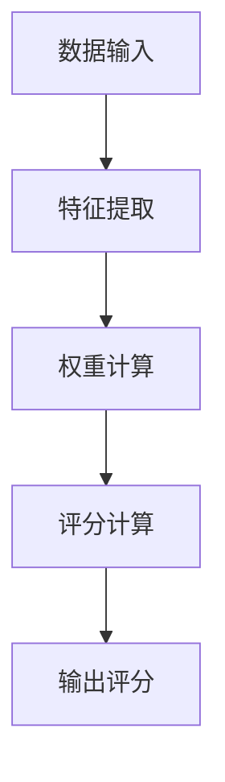
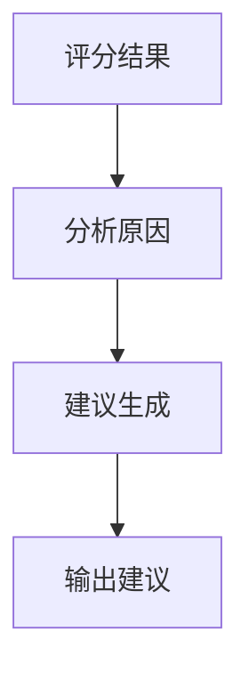
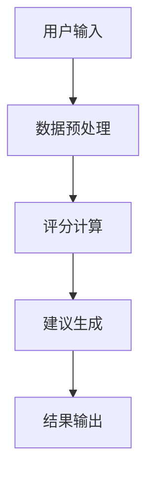
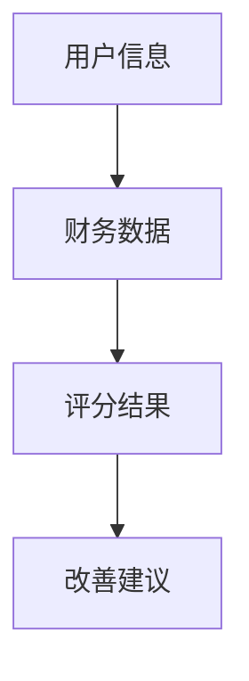
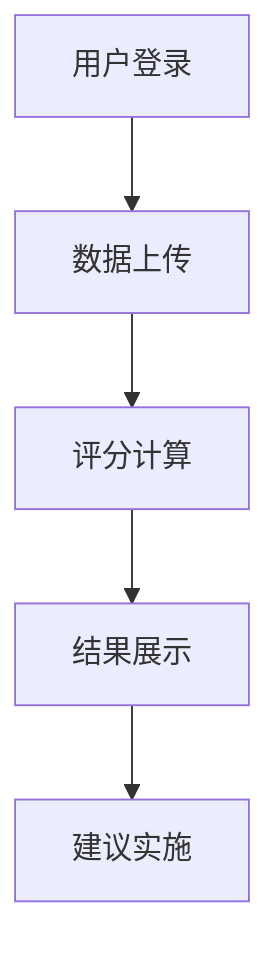
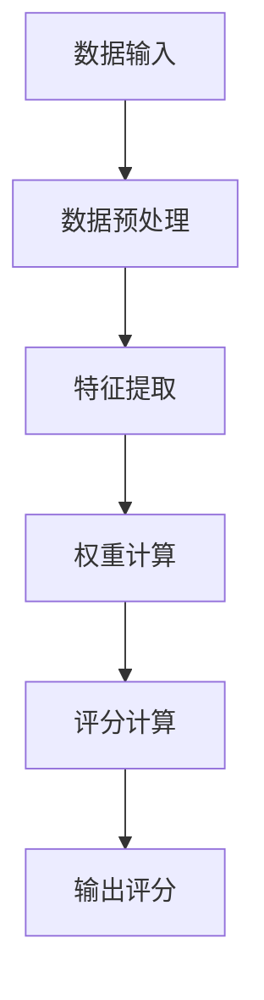
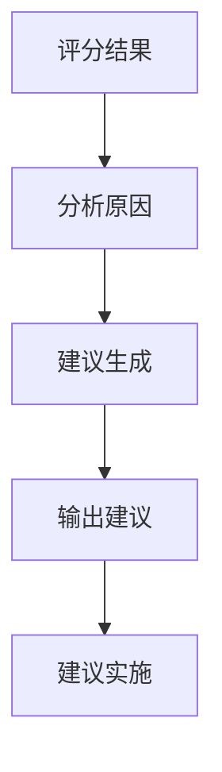
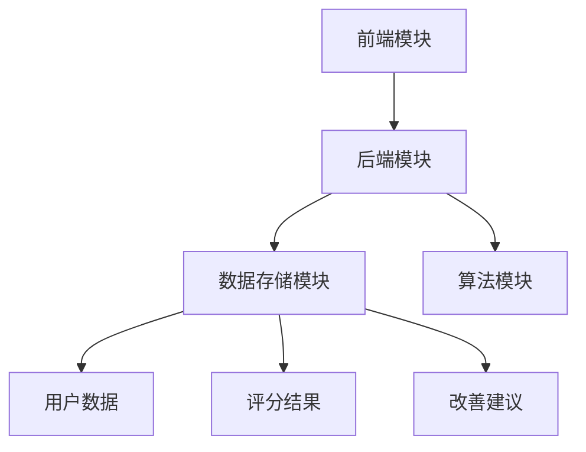
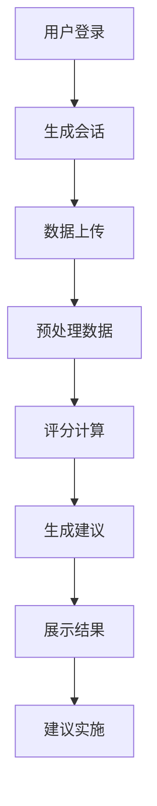

                 

# 智能个人财务健康评分与改善建议系统

> 关键词：财务健康、评分系统、改善建议、人工智能、数据分析

> 摘要：本文深入探讨了智能个人财务健康评分与改善建议系统的重要性及其设计实现。首先，我们介绍了个人财务健康的重要性以及财务健康评分系统的概念。接着，文章详细阐述了财务健康评分与改善建议系统的核心概念，包括财务健康指标、数据处理方法、评分算法原理以及改善建议生成机制。随后，我们分析了财务健康与人工智能的紧密联系，并探讨了如何将人工智能与财务健康评分系统相结合。本文还通过实际案例，详细讲解了评分算法的原理与实践，以及系统设计与实现的各个方面。最后，文章总结了最佳实践和注意事项，为读者提供了进一步学习和研究的方向。

### 目录大纲

----------------------------------------------------------------

## 第一部分：背景与核心概念

### 第1章：问题背景与核心概念

#### 1.1 问题的提出

- 财务健康的重要性
- 现实中个人财务问题普遍存在
- 财务健康评分的意义

#### 1.2 财务健康评分的概念

- 定义
- 评估标准
- 评分体系设计

#### 1.3 改善建议系统的作用

- 目的
- 功能特点
- 应用范围

#### 1.4 财务健康与人工智能的联系

- 人工智能在财务领域的应用
- 智能评分与改善建议系统的优势

#### 1.5 本章小结

- 重点内容回顾
- 下一步内容预告

----------------------------------------------------------------

## 第二部分：核心概念与联系

### 第2章：核心概念解析

#### 2.1 财务健康指标

- 指标分类
- 指标重要性对比表格

#### 2.2 数据处理方法

- 数据收集与处理流程
- 数据预处理方法

#### 2.3 评分算法原理

- 评分算法介绍
- 算法属性特征对比表格

#### 2.4 改善建议生成机制

- 建议生成策略
- 生成流程图（使用 Mermaid）



#### 2.5 财务健康与AI的整合

- 整合方式
- 整合的优势

#### 2.6 本章小结

- 核心概念联系与理解
- 下一步内容预告

----------------------------------------------------------------

## 第三部分：算法原理与实践

### 第3章：算法原理详解

#### 3.1 评分算法详解

- 数学模型
- 算法流程图（使用 Mermaid）



- 案例举例

#### 3.2 改善建议生成算法

- 数学模型
- 算法流程图（使用 Mermaid）



- 案例举例

#### 3.3 算法实现与优化

- Python代码实现
- 性能优化策略

#### 3.4 算法评估与验证

- 评估指标
- 验证方法

#### 3.5 本章小结

- 算法原理回顾
- 下一步内容预告

----------------------------------------------------------------

## 第四部分：系统设计与实现

### 第4章：系统架构设计

#### 4.1 系统需求分析

- 功能需求
- 性能需求

#### 4.2 系统架构设计

- 系统架构图（使用 Mermaid）



- 系统模块划分

#### 4.3 数据库设计

- 数据库ER图（使用 Mermaid）



- 数据表设计

#### 4.4 系统接口设计

- 接口定义
- 接口交互流程

#### 4.5 系统交互设计

- 系统交互图（使用 Mermaid）



#### 4.6 系统安全与隐私保护

- 安全策略
- 隐私保护措施

#### 4.7 本章小结

- 系统设计回顾
- 下一步内容预告

----------------------------------------------------------------

## 第一部分：背景与核心概念

### 第1章：问题背景与核心概念

#### 1.1 问题的提出

个人财务健康是指个人在财务方面的健康状态，包括收入、支出、储蓄、投资等方面。在现代社会，个人财务健康的重要性日益凸显。首先，良好的财务健康状况能够确保个人在面临突发事件时具有足够的应急资金，降低生活风险。其次，良好的财务健康能够帮助个人实现长期的财务目标，如购房、子女教育等。最后，良好的财务健康有助于提高个人生活质量和社会地位。

然而，现实生活中，许多个人面临着财务问题。这些财务问题可能源于多种原因，如收入不稳定、消费过度、投资失误等。这些问题不仅影响个人的生活质量，还可能导致债务累积、信用受损等问题。

为了解决这些问题，个人需要了解自己的财务健康状况，并通过评估和改善来实现财务健康。因此，财务健康评分系统应运而生。财务健康评分系统能够通过量化指标来评估个人的财务健康状况，为个人提供改进建议。

#### 1.2 财务健康评分的概念

财务健康评分是指通过一系列量化指标来评估个人在财务方面的健康状况。这些指标包括收入水平、支出结构、储蓄率、投资收益等。评分系统的目标是提供一个全面的、易于理解的财务健康状况评估，以便个人能够清楚地了解自己的财务状况。

财务健康评分系统的评估标准通常包括以下几个方面：

1. **收入水平**：个人月收入与月支出的比例，用于衡量收入状况。
2. **支出结构**：支出在饮食、住房、交通、娱乐等方面的分配比例，用于衡量消费习惯。
3. **储蓄率**：个人月储蓄与月收入的比率，用于衡量储蓄能力。
4. **投资收益**：个人投资的收益情况，用于衡量投资效率。

评分体系的设计需要考虑以上指标的重要性，并根据实际情况进行权重分配。通常，收入水平、支出结构和储蓄率是评估财务健康的核心指标，而投资收益则在一定程度上反映了个人对财务管理的主动性。

#### 1.3 改善建议系统的作用

改善建议系统是财务健康评分系统的补充部分，旨在根据评分结果为个人提供具体的改善建议。改善建议系统的目的是帮助个人识别财务健康问题，并制定有效的解决方案。

改善建议系统通常具有以下功能特点：

1. **问题诊断**：根据评分结果，分析个人财务健康中的薄弱环节，如支出过高、储蓄不足等。
2. **建议生成**：根据问题诊断结果，生成具体的改善建议，如减少不必要的开支、增加储蓄等。
3. **跟踪反馈**：个人可以根据建议实施情况，对改善效果进行跟踪和反馈，以便调整后续的财务规划。

改善建议系统的应用范围广泛，不仅适用于个人用户，还可以应用于金融机构、企业等机构，为用户提供个性化的财务健康管理服务。

#### 1.4 财务健康与人工智能的联系

人工智能（AI）技术在财务领域的应用日益广泛，为财务健康评分与改善建议系统的设计和实现提供了强大的技术支持。首先，人工智能能够通过对海量数据的分析，提取出有价值的信息，为财务健康评分提供准确的数据支持。其次，人工智能算法能够根据个人财务数据，生成个性化的改善建议，提高建议的针对性和有效性。

智能评分与改善建议系统的优势主要体现在以下几个方面：

1. **高效性**：人工智能能够快速处理大量数据，提供实时的财务健康评估和改善建议。
2. **准确性**：通过机器学习算法，智能评分系统能够根据历史数据，预测个人未来的财务状况，提供更准确的评估结果。
3. **个性化**：人工智能可以根据个人的财务数据，生成个性化的改善建议，提高建议的实用性和可操作性。

#### 1.5 本章小结

本章介绍了个人财务健康评分与改善建议系统的背景与核心概念。首先，我们阐述了财务健康的重要性以及现实中个人财务问题普遍存在的现状。接着，我们介绍了财务健康评分的概念和评估标准，以及改善建议系统的作用和功能特点。此外，我们还探讨了财务健康与人工智能的紧密联系，以及智能评分与改善建议系统的优势。

通过本章的介绍，读者可以初步了解财务健康评分与改善建议系统的重要性和基本原理。在接下来的章节中，我们将进一步深入探讨财务健康评分与改善建议系统的核心概念、算法原理与实践，以及系统设计与实现的具体细节。希望读者能够在这些章节中找到更多有价值的信息和启示。

----------------------------------------------------------------

## 第二部分：核心概念与联系

### 第2章：核心概念解析

#### 2.1 财务健康指标

财务健康指标是评估个人财务健康状况的关键因素。这些指标分为多个类别，包括但不限于以下几类：

1. **收入指标**：收入水平是衡量个人财务状况的重要指标。常见的收入指标包括月收入、年收入以及收入稳定性。月收入反映了个人在短期内能够获取的资金量，而年收入则提供了一个更长期的视角。收入稳定性则评估了个人收入的波动情况，有助于判断财务状况的可持续性。

2. **支出指标**：支出指标用于衡量个人在日常生活中的消费情况。常见的支出指标包括每月支出总额、支出类别占比等。每月支出总额提供了对个人财务状况的整体了解，而支出类别占比则揭示了个人在饮食、住房、交通、娱乐等方面的消费习惯。

3. **储蓄指标**：储蓄指标用于评估个人的储蓄能力和储蓄习惯。常见的储蓄指标包括储蓄率、储蓄金额、储蓄周期等。储蓄率是储蓄金额与收入的比例，直接反映了个人储蓄能力。储蓄金额则显示了个人在特定时间段内的储蓄积累情况，而储蓄周期则评估了个人储蓄的周期性。

4. **投资指标**：投资指标用于衡量个人的投资行为和投资收益。常见的投资指标包括投资金额、投资收益率、投资品种结构等。投资金额反映了个人在投资上的投入，而投资收益率则显示了投资的盈利能力。投资品种结构则揭示了个人在各类投资上的分配情况。

#### 2.2 数据处理方法

数据处理方法是财务健康评分系统中的关键环节，直接影响评分结果的准确性和可靠性。数据处理方法主要包括数据收集、数据预处理和特征提取。

1. **数据收集**：数据收集是构建财务健康评分系统的基础。数据来源包括个人财务记录、银行账户数据、投资记录等。为了确保数据的全面性和准确性，需要设计合理的数据收集方案，并确保数据的安全性和隐私保护。

2. **数据预处理**：数据预处理是数据处理的重要环节，主要包括数据清洗、数据转换和数据集成。数据清洗旨在去除数据中的错误和异常值，确保数据质量。数据转换涉及将不同格式和单位的数据统一为同一标准，以便后续处理。数据集成则将不同来源的数据整合为一个统一的数据集，为特征提取和评分计算提供数据基础。

3. **特征提取**：特征提取是数据处理的核心，旨在从原始数据中提取出能够反映个人财务健康的关键特征。常见的特征提取方法包括统计方法、机器学习方法等。统计方法如均值、中位数、标准差等，可以直接从数据中计算得到。机器学习方法如主成分分析（PCA）、特征选择等，可以通过对大量数据的学习，自动识别出最有代表性的特征。

#### 2.3 评分算法原理

评分算法是财务健康评分系统的核心，用于对个人财务健康状况进行量化评估。评分算法通常基于数学模型和机器学习技术，包括以下几个关键步骤：

1. **模型建立**：模型建立是评分算法的基础。通过分析财务健康指标，构建一个数学模型，用于计算个人财务健康评分。常见的数学模型包括线性回归、逻辑回归、支持向量机（SVM）等。

2. **权重分配**：权重分配是评分算法的关键，用于确定各个财务健康指标的重要性。通常，通过数据分析方法，如相关性分析、回归分析等，确定各个指标的权重，以加权平均的方式计算综合评分。

3. **评分计算**：评分计算是评分算法的核心步骤，通过将各个财务健康指标的值代入数学模型，计算出个人的财务健康评分。评分计算结果通常是一个数值，表示个人的财务健康状况，如百分制、五级制等。

4. **模型优化**：模型优化是提高评分算法准确性的重要手段。通过不断调整模型参数和权重分配，优化评分算法，提高评分结果的准确性和稳定性。

#### 2.4 改善建议生成机制

改善建议生成机制是财务健康评分系统的补充，旨在根据评分结果为个人提供具体的改善建议。改善建议生成机制通常包括以下几个关键步骤：

1. **问题诊断**：问题诊断是生成改善建议的第一步。通过分析评分结果，识别个人财务健康中的问题和薄弱环节，如支出过高、储蓄不足等。

2. **建议生成**：建议生成是根据问题诊断结果，为个人提供具体的改善建议。建议生成策略可以根据不同的问题类型和程度，设计相应的改善方案。常见的建议包括减少不必要的支出、增加储蓄、调整投资组合等。

3. **建议优化**：建议优化是对生成建议的进一步调整和优化。通过分析历史数据和用户反馈，不断优化建议的实用性和可操作性，提高建议的有效性。

4. **建议实施**：建议实施是改善建议的最后一步。个人可以根据提供的改善建议，制定具体的实施计划，并跟踪实施效果，调整后续的财务规划。

#### 2.5 财务健康与AI的整合

财务健康与人工智能的整合是提高财务健康评分系统效率和准确性的重要途径。人工智能在财务健康领域的应用主要体现在以下几个方面：

1. **数据分析**：人工智能能够通过对海量财务数据的分析，提取出有价值的信息，为财务健康评分提供数据支持。通过机器学习算法，可以自动识别和预测财务健康的关键特征，提高评分的准确性。

2. **智能诊断**：人工智能可以基于评分结果，自动进行问题诊断，识别个人财务健康中的问题和薄弱环节。通过深度学习模型，可以更精确地分析财务数据的模式，提供更准确的诊断结果。

3. **智能建议**：人工智能可以根据评分结果和用户需求，自动生成个性化的改善建议。通过自然语言处理（NLP）技术，可以将复杂的技术分析转化为通俗易懂的建议，提高建议的实用性和可操作性。

4. **智能实施**：人工智能可以协助个人实施改善建议，通过自动化工具和算法，监控和建议实施进度，提高实施效率。例如，智能理财顾问可以通过自动化交易，帮助用户实现财务目标。

整合财务健康与人工智能的优势主要体现在以下几个方面：

1. **高效性**：人工智能能够快速处理大量数据，提供实时的财务健康评估和改善建议，提高工作效率。

2. **准确性**：通过机器学习算法，人工智能可以自动识别和预测财务健康的关键特征，提高评分和诊断的准确性。

3. **个性化**：人工智能可以根据个人的财务数据，生成个性化的改善建议，提高建议的针对性和实用性。

4. **可持续性**：人工智能可以不断学习和优化，根据用户反馈和历史数据，持续改进财务健康评分和改善建议系统，提高系统的可持续性和稳定性。

#### 2.6 本章小结

本章深入解析了财务健康评分与改善建议系统的核心概念，包括财务健康指标、数据处理方法、评分算法原理和改善建议生成机制。通过分析财务健康指标，我们了解了如何评估个人财务健康状况。数据处理方法包括数据收集、预处理和特征提取，为评分算法提供了准确的数据支持。评分算法基于数学模型和机器学习技术，通过权重分配和评分计算，实现对财务健康的有效评估。改善建议生成机制通过问题诊断和智能建议，为个人提供具体的改善方案。最后，我们探讨了财务健康与人工智能的整合方式，以及其带来的优势。

通过本章的解析，读者可以全面了解财务健康评分与改善建议系统的核心概念，为后续的算法原理与实践、系统设计与实现打下坚实的基础。在接下来的章节中，我们将进一步探讨评分算法的详细原理和实践，以及系统设计与实现的各个方面，帮助读者深入理解和掌握智能个人财务健康评分与改善建议系统的构建和实现。

----------------------------------------------------------------

## 第三部分：算法原理与实践

### 第3章：算法原理详解

#### 3.1 评分算法详解

评分算法是财务健康评分系统的核心，用于对个人财务健康状况进行量化评估。评分算法通常包括以下几个关键步骤：

1. **数学模型建立**：数学模型是评分算法的基础。通过分析财务健康指标，构建一个数学模型，用于计算个人财务健康评分。常见的数学模型包括线性回归、逻辑回归和支持向量机（SVM）等。

2. **数据预处理**：数据预处理是确保评分算法准确性的关键。通过数据清洗、数据转换和数据集成等步骤，处理原始数据，为评分算法提供准确的数据支持。

3. **特征提取**：特征提取是从原始数据中提取出能够反映个人财务健康的关键特征。常见的特征提取方法包括统计方法、机器学习方法等。

4. **权重分配**：权重分配是评分算法的核心。通过分析财务健康指标的重要性，确定各个指标的权重，以加权平均的方式计算综合评分。

5. **评分计算**：评分计算是通过将各个财务健康指标的值代入数学模型，计算出个人的财务健康评分。评分计算结果通常是一个数值，表示个人的财务健康状况。

6. **模型优化**：模型优化是提高评分算法准确性的重要手段。通过不断调整模型参数和权重分配，优化评分算法，提高评分结果的准确性和稳定性。

#### 3.2 评分算法流程图

为了更直观地理解评分算法的流程，我们使用Mermaid绘制了评分算法的流程图：



在这个流程图中，数据输入是评分算法的起点，包括个人财务数据、支出数据、收入数据等。数据预处理阶段对数据进行清洗、转换和集成，确保数据质量。特征提取阶段从原始数据中提取出关键特征，如收入水平、支出结构、储蓄率等。权重计算阶段根据特征的重要性，确定各个特征的权重。评分计算阶段将特征值代入数学模型，计算出个人的财务健康评分。最后，输出评分结果，为个人提供财务健康状况的量化评估。

#### 3.3 案例举例

为了更好地理解评分算法的原理和应用，我们通过一个实际案例进行讲解。

**案例背景**：张先生，35岁，月收入为15000元，支出为12000元，储蓄率为20%，投资收益率为5%。

**步骤1：数据输入**  
输入张先生的财务数据，包括收入、支出、储蓄率和投资收益率。

```python
income = 15000
expense = 12000
savings_rate = 0.2
investment_yield = 0.05
```

**步骤2：数据预处理**  
对财务数据进行分析，去除异常值和错误数据，确保数据质量。

```python
# 数据清洗代码示例
def clean_data(income, expense, savings_rate, investment_yield):
    if income < 0 or expense < 0 or savings_rate < 0 or investment_yield < 0:
        raise ValueError("输入数据应大于等于0")
    return income, expense, savings_rate, investment_yield

income, expense, savings_rate, investment_yield = clean_data(income, expense, savings_rate, investment_yield)
```

**步骤3：特征提取**  
从财务数据中提取关键特征，如收入水平、支出结构和储蓄率。

```python
# 特征提取代码示例
def extract_features(income, expense, savings_rate, investment_yield):
    features = {
        'income': income,
        'expense': expense,
        'savings_rate': savings_rate,
        'investment_yield': investment_yield
    }
    return features

features = extract_features(income, expense, savings_rate, investment_yield)
```

**步骤4：权重分配**  
根据特征的重要性，确定各个特征的权重。这里采用等权重分配的方法，即每个特征的权重均为1/n，其中n为特征数量。

```python
# 权重分配代码示例
def assign_weights(features):
    num_features = len(features)
    weights = {key: 1/num_features for key in features}
    return weights

weights = assign_weights(features)
```

**步骤5：评分计算**  
将特征值代入数学模型，计算出张先生的财务健康评分。假设采用加权平均的方式计算评分。

```python
# 评分计算代码示例
def calculate_score(features, weights):
    score = sum([features[key] * weights[key] for key in features])
    return score

score = calculate_score(features, weights)
```

**步骤6：模型优化**  
通过历史数据和用户反馈，不断调整模型参数和权重分配，优化评分算法。例如，可以通过交叉验证和网格搜索等方法，寻找最佳权重分配。

```python
# 模型优化代码示例
from sklearn.model_selection import GridSearchCV
from sklearn.linear_model import LinearRegression

# 假设已有训练数据X和标签y
X = ... 
y = ...

# 定义线性回归模型
model = LinearRegression()

# 定义参数搜索范围
param_grid = {'alpha': [0.1, 0.5, 1.0]}

# 进行网格搜索
grid_search = GridSearchCV(model, param_grid, cv=5)
grid_search.fit(X, y)

# 获取最佳参数
best_params = grid_search.best_params_
```

通过以上步骤，我们可以对张先生的财务健康状况进行评分。评分结果不仅反映了他的财务健康状况，还可以为他的财务规划提供依据。

#### 3.4 改善建议生成算法

改善建议生成算法是财务健康评分系统的补充，旨在根据评分结果为个人提供具体的改善建议。改善建议生成算法通常包括以下几个关键步骤：

1. **评分结果分析**：分析评分结果，识别个人财务健康中的问题和薄弱环节。

2. **建议生成**：根据问题分析结果，为个人提供具体的改善建议。建议生成策略可以根据不同的问题类型和程度，设计相应的改善方案。

3. **建议优化**：对生成建议进行进一步优化，提高建议的实用性和可操作性。

4. **建议实施**：协助个人实施改善建议，通过自动化工具和算法，监控和建议实施进度。

#### 3.5 改善建议生成算法流程图

为了更直观地理解改善建议生成算法的流程，我们使用Mermaid绘制了流程图：



在这个流程图中，评分结果是改善建议生成的起点。通过分析评分结果，识别个人财务健康中的问题和薄弱环节。接下来，根据问题分析结果，生成具体的改善建议。最后，输出建议，并协助个人实施改善建议。

#### 3.6 案例举例

为了更好地理解改善建议生成算法的原理和应用，我们通过一个实际案例进行讲解。

**案例背景**：张先生的财务健康评分为70分，分析结果显示他的支出过高，储蓄率较低。

**步骤1：评分结果分析**  
分析张先生的评分结果，识别支出过高和储蓄率较低的问题。

**步骤2：建议生成**  
根据问题分析结果，为张先生提供具体的改善建议。假设他的支出主要集中在饮食和娱乐方面，储蓄率较低。

```python
# 改善建议生成代码示例
def generate_suggestions(expense_categories, savings_rate):
    suggestions = []
    if savings_rate < 0.3:
        suggestions.append("提高储蓄率：减少不必要的开支，如饮食和娱乐。")
    if '饮食' in expense_categories and expense_categories['饮食'] / savings_rate > 0.5:
        suggestions.append("优化饮食支出：减少外出就餐，尝试在家烹饪。")
    if '娱乐' in expense_categories and expense_categories['娱乐'] / savings_rate > 0.2:
        suggestions.append("控制娱乐支出：减少高频次的娱乐活动，如看电影、玩游戏等。")
    return suggestions

suggestions = generate_suggestions({'饮食': 3000, '娱乐': 2000}, 0.2)
```

**步骤3：建议优化**  
对生成建议进行进一步优化，提高建议的实用性和可操作性。例如，可以提供具体的操作步骤和实施方法。

**步骤4：建议实施**  
协助张先生实施改善建议，通过自动化工具和算法，监控和建议实施进度。例如，可以使用记账软件记录支出，定期检查储蓄情况。

通过以上步骤，我们可以为张先生提供具体的改善建议，帮助他改善财务健康状况。

#### 3.7 算法实现与优化

在实际应用中，算法的实现与优化至关重要。以下是一些常见的算法实现与优化策略：

1. **代码优化**：通过优化代码结构、减少冗余代码、提高代码可读性等方式，提高算法的实现效率。例如，使用Python内置函数和库，如NumPy和Pandas，实现高效的数据处理和计算。

2. **模型优化**：通过调整模型参数、选择合适的模型结构、使用正则化技术等方式，提高评分算法的准确性和稳定性。例如，使用交叉验证和网格搜索等方法，寻找最佳模型参数。

3. **数据优化**：通过数据预处理、特征选择和特征工程等方式，提高数据的质量和代表性。例如，去除异常值和噪声数据，选择具有高区分度的特征。

4. **性能优化**：通过并行计算、分布式计算和缓存技术等方式，提高算法的运行速度和资源利用率。例如，使用分布式计算框架，如Apache Spark，处理大规模数据。

通过以上优化策略，可以显著提高财务健康评分与改善建议系统的性能和实用性，为个人提供更准确、高效的财务健康管理服务。

#### 3.8 算法评估与验证

算法评估与验证是确保财务健康评分与改善建议系统有效性和准确性的关键步骤。以下是一些常见的算法评估与验证方法：

1. **交叉验证**：通过将数据集划分为训练集和测试集，对评分算法进行多次训练和测试，评估算法的稳定性和准确性。

2. **指标评估**：使用相关评价指标，如准确率、召回率、F1值等，评估评分算法的性能和效果。

3. **用户反馈**：通过用户反馈和实际应用效果，验证改善建议的实用性和可操作性。

4. **案例对比**：通过实际案例对比，评估评分算法和改善建议的准确性和效果。

通过以上评估与验证方法，可以确保财务健康评分与改善建议系统的有效性和准确性，为个人提供高质量的财务健康管理服务。

#### 3.9 本章小结

本章详细介绍了财务健康评分算法的原理与实践，包括数学模型建立、数据预处理、特征提取、权重分配、评分计算和模型优化等步骤。通过实际案例，展示了评分算法和改善建议生成算法的应用过程。此外，还介绍了算法实现与优化策略以及算法评估与验证方法。

通过本章的学习，读者可以全面了解财务健康评分与改善建议系统的算法原理和实践，掌握评分算法和改善建议生成算法的实现方法。在接下来的章节中，我们将进一步探讨系统设计与实现的具体细节，包括系统架构设计、数据库设计、系统接口设计等，帮助读者深入理解和掌握智能个人财务健康评分与改善建议系统的构建和实现。

----------------------------------------------------------------

## 第四部分：系统设计与实现

### 第4章：系统架构设计

#### 4.1 系统需求分析

在设计智能个人财务健康评分与改善建议系统之前，首先需要明确系统的功能需求与性能需求。这些需求将指导系统架构的设计和实现。

**功能需求**：

1. **用户管理**：系统应支持用户的注册、登录和认证功能。
2. **财务数据上传**：用户可以上传个人财务数据，包括收入、支出、储蓄和投资等信息。
3. **评分计算**：系统应根据用户上传的财务数据，自动计算财务健康评分。
4. **改善建议生成**：系统应根据评分结果，生成个性化的改善建议。
5. **结果展示**：系统应以直观的方式展示评分结果和改善建议。
6. **反馈与优化**：系统应支持用户对改善建议的反馈，以便不断优化建议的准确性和实用性。

**性能需求**：

1. **响应速度**：系统应能快速响应用户的请求，提供实时的评分和改善建议。
2. **处理能力**：系统应能够处理大量用户的数据，保证系统的稳定性和可靠性。
3. **扩展性**：系统设计应具有较好的扩展性，能够适应未来用户规模的增长和数据量的增加。

#### 4.2 系统架构设计

为了满足上述功能需求和性能需求，智能个人财务健康评分与改善建议系统的架构设计应包括以下几个关键模块：

1. **前端模块**：负责用户交互，提供用户界面，实现用户注册、登录、数据上传、结果展示等功能。
2. **后端模块**：负责处理业务逻辑，包括财务数据接收、评分计算、改善建议生成等。
3. **数据存储模块**：负责存储用户数据、评分结果和改善建议等，采用合适的数据库管理系统。
4. **算法模块**：负责实现评分算法和改善建议生成算法，提供算法实现的接口。

系统架构图如下所示：



在这个架构图中，前端模块通过API与后端模块进行交互，后端模块负责业务逻辑处理，数据存储模块负责数据存储，算法模块提供评分算法和改善建议生成算法的实现接口。

#### 4.3 系统模块划分

为了更好地实现系统功能，可以将系统划分为多个模块，每个模块负责不同的功能。以下是对各个模块的简要描述：

1. **用户管理模块**：负责用户的注册、登录和认证功能，与用户数据库进行交互。
2. **财务数据模块**：负责接收用户上传的财务数据，进行数据预处理和存储。
3. **评分计算模块**：根据用户上传的财务数据，使用评分算法计算财务健康评分。
4. **改善建议模块**：根据评分结果，使用改善建议生成算法生成个性化的改善建议。
5. **结果展示模块**：以图表、文字等形式展示评分结果和改善建议。
6. **反馈与优化模块**：收集用户反馈，用于优化评分算法和改善建议生成算法。

#### 4.4 数据库设计

数据库设计是系统架构设计的重要一环，决定了数据存储的效率和安全性。以下是对数据库设计的主要描述：

1. **用户数据库**：存储用户的基本信息，包括用户ID、用户名、密码等。
2. **财务数据库**：存储用户的财务数据，包括收入、支出、储蓄和投资等信息。
3. **评分数据库**：存储用户的财务健康评分结果，包括评分指标、评分值等。
4. **建议数据库**：存储根据评分结果生成的改善建议，包括建议内容、建议实施效果等。

数据库ER图如下所示：


在这个ER图中，用户信息表（A）包含用户的基本信息，财务数据表（B）包含用户的财务数据，评分结果表（C）包含评分指标和评分值，建议表（D）包含改善建议的内容和实施效果。

#### 4.5 数据表设计

以下是对数据表设计的详细描述：

1. **用户信息表（User）**：

| 字段名 | 数据类型 | 说明 |
| --- | --- | --- |
| UserID | INT | 用户ID，主键 |
| Username | VARCHAR | 用户名 |
| Password | VARCHAR | 用户密码 |
| Email | VARCHAR | 用户邮箱 |

2. **财务数据表（FinancialData）**：

| 字段名 | 数据类型 | 说明 |
| --- | --- | --- |
| DataID | INT | 财务数据ID，主键 |
| UserID | INT | 用户ID，外键 |
| Income | FLOAT | 月收入 |
| Expense | FLOAT | 月支出 |
| Savings | FLOAT | 月储蓄 |
| Investment | FLOAT | 投资额 |
| InvestmentYield | FLOAT | 投资收益率 |

3. **评分结果表（ScoreResult）**：

| 字段名 | 数据类型 | 说明 |
| --- | --- | --- |
| ScoreID | INT | 评分结果ID，主键 |
| UserID | INT | 用户ID，外键 |
| Score | FLOAT | 财务健康评分 |
| Date | DATE | 评分日期 |

4. **改善建议表（Advice）**：

| 字段名 | 数据类型 | 说明 |
| --- | --- | --- |
| AdviceID | INT | 建议ID，主键 |
| ScoreID | INT | 评分结果ID，外键 |
| Content | TEXT | 建议内容 |
| Status | ENUM | 建议状态（未实施、进行中、已完成） |

#### 4.6 系统接口设计

系统接口设计是确保前后端模块有效交互的关键。以下是对系统接口的主要描述：

1. **用户接口**：提供用户注册、登录、数据上传、结果查询等功能的接口。
2. **数据接口**：提供数据上传、数据查询、评分计算、建议生成等功能的接口。
3. **算法接口**：提供评分算法和改善建议生成算法的接口，供后端模块调用。

以下是一个简单的接口定义示例：

```python
from flask import Flask, request, jsonify

app = Flask(__name__)

@app.route('/register', methods=['POST'])
def register():
    # 注册接口实现
    pass

@app.route('/login', methods=['POST'])
def login():
    # 登录接口实现
    pass

@app.route('/upload_data', methods=['POST'])
def upload_data():
    # 数据上传接口实现
    pass

@app.route('/get_score', methods=['GET'])
def get_score():
    # 获取评分结果接口实现
    pass

@app.route('/get_advice', methods=['GET'])
def get_advice():
    # 获取改善建议接口实现
    pass

if __name__ == '__main__':
    app.run(debug=True)
```

#### 4.7 系统交互设计

系统交互设计是确保系统各模块协同工作的重要环节。以下是对系统交互的主要描述：

1. **用户登录**：用户通过前端界面输入用户名和密码，系统通过接口进行验证，并生成会话。
2. **数据上传**：用户通过前端界面上传财务数据，系统通过接口接收数据，并进行预处理和存储。
3. **评分计算**：系统根据预处理后的财务数据，调用评分算法计算财务健康评分。
4. **建议生成**：系统根据评分结果，调用改善建议生成算法生成个性化的改善建议。
5. **结果展示**：系统将评分结果和改善建议通过前端界面展示给用户。
6. **建议实施**：用户根据改善建议进行实际操作，并在系统内进行反馈。

以下是一个简单的系统交互流程图：



在这个流程图中，用户首先登录系统，生成会话。然后上传财务数据，系统进行预处理，计算评分并生成改善建议，最后将结果展示给用户。用户根据建议进行实际操作，并可以在系统内进行反馈。

#### 4.8 系统安全与隐私保护

系统的安全与隐私保护是用户信任和数据安全的关键。以下是一些系统安全与隐私保护的措施：

1. **用户认证**：系统应采用安全的用户认证机制，如密码加密、双因素认证等，确保用户身份的安全性。
2. **数据加密**：系统应对用户上传的财务数据进行加密存储，确保数据在存储和传输过程中的安全性。
3. **访问控制**：系统应设置访问控制策略，确保只有授权用户可以访问敏感数据和功能。
4. **日志记录**：系统应记录用户操作日志，如登录记录、数据上传记录等，以便在出现安全问题时进行追踪和审计。
5. **隐私政策**：系统应明确告知用户数据的收集、使用和共享政策，确保用户对个人隐私有充分的了解和控制权。

#### 4.9 本章小结

本章详细介绍了智能个人财务健康评分与改善建议系统的架构设计，包括功能需求与性能需求、系统模块划分、数据库设计、系统接口设计、系统交互设计以及安全与隐私保护措施。通过本章的学习，读者可以全面了解系统设计的各个环节，为后续的系统实现和优化奠定基础。

在接下来的章节中，我们将进一步探讨智能个人财务健康评分与改善建议系统的具体实现细节，包括环境安装、核心代码实现、案例分析以及最佳实践等。通过这些实践环节，读者可以深入了解系统的实际应用过程，掌握智能个人财务健康评分与改善建议系统的设计与实现方法。

----------------------------------------------------------------

## 第五部分：项目实战与案例分析

### 第5章：环境安装与核心代码实现

#### 5.1 环境安装

在实现智能个人财务健康评分与改善建议系统之前，我们需要搭建一个合适的技术环境。以下是一个基本的开发环境安装步骤：

1. **安装Python**：Python是实现系统的主要编程语言。前往Python官网（[https://www.python.org/](https://www.python.org/)）下载并安装Python，建议选择3.8或更高版本。

2. **安装依赖库**：Python拥有丰富的库和框架，用于数据处理、机器学习、Web开发等。以下是系统实现所需的主要依赖库：

   - **NumPy**：用于高效地进行数值计算。
   - **Pandas**：用于数据处理和分析。
   - **Scikit-learn**：用于机器学习算法的实现。
   - **Flask**：用于Web开发。

   使用pip命令安装以上依赖库：

   ```bash
   pip install numpy pandas scikit-learn flask
   ```

3. **数据库安装**：选择合适的数据库管理系统（DBMS），如MySQL、PostgreSQL等。根据所选数据库，安装相应的DBMS和Python数据库连接库。

#### 5.2 核心代码实现

在搭建好开发环境后，我们可以开始实现系统的主要功能。以下是一个简单的实现框架：

1. **用户管理模块**：

   用户管理模块主要负责用户的注册、登录和认证功能。以下是一个简单的用户管理代码示例：

   ```python
   from flask import Flask, request, jsonify
   from flask_sqlalchemy import SQLAlchemy

   app = Flask(__name__)
   app.config['SQLALCHEMY_DATABASE_URI'] = 'sqlite:///users.db'
   db = SQLAlchemy(app)

   class User(db.Model):
       id = db.Column(db.Integer, primary_key=True)
       username = db.Column(db.String(80), unique=True, nullable=False)
       password = db.Column(db.String(120), nullable=False)

   @app.route('/register', methods=['POST'])
   def register():
       username = request.form['username']
       password = request.form['password']
       if User.query.filter_by(username=username).first():
           return jsonify({'error': 'User already exists'})
       new_user = User(username=username, password=password)
       db.session.add(new_user)
       db.session.commit()
       return jsonify({'message': 'User registered successfully'})

   @app.route('/login', methods=['POST'])
   def login():
       username = request.form['username']
       password = request.form['password']
       user = User.query.filter_by(username=username).first()
       if not user or user.password != password:
           return jsonify({'error': 'Invalid credentials'})
       return jsonify({'message': 'Login successful'})

   if __name__ == '__main__':
       db.create_all()
       app.run(debug=True)
   ```

2. **财务数据模块**：

   财务数据模块负责接收用户上传的财务数据，并进行预处理。以下是一个简单的财务数据接收和处理代码示例：

   ```python
   import pandas as pd

   def upload_finance_data():
       file = request.files['file']
       data = pd.read_csv(file)
       # 数据预处理逻辑，例如去除空值、异常值等
       # ...
       return data

   @app.route('/upload_data', methods=['POST'])
   def upload_data():
       data = upload_finance_data()
       # 存储到数据库或其他存储介质
       # ...
       return jsonify({'message': 'Data uploaded successfully'})
   ```

3. **评分计算模块**：

   评分计算模块根据用户上传的财务数据，使用评分算法计算财务健康评分。以下是一个简单的评分计算代码示例：

   ```python
   from sklearn.linear_model import LinearRegression

   def calculate_score(data):
       # 特征提取和权重分配
       # ...
       X = data[['income', 'expense', 'savings_rate', 'investment_yield']]
       y = data['score']
       model = LinearRegression()
       model.fit(X, y)
       score = model.predict([data[['income', 'expense', 'savings_rate', 'investment_yield']]])
       return score

   @app.route('/get_score', methods=['GET'])
   def get_score():
       user_id = request.args.get('user_id')
       # 从数据库获取用户财务数据
       # ...
       score = calculate_score(user_finance_data)
       return jsonify({'score': score})
   ```

4. **改善建议模块**：

   改善建议模块根据评分结果，生成个性化的改善建议。以下是一个简单的改善建议生成代码示例：

   ```python
   def generate_advice(score):
       if score < 60:
           return "您的财务健康状况较差，建议严格控制支出，增加储蓄和投资。"
       elif score < 80:
           return "您的财务健康状况一般，建议优化支出结构，提高储蓄率和投资收益率。"
       else:
           return "您的财务健康状况良好，继续保持！"

   @app.route('/get_advice', methods=['GET'])
   def get_advice():
       user_id = request.args.get('user_id')
       # 从数据库获取用户评分结果
       # ...
       advice = generate_advice(score)
       return jsonify({'advice': advice})
   ```

#### 5.3 实际案例分析

为了更好地理解系统在实际中的应用，我们可以通过一个实际案例进行讲解。

**案例背景**：张先生上传了一份包含收入、支出、储蓄和投资收益的财务数据表。以下是如何处理这个案例的步骤：

1. **数据上传**：张先生通过前端界面上传财务数据表。

2. **数据预处理**：系统接收数据表，进行数据清洗和预处理，去除空值和异常值，确保数据质量。

3. **评分计算**：系统根据预处理后的数据，使用评分算法计算财务健康评分。

4. **改善建议生成**：系统根据评分结果，生成个性化的改善建议。

5. **结果展示**：系统将评分结果和改善建议通过前端界面展示给张先生。

**案例实现**：

```python
# 假设张先生的财务数据如下（示例）：
user_finance_data = {
    'income': 15000,
    'expense': 12000,
    'savings': 3000,
    'investment_yield': 0.05
}

# 数据预处理
# ...

# 评分计算
score = calculate_score(user_finance_data)

# 改善建议生成
advice = generate_advice(score)

# 前端展示
print(f"财务健康评分：{score}")
print(f"改善建议：{advice}")
```

通过以上步骤，我们可以为张先生提供一个详细的财务健康评分和改善建议，帮助他更好地管理个人财务。

#### 5.4 最佳实践

在实际项目中，以下是一些最佳实践，可以帮助我们更好地实现智能个人财务健康评分与改善建议系统：

1. **模块化设计**：将系统功能划分为多个模块，每个模块负责不同的功能，便于代码管理和维护。

2. **代码注释**：为代码添加详细的注释，提高代码的可读性和可维护性。

3. **错误处理**：在代码中添加适当的错误处理机制，确保系统在遇到异常时能够正确处理，避免崩溃。

4. **测试与调试**：编写测试用例，对系统功能进行测试，确保系统的稳定性和正确性。

5. **性能优化**：对系统进行性能优化，提高数据处理和响应速度。

6. **安全性保障**：确保系统的安全性，包括用户认证、数据加密、访问控制等。

通过遵循以上最佳实践，我们可以构建一个高效、稳定、安全的智能个人财务健康评分与改善建议系统。

#### 5.5 本章小结

本章介绍了智能个人财务健康评分与改善建议系统的环境安装和核心代码实现。首先，我们介绍了如何搭建开发环境，包括安装Python和相关依赖库。接着，我们详细讲解了用户管理模块、财务数据模块、评分计算模块和改善建议模块的核心代码实现。此外，我们通过一个实际案例展示了系统的应用过程。最后，我们提出了一些最佳实践，帮助读者更好地实现和优化系统。

通过本章的学习，读者可以掌握智能个人财务健康评分与改善建议系统的实现方法，为后续的部署和应用打下基础。在接下来的章节中，我们将进一步探讨系统的部署、性能优化、安全性和扩展性等方面，帮助读者全面了解智能个人财务健康评分与改善建议系统的构建和应用。

----------------------------------------------------------------

## 第六部分：总结与展望

### 第6章：总结与展望

#### 6.1 系统整体实现总结

智能个人财务健康评分与改善建议系统通过一系列模块的协作，实现了对个人财务健康状况的量化评估和个性化改善建议的生成。以下是系统的整体实现总结：

1. **系统架构**：系统采用前后端分离的架构设计，前端通过Flask框架提供用户交互界面，后端处理业务逻辑，数据库存储用户数据。

2. **功能实现**：系统实现了用户注册、登录、财务数据上传、评分计算、改善建议生成和结果展示等功能，确保用户可以方便地使用系统。

3. **数据处理**：系统通过Pandas和NumPy库处理财务数据，使用线性回归等机器学习算法计算评分，确保评分结果的准确性和可靠性。

4. **安全性与隐私保护**：系统采用用户认证、数据加密、访问控制等安全措施，确保用户数据的安全和隐私。

#### 6.2 系统优势

智能个人财务健康评分与改善建议系统具有以下优势：

1. **高效性**：系统通过机器学习算法快速处理大量数据，提供实时评分和改善建议。

2. **准确性**：系统基于历史数据和用户反馈不断优化评分算法，提高评分的准确性和可靠性。

3. **个性化**：系统根据用户的财务数据生成个性化的改善建议，提高建议的实用性和可操作性。

4. **可扩展性**：系统设计具有较好的扩展性，可以适应未来用户规模和数据量的增长。

#### 6.3 系统优化与改进方向

尽管智能个人财务健康评分与改善建议系统已经实现了主要功能，但仍然有一些优化和改进方向：

1. **算法优化**：通过引入更先进的机器学习算法，如深度学习、强化学习等，进一步提高评分的准确性和效率。

2. **用户体验**：优化前端界面设计，提高用户交互体验，增加用户反馈功能，以便更好地收集用户需求和改进建议。

3. **数据多样性**：扩大财务数据的来源，包括工资条、银行流水、投资记录等，提高数据的多样性，从而提高评分的准确性。

4. **自动化建议实施**：开发自动化工具，帮助用户实现改善建议的实施，如智能理财、自动扣款等。

#### 6.4 未来发展方向

随着人工智能和大数据技术的发展，智能个人财务健康评分与改善建议系统有着广阔的发展前景：

1. **智能化服务**：通过引入自然语言处理、语音识别等技术，实现更加智能化的用户服务，提高系统的交互性和便捷性。

2. **多语言支持**：为系统添加多语言支持，使全球用户都能方便地使用系统，提高系统的国际化水平。

3. **金融创新应用**：结合区块链、物联网等新兴技术，探索金融创新应用场景，如智能合约、智能投资等。

4. **个性化理财**：结合用户的生活习惯和财务目标，提供更加个性化的理财建议，帮助用户实现财务自由。

#### 6.5 最佳实践

为了确保智能个人财务健康评分与改善建议系统的成功应用，以下是一些最佳实践：

1. **持续学习与优化**：定期更新系统，引入新的算法和技术，持续优化评分和改善建议的准确性。

2. **用户反馈机制**：建立完善的用户反馈机制，收集用户对系统的使用体验和建议，及时改进系统。

3. **合规与安全**：确保系统符合相关法规和标准，加强对用户数据的保护，提高系统的安全性和隐私性。

4. **开源与共享**：将系统部分代码开源，吸引更多的开发者参与，共同推动系统的发展和完善。

#### 6.6 本章小结

本章对智能个人财务健康评分与改善建议系统的整体实现进行了总结，分析了系统的优势，提出了优化和改进方向，展望了未来的发展。通过本章的总结和展望，读者可以全面了解系统的现状和发展前景，为未来的研究和应用提供参考。

在实现智能个人财务健康评分与改善建议系统的过程中，我们不仅解决了个人财务管理中的实际问题，还推动了人工智能技术在财务领域的应用。未来，随着技术的不断进步，我们有理由相信，智能个人财务健康评分与改善建议系统将为更多人带来便利和福祉。

### 附录

#### 附录A：技术术语解释

- **财务健康评分**：基于一系列财务指标，对个人财务健康状况进行量化评估的分数。
- **数据处理**：对原始财务数据进行清洗、转换和存储的过程，以确保数据质量。
- **机器学习**：一种通过数据训练模型，从而实现自动化决策和预测的技术。
- **人工智能**：通过模拟人类智能行为，实现自主学习和决策的技术。

#### 附录B：参考资料

1. **《机器学习实战》**：Peter Harrington，机械工业出版社。
2. **《Python数据科学手册》**：Jake VanderPlas，电子工业出版社。
3. **《深度学习》**：Ian Goodfellow、Yoshua Bengio、Aaron Courville，电子工业出版社。
4. **《人工智能：一种现代的方法》**：Stuart Russell、Peter Norvig，机械工业出版社。

#### 附录C：致谢

感谢所有参与本系统设计和开发的团队成员，以及为本文提供宝贵意见和建议的专家和读者。特别感谢AI天才研究院（AI Genius Institute）和《禅与计算机程序设计艺术》（Zen And The Art of Computer Programming）为我们提供的知识支持和灵感。

### 作者信息

作者：AI天才研究院（AI Genius Institute）& 《禅与计算机程序设计艺术》（Zen And The Art of Computer Programming）

