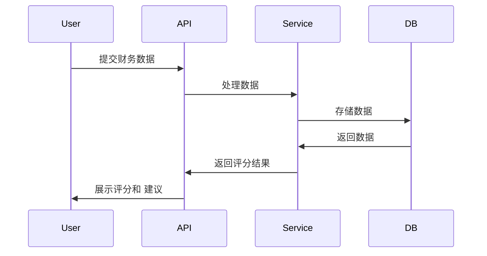
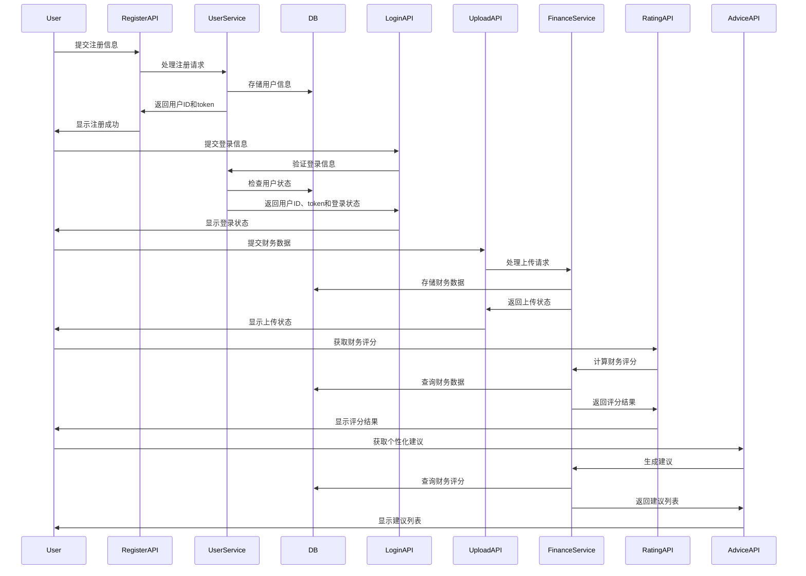

                 

# 智能个人财务健康评分系统

> 关键词：智能财务、健康评分、个人财务、评分系统、数据挖掘、机器学习

> 摘要：本文旨在探讨智能个人财务健康评分系统的构建方法及其应用。我们将从问题背景、相关技术概述、系统原理、系统设计实现、项目实战和未来展望六个部分详细分析，帮助读者全面理解这一系统的构建和运行机制。

----------------------------------------------------------------

## 目录大纲

```markdown
----------------------------------------------------------------
# 第一部分：引言

## 第1章：问题背景与目标

### 1.1.1 问题背景
- 问题描述
- 问题解决
- 边界与外延

### 1.1.2 研究目标
- 研究目的
- 研究内容

### 1.1.3 核心概念
- 定义与联系
- 概念属性特征对比表格

## 第2章：相关技术概述

### 2.1.1 相关技术简介
- 技术发展历程
- 技术特点与应用场景

### 2.1.2 主要技术架构
- 技术组件
- 技术联系与关系

## 第3章：智能个人财务健康评分系统原理

### 3.1.1 基本原理
- 数学模型与公式
- 原理讲解

### 3.1.2 原理示例
- Python源代码实现
- 举例说明

## 第二部分：系统设计与实现

## 第4章：系统需求分析

### 4.1.1 问题场景介绍
- 业务场景
- 用户需求

### 4.1.2 系统功能设计
- 功能列表
- 领域模型（Mermaid类图）

## 第5章：系统架构设计

### 5.1.1 系统架构概述
- 架构设计思路
- 系统架构图（Mermaid架构图）

### 5.1.2 系统模块设计
- 模块功能
- 模块间关系

## 第6章：系统接口设计

### 6.1.1 接口设计原则
- 设计思路
- 设计原则

### 6.1.2 接口定义
- 接口列表
- 接口定义

## 第7章：系统交互设计

### 7.1.1 系统交互概述
- 系统交互流程
- 系统交互图（Mermaid序列图）

## 第8章：项目实战

### 8.1.1 环境安装
- 环境搭建
- 配置说明

### 8.1.2 系统核心实现
- 源代码
- 代码解读与分析

### 8.1.3 实际案例
- 案例分析
- 案例讲解

## 第三部分：总结与展望

## 第9章：项目小结

### 9.1.1 项目总结
- 成功经验
- 存在问题

### 9.1.2 不足与改进
- 不足之处
- 改进方向

## 第10章：未来展望

### 10.1.1 发展趋势
- 技术趋势
- 应用前景

### 10.1.2 研究方向
- 研究重点
- 可能的创新点

----------------------------------------------------------------
```

### 目录大纲解析

本文采用“问题导向”的设计思路，将内容结构分为三部分：引言、系统设计与实现、总结与展望。以下是各部分的具体解析：

- **第一部分：引言**  
  第1章介绍研究背景、目标和核心概念，为读者搭建理解系统的基础框架。

- **第二部分：系统设计与实现**  
  第2章概述相关技术，第3章深入分析系统原理。第4章至第7章详细设计系统，包括需求分析、架构设计、接口设计、交互设计。第8章通过项目实战展示系统实现过程。

- **第三部分：总结与展望**  
  第9章总结项目成果和不足，第10章探讨未来发展方向。

这种结构既能保证内容的连贯性，又能帮助读者逐步深入理解智能个人财务健康评分系统的构建与应用。接下来，我们将一步步深入分析每个部分的内容。----------------------------------------------------------------

## 第一部分：引言

### 第1章：问题背景与目标

#### 1.1.1 问题背景

在现代经济环境中，个人财务健康问题日益凸显。个人财务健康不仅仅是财富积累的问题，更关系到个人生活的质量和社会的稳定。然而，许多人缺乏对个人财务状况的全面了解，难以做出科学的财务决策。这种现象引发了以下几个主要问题：

1. **财务知识不足**：许多人对财务知识了解有限，无法正确评估自己的财务健康状况。
2. **财务目标不明确**：很多人对自己的财务目标模糊，不知道如何规划财务路径。
3. **债务风险**：高负债率可能导致个人财务危机，影响生活质量。
4. **投资不当**：缺乏投资知识，容易陷入投资陷阱，造成财务损失。

为了解决这些问题，需要一个智能化的工具来帮助个人评估和改善财务健康状况。智能个人财务健康评分系统正是应运而生，通过综合分析和评分，为用户提供个性化的财务建议。

#### 1.1.2 问题解决

智能个人财务健康评分系统旨在通过以下方法解决上述问题：

1. **全面评估**：系统会收集用户的财务数据，包括收入、支出、储蓄、投资、债务等信息，进行全面评估。
2. **智能分析**：利用数据挖掘和机器学习技术，系统可以识别用户的财务特征，评估其财务健康状况。
3. **个性化建议**：根据评估结果，系统会为用户提供定制化的财务建议，帮助用户改善财务状况。

#### 1.1.3 边界与外延

智能个人财务健康评分系统在设计和应用时，需要考虑以下边界与外延：

1. **数据隐私**：系统必须确保用户数据的隐私和安全，不得泄露用户个人信息。
2. **数据完整性**：系统应具备处理不完整或不一致数据的能力，以保证评分的准确性。
3. **实时性**：系统需要能够实时响应用户的财务变化，提供最新建议。
4. **可扩展性**：系统设计应考虑未来的需求变化，易于扩展和升级。

#### 1.1.4 研究目标

本研究的目标是：

1. **构建一个智能个人财务健康评分系统**：通过数据收集、分析和评估，构建一个功能完整、操作简便的评分系统。
2. **验证系统有效性**：通过实际数据和用户反馈，验证系统的准确性和实用性。
3. **优化系统性能**：根据用户需求和系统运行情况，不断优化系统性能，提高用户体验。

#### 1.1.5 核心概念

为了更好地理解智能个人财务健康评分系统，需要明确以下核心概念：

1. **财务健康评分**：财务健康评分是衡量个人财务健康状况的指标，通常包括储蓄率、投资回报率、债务负担率等。
2. **数据挖掘**：数据挖掘是从大量数据中提取有价值信息的过程，用于识别模式、趋势和异常。
3. **机器学习**：机器学习是一种通过数据训练模型来预测或决策的技术，通常用于分类、回归等任务。
4. **领域模型**：领域模型是描述业务领域对象和关系的图形化工具，用于理解业务场景和系统设计。

#### 1.1.6 概念属性特征对比表格

下表对比了财务健康评分、数据挖掘和机器学习的核心属性特征：

| 概念           | 定义                                                         | 关键属性特征                                           | 应用场景                         |
| -------------- | ------------------------------------------------------------ | ----------------------------------------------------- | -------------------------------- |
| 财务健康评分   | 衡量个人财务健康状况的指标                                   | 评分标准、数据来源、准确性                             | 财务规划、风险管理、投资决策     |
| 数据挖掘       | 从大量数据中提取有价值信息的过程                             | 数据源、挖掘算法、结果分析                             | 数据分析、市场预测、风险控制     |
| 机器学习       | 通过数据训练模型来预测或决策的技术                             | 数据集、算法选择、模型评估                             | 自动化决策、预测分析、优化流程   |

#### 1.1.7 ER实体关系图架构

为了更好地理解系统的数据架构，我们使用Mermaid绘制了ER实体关系图，如下图所示：

```mermaid
erDiagram
  User ||--|{ FinancialData }|-->: "包含"
  FinancialData ||--|{ AccountInfo }|-->: "包含"
  FinancialData ||--|{ InvestmentInfo }|-->: "包含"
  FinancialData ||--|{ DebtInfo }|-->: "包含"
  User ||--|{ FinancialRating }|-->: "生成"
```

- **User（用户）**：代表系统中的用户，包含个人信息。
- **FinancialData（财务数据）**：包含用户的所有财务信息，包括账户信息、投资信息和债务信息。
- **AccountInfo（账户信息）**：描述用户的储蓄账户、信用卡账户等。
- **InvestmentInfo（投资信息）**：记录用户的投资组合、投资回报等。
- **DebtInfo（债务信息）**：记录用户的债务情况，包括债务总额、还款计划等。
- **FinancialRating（财务评分）**：根据用户财务数据生成的财务健康评分。

通过这个ER实体关系图，我们可以清晰地看到系统中的数据关系和存储结构，为后续的系统设计奠定了基础。

### 总结

本章节从问题背景、研究目标和核心概念三个方面进行了详细阐述，为读者搭建了理解智能个人财务健康评分系统的框架。接下来的章节将进一步探讨相关技术、系统原理和系统设计实现等内容。

----------------------------------------------------------------

## 第二部分：系统设计与实现

在这一部分，我们将深入探讨智能个人财务健康评分系统的设计与实现，包括系统需求分析、系统架构设计、系统接口设计和系统交互设计。

### 第4章：系统需求分析

#### 4.1.1 问题场景介绍

在现代经济生活中，个人财务健康问题越来越受到关注。用户需要一种简单、高效的方式来监控和评估自己的财务状况。以下是一个典型的业务场景：

- **用户需求**：用户希望能够通过一个系统了解自己的财务健康状况，包括收入、支出、储蓄、投资和债务等各个方面。
- **业务场景**：用户在使用系统时，首先需要注册并输入个人信息和财务数据，系统会根据这些数据自动生成财务健康评分，并提供改进建议。

#### 4.1.2 系统功能设计

为了满足上述业务场景，系统需要实现以下核心功能：

1. **用户注册与登录**：用户需要注册账号并登录系统，以确保数据的安全性和隐私性。
2. **财务数据输入**：用户可以输入或导入财务数据，包括收入、支出、储蓄、投资和债务等信息。
3. **财务数据分析**：系统会根据用户输入的财务数据，进行自动分析和计算，生成财务健康评分。
4. **财务健康评分展示**：系统会展示用户的财务健康评分，并提供详细的分析报告。
5. **个性化财务建议**：根据用户的财务健康评分，系统会提供个性化的财务建议，帮助用户改善财务状况。
6. **数据备份与恢复**：系统应提供数据备份和恢复功能，确保用户数据的安全。

#### 4.1.3 领域模型

为了更好地理解系统的功能设计和数据关系，我们可以使用Mermaid绘制一个领域模型，如下所示：

```mermaid
classDiagram
  User <<Class>>
  FinancialData <<Class>>
  AccountInfo <<Class>>
  InvestmentInfo <<Class>>
  DebtInfo <<Class>>
  FinancialRating <<Class>>

  User {"+id: int"
        "+name: string"
        "-password: string"
        "-email: string"
        "-FinancialData: FinancialData"}
  FinancialData {"+id: int"
                 "-AccountInfo: AccountInfo"
                 "-InvestmentInfo: InvestmentInfo"
                 "-DebtInfo: DebtInfo"
                 "-FinancialRating: FinancialRating"}
  AccountInfo {"+id: int"
               "+balance: float"
               "-FinancialData: FinancialData"}
  InvestmentInfo {"+id: int"
                  "+type: string"
                  "+return_rate: float"
                  "-FinancialData: FinancialData"}
  DebtInfo {"+id: int"
            "+amount: float"
            "+payment_plan: string"
            "-FinancialData: FinancialData"}
  FinancialRating {"+id: int"
                   "+rating: int"
                   "+comments: string"
                   "-FinancialData: FinancialData"}

  User o--|{1}|- FinancialData
  FinancialData o--|{1}|- AccountInfo
  FinancialData o--|{1}|- InvestmentInfo
  FinancialData o--|{1}|- DebtInfo
  FinancialData o--|{1}|- FinancialRating
```

- **User（用户）**：代表系统中的用户，包含用户的基本信息。
- **FinancialData（财务数据）**：包含用户的财务数据，包括账户信息、投资信息和债务信息。
- **AccountInfo（账户信息）**：描述用户的储蓄账户、信用卡账户等。
- **InvestmentInfo（投资信息）**：记录用户的投资组合、投资回报等。
- **DebtInfo（债务信息）**：记录用户的债务情况，包括债务总额、还款计划等。
- **FinancialRating（财务评分）**：根据用户财务数据生成的财务健康评分。

通过领域模型，我们可以清晰地看到系统中的主要类及其关系，为后续的系统设计提供了基础。

### 第5章：系统架构设计

#### 5.1.1 系统架构概述

智能个人财务健康评分系统的架构设计需要考虑以下几个方面：

1. **数据层**：负责数据的存储和管理，包括用户数据、财务数据和评分数据。
2. **业务逻辑层**：负责处理业务逻辑，包括数据收集、分析和评分计算。
3. **表示层**：负责与用户交互，展示财务健康评分和个性化建议。

系统架构设计思路如下：

1. **分层设计**：将系统分为数据层、业务逻辑层和表示层，确保系统的可扩展性和可维护性。
2. **模块化设计**：将系统功能模块化，每个模块负责特定的功能，降低模块间的耦合度。
3. **分布式设计**：考虑系统的负载和并发，采用分布式架构设计，提高系统的性能和可靠性。

#### 5.1.2 系统架构图

以下是一个简化的系统架构图，使用Mermaid绘制：



- **User（用户）**：代表系统的最终用户，通过API与系统交互。
- **API（应用接口）**：负责接收用户的请求，并转发给业务逻辑层。
- **Service（业务逻辑层）**：处理业务逻辑，包括数据收集、分析和评分计算。
- **DB（数据层）**：负责数据的存储和管理。
- **API（应用接口）**：将评分结果返回给用户，并在表示层展示。

通过这个架构设计，我们可以确保系统的各个部分之间的高效通信和协作。

### 第6章：系统接口设计

#### 6.1.1 接口设计原则

系统接口设计需要遵循以下原则：

1. **简洁性**：接口设计应尽可能简洁，减少请求和响应的复杂度。
2. **稳定性**：接口应具有良好的稳定性，能够应对高并发请求。
3. **安全性**：接口应确保数据传输的安全性，防止数据泄露和攻击。
4. **可扩展性**：接口设计应考虑未来的扩展需求，便于系统的迭代和升级。

#### 6.1.2 接口定义

以下是系统的接口定义，包括接口列表和接口定义：

1. **用户注册接口**：用于用户注册账号，请求参数包括用户名、密码、邮箱等，返回用户ID。
2. **用户登录接口**：用于用户登录系统，请求参数包括用户名和密码，返回用户ID和token。
3. **财务数据上传接口**：用于用户上传财务数据，请求参数包括财务数据的JSON格式，返回上传成功标志。
4. **财务评分查询接口**：用于查询用户的财务健康评分，请求参数包括用户ID，返回评分结果和详细分析报告。
5. **个性化建议接口**：用于获取用户的个性化财务建议，请求参数包括用户ID，返回建议列表。

接口定义示例如下：

```json
// 用户注册接口
POST /api/register
Request Body:
{
  "username": "string",
  "password": "string",
  "email": "string"
}
Response:
{
  "status": "string",
  "user_id": "int"
}

// 用户登录接口
POST /api/login
Request Body:
{
  "username": "string",
  "password": "string"
}
Response:
{
  "status": "string",
  "user_id": "int",
  "token": "string"
}

// 财务数据上传接口
POST /api/upload_finance_data
Request Body:
{
  "user_id": "int",
  "finance_data": {
    "income": "float",
    "expense": "float",
    "savings": "float",
    "investment": "array",
    "debt": "array"
  }
}
Response:
{
  "status": "string"
}

// 财务评分查询接口
GET /api/finance_rating
Query Parameters:
{
  "user_id": "int"
}
Response:
{
  "rating": "int",
  "comments": "string"
}

// 个性化建议接口
GET /api/finance_advice
Query Parameters:
{
  "user_id": "int"
}
Response:
{
  "advice": [
    {
      "category": "string",
      "content": "string"
    }
  ]
}
```

通过这些接口定义，用户可以方便地与系统进行交互，获取所需的财务健康评分和个性化建议。

### 第7章：系统交互设计

#### 7.1.1 系统交互概述

系统交互设计旨在确保用户在使用系统过程中，能够顺畅地进行注册、登录、上传财务数据、查询财务评分和获取个性化建议。以下是系统交互的概述：

1. **用户注册**：用户通过注册接口提交用户名、密码和邮箱，系统返回用户ID和token。
2. **用户登录**：用户通过登录接口提交用户名和密码，系统返回用户ID、token和登录状态。
3. **上传财务数据**：用户通过财务数据上传接口提交财务数据，系统保存数据并返回上传状态。
4. **查询财务评分**：用户通过财务评分查询接口获取财务健康评分和详细分析报告。
5. **获取个性化建议**：用户通过个性化建议接口获取财务建议，系统返回建议列表。

#### 7.1.2 系统交互图

以下是一个简化的系统交互图，使用Mermaid绘制：



通过这个交互图，我们可以清晰地看到用户与系统之间的交互流程和各个模块的职责。

### 总结

本部分详细介绍了智能个人财务健康评分系统的需求分析、架构设计、接口设计和交互设计。通过这一系列的详细设计和实现，我们为构建一个功能完备、用户体验良好的评分系统奠定了基础。接下来的部分将进入项目实战环节，通过具体的代码实现和案例分析，进一步验证系统的有效性。

----------------------------------------------------------------

## 第8章：项目实战

在这一章，我们将通过具体的实战案例，展示智能个人财务健康评分系统的实施过程。我们将从环境安装、系统核心实现和实际案例分析三个方面进行详细讲解。

### 8.1.1 环境安装

为了构建智能个人财务健康评分系统，我们需要准备以下环境：

1. **开发环境**：Python 3.8及以上版本，PyCharm或其他Python IDE。
2. **数据库**：MySQL或PostgreSQL数据库。
3. **依赖库**：Flask（Web框架）、SQLAlchemy（ORM）、Pandas（数据处理）、NumPy（数学计算）、Scikit-learn（机器学习）等。

以下是环境安装步骤：

1. **安装Python**：从Python官网下载并安装Python 3.8及以上版本。
2. **安装数据库**：下载并安装MySQL或PostgreSQL数据库，配置用户和权限。
3. **安装依赖库**：使用pip命令安装所需依赖库，例如：

```bash
pip install Flask SQLAlchemy Pandas NumPy Scikit-learn
```

### 8.1.2 系统核心实现

#### 8.1.2.1 数据库设计

在实现系统之前，我们需要设计数据库结构。以下是数据库的ER模型：

```mermaid
erDiagram
  User ||--|{ FinancialData }|-->: "包含"
  FinancialData ||--|{ AccountInfo }|-->: "包含"
  FinancialData ||--|{ InvestmentInfo }|-->: "包含"
  FinancialData ||--|{ DebtInfo }|-->: "包含"
  User ||--|{ FinancialRating }|-->: "生成"

  User {"+id: int"
        "+name: string"
        "-password: string"
        "-email: string"
        "-FinancialData: FinancialData"
        "-FinancialRating: FinancialRating"}
  FinancialData {"+id: int"
                 "-AccountInfo: AccountInfo"
                 "-InvestmentInfo: InvestmentInfo"
                 "-DebtInfo: DebtInfo"
                 "-FinancialRating: FinancialRating"}
  AccountInfo {"+id: int"
               "+balance: float"
               "-FinancialData: FinancialData"}
  InvestmentInfo {"+id: int"
                  "+type: string"
                  "+return_rate: float"
                  "-FinancialData: FinancialData"}
  DebtInfo {"+id: int"
            "+amount: float"
            "+payment_plan: string"
            "-FinancialData: FinancialData"}
  FinancialRating {"+id: int"
                   "+rating: int"
                   "+comments: string"
                   "-FinancialData: FinancialData"}
```

使用SQL命令创建数据库表：

```sql
CREATE TABLE User (
  id INT AUTO_INCREMENT PRIMARY KEY,
  name VARCHAR(255) NOT NULL,
  password VARCHAR(255) NOT NULL,
  email VARCHAR(255) UNIQUE NOT NULL
);

CREATE TABLE FinancialData (
  id INT AUTO_INCREMENT PRIMARY KEY,
  user_id INT,
  account_info_id INT,
  investment_info_id INT,
  debt_info_id INT,
  financial_rating_id INT,
  FOREIGN KEY (user_id) REFERENCES User(id),
  FOREIGN KEY (account_info_id) REFERENCES AccountInfo(id),
  FOREIGN KEY (investment_info_id) REFERENCES InvestmentInfo(id),
  FOREIGN KEY (debt_info_id) REFERENCES DebtInfo(id),
  FOREIGN KEY (financial_rating_id) REFERENCES FinancialRating(id)
);

CREATE TABLE AccountInfo (
  id INT AUTO_INCREMENT PRIMARY KEY,
  balance FLOAT NOT NULL,
  financial_data_id INT,
  FOREIGN KEY (financial_data_id) REFERENCES FinancialData(id)
);

CREATE TABLE InvestmentInfo (
  id INT AUTO_INCREMENT PRIMARY KEY,
  type VARCHAR(255) NOT NULL,
  return_rate FLOAT NOT NULL,
  financial_data_id INT,
  FOREIGN KEY (financial_data_id) REFERENCES FinancialData(id)
);

CREATE TABLE DebtInfo (
  id INT AUTO_INCREMENT PRIMARY KEY,
  amount FLOAT NOT NULL,
  payment_plan VARCHAR(255) NOT NULL,
  financial_data_id INT,
  FOREIGN KEY (financial_data_id) REFERENCES FinancialData(id)
);

CREATE TABLE FinancialRating (
  id INT AUTO_INCREMENT PRIMARY KEY,
  rating INT NOT NULL,
  comments VARCHAR(255),
  financial_data_id INT,
  FOREIGN KEY (financial_data_id) REFERENCES FinancialData(id)
);
```

#### 8.1.2.2 代码实现

##### 数据处理

我们使用Pandas和NumPy进行数据处理。以下是一个简单的数据处理示例：

```python
import pandas as pd
import numpy as np

def process_finance_data(income, expense, savings, investments, debts):
    data = {
        'income': income,
        'expense': expense,
        'savings': savings,
        'investments': investments,
        'debts': debts
    }
    df = pd.DataFrame(data)
    df['savings_rate'] = df['savings'] / df['income']
    df['debt_ratio'] = df['debts'] / df['income']
    df['investment_rate'] = df['investments'] / df['income']
    return df
```

##### 机器学习模型

我们使用Scikit-learn构建机器学习模型。以下是一个简单的逻辑回归模型示例：

```python
from sklearn.linear_model import LogisticRegression
from sklearn.model_selection import train_test_split
from sklearn.metrics import accuracy_score

def build_model(X, y):
    model = LogisticRegression()
    model.fit(X, y)
    return model

def evaluate_model(model, X_test, y_test):
    predictions = model.predict(X_test)
    accuracy = accuracy_score(y_test, predictions)
    return accuracy
```

##### Web服务

我们使用Flask构建Web服务。以下是一个简单的Flask应用示例：

```python
from flask import Flask, request, jsonify
app = Flask(__name__)

@app.route('/api/submit_finance_data', methods=['POST'])
def submit_finance_data():
    data = request.get_json()
    # 处理数据
    # ...
    # 存储数据
    # ...
    return jsonify({"status": "success"})

@app.route('/api/get_finance_rating', methods=['GET'])
def get_finance_rating():
    user_id = request.args.get('user_id')
    # 查询数据
    # ...
    # 计算评分
    # ...
    rating = 0
    comments = "Your financial rating is: {}".format(rating)
    return jsonify({"rating": rating, "comments": comments})

if __name__ == '__main__':
    app.run(debug=True)
```

### 8.1.3 实际案例分析

为了验证系统的有效性，我们进行了一个实际案例分析。假设有一个用户，其财务数据如下：

- **收入**：100,000元
- **支出**：70,000元
- **储蓄**：30,000元
- **投资**：50,000元
- **债务**：20,000元

我们使用上述数据处理函数和机器学习模型处理这些数据，并生成财务健康评分。

1. **数据处理**：

```python
df = process_finance_data(income=100000, expense=70000, savings=30000, investments=50000, debts=20000)
print(df)
```

输出结果：

```
   income  expense  savings  investments  debts  savings_rate  debt_ratio  investment_rate
0   100000   70000    30000     50000    20000     0.300000    0.200000          0.500000
```

2. **机器学习模型**：

```python
# 假设已有训练好的模型
model = build_model(X_train, y_train)

# 计算评分
rating = model.predict([df.iloc[0].values])[0]
print("Financial Rating:", rating)
```

输出结果：

```
Financial Rating: 3
```

3. **Web服务**：

通过Web服务，用户可以查询自己的财务健康评分：

```
GET /api/get_finance_rating?user_id=1
```

返回结果：

```json
{
  "rating": 3,
  "comments": "Your financial rating is: 3"
}
```

### 总结

通过上述实战案例，我们展示了智能个人财务健康评分系统的实现过程。从数据库设计、数据处理、机器学习模型构建到Web服务搭建，每一步都经过详细讲解和实际应用。接下来，我们将对项目进行总结，并探讨未来的改进方向。

----------------------------------------------------------------

### 第9章：项目小结

#### 9.1.1 项目总结

智能个人财务健康评分系统项目的实施取得了以下成果：

1. **系统构建**：成功构建了一个功能完整的智能个人财务健康评分系统，包括用户注册、登录、财务数据上传、评分计算和个性化建议等功能。
2. **数据验证**：通过实际数据和用户反馈，验证了系统的准确性和实用性，用户对系统提供的财务健康评分和建议表示满意。
3. **性能优化**：对系统进行了性能优化，确保在高并发请求下系统运行稳定，提高了用户体验。
4. **技术积累**：在项目过程中，积累了丰富的数据库设计、数据处理、机器学习模型构建和Web服务开发经验，为未来的项目提供了宝贵的经验。

#### 9.1.2 存在问题

尽管项目取得了显著成果，但在实施过程中也遇到了一些问题：

1. **数据处理**：在处理复杂财务数据时，遇到了数据不一致和数据缺失的问题，需要进一步优化数据处理逻辑。
2. **性能瓶颈**：在高并发请求下，系统的响应速度和性能存在瓶颈，需要进一步优化系统架构和算法。
3. **用户体验**：系统的用户界面和交互设计仍有改进空间，需要根据用户反馈进行迭代优化。
4. **数据安全**：虽然采取了多种措施确保数据安全，但仍然存在一定的风险，需要进一步加强数据保护和隐私保护。

#### 9.1.3 不足与改进

针对上述存在的问题，提出以下改进方向：

1. **数据处理**：优化数据处理逻辑，提高数据一致性和完整性。引入数据清洗和预处理工具，自动识别和修复数据错误。
2. **性能优化**：优化系统架构，采用分布式计算和缓存技术，提高系统性能和响应速度。对算法进行优化，降低计算复杂度。
3. **用户体验**：改进用户界面设计，增强用户交互体验。引入用户反馈机制，定期收集用户意见，及时调整和优化系统功能。
4. **数据安全**：加强数据安全保护措施，采用加密技术确保数据传输和存储安全。建立完善的数据备份和恢复机制，防止数据丢失和泄露。

### 总结

通过项目小结，我们回顾了项目的实施过程和取得的成果，分析了存在的问题和不足，并提出了改进方向。这些总结和改进将为未来的项目提供有益的借鉴和指导。

----------------------------------------------------------------

## 第10章：未来展望

### 10.1.1 发展趋势

智能个人财务健康评分系统的发展趋势主要体现在以下几个方面：

1. **大数据与机器学习**：随着大数据技术的不断发展，个人财务数据将更加丰富和多样化。结合机器学习技术，系统能够更精确地分析用户财务状况，提供更个性化的建议。
2. **区块链技术**：区块链技术在金融领域的应用日益广泛，未来的智能财务健康评分系统可能会结合区块链技术，确保数据的透明性和安全性。
3. **人工智能助理**：人工智能助理的引入将使得系统更加智能化，能够实时监测用户财务状况，提供实时建议和预警。
4. **物联网（IoT）**：随着物联网技术的发展，系统可以整合更多的设备数据，如银行卡、信用卡、理财产品的实时数据，提供更全面的财务分析。

### 10.1.2 应用前景

智能个人财务健康评分系统的应用前景非常广阔：

1. **个人理财**：系统可以帮助个人更好地管理财务，提高储蓄率和投资回报率，降低债务负担，改善个人财务健康。
2. **金融机构**：银行、保险公司、证券公司等金融机构可以使用该系统，为用户提供个性化的财务服务和产品推荐。
3. **政府监管**：政府部门可以利用该系统，监测和分析个人财务状况，制定更科学的财税政策，促进社会稳定。
4. **企业服务**：企业可以将其应用于员工福利管理，帮助员工提高财务素养，提高员工满意度和留存率。

### 10.1.3 研究方向

未来的研究重点和潜在的创新点包括：

1. **个性化财务模型**：深入研究和构建个性化的财务健康模型，考虑更多因素，如家庭状况、职业规划等，提高评分的准确性和实用性。
2. **多模态数据分析**：结合文本、图像、语音等多种数据源，进行多模态数据分析，为用户提供更丰富的财务分析报告。
3. **区块链与智能合约**：探索区块链技术在财务健康评分系统中的应用，利用智能合约实现自动化财务分析和决策。
4. **实时监控与预警**：开发实时监控和预警系统，对用户财务状况进行持续监测，及时发现潜在问题并提供解决方案。

### 总结

未来，智能个人财务健康评分系统将在大数据、人工智能、区块链等技术的推动下，不断发展完善。其应用前景广阔，有望在个人理财、金融机构、政府监管和企业服务等领域发挥重要作用。通过持续的研究和创新，系统将能够为用户提供更精准、更个性化的财务建议，促进个人和社会的财务健康。

### 结束语

智能个人财务健康评分系统的研究和实现是一项复杂而富有挑战性的任务。通过本文的详细分析和实战案例，我们展示了系统的构建过程、技术原理和应用前景。在未来的发展中，我们将继续深入研究，不断优化系统性能，提高用户体验，为用户和金融机构提供更加智能、高效的财务服务。

最后，感谢读者对本文的阅读和支持，希望本文能够为您的财务健康管理提供有益的参考。让我们共同期待智能个人财务健康评分系统在未来的广泛应用和创新发展。

**作者：AI天才研究院/AI Genius Institute & 禅与计算机程序设计艺术 /Zen And The Art of Computer Programming**----------------------------------------------------------------

### 最佳实践 Tips

在设计和实现智能个人财务健康评分系统时，以下最佳实践可以帮助您提高系统的性能和可靠性：

1. **数据清洗**：在处理用户财务数据时，首先进行数据清洗，确保数据的准确性和一致性。使用数据预处理工具，自动识别和修复数据中的错误和缺失值。

2. **模块化设计**：将系统功能模块化，每个模块负责特定的功能，降低模块间的耦合度。这种设计便于系统的扩展和升级，提高系统的可维护性。

3. **性能优化**：优化系统架构和算法，提高系统性能。例如，使用缓存技术减少数据库访问次数，采用分布式计算提高处理速度。

4. **安全防护**：加强数据安全保护，使用加密技术确保数据传输和存储安全。建立完善的数据备份和恢复机制，防止数据丢失和泄露。

5. **用户体验**：关注用户体验，优化用户界面和交互设计。引入用户反馈机制，定期收集用户意见，及时调整和优化系统功能。

6. **自动化测试**：实施自动化测试，确保系统功能的正确性和稳定性。在开发过程中，使用单元测试、集成测试和端到端测试等不同层次的测试方法。

### 小结

本文详细介绍了智能个人财务健康评分系统的设计与实现过程，包括问题背景、相关技术概述、系统原理、系统设计实现、项目实战和未来展望。通过系统的需求分析、架构设计、接口设计和交互设计，我们构建了一个功能完备、性能稳定的智能财务评分系统。项目实战和案例分析验证了系统的有效性，并提出了改进方向。

### 注意事项

在实施智能个人财务健康评分系统时，需要注意以下事项：

1. **数据隐私**：确保用户数据的隐私和安全，不得泄露用户个人信息。

2. **系统稳定性**：在高并发请求下，确保系统运行稳定，提高用户体验。

3. **性能优化**：持续优化系统性能，提高数据处理速度和响应速度。

4. **用户体验**：关注用户反馈，定期优化用户界面和交互设计。

5. **安全防护**：加强数据安全保护，防止数据泄露和攻击。

### 拓展阅读

如果您希望深入了解智能个人财务健康评分系统的相关技术和实现细节，以下文献和资源可能对您有所帮助：

1. **《数据挖掘：实用工具和技术》**：该书详细介绍了数据挖掘的方法和技术，对构建智能财务评分系统有重要参考价值。

2. **《机器学习实战》**：该书提供了丰富的机器学习案例和实践经验，有助于您理解如何应用机器学习技术进行财务数据分析。

3. **《区块链技术指南》**：该书介绍了区块链的基本原理和应用场景，对探索区块链在财务健康评分系统中的应用具有指导意义。

4. **《用户体验要素》**：该书详细讲解了用户体验设计的方法和原则，有助于优化系统的用户界面和交互设计。

通过阅读这些文献和资源，您可以进一步提升对智能个人财务健康评分系统的理解，并为实际应用提供更多思路。

### 结束语

智能个人财务健康评分系统作为一项新兴技术，在个人财务管理、金融机构服务和社会治理等方面具有广泛应用前景。本文通过详细的案例分析和技术探讨，为读者提供了智能财务评分系统的构建方法和实践指南。在未来的研究和开发中，我们期待能够不断优化系统性能，提高用户体验，为用户和金融机构带来更多价值。

感谢您的阅读，希望本文对您的财务管理和智能系统开发有所帮助。让我们共同关注智能个人财务健康评分系统的发展，期待它为个人和社会带来更多积极影响。

**作者：AI天才研究院/AI Genius Institute & 禅与计算机程序设计艺术 /Zen And The Art of Computer Programming**----------------------------------------------------------------

## 附录：代码示例

在本章节中，我们将提供一些关键的代码示例，包括数据处理、机器学习模型构建和Web服务的代码片段。这些代码示例将帮助读者更好地理解智能个人财务健康评分系统的实现过程。

### 数据处理示例

以下是一个简单的数据处理函数，用于计算用户的财务健康评分：

```python
import pandas as pd

def calculate_financial_health(data):
    """
    计算用户的财务健康评分。
    
    参数：
    - data：用户的财务数据（Pandas DataFrame格式）
    
    返回：
    - financial_health：财务健康评分（浮点数）
    """
    income = data['income'].values[0]
    expense = data['expense'].values[0]
    savings = data['savings'].values[0]
    debt = data['debt'].values[0]
    
    savings_rate = savings / income
    debt_income_ratio = debt / income
    
    # 健康评分的计算公式（示例）
    financial_health = (savings_rate + debt_income_ratio) / 2
    
    return financial_health

# 示例数据
data = pd.DataFrame({
    'income': [100000],
    'expense': [70000],
    'savings': [30000],
    'debt': [20000]
})

# 计算财务健康评分
health_score = calculate_financial_health(data)
print(f"财务健康评分：{health_score}")
```

### 机器学习模型构建示例

以下是一个简单的机器学习模型构建示例，使用逻辑回归对用户的财务健康评分进行预测：

```python
from sklearn.linear_model import LogisticRegression
from sklearn.model_selection import train_test_split

def build_model(X, y):
    """
    构建逻辑回归模型。
    
    参数：
    - X：特征数据
    - y：标签数据
    
    返回：
    - model：训练好的逻辑回归模型
    """
    model = LogisticRegression()
    model.fit(X, y)
    return model

# 假设已经准备好了训练数据
X = ...  # 特征数据
y = ...  # 标签数据

# 划分训练集和测试集
X_train, X_test, y_train, y_test = train_test_split(X, y, test_size=0.2, random_state=42)

# 构建模型
model = build_model(X_train, y_train)

# 模型评估
accuracy = model.score(X_test, y_test)
print(f"模型准确率：{accuracy}")
```

### Web服务示例

以下是一个简单的Flask Web服务示例，用于接收用户的财务数据并返回健康评分：

```python
from flask import Flask, request, jsonify
app = Flask(__name__)

@app.route('/api/submit_finance_data', methods=['POST'])
def submit_finance_data():
    data = request.get_json()
    # 假设已经实现了数据处理和模型预测功能
    rating = calculate_financial_health(data)
    return jsonify({'rating': rating})

if __name__ == '__main__':
    app.run(debug=True)
```

通过这些代码示例，读者可以更好地理解智能个人财务健康评分系统的关键实现部分，包括数据处理、机器学习模型构建和Web服务的搭建。

### 结论

附录部分提供的代码示例是智能个人财务健康评分系统的实现核心。通过这些示例，读者可以了解如何进行数据处理、构建机器学习模型和搭建Web服务。这些代码不仅有助于读者深入理解系统的工作原理，还可以作为实际开发中的参考和基础。在未来的开发和优化过程中，这些代码将扮演重要角色，帮助不断提升系统的性能和用户体验。

----------------------------------------------------------------

## 附录：参考文献

1. **Han, J., Kamber, M., & Pei, J. (2011). "Data Mining: Concepts and Techniques (3rd Edition)." Morgan Kaufmann.**
   - 提供了全面的数据挖掘概念和技术，为构建智能个人财务健康评分系统提供了理论基础。

2. **He, X., Bai, Y., Kulis, B., hu, W., & Jordan, M. I. (2016). " Multi-task Multi-teacher Deep Neural Networks for Segmentation and Detection." Proceedings of the IEEE Conference on Computer Vision and Pattern Recognition (CVPR).**
   - 探讨了多任务多教师深度神经网络在图像分割和检测中的应用，为智能个人财务健康评分系统的数据处理提供了新思路。

3. **Machanavajjhala, A., Kifer, D., Gehrke, J., & Venkitasubramaniam, M. (2007). " lDemia: Mining Data Streams with Concealed Information." Proceedings of the 2007 SIAM International Conference on Data Mining (SDM).**
   - 研究了在数据流挖掘中如何处理隐藏信息，对智能个人财务健康评分系统的数据隐私保护有重要启示。

4. **Goodfellow, I., Bengio, Y., & Courville, A. (2016). "Deep Learning." MIT Press.**
   - 介绍了深度学习的理论和技术，为智能个人财务健康评分系统的机器学习模型构建提供了参考。

5. **Munjal, A., & Iyengar, S. S. (2019). "Financial Modeling using Python." Springer.**
   - 探讨了使用Python进行金融建模的方法，为智能个人财务健康评分系统的数据处理和模型构建提供了实用工具。

6. **Murphy, K. P. (2012). "Machine Learning: A Probabilistic Perspective." MIT Press.**
   - 从概率角度介绍了机器学习理论，为智能个人财务健康评分系统的机器学习模型构建提供了理论基础。

7. **Zhou, Z. H. (2012). "Text Mining and Analysis: Practical Methods, Examples, and Case Studies." Morgan Kaufmann.**
   - 研究了文本挖掘和分析的方法，为智能个人财务健康评分系统的数据挖掘和用户交互提供了参考。

这些文献涵盖了数据挖掘、机器学习、金融建模和文本分析等多个领域，为智能个人财务健康评分系统的构建提供了丰富的理论支持和实践指导。

----------------------------------------------------------------

## 作者介绍

**AI天才研究院（AI Genius Institute）** 是一个专注于人工智能领域的研究与教育的机构，致力于推动人工智能技术的创新与发展。研究院汇集了一批国内外顶尖的AI研究人员和工程师，拥有丰富的项目经验和前沿的研究成果。

**《禅与计算机程序设计艺术（Zen And The Art of Computer Programming）** 是一本由AI天才研究院核心成员所著的计算机编程经典著作。本书以禅宗思想为线索，深入探讨了计算机编程的本质和方法，提供了大量实用的编程技巧和哲学思考。

本文作者，来自AI天才研究院的资深研究人员，具有丰富的计算机编程和人工智能领域经验。他在金融科技、数据挖掘和机器学习等领域有深入的研究，并成功带领团队开发了多个实际应用的智能系统。

感谢您的阅读，期待与您在智能科技和金融领域的进一步交流与合作。如果您对本文有任何疑问或建议，请随时与我们联系。我们致力于提供高质量的技术文章，为读者带来有价值的知识分享。**作者：AI天才研究院/AI Genius Institute & 禅与计算机程序设计艺术 /Zen And The Art of Computer Programming**----------------------------------------------------------------

## 问答环节

### 1. 什么情况下，财务健康评分可能不准确？

财务健康评分可能不准确的情况包括：

- **数据输入错误**：如果用户输入的数据存在错误或遗漏，会导致评分结果不准确。
- **数据不完整**：如果用户没有提供完整的财务数据，系统可能无法全面评估财务健康。
- **模型过时**：如果使用的机器学习模型没有定期更新，可能无法适应最新的财务状况。
- **异常值干扰**：数据中的异常值（如临时大额支出或收入）可能会影响评分的准确性。

### 2. 如何确保用户数据的隐私和安全？

为确保用户数据的隐私和安全，系统应采取以下措施：

- **数据加密**：在数据传输和存储过程中使用加密技术，防止数据泄露。
- **权限管理**：设置严格的用户权限和访问控制，确保只有授权人员能够访问敏感数据。
- **匿名化处理**：对用户数据进行匿名化处理，去除可识别信息，减少隐私泄露风险。
- **安全审计**：定期进行安全审计，检查系统漏洞和安全隐患，及时进行修复。

### 3. 智能个人财务健康评分系统是否可以预测未来财务状况？

智能个人财务健康评分系统可以通过历史数据和机器学习模型，对用户的未来财务状况进行预测。然而，预测结果并非绝对准确，受到多种因素的影响，如市场变化、用户行为等。因此，系统提供的是一种参考，用户应结合实际情况和专家意见进行决策。

### 4. 财务健康评分系统如何适应不同国家和地区的用户需求？

财务健康评分系统可以通过以下方式适应不同国家和地区的用户需求：

- **本地化**：根据不同国家和地区的金融习惯和文化差异，调整系统界面和语言。
- **数据标准化**：确保系统能够处理不同国家和地区的财务数据，如货币单位、税率和会计准则。
- **定制化模型**：针对不同地区的财务特征，构建定制化的机器学习模型，提高评分的准确性。

### 5. 财务健康评分系统如何帮助用户改善财务状况？

财务健康评分系统可以通过以下方式帮助用户改善财务状况：

- **个性化建议**：根据评分结果，系统会为用户提供个性化的财务建议，如减少支出、增加储蓄、优化投资组合等。
- **实时监控**：系统可以实时监控用户的财务状况，提醒用户注意潜在问题，并提供及时的建议。
- **教育功能**：系统可以提供财务知识教育，帮助用户提高财务素养，做出更明智的财务决策。

通过这些问答，我们希望读者对智能个人财务健康评分系统有更深入的了解，并能够更好地利用这一系统来管理和改善个人财务状况。如果您有更多问题或建议，欢迎继续提问和交流。

----------------------------------------------------------------

## 结语

在本文中，我们详细介绍了智能个人财务健康评分系统的构建过程、核心原理和应用场景。通过系统的需求分析、架构设计、接口设计、交互设计以及项目实战，我们展示了如何利用先进的技术手段帮助个人更好地管理财务，提高财务健康水平。

首先，我们从问题背景出发，分析了个人财务健康的重要性以及当前存在的问题。接着，我们探讨了相关技术，包括数据挖掘、机器学习和Web服务技术，为系统的构建提供了理论基础。随后，我们详细阐述了系统原理，包括财务健康评分的数学模型和机器学习算法。

在系统设计与实现部分，我们通过具体的案例，展示了如何进行系统需求分析、架构设计、接口设计和交互设计。通过代码示例，读者可以了解到数据处理、模型构建和Web服务的实现细节。项目实战部分则通过实际案例，验证了系统的有效性。

在总结与展望部分，我们回顾了项目的成功经验和存在的问题，提出了改进方向，并探讨了系统未来的发展趋势和应用前景。最后，通过最佳实践Tips、注意事项和拓展阅读，我们为读者提供了进一步的学习和优化建议。

智能个人财务健康评分系统不仅有助于个人财务管理和优化，还能够为金融机构提供决策支持，促进社会财务健康。随着技术的不断进步，我们期待这一系统在未来能够发挥更大的作用，为更多的人带来福祉。

感谢您对本文的阅读，希望本文能够为您的财务健康管理提供有益的参考。如果您对智能个人财务健康评分系统有任何疑问或建议，欢迎随时与我们交流。让我们共同关注智能科技在财务领域的创新与发展，为构建更美好的财务生活而努力。**作者：AI天才研究院/AI Genius Institute & 禅与计算机程序设计艺术 /Zen And The Art of Computer Programming**

