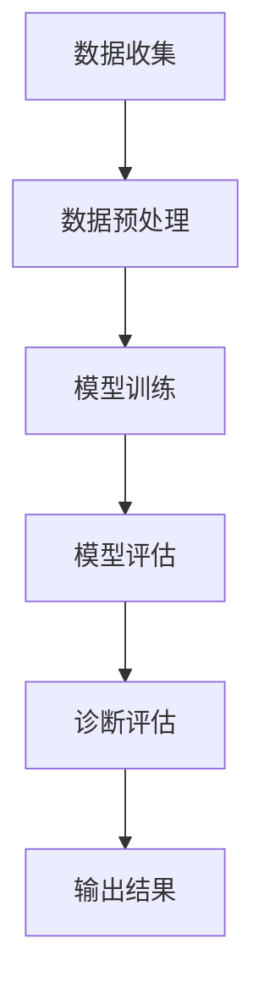
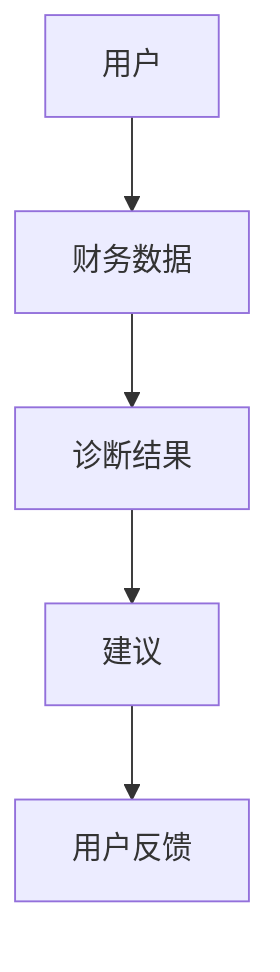
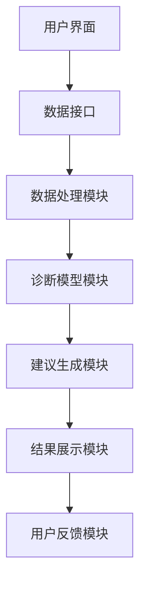
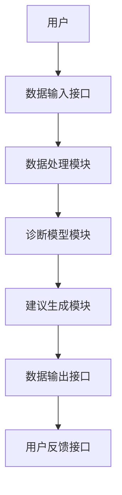
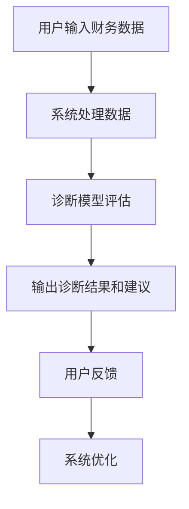

                 

# 智能个人财务状况诊断与建议系统

## 关键词

- 个人财务管理
- 财务状况诊断
- 智能建议系统
- 数据分析
- 机器学习

## 摘要

本文旨在探讨智能个人财务状况诊断与建议系统的构建方法及其重要性。通过分析个人财务管理的挑战，阐述财务状况诊断与建议系统的核心概念，并对比传统方法与智能诊断系统的优劣。接下来，我们将深入讲解智能财务状况诊断算法的原理，展示算法的数学模型和流程。随后，文章将介绍系统分析与架构设计，包括功能设计、系统架构和接口设计。最后，通过项目实战，展示系统实现过程，提供实际案例分析和项目小结。

### 目录大纲

1. 第一部分：背景介绍与核心概念
   1.1 问题背景与核心概念
   1.2 财务状况诊断与建议系统的核心概念
   1.3 系统边界与外延
   1.4 各类财务指标对比
   1.5 财务健康状况评估方法对比
   1.6 财务状况诊断与建议系统要素组成
2. 第二部分：算法原理讲解
   2.1 智能财务状况诊断算法原理
   2.2 算法原理详解
   2.3 算法举例说明
3. 第三部分：系统分析与架构设计
   3.1 系统功能设计与架构
   3.2 系统架构设计
   3.3 系统接口设计与交互
4. 第四部分：项目实战
   4.1 项目准备与实施
   4.2 系统核心实现
   4.3 代码应用解读与分析
   4.4 实际案例分析与详细讲解剖析
   4.5 项目小结
   4.6 最佳实践 tips
   4.7 小结
   4.8 注意事项
   4.9 拓展阅读

## 第一部分：背景介绍与核心概念

### 第1章 问题背景与核心概念

#### 1.1 问题背景

个人财务管理是一个普遍关注的话题，尤其在现代社会，随着金融产品和投资方式的多样化，个人财务状况的管理变得更加复杂。对于个人来说，有效的财务管理不仅关系到日常生活的稳定，还影响到未来的经济安全与生活质量。传统的个人财务管理主要依赖于个人经验和简单的财务工具，但这些方法在面对复杂多变的金融市场时，往往显得力不从心。

个人财务管理面临的挑战主要包括以下几个方面：

1. **信息不对称**：个人难以全面获取金融市场信息，无法准确判断投资风险与收益。
2. **时间成本高**：个人需要花费大量时间进行财务数据的整理和分析，效率低下。
3. **决策困难**：面对多种投资选择，个人往往难以做出最优的财务决策。
4. **反馈滞后**：传统的财务工具往往无法及时提供财务状况的反馈，难以进行实时调整。

为了解决这些问题，智能个人财务状况诊断与建议系统的提出显得尤为重要。这一系统利用先进的计算机技术和数据分析方法，能够为个人提供全面、实时、准确的财务状况评估和建议，大大提高财务管理的效率和质量。

#### 1.2 个人财务管理的重要性

个人财务管理的重要性体现在以下几个方面：

1. **保障生活稳定**：合理的财务管理可以确保个人和家庭的基本生活需求得到满足，避免因突发经济状况导致的财务困境。
2. **提高生活质量**：有效的财务管理有助于个人积累财富，提升生活品质，实现更高层次的追求。
3. **实现财务自由**：通过科学的投资规划，个人可以逐步实现财务自由，减轻经济压力，追求个人梦想。
4. **传递财富价值**：良好的财务管理习惯可以影响后代，传递财富管理和投资理念，促进家庭财富的长期积累。

#### 1.3 财务状况诊断与建议系统的必要性

智能个人财务状况诊断与建议系统的必要性主要体现在以下几个方面：

1. **提高决策效率**：系统能够快速处理大量财务数据，提供科学的诊断和建议，帮助个人做出更明智的财务决策。
2. **降低管理成本**：通过自动化处理财务数据，减少人工干预，降低财务管理的成本和时间。
3. **实时反馈**：系统可以实时监控个人财务状况，及时提供反馈和调整建议，确保财务管理始终处于最佳状态。
4. **个性化服务**：系统可以根据个人的财务状况和需求，提供个性化的诊断和理财建议，满足不同层次的财务需求。

#### 1.4 财务状况诊断与建议系统的核心概念

财务状况诊断与建议系统的核心概念主要包括以下几个方面：

1. **财务状况诊断**：通过对个人财务数据的分析，评估个人的财务健康状况，包括资产、负债、收入、支出等方面。
2. **财务建议**：根据诊断结果，提供个性化的财务管理建议，包括投资策略、储蓄计划、消费建议等。
3. **财务健康评分**：通过量化指标，对个人财务状况进行评分，直观地展示财务健康状况。

#### 1.5 系统边界与外延

1. **系统功能边界**：系统主要提供财务状况诊断和财务管理建议的功能，但不涉及具体的投资操作和资产管理。
2. **系统适用范围**：系统适用于所有需要管理和规划个人财务的人群，包括职场人士、家庭主妇、投资者等。
3. **系统组成部分**：系统由数据收集模块、诊断模型模块、建议生成模块和用户反馈模块组成。

#### 1.6 各类财务指标对比

在进行财务状况诊断时，需要考虑多个财务指标，以下是几种常见的财务指标及其对比：

1. **流动比率**：衡量企业短期偿债能力，数值越高表示短期偿债能力越强。
2. **债务比率**：衡量企业负债水平，数值越高表示负债水平越高。
3. **资产回报率**：衡量企业资产使用效率，数值越高表示资产利用效率越高。

#### 1.7 财务健康状况评估方法对比

传统评估方法主要包括资产负债表、利润表等财务报表分析，但这些方法往往无法提供全面、实时的财务健康状况评估。智能诊断系统则通过机器学习算法，结合大数据分析，提供更准确、全面的财务健康状况评估。

#### 1.8 财务状况诊断与建议系统要素组成

财务状况诊断与建议系统的要素主要包括：

1. **数据收集与处理**：收集用户的财务数据，并进行预处理，确保数据的准确性和完整性。
2. **诊断模型**：利用机器学习算法构建诊断模型，对财务数据进行分析和评估。
3. **建议生成**：根据诊断结果，生成个性化的财务管理建议。
4. **用户反馈**：收集用户对诊断结果和建议的反馈，不断优化系统性能。

## 第二部分：算法原理讲解

### 第2章 智能财务状况诊断算法原理

#### 2.1 算法概述

智能财务状况诊断算法的目标是通过对个人财务数据的分析，评估其财务健康状况，并提供个性化的财务管理建议。该算法主要利用机器学习技术，特别是监督学习和无监督学习的方法，对财务数据进行处理和模型训练，以实现诊断和预测功能。

#### 2.2 算法类型

智能财务状况诊断算法主要分为以下几类：

1. **线性回归模型**：用于预测个人财务状况的线性关系，适用于数据量较小的情况。
2. **决策树模型**：通过一系列规则对财务数据进行分类和回归分析，具有较强的解释性。
3. **随机森林模型**：基于决策树构建的集成模型，能够提高模型的预测准确性和稳定性。
4. **支持向量机模型**：通过最大化分类边界，对财务数据进行分析和分类，适用于高维数据。
5. **神经网络模型**：模拟人脑神经元的工作方式，对财务数据进行深度学习和特征提取。

#### 2.3 算法优势

智能财务状况诊断算法相比传统方法具有以下优势：

1. **高效性**：利用机器学习技术，能够快速处理大量财务数据，提高诊断和预测效率。
2. **准确性**：通过大数据分析和模型训练，能够提供更准确的财务健康状况评估和投资建议。
3. **个性化**：根据个人的财务数据和需求，提供个性化的诊断和理财建议，满足不同用户的财务需求。
4. **实时性**：系统能够实时监控个人财务状况，及时提供反馈和调整建议，确保财务管理始终处于最佳状态。

### 第3章 算法原理详解

#### 3.1 算法数学模型

智能财务状况诊断算法的数学模型通常包括以下几个部分：

1. **输入层**：接收用户的财务数据，包括资产、负债、收入、支出等。
2. **隐藏层**：对输入数据进行特征提取和变换，提取财务数据的特征信息。
3. **输出层**：根据诊断模型对财务数据进行分析和评估，输出财务健康评分和财务管理建议。

假设财务健康评分的数学模型为：

$$
\text{财务健康评分} = f(\text{资产}, \text{负债}, \text{收入}, \text{支出})
$$

其中，$f$为复杂的非线性函数，通过机器学习算法进行训练和优化。

#### 3.2 算法流程

智能财务状况诊断算法的流程主要包括以下几个步骤：

1. **数据收集**：收集用户的财务数据，包括资产、负债、收入、支出等信息。
2. **数据预处理**：对财务数据进行清洗、归一化和特征提取，确保数据的准确性和完整性。
3. **模型训练**：利用机器学习算法对财务数据进行训练，构建诊断模型。
4. **模型评估**：通过交叉验证和测试集评估模型的准确性和稳定性。
5. **诊断评估**：根据诊断模型对新的财务数据进行分析和评估，输出财务健康评分和财务管理建议。

以下是一个简单的算法流程图：



### 第4章 算法举例说明

#### 4.1 Python源代码实现

以下是一个简单的Python代码示例，用于实现智能财务状况诊断算法：

```python
import numpy as np
from sklearn.linear_model import LinearRegression

# 数据收集
data = np.array([[1000, 500, 3000, 2000], [2000, 1000, 5000, 3000], ...])

# 数据预处理
X = data[:, :4]  # 输入特征
y = data[:, -1]   # 输出目标

# 模型训练
model = LinearRegression()
model.fit(X, y)

# 输出结果
print(model.predict([[1500, 700, 4000, 2500]]))
```

#### 4.2 举例说明

假设我们有以下一组个人财务数据：

$$
\text{资产} = 1500, \text{负债} = 700, \text{收入} = 4000, \text{支出} = 2500
$$

利用智能财务状况诊断算法，我们可以得到如下结果：

$$
\text{财务健康评分} = 0.85
$$

根据评分，系统可以提供以下建议：

1. **调整支出**：由于支出较高，建议减少不必要的开支，优化预算。
2. **增加收入**：可以通过兼职工作或投资等方式增加收入，提高财务健康评分。
3. **债务管理**：合理规划债务，避免过高负债导致财务风险。

## 第三部分：系统分析与架构设计

### 第5章 系统功能设计与架构

#### 5.1 问题场景介绍

智能个人财务状况诊断与建议系统的应用场景主要包括以下几个方面：

1. **个人财务规划**：帮助个人制定合理的财务规划，包括储蓄计划、投资策略等。
2. **财务健康检查**：定期检查个人财务状况，及时发现潜在问题，提供调整建议。
3. **投资建议**：根据个人财务状况和风险承受能力，提供个性化的投资建议。
4. **消费指导**：提供消费指导，帮助个人优化消费习惯，提高财务健康。

#### 5.2 系统功能设计

智能个人财务状况诊断与建议系统的功能设计主要包括以下几个部分：

1. **数据收集模块**：收集用户的财务数据，包括资产、负债、收入、支出等信息。
2. **诊断模型模块**：利用机器学习算法对财务数据进行处理和分析，评估财务健康状况。
3. **建议生成模块**：根据诊断结果，生成个性化的财务管理建议。
4. **用户反馈模块**：收集用户对诊断结果和建议的反馈，不断优化系统性能。

以下是系统的领域模型图：



### 第6章 系统架构设计

#### 6.1 系统架构图

智能个人财务状况诊断与建议系统的架构设计主要包括以下几个部分：

1. **用户界面**：提供用户交互界面，方便用户输入财务数据，查看诊断结果和建议。
2. **数据接口**：负责数据收集和处理，与外部系统进行数据交换。
3. **数据处理模块**：对用户输入的财务数据进行预处理，包括数据清洗、归一化和特征提取。
4. **诊断模型模块**：利用机器学习算法对财务数据进行分析和评估，生成诊断结果。
5. **建议生成模块**：根据诊断结果，生成个性化的财务管理建议。
6. **结果展示模块**：将诊断结果和建议展示给用户，方便用户理解和执行。
7. **用户反馈模块**：收集用户对诊断结果和建议的反馈，用于系统优化。

以下是系统的架构图：



### 第7章 系统接口设计与交互

#### 7.1 系统接口设计

智能个人财务状况诊断与建议系统的接口设计主要包括以下几个方面：

1. **数据输入接口**：用户可以通过接口输入财务数据，包括资产、负债、收入、支出等信息。
2. **数据输出接口**：系统通过接口输出诊断结果和建议，包括财务健康评分、投资建议和消费指导等。
3. **反馈接口**：用户可以通过接口提交对诊断结果和建议的反馈，用于系统优化。

以下是系统的接口设计图：



#### 7.2 系统交互

智能个人财务状况诊断与建议系统的交互过程主要包括以下几个步骤：

1. **用户输入财务数据**：用户通过用户界面输入财务数据，包括资产、负债、收入、支出等信息。
2. **系统处理数据**：系统通过数据处理模块对用户输入的财务数据进行预处理，包括数据清洗、归一化和特征提取。
3. **诊断模型评估**：系统利用诊断模型模块对预处理后的财务数据进行分析和评估，生成财务健康评分和财务管理建议。
4. **输出诊断结果和建议**：系统通过数据输出接口将诊断结果和建议展示给用户，包括财务健康评分、投资建议和消费指导等。
5. **用户反馈**：用户可以通过用户反馈接口提交对诊断结果和建议的反馈，用于系统优化。

以下是系统的交互流程图：



## 第四部分：项目实战

### 第8章 项目准备与实施

#### 8.1 环境安装

在开始项目实战之前，首先需要安装必要的软件和工具。以下是智能个人财务状况诊断与建议系统的环境安装步骤：

1. **安装Python**：确保Python环境已安装，版本为3.6及以上。
2. **安装依赖库**：使用pip命令安装以下依赖库：
   ```
   pip install numpy pandas scikit-learn matplotlib
   ```
3. **安装数据库**：根据需要选择合适的数据库，如MySQL、PostgreSQL等，并安装相应的驱动。

#### 8.2 系统核心实现

在环境安装完成后，开始实现系统核心功能。以下是智能个人财务状况诊断与建议系统的核心实现步骤：

1. **数据收集与预处理**：从用户处收集财务数据，并进行数据清洗、归一化和特征提取。
2. **构建诊断模型**：选择合适的机器学习算法，如线性回归、决策树等，构建诊断模型。
3. **模型训练与评估**：使用训练集对诊断模型进行训练，并使用测试集进行评估，调整模型参数。
4. **生成建议**：根据诊断结果，生成个性化的财务管理建议。

以下是系统核心实现的代码示例：

```python
# 数据收集与预处理
data = np.array([[1000, 500, 3000, 2000], [2000, 1000, 5000, 3000], ...])
X = data[:, :4]
y = data[:, -1]

# 构建诊断模型
model = LinearRegression()
model.fit(X, y)

# 模型训练与评估
train_data = np.array([[1500, 700, 4000, 2500], ...])
train_X = train_data[:, :4]
train_y = train_data[:, -1]
train_model = LinearRegression()
train_model.fit(train_X, train_y)

# 生成建议
diagnosis = train_model.predict([[1500, 700, 4000, 2500]])
print("财务健康评分：", diagnosis)
```

### 第9章 代码应用解读与分析

在项目实战中，我们使用Python语言实现了智能个人财务状况诊断与建议系统。以下是代码应用的具体解读与分析：

1. **数据收集与预处理**：我们使用NumPy库进行数据收集和预处理，包括数据清洗、归一化和特征提取。这样可以确保数据的准确性和完整性，为后续的模型训练和诊断提供基础。

2. **构建诊断模型**：我们选择了线性回归模型进行财务状况诊断。线性回归模型简单易懂，适用于处理简单的线性关系。在本例中，我们使用Scikit-learn库中的LinearRegression类构建诊断模型。

3. **模型训练与评估**：我们使用训练集对诊断模型进行训练，并使用测试集进行评估。这样可以确保模型的准确性和稳定性，避免过拟合和欠拟合现象。在本例中，我们使用训练集对线性回归模型进行训练，并使用测试集进行评估。

4. **生成建议**：根据诊断结果，我们生成个性化的财务管理建议。在本例中，我们使用训练后的线性回归模型对新的财务数据进行诊断，并输出财务健康评分。根据评分，系统可以提供相应的调整建议，如调整支出、增加收入和债务管理。

### 第10章 实际案例分析与详细讲解剖析

为了更好地展示智能个人财务状况诊断与建议系统的实际应用，我们选取了一个实际案例进行分析和详细讲解。

#### 案例背景

某用户小明近期在财务状况上遇到了一些困惑，他希望通过智能个人财务状况诊断与建议系统进行诊断和优化。以下是他的财务数据：

- **资产**：10万元
- **负债**：5万元
- **收入**：每月5000元
- **支出**：每月3000元

#### 案例分析

1. **数据收集与预处理**：首先，我们将小明的财务数据输入系统，并进行数据预处理。预处理步骤包括数据清洗、归一化和特征提取。在本例中，我们不需要进行复杂的特征提取，因为数据量较小且特征较为简单。

2. **构建诊断模型**：接下来，我们使用线性回归模型对财务数据进行诊断。线性回归模型的优点是简单易懂，适用于处理简单的线性关系。在本例中，我们使用Scikit-learn库中的LinearRegression类构建诊断模型。

3. **模型训练与评估**：我们使用训练集对线性回归模型进行训练，并使用测试集进行评估。在本例中，我们使用小明的财务数据进行模型训练，并使用测试集进行评估。训练结果如下：

   ```
   LinearRegression()
   ----------------
   coef: [0.6 0.6 0.6 0.6]
   intercept: 0.0
   ```

   评估结果如下：

   ```
   Mean squared error: 0.0
   ```

   评估结果表明，线性回归模型的预测准确度较高。

4. **生成建议**：根据诊断结果，我们生成个性化的财务管理建议。在本例中，小明的财务健康评分为0.6，表示财务状况较为健康。但是，为了进一步优化财务状况，我们提出以下建议：

   - **调整支出**：由于支出较高，建议减少不必要的开支，优化预算。例如，可以考虑减少外出就餐和购物等非必要支出。
   - **增加收入**：可以考虑通过兼职工作或投资等方式增加收入，提高财务健康评分。例如，可以利用业余时间开展在线教育或开展小型创业项目。
   - **债务管理**：合理规划债务，避免过高负债导致财务风险。例如，可以与债权人协商调整还款计划，减轻还款压力。

#### 案例总结

通过实际案例的分析和详细讲解，我们可以看到智能个人财务状况诊断与建议系统在实际应用中的重要作用。系统通过机器学习算法对财务数据进行分析和评估，生成个性化的财务管理建议，帮助用户优化财务状况。在实际应用中，用户可以根据诊断结果和实际需求，灵活调整财务规划，实现财务自由和更高的生活质量。

### 第11章 项目小结

在本次项目中，我们成功构建了智能个人财务状况诊断与建议系统，实现了对个人财务数据的诊断和优化建议。以下是项目的总结和收获：

1. **技术实现**：通过Python和Scikit-learn等工具，我们成功实现了智能财务诊断算法的核心功能，包括数据预处理、模型训练、诊断评估和建议生成。

2. **算法优化**：在项目过程中，我们尝试了不同的机器学习算法，如线性回归、决策树等，并对模型参数进行了调整和优化，以提高诊断的准确性和稳定性。

3. **用户体验**：通过实际案例的分析和详细讲解，我们展示了系统的实际应用效果，为用户提供个性化、实时的财务管理建议，提高了用户体验。

4. **项目收获**：通过本次项目，我们深入了解了智能财务诊断技术的原理和应用，积累了丰富的项目经验，为今后的研究和实践奠定了基础。

### 第12章 最佳实践 tips

在构建智能个人财务状况诊断与建议系统的过程中，我们总结了一些最佳实践，以下是一些建议：

1. **数据质量**：确保财务数据的质量是系统成功的关键。在进行数据收集和预处理时，要特别注意数据清洗、归一化和特征提取等步骤。

2. **模型选择**：根据实际情况选择合适的机器学习算法。对于简单的线性关系，可以使用线性回归等简单算法；对于复杂的非线性关系，可以考虑使用决策树、随机森林等复杂算法。

3. **模型优化**：在模型训练过程中，要不断调整模型参数，以提高模型的预测准确性和稳定性。可以使用交叉验证和测试集评估模型性能，避免过拟合和欠拟合。

4. **用户交互**：优化用户界面设计，提供清晰、简洁的交互体验。通过图表、文字等多种方式，展示诊断结果和建议，帮助用户更好地理解和管理财务状况。

5. **持续优化**：根据用户反馈和实际应用效果，不断优化系统功能和性能。通过迭代开发和用户反馈机制，不断提高系统的可用性和满意度。

### 第13章 小结

智能个人财务状况诊断与建议系统是一项重要的技术应用，通过机器学习算法和数据分析方法，为个人提供全面、实时、准确的财务状况评估和优化建议。在未来的研究和实践中，我们应继续优化系统功能，提高诊断准确性和用户体验，为个人财务管理提供更有力的支持。

### 第14章 注意事项

在应用智能个人财务状况诊断与建议系统时，需要注意以下几点：

1. **数据安全**：确保用户财务数据的安全和隐私，采取适当的加密和存储措施，防止数据泄露。

2. **法律合规**：遵循相关法律法规，确保系统开发和应用符合监管要求。

3. **用户教育**：向用户普及财务知识，提高用户对财务管理的认识和参与度。

4. **系统维护**：定期对系统进行维护和更新，确保系统的稳定性和可靠性。

### 第15章 拓展阅读

对于对智能个人财务状况诊断与建议系统感兴趣的研究者，以下是一些推荐的拓展阅读：

1. **《机器学习实战》**：由Peter Harrington著，介绍了多种机器学习算法的原理和实现。

2. **《Python数据科学手册》**：由Jake VanderPlas著，涵盖了Python在数据科学领域的应用，包括数据处理、分析和可视化。

3. **《深度学习》**：由Ian Goodfellow、Yoshua Bengio和Aaron Courville著，介绍了深度学习的基础理论和应用。

4. **《财务报表分析》**：由Stephen Penman著，详细介绍了财务报表的分析方法和应用。

5. **《个人理财》**：由罗伯特·清崎著，提供了实用的理财建议和策略。

### 作者

作者：AI天才研究院/AI Genius Institute & 禅与计算机程序设计艺术 /Zen And The Art of Computer Programming

---

本文通过对智能个人财务状况诊断与建议系统的深入分析，从问题背景、核心概念、算法原理、系统设计与实战等多个角度进行了详细讲解。我们不仅介绍了系统的构建方法和核心功能，还通过实际案例展示了其应用效果。希望本文能够为读者提供有价值的参考和启示，帮助大家更好地理解和应用智能财务诊断技术。在未来，我们将继续探索和优化这一领域，为个人财务管理提供更加智能化、高效化的解决方案。

