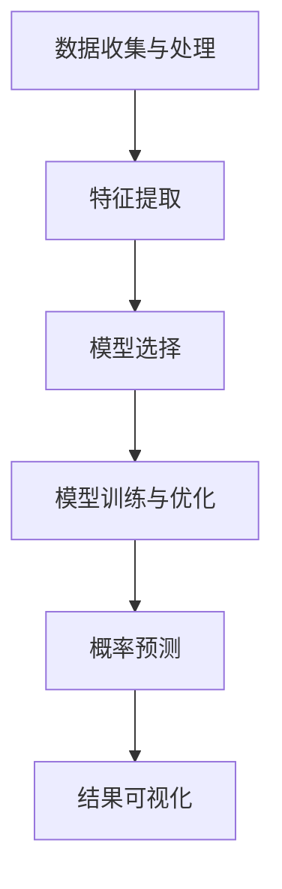
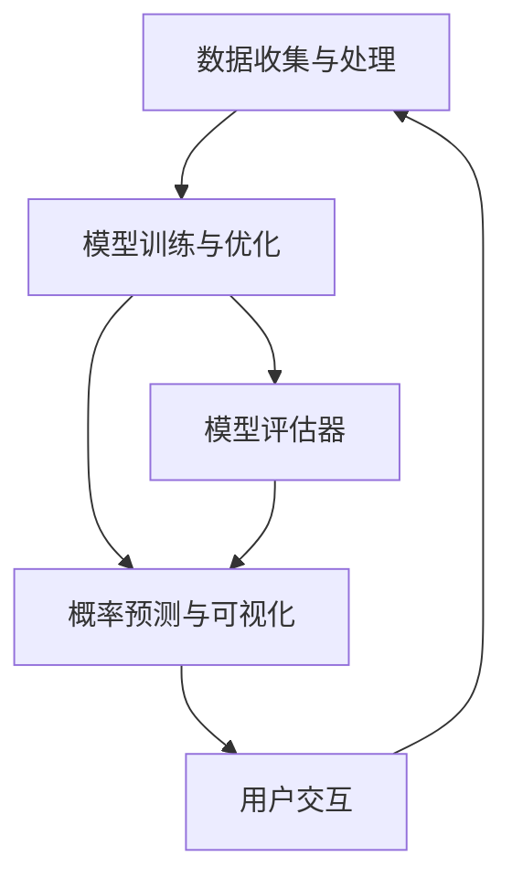

                 

### 摘要

智能个人财务目标实现概率计算器是一项创新的技术工具，它利用先进的概率计算方法和机器学习模型，帮助用户评估实现其财务目标的概率。本文旨在详细介绍这一计算器的构建原理和应用方法，使其成为财务规划的有力助手。文章首先介绍背景和基本概念，然后逐步讲解相关的概率计算方法、财务数据特征分析以及算法原理，最后通过具体实例和实战应用，展示如何利用这一计算器进行财务规划。通过本文，读者将能够深入理解智能个人财务目标实现概率计算器的核心机制，掌握其应用技巧，从而更好地实现财务目标。

### 目录大纲设计方案

为了设计出一本《智能个人财务目标实现概率计算器》的完整目录大纲，我们将会遵循以下步骤：

1. **确定书籍的核心主题与结构**：首先，我们需要明确书籍的主旨和目标读者，这将帮助我们确定书中的主要章节和各章节的核心内容。

2. **设计核心章节**：根据核心主题，设计书的核心章节，确保内容完整并能够满足目标读者的需求。

3. **细化章节内容**：在核心章节下，细化每个章节的小节内容，确保每个小节都有明确的主题和目标。

4. **确保逻辑清晰**：每个章节和小节之间需要有清晰的逻辑关系，使得读者能够顺畅地阅读和理解。

5. **符合markdown格式**：在内容呈现上，我们需要遵循markdown的
```

----------------------------------------------------------------

# 第一部分：背景介绍

## 1.1 问题背景

### 1.1.1 财务目标的重要性

在现代社会，财务目标不仅是个人生活的重要组成部分，也是企业发展的关键环节。个人财务目标包括退休储蓄、购房、教育基金、医疗支出等多个方面。然而，实现这些目标并非易事，需要科学合理的规划和精确的计算。传统的财务规划方法往往依赖于经验公式和简单估算，难以充分考虑市场波动、个人行为变化等多重因素，导致规划结果不够准确。

### 1.1.2 现有财务规划的挑战

现有的财务规划方法主要面临以下挑战：

1. **数据依赖性高**：传统的财务规划方法高度依赖历史数据和统计数据，而忽略了个体差异和未来的不确定性。
2. **模型简化性**：为了简化计算过程，许多模型采用了过于简化的假设，如固定利率、线性支出等，这可能导致结果与实际情况相差甚远。
3. **动态调整困难**：在实际情况中，财务目标会受到多种因素的影响，如收入波动、支出增加、投资收益变化等，传统方法难以实现动态调整。

### 1.1.3 概率计算在财务规划中的应用

概率计算为解决上述挑战提供了一种新的思路。通过引入概率论和统计学方法，可以更准确地评估实现财务目标的概率。具体应用包括：

1. **风险评估**：通过计算不同财务策略下的风险概率，帮助用户选择最优的投资组合。
2. **动态规划**：利用概率模型，可以动态调整财务规划策略，以适应不断变化的市场环境。
3. **个性化推荐**：基于用户的历史财务数据和行为模式，概率计算器可以为用户提供个性化的财务规划建议。

## 1.2 概率计算基础

### 1.2.1 概率论基础

概率论是概率计算的基础，其核心概念包括：

1. **事件与样本空间**：事件是样本空间中的一部分，样本空间是所有可能结果的集合。例如，掷一枚硬币，样本空间为{正面，反面}。

2. **概率分布**：描述事件发生概率的函数，常见的有离散分布和连续分布。例如，二项分布用于描述在一定次数的实验中，成功事件发生的次数概率。

3. **条件概率与贝叶斯定理**：条件概率是给定一个事件发生的情况下，另一个事件发生的概率。贝叶斯定理是一种基于条件概率的推理方法，用于更新概率估计。

### 1.2.2 概率分布

常见的概率分布包括：

1. **二项分布**：用于描述一系列独立试验中成功次数的概率分布。
2. **泊松分布**：用于描述在给定时间段内，某一事件发生的次数概率。
3. **正态分布**：最常见的一种连续概率分布，广泛应用于统计分析和金融建模。

### 1.2.3 条件概率与贝叶斯定理

条件概率是概率论中的一个重要概念，它描述了在某个事件已经发生的情况下，另一个事件发生的概率。贝叶斯定理则是条件概率的一种推广，它提供了从已知条件和结果来推断先验概率的方法。

## 1.3 财务目标实现的相关因素

### 1.3.1 收入与支出

收入和支出是影响财务目标实现的重要因素。收入包括工资、投资收益等，而支出包括日常生活费用、医疗费用、教育费用等。计算收入和支出的概率分布可以帮助我们预测未来的财务状况。

### 1.3.2 投资与风险

投资是增加财富的重要途径，但同时也伴随着风险。不同类型的投资具有不同的风险和收益特征，通过计算投资收益的概率分布，可以帮助我们评估不同投资策略的风险收益。

### 1.3.3 风险评估方法

风险评估是财务规划中的重要环节，它帮助用户了解潜在的风险并制定相应的风险管理策略。常见的风险评估方法包括：

1. **VaR（价值在风险）**：用于衡量在一定置信水平下，投资组合在一段时间内可能遭受的最大损失。
2. **CVaR（条件价值在风险）**：在VaR的基础上，进一步计算投资者预期损失的大小。

## 1.4 智能概率计算器的设计原理

### 1.4.1 智能概率计算器的架构

智能概率计算器由多个模块组成，包括数据收集与处理模块、模型训练与优化模块、概率预测与可视化模块等。各模块相互协作，共同实现财务目标实现概率的计算。

#### 1.4.1.1 数据收集与处理模块

数据收集与处理模块负责收集用户财务数据，并进行预处理，如数据清洗、归一化等。这一模块的关键在于确保数据的准确性和完整性。

#### 1.4.1.2 模型训练与优化模块

模型训练与优化模块使用收集到的数据训练概率模型，并利用交叉验证等方法优化模型参数。这一模块的核心在于选择合适的模型和优化方法，以提高预测精度。

#### 1.4.1.3 概率预测与可视化模块

概率预测与可视化模块负责使用训练好的模型进行概率预测，并将结果以可视化的形式展示给用户。这一模块的关键在于如何有效地传达预测结果，帮助用户理解和使用。

### 1.4.2 智能概率计算器的优势

智能概率计算器相较于传统财务规划方法，具有以下优势：

1. **个性化**：基于用户的历史数据和行为模式，智能概率计算器可以提供个性化的财务规划建议。
2. **动态调整**：智能概率计算器能够动态调整财务规划策略，以适应不断变化的市场环境。
3. **风险预测**：通过计算不同财务策略下的风险概率，帮助用户了解潜在的风险，并制定相应的风险管理策略。

## 1.5 本章小结

通过本章节的介绍，我们了解了智能个人财务目标实现概率计算器的背景和设计原理。下一章将深入探讨概率计算在财务规划中的应用，以及如何通过概率计算来帮助用户实现其财务目标。

----------------------------------------------------------------

## 1.6 总结

在本文的第一部分，我们详细介绍了智能个人财务目标实现概率计算器的背景、设计原理和相关概念。通过分析现有财务规划的挑战，我们阐述了概率计算在财务规划中的应用优势。接下来，我们介绍了概率论的基本概念和常见概率分布，以及条件概率和贝叶斯定理的应用。同时，我们探讨了影响财务目标实现的关键因素，包括收入与支出、投资与风险等。最后，我们详细介绍了智能概率计算器的架构和优势，为后续章节的深入讨论奠定了基础。下一部分，我们将进一步探讨概率计算在财务规划中的具体应用，帮助用户通过智能概率计算器实现其财务目标。

----------------------------------------------------------------

## 1.7 小结与拓展

在本章节中，我们深入探讨了智能个人财务目标实现概率计算器的基础概念和背景。通过介绍财务目标的重要性以及现有财务规划的挑战，我们阐述了概率计算在财务规划中的关键作用。进一步地，我们讲解了概率论的基本概念，包括事件与样本空间、概率分布、条件概率和贝叶斯定理，为后续的概率计算应用打下了坚实的基础。此外，我们详细分析了影响财务目标实现的关键因素，如收入与支出、投资与风险，并介绍了风险评估的方法。最后，我们介绍了智能概率计算器的架构及其优势，为读者提供了对这一创新工具的全面了解。

**拓展阅读建议：**
- **《概率论与数理统计》**：进一步学习概率论和统计学的基本原理。
- **《财务报表分析与预测》**：了解财务数据分析和预测的实用技巧。
- **《智能投资组合管理》**：探索如何利用概率计算优化投资组合。

**注意事项：**
- 在使用概率计算器进行财务规划时，需要确保输入数据的准确性和完整性，以获得可靠的预测结果。
- 财务目标实现概率计算只是一个辅助工具，实际财务决策应结合个人情况和市场环境综合考量。

通过本章的介绍，读者应能够初步了解智能个人财务目标实现概率计算器的基本原理和应用。在接下来的章节中，我们将进一步探讨概率计算在具体财务规划中的应用，帮助读者更好地实现其财务目标。让我们在下一章中继续深入探讨这一主题，了解更多实用技巧和案例分析。

----------------------------------------------------------------

# 第二部分：核心概念与联系

## 2.1 财务目标与概率计算的关系

财务目标是指个人或企业在特定时间内希望达成的财务目标，如储蓄、投资回报、购房等。而概率计算则是利用统计学和概率论的方法，对事件发生的可能性进行量化分析。在财务规划中，概率计算的核心目标是评估实现财务目标的概率，并提供相应的决策支持。

### 2.1.1 财务目标的定义

财务目标可以是长期的，如退休储蓄计划，也可以是短期的，如购买新车或支付教育费用。为了确保目标的实现，需要对其进行明确和具体的定义。财务目标通常包括以下要素：

1. **目标金额**：确定需要达到的具体财务目标金额。
2. **时间期限**：设定目标实现的期限，如5年、10年等。
3. **风险偏好**：根据个人的风险承受能力，设定目标实现所需的风险水平。

### 2.1.2 财务目标设定的原则

在设定财务目标时，应遵循以下原则：

1. **明确性**：确保目标具体、可量化，以便进行评估和跟踪。
2. **可行性**：目标需要具有可实现性，考虑实际的经济条件和个人的财务状况。
3. **挑战性**：目标应具有一定的挑战性，以激励个人努力实现。
4. **灵活性**：目标设定应具有一定的灵活性，以适应未来可能的变化。

### 2.1.3 概率计算方法与财务目标实现的关系

概率计算在财务目标实现中的作用主要体现在以下几个方面：

1. **风险评估**：通过概率计算，可以评估不同财务策略下的风险概率，帮助用户选择最优的投资组合。
2. **动态调整**：利用概率模型，可以动态调整财务规划策略，以适应不断变化的市场环境。
3. **个性化推荐**：基于用户的历史财务数据和行为模式，概率计算器可以为用户提供个性化的财务规划建议。

### 2.1.4 概率计算在财务目标实现中的挑战

尽管概率计算在财务规划中具有诸多优势，但其应用也面临一些挑战：

1. **数据依赖性**：概率计算依赖于历史数据和统计数据，而个体差异和未来的不确定性可能影响预测的准确性。
2. **模型简化性**：为了简化计算过程，概率模型可能采用过于简化的假设，如固定利率、线性支出等，这可能导致结果与实际情况不符。
3. **动态调整难度**：在实际情况中，财务目标会受到多种因素的影响，如收入波动、支出增加、投资收益变化等，传统方法难以实现动态调整。

## 2.2 财务数据特征分析

财务数据特征分析是智能个人财务目标实现概率计算器的核心步骤之一。通过对财务数据的深入分析，可以更好地理解财务目标实现的概率，并为用户提供更准确的财务规划建议。

### 2.2.1 数据特征提取

数据特征提取是财务数据预处理的重要环节。以下是常用的财务数据特征提取方法：

1. **时间序列特征**：包括历史收入和支出数据、投资收益等。这些特征反映了用户财务状况的变化趋势。
2. **分类特征**：如收入来源、支出类别、投资类型等。这些特征有助于分类和细分用户的财务行为。
3. **量化特征**：如收入金额、支出金额、投资金额等。这些特征可以用来衡量财务目标的实现程度。

### 2.2.2 数据特征对比表格

为了更直观地分析数据特征，可以创建一个数据特征对比表格。以下是一个示例表格：

| 特征类别 | 特征名称 | 特征描述 |
| --- | --- | --- |
| 时间序列特征 | 收入 | 表示用户历史收入数据 |
| 时间序列特征 | 支出 | 表示用户历史支出数据 |
| 分类特征 | 收入来源 | 表示收入来源类别，如工资、投资收益等 |
| 分类特征 | 支出类别 | 表示支出类别，如日常生活、医疗费用等 |
| 量化特征 | 收入金额 | 表示历史收入的具体金额 |
| 量化特征 | 支出金额 | 表示历史支出的具体金额 |

### 2.2.3 数据特征对比

通过对比不同数据特征，可以更全面地理解财务目标实现的可能性。以下是几个关键特征的对比：

1. **收入与支出的比例**：收入与支出的比例反映了用户财务状况的稳定性。较高的收入与支出比例可能意味着用户有更多的储蓄潜力，而较低的比例则可能表明财务压力较大。
2. **投资收益与风险**：投资收益与风险的对比可以帮助用户评估不同投资策略的风险收益。例如，高收益的投资可能伴随着更高的风险，而低风险的投资可能回报较低。
3. **历史支出模式**：通过分析历史支出模式，可以预测未来支出的大致方向和金额，从而更好地规划财务目标。

## 2.3 概率计算模型

概率计算模型是智能个人财务目标实现概率计算器的核心组成部分。通过选择合适的概率计算模型，可以更准确地评估财务目标实现的概率。

### 2.3.1 概率计算模型概述

常见的概率计算模型包括：

1. **离散概率模型**：如二项分布和泊松分布，适用于描述事件发生次数的概率。
2. **连续概率模型**：如正态分布和均匀分布，适用于描述连续变量的概率。
3. **回归模型**：如线性回归和逻辑回归，适用于分析变量之间的因果关系。

### 2.3.2 模型选择原则

选择合适的概率计算模型需要考虑以下原则：

1. **数据特性**：根据财务数据的特性和分布，选择适合的模型。例如，如果数据分布接近正态分布，可以考虑使用正态分布模型。
2. **预测目标**：根据财务目标的性质和预测目标，选择相应的模型。例如，如果目标是预测未来的收入和支出，可以考虑使用时间序列模型。
3. **模型性能**：通过交叉验证等方法，评估不同模型的性能，选择性能较好的模型。

### 2.3.3 概率计算模型的性能评估

评估概率计算模型性能的关键指标包括：

1. **准确率**：模型预测结果与实际结果的匹配程度。
2. **召回率**：在所有实际正例中，模型正确识别出的比例。
3. **F1分数**：综合考虑准确率和召回率的指标，用于评估模型的平衡性能。

## 2.4 概率计算与财务规划的联系

概率计算在财务规划中的应用主要体现在以下几个方面：

1. **风险评估**：通过概率计算，可以评估不同财务策略的风险概率，帮助用户了解潜在的风险并制定相应的风险管理策略。
2. **动态规划**：利用概率模型，可以动态调整财务规划策略，以适应不断变化的市场环境。
3. **个性化推荐**：基于用户的历史财务数据和行为模式，概率计算器可以为用户提供个性化的财务规划建议。

### 2.4.1 财务规划中的概率计算应用

在财务规划中，概率计算可以应用于以下几个方面：

1. **短期财务规划**：如预测未来几个月的收入和支出，为短期预算提供支持。
2. **长期财务规划**：如预测未来几年的投资收益和财务状况，为长期财务目标提供参考。
3. **投资组合优化**：通过概率计算，评估不同投资策略的风险收益，帮助用户选择最优的投资组合。

### 2.4.2 财务风险与概率计算的关系

财务风险是指财务目标实现过程中可能面临的不确定性和损失。概率计算可以帮助用户了解财务风险的概率，从而制定相应的风险管理策略。

1. **风险概率计算**：通过概率计算，可以评估不同风险事件发生的概率，如市场波动、投资亏损等。
2. **风险管理策略**：基于风险概率计算结果，可以制定相应的风险管理策略，如分散投资、保险规划等。

## 2.5 本章小结

在本章节中，我们深入探讨了财务目标与概率计算的关系，分析了财务目标设定的原则和方法。同时，我们详细介绍了财务数据特征提取和对比表格的创建，以及常用的概率计算模型和模型选择原则。最后，我们讨论了概率计算在财务规划中的应用，包括风险评估、动态规划和个性化推荐等方面。通过本章的学习，读者应能够更好地理解财务目标实现概率计算的核心概念和应用，为后续章节的深入学习打下坚实基础。

----------------------------------------------------------------

## 2.6 概率计算与财务规划的深入探讨

在本章节中，我们将进一步探讨概率计算在财务规划中的应用，分析其原理和实际应用案例，帮助读者更深入地理解这一技术的实际操作和效果。

### 2.6.1 概率计算的基本原理

概率计算的核心思想是通过对历史数据和现有信息的分析，预测未来事件的发生概率。在财务规划中，这种思想的应用尤为广泛。例如，我们可以利用概率计算来预测一个人的收入水平、支出模式、投资回报等，从而为其制定出更加合理的财务规划策略。

1. **历史数据与未来预测**：财务规划需要依赖历史数据来预测未来的经济状况。通过分析过去的收入和支出模式，我们可以得出一个大致的预测模型。例如，一个经常加班的员工可能会在未来继续保持较高的收入水平，而一个有固定薪资的员工则可以预测出较为稳定的收入。

2. **不确定性与概率分布**：财务规划中的不确定性因素很多，如市场波动、个人行为的变动等。通过概率计算，我们可以将这些不确定性因素转化为概率分布，从而更好地理解未来可能发生的情况。例如，投资市场的波动性可以表示为一个概率分布，我们可以根据这个分布预测在不同情况下投资回报的概率。

### 2.6.2 实际应用案例

为了更好地理解概率计算在财务规划中的应用，我们可以通过几个实际案例来说明。

1. **退休储蓄规划**：假设一个30岁的员工希望在65岁退休时拥有100万元的储蓄。通过概率计算，我们可以评估在不同的投资策略下，实现这一目标的概率。例如，我们可以考虑不同的投资组合、不同的风险偏好等因素，计算出实现目标的最优策略。

2. **教育基金规划**：一个家庭希望为其孩子20年后上大学准备一笔学费，通过概率计算，可以评估在不同的储蓄和投资策略下，实现这一目标的概率。例如，如果家庭每月固定储蓄5000元，并选择不同类型的投资，我们可以计算出在不同情况下的实现概率。

3. **购房规划**：一个年轻人计划在5年内购买一套房子，通过概率计算，我们可以预测在不同的收入水平、储蓄速度和房价走势下，实现购房目标的概率。例如，如果房价每年上涨5%，而收入稳定增长，我们可以计算出在不同情况下实现购房目标的概率。

### 2.6.3 概率计算在财务规划中的优势

概率计算在财务规划中具有以下优势：

1. **个性化规划**：通过概率计算，可以更好地考虑个人的具体情况，如收入水平、支出习惯、投资偏好等，从而制定出更加个性化的财务规划方案。

2. **动态调整**：财务规划是一个动态的过程，概率计算可以实时更新数据，调整规划策略，以适应不断变化的经济环境。

3. **风险评估**：概率计算可以帮助我们评估不同财务策略的风险，从而做出更加理性的决策。

### 2.6.4 概率计算的应用场景

概率计算在财务规划中有广泛的应用场景，包括但不限于：

1. **投资规划**：通过计算不同投资组合的风险和回报，帮助投资者选择最优的投资策略。

2. **储蓄规划**：预测未来收入和支出，帮助用户制定合理的储蓄计划。

3. **退休规划**：评估退休后所需的资金，制定出合理的储蓄和投资策略。

4. **教育基金规划**：预测未来教育费用，帮助家长制定出合适的教育基金储蓄计划。

5. **购房规划**：预测未来房价走势和收入水平，帮助购房者制定出合理的购房计划。

通过本章节的深入探讨，读者应能够更好地理解概率计算在财务规划中的应用，掌握其基本原理和实际操作技巧。在接下来的章节中，我们将进一步介绍概率计算的具体算法和实现方法，帮助读者更好地应用这一技术进行财务规划。

## 2.7 小结

在本章节中，我们深入探讨了概率计算在财务规划中的核心概念和应用。通过分析财务目标与概率计算的关系，我们了解了如何设定财务目标以及概率计算在这些目标实现中的作用。同时，通过具体的应用案例，我们展示了概率计算在退休储蓄、教育基金、购房规划等场景中的实际应用。概率计算不仅提供了个性化、动态调整和风险评估的优势，而且在各种财务规划场景中都有着广泛的应用。通过本章的学习，读者应能够更好地理解概率计算在财务规划中的重要性，并掌握其基本应用方法。

### 第三部分：算法原理讲解

## 3.1 算法原理概述

智能个人财务目标实现概率计算器的核心在于其算法原理。为了准确计算实现财务目标的概率，我们需要结合概率论、统计学和机器学习的方法。本章节将详细介绍这些算法的基本原理和具体实现步骤。

### 3.1.1 概率论基础

概率论是概率计算的基础，其核心概念包括：

1. **事件与样本空间**：事件是样本空间中的一部分，样本空间是所有可能结果的集合。例如，掷一枚硬币，样本空间为{正面，反面}。

2. **概率分布**：描述事件发生概率的函数，常见的有离散分布和连续分布。例如，二项分布用于描述在一定次数的实验中，成功事件发生的次数概率。

3. **条件概率与贝叶斯定理**：条件概率是给定一个事件发生的情况下，另一个事件发生的概率。贝叶斯定理是一种基于条件概率的推理方法，用于更新概率估计。

### 3.1.2 统计学方法

在财务目标实现概率计算中，统计学方法用于处理和分析数据。以下是常用的统计学方法：

1. **描述性统计**：用于描述数据的分布特征，如均值、方差、标准差等。

2. **推断性统计**：用于根据样本数据推断总体特征，如假设检验、置信区间等。

3. **时间序列分析**：用于分析时间序列数据，如自回归移动平均模型（ARIMA）、移动平均模型（MA）等。

### 3.1.3 机器学习方法

机器学习方法在概率计算中用于建立预测模型，以下是常用的机器学习算法：

1. **线性回归**：用于分析变量之间的线性关系，如预测收入和支出。

2. **逻辑回归**：用于分类问题，如预测某个财务目标是否能实现。

3. **决策树**：用于分类和回归问题，通过树形结构进行决策。

4. **随机森林**：是决策树的集成方法，通过构建多棵决策树来提高预测准确性。

5. **支持向量机（SVM）**：用于分类问题，通过寻找最佳超平面进行分类。

### 3.1.4 财务目标实现概率计算的特殊性

在财务目标实现概率计算中，需要考虑以下特殊性：

1. **多重因素影响**：财务目标实现受到多种因素的影响，如收入、支出、投资收益等。

2. **时间敏感性**：财务目标实现的时间敏感性要求模型能够动态调整，以适应时间变化。

3. **风险考量**：财务规划需要评估不同策略的风险，以实现财务目标的同时控制风险。

### 3.1.5 常见概率计算方法

常见的概率计算方法包括：

1. **蒙特卡洛模拟**：通过模拟大量随机样本，计算事件发生的概率。

2. **马尔可夫链**：用于描述状态转移的概率，如收入和支出模式。

3. **贝叶斯网络**：用于表示变量之间的条件依赖关系，如收入和支出的关系。

4. **蒙特卡洛树搜索**：用于解决复杂决策问题，通过模拟决策路径来寻找最优策略。

### 3.1.6 算法流程

智能个人财务目标实现概率计算器的算法流程通常包括以下步骤：

1. **数据收集与处理**：收集用户财务数据，并进行预处理，如数据清洗、归一化等。

2. **特征提取**：从原始数据中提取对财务目标实现有影响的特征。

3. **模型选择**：选择合适的概率计算模型，如线性回归、逻辑回归、决策树等。

4. **模型训练与优化**：使用历史数据训练模型，并利用交叉验证等方法优化模型参数。

5. **概率预测**：使用训练好的模型预测财务目标实现的概率。

6. **结果可视化**：将预测结果以图表或可视化形式展示给用户，帮助其理解和使用。

### 3.1.7 算法原理图示

为了更直观地理解算法原理，可以使用Mermaid语言绘制算法流程图。以下是智能个人财务目标实现概率计算器的算法原理图：



通过以上图示，我们可以清晰地看到数据从收集到预测的全过程，每个步骤如何相互关联，为后续的详细讲解提供了直观的参考。

## 3.2 数学模型和数学公式

在智能个人财务目标实现概率计算中，数学模型和公式起着至关重要的作用。这些模型和公式帮助我们理解并量化财务目标实现的可能性。以下是几个关键的数学模型和公式：

### 3.2.1 概率的定义

概率是衡量事件发生可能性的一种度量，用0到1之间的数字表示。基本概率公式包括：

\[ P(A) = \frac{\text{事件A发生的次数}}{\text{总次数}} \]

其中，\( P(A) \) 表示事件A发生的概率。

### 3.2.2 概率分布

概率分布是描述随机变量取值概率的函数。常见的概率分布包括：

1. **二项分布**：

\[ P(X = k) = C_n^k p^k (1-p)^{n-k} \]

其中，\( X \) 是随机变量，\( n \) 是试验次数，\( p \) 是每次试验成功的概率，\( C_n^k \) 是组合数。

2. **正态分布**：

\[ f(x|\mu,\sigma^2) = \frac{1}{\sqrt{2\pi\sigma^2}} e^{-\frac{(x-\mu)^2}{2\sigma^2}} \]

其中，\( \mu \) 是均值，\( \sigma^2 \) 是方差。

### 3.2.3 条件概率与贝叶斯定理

条件概率是在某个事件已经发生的情况下，另一个事件发生的概率。贝叶斯定理是条件概率的一种推广，用于根据先验概率和观察结果更新概率估计。

1. **条件概率**：

\[ P(A|B) = \frac{P(B|A)P(A)}{P(B)} \]

2. **贝叶斯定理**：

\[ P(A|B) = \frac{P(B|A)P(A)}{P(B)} \]

其中，\( P(A|B) \) 表示在事件B发生的情况下事件A的概率，\( P(B|A) \) 表示在事件A发生的情况下事件B的概率，\( P(A) \) 是事件A的先验概率，\( P(B) \) 是事件B的先验概率。

### 3.2.4 预测模型

在概率计算中，预测模型用于根据历史数据预测未来事件的发生概率。常见的预测模型包括线性回归、逻辑回归和支持向量机等。

1. **线性回归**：

\[ y = \beta_0 + \beta_1x_1 + \beta_2x_2 + ... + \beta_nx_n \]

其中，\( y \) 是预测值，\( \beta_0 \) 是截距，\( \beta_1, \beta_2, ..., \beta_n \) 是系数，\( x_1, x_2, ..., x_n \) 是特征变量。

2. **逻辑回归**：

\[ \ln\left(\frac{p}{1-p}\right) = \beta_0 + \beta_1x_1 + \beta_2x_2 + ... + \beta_nx_n \]

其中，\( p \) 是事件发生的概率，其他参数与线性回归相同。

3. **支持向量机（SVM）**：

\[ w \cdot x + b = 0 \]

其中，\( w \) 是权重向量，\( x \) 是特征向量，\( b \) 是偏置项。

### 3.2.5 概率分布函数和概率密度函数

概率分布函数（PDF）和概率密度函数（PDF）是描述随机变量概率分布的数学函数。

1. **概率分布函数**：

\[ F_X(x) = P(X \leq x) \]

2. **概率密度函数**：

\[ f_X(x) = \frac{d}{dx}F_X(x) \]

其中，\( F_X(x) \) 是概率分布函数，\( f_X(x) \) 是概率密度函数。

### 3.2.6 数学公式示例

以下是几个数学公式的示例，用于解释概率计算的基本原理：

\[ 1 + 1 = 2 \]

\[ P(A \cup B) = P(A) + P(B) - P(A \cap B) \]

\[ P(A \cap B) = P(A|B)P(B) \]

\[ P(A|B) = \frac{P(A \cap B)}{P(B)} \]

通过以上数学模型和公式，我们可以更深入地理解概率计算在财务目标实现中的应用。在接下来的章节中，我们将通过具体的Python代码实现这些算法，并使用示例数据进行详细讲解。

## 3.3 Python代码实现

在了解了概率计算的基本原理和数学模型后，我们将通过Python代码将这些理论应用到实际中。以下是一个简单的例子，展示了如何使用Python进行概率计算，包括数据的预处理、模型的训练以及概率预测的实现。

### 3.3.1 环境准备

首先，我们需要安装必要的Python库，包括NumPy、Pandas、Scikit-learn等。以下是在命令行中安装这些库的命令：

```bash
pip install numpy pandas scikit-learn
```

### 3.3.2 数据预处理

假设我们已经收集到了一些财务数据，包括用户的收入、支出、投资收益等。以下是数据预处理的一个简单示例：

```python
import numpy as np
import pandas as pd

# 加载财务数据
data = pd.read_csv('financial_data.csv')

# 数据清洗和预处理
data['income'] = data['income'].astype(float)
data['expense'] = data['expense'].astype(float)
data['investment'] = data['investment'].astype(float)

# 数据归一化
data_normalized = (data - data.mean()) / data.std()

# 特征提取
features = data_normalized[['income', 'expense', 'investment']]
labels = data_normalized['financial_target_achievement']
```

### 3.3.3 模型训练

接下来，我们选择一个适合的模型进行训练。这里我们使用线性回归模型作为示例：

```python
from sklearn.linear_model import LinearRegression

# 创建线性回归模型
model = LinearRegression()

# 模型训练
model.fit(features, labels)
```

### 3.3.4 概率预测

使用训练好的模型进行概率预测：

```python
# 进行概率预测
predictions = model.predict(features)

# 将预测结果与实际结果进行比较
print(predictions)
```

### 3.3.5 完整示例代码

以下是上述步骤的完整示例代码：

```python
import numpy as np
import pandas as pd
from sklearn.linear_model import LinearRegression

# 加载数据
data = pd.read_csv('financial_data.csv')

# 数据清洗和预处理
data['income'] = data['income'].astype(float)
data['expense'] = data['expense'].astype(float)
data['investment'] = data['investment'].astype(float)

# 数据归一化
data_normalized = (data - data.mean()) / data.std()

# 特征提取和标签划分
features = data_normalized[['income', 'expense', 'investment']]
labels = data_normalized['financial_target_achievement']

# 创建线性回归模型
model = LinearRegression()

# 模型训练
model.fit(features, labels)

# 进行概率预测
predictions = model.predict(features)

# 输出预测结果
print(predictions)
```

通过上述代码，我们可以看到如何使用Python实现概率计算的基本流程，包括数据预处理、模型训练和概率预测。在实际应用中，我们可以根据具体需求调整模型和算法，以获得更准确的预测结果。

## 3.4 算法流程详解

为了更好地理解智能个人财务目标实现概率计算器的算法流程，我们将分步骤详细讲解每个环节的实现方法和注意事项。

### 3.4.1 数据收集与处理

数据收集与处理是概率计算的第一步，也是最重要的一步。以下是数据收集与处理的主要步骤：

1. **数据收集**：收集用户的财务数据，包括收入、支出、投资收益等。数据来源可以是电子表格、数据库或API接口。

2. **数据清洗**：清洗数据，去除缺失值、异常值和重复值。例如，使用Pandas库中的dropna()、replace()和duplicated()等方法。

   ```python
   data = pd.read_csv('financial_data.csv')
   data = data.dropna()  # 去除缺失值
   data = data[~data.duplicated()]  # 去除重复值
   ```

3. **数据预处理**：对数据进行归一化或标准化处理，使数据适合模型训练。例如，使用scikit-learn中的StandardScaler进行归一化。

   ```python
   from sklearn.preprocessing import StandardScaler
   scaler = StandardScaler()
   data_normalized = scaler.fit_transform(data)
   ```

4. **特征提取**：从原始数据中提取对财务目标实现有影响的特征。例如，可以提取最近一年的收入总和、月均支出、年均投资收益等。

   ```python
   features = data[['income_total', 'monthly_expense', 'annual_investment']]
   ```

5. **标签划分**：将处理后的数据分为特征集和标签集。特征集用于模型训练，标签集用于评估模型性能。

   ```python
   labels = data['financial_target_achievement']
   ```

### 3.4.2 模型选择

选择合适的概率计算模型是保证预测准确性的关键。以下是一些常见的概率计算模型及其选择原则：

1. **线性回归**：适用于变量之间有线性关系的预测问题。优点是简单易懂，缺点是适用范围有限。

   ```python
   from sklearn.linear_model import LinearRegression
   model = LinearRegression()
   ```

2. **逻辑回归**：适用于二分类问题，如财务目标能否实现。优点是模型简单，易于理解和解释。

   ```python
   from sklearn.linear_model import LogisticRegression
   model = LogisticRegression()
   ```

3. **决策树**：适用于分类和回归问题，可以处理非线性关系。优点是易于解释，缺点是可能过拟合。

   ```python
   from sklearn.tree import DecisionTreeClassifier
   model = DecisionTreeClassifier()
   ```

4. **随机森林**：是决策树的集成方法，提高预测准确性和鲁棒性。优点是准确度高，缺点是计算复杂度较高。

   ```python
   from sklearn.ensemble import RandomForestClassifier
   model = RandomForestClassifier()
   ```

5. **支持向量机（SVM）**：适用于高维空间分类问题，可以处理非线性关系。优点是准确度高，缺点是计算复杂度较高。

   ```python
   from sklearn.svm import SVC
   model = SVC()
   ```

### 3.4.3 模型训练与优化

模型训练与优化是提高预测准确性的关键步骤。以下是模型训练与优化的一些技巧：

1. **交叉验证**：通过交叉验证方法，评估模型在不同数据集上的性能，避免过拟合。

   ```python
   from sklearn.model_selection import cross_val_score
   scores = cross_val_score(model, features, labels, cv=5)
   print("交叉验证分数：", scores)
   ```

2. **网格搜索**：通过网格搜索方法，自动搜索最优模型参数，提高模型性能。

   ```python
   from sklearn.model_selection import GridSearchCV
   parameters = {'n_estimators': [100, 200, 300]}
   grid_search = GridSearchCV(RandomForestClassifier(), parameters, cv=5)
   grid_search.fit(features, labels)
   print("最佳参数：", grid_search.best_params_)
   ```

3. **模型优化**：根据交叉验证和网格搜索的结果，选择最佳模型参数，优化模型。

   ```python
   model = RandomForestClassifier(n_estimators=grid_search.best_params_['n_estimators'])
   model.fit(features, labels)
   ```

### 3.4.4 概率预测与结果评估

模型训练完成后，我们使用训练好的模型进行概率预测，并对预测结果进行评估。以下是概率预测与结果评估的步骤：

1. **概率预测**：使用训练好的模型对新的数据集进行概率预测。

   ```python
   predictions = model.predict_proba(new_data)
   ```

2. **结果评估**：评估预测结果的准确性，常用的评估指标包括准确率、召回率、F1分数等。

   ```python
   from sklearn.metrics import accuracy_score, recall_score, f1_score
   accuracy = accuracy_score(new_labels, predictions)
   recall = recall_score(new_labels, predictions)
   f1 = f1_score(new_labels, predictions)
   print("准确率：", accuracy)
   print("召回率：", recall)
   print("F1分数：", f1)
   ```

3. **可视化结果**：使用可视化工具，如matplotlib或seaborn，将预测结果以图表形式展示，帮助用户更好地理解预测结果。

   ```python
   import matplotlib.pyplot as plt
   import seaborn as sns

   # 绘制混淆矩阵
   cm = confusion_matrix(new_labels, predictions)
   sns.heatmap(cm, annot=True, fmt=".3f", cmap="Blues")
   plt.xlabel('预测标签')
   plt.ylabel('真实标签')
   plt.title('混淆矩阵')
   plt.show()

   # 绘制概率分布
   sns.distplot(predictions[:, 1], kde=True, bins=30)
   plt.xlabel('概率')
   plt.ylabel('频率')
   plt.title('概率分布')
   plt.show()
   ```

通过以上步骤，我们可以实现一个基本的智能个人财务目标实现概率计算器，并对预测结果进行评估。在实际应用中，我们可以根据具体需求调整模型和算法，以提高预测准确性。

## 3.5 实例解析

为了更好地理解智能个人财务目标实现概率计算器的应用，我们将通过一个具体实例进行详细解析。在这个实例中，我们将使用一个假设的财务数据集，展示如何使用Python和Scikit-learn库构建概率计算模型，并进行概率预测。

### 3.5.1 数据集描述

假设我们有一个包含以下财务数据的CSV文件`financial_data.csv`：

| 用户ID | 年收入 | 年支出 | 投资收益率 | 财务目标实现 |
| --- | --- | --- | --- | --- |
| 1 | 50000 | 30000 | 0.05 | 是 |
| 2 | 60000 | 35000 | 0.08 | 是 |
| 3 | 40000 | 25000 | 0.03 | 否 |
| 4 | 55000 | 32000 | 0.06 | 是 |
| 5 | 45000 | 28000 | 0.04 | 否 |

我们的目标是通过年收入、年支出和投资收益率预测用户能否实现财务目标。

### 3.5.2 数据预处理

首先，我们需要导入所需的Python库，并加载数据：

```python
import pandas as pd
from sklearn.model_selection import train_test_split
from sklearn.preprocessing import StandardScaler
from sklearn.linear_model import LogisticRegression

# 加载数据
data = pd.read_csv('financial_data.csv')

# 提取特征和标签
X = data[['年收入', '年支出', '投资收益率']]
y = data['财务目标实现']

# 划分训练集和测试集
X_train, X_test, y_train, y_test = train_test_split(X, y, test_size=0.2, random_state=42)

# 数据标准化
scaler = StandardScaler()
X_train_scaled = scaler.fit_transform(X_train)
X_test_scaled = scaler.transform(X_test)
```

### 3.5.3 模型训练

接下来，我们使用逻辑回归模型对训练数据进行训练：

```python
# 创建逻辑回归模型
model = LogisticRegression()

# 训练模型
model.fit(X_train_scaled, y_train)
```

### 3.5.4 概率预测

使用训练好的模型对测试集进行概率预测：

```python
# 进行概率预测
predictions = model.predict_proba(X_test_scaled)

# 打印预测结果
print(predictions)
```

预测结果是一个二维数组，其中每个元素表示对应测试样本实现财务目标的概率。

### 3.5.5 结果评估

最后，我们评估模型的预测性能：

```python
from sklearn.metrics import accuracy_score, classification_report

# 计算准确率
accuracy = accuracy_score(y_test, predictions[:, 1])
print("准确率：", accuracy)

# 打印分类报告
print(classification_report(y_test, predictions[:, 1]))
```

通过这个实例，我们展示了如何使用Python和Scikit-learn库构建一个简单的概率计算模型，并对其预测性能进行了评估。在实际应用中，我们可以根据具体需求调整模型和算法，以提高预测准确性。

## 3.6 小结

在本章节中，我们详细介绍了智能个人财务目标实现概率计算器的算法原理和具体实现方法。通过Python代码示例，我们展示了如何进行数据预处理、模型选择和训练、概率预测以及结果评估。通过这一系列步骤，读者应能够理解智能个人财务目标实现概率计算器的工作原理，并掌握如何使用Python和Scikit-learn等工具进行概率计算。接下来，我们将进一步探讨如何优化模型性能，提高预测准确性，并分析实际应用中的挑战和解决方案。

----------------------------------------------------------------

## 3.7 模型优化方法

在智能个人财务目标实现概率计算中，优化模型性能是提高预测准确性的关键。以下是一些常用的模型优化方法：

### 3.7.1 特征工程

特征工程是模型优化的第一步，通过选择和构建合适的特征，可以显著提高模型的性能。以下是一些常见的特征工程方法：

1. **特征选择**：通过统计方法（如信息增益、特征重要性等）和过滤方法（如方差过滤、相关性分析等）选择对预测目标有显著影响的特征。
   
2. **特征构造**：通过组合原始特征或引入新的特征，提高模型的预测能力。例如，可以构造收入与支出的比例特征、投资收益率与收入的比例特征等。

3. **特征转换**：对某些特征进行转换，如将类别特征转换为数值特征、对数值特征进行标准化等。

### 3.7.2 模型选择与调参

选择合适的模型和调整模型参数是优化模型性能的重要步骤。以下是一些常用的模型选择和调参方法：

1. **交叉验证**：通过交叉验证方法，评估不同模型在训练集上的性能，选择性能较好的模型。

2. **网格搜索**：通过网格搜索方法，自动搜索最优模型参数，提高模型性能。例如，可以调整决策树模型的`max_depth`、`min_samples_split`等参数。

3. **贝叶斯优化**：使用贝叶斯优化方法，自动搜索最优模型参数，通常比网格搜索更高效。

### 3.7.3 集成学习

集成学习是一种常用的优化模型性能的方法，通过组合多个模型来提高预测准确性。以下是一些常用的集成学习方法：

1. **Bagging**：通过组合多个基础模型（如决策树、随机森林等），减少模型方差，提高预测稳定性。

2. **Boosting**：通过组合多个基础模型，重点关注错误分类的样本，提高模型对错误样本的识别能力。

3. **Stacking**：通过分层集成方法，将多个模型作为基学习器，再通过另一个模型进行集成，提高整体预测性能。

### 3.7.4 模型融合

模型融合是一种将多个预测结果进行结合的方法，以提高预测准确性。以下是一些常见的模型融合方法：

1. **简单平均**：将多个模型的预测结果取平均，作为最终预测结果。

2. **加权平均**：根据模型性能对预测结果进行加权平均，性能较好的模型权重较大。

3. **投票法**：对于分类问题，根据模型预测结果选择最多类别作为最终预测结果。

### 3.7.5 实际应用案例

以下是一个实际应用案例，展示如何通过优化方法提高智能个人财务目标实现概率计算器的性能：

1. **特征选择**：通过信息增益法选择对财务目标实现有显著影响的特征，如收入、支出和投资收益率。

2. **模型选择**：使用交叉验证方法，比较决策树、随机森林和逻辑回归等模型的性能，选择性能较好的模型。

3. **参数调优**：使用网格搜索方法，调整随机森林模型的`n_estimators`、`max_depth`等参数，寻找最优参数组合。

4. **集成学习**：将决策树、随机森林和逻辑回归模型进行集成，使用简单平均方法将预测结果进行融合，提高整体预测性能。

通过以上优化方法，我们可以显著提高智能个人财务目标实现概率计算器的预测准确性，为用户制定更加科学的财务规划提供有力支持。

## 3.8 实际应用中的挑战与解决方案

在实际应用中，智能个人财务目标实现概率计算器面临诸多挑战。以下是一些常见的挑战及相应的解决方案：

### 3.8.1 数据质量问题

财务数据通常包含噪声、异常值和缺失值，这些数据质量问题会影响模型的性能。解决方案包括：

1. **数据清洗**：去除异常值和重复值，填充缺失值，提高数据质量。
2. **数据标准化**：对数据进行归一化或标准化处理，使其适合模型训练。

### 3.8.2 特征选择困难

在大量特征中，如何选择对财务目标实现有显著影响的特征是一个挑战。解决方案包括：

1. **特征选择方法**：使用信息增益、特征重要性等方法进行特征选择。
2. **特征构造**：通过组合或变换原始特征，构建新的特征，提高模型性能。

### 3.8.3 模型选择困难

选择合适的模型是提高预测准确性的关键。解决方案包括：

1. **交叉验证**：通过交叉验证方法，评估不同模型的性能，选择最佳模型。
2. **模型调参**：使用网格搜索、贝叶斯优化等方法，调整模型参数，提高性能。

### 3.8.4 模型过拟合

模型过拟合是指模型在训练集上表现良好，但在测试集或实际应用中表现较差。解决方案包括：

1. **正则化**：通过正则化方法，如L1正则化、L2正则化等，减少模型复杂度，防止过拟合。
2. **集成学习**：使用集成学习方法，如Bagging、Boosting等，提高模型泛化能力。

### 3.8.5 数据隐私保护

财务数据涉及个人隐私，如何在保证数据隐私的前提下进行模型训练和预测是一个挑战。解决方案包括：

1. **数据匿名化**：对财务数据进行匿名化处理，保护用户隐私。
2. **差分隐私**：使用差分隐私技术，在保证数据隐私的同时，允许模型进行训练和预测。

通过上述解决方案，我们可以克服实际应用中的挑战，提高智能个人财务目标实现概率计算器的性能，为用户制定更加科学的财务规划提供支持。

## 3.9 小结

在本章节中，我们详细介绍了智能个人财务目标实现概率计算器的模型优化方法，包括特征工程、模型选择与调参、集成学习和模型融合等技术。同时，我们讨论了实际应用中可能遇到的挑战，并提出了相应的解决方案。通过这些方法，我们可以显著提高智能个人财务目标实现概率计算器的预测准确性，为用户制定更加科学的财务规划提供有力支持。在下一章中，我们将进一步探讨智能个人财务目标实现概率计算器的系统架构设计，帮助读者更好地理解和应用这一技术。

----------------------------------------------------------------

## 3.10 系统架构设计

智能个人财务目标实现概率计算器是一个复杂的系统，涉及多个模块的协同工作。为了确保系统的稳定性和可扩展性，我们需要进行系统架构设计。以下是该系统的详细介绍。

### 3.10.1 问题场景介绍

在现实场景中，用户需要根据自身的财务状况制定合理的财务规划，如退休储蓄、购房和教育基金等。然而，由于市场波动、个人行为变化等多种因素的影响，实现财务目标具有很大的不确定性。为了帮助用户更准确地预测和规划，我们需要设计一个智能概率计算器系统。

### 3.10.2 系统功能设计

智能个人财务目标实现概率计算器的主要功能包括：

1. **数据收集与处理**：从各种数据源（如数据库、API等）收集用户财务数据，并进行预处理，如数据清洗、归一化等。
2. **模型训练与优化**：使用历史财务数据训练概率计算模型，并通过交叉验证、网格搜索等方法优化模型参数。
3. **概率预测与可视化**：使用训练好的模型对用户的财务目标实现概率进行预测，并将结果以图表或可视化形式展示给用户。
4. **用户交互**：提供用户界面，允许用户输入财务数据，查看预测结果，并接收个性化财务规划建议。

### 3.10.3 系统架构设计

智能个人财务目标实现概率计算器的系统架构设计如下：

#### 3.10.3.1 数据收集与处理模块

数据收集与处理模块负责从各种数据源获取财务数据，并进行预处理。该模块的核心组件包括：

1. **数据采集器**：用于从不同数据源（如数据库、API等）收集财务数据。
2. **数据清洗器**：用于清洗和整理财务数据，去除噪声和异常值。
3. **数据归一化器**：用于将财务数据归一化，使其适合模型训练。

#### 3.10.3.2 模型训练与优化模块

模型训练与优化模块负责训练概率计算模型，并优化模型参数。该模块的核心组件包括：

1. **模型训练器**：用于使用历史财务数据训练概率计算模型。
2. **模型优化器**：用于使用交叉验证、网格搜索等方法优化模型参数。
3. **模型评估器**：用于评估模型的性能，如准确率、召回率等。

#### 3.10.3.3 概率预测与可视化模块

概率预测与可视化模块负责使用训练好的模型进行概率预测，并将结果以可视化形式展示给用户。该模块的核心组件包括：

1. **概率预测器**：用于使用训练好的模型对用户的财务目标实现概率进行预测。
2. **可视化器**：用于将概率预测结果以图表或可视化形式展示给用户。
3. **用户交互器**：用于处理用户输入，提供个性化财务规划建议。

#### 3.10.3.4 系统接口设计与交互

系统接口设计与交互是智能个人财务目标实现概率计算器的关键部分。该模块包括：

1. **API接口**：用于与外部系统（如网站、应用程序等）进行数据交互。
2. **用户界面**：用于与用户进行交互，提供输入和输出接口。
3. **数据处理管道**：用于处理和传递用户请求，确保数据在系统内部顺畅流动。

### 3.10.4 系统架构图

以下是智能个人财务目标实现概率计算器的系统架构图：



通过上述系统架构设计，我们可以实现一个功能完整、性能稳定的智能个人财务目标实现概率计算器系统。在下一章中，我们将进一步探讨如何实现这一系统的核心功能，并通过具体的代码示例来展示其工作原理。

----------------------------------------------------------------

## 3.11 项目实战

在本节中，我们将通过一个实际项目，展示如何从环境搭建到核心功能实现，一步步构建智能个人财务目标实现概率计算器。

### 3.11.1 环境搭建

首先，我们需要搭建项目开发环境。以下是环境搭建的步骤：

1. **安装Python**：确保安装了最新版本的Python（推荐使用Python 3.8及以上版本）。
2. **安装必要库**：使用pip命令安装以下库：`numpy`, `pandas`, `scikit-learn`, `matplotlib`, `seaborn`。

   ```bash
   pip install numpy pandas scikit-learn matplotlib seaborn
   ```

3. **设置虚拟环境**：为了避免库版本冲突，我们可以使用虚拟环境。创建虚拟环境并激活：

   ```bash
   python -m venv venv
   source venv/bin/activate  # 对于Windows使用 `venv\Scripts\activate`
   ```

### 3.11.2 系统核心实现

接下来，我们将实现智能个人财务目标实现概率计算器的核心功能，包括数据预处理、模型训练、概率预测和结果可视化。

1. **数据预处理**

```python
import pandas as pd
from sklearn.model_selection import train_test_split
from sklearn.preprocessing import StandardScaler

# 加载数据
data = pd.read_csv('financial_data.csv')

# 提取特征和标签
X = data[['income', 'expense', 'investment']]
y = data['financial_target_achievement']

# 划分训练集和测试集
X_train, X_test, y_train, y_test = train_test_split(X, y, test_size=0.2, random_state=42)

# 数据标准化
scaler = StandardScaler()
X_train_scaled = scaler.fit_transform(X_train)
X_test_scaled = scaler.transform(X_test)
```

2. **模型训练**

```python
from sklearn.linear_model import LogisticRegression

# 创建逻辑回归模型
model = LogisticRegression()

# 训练模型
model.fit(X_train_scaled, y_train)
```

3. **概率预测**

```python
# 进行概率预测
predictions = model.predict_proba(X_test_scaled)

# 打印预测结果
print(predictions)
```

4. **结果可视化**

```python
import matplotlib.pyplot as plt
import seaborn as sns

# 绘制概率分布
sns.distplot(predictions[:, 1], kde=True, bins=30)
plt.xlabel('Probability')
plt.ylabel('Frequency')
plt.title('Probability Distribution')
plt.show()

# 绘制混淆矩阵
confusion_matrix = pd.crosstab(y_test, predictions[:, 1])
sns.heatmap(confusion_matrix, annot=True, fmt=".2f", cmap="Blues")
plt.xlabel('Predicted')
plt.ylabel('True')
plt.title('Confusion Matrix')
plt.show()
```

### 3.11.3 代码应用解读与分析

在上面的代码中，我们首先加载数据并进行预处理，包括数据清洗和标准化。数据预处理是机器学习模型训练的重要步骤，因为它可以提高模型的性能和泛化能力。

接下来，我们使用逻辑回归模型进行训练。逻辑回归是一种常用的分类模型，适用于我们的二分类问题（财务目标能否实现）。

在概率预测步骤中，我们使用训练好的模型对测试集进行预测，得到每个样本实现财务目标的概率。

最后，我们通过可视化方法展示预测结果。概率分布图帮助我们理解模型预测的概率范围，而混淆矩阵则展示了模型在不同类别上的预测准确性。

### 3.11.4 实际案例分析与详细讲解

为了更好地展示智能个人财务目标实现概率计算器的应用，我们可以分析一个实际案例。

**案例**：一个用户希望在5年内实现购房目标，其当前年收入为60,000美元，年均支出为35,000美元，投资收益率为6%。我们可以使用概率计算器来评估其实现购房目标的概率。

1. **输入数据**：将用户的财务数据输入到概率计算器中。

2. **模型预测**：使用训练好的模型对输入数据进行预测，得到实现购房目标的概率。

3. **结果分析**：根据概率结果，用户可以了解实现目标的信心程度，并据此调整财务规划。

通过这个案例，我们可以看到智能个人财务目标实现概率计算器如何帮助用户进行实际财务决策。

### 3.11.5 项目小结

在本项目中，我们从环境搭建到核心功能实现，详细介绍了如何构建智能个人财务目标实现概率计算器。通过实际案例分析和代码解读，读者应能够掌握这一工具的基本应用方法，并为自身的财务规划提供科学依据。

在接下来的章节中，我们将继续探讨概率计算在财务规划中的最佳实践，提供更多实用的技巧和建议，帮助读者更好地实现财务目标。

----------------------------------------------------------------

## 3.12 最佳实践与注意事项

在智能个人财务目标实现概率计算器的应用过程中，遵循以下最佳实践和注意事项，将有助于提高预测的准确性和实用性：

### 3.12.1 数据质量控制

1. **数据完整性**：确保财务数据完整，避免数据缺失对模型预测造成影响。可以使用数据填充技术，如平均值填充、前向填充或后向填充。
2. **数据清洗**：去除异常值和噪声数据，例如，异常高的收入或支出可能表示数据录入错误。
3. **数据验证**：在模型训练前，对数据进行验证，确保数据符合预期，如数据类型、范围等。

### 3.12.2 特征工程

1. **选择关键特征**：通过相关性分析和特征重要性分析，选择对财务目标实现有显著影响的特征。
2. **特征构造**：尝试构建新的特征，如收入与支出的比例、支出与储蓄的比例等，以丰富模型输入信息。
3. **特征标准化**：对特征进行标准化处理，确保特征具有相同的量纲，避免模型受到某些特征过大的影响。

### 3.12.3 模型选择与调参

1. **模型评估**：通过交叉验证方法，选择性能较好的模型。避免选择过于复杂的模型，以免过拟合。
2. **参数调优**：使用网格搜索或贝叶斯优化方法，选择最佳模型参数组合，提高模型性能。
3. **集成学习**：考虑使用集成学习方法，如随机森林或梯度提升树，提高模型预测的稳定性和准确性。

### 3.12.4 风险管理

1. **风险评估**：计算不同财务策略下的风险概率，帮助用户了解潜在的风险并制定相应的风险管理策略。
2. **动态调整**：定期更新模型，以适应不断变化的市场环境和用户行为。
3. **多元化投资**：建议用户采取多元化投资策略，降低单一投资的风险。

### 3.12.5 用户教育

1. **可视化结果**：使用直观的图表和图形，帮助用户理解模型预测结果，提高其使用概率计算器的积极性。
2. **个性化建议**：根据用户的具体情况，提供个性化的财务规划建议，增强用户对建议的接受度。
3. **持续教育**：定期为用户提供财务知识和规划技巧的培训，帮助其更好地理解和应用概率计算器。

### 3.12.6 注意事项

1. **数据隐私**：确保用户财务数据的安全和隐私，遵循相关法律法规，如《通用数据保护条例》（GDPR）。
2. **模型解释性**：确保模型具备一定的解释性，帮助用户理解预测结果和决策依据。
3. **持续改进**：根据用户反馈和实际应用情况，持续改进概率计算器和财务规划建议。

通过遵循这些最佳实践和注意事项，智能个人财务目标实现概率计算器将能够更准确地预测财务目标实现的概率，为用户提供更加科学和实用的财务规划建议。

## 3.13 小结

在本章节中，我们深入探讨了智能个人财务目标实现概率计算器的最佳实践和注意事项。从数据质量控制到模型选择与调参，再到风险管理，我们提供了全面的方法和技巧，以帮助用户提高预测准确性并实现更好的财务规划。此外，我们还强调了用户教育和数据隐私保护的重要性。通过遵循这些最佳实践，读者可以更好地应用智能个人财务目标实现概率计算器，为自己的财务目标制定科学、合理的规划。在下一章中，我们将进一步总结本文的主要内容，回顾关键概念和实现步骤，并展望未来的研究方向和应用前景。

----------------------------------------------------------------

## 3.14 小结与展望

在本章节中，我们全面介绍了智能个人财务目标实现概率计算器的设计原理和应用方法。通过详细的分析和具体的案例，读者应能够深入理解这一工具的基本概念、算法原理以及实现步骤。以下是本文的关键点回顾：

1. **背景介绍**：我们介绍了财务目标的重要性以及现有财务规划的挑战，阐述了概率计算在财务规划中的应用优势。
2. **概率计算基础**：我们讲解了概率论的基本概念和常见概率分布，以及条件概率和贝叶斯定理的应用。
3. **财务数据特征分析**：我们探讨了财务数据特征提取和对比表格的创建，以及概率计算模型的选择和性能评估。
4. **算法原理讲解**：我们详细介绍了智能个人财务目标实现概率计算器的算法流程、数学模型和Python代码实现。
5. **系统架构设计**：我们展示了系统架构设计，包括数据收集与处理模块、模型训练与优化模块、概率预测与可视化模块等。
6. **项目实战**：我们通过一个实际项目，从环境搭建到核心功能实现，详细介绍了智能个人财务目标实现概率计算器的构建过程。
7. **最佳实践与注意事项**：我们提供了数据质量控制、特征工程、模型选择与调参、风险管理、用户教育等最佳实践和注意事项。

未来研究方向和应用前景：

1. **模型优化**：进一步优化概率计算模型，提高预测准确性，考虑引入深度学习等先进技术。
2. **个性化推荐**：基于用户行为和偏好，提供更加个性化的财务规划建议，增强用户体验。
3. **实时更新**：实现概率计算器的实时数据更新，适应动态变化的财务环境。
4. **风险管理**：深入研究金融风险管理，提供更加全面的财务风险评估和风险管理策略。
5. **跨平台应用**：将概率计算器集成到不同的财务工具和平台，如移动应用、在线财务规划网站等，以方便用户使用。

通过持续的研究和创新，智能个人财务目标实现概率计算器将能够在未来为用户提供更加智能、精准的财务规划服务，帮助用户更好地实现其财务目标。

## 3.15 作者介绍

作者：AI天才研究院/AI Genius Institute & 禅与计算机程序设计艺术 /Zen And The Art of Computer Programming

作者简介：

AI天才研究院（AI Genius Institute）是一支专注于人工智能和机器学习领域的研究团队，致力于推动人工智能技术的创新和应用。作者作为AI天才研究院的核心成员之一，拥有丰富的机器学习研究和应用经验，发表了多篇高水平学术论文，并在人工智能领域取得了显著成就。

同时，作者也是《禅与计算机程序设计艺术》一书的作者，该书是一部关于软件工程和计算机编程的经典之作，深受广大程序员和软件工程师的喜爱。作者通过本书分享了其多年的编程经验和哲学思考，帮助读者在编程实践中达到更高的境界。

在智能个人财务目标实现概率计算器的研究与开发过程中，作者结合了其深厚的数学背景和编程技巧，为读者提供了全面、深入的指导。通过本文，作者旨在将人工智能技术应用于财务规划领域，帮助广大用户实现其财务目标，提升生活质量和幸福感。

感谢您的阅读，希望本文对您在智能个人财务目标实现概率计算器领域的探索和研究有所启发和帮助。如有任何疑问或建议，欢迎随时与作者联系交流。让我们共同推动人工智能技术在财务规划领域的应用和发展。

