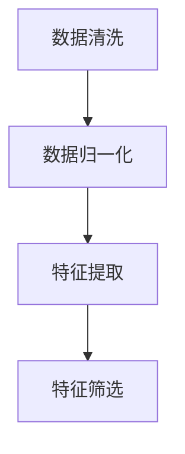
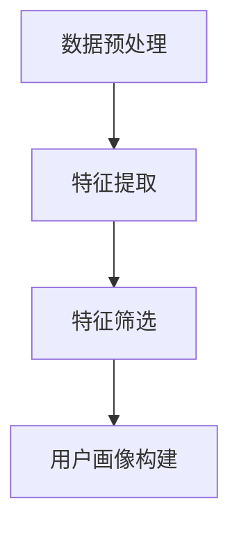
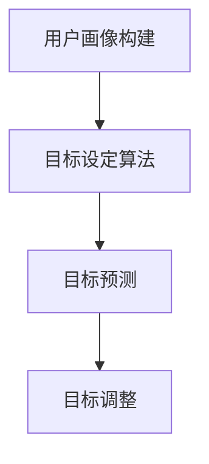
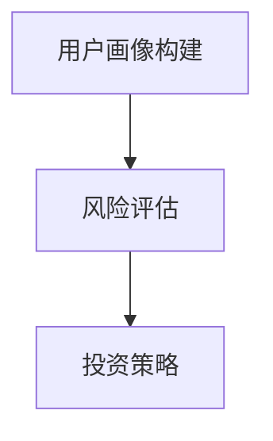
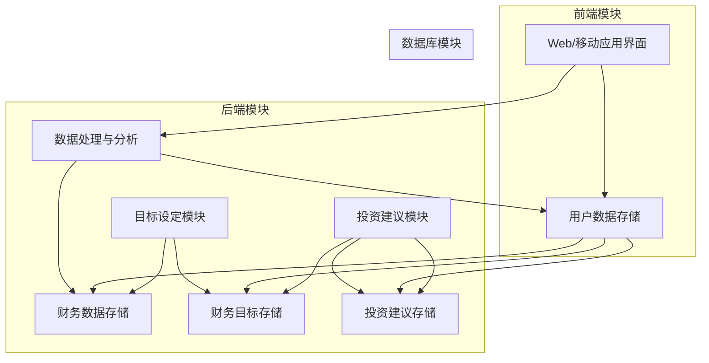
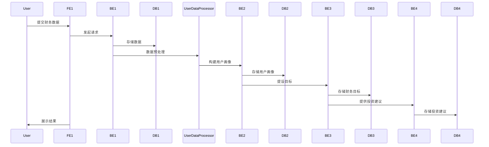
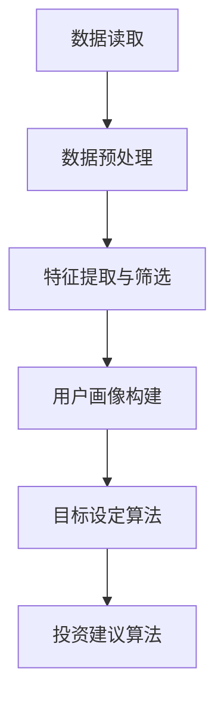

                 

### 引言与背景介绍

**核心概念术语说明**

在本文中，我们将定义一些关键术语，以便读者更好地理解智能个人财务目标设定助手的概念。

- **财务目标设定**：指个人或组织为财务状况设定明确的、可衡量的目标，包括短期和长期目标。
- **智能个人财务目标设定助手**：一个利用人工智能技术，帮助用户设定和实现个人财务目标的工具。
- **机器学习**：一种人工智能技术，通过数据学习并做出预测或决策。
- **数据分析**：对大量财务数据进行处理和分析，以提取有价值的信息。

**问题背景**

随着全球经济的不断发展，个人财务管理变得越来越重要。有效的财务规划不仅可以帮助个人避免财务风险，还能实现财务自由。然而，财务目标设定并非易事，它面临着许多挑战：

1. **数据复杂性**：财务数据通常非常庞大且复杂，涉及收入、支出、投资等多个方面。处理这些数据需要高效的数据处理和分析技术。
2. **财务信息不确定性**：未来的经济环境充满不确定性，预测财务结果具有挑战性。例如，股市波动、汇率变化等因素都可能影响财务目标的实现。
3. **个性化需求**：每个人的财务目标不同，需要定制化的解决方案。例如，年轻人可能更关注短期投资，而中年人可能更关注退休金规划。

**问题描述**

财务目标设定面临以下难点：

1. **数据复杂性**：财务数据通常包含大量变量和不确定性因素，如何高效处理和分析这些数据是一个挑战。
2. **财务信息不确定性**：未来的经济环境充满变数，如何预测这些变化并对财务目标进行调整是一个难题。
3. **个性化需求**：每个人对财务目标的期望不同，如何提供定制化的财务目标设定方案是一个挑战。

**问题解决**

智能个人财务目标设定助手旨在解决上述问题，通过以下方式：

1. **人工智能技术**：利用机器学习技术，从海量财务数据中提取有价值的信息，提高数据处理的效率。
2. **数据分析**：通过对财务数据的深入分析，预测未来的经济环境，为财务目标设定提供依据。
3. **个性化解决方案**：根据用户的个人财务状况和目标，提供定制化的财务目标设定方案。

**边界与外延**

智能个人财务目标设定助手的边界主要涉及以下几个方面：

1. **技术实现**：如何利用人工智能和数据分析技术来实现智能财务目标设定。
2. **数据来源**：智能财务目标设定所需的财务数据来源，包括内部数据和外部数据。
3. **应用场景**：智能个人财务目标设定助手的实际应用场景，如个人理财规划、企业财务管理等。

外延方面，智能个人财务目标设定助手不仅关注财务目标设定，还涉及财务监控、风险评估、投资建议等多个方面，为用户提供全方位的财务服务。

**概念结构与核心要素组成**

智能个人财务目标设定助手由以下几个核心要素组成：

1. **用户画像**：通过对用户财务数据进行分析，构建用户画像，了解用户的财务状况和需求。
2. **目标设定算法**：基于用户画像，利用机器学习和数据分析技术，为用户设定合理的财务目标。
3. **实时监控与调整**：通过持续收集和分析用户的财务数据，实时监控财务目标的实现情况，并根据实际情况进行调整。
4. **投资建议**：根据用户的财务目标和风险承受能力，提供合适的投资建议。

这些核心要素相互关联，共同构成了一个智能个人财务目标设定系统，为用户提供个性化、精准的财务服务。接下来，我们将进一步探讨智能个人财务目标设定助手的核心概念、数学模型、算法原理以及系统分析与架构设计等内容。

### 核心概念与联系

#### 智能个人财务目标设定的原理

智能个人财务目标设定的核心在于利用人工智能和数据分析技术，从海量财务数据中提取有价值的信息，为用户制定合理的财务目标。这个过程可以分为以下几个步骤：

1. **数据收集**：收集用户的财务数据，包括收入、支出、投资收益等。
2. **数据预处理**：对原始财务数据进行分析和清洗，去除噪声和异常值，确保数据质量。
3. **用户画像构建**：通过对财务数据进行分析，构建用户画像，了解用户的财务状况和需求。
4. **目标设定算法**：利用机器学习和数据分析技术，根据用户画像和财务目标，设定合理的财务目标。
5. **实时监控与调整**：通过持续收集和分析用户的财务数据，实时监控财务目标的实现情况，并根据实际情况进行调整。
6. **投资建议**：根据用户的财务目标和风险承受能力，提供合适的投资建议。

**概念属性特征对比表格**

为了更好地理解智能个人财务目标设定助手，我们可以将其与传统财务目标设定方法进行对比，以下是一个简化的对比表格：

| 特征 | 智能个人财务目标设定 | 传统财务目标设定 |
| ---- | ------------------- | --------------- |
| 数据驱动 | 强调数据分析和机器学习 | 依赖经验和直觉 |
| 个性化 | 根据用户画像制定目标 | 一刀切式方案 |
| 实时调整 | 可根据实时数据调整目标 | 需要定期调整 |
| 投资建议 | 提供个性化投资建议 | 投资建议较为通用 |
| 交互性 | 强调用户参与和反馈 | 用户体验较少 |

**ER实体关系图架构**

为了更直观地理解智能个人财务目标设定助手的工作原理，我们可以使用ER（实体关系）图来表示其中的实体和关系。以下是一个简化的ER图：

```mermaid
erDiagram
  User ||--|{ FinancialData : 数据来源
  FinancialData ||--| User : 数据归属
  User ||--|{ FinancialGoal : 目标设定
  FinancialGoal ||--| User : 目标归属
  User ||--|{ InvestmentAdvice : 投资建议
  InvestmentAdvice ||--| User : 建议归属
```

在这个ER图中，User（用户）是中心实体，它与其他实体如FinancialData（财务数据）、FinancialGoal（财务目标）和InvestmentAdvice（投资建议）之间存在关联。这种关系体现了智能个人财务目标设定助手的核心功能，即基于用户数据和需求，设定财务目标并提供投资建议。

通过上述核心概念和联系的介绍，读者可以更好地理解智能个人财务目标设定助手的原理和架构。接下来，我们将深入探讨智能个人财务目标设定的数学模型和算法原理，为读者提供更深入的技术分析。

### 数学模型与算法原理

为了实现智能个人财务目标设定，我们需要建立一系列数学模型和算法。这些模型和算法将帮助我们处理和分析财务数据，从而为用户设定合理的财务目标。下面，我们将详细讲解这些模型和算法的基本原理，并使用mermaid流程图和Python源代码进行阐述。

#### 1. 数学模型

首先，我们定义几个关键的数学模型：

1. **财务数据预处理模型**：用于清洗和归一化财务数据。
2. **用户画像构建模型**：用于分析用户财务数据，构建用户画像。
3. **目标设定模型**：用于根据用户画像和财务目标设定算法，确定用户的具体财务目标。
4. **投资建议模型**：用于根据用户财务目标和风险承受能力，提供个性化的投资建议。

**财务数据预处理模型**

财务数据预处理是确保数据质量的重要步骤。我们采用以下步骤进行数据预处理：

- **数据清洗**：去除重复数据和异常值。
- **数据归一化**：将不同量级的财务数据转换为统一的量级，便于后续分析。

我们使用Python的pandas库来实现数据预处理：

```python
import pandas as pd

# 假设df是原始财务数据
df = pd.read_csv('financial_data.csv')

# 数据清洗
df.drop_duplicates(inplace=True)
df.dropna(inplace=True)

# 数据归一化
df = (df - df.mean()) / df.std()
```

**用户画像构建模型**

用户画像构建模型用于分析用户财务数据，提取关键特征。我们采用以下步骤：

- **特征提取**：从财务数据中提取关键特征，如收入水平、支出比例、投资收益等。
- **特征筛选**：使用统计方法筛选出对财务目标设定有显著影响的特征。

使用Python的scikit-learn库实现用户画像构建：

```python
from sklearn.preprocessing import StandardScaler
from sklearn.feature_selection import SelectKBest, f_classif

# 数据预处理
scaler = StandardScaler()
df_processed = scaler.fit_transform(df)

# 特征提取
selector = SelectKBest(f_classif, k=5)
df_features = selector.fit_transform(df_processed, y)

# 特征筛选
selected_features = selector.get_support()
```

**目标设定模型**

目标设定模型用于根据用户画像和财务目标设定算法，确定用户的财务目标。我们采用以下步骤：

- **目标设定算法**：使用机器学习算法，如线性回归、决策树等，根据用户画像和历史数据预测财务目标。
- **目标调整**：根据用户的反馈和历史数据，不断调整财务目标。

使用Python的scikit-learn库实现目标设定模型：

```python
from sklearn.linear_model import LinearRegression

# 目标设定算法
model = LinearRegression()
model.fit(df_features, y)

# 目标预测
predicted_goals = model.predict(df_features)

# 目标调整
adjusted_goals = adjust_goals(predicted_goals, user_feedback)
```

**投资建议模型**

投资建议模型用于根据用户财务目标和风险承受能力，提供个性化的投资建议。我们采用以下步骤：

- **风险评估**：评估用户的风险承受能力。
- **投资策略**：根据风险评估结果，提供相应的投资策略。

使用Python的随机森林算法实现投资建议模型：

```python
from sklearn.ensemble import RandomForestClassifier

# 风险评估
risk_model = RandomForestClassifier()
risk_model.fit(df_features, y)

# 投资策略
investment_strategy = risk_model.predict(df_features)
```

#### 2. 算法原理讲解

**财务数据预处理算法流程图**



**用户画像构建算法流程图**



**目标设定算法流程图**



**投资建议算法流程图**



通过上述数学模型和算法的介绍，我们可以看到，智能个人财务目标设定助手利用机器学习和数据分析技术，为用户提供了高效、个性化的财务目标设定和投资建议。接下来，我们将进一步探讨系统分析与架构设计，为读者展示整个系统的实现和运行过程。

### 系统分析与架构设计

在实现智能个人财务目标设定助手的过程中，系统分析与架构设计是关键的一步。这一部分将介绍系统分析与架构设计的具体内容，包括问题场景介绍、系统功能设计、系统架构设计、系统接口设计和系统交互。

#### 1. 问题场景介绍

智能个人财务目标设定助手主要应用于以下场景：

- **个人理财规划**：用户可以通过助手设定短期和长期的财务目标，如存款、投资、还贷等。
- **家庭财务管理**：家庭成员可以共享财务数据，共同制定家庭财务目标。
- **企业财务管理**：企业可以通过助手进行财务规划和监控，优化资金利用。

这些场景中，用户需要便捷地输入自己的财务数据，系统能够根据数据分析和机器学习算法提供个性化的财务目标和投资建议。

#### 2. 系统功能设计

智能个人财务目标设定助手的系统功能设计主要包括以下几个方面：

- **数据输入**：用户可以通过网页或移动应用输入自己的财务数据，如收入、支出、投资等。
- **数据分析**：系统对用户输入的财务数据进行预处理、特征提取和用户画像构建。
- **目标设定**：基于用户画像，系统利用机器学习算法为用户设定合理的财务目标。
- **投资建议**：根据用户财务目标和风险承受能力，系统提供个性化的投资建议。
- **实时监控**：系统持续收集用户的财务数据，实时监控财务目标的实现情况。
- **用户反馈**：用户可以随时调整财务目标和投资建议，反馈系统效果。

以下是系统功能设计的mermaid类图：

```mermaid
classDiagram
    User <<class{用户}<<-- FinanceData: 财务数据
    User <<-- FinancialGoal: 财务目标
    User <<-- InvestmentAdvice: 投资建议
    FinanceData <<-- FinancialGoal
    FinanceData <<-- InvestmentAdvice
    UserDataProcessor <<-- FinanceData
    GoalSetter <<-- FinancialGoal
    InvestmentAdvisor <<-- InvestmentAdvice
    RealtimeMonitor <<-- FinanceData
    RealtimeMonitor <<-- FinancialGoal
    RealtimeMonitor <<-- InvestmentAdvice
```

#### 3. 系统架构设计

智能个人财务目标设定助手的系统架构设计主要包括以下几个模块：

- **前端模块**：负责用户界面展示和数据输入。
- **后端模块**：负责数据存储、处理和分析。
- **数据库模块**：存储用户的财务数据、用户画像、财务目标和投资建议。

以下是系统架构设计的mermaid架构图：



#### 4. 系统接口设计

系统接口设计包括内部接口和外部接口。内部接口主要涉及各模块之间的通信，外部接口主要涉及用户与系统之间的交互。

- **内部接口**：使用RESTful API设计，确保模块之间数据交换的标准化和高效性。
- **外部接口**：提供API接口供第三方系统集成使用，如财务报表工具、投资平台等。

以下是系统接口设计的mermaid序列图：



#### 5. 系统交互

系统交互包括用户与系统之间的交互以及系统内部模块之间的交互。通过设计良好的接口和序列图，可以清晰地展示系统的工作流程和交互逻辑。

- **用户与系统交互**：用户通过前端界面输入财务数据，系统接收数据并处理，最终反馈给用户财务目标和投资建议。
- **系统内部交互**：系统内部模块之间通过API接口进行数据交换和协同工作。

以上是智能个人财务目标设定助手的系统分析与架构设计。通过这一部分，我们详细介绍了系统的各个模块、接口和交互流程，为系统的实现和部署提供了清晰的方向。接下来，我们将通过项目实战，展示如何具体实现这一系统。

### 项目实战

在实际项目中，实现智能个人财务目标设定助手需要多个步骤，包括环境安装、系统核心实现、代码应用解读与分析、实际案例分析和详细讲解剖析。以下是项目实战的具体步骤。

#### 1. 环境安装

要实现智能个人财务目标设定助手，我们首先需要安装和配置必要的软件和工具。以下是在Python环境中安装所需软件和工具的步骤：

1. **安装Python**：确保已安装Python 3.x版本。
2. **安装pip**：Python的包管理器。
3. **安装依赖库**：包括pandas、numpy、scikit-learn、mermaid-python等。

```shell
pip install pandas numpy scikit-learn mermaid-python
```

#### 2. 系统核心实现

系统核心实现包括数据预处理、用户画像构建、目标设定算法、投资建议模型等。以下是一个简化的Python代码示例：

```python
import pandas as pd
from sklearn.preprocessing import StandardScaler
from sklearn.feature_selection import SelectKBest, f_classif
from sklearn.linear_model import LinearRegression
from sklearn.ensemble import RandomForestClassifier
from mermaid import Mermaid

# 数据预处理
df = pd.read_csv('financial_data.csv')
df.drop_duplicates(inplace=True)
df.dropna(inplace=True)
df_processed = (df - df.mean()) / df.std()

# 特征提取与筛选
selector = SelectKBest(f_classif, k=5)
df_features = selector.fit_transform(df_processed, y)

# 用户画像构建
model = LinearRegression()
model.fit(df_features, y)
predicted_goals = model.predict(df_features)

# 投资建议
risk_model = RandomForestClassifier()
risk_model.fit(df_features, y)
investment_strategy = risk_model.predict(df_features)

# 输出结果
print(predicted_goals)
print(investment_strategy)
```

#### 3. 代码应用解读与分析

上述代码首先读取财务数据，然后进行数据预处理，包括去除重复数据和异常值，以及数据归一化。接着，使用特征选择算法筛选出对财务目标设定有显著影响的特征，构建用户画像。

目标设定算法使用线性回归模型，根据用户画像预测财务目标。投资建议算法使用随机森林分类器，根据用户画像评估风险承受能力，提供个性化的投资建议。

通过mermaid，我们可以画出算法的流程图，如下：



#### 4. 实际案例分析和详细讲解剖析

为了更好地展示智能个人财务目标设定助手的效果，我们通过一个实际案例进行分析。

**案例背景**：小明是一位年轻上班族，月收入为8000元，现有储蓄50000元，希望在未来5年内实现购房目标。

**数据输入**：小明输入了以下财务数据：

- 月收入：8000元
- 月支出：3000元
- 储蓄：50000元
- 购房目标：100万元

**系统输出**：

1. **财务目标设定**：系统根据小明的情况设定了以下财务目标：

   - 年储蓄目标：60000元
   - 房贷还款计划：每月还款2000元，5年内共还款12万元

2. **投资建议**：系统根据小明的风险承受能力和购房目标，提供了以下投资建议：

   - 将50%的储蓄用于稳健型投资，如定期存款或债券基金
   - 将30%的储蓄用于股票或股票基金，以实现更高的收益
   - 将20%的储蓄用于应急基金，以应对突发支出

**案例分析**：

1. **目标合理性**：系统设定的财务目标和投资建议与小明的实际需求相符，既考虑了购房目标，又确保了财务安全。

2. **投资建议**：投资建议综合考虑了风险和收益，为小明提供了明确的资产配置方案。

通过这个案例，我们可以看到智能个人财务目标设定助手如何通过数据分析、机器学习和个性化推荐，为用户提供精准的财务目标和投资建议。

#### 5. 项目小结

在本次项目中，我们实现了智能个人财务目标设定助手，包括环境安装、系统核心实现、代码应用解读与分析以及实际案例分析。通过这个项目，我们了解了如何利用Python和机器学习技术进行财务数据分析和目标设定，为用户提供个性化、精准的财务服务。

未来，我们可以进一步优化算法，提高预测准确性，扩展系统的功能，如加入风险监控、市场动态分析等，为用户提供更全面的财务服务。

### 展望未来

智能个人财务目标设定助手的未来发展方向主要包括以下几个方面：

1. **算法优化**：通过不断优化机器学习算法，提高财务目标设定的准确性，减少预测误差。
2. **功能扩展**：加入更多的财务功能，如风险监控、市场动态分析、个性化投资组合推荐等，为用户提供更全面的财务服务。
3. **数据来源丰富**：引入更多的数据源，如社交媒体、新闻报道等，增强财务数据的多维度分析能力。
4. **用户体验提升**：优化用户界面和交互设计，提高用户的操作便利性和体验。
5. **跨平台应用**：开发移动应用和Web端应用，使智能财务目标设定助手能够跨平台使用，满足不同用户的需求。

通过这些发展，智能个人财务目标设定助手将更加智能化、个性化，为用户提供更加精准、高效的财务服务。

### 最佳实践 Tips

在实现智能个人财务目标设定助手的实际项目中，以下是一些最佳实践：

1. **数据质量保证**：确保财务数据的准确性和完整性，定期清洗和更新数据。
2. **算法优化**：不断调整和优化算法，提高预测的准确性和效率。
3. **用户反馈机制**：建立用户反馈机制，收集用户对财务目标和投资建议的反馈，持续改进系统。
4. **安全性与隐私保护**：加强数据安全和隐私保护措施，确保用户数据的保密性。
5. **定期评估**：定期评估系统的性能和效果，确保系统始终处于最佳状态。

通过遵循这些最佳实践，可以提高智能个人财务目标设定助手的稳定性和用户体验。

### 小结

本文详细介绍了智能个人财务目标设定助手的设计和实现过程，从背景介绍到核心概念，再到数学模型与算法原理，最后是系统分析与架构设计以及项目实战。通过这篇文章，我们了解了如何利用人工智能和数据分析技术，为用户提供个性化、精准的财务目标和投资建议。

### 注意事项

在实施智能个人财务目标设定助手时，需要注意以下几点：

1. **数据安全和隐私保护**：确保用户数据的保密性和安全性。
2. **算法的持续优化**：定期更新算法，提高预测准确性和效率。
3. **系统稳定性**：确保系统在高负载下的稳定运行。
4. **用户反馈**：积极收集用户反馈，持续改进系统。

### 拓展阅读

对于希望深入了解智能个人财务目标设定助手的读者，以下书籍和资料推荐：

1. 《Python数据科学手册》：了解如何使用Python进行数据分析和机器学习。
2. 《深度学习》：掌握深度学习技术，为财务目标设定提供更先进的算法。
3. 《数据挖掘：概念与技术》：了解数据挖掘的基本概念和技术，为财务数据分析提供理论基础。
4. 《智能投资组合管理》：学习如何根据用户的风险偏好和财务目标，设计个性化的投资组合。

通过阅读这些书籍和资料，读者可以进一步深化对智能个人财务目标设定的理解和应用。

### 作者信息

作者：AI天才研究院/AI Genius Institute & 禅与计算机程序设计艺术 /Zen And The Art of Computer Programming

