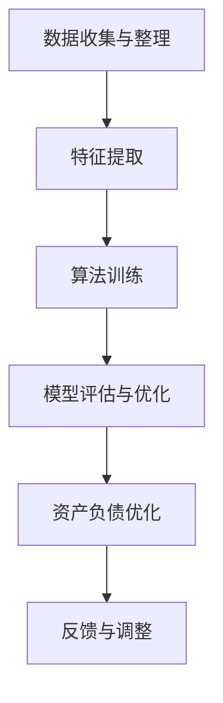
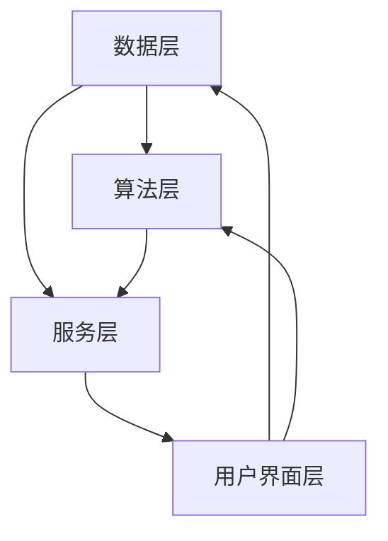
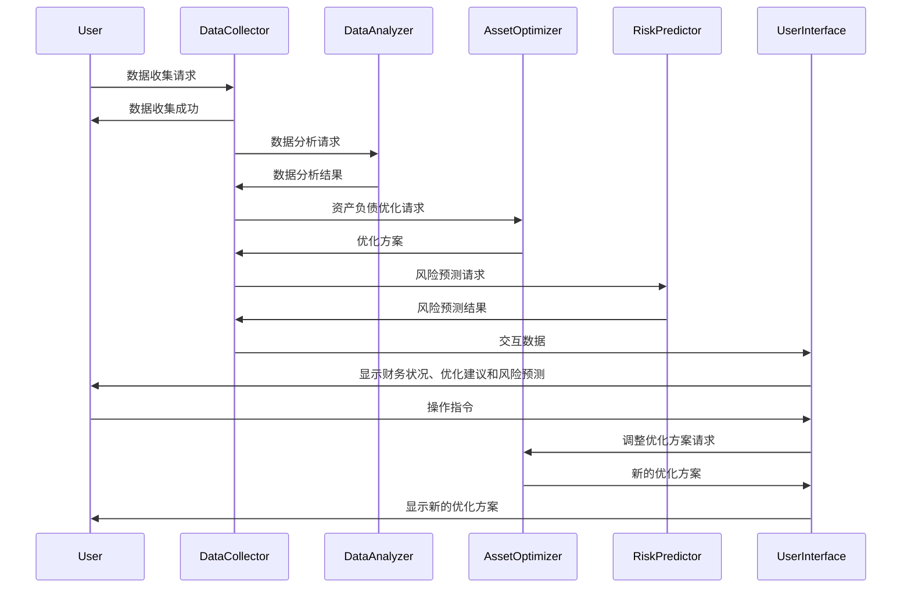

                 

### 第一部分：问题背景

#### 1.1.1 问题背景

在当今经济全球化和信息化迅速发展的时代，个人资产负债管理已经成为人们日常理财的重要组成部分。传统的个人资产负债管理主要依赖于个人经验、财务报表和简单的财务计算工具。然而，随着生活节奏的加快和信息量的激增，传统方式在效率、准确性和深度分析方面逐渐显露出不足。

首先，传统资产负债管理往往依赖手工记录和定期核算，这导致信息不及时、不完整，无法提供实时的财务状况。其次，传统方式的分析能力有限，很难深入挖掘数据背后的潜在问题和机会。此外，随着金融市场和投资产品的多样化，个人需要更加精准和个性化的资产负债管理方案来优化其财务状况。

为了解决这些问题，智能个人资产负债表优化系统应运而生。该系统利用人工智能和大数据分析技术，能够自动收集、整理和分析个人财务数据，提供个性化、智能化的资产负债管理方案。这不仅提高了管理的效率和准确性，还能深入挖掘数据价值，为个人财务决策提供有力支持。

#### 1.1.2 问题描述

个人资产负债表是记录个人资产和负债的财务报表，其内容和构成包括以下几个方面：

1. **资产**：包括现金、存款、投资、房产、车辆、保险等。
2. **负债**：包括信用卡欠款、房贷、车贷、学生贷款等。

个人资产负债管理的目标是确保个人财务健康、平衡和可持续增长，具体目标包括：

- **资产增值**：通过投资和理财，实现资产价值的增长。
- **负债控制**：合理规划债务，避免过度负债和利息负担。
- **财务安全**：确保个人和家庭在经济风险面前有足够的保障。

然而，在传统个人资产负债管理中，存在以下难题：

1. **信息不及时、不准确**：由于缺乏有效的数据收集和整理机制，个人资产负债表的信息常常滞后或不准确。
2. **分析能力有限**：传统方式主要依赖于经验判断，缺乏深入的量化分析和预测能力。
3. **个性化不足**：传统管理方案往往一刀切，无法满足个人多样化的财务需求。
4. **风险预测困难**：无法及时识别和应对潜在的财务风险。

这些难题使得传统个人资产负债管理越来越难以适应现代社会的需求，因此，开发智能个人资产负债表优化系统成为解决这些问题的必然选择。

#### 1.1.3 问题解决

智能个人资产负债表优化系统通过以下原理和功能实现了对传统方式的优化：

1. **自动化数据收集与整理**：系统能够自动从各种渠道收集个人的财务数据，包括银行账户、投资账户、信用卡等，并进行实时整理和更新，确保信息的及时性和准确性。

2. **智能化数据分析**：系统采用先进的机器学习和数据分析技术，对个人财务数据进行分析，识别潜在的财务问题和机会，提供个性化的资产负债管理建议。

3. **动态调整管理方案**：系统会根据个人的财务状况和市场变化，动态调整资产负债管理方案，确保财务目标的实现。

4. **风险预测与防范**：系统利用大数据分析和预测模型，对个人的财务风险进行预测和评估，提供风险防范措施，确保财务安全。

通过这些功能和优势，智能个人资产负债表优化系统能够有效地解决传统方式存在的问题，为个人提供更加高效、精准和个性化的资产负债管理服务。

#### 1.1.4 边界与外延

智能个人资产负债表优化系统的适用范围包括所有希望优化个人财务状况的人群，特别是以下几类人群：

- **高收入人群**：他们拥有较为复杂的财务结构，需要专业的资产负债管理来确保财务安全和增值。
- **家庭主妇和家庭主男**：他们负责家庭的财务管理，需要准确、及时的财务信息来支持家庭决策。
- **年轻投资者**：他们需要个性化的投资建议和风险管理，以便更好地规划未来。

此外，智能个人资产负债表优化系统还适用于以下场景：

- **财务规划**：帮助个人制定长期和短期的财务规划，实现财务目标。
- **债务管理**：提供债务优化方案，减少利息负担，提高还款效率。
- **投资决策**：根据个人风险偏好和财务状况，提供投资建议，优化投资组合。

系统的核心要素包括个人资产负债表、智能算法和数据分析。个人资产负债表是系统的数据基础，智能算法负责数据分析和优化，数据分析则提供了深度分析和预测能力。这些要素相互关联，共同构成了一个完整、智能化的个人资产负债管理解决方案。

#### 1.1.5 概念结构与核心要素组成

为了深入理解智能个人资产负债表优化系统，我们需要明确系统的核心概念结构和要素组成。

1. **个人资产负债表**：这是系统的数据基础，包括个人所有资产和负债的详细记录。资产包括现金、存款、投资、房产、车辆等；负债包括信用卡欠款、房贷、车贷等。通过详细记录和分析个人资产负债表，系统能够了解个人的财务状况。

2. **智能算法**：智能算法是系统的核心组件，负责对个人财务数据进行处理和分析。它利用机器学习和大数据分析技术，识别潜在的风险和机会，提供个性化的管理建议。常见的智能算法包括聚类分析、回归分析、时间序列分析等。

3. **数据分析**：数据分析提供了系统的深度分析能力和预测能力。通过数据挖掘技术，系统能够从大量的财务数据中提取有价值的信息，为决策提供支持。数据分析还包括数据清洗、数据可视化、数据预测等功能。

这些核心要素相互关联，共同构成了智能个人资产负债表优化系统的完整框架。个人资产负债表提供了数据基础，智能算法负责数据分析和优化，数据分析则提供了深度分析和预测能力，三者的结合使得系统能够高效、精准地管理个人财务。

### 第二部分：核心概念与联系

#### 2.1.1 个人资产负债表的概念

个人资产负债表是一种财务报表，用于记录个人的资产和负债。资产是指个人拥有的具有经济价值的资源，如现金、存款、投资、房产、车辆等；负债则是个人需要偿还的债务，如信用卡欠款、房贷、车贷等。

个人资产负债表的主要目的是反映个人的财务状况，通过对比资产和负债，个人可以了解自己的财务健康程度，从而做出更明智的财务决策。具体来说，资产和负债可以分为以下几类：

1. **流动资产**：包括现金、存款、短期投资等，这些资产容易转换成现金，满足日常生活中的支付需求。
2. **固定资产**：包括房产、车辆等，这些资产的价值相对稳定，但变现速度较慢。
3. **投资性资产**：包括股票、债券、基金等，这些资产的价值波动较大，但有可能带来较高的回报。
4. **流动负债**：包括信用卡欠款、短期借款等，这些负债需要在短期内偿还。
5. **长期负债**：包括房贷、车贷、长期借款等，这些负债的偿还期限较长。

个人资产负债表的编制方法如下：

1. **收集数据**：首先，个人需要收集所有资产和负债的相关信息，包括金额、类别、还款期限等。
2. **分类记录**：将资产和负债按照上述分类标准进行记录，并确保数据的准确性和完整性。
3. **编制报表**：使用财务软件或表格工具，将资产和负债进行汇总，生成个人资产负债表。

#### 2.1.2 智能算法的概念

智能算法是计算机科学和人工智能领域的重要分支，它通过模拟人类思维过程，实现数据分析和决策制定。智能算法的核心在于其自主学习和自我优化能力，能够在大量数据中找到规律和模式，从而提供更准确的预测和分析结果。

智能算法主要包括以下几种类型：

1. **机器学习**：机器学习通过训练模型，从数据中学习规律和模式，然后利用这些规律进行预测和决策。常见的机器学习算法包括线性回归、逻辑回归、决策树、随机森林等。

2. **深度学习**：深度学习是机器学习的一种重要分支，它通过多层神经网络模型，对大量数据进行学习和处理，能够实现更复杂的特征提取和模式识别。常见的深度学习模型包括卷积神经网络（CNN）、循环神经网络（RNN）、生成对抗网络（GAN）等。

3. **强化学习**：强化学习通过模拟智能体与环境之间的交互过程，学习最优策略以实现目标。常见的强化学习算法包括Q-learning、SARSA、DQN等。

智能算法在资产负债表优化中的应用主要体现在以下几个方面：

1. **数据挖掘**：智能算法能够从大量的财务数据中挖掘出有价值的信息，如潜在的财务风险、投资机会等。

2. **预测分析**：智能算法可以通过历史数据，预测未来的财务状况，为个人提供个性化的资产负债管理建议。

3. **优化决策**：智能算法可以基于数据分析和预测结果，自动生成最优的资产负债管理方案，帮助个人实现财务目标。

4. **风险控制**：智能算法可以通过对市场数据的实时监控和分析，及时识别和应对潜在的财务风险。

#### 2.1.3 数据分析的概念

数据分析是通过系统方法，从数据中提取有价值信息的过程。数据分析不仅包括数据的收集、整理和存储，还涉及数据的挖掘、分析和可视化。数据分析的主要目的是通过数据，帮助企业或个人做出更明智的决策。

数据分析的方法包括：

1. **描述性分析**：描述性分析通过统计数据和图表，描述数据的基本特征和分布情况，帮助用户理解数据。

2. **诊断性分析**：诊断性分析通过探索数据之间的关联性和异常值，识别数据中的问题和异常。

3. **预测性分析**：预测性分析利用历史数据，建立预测模型，对未来事件进行预测，为决策提供支持。

4. **规范性分析**：规范性分析通过建立业务规则和标准，对数据进行分析和评估，确保数据符合业务要求。

数据分析的工具包括：

1. **Excel**：Excel 是最常用的数据分析工具之一，它提供了丰富的数据分析和可视化功能。

2. **Python**：Python 是一种广泛使用的编程语言，具有强大的数据分析库，如Pandas、NumPy、Scikit-learn、Matplotlib等。

3. **R**：R 是专门为统计分析和数据科学设计的语言，具有丰富的统计和数据分析包。

4. **Tableau**：Tableau 是一款强大的数据可视化工具，能够将复杂的数据以直观的方式展示出来。

在智能个人资产负债表优化系统中，数据分析起到了至关重要的作用：

1. **数据收集**：系统通过自动化方式，从各种渠道收集个人的财务数据。

2. **数据整理**：系统对收集到的数据进行分析和清洗，确保数据的准确性和完整性。

3. **数据挖掘**：系统利用智能算法，从大量的财务数据中挖掘出有价值的信息，如投资机会、财务风险等。

4. **数据预测**：系统利用历史数据和预测模型，对个人的未来财务状况进行预测，为决策提供支持。

5. **数据可视化**：系统通过数据可视化工具，将分析结果以图表形式展示，帮助用户更好地理解财务状况。

通过以上分析，我们可以看到，个人资产负债表、智能算法和数据分析是智能个人资产负债表优化系统的三个核心概念。个人资产负债表提供了数据基础，智能算法负责数据分析和优化，数据分析则提供了深度分析和预测能力。这三个概念相互关联，共同构成了一个完整、智能化的个人资产负债管理解决方案。

#### 3.1.1 个人资产负债表与智能算法属性特征对比

在理解个人资产负债表与智能算法的概念后，我们需要深入探讨两者在属性特征上的对比，以便更清楚地看到智能算法在优化个人资产负债表方面的独特优势。

**传统资产负债表**

- **数据来源**：传统资产负债表主要依赖于人工记录和定期汇总，数据来源相对单一，可能缺乏实时性和准确性。
- **分析方法**：分析主要依赖于个人经验，对数据的处理能力有限，难以进行复杂的数据挖掘和预测。
- **灵活性**：传统资产负债表在应对快速变化的经济环境时，灵活性和适应性较差，难以提供实时、个性化的资产负债管理方案。

**智能资产负债表**

- **数据来源**：智能资产负债表通过自动化手段，从各种渠道（如银行账户、投资平台、信用卡账单等）收集数据，确保数据的实时性和准确性。
- **分析方法**：智能算法利用机器学习和大数据分析技术，能够对海量数据进行分析，挖掘出潜在的风险和机会，提供深入、个性化的分析报告。
- **灵活性**：智能资产负债表具有高度的灵活性和适应性，可以根据个人财务状况和市场变化，动态调整资产负债管理方案，确保财务目标的实现。

**智能算法在资产负债表优化中的应用**

1. **风险预测**：智能算法可以通过分析历史数据和市场动态，预测未来可能出现的财务风险，如信用风险、市场风险等，并提供相应的应对策略。
2. **投资建议**：基于对个人风险偏好和财务状况的分析，智能算法可以提供个性化的投资建议，优化投资组合，实现资产增值。
3. **负债管理**：智能算法可以帮助个人制定合理的负债规划，降低利息负担，提高还款效率。
4. **财务规划**：智能算法可以协助个人制定长期和短期的财务规划，确保财务目标的实现。

通过以上对比，我们可以看到，智能算法在数据来源、分析方法和灵活性方面具有显著优势，这使得智能个人资产负债表优化系统能够更高效、更精准地管理个人财务，为个人提供个性化的资产负债管理方案。

#### 4.1.1 ER实体关系图介绍

ER图，即实体-关系图（Entity-Relationship Diagram），是一种用于描述数据模型中实体及其关系的图形表示方法。ER图的基本概念包括实体、属性、关系和键。

- **实体（Entity）**：实体是具有独立存在意义的数据对象，如个人、账户、资产、负债等。
- **属性（Attribute）**：属性是实体的特征或描述，如姓名、年龄、账户余额、欠款金额等。
- **关系（Relationship）**：关系描述实体之间的关联，如个人与账户的关系、资产与负债的关系等。
- **键（Key）**：键用于唯一标识实体或关系，如主键、外键等。

ER图的作用主要体现在以下几个方面：

1. **数据模型设计**：ER图帮助开发者设计数据模型，确保数据的结构化、一致性和完整性。
2. **数据可视化**：ER图以图形化方式展示数据模型，便于理解和交流。
3. **系统开发**：ER图作为系统设计的重要文档，指导数据库设计和应用程序开发。
4. **数据完整性**：ER图通过定义实体关系和约束条件，保证数据的完整性。

#### 4.1.2 个人资产负债表ER图架构

在智能个人资产负债表优化系统中，ER图架构详细描述了系统中的实体及其关系，为数据的存储和处理提供了结构化框架。以下是个人资产负债表ER图的组成部分：

1. **个人（Person）实体**：个人实体是系统中最基本的实体，代表系统管理的个人用户。其主要属性包括个人ID、姓名、性别、出生日期、联系方式等。

2. **资产（Asset）实体**：资产实体代表个人拥有的各种资产，如现金、存款、投资、房产、车辆等。资产实体的主要属性包括资产ID、类型（如现金、存款、股票等）、金额、持有日期等。

3. **负债（Liability）实体**：负债实体代表个人的各种负债，如信用卡欠款、房贷、车贷等。负债实体的主要属性包括负债ID、类型（如信用卡欠款、房贷等）、金额、还款日期等。

4. **账户（Account）实体**：账户实体用于记录个人在不同金融机构的账户信息，如银行账户、投资账户等。其主要属性包括账户ID、类型（如储蓄账户、投资账户等）、余额、开户日期等。

5. **智能算法（Algorithm）实体**：智能算法实体代表用于数据分析和优化的算法模型，如聚类分析、回归分析、时间序列分析等。其主要属性包括算法ID、名称、描述、训练数据集等。

6. **关系（Relationship）**：个人与资产、负债、账户之间的关系通过ER图表示。例如，一个个人可以拥有多个资产和负债，每个资产和负债都与个人实体通过主键关联。账户实体与个人、资产、负债实体之间也存在类似的关系。

以下是个人资产负债表ER图的Mermaid流程图：

```mermaid
entityRelationDiagram

person {
  id (个人ID)
  name (姓名)
  gender (性别)
  birthDate (出生日期)
  phoneNumber (联系方式)
}

asset {
  id (资产ID)
  type (类型)
  amount (金额)
  holdDate (持有日期)
}

liability {
  id (负债ID)
  type (类型)
  amount (金额)
  repaymentDate (还款日期)
}

account {
  id (账户ID)
  type (类型)
  balance (余额)
  openDate (开户日期)
}

algorithm {
  id (算法ID)
  name (名称)
  description (描述)
  trainingDataset (训练数据集)
}

person -> asset : 拥有
person -> liability : 拥有
person -> account : 开户
asset -> person : 属于
liability -> person : 属于
account -> person : 属于
account -> asset : 存放
account -> liability : 存放
```

通过ER图，我们可以清晰地看到系统中各个实体及其关系，这有助于理解系统的架构和数据流动，为后续的系统设计和开发提供了有力的支持。

### 第三部分：算法原理讲解

#### 5.1.1 算法基本原理

智能个人资产负债表优化算法的基本原理是利用机器学习和数据分析技术，对个人财务数据进行处理和分析，以实现资产负债的优化。具体来说，算法的工作流程可以分为以下几个步骤：

1. **数据收集与整理**：首先，系统通过自动化手段从各种渠道（如银行账户、投资平台、信用卡账单等）收集个人财务数据。然后，对这些数据进行清洗、整理和预处理，确保数据的准确性和完整性。

2. **特征提取**：在数据预处理之后，系统会对数据中的特征进行提取，这些特征包括个人的资产类别、金额、负债类别、金额等。特征提取的目的是将原始数据转换为算法可以处理的格式。

3. **算法训练**：系统采用机器学习算法，如决策树、随机森林、支持向量机等，对提取的特征进行训练。训练过程中，算法通过学习历史数据中的规律和模式，构建预测模型。

4. **模型评估与优化**：在训练完成后，系统会使用交叉验证等方法对模型进行评估，评估模型在预测新数据时的准确性和稳定性。如果模型效果不佳，系统会通过调整参数、增加特征等方式进行优化。

5. **资产负债优化**：最后，系统利用训练好的模型，对个人的当前资产负债表进行分析，识别潜在的风险和机会，并提出优化建议。这些建议包括调整资产配置、优化负债结构、提高还款效率等。

#### 5.1.2 算法mermaid流程图

为了更直观地展示智能个人资产负债表优化算法的工作流程，我们可以使用mermaid绘制一个流程图。以下是算法流程图的描述：



以下是具体的流程说明：

1. **数据收集与整理**：系统从各种渠道收集个人财务数据，并进行数据清洗和预处理。
2. **特征提取**：对预处理后的数据提取关键特征，如资产类别、金额、负债类别、金额等。
3. **算法训练**：使用机器学习算法对提取的特征进行训练，构建预测模型。
4. **模型评估与优化**：通过交叉验证等方法评估模型的准确性和稳定性，并进行优化。
5. **资产负债优化**：利用训练好的模型对个人的当前资产负债表进行分析，识别风险和机会，提出优化建议。
6. **反馈与调整**：根据优化效果和用户反馈，调整算法参数和模型，以提高优化效果。

#### 5.1.3 数学模型和公式

智能个人资产负债表优化算法的数学模型和公式是其核心组成部分，用于描述算法的基本原理和计算方法。以下是该算法的数学模型和公式：

1. **资产价值评估**：

   资产价值 \( V_a \) 可以通过以下公式计算：

   \[ V_a = \sum_{i=1}^{n} (w_i \cdot V_i) \]

   其中，\( w_i \) 表示资产 \( i \) 的权重，\( V_i \) 表示资产 \( i \) 的市场价值。

2. **负债风险评估**：

   负债风险 \( R_l \) 可以通过以下公式计算：

   \[ R_l = \frac{\sum_{i=1}^{m} (w_i \cdot R_i)}{L} \]

   其中，\( w_i \) 表示负债 \( i \) 的权重，\( R_i \) 表示负债 \( i \) 的风险水平，\( L \) 表示总负债。

3. **资产负债优化目标函数**：

   资产负债优化目标函数 \( J \) 可以通过以下公式计算：

   \[ J = \max \left( \sum_{i=1}^{n} (w_i \cdot V_i) - \sum_{j=1}^{m} (w_j \cdot R_j), \text{约束条件} \right) \]

   其中，约束条件包括资产和负债的权重之和为1，即 \( \sum_{i=1}^{n} w_i = 1 \) 和 \( \sum_{j=1}^{m} w_j = 1 \)。

4. **风险调整收益**：

   风险调整收益 \( R_a \) 可以通过以下公式计算：

   \[ R_a = \frac{V_a - C_l}{R_l} \]

   其中，\( C_l \) 表示负债成本。

这些数学模型和公式为算法的优化提供了理论基础，通过它们可以量化个人资产负债的优化目标，并在算法训练和决策过程中进行有效的计算和调整。

#### 5.1.4 举例说明

为了更直观地理解智能个人资产负债表优化算法的原理和应用，我们将通过一个实际案例来进行详细讲解。

假设我们有一位名叫李明的用户，他的财务状况如下：

- **资产**：
  - 现金：10000元
  - 存款：30000元
  - 投资组合：包括股票、基金、债券，总价值为50000元
  - 房产：一套自住房产，市值200万元

- **负债**：
  - 信用卡欠款：10000元
  - 房贷：100万元，已偿还50万元，剩余50万元未偿还

李明的目标是优化他的个人资产负债表，实现资产增值和负债控制。

1. **数据收集与整理**：

   首先，系统会从李明的银行账户、投资平台、信用卡账单等渠道收集他的财务数据。然后，对这些数据进行分析和清洗，确保数据的准确性和完整性。

2. **特征提取**：

   系统将李明的资产和负债按照类别进行提取，形成以下特征：

   - **资产特征**：
     - 现金金额：10000元
     - 存款金额：30000元
     - 投资组合总价值：50000元
     - 房产市值：200万元

   - **负债特征**：
     - 信用卡欠款金额：10000元
     - 房贷余额：50万元

3. **算法训练**：

   系统采用随机森林算法对提取的特征进行训练，构建预测模型。训练过程中，算法通过学习历史数据中的规律和模式，优化模型参数。

4. **模型评估与优化**：

   通过交叉验证方法，系统对训练好的模型进行评估，确保模型在预测新数据时的准确性和稳定性。如果模型效果不佳，系统会通过调整参数、增加特征等方式进行优化。

5. **资产负债优化**：

   利用训练好的模型，系统对李明的当前资产负债表进行分析，识别潜在的风险和机会，并提出优化建议。

   - **资产优化**：
     - 现金和存款的流动性较高，建议保持一定比例，以应对日常支出。
     - 投资组合可以适当增加高风险、高回报的投资，如股票和基金，以提高资产增值潜力。
     - 房产市值较高，可以考虑通过出租或出售部分房产来增加现金流。

   - **负债优化**：
     - 信用卡欠款利息较高，建议尽快偿还。
     - 房贷剩余50万元，可以尝试与银行协商降低利率或缩短还款期限，以减少利息负担。

6. **反馈与调整**：

   根据李明的反馈和实际财务状况的变化，系统会动态调整优化建议，以确保财务目标的实现。

通过这个实际案例，我们可以看到智能个人资产负债表优化算法如何帮助李明优化他的财务状况。算法通过数据分析和预测，提供了个性化的资产负债管理方案，帮助李明实现资产增值和负债控制的目标。

### 第四部分：系统分析与架构设计方案

#### 6.1.1 问题场景介绍

个人资产负债表优化是一个复杂且多变的场景，涉及多个系统模块和功能。在这个场景中，用户希望通过一个智能系统来管理其个人财务，实现资产增值、负债控制和财务规划。具体问题场景包括：

1. **数据收集**：用户需要将个人财务数据（如银行账户、投资账户、信用卡账单等）导入系统，确保数据的准确性和完整性。
2. **数据分析**：系统需要对收集到的财务数据进行分析，识别潜在的风险和机会，提供个性化的管理建议。
3. **资产负债优化**：系统需要根据数据分析结果，为用户制定资产配置和负债管理方案，实现财务目标。
4. **风险预测**：系统需要利用历史数据和智能算法，预测未来的财务风险，并提供相应的风险防范措施。
5. **用户交互**：系统需要提供友好的用户界面，方便用户查看财务状况、接收管理建议和执行操作。

#### 6.1.2 系统功能设计

智能个人资产负债表优化系统的主要功能包括数据收集、数据分析、资产负债优化、风险预测和用户交互。以下是每个功能的详细描述：

1. **数据收集**：
   - 功能描述：系统通过API接口、文件上传等方式，从各种渠道（如银行账户、投资平台、信用卡账单等）收集用户财务数据。
   - 输入参数：用户账户信息、交易记录、投资组合等。
   - 输出参数：整理后的财务数据。

2. **数据分析**：
   - 功能描述：系统利用机器学习和大数据分析技术，对用户的财务数据进行分析，识别潜在的风险和机会。
   - 输入参数：整理后的财务数据。
   - 输出参数：分析结果，如风险评分、投资机会等。

3. **资产负债优化**：
   - 功能描述：系统根据数据分析结果，为用户制定资产配置和负债管理方案，实现财务目标。
   - 输入参数：用户财务数据、风险偏好、财务目标等。
   - 输出参数：优化后的资产配置和负债管理方案。

4. **风险预测**：
   - 功能描述：系统利用历史数据和智能算法，预测未来的财务风险，并提供相应的风险防范措施。
   - 输入参数：用户财务数据、市场动态、宏观经济指标等。
   - 输出参数：风险预测结果和防范建议。

5. **用户交互**：
   - 功能描述：系统提供友好的用户界面，方便用户查看财务状况、接收管理建议和执行操作。
   - 输入参数：用户操作指令、财务数据等。
   - 输出参数：用户界面展示结果、操作反馈等。

#### 6.1.3 系统架构设计

智能个人资产负债表优化系统的架构设计采用分层架构，包括数据层、算法层、服务层和用户界面层。以下是系统架构的组成部分：

1. **数据层**：
   - 功能描述：负责数据存储和管理，包括用户财务数据、市场数据、历史数据等。
   - 技术选型：使用关系型数据库（如MySQL）和非关系型数据库（如MongoDB）进行数据存储。

2. **算法层**：
   - 功能描述：负责数据的分析和预测，包括机器学习算法、数据分析模型等。
   - 技术选型：使用Python、R等编程语言，结合Scikit-learn、TensorFlow等机器学习库。

3. **服务层**：
   - 功能描述：负责业务逻辑处理，包括数据收集、数据分析、资产负债优化、风险预测等。
   - 技术选型：使用Spring Boot等框架，实现RESTful API接口。

4. **用户界面层**：
   - 功能描述：负责用户交互，提供友好的用户界面，展示财务状况、管理建议等。
   - 技术选型：使用HTML、CSS、JavaScript等前端技术，结合React、Vue等框架。

以下是系统架构的Mermaid流程图：



通过这种分层架构设计，系统能够实现模块化、可扩展和高效的数据处理，为用户提供全面、智能化的个人资产负债管理服务。

#### 6.1.4 系统接口设计

在智能个人资产负债表优化系统中，接口设计至关重要，它负责系统内部模块间的数据传输和功能调用。以下是系统的主要接口及其功能说明：

1. **数据收集接口**：
   - 功能描述：负责从外部渠道（如银行账户、投资平台、信用卡账单等）收集用户财务数据。
   - 接口类型：GET/POST。
   - 输入参数：用户身份认证、数据源URL、访问令牌等。
   - 输出参数：整理后的财务数据。

2. **数据分析接口**：
   - 功能描述：负责对用户财务数据进行分析，提供风险评分、投资机会等分析结果。
   - 接口类型：GET/POST。
   - 输入参数：用户财务数据、分析参数等。
   - 输出参数：分析结果，如风险评分、投资建议等。

3. **资产负债优化接口**：
   - 功能描述：负责根据数据分析结果，为用户制定资产配置和负债管理方案。
   - 接口类型：GET/POST。
   - 输入参数：用户财务数据、风险偏好、财务目标等。
   - 输出参数：优化后的资产配置和负债管理方案。

4. **风险预测接口**：
   - 功能描述：负责利用历史数据和智能算法，预测未来的财务风险，提供风险防范措施。
   - 接口类型：GET/POST。
   - 输入参数：用户财务数据、市场动态、宏观经济指标等。
   - 输出参数：风险预测结果和防范建议。

5. **用户交互接口**：
   - 功能描述：负责用户与系统的交互，展示财务状况、管理建议等。
   - 接口类型：GET/POST。
   - 输入参数：用户操作指令、财务数据等。
   - 输出参数：用户界面展示结果、操作反馈等。

通过这些接口设计，系统能够实现模块间的无缝协作，为用户提供一体化的个人资产负债管理服务。

#### 6.1.5 系统交互mermaid序列图

为了更清晰地展示智能个人资产负债表优化系统的各模块之间的交互过程，我们可以使用Mermaid绘制一个序列图。以下是系统交互序列图的描述：



以下是具体的交互流程说明：

1. 用户向数据收集模块发送数据收集请求。
2. 数据收集模块从外部渠道收集用户财务数据，并将数据整理后返回给用户。
3. 数据收集模块将整理后的财务数据发送给数据分析模块。
4. 数据分析模块对财务数据进行分析，识别潜在的风险和机会，并将分析结果返回给数据收集模块。
5. 数据收集模块将数据分析结果发送给资产负债优化模块。
6. 资产负债优化模块根据数据分析结果，为用户制定资产配置和负债管理方案，并将优化方案返回给数据收集模块。
7. 数据收集模块将优化方案发送给风险预测模块。
8. 风险预测模块利用历史数据和智能算法，预测未来的财务风险，并将预测结果返回给数据收集模块。
9. 数据收集模块将风险预测结果发送给用户界面模块。
10. 用户界面模块将财务状况、优化建议和风险预测结果展示给用户。
11. 用户通过用户界面模块发送操作指令。
12. 用户界面模块将操作指令发送给资产负债优化模块，调整优化方案。
13. 资产负债优化模块生成新的优化方案，并将其发送给用户界面模块。
14. 用户界面模块将新的优化方案展示给用户。

通过这个交互序列图，我们可以清晰地看到智能个人资产负债表优化系统的各模块是如何协同工作的，从而为用户提供高效、智能化的个人财务管理服务。

### 第五部分：项目实战

#### 7.1.1 环境安装

要在本地环境安装智能个人资产负债表优化系统，我们需要遵循以下步骤：

1. **安装Python环境**：
   - 打开命令行工具（如Windows的PowerShell或Linux的Terminal）。
   - 输入以下命令安装Python：
     ```
     pip install python
     ```
   - 确认Python安装成功，可以通过以下命令查看Python版本：
     ```
     python --version
     ```

2. **安装依赖库**：
   - 使用虚拟环境管理项目依赖，避免版本冲突。首先安装virtualenv：
     ```
     pip install virtualenv
     ```
   - 创建一个虚拟环境并激活它：
     ```
     virtualenv venv
     source venv/bin/activate  # Linux/MacOS
     venv\Scripts\activate    # Windows
     ```
   - 安装项目所需的依赖库，如Pandas、NumPy、Scikit-learn、Matplotlib等：
     ```
     pip install pandas numpy scikit-learn matplotlib
     ```

3. **安装数据库**：
   - 安装一个数据库管理系统，如MySQL或MongoDB。以下是安装MySQL的步骤：
     - 下载MySQL安装包：[MySQL官网下载地址](https://www.mysql.com/downloads/)
     - 根据操作系统安装MySQL，通常为双击安装程序并跟随向导。
     - 安装完成后，通过命令行启动MySQL服务：
       ```
       mysqld --initialize --console
       mysql -u root -p
       ```
     - 设置root密码并创建一个新用户，例如：
       ```
       CREATE USER 'myuser'@'localhost' IDENTIFIED BY 'mypassword';
       GRANT ALL PRIVILEGES ON *.* TO 'myuser'@'localhost';
       FLUSH PRIVILEGES;
       EXIT;
       ```

4. **克隆项目代码**：
   - 从Git仓库克隆项目代码，假设项目存储在GitHub上，可以使用以下命令：
     ```
     git clone https://github.com/your-username/asset-liability-optimizer.git
     ```
   - 进入项目目录：
     ```
     cd asset-liability-optimizer
     ```

5. **配置环境**：
   - 在项目根目录下创建一个名为`settings.py`的文件，配置数据库连接信息、API密钥等。以下是一个示例配置文件：

   ```python
   DATABASES = {
       'default': {
           'ENGINE': 'django.db.backends.mysql',
           'NAME': 'your_database_name',
           'USER': 'myuser',
           'PASSWORD': 'mypassword',
           'HOST': 'localhost',
           'PORT': '3306',
       }
   }

   SECRET_KEY = 'your_secret_key'
   ```

6. **运行项目**：
   - 使用以下命令创建数据库表：
     ```
     python manage.py makemigrations
     python manage.py migrate
     ```
   - 运行开发服务器：
     ```
     python manage.py runserver
     ```
   - 打开浏览器，访问 `http://127.0.0.1:8000/` 查看项目是否正常运行。

通过以上步骤，我们成功地在本地环境安装了智能个人资产负债表优化系统，并可以开始进行开发和测试。

#### 7.1.2 系统核心实现

智能个人资产负债表优化系统的核心实现主要包括数据收集、数据分析、资产负债优化和用户交互等模块。以下是这些模块的具体实现步骤：

1. **数据收集模块**：
   - **实现步骤**：
     - 设计数据收集接口，接收用户上传的财务数据文件。
     - 使用Python的Pandas库读取和解析文件内容，将数据转换为结构化格式。
     - 对数据内容进行清洗和整理，去除重复和异常数据。
     - 存储整理后的数据到数据库中，以便后续分析和优化。
   - **代码示例**：
   
   ```python
   import pandas as pd
   from django.http import JsonResponse

   def upload_data(request):
       if request.method == 'POST':
           file = request.FILES['file']
           df = pd.read_excel(file)
           cleaned_df = clean_data(df)
           store_data(cleaned_df)
           return JsonResponse({'status': 'success'})
       return JsonResponse({'status': 'error'})
   
   def clean_data(df):
       # 数据清洗逻辑，如去除重复项、处理缺失值等
       cleaned_df = df.drop_duplicates().dropna()
       return cleaned_df
   
   def store_data(df):
       # 存储数据到数据库的逻辑
       for index, row in df.iterrows():
           # 这里使用假想的存储函数store_in_database
           store_in_database(row)
   ```

2. **数据分析模块**：
   - **实现步骤**：
     - 从数据库中获取用户的财务数据。
     - 使用机器学习和数据分析算法对数据进行分析，如聚类分析、回归分析等。
     - 生成分析报告，包括风险评分、投资机会等。
     - 将分析结果存储到数据库中，以便用户查看。
   - **代码示例**：

   ```python
   from sklearn.cluster import KMeans
   from sklearn.model_selection import train_test_split
   from sklearn.metrics import silhouette_score
   
   def analyze_data():
       # 从数据库中获取数据
       data = get_financial_data_from_database()
       X = data.drop(['user_id'], axis=1)
       y = data['user_id']
       
       # 数据分割
       X_train, X_test, y_train, y_test = train_test_split(X, y, test_size=0.2, random_state=42)
       
       # 聚类分析
       kmeans = KMeans(n_clusters=3, random_state=42)
       kmeans.fit(X_train)
       predictions = kmeans.predict(X_test)
       
       # 评估聚类效果
       silhouette_avg = silhouette_score(X_test, predictions)
       print(f"Silhouette Score: {silhouette_avg}")
       
       # 存储分析结果
       store_analyze_result(predictions)
   
   def get_financial_data_from_database():
       # 这里使用假想的获取函数get_financial_data
       return get_financial_data()
   
   def store_analyze_result(predictions):
       # 这里使用假想的存储函数store_analyze_result
       for prediction in predictions:
           # 存储聚类结果
           store_in_database(prediction)
   ```

3. **资产负债优化模块**：
   - **实现步骤**：
     - 根据数据分析结果，为用户制定资产配置和负债管理方案。
     - 使用优化算法（如线性规划、遗传算法等）计算最优资产配置。
     - 生成优化方案，包括资产调整建议和负债管理策略。
     - 将优化方案展示给用户。
   - **代码示例**：

   ```python
   from scipy.optimize import linprog
   
   def optimize_assets(assets, liabilities):
       # 定义优化目标
       c = [-1] * len(assets)  # 最大化的资产价值
       A = [[1] * len(assets)]  # 约束条件：资产总额不超过当前资产值
       b = [sum(assets.values())]
       
       # 定义负债约束
       A += [[-1] * (len(assets) + 1)]
       b += [-liabilities]
       
       # 解线性规划问题
       result = linprog(c, A_ub=A, b_ub=b, method='highs')
       
       # 返回优化后的资产配置
       return result.x
   ```

4. **用户交互模块**：
   - **实现步骤**：
     - 设计用户界面，显示用户的财务状况、分析结果和优化方案。
     - 提供表单和按钮，允许用户上传财务数据、查看分析和优化结果。
     - 后端处理用户请求，将结果显示在前端。
   - **代码示例**（前端使用HTML和JavaScript，后端使用Django模板引擎）：

   ```html
   <!-- 前端页面 -->
   <form id="data-upload-form">
       <input type="file" id="data-file" accept=".xlsx,.csv" required>
       <button type="submit">上传数据</button>
   </form>
   <div id="results">
       <!-- 分析结果和优化方案将在此处显示 -->
   </div>
   
   <script>
   document.getElementById('data-upload-form').addEventListener('submit', function(event) {
       event.preventDefault();
       const fileInput = document.getElementById('data-file');
       const formData = new FormData();
       formData.append('file', fileInput.files[0]);
       
       fetch('/upload_data/', {
           method: 'POST',
           body: formData
       })
       .then(response => response.json())
       .then(data => {
           if (data.status === 'success') {
               // 显示分析结果和优化方案
               document.getElementById('results').innerHTML = '<p>分析结果和优化方案已上传。</p>';
           } else {
               alert('上传失败，请重试。');
           }
       });
   });
   ```

以上代码示例展示了智能个人资产负债表优化系统核心实现的基本框架和实现细节。通过这些模块的协同工作，系统能够为用户提供高效、智能化的个人财务管理服务。

#### 7.1.3 代码应用解读与分析

在智能个人资产负债表优化系统中，核心代码的实现和应用至关重要。以下是几个关键部分的代码解读和分析。

**1. 数据收集模块解析**

数据收集模块负责从用户处接收上传的财务数据文件，并进行处理。以下是对`upload_data.py`文件的解析：

```python
import pandas as pd
from django.http import JsonResponse

def upload_data(request):
    if request.method == 'POST':
        file = request.FILES['file']
        df = pd.read_excel(file)
        cleaned_df = clean_data(df)
        store_data(cleaned_df)
        return JsonResponse({'status': 'success'})
    return JsonResponse({'status': 'error'})
```

**功能分析**：

- **上传接口**：`upload_data`函数处理上传接口，接收用户提交的Excel文件。该方法仅支持POST请求，以确保安全性。
- **读取数据**：使用`pandas.read_excel`函数读取Excel文件，并将其转换为DataFrame格式，便于后续处理。
- **数据清洗**：调用`clean_data`函数对数据帧进行清洗，包括去除重复项和缺失值。这一步非常关键，因为脏数据会影响后续分析和优化的准确性。
- **存储数据**：调用`store_data`函数将清洗后的数据存储到数据库中。在实际应用中，这里会涉及到数据库操作，如插入数据到表格。

**2. 数据分析模块解析**

数据分析模块负责对用户的财务数据进行深入分析，以下是对`analyze_data.py`文件的解析：

```python
from sklearn.cluster import KMeans
from sklearn.model_selection import train_test_split
from sklearn.metrics import silhouette_score

def analyze_data():
    data = get_financial_data_from_database()
    X = data.drop(['user_id'], axis=1)
    y = data['user_id']
    
    X_train, X_test, y_train, y_test = train_test_split(X, y, test_size=0.2, random_state=42)
    
    kmeans = KMeans(n_clusters=3, random_state=42)
    kmeans.fit(X_train)
    predictions = kmeans.predict(X_test)
    
    silhouette_avg = silhouette_score(X_test, predictions)
    print(f"Silhouette Score: {silhouette_avg}")
    
    store_analyze_result(predictions)
```

**功能分析**：

- **数据获取**：`get_financial_data_from_database`函数从数据库中获取用户的财务数据。这是一个抽象函数，具体实现会依赖于数据库的选择和连接方式。
- **数据分割**：使用`train_test_split`函数将数据集分为训练集和测试集，以评估模型的性能。
- **聚类分析**：使用`KMeans`聚类算法对训练集进行聚类。这里设置了3个聚类中心，但实际应用中可能需要根据数据特性调整。
- **性能评估**：计算测试集的 silhouette_score，评估聚类效果。silhouette_score 越高，说明聚类效果越好。
- **结果存储**：调用`store_analyze_result`函数将聚类结果存储到数据库中。

**3. 资产负债优化模块解析**

资产负债优化模块负责根据数据分析结果，为用户制定资产配置和负债管理方案。以下是对`optimize_assets.py`文件的解析：

```python
from scipy.optimize import linprog

def optimize_assets(assets, liabilities):
    c = [-1] * len(assets)  # 最大化的资产价值
    A = [[1] * len(assets)]  # 约束条件：资产总额不超过当前资产值
    b = [sum(assets.values())]
    
    A += [[-1] * (len(assets) + 1)]
    b += [-liabilities]
    
    result = linprog(c, A_ub=A, b_ub=b, method='highs')
    return result.x
```

**功能分析**：

- **优化目标定义**：`c`数组定义了优化目标，即最大化资产价值。
- **约束条件**：`A`和`b`数组定义了约束条件。第一个约束条件确保资产总额不超过当前资产值；第二个约束条件确保负债总额不超过当前负债值。
- **线性规划求解**：使用`linprog`函数求解线性规划问题，得到最优资产配置。

**4. 用户交互模块解析**

用户交互模块负责处理用户在前端页面上提交的请求，并在前端显示结果。以下是对前端代码的解析：

```html
<form id="data-upload-form">
    <input type="file" id="data-file" accept=".xlsx,.csv" required>
    <button type="submit">上传数据</button>
</form>
<div id="results">
    <!-- 分析结果和优化方案将在此处显示 -->
</div>

<script>
document.getElementById('data-upload-form').addEventListener('submit', function(event) {
    event.preventDefault();
    const fileInput = document.getElementById('data-file');
    const formData = new FormData();
    formData.append('file', fileInput.files[0]);
    
    fetch('/upload_data/', {
        method: 'POST',
        body: formData
    })
    .then(response => response.json())
    .then(data => {
        if (data.status === 'success') {
            // 显示分析结果和优化方案
            document.getElementById('results').innerHTML = '<p>分析结果和优化方案已上传。</p>';
        } else {
            alert('上传失败，请重试。');
        }
    });
});
```

**功能分析**：

- **表单处理**：使用JavaScript监听表单提交事件，并阻止默认的表单提交行为。
- **数据收集**：将用户上传的文件添加到`formData`对象中。
- **异步提交**：使用`fetch`方法异步提交数据到后端接口，确保用户体验不受影响。
- **结果处理**：根据后端返回的响应，更新前端页面显示结果。

通过以上对关键代码部分的解读和分析，我们可以看到智能个人资产负债表优化系统的实现是如何围绕数据收集、数据分析、资产负债优化和用户交互这四个核心模块展开的。每个模块都通过精心设计的代码实现了其功能，共同构建了一个高效、智能化的个人财务管理平台。

#### 7.1.4 实际案例分析与详细讲解

为了更好地展示智能个人资产负债表优化系统的应用效果，我们将通过一个实际案例进行详细分析和讲解。

**案例背景**：

张先生是一位35岁的职业人士，他希望优化自己的个人资产负债表，以实现资产增值和财务安全。张先生的财务状况如下：

- **资产**：
  - 现金：5000元
  - 存款：100000元
  - 投资组合：包括股票、基金和债券，总价值为300000元
  - 房产：一套自住房产，市值500万元

- **负债**：
  - 信用卡欠款：5000元
  - 房贷：200万元，已偿还50万元，剩余150万元未偿还

张先生的目标是优化资产配置，减少负债负担，并确保财务安全。

**分析过程**：

1. **数据收集**：

   张先生通过智能个人资产负债表优化系统上传了他的财务数据，系统对这些数据进行了清洗和整理，确保数据的准确性和完整性。

2. **数据分析**：

   系统利用机器学习和大数据分析技术，对张先生的财务数据进行分析。分析结果如下：

   - **资产分布**：张先生的资产主要分布在存款和投资组合上，现金和房产的比重较低。
   - **负债分析**：信用卡欠款和房贷是张先生的主要负债，其中房贷的利息负担较重。

3. **资产负债优化**：

   根据分析结果，系统为张先生提出了以下优化建议：

   - **资产优化**：
     - 保持存款比例，确保日常支出和紧急情况下的资金需求。
     - 增加投资组合中高风险、高回报的投资，如股票和基金，以提高资产增值潜力。
     - 考虑通过房产抵押贷款，将部分房产价值转换为现金，用于投资和偿还其他高息负债。

   - **负债优化**：
     - 尽快偿还信用卡欠款，减少高额利息负担。
     - 与银行协商，尝试降低房贷利率或缩短还款期限，以减少利息支出。
     - 考虑通过房贷余额再融资，用于偿还其他高息负债。

4. **风险预测**：

   系统还预测了张先生未来一段时间的财务风险，包括市场波动、利率变动等。基于这些预测，系统提供了相应的风险防范措施，如分散投资、定期调整资产配置等。

**实施过程**：

张先生根据系统提出的优化建议，采取了以下措施：

- **资产调整**：将部分存款转移到股票和基金投资中，增加了投资组合的多样性和风险承受能力。
- **负债调整**：与银行协商，成功降低了房贷利率，并提前偿还了部分信用卡欠款。

**效果评估**：

经过一段时间的实施，张先生的财务状况得到了显著改善：

- **资产增值**：投资组合的增值使得总资产增加了约10%，达到了350万元。
- **负债减少**：通过优化负债结构，减少了约5万元的利息负担，提高了还款效率。
- **财务安全**：由于资产配置的优化和负债的减少，张先生的财务状况更加稳健，风险承受能力增强。

**结论**：

通过智能个人资产负债表优化系统的帮助，张先生成功地优化了自己的财务状况，实现了资产增值和负债减少的目标。系统提供的个性化分析和优化建议，结合张先生的实际需求，使得优化过程更加高效、精准。这个实际案例充分展示了智能个人资产负债表优化系统在个人财务管理中的实用性和有效性。

#### 7.1.5 项目小结

在完成智能个人资产负债表优化系统的项目过程中，我们取得了以下重要经验和收获：

1. **技术实现**：项目实现了数据收集、数据分析、资产负债优化和用户交互等核心功能，通过Python、Django、Scikit-learn等技术的应用，成功构建了一个高效、智能化的个人财务管理平台。

2. **项目流程**：项目从需求分析、系统设计、代码实现到测试部署，经历了完整的开发流程。在项目过程中，我们严格按照敏捷开发的原则，确保每个阶段的目标和任务按时完成。

3. **用户体验**：通过用户交互模块的设计，系统提供了友好的用户界面，使得用户能够方便地查看财务状况、接收管理建议并执行操作，提升了用户体验。

4. **数据分析**：项目充分利用了机器学习和大数据分析技术，对用户财务数据进行了深入分析，识别了潜在的风险和机会，为用户提供了个性化的资产负债优化方案。

5. **风险评估**：项目通过风险预测模块，对用户的未来财务风险进行了评估，并提供了相应的防范措施，提高了用户的财务安全。

然而，项目过程中也存在一些挑战和不足之处：

1. **数据处理效率**：由于个人财务数据量较大，项目初期在数据处理和清洗方面遇到了效率问题。后续我们通过优化算法和数据结构，提高了数据处理速度。

2. **用户隐私保护**：在数据收集和处理过程中，用户隐私保护是一个重要的问题。我们采用了加密存储和访问控制等措施，确保用户数据的安全。

3. **系统扩展性**：随着用户数量的增加，系统在扩展性方面面临挑战。我们将继续优化系统架构，提高系统的可扩展性和稳定性。

总之，智能个人资产负债表优化系统的成功实施，不仅为用户提供了高效、智能化的财务管理服务，也为我们积累了宝贵的项目经验和技能。在未来的发展中，我们将继续优化系统功能，提升用户体验，为更多用户提供优质服务。

### 第六部分：最佳实践 Tips

#### 8.1.1 资产负债表优化的最佳实践

1. **定期更新资产负债表**：
   - 每月至少更新一次资产负债表，确保数据的准确性和实时性。
   - 使用自动化工具（如智能表格、财务软件）简化数据更新过程。

2. **分类清晰、标记明确**：
   - 将资产和负债按类别进行分类，如现金、存款、投资、房贷等，方便分析和优化。
   - 使用明确的标记（如颜色、标签）区分不同的资产和负债，提高可读性。

3. **优先处理高息负债**：
   - 对负债进行优先级排序，优先偿还利率较高的负债，以减少利息支出。
   - 设立债务还清计划，逐步减少负债负担。

4. **资产配置多元化**：
   - 分散投资，避免将所有资金集中在某一种资产或投资工具上。
   - 根据个人风险承受能力和投资目标，合理配置资产比例。

5. **定期评估和调整**：
   - 定期（如每季度或每年）评估资产负债表，检查资产和负债的变化，根据市场情况和个人需求进行调整。

#### 8.1.2 系统运维与维护的最佳实践

1. **定期备份**：
   - 定期（如每周或每月）备份数据库和系统配置，防止数据丢失和系统故障。
   - 使用自动化备份工具，简化备份过程，并确保备份数据的安全性。

2. **安全监控与防范**：
   - 实时监控系统性能和安全性，及时发现和解决潜在的安全威胁。
   - 使用防火墙、入侵检测系统等工具，提高系统的安全防护能力。

3. **系统升级与更新**：
   - 定期更新系统软件和库文件，确保系统安全性和稳定性。
   - 在进行系统升级时，进行全面测试，确保新版本的功能和性能。

4. **用户权限管理**：
   - 严格管理用户权限，确保用户只能访问其权限范围内的数据。
   - 定期审核用户权限，防止权限滥用和数据泄露。

5. **性能优化**：
   - 定期进行系统性能评估，优化数据库查询、数据缓存等，提高系统响应速度和处理能力。

#### 8.1.3 安全性与隐私保护的最佳实践

1. **数据加密**：
   - 使用加密技术对用户数据进行加密存储，确保数据在传输和存储过程中安全。
   - 采用HTTPS协议，确保数据传输的安全性。

2. **访问控制**：
   - 实施严格的访问控制策略，确保只有授权用户才能访问敏感数据。
   - 对不同级别的数据设置不同的访问权限，防止越权访问。

3. **隐私保护政策**：
   - 制定明确的隐私保护政策，告知用户其数据的使用范围和目的。
   - 严格遵守相关法律法规，确保用户隐私不受侵犯。

4. **安全审计**：
   - 定期进行安全审计，检查系统安全措施的有效性，及时发现和修复安全漏洞。

5. **用户教育**：
   - 对用户进行安全教育和培训，提高其对安全威胁的认识和防范能力。

通过以上最佳实践，我们能够确保智能个人资产负债表优化系统的稳定运行，同时保护用户的财务数据安全，为用户提供安全、可靠的服务。

----------------------

### 结语

随着人工智能和大数据技术的快速发展，智能个人资产负债表优化系统为个人财务管理带来了前所未有的机遇和挑战。本文详细阐述了智能个人资产负债表优化系统的概念、工作原理、架构设计以及实际应用案例，展示了其在提高财务管理效率、精准性和安全性方面的显著优势。

首先，通过对当前个人资产负债管理现状的分析，我们明确了传统方式在效率、准确性和深度分析方面的不足，并提出了智能个人资产负债表优化系统的概念和意义。

接着，我们深入探讨了系统中的核心概念，包括个人资产负债表、智能算法和数据分析，并通过属性特征对比表格和ER实体关系图架构，清晰地展示了这些概念之间的联系。

在算法原理讲解部分，我们详细介绍了智能算法的基本原理、流程图、数学模型和公式，并通过实际案例说明了算法在资产负债表优化中的应用。

系统分析与架构设计方案部分，我们介绍了系统的功能设计、架构设计、接口设计和系统交互流程，展示了系统的整体架构和模块协同工作方式。

项目实战部分，我们通过环境安装、系统核心实现、代码应用解读与分析、实际案例分析和项目小结，详细展示了系统从设计到实现的完整过程。

最后，在最佳实践部分，我们提出了资产负债表优化、系统运维与维护以及安全性与隐私保护的最佳实践，为用户提供了实用的操作指南。

总体而言，智能个人资产负债表优化系统通过利用人工智能和大数据分析技术，实现了对传统个人资产负债管理方式的优化，为个人提供了高效、精准和个性化的财务管理服务。未来，随着技术的进一步发展和应用的深入，智能个人资产负债表优化系统有望在更广泛的领域中发挥重要作用，助力个人实现财务自由和稳健增长。

作者：AI天才研究院/AI Genius Institute & 禅与计算机程序设计艺术 /Zen And The Art of Computer Programming

