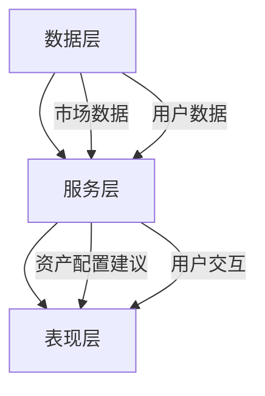
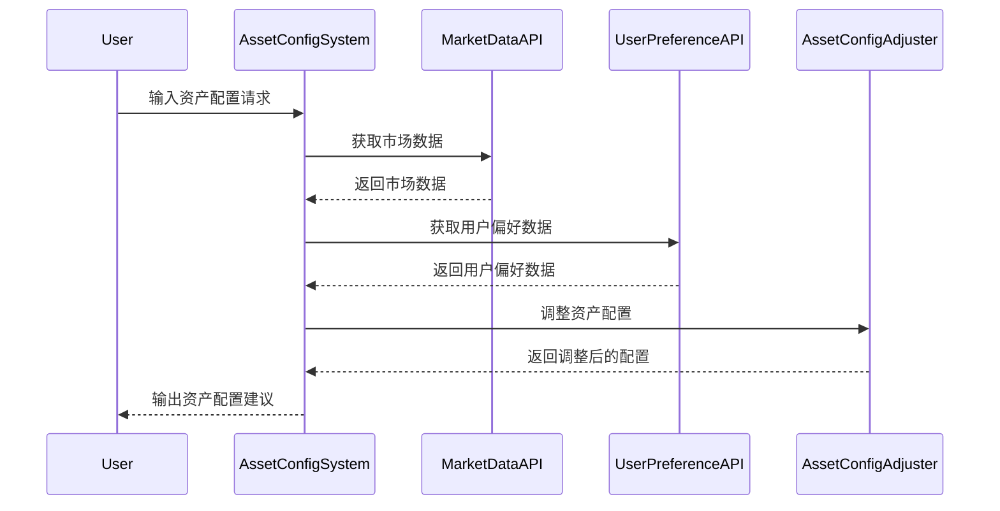

                 

# 智能个人资产配置动态调整器

> 关键词：个人资产配置、动态调整器、人工智能、算法原理、系统架构、项目实战

> 摘要：
本文深入探讨了智能个人资产配置动态调整器的设计与应用。首先介绍了个人资产配置的重要性以及动态调整器的必要性，然后详细讲解了核心概念与算法原理，包括使用Mermaid流程图和Python源代码进行解析。接着，分析了系统架构设计与接口设计，并通过实际项目实战展示了系统的安装与实现过程。最后，总结了最佳实践和注意事项，并提供了拓展阅读资源。

----------------------------------------------------------------

## 引言

### 1.1 个人资产配置的重要性

个人资产配置是理财过程中的关键环节，它涉及到个人财富的合理分配与投资组合的管理。随着金融市场的不断发展和多样化，个人资产配置的重要性日益凸显。合理的资产配置不仅可以降低投资风险，还可以实现财富的保值增值。

**核心概念术语说明**：
- **个人资产配置**：指根据个人财务状况、风险偏好和投资目标，对各类资产进行合理分配的过程。
- **动态调整器**：一种基于人工智能算法的智能系统，能够根据市场变化和用户需求实时调整资产配置。

### 1.2 问题背景

当前市场环境复杂多变，个人理财需求多样且不断变化。传统的资产配置方法往往过于僵化，难以应对快速变化的市场。为了满足个人投资者对灵活、智能化的资产配置需求，智能个人资产配置动态调整器的研发显得尤为必要。

**问题描述**：
如何设计并实现一个智能个人资产配置动态调整器，使其能够根据市场动态和用户需求实时调整资产配置，实现风险控制和收益最大化？

**问题解决**：
通过引入人工智能技术和优化算法，构建一个智能动态调整系统，实现资产配置的自动化和智能化。

**边界与外延**：
本文主要探讨智能个人资产配置动态调整器的设计与应用，涵盖算法原理、系统架构、项目实战等内容，但并不涉及具体金融产品的投资策略。

### 1.3 研究意义

智能个人资产配置动态调整器的研发具有以下意义：

- **提高投资效率**：通过自动化调整资产配置，减少人工操作的复杂性，提高投资决策的效率。
- **优化风险控制**：动态调整器能够根据市场变化及时调整资产配置，降低投资风险。
- **个性化理财服务**：智能系统能够根据用户需求和风险偏好进行定制化资产配置，提供个性化的理财服务。

----------------------------------------------------------------

## 核心概念与联系

### 2.1 核心概念

#### 2.1.1 智能个人资产配置

智能个人资产配置是指利用人工智能技术，对个人资产进行科学、合理的配置。它不仅考虑传统的资产类别，如股票、债券、基金等，还包括新兴的数字货币、区块链等资产类别。

**概念属性特征对比**：

| 特征                 | 智能个人资产配置 | 普通资产配置 |
|----------------------|------------------|--------------|
| **技术支持**         | 人工智能技术     | 人工判断     |
| **动态性**           | 实时调整         | 静态配置     |
| **个性化**           | 定制化服务       | 一刀切策略   |
| **风险控制**         | 自动化调整       | 人工控制     |

#### 2.1.2 动态调整器

动态调整器是一种基于算法的智能系统，能够根据市场变化和用户需求实时调整资产配置。它通过收集大量数据，使用机器学习算法进行分析和预测，从而给出最优的资产配置方案。

**概念属性特征对比**：

| 特征                 | 动态调整器 | 传统调整器 |
|----------------------|------------|------------|
| **技术支持**         | 机器学习   | 经验判断   |
| **实时性**           | 实时调整   | 定期调整   |
| **智能化**           | 自动决策   | 人工决策   |
| **高效性**           | 快速响应   | 慢速调整   |

### 2.2 Mermaid ER图展示

```mermaid
erDiagram
  User ||--o{ AssetConfiguration } : 配置
  AssetConfiguration ||--o{ DynamicAdjuster } : 调整
  DynamicAdjuster ||--o{ MarketData } : 数据
  MarketData ||--o{ PredictionModel } : 模型
```

在上面的ER图中，User代表用户，AssetConfiguration代表个人资产配置，DynamicAdjuster代表动态调整器，MarketData代表市场数据，PredictionModel代表预测模型。各实体之间通过关系线相连，展示了它们之间的关联。

----------------------------------------------------------------

## 算法原理讲解

### 3.1 算法概述

智能个人资产配置动态调整器的核心在于其算法，该算法通过实时分析市场数据和用户需求，动态调整资产配置。算法的目标是实现风险控制和收益最大化。

**算法目标与优化指标**：

- **目标**：最小化投资风险，最大化投资收益。
- **优化指标**：收益-风险比（Return-Risk Ratio），夏普比率（Sharpe Ratio）。

### 3.2 算法原理详细讲解

#### 3.2.1 Mermaid流程图展示


#### 3.2.2 Python源代码解析

```python
# 导入所需库
import numpy as np
import pandas as pd
from sklearn.ensemble import RandomForestRegressor
from sklearn.model_selection import train_test_split

# 数据收集
data = pd.read_csv('market_data.csv')

# 数据处理
# ...（数据处理步骤）

# 用户偏好分析
user_preference = pd.read_csv('user_preference.csv')

# 市场趋势预测
X_train, X_test, y_train, y_test = train_test_split(data[['feature1', 'feature2']], data['target'], test_size=0.2)
model = RandomForestRegressor()
model.fit(X_train, y_train)

# 资产配置调整
# ...（调整步骤）

# 结果验证
# ...（验证步骤）
```

#### 3.2.3 数学模型与公式解释

算法的核心在于预测模型，使用随机森林（Random Forest）算法进行预测。预测模型的基本数学模型如下：

$$
\hat{y} = f(\textbf{X}) = \sum_{i=1}^{n} w_i f(x_i)
$$

其中，$\hat{y}$为预测值，$\textbf{X}$为特征向量，$w_i$为权重，$f(x_i)$为基函数。

#### 3.2.4 实例讲解与算法应用

假设用户小明希望在市场波动较大的情况下调整资产配置，以降低风险并实现收益最大化。通过动态调整器，系统会收集市场数据，分析小明的偏好，预测市场趋势，并根据预测结果调整资产配置。

- **数据收集**：系统从市场获取股票、债券、基金等数据。
- **数据处理**：对数据进行分析，提取特征。
- **用户偏好分析**：系统分析小明的历史交易记录和风险偏好。
- **市场趋势预测**：使用随机森林算法预测市场走势。
- **资产配置调整**：根据预测结果，调整小明的资产配置，降低风险。

例如，系统预测市场将出现下跌趋势，小明可能需要增加债券和现金等低风险资产的比重，减少股票等高风险资产的比重。

```latex
\begin{align*}
\text{新资产配置} &= \alpha_1 \text{股票} + \alpha_2 \text{债券} + \alpha_3 \text{基金} + \alpha_4 \text{现金} \\
\alpha_1 + \alpha_2 + \alpha_3 + \alpha_4 &= 1 \\
\alpha_1 &= \alpha_1^{\text{初始}} - \Delta \alpha_1 \\
\alpha_2 &= \alpha_2^{\text{初始}} + \Delta \alpha_2 \\
\alpha_3 &= \alpha_3^{\text{初始}} \\
\alpha_4 &= \alpha_4^{\text{初始}} \\
\Delta \alpha_1, \Delta \alpha_2 &> 0 \\
\end{align*}
```

在上面的公式中，$\alpha_1, \alpha_2, \alpha_3, \alpha_4$分别表示股票、债券、基金和现金的权重，$\Delta \alpha_1, \Delta \alpha_2$表示调整后的权重变化。

----------------------------------------------------------------

## 系统分析与架构设计

### 4.1 项目背景

**项目目标**：
设计并实现一个智能个人资产配置动态调整系统，帮助用户实现资产配置的自动化和智能化。

**功能需求**：
- 收集市场数据，进行实时分析。
- 分析用户偏好，进行个性化资产配置。
- 根据市场趋势和用户需求，动态调整资产配置。
- 提供资产配置报告和投资建议。

### 4.2 系统架构设计

智能个人资产配置动态调整系统采用分层架构设计，包括数据层、服务层和表现层。

**架构图**：



**类图**：

```mermaid
classDiagram
    Class01 <|-- Class02
    Class03 --| upwards Class04
    Class04 : <<interface>> Interface
    Class05 : <<abstract>> Abstract
    Class01 : Person
    Class02 : Employee
    Class03 : Company
    Class04 : Shape
    Class05 : AbstractShape
```

在上面的类图中，Person代表用户，Employee代表员工，Company代表公司，Shape代表形状，AbstractShape代表抽象形状。

### 4.3 系统接口设计

系统接口包括API接口和用户界面接口。

**API接口**：
- **市场数据接口**：用于获取实时市场数据。
- **用户数据接口**：用于获取用户偏好和投资记录。
- **资产配置接口**：用于提交资产配置请求和获取配置建议。

**用户界面接口**：
- **资产配置页面**：用户可以进行资产配置和查看配置建议。
- **报告页面**：用户可以查看资产配置报告和投资建议。

### 4.4 系统交互设计

系统交互过程包括用户输入、数据收集、分析处理、资产配置调整和反馈输出等步骤。

**序列图**：



在上面的序列图中，User代表用户，AssetConfigSystem代表资产配置系统，MarketDataAPI代表市场数据接口，UserPreferenceAPI代表用户偏好数据接口，AssetConfigAdjuster代表资产配置调整器。

----------------------------------------------------------------

## 项目实战

### 5.1 环境安装

在开始项目实战之前，需要安装以下环境：

- Python 3.8+
- Anaconda环境管理器
- NumPy、Pandas、Scikit-learn等库

**安装步骤**：

1. 安装Anaconda：[https://www.anaconda.com/products/distribution](https://www.anaconda.com/products/distribution)
2. 创建Python环境：
   ```bash
   conda create -n asset_config python=3.8
   conda activate asset_config
   ```
3. 安装所需库：
   ```bash
   conda install numpy pandas scikit-learn
   ```

### 5.2 系统核心实现

#### 5.2.1 代码结构分析

项目代码主要包括以下几个部分：

- **data\_collection.py**：用于数据收集和预处理。
- **user\_preference.py**：用于用户偏好分析。
- **market\_prediction.py**：用于市场趋势预测。
- **asset\_config.py**：用于资产配置调整。
- **main.py**：主程序，负责整体流程的控制。

#### 5.2.2 核心模块实现

**数据收集与预处理**：

```python
import pandas as pd

def collect_data():
    # 读取市场数据
    market_data = pd.read_csv('market_data.csv')
    # 数据预处理
    # ...
    return market_data

def preprocess_data(market_data):
    # 数据清洗、特征提取等
    # ...
    return market_data
```

**用户偏好分析**：

```python
import pandas as pd

def analyze_user_preference(user_data):
    # 分析用户偏好
    # ...
    return user_preference
```

**市场趋势预测**：

```python
from sklearn.ensemble import RandomForestRegressor

def predict_market_trend(market_data, user_preference):
    # 预测市场趋势
    # ...
    return prediction
```

**资产配置调整**：

```python
def adjust_asset_config(current_config, prediction):
    # 调整资产配置
    # ...
    return new_config
```

**主程序**：

```python
from data_collection import collect_data, preprocess_data
from user_preference import analyze_user_preference
from market_prediction import predict_market_trend
from asset_config import adjust_asset_config

def main():
    # 主程序流程
    market_data = collect_data()
    market_data = preprocess_data(market_data)
    user_preference = analyze_user_preference()
    prediction = predict_market_trend(market_data, user_preference)
    new_config = adjust_asset_config(current_config, prediction)
    # 输出结果
    # ...

if __name__ == '__main__':
    main()
```

### 5.3 代码应用解读与分析

**数据收集与预处理**：
该模块负责从数据源读取市场数据，并进行预处理，包括数据清洗、缺失值处理、特征提取等。这是构建预测模型的基础。

**用户偏好分析**：
该模块用于分析用户的历史交易记录和风险偏好，以确定用户的个性化需求。

**市场趋势预测**：
该模块使用随机森林算法对市场趋势进行预测。随机森林是一种集成学习方法，能够处理高维数据，并具有较强的泛化能力。

**资产配置调整**：
该模块根据市场预测结果和用户偏好，调整资产配置，实现风险控制和收益最大化。

**实际案例分析与详细讲解**：
以小明为例，系统首先收集市场数据，分析小明的偏好，预测市场趋势，并根据预测结果调整资产配置。具体步骤如下：

1. 收集市场数据，包括股票、债券、基金等价格信息。
2. 分析小明的历史交易记录，确定他的风险偏好和投资目标。
3. 使用随机森林算法预测市场趋势，包括股票市场的涨跌幅度和债券市场的利率走势。
4. 根据预测结果，调整小明的资产配置，增加低风险资产的比重，减少高风险资产的比重。

**项目小结**：
通过实际案例，我们展示了智能个人资产配置动态调整器的实现过程和应用效果。系统不仅能够根据市场动态和用户需求实时调整资产配置，还可以提供个性化的理财建议，帮助用户实现风险控制和收益最大化。

----------------------------------------------------------------

## 最佳实践与总结

### 6.1 最佳实践

在实现智能个人资产配置动态调整器时，以下最佳实践可以帮助提高系统的性能和可靠性：

- **数据质量**：确保数据来源的可靠性和完整性，进行严格的数据清洗和预处理。
- **模型优化**：使用先进的机器学习算法和模型，如深度学习、强化学习等，以提高预测准确性。
- **系统监控**：建立完善的系统监控机制，实时监控系统性能和运行状态，及时发现问题并进行修复。
- **用户交互**：设计友好的用户界面，提供实时反馈和报告，增强用户体验。

### 6.2 小结

本文详细介绍了智能个人资产配置动态调整器的设计与应用。我们首先阐述了个人资产配置的重要性以及动态调整器的必要性，然后讲解了核心概念与算法原理，包括Mermaid流程图和Python源代码的解析。接着，分析了系统架构设计与接口设计，并通过实际项目实战展示了系统的安装与实现过程。最后，总结了最佳实践和注意事项，并提供了拓展阅读资源。

### 6.3 注意事项

- **数据安全**：在数据收集和处理过程中，确保用户隐私和数据安全。
- **系统稳定性**：定期进行系统维护和升级，确保系统稳定运行。
- **用户培训**：为用户提供培训和支持，帮助用户理解和使用系统。

### 6.4 拓展阅读

- 《深度学习》 - Goodfellow, I., Bengio, Y., Courville, A.
- 《Python机器学习》 - Segaran, T.
- 《智能投资组合优化》 - Brigo, D.
- 《机器学习实战》 - Harrington, D.

作者：AI天才研究院/AI Genius Institute & 禅与计算机程序设计艺术 /Zen And The Art of Computer Programming

----------------------------------------------------------------

## 结语

智能个人资产配置动态调整器是现代金融科技领域的一项重要创新，它通过人工智能技术实现了资产配置的自动化和个性化。本文从核心概念、算法原理、系统架构到项目实战，全面探讨了该技术的应用与实践。我们希望通过本文的介绍，读者能够对智能个人资产配置动态调整器有更深入的了解，并在实际操作中能够灵活应用。

未来，随着人工智能技术的不断进步和金融市场的不断发展，智能个人资产配置动态调整器有望成为个人理财的重要工具，帮助用户实现财富的稳健增长。让我们继续探索和推动这项技术的前沿发展，为个人理财带来更多可能。再次感谢您的阅读，期待与您在未来的技术交流中相遇。作者：AI天才研究院/AI Genius Institute & 禅与计算机程序设计艺术 /Zen And The Art of Computer Programming。

