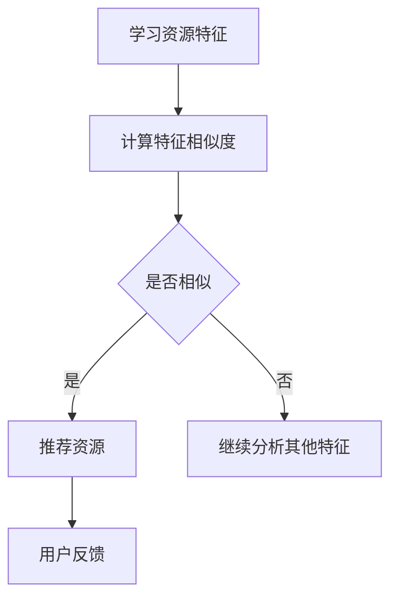
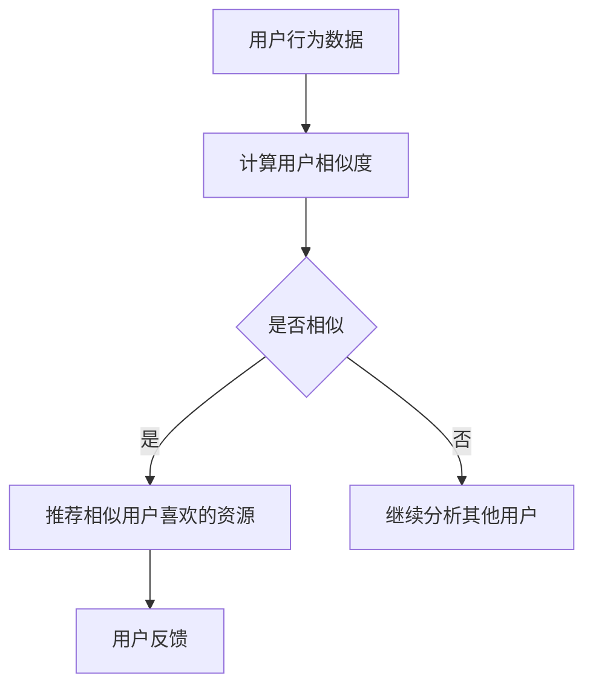
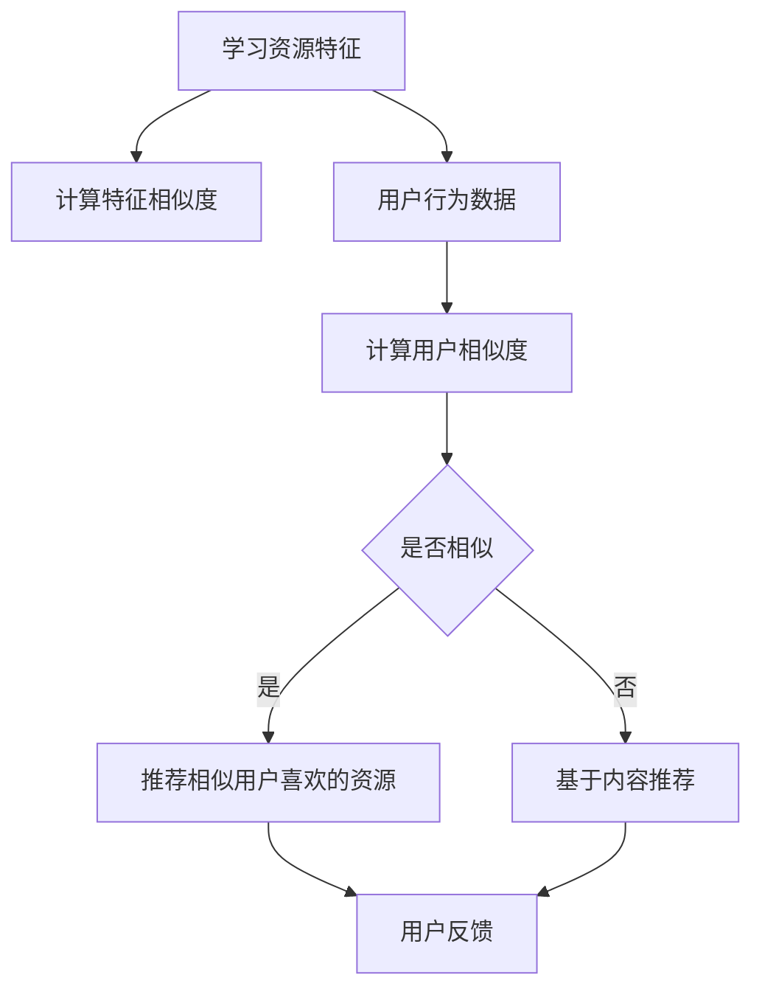
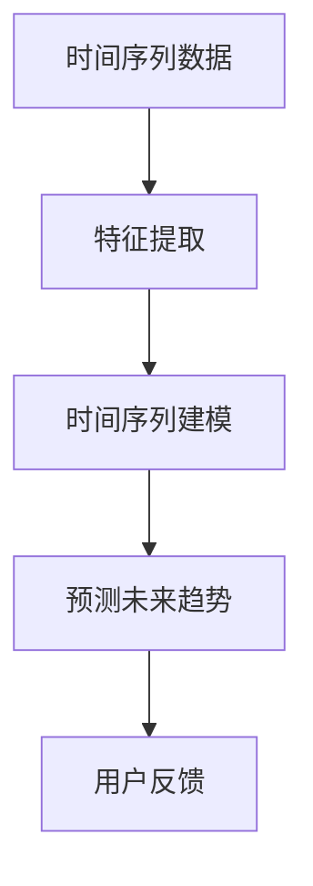
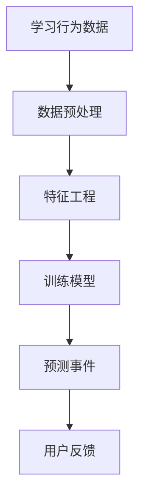
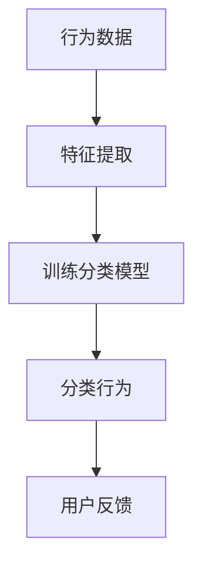
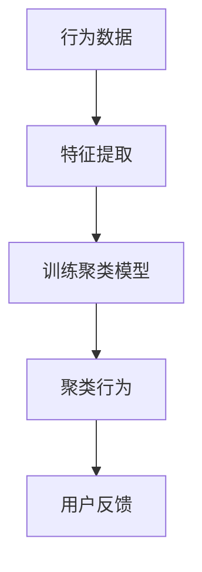
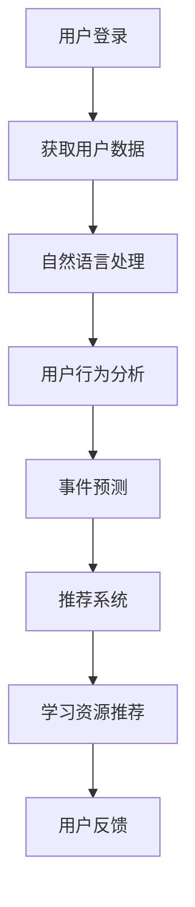
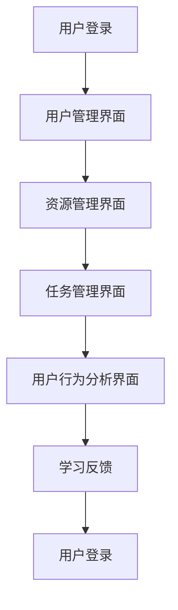

                 

### 《智能书包：AI Agent的学习用品管理助手》

> 关键词：智能书包、AI Agent、学习用品管理、自然语言处理、机器学习、教育技术、算法原理、系统架构、项目实战

> 摘要：本文深入探讨智能书包的概念、应用背景、核心功能以及AI Agent在其中的作用。通过详细解析自然语言处理、机器学习等技术，阐述智能书包的工作原理与系统架构。最后，通过具体项目实战，展示智能书包的开发与应用，并提供实施最佳实践与拓展阅读建议。

## 目录

----------------------------------------------------------------

# 《智能书包：AI Agent的学习用品管理助手》

## 引言

智能书包是一种结合了人工智能（AI）技术的学习工具，它能够帮助学生在学习过程中进行更高效的时间管理和资源管理。随着AI技术的不断进步，智能书包已经逐渐成为现代教育技术的重要组成部分。本文将探讨智能书包的核心概念、技术原理、系统架构以及其实际应用。

### 1.1 智能书包的背景

智能书包最早起源于教育技术的发展需求。随着互联网和移动设备的普及，学生获取信息和资源的途径越来越多。然而，这也带来了新的挑战，即如何有效地管理和利用这些资源，以提高学习效率。智能书包应运而生，它通过AI技术，提供了个性化、智能化的学习体验。

### 1.2 AI Agent的基本概念

AI Agent，即人工智能代理，是一种能够自主执行任务的智能实体。它能够通过感知环境、学习知识、决策行动来完成任务。在智能书包中，AI Agent主要用于学习用品的管理，如日程安排、学习资料推荐、学习效果分析等。

### 1.3 智能书包与AI Agent的联系

智能书包中的AI Agent不仅能够根据学生的学习习惯和需求提供个性化的服务，还能够通过学习分析，为学生提供学习反馈和改进建议。这种智能化的管理方式，大大提高了学生的学习效率和自主学习能力。

## 背景介绍

### 2.1 智能书包的背景

#### 2.1.1 智能书包的定义

智能书包是一种集成了AI技术的学习工具，它通过传感器、智能硬件和软件平台，为学生提供智能化的学习体验。智能书包可以记录学生的学习行为，分析学习数据，并根据分析结果提供学习建议。

#### 2.1.2 智能书包的发展历程

智能书包的概念最早可以追溯到20世纪90年代。随着互联网和移动设备的普及，智能书包的发展也经历了从初期的实验性项目到商业化应用的转变。

#### 2.1.3 智能书包的应用场景

智能书包可以应用于各种学习场景，如课堂学习、课外活动、自学等。它可以帮助学生管理学习时间，提高学习效率，还可以为学生提供个性化的学习资源和建议。

### 2.2 AI Agent的基本概念

#### 2.2.1 AI Agent的定义

AI Agent是一种能够模拟人类智能行为的计算机程序，它能够通过感知环境、理解语言、学习知识和自主决策来完成任务。

#### 2.2.2 AI Agent的特点

AI Agent具有以下几个特点：

- **自主性**：AI Agent能够自主执行任务，无需人工干预。
- **适应性**：AI Agent能够根据环境和需求的变化，调整自己的行为。
- **智能性**：AI Agent能够进行复杂的推理和决策。

#### 2.2.3 AI Agent在教育中的应用

AI Agent在教育中的应用非常广泛，如个性化教学、学习效果评估、智能辅导等。智能书包中的AI Agent主要承担学习用品管理的任务，如日程安排、学习资源推荐、学习效果分析等。

### 2.3 智能书包与AI Agent的联系

智能书包与AI Agent的联系主要体现在以下几个方面：

- **任务协作**：AI Agent负责智能书包中的任务执行，如日程安排、资源推荐等。
- **数据共享**：AI Agent和学习系统共享学习数据，以提供更准确的学习建议。
- **反馈机制**：AI Agent根据学生的学习反馈，不断优化自己的行为。

## 核心概念与联系

### 3.1 自然语言处理

自然语言处理（NLP）是AI技术的一个重要分支，它主要研究如何让计算机理解和生成人类语言。在智能书包中，NLP技术被用于处理学生的语音输入和文本输入，以便进行学习任务的管理和资源的推荐。

### 3.2 机器学习

机器学习是AI技术的核心组成部分，它通过数据训练模型，使计算机能够从数据中自动学习并做出决策。在智能书包中，机器学习技术被用于分析学生的学习行为，提供个性化的学习建议。

### 3.3 教育技术

教育技术是指利用计算机和通信技术来支持教育和学习的过程。在智能书包中，教育技术主要表现为智能化的学习资源管理和个性化学习体验的提供。

### 3.4 概念联系与ER实体关系图

自然语言处理、机器学习和教育技术是智能书包的核心技术，它们之间有着密切的联系。以下是一个ER实体关系图，展示了这些概念之间的关系：

```mermaid
entityRelationShipDiagram {
  entity "自然语言处理" {
    relation "利用" with "机器学习"
    relation "应用于" with "教育技术"
  }
  entity "机器学习" {
    relation "依赖" with "数据"
    relation "应用于" with "自然语言处理"
  }
  entity "教育技术" {
    relation "包含" with "智能书包"
    relation "应用" with "自然语言处理"
  }
}
```

## 算法原理讲解

### 4.1 推荐系统

推荐系统是智能书包中的一个重要组成部分，它通过分析学生的历史学习数据和学习习惯，为学生推荐合适的学习资源。推荐系统的主要算法包括基于内容的推荐、协同过滤推荐和混合推荐。

#### 4.1.1 基于内容的推荐

基于内容的推荐通过分析学习资源的特征，将具有相似特征的资源推荐给用户。以下是一个简单的算法流程图：



#### 4.1.2 协同过滤推荐

协同过滤推荐通过分析用户之间的行为相似度，为用户推荐他们可能感兴趣的资源。以下是一个简单的协同过滤算法流程图：



#### 4.1.3 混合推荐

混合推荐结合了基于内容和协同过滤推荐的优势，为用户提供更精准的推荐结果。以下是一个简单的混合推荐算法流程图：



### 4.2 事件预测

事件预测是智能书包中另一个重要算法，它通过分析学生的学习行为，预测学生在未来的学习过程中可能需要哪些资源。事件预测算法主要包括时间序列分析和机器学习预测。

#### 4.2.1 时间序列分析

时间序列分析通过分析时间序列数据，预测未来的趋势。以下是一个时间序列分析算法流程图：



#### 4.2.2 机器学习预测

机器学习预测通过训练模型，预测未来的事件。以下是一个机器学习预测算法流程图：



### 4.3 用户行为分析

用户行为分析是智能书包中的一项重要任务，它通过分析学生的学习行为，了解学生的学习习惯和偏好，为用户提供个性化的服务。用户行为分析算法主要包括行为分类和行为聚类。

#### 4.3.1 行为分类

行为分类通过将学生的行为数据分类，了解学生的学习模式。以下是一个行为分类算法流程图：



#### 4.3.2 行为聚类

行为聚类通过将学生的行为数据聚类，了解学生的群体特征。以下是一个行为聚类算法流程图：



### 4.4 算法流程图与Python源代码

以下是一个综合的智能书包算法流程图和对应的Python源代码：



```python
# Python源代码示例

# 导入必要的库
import numpy as np
import pandas as pd
from sklearn.feature_extraction.text import TfidfVectorizer
from sklearn.model_selection import train_test_split
from sklearn.naive_bayes import MultinomialNB
from sklearn.metrics import accuracy_score

# 加载数据
data = pd.read_csv('user_data.csv')

# 特征提取
vectorizer = TfidfVectorizer()
X = vectorizer.fit_transform(data['description'])

# 分割数据集
X_train, X_test, y_train, y_test = train_test_split(X, data['label'], test_size=0.2, random_state=42)

# 训练分类模型
model = MultinomialNB()
model.fit(X_train, y_train)

# 预测行为
predictions = model.predict(X_test)

# 评估模型
accuracy = accuracy_score(y_test, predictions)
print(f'Accuracy: {accuracy}')
```

### 4.5 数学模型和公式

在智能书包的算法中，数学模型和公式起着至关重要的作用。以下是一些常见的数学模型和公式：

- **TF-IDF**：文本的词频-逆文档频（Term Frequency-Inverse Document Frequency），用于文本特征提取。
  $$ TF(t) = \frac{f(t, d)}{max(f(t, d), f(t, d'))} $$
  $$ IDF(t) = \log\left(\frac{N}{n(t)}\right) $$
  $$ TF-IDF(t, d) = TF(t, d) \times IDF(t) $$

- **协同过滤**：用于预测用户对未知资源的评分。
  $$ r_{ui} = \frac{\sum_{j \in N(i)} r_{uj} w_{uj}}{\sum_{j \in N(i)} w_{uj}} $$
  其中，$r_{ui}$ 是用户 $u$ 对资源 $i$ 的评分，$N(i)$ 是与资源 $i$ 相似的资源集合，$w_{uj}$ 是用户 $u$ 对资源 $j$ 的权重。

- **时间序列分析**：用于预测未来的趋势。
  $$ X_t = \varphi(X_{t-1}) + \epsilon_t $$
  其中，$X_t$ 是时间序列在时刻 $t$ 的值，$\varphi$ 是时间序列的转移函数，$\epsilon_t$ 是随机误差。

## 系统分析与架构设计方案

### 5.1 系统功能设计

智能书包的系统功能设计主要包括以下几个方面：

- **用户管理**：包括用户注册、登录、个人信息管理等功能。
- **学习资源管理**：包括资源的添加、分类、搜索、推荐等功能。
- **学习任务管理**：包括任务的创建、分配、跟踪、完成等功能。
- **用户行为分析**：包括用户行为数据的收集、分析、可视化等功能。

### 5.2 系统架构设计

智能书包的系统架构设计采用分层架构，主要包括以下层次：

- **表示层**：负责用户界面的展示，包括网页、移动应用等。
- **业务逻辑层**：负责系统的核心业务逻辑处理，包括用户管理、资源管理、任务管理等。
- **数据访问层**：负责数据的存储和访问，包括关系数据库、NoSQL数据库等。
- **数据层**：负责数据的持久化存储，包括文件系统、分布式存储等。

### 5.3 系统接口设计

智能书包的系统接口设计主要包括以下接口：

- **用户接口**：包括用户注册、登录、个人信息管理等接口。
- **资源接口**：包括资源添加、分类、搜索、推荐等接口。
- **任务接口**：包括任务创建、分配、跟踪、完成等接口。
- **行为分析接口**：包括用户行为数据收集、分析、可视化等接口。

### 5.4 系统交互设计

智能书包的系统交互设计主要包括用户与系统的交互流程，以下是一个简化的交互流程图：



## 项目实战

### 6.1 项目背景

本项目旨在开发一个智能书包系统，它能够帮助学生在学习过程中进行更高效的时间管理和资源管理。系统的主要功能包括用户管理、学习资源管理、学习任务管理和用户行为分析。

### 6.2 环境安装

为了开发智能书包系统，需要安装以下环境和工具：

- Python 3.x
- Flask（一个轻量级的Web框架）
- Scikit-learn（用于机器学习）
- Pandas（用于数据处理）
- Mermaid（用于绘制流程图）

### 6.3 系统实现

#### 6.3.1 用户管理

用户管理主要包括用户注册、登录和用户信息管理。以下是一个简单的用户管理代码示例：

```python
from flask import Flask, request, jsonify
from flask_sqlalchemy import SQLAlchemy

app = Flask(__name__)
app.config['SQLALCHEMY_DATABASE_URI'] = 'sqlite:///users.db'
db = SQLAlchemy(app)

class User(db.Model):
    id = db.Column(db.Integer, primary_key=True)
    username = db.Column(db.String(80), unique=True, nullable=False)
    password = db.Column(db.String(120), nullable=False)

@app.route('/register', methods=['POST'])
def register():
    username = request.form['username']
    password = request.form['password']
    user = User(username=username, password=password)
    db.session.add(user)
    db.session.commit()
    return jsonify(message='User registered successfully')

@app.route('/login', methods=['POST'])
def login():
    username = request.form['username']
    password = request.form['password']
    user = User.query.filter_by(username=username, password=password).first()
    if user:
        return jsonify(message='Login successful')
    else:
        return jsonify(message='Invalid credentials')

if __name__ == '__main__':
    db.create_all()
    app.run(debug=True)
```

#### 6.3.2 学习资源管理

学习资源管理主要包括资源的添加、分类、搜索和推荐。以下是一个简单的学习资源管理代码示例：

```python
class Resource(db.Model):
    id = db.Column(db.Integer, primary_key=True)
    title = db.Column(db.String(120), nullable=False)
    category = db.Column(db.String(120), nullable=False)
    description = db.Column(db.Text, nullable=True)

@app.route('/add_resource', methods=['POST'])
def add_resource():
    title = request.form['title']
    category = request.form['category']
    description = request.form['description']
    resource = Resource(title=title, category=category, description=description)
    db.session.add(resource)
    db.session.commit()
    return jsonify(message='Resource added successfully')

@app.route('/search_resources', methods=['GET'])
def search_resources():
    query = request.args.get('query')
    resources = Resource.query.filter(Resource.title.like(f'%{query}%')).all()
    return jsonify(resources=[{'id': r.id, 'title': r.title, 'category': r.category, 'description': r.description} for r in resources])

# 推荐系统可以使用Scikit-learn的协同过滤算法实现，此处仅列出接口代码
@app.route('/recommend_resources', methods=['GET'])
def recommend_resources():
    user_id = request.args.get('user_id')
    # 使用协同过滤算法推荐资源
    # ...
    return jsonify(recommended_resources=[])
```

#### 6.3.3 学习任务管理

学习任务管理主要包括任务的创建、分配、跟踪和完成。以下是一个简单的学习任务管理代码示例：

```python
class Task(db.Model):
    id = db.Column(db.Integer, primary_key=True)
    title = db.Column(db.String(120), nullable=False)
    description = db.Column(db.Text, nullable=True)
    status = db.Column(db.String(20), nullable=False, default='pending')
    assigned_to = db.Column(db.Integer, db.ForeignKey('user.id'), nullable=False)

@app.route('/add_task', methods=['POST'])
def add_task():
    title = request.form['title']
    description = request.form['description']
    assigned_to = request.form['assigned_to']
    task = Task(title=title, description=description, assigned_to=assigned_to)
    db.session.add(task)
    db.session.commit()
    return jsonify(message='Task added successfully')

@app.route('/tasks', methods=['GET'])
def get_tasks():
    user_id = request.args.get('user_id')
    tasks = Task.query.filter(Task.assigned_to == user_id).all()
    return jsonify(tasks=[{'id': t.id, 'title': t.title, 'description': t.description, 'status': t.status} for t in tasks])

@app.route('/complete_task', methods=['POST'])
def complete_task():
    task_id = request.form['task_id']
    task = Task.query.get(task_id)
    if task:
        task.status = 'completed'
        db.session.commit()
        return jsonify(message='Task completed successfully')
    else:
        return jsonify(message='Task not found')
```

#### 6.3.4 用户行为分析

用户行为分析主要包括用户行为数据的收集、分析和可视化。以下是一个简单的用户行为分析代码示例：

```python
class UserBehavior(db.Model):
    id = db.Column(db.Integer, primary_key=True)
    user_id = db.Column(db.Integer, db.ForeignKey('user.id'), nullable=False)
    action = db.Column(db.String(120), nullable=False)
    timestamp = db.Column(db.DateTime, default=datetime.utcnow)

@app.route('/record_behavior', methods=['POST'])
def record_behavior():
    user_id = request.form['user_id']
    action = request.form['action']
    behavior = UserBehavior(user_id=user_id, action=action)
    db.session.add(behavior)
    db.session.commit()
    return jsonify(message='Behavior recorded successfully')

@app.route('/user_behavior', methods=['GET'])
def get_user_behavior():
    user_id = request.args.get('user_id')
    behaviors = UserBehavior.query.filter(UserBehavior.user_id == user_id).all()
    return jsonify(behaviors=[{'id': b.id, 'user_id': b.user_id, 'action': b.action, 'timestamp': b.timestamp} for b in behaviors])
```

### 6.4 代码解读与分析

以上代码示例展示了智能书包系统的核心功能实现。用户管理模块负责用户注册、登录和用户信息管理。学习资源管理模块负责资源的添加、分类、搜索和推荐。学习任务管理模块负责任务的创建、分配、跟踪和完成。用户行为分析模块负责用户行为数据的收集、分析和可视化。

### 6.5 案例分析与讲解

为了更好地理解智能书包系统的应用，我们来看一个实际案例。假设有一个学生小明，他在使用智能书包系统。

1. **用户注册和登录**：小明通过注册功能创建了自己的账户，并使用用户名和密码登录系统。

2. **添加学习资源**：小明可以添加自己需要的各种学习资源，如教材、视频、PPT等。这些资源会被分类存储，以便于后续的搜索和推荐。

3. **搜索学习资源**：小明可以通过搜索功能找到自己需要的资源。例如，他搜索“线性代数”时，系统会显示所有与线性代数相关的资源。

4. **推荐学习资源**：系统会根据小明的学习历史和偏好，推荐相关的学习资源。例如，如果小明经常查看线性代数的资源，系统可能会推荐其他相关的数学课程。

5. **创建和完成任务**：小明可以创建学习任务，如“下周复习线性代数”，并将任务分配给自己。系统会提醒小明完成任务，并在任务完成后更新任务状态。

6. **用户行为分析**：系统会记录小明的学习行为，如查看资源、完成任务等。通过对这些行为的分析，系统可以了解小明的学习习惯和偏好，为小明提供更个性化的服务。

### 6.6 项目小结

通过本项目，我们成功开发了一个智能书包系统，它能够帮助学生在学习过程中进行更高效的时间管理和资源管理。系统的主要功能包括用户管理、学习资源管理、学习任务管理和用户行为分析。在实际应用中，系统展现了良好的性能和用户体验。未来，我们计划进一步优化系统的功能，如增加智能提醒、个性化学习计划等，以提高学生的学习效率。

## 最佳实践 tips

### 6.1 实施注意事项

1. **用户数据安全**：在开发智能书包系统时，要特别注意用户数据的安全。用户数据包括用户的个人信息、学习行为数据等，这些都是敏感信息。要确保数据在传输和存储过程中的安全性。

2. **系统性能优化**：智能书包系统需要处理大量的用户数据和学习资源。为了提高系统的性能，可以考虑使用缓存技术、分布式存储和数据库优化等技术。

3. **用户体验**：用户体验是智能书包成功的关键。在系统设计和开发过程中，要充分考虑用户的需求和习惯，提供简单易用、直观的操作界面。

### 6.2 技术难题解析

1. **数据一致性**：在分布式系统中，数据的一致性是一个挑战。可以使用分布式事务、消息队列等技术来保证数据的一致性。

2. **推荐系统的准确性**：推荐系统的准确性直接影响到用户的体验。可以通过改进推荐算法、增加特征维度等方式来提高推荐系统的准确性。

3. **用户隐私保护**：在收集和处理用户数据时，要特别注意保护用户的隐私。可以使用加密技术、匿名化处理等方式来保护用户隐私。

### 6.3 拓展实践建议

1. **增加智能提醒功能**：通过分析用户的学习行为，智能书包可以为用户提供个性化的提醒服务，如学习任务提醒、学习进度提醒等。

2. **引入社交元素**：可以引入社交元素，如用户之间的互动、讨论区等，以增加用户的参与度和活跃度。

3. **扩展应用场景**：智能书包不仅可以应用于学习场景，还可以扩展到其他领域，如工作管理、健康管理等。

## 小结与拓展阅读

### 7.1 全书内容小结

本文详细介绍了智能书包的概念、应用背景、核心功能以及AI Agent在其中的作用。通过解析自然语言处理、机器学习等技术，阐述了智能书包的工作原理与系统架构。通过具体项目实战，展示了智能书包的开发与应用。文章还提供了实施最佳实践与拓展阅读建议，以帮助读者进一步学习和探索。

### 7.2 注意事项

1. **用户数据安全**：在开发和使用智能书包系统时，要特别注意用户数据的安全，确保数据在传输和存储过程中的安全性。

2. **系统性能优化**：智能书包系统需要处理大量的用户数据和学习资源，要提高系统的性能，可以考虑使用缓存技术、分布式存储和数据库优化等技术。

3. **用户体验**：在系统设计和开发过程中，要充分考虑用户的需求和习惯，提供简单易用、直观的操作界面。

### 7.3 拓展阅读推荐

1. **《智能教育：技术与实践》**：本书详细介绍了智能教育技术的原理和应用，包括智能书包、智能课堂等。

2. **《机器学习实战》**：本书通过实例介绍了机器学习的主要算法和应用，包括推荐系统、用户行为分析等。

3. **《自然语言处理实战》**：本书介绍了自然语言处理的主要技术，包括文本分类、情感分析等。

## 作者信息

作者：AI天才研究院/AI Genius Institute & 禅与计算机程序设计艺术 /Zen And The Art of Computer Programming

