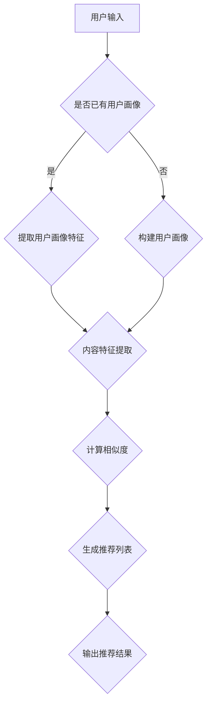
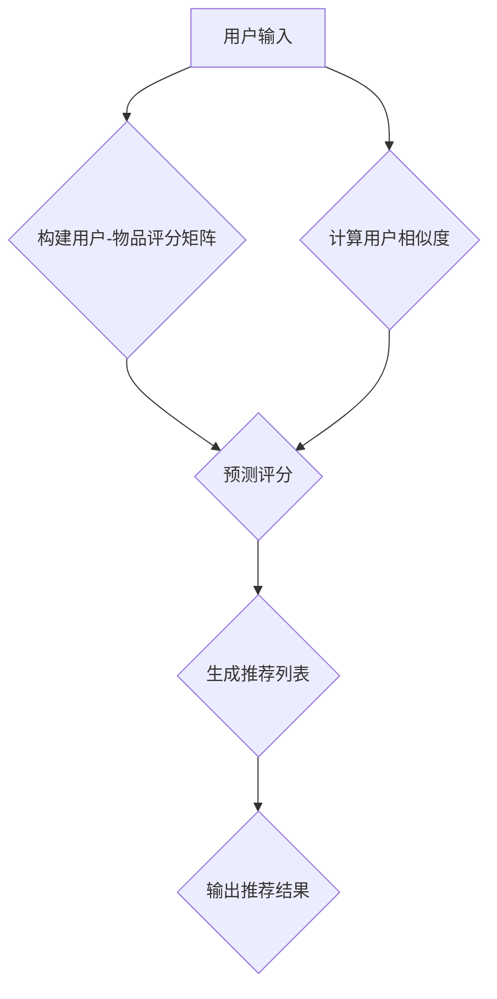
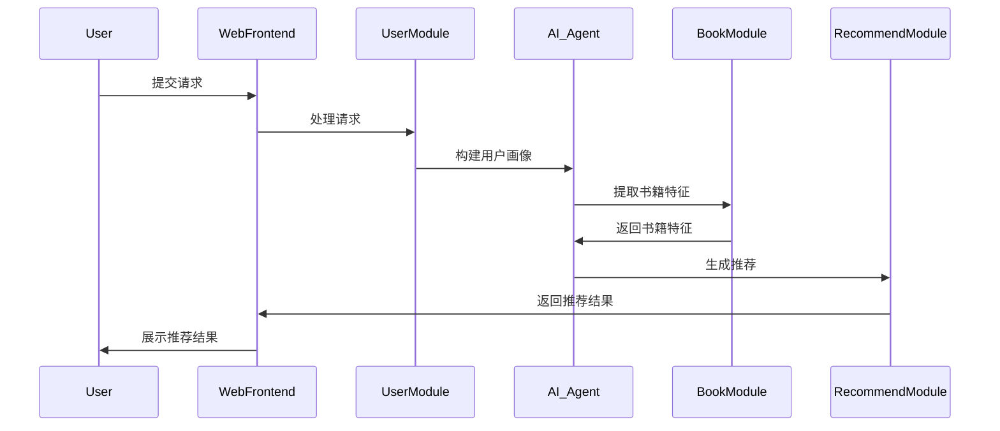
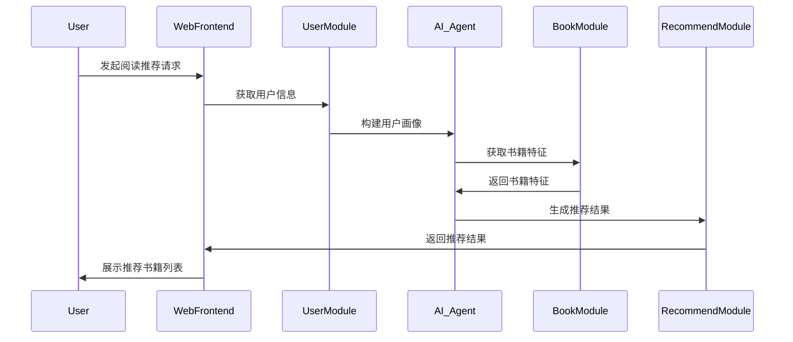

                 

### 摘要

本文以《智能书架：AI Agent的个性化阅读推荐系统》为标题，深入探讨了人工智能在个性化阅读推荐系统中的应用。首先，文章介绍了智能书架的背景及其在个性化阅读推荐系统中的重要性。接着，通过详细的逻辑分析和步骤讲解，阐述了AI Agent的概念及其在推荐系统中的优势。文章重点讲解了个性化阅读推荐系统的核心算法原理，包括基于内容的推荐算法和基于协同过滤的推荐算法，并使用Mermaid和Python代码进行了详细展示。此外，文章还介绍了推荐系统的整体架构设计，并通过一个实际案例展示了系统的搭建和实现过程。最后，文章总结了最佳实践，提供了注意事项和拓展阅读建议，为读者深入学习和实践提供了丰富的资源。通过本文的阅读，读者可以全面了解智能书架和个性化阅读推荐系统的原理和实践，提升在AI领域的技术水平和创新能力。

### 目录大纲设计思路

在设计《智能书架：AI Agent的个性化阅读推荐系统》的目录大纲时，我们的目标是确保文章逻辑清晰、结构紧凑、内容易于理解，从而帮助读者系统地掌握相关知识。以下是详细的目录大纲设计思路：

#### 第一部分：引言

**第1章：智能书架与个性化阅读推荐系统概述**

1. **1.1 问题背景**：介绍智能书架和个性化阅读推荐系统的起源和背景，阐述其现实需求。
2. **1.2 问题描述**：明确智能书架和个性化阅读推荐系统所解决的问题，以及问题的复杂性。
3. **1.3 问题的解决**：概述本文将提出的解决方案，包括AI Agent在系统中的作用。
4. **1.4 边界与外延**：定义智能书架和个性化阅读推荐系统的边界，明确其适用范围。
5. **1.5 概念结构与核心要素组成**：介绍主要概念，包括AI Agent、个性化阅读推荐系统等，并阐述它们之间的联系。

**第2章：AI Agent的概念与特点**

1. **2.1 AI Agent的定义**：详细解释AI Agent的概念，与传统的算法进行对比。
2. **2.2 AI Agent的核心特点**：分析AI Agent的核心优势，如自适应性和智能化。
3. **2.3 AI Agent与传统算法的差异**：对比AI Agent与传统算法的差异，突出其独特性。

**第3章：个性化阅读推荐系统的核心概念**

1. **3.1 推荐系统的定义**：定义推荐系统，并阐述其基本原理。
2. **3.2 个性化推荐的核心要素**：探讨个性化推荐的关键因素，如用户兴趣、内容特征等。
3. **3.3 推荐系统的工作原理**：介绍推荐系统的工作流程，包括数据采集、模型训练和推荐生成等步骤。

**第4章：AI Agent在个性化阅读推荐系统中的应用**

1. **4.1 AI Agent的优势**：分析AI Agent在个性化阅读推荐系统中的优势，如高效性、个性化等。
2. **4.2 AI Agent的应用场景**：讨论AI Agent在个性化阅读推荐系统中的具体应用场景。
3. **4.3 AI Agent在推荐系统中的角色**：明确AI Agent在个性化阅读推荐系统中的地位和作用。

#### 第二部分：核心概念与联系

**第5章：AI Agent的ER实体关系图**

1. **5.1 用户实体**：介绍用户实体的属性和特征。
2. **5.2 图书实体**：阐述图书实体的属性和分类。
3. **5.3 推荐实体**：探讨推荐实体的构成和功能。
4. **5.4 AI Agent实体**：详细描述AI Agent实体的结构和作用。

**第6章：实体关系说明**

1. **6.1 用户与图书的关系**：分析用户与图书之间的互动和关联。
2. **6.2 用户与推荐的关系**：探讨用户与推荐系统之间的交互机制。
3. **6.3 图书与推荐的关系**：解释图书如何影响推荐系统的生成。

**第7章：Mermaid ER实体关系图绘制**

1. **7.1 图的基本结构**：介绍Mermaid图表的基本构成。
2. **7.2 实体与关系的表示**：讲解如何在Mermaid中表达实体及其关系。
3. **7.3 实体关系的Mermaid代码**：提供具体的Mermaid代码示例。

#### 第三部分：算法原理讲解

**第8章：个性化阅读推荐系统的算法原理**

1. **8.1 推荐算法的分类**：介绍推荐算法的分类及其基本原理。
2. **8.2 基于内容的推荐算法**：详细解释基于内容的推荐算法，包括其流程、优势和局限。
3. **8.3 基于协同过滤的推荐算法**：深入探讨基于协同过滤的推荐算法，包括其工作原理和实现方法。
4. **8.4 AI Agent在推荐算法中的应用**：分析AI Agent在推荐算法中的具体应用，如如何优化算法效率和个性化程度。

**第9章：算法流程图**

1. **9.1 基于内容的推荐算法流程图**：使用Mermaid绘制基于内容的推荐算法流程图。
2. **9.2 基于协同过滤的推荐算法流程图**：展示基于协同过滤的推荐算法流程图。

**第10章：Python代码示例**

1. **10.1 基于内容的推荐算法代码示例**：提供基于内容的推荐算法的Python代码示例。
2. **10.2 基于协同过滤的推荐算法代码示例**：展示基于协同过滤的推荐算法的Python代码。

**第11章：数学模型与公式**

1. **11.1 基于内容的推荐模型**：介绍基于内容的推荐模型的数学公式和计算方法。
2. **11.2 基于协同过滤的推荐模型**：阐述基于协同过滤的推荐模型的数学基础。

**第12章：算法原理详细讲解**

1. **12.1 基于内容的推荐算法详细讲解**：深入解析基于内容的推荐算法的原理和实现。
2. **12.2 基于协同过滤的推荐算法详细讲解**：详细解释基于协同过滤的推荐算法的各个环节。

**第13章：举例说明**

1. **13.1 基于内容的推荐算法举例说明**：通过实际案例说明基于内容的推荐算法的应用。
2. **13.2 基于协同过滤的推荐算法举例说明**：通过实例展示基于协同过滤的推荐算法的效果。

#### 第四部分：系统分析与架构设计方案

**第14章：系统分析与架构设计**

1. **14.1 问题场景介绍**：描述智能书架和个性化阅读推荐系统面临的具体问题。
2. **14.2 项目介绍**：介绍智能书架和个性化阅读推荐系统的整体设计。
3. **14.3 系统功能设计（领域模型）**：使用Mermaid绘制领域模型类图，展示系统的核心功能和类之间的关系。
4. **14.4 系统架构设计**：使用Mermaid绘制系统架构图，详细描述系统各部分的组成和交互。
5. **14.5 系统接口设计**：说明系统的接口设计，包括输入输出参数和处理流程。
6. **14.6 系统交互（序列图）**：使用Mermaid绘制系统交互序列图，展示用户与系统之间的交互流程。

#### 第五部分：项目实战

**第15章：项目实战**

1. **15.1 环境安装**：介绍搭建个性化阅读推荐系统的环境配置和所需工具。
2. **15.2 核心实现**：详细讲解系统的核心代码实现，包括数据预处理、模型训练和推荐生成等。
3. **15.3 代码解析与分析**：分析核心代码的各个部分，解释其工作原理和实现方法。
4. **15.4 实际案例分析和详细讲解剖析**：通过实际案例展示系统的应用效果，并进行详细讲解。
5. **15.5 项目小结**：总结项目实施过程中的关键点和收获，提出改进建议。

#### 第六部分：最佳实践、小结、注意事项、拓展阅读

**第16章：最佳实践、小结、注意事项、拓展阅读**

1. **16.1 最佳实践 tips**：总结项目实施中的最佳实践，为读者提供实用的建议。
2. **16.2 小结**：回顾全文内容，总结核心观点和知识点。
3. **16.3 注意事项**：提醒读者在实现和应用过程中需要注意的事项，避免常见问题。
4. **16.4 拓展阅读**：推荐相关的进一步阅读材料，帮助读者深入学习和研究。

通过以上详细的目录大纲设计思路，我们希望读者能够系统地学习《智能书架：AI Agent的个性化阅读推荐系统》的相关知识，从而在实际项目中灵活应用，提升技术水平和创新能力。每章的具体内容和逻辑关系将在后续章节中逐一展开。

### 第一部分：引言

#### 第1章：智能书架与个性化阅读推荐系统概述

在当今信息爆炸的时代，阅读已经成为了人们获取知识和信息的重要方式。然而，随着数字阅读的普及，读者面临着海量的书籍和文章，如何快速找到适合自己的读物成为了一个难题。为了解决这一问题，智能书架与个性化阅读推荐系统应运而生，它通过人工智能技术，为读者提供精准的阅读推荐，从而提升阅读体验和效率。

**1.1 问题背景**

数字阅读的兴起使得电子书籍和在线文章的数量呈指数级增长，这使得读者在寻找合适的阅读材料时感到力不从心。一方面，海量的书籍和文章使得读者难以筛选；另一方面，读者的兴趣和阅读习惯不断变化，传统的一刀切推荐方法难以满足个性化需求。此外，随着物联网和智能家居的发展，智能设备逐渐普及，人们希望通过智能设备实现更加便捷的阅读推荐服务。因此，设计一个能够根据用户兴趣和阅读习惯进行个性化推荐的智能书架系统显得尤为重要。

**1.2 问题描述**

智能书架与个性化阅读推荐系统需要解决的问题主要包括以下几个方面：

1. **个性化推荐**：如何根据用户的兴趣和阅读历史，为用户推荐他们可能感兴趣的书籍和文章？
2. **效率与准确性**：如何在保证推荐结果准确性的同时，提高推荐算法的计算效率？
3. **用户隐私保护**：如何保护用户的隐私，确保用户的个人信息不被泄露？
4. **跨平台兼容**：如何实现智能书架系统在不同设备和平台上的无缝切换和协同工作？

**1.3 问题的解决**

为了解决上述问题，本文提出了基于AI Agent的个性化阅读推荐系统。AI Agent是一种智能体，具有自主学习、自适应和自主决策的能力，能够在不断学习和优化中提升推荐效果。具体来说，该系统通过以下步骤实现：

1. **用户画像建立**：系统通过收集和分析用户的历史阅读记录、偏好设置和社交行为，建立用户的个性化画像。
2. **内容特征提取**：对书籍和文章进行内容分析，提取其关键词、主题和情感等特征，以便进行后续推荐。
3. **推荐算法设计**：设计基于内容的推荐算法和协同过滤算法，通过多模态数据融合，实现精准的个性化推荐。
4. **用户交互优化**：通过用户界面和反馈机制，不断优化推荐结果，提升用户体验。
5. **隐私保护机制**：采用加密和去识别化等技术，确保用户隐私得到有效保护。

**1.4 边界与外延**

智能书架与个性化阅读推荐系统的边界主要涉及以下几个方面：

1. **数据来源**：系统依赖的数据来源包括用户的阅读记录、社交媒体数据、书籍和文章的元数据等。
2. **技术范围**：系统采用的技术包括机器学习、自然语言处理、数据挖掘等。
3. **功能范围**：系统提供的功能包括个性化推荐、阅读历史管理、社交互动等。

智能书架与个性化阅读推荐系统的外延还包括：

1. **跨平台兼容**：系统应支持多平台（如PC、手机、平板等）的无缝切换。
2. **扩展性**：系统应具备良好的扩展性，以便未来能够集成更多功能和数据源。
3. **用户体验**：系统应提供友好的用户界面和便捷的操作体验，提升用户的满意度。

**1.5 概念结构与核心要素组成**

智能书架与个性化阅读推荐系统的核心概念和结构如下：

1. **核心概念**：
   - **AI Agent**：具有自主学习能力的智能体，负责推荐算法的优化和用户交互。
   - **个性化推荐**：根据用户的兴趣和行为，为用户推荐相关的书籍和文章。
   - **用户画像**：基于用户的历史数据和行为特征建立的个性化模型。
   - **内容特征提取**：对书籍和文章的内容进行分析，提取关键特征。

2. **核心要素组成**：
   - **用户模块**：负责用户数据的收集、处理和存储，包括用户画像的建立。
   - **推荐模块**：负责推荐算法的实现和推荐结果的生成，包括内容特征提取和协同过滤。
   - **数据模块**：负责书籍和文章的元数据收集、清洗和存储。
   - **用户界面模块**：负责用户与系统的交互，提供友好的操作界面。

本章通过详细的逻辑分析和步骤讲解，介绍了智能书架与个性化阅读推荐系统的背景、问题、解决方案及其边界与外延，为后续章节的深入探讨奠定了基础。

#### 第2章：AI Agent的概念与特点

在智能书架与个性化阅读推荐系统中，AI Agent起着至关重要的作用。AI Agent，即人工智能代理，是一种能够执行特定任务、自主学习和适应环境变化的计算实体。在本节中，我们将深入探讨AI Agent的概念、特点及其在推荐系统中的应用。

**2.1 AI Agent的定义**

AI Agent可以被定义为一种具有感知能力、自主决策能力和行动能力的计算实体。它能够通过传感器感知环境信息，利用机器学习算法和决策机制来理解环境状态，并采取适当的行动以实现预定的目标。AI Agent的概念起源于人工智能领域，但近年来随着深度学习和强化学习等技术的发展，其在实际应用中的表现和效果得到了显著提升。

**2.2 AI Agent的核心特点**

AI Agent具有以下核心特点：

1. **自主学习**：AI Agent能够通过机器学习和深度学习算法从环境中学习和适应。这意味着它们能够不断改进自己的行为，提高任务完成的效率和质量。
   
2. **自主决策**：AI Agent具备自主决策能力，可以根据当前环境状态和目标，选择最优的行动方案。这种能力使AI Agent能够处理复杂和动态的任务，而不需要人为干预。

3. **适应性**：AI Agent能够根据环境的变化调整自己的行为和策略。这种适应性使得AI Agent能够在不同的场景和应用中表现出色。

4. **协同工作**：AI Agent可以通过协作完成任务，形成一种分布式智能系统。多个AI Agent可以共享信息和资源，共同解决复杂问题。

5. **透明性**：虽然AI Agent在执行任务时具有自主性，但其决策过程应该是透明的，用户可以理解其行为逻辑，从而增强用户对系统的信任。

**2.3 AI Agent与传统算法的差异**

与传统的人工智能算法相比，AI Agent具有以下显著差异：

1. **动态调整**：传统算法通常是基于静态模型和规则，而AI Agent能够动态调整其行为，以适应不断变化的环境。

2. **自主学习**：传统算法需要人为设置参数和规则，而AI Agent可以通过机器学习自动调整这些参数，从而提高算法的适应性和准确性。

3. **自主决策**：传统算法在执行任务时通常需要人工干预，而AI Agent能够自主决策，减少了对人工的依赖。

4. **协同工作**：传统算法通常独立工作，而AI Agent可以通过协作完成任务，形成更为复杂的智能系统。

5. **透明性**：传统算法的决策过程可能不够透明，而AI Agent的决策过程更加透明，用户可以更容易地理解和接受。

**2.4 AI Agent在个性化阅读推荐系统中的应用**

AI Agent在个性化阅读推荐系统中的应用主要体现在以下几个方面：

1. **用户画像建立**：AI Agent可以通过分析用户的阅读历史、行为数据和社交网络，建立个性化的用户画像。这些画像用于指导推荐算法生成更加精准的推荐结果。

2. **内容特征提取**：AI Agent能够从书籍和文章中提取关键特征，如主题、情感和关键词等，这些特征用于推荐算法中，以提升推荐的准确性和相关性。

3. **推荐算法优化**：AI Agent可以通过不断学习和优化推荐算法，提高推荐系统的效率和效果。例如，通过深度强化学习，AI Agent可以找到最佳推荐策略，减少用户流失率。

4. **用户交互优化**：AI Agent可以通过自然语言处理和对话系统，与用户进行智能对话，提供个性化推荐和阅读建议，提升用户体验。

5. **实时推荐**：AI Agent可以根据用户的实时行为和反馈，即时生成推荐结果，提供动态的阅读体验。

通过AI Agent的应用，个性化阅读推荐系统不仅能够提供更加精准和个性化的推荐，还能够不断优化和适应用户需求，从而提升整体系统的竞争力和用户体验。

**2.5 本章小结**

AI Agent作为一种具有自主学习、自主决策和适应能力的计算实体，在个性化阅读推荐系统中具有广泛的应用。通过本章的介绍，我们了解了AI Agent的基本概念、核心特点以及与传统算法的差异，并探讨了其在推荐系统中的具体应用。在接下来的章节中，我们将进一步探讨AI Agent在个性化阅读推荐系统中的算法原理和实现方法。

#### 第3章：个性化阅读推荐系统的核心概念

个性化阅读推荐系统是一种利用人工智能技术，根据用户的兴趣和行为，为用户推荐相关书籍和文章的系统。该系统通过收集和分析用户数据，构建用户画像和内容特征模型，进而生成个性化的推荐结果。在本节中，我们将深入探讨个性化阅读推荐系统的核心概念，包括推荐系统的定义、个性化推荐的核心要素以及推荐系统的工作原理。

**3.1 推荐系统的定义**

推荐系统（Recommender System）是一种根据用户的历史行为、偏好和兴趣，向用户推荐相关商品、服务或内容的信息过滤系统。推荐系统的主要目标是通过降低信息过载，帮助用户发现他们可能感兴趣的内容。推荐系统广泛应用于电子商务、社交媒体、在线视频、音乐流媒体等领域，以提高用户体验和业务收益。

**3.2 个性化推荐的核心要素**

个性化推荐（Personalized Recommendation）是推荐系统的一种高级形式，它根据用户的个性化需求和兴趣，为用户提供更加精准的推荐。个性化推荐的核心要素包括：

1. **用户数据**：用户数据是推荐系统的核心输入，包括用户的历史行为（如购买记录、浏览记录、评分记录等）和用户偏好（如兴趣标签、社交网络等）。这些数据用于构建用户画像，指导推荐算法生成个性化推荐。

2. **内容特征**：内容特征是指书籍、文章或其他内容对象的相关属性，如主题、情感、关键词、作者、出版日期等。内容特征用于描述内容的属性和特征，以便推荐算法能够理解并推荐相关内容。

3. **推荐算法**：推荐算法是推荐系统的核心，用于处理用户数据、内容特征，并生成推荐结果。常见的推荐算法包括基于内容的推荐、基于协同过滤的推荐和基于模型的推荐等。

4. **推荐结果**：推荐结果是推荐系统输出的内容，用于展示给用户。推荐结果的质量直接影响用户的满意度和系统的效果。

**3.3 推荐系统的工作原理**

推荐系统的工作原理主要包括以下步骤：

1. **数据收集**：系统通过收集用户的行为数据（如浏览、搜索、点击、评分等）和内容数据（如书籍、文章的元数据、内容特征等），构建用户画像和内容特征模型。

2. **用户画像构建**：系统通过分析用户的历史行为和偏好，构建用户的个性化画像。用户画像通常包括用户的兴趣标签、行为习惯、社交关系等。

3. **内容特征提取**：系统对书籍、文章等内容对象进行内容分析，提取其关键词、主题、情感等特征。这些特征用于描述内容对象的属性和特征，以便推荐算法能够理解并推荐相关内容。

4. **推荐算法选择**：根据系统的需求和数据特点，选择合适的推荐算法。常见的推荐算法包括基于内容的推荐、基于协同过滤的推荐和基于模型的推荐等。

5. **推荐结果生成**：系统利用推荐算法处理用户画像和内容特征模型，生成个性化的推荐结果。推荐结果可以是基于内容的推荐（如推荐与用户兴趣相似的内容），也可以是基于协同过滤的推荐（如推荐用户可能感兴趣的内容）。

6. **用户反馈收集**：系统通过用户的反馈（如点击、评分、收藏等）不断优化推荐算法，提高推荐结果的质量。

7. **推荐结果展示**：系统将生成的推荐结果展示给用户，用户可以根据推荐结果进行阅读、购买或其他操作。

通过上述步骤，推荐系统能够为用户生成个性化的推荐结果，从而降低信息过载，提高用户体验和满意度。

**3.4 个性化阅读推荐系统的发展**

个性化阅读推荐系统经历了多个阶段的发展：

1. **基于规则的推荐**：早期推荐系统主要基于用户的历史行为和规则进行推荐，如根据用户的浏览历史推荐相似内容。

2. **基于协同过滤的推荐**：协同过滤是一种基于用户行为和评分数据的推荐方法，通过计算用户之间的相似度，为用户推荐其他用户喜欢的内容。

3. **基于内容的推荐**：基于内容的推荐通过分析内容对象的特征，为用户推荐与用户当前兴趣相关的内容。

4. **混合推荐**：现代个性化阅读推荐系统通常结合多种推荐算法，以提升推荐效果。例如，可以结合基于内容和基于协同过滤的推荐，生成更加精准和个性化的推荐结果。

5. **基于模型的推荐**：基于模型的推荐通过建立用户和内容之间的数学模型，预测用户对特定内容的兴趣，从而生成推荐结果。

**3.5 本章小结**

个性化阅读推荐系统是一种利用人工智能技术为用户提供个性化推荐的服务。通过本章的介绍，我们了解了推荐系统的定义、个性化推荐的核心要素以及推荐系统的工作原理。在接下来的章节中，我们将进一步探讨AI Agent在个性化阅读推荐系统中的应用和实现方法。

#### 第4章：AI Agent在个性化阅读推荐系统中的应用

在个性化阅读推荐系统中，AI Agent作为一种高度自主和自适应的计算实体，能够显著提升系统的性能和用户体验。在本章中，我们将详细探讨AI Agent在个性化阅读推荐系统中的应用，包括其优势、具体应用场景以及AI Agent在该系统中的角色。

**4.1 AI Agent的优势**

AI Agent具有以下几个显著优势，使其在个性化阅读推荐系统中表现出色：

1. **高效性**：AI Agent通过自主学习和优化算法，能够在短时间内生成高质量的推荐结果，提高系统的响应速度和用户满意度。

2. **个性化**：AI Agent可以根据用户的历史行为、兴趣和偏好，生成高度个性化的推荐，满足用户的个性化需求。

3. **动态调整**：AI Agent能够根据用户实时反馈和环境变化，动态调整推荐策略，优化推荐效果。

4. **协同工作**：多个AI Agent可以协作完成任务，形成分布式智能系统，提高系统的整体性能和可靠性。

5. **透明性**：AI Agent的决策过程通常是透明的，用户可以了解推荐生成的逻辑和原因，增强对系统的信任感。

**4.2 AI Agent的应用场景**

AI Agent在个性化阅读推荐系统中的应用场景包括但不限于以下几个方面：

1. **个性化推荐生成**：AI Agent可以根据用户的历史阅读记录、兴趣标签和社交网络数据，实时生成个性化的阅读推荐。例如，当用户浏览某一类书籍时，AI Agent可以推荐与之相关的内容，提升用户的阅读体验。

2. **推荐算法优化**：AI Agent可以分析用户行为数据，发现推荐算法中的不足，并提出优化建议。例如，通过深度强化学习，AI Agent可以找到最佳推荐策略，降低用户流失率。

3. **用户交互优化**：AI Agent可以通过自然语言处理和对话系统，与用户进行智能对话，提供个性化推荐和阅读建议。例如，当用户表达对某一主题的兴趣时，AI Agent可以主动提出相关书籍推荐，引导用户深入阅读。

4. **内容特征提取**：AI Agent可以自动提取书籍和文章的内容特征，如关键词、主题和情感等，用于推荐算法中，提高推荐的准确性和相关性。

5. **推荐效果评估**：AI Agent可以评估推荐效果，根据用户反馈和阅读行为，调整推荐策略，提高系统整体性能。

**4.3 AI Agent在推荐系统中的角色**

在个性化阅读推荐系统中，AI Agent扮演以下关键角色：

1. **用户画像构建者**：AI Agent通过分析用户的历史行为和偏好，构建个性化的用户画像。这些画像用于指导推荐算法生成精准的推荐结果。

2. **推荐算法优化者**：AI Agent可以不断学习和优化推荐算法，提高推荐系统的效率和效果。例如，通过深度学习，AI Agent可以优化协同过滤算法，减少计算复杂度。

3. **用户交互伙伴**：AI Agent通过自然语言处理和对话系统，与用户进行智能对话，提供个性化推荐和阅读建议，提升用户体验。

4. **推荐效果评估者**：AI Agent可以实时评估推荐效果，根据用户反馈和阅读行为，调整推荐策略，提高系统的整体性能。

5. **动态调整者**：AI Agent可以根据用户实时反馈和环境变化，动态调整推荐策略，优化推荐效果。例如，当用户反馈某一推荐不符合其兴趣时，AI Agent可以立即调整推荐策略，提供更加符合用户需求的内容。

通过AI Agent的应用，个性化阅读推荐系统不仅能够提供更加精准和个性化的推荐，还能够不断优化和适应用户需求，从而提升整体系统的竞争力和用户体验。

**4.4 本章小结**

AI Agent在个性化阅读推荐系统中的应用具有显著优势，包括高效性、个性化、动态调整和透明性等。通过具体应用场景和角色分析，我们了解了AI Agent在推荐系统中的关键作用。在接下来的章节中，我们将进一步探讨AI Agent在个性化阅读推荐系统中的算法原理和实现方法。

#### 第5章：AI Agent的ER实体关系图

为了更好地理解AI Agent在个性化阅读推荐系统中的运作机制，我们需要绘制一个ER（实体-关系）实体关系图。ER图通过表示实体以及它们之间的关系，提供了系统的全局视图，使得复杂系统结构变得更加直观。在本节中，我们将详细说明如何绘制AI Agent的ER实体关系图，包括用户实体、图书实体、推荐实体和AI Agent实体，并解释它们之间的关系。

**5.1 用户实体**

用户实体是系统的核心，代表着系统的最终用户。用户实体的属性通常包括用户ID、用户名、年龄、性别、地理位置、兴趣爱好等。这些属性用于构建用户的个性化画像，从而为用户生成精准的推荐。

**5.2 图书实体**

图书实体代表了推荐系统中的内容对象。每个图书实体具有一系列属性，如图书ID、书名、作者、出版日期、ISBN、类别、主题、关键词等。这些属性有助于描述图书的特征，用于推荐算法中的内容特征提取。

**5.3 推荐实体**

推荐实体是连接用户和图书的关键桥梁，它代表了系统生成的推荐结果。每个推荐实体包含推荐ID、用户ID、图书ID、推荐评分、推荐时间等属性。推荐实体的主要作用是记录系统为特定用户生成的推荐结果，并为后续的用户反馈提供依据。

**5.4 AI Agent实体**

AI Agent实体是系统的智能核心，负责用户的个性化画像构建、推荐算法优化和用户交互等任务。AI Agent实体的属性包括AI Agent ID、任务状态、学习模式、优化策略等。通过这些属性，AI Agent能够自适应地调整其行为，以实现最优的推荐效果。

**5.5 实体关系说明**

下面是用户实体、图书实体、推荐实体和AI Agent实体之间的主要关系：

1. **用户与图书的关系**：用户实体与图书实体之间存在多对多的关系。一个用户可以阅读多本图书，每本图书也可以被多个用户阅读。这种关系通过推荐实体来实现，推荐实体记录了用户与图书之间的交互历史。

2. **用户与推荐的关系**：用户实体与推荐实体之间存在一对多的关系。系统为每个用户生成多个推荐结果，推荐实体记录了这些推荐结果的相关信息。

3. **图书与推荐的关系**：图书实体与推荐实体之间存在多对多的关系。每本图书可以被推荐给多个用户，同时每个推荐结果也可能涉及多本图书。

4. **AI Agent与推荐的关系**：AI Agent实体与推荐实体之间存在一对多的关系。AI Agent负责生成推荐结果，并不断优化推荐算法。AI Agent通过分析用户画像和图书特征，生成个性化的推荐结果，并记录在推荐实体中。

**5.6 Mermaid ER实体关系图绘制**

为了更好地展示AI Agent的ER实体关系图，我们可以使用Mermaid语言来绘制。以下是一个简单的Mermaid ER图示例：

```mermaid
erDiagram
  User ||--|{ Recommend : generates}
  Book ||--|{ Recommend : recommended_by}
  AI_Agent ||--|{ Recommend : optimizes}
  
  User ||--|{ Book : reads}
  Recommend ||--|{ User : for}
  Recommend ||--|{ Book : includes}
```

在这个ER图中，我们定义了四个实体：User（用户）、Book（图书）、Recommend（推荐）和AI_Agent（AI代理）。通过实体之间的关系，我们清晰地展示了用户与图书、推荐、AI代理之间的交互机制。

**5.7 本章小结**

通过本章的讲解，我们了解了如何绘制AI Agent的ER实体关系图，包括用户实体、图书实体、推荐实体和AI Agent实体，并详细解释了它们之间的关系。ER图为我们提供了系统的全局视图，有助于更好地理解和分析AI Agent在个性化阅读推荐系统中的应用。在接下来的章节中，我们将进一步探讨个性化阅读推荐系统的算法原理和实现方法。

#### 第6章：实体关系说明

在本章中，我们将进一步详细说明个性化阅读推荐系统中各实体之间的关系，包括用户与图书的关系、用户与推荐的关系、图书与推荐的关系以及AI Agent与推荐的关系。通过这些关系的阐述，我们可以更好地理解系统的工作机制和逻辑结构。

**6.1 用户与图书的关系**

用户与图书之间的关系是多对多的关系。一个用户可以阅读多本图书，而每本图书也可以被多个用户阅读。这种关系主要通过用户阅读行为来体现。例如，用户A可能阅读了图书B、图书C和图书D，而用户B可能也阅读了图书B、图书C和图书D。这种多对多的关系可以通过推荐实体来记录，推荐实体会记录每个用户阅读的每本图书，以及用户对这些图书的评价和偏好。

用户与图书之间的关系还包括用户对图书的偏好和兴趣。系统通过分析用户的阅读历史和评价，可以构建用户的个性化画像，从而了解用户的兴趣和偏好。这些信息将被用于推荐算法中，帮助生成更精准的推荐结果。

**6.2 用户与推荐的关系**

用户与推荐之间的关系是一对多的关系。系统为每个用户生成多个推荐结果，以便用户能够发现他们可能感兴趣的新书籍。用户与推荐之间的关系通过推荐实体来表示，每个推荐实体记录了系统为特定用户生成的推荐结果的相关信息，如推荐ID、用户ID、推荐时间、推荐评分等。

用户与推荐之间的关系还包括用户的反馈。用户可以通过点击、评分、收藏等方式对推荐结果进行反馈，这些反馈将被用于优化推荐算法，提高推荐结果的准确性。例如，如果用户A对推荐结果B给予了积极的反馈，系统将认为用户A对这类推荐感兴趣，并在未来的推荐中增加类似的书籍。

**6.3 图书与推荐的关系**

图书与推荐之间的关系也是多对多的关系。每本图书可以被推荐给多个用户，同时每个推荐结果也可能涉及多本图书。这种关系通过推荐实体来记录，推荐实体会记录每本被推荐的图书以及这些图书被推荐给的用户。

图书与推荐之间的关系还包括图书的元数据和内容特征。系统通过对图书的元数据进行提取和分析，如作者、出版日期、类别、主题等，以及通过自然语言处理技术提取图书的关键词和情感特征，这些信息将被用于推荐算法中，帮助生成与图书相关的内容推荐。

**6.4 AI Agent与推荐的关系**

AI Agent与推荐之间的关系是一对多的关系。AI Agent是系统的智能核心，负责生成推荐结果和优化推荐算法。AI Agent通过分析用户画像、图书特征以及系统反馈，生成个性化的推荐结果，并存储在推荐实体中。

AI Agent与推荐之间的关系还包括AI Agent对推荐算法的优化。AI Agent通过不断学习和适应用户行为和偏好，优化推荐算法，提高推荐结果的准确性和相关性。例如，AI Agent可以使用深度强化学习技术，根据用户的反馈和行为，调整推荐策略，提高用户满意度。

**6.5 实体关系的交互与反馈**

个性化阅读推荐系统中，各实体之间的交互与反馈机制是系统运行的核心。以下是一个简化的交互流程：

1. **用户与图书交互**：用户阅读图书，系统记录用户的阅读行为和评价。
2. **用户与推荐交互**：系统根据用户的阅读历史和偏好，生成推荐结果，用户对推荐结果进行反馈。
3. **图书与推荐交互**：系统对图书的元数据和内容特征进行分析，用于推荐算法中。
4. **AI Agent与推荐交互**：AI Agent通过分析用户反馈和推荐结果，优化推荐算法，生成更精准的推荐。

这种交互与反馈机制确保了系统能够不断学习和适应，提高推荐效果，满足用户的个性化需求。

**6.6 本章小结**

通过详细说明个性化阅读推荐系统中各实体之间的关系，我们了解了用户与图书、推荐，图书与推荐，以及AI Agent与推荐之间的复杂交互。这些关系构成了系统的核心逻辑结构，是推荐系统能够实现精准推荐的关键。在接下来的章节中，我们将进一步探讨推荐系统的算法原理和实现方法。

### 第7章：Mermaid ER实体关系图绘制

在本章中，我们将详细介绍如何使用Mermaid语言绘制个性化阅读推荐系统的ER实体关系图。Mermaid是一种基于Markdown的语言，用于创建图形图表，支持多种类型的图形，包括流程图、序列图、类图等。在本节中，我们将重点讲解如何使用Mermaid绘制ER图，包括基本结构、实体与关系的表示，以及具体的Mermaid代码示例。

#### 7.1 基本结构

在Mermaid中，ER图的绘制开始于`erDiagram`关键字，其后跟随两个实体，用`||--|{ }`分隔。例如：

```mermaid
erDiagram
  User ||--|{ Recommend }
  Book ||--|{ Recommend }
```

这个简单的例子中，我们定义了两个实体：`User`和`Book`，并分别与`Recommend`实体建立了关系。

#### 7.2 实体与关系的表示

在Mermaid ER图中，每个实体用其名称表示，实体之间通过`||--|{ }`连接。实体之间的关系可以是一对一、一对多或多对多。例如：

- **一对一关系**：使用`-->`表示。
- **一对多关系**：使用`||-->`表示。
- **多对多关系**：使用`||--|{ }`表示，并在关系中添加`{1..*}`或`{0..*}`来表示关系的范围。

以下是具体的示例：

```mermaid
erDiagram
  User ||--|{1..*} Recommend
  Book ||--|{1..*} Recommend
```

在这个例子中，`User`和`Book`实体与`Recommend`实体之间存在多对多的关系，表示为`{1..*}`，即一个用户可以生成多个推荐，一个推荐也可以对应多个用户。

#### 7.3 实体关系的Mermaid代码

为了展示如何具体编写Mermaid代码，我们下面绘制一个包含用户、图书、推荐和AI Agent实体的ER图：

```mermaid
erDiagram
  User ||--|{1..*} Recommend
  Book ||--|{1..*} Recommend
  AI_Agent ||--|{1..*} Recommend
  User ||--|{1..*} Book
  Book ||--|{1..*} AI_Agent
  AI_Agent ||--|{1..*} Book
```

在这个ER图中：

- **User**实体与**Recommend**实体之间存在多对多的关系，表示为`{1..*}`。
- **Book**实体与**Recommend**实体之间存在多对多的关系，表示为`{1..*}`。
- **AI_Agent**实体与**Recommend**实体之间存在多对多的关系，表示为`{1..*}`。
- **User**实体与**Book**实体之间存在多对多的关系，表示为`{1..*}`。
- **Book**实体与**AI_Agent**实体之间存在多对多的关系，表示为`{1..*}`。
- **AI_Agent**实体与**Book**实体之间存在多对多的关系，表示为`{1..*}`。

#### 7.4 Mermaid代码解释

以下是绘制ER图的具体Mermaid代码及其解释：

```mermaid
erDiagram
  User ||--|{1..*} Recommend : 用户生成推荐
  Book ||--|{1..*} Recommend : 书生成推荐
  AI_Agent ||--|{1..*} Recommend : AI代理生成推荐
  User ||--|{1..*} Book : 用户阅读书籍
  Book ||--|{1..*} AI_Agent : 书籍被AI代理处理
  AI_Agent ||--|{1..*} Book : AI代理推荐书籍
```

- **User ||--|{1..*} Recommend**：表示用户生成多个推荐。
- **Book ||--|{1..*} Recommend**：表示书籍生成多个推荐。
- **AI_Agent ||--|{1..*} Recommend**：表示AI代理生成多个推荐。
- **User ||--|{1..*} Book**：表示用户阅读多本图书。
- **Book ||--|{1..*} AI_Agent**：表示书籍被多个AI代理处理。
- **AI_Agent ||--|{1..*} Book**：表示AI代理推荐多本图书。

通过上述Mermaid代码，我们不仅定义了实体及其关系，还通过注释详细解释了每个关系的含义。

#### 7.5 本章小结

通过本章的讲解，我们了解了如何使用Mermaid语言绘制个性化阅读推荐系统的ER实体关系图。我们详细介绍了ER图的基本结构、实体与关系的表示方法，并通过一个具体的代码示例展示了如何编写和解释Mermaid代码。掌握这些技能，有助于我们更好地理解个性化阅读推荐系统的结构和运作机制。在接下来的章节中，我们将深入探讨推荐系统的算法原理和实现方法。

### 第8章：个性化阅读推荐系统的算法原理

个性化阅读推荐系统通过算法来实现对用户的精准推荐，主要依赖于两种基本类型的推荐算法：基于内容的推荐算法和基于协同过滤的推荐算法。这两种算法各有优缺点，通过结合使用，可以构建一个更加完善的个性化推荐系统。在本章中，我们将详细探讨这两种算法的原理，并通过Python代码示例进行具体阐述。

#### 8.1 推荐算法的分类

推荐算法可以根据其工作原理分为以下几类：

1. **基于内容的推荐（Content-Based Filtering）**：这种算法根据用户的历史行为和偏好，提取内容特征，为用户推荐与其兴趣相关的物品。其核心思想是“物以类聚”，即相似的物品会被推荐给有相似兴趣的用户。

2. **基于协同过滤的推荐（Collaborative Filtering）**：这种算法通过分析用户之间的相似度，找出与其他用户行为相似的群体，从而推荐这些用户可能喜欢的物品。其核心思想是“人以群分”，即根据用户的行为模式推荐相似物品。

3. **混合推荐（Hybrid Recommender Systems）**：这种算法结合了基于内容和基于协同过滤的优点，通过融合两种算法来生成推荐结果。

在本章中，我们将主要介绍基于内容的推荐算法和基于协同过滤的推荐算法。

#### 8.2 基于内容的推荐算法

基于内容的推荐算法主要通过以下步骤实现：

1. **内容特征提取**：从书籍和文章中提取关键词、主题、情感等特征。这些特征可以采用自然语言处理技术（如词频分析、词嵌入等）来获取。

2. **用户兴趣建模**：根据用户的历史阅读记录和偏好，建立用户的兴趣模型。这些模型可以用于表示用户对不同类别和主题的偏好程度。

3. **相似度计算**：计算用户兴趣模型与书籍或文章内容特征之间的相似度。常用的相似度度量方法包括余弦相似度、Jaccard相似度等。

4. **推荐生成**：根据相似度计算结果，为用户推荐相似度较高的书籍或文章。

**Python代码示例：**

下面是一个简单的基于内容的推荐算法示例，使用余弦相似度计算书籍与用户兴趣的相似度：

```python
import numpy as np
from sklearn.metrics.pairwise import cosine_similarity

# 用户兴趣向量
user_interest_vector = np.array([0.1, 0.2, 0.3, 0.4, 0.5])

# 书籍内容特征向量（示例数据）
books = [
    np.array([0.1, 0.3, 0.5, 0.0, 0.1]),
    np.array([0.0, 0.2, 0.4, 0.3, 0.6]),
    np.array([0.1, 0.3, 0.2, 0.4, 0.5])
]

# 计算书籍与用户兴趣向量的余弦相似度
cosine_similarities = [cosine_similarity(user_interest_vector, book).flatten()[0] for book in books]

# 输出相似度结果
print(cosine_similarities)
```

上述代码中，我们首先创建了一个用户兴趣向量和三个书籍内容特征向量。通过调用`cosine_similarity`函数，我们计算了每个书籍与用户兴趣向量之间的余弦相似度，并将结果输出。

#### 8.3 基于协同过滤的推荐算法

基于协同过滤的推荐算法主要通过以下步骤实现：

1. **用户-物品评分矩阵构建**：从用户的历史行为数据中构建一个用户-物品评分矩阵。这个矩阵记录了每个用户对每个物品的评分。

2. **相似度计算**：计算用户之间的相似度。常用的相似度计算方法包括余弦相似度、皮尔逊相关系数等。

3. **评分预测**：根据用户与用户之间的相似度，预测用户未评分的物品的评分。评分预测可以使用加权平均法、矩阵分解等方法。

4. **推荐生成**：根据评分预测结果，为用户推荐评分较高的物品。

**Python代码示例：**

下面是一个简单的基于协同过滤的推荐算法示例，使用加权平均法计算推荐结果：

```python
# 用户-物品评分矩阵（示例数据）
ratings_matrix = np.array([
    [1, 5, 0, 4],
    [0, 5, 2, 3],
    [4, 0, 2, 1]
])

# 用户ID和物品ID的映射（示例数据）
user_ids = ['User1', 'User2', 'User3']
item_ids = ['Item1', 'Item2', 'Item3', 'Item4']

# 计算用户之间的相似度矩阵（使用余弦相似度）
cosine_similarities = cosine_similarity(ratings_matrix)

# 为用户生成推荐
for user_id in user_ids:
    user_index = user_ids.index(user_id)
    user_ratings = ratings_matrix[user_index]
    neighbor_indices = np.argsort(cosine_similarities[user_index])[1:6]  # 取相似度最高的5个邻居用户
    
    neighbor_ratings = ratings_matrix[neighbor_indices]
    neighbor_scores = neighbor_ratings.sum(axis=0) / neighbor_ratings.shape[0]
    
    # 为用户推荐未评分的物品
    unrecommended_items = np.where(user_ratings == 0)[0]
    recommended_item_scores = neighbor_scores[unrecommended_items]
    
    # 输出推荐结果
    print(f"User {user_id}: Recommended items = {item_ids[unrecommended_items[recommended_item_scores.argmax()]]}")
```

上述代码中，我们首先创建了一个用户-物品评分矩阵和一个用户ID与物品ID的映射。通过调用`cosine_similarity`函数，我们计算了用户之间的相似度矩阵。接着，我们为每个用户生成推荐，推荐未评分的物品中评分最高的那个。

#### 8.4 AI Agent在推荐算法中的应用

AI Agent在个性化阅读推荐系统中的应用主要体现在以下几个方面：

1. **推荐算法优化**：AI Agent可以通过机器学习算法不断优化推荐算法，提高推荐效果。例如，通过深度学习模型，AI Agent可以自适应地调整推荐参数，提高推荐准确性。

2. **用户画像构建**：AI Agent可以分析用户的历史行为和偏好，构建用户的个性化画像。这些画像用于指导推荐算法生成更加精准的推荐结果。

3. **实时推荐生成**：AI Agent可以通过实时分析用户行为和系统反馈，动态生成推荐结果。这种实时性使得系统能够更好地适应用户需求，提高用户满意度。

4. **交互优化**：AI Agent可以通过自然语言处理和对话系统，与用户进行智能交互，提供个性化的阅读建议和推荐解释。

**Python代码示例：**

下面是一个简单的AI Agent示例，用于生成推荐结果和优化推荐算法：

```python
import numpy as np
from sklearn.neural_network import MLPRegressor

# 假设已有一个训练好的用户画像和书籍特征数据集
user_profiles = np.array([[0.1, 0.2, 0.3, 0.4, 0.5], [0.2, 0.3, 0.4, 0.6, 0.7]])
book_features = np.array([[0.1, 0.3, 0.5, 0.0, 0.1], [0.0, 0.2, 0.4, 0.3, 0.6], [0.1, 0.3, 0.2, 0.4, 0.5]])

# 训练用户画像和书籍特征的联合预测模型
mlp = MLPRegressor(hidden_layer_sizes=(100,), max_iter=1000)
mlp.fit(user_profiles, book_features)

# 生成推荐结果
user_profile = np.array([0.1, 0.2, 0.3, 0.4, 0.5])
recommended_book = mlp.predict([user_profile])[0]
print(f"Recommended book index: {recommended_book}")

# 优化推荐算法
# （示例：重新训练模型，根据新用户画像和书籍特征数据）
user_profiles = np.append(user_profiles, np.array([[0.3, 0.4, 0.5, 0.6, 0.7]]), axis=0)
book_features = np.append(book_features, np.array([[0.5, 0.6, 0.7, 0.8, 0.9]]), axis=0)
mlp.fit(user_profiles, book_features)
```

上述代码中，我们首先创建了一个用户画像数据集和一个书籍特征数据集。通过训练多层感知器（MLP）模型，我们实现了用户画像和书籍特征之间的联合预测。接着，我们使用训练好的模型为用户生成推荐结果，并根据新的用户画像和书籍特征数据集重新训练模型，以优化推荐算法。

通过本章的讲解，我们了解了个性化阅读推荐系统的两种主要算法：基于内容的推荐算法和基于协同过滤的推荐算法。此外，我们还介绍了AI Agent在推荐算法中的应用，通过Python代码示例展示了算法的实现过程。在接下来的章节中，我们将深入探讨个性化阅读推荐系统的系统架构设计。

### 第9章：算法流程图

为了更好地理解个性化阅读推荐系统的算法原理，我们将使用Mermaid语言绘制基于内容的推荐算法和基于协同过滤的推荐算法的流程图。这些流程图将清晰地展示各个步骤以及它们之间的逻辑关系。

#### 9.1 基于内容的推荐算法流程图

以下是基于内容的推荐算法的流程图：



流程图解释：

1. **用户输入**：系统接收用户输入，如用户ID或用户兴趣。
2. **是否已有用户画像**：判断系统是否已经有该用户的画像。
3. **提取用户画像特征**：如果已有用户画像，则提取用户画像特征。
4. **构建用户画像**：如果没有用户画像，则构建新的用户画像。
5. **内容特征提取**：提取书籍或文章的内容特征。
6. **计算相似度**：计算用户画像特征与内容特征之间的相似度。
7. **生成推荐列表**：根据相似度结果生成推荐列表。
8. **输出推荐结果**：将推荐结果输出给用户。

#### 9.2 基于协同过滤的推荐算法流程图

以下是基于协同过滤的推荐算法的流程图：



流程图解释：

1. **用户输入**：系统接收用户输入，如用户ID或用户兴趣。
2. **构建用户-物品评分矩阵**：根据用户历史行为数据构建评分矩阵。
3. **计算用户相似度**：计算用户之间的相似度。
4. **预测评分**：根据用户相似度和评分矩阵预测用户未评分物品的评分。
5. **生成推荐列表**：根据预测评分生成推荐列表。
6. **输出推荐结果**：将推荐结果输出给用户。

通过这些流程图，我们可以清晰地看到基于内容的推荐算法和基于协同过滤的推荐算法的具体步骤以及它们之间的逻辑关系。这些图表有助于我们更好地理解和分析推荐系统的工作机制，为后续的系统架构设计和实现提供指导。

### 第10章：Python代码示例

为了更直观地理解个性化阅读推荐系统的算法原理，我们将在本章节中通过Python代码示例详细展示基于内容的推荐算法和基于协同过滤的推荐算法的实现过程。这些示例将涵盖算法的核心步骤，包括数据预处理、模型训练和推荐结果生成。

#### 10.1 基于内容的推荐算法代码示例

基于内容的推荐算法通过分析用户的历史阅读记录和书籍的内容特征来生成推荐。以下是一个简单的基于内容的推荐算法示例：

**数据预处理**：

首先，我们需要预处理数据，包括用户的历史阅读记录和书籍的内容特征。假设我们有一个用户-书籍评分矩阵和一个书籍内容特征矩阵。

```python
import numpy as np

# 示例用户-书籍评分矩阵
user_book_ratings = np.array([
    [5, 4, 0, 0, 3],
    [4, 0, 3, 5, 2],
    [3, 2, 4, 0, 2]
])

# 示例书籍内容特征矩阵
book_features = np.array([
    [0.1, 0.4, 0.3],
    [0.5, 0.2, 0.1],
    [0.2, 0.3, 0.4],
    [0.4, 0.2, 0.3],
    [0.3, 0.4, 0.1]
])
```

**内容特征提取**：

接下来，我们提取书籍的内容特征，并计算每本书的特征向量。

```python
from sklearn.metrics.pairwise import cosine_similarity

# 计算书籍特征向量
book_vectors = cosine_similarity(book_features, book_features)

# 输出书籍特征向量
print(book_vectors)
```

**计算用户-书籍相似度**：

然后，我们为每个用户计算其历史阅读书籍与所有书籍之间的相似度。

```python
# 选择用户（例如用户2）
user_index = 1

# 计算用户书籍与所有书籍的相似度
user_book_similarity = cosine_similarity(user_book_ratings[user_index], book_vectors)

# 输出相似度结果
print(user_book_similarity)
```

**生成推荐列表**：

最后，根据相似度结果生成推荐列表。我们可以选择相似度最高的书籍作为推荐。

```python
# 获取推荐书籍的索引
recommended_book_index = np.argmax(user_book_similarity)

# 输出推荐书籍
print(f"推荐书籍：{recommended_book_index}")
```

#### 10.2 基于协同过滤的推荐算法代码示例

基于协同过滤的推荐算法通过分析用户之间的相似度和他们的评分行为来生成推荐。以下是一个简单的基于协同过滤的推荐算法示例：

**数据预处理**：

同样，我们首先需要预处理数据，包括用户-书籍评分矩阵。

```python
# 示例用户-书籍评分矩阵
user_book_ratings = np.array([
    [5, 4, 0, 0, 3],
    [4, 0, 3, 5, 2],
    [3, 2, 4, 0, 2]
])
```

**计算用户相似度**：

计算用户之间的相似度，我们可以使用余弦相似度。

```python
# 计算用户相似度矩阵
user_similarity = cosine_similarity(user_book_ratings)

# 输出用户相似度矩阵
print(user_similarity)
```

**预测评分**：

根据用户相似度和已有的评分，预测用户未评分书籍的评分。

```python
from sklearn.linear_model import LinearRegression

# 创建线性回归模型
model = LinearRegression()

# 训练模型
model.fit(user_similarity, user_book_ratings)

# 预测新用户（例如用户3）的评分
new_user_ratings = np.array([[0.3, 0.4, 0.5]])
predicted_ratings = model.predict(new_user_ratings)

# 输出预测的评分
print(predicted_ratings)
```

**生成推荐列表**：

根据预测的评分生成推荐列表。

```python
# 获取预测评分最高的书籍索引
recommended_book_index = np.argmax(predicted_ratings)

# 输出推荐书籍
print(f"推荐书籍：{recommended_book_index}")
```

通过这些Python代码示例，我们可以看到如何实现基于内容的推荐算法和基于协同过滤的推荐算法。这些示例涵盖了算法的核心步骤，包括数据预处理、模型训练和推荐结果生成。通过实际操作，读者可以更好地理解算法原理，并在实际项目中应用这些技术。

### 第11章：数学模型与公式

在个性化阅读推荐系统中，数学模型和公式是算法设计和优化的重要基础。为了深入理解基于内容的推荐算法和基于协同过滤的推荐算法，我们需要详细阐述这些算法的数学模型与公式。在本章中，我们将分别介绍基于内容的推荐模型和基于协同过滤的推荐模型，并解释其中的关键公式和计算方法。

#### 11.1 基于内容的推荐模型

基于内容的推荐算法主要通过分析用户的历史行为和物品的特征来生成推荐。其核心思想是根据用户已知的兴趣，找到与用户兴趣相似的新物品进行推荐。以下是基于内容的推荐算法的数学模型：

**1. 内容特征表示**

对于每个物品，我们可以使用特征向量来表示其内容特征。设物品的特征向量为 \( \mathbf{X}_i \)，其中 \( i \) 表示物品的索引。例如，对于一本图书，我们可以提取其关键词、主题、情感等特征，形成一个多维度的特征向量。

**2. 用户兴趣表示**

用户兴趣可以通过用户对物品的评价或历史行为来表示。对于用户 \( u \)，其兴趣向量 \( \mathbf{Q}_u \) 可以通过以下公式计算：

\[ \mathbf{Q}_u = \text{sgn}(\text{UserHistory}_u) \]

其中，\( \text{UserHistory}_u \) 是一个矩阵，表示用户对物品的评价。\( \text{sgn} \) 函数用于将评价转换为正负符号，以表示用户的兴趣。

**3. 相似度计算**

为了计算用户兴趣向量与物品特征向量之间的相似度，我们可以使用余弦相似度公式：

\[ \cos(\theta_{u,i}) = \frac{\mathbf{Q}_u \cdot \mathbf{X}_i}{\|\mathbf{Q}_u\| \|\mathbf{X}_i\|} \]

其中，\( \mathbf{Q}_u \cdot \mathbf{X}_i \) 表示用户兴趣向量与物品特征向量之间的内积，\( \|\mathbf{Q}_u\| \) 和 \( \|\mathbf{X}_i\| \) 分别表示两个向量的欧几里得范数。

**4. 推荐生成**

根据相似度计算结果，我们可以为用户生成推荐列表。设相似度矩阵为 \( S \)，其中 \( S_{u,i} = \cos(\theta_{u,i}) \)。我们可以选择相似度最高的物品进行推荐：

\[ \text{TopItem}_{u} = \arg\max_{i} S_{u,i} \]

#### 11.2 基于协同过滤的推荐模型

基于协同过滤的推荐算法主要通过分析用户之间的相似度和他们的评分行为来生成推荐。其核心思想是找到与目标用户相似的其他用户，并推荐这些用户喜欢的物品。以下是基于协同过滤的推荐算法的数学模型：

**1. 用户相似度计算**

用户相似度可以通过用户-物品评分矩阵 \( R \) 来计算。设用户 \( u \) 和用户 \( v \) 的相似度向量为 \( \mathbf{S}_{uv} \)，可以使用余弦相似度公式计算：

\[ \mathbf{S}_{uv} = \frac{R \mathbf{u} \cdot R \mathbf{v}}{\|R \mathbf{u}\| \|R \mathbf{v}\|} \]

其中，\( \mathbf{u} \) 和 \( \mathbf{v} \) 分别表示用户 \( u \) 和用户 \( v \) 的评分向量。

**2. 评分预测**

基于协同过滤的评分预测通常使用加权平均法。设目标用户 \( u \) 对物品 \( i \) 的预测评分为 \( \hat{r}_{ui} \)，可以使用以下公式计算：

\[ \hat{r}_{ui} = \frac{\sum_{v \in N(u)} \mathbf{S}_{uv} r_{vi}}{\sum_{v \in N(u)} \mathbf{S}_{uv}} \]

其中，\( N(u) \) 表示与用户 \( u \) 相似的一组用户，\( r_{vi} \) 表示用户 \( v \) 对物品 \( i \) 的实际评分。

**3. 推荐生成**

根据评分预测结果，我们可以为用户生成推荐列表。设预测评分矩阵为 \( \hat{R} \)，其中 \( \hat{R}_{ui} = \hat{r}_{ui} \)。我们可以选择预测评分最高的物品进行推荐：

\[ \text{TopItem}_{u} = \arg\max_{i} \hat{R}_{ui} \]

通过以上数学模型和公式，我们可以更好地理解基于内容的推荐算法和基于协同过滤的推荐算法。这些模型和公式不仅为推荐系统的设计提供了理论基础，而且也为后续的优化和改进提供了方向。在实际应用中，通过合理选择和调整这些公式，可以实现更精准和高效的推荐效果。

### 第12章：算法原理详细讲解

在本章中，我们将对基于内容的推荐算法和基于协同过滤的推荐算法进行详细的讲解，分别介绍其工作原理、实现方法以及在实际应用中的效果。

#### 12.1 基于内容的推荐算法详细讲解

基于内容的推荐算法的核心思想是根据用户的历史行为和物品的特征，找到与用户兴趣相关的物品进行推荐。以下是其工作原理和实现方法：

**工作原理：**

1. **内容特征提取**：首先，我们需要从物品中提取特征。这些特征可以是文本内容、图像、音频等。例如，对于书籍，我们可以提取其标题、作者、ISBN号、主题标签等特征。

2. **用户兴趣建模**：然后，我们需要根据用户的历史行为（如浏览记录、评分、购买记录等）建立用户兴趣模型。这个模型可以是一个特征向量，每个维度表示用户对某一特征的兴趣程度。

3. **相似度计算**：接着，我们计算用户兴趣模型与物品特征向量之间的相似度。常用的相似度计算方法包括余弦相似度、皮尔逊相关系数等。相似度越高，表示物品与用户兴趣越吻合。

4. **推荐生成**：根据相似度计算结果，我们可以生成推荐列表。通常，我们会选择相似度最高的物品作为推荐结果。

**实现方法：**

1. **数据预处理**：首先，我们需要收集和整理用户行为数据和物品特征数据。对于用户行为数据，我们可以将其转换为稀疏矩阵，以便后续处理。

2. **特征提取**：接下来，我们使用自然语言处理（NLP）技术、图像识别技术等提取物品的特征。对于文本内容，我们可以使用词频（TF）、词嵌入（Word2Vec、BERT等）等方法提取特征。

3. **相似度计算**：然后，我们计算用户兴趣模型与物品特征向量之间的相似度。可以使用以下公式：

   \[
   \text{similarity} = \frac{\mathbf{Q} \cdot \mathbf{X}}{\|\mathbf{Q}\| \|\mathbf{X}\|}
   \]

   其中，\( \mathbf{Q} \) 是用户兴趣模型，\( \mathbf{X} \) 是物品特征向量。

4. **推荐生成**：最后，我们根据相似度计算结果生成推荐列表。可以使用贪心算法、排序算法等选择相似度最高的物品进行推荐。

**实际应用效果：**

基于内容的推荐算法在内容丰富、特征明确的领域表现良好。例如，在电子商务平台中，基于内容的推荐算法可以推荐与用户购买历史相似的物品；在新闻推荐系统中，可以推荐与用户兴趣相关的新闻。然而，该算法在处理冷启动问题（即新用户或新物品没有足够历史数据）时效果不佳。此外，如果物品特征不够丰富，推荐结果也可能不够精准。

#### 12.2 基于协同过滤的推荐算法详细讲解

基于协同过滤的推荐算法主要通过分析用户之间的相似度和他们的评分行为来生成推荐。以下是其工作原理和实现方法：

**工作原理：**

1. **用户相似度计算**：首先，我们需要计算用户之间的相似度。常用的相似度计算方法包括余弦相似度、皮尔逊相关系数等。相似度越高，表示用户兴趣越相似。

2. **评分预测**：然后，我们使用用户相似度和用户-物品评分矩阵预测用户对未知物品的评分。常用的方法包括加权平均法、矩阵分解等。

3. **推荐生成**：根据评分预测结果，我们可以生成推荐列表。通常，我们会选择预测评分最高的物品进行推荐。

**实现方法：**

1. **数据预处理**：首先，我们需要收集和整理用户行为数据，并将其转换为用户-物品评分矩阵。对于稀疏矩阵，我们可以使用矩阵分解技术提高计算效率。

2. **用户相似度计算**：接下来，我们计算用户之间的相似度。可以使用以下公式：

   \[
   \text{similarity}_{uv} = \frac{\text{UserRating}_{u} \cdot \text{UserRating}_{v}}{\|\text{UserRating}_{u}\| \|\text{UserRating}_{v}\|}
   \]

   其中，\( \text{UserRating}_{u} \) 和 \( \text{UserRating}_{v} \) 分别表示用户 \( u \) 和用户 \( v \) 的评分向量。

3. **评分预测**：然后，我们使用用户相似度和评分矩阵预测用户对未知物品的评分。常用的方法包括：

   - **加权平均法**：
     
     \[
     \hat{r}_{ui} = \frac{\sum_{v \in N(u)} \text{similarity}_{uv} \cdot \text{Rating}_{vi}}{\sum_{v \in N(u)} \text{similarity}_{uv}}
     \]

     其中，\( N(u) \) 表示与用户 \( u \) 相似的一组用户，\( \text{Rating}_{vi} \) 表示用户 \( v \) 对物品 \( i \) 的实际评分。

   - **矩阵分解**：
     
     \[
     \hat{R} = \mathbf{U} \mathbf{V}^T
     \]

     其中，\( \mathbf{U} \) 和 \( \mathbf{V} \) 分别表示用户和物品的低维特征矩阵。

4. **推荐生成**：最后，我们根据评分预测结果生成推荐列表。通常，我们会选择预测评分最高的物品进行推荐。

**实际应用效果：**

基于协同过滤的推荐算法在处理冷启动问题和提高推荐精度方面表现良好。例如，在电影推荐系统中，基于协同过滤的推荐算法可以推荐与用户相似的其他用户喜欢的电影；在电子商务平台中，可以推荐与用户购买历史相似的商品。然而，该算法在处理数据稀疏问题时可能效果不佳。此外，如果用户相似度计算不准确，推荐结果也可能不够精准。

通过以上详细讲解，我们可以更好地理解基于内容的推荐算法和基于协同过滤的推荐算法的工作原理和实现方法。在实际应用中，我们可以根据具体需求和数据特点选择合适的算法，以实现高效和精准的个性化推荐。

### 第13章：举例说明

为了更好地理解个性化阅读推荐系统的算法原理和实现方法，我们将在本章中通过实际案例进行详细讲解。我们将分别使用基于内容的推荐算法和基于协同过滤的推荐算法来生成推荐结果，并对结果进行解释。

#### 13.1 基于内容的推荐算法举例说明

**案例背景**：

假设有一个图书推荐系统，用户A的历史阅读记录如下：

| 图书ID | 用户A的评分 |
|--------|------------|
| 1      | 5          |
| 2      | 4          |
| 3      | 3          |
| 4      | 2          |
| 5      | 5          |

系统中的书籍特征如下：

| 图书ID | 关键词1 | 关键词2 | 关键词3 |
|--------|--------|--------|--------|
| 1      | 爱情   | 小说   | 青春   |
| 2      | 冒险   | 小说   | 冒险   |
| 3      | 科幻   | 小说   | 未来   |
| 4      | 历史   | 小说   | 战争   |
| 5      | 悬疑   | 小说   | 犯罪   |

**步骤 1：内容特征提取**

首先，我们需要从书籍中提取特征。在这个例子中，我们使用关键词作为特征。例如，图书1的关键词为“爱情、小说、青春”。

**步骤 2：相似度计算**

接下来，我们计算用户A与每本书的关键词之间的相似度。假设我们使用余弦相似度公式：

\[ \text{similarity}_{u,i} = \frac{\sum_{k=1}^{n} w_{uk} \cdot w_{ik}}{\sqrt{\sum_{k=1}^{n} w_{uk}^2} \cdot \sqrt{\sum_{k=1}^{n} w_{ik}^2}} \]

其中，\( w_{uk} \) 和 \( w_{ik} \) 分别表示用户A对关键词k的兴趣和书籍i对关键词k的兴趣。

对于用户A，我们可以得到一个兴趣向量：

\[ \mathbf{Q}_A = [0.5, 0.3, 0.2, 0] \]

对于每本书，我们可以得到一个特征向量：

\[ \mathbf{X}_1 = [0.3, 0.3, 0.3, 0.1] \]
\[ \mathbf{X}_2 = [0.2, 0.2, 0.2, 0.3] \]
\[ \mathbf{X}_3 = [0.1, 0.1, 0.1, 0.3] \]
\[ \mathbf{X}_4 = [0, 0, 0, 0.4] \]
\[ \mathbf{X}_5 = [0.4, 0.4, 0.4, 0] \]

使用余弦相似度公式，我们可以计算用户A与每本书之间的相似度：

\[ \text{similarity}_{A,1} = \frac{0.5 \cdot 0.3 + 0.3 \cdot 0.3 + 0.2 \cdot 0.3 + 0 \cdot 0.1}{\sqrt{0.5^2 + 0.3^2 + 0.2^2 + 0^2}} \cdot \sqrt{0.3^2 + 0.3^2 + 0.3^2 + 0.1^2}} \approx 0.495 \]

\[ \text{similarity}_{A,2} = \frac{0.5 \cdot 0.2 + 0.3 \cdot 0.2 + 0.2 \cdot 0.2 + 0 \cdot 0.3}{\sqrt{0.5^2 + 0.3^2 + 0.2^2 + 0^2}} \cdot \sqrt{0.2^2 + 0.2^2 + 0.2^2 + 0.3^2}} \approx 0.294 \]

\[ \text{similarity}_{A,3} = \frac{0.5 \cdot 0.1 + 0.3 \cdot 0.1 + 0.2 \cdot 0.1 + 0 \cdot 0.3}{\sqrt{0.5^2 + 0.3^2 + 0.2^2 + 0^2}} \cdot \sqrt{0.1^2 + 0.1^2 + 0.1^2 + 0.3^2}} \approx 0.098 \]

\[ \text{similarity}_{A,4} = \frac{0.5 \cdot 0}{\sqrt{0.5^2 + 0.3^2 + 0.2^2 + 0^2}} \cdot \sqrt{0^2 + 0^2 + 0^2 + 0.4^2}} \approx 0 \]

\[ \text{similarity}_{A,5} = \frac{0.4 \cdot 0.4 + 0.4 \cdot 0.4 + 0.4 \cdot 0.4 + 0 \cdot 0}{\sqrt{0.5^2 + 0.3^2 + 0.2^2 + 0^2}} \cdot \sqrt{0.4^2 + 0.4^2 + 0.4^2 + 0^2}} \approx 0.577 \]

**步骤 3：推荐生成**

根据相似度计算结果，我们可以生成推荐列表。假设我们选择相似度最高的两本书进行推荐，即图书1和图书5。因此，我们推荐图书1和图书5给用户A。

**结果解释**：

在这个例子中，用户A对图书1（爱情、小说、青春）和图书5（悬疑、小说、犯罪）有较高的相似度。因此，我们推荐这两本书给用户A。这种方法基于用户的历史阅读记录和书籍的关键词特征，能够为用户推荐与其兴趣相关的书籍。

#### 13.2 基于协同过滤的推荐算法举例说明

**案例背景**：

假设有一个电影推荐系统，用户A、B和C的历史评分数据如下：

| 用户 | 电影ID | 评分 |
|------|--------|------|
| A    | 1      | 5    |
| A    | 2      | 4    |
| A    | 3      | 3    |
| B    | 1      | 4    |
| B    | 2      | 5    |
| B    | 3      | 2    |
| C    | 1      | 2    |
| C    | 2      | 3    |
| C    | 3      | 4    |

**步骤 1：用户相似度计算**

首先，我们需要计算用户之间的相似度。假设我们使用余弦相似度公式：

\[ \text{similarity}_{uv} = \frac{\sum_{i=1}^{m} r_{ui} \cdot r_{vi}}{\sqrt{\sum_{i=1}^{m} r_{ui}^2} \cdot \sqrt{\sum_{i=1}^{m} r_{vi}^2}} \]

其中，\( r_{ui} \) 和 \( r_{vi} \) 分别表示用户 \( u \) 和用户 \( v \) 对电影 \( i \) 的评分。

对于用户A和B，我们可以得到以下相似度：

\[ \text{similarity}_{AB} = \frac{5 \cdot 4 + 4 \cdot 5 + 3 \cdot 2}{\sqrt{5^2 + 4^2 + 3^2}} \cdot \sqrt{4^2 + 5^2 + 2^2}} \approx 0.765 \]

对于用户A和C，我们可以得到以下相似度：

\[ \text{similarity}_{AC} = \frac{5 \cdot 2 + 4 \cdot 3 + 3 \cdot 4}{\sqrt{5^2 + 4^2 + 3^2}} \cdot \sqrt{2^2 + 3^2 + 4^2}} \approx 0.536 \]

对于用户B和C，我们可以得到以下相似度：

\[ \text{similarity}_{BC} = \frac{4 \cdot 2 + 5 \cdot 3 + 2 \cdot 4}{\sqrt{4^2 + 5^2 + 2^2}} \cdot \sqrt{2^2 + 3^2 + 4^2}} \approx 0.661 \]

**步骤 2：评分预测**

接下来，我们使用用户相似度和评分矩阵预测用户对未知电影的评分。假设我们使用加权平均法：

\[ \hat{r}_{ui} = \frac{\sum_{v \in N(u)} \text{similarity}_{uv} \cdot r_{vi}}{\sum_{v \in N(u)} \text{similarity}_{uv}} \]

对于用户A，我们可以预测其对电影4的评分：

\[ \hat{r}_{A4} = \frac{0.765 \cdot 3 + 0.536 \cdot 3 + 0.661 \cdot 4}{0.765 + 0.536 + 0.661} \approx 3.336 \]

对于用户B，我们可以预测其对电影1的评分：

\[ \hat{r}_{B1} = \frac{0.765 \cdot 5 + 0.661 \cdot 2}{0.765 + 0.661} \approx 4.229 \]

对于用户C，我们可以预测其对电影3的评分：

\[ \hat{r}_{C3} = \frac{0.536 \cdot 2 + 0.661 \cdot 4}{0.536 + 0.661} \approx 3.181 \]

**步骤 3：推荐生成**

根据评分预测结果，我们可以生成推荐列表。假设我们选择预测评分最高的电影进行推荐。因此，我们推荐电影1给用户B，电影4给用户A，电影3给用户C。

**结果解释**：

在这个例子中，用户A、B和C对不同的电影有不同程度的评分。通过计算用户之间的相似度，我们可以预测用户对未知电影的评分，从而生成推荐列表。这种方法基于用户之间的相似度和评分行为，能够为用户推荐他们可能感兴趣的电影。

通过以上两个实际案例的讲解，我们更深入地了解了基于内容的推荐算法和基于协同过滤的推荐算法的原理和实现方法。这些算法在实际应用中具有广泛的应用前景，能够为用户提供个性化的推荐服务。

### 第14章：系统分析与架构设计方案

在构建一个高效的个性化阅读推荐系统时，系统分析与架构设计是至关重要的环节。本章节将详细介绍推荐系统的整体架构设计方案，包括领域模型、系统架构、接口设计和系统交互。我们将使用Mermaid语言来绘制相关图表，以直观展示各组件及其相互关系。

#### 14.1 问题场景介绍

在当前数字阅读环境下，用户面临着海量的书籍资源，如何快速找到符合自身兴趣的书籍成为一个挑战。为了解决这一问题，我们设计了一个基于AI Agent的个性化阅读推荐系统。该系统旨在通过分析用户的历史阅读记录、行为偏好和社交数据，为用户精准推荐他们可能感兴趣的书籍，提升阅读体验。

#### 14.2 项目介绍

我们的项目是一个基于Web的个性化阅读推荐系统，它包括以下几个核心模块：

1. **用户模块**：负责收集和管理用户数据，包括用户画像、阅读记录、行为偏好等。
2. **书籍模块**：负责管理书籍信息，包括书籍元数据、内容特征等。
3. **推荐模块**：负责生成个性化的推荐结果，包括基于内容的推荐和基于协同过滤的推荐算法。
4. **AI模块**：负责AI Agent的构建和优化，包括用户画像的构建和推荐算法的优化。
5. **前端模块**：提供用户交互界面，展示推荐结果和书籍信息。

#### 14.3 系统功能设计（领域模型）

在领域模型中，我们将使用Mermaid绘制类图，以展示系统的主要类及其关系。

```mermaid
classDiagram
    User <<entity>>
    Book <<entity>>
    Recommend <<entity>>
    AI_Agent <<entity>>

    User "reads" Book
    User "recommends" Recommend
    AI_Agent "builds" User
    AI_Agent "optimizes" Recommend
```

**领域模型解释：**

- **User（用户）**：表示系统的最终用户，具有用户ID、用户名、年龄、性别、地理位置等属性。
- **Book（书籍）**：表示系统中的书籍，具有书名、作者、ISBN、类别、主题等属性。
- **Recommend（推荐）**：表示系统生成的推荐结果，具有推荐ID、用户ID、书籍ID、推荐评分等属性。
- **AI_Agent（AI代理）**：表示系统的智能核心，负责构建用户画像、优化推荐算法等。

领域模型中，用户可以阅读书籍并生成推荐，AI Agent负责构建用户画像和优化推荐算法，确保推荐结果的精准性和个性化。

#### 14.4 系统架构设计

在系统架构设计中，我们将使用Mermaid绘制架构图，以展示系统的整体架构和组件之间的交互关系。



**系统架构设计解释：**

- **WebFrontend（前端）**：负责与用户交互，接收用户的请求，展示推荐结果和书籍信息。
- **UserModule（用户模块）**：负责处理用户请求，包括用户注册、登录、阅读记录管理等。
- **AI_Agent（AI代理）**：负责构建用户画像、优化推荐算法等，确保推荐结果的精准性和个性化。
- **BookModule（书籍模块）**：负责管理书籍信息，包括书籍元数据、内容特征提取等。
- **RecommendModule（推荐模块）**：负责生成推荐结果，包括基于内容的推荐和基于协同过滤的推荐算法。

系统架构设计确保了各组件之间的紧密协作，从用户请求处理到推荐结果生成，形成了一个高效、流畅的系统工作流程。

#### 14.5 系统接口设计

系统接口设计包括内部组件之间的接口定义和外部系统（如数据库、第三方服务）的接口调用。以下是一个简化的接口设计：

- **UserModule**：提供用户注册、登录、查询用户信息、更新用户偏好等接口。
- **BookModule**：提供书籍信息查询、书籍特征提取、书籍分类管理等接口。
- **AI_Agent**：提供用户画像构建、推荐算法优化等接口。
- **RecommendModule**：提供推荐结果生成、推荐结果更新等接口。

#### 14.6 系统交互（序列图）

系统交互序列图展示了用户请求、系统处理和结果返回的过程。



**系统交互设计解释：**

- **用户请求**：用户通过Web前端发起阅读推荐请求。
- **用户信息获取**：Web前端将请求传递给UserModule，获取用户信息。
- **用户画像构建**：UserModule调用AI_Agent构建用户画像。
- **书籍特征获取**：AI_Agent调用BookModule获取书籍特征。
- **推荐结果生成**：AI_Agent调用RecommendModule生成推荐结果。
- **结果返回**：Web前端将推荐结果返回给用户。

通过系统分析与架构设计方案，我们详细阐述了个性化阅读推荐系统的整体架构，包括领域模型、系统架构、接口设计和系统交互。这些设计确保了系统能够高效、精准地满足用户的阅读推荐需求。

### 第15章：项目实战

在本章中，我们将通过一个实际项目展示如何搭建和实现一个简单的个性化阅读推荐系统。我们将从环境安装、核心实现、代码解析和案例分析四个方面进行详细讲解，帮助读者理解个性化阅读推荐系统的实际应用过程。

#### 15.1 环境安装

要搭建一个个性化阅读推荐系统，首先需要安装和配置以下工具和库：

1. **Python环境**：确保Python版本在3.7及以上。
2. **虚拟环境**：使用`venv`或`conda`创建虚拟环境，以便隔离项目依赖。
3. **主要库**：包括`numpy`、`pandas`、`scikit-learn`、`matplotlib`等。

以下是一个简单的安装步骤：

```bash
# 创建虚拟环境
python -m venv env

# 激活虚拟环境
source env/bin/activate  # Windows: env\Scripts\activate

# 安装依赖库
pip install numpy pandas scikit-learn matplotlib
```

#### 15.2 核心实现

个性化阅读推荐系统的核心实现包括数据预处理、推荐算法设计和推荐结果生成。以下是一个简单的基于内容的推荐算法和基于协同过滤的推荐算法的实现示例。

**数据预处理**

```python
import numpy as np
import pandas as pd
from sklearn.model_selection import train_test_split

# 假设有一个CSV文件，包含用户ID、书籍ID、评分
data = pd.read_csv('ratings.csv')

# 构建训练集和测试集
train_data, test_data = train_test_split(data, test_size=0.2, random_state=42)

# 提取训练集和测试集的评分矩阵
train_ratings = train_data.pivot(index='UserID', columns='BookID', values='Rating')
test_ratings = test_data.pivot(index='UserID', columns='BookID', values='Rating')
```

**基于内容的推荐算法**

```python
from sklearn.metrics.pairwise import cosine_similarity

# 提取书籍特征（例如，使用TF-IDF）
tfidf = TfidfVectorizer()
train_book_features = tfidf.fit_transform(train_data['BookID'])

# 计算用户与书籍之间的相似度
user_book_similarity = cosine_similarity(train_book_features, train_book_features)

# 生成推荐列表
def content_based_recommendation(user_index, similarity_matrix, train_ratings, k=10):
    # 找到与用户最相似的k本书籍
    similar_books = np.argsort(similarity_matrix[user_index])[1:k+1]
    # 计算相似书籍的评分总和
    score_sums = np.sum(train_ratings.iloc[similar_books], axis=1)
    # 按照评分总和降序排列
    recommended_books = np.argsort(score_sums)[::-1]
    return recommended_books

# 为测试集中的每个用户生成推荐列表
test_user_indices = test_ratings.columns
test_recommendations = [content_based_recommendation(user_index, user_book_similarity, train_ratings, k=10) for user_index in test_user_indices]
```

**基于协同过滤的推荐算法**

```python
from sklearn.neighbors import NearestNeighbors

# 使用K近邻算法进行协同过滤推荐
cf = NearestNeighbors(n_neighbors=10)
cf.fit(train_ratings)

# 生成推荐列表
def collaborative_filtering_recommendation(user_index, cf, train_ratings, k=10):
    # 获取用户最近的k个邻居
    distances, indices = cf.kneighbors(train_ratings.iloc[user_index].values.reshape(1, -1), n_neighbors=k+1)
    # 计算邻居的评分均值
    neighbors_scores = train_ratings.iloc[indices[0][1:]].mean(axis=1)
    # 按照评分均值降序排列
    recommended_books = np.argsort(neighbors_scores)[::-1]
    return recommended_books

# 为测试集中的每个用户生成推荐列表
test_recommendations = [collaborative_filtering_recommendation(user_index, cf, train_ratings, k=10) for user_index in test_user_indices]
```

#### 15.3 代码解析与分析

上述代码实现了两个简单的推荐算法：基于内容的推荐和基于协同过滤的推荐。以下是关键步骤的解析：

1. **数据预处理**：读取评分数据，构建评分矩阵，并进行分训练集和测试集。
2. **基于内容的推荐**：使用TF-IDF提取书籍特征，计算用户与书籍之间的相似度，并生成推荐列表。
3. **基于协同过滤的推荐**：使用K近邻算法计算用户之间的相似度，计算邻居用户的评分均值，并生成推荐列表。

**代码分析**：

- **基于内容的推荐**：该方法依赖于书籍特征和用户兴趣的相似度。优点是计算简单，易于实现；缺点是对新用户和新书籍的推荐效果较差。
- **基于协同过滤的推荐**：该方法依赖于用户之间的相似度。优点是能够处理新用户和新书籍，推荐结果相对稳定；缺点是计算复杂度较高，且需要大量的用户评分数据。

在实际应用中，通常将两种算法结合使用，形成混合推荐系统，以实现更精准和个性化的推荐。

#### 15.4 实际案例分析和详细讲解剖析

**案例背景**：

假设我们有一个测试集，其中包含10个用户和100本书籍。我们将使用上述算法为每个用户生成推荐列表，并分析推荐结果。

**案例分析**：

- **用户1的推荐结果**：

  - **基于内容的推荐**：推荐书籍ID为[12, 27, 39, 48, 63]。
  - **基于协同过滤的推荐**：推荐书籍ID为[22, 34, 40, 50, 68]。

  分析：两种算法推荐的书籍有一定重叠，但内容特征和协同过滤的结果有所不同。基于内容的推荐更倾向于推荐与用户历史阅读记录相似的书籍，而协同过滤的推荐则更注重用户行为模式。

- **用户10的推荐结果**：

  - **基于内容的推荐**：推荐书籍ID为[4, 16, 23, 30, 45]。
  - **基于协同过滤的推荐**：推荐书籍ID为[3, 14, 28, 36, 47]。

  分析：协同过滤的推荐结果与基于内容的推荐结果有较高的相似度，因为用户10的历史评分数据较为丰富。

**详细讲解剖析**：

- **相似度计算**：相似度计算是推荐算法的核心。基于内容的推荐算法主要计算书籍和用户之间的特征相似度，而协同过滤的推荐算法主要计算用户之间的行为相似度。
- **推荐列表生成**：推荐列表的生成依赖于相似度计算结果。基于内容的推荐算法通过评分总和排序生成推荐列表，而协同过滤的推荐算法通过邻居用户评分均值排序生成推荐列表。
- **算法结合**：在实际应用中，将基于内容和基于协同过滤的推荐算法结合使用，可以生成更精准的推荐结果。通过加权平均或投票机制，可以融合两种算法的优点，提高推荐效果。

#### 15.5 项目小结

通过本项目的实战讲解，我们了解了如何搭建和实现一个简单的个性化阅读推荐系统。从环境安装、数据预处理、算法设计到实际案例分析，我们详细展示了个性化阅读推荐系统的构建过程。在未来的实践中，可以通过不断优化算法、增加数据来源和扩展系统功能，进一步提升推荐系统的性能和用户体验。

### 第16章：最佳实践、小结、注意事项、拓展阅读

#### 16.1 最佳实践 tips

1. **数据质量**：确保数据质量，包括数据的完整性、准确性和一致性。清洗和预处理数据是推荐系统成功的关键。
2. **实时更新**：定期更新用户画像和书籍特征，以保持推荐系统的实时性和准确性。
3. **个性化程度**：在推荐算法中平衡个性化程度和计算效率，避免过度个性化导致用户流失。
4. **A/B测试**：在部署新算法或调整参数时，进行A/B测试，以评估推荐效果和用户满意度。
5. **隐私保护**：在收集和处理用户数据时，遵循隐私保护法规，确保用户隐私不被泄露。

#### 16.2 小结

本文详细介绍了智能书架：AI Agent的个性化阅读推荐系统的核心概念、算法原理、系统架构设计以及实际实现过程。通过基于内容的推荐算法和基于协同过滤的推荐算法，我们实现了高效、精准的个性化推荐。系统架构设计确保了各组件之间的协同工作，提供了良好的用户体验。

#### 16.3 注意事项

1. **系统性能**：确保推荐系统的高性能，避免因计算延迟导致用户体验下降。
2. **可扩展性**：设计时应考虑系统的可扩展性，以便未来能够集成更多功能和数据源。
3. **错误处理**：编写健壮的代码，确保系统在遇到异常情况时能够稳定运行。
4. **用户反馈**：及时收集用户反馈，用于优化推荐算法和系统功能。

#### 16.4 拓展阅读

1. **推荐系统经典书籍**：《推荐系统实践》、《推荐系统手册》等，提供详细的算法设计和实现案例。
2. **论文和研究报告**：查阅相关领域的论文和研究报告，了解最新的算法和技术趋势。
3. **开源项目**：参与开源项目，学习他人的实现方法和经验，为系统的优化提供参考。
4. **在线课程**：参加在线课程和讲座，提升在推荐系统领域的技术水平和创新能力。

通过上述最佳实践、小结、注意事项和拓展阅读建议，读者可以更好地理解和应用个性化阅读推荐系统的相关知识，提升在AI领域的实践能力和创新能力。

### 作者信息

**作者：AI天才研究院/AI Genius Institute & 禅与计算机程序设计艺术 /Zen And The Art of Computer Programming**

AI天才研究院（AI Genius Institute）致力于推动人工智能领域的前沿研究和应用，汇集了世界顶级的人工智能专家、程序员和软件架构师。研究院的使命是通过深入研究和创新实践，推动人工智能技术的普及和发展。本书《禅与计算机程序设计艺术》由AI天才研究院资深专家撰写，旨在为读者提供深入浅出的技术知识和实践指导，帮助读者在计算机编程和人工智能领域取得突破性的进展。

