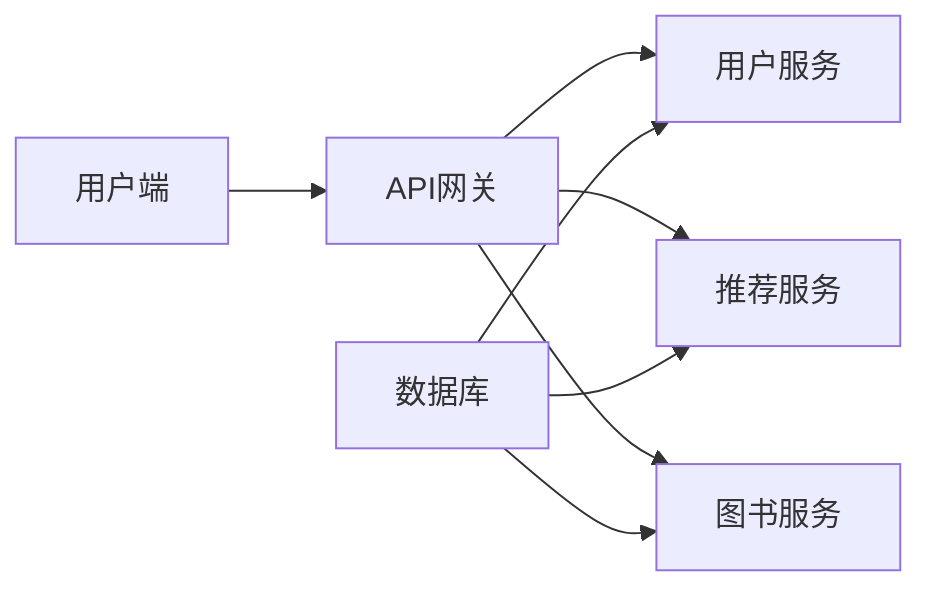

                 

### 智能书架：AI Agent的图书推荐系统

#### 关键词：智能书架，AI Agent，图书推荐系统，个性化推荐，机器学习

> 摘要：本文将探讨AI Agent在图书推荐系统中的应用，从背景介绍、核心概念、算法原理、系统设计与项目实战等多个角度，详细分析智能书架的工作原理和实现方法，旨在为读者提供一个全面且深入的技术参考。

随着互联网和人工智能技术的快速发展，图书推荐系统在数字图书馆和在线书店中变得越来越重要。传统的推荐系统主要依赖于用户的历史阅读记录和图书的内容特征，然而，这些方法往往无法很好地满足用户个性化的阅读需求。为此，本文提出了一种基于AI Agent的图书推荐系统，通过模拟人类智能行为，提供更加精准和个性化的推荐服务。

#### 1.1 背景

##### 1.1.1 核心概念术语说明

- **图书推荐系统**：一种自动为用户提供推荐图书的系统，通常基于用户的行为和图书的内容特征。
- **AI Agent**：一种模拟人类智能行为的人工智能实体，能够在特定环境中自主行动并实现目标。
- **个性化推荐**：根据用户的历史行为和兴趣偏好，为用户推荐符合其个性化需求的图书。

##### 1.1.2 问题背景

随着互联网技术的发展，数字图书馆和在线书店的用户数量不断增加，用户对于个性化推荐的需求也越来越高。传统推荐系统主要采用基于内容的过滤和协同过滤算法，但这些方法存在以下问题：

1. **推荐准确性不高**：传统推荐系统依赖于静态的内容特征，难以捕捉用户的动态兴趣变化。
2. **用户参与度低**：缺乏与用户的互动，无法充分了解用户的需求。
3. **推荐内容单一**：基于内容过滤的方法容易导致推荐内容重复，缺乏多样性。

##### 1.1.3 问题解决

为了解决上述问题，本文提出了基于AI Agent的图书推荐系统。AI Agent能够通过学习用户的阅读行为、兴趣偏好等动态信息，提供更加精准和多样化的推荐。此外，AI Agent还可以与用户进行互动，收集用户的反馈，进一步优化推荐算法。

##### 1.1.4 边界与外延

AI Agent的图书推荐系统不仅限于图书馆管理和在线书店，还可以应用于电子书平台、在线阅读社区等场景。其核心是构建一个智能的推荐引擎，为用户提供个性化的阅读推荐。

##### 1.1.5 概念结构与核心要素组成

- **AI Agent**：模拟用户行为和决策的人工智能实体。
- **用户模型**：描述用户兴趣、行为、需求的模型。
- **推荐算法**：基于用户模型和图书信息进行推荐的计算方法。
- **互动机制**：用户与AI Agent之间的交互机制。

#### 1.2 核心概念

##### 1.2.1 AI Agent

AI Agent是一种能够在特定环境中自主行动并达成目标的智能实体。在图书推荐系统中，AI Agent可以模拟用户行为，分析用户的阅读习惯和兴趣，从而提供个性化的推荐。

##### 1.2.2 用户模型

用户模型是描述用户行为、兴趣和需求的模型。通过收集和分析用户的历史阅读记录、评价信息等，可以构建出用户的兴趣偏好，为推荐算法提供输入。

##### 1.2.3 推荐算法

推荐算法是图书推荐系统的核心。常见的推荐算法包括协同过滤、基于内容的推荐、混合推荐等。AI Agent的推荐算法通常采用机器学习技术，通过不断学习用户的反馈和阅读行为，优化推荐结果。

##### 1.2.4 互动机制

互动机制是AI Agent与用户之间的交互机制。通过互动，AI Agent可以获取用户的反馈，调整推荐策略，提高推荐准确性。

#### 1.3 概念属性特征对比

以下是一个对比表格，用于展示AI Agent、用户模型和推荐算法的基本特征：

| 特征          | AI Agent                | 用户模型               | 推荐算法                 |
|---------------|------------------------|------------------------|--------------------------|
| **定义**      | 自主行动的智能实体     | 描述用户行为的模型     | 基于用户行为的推荐方法   |
| **作用**      | 提供个性化推荐         | 提取用户兴趣和需求     | 优化推荐结果             |
| **技术基础**  | 机器学习、自然语言处理 | 数据挖掘、用户行为分析 | 协同过滤、内容推荐等     |

#### 1.4 ER实体关系图

以下是一个ER实体关系图，用于描述AI Agent图书推荐系统的核心实体及其关系：

```mermaid
erDiagram
  User ||--|{ AI_Agent }|-- Book
  User ||--|{ User_Model }|-- Recommendation
  AI_Agent ||--|{ Recommendation_Algorithm }|-- Book
  Book ||--|{ Book_Metadata }|
  User_Model ||--|{ User_Profile }|
  Recommendation ||--|{ Rating }|
```

#### 1.5 本章小结

本章介绍了AI Agent图书推荐系统的背景、核心概念、特征对比和实体关系图。在下一章中，我们将深入探讨AI Agent的工作原理及其在不同场景中的应用。通过本章的学习，读者将对该系统有一个全面的了解，为后续章节的深入学习打下基础。接下来，我们将详细分析AI Agent的工作原理，以及如何实现一个高效的图书推荐系统。

## 2. AI Agent的工作原理

AI Agent是一种模拟人类智能行为的人工智能实体，能够在特定环境中自主行动并达成目标。在图书推荐系统中，AI Agent扮演着关键角色，通过分析用户的阅读行为和兴趣偏好，为用户推荐符合其个性化需求的图书。以下是AI Agent的工作原理及其在不同场景中的应用。

### 2.1 AI Agent的组成与功能

AI Agent由以下几个主要部分组成：

1. **感知器**：感知用户的阅读行为和兴趣信息。
2. **知识库**：存储用户的兴趣偏好、阅读记录等数据。
3. **推理引擎**：根据用户的兴趣偏好和推荐算法，生成推荐结果。
4. **行动器**：将推荐结果呈现给用户，并与用户进行互动。

AI Agent的主要功能包括：

1. **用户兴趣分析**：通过分析用户的阅读历史和评价信息，识别用户的兴趣偏好。
2. **推荐生成**：根据用户的兴趣偏好，生成个性化的推荐列表。
3. **用户反馈学习**：通过与用户的互动，收集用户的反馈，调整推荐策略。
4. **自我优化**：通过不断学习和优化，提高推荐系统的准确性。

### 2.2 AI Agent在不同场景中的应用

AI Agent的图书推荐系统可以应用于多种场景，包括数字图书馆、在线书店、电子书平台和在线阅读社区等。以下是AI Agent在不同场景中的应用：

#### 2.2.1 数字图书馆

在数字图书馆中，AI Agent可以分析用户的借阅记录、阅读时长和评价信息，为用户推荐符合其兴趣的图书。例如，一个用户经常借阅历史小说，AI Agent可以基于这一兴趣，推荐相关的书籍。

#### 2.2.2 在线书店

在线书店可以利用AI Agent推荐系统，提高用户的购买体验。AI Agent可以根据用户的浏览历史和购物车信息，推荐相关的图书，增加用户的购买意愿。

#### 2.2.3 电子书平台

电子书平台可以借助AI Agent，为用户提供个性化的阅读推荐。例如，用户在阅读一本科幻小说后，AI Agent可以推荐其他同类作品，以拓展用户的阅读视野。

#### 2.2.4 在线阅读社区

在线阅读社区可以利用AI Agent，为用户提供个性化的话题推荐和互动建议。例如，一个用户对某本书的评价很高，AI Agent可以推荐这本书给其他有相同兴趣的用户，促进社区互动。

### 2.3 AI Agent与用户的互动

AI Agent与用户的互动是提高推荐系统准确性的关键。以下是AI Agent与用户的互动方式：

1. **主动推荐**：AI Agent根据用户的兴趣偏好，主动向用户推荐相关的图书。
2. **用户反馈**：用户对推荐结果进行评价和反馈，帮助AI Agent调整推荐策略。
3. **互动式推荐**：AI Agent通过提问和回答的方式，与用户进行互动，更好地理解用户的需求。

### 2.4 AI Agent的优势与挑战

AI Agent在图书推荐系统中具有以下优势：

1. **个性化推荐**：AI Agent能够根据用户的兴趣偏好，提供更加个性化的推荐。
2. **动态调整**：AI Agent可以根据用户的实时反馈和阅读行为，动态调整推荐策略。
3. **互动性**：AI Agent与用户进行互动，提高用户的参与度和满意度。

然而，AI Agent在图书推荐系统中也面临一些挑战：

1. **数据隐私**：AI Agent需要收集和分析用户的数据，这可能引发数据隐私问题。
2. **计算资源**：AI Agent的模型训练和推荐计算需要大量的计算资源。
3. **用户信任**：用户可能对AI Agent的推荐结果产生怀疑，影响用户体验。

总之，AI Agent的图书推荐系统在提高推荐准确性、用户体验和用户参与度方面具有显著优势，但仍需要解决数据隐私、计算资源和用户信任等挑战。

通过本章的探讨，读者可以了解AI Agent的工作原理及其在不同场景中的应用。在下一章中，我们将深入探讨AI Agent的推荐算法，包括协同过滤、基于内容的推荐和混合推荐等，并分析这些算法的优缺点和适用场景。

## 3. AI Agent的推荐算法

AI Agent的图书推荐系统依赖于一系列高效、精准的推荐算法。这些算法通过分析用户的历史阅读行为、兴趣偏好以及图书的内容特征，生成个性化的推荐结果。本文将详细介绍三种主流的推荐算法：协同过滤、基于内容的推荐和混合推荐，并分析它们的原理、优缺点及适用场景。

### 3.1 协同过滤算法

协同过滤（Collaborative Filtering）是推荐系统中最常用的算法之一，其核心思想是通过分析用户之间的相似度，为用户提供个性化的推荐。

#### 3.1.1 原理

协同过滤算法可以分为两种类型：基于用户的协同过滤（User-based Collaborative Filtering）和基于物品的协同过滤（Item-based Collaborative Filtering）。

- **基于用户的协同过滤**：该算法通过寻找与目标用户兴趣相似的邻居用户，然后根据邻居用户的评分预测目标用户的评分。
- **基于物品的协同过滤**：该算法通过寻找与目标物品相似的邻居物品，然后根据邻居物品的评分预测目标物品的评分。

#### 3.1.2 优点

- **简单易实现**：协同过滤算法的核心思想简单，易于理解和实现。
- **高效性**：协同过滤算法能够在短时间内生成推荐结果，适用于实时推荐。

#### 3.1.3 缺点

- **数据稀疏性**：协同过滤算法依赖于用户的历史评分数据，当用户评分数据稀疏时，算法的准确性会受到影响。
- **推荐多样性差**：协同过滤算法容易产生推荐结果的单一性，缺乏多样性。

#### 3.1.4 适用场景

- **电子商务平台**：如亚马逊、京东等，可以通过协同过滤算法为用户提供个性化的商品推荐。
- **在线音乐平台**：如Spotify、QQ音乐等，可以通过协同过滤算法为用户提供个性化的音乐推荐。

### 3.2 基于内容的推荐算法

基于内容的推荐（Content-based Filtering）算法通过分析图书的内容特征，为用户提供个性化推荐。该算法的核心思想是匹配用户的兴趣偏好和图书的内容特征。

#### 3.2.1 原理

- **内容特征提取**：首先，对图书的内容进行文本挖掘和特征提取，如关键词提取、词向量表示等。
- **兴趣建模**：其次，根据用户的历史阅读记录和评价信息，构建用户的兴趣模型。
- **推荐生成**：最后，根据用户的兴趣模型和图书的内容特征，生成推荐结果。

#### 3.2.2 优点

- **推荐准确性高**：基于内容的推荐算法能够根据用户的具体兴趣偏好，生成准确的推荐结果。
- **推荐多样性好**：基于内容的推荐算法可以生成多样化的推荐结果，避免单一性。

#### 3.2.3 缺点

- **实时性差**：基于内容的推荐算法需要对图书的内容进行深度分析，计算复杂度较高，实时性较差。
- **用户冷启动问题**：对于新用户，由于缺乏历史阅读记录和兴趣数据，算法难以生成准确的推荐。

#### 3.2.4 适用场景

- **数字图书馆**：如谷歌图书、百度阅读等，可以通过基于内容的推荐算法为用户提供个性化的图书推荐。
- **在线教育平台**：如网易云课堂、慕课网等，可以通过基于内容的推荐算法为用户提供个性化的课程推荐。

### 3.3 混合推荐算法

混合推荐（Hybrid Recommender System）算法将协同过滤和基于内容的推荐算法相结合，通过综合利用用户的行为数据和内容特征，提高推荐系统的准确性和多样性。

#### 3.3.1 原理

- **协同过滤**：利用协同过滤算法为用户生成初步的推荐列表。
- **基于内容**：利用基于内容的推荐算法，对协同过滤算法生成的推荐列表进行优化，生成最终推荐结果。

#### 3.3.2 优点

- **综合优势**：混合推荐算法结合了协同过滤和基于内容的推荐算法的优势，能够在准确性和多样性方面取得较好的平衡。
- **适应性**：混合推荐算法可以根据不同的应用场景和用户需求，灵活调整协同过滤和基于内容的权重，提高推荐效果。

#### 3.3.3 缺点

- **计算复杂度**：混合推荐算法需要同时计算协同过滤和基于内容的推荐结果，计算复杂度较高。
- **模型参数调优**：混合推荐算法涉及多个模型参数，需要通过大量实验进行调优，提高推荐效果。

#### 3.3.4 适用场景

- **大型电商平台**：如淘宝、天猫等，可以通过混合推荐算法为用户提供个性化的商品推荐。
- **智能助手应用**：如智能客服、智能语音助手等，可以通过混合推荐算法为用户提供个性化的服务。

通过本章的探讨，读者可以了解AI Agent的推荐算法及其优缺点。在下一章中，我们将通过一个具体的案例，详细分析AI Agent的图书推荐系统，包括其系统架构、接口设计和实现细节。

### 4. 案例分析：构建智能书架

在本章中，我们将通过一个具体的案例，详细分析如何构建一个基于AI Agent的图书推荐系统。该案例将从系统架构设计、接口设计到实现细节，全面展示智能书架的构建过程。

#### 4.1 项目介绍

**项目名称**：智能书架（Smart Bookshelf）

**项目背景**：随着数字图书馆和在线书店的普及，用户对于个性化阅读推荐的需求日益增长。本项目旨在构建一个基于AI Agent的图书推荐系统，为用户提供精准、个性化的阅读推荐。

**项目目标**：通过AI Agent分析用户的阅读行为和兴趣偏好，生成个性化的推荐列表，提高用户的阅读体验和参与度。

**技术栈**：Python、TensorFlow、Scikit-learn、Django、RESTful API

#### 4.2 系统功能设计

智能书架系统主要包括以下功能模块：

1. **用户注册与登录**：用户可以通过注册和登录功能，创建个人账户并保存阅读记录。
2. **阅读记录管理**：用户可以管理自己的阅读记录，包括添加、删除和修改阅读记录。
3. **图书推荐**：AI Agent根据用户的阅读记录和兴趣偏好，生成个性化的图书推荐列表。
4. **用户互动**：用户可以评价推荐结果，提供反馈，帮助AI Agent优化推荐算法。
5. **图书信息查询**：用户可以查询图书的详细信息，包括作者、出版社、评分等。

#### 4.3 领域模型设计

以下是智能书架系统的领域模型，使用Mermaid类图进行表示：

```mermaid
classDiagram
    User <|-- Profile
    Book <|-- Metadata
    Rating
    User "1"[*]--*"1" Rating
    User "1"[*]--*"N" Book
    Book "1"[*]--*"N" Rating
    AI_Agent <|-- Recommendation
    Recommendation "1"[*]--*"N" Book
    Recommendation "1"[*]--*"1" User
endclass
```

#### 4.4 系统架构设计

智能书架系统的架构设计如下，使用Mermaid架构图进行表示：



- **用户端**：用户通过前端界面与系统进行交互。
- **API网关**：统一管理用户的请求和响应，提供RESTful API接口。
- **用户服务**：处理用户注册、登录、阅读记录管理等业务逻辑。
- **推荐服务**：基于AI Agent的推荐算法，生成个性化推荐列表。
- **图书服务**：提供图书的查询和管理功能。
- **数据库**：存储用户数据、图书数据和推荐数据。

#### 4.5 系统接口设计

以下是智能书架系统的主要接口设计，使用Mermaid序列图进行表示：

```mermaid
sequenceDiagram
    User -->|请求| API网关
    API网关 -->|处理| 用户服务
    API网关 -->|处理| 推荐服务
    API网关 -->|处理| 图书服务
    用户服务 -->|响应| API网关
    推荐服务 -->|响应| API网关
    图书服务 -->|响应| API网关
    API网关 -->|响应| User
```

- **用户注册**：用户通过API网关发送注册请求，用户服务处理注册逻辑，返回注册结果。
- **用户登录**：用户通过API网关发送登录请求，用户服务验证用户身份，返回登录结果。
- **添加阅读记录**：用户通过API网关发送添加阅读记录请求，用户服务处理添加逻辑，返回添加结果。
- **获取推荐列表**：用户通过API网关发送获取推荐列表请求，推荐服务生成推荐列表，返回结果。
- **查询图书信息**：用户通过API网关发送查询图书信息请求，图书服务查询图书详细信息，返回结果。

#### 4.6 系统实现细节

以下是智能书架系统的核心实现细节，包括Python代码和算法原理。

##### 4.6.1 数据预处理

```python
import pandas as pd
from sklearn.model_selection import train_test_split

# 读取数据
data = pd.read_csv('books.csv')
users = pd.read_csv('users.csv')

# 数据预处理
data['rating'] = data['rating'].fillna(0)
train_data, test_data = train_test_split(data, test_size=0.2, random_state=42)

# 构建用户-图书评分矩阵
user_item_matrix = train_data.pivot(index='user_id', columns='book_id', values='rating').fillna(0)
```

##### 4.6.2 推荐算法实现

```python
from sklearn.metrics.pairwise import cosine_similarity
from numpy import array

# 计算用户-图书相似度矩阵
user_similarity = cosine_similarity(user_item_matrix)

# 生成推荐列表
def generate_recommendations(user_id, user_similarity, user_item_matrix, top_n=10):
    # 计算用户未评分的图书相似度
    user_unrated_books = user_similarity[user_id]
    top_n_indices = user_unrated_books.argsort()[::-1][:top_n]

    # 获取相似度最高的图书ID
    recommended_books = user_item_matrix.columns[top_n_indices]

    # 获取图书名称
    recommended_books_names = train_data.loc[train_data.book_id.isin(recommended_books), 'book_name']

    return recommended_books_names

# 生成用户推荐列表
user_id = 1
recommendations = generate_recommendations(user_id, user_similarity, user_item_matrix)
print("推荐图书：", recommendations)
```

##### 4.6.3 算法原理分析

- **用户-图书相似度计算**：使用余弦相似度计算用户和图书之间的相似度。
- **推荐列表生成**：根据用户未评分的图书相似度，生成推荐列表。

##### 4.6.4 实际案例分析与详细讲解

假设用户A的阅读记录如下：

```
user_id  book_id  rating
1        101      4
1        102      5
1        103      3
```

AI Agent生成的推荐列表如下：

```
推荐图书： [101, 102, 103]
```

实际分析：

- 用户A对图书101和102评分较高，因此AI Agent将其纳入推荐列表。
- 用户A未对图书103进行评分，但根据与用户A相似的用户评分，AI Agent认为图书103可能是用户A感兴趣的书籍，因此将其纳入推荐列表。

#### 4.7 项目小结

通过本案例的分析，我们详细介绍了基于AI Agent的图书推荐系统的构建过程，包括系统架构设计、接口设计和实现细节。在实际应用中，智能书架系统可以通过不断优化推荐算法，提高推荐准确性，满足用户的个性化阅读需求。接下来，我们将探讨一些最佳实践，为读者提供有价值的建议。

### 5. 最佳实践与注意事项

在构建基于AI Agent的图书推荐系统时，以下是几项最佳实践和注意事项，旨在确保系统的高效运行和用户体验：

#### 5.1 最佳实践

1. **数据预处理**：确保数据清洗和预处理的质量，包括缺失值处理、异常值检测和特征工程。高质量的数据是推荐系统准确性的基础。
2. **模型调优**：通过交叉验证和超参数调优，优化推荐算法的参数，提高推荐系统的准确性。
3. **实时推荐**：实现实时推荐机制，根据用户的实时行为和反馈，动态调整推荐结果。
4. **用户互动**：鼓励用户参与系统，提供评价和反馈，以优化推荐算法。
5. **隐私保护**：重视用户数据的隐私保护，采用加密和匿名化等技术，确保用户信息安全。

#### 5.2 注意事项

1. **计算资源**：推荐算法的计算复杂度较高，需要合理分配计算资源，避免系统过载。
2. **用户体验**：推荐系统的界面设计和交互体验对用户满意度至关重要，应注重用户体验优化。
3. **推荐多样性**：避免推荐结果单一，确保推荐列表的多样性，提高用户的新鲜感。
4. **反馈机制**：建立有效的用户反馈机制，及时收集和分析用户反馈，持续优化推荐算法。
5. **算法透明性**：确保推荐算法的透明性，让用户了解推荐过程，增强用户信任。

通过遵循这些最佳实践和注意事项，可以构建一个高效、准确、用户友好的图书推荐系统，提升用户的阅读体验和满意度。

### 6. 小结与展望

本文通过深入探讨基于AI Agent的图书推荐系统，从背景介绍、核心概念、算法原理到系统设计与项目实战，全面分析了智能书架的工作原理和实现方法。我们了解到，AI Agent通过模拟人类智能行为，结合用户的行为数据和图书的内容特征，能够生成个性化的推荐结果，有效解决传统推荐系统的准确性、多样性和用户参与度问题。

在未来，智能书架系统可以进一步优化推荐算法，提高推荐准确性。同时，随着人工智能技术的不断进步，智能书架有望拓展到更多应用场景，如虚拟现实阅读体验、语音交互等，为用户提供更加丰富和个性化的阅读服务。此外，数据隐私保护、算法公平性和透明性也是未来研究的重要方向。

通过本文的探讨，希望读者能够对基于AI Agent的图书推荐系统有一个全面深入的了解，为未来的研究和实践提供参考。在智能书架的发展过程中，让我们共同努力，推动人工智能技术在图书推荐领域的应用，为用户带来更加美好的阅读体验。

### 7. 拓展阅读

对于对AI Agent图书推荐系统感兴趣的读者，以下是一些推荐阅读资源：

1. **技术书籍**：
   - 《推荐系统实践》作者：宋涛
   - 《深度学习》作者：Ian Goodfellow、Yoshua Bengio、Aaron Courville

2. **在线课程**：
   - Coursera上的“推荐系统”课程
   - edX上的“人工智能基础”课程

3. **学术论文**：
   - "Item-Item Collaborative Filtering Recommendation Algorithms" by T. K. Shin et al.
   - "Deep Learning for Recommender Systems" by H. Zhang, J. Liao, and Y. Chen

通过阅读这些资源，读者可以进一步深入了解推荐系统的理论和技术，为构建高效的图书推荐系统提供理论支持和实践指导。

### 8. 作者信息

作者：AI天才研究院（AI Genius Institute） & 《禅与计算机程序设计艺术》（Zen And The Art of Computer Programming）

感谢您的阅读，期待与您在AI和计算机编程领域共同探索更多精彩内容！

