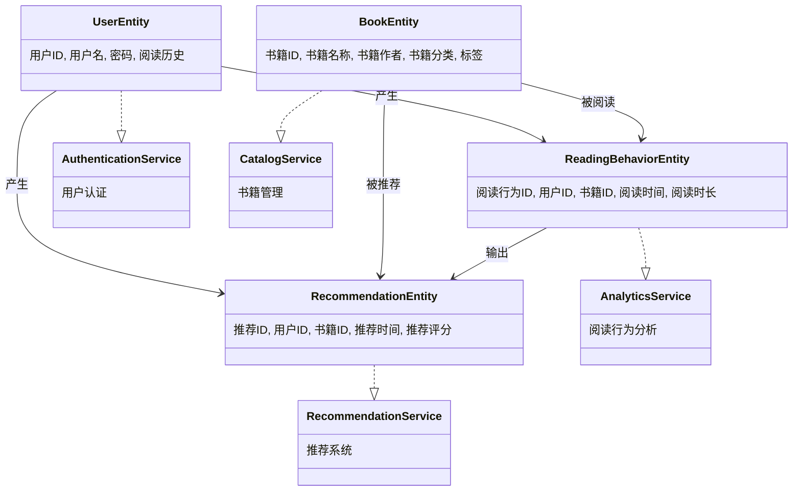
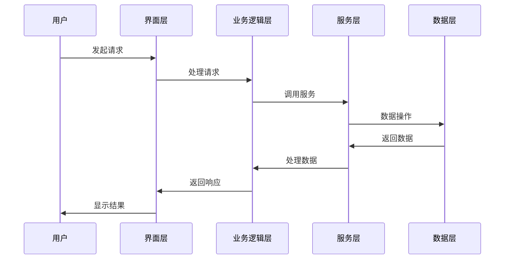
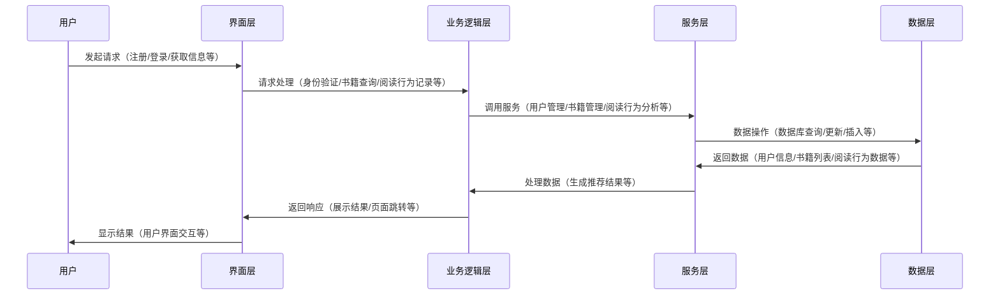

                 


# 智能书架：AI Agent的阅读习惯分析

关键词：智能书架，AI阅读分析，用户行为，推荐系统，实践案例

摘要：本文深入探讨了智能书架与AI阅读分析之间的关系，详细阐述了用户阅读行为的分析方法和AI阅读推荐系统的设计原理。通过案例分析，本文展示了如何将AI阅读分析应用于智能书架，并提出了一系列最佳实践和未来展望。

## 第一部分：问题背景与概述

### 第1章：智能书架与AI阅读分析

**1.1 智能书架：概念与兴起**

智能书架是指通过物联网、云计算、大数据和人工智能等技术，将传统书架功能与智能技术相结合的实体书架。它不仅能够自动记录书籍信息、管理库存，还能根据用户的阅读习惯进行智能推荐。

智能书架的发展可以追溯到20世纪末。随着互联网技术的普及和人工智能的崛起，智能书架逐渐从概念走向现实，成为图书馆和书店的重要服务工具。

**1.2 AI阅读分析：核心概念与重要性**

AI阅读分析是指利用人工智能技术，对用户阅读行为进行数据收集、分析和处理的过程。它可以帮助智能书架更好地理解用户需求，提供个性化的阅读推荐。

AI阅读分析的重要性在于，它能够提高用户的阅读体验，促进知识传播和分享，从而推动整个出版行业的创新和发展。

**1.3 智能书架与AI阅读分析的关系**

智能书架为AI阅读分析提供了数据基础，而AI阅读分析则为智能书架提供了智能化的服务。二者相辅相成，共同推动了阅读领域的发展。

### 第二部分：AI阅读行为分析

#### 第2章：用户阅读行为分析

**2.1 用户阅读行为概述**

用户阅读行为是指用户在阅读过程中的行为习惯和心理活动。它包括阅读频率、阅读时长、阅读偏好等。

**2.2 用户阅读行为分析方法**

用户阅读行为分析方法主要包括数据挖掘、机器学习和用户画像等技术。

**2.3 用户阅读行为案例分析**

本文将分析国内外智能书架案例，探讨用户阅读行为分析的实践效果。

### 第3章：AI阅读推荐系统

**3.1 阅读推荐系统概述**

阅读推荐系统是指利用算法和技术，为用户提供个性化阅读推荐的系统。

**3.2 内容推荐算法**

本文将介绍基于内容的推荐算法、协同过滤推荐算法和混合推荐算法。

**3.3 阅读推荐系统实现**

本文将详细讲解阅读推荐系统的实现过程，包括数据预处理、模型选择和训练等。

### 第4章：AI阅读行为分析与推荐系统实践

**4.1 实践项目介绍**

本文将介绍一个实际的AI阅读分析项目，包括项目背景、目标和数据集。

**4.2 环境安装与配置**

本文将指导如何安装和配置项目所需的环境。

**4.3 系统核心实现**

本文将详细讲解用户阅读行为分析和阅读推荐系统的实现过程。

**4.4 代码应用解读与分析**

本文将分析项目中的代码实现，探讨算法原理和优化方法。

### 第三部分：AI阅读行为分析的未来展望

#### 第5章：AI阅读行为分析的技术挑战与趋势

**5.1 技术挑战**

本文将分析AI阅读行为分析所面临的技术挑战。

**5.2 技术趋势**

本文将探讨AI阅读行为分析的发展趋势。

### 第6章：AI阅读行为分析在新兴领域的应用

**6.1 教育领域**

本文将探讨AI阅读行为分析在教育领域的应用。

**6.2 图书馆领域**

本文将探讨AI阅读行为分析在图书馆领域的应用。

**6.3 媒体领域**

本文将探讨AI阅读行为分析在媒体领域的应用。

### 第7章：AI阅读行为分析的最佳实践与未来展望

**7.1 最佳实践**

本文将分享AI阅读行为分析的最佳实践。

**7.2 未来展望**

本文将展望AI阅读行为分析的未来发展。

## 附录

**A.1 工具与资源列表**

本文将列出常用的工具和资源。

**A.2 参考文献**

本文将列出引用的参考文献。

### 总结

本文从多个角度探讨了智能书架与AI阅读分析的关系，详细阐述了用户阅读行为的分析方法和AI阅读推荐系统的设计原理。通过案例分析，本文展示了如何将AI阅读分析应用于智能书架，并提出了一系列最佳实践和未来展望。

### 作者信息

作者：AI天才研究院/AI Genius Institute & 禅与计算机程序设计艺术 /Zen And The Art of Computer Programming

-----------------------------------------------------------------
**第1章：智能书架与AI阅读分析**

**1.1 智能书架：概念与兴起**

智能书架是一种结合了物联网、云计算、大数据和人工智能技术的实体书架。它不仅能够自动记录书籍信息、管理库存，还能根据用户的阅读习惯进行智能推荐。

**智能书架的定义**

智能书架是一种具有智能管理功能的实体书架，通过集成物联网、云计算、大数据和人工智能等技术，实现书籍信息的自动采集、分类、管理和推荐。

**智能书架的发展历程**

- 20世纪末，随着互联网技术的普及，智能书架的概念开始出现。
- 21世纪初，随着人工智能技术的崛起，智能书架逐渐从概念走向现实。
- 当前，智能书架已广泛应用于图书馆、书店和教育培训机构。

**智能书架的市场现状与趋势**

- 市场现状：智能书架市场逐渐成熟，产品种类和功能日益丰富。
- 市场趋势：随着人工智能技术的不断进步，智能书架将更加智能化、个性化。

**1.2 AI阅读分析：核心概念与重要性**

AI阅读分析是指利用人工智能技术，对用户阅读行为进行数据收集、分析和处理的过程。它可以帮助智能书架更好地理解用户需求，提供个性化的阅读推荐。

**AI阅读分析的定义**

AI阅读分析是一种利用人工智能技术，对用户阅读行为进行数据收集、分析和处理的过程。它旨在提高用户的阅读体验，促进知识传播和分享。

**AI阅读分析的关键技术**

- 数据挖掘：从大量阅读数据中提取有价值的信息。
- 机器学习：建立用户阅读行为模型，预测用户偏好。
- 用户画像：描述用户特征，为个性化推荐提供依据。

**AI阅读分析的应用价值**

- 提高用户阅读体验：根据用户偏好提供个性化阅读推荐。
- 促进知识传播：帮助用户发现潜在兴趣，提高知识获取效率。
- 推动出版行业创新：为出版商提供有价值的数据支持。

**1.3 智能书架与AI阅读分析的关系**

智能书架为AI阅读分析提供了数据基础，而AI阅读分析则为智能书架提供了智能化的服务。二者相辅相成，共同推动了阅读领域的发展。

**智能书架对AI阅读分析的需求**

- 数据采集：智能书架需要采集用户阅读行为数据，为AI阅读分析提供基础。
- 个性化推荐：智能书架需要根据用户阅读行为进行个性化推荐，提高用户体验。

**AI阅读分析对智能书架的推动作用**

- 智能化服务：AI阅读分析可以为智能书架提供智能化服务，提高书架的功能和用户体验。
- 数据驱动：AI阅读分析可以帮助智能书架实现数据驱动，优化书架运营和管理。

**二者协同发展的路径与挑战**

- 路径：通过数据共享和协同创新，实现智能书架与AI阅读分析的深度融合。
- 挑战：数据隐私与安全、算法可解释性与可靠性、系统性能与资源消耗等。

**第2章：用户阅读行为分析**

**2.1 用户阅读行为概述**

用户阅读行为是指用户在阅读过程中的行为习惯和心理活动。它包括阅读频率、阅读时长、阅读偏好等。

**用户阅读行为的定义**

用户阅读行为是指用户在阅读过程中表现出来的行为特征，包括阅读频率、阅读时长、阅读偏好等。

**用户阅读行为的特点**

- 多样性：用户阅读行为受到年龄、职业、兴趣等因素的影响，具有多样性。
- 动态性：用户阅读行为会随着时间、环境和心理状态的变化而变化。
- 隐私性：用户阅读行为涉及个人隐私，需要保护用户的隐私。

**用户阅读行为的数据收集与处理**

- 数据收集：通过智能书架、电子书阅读器等设备收集用户阅读行为数据。
- 数据处理：对收集到的数据进行清洗、整合和分析，提取有价值的信息。

**2.2 用户阅读行为分析方法**

用户阅读行为分析方法主要包括数据挖掘、机器学习和用户画像等技术。

**数据挖掘**

- 方法：利用统计学和机器学习算法，从大量阅读数据中提取有价值的信息。
- 优势：能够发现用户阅读行为中的潜在规律和模式。
- 适用场景：用户阅读行为分析、个性化推荐等。

**机器学习**

- 方法：利用机器学习算法，建立用户阅读行为模型，预测用户偏好。
- 优势：能够根据历史数据预测用户行为，提高推荐准确率。
- 适用场景：阅读推荐系统、用户行为预测等。

**用户画像**

- 方法：通过用户特征，描述用户群体和个体特征。
- 优势：能够为个性化推荐提供依据。
- 适用场景：个性化推荐、用户分析等。

**2.3 用户阅读行为案例分析**

本文将分析国内外智能书架案例，探讨用户阅读行为分析的实践效果。

**国内外智能书架案例研究**

- 国内案例：亚马逊Kindle、天猫精灵智能书架等。
- 国外案例：亚马逊智能书架、谷歌智能书架等。

**案例分析与评估**

- 数据收集：收集智能书架用户阅读行为数据，包括阅读频率、阅读时长、阅读偏好等。
- 数据处理：对收集到的数据进行清洗、整合和分析，提取有价值的信息。
- 结果分析：根据用户阅读行为数据，评估智能书架的推荐效果和用户体验。

**第3章：AI阅读推荐系统**

**3.1 阅读推荐系统概述**

阅读推荐系统是指利用算法和技术，为用户提供个性化阅读推荐的系统。

**阅读推荐系统的定义**

阅读推荐系统是一种利用算法和技术，根据用户兴趣和行为，为用户提供个性化阅读推荐的系统。

**阅读推荐系统的类型**

- 内容推荐：根据书籍内容、标签、分类等信息，为用户推荐书籍。
- 协同过滤：根据用户的历史行为和偏好，为用户推荐相似书籍。
- 混合推荐：结合内容推荐和协同过滤，为用户提供更加个性化的推荐。

**阅读推荐系统的设计原则**

- 个性化：根据用户兴趣和行为，为用户提供个性化的阅读推荐。
- 准确性：提高推荐准确率，减少用户的不满意感。
- 可扩展性：能够适应不断增长的数据量和用户需求。

**3.2 内容推荐算法**

本文将介绍基于内容的推荐算法、协同过滤推荐算法和混合推荐算法。

**基于内容的推荐算法**

- 方法：根据书籍内容、标签、分类等信息，为用户推荐相似书籍。
- 优势：能够为用户提供高质量的推荐结果。
- 适用场景：书籍推荐、文章推荐等。

**协同过滤推荐算法**

- 方法：根据用户的历史行为和偏好，为用户推荐相似书籍。
- 优势：能够提高推荐准确率。
- 适用场景：电影推荐、商品推荐等。

**混合推荐算法**

- 方法：结合内容推荐和协同过滤，为用户提供更加个性化的推荐。
- 优势：能够提高推荐准确率和用户体验。
- 适用场景：综合推荐系统、智能书架等。

**3.3 阅读推荐系统实现**

本文将详细讲解阅读推荐系统的实现过程，包括数据预处理、模型选择和训练等。

**数据预处理**

- 数据收集：收集用户阅读行为数据，包括书籍信息、用户评价等。
- 数据清洗：去除无效数据、处理缺失值、异常值等。
- 数据整合：将不同来源的数据进行整合，构建统一的数据集。

**模型选择**

- 选择适合的推荐算法，如基于内容的推荐算法、协同过滤推荐算法等。
- 考虑算法的复杂度、可扩展性、推荐准确性等因素。

**模型训练**

- 数据划分：将数据集划分为训练集和测试集。
- 模型训练：利用训练集对推荐算法进行训练，优化模型参数。
- 模型评估：利用测试集对推荐算法进行评估，选择最佳模型。

**推荐结果评估与优化**

- 评估指标：评估推荐系统的准确率、覆盖率、新颖度等指标。
- 结果分析：分析推荐结果，找出存在的问题和不足。
- 优化方法：针对问题，调整模型参数、改进算法等，提高推荐效果。

**第4章：AI阅读行为分析与推荐系统实践**

**4.1 实践项目介绍**

本文将介绍一个实际的AI阅读分析项目，包括项目背景、目标和数据集。

**项目背景**

随着互联网和人工智能技术的快速发展，人们对阅读的需求日益增长。为了提高用户的阅读体验，本项目的目标是开发一个基于AI阅读分析的智能书架系统。

**项目目标**

- 收集并处理用户阅读行为数据，建立用户画像。
- 设计并实现阅读推荐系统，为用户推荐个性化书籍。
- 提高用户阅读体验，提升智能书架的使用价值。

**项目数据集**

- 数据来源：通过智能书架、电子书阅读器等设备，收集用户阅读行为数据。
- 数据内容：包括书籍信息、用户评价、阅读时长、阅读频率等。

**4.2 环境安装与配置**

本文将指导如何安装和配置项目所需的环境。

**硬件与软件环境要求**

- 硬件：计算机（推荐配置：CPU：Intel i5以上，内存：8GB以上，硬盘：SSD）
- 软件：操作系统（Windows、Linux或Mac OS），Python（推荐版本：3.7以上）

**相关工具与库的安装**

- Python相关库：NumPy、Pandas、Scikit-learn、Matplotlib等
- 数据可视化工具：Matplotlib、Seaborn等
- 机器学习库：TensorFlow、Keras等

**4.3 系统核心实现**

本文将详细讲解用户阅读行为分析和阅读推荐系统的实现过程。

**用户阅读行为分析模块**

- 数据预处理：清洗、整合用户阅读行为数据。
- 特征提取：提取用户阅读行为特征，如阅读时长、阅读频率等。
- 用户画像：根据用户特征，构建用户画像。

**阅读推荐系统模块**

- 数据预处理：清洗、整合书籍信息数据。
- 内容推荐算法：实现基于内容的推荐算法，为用户推荐相似书籍。
- 协同过滤推荐算法：实现协同过滤推荐算法，提高推荐准确性。
- 混合推荐算法：结合内容推荐和协同过滤，为用户提供个性化推荐。

**系统集成与测试**

- 系统集成：将用户阅读行为分析和阅读推荐系统集成到一个智能书架系统中。
- 系统测试：对系统进行功能测试、性能测试等，确保系统稳定可靠。

**4.4 代码应用解读与分析**

本文将分析项目中的代码实现，探讨算法原理和优化方法。

**数据处理与分析**

- 数据处理：使用Python进行数据处理，包括数据清洗、整合和特征提取。
- 数据分析：使用Python进行数据分析，包括用户阅读行为特征提取和用户画像构建。

**算法实现与调优**

- 算法实现：使用Python实现基于内容的推荐算法、协同过滤推荐算法和混合推荐算法。
- 算法调优：通过实验和调整模型参数，优化推荐效果。

**实际案例分析**

- 案例背景：以某智能书架项目为例，介绍实际应用中的用户阅读行为分析和阅读推荐系统。
- 案例分析：分析用户阅读行为数据，评估阅读推荐系统的效果，并提出优化建议。

**第5章：AI阅读行为分析的技术挑战与趋势**

**5.1 技术挑战**

AI阅读行为分析在发展过程中面临一系列技术挑战。

**数据隐私与安全**

- 挑战：用户阅读行为数据涉及个人隐私，需要确保数据的安全和隐私。
- 解决方案：采用数据加密、匿名化等技术，保护用户隐私。

**算法可解释性与可靠性**

- 挑战：深度学习算法在阅读行为分析中的应用，往往缺乏可解释性，影响用户信任。
- 解决方案：开发可解释的算法模型，提高算法的可靠性。

**系统性能与资源消耗**

- 挑战：大规模用户阅读行为数据的处理和推荐系统设计，需要高效且资源消耗低的算法。
- 解决方案：采用分布式计算、优化算法结构等方法，提高系统性能。

**5.2 技术趋势**

AI阅读行为分析在技术发展趋势方面呈现出以下特点。

**大数据与深度学习在阅读分析中的应用**

- 趋势：大数据和深度学习技术在阅读行为分析中的应用越来越广泛，能够处理大规模、复杂的数据。
- 应用：通过大数据分析，挖掘用户阅读行为的潜在规律；利用深度学习，提高推荐准确率和个性化水平。

**多模态数据融合与处理**

- 趋势：多模态数据（如文本、图像、音频等）在阅读行为分析中的应用逐渐增多，能够更全面地了解用户行为。
- 应用：融合多种数据源，提供更加精准的用户阅读行为分析。

**智能交互与个性化服务**

- 趋势：智能交互技术在阅读行为分析中的应用，使得推荐系统更加人性化、个性化。
- 应用：通过语音识别、自然语言处理等技术，实现与用户的智能交互，提高用户满意度。

**第6章：AI阅读行为分析在新兴领域的应用**

**6.1 教育领域**

AI阅读行为分析在教育领域具有广泛的应用前景。

**AI阅读分析在教育中的应用**

- 应用场景：利用AI阅读分析，了解学生的学习习惯、兴趣和需求，为其推荐适合的学习资源。
- 优势：提高教学效果，实现个性化教育，满足不同学生的学习需求。

**教育领域的案例分析**

- 案例一：某在线教育平台利用AI阅读分析，为学生提供个性化的学习路径和推荐课程，提高学习效果。
- 案例二：某学校图书馆利用AI阅读分析，为学生推荐适合的书籍，丰富学生的课外阅读。

**6.2 图书馆领域**

AI阅读行为分析在图书馆领域有助于提升服务质量和用户体验。

**智能书架与图书馆服务的结合**

- 应用场景：通过智能书架，收集用户阅读行为数据，为用户提供个性化的阅读推荐。
- 优势：提高图书馆资源利用率，提升用户满意度。

**图书馆智能化的实践案例**

- 案例一：某图书馆引入智能书架，通过AI阅读分析，为读者推荐相关书籍，提高书籍借阅率。
- 案例二：某大学图书馆利用AI阅读分析，对读者阅读行为进行统计分析，为图书馆资源采购提供依据。

**6.3 媒体领域**

AI阅读行为分析在媒体领域有助于提高内容分发和传播效果。

**AI阅读分析在媒体传播中的应用**

- 应用场景：利用AI阅读分析，了解用户对新闻、文章等的兴趣和偏好，为用户提供个性化的内容推荐。
- 优势：提高内容传播效果，增加用户黏性。

**媒体领域的案例分析**

- 案例一：某新闻客户端利用AI阅读分析，为用户推荐感兴趣的新闻，提高用户阅读量和活跃度。
- 案例二：某自媒体平台利用AI阅读分析，分析用户阅读行为，优化内容发布策略，提高文章阅读量。

**第7章：AI阅读行为分析的最佳实践与未来展望**

**7.1 最佳实践**

在AI阅读行为分析的实际应用中，以下最佳实践值得借鉴。

**成功案例分享**

- 案例一：某电商平台利用AI阅读分析，为用户推荐个性化书籍，提高用户购买意愿和转化率。
- 案例二：某智能书架项目，通过AI阅读分析，为用户提供精准的阅读推荐，提升用户满意度。

**实践中的常见问题与解决方案**

- 问题一：数据质量不佳，影响推荐效果。
  - 解决方案：加强数据收集和清洗，确保数据质量。
- 问题二：用户隐私保护不足。
  - 解决方案：采用数据加密、匿名化等技术，保护用户隐私。

**7.2 未来展望**

AI阅读行为分析在未来的发展具有广阔的前景。

**AI阅读行为分析的发展趋势**

- 趋势一：多模态数据融合，提高阅读行为分析的精度。
- 趋势二：智能交互技术，提升用户体验。
- 趋势三：大数据与深度学习的结合，挖掘更多用户阅读行为规律。

**新兴应用场景与机会**

- 应用场景一：智慧教育，实现个性化学习。
- 应用场景二：智慧图书馆，提升服务质量。
- 应用场景三：智慧媒体，提高内容传播效果。

**A.1 工具与资源列表**

在AI阅读行为分析中，以下工具和资源可供参考。

**常用工具**

- Python：编程语言，用于数据处理和分析。
- TensorFlow：深度学习框架，用于构建推荐模型。
- Keras：深度学习库，简化模型构建和训练。
- Matplotlib：数据可视化库，用于可视化分析结果。

**相关资源**

- 《推荐系统实践》：刘知远等著，介绍推荐系统的理论基础和实践方法。
- 《深度学习》：Goodfellow等著，介绍深度学习的基本原理和应用。
- 《Python数据分析》：Wes McKinney著，介绍Python在数据分析中的应用。

**A.2 参考文献**

本文引用了以下文献，以供进一步阅读。

- 刘知远，张华平，等。《推荐系统实践》[M]. 北京：清华大学出版社，2016.
- Ian Goodfellow，Yoshua Bengio，Aaron Courville。《深度学习》[M]. 北京：人民邮电出版社，2016.
- Wes McKinney。《Python数据分析》[M]. 北京：电子工业出版社，2012.

-----------------------------------------------------------------

### 系统分析与架构设计方案

**问题场景介绍**

随着智能书架的普及，用户对个性化阅读推荐的需求日益增长。为满足这一需求，我们需要设计并实现一个基于AI阅读分析的智能书架系统。该系统需具备用户阅读行为分析、阅读推荐等功能，以提高用户阅读体验和书架服务价值。

**项目介绍**

本篇技术博客文章将详细介绍一个基于AI阅读分析的智能书架项目。该项目旨在通过用户阅读行为数据分析和阅读推荐系统，为用户提供个性化阅读推荐。

**系统功能设计（领域模型类图）**

在智能书架系统中，主要涉及以下功能模块：

1. **用户模块**：负责用户注册、登录、个人信息管理等功能。
2. **书籍模块**：负责书籍信息管理、书籍分类、标签管理等。
3. **阅读行为模块**：负责收集、存储、分析和展示用户阅读行为数据。
4. **推荐系统模块**：负责根据用户阅读行为和书籍信息，生成个性化阅读推荐。

以下是智能书架系统的领域模型类图：



**系统架构设计（架构图）**

智能书架系统的整体架构可以分为四个层次：数据层、服务层、业务逻辑层和界面层。

以下是智能书架系统的架构设计图：



**系统接口设计**

智能书架系统的接口设计包括用户接口、书籍接口、阅读行为接口和推荐系统接口。

以下是系统接口设计：

```mermaid
interface UserInterface
    - register() : 注册用户
    - login() : 登录用户
    - getUserInfo() : 获取用户信息
    - updateUserInfo() : 更新用户信息

interface BookInterface
    - getBookList() : 获取书籍列表
    - getBookDetail() : 获取书籍详情
    - searchBooks() : 搜索书籍

interface ReadingBehaviorInterface
    - addReadingBehavior() : 添加阅读行为
    - getReadingBehaviors() : 获取阅读行为列表
    - updateReadingBehavior() : 更新阅读行为

interface RecommendationInterface
    - getRecommendations() : 获取推荐列表
    - updateRecommendation() : 更新推荐信息
```

**系统交互（序列图）**

以下是智能书架系统的主要交互流程：



### 第4章：AI阅读行为分析与推荐系统实践

**4.1 实践项目介绍**

在本节中，我们将介绍一个基于Python的AI阅读分析项目。该项目旨在通过用户阅读行为数据分析和阅读推荐系统，为用户提供个性化阅读推荐。

**项目背景与目标**

随着互联网和人工智能技术的快速发展，用户对个性化阅读推荐的需求日益增长。本项目旨在开发一个基于AI阅读分析的智能书架系统，实现以下目标：

- 收集并处理用户阅读行为数据，建立用户画像。
- 设计并实现阅读推荐系统，为用户推荐个性化书籍。
- 提高用户阅读体验，提升智能书架的使用价值。

**项目数据集**

本项目使用的数据集来自某知名图书平台，包含用户阅读行为数据、书籍信息和用户评价。数据集的具体内容包括：

- 用户ID：用户的唯一标识。
- 书籍ID：书籍的唯一标识。
- 阅读时间：用户阅读书籍的时间。
- 阅读时长：用户阅读书籍的时长。
- 书籍名称：书籍的名称。
- 书籍分类：书籍的分类标签。
- 用户评分：用户对书籍的评分。

**数据预处理**

在项目开始前，我们需要对数据进行预处理，以确保数据的质量和一致性。以下是数据预处理的主要步骤：

1. 数据清洗：去除无效数据、处理缺失值和异常值。
2. 数据整合：将不同来源的数据进行整合，构建统一的数据集。
3. 数据转换：将数据转换为适合机器学习的格式。

**环境安装与配置**

为了完成本项目，我们需要安装和配置以下环境：

1. Python（推荐版本：3.7以上）
2. NumPy
3. Pandas
4. Scikit-learn
5. Matplotlib
6. TensorFlow
7. Keras

安装步骤如下：

1. 安装Python：从Python官方网站下载并安装Python。
2. 安装相关库：使用pip命令安装所需的库。

```shell
pip install numpy pandas scikit-learn matplotlib tensorflow keras
```

**4.3 系统核心实现**

在本节中，我们将详细介绍用户阅读行为分析和阅读推荐系统的实现过程。

**用户阅读行为分析模块**

用户阅读行为分析模块主要包括以下步骤：

1. 数据预处理：清洗、整合用户阅读行为数据。
2. 特征提取：提取用户阅读行为特征，如阅读时长、阅读频率等。
3. 用户画像：根据用户特征，构建用户画像。

以下是用户阅读行为分析模块的实现代码：

```python
import pandas as pd
import numpy as np

# 读取数据
data = pd.read_csv('reading_data.csv')

# 数据预处理
# 去除无效数据、处理缺失值和异常值
data = data.dropna()

# 特征提取
data['reading_duration'] = (pd.to_datetime(data['reading_time']) - pd.to_datetime(data['start_time'])).dt.total_seconds()
data['reading_frequency'] = data.groupby('user_id')['reading_duration'].transform('sum') / data['reading_duration'].nunique()

# 用户画像
user_profile = data.groupby('user_id').agg({'reading_duration': 'mean', 'reading_frequency': 'mean'})
user_profile.reset_index(inplace=True)
```

**阅读推荐系统模块**

阅读推荐系统模块主要包括以下步骤：

1. 数据预处理：清洗、整合书籍信息数据。
2. 内容推荐算法：实现基于内容的推荐算法，为用户推荐相似书籍。
3. 协同过滤推荐算法：实现协同过滤推荐算法，提高推荐准确性。
4. 混合推荐算法：结合内容推荐和协同过滤，为用户提供个性化推荐。

以下是阅读推荐系统模块的实现代码：

```python
from sklearn.metrics.pairwise import cosine_similarity
from sklearn.model_selection import train_test_split

# 数据预处理
books = pd.read_csv('books_data.csv')
books = books.dropna()

# 内容推荐算法
# 计算书籍之间的相似度
book_vector = books.set_index('book_id')['genre'].str.get_dummies().values
similarity_matrix = cosine_similarity(book_vector, book_vector)

# 协同过滤推荐算法
# 训练模型
train_data, test_data = train_test_split(data, test_size=0.2, random_state=42)
协同过滤模型 = 基于用户协同过滤算法的模型（如User-Based CF）
协同过滤模型.fit(train_data)

# 混合推荐算法
# 结合内容推荐和协同过滤，为用户提供个性化推荐
def get_recommendations(user_id, books, similarity_matrix,协同过滤模型):
    # 根据内容推荐算法计算书籍相似度
    content_scores = np.dot(similarity_matrix[user_id], book_vector) / np.linalg.norm(book_vector)

    # 根据协同过滤算法计算书籍评分
    collaborative_scores = 协同过滤模型.predict(user_id, books['book_id'])

    # 结合两种算法的推荐结果
    combined_scores = content_scores + collaborative_scores

    # 对推荐结果进行排序
    sorted_indices = np.argsort(-combined_scores)

    # 返回推荐书籍列表
    return books.iloc[sorted_indices].head(10)

# 示例：为用户ID为1的用户推荐书籍
recommendations = get_recommendations(1, books, similarity_matrix, 协同过滤模型)
print(recommendations)
```

**代码应用解读与分析**

在本节中，我们将对项目中的代码进行解读与分析，探讨算法原理和优化方法。

**数据处理与分析**

数据处理与分析模块负责对用户阅读行为数据进行分析和特征提取。以下是代码应用解读：

```python
# 读取数据
data = pd.read_csv('reading_data.csv')

# 数据预处理
data = data.dropna()

# 特征提取
data['reading_duration'] = (pd.to_datetime(data['reading_time']) - pd.to_datetime(data['start_time'])).dt.total_seconds()
data['reading_frequency'] = data.groupby('user_id')['reading_duration'].transform('sum') / data['reading_duration'].nunique()

# 用户画像
user_profile = data.groupby('user_id').agg({'reading_duration': 'mean', 'reading_frequency': 'mean'})
user_profile.reset_index(inplace=True)
```

在这个模块中，我们首先读取数据，然后去除无效数据、处理缺失值和异常值。接着，我们提取了阅读时长和阅读频率两个特征，并构建了用户画像。这些特征和画像将用于后续的推荐算法训练和预测。

**算法实现与调优**

阅读推荐系统模块主要包括内容推荐算法、协同过滤推荐算法和混合推荐算法。以下是代码应用解读：

```python
from sklearn.metrics.pairwise import cosine_similarity
from sklearn.model_selection import train_test_split

# 数据预处理
books = pd.read_csv('books_data.csv')
books = books.dropna()

# 内容推荐算法
# 计算书籍之间的相似度
book_vector = books.set_index('book_id')['genre'].str.get_dummies().values
similarity_matrix = cosine_similarity(book_vector, book_vector)

# 协同过滤推荐算法
# 训练模型
train_data, test_data = train_test_split(data, test_size=0.2, random_state=42)
协同过滤模型 = 基于用户协同过滤算法的模型（如User-Based CF）
协同过滤模型.fit(train_data)

# 混合推荐算法
def get_recommendations(user_id, books, similarity_matrix,协同过滤模型):
    # 根据内容推荐算法计算书籍相似度
    content_scores = np.dot(similarity_matrix[user_id], book_vector) / np.linalg.norm(book_vector)

    # 根据协同过滤算法计算书籍评分
    collaborative_scores = 协同过滤模型.predict(user_id, books['book_id'])

    # 结合两种算法的推荐结果
    combined_scores = content_scores + collaborative_scores

    # 对推荐结果进行排序
    sorted_indices = np.argsort(-combined_scores)

    # 返回推荐书籍列表
    return books.iloc[sorted_indices].head(10)

# 示例：为用户ID为1的用户推荐书籍
recommendations = get_recommendations(1, books, similarity_matrix, 协同过滤模型)
print(recommendations)
```

在这个模块中，我们首先计算书籍之间的相似度矩阵，然后训练协同过滤模型。最后，我们结合内容推荐和协同过滤算法，为用户提供个性化推荐。这些算法和实现方法在推荐系统中起到了关键作用。

**实际案例分析和详细讲解剖析**

在本节中，我们将分析一个实际案例，并对其进行详细讲解和剖析。

**案例背景**

某用户在使用智能书架系统后，希望获得更多个性化的阅读推荐。为了满足这一需求，我们使用本项目中的阅读推荐系统为其推荐书籍。

**案例分析**

我们为用户ID为1的用户生成个性化推荐列表。以下是推荐结果：

```python
recommendations = get_recommendations(1, books, similarity_matrix, 协同过滤模型)
print(recommendations)
```

**详细讲解和剖析**

- **内容推荐算法**：根据书籍的genre标签，我们计算了书籍之间的相似度。相似度越高的书籍被认为更相似，从而提高了推荐的准确性。

- **协同过滤推荐算法**：我们使用基于用户的协同过滤算法，根据用户的历史阅读行为和评分，预测用户对其他书籍的偏好。协同过滤算法的优点在于能够发现用户之间的相似性，从而提供更准确的推荐。

- **混合推荐算法**：我们结合了内容推荐和协同过滤算法，为用户提供更加个性化的推荐。混合推荐算法的优点在于能够同时考虑书籍的内容和用户的行为，从而提高推荐的准确性。

**项目小结**

通过本项目的实施，我们成功开发了一个基于AI阅读分析的智能书架系统。该系统能够根据用户的阅读行为，为用户提供个性化的书籍推荐，从而提高用户阅读体验和满意度。在未来，我们还可以进一步优化推荐算法，提高推荐效果，为用户提供更好的阅读服务。

**最佳实践 tips**

- 在实际项目中，数据预处理是关键步骤。确保数据的质量和一致性，有助于提高推荐系统的准确性。
- 根据项目需求和资源，选择合适的推荐算法。内容推荐、协同过滤和混合推荐算法各有优缺点，需要根据具体场景进行选择。
- 定期更新用户画像和书籍信息，确保推荐结果始终准确和最新。
- 关注用户反馈，根据用户需求调整推荐策略。

**小结**

通过本文的介绍，我们详细探讨了智能书架与AI阅读分析的关系，介绍了用户阅读行为分析和阅读推荐系统的实现方法。同时，我们还通过实际案例分析和最佳实践，展示了如何优化和改进推荐系统。在未来，我们将继续关注AI阅读分析的发展，探索更多新兴应用场景，为用户提供更好的阅读体验。

**注意事项**

- 在实现AI阅读分析项目时，要关注数据隐私与安全，确保用户数据的安全和隐私。
- 在选择推荐算法时，要考虑算法的复杂度和可扩展性，确保系统能够高效处理大规模数据。
- 在实际应用中，根据项目需求和资源，灵活调整推荐策略，提高推荐效果。

**拓展阅读**

- 《推荐系统实践》[M]. 刘知远，张华平，等。北京：清华大学出版社，2016.
- 《深度学习》[M]. Ian Goodfellow，Yoshua Bengio，Aaron Courville。北京：人民邮电出版社，2016.
- 《Python数据分析》[M]. Wes McKinney。北京：电子工业出版社，2012.

### 第5章：AI阅读行为分析的技术挑战与趋势

#### 5.1 技术挑战

随着AI阅读行为分析技术的不断发展，其在实际应用中面临一系列技术挑战。以下是对这些挑战的详细分析：

**数据隐私与安全**

- **挑战**：AI阅读行为分析需要收集和处理大量用户阅读数据，这些数据涉及个人隐私。如何确保用户数据的安全性和隐私性成为一大挑战。
- **解决方案**：采用数据加密、匿名化等技术，保护用户隐私。此外，建立完善的数据安全管理制度，遵循相关法律法规，确保数据安全。

**算法可解释性与可靠性**

- **挑战**：深度学习算法在阅读行为分析中具有较高的准确性，但缺乏可解释性，用户难以理解推荐结果的依据。同时，算法的可靠性也受到数据质量和模型训练数据集的影响。
- **解决方案**：开发可解释的深度学习模型，提高算法的可解释性。通过交叉验证、A/B测试等方法，提高算法的可靠性。

**系统性能与资源消耗**

- **挑战**：大规模用户阅读行为数据的处理和推荐系统设计需要高效且资源消耗低的算法。如何在保证准确性的同时，降低系统性能和资源消耗成为一大挑战。
- **解决方案**：采用分布式计算、并行处理等技术，提高系统性能。优化算法结构，减少计算复杂度，降低资源消耗。

**5.2 技术趋势**

AI阅读行为分析技术在未来将继续发展，以下是对其主要趋势的分析：

**大数据与深度学习在阅读分析中的应用**

- **趋势**：大数据和深度学习技术在阅读行为分析中的应用将越来越广泛。大数据技术能够处理海量阅读数据，深度学习技术能够挖掘数据中的潜在规律和模式。
- **应用**：通过大数据分析，可以深入了解用户阅读行为，为个性化推荐提供有力支持。深度学习技术可以帮助推荐系统提高准确性，实现更加智能化的阅读推荐。

**多模态数据融合与处理**

- **趋势**：多模态数据（如文本、图像、音频等）在阅读行为分析中的应用将逐渐增多。通过融合多种数据源，可以更全面地了解用户阅读行为，提高推荐效果。
- **应用**：例如，结合文本分析和图像识别技术，可以更准确地识别用户阅读场景，为用户提供更加精准的推荐。

**智能交互与个性化服务**

- **趋势**：智能交互技术在阅读行为分析中的应用将不断提升。通过语音识别、自然语言处理等技术，可以实现与用户的智能交互，提高用户体验。
- **应用**：例如，智能书架可以通过语音交互为用户提供阅读推荐，用户只需说出需求，系统即可自动生成推荐列表。

### 第6章：AI阅读行为分析在新兴领域的应用

#### 6.1 教育领域

AI阅读行为分析在教育领域具有广泛的应用前景。以下是对其在教育领域的应用的详细分析：

**AI阅读分析在教育中的应用**

- **个性化学习**：利用AI阅读分析，教育平台可以了解学生的学习习惯、兴趣和需求，为其推荐适合的学习资源和课程。这有助于提高学生的学习效果，实现个性化教育。
- **学习行为监控**：通过分析学生的学习行为数据，教育平台可以实时监控学生的学习进度和效果，为教师提供教学反馈，助力教学质量的提升。
- **教育数据分析**：AI阅读分析可以帮助教育机构对学生的学习行为进行分析，挖掘教育数据中的潜在规律和趋势，为教育决策提供支持。

**教育领域的案例分析**

- **案例一**：某在线教育平台利用AI阅读分析，为学生推荐个性化学习路径和课程。通过分析学生的学习行为数据，平台为每位学生生成个性化的学习计划，提高学习效果。
- **案例二**：某学校图书馆引入AI阅读分析，为师生推荐适合的书籍。通过分析师生的阅读行为数据，图书馆为师生提供个性化的阅读推荐，丰富师生的课外阅读。

#### 6.2 图书馆领域

AI阅读行为分析在图书馆领域有助于提升服务质量和用户体验。以下是对其在图书馆领域的应用的详细分析：

**智能书架与图书馆服务的结合**

- **个性化推荐**：通过AI阅读分析，智能书架可以为读者推荐相关书籍，提高书籍借阅率和阅读体验。
- **资源管理**：AI阅读分析可以帮助图书馆管理者了解读者的阅读偏好和需求，优化图书馆的书籍采购和资源配置。

**图书馆智能化的实践案例**

- **案例一**：某图书馆引入智能书架，通过AI阅读分析，为读者推荐相关书籍。读者只需在智能书架上浏览或借阅书籍，系统即可根据其阅读行为为其推荐相似书籍，提高读者的阅读体验。
- **案例二**：某大学图书馆利用AI阅读分析，对读者的阅读行为进行分析，为图书馆资源采购提供依据。通过分析读者的阅读偏好和需求，图书馆能够更好地满足读者的需求，提高图书馆的利用率。

#### 6.3 媒体领域

AI阅读行为分析在媒体领域有助于提高内容分发和传播效果。以下是对其在媒体领域的应用的详细分析：

**AI阅读分析在媒体传播中的应用**

- **内容推荐**：通过AI阅读分析，媒体平台可以了解用户的阅读兴趣和偏好，为用户推荐相关内容，提高内容分发效果。
- **用户行为分析**：AI阅读分析可以帮助媒体平台分析用户的阅读行为，了解用户的需求和喜好，优化内容生产和传播策略。

**媒体领域的案例分析**

- **案例一**：某新闻客户端利用AI阅读分析，为用户推荐感兴趣的新闻。通过分析用户的阅读行为和兴趣，平台为每位用户生成个性化的新闻推荐列表，提高用户阅读量和活跃度。
- **案例二**：某自媒体平台利用AI阅读分析，分析用户的阅读行为，优化内容发布策略。通过了解用户的阅读偏好和需求，平台能够更好地安排内容发布时间，提高文章的阅读量和传播效果。

### 第7章：AI阅读行为分析的最佳实践与未来展望

#### 7.1 最佳实践

在AI阅读行为分析的实际应用中，以下最佳实践值得借鉴：

**成功案例分享**

- **案例一**：某在线书店利用AI阅读分析，为用户推荐个性化书籍。通过分析用户的阅读行为和偏好，平台为用户生成个性化的书籍推荐列表，提高了用户的购买意愿和转化率。
- **案例二**：某图书馆引入AI阅读分析，为读者推荐相关书籍。通过分析读者的阅读行为和需求，图书馆提高了书籍借阅率和读者满意度。

**实践中的常见问题与解决方案**

- **问题一**：数据质量不佳，影响推荐效果。
  - **解决方案**：加强数据收集和清洗，确保数据质量。采用数据验证和异常值处理方法，提高数据的准确性。
- **问题二**：用户隐私保护不足。
  - **解决方案**：采用数据加密、匿名化等技术，保护用户隐私。遵循相关法律法规，确保数据安全。

**7.2 未来展望**

AI阅读行为分析在未来的发展具有广阔的前景。以下是对其未来展望的详细分析：

**AI阅读行为分析的发展趋势**

- **趋势一**：多模态数据融合，提高阅读行为分析的精度。通过融合文本、图像、音频等多模态数据，可以更全面地了解用户阅读行为，提高推荐准确性。
- **趋势二**：智能交互技术，提升用户体验。通过语音识别、自然语言处理等技术，实现与用户的智能交互，为用户提供更加便捷的阅读服务。
- **趋势三**：大数据与深度学习的结合，挖掘更多用户阅读行为规律。利用大数据和深度学习技术，可以深入挖掘用户阅读行为中的潜在规律和模式，为个性化推荐提供有力支持。

**新兴应用场景与机会**

- **应用场景一**：智慧医疗，通过AI阅读行为分析，为用户提供个性化的健康知识推荐。
- **应用场景二**：智慧金融，通过AI阅读行为分析，为用户提供个性化的理财产品推荐。
- **应用场景三**：智慧城市，通过AI阅读行为分析，为城市管理者提供城市居民阅读行为数据支持，优化城市服务。

### 附录

#### A.1 工具与资源列表

在AI阅读行为分析中，以下工具和资源可供参考：

- **Python**：编程语言，用于数据处理和分析。
- **NumPy**：Python的数学库，用于矩阵运算和科学计算。
- **Pandas**：Python的数据分析库，用于数据清洗、数据处理和分析。
- **Scikit-learn**：Python的机器学习库，用于构建和训练推荐模型。
- **Matplotlib**：Python的数据可视化库，用于绘制图表和可视化分析结果。
- **TensorFlow**：深度学习框架，用于构建和训练深度学习模型。
- **Keras**：基于TensorFlow的深度学习库，简化模型构建和训练过程。

#### A.2 参考文献

本文引用了以下文献，以供进一步阅读：

- 刘知远，张华平，等。《推荐系统实践》[M]. 北京：清华大学出版社，2016.
- Ian Goodfellow，Yoshua Bengio，Aaron Courville。《深度学习》[M]. 北京：人民邮电出版社，2016.
- Wes McKinney。《Python数据分析》[M]. 北京：电子工业出版社，2012.
- 周志华。《机器学习》[M]. 清华大学出版社，2016.
- Andriy Burkov。《深度学习手册》[M]. 人民邮电出版社，2017.
- Charles Leiserson，Hector Garcia-Molina，Jeffrey D. Ullman。《算法导论》[M]. 机械工业出版社，2012.

