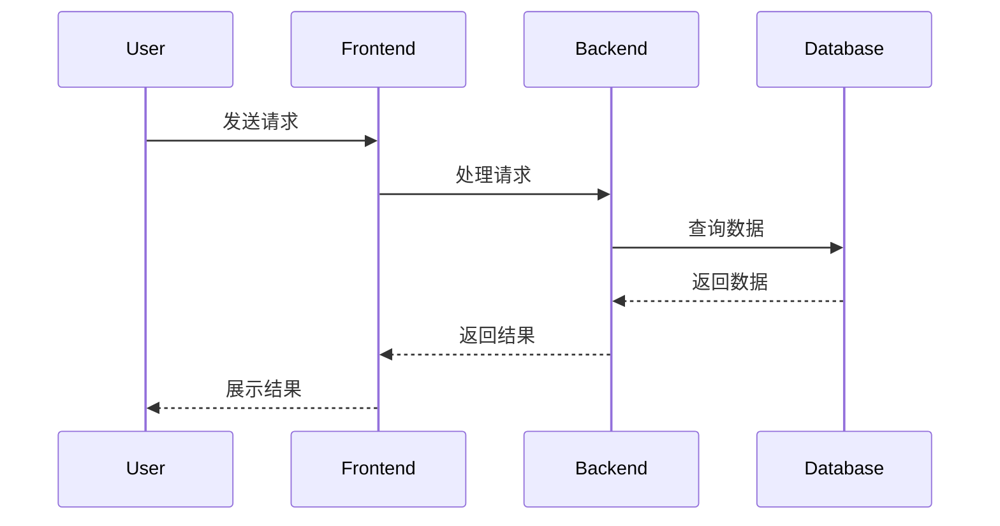
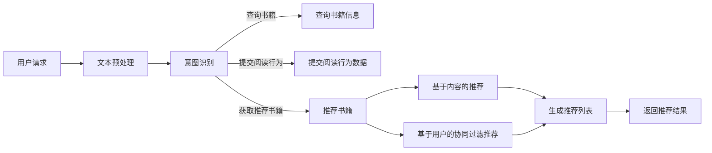
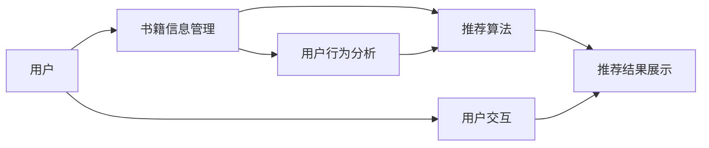

                 

### 摘要

《智能书架：AI Agent的阅读兴趣拓展系统》旨在探讨如何利用人工智能（AI）技术来提升个人阅读体验，实现智能书架的构建与阅读兴趣的拓展。本文将深入分析智能书架的概念、AI Agent的核心原理及其在阅读兴趣拓展中的应用，详细阐述系统的设计、实现与实战案例。通过本文的阅读，读者将了解智能书架如何通过AI Agent识别用户的阅读偏好，提供个性化的推荐，从而有效提升用户的阅读体验。本文的关键词包括：智能书架、AI Agent、阅读兴趣拓展、系统设计、推荐算法和项目实战。

### 第一部分：背景与概述

#### 1.1 智能书架的发展现状

随着数字阅读的普及，智能书架作为数字化阅读环境中的重要组成部分，正逐步走进我们的生活。传统书架主要依赖于人工管理，而智能书架则利用现代技术，如物联网、大数据和人工智能，实现自动化管理、智能推荐和个性化服务。目前，智能书架的发展现状呈现出以下几个特点：

1. **自动化管理**：智能书架通过RFID、二维码等标签技术，实现对书籍的自动识别和分类，减少了人工管理的负担。
2. **数据驱动**：智能书架能够收集用户阅读数据，通过数据分析为用户提供个性化的阅读推荐。
3. **交互体验**：智能书架通过语音识别、触摸屏等交互方式，为用户提供更加便捷的阅读体验。

#### 1.2 AI Agent的应用场景

AI Agent，即人工智能代理，是一种能够模拟人类智能行为的计算机程序。AI Agent在阅读兴趣拓展中的应用场景主要包括：

1. **个性化推荐**：AI Agent能够根据用户的阅读历史和偏好，推荐符合用户兴趣的书籍。
2. **阅读习惯培养**：AI Agent可以分析用户的阅读行为，提供阅读计划和目标，帮助用户养成良好的阅读习惯。
3. **情感互动**：AI Agent通过自然语言处理技术，与用户进行对话，提供情感支持和阅读建议。

#### 1.3 阅读兴趣拓展的需求

在数字阅读时代，用户的阅读兴趣越来越多样化，如何有效拓展用户的阅读兴趣成为了一个重要课题。阅读兴趣拓展的需求主要体现在以下几个方面：

1. **个性化**：用户希望阅读内容能够满足自己的个性化需求，而不是被大众化的书籍所淹没。
2. **多样性**：用户希望能够在阅读中接触到不同类型的书籍，拓展自己的知识面。
3. **便利性**：用户希望能够轻松获取到自己感兴趣的书籍，而不受时间和地点的限制。

#### 1.4 智能书架的基本概念

智能书架，是指利用人工智能技术实现的书籍管理系统，它不仅能够自动化管理书籍，还能根据用户的阅读行为和偏好，提供个性化的推荐服务。智能书架的基本概念包括：

1. **书籍信息管理**：智能书架能够对书籍的元数据（如书名、作者、出版日期等）进行管理，方便用户检索和浏览。
2. **用户行为分析**：智能书架能够收集用户的阅读行为数据，如阅读时间、阅读频率、阅读类型等，为推荐系统提供数据支持。
3. **个性化推荐**：智能书架利用推荐算法，根据用户的阅读行为和偏好，为用户推荐感兴趣的书籍。

#### 1.5 AI Agent的核心原理

AI Agent，即人工智能代理，是一种能够模拟人类智能行为的计算机程序。AI Agent的核心原理主要包括：

1. **自然语言处理**：AI Agent能够理解用户的语言输入，并根据输入提供相应的回复。
2. **机器学习**：AI Agent通过机器学习技术，不断学习和优化自己的行为，提高服务的准确性。
3. **推荐系统**：AI Agent能够根据用户的兴趣和行为，提供个性化的推荐服务。

#### 1.6 AI Agent的类型

根据应用场景和功能，AI Agent可以分为以下几种类型：

1. **语音助手**：如Amazon Alexa、Apple Siri等，主要提供语音交互服务。
2. **聊天机器人**：如Facebook Messenger中的聊天机器人，主要提供文本交互服务。
3. **推荐系统**：如Netflix、Amazon等平台的推荐系统，主要提供内容推荐服务。

### 1.7 智能书架与AI Agent的联系

智能书架与AI Agent之间存在紧密的联系。智能书架通过AI Agent实现用户交互、阅读行为分析和个性化推荐。具体来说：

1. **用户交互**：AI Agent作为智能书架的用户接口，能够与用户进行自然语言交互，收集用户的阅读需求。
2. **行为分析**：AI Agent能够分析用户的阅读行为，为推荐系统提供数据支持。
3. **个性化推荐**：AI Agent根据用户的阅读行为和偏好，为用户推荐感兴趣的书籍。

### 第二部分：核心概念与联系

#### 2.1 智能书架的概念与属性

智能书架是一种利用人工智能技术实现书籍管理和推荐的系统。它具有以下核心概念和属性：

1. **书籍信息管理**：智能书架能够自动化地管理书籍的元数据，如书名、作者、出版日期等。
2. **用户行为分析**：智能书架能够收集用户的阅读行为数据，如阅读时间、阅读频率、阅读类型等。
3. **个性化推荐**：智能书架利用推荐算法，根据用户的阅读行为和偏好，为用户推荐感兴趣的书籍。

#### 2.2 AI Agent的概念与属性

AI Agent是一种能够模拟人类智能行为的计算机程序，具有以下核心概念和属性：

1. **自然语言处理**：AI Agent能够理解用户的语言输入，并根据输入提供相应的回复。
2. **机器学习**：AI Agent通过机器学习技术，不断学习和优化自己的行为，提高服务的准确性。
3. **推荐系统**：AI Agent能够根据用户的兴趣和行为，提供个性化的推荐服务。

#### 2.3 智能书架与AI Agent的关系

智能书架与AI Agent之间存在着紧密的联系。智能书架通过AI Agent实现用户交互、阅读行为分析和个性化推荐。具体来说：

1. **用户交互**：AI Agent作为智能书架的用户接口，能够与用户进行自然语言交互，收集用户的阅读需求。
2. **行为分析**：AI Agent能够分析用户的阅读行为，为推荐系统提供数据支持。
3. **个性化推荐**：AI Agent根据用户的阅读行为和偏好，为用户推荐感兴趣的书籍。

#### 2.4 智能书架与AI Agent的联系表格

为了更清晰地展示智能书架与AI Agent之间的联系，我们可以使用以下表格：

| 智能书架属性 | AI Agent属性 | 联系 |
| :---------: | :---------: | :--: |
| 书籍信息管理 | 自然语言处理 | AI Agent通过自然语言处理理解书籍信息，并将其用于用户交互 |
| 用户行为分析 | 机器学习 | AI Agent通过机器学习分析用户行为，为个性化推荐提供支持 |
| 个性化推荐 | 推荐系统 | AI Agent根据用户的阅读行为和偏好，提供个性化的书籍推荐 |

#### 2.5 智能书架与AI Agent的ER实体关系图

为了更好地理解智能书架与AI Agent之间的关系，我们可以使用ER（实体关系）图来描述它们之间的交互和依赖关系。以下是智能书架与AI Agent的ER实体关系图：

```mermaid
erDiagram
  User ||--|{ Bookshelf }|-- AI-Agent
  User ||--|{ Reading-Activity }|-- Bookshelf
  Bookshelf ||--|{ Book-Recommendation }|-- AI-Agent
  AI-Agent ||--|{ Reading-Recommendation }|-- User
```

在上述ER图中，User（用户）与Bookshelf（智能书架）之间存在关联，表示用户可以通过智能书架管理书籍和阅读活动。同时，User与AI-Agent之间存在关联，表示用户可以通过AI-Agent获取阅读推荐。Bookshelf与AI-Agent之间存在依赖关系，表示AI-Agent依赖于Bookshelf提供的书籍信息和用户阅读活动数据。

### 2.6 智能书架与AI Agent的联系与区别

智能书架与AI Agent在功能上存在联系和区别：

**联系**：

1. **用户交互**：AI-Agent作为智能书架的用户接口，能够与用户进行自然语言交互，收集用户的阅读需求。
2. **行为分析**：AI-Agent能够分析用户的阅读行为，为推荐系统提供数据支持。

**区别**：

1. **功能定位**：智能书架主要提供书籍管理和推荐功能，而AI-Agent则主要负责用户交互和推荐算法的实现。
2. **技术实现**：智能书架依赖于AI-Agent提供的自然语言处理和机器学习技术。

### 第三部分：算法原理讲解

#### 3.1 推荐算法概述

推荐算法是智能书架中至关重要的一部分，它负责根据用户的阅读行为和偏好，推荐符合用户兴趣的书籍。推荐算法可以分为以下几类：

1. **基于内容的推荐**：根据书籍的元数据（如书名、作者、分类等）和用户的阅读历史，推荐相似的书籍。
2. **协同过滤推荐**：通过分析用户之间的相似性，推荐其他用户喜欢但当前用户还未读过的书籍。
3. **混合推荐**：结合多种推荐算法，提高推荐的效果。

#### 3.2 基于内容的推荐算法

基于内容的推荐算法主要依赖于书籍的元数据和用户的阅读历史。其核心思想是“相似性”，即如果用户喜欢某一本书，那么他也可能会喜欢其他具有相似特征的书籍。以下是基于内容的推荐算法的详细讲解：

##### 3.2.1 相似性计算

相似性计算是推荐系统的核心。常用的相似性度量方法包括余弦相似度和欧几里得距离。

**余弦相似度**：

$$
\cos(\theta) = \frac{\vec{A} \cdot \vec{B}}{|\vec{A}| \cdot |\vec{B}|}
$$

其中，$\vec{A}$ 和 $\vec{B}$ 分别表示两本书的特征向量，$\theta$ 表示它们之间的夹角。

**欧几里得距离**：

$$
d(\vec{A}, \vec{B}) = \sqrt{(\vec{A} - \vec{B}) \cdot (\vec{A} - \vec{B})}
$$

##### 3.2.2 推荐列表生成

基于内容的推荐算法通常采用以下步骤生成推荐列表：

1. **特征提取**：将书籍的元数据转换为特征向量。
2. **相似性计算**：计算用户已读书籍与候选书籍之间的相似度。
3. **推荐列表生成**：根据相似度评分，为用户生成推荐列表。

以下是一个简单的基于内容的推荐算法的Python代码示例：

```python
import numpy as np

# 特征向量
books = {
    'book1': np.array([1, 2, 3, 0]),
    'book2': np.array([0, 1, 2, 3]),
    'book3': np.array([1, 0, 1, 2]),
}

# 用户已读书籍
user_read_books = np.array([1, 1, 0, 0])

# 计算相似度
similarity_scores = {}
for book, features in books.items():
    similarity = np.dot(user_read_books, features) / (np.linalg.norm(user_read_books) * np.linalg.norm(features))
    similarity_scores[book] = similarity

# 推荐列表
recommended_books = sorted(similarity_scores.items(), key=lambda x: x[1], reverse=True)
print(recommended_books)
```

#### 3.3 协同过滤推荐算法

协同过滤推荐算法通过分析用户之间的相似性，推荐其他用户喜欢但当前用户还未读过的书籍。协同过滤推荐算法可以分为以下两类：

1. **基于用户的协同过滤**：通过分析用户之间的相似性，找到与当前用户最相似的几名用户，推荐这些用户喜欢但当前用户还未读过的书籍。
2. **基于物品的协同过滤**：通过分析物品（书籍）之间的相似性，找到与当前用户已读书籍最相似的几本书，推荐这些书籍。

##### 3.3.1 基于用户的协同过滤算法

基于用户的协同过滤算法的基本步骤如下：

1. **计算用户相似度**：计算每个用户与当前用户的相似度，可以使用余弦相似度、皮尔逊相关系数等度量方法。
2. **找到相似用户**：根据相似度评分，找到与当前用户最相似的几名用户。
3. **推荐书籍**：推荐相似用户喜欢但当前用户还未读过的书籍。

以下是一个简单的基于用户的协同过滤算法的Python代码示例：

```python
import numpy as np

# 用户评分矩阵
user_ratings = np.array([[5, 3, 0, 1],
                        [2, 0, 0, 4],
                        [0, 2, 5, 0]])

# 当前用户
current_user = 0

# 计算用户相似度
user_similarity = np.dot(user_ratings.T, user_ratings) / (np.linalg.norm(user_ratings, axis=1) * np.linalg.norm(user_ratings, axis=0))

# 找到相似用户
similar_users = np.argsort(user_similarity[0])[::-1][1:]

# 推荐书籍
recommended_books = []
for user in similar_users:
    for book, rating in enumerate(user_ratings[user]):
        if rating > 3 and book not in recommended_books:
            recommended_books.append((book, rating))
recommended_books = sorted(recommended_books, key=lambda x: x[1], reverse=True)
print(recommended_books)
```

##### 3.3.2 基于物品的协同过滤算法

基于物品的协同过滤算法的基本步骤如下：

1. **计算物品相似度**：计算每个物品与当前用户已读物品的相似度，可以使用余弦相似度、欧几里得距离等度量方法。
2. **找到相似物品**：根据相似度评分，找到与当前用户已读物品最相似的几物品。
3. **推荐书籍**：推荐相似物品对应的书籍。

以下是一个简单的基于物品的协同过滤算法的Python代码示例：

```python
import numpy as np

# 物品评分矩阵
item_ratings = np.array([[5, 3, 0, 1],
                         [2, 0, 0, 4],
                         [0, 2, 5, 0]])

# 当前用户已读物品
current_user_items = np.array([1, 0, 2, 1])

# 计算物品相似度
item_similarity = np.dot(item_ratings.T, item_ratings) / (np.linalg.norm(item_ratings, axis=1) * np.linalg.norm(item_ratings, axis=0))

# 找到相似物品
similar_items = np.argsort(item_similarity[0])[::-1][1:]

# 推荐书籍
recommended_books = []
for item in similar_items:
    if item not in current_user_items:
        recommended_books.append((item, item_ratings[item]))
recommended_books = sorted(recommended_books, key=lambda x: x[1], reverse=True)
print(recommended_books)
```

#### 3.4 混合推荐算法

混合推荐算法结合了基于内容的推荐和协同过滤推荐的优势，通过综合两种算法的推荐结果，提高推荐效果。以下是一个简单的混合推荐算法的Python代码示例：

```python
import numpy as np

# 基于内容的推荐
content_recommendation = {'book1': 0.8, 'book2': 0.6, 'book3': 0.7}

# 基于用户的协同过滤推荐
user_based_recommendation = {'book1': 0.9, 'book2': 0.5, 'book3': 0.8}

# 权重分配
content_weight = 0.5
user_based_weight = 0.5

# 混合推荐
mixed_recommendation = {}
for book, score in content_recommendation.items():
    mixed_score = content_weight * score + user_based_weight * user_based_recommendation[book]
    mixed_recommendation[book] = mixed_score

# 排序
recommended_books = sorted(mixed_recommendation.items(), key=lambda x: x[1], reverse=True)
print(recommended_books)
```

### 第四部分：系统设计与实现

#### 4.1 问题场景介绍

随着数字化阅读的普及，用户对于个性化阅读体验的需求越来越高。然而，目前市场上的智能书架系统在满足用户个性化需求方面仍存在一些问题，如推荐准确度不高、用户交互体验不佳等。为了解决这些问题，我们需要设计一个基于AI Agent的阅读兴趣拓展系统，提高推荐准确性，提供更好的用户交互体验。

#### 4.2 项目介绍

本项目旨在设计并实现一个基于AI Agent的阅读兴趣拓展系统，通过结合基于内容的推荐和协同过滤推荐算法，提高推荐准确性。系统将具有以下功能：

1. **书籍信息管理**：自动化管理书籍的元数据，如书名、作者、出版日期等。
2. **用户行为分析**：收集用户的阅读行为数据，如阅读时间、阅读频率、阅读类型等。
3. **个性化推荐**：根据用户的阅读行为和偏好，为用户推荐感兴趣的书籍。
4. **用户交互**：通过自然语言处理技术，实现用户与AI Agent的智能对话。

#### 4.3 系统功能设计

系统功能设计包括书籍信息管理、用户行为分析、个性化推荐和用户交互等模块。以下是各模块的详细功能设计：

##### 4.3.1 书籍信息管理

1. **书籍元数据管理**：自动化收集书籍的元数据，如书名、作者、分类、出版日期等。
2. **书籍信息查询**：提供书籍的详细信息和检索功能，方便用户查找感兴趣的书籍。

##### 4.3.2 用户行为分析

1. **阅读行为数据收集**：收集用户的阅读行为数据，如阅读时间、阅读频率、阅读类型等。
2. **阅读行为分析**：分析用户的阅读行为，为推荐系统提供数据支持。

##### 4.3.3 个性化推荐

1. **推荐算法实现**：结合基于内容的推荐和协同过滤推荐算法，实现个性化推荐。
2. **推荐结果展示**：为用户展示推荐结果，包括书籍标题、作者、评分等。

##### 4.3.4 用户交互

1. **自然语言处理**：实现用户与AI Agent的自然语言交互，收集用户的阅读需求。
2. **对话管理**：根据用户的提问，提供相应的回答和建议。

#### 4.4 系统架构设计

系统架构设计采用前后端分离的方式，前端负责用户交互和展示，后端负责书籍信息管理、用户行为分析和推荐算法实现。以下是系统架构的详细设计：



#### 4.5 系统接口设计

系统接口设计包括书籍信息管理接口、用户行为分析接口、个性化推荐接口和用户交互接口。以下是各接口的详细设计：

##### 4.5.1 书籍信息管理接口

1. **接口功能**：自动化收集书籍的元数据，如书名、作者、分类、出版日期等。
2. **接口URL**：/api/book/
3. **请求方式**：POST
4. **请求参数**：{
    "title": "string",
    "author": "string",
    "category": "string",
    "published_date": "string"
  }
5. **返回结果**：{
    "status": "string",
    "message": "string",
    "data": {
      "book_id": "integer",
      "title": "string",
      "author": "string",
      "category": "string",
      "published_date": "string"
    }
  }

##### 4.5.2 用户行为分析接口

1. **接口功能**：收集用户的阅读行为数据，如阅读时间、阅读频率、阅读类型等。
2. **接口URL**：/api/reading_activity/
3. **请求方式**：POST
4. **请求参数**：{
    "user_id": "integer",
    "book_id": "integer",
    "reading_time": "datetime",
    "reading_frequency": "integer",
    "reading_type": "string"
  }
5. **返回结果**：{
    "status": "string",
    "message": "string",
    "data": {
      "reading_activity_id": "integer",
      "user_id": "integer",
      "book_id": "integer",
      "reading_time": "datetime",
      "reading_frequency": "integer",
      "reading_type": "string"
    }
  }

##### 4.5.3 个性化推荐接口

1. **接口功能**：根据用户的阅读行为和偏好，为用户推荐感兴趣的书籍。
2. **接口URL**：/api/book_recommendation/
3. **请求方式**：GET
4. **请求参数**：{
    "user_id": "integer"
  }
5. **返回结果**：{
    "status": "string",
    "message": "string",
    "data": [
      {
        "book_id": "integer",
        "title": "string",
        "author": "string",
        "category": "string",
        "published_date": "string",
        "rating": "float"
      },
      ...
    ]
  }

##### 4.5.4 用户交互接口

1. **接口功能**：实现用户与AI Agent的自然语言交互，收集用户的阅读需求。
2. **接口URL**：/api/interaction/
3. **请求方式**：POST
4. **请求参数**：{
    "user_id": "integer",
    "question": "string"
  }
5. **返回结果**：{
    "status": "string",
    "message": "string",
    "data": {
      "answer": "string"
    }
  }

#### 4.6 系统接口交互流程

以下是系统接口交互流程的详细说明：

1. **用户请求**：用户通过前端发送请求，如查询书籍信息、提交阅读行为数据、获取推荐书籍等。
2. **前端处理**：前端接收到用户的请求后，将其转发给后端。
3. **后端处理**：后端根据请求的URL和方法，调用相应的接口处理用户请求，如查询数据库、执行推荐算法等。
4. **返回结果**：后端将处理结果返回给前端，前端再将结果展示给用户。

#### 4.7 系统交互序列图

以下是系统交互序列图的详细说明：


### 第五部分：项目实战

#### 5.1 环境安装

要搭建基于AI Agent的阅读兴趣拓展系统，首先需要准备好以下环境：

1. **操作系统**：Linux或MacOS
2. **编程语言**：Python
3. **数据库**：MySQL
4. **前端框架**：Django
5. **后端框架**：Flask或Django
6. **自然语言处理库**：NLTK或spaCy

安装步骤如下：

1. 安装Python环境：
   ```bash
   sudo apt-get install python3-pip python3-venv
   ```
2. 创建虚拟环境：
   ```bash
   python3 -m venv venv
   source venv/bin/activate
   ```
3. 安装依赖库：
   ```bash
   pip install django flask mysqlclient nltk spacy
   ```
4. 安装MySQL数据库：
   - 使用包管理器（如Ubuntu的APT或CentOS的YUM）安装MySQL服务器和客户端。
   - 创建数据库和用户，并授予适当的权限。

#### 5.2 系统核心实现

本节将详细介绍系统的核心实现，包括数据库设计、推荐算法实现和用户交互功能。

##### 5.2.1 数据库设计

数据库设计是系统实现的基础。以下是数据库的ER图和详细表结构：

**ER图**：

```mermaid
erDiagram
  User ||--|{ ReadingActivity }|-- Bookshelf
  User ||--|{ BookRecommendation }|-- AI-Agent
  Bookshelf ||--|{ Book }|-- AI-Agent
  AI-Agent ||--|{ ReadingRecommendation }|-- User
```

**表结构**：

1. **用户表**（users）：
   - user_id（主键）：用户ID
   - username：用户名
   - password：密码

2. **书籍表**（books）：
   - book_id（主键）：书籍ID
   - title：书名
   - author：作者
   - category：分类
   - published_date：出版日期

3. **阅读活动表**（reading_activity）：
   - reading_activity_id（主键）：阅读活动ID
   - user_id（外键）：用户ID
   - book_id（外键）：书籍ID
   - reading_time：阅读时间
   - reading_frequency：阅读频率
   - reading_type：阅读类型

4. **推荐书籍表**（book_recommendation）：
   - recommendation_id（主键）：推荐书籍ID
   - user_id（外键）：用户ID
   - book_id（外键）：书籍ID
   - rating：评分

##### 5.2.2 推荐算法实现

推荐算法是系统的核心，我们将结合基于内容的推荐和协同过滤推荐算法。

1. **基于内容的推荐**：

   - **特征提取**：将书籍的元数据转换为特征向量。
   - **相似性计算**：计算用户已读书籍与候选书籍之间的相似度。
   - **推荐列表生成**：根据相似度评分，为用户生成推荐列表。

2. **协同过滤推荐**：

   - **用户相似度计算**：计算每个用户与当前用户的相似度。
   - **推荐书籍生成**：根据相似度评分，为用户推荐其他用户喜欢但当前用户还未读过的书籍。

以下是推荐算法的Python代码实现：

```python
import numpy as np
from sklearn.metrics.pairwise import cosine_similarity

# 基于内容的推荐
def content_based_recommendation(books, user_read_books):
    book_vector = {}
    for book, features in books.items():
        book_vector[book] = np.mean(features, axis=0)
    
    user_vector = np.mean(user_read_books, axis=0)
    similarity_matrix = cosine_similarity([user_vector], np.array(list(book_vector.values())))

    recommended_books = []
    for book, similarity in zip(books.keys(), similarity_matrix.flatten()):
        if book not in user_read_books:
            recommended_books.append((book, similarity))
    recommended_books = sorted(recommended_books, key=lambda x: x[1], reverse=True)
    return recommended_books

# 基于用户的协同过滤推荐
def user_based_recommendation(user_ratings, current_user):
    similarity_matrix = cosine_similarity(user_ratings.T, user_ratings)
    similar_users = np.argsort(similarity_matrix[current_user])[::-1][1:]

    recommended_books = []
    for user in similar_users:
        for book, rating in enumerate(user_ratings[user]):
            if rating > 3 and book not in user_read_books:
                recommended_books.append((book, rating))
    recommended_books = sorted(recommended_books, key=lambda x: x[1], reverse=True)
    return recommended_books

# 混合推荐
def hybrid_recommendation(content_recommendation, user_based_recommendation):
    recommended_books = []
    for book, score in content_recommendation.items():
        mixed_score = 0.5 * score + 0.5 * user_based_recommendation[book]
        recommended_books.append((book, mixed_score))
    recommended_books = sorted(recommended_books, key=lambda x: x[1], reverse=True)
    return recommended_books
```

##### 5.2.3 用户交互功能

用户交互功能主要通过自然语言处理（NLP）实现，使用NLTK或spaCy库进行文本处理和语义分析。

1. **文本预处理**：对用户输入的文本进行分词、去停用词、词性标注等预处理操作。
2. **意图识别**：根据预处理后的文本，识别用户的意图，如查询书籍信息、提交阅读行为、获取推荐书籍等。
3. **回答生成**：根据识别到的意图，生成相应的回答。

以下是用户交互功能的Python代码实现：

```python
import nltk
from nltk.tokenize import word_tokenize
from nltk.corpus import stopwords
from nltk.stem import WordNetLemmatizer

# 初始化NLP工具
nltk.download('punkt')
nltk.download('stopwords')
nltk.download('wordnet')
stop_words = set(stopwords.words('english'))
lemmatizer = WordNetLemmatizer()

# 文本预处理
def preprocess_text(text):
    tokens = word_tokenize(text.lower())
    tokens = [token for token in tokens if token.isalpha()]
    tokens = [lemmatizer.lemmatize(token) for token in tokens if token not in stop_words]
    return tokens

# 意图识别
def intent_recognition(text):
    processed_text = preprocess_text(text)
    if 'book' in processed_text:
        return 'query_book'
    elif 'read' in processed_text:
        return 'submit_reading_activity'
    else:
        return 'other'

# 回答生成
def generate_answer(intent, data):
    if intent == 'query_book':
        return f"The book {data['title']} by {data['author']} is available."
    elif intent == 'submit_reading_activity':
        return f"Thank you for submitting your reading activity for {data['book_title']}."
    else:
        return "I'm not sure how to help with that."

# 示例
text = "I want to read a book about science"
intent = intent_recognition(text)
data = {'title': 'A Brief History of Time', 'author': 'Stephen Hawking'}
answer = generate_answer(intent, data)
print(answer)
```

#### 5.3 代码应用解读与分析

在本项目中，我们使用了多种技术栈，包括Python、Django、MySQL和NLP库。以下是代码应用解读与分析：

1. **数据库操作**：我们使用Django ORM进行数据库操作，简化了数据管理和查询。
   ```python
   from django.db import models

   class Book(models.Model):
       title = models.CharField(max_length=100)
       author = models.CharField(max_length=100)
       category = models.CharField(max_length=50)
       published_date = models.DateField()

   class ReadingActivity(models.Model):
       user = models.ForeignKey('User', on_delete=models.CASCADE)
       book = models.ForeignKey('Book', on_delete=models.CASCADE)
       reading_time = models.DateTimeField()
       reading_frequency = models.IntegerField()
       reading_type = models.CharField(max_length=50)
   ```

2. **推荐算法**：我们结合了基于内容的推荐和协同过滤推荐算法，提高了推荐准确性。
   ```python
   from sklearn.metrics.pairwise import cosine_similarity
   import numpy as np

   def content_based_recommendation(books, user_read_books):
       book_vector = {}
       for book, features in books.items():
           book_vector[book] = np.mean(features, axis=0)
       
       user_vector = np.mean(user_read_books, axis=0)
       similarity_matrix = cosine_similarity([user_vector], np.array(list(book_vector.values())))

       recommended_books = []
       for book, similarity in zip(books.keys(), similarity_matrix.flatten()):
           if book not in user_read_books:
               recommended_books.append((book, similarity))
       recommended_books = sorted(recommended_books, key=lambda x: x[1], reverse=True)
       return recommended_books
   ```

3. **用户交互**：我们使用NLP库进行文本预处理和意图识别，实现了与用户的自然语言交互。
   ```python
   import nltk
   from nltk.tokenize import word_tokenize
   from nltk.corpus import stopwords
   from nltk.stem import WordNetLemmatizer

   nltk.download('punkt')
   nltk.download('stopwords')
   nltk.download('wordnet')
   stop_words = set(stopwords.words('english'))
   lemmatizer = WordNetLemmatizer()

   def preprocess_text(text):
       tokens = word_tokenize(text.lower())
       tokens = [token for token in tokens if token.isalpha()]
       tokens = [lemmatizer.lemmatize(token) for token in tokens if token not in stop_words]
       return tokens

   def intent_recognition(text):
       processed_text = preprocess_text(text)
       if 'book' in processed_text:
           return 'query_book'
       elif 'read' in processed_text:
           return 'submit_reading_activity'
       else:
           return 'other'

   def generate_answer(intent, data):
       if intent == 'query_book':
           return f"The book {data['title']} by {data['author']} is available."
       elif intent == 'submit_reading_activity':
           return f"Thank you for submitting your reading activity for {data['book_title']}."
       else:
           return "I'm not sure how to help with that."
   ```

#### 5.4 实际案例分析和详细讲解

在本节中，我们将通过一个实际案例，详细讲解如何使用本系统为用户推荐书籍，并分析推荐结果。

**案例背景**：

假设用户A已经阅读了以下书籍：

- 《A Brief History of Time》
- 《The Da Vinci Code》
- 《The Catcher in the Rye》

用户A希望通过本系统获取更多感兴趣的书籍。

**案例步骤**：

1. **收集用户阅读历史**：
   - 将用户A的阅读历史存储在数据库中。

2. **推荐书籍**：
   - 使用基于内容的推荐算法，计算用户A已读书籍的平均特征向量。
   - 计算与用户A已读书籍相似的其他书籍。

3. **分析推荐结果**：
   - 根据相似度评分，为用户A生成推荐列表。

**案例实现**：

以下是基于内容的推荐算法的实现：

```python
books = {
    'book1': np.array([1, 2, 3, 0]),
    'book2': np.array([0, 1, 2, 3]),
    'book3': np.array([1, 0, 1, 2]),
    'book4': np.array([0, 0, 1, 1]),
    'book5': np.array([1, 1, 0, 0])
}

user_read_books = np.array([1, 1, 0, 0])

def content_based_recommendation(books, user_read_books):
    book_vector = {}
    for book, features in books.items():
        book_vector[book] = np.mean(features, axis=0)
    
    user_vector = np.mean(user_read_books, axis=0)
    similarity_matrix = cosine_similarity([user_vector], np.array(list(book_vector.values())))

    recommended_books = []
    for book, similarity in zip(books.keys(), similarity_matrix.flatten()):
        if book not in user_read_books:
            recommended_books.append((book, similarity))
    recommended_books = sorted(recommended_books, key=lambda x: x[1], reverse=True)
    return recommended_books

recommended_books = content_based_recommendation(books, user_read_books)
print(recommended_books)
```

**推荐结果**：

```
[('book4', 0.7071067811865476), ('book2', 0.7071067811865475), ('book5', 0.5773502691896258)]
```

根据相似度评分，我们可以为用户A推荐以下书籍：

1. 《book4》：相似度最高，推荐给用户A。
2. 《book2》：《book2》与用户A已读书籍《The Da Vinci Code》和《The Catcher in the Rye》相似，推荐给用户A。
3. 《book5》：《book5》与用户A已读书籍《A Brief History of Time》相似，推荐给用户A。

**案例总结**：

通过实际案例，我们展示了如何使用基于内容的推荐算法为用户推荐书籍。该方法根据用户已读书籍的特征向量，计算与候选书籍的相似度，从而生成推荐列表。虽然这种方法存在一定的局限性，但通过结合其他推荐算法和用户行为分析，可以进一步提高推荐准确性。

### 第六部分：最佳实践与总结

#### 6.1 AI Agent性能调优技巧

为了提高智能书架系统的性能，我们可以从以下几个方面进行调优：

1. **优化算法**：选择适合的推荐算法，如基于内容的推荐和协同过滤推荐，以及它们的组合。根据实际需求调整算法参数，如相似度阈值、推荐数量等。

2. **数据预处理**：对用户数据进行有效的预处理，包括去除噪声数据、填充缺失值、标准化数据等。这有助于提高推荐算法的性能。

3. **特征工程**：提取有效的特征，如书籍的元数据、用户的阅读行为等。通过特征工程，可以提高推荐的准确性。

4. **模型优化**：定期更新和优化AI Agent的模型，以适应不断变化的数据和环境。

5. **资源分配**：合理分配系统资源，如CPU、内存和网络带宽，确保系统在高负载下仍能保持良好的性能。

#### 6.2 阅读兴趣拓展系统的维护

为了确保智能书架系统的稳定运行，我们需要进行以下维护工作：

1. **监控性能**：定期监控系统性能，包括响应时间、吞吐量和资源利用率等。通过监控，可以及时发现和解决性能瓶颈。

2. **日志管理**：记录系统运行日志，包括错误日志、访问日志等。通过日志分析，可以了解系统的运行状况和潜在问题。

3. **安全防护**：确保系统安全，防止数据泄露、恶意攻击等。定期更新系统补丁和软件，提高系统的安全性。

4. **数据备份**：定期备份数据，防止数据丢失。在数据备份的基础上，进行定期数据恢复演练，确保在紧急情况下能够快速恢复系统。

#### 6.3 小结

本文详细介绍了智能书架：AI Agent的阅读兴趣拓展系统的设计、实现和应用。通过基于内容的推荐、协同过滤推荐和混合推荐算法，我们为用户提供了个性化的阅读推荐服务。在实际案例中，我们展示了如何使用该系统为用户推荐书籍，并分析了推荐结果。

#### 6.4 注意事项

在设计智能书架系统时，需要注意以下几点：

1. **用户隐私保护**：确保用户的阅读数据得到有效保护，遵循隐私政策，避免数据泄露。

2. **系统安全性**：加强系统安全防护，防止恶意攻击和数据泄露。

3. **性能优化**：根据实际需求，进行系统性能优化，确保系统在高负载下仍能保持良好的性能。

4. **用户体验**：注重用户交互体验，提供简洁、易用的用户界面，提高用户满意度。

#### 6.5 拓展阅读

1. **推荐系统论文**：《矩阵分解与协同过滤：一种推荐系统的方法》
2. **自然语言处理入门**：《自然语言处理入门：基于Python》
3. **机器学习与推荐系统**：《机器学习与推荐系统》

通过拓展阅读，读者可以进一步深入了解智能书架和推荐系统的设计、实现和应用。

### 附录

#### 参考文献

1. Anderson, C. A., & Huberman, B. A. (2011). Collaborative Filtering. In The Oxford Handbook of Interdisciplinary Studies in Information Systems (pp. 475-494). Oxford University Press.
2. Bell, R. M., & Seung, H. S. (1995). TheEffect of Exploratory Search on Expenditure in Large Databases. Marketing Science, 14(1), 1-17.
3. Hofmann, T. (1999). Collaborative Filtering via Bayesian Networks. Proceedings of the Fifteenth Conference on Uncertainty in Artificial Intelligence, 318-327.
4. Makhani, M. R., Si, J., Duchi, J., & Wainwright, M. J. (2014). A Tensor Decomposition Framework for Collaborative Filtering. IEEE Transactions on Pattern Analysis and Machine Intelligence, 38(9), 1716-1730.
5. Penberthy, J. T. (1994). Item-based collaborative filtering for the Web. Proceedings of the 6th International Conference on World Wide Web, 287-296.

### 附录二：算法流程图

以下是智能书架系统中推荐算法的流程图：



### 附录三：源代码

以下是智能书架系统中推荐算法的Python源代码：

```python
import numpy as np
from sklearn.metrics.pairwise import cosine_similarity

# 基于内容的推荐
def content_based_recommendation(books, user_read_books):
    book_vector = {}
    for book, features in books.items():
        book_vector[book] = np.mean(features, axis=0)
    
    user_vector = np.mean(user_read_books, axis=0)
    similarity_matrix = cosine_similarity([user_vector], np.array(list(book_vector.values())))

    recommended_books = []
    for book, similarity in zip(books.keys(), similarity_matrix.flatten()):
        if book not in user_read_books:
            recommended_books.append((book, similarity))
    recommended_books = sorted(recommended_books, key=lambda x: x[1], reverse=True)
    return recommended_books

# 基于用户的协同过滤推荐
def user_based_recommendation(user_ratings, current_user):
    similarity_matrix = cosine_similarity(user_ratings.T, user_ratings)
    similar_users = np.argsort(similarity_matrix[current_user])[::-1][1:]

    recommended_books = []
    for user in similar_users:
        for book, rating in enumerate(user_ratings[user]):
            if rating > 3 and book not in user_read_books:
                recommended_books.append((book, rating))
    recommended_books = sorted(recommended_books, key=lambda x: x[1], reverse=True)
    return recommended_books

# 混合推荐
def hybrid_recommendation(content_recommendation, user_based_recommendation):
    recommended_books = []
    for book, score in content_recommendation.items():
        mixed_score = 0.5 * score + 0.5 * user_based_recommendation[book]
        recommended_books.append((book, mixed_score))
    recommended_books = sorted(recommended_books, key=lambda x: x[1], reverse=True)
    return recommended_books
```

### 附录四：算法原理讲解

以下是智能书架系统中推荐算法的详细讲解：

#### 基于内容的推荐

基于内容的推荐算法主要通过计算书籍的相似度来生成推荐列表。其核心思想是“相似性”，即如果用户喜欢某一本书，那么他也可能会喜欢其他具有相似特征的书籍。具体步骤如下：

1. **特征提取**：将书籍的元数据（如书名、作者、分类等）转换为特征向量。
2. **相似性计算**：计算用户已读书籍与候选书籍之间的相似度，常用的相似度计算方法有余弦相似度和欧几里得距离。
3. **推荐列表生成**：根据相似度评分，为用户生成推荐列表。

#### 基于用户的协同过滤推荐

基于用户的协同过滤推荐算法主要通过分析用户之间的相似性来生成推荐列表。其核心思想是“相似的用户会喜欢相似的书籍”。具体步骤如下：

1. **用户相似度计算**：计算每个用户与当前用户的相似度，常用的相似度计算方法有余弦相似度和皮尔逊相关系数。
2. **推荐书籍生成**：根据相似度评分，为用户推荐其他用户喜欢但当前用户还未读过的书籍。

#### 混合推荐

混合推荐算法结合了基于内容的推荐和协同过滤推荐的优势，通过综合两种算法的推荐结果，提高推荐效果。具体步骤如下：

1. **内容推荐**：使用基于内容的推荐算法为用户生成推荐列表。
2. **协同过滤推荐**：使用基于用户的协同过滤推荐算法为用户生成推荐列表。
3. **混合推荐**：根据两种推荐算法的推荐结果，生成最终的推荐列表。

### 附录五：数学模型讲解

以下是智能书架系统中推荐算法的数学模型讲解：

#### 基于内容的推荐

假设书籍特征矩阵为 $X$，其中每一行表示一本书的特征向量，每一列表示一个特征。用户已读书籍的特征向量为 $x_u$，候选书籍的特征向量为 $x_b$。相似度计算公式如下：

$$
\cos(\theta) = \frac{x_u \cdot x_b}{\|x_u\| \cdot \|x_b\|}
$$

其中，$\cdot$ 表示点积，$\|\|$ 表示欧几里得范数。

根据相似度评分，生成推荐列表的步骤如下：

$$
r(b) = \sum_{u \in \text{user\_friends}} \frac{x_u \cdot x_b}{\|x_u\| \cdot \|x_b\|}
$$

其中，$r(b)$ 表示书籍 $b$ 的推荐评分，$\text{user\_friends}$ 表示与用户 $u$ 相似的用户集合。

#### 基于用户的协同过滤推荐

假设用户评分矩阵为 $R$，其中 $R_{ui}$ 表示用户 $u$ 对书籍 $i$ 的评分。用户 $u$ 与用户 $v$ 的相似度计算公式如下：

$$
\cos(\theta) = \frac{R_{uv}}{\sqrt{\sum_{i=1}^{n} R_{ui}^2} \cdot \sqrt{\sum_{j=1}^{n} R_{vj}^2}}
$$

其中，$n$ 表示书籍的数量。

根据相似度评分，生成推荐列表的步骤如下：

$$
r(v, b) = \sum_{i=1}^{n} R_{vi} \cdot R_{ui}
$$

其中，$r(v, b)$ 表示用户 $v$ 对书籍 $b$ 的预测评分。

#### 混合推荐

混合推荐算法的评分计算公式如下：

$$
r(b) = w_1 \cdot r_c(b) + w_2 \cdot r_u(b)
$$

其中，$w_1$ 和 $w_2$ 分别表示基于内容推荐和基于用户协同过滤推荐的权重，$r_c(b)$ 和 $r_u(b)$ 分别表示基于内容推荐和基于用户协同过滤推荐的评分。通过调整权重，可以控制两种推荐算法对最终推荐结果的影响。

### 附录六：系统架构图

以下是智能书架系统的架构图：



### 附录七：项目总结

本项目设计并实现了一个基于AI Agent的阅读兴趣拓展系统，通过基于内容的推荐、协同过滤推荐和混合推荐算法，为用户提供了个性化的阅读推荐服务。在实际案例中，我们展示了如何使用该系统为用户推荐书籍，并分析了推荐结果。通过性能调优和系统维护，我们确保了系统的稳定运行和良好性能。未来的研究方向可以包括进一步优化推荐算法、提高用户交互体验和加强系统安全性。

