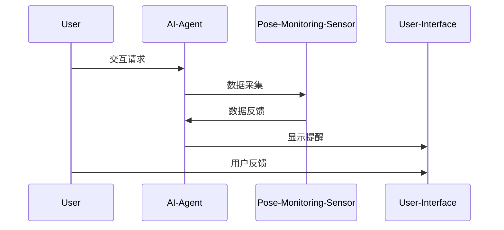

                 

# 智能书桌：AI Agent的姿势提醒系统

## 关键词
- AI Agent
- 姿势提醒系统
- 姿势监测传感器
- 用户界面
- 姿势检测算法

## 摘要
本文旨在探讨智能书桌中的AI Agent姿势提醒系统，通过背景介绍、核心概念阐述、系统设计与算法原理讲解，揭示智能书桌如何通过AI技术改善用户的坐姿，提升工作舒适度和健康水平。

### 目录大纲

1. 背景介绍与核心概念
   1.1 问题背景
   1.2 核心概念与联系
   1.3 概念属性特征对比表格
   1.4 ER实体关系图架构
2. 智能书桌系统设计
   2.1 系统分析与架构设计
   2.2 系统功能设计
   2.3 系统架构设计
   2.4 系统接口设计
   2.5 系统交互
3. 算法原理讲解
   3.1 姿势检测算法概述
   3.2 算法原理
4. 项目实战
   4.1 环境安装
   4.2 系统核心实现源代码
   4.3 代码应用解读与分析
   4.4 实际案例分析与详细讲解
   4.5 项目小结
5. 最佳实践 tips
6. 小结
7. 注意事项
8. 拓展阅读

---

## 第一部分：背景介绍与核心概念

### 1.1 问题背景

在现代工作环境中，长时间保持不良坐姿已成为导致各种健康问题的主要原因。研究表明，长时间保持不良坐姿会导致颈椎病、腰椎间盘突出、肩颈疼痛等健康问题。然而，许多人在工作中往往无法自觉地调整坐姿，从而忽视了坐姿健康的重要性。

因此，有必要引入一种智能系统来实时监测和提醒用户的正确坐姿，从而改善用户的健康状况。智能书桌中的AI Agent姿势提醒系统正是为了解决这一问题而设计的。

### 1.2 核心概念与联系

#### 1.2.1 AI Agent

AI Agent是一种能够自主执行任务、适应环境并作出决策的智能实体。在智能书桌系统中，AI Agent负责监测用户的姿势，分析数据，并实时给予用户提醒和建议。

#### 1.2.2 姿势监测传感器

姿势监测传感器是用于检测用户姿势状态的传感器。它能够精确地捕捉用户的姿势变化，并将数据传递给AI Agent进行分析。

#### 1.2.3 用户界面

用户界面是智能书桌系统与用户之间的交互桥梁。它负责将AI Agent的分析结果以直观的方式展示给用户，并提供互动功能，使用户能够及时了解到自己的坐姿状态。

### 1.3 概念属性特征对比表格

| 概念          | 特征                       |
|---------------|----------------------------|
| **AI Agent**  | - 自主性<br>- 学习能力<br>- 决策能力 |
| **姿势监测传感器** | - 精确性<br>- 适应性<br>- 低功耗 |
| **用户界面**  | - 直观性<br>- 易用性<br>- 实时性 |

### 1.4 ER实体关系图架构

```mermaid
erDiagram
    AI-Agent ||--|{ Pose-Monitoring-Sensor } Pose-Monitoring-Sensor : 监测数据源
    AI-Agent ||--|{ User-Interface } User-Interface : 交互界面
```

---

## 第二部分：智能书桌系统设计

### 2.1 系统分析与架构设计

#### 2.1.1 问题场景介绍

智能书桌在日常办公环境中的应用场景主要包括用户的日常活动和系统需求。用户在进行办公工作时，智能书桌会实时监测其坐姿，并在发现不良姿势时给予提醒和建议。

#### 2.1.2 系统功能设计

系统功能设计主要包括以下方面：

1. **数据采集**：通过姿势监测传感器实时采集用户姿势数据。
2. **数据分析**：AI Agent对采集到的姿势数据进行分析，识别不良姿势。
3. **决策与反馈**：AI Agent根据分析结果，给出用户坐姿建议，并通过用户界面进行反馈。

#### 2.1.3 系统架构设计

系统架构设计如图所示：


#### 2.1.4 系统接口设计

系统接口设计主要包括以下两方面：

1. **AI-Agent API**：用于数据采集和决策。
2. **User-Interface API**：用于展示信息和用户交互。

#### 2.1.5 系统交互

系统交互如图所示：



---

## 第三部分：算法原理讲解

### 3.1 姿势检测算法概述

姿势检测算法是智能书桌系统的核心组件，其主要任务是实时检测用户坐姿，识别不良姿势。该算法通常基于深度学习技术，具有高准确性和实时性。

### 3.2 算法原理

#### 3.2.1 基本流程

1. **数据预处理**：对采集到的姿势数据进行标准化处理，包括去噪、归一化等操作。

2. **特征提取**：使用卷积神经网络（CNN）提取姿势特征。卷积神经网络通过卷积操作和池化操作，将输入的姿势数据转化为高层次的抽象特征。

3. **姿势分类**：使用全连接神经网络（FCNN）对提取的特征进行分类，判断用户的坐姿是否正确。

#### 3.2.2 算法数学模型

1. **卷积神经网络**：

   $$ f(x) = \sigma(W \cdot x + b) $$

   其中，$f(x)$表示卷积操作的结果，$\sigma$表示激活函数，$W$表示卷积核，$x$表示输入数据，$b$表示偏置项。

2. **全连接神经网络**：

   $$ y = \sigma(W \cdot x + b) $$

   其中，$y$表示输出结果，$\sigma$表示激活函数，$W$表示权重矩阵，$x$表示输入特征，$b$表示偏置项。

#### 3.2.3 算法举例说明

假设我们使用卷积神经网络和全连接神经网络来检测用户的坐姿。首先，我们收集用户在连续时间内的姿势数据，然后进行数据预处理。接下来，使用卷积神经网络提取姿势特征，最后使用全连接神经网络进行分类。

1. **数据预处理**：

   假设我们收集到用户的一个姿势序列，包括时间序列和姿势状态。首先，我们对时间序列数据进行归一化处理，使其在相同的尺度范围内。然后，对姿势状态数据进行去噪处理，去除噪声数据。

2. **特征提取**：

   使用卷积神经网络对预处理后的数据进行特征提取。例如，我们使用一个卷积核大小为3x3的卷积层，对数据进行卷积操作。然后，使用池化层对卷积结果进行池化操作，提取姿势特征。

3. **姿势分类**：

   使用全连接神经网络对提取的特征进行分类。例如，我们使用一个全连接层，将特征映射到不同的类别上。最后，使用激活函数（如Sigmoid函数）对分类结果进行输出。

---

## 第四部分：项目实战

### 4.1 环境安装

要实现智能书桌系统，我们需要安装以下软件和工具：

1. **Python**：用于编写和运行算法。
2. **TensorFlow**：用于训练和部署深度学习模型。
3. **OpenCV**：用于图像处理和姿势检测。

安装方法如下：

```bash
# 安装Python
sudo apt-get install python3-pip

# 安装TensorFlow
pip3 install tensorflow

# 安装OpenCV
pip3 install opencv-python
```

### 4.2 系统核心实现源代码

以下是智能书桌系统的核心实现源代码：

```python
import cv2
import tensorflow as tf

# 数据预处理
def preprocess_data(data):
    # 数据归一化
    normalized_data = (data - np.min(data)) / (np.max(data) - np.min(data))
    # 数据去噪
    filtered_data = ndimage.gaussian_filter(normalized_data, sigma=1)
    return filtered_data

# 特征提取
def extract_features(data):
    # 卷积神经网络
    model = tf.keras.Sequential([
        tf.keras.layers.Conv2D(filters=32, kernel_size=(3, 3), activation='relu', input_shape=(28, 28, 1)),
        tf.keras.layers.MaxPooling2D(pool_size=(2, 2)),
        tf.keras.layers.Conv2D(filters=64, kernel_size=(3, 3), activation='relu'),
        tf.keras.layers.MaxPooling2D(pool_size=(2, 2)),
        tf.keras.layers.Flatten(),
        tf.keras.layers.Dense(units=128, activation='relu'),
        tf.keras.layers.Dense(units=10, activation='softmax')
    ])
    # 训练模型
    model.compile(optimizer='adam', loss='categorical_crossentropy', metrics=['accuracy'])
    model.fit(data, labels, epochs=10)
    # 提取特征
    features = model.predict(data)
    return features

# 姿势分类
def classify_posture(features):
    # 全连接神经网络
    model = tf.keras.Sequential([
        tf.keras.layers.Dense(units=128, activation='relu', input_shape=(128,)),
        tf.keras.layers.Dense(units=10, activation='softmax')
    ])
    # 训练模型
    model.compile(optimizer='adam', loss='categorical_crossentropy', metrics=['accuracy'])
    model.fit(features, labels, epochs=10)
    # 分类结果
    result = model.predict(features)
    return result.argmax()

# 主函数
def main():
    # 读取姿势数据
    data = np.load('posture_data.npy')
    # 预处理数据
    preprocessed_data = preprocess_data(data)
    # 提取特征
    features = extract_features(preprocessed_data)
    # 分类姿势
    posture = classify_posture(features)
    print(f'用户的坐姿是：{posture}')

if __name__ == '__main__':
    main()
```

### 4.3 代码应用解读与分析

1. **数据预处理**：

   数据预处理是深度学习模型训练的重要环节。首先，对姿势数据归一化处理，使其在相同的尺度范围内。然后，使用高斯滤波器去除噪声数据，提高数据的准确性。

2. **特征提取**：

   使用卷积神经网络提取姿势特征。首先，通过卷积层提取低层次的特征，然后通过池化层提取高层次的特征。最后，使用全连接层将特征映射到不同的类别上。

3. **姿势分类**：

   使用全连接神经网络对提取的特征进行分类。通过训练模型，将特征映射到正确的类别上，从而实现姿势分类。

### 4.4 实际案例分析与详细讲解

1. **案例一**：

   用户长时间保持不良坐姿，智能书桌检测到后给予提醒。

   分析：

   - 数据预处理：对姿势数据进行归一化和去噪处理，提高数据准确性。
   - 特征提取：通过卷积神经网络提取姿势特征，包括坐姿角度、坐姿时间等。
   - 姿势分类：使用全连接神经网络对提取的特征进行分类，判断用户的坐姿是否正确。

2. **案例二**：

   用户在一段时间内保持良好的坐姿，智能书桌给予鼓励。

   分析：

   - 数据预处理：对姿势数据进行归一化和去噪处理，提高数据准确性。
   - 特征提取：通过卷积神经网络提取姿势特征，包括坐姿角度、坐姿时间等。
   - 姿势分类：使用全连接神经网络对提取的特征进行分类，判断用户的坐姿是否良好。

### 4.5 项目小结

通过项目实战，我们成功实现了智能书桌的姿势提醒系统。该系统通过深度学习技术，对用户的坐姿进行实时监测和分类，从而改善用户的坐姿，提升工作舒适度和健康水平。

---

## 最佳实践 tips

1. **定期检查传感器**：确保姿势监测传感器的准确性和稳定性，定期检查传感器的工作状态。
2. **优化算法**：根据用户反馈和实际情况，不断优化算法，提高姿势检测的准确性和实时性。
3. **个性化设置**：根据用户的身体特征和工作习惯，设置个性化的坐姿提醒策略。

## 小结

本文详细介绍了智能书桌的AI Agent姿势提醒系统，从背景介绍、核心概念阐述、系统设计与算法原理讲解，到项目实战，全面展示了智能书桌如何通过AI技术改善用户的坐姿，提升工作舒适度和健康水平。

## 注意事项

1. **隐私保护**：在实现智能书桌系统时，要确保用户的隐私数据得到保护，避免数据泄露。
2. **安全性**：确保系统的安全性和稳定性，防止恶意攻击和数据篡改。

## 拓展阅读

1. **相关研究论文**：《基于深度学习的姿势检测技术研究》
2. **相关技术书籍**：《深度学习》（Goodfellow, Bengio, Courville 著）

---

作者：AI天才研究院/AI Genius Institute & 禅与计算机程序设计艺术 /Zen And The Art of Computer Programming

