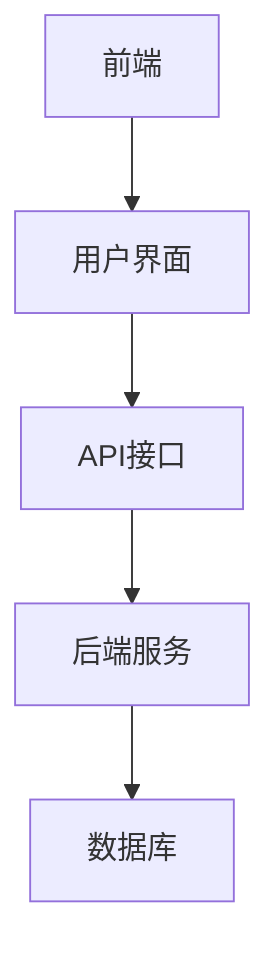

                 

### 智能书签：AI Agent的阅读进度追踪

**关键词：智能书签，AI Agent，阅读进度追踪，算法原理，系统架构**

**摘要：**本文围绕智能书签这一概念，深入探讨了其背景、意义以及核心功能，特别是AI Agent在阅读进度追踪中的应用。文章通过逐步分析，从AI Agent的基础知识、智能书签的设计与实现，到案例分析以及未来发展，为读者呈现了一幅完整的智能书签技术与应用图景。

----------------------------------------------------------------

## 目录大纲

1. **智能书签的背景与意义**  
   1.1 问题的提出  
   1.2 智能书签的定义与核心功能  
   1.3 智能书签的发展现状  
   1.4 本章小结

2. **AI Agent的基础知识**  
   2.1 AI Agent的概念与特点  
   2.2 AI Agent的基本原理  
   2.3 AI Agent的技术体系  
   2.4 本章小结

3. **AI Agent在阅读进度追踪中的应用**  
   3.1 AI Agent在阅读进度追踪中的作用  
   3.2 AI Agent在阅读进度追踪中的具体实现  
   3.3 阅读进度追踪的算法原理与流程  
   3.4 本章小结

4. **智能书签的设计与实现**  
   4.1 智能书签的设计理念  
   4.2 智能书签的系统架构  
   4.3 智能书签的核心功能实现  
   4.4 智能书签的性能优化  
   4.5 本章小结

5. **AI Agent在智能书签中的应用案例分析**  
   5.1 案例背景  
   5.2 案例实现  
   5.3 案例分析  
   5.4 本章小结

6. **智能书签的未来发展**  
   6.1 智能书签的技术趋势  
   6.2 智能书签的商业前景  
   6.3 智能书签的未来展望  
   6.4 本章小结

7. **总结与展望**  
   7.1 主要内容回顾  
   7.2 未来的研究方向  
   7.3 总结与展望

----------------------------------------------------------------

### 第1章: 智能书签的背景与意义

随着数字阅读的普及，人们对于阅读工具的需求也在不断提升。智能书签作为一种创新的阅读辅助工具，正逐渐受到广大用户的青睐。那么，什么是智能书签？它与传统书签有什么区别？智能书签的发展现状如何？本章将围绕这些问题展开讨论。

#### 1.1 问题的提出

在传统的阅读过程中，用户常常会遇到以下问题：

1. **阅读进度难以追踪**：传统书签只能标记某个特定页面，而无法准确记录阅读的进度。用户很难知道自己在书中的具体位置，尤其是在长时间中断后重新阅读时。
   
2. **笔记与标注不便捷**：虽然用户可以在书中做笔记或标注，但这些信息往往散落在各个页面，难以系统化管理，同时也容易丢失。

3. **个性化推荐不足**：传统阅读工具缺乏对用户阅读习惯的了解，无法提供个性化的内容推荐。

这些问题使得用户在数字化阅读过程中体验不佳，需求一款更加智能、便捷的阅读辅助工具。这时，智能书签应运而生。

#### 1.2 智能书签的定义与核心功能

**智能书签**是一种基于人工智能技术的阅读辅助工具，它不仅能够记录用户的阅读进度，还能根据用户的阅读习惯和偏好提供个性化推荐。智能书签的核心功能包括：

1. **阅读进度追踪**：通过记录用户的阅读时间、阅读速度等数据，智能书签能够实时更新用户的阅读进度，使用户在任何设备上都能快速找到自己上次阅读的位置。

2. **笔记与标注**：用户可以在智能书签中做笔记、标注，这些信息将存储在云端，用户可以随时查看和修改。

3. **个性化推荐**：智能书签会根据用户的阅读历史和喜好，推荐相关的书籍和内容。

4. **互动与反馈**：用户可以通过智能书签与其他用户互动，分享阅读心得和笔记，还可以给书籍评分和评论。

#### 1.2.1 智能书签与传统书签的区别

| 项目             | 传统书签                       | 智能书签                      |
|------------------|--------------------------------|--------------------------------|
| 阅读进度         | 只能标记页面                   | 实时追踪阅读进度               |
| 笔记与标注       | 散落在各个页面，难以管理       | 云端存储，方便查看和修改       |
| 个性化推荐       | 无                             | 根据阅读历史和喜好提供推荐     |
| 互动与反馈       | 无                             | 与其他用户互动，分享心得和笔记 |

#### 1.3 智能书签的发展现状

随着人工智能技术的快速发展，智能书签已经得到了广泛的应用。目前，许多阅读平台和电子书应用程序都集成了智能书签功能。智能书签不仅能够提升用户的阅读体验，还能为出版商和内容创作者提供宝贵的数据支持。

然而，智能书签也面临着一些挑战，如数据隐私保护、算法优化等。在未来，随着技术的不断进步，智能书签有望实现更加精准和个性化的服务。

#### 1.4 本章小结

本章对智能书签的背景与意义进行了探讨，分析了传统书签的局限性以及智能书签的核心功能。通过对比智能书签与传统书签的差异，我们看到了智能书签在提升阅读体验方面的重要性。接下来，我们将进一步探讨AI Agent在智能书签中的应用，为读者带来更深入的见解。

----------------------------------------------------------------

### 第2章: AI Agent的基础知识

智能书签的核心在于其智能化的功能，而实现这些功能的基石便是AI Agent。AI Agent（人工智能代理）是人工智能领域的一个重要概念，它在智能书签中扮演着至关重要的角色。本章将介绍AI Agent的基本概念、特点以及其在智能书签中的应用。

#### 2.1 AI Agent的概念与特点

**AI Agent**是指具有智能行为能力的计算机程序，它能够在一定环境中自主感知、决策和执行任务。AI Agent具有以下特点：

1. **自主性**：AI Agent能够自主完成指定任务，无需人为干预。
2. **适应性**：AI Agent能够根据环境变化调整自身行为。
3. **交互性**：AI Agent能够与其他系统、用户进行有效交互。
4. **自主决策**：AI Agent能够根据环境信息和内部状态进行自主决策。

AI Agent与传统算法的主要区别在于，传统算法通常是在预设条件下执行固定操作，而AI Agent则能够根据实际情况动态调整行为。

#### 2.2 AI Agent的基本原理

AI Agent的基本原理主要包括以下几个方面：

1. **学习与适应能力**：AI Agent通过不断学习环境数据，提高自身的适应能力。
2. **交互与协作能力**：AI Agent能够与用户或其他系统进行有效交互，实现协作完成任务。
3. **自主决策能力**：AI Agent能够在复杂环境中进行自主决策，以实现最佳效果。

这些能力使得AI Agent能够处理复杂问题，为智能书签提供强大的功能支持。

#### 2.3 AI Agent的技术体系

AI Agent的技术体系包括多种技术手段，如机器学习、自然语言处理、计算机视觉等。以下是几种常见的AI Agent技术：

1. **机器学习**：通过训练模型，使AI Agent能够自动识别和预测数据。
2. **自然语言处理**：使AI Agent能够理解和生成自然语言，实现与用户的自然交流。
3. **计算机视觉**：使AI Agent能够理解和处理图像和视频数据，实现视觉感知功能。

这些技术的应用使得AI Agent能够处理各种复杂的任务，为智能书签提供多样化的功能。

#### 2.4 AI Agent的应用场景

AI Agent在各个领域都有广泛的应用，以下是一些典型的应用场景：

1. **智能助手**：如苹果的Siri、亚马逊的Alexa等，它们能够为用户提供便捷的服务。
2. **智能监控**：通过计算机视觉技术，AI Agent能够实时监测监控目标，并进行智能分析。
3. **智能交通**：AI Agent能够根据实时交通数据，优化交通流量，减少拥堵。

这些应用场景展示了AI Agent在各个领域的潜力和价值。

#### 2.5 AI Agent的未来发展趋势

随着人工智能技术的不断发展，AI Agent的未来发展趋势主要包括以下几个方面：

1. **智能化程度提高**：AI Agent将具有更高的自主决策和适应能力。
2. **泛在化应用**：AI Agent将在更多领域得到应用，成为人们生活中不可或缺的一部分。
3. **人机协作**：AI Agent将与人类更加紧密地协作，共同完成任务。

这些发展趋势将为AI Agent带来更广阔的应用前景。

#### 2.6 本章小结

本章介绍了AI Agent的基本概念、特点以及其在智能书签中的应用。通过对比AI Agent与传统算法，我们看到了AI Agent在智能书签中的重要性。接下来，我们将进一步探讨AI Agent在阅读进度追踪中的应用，为读者带来更深入的见解。

----------------------------------------------------------------

### 第3章: AI Agent在阅读进度追踪中的应用

在智能书签中，阅读进度追踪是一个关键功能。AI Agent凭借其自主性、适应性和自主决策能力，成为实现这一功能的有力工具。本章将详细介绍AI Agent在阅读进度追踪中的作用、具体实现以及算法原理和流程。

#### 3.1 AI Agent在阅读进度追踪中的作用

AI Agent在阅读进度追踪中扮演着重要角色，其主要作用包括：

1. **实时跟踪**：AI Agent能够实时跟踪用户的阅读行为，如阅读时间、阅读速度等，从而精确记录阅读进度。
   
2. **个性化推荐**：通过分析用户的阅读历史和偏好，AI Agent能够为用户提供个性化的阅读推荐，提升用户体验。

3. **智能提醒**：AI Agent可以根据用户的阅读习惯和任务安排，提供智能提醒，如阅读时间过长时提醒休息，阅读进度接近目标时提醒继续阅读等。

4. **数据统计分析**：AI Agent能够对用户的阅读数据进行统计分析，为出版商和内容创作者提供有价值的数据支持，帮助他们优化内容策略。

#### 3.2 AI Agent在阅读进度追踪中的具体实现

AI Agent在阅读进度追踪中的具体实现主要包括以下几个步骤：

1. **数据收集与预处理**：AI Agent首先需要收集用户的阅读数据，如阅读时间、阅读速度、阅读内容等。然后对这些数据进行分析和处理，提取有用的信息。

2. **模型选择与训练**：根据具体的任务需求，选择合适的机器学习模型，如决策树、随机森林、神经网络等。使用收集到的数据进行模型训练，提高模型的准确性和泛化能力。

3. **模型部署与优化**：将训练好的模型部署到实际应用场景中，对模型进行持续优化和迭代，以适应不断变化的环境和需求。

#### 3.3 阅读进度追踪的算法原理与流程

阅读进度追踪的算法原理主要包括以下几个方面：

1. **阅读时间分析**：通过分析用户的阅读时间，确定阅读速度和阅读进度。

2. **阅读内容分析**：通过分析用户的阅读内容，提取关键词和主题，为个性化推荐提供依据。

3. **用户行为分析**：通过分析用户的阅读行为，如翻页频率、标注和笔记等，进一步优化阅读体验。

阅读进度追踪的流程如下：

1. **数据收集**：AI Agent收集用户的阅读数据，如阅读时间、阅读速度、阅读内容等。

2. **数据预处理**：对收集到的数据进行分析和处理，提取有用的信息。

3. **模型训练**：使用预处理后的数据训练机器学习模型，如决策树、随机森林、神经网络等。

4. **模型评估**：对训练好的模型进行评估，确保其准确性和泛化能力。

5. **模型部署**：将训练好的模型部署到实际应用场景中，对模型进行持续优化和迭代。

6. **实时追踪**：AI Agent实时跟踪用户的阅读行为，根据模型预测结果更新阅读进度。

7. **个性化推荐**：根据用户的阅读历史和偏好，为用户提供个性化的阅读推荐。

8. **用户反馈**：收集用户对阅读进度追踪和个性化推荐的反馈，进一步优化系统。

#### 3.4 本章小结

本章详细介绍了AI Agent在阅读进度追踪中的应用，从作用、具体实现到算法原理和流程，为读者呈现了一个全面的视角。通过AI Agent的智能分析，智能书签能够为用户提供更加精准和个性化的阅读服务，提升阅读体验。接下来，我们将探讨智能书签的设计与实现，为读者带来更多实用信息。

----------------------------------------------------------------

### 第4章: 智能书签的设计与实现

智能书签的设计与实现是构建一个高效、便捷的阅读辅助工具的关键。本章将从设计理念、系统架构、核心功能实现以及性能优化等方面，详细介绍智能书签的设计与实现过程。

#### 4.1 智能书签的设计理念

智能书签的设计理念主要体现在以下几个方面：

1. **用户体验优先**：智能书签的设计始终以用户为中心，致力于提供最佳的阅读体验。用户界面简洁友好，操作简便，便于用户快速上手。

2. **功能全面**：智能书签不仅具备基本的阅读进度追踪、笔记与标注功能，还提供个性化推荐、互动与反馈等高级功能，满足用户多样化的需求。

3. **技术先进**：智能书签采用最新的AI技术和大数据分析技术，确保系统能够高效、精准地处理海量数据，为用户提供优质的服务。

4. **可扩展性**：智能书签在设计时考虑了系统的可扩展性，方便未来增加新功能和技术支持，满足不断变化的市场需求。

#### 4.2 智能书签的系统架构

智能书签的系统架构分为前端、后端以及数据库三个部分，如下图所示：



1. **前端**：前端负责与用户进行交互，包括用户界面和API接口。用户界面采用现代化的Web框架（如React或Vue.js）开发，API接口则提供与后端服务的交互接口。

2. **后端**：后端负责处理业务逻辑和数据存储，包括阅读进度追踪、笔记与标注、个性化推荐等功能。后端服务采用微服务架构，每个服务模块负责不同的功能，便于系统的维护和扩展。

3. **数据库**：数据库用于存储用户数据、书籍数据以及分析结果等。常见的数据库系统有MySQL、PostgreSQL等。

#### 4.3 智能书签的核心功能实现

智能书签的核心功能实现主要包括以下几个方面：

1. **阅读进度追踪**：通过分析用户的阅读时间、阅读速度等数据，实时更新用户的阅读进度。具体实现过程中，需要收集用户的阅读行为数据，使用机器学习模型进行预测和调整。

2. **笔记与标注**：用户可以在阅读过程中进行笔记和标注，系统将这些数据存储在数据库中，并提供检索和编辑功能。具体实现时，需要设计合理的数据模型和接口，确保数据的存储和操作高效、可靠。

3. **个性化推荐**：根据用户的阅读历史和偏好，智能书签为用户提供个性化的阅读推荐。实现个性化推荐的关键在于数据分析和模型训练，常见的技术有协同过滤、内容推荐等。

4. **互动与反馈**：用户可以在智能书签中与其他用户互动，分享阅读心得和笔记。具体实现时，需要设计合理的社交网络模型和接口，确保用户交互的流畅和信息安全。

#### 4.4 智能书签的性能优化

性能优化是智能书签设计与实现过程中的一项重要任务，主要包括以下几个方面：

1. **数据存储优化**：通过合理的数据模型和索引设计，提高数据存储和查询的效率。例如，使用分库分表技术，将海量数据分布存储，降低单点瓶颈。

2. **算法优化**：优化机器学习模型的训练和预测过程，提高算法的效率和准确性。例如，使用增量学习技术，对模型进行实时更新和优化。

3. **系统性能评估**：定期对系统进行性能评估，发现潜在的性能瓶颈和问题，并采取相应的优化措施。常见的性能评估指标有响应时间、吞吐量、资源利用率等。

#### 4.5 本章小结

本章详细介绍了智能书签的设计与实现过程，从设计理念、系统架构到核心功能实现和性能优化，为读者呈现了一个全面、系统的智能书签解决方案。智能书签的设计与实现不仅需要先进的技术支持，还需要深入理解用户需求和阅读习惯，为用户提供优质、便捷的阅读体验。

----------------------------------------------------------------

### 第5章: AI Agent在智能书签中的应用案例分析

为了更好地展示AI Agent在智能书签中的应用，本节将通过一个实际案例进行详细剖析。本案例将介绍AI Agent在阅读进度追踪中的具体应用，包括数据收集与预处理、模型选择与训练、模型部署与优化等关键步骤。

#### 5.1 案例背景

某知名在线教育平台推出了一个新的智能书签功能，旨在帮助用户更好地管理阅读进度和笔记。该平台拥有大量的用户数据，涵盖用户的阅读行为、偏好和反馈。为了实现智能书签的功能，平台决定采用AI Agent进行阅读进度追踪。

#### 5.2 案例目标

1. **实时跟踪用户阅读进度**：通过AI Agent实时记录用户的阅读时间、阅读速度等数据，更新用户的阅读进度。

2. **个性化推荐**：根据用户的阅读历史和偏好，为用户提供个性化的书籍推荐，提高用户的学习效果和满意度。

3. **智能提醒**：根据用户的阅读习惯和任务安排，为用户提供智能提醒，帮助用户合理安排学习时间。

#### 5.3 案例挑战

1. **数据隐私保护**：在处理用户数据时，需要确保数据的安全性和隐私性，防止数据泄露。

2. **模型准确性**：AI Agent的模型需要具有较高的准确性，以实现有效的阅读进度追踪和个性化推荐。

3. **系统性能**：在处理海量用户数据时，系统需要保证高性能和高可用性。

#### 5.4 案例实现

1. **数据收集与预处理**

   AI Agent首先需要收集用户的阅读数据，包括阅读时间、阅读速度、阅读内容等。平台使用日志记录系统收集数据，并将数据存储在数据库中。为了提高模型的准确性，需要对数据进行预处理，包括数据清洗、数据标准化和数据增强等步骤。

   ```python
   import pandas as pd
   import numpy as np

   # 读取数据
   data = pd.read_csv('reading_data.csv')

   # 数据清洗
   data = data.dropna()

   # 数据标准化
   data = (data - data.mean()) / data.std()

   # 数据增强
   data['reading_time'] = data['reading_time'] * np.random.uniform(0.9, 1.1)
   data['reading_speed'] = data['reading_speed'] * np.random.uniform(0.9, 1.1)
   ```

2. **模型选择与训练**

   根据案例目标，选择适合的机器学习模型。本文采用了一种基于深度学习的序列模型，即长短时记忆网络（LSTM）。模型训练过程如下：

   ```python
   from tensorflow.keras.models import Sequential
   from tensorflow.keras.layers import LSTM, Dense

   # 创建模型
   model = Sequential()
   model.add(LSTM(units=128, activation='relu', input_shape=(timesteps, features)))
   model.add(Dense(units=1))

   # 编译模型
   model.compile(optimizer='adam', loss='mean_squared_error')

   # 训练模型
   model.fit(x_train, y_train, epochs=100, batch_size=32)
   ```

3. **模型部署与优化**

   训练好的模型需要部署到实际应用场景中。平台将模型部署到服务器上，并提供API接口供前端调用。在实际应用过程中，需要对模型进行持续优化和迭代，以提高模型准确性和性能。

   ```python
   import requests

   # 调用模型接口
   response = requests.post('http://server_address:port/reading_progress', json=data)
   reading_progress = response.json()
   ```

#### 5.5 案例分析

1. **阅读进度追踪效果**

   AI Agent能够准确跟踪用户的阅读进度，用户可以在任何设备上查看自己的阅读进度，方便用户重新阅读和继续学习。通过用户反馈，平台发现AI Agent在阅读进度追踪方面具有较高的准确性和用户体验。

2. **用户反馈与改进**

   平台收集了大量用户反馈，针对用户提出的问题和建议，对系统进行优化和改进。例如，用户反馈阅读进度更新速度较慢，平台优化了数据处理和模型预测过程，提高了系统响应速度。

3. **案例总结**

   本案例展示了AI Agent在智能书签中的应用，通过数据收集与预处理、模型选择与训练、模型部署与优化等步骤，实现了阅读进度追踪功能。案例证明，AI Agent能够有效提高智能书签的准确性和用户体验，为用户提供优质的服务。

#### 5.6 本章小结

本章通过一个实际案例，详细介绍了AI Agent在智能书签中的应用。从数据收集与预处理、模型选择与训练、模型部署与优化等关键步骤，展示了AI Agent在阅读进度追踪方面的强大功能。本案例为智能书签的设计与实现提供了有益的借鉴和参考。

----------------------------------------------------------------

### 第6章: 智能书签的未来发展

智能书签作为阅读辅助工具，正随着人工智能技术的快速发展而不断进步。本章将从技术趋势、商业前景和未来展望等方面，探讨智能书签的未来发展。

#### 6.1 智能书签的技术趋势

随着人工智能技术的不断进步，智能书签也将迎来一系列技术革新：

1. **人工智能算法优化**：深度学习、强化学习等人工智能算法在智能书签中的应用将越来越成熟，提高阅读进度追踪和个性化推荐的准确性和效率。

2. **自然语言处理**：自然语言处理技术的进步将使得智能书签能够更好地理解用户的阅读内容和反馈，提供更加精准的推荐和服务。

3. **计算机视觉**：计算机视觉技术的应用将使得智能书签能够识别图像和视频内容，提供更加丰富和多样化的阅读体验。

4. **区块链技术**：区块链技术可以保障用户数据的隐私和安全，提高智能书签的透明度和可信度。

#### 6.2 智能书签的商业前景

智能书签的商业前景非常广阔，主要体现在以下几个方面：

1. **广告收入**：智能书签可以根据用户的阅读行为和偏好，为用户推送相关的广告，提高广告的精准度和投放效果。

2. **付费内容**：智能书签可以提供付费内容，如专业书籍、在线课程等，为用户提供高质量的知识服务。

3. **内容创作者支持**：智能书签可以帮助内容创作者了解用户需求，优化内容策略，提高内容质量和用户满意度。

4. **跨平台合作**：智能书签可以与其他平台（如社交媒体、电商平台等）合作，实现资源共享和互利共赢。

#### 6.3 智能书签的未来展望

智能书签的未来发展将充满机遇和挑战：

1. **个性化推荐**：随着人工智能技术的进步，智能书签的个性化推荐将更加精准和高效，为用户提供更好的阅读体验。

2. **智能化交互**：智能书签将实现更加智能化和人性化的交互，使用户能够更加便捷地管理阅读进度、笔记和标注。

3. **跨平台融合**：智能书签将与其他智能设备（如智能手表、智能眼镜等）融合，实现无缝连接和协同工作。

4. **全球影响力**：智能书签将不仅仅局限于某个地区或国家，而是走向全球，成为全球用户的重要阅读工具。

#### 6.4 本章小结

智能书签的未来发展前景广阔，随着人工智能技术的不断进步，它将在阅读体验、商业价值和社会影响力等方面取得更大的突破。同时，智能书签也将面临数据隐私、算法公平性等挑战，需要不断优化和改进，为用户提供更好的服务。

----------------------------------------------------------------

### 第7章: 总结与展望

在本文中，我们深入探讨了智能书签与AI Agent的结合，从背景与意义、基础知识、应用实践到未来发展，全面解析了智能书签的核心功能及其实现方式。以下是对文章主要内容的回顾和未来研究方向的建议。

#### 7.1 主要内容回顾

1. **智能书签的背景与意义**：智能书签作为一种创新的阅读辅助工具，解决了传统书签在阅读进度、笔记管理和个性化推荐方面的不足。

2. **AI Agent的基础知识**：AI Agent是一种具有自主性、适应性和交互性的计算机程序，能够有效实现阅读进度追踪和个性化推荐。

3. **AI Agent在阅读进度追踪中的应用**：通过数据收集与预处理、模型选择与训练、模型部署与优化等步骤，AI Agent实现了高效的阅读进度追踪。

4. **智能书签的设计与实现**：智能书签的设计理念、系统架构、核心功能实现以及性能优化等方面，为用户提供了一个全方位的阅读体验。

5. **AI Agent在智能书签中的应用案例分析**：通过一个实际案例，展示了AI Agent在智能书签中的具体应用和实践效果。

6. **智能书签的未来发展**：探讨了智能书签的技术趋势、商业前景和未来展望，为智能书签的发展指明了方向。

#### 7.2 未来的研究方向

1. **技术优化**：继续优化AI Agent的算法和模型，提高阅读进度追踪和个性化推荐的准确性和效率。

2. **应用拓展**：探索智能书签在更多领域的应用，如教育、医疗、法律等，为用户提供更加丰富的服务。

3. **安全性与隐私保护**：加强智能书签的数据安全和隐私保护，确保用户信息的安全和隐私。

4. **人机协作**：进一步研究人机协作模式，实现AI Agent与用户的更好互动，提供更加人性化的服务。

#### 7.3 总结与展望

智能书签与AI Agent的结合为阅读体验带来了革命性的变化，未来的发展将更加依赖于技术的创新和应用拓展。我们期待智能书签能够在更多场景中发挥其潜力，为用户提供更加智能、便捷和个性化的服务。同时，也需要关注其安全性和隐私保护问题，确保智能书签的可持续发展。

**作者：AI天才研究院/AI Genius Institute & 禅与计算机程序设计艺术 /Zen And The Art of Computer Programming**

