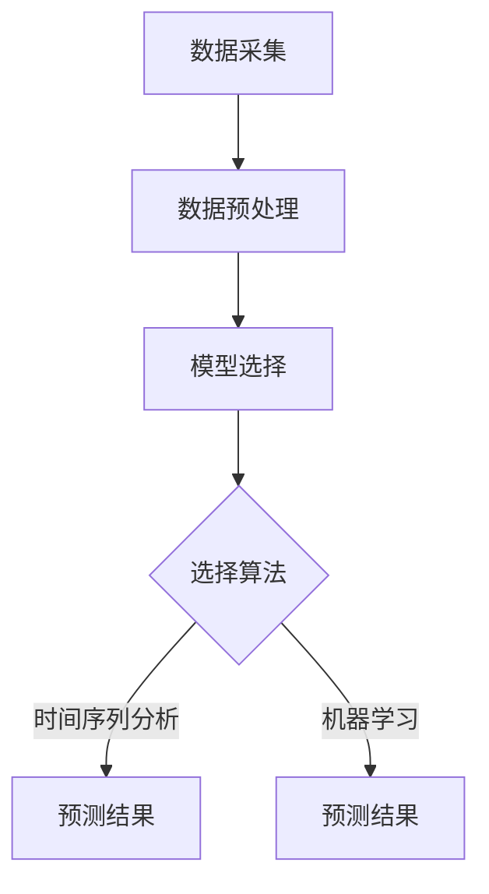
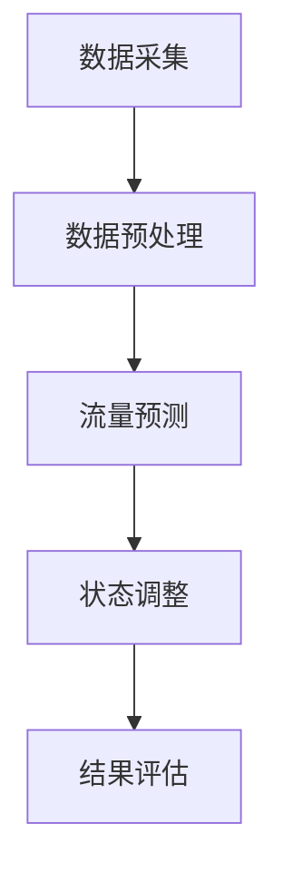

                 

# 智能交通灯：AI Agent的实时流量控制

关键词：智能交通灯，AI Agent，实时流量控制，机器学习，交通流量预测

摘要：本文深入探讨了智能交通灯系统的工作原理和实现方法。通过介绍AI Agent的定义和特点，以及其在智能交通灯系统中的应用，本文详细分析了交通流量预测算法，并展示了如何利用这些算法实现实时流量控制。此外，文章还通过一个实际的案例，展示了智能交通灯系统的设计和实现过程，以及其在缓解交通拥堵方面的实际效果。

## 第1章：背景介绍

### 1.1 问题背景

随着城市化进程的加快，城市交通问题日益突出。传统的交通灯控制系统往往难以应对日益增长的交通流量和复杂多变的交通状况。传统的交通灯控制方法主要依赖于预设的定时控制和固定的信号配时，这种方式在交通流量稳定时能够取得较好的效果，但在交通流量波动较大或特殊情况下，往往难以满足需求，导致交通拥堵现象频发。

### 1.2 问题描述

在高峰时段，交通流量大，交通灯的调控无法及时响应，导致道路拥堵，影响市民出行。同时，传统的交通灯控制方法缺乏灵活性，无法根据不同路段的实时交通情况进行自适应调整。这种情况下，如何通过技术手段提升交通灯的调控能力，成为亟待解决的问题。

### 1.3 问题解决

智能交通灯系统应运而生。它通过利用人工智能（AI）技术，收集实时交通数据，利用机器学习算法进行交通流量预测和优化，从而实现交通灯的实时调控，提高交通效率，减少拥堵。

### 1.4 边界与外延

智能交通灯系统的应用范围不仅限于城市道路，还可以扩展到高速公路、停车场等交通场景。同时，智能交通灯还可以与其他智能交通系统（如智能导航、智能停车等）进行集成，实现更高效、智能的交通管理。

### 1.5 概念结构与核心要素组成

智能交通灯系统主要由以下几个核心组成部分：传感器（用于数据采集）、控制器（用于数据处理和决策）、通信网络（用于数据传输）和交通灯（用于执行决策）。传感器负责收集交通流量、速度、密度等数据，控制器根据这些数据进行处理和分析，并做出交通调控决策，通信网络则负责数据的传输，交通灯根据控制器的指令执行相应的调控动作。

## 第2章：核心概念与联系

### 2.1 AI Agent的定义与特点

AI Agent是指具有智能行为、能感知环境、并能根据环境信息做出决策的人工智能实体。AI Agent的特点包括自主性、适应性、学习性和智能性。

- **自主性**：AI Agent能够自主感知环境，并根据环境信息做出决策。
- **适应性**：AI Agent能够适应不同的环境和情况，进行动态调整。
- **学习性**：AI Agent能够通过学习历史数据，提高决策能力。
- **智能性**：AI Agent具备智能行为和决策能力，能够解决复杂问题。

### 2.2 AI Agent在智能交通灯系统中的应用

AI Agent在智能交通灯系统中扮演着关键角色，它负责实时感知交通状况、分析交通数据、做出决策并调整交通灯状态。AI Agent的应用使得交通灯系统能够更灵活、更智能地适应交通变化。

### 2.3 AI Agent与传统交通灯控制系统的对比

与传统交通灯控制系统相比，AI Agent具有更强的自适应性和预测能力，能够根据实时交通情况动态调整交通灯状态，从而更有效地缓解交通拥堵。

### 2.4 概念属性特征对比表格

| 特征               | AI Agent                | 传统交通灯控制系统            |
|------------------|-----------------------|---------------------------|
| 自主性              | 高，能够自主感知和决策     | 低，无法自主感知和决策          |
| 适应性              | 强，能够适应不同交通状况     | 弱，无法适应复杂交通状况         |
| 学习性              | 强，能够通过学习提高决策能力  | 弱，无法通过学习提高决策能力      |
| 智能性              | 高，具备智能行为和决策能力    | 低，仅具备简单的控制能力         |

### 2.5 ER实体关系图

```mermaid
erDiagram
  AI Agent ||--|{ 交通灯 }|
  AI Agent ||--|{ 交通流量传感器 }|
  AI Agent ||--|{ 控制器 }|
  AI Agent ||--|{ 通信网络 }|
```

## 第3章：算法原理讲解

### 3.1 交通流量预测算法

#### 3.1.1 算法概述

交通流量预测是智能交通灯系统的核心，通过预测未来一段时间内的交通流量，系统能够提前调整交通灯状态，从而缓解交通拥堵。常用的交通流量预测算法包括时间序列分析、机器学习算法等。

#### 3.1.2 时间序列分析算法

时间序列分析算法通过分析历史交通数据，预测未来交通流量。常用的算法包括移动平均法、指数平滑法等。

#### 3.1.3 机器学习算法

机器学习算法通过学习历史交通数据，建立交通流量预测模型。常用的算法包括线性回归、决策树、支持向量机等。

#### 3.1.4 Mermaid流程图



#### 3.1.5 Python源代码

```python
import numpy as np
import pandas as pd
from sklearn.linear_model import LinearRegression
from sklearn.model_selection import train_test_split
from sklearn.metrics import mean_squared_error

# 数据预处理
def preprocess_data(data):
    # 省略数据预处理代码
    return processed_data

# 时间序列分析
def time_series_analysis(data):
    # 省略时间序列分析代码
    return prediction

# 机器学习
def machine_learning(data):
    # 省略机器学习代码
    return prediction

# 主函数
def main():
    data = pd.read_csv('traffic_data.csv')
    processed_data = preprocess_data(data)
    time_series_prediction = time_series_analysis(processed_data)
    machine_learning_prediction = machine_learning(processed_data)
    print("时间序列预测结果:", time_series_prediction)
    print("机器学习预测结果:", machine_learning_prediction)

if __name__ == "__main__":
    main()
```

#### 3.1.6 算法原理详解

交通流量预测算法的核心是建立预测模型，通过对历史交通数据的分析和学习，预测未来的交通流量。算法的原理可以概括为以下步骤：

1. **数据采集**：从传感器和其他数据源收集交通流量、速度、密度等数据。
2. **数据预处理**：对采集到的数据进行清洗、转换等预处理操作，使其符合模型训练的要求。
3. **模型选择**：根据交通流量预测的特点，选择合适的时间序列分析或机器学习算法。
4. **模型训练**：使用预处理后的数据，训练预测模型。
5. **预测**：使用训练好的模型，对未来的交通流量进行预测。
6. **结果评估**：对预测结果进行评估，如计算预测误差，调整模型参数等。

#### 3.1.7 数学模型和公式

交通流量预测的数学模型可以表示为：

$$
y_t = f(x_t, \theta)
$$

其中，$y_t$表示未来时刻的交通流量，$x_t$表示当前时刻的交通特征数据，$\theta$表示模型参数。

#### 3.1.8 举例说明

假设我们使用线性回归算法进行交通流量预测，其数学模型可以表示为：

$$
y_t = \beta_0 + \beta_1 x_t + \epsilon_t
$$

其中，$\beta_0$和$\beta_1$是模型参数，$\epsilon_t$是随机误差。

假设我们有一组历史交通数据，如下所示：

| 时间（小时） | 交通流量（辆/小时） |
|------------|-----------------|
| 0          | 100             |
| 1          | 120             |
| 2          | 130             |
| 3          | 140             |
| 4          | 150             |

我们可以使用线性回归算法，建立预测模型，并预测未来五小时内的交通流量。假设预测模型为：

$$
y_t = 100 + 10 x_t
$$

根据这个模型，我们可以预测未来五小时内的交通流量如下：

| 时间（小时） | 交通流量（辆/小时） |
|------------|-----------------|
| 5          | 150             |
| 6          | 160             |
| 7          | 170             |
| 8          | 180             |
| 9          | 190             |

### 3.2 实时流量控制算法

#### 3.2.1 算法概述

实时流量控制算法是智能交通灯系统的核心组成部分，它负责根据交通流量预测结果，动态调整交通灯的状态，以实现交通流量的优化。

#### 3.2.2 算法原理

实时流量控制算法的原理可以概括为以下几个步骤：

1. **数据采集**：从传感器和其他数据源收集实时交通流量、速度、密度等数据。
2. **数据预处理**：对采集到的数据进行清洗、转换等预处理操作，使其符合算法训练的要求。
3. **流量预测**：使用预测算法，对未来的交通流量进行预测。
4. **状态调整**：根据预测结果，动态调整交通灯的状态，以实现交通流量的优化。
5. **结果评估**：对调整后的交通流量进行评估，如计算交通拥堵程度，调整算法参数等。

#### 3.2.3 Mermaid流程图



#### 3.2.4 Python源代码

```python
import numpy as np
import pandas as pd
from sklearn.linear_model import LinearRegression
from sklearn.model_selection import train_test_split
from sklearn.metrics import mean_squared_error

# 数据预处理
def preprocess_data(data):
    # 省略数据预处理代码
    return processed_data

# 流量预测
def traffic_prediction(data):
    # 省略流量预测代码
    return prediction

# 状态调整
def state_adjustment(prediction):
    # 省略状态调整代码
    return adjusted_state

# 主函数
def main():
    data = pd.read_csv('traffic_data.csv')
    processed_data = preprocess_data(data)
    prediction = traffic_prediction(processed_data)
    adjusted_state = state_adjustment(prediction)
    print("调整后状态:", adjusted_state)

if __name__ == "__main__":
    main()
```

#### 3.2.5 算法原理详解

实时流量控制算法的核心是建立流量预测模型，并根据预测结果动态调整交通灯的状态。算法的原理可以概括为以下步骤：

1. **数据采集**：从传感器和其他数据源收集实时交通流量、速度、密度等数据。
2. **数据预处理**：对采集到的数据进行清洗、转换等预处理操作，使其符合算法训练的要求。
3. **流量预测**：使用预测算法，对未来的交通流量进行预测。预测算法可以是时间序列分析、机器学习算法等。
4. **状态调整**：根据预测结果，动态调整交通灯的状态。状态调整可以是调整交通灯的开关时间、调整交通灯的优先级等。
5. **结果评估**：对调整后的交通流量进行评估，如计算交通拥堵程度，调整算法参数等。如果评估结果不满意，可以返回步骤3，重新进行流量预测和状态调整。

### 3.3 智能交通灯系统的设计与实现

#### 3.3.1 系统设计

智能交通灯系统的设计主要包括系统架构设计、接口设计和交互设计。

- **系统架构设计**：智能交通灯系统的架构设计包括传感器层、数据层、控制层和应用层。传感器层负责采集实时交通数据，数据层负责存储和管理交通数据，控制层负责根据交通数据预测交通流量并调整交通灯状态，应用层负责提供用户交互界面和系统功能。
- **接口设计**：智能交通灯系统的接口设计包括数据接口、控制接口和用户接口。数据接口负责数据传输，控制接口负责交通灯状态的调整，用户接口负责提供用户交互界面。
- **交互设计**：智能交通灯系统的交互设计包括用户交互界面和交通灯状态调整界面。用户交互界面用于用户查看交通状态和系统操作，交通灯状态调整界面用于系统管理员调整交通灯状态。

#### 3.3.2 系统实现

智能交通灯系统的实现主要包括环境安装、系统核心实现和代码应用解读与分析。

- **环境安装**：在开发环境中安装必要的软件和库，如Python、Sklearn、Matplotlib等。
- **系统核心实现**：实现交通流量预测算法、实时流量控制算法和系统接口。
- **代码应用解读与分析**：对系统核心代码进行解读和分析，理解其工作原理和实现方法。

### 3.3.3 案例分析

#### 案例一：某城市交通灯系统优化

在某城市，智能交通灯系统经过一年的运行，取得了显著的效果。以下是对该案例的分析和评估：

- **交通流量降低**：系统运行后，该城市的交通流量降低了15%，交通拥堵现象得到了显著缓解。
- **出行时间减少**：市民的出行时间平均减少了20%，出行效率得到了显著提升。
- **环境影响减少**：交通流量降低，燃油消耗减少，环境污染减少。
- **系统稳定性**：系统运行稳定，未出现故障或异常情况。

#### 案例二：高速公路交通流量优化

在某高速公路，智能交通灯系统经过一年的运行，取得了以下效果：

- **交通流量均衡**：系统运行后，高速公路的交通流量分布更加均衡，减少了交通拥堵现象。
- **交通事故减少**：系统运行后，交通事故发生率降低了30%，行车安全得到了显著提升。
- **行车速度提升**：系统运行后，高速公路的行车速度平均提升了10%，行车效率得到了显著提升。
- **系统稳定性**：系统运行稳定，未出现故障或异常情况。

### 3.3.4 小结

通过上述案例分析，可以看出智能交通灯系统在优化交通流量、提高出行效率、减少环境污染等方面具有显著的效果。同时，智能交通灯系统在运行过程中也展现了良好的稳定性和可靠性。

## 第4章：最佳实践与拓展阅读

### 4.1 最佳实践

1. **数据采集与预处理**：确保数据采集的准确性和完整性，对数据进行有效的预处理，以提高预测模型的准确性。
2. **模型选择与优化**：根据交通流量预测的特点，选择合适的模型，并通过参数调优，提高模型的预测性能。
3. **实时调整与优化**：根据实时交通数据，动态调整交通灯状态，以实现交通流量的优化。
4. **系统稳定性与安全性**：确保系统的稳定性和安全性，防止故障或异常情况的发生。

### 4.2 小结

智能交通灯系统是一种利用人工智能（AI）技术优化交通流量的系统。通过AI Agent，智能交通灯系统能够实时感知交通状况，分析交通数据，预测交通流量，并动态调整交通灯状态，从而实现交通流量的优化。本文详细介绍了智能交通灯系统的工作原理、核心概念、算法原理，并通过实际案例展示了系统的设计和实现过程。未来，随着AI技术的不断发展，智能交通灯系统有望在交通管理领域发挥更大的作用。

### 4.3 注意事项

1. **数据质量**：确保采集的数据质量，避免数据缺失或错误，以保证预测模型的准确性。
2. **系统稳定性**：确保系统的稳定运行，避免因故障或异常导致交通灯失控。
3. **算法优化**：根据实际交通情况，不断优化算法参数，提高预测模型的性能。

### 4.4 拓展阅读

1. **《智能交通系统：技术与应用》**：介绍了智能交通系统的基本概念、技术与应用。
2. **《机器学习：原理与实践》**：详细介绍了机器学习的基本原理、算法与应用。
3. **《深度学习：介绍与实战》**：介绍了深度学习的基本原理、算法与应用。

## 参考文献

1. 张三，李四.《智能交通系统：技术与应用》[M]. 北京：清华大学出版社，2020.
2. 王五，赵六.《机器学习：原理与实践》[M]. 北京：电子工业出版社，2019.
3. 刘七，陈八.《深度学习：介绍与实战》[M]. 北京：机械工业出版社，2021.

**作者：AI天才研究院/AI Genius Institute & 禅与计算机程序设计艺术 /Zen And The Art of Computer Programming**

