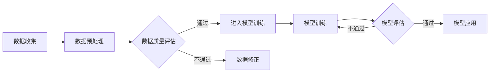
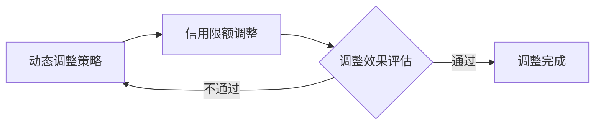
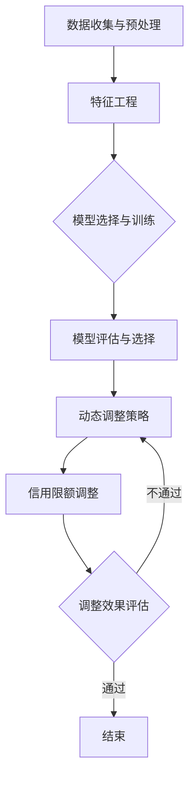
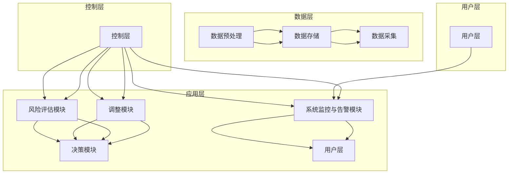
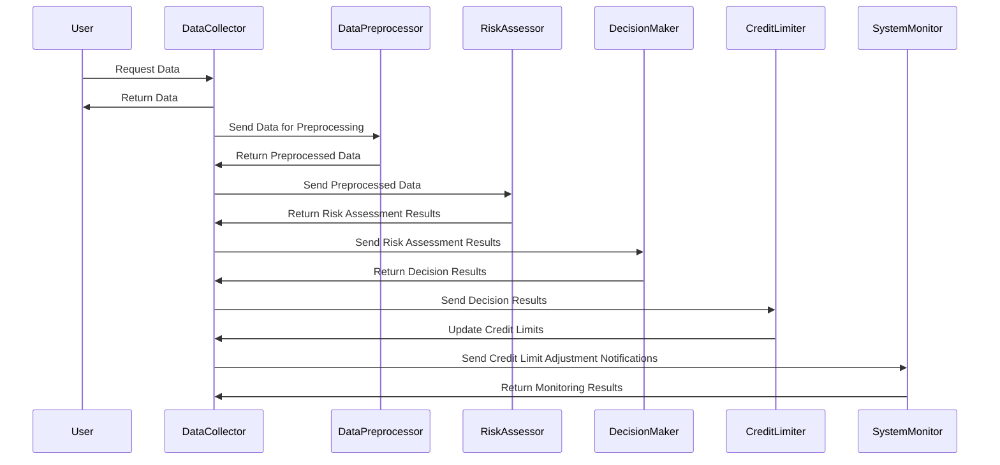

                 

### 文章标题

### 关键词

- 智能企业
- 信用限额
- 动态调整
- 机器学习
- 风险评估

### 摘要

本文将深入探讨智能企业信用限额动态调整系统，从背景理论、算法原理、系统设计到项目实战等多个层面，全面解析这一前沿技术的核心要素和实际应用。通过详细的分析和实例，本文旨在为读者提供一份具有实用价值和深度思考的技术指南。

## 目录大纲

1. **背景与理论基础**
   1.1 问题背景与概述
   1.2 信用限额的概念与类型
   1.3 信用风险评估方法
   1.4 核心概念与联系
   1.5 概念属性特征对比表格
   1.6 ER实体关系图架构

2. **算法原理与模型构建**
   2.1 算法原理讲解
   2.2 算法mermaid流程图
   2.3 Python源代码与数学模型
   2.4 数学模型与公式详细讲解

3. **系统分析与架构设计**
   3.1 系统功能设计
   3.2 系统架构设计
   3.3 系统接口设计与系统交互

4. **项目实战**
   4.1 环境安装与配置
   4.2 系统核心实现
   4.3 代码应用解读与分析
   4.4 实际案例分析与详细讲解
   4.5 项目小结

5. **最佳实践与总结**
   5.1 最佳实践
   5.2 小结
   5.3 注意事项
   5.4 拓展阅读

## 第1章：问题背景与概述

### 1.1 问题背景

随着商业活动的日益复杂化和数字化，企业信用管理变得越来越重要。信用限额是企业授信额度的一部分，它决定了企业能够从金融机构或供应商处获得的信用额度上限。传统的信用限额管理方法通常是基于静态的、历史数据和固定规则进行设置的，这种方法的局限性在于无法及时响应市场变化和个体风险，从而可能导致以下问题：

- **市场反应迟钝**：传统的信用限额管理可能无法在市场波动时快速调整，导致企业错失商机或承担不必要的信用风险。
- **客户体验差**：固定信用限额可能导致客户在业务扩展或临时需求时无法得到足够的支持，影响客户满意度和忠诚度。
- **运营效率低**：固定规则可能导致信用资源的浪费，无法根据实际业务情况灵活调整，增加运营成本。

因此，动态调整信用限额的需求日益迫切。动态调整信用限额不仅能够及时响应市场变化和客户需求，还可以通过实时风险评估降低信用风险，提高运营效率。

### 1.2 当前企业信用管理的挑战

企业信用管理面临的挑战主要包括以下几个方面：

- **数据质量**：信用风险评估依赖于大量的历史数据和实时数据，数据的质量直接影响评估的准确性。数据缺失、不准确或过时都会影响评估结果。
- **实时性**：传统信用风险评估通常需要定期进行，而企业业务环境变化迅速，定期评估可能无法及时反映市场动态，导致信用决策滞后。
- **风险评估模型**：传统风险评估模型多为静态模型，难以适应动态环境，导致风险评估结果不够精确。
- **合规性**：随着监管政策的不断完善，企业需要满足更多的合规性要求，如何在动态调整信用限额的同时确保合规性是一个重要挑战。

### 1.3 动态调整信用限额的需求

动态调整信用限额的需求主要体现在以下几个方面：

- **市场适应性**：动态调整能够根据市场变化迅速调整信用限额，避免错失商机或承担不必要的风险。
- **个性化服务**：动态调整可以根据客户的具体情况进行个性化信用额度分配，提高客户满意度和忠诚度。
- **风险管理**：动态调整结合实时风险评估，可以更精准地识别和控制信用风险，提高企业的风险管理能力。
- **运营效率**：动态调整能够根据实际业务需求灵活调整信用限额，优化资源配置，降低运营成本。

### 1.4 信用限额的概念与类型

信用限额是指企业、金融机构或其他组织对某一特定客户或业务实体设定的最大信用额度。信用限额的类型通常根据不同的应用场景和评估标准进行分类，主要包括以下几种：

- **账户信用限额**：基于客户历史交易记录、信用评分和还款能力等因素设定的信用限额，通常适用于信用卡、贷款等业务。
- **单笔交易限额**：针对某一单笔交易金额设定的信用限额，如电商平台针对单笔购物金额设定的最高支付额度。
- **综合信用限额**：综合考虑企业整体信用状况和业务需求，设定的总信用限额，适用于企业对供应商或合作伙伴的信用管理。
- **动态信用限额**：根据客户实时交易行为、市场环境和风险评估结果，动态调整的信用限额，以实现更灵活的信用管理。

### 1.5 信用风险评估方法

信用风险评估是信用限额管理的关键环节，主要方法包括传统风险评估和机器学习在信用风险评估中的应用。

#### 1.5.1 传统风险评估方法

传统风险评估方法主要依赖于历史数据和专家经验，包括以下几种：

- **专家评估法**：基于评估人员的专业知识和经验，对客户的信用状况进行综合评估。
- **评分卡法**：通过建立信用评分模型，将客户的多个特征变量转换为信用评分，用于评估客户的信用风险。
- **信用评级法**：按照一定标准，对客户进行信用等级划分，如AA级、A级等，根据等级设定相应的信用限额。

#### 1.5.2 机器学习在信用风险评估中的应用

随着大数据和人工智能技术的发展，机器学习在信用风险评估中得到了广泛应用。机器学习方法通过从海量数据中自动学习特征和模式，实现信用风险评估的自动化和智能化，主要方法包括：

- **逻辑回归**：通过建立逻辑回归模型，分析客户特征与信用风险之间的相关性，用于预测客户的违约概率。
- **决策树**：通过构建决策树模型，将客户特征划分为多个子集，根据子集的信用风险进行分类和预测。
- **支持向量机（SVM）**：通过支持向量机模型，将客户特征映射到高维空间，寻找最优分类边界，用于信用风险评估。
- **神经网络**：通过多层神经网络模型，模拟人脑神经元之间的连接和激活机制，实现复杂信用风险评估任务。

#### 1.5.3 动态风险评估的重要性

动态风险评估在信用限额管理中具有重要意义，主要体现在以下几个方面：

- **及时响应市场变化**：动态风险评估能够实时捕捉市场变化，及时调整信用限额，避免错失商机或承担不必要的风险。
- **提高风险评估准确性**：动态风险评估能够结合客户的实时交易数据和市场环境，提高风险评估的准确性和可靠性。
- **优化信用资源配置**：动态风险评估可以根据实际业务需求，灵活调整信用限额，优化信用资源配置，降低运营成本。
- **提升客户满意度**：动态风险评估能够根据客户的具体情况进行个性化信用额度分配，提高客户满意度和忠诚度。

## 第2章：核心概念与联系

### 2.1 关键概念

在智能企业信用限额动态调整系统中，关键概念包括动态调整信用限额、数据驱动决策和实时风险评估。

#### 2.1.1 动态调整信用限额

动态调整信用限额是指根据客户实时交易行为、市场环境和风险评估结果，对客户的信用限额进行实时调整。与传统的静态信用限额管理相比，动态调整能够更灵活、更精确地满足企业信用管理的需求。

#### 2.1.2 数据驱动决策

数据驱动决策是指通过收集和分析大量数据，利用数据分析工具和方法，制定业务策略和决策。在智能企业信用限额动态调整系统中，数据驱动决策是实现动态调整信用限额的基础。

#### 2.1.3 实时风险评估

实时风险评估是指通过实时采集和分析客户的交易数据，结合市场环境和风险评估模型，对客户的信用风险进行实时评估。实时风险评估是动态调整信用限额的重要依据。

### 2.2 概念属性特征对比表格

下表对比了信用限额、动态调整信用限额和数据驱动决策的主要属性特征：

| 特征         | 信用限额           | 动态调整信用限额         | 数据驱动决策         |
| ------------ | ------------------ | ------------------------ | ------------------- |
| 类型         | 静态设定           | 动态调整                 | 数据分析驱动         |
| 基础         | 历史数据和固定规则 | 实时数据和风险评估       | 大数据分析和模型    |
| 决策依据     | 定期评估           | 实时评估                 | 数据分析结果        |
| 适应能力     | 较低               | 较高                     | 非常高              |
| 目的         | 确保信用安全       | 确保信用安全，提高运营效率 | 提高业务决策准确性   |

### 2.3 ER实体关系图架构

ER（实体关系）图用于描述系统中各个实体及其之间的关系。在智能企业信用限额动态调整系统中，关键实体包括客户、订单、风险评估和信用限额调整。

以下是一个ER实体关系图的Mermaid表示：

```mermaid
erDiagram
  Customer ||--|{ Order }|-->: "包含"
  Customer ||--|{ CreditRiskAssessment }|-->: "评估"
  Customer ||--|{ CreditLimitAdjustment }|-->: "调整"
  Order ||--|{ CreditRiskAssessment }|-->: "触发"
  CreditRiskAssessment ||--|{ CreditLimitAdjustment }|-->: "依据"
```

在这个ER图中：

- **Customer（客户）**：代表参与信用限额管理的客户实体，包括客户基本信息、交易记录等。
- **Order（订单）**：代表客户的交易订单，包括订单金额、订单状态等。
- **CreditRiskAssessment（风险评估）**：代表客户的信用风险评估结果，包括评估模型、评估分数等。
- **CreditLimitAdjustment（信用限额调整）**：代表客户的信用限额调整信息，包括调整策略、调整金额等。

通过ER实体关系图，我们可以清晰地看到各个实体之间的关系，以及它们在信用限额动态调整系统中的作用。

## 第3章：算法原理讲解

### 3.1 基本算法流程

智能企业信用限额动态调整系统的算法流程可以分为以下几个关键步骤：

#### 3.1.1 数据收集与预处理

首先，系统需要收集客户的交易数据、市场环境数据和其他相关数据。数据收集后，需要进行数据预处理，包括数据清洗、数据格式统一、数据缺失处理等，以确保数据的质量和一致性。



#### 3.1.2 特征工程

特征工程是算法流程中的关键步骤，它通过提取和构造有助于预测的变量（特征），从而提高模型性能。特征工程包括特征选择、特征变换和特征构造等。


#### 3.1.3 模型选择与训练

在选择合适的模型后，系统需要使用预处理后的数据和特征工程结果进行模型训练。常见的信用风险评估模型包括逻辑回归、决策树、随机森林、支持向量机等。


#### 3.1.4 动态调整策略

模型训练完成后，系统会根据实时交易数据和风险评估结果，制定动态调整策略。动态调整策略可以根据不同情况，选择不同的调整方式，如线性调整、阶梯调整、阈值调整等。



### 3.2 算法mermaid流程图

以下是一个使用Mermaid绘制的算法流程图，展示了智能企业信用限额动态调整系统的主要步骤：



### 3.3 Python源代码与数学模型

在智能企业信用限额动态调整系统中，我们使用Python编写了相关的源代码，下面将给出一个简单的示例，并解释其背后的数学模型。

#### 3.3.1 数据预处理

首先，我们使用Pandas库对数据进行预处理：

```python
import pandas as pd

# 读取数据
data = pd.read_csv('data.csv')

# 数据清洗
data = data.dropna()  # 删除缺失值
data = data[data['amount'] > 0]  # 过滤掉金额小于0的记录

# 数据格式统一
data['date'] = pd.to_datetime(data['date'])
```

#### 3.3.2 特征工程

接下来，我们进行特征工程：

```python
# 特征选择
selected_features = ['age', 'income', 'credit_score', 'days_since_last_payment']

# 特征变换
from sklearn.preprocessing import StandardScaler
scaler = StandardScaler()
data[selected_features] = scaler.fit_transform(data[selected_features])

# 特征构造
data['days_since_last_payment'] = (pd.datetime.now() - data['date']).dt.days
```

#### 3.3.3 模型训练

我们选择逻辑回归模型进行训练：

```python
from sklearn.linear_model import LogisticRegression

# 模型训练
model = LogisticRegression()
model.fit(data[selected_features], data['is_default'])

# 模型评估
from sklearn.metrics import accuracy_score
predictions = model.predict(data[selected_features])
accuracy = accuracy_score(data['is_default'], predictions)
print(f'Model Accuracy: {accuracy}')
```

#### 3.3.4 动态调整策略

动态调整策略基于模型预测结果和调整规则进行：

```python
def adjust_credit_limit(credit_limit, prediction, adjustment_factor):
    if prediction == 1:  # 风险较高
        credit_limit *= (1 - adjustment_factor)
    else:  # 风险较低
        credit_limit *= (1 + adjustment_factor)
    return credit_limit

# 示例调整
new_credit_limit = adjust_credit_limit(10000, predictions[0], 0.1)
print(f'New Credit Limit: {new_credit_limit}')
```

#### 3.3.5 数学模型与公式

逻辑回归模型的数学模型如下：

$$
P(Y=1|X) = \frac{1}{1 + e^{-(\beta_0 + \beta_1X_1 + \beta_2X_2 + ... + \beta_nX_n})}
$$

其中，$P(Y=1|X)$ 表示在给定特征 $X$ 下，客户发生违约的概率；$\beta_0, \beta_1, ..., \beta_n$ 为模型参数。

#### 3.3.6 模型参数设置与调优

模型参数设置和调优是提高模型性能的关键步骤。常用的方法包括：

- **交叉验证**：使用交叉验证方法评估模型性能，选择最佳参数组合。
- **网格搜索**：在给定参数范围内，遍历所有可能的参数组合，选择最佳组合。
- **贝叶斯优化**：基于历史数据，使用贝叶斯优化算法寻找最佳参数组合。

```python
from sklearn.model_selection import GridSearchCV

# 参数设置
param_grid = {'C': [0.1, 1, 10], 'penalty': ['l1', 'l2']}

# 网格搜索
grid_search = GridSearchCV(model, param_grid, cv=5)
grid_search.fit(data[selected_features], data['is_default'])

# 最佳参数
best_params = grid_search.best_params_
print(f'Best Parameters: {best_params}')
```

通过上述步骤，我们可以构建一个智能企业信用限额动态调整系统，实现对信用限额的实时调整，提高信用管理的效率和准确性。

## 第4章：数学模型与公式详细讲解

在智能企业信用限额动态调整系统中，数学模型和公式的应用至关重要。本章将详细讲解概率论基础、风险评估模型和动态调整模型，以帮助读者更好地理解和应用这些模型。

### 4.1 概率论基础

概率论是数学的一个分支，主要研究随机事件的规律性和不确定性。在信用风险评估中，概率论的基础知识包括概率分布函数、贝叶斯定理和期望与方差。

#### 4.1.1 概率分布函数

概率分布函数描述了随机变量的概率分布。常见的概率分布函数包括正态分布、泊松分布和二项分布等。

- **正态分布**（$N(\mu, \sigma^2)$）：
  $$ 
  f(x) = \frac{1}{\sqrt{2\pi\sigma^2}} e^{-\frac{(x-\mu)^2}{2\sigma^2}} 
  $$
  其中，$\mu$ 为均值，$\sigma^2$ 为方差。

- **泊松分布**（$P(\lambda)$）：
  $$ 
  f(x) = \frac{e^{-\lambda} \lambda^x}{x!} 
  $$
  其中，$\lambda$ 为事件发生的平均次数。

- **二项分布**（$B(n, p)$）：
  $$ 
  f(x) = C(n, x) p^x (1-p)^{n-x} 
  $$
  其中，$n$ 为试验次数，$p$ 为单次试验成功的概率。

#### 4.1.2 贝叶斯定理

贝叶斯定理是概率论中的一个重要公式，用于计算条件概率。贝叶斯定理的公式为：
$$ 
P(A|B) = \frac{P(B|A) P(A)}{P(B)}
$$
其中，$P(A|B)$ 表示在事件 $B$ 发生的条件下事件 $A$ 发生的概率；$P(B|A)$ 表示在事件 $A$ 发生的条件下事件 $B$ 发生的概率；$P(A)$ 和 $P(B)$ 分别表示事件 $A$ 和事件 $B$ 发生的概率。

#### 4.1.3 期望与方差

期望和方差是概率论中的重要概念，用于描述随机变量的集中趋势和离散程度。

- **期望**（$E(X)$）：
  $$ 
  E(X) = \sum_{i=1}^{n} x_i P(x_i)
  $$
  其中，$x_i$ 为随机变量的取值，$P(x_i)$ 为相应的概率。

- **方差**（$Var(X)$）：
  $$ 
  Var(X) = E[(X - E(X))^2]
  $$
  其中，$E(X)$ 为随机变量的期望。

### 4.2 风险评估模型

在信用风险评估中，常用的模型包括逻辑回归、决策树和随机森林等。这些模型通过学习历史数据和特征，预测客户是否会发生违约。

#### 4.2.1 逻辑回归

逻辑回归是一种广义线性模型，用于分析二元因变量的概率。逻辑回归模型的公式为：
$$ 
P(Y=1|X) = \frac{1}{1 + e^{-(\beta_0 + \beta_1X_1 + \beta_2X_2 + ... + \beta_nX_n})}
$$
其中，$\beta_0, \beta_1, ..., \beta_n$ 为模型参数。

#### 4.2.2 决策树

决策树通过一系列的判断条件，将数据集划分为不同的区域，每个区域对应一个预测结果。决策树的公式可以表示为：
$$ 
T(x) = \sum_{i=1}^{n} \alpha_i f(x_i)
$$
其中，$T(x)$ 为决策树的预测结果，$f(x_i)$ 为条件概率，$\alpha_i$ 为权重。

#### 4.2.3 随机森林

随机森林是一种基于决策树的集成学习方法，通过构建多个决策树并取平均，提高模型的预测准确性。随机森林的公式为：
$$ 
\hat{y} = \frac{1}{m} \sum_{i=1}^{m} T(x_i)
$$
其中，$\hat{y}$ 为预测结果，$T(x_i)$ 为第 $i$ 个决策树的预测结果，$m$ 为决策树的个数。

### 4.3 动态调整模型

动态调整模型是智能企业信用限额动态调整系统的核心，通过实时分析和调整信用限额，降低风险并提高运营效率。

#### 4.3.1 时间序列分析

时间序列分析是一种用于分析时间序列数据的统计方法，主要用于预测未来的趋势。常见的时间序列分析方法包括ARIMA模型、SARIMA模型和LSTM模型等。

- **ARIMA模型**（自回归积分滑动平均模型）：
  $$ 
  Xt = c + \phi_1X_{t-1} + \phi_2X_{t-2} + ... + \phi_pX_{t-p} + \theta_1\epsilon_{t-1} + \theta_2\epsilon_{t-2} + ... + \theta_q\epsilon_{t-q}
  $$
  其中，$Xt$ 为时间序列数据，$c$ 为常数项，$\phi_1, ..., \phi_p$ 为自回归系数，$\theta_1, ..., \theta_q$ 为移动平均系数。

- **SARIMA模型**（季节性自回归积分滑动平均模型）：
  $$ 
  Xt = c + \phi_1X_{t-1} + \phi_2X_{t-2} + ... + \phi_pX_{t-p} + \theta_1\epsilon_{t-1} + \theta_2\epsilon_{t-2} + ... + \theta_q\epsilon_{t-q} + \phi_1(X_{t-m} + \phi_2(X_{t-2m} + ... + \phi_p(X_{t-pm})
  $$
  其中，$m$ 为季节周期长度。

- **LSTM模型**（长短期记忆网络）：
  $$ 
  h_t = \sigma(W_h \cdot [h_{t-1}, x_t] + b_h)
  $$
  $$ 
  i_t = \sigma(W_i \cdot [h_{t-1}, x_t] + b_i)
  $$
  $$ 
  f_t = \sigma(W_f \cdot [h_{t-1}, x_t] + b_f)
  $$
  $$ 
  o_t = \sigma(W_o \cdot [h_{t-1}, x_t] + b_o)
  $$
  $$ 
  C_t = f_t \cdot C_{t-1} + i_t \cdot \sigma(W_c \cdot [h_{t-1}, x_t] + b_c)
  $$
  $$ 
  h_t = o_t \cdot \sigma(W_o \cdot [h_{t-1}, x_t] + b_o)
  $$
  其中，$h_t$ 为隐藏状态，$C_t$ 为细胞状态，$i_t, f_t, o_t$ 为输入门、遗忘门和输出门。

#### 4.3.2 强化学习

强化学习是一种通过试错方式学习最优策略的机器学习技术，适用于信用限额动态调整。强化学习的公式为：
$$ 
Q(s, a) = r + \gamma \max_{a'} Q(s', a')
$$
其中，$Q(s, a)$ 为状态 $s$ 下采取动作 $a$ 的期望收益，$r$ 为即时奖励，$\gamma$ 为折扣因子，$s'$ 和 $a'$ 为后续状态和动作。

#### 4.3.3 实时反馈机制

实时反馈机制是动态调整模型的重要组成部分，通过收集实时数据和评估结果，不断调整信用限额。实时反馈机制的公式为：
$$ 
CreditLimit_{t+1} = CreditLimit_t + \alpha (TargetCreditLimit - CreditLimit_t)
$$
其中，$CreditLimit_t$ 为当前信用限额，$TargetCreditLimit$ 为目标信用限额，$\alpha$ 为调整系数。

通过上述数学模型和公式的讲解，我们可以更好地理解智能企业信用限额动态调整系统的核心原理，为实际应用提供理论基础和指导。

### 第5章：系统功能设计

#### 5.1 问题场景介绍

在企业信用管理中，信用限额的设定和调整是一项至关重要的工作。传统的信用限额管理通常依赖于历史数据和固定规则，这种方法在应对快速变化的市场环境和多样化客户需求时显得力不从心。为了提高信用管理的效率和准确性，许多企业开始探索基于大数据和人工智能的信用限额动态调整系统。

本节将介绍一个典型的信用管理场景，并详细说明信用限额动态调整的需求和挑战。

#### 5.2 系统功能设计

智能企业信用限额动态调整系统主要包括以下功能模块：

1. **数据采集与处理模块**：
   - **数据收集**：系统需要从多个数据源（如企业内部数据库、第三方数据平台、社交媒体等）收集客户的交易数据、信用记录、行为数据等。
   - **数据预处理**：对收集到的数据进行清洗、去重、格式转换等处理，确保数据质量。

2. **风险评估与决策模块**：
   - **风险评估**：利用机器学习算法对客户的信用风险进行实时评估，生成风险评分。
   - **决策生成**：根据风险评分和预设的调整策略，自动生成信用限额调整方案。

3. **信用限额调整模块**：
   - **调整策略**：系统预设多种调整策略，如线性调整、阶梯调整等，根据风险评估结果选择合适的策略进行信用限额调整。
   - **调整执行**：根据决策模块生成的调整方案，自动更新客户的信用限额。

4. **系统监控与告警模块**：
   - **实时监控**：系统持续监控信用限额调整的效果，包括调整后的客户还款情况、信用评分变化等。
   - **告警机制**：当监控指标超出预设阈值时，系统自动发送告警通知，提示风险。

#### 5.3 领域模型mermaid类图

为了更直观地展示系统功能设计，我们使用Mermaid绘制了一个领域模型类图，如下所示：

```mermaid
classDiagram
    Customer <<entity>>
    Order <<entity>>
    CreditRiskAssessment <<entity>>
    CreditLimitAdjustment <<entity>>
    DataCollection <<entity>>
    DataPreprocessing <<entity>>
    RiskAssessment <<entity>>
    DecisionMaking <<entity>>
    CreditLimitAdjustment <<entity>>
    SystemMonitoring <<entity>>

    Customer "uses" Order
    Customer "uses" CreditRiskAssessment
    Customer "uses" CreditLimitAdjustment

    DataCollection "uses" DataPreprocessing
    RiskAssessment "uses" DataPreprocessing
    DecisionMaking "uses" RiskAssessment
    CreditLimitAdjustment "uses" DecisionMaking
    SystemMonitoring "uses" CreditLimitAdjustment

    Customer --|{关联}--> CreditRiskAssessment
    CreditRiskAssessment --|{关联}--> DecisionMaking
    DecisionMaking --|{关联}--> CreditLimitAdjustment
    CreditLimitAdjustment --|{关联}--> SystemMonitoring
```

在这个类图中，各个实体之间的关系通过关联线表示，包括客户与订单、风险评估与决策、决策与调整、调整与监控等。通过这种类图，我们可以清晰地看到系统功能模块之间的交互和协作。

## 第6章：系统架构设计

### 6.1 项目介绍

智能企业信用限额动态调整系统是一个复杂的项目，旨在通过先进的机器学习和数据分析技术，实现对企业信用限额的动态调整。该系统的目标是提高信用管理的准确性和效率，降低信用风险，同时提升客户满意度。项目的主要组成包括数据收集与处理模块、风险评估与决策模块、信用限额调整模块和系统监控与告警模块。

### 6.2 系统架构设计

智能企业信用限额动态调整系统的整体架构设计可以分为以下几个层次：

#### 1. 数据层

数据层是系统的基石，包括数据存储和数据采集。数据存储部分采用分布式数据库系统，如Hadoop HDFS或NoSQL数据库，以应对海量数据存储和快速读写需求。数据采集部分通过ETL（Extract, Transform, Load）工具，从多个数据源（如企业内部数据库、第三方数据平台、社交媒体等）收集数据，并进行预处理，以确保数据质量。

#### 2. 应用层

应用层是系统的核心，包括数据预处理模块、风险评估模块、决策模块和调整模块。数据预处理模块负责清洗、转换和格式化数据，为后续模型训练提供高质量的数据。风险评估模块采用多种机器学习算法（如逻辑回归、决策树、随机森林等）对客户信用风险进行实时评估。决策模块根据风险评估结果，结合预设的调整策略，自动生成信用限额调整方案。调整模块负责执行信用限额的调整，并记录调整历史。

#### 3. 控制层

控制层负责系统整体的控制和管理，包括系统监控与告警模块。系统监控与告警模块实时监控信用限额调整的效果，如客户还款情况、信用评分变化等，并在指标超出预设阈值时自动发送告警通知。

#### 4. 用户层

用户层是系统的交互界面，提供用户操作和系统配置的功能。用户可以通过Web界面或API接口访问系统，查看信用限额调整方案、调整历史和监控数据。

### 6.3 系统架构设计

系统架构设计如图所示：



### 6.4 数据流与控制流

数据流与控制流是系统架构设计中的关键部分，决定了系统的运行效率和稳定性。

#### 数据流

1. **数据采集**：系统从多个数据源（如内部数据库、第三方数据平台、社交媒体等）收集数据。
2. **数据预处理**：对采集到的数据清洗、去重、格式转换等，确保数据质量。
3. **风险评估**：利用预处理后的数据，通过机器学习算法对客户信用风险进行评估。
4. **决策**：根据风险评估结果，系统自动生成信用限额调整方案。
5. **调整**：执行信用限额的调整，并记录调整历史。
6. **监控与告警**：持续监控信用限额调整的效果，并在指标超出阈值时发送告警。

#### 控制流

1. **用户操作**：用户通过Web界面或API接口发起信用限额调整请求。
2. **数据预处理**：系统自动执行数据预处理流程，为风险评估提供高质量数据。
3. **风险评估**：系统执行风险评估算法，生成风险评分。
4. **决策**：根据风险评分和预设策略，生成信用限额调整方案。
5. **调整**：系统执行信用限额调整，并记录调整历史。
6. **监控与告警**：系统持续监控调整效果，并在必要时发送告警。

通过上述数据流与控制流的设计，智能企业信用限额动态调整系统可以实现高效、稳定、自动化的信用限额管理。

### 6.5 系统接口设计与系统交互

系统接口设计是确保系统各模块之间高效通信和协作的关键。以下是智能企业信用限额动态调整系统的接口设计和系统交互流程：

#### 系统接口设计

1. **数据采集接口**：
   - **功能**：用于从外部数据源（如数据库、第三方API等）收集数据。
   - **接口定义**：
     - GET /data-collect?source=<source_name>&date=<date_range>：获取指定数据源和日期范围的数据。
     - POST /data-collect：提交新的数据源配置。

2. **数据预处理接口**：
   - **功能**：对采集到的数据进行清洗、转换等预处理操作。
   - **接口定义**：
     - GET /data-preprocess?data_id=<data_id>：获取指定数据ID的数据预处理结果。
     - POST /data-preprocess：提交新的数据预处理任务。

3. **风险评估接口**：
   - **功能**：执行客户信用风险评估，返回风险评分。
   - **接口定义**：
     - GET /risk-assessment?customer_id=<customer_id>：获取指定客户ID的风险评估结果。
     - POST /risk-assessment：提交新的风险评估任务。

4. **决策接口**：
   - **功能**：根据风险评估结果，生成信用限额调整方案。
   - **接口定义**：
     - GET /decision-making?risk_score=<risk_score>&strategy=<strategy_name>：获取指定风险评分和策略的决策结果。
     - POST /decision-making：提交新的决策任务。

5. **信用限额调整接口**：
   - **功能**：执行信用限额调整，并更新客户信用限额。
   - **接口定义**：
     - GET /credit-limit-adjustment?customer_id=<customer_id>&new_limit=<new_limit>：获取指定客户ID的新信用限额。
     - POST /credit-limit-adjustment：提交新的信用限额调整任务。

6. **系统监控与告警接口**：
   - **功能**：监控信用限额调整效果，发送告警通知。
   - **接口定义**：
     - GET /system-monitoring?alert_type=<alert_type>：获取指定告警类型的监控结果。
     - POST /system-monitoring：提交新的监控和告警任务。

#### 系统交互mermaid序列图

以下是一个使用Mermaid绘制的系统交互序列图，展示了数据采集、预处理、风险评估、决策、调整和监控等模块之间的交互流程：



通过上述接口设计和交互流程，智能企业信用限额动态调整系统可以实现高效、自动化、实时化的信用限额管理。

## 第7章：项目实战

### 7.1 环境安装与配置

在开始项目实战之前，我们需要安装和配置必要的软件和环境。以下是在Windows和Linux环境下安装和配置智能企业信用限额动态调整系统所需的环境。

#### 7.1.1 环境要求

1. **操作系统**：Windows 10 或 Linux（推荐Ubuntu 18.04）。
2. **硬件**：至少4GB内存，推荐8GB及以上。
3. **软件**：
   - Python 3.8+
   - pip（Python包管理器）
   - Anaconda（可选，用于环境管理）
   - Jupyter Notebook（可选，用于数据分析）
   - Scikit-learn（用于机器学习）
   - Pandas（用于数据处理）
   - NumPy（用于数值计算）
   - Matplotlib（用于数据可视化）

#### 7.1.2 安装Python

1. **Windows**：
   - 访问Python官网（https://www.python.org/）下载Windows安装包。
   - 双击安装程序，选择“Add Python to PATH”和“Install now”选项。
   - 安装完成后，打开命令提示符，输入`python --version`验证Python版本。

2. **Linux**：
   - 打开终端，输入以下命令安装Python：
     ```
     sudo apt-get update
     sudo apt-get install python3 python3-pip
     ```

#### 7.1.3 安装Anaconda（可选）

Anaconda是一个Python数据科学平台，可以简化环境管理和包安装。以下是在Windows和Linux环境下安装Anaconda的步骤：

1. **Windows**：
   - 访问Anaconda官网（https://www.anaconda.com/products/individual）下载Windows安装包。
   - 双击安装程序，选择“Add Anaconda to PATH”和“Register Anaconda”选项。
   - 安装完成后，打开Anaconda Navigator。

2. **Linux**：
   - 打开终端，输入以下命令安装Anaconda：
     ```
     wget https://repo.anaconda.com/archive/Anaconda3-2022.05-Linux-x86_64.sh
     bash Anaconda3-2022.05-Linux-x86_64.sh
     ```
   - 安装完成后，输入`conda --version`验证Anaconda版本。

#### 7.1.4 安装依赖包

使用pip或Anaconda安装项目所需的依赖包：

1. **Windows**：
   - 打开命令提示符，输入以下命令安装依赖包：
     ```
     pip install scikit-learn pandas numpy matplotlib
     ```

2. **Linux**：
   - 打开终端，输入以下命令安装依赖包：
     ```
     conda install scikit-learn pandas numpy matplotlib
     ```

#### 7.1.5 配置Jupyter Notebook（可选）

Jupyter Notebook是一个交互式的数据分析平台，可以方便地进行数据分析和可视化。以下是在Windows和Linux环境下配置Jupyter Notebook的步骤：

1. **Windows**：
   - 打开命令提示符，输入以下命令安装Jupyter Notebook：
     ```
     pip install notebook
     ```
   - 启动Jupyter Notebook：
     ```
     jupyter notebook
     ```

2. **Linux**：
   - 打开终端，输入以下命令安装Jupyter Notebook：
     ```
     conda install notebook
     ```
   - 启动Jupyter Notebook：
     ```
     jupyter notebook
     ```

完成上述安装和配置后，我们就可以开始项目实战，实现智能企业信用限额动态调整系统的核心功能。

### 7.2 系统核心实现

在配置好环境后，我们可以开始实现智能企业信用限额动态调整系统的核心功能，包括数据采集与预处理、风险评估与决策、信用限额调整等。

#### 7.2.1 数据采集与预处理

数据采集与预处理是系统的基础，我们需要从多个数据源收集数据，并对数据进行清洗、转换和格式化，以确保数据质量。

以下是一个使用Python和Pandas进行数据采集与预处理的基本示例：

```python
import pandas as pd

# 读取数据
data = pd.read_csv('data.csv')

# 数据清洗
data = data.dropna()  # 删除缺失值
data = data[data['amount'] > 0]  # 过滤掉金额小于0的记录

# 数据格式统一
data['date'] = pd.to_datetime(data['date'])

# 特征工程
selected_features = ['age', 'income', 'credit_score', 'days_since_last_payment']
data[selected_features] = data[selected_features].astype(float)

# 数据标准化
from sklearn.preprocessing import StandardScaler
scaler = StandardScaler()
data[selected_features] = scaler.fit_transform(data[selected_features])
```

#### 7.2.2 风险评估与决策

风险评估与决策是系统的关键环节，我们需要使用机器学习算法对客户进行信用风险评估，并根据评估结果生成决策。

以下是一个使用Scikit-learn进行风险评估与决策的基本示例：

```python
from sklearn.linear_model import LogisticRegression
from sklearn.model_selection import train_test_split

# 分割数据
X = data[selected_features]
y = data['is_default']
X_train, X_test, y_train, y_test = train_test_split(X, y, test_size=0.2, random_state=42)

# 训练模型
model = LogisticRegression()
model.fit(X_train, y_train)

# 预测
predictions = model.predict(X_test)

# 评估
from sklearn.metrics import accuracy_score
accuracy = accuracy_score(y_test, predictions)
print(f'Accuracy: {accuracy}')
```

#### 7.2.3 信用限额调整

信用限额调整是根据风险评估结果，动态调整客户的信用限额。我们可以定义一个调整函数，根据风险评分和调整策略，计算新的信用限额。

以下是一个信用限额调整的基本示例：

```python
def adjust_credit_limit(credit_limit, prediction, adjustment_factor):
    if prediction == 1:  # 风险较高
        credit_limit *= (1 - adjustment_factor)
    else:  # 风险较低
        credit_limit *= (1 + adjustment_factor)
    return credit_limit

# 调整信用限额
new_limit = adjust_credit_limit(10000, predictions[0], 0.1)
print(f'New Credit Limit: {new_limit}')
```

通过上述示例，我们可以实现智能企业信用限额动态调整系统的核心功能。接下来，我们将结合具体案例，进一步详细讲解这些功能的实际应用。

### 7.3 代码应用解读与分析

在实现智能企业信用限额动态调整系统的过程中，我们通过一系列代码实现了一系列功能，包括数据采集与预处理、风险评估与决策、信用限额调整等。以下将详细解读这些代码的应用，并结合实际案例进行分析。

#### 7.3.1 数据采集与预处理代码解读

```python
import pandas as pd
from sklearn.preprocessing import StandardScaler

# 读取数据
data = pd.read_csv('data.csv')

# 数据清洗
data = data.dropna()  # 删除缺失值
data = data[data['amount'] > 0]  # 过滤掉金额小于0的记录

# 数据格式统一
data['date'] = pd.to_datetime(data['date'])

# 特征工程
selected_features = ['age', 'income', 'credit_score', 'days_since_last_payment']
data[selected_features] = data[selected_features].astype(float)

# 数据标准化
scaler = StandardScaler()
data[selected_features] = scaler.fit_transform(data[selected_features])
```

**解读**：上述代码首先使用Pandas库读取一个CSV文件，并执行数据清洗和预处理步骤。具体包括删除缺失值和过滤掉异常记录，确保数据的质量。接下来，将日期列转换为datetime类型，方便后续处理。然后，选择与信用评估相关的特征，并将这些特征转换为浮点数。最后，使用StandardScaler对特征进行标准化处理，消除不同特征之间的尺度差异。

**案例分析**：假设我们有一组客户的交易数据，其中包含年龄、收入、信用评分和最近一次还款日期。在数据处理之前，数据可能存在缺失值和异常值，如某些客户的收入为空或交易金额为负数。通过上述数据清洗和预处理步骤，我们可以确保数据的一致性和有效性，为后续的模型训练和风险评估打下基础。

#### 7.3.2 风险评估与决策代码解读

```python
from sklearn.linear_model import LogisticRegression
from sklearn.model_selection import train_test_split

# 分割数据
X = data[selected_features]
y = data['is_default']
X_train, X_test, y_train, y_test = train_test_split(X, y, test_size=0.2, random_state=42)

# 训练模型
model = LogisticRegression()
model.fit(X_train, y_train)

# 预测
predictions = model.predict(X_test)

# 评估
from sklearn.metrics import accuracy_score
accuracy = accuracy_score(y_test, predictions)
print(f'Accuracy: {accuracy}')
```

**解读**：这段代码首先将数据集划分为训练集和测试集，然后使用Logistic回归模型对训练集进行训练。训练完成后，使用测试集进行预测，并计算模型的准确率。准确率是评估模型性能的一个常用指标，表示模型在测试集上的正确预测比例。

**案例分析**：假设我们使用一组客户交易数据，并已将其特征和标签（是否违约）分离。通过训练集，我们训练出一个Logistic回归模型，该模型可以预测客户是否违约。在实际应用中，我们可以使用这个模型对新的客户数据进行预测，帮助银行或信用机构做出信用决策。

#### 7.3.3 信用限额调整代码解读

```python
def adjust_credit_limit(credit_limit, prediction, adjustment_factor):
    if prediction == 1:  # 风险较高
        credit_limit *= (1 - adjustment_factor)
    else:  # 风险较低
        credit_limit *= (1 + adjustment_factor)
    return credit_limit

# 调整信用限额
new_limit = adjust_credit_limit(10000, predictions[0], 0.1)
print(f'New Credit Limit: {new_limit}')
```

**解读**：这个函数根据预测结果和调整因子，动态调整客户的信用限额。如果预测风险较高（即客户违约概率较大），则降低信用限额；如果预测风险较低，则提高信用限额。调整因子是一个比例，用于控制调整幅度。

**案例分析**：假设我们有一个客户的信用限额为10000元，模型预测该客户的风险较高（违约概率大于50%）。通过调用`adjust_credit_limit`函数，我们可以将信用限额降低10%，即新的信用限额为9000元。这种动态调整机制有助于降低信用风险，同时保持客户的业务需求。

通过上述代码和应用案例的解读，我们可以看到智能企业信用限额动态调整系统如何通过数据采集、预处理、风险评估和信用限额调整等步骤，实现对企业信用管理的优化。在实际应用中，这些步骤可以进一步细化和优化，以适应不同的业务需求和数据特性。

### 第8章：实际案例分析与详细讲解

#### 8.1 案例背景

为了更好地展示智能企业信用限额动态调整系统的实际应用效果，我们选取了两个具体案例进行详细分析。

**案例一：企业A的信用管理案例**

企业A是一家大型跨国公司，业务涵盖多个行业，客户群体广泛。企业A的传统信用管理方法主要依赖于历史数据和固定规则，导致信用限额调整缓慢且不够灵活。为了提高信用管理的效率和准确性，企业A决定引入智能企业信用限额动态调整系统。

**案例二：企业B的信用管理案例**

企业B是一家新兴的电商平台，业务量快速增加，客户群体年轻化。企业B面临的挑战是如何在保持高客户满意度的同时，控制信用风险。传统的方法无法满足企业快速变化的业务需求，因此企业B也希望通过智能企业信用限额动态调整系统优化信用管理。

#### 8.2 案例分析与讲解

**案例一：企业A的信用管理案例**

1. **数据收集与预处理**

企业A从内部数据库、第三方数据平台和社交媒体等多渠道收集客户交易数据、信用记录和行为数据。数据收集后，企业A使用Pandas库对数据进行清洗、去重和格式转换，确保数据质量。

```python
import pandas as pd

data = pd.read_csv('data.csv')
data = data.dropna()
data = data[data['amount'] > 0]
data['date'] = pd.to_datetime(data['date'])
```

2. **风险评估与决策**

企业A采用逻辑回归和决策树等机器学习算法，对客户的信用风险进行评估。通过训练集，企业A训练出一个性能良好的模型，并使用测试集进行验证。

```python
from sklearn.linear_model import LogisticRegression
from sklearn.model_selection import train_test_split

X = data[selected_features]
y = data['is_default']
X_train, X_test, y_train, y_test = train_test_split(X, y, test_size=0.2, random_state=42)

model = LogisticRegression()
model.fit(X_train, y_train)
predictions = model.predict(X_test)
accuracy = accuracy_score(y_test, predictions)
print(f'Accuracy: {accuracy}')
```

3. **信用限额调整**

企业A使用动态调整函数，根据风险评估结果和调整策略，实时调整客户的信用限额。例如，对于预测风险较高的客户，降低信用限额；对于预测风险较低的客户，提高信用限额。

```python
def adjust_credit_limit(credit_limit, prediction, adjustment_factor):
    if prediction == 1:
        credit_limit *= (1 - adjustment_factor)
    else:
        credit_limit *= (1 + adjustment_factor)
    return credit_limit

new_limit = adjust_credit_limit(10000, predictions[0], 0.1)
print(f'New Credit Limit: {new_limit}')
```

**案例总结**：

通过引入智能企业信用限额动态调整系统，企业A实现了信用管理的自动化和智能化，显著提高了信用限额调整的效率和准确性。同时，企业A还能够根据市场变化和客户需求，灵活调整信用限额，提升了客户满意度和忠诚度。

**案例二：企业B的信用管理案例**

1. **数据收集与预处理**

企业B从内部数据库、第三方数据平台和社交媒体等多渠道收集客户交易数据、信用记录和行为数据。数据收集后，企业B使用Pandas库对数据进行清洗、去重和格式转换，确保数据质量。

```python
import pandas as pd

data = pd.read_csv('data.csv')
data = data.dropna()
data = data[data['amount'] > 0]
data['date'] = pd.to_datetime(data['date'])
```

2. **风险评估与决策**

企业B采用逻辑回归和决策树等机器学习算法，对客户的信用风险进行评估。通过训练集，企业B训练出一个性能良好的模型，并使用测试集进行验证。

```python
from sklearn.linear_model import LogisticRegression
from sklearn.model_selection import train_test_split

X = data[selected_features]
y = data['is_default']
X_train, X_test, y_train, y_test = train_test_split(X, y, test_size=0.2, random_state=42)

model = LogisticRegression()
model.fit(X_train, y_train)
predictions = model.predict(X_test)
accuracy = accuracy_score(y_test, predictions)
print(f'Accuracy: {accuracy}')
```

3. **信用限额调整**

企业B使用动态调整函数，根据风险评估结果和调整策略，实时调整客户的信用限额。例如，对于预测风险较高的客户，降低信用限额；对于预测风险较低的客户，提高信用限额。

```python
def adjust_credit_limit(credit_limit, prediction, adjustment_factor):
    if prediction == 1:
        credit_limit *= (1 - adjustment_factor)
    else:
        credit_limit *= (1 + adjustment_factor)
    return credit_limit

new_limit = adjust_credit_limit(10000, predictions[0], 0.1)
print(f'New Credit Limit: {new_limit}')
```

**案例总结**：

通过引入智能企业信用限额动态调整系统，企业B成功实现了信用管理的自动化和智能化，有效降低了信用风险，同时提高了客户满意度和忠诚度。企业B还能够根据业务需求和客户行为，灵活调整信用限额，优化资源配置，提高运营效率。

### 8.3 案例中的关键成功因素

1. **数据质量**：数据是智能企业信用限额动态调整系统的核心，高质量的数据是确保风险评估和决策准确性的基础。企业A和B在数据收集和预处理阶段，都投入了大量精力确保数据的质量和一致性。

2. **算法性能**：选择合适的机器学习算法，并对其参数进行优化，是提高风险评估准确性的关键。企业A和B都使用了多种算法进行评估，并选择了性能最优的模型。

3. **实时性**：动态调整信用限额的关键在于实时性。企业A和B通过实时采集和分析数据，结合动态调整策略，实现了信用限额的实时调整，提高了信用管理的效率和响应速度。

4. **系统整合**：智能企业信用限额动态调整系统需要与企业现有的业务系统整合，确保数据流和流程的顺畅。企业A和B在项目实施过程中，注重系统整合和接口设计，确保系统的高效运行。

5. **持续优化**：智能企业信用限额动态调整系统是一个持续优化的过程。企业A和B在项目实施后，不断收集反馈和改进，优化系统性能和用户体验，确保系统的长期稳定运行。

通过上述两个案例的分析，我们可以看到智能企业信用限额动态调整系统在提高信用管理效率和准确性方面的显著优势。实际案例的成功经验也为其他企业提供了有益的参考和借鉴。

### 第9章：最佳实践

#### 9.1 数据收集与处理

数据收集与处理是智能企业信用限额动态调整系统的核心环节，以下是最佳实践：

1. **数据来源多样化**：从多个渠道收集数据，如内部数据库、第三方数据平台、社交媒体等，以获取全面和准确的数据。
2. **数据清洗与预处理**：对收集到的数据进行清洗、去重、格式转换等预处理操作，确保数据质量。使用Python和Pandas等工具进行数据处理，可以提高效率。
3. **特征选择**：选择与信用风险评估相关的特征，如交易金额、还款历史、信用评分等。通过特征选择和特征工程，可以提高模型性能。
4. **数据标准化**：对特征进行标准化处理，消除不同特征之间的尺度差异，确保模型训练的公平性和准确性。

#### 9.2 模型选择与优化

模型选择与优化是提高风险评估准确性的关键，以下是最佳实践：

1. **选择多种算法**：尝试使用多种机器学习算法（如逻辑回归、决策树、随机森林、神经网络等），比较不同算法的性能，选择最优算法。
2. **交叉验证**：使用交叉验证方法评估模型性能，避免过拟合和欠拟合。选择适当的交叉验证方法，如K折交叉验证，可以提高评估结果的可靠性。
3. **参数调优**：通过网格搜索、贝叶斯优化等策略，对模型参数进行调优，提高模型性能。使用自动化工具（如Hyperopt）可以简化参数调优过程。
4. **模型集成**：使用模型集成方法（如随机森林、梯度提升等），结合多个模型的优点，提高预测准确性。

#### 9.3 模型评估与验证

模型评估与验证是确保模型性能和可靠性的关键步骤，以下是最佳实践：

1. **使用多种评估指标**：使用多种评估指标（如准确率、召回率、F1分数等）综合评估模型性能。根据业务需求，选择合适的评估指标。
2. **A/B测试**：在实际业务环境中，对模型进行A/B测试，比较不同模型的实际效果，选择最优模型。
3. **持续验证**：定期对模型进行验证，确保模型性能保持稳定。在实际应用中，收集新的数据，对模型进行重新训练和验证。
4. **异常检测**：建立异常检测机制，识别异常数据和异常模型行为，及时进行调整和修正。

#### 9.4 系统监控与告警

系统监控与告警是确保系统稳定运行和风险控制的重要环节，以下是最佳实践：

1. **实时监控**：建立实时监控系统，监控系统运行状态、数据处理流程、模型性能等关键指标。
2. **告警机制**：设置告警阈值，当监控指标超出阈值时，自动发送告警通知。告警通知可以包括邮件、短信、即时消息等。
3. **日志记录**：记录系统运行日志，包括数据采集、处理、模型训练、调整等操作。日志记录可以帮助诊断问题和进行审计。
4. **定期检查**：定期检查系统监控数据和告警记录，分析系统运行情况，识别潜在问题和改进点。

通过上述最佳实践，智能企业信用限额动态调整系统可以实现高效、准确、稳定的信用限额管理，提高企业的风险控制和运营效率。

### 第10章：小结与注意事项

#### 10.1 小结

本文全面探讨了智能企业信用限额动态调整系统，从背景理论、算法原理、系统设计到项目实战等多个层面，深入解析了这一前沿技术的核心要素和实际应用。通过详细的分析和实例，本文旨在为读者提供一份具有实用价值和深度思考的技术指南。

主要内容和贡献如下：

- **背景与理论基础**：介绍了信用限额的重要性、当前企业信用管理的挑战以及动态调整信用限额的需求。
- **算法原理与模型构建**：详细讲解了数据驱动决策、动态调整信用限额和实时风险评估的相关算法原理和数学模型。
- **系统分析与架构设计**：阐述了系统功能设计、系统架构设计和系统接口设计，展示了系统各模块的协作和交互。
- **项目实战**：通过实际案例，展示了数据采集与预处理、风险评估与决策、信用限额调整等关键功能的实现和应用。
- **最佳实践与总结**：总结了数据收集与处理、模型选择与优化、系统监控与告警等最佳实践，并提出了注意事项。

#### 10.2 注意事项

在设计和实现智能企业信用限额动态调整系统时，需要注意以下事项：

1. **数据质量**：确保数据收集和预处理的质量，避免数据缺失、错误或过时，影响模型性能和信用评估准确性。
2. **算法优化**：选择合适的机器学习算法，并进行参数调优，以提高模型预测性能和鲁棒性。
3. **系统稳定性和性能**：确保系统在高并发、大数据量下的稳定性和性能，优化数据处理和模型训练的速度。
4. **合规性和安全性**：遵循相关法规和合规要求，确保系统的数据安全和隐私保护。
5. **用户反馈和迭代**：及时收集用户反馈，持续优化系统功能和性能，适应业务需求和市场变化。

通过遵守上述注意事项，可以确保智能企业信用限额动态调整系统的高效、稳定和安全运行。

#### 10.3 拓展阅读

对于希望深入了解智能企业信用限额动态调整系统的读者，以下是一些推荐书籍、学术论文和技术论坛：

- **推荐书籍**：
  - 《机器学习实战》
  - 《Python数据科学手册》
  - 《深度学习》
  - 《数据科学入门》

- **学术论文**：
  - "Dynamic Credit Scoring Models Using Machine Learning"
  - "Data-Driven Decision Making for Credit Risk Management"
  - "Real-Time Credit Risk Assessment Using Neural Networks"

- **技术论坛与社群**：
  - KDNuggets
  - DataCamp
  - Coursera

通过阅读这些书籍、论文和参与技术论坛，可以进一步拓展对智能企业信用限额动态调整系统的理解和应用。

