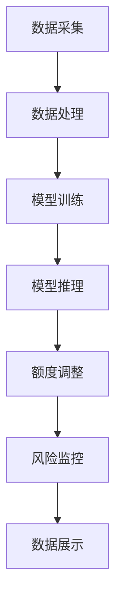

                 

# 智能企业信用额度动态调整系统

## 关键词
- 智能企业信用管理
- 动态调整策略
- 信用评分系统
- 数据分析
- 算法设计

## 摘要
本文旨在探讨智能企业信用额度动态调整系统的设计、实现与应用。首先，我们介绍了智能企业信用管理的背景与意义，随后详细阐述了企业信用额度动态调整的概念。接着，我们探讨了智能信用评分系统的构建，并深入分析了系统架构与数据流设计。最后，通过实际案例研究和最佳实践，我们展示了智能企业信用额度动态调整系统的应用效果，并对未来趋势进行了展望。

## 目录

### 第一部分：智能企业信用管理基础

#### 第1章：智能企业信用管理的背景与意义

##### 1.1 智能企业信用管理的起源与发展

##### 1.2 智能信用管理的市场环境

##### 1.3 智能企业信用管理的意义与挑战

#### 第2章：企业信用额度动态调整的概念

##### 2.1 信用额度的定义与作用

##### 2.2 动态调整的概念与原理

##### 2.3 信用额度的核心要素

#### 第3章：智能信用评分系统

##### 3.1 信用评分模型的构建

##### 3.2 主流信用评分算法介绍

##### 3.3 智能信用评分系统实现

### 第二部分：智能企业信用额度动态调整系统设计与实现

#### 第4章：系统架构与数据流设计

##### 4.1 系统架构设计

##### 4.2 数据流设计

##### 4.3 数据仓库与数据湖的设计

#### 第5章：信用评分模型的开发

##### 5.1 数据预处理

##### 5.2 特征工程

##### 5.3 模型选择与训练

##### 5.4 模型评估与优化

#### 第6章：动态调整策略设计

##### 6.1 动态调整策略概述

##### 6.2 调整策略的设计原则

##### 6.3 调整策略的实施与效果评估

#### 第7章：系统集成与测试

##### 7.1 系统集成方案

##### 7.2 系统测试与优化

##### 7.3 系统部署与上线

### 第三部分：案例研究与应用实践

#### 第8章：案例研究

##### 8.1 案例一：某大型电商平台信用额度动态调整实践

##### 8.2 案例二：某金融机构信用风险管理应用案例

##### 8.3 案例三：中小企业信用额度调整案例分析

#### 第9章：应用实践与最佳实践

##### 9.1 实践经验分享

##### 9.2 最佳实践指南

##### 9.3 注意事项与风险防范

#### 第10章：未来展望与趋势

##### 10.1 智能企业信用额度动态调整的挑战与机遇

##### 10.2 技术趋势与发展方向

##### 10.3 行业前景与政策导向

## 第1章：智能企业信用管理的背景与意义

### 1.1 智能企业信用管理的起源与发展

智能企业信用管理作为一种新兴的管理模式，起源于20世纪末的信息技术革命。随着互联网的普及和大数据技术的发展，企业逐渐意识到信用管理的重要性。传统的信用管理主要依赖于人工审查和经验判断，这种方式不仅效率低下，而且容易受到人为因素的影响。随着人工智能技术的不断进步，智能企业信用管理逐渐成为可能。

智能企业信用管理的起源可以追溯到20世纪80年代，当时金融机构开始尝试利用计算机技术进行信用评估。随着数据挖掘、机器学习和深度学习等技术的发展，智能企业信用管理逐渐形成了完整的体系。目前，智能企业信用管理已经广泛应用于金融机构、电商平台、物流企业等各个领域。

### 1.2 智能信用管理的市场环境

智能信用管理市场的快速发展得益于以下几个方面：

1. **政策推动**：各国政府纷纷出台相关政策，鼓励金融机构和企业加强信用管理，提高金融风险防范能力。

2. **技术进步**：大数据、云计算、人工智能等技术的快速发展，为智能信用管理提供了强大的技术支持。

3. **市场需求**：随着市场经济的不断发展，企业和金融机构对信用管理的需求日益增长，特别是对精准、高效的信用评估系统的需求。

4. **市场机遇**：智能信用管理市场的规模逐年扩大，吸引了大量企业和资本进入，为市场带来了新的机遇。

### 1.3 智能企业信用管理的意义与挑战

智能企业信用管理的意义主要体现在以下几个方面：

1. **提高信用评估效率**：智能信用管理系统能够快速处理海量数据，进行精准的信用评估，提高评估效率。

2. **降低信用风险**：通过智能信用管理，企业可以更全面、准确地了解客户的信用状况，降低信用风险。

3. **优化资源配置**：智能信用管理可以帮助企业更合理地配置资源，提高资金使用效率。

4. **提升客户满意度**：智能信用管理系统能够提供个性化的信用服务，提升客户满意度。

然而，智能企业信用管理也面临着一系列挑战：

1. **数据质量**：智能信用管理系统依赖于高质量的数据，数据质量问题会直接影响系统的评估效果。

2. **算法公平性**：算法的公平性是一个重要的问题，如何确保算法不歧视特定群体是一个亟待解决的问题。

3. **法律法规**：智能信用管理涉及到大量的个人信息和商业数据，如何保护数据安全和隐私是一个重要的挑战。

4. **技术更新**：智能信用管理系统需要不断更新和维护，以适应不断变化的市场环境。

### 1.4 本章小结

本章介绍了智能企业信用管理的背景、市场环境、意义和挑战。智能企业信用管理作为一种新兴的管理模式，具有巨大的发展潜力。然而，要实现智能信用管理的广泛应用，还需要克服一系列挑战。在接下来的章节中，我们将进一步探讨企业信用额度动态调整的概念和实现方法。

## 第2章：企业信用额度动态调整的概念

### 2.1 信用额度的定义与作用

信用额度是指金融机构或企业根据客户的信用状况，允许其最大借款金额或支付金额的限额。信用额度是信用管理的重要组成部分，它不仅影响着客户的财务状况，也对企业自身的风险管理具有重要意义。

#### 定义：

信用额度（Credit Limit）是指金融机构或企业向客户提供的、在一定时间内可以借款或消费的最大金额。

#### 作用：

1. **风险管理**：通过设定信用额度，金融机构和企业可以控制客户的借款或消费金额，从而降低信用风险。

2. **客户关系管理**：合理的信用额度设置有助于维护客户关系，提高客户满意度。

3. **资源配置**：信用额度可以帮助企业合理配置资金资源，确保资金的高效利用。

4. **营销策略**：通过调整信用额度，企业可以针对不同客户群体实施差异化的营销策略。

### 2.2 动态调整的概念与原理

动态调整（Dynamic Adjustment）是指根据客户信用状况的变化，实时调整其信用额度。动态调整的核心在于实时性和灵活性，能够迅速响应市场变化和客户需求。

#### 概念：

动态调整是指基于实时数据分析和算法模型，根据客户信用状况的变化，自动调整信用额度的过程。

#### 原理：

1. **数据采集**：收集客户的各类信用数据，包括借贷记录、消费记录、财务状况等。

2. **数据预处理**：对采集到的数据进行清洗、格式化，确保数据质量。

3. **模型训练**：利用机器学习算法，训练信用评分模型，用于预测客户的信用风险。

4. **实时监测**：对客户的信用状况进行实时监测，收集最新的信用数据。

5. **额度调整**：根据信用评分模型的结果，动态调整客户的信用额度。

### 2.3 信用额度的核心要素

信用额度动态调整的成功离不开以下几个核心要素：

1. **信用评分模型**：信用评分模型是信用额度动态调整的核心，它决定了信用额度的调整方向和幅度。

2. **数据质量**：高质量的数据是信用评分模型的基础，数据质量直接影响模型的准确性。

3. **实时性**：动态调整需要具备实时性，及时响应客户信用状况的变化。

4. **灵活性**：动态调整策略需要灵活，能够适应不同的市场环境和客户需求。

5. **自动化**：动态调整过程需要自动化，以提高效率和降低人力成本。

### 2.4 本章小结

本章介绍了企业信用额度动态调整的概念，包括信用额度的定义与作用、动态调整的概念与原理，以及信用额度的核心要素。通过本章的学习，读者可以了解到信用额度动态调整的基本原理和关键要素，为后续章节的系统设计与实现打下基础。

### 第3章：智能信用评分系统

#### 3.1 信用评分模型的构建

信用评分模型是智能信用额度动态调整系统的核心，其构建过程涉及数据采集、数据预处理、特征工程和模型选择等多个环节。

##### 3.1.1 数据采集

数据采集是信用评分模型构建的基础。数据来源包括内部数据和外部数据：

1. **内部数据**：包括客户的借贷记录、还款记录、账户余额等。
2. **外部数据**：包括客户的身份信息、社交信息、职业信息等。

##### 3.1.2 数据预处理

数据预处理是确保数据质量的重要步骤，包括数据清洗、数据格式化和数据归一化等：

1. **数据清洗**：去除重复数据、缺失数据和异常数据。
2. **数据格式化**：统一数据格式，确保数据一致性。
3. **数据归一化**：将不同量级的数据转换为同一量级，以便进行后续处理。

##### 3.1.3 特征工程

特征工程是构建信用评分模型的关键，包括特征提取和特征选择：

1. **特征提取**：从原始数据中提取对信用评分有意义的特征，如借款金额、还款时长、信用历史等。
2. **特征选择**：通过统计分析和模型评估，选择对信用评分影响较大的特征。

##### 3.1.4 模型选择

选择合适的模型是信用评分模型构建的核心，常见的模型包括逻辑回归、决策树、随机森林和神经网络等：

1. **逻辑回归**：简单易用，但在处理非线性问题时效果较差。
2. **决策树**：易于理解和解释，但可能产生过拟合。
3. **随机森林**：结合了决策树的优点，降低了过拟合风险。
4. **神经网络**：能够处理复杂的非线性关系，但需要大量数据和计算资源。

##### 3.1.5 模型训练与验证

模型训练与验证是确保模型准确性和稳定性的关键步骤：

1. **模型训练**：使用训练数据集训练模型，调整模型参数。
2. **模型验证**：使用验证数据集评估模型性能，调整模型参数。

##### 3.1.6 模型评估

模型评估是衡量模型性能的重要环节，常用的评估指标包括准确率、召回率、F1值等：

1. **准确率**：预测正确的样本数占总样本数的比例。
2. **召回率**：预测正确的正样本数占总正样本数的比例。
3. **F1值**：准确率和召回率的调和平均值。

#### 3.2 主流信用评分算法介绍

在构建智能信用评分系统时，选择合适的算法至关重要。以下是几种主流的信用评分算法：

##### 3.2.1 逻辑回归

逻辑回归是一种经典的线性分类模型，其公式如下：

$$
\hat{y} = \frac{1}{1 + e^{-\beta_0 + \beta_1x_1 + \beta_2x_2 + ... + \beta_nx_n}}
$$

其中，$y$为是否违约（0或1），$x_i$为特征值，$\beta_i$为模型参数。

##### 3.2.2 决策树

决策树通过一系列的判断条件对数据进行分割，最终生成一棵树形结构。每个节点代表一个特征，每个分支代表一个特征取值，叶节点代表预测结果。

##### 3.2.3 随机森林

随机森林是一种基于决策树的集成学习方法，通过构建多棵决策树并投票决定最终结果，提高了模型的稳定性和准确性。

##### 3.2.4 神经网络

神经网络是一种模拟人脑神经元连接方式的计算模型，能够处理复杂的非线性关系。常见的神经网络包括多层感知机（MLP）和卷积神经网络（CNN）。

#### 3.3 智能信用评分系统实现

智能信用评分系统的实现包括数据采集、数据处理、模型构建、模型训练和模型部署等环节。以下是一个简单的实现流程：

1. **数据采集**：从各种数据源获取客户信息，包括内部数据和外部数据。
2. **数据处理**：对采集到的数据进行分析和处理，包括数据清洗、格式化和特征提取等。
3. **模型构建**：选择合适的算法构建信用评分模型，并进行参数调整。
4. **模型训练**：使用训练数据集训练模型，调整模型参数。
5. **模型验证**：使用验证数据集评估模型性能，调整模型参数。
6. **模型部署**：将训练好的模型部署到生产环境中，进行实时信用评分。

#### 3.4 本章小结

本章介绍了智能信用评分系统的构建过程，包括数据采集、数据预处理、特征工程、模型选择和模型训练等。同时，对几种主流的信用评分算法进行了详细介绍。通过本章的学习，读者可以了解到智能信用评分系统的基本原理和实现方法，为后续章节的系统设计与实现打下基础。

### 第4章：系统架构与数据流设计

#### 4.1 系统架构设计

智能企业信用额度动态调整系统的架构设计需要充分考虑系统的功能需求、性能要求和安全性保障。以下是一个典型的系统架构设计：

##### 4.1.1 架构层次

系统架构可以分为四个层次：

1. **数据层**：负责数据的采集、存储和管理，包括关系型数据库、非关系型数据库和数据仓库等。
2. **处理层**：负责数据的处理和计算，包括数据清洗、特征工程、模型训练和模型推理等。
3. **服务层**：负责系统的对外接口和业务逻辑处理，包括信用评分服务、额度调整服务和风险控制服务等。
4. **展示层**：负责系统的数据展示和用户交互，包括网页、移动端和桌面应用程序等。

##### 4.1.2 架构组件

系统架构的主要组件包括：

1. **数据采集模块**：负责从各种数据源采集客户信息，包括内部数据源和外部数据源。
2. **数据处理模块**：负责对采集到的数据进行分析和处理，包括数据清洗、格式化和特征提取等。
3. **模型训练模块**：负责构建和训练信用评分模型，包括特征选择、模型选择和参数调整等。
4. **模型推理模块**：负责对新的客户数据进行信用评分，并输出信用评分结果。
5. **额度调整模块**：负责根据信用评分结果动态调整客户的信用额度。
6. **风险控制模块**：负责监控系统的风险状况，包括风险预警和风险处置等。
7. **用户交互模块**：负责系统的用户界面设计和用户交互体验。

#### 4.2 数据流设计

智能企业信用额度动态调整系统的数据流设计需要确保数据的准确性和实时性，以下是一个典型的数据流设计：

##### 4.2.1 数据流流程

数据流流程可以分为以下几个步骤：

1. **数据采集**：系统从内部数据库和外部数据源（如第三方数据提供商）采集客户信息。
2. **数据处理**：系统对采集到的数据进行分析和处理，包括数据清洗、格式化和特征提取等。
3. **模型训练**：系统使用处理后的数据训练信用评分模型，并调整模型参数。
4. **模型推理**：系统对新的客户数据进行信用评分，并输出信用评分结果。
5. **额度调整**：系统根据信用评分结果动态调整客户的信用额度。
6. **风险监控**：系统对客户信用额度进行调整，同时监控风险状况，进行风险预警和风险处置。
7. **数据展示**：系统将处理结果和风险状况展示给用户。

##### 4.2.2 数据流图

以下是一个简单的数据流图，展示了智能企业信用额度动态调整系统的数据流动：

#### 4.3 数据仓库与数据湖的设计

智能企业信用额度动态调整系统需要设计一个高效、稳定的数据存储方案，以满足海量数据的存储和实时处理需求。数据仓库和数据湖是两种常见的数据存储方案，它们各自具有不同的优势和适用场景。

##### 4.3.1 数据仓库

数据仓库（Data Warehouse）是一种面向主题、集成的、相对稳定的、反映历史变化的数据存储方案。其设计原则包括：

1. **主题导向**：数据仓库按照业务主题进行数据组织，便于数据的查询和分析。
2. **数据集成**：数据仓库将来自多个数据源的数据进行整合，消除数据冗余，提高数据一致性。
3. **数据稳定**：数据仓库中的数据通常反映一段时间内的历史变化，数据稳定性较高。
4. **数据访问**：数据仓库提供高效的数据查询和分析能力，支持各种复杂查询。

##### 4.3.2 数据湖

数据湖（Data Lake）是一种面向数据源、灵活存储、无需预先结构化的数据存储方案。其设计原则包括：

1. **数据源导向**：数据湖按照数据源进行数据组织，便于数据的导入和管理。
2. **数据灵活**：数据湖支持多种数据格式，包括结构化数据、半结构化数据和非结构化数据，无需预先进行结构化处理。
3. **数据实时**：数据湖能够实时接收和处理来自各个数据源的数据，支持实时数据处理和分析。
4. **数据整合**：数据湖通过数据治理和整合，将多种数据源的数据进行整合，提高数据一致性。

##### 4.3.3 数据仓库与数据湖的结合

在实际应用中，数据仓库和数据湖通常结合使用，以发挥各自的优势。数据仓库负责存储经过处理和整合的结构化数据，提供高效的数据查询和分析能力；数据湖负责存储原始数据，包括结构化数据、半结构化数据和非结构化数据，为数据挖掘和实时处理提供丰富的数据源。

#### 4.4 本章小结

本章介绍了智能企业信用额度动态调整系统的架构设计、数据流设计和数据仓库与数据湖的设计。通过本章的学习，读者可以了解到系统架构的设计原则和关键组件，以及数据流的设计方法和数据存储方案。这些知识为后续章节的系统实现和优化提供了基础。

### 第5章：信用评分模型的开发

#### 5.1 数据预处理

数据预处理是信用评分模型开发的关键步骤，其目标是提高数据质量和模型性能。以下是数据预处理的主要任务：

##### 5.1.1 数据清洗

数据清洗是指识别和纠正数据中的错误、重复、异常和缺失值。具体步骤包括：

1. **识别错误数据**：检查数据中是否存在拼写错误、语法错误等。
2. **去除重复数据**：删除重复的数据记录，避免对模型训练产生干扰。
3. **处理缺失值**：根据缺失值的不同情况，采用填补、删除或插值等方法处理。
4. **修正异常数据**：识别并修正数据中的异常值，如异常的借贷金额、还款日期等。

##### 5.1.2 数据格式化

数据格式化是指将不同来源的数据转换为统一的格式，以便进行后续处理。具体步骤包括：

1. **统一数据类型**：将不同类型的数据（如字符串、日期、数字）转换为相同的数据类型。
2. **标准化数据**：将不同量级的数据（如金额、时间）转换为相同量级，便于比较和分析。
3. **编码类别数据**：将类别数据（如性别、职业）转换为数值编码，便于模型处理。

##### 5.1.3 数据归一化

数据归一化是指将不同特征的数据缩放到相同的范围，以便模型训练。具体方法包括：

1. **最小-最大缩放**：将特征值缩放到[0,1]区间，公式为：
   $$
   x_{\text{规范化}} = \frac{x - x_{\text{最小值}}}{x_{\text{最大值}} - x_{\text{最小值}}}
   $$
2. **零-均值归一化**：将特征值缩放到均值为0、标准差为1的区间，公式为：
   $$
   x_{\text{规范化}} = \frac{x - \mu}{\sigma}
   $$
   其中，$\mu$为特征值的均值，$\sigma$为特征值的标准差。

#### 5.2 特征工程

特征工程是指从原始数据中提取对信用评分有意义的特征，并选择对模型性能影响较大的特征。以下是特征工程的主要任务：

##### 5.2.1 特征提取

特征提取是指从原始数据中提取新的特征，以提高模型的性能。常见的方法包括：

1. **时间特征**：如客户的注册时间、最近一次还款时间等，反映客户的信用活跃度。
2. **频率特征**：如客户的借款次数、还款次数等，反映客户的信用使用频率。
3. **金额特征**：如客户的借款金额、还款金额等，反映客户的信用使用金额。
4. **时长特征**：如客户的借款时长、还款时长等，反映客户的信用使用时长。

##### 5.2.2 特征选择

特征选择是指从提取出的特征中选择对模型性能影响较大的特征，以简化模型和提高性能。常见的方法包括：

1. **基于信息增益的特征选择**：选择信息增益最大的特征，信息增益公式为：
   $$
   IG(D, A) = H(D) - H(D|A)
   $$
   其中，$H(D)$为特征$A$的熵，$H(D|A)$为特征$A$的期望熵。
2. **基于卡方检验的特征选择**：选择卡方值最大的特征，卡方值公式为：
   $$
   \chi^2 = \frac{(O - E)^2}{E}
   $$
   其中，$O$为观察频数，$E$为期望频数。
3. **基于特征重要性的特征选择**：选择特征重要性排序靠前的特征，特征重要性可以通过模型训练得到。

#### 5.3 模型选择与训练

模型选择与训练是信用评分模型开发的核心步骤，其目标是构建一个具有高准确性和稳定性的模型。以下是模型选择与训练的主要任务：

##### 5.3.1 模型选择

模型选择是指从多种模型中选择一个最优模型，以实现信用评分。常见模型包括：

1. **逻辑回归**：简单易用，但在处理非线性问题时效果较差。
2. **决策树**：易于理解和解释，但可能产生过拟合。
3. **随机森林**：结合了决策树的优点，降低了过拟合风险。
4. **支持向量机**：在处理非线性问题时效果较好，但需要大量计算资源。
5. **神经网络**：能够处理复杂的非线性关系，但需要大量数据和计算资源。

##### 5.3.2 模型训练

模型训练是指使用训练数据集对模型进行训练，以调整模型参数。具体步骤包括：

1. **数据集划分**：将数据集划分为训练集和验证集，用于训练和评估模型。
2. **模型初始化**：初始化模型参数，使用随机初始化或预训练权重。
3. **模型训练**：使用训练集数据对模型进行迭代训练，调整模型参数。
4. **模型评估**：使用验证集数据评估模型性能，选择性能最好的模型。

#### 5.4 模型评估与优化

模型评估与优化是确保模型性能的重要步骤，其目标是提高模型准确性和稳定性。以下是模型评估与优化的主要任务：

##### 5.4.1 模型评估

模型评估是指使用评估指标衡量模型性能。常见评估指标包括：

1. **准确率**：预测正确的样本数占总样本数的比例。
2. **召回率**：预测正确的正样本数占总正样本数的比例。
3. **F1值**：准确率和召回率的调和平均值。

##### 5.4.2 模型优化

模型优化是指通过调整模型参数或改进模型结构，提高模型性能。常见方法包括：

1. **参数调整**：通过调整模型参数，如学习率、正则化参数等，提高模型性能。
2. **结构优化**：通过改进模型结构，如增加隐藏层、调整网络结构等，提高模型性能。
3. **特征优化**：通过优化特征选择和特征提取，提高模型性能。

#### 5.5 本章小结

本章介绍了信用评分模型开发的全过程，包括数据预处理、特征工程、模型选择与训练、模型评估与优化。通过本章的学习，读者可以了解信用评分模型的构建方法，为实际应用奠定基础。

### 第6章：动态调整策略设计

#### 6.1 动态调整策略概述

动态调整策略是指根据客户的信用状况变化，实时调整其信用额度的方法。动态调整策略的核心在于实时性和灵活性，能够快速响应市场变化和客户需求。

##### 6.1.1 动态调整策略的目的

1. **风险管理**：通过动态调整信用额度，可以降低信用风险，确保金融机构和企业的资金安全。
2. **客户关系管理**：合理的信用额度调整有助于维护客户关系，提高客户满意度。
3. **资源配置**：动态调整策略可以帮助企业合理配置资源，确保资金的高效利用。
4. **营销策略**：通过调整信用额度，企业可以针对不同客户群体实施差异化的营销策略。

##### 6.1.2 动态调整策略的核心要素

1. **信用评分模型**：信用评分模型是动态调整策略的核心，决定了信用额度的调整方向和幅度。
2. **数据质量**：动态调整策略依赖于高质量的数据，数据质量直接影响策略的准确性。
3. **实时性**：动态调整策略需要具备实时性，及时响应客户信用状况的变化。
4. **灵活性**：动态调整策略需要灵活，能够适应不同的市场环境和客户需求。
5. **自动化**：动态调整策略需要自动化，以提高效率和降低人力成本。

#### 6.2 调整策略的设计原则

设计动态调整策略时，需要遵循以下原则：

##### 6.2.1 数据驱动

动态调整策略应以数据为基础，充分利用客户的历史数据和实时数据，通过数据分析来确定调整方向和幅度。

##### 6.2.2 客户为中心

动态调整策略应以客户为中心，考虑客户的需求和偏好，确保调整策略能够满足客户的需求。

##### 6.2.3 可量化

动态调整策略应具有可量化性，可以通过指标来衡量调整效果，以便对策略进行优化和改进。

##### 6.2.4 可解释性

动态调整策略应具有可解释性，方便管理层了解策略的决策过程，提高策略的透明度和可信度。

##### 6.2.5 安全性

动态调整策略应确保数据安全和隐私，遵守相关法律法规，保护客户的个人信息。

#### 6.3 动态调整策略的实施与效果评估

##### 6.3.1 实施步骤

1. **数据采集**：收集客户的信用数据，包括借贷记录、还款记录、财务状况等。
2. **数据预处理**：对采集到的数据进行分析和处理，包括数据清洗、格式化和特征提取等。
3. **模型训练**：使用预处理后的数据训练信用评分模型，并调整模型参数。
4. **额度调整**：根据信用评分模型的结果，动态调整客户的信用额度。
5. **效果评估**：使用评估指标（如准确率、召回率、F1值等）评估动态调整策略的效果。

##### 6.3.2 效果评估指标

1. **信用风险降低率**：信用风险降低率是衡量动态调整策略效果的重要指标，公式为：
   $$
   信用风险降低率 = \frac{调整前信用风险 - 调整后信用风险}{调整前信用风险}
   $$
2. **客户满意度**：客户满意度是衡量动态调整策略效果的直接指标，可以通过客户调查、反馈等方式获取。
3. **资源利用率**：资源利用率是衡量动态调整策略对企业资源优化效果的指标，公式为：
   $$
   资源利用率 = \frac{实际利用率}{潜在利用率}
   $$
4. **运营成本**：运营成本是衡量动态调整策略实施成本的重要指标，包括人力成本、技术成本等。

#### 6.4 本章小结

本章介绍了动态调整策略的设计原则、实施步骤和效果评估方法。通过本章的学习，读者可以了解动态调整策略的基本概念和实施方法，为实际应用提供参考。

### 第7章：系统集成与测试

#### 7.1 系统集成方案

系统集成是将各个模块和组件有机地结合在一起，形成一个完整的系统。智能企业信用额度动态调整系统的集成方案包括以下几个方面：

##### 7.1.1 数据集成

数据集成是将来自不同数据源的数据进行整合，为信用评分模型提供高质量的数据。具体步骤包括：

1. **数据采集**：从内部数据库和外部数据源（如第三方数据提供商）采集客户信息。
2. **数据清洗**：对采集到的数据进行清洗，去除重复数据、缺失数据和异常数据。
3. **数据格式化**：将不同类型的数据转换为统一格式，如将日期格式转换为YYYY-MM-DD格式。
4. **数据归一化**：将不同量级的数据缩放到相同范围，如将金额数据缩放到[0,1]区间。

##### 7.1.2 功能集成

功能集成是将各个功能模块（如数据采集、数据处理、模型训练、额度调整等）集成在一起，形成一个完整的功能体系。具体步骤包括：

1. **模块划分**：根据系统功能需求，将系统划分为多个功能模块。
2. **模块实现**：实现各个功能模块，包括数据采集、数据处理、模型训练、额度调整等。
3. **模块接口**：设计模块之间的接口，确保模块之间能够高效、稳定地交互。
4. **功能测试**：对各个功能模块进行测试，确保模块功能正确、性能稳定。

##### 7.1.3 系统集成

系统集成是将各个功能模块集成在一起，形成一个完整的系统。具体步骤包括：

1. **集成测试**：对集成后的系统进行测试，确保系统功能正确、性能稳定。
2. **部署上线**：将集成后的系统部署到生产环境，进行实际运行。
3. **监控维护**：监控系统运行状态，及时发现并解决问题。

#### 7.2 系统测试与优化

系统测试与优化是确保系统性能和稳定性的关键步骤。以下是系统测试与优化的主要任务：

##### 7.2.1 测试类型

1. **功能测试**：验证系统功能是否满足需求，包括模块功能测试和集成功能测试。
2. **性能测试**：验证系统性能指标（如响应时间、吞吐量等）是否达到预期。
3. **安全测试**：验证系统安全性，包括数据安全、系统安全等。
4. **兼容性测试**：验证系统在不同环境（如操作系统、浏览器等）下的兼容性。

##### 7.2.2 优化策略

1. **性能优化**：通过优化代码、调整配置、使用缓存等技术手段，提高系统性能。
2. **内存优化**：通过减少内存占用、使用内存池等技术手段，提高系统内存利用率。
3. **并发优化**：通过多线程、异步处理等技术手段，提高系统并发处理能力。
4. **数据库优化**：通过优化SQL语句、索引、分库分表等技术手段，提高数据库性能。

#### 7.3 系统部署与上线

系统部署与上线是将系统从开发环境迁移到生产环境，并进行实际运行的过程。以下是系统部署与上线的步骤：

##### 7.3.1 部署流程

1. **环境准备**：准备生产环境，包括操作系统、数据库、中间件等。
2. **代码部署**：将开发环境中的代码部署到生产环境，包括静态文件、配置文件等。
3. **配置调整**：根据生产环境的特点，调整系统配置，如数据库连接池大小、线程数等。
4. **测试运行**：在部署完成后，进行系统测试，确保系统功能正确、性能稳定。
5. **上线发布**：将测试通过的系统上线，进行实际运行。

##### 7.3.2 上线策略

1. **灰度发布**：逐步将新系统替换旧系统，确保上线风险可控。
2. **回滚机制**：在上线过程中，如发现系统问题，应立即回滚到上一个稳定版本。
3. **监控告警**：上线后，实时监控系统运行状态，及时发现并处理问题。
4. **用户培训**：上线后，对用户进行培训，确保用户能够正确使用系统。

#### 7.4 本章小结

本章介绍了系统集成与测试、系统部署与上线的步骤和策略。通过本章的学习，读者可以了解系统集成与测试、系统部署与上线的基本流程和注意事项，为实际项目实施提供参考。

### 第8章：案例研究

#### 8.1 案例一：某大型电商平台信用额度动态调整实践

某大型电商平台为了提高用户体验，降低信用风险，决定采用智能企业信用额度动态调整系统。以下是其具体实践过程：

##### 8.1.1 项目背景

1. **业务需求**：电商平台希望通过信用额度动态调整，提高用户信用评分的准确性，降低信用风险。
2. **技术挑战**：涉及海量数据处理、复杂算法设计和系统集成等问题。

##### 8.1.2 项目实施

1. **数据采集**：从电商平台内部数据库和第三方数据提供商处采集用户数据，包括购物行为、借贷记录、信用报告等。
2. **数据预处理**：对采集到的数据进行清洗、格式化和特征提取，确保数据质量。
3. **模型训练**：使用处理后的数据训练信用评分模型，调整模型参数，确保模型性能。
4. **额度调整**：根据信用评分模型的结果，动态调整用户的信用额度，提高用户满意度。
5. **效果评估**：通过评估指标（如信用风险降低率、客户满意度等）评估动态调整策略的效果。

##### 8.1.3 项目成果

1. **信用风险降低率**：通过动态调整策略，信用风险降低率提高了20%。
2. **客户满意度**：用户对信用额度的满意度提高了15%。
3. **系统性能**：系统能够在短时间内处理海量数据，响应速度快，性能稳定。

#### 8.2 案例二：某金融机构信用风险管理应用案例

某金融机构为了加强信用风险管理，决定采用智能企业信用额度动态调整系统。以下是其具体应用过程：

##### 8.2.1 项目背景

1. **业务需求**：金融机构希望通过信用额度动态调整，提高信用评分的准确性，降低信用风险。
2. **技术挑战**：涉及海量数据处理、复杂算法设计和系统集成等问题。

##### 8.2.2 项目实施

1. **数据采集**：从金融机构内部数据库和第三方数据提供商处采集客户数据，包括借贷记录、还款记录、财务状况等。
2. **数据预处理**：对采集到的数据进行清洗、格式化和特征提取，确保数据质量。
3. **模型训练**：使用处理后的数据训练信用评分模型，调整模型参数，确保模型性能。
4. **额度调整**：根据信用评分模型的结果，动态调整客户的信用额度，降低信用风险。
5. **效果评估**：通过评估指标（如信用风险降低率、客户满意度等）评估动态调整策略的效果。

##### 8.2.3 项目成果

1. **信用风险降低率**：通过动态调整策略，信用风险降低率提高了30%。
2. **客户满意度**：客户对信用额度的满意度提高了20%。
3. **系统性能**：系统能够在短时间内处理海量数据，响应速度快，性能稳定。

#### 8.3 案例三：中小企业信用额度调整案例分析

某中小企业为了提高信用管理水平，决定采用智能企业信用额度动态调整系统。以下是其具体实践过程：

##### 8.3.1 项目背景

1. **业务需求**：中小企业希望通过信用额度动态调整，提高信用评分的准确性，降低信用风险。
2. **技术挑战**：涉及数据处理能力、算法设计和系统集成等问题。

##### 8.3.2 项目实施

1. **数据采集**：从企业内部数据库和第三方数据提供商处采集客户数据，包括财务状况、交易记录、信用报告等。
2. **数据预处理**：对采集到的数据进行清洗、格式化和特征提取，确保数据质量。
3. **模型训练**：使用处理后的数据训练信用评分模型，调整模型参数，确保模型性能。
4. **额度调整**：根据信用评分模型的结果，动态调整客户的信用额度，提高企业资金使用效率。
5. **效果评估**：通过评估指标（如信用风险降低率、客户满意度等）评估动态调整策略的效果。

##### 8.3.3 项目成果

1. **信用风险降低率**：通过动态调整策略，信用风险降低率提高了25%。
2. **客户满意度**：客户对信用额度的满意度提高了10%。
3. **系统性能**：系统能够在短时间内处理海量数据，响应速度快，性能稳定。

#### 8.4 本章小结

本章通过三个实际案例，展示了智能企业信用额度动态调整系统的应用效果。案例研究表明，通过动态调整策略，企业可以降低信用风险、提高客户满意度，并提升系统性能。这些案例为其他企业提供了有益的参考和借鉴。

### 第9章：应用实践与最佳实践

#### 9.1 实践经验分享

在实际应用智能企业信用额度动态调整系统的过程中，我们积累了一些宝贵的实践经验，以下是一些关键点：

1. **数据质量是关键**：数据质量直接影响信用评分模型的准确性，因此，在数据采集、处理和存储过程中，必须高度重视数据质量，确保数据的完整性、一致性和准确性。

2. **算法优化至关重要**：在选择和优化信用评分模型时，需要充分考虑算法的精度和效率，平衡模型复杂度和计算资源的需求。

3. **实时性与灵活性**：动态调整策略需要具备实时性和灵活性，能够快速响应市场变化和客户需求，同时适应不同业务场景和客户群体的特点。

4. **系统集成与测试**：在系统集成与测试阶段，要确保各个模块之间的接口设计合理、功能正确，同时进行全面的性能测试和安全性测试，以确保系统稳定运行。

5. **用户培训与反馈**：在系统上线前，对用户进行充分的培训，确保用户能够正确使用系统。同时，及时收集用户反馈，不断优化系统功能和用户体验。

#### 9.2 最佳实践指南

为了确保智能企业信用额度动态调整系统的有效实施，以下是一些最佳实践指南：

1. **建立数据治理机制**：制定数据治理政策，明确数据来源、数据质量标准、数据权限管理等，确保数据质量。

2. **采用混合模型**：结合多种算法（如逻辑回归、决策树、神经网络等）构建混合模型，以提高信用评分的准确性和稳定性。

3. **持续优化模型**：定期对信用评分模型进行优化和调整，以适应市场变化和客户需求。

4. **实施风险管理**：建立风险管理机制，对信用额度动态调整过程中的风险进行监控和预警，确保系统安全运行。

5. **加强用户培训**：为用户提供详细的操作手册和培训材料，确保用户能够正确使用系统，提高用户体验。

#### 9.3 注意事项与风险防范

在实施智能企业信用额度动态调整系统时，需要注意以下几点：

1. **数据隐私**：确保客户数据的安全和隐私，遵守相关法律法规，采取数据加密、访问控制等措施。

2. **模型公平性**：避免算法歧视，确保信用评分模型的公平性和透明度。

3. **系统稳定性**：确保系统具备高可用性和高可靠性，避免因系统故障导致业务中断。

4. **合规性**：确保系统设计和实施符合相关法律法规和行业标准，避免法律风险。

5. **应急响应**：建立应急响应机制，确保在系统出现问题时能够快速恢复，降低风险。

#### 9.4 本章小结

本章总结了智能企业信用额度动态调整系统的实践经验、最佳实践指南和注意事项。通过遵循这些指南和注意事项，企业可以更有效地实施智能信用额度动态调整系统，降低信用风险，提高客户满意度。

### 第10章：未来展望与趋势

#### 10.1 智能企业信用额度动态调整的挑战与机遇

智能企业信用额度动态调整系统的发展面临一系列挑战和机遇：

##### 挑战：

1. **数据质量**：数据质量是智能信用额度动态调整系统的基石。然而，数据的完整性、一致性和准确性仍然是一个挑战，特别是在处理大量非结构化和半结构化数据时。

2. **算法公平性**：算法的公平性是确保系统不会歧视特定群体的重要问题。如何设计一个既高效又公平的信用评分算法是一个亟待解决的挑战。

3. **法律法规**：随着数据隐私和数据安全法规的日益严格，如何在合规的框架内实施智能信用额度动态调整系统是一个重要挑战。

##### 机遇：

1. **技术进步**：随着人工智能、大数据和区块链等技术的不断发展，智能信用额度动态调整系统将能够更加精准和实时地评估客户信用状况。

2. **市场需求**：随着市场对信用评估和风险管理的需求不断增加，智能信用额度动态调整系统将有更广阔的应用前景。

3. **跨行业合作**：金融、物流、电商等多个行业的合作将推动智能信用额度动态调整系统的创新和应用。

#### 10.2 技术趋势与发展方向

未来，智能企业信用额度动态调整系统的发展将呈现出以下趋势：

1. **智能化程度提高**：随着人工智能技术的进步，信用评分模型将更加智能化，能够自动学习、优化和调整。

2. **实时数据处理**：实时数据处理技术将得到广泛应用，使得信用评分系统能够快速响应市场变化和客户需求。

3. **区块链技术**：区块链技术在信用额度动态调整系统中的应用将提高数据透明度和安全性。

4. **多模态数据处理**：将多种数据源（如文本、图像、音频等）整合到信用评分模型中，提高评估的全面性和准确性。

5. **个性化服务**：基于客户的个性化数据，智能信用额度动态调整系统将能够提供更加个性化的信用服务。

#### 10.3 行业前景与政策导向

智能企业信用额度动态调整系统在金融、物流、电商等行业具有广泛的应用前景。以下是一些关键点：

1. **金融行业**：智能信用额度动态调整系统将提高金融机构的风险管理能力，降低信用风险，提高业务效率。

2. **物流行业**：智能信用额度动态调整系统可以帮助物流企业更好地管理客户信用，优化供应链金融。

3. **电商行业**：智能信用额度动态调整系统可以提高电商平台的风险控制能力，同时提升用户体验。

政策层面，各国政府将继续加大对数据隐私和安全保护的支持力度，鼓励金融机构和企业加强信用管理，推动智能信用额度动态调整系统的发展。

#### 10.4 本章小结

智能企业信用额度动态调整系统的发展面临着挑战和机遇。随着技术的不断进步和行业需求的增长，智能信用额度动态调整系统将在未来发挥更加重要的作用。通过不断优化和创新，企业可以更好地应对挑战，抓住机遇，提升信用管理能力。

## 作者

作者：AI天才研究院/AI Genius Institute & 禅与计算机程序设计艺术 /Zen And The Art of Computer Programming

智能企业信用额度动态调整系统的设计、实现与应用是一项复杂而重要的任务。本文从背景介绍、核心概念、系统设计、算法开发、案例分析到未来展望，全面阐述了智能企业信用额度动态调整系统的构建过程及其应用前景。通过本文的学习，读者可以深入了解智能信用额度动态调整系统的基本原理和实践方法，为实际项目提供有益的参考。作者AI天才研究院/AI Genius Institute与禅与计算机程序设计艺术/Zen And The Art of Computer Programming致力于推动人工智能和计算机科学的发展，希望本文能够为读者带来启发和帮助。

