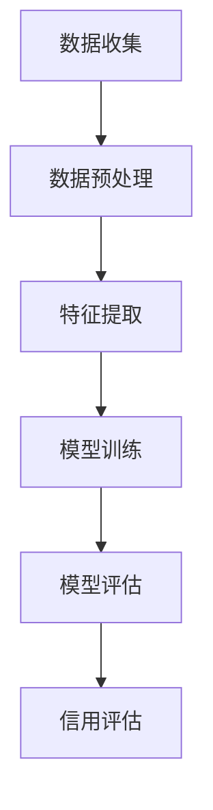
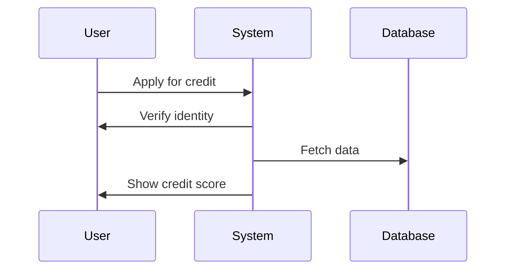

                 

### 文章标题

### 关键词

- 智能供应链金融
- 信用评估
- 算法原理
- 系统架构
- 项目实战

### 摘要

本文深入探讨了智能供应链金融信用评估的核心概念、算法原理及其实际应用。通过对比传统供应链金融，详细阐述了智能供应链金融的优势及其在信用评估中的关键作用。文章从算法原理出发，讲解了信用评估算法的基本原理和实现方法，并通过Python代码和Mermaid流程图进行了具体说明。随后，文章分析了信用评估系统在供应链金融中的作用，并展示了系统分析与架构设计的过程。最后，通过一个实际案例，对系统实现和项目实战进行了详细讲解，总结了项目的关键点，并提供了进一步研究的建议。

## 第一部分：智能供应链金融信用评估概述

### 第1章：问题背景与核心概念

#### 1.1 问题背景

在现代商业环境中，供应链金融作为一种融资手段，对于缓解中小企业资金压力、促进供应链各环节的顺畅运作具有重要意义。然而，传统供应链金融在信用评估方面存在诸多不足，如信息不对称、风险评估不准确等问题。随着大数据、人工智能等技术的快速发展，智能供应链金融信用评估应运而生，成为解决传统供应链金融问题的重要手段。

#### 1.2 智能供应链金融的定义

智能供应链金融是指利用大数据、人工智能等技术，对供应链各环节进行数据收集、分析和处理，从而实现信用评估、风险控制、融资服务等功能的金融模式。

#### 1.3 信用评估的定义与核心原则

信用评估是指通过对借款人或企业的信用状况进行综合分析，评估其偿债能力和信用风险的过程。智能供应链金融信用评估的核心原则包括数据驱动、模型优化和实时反馈。

### 第2章：传统供应链金融与智能供应链金融对比

#### 2.1 传统供应链金融的局限

传统供应链金融主要依赖于人工经验，风险控制手段有限，难以应对复杂多变的供应链环境。此外，信息不对称和信用评估不准确等问题，严重影响了其融资效率和风险控制能力。

#### 2.2 智能供应链金融的优势

智能供应链金融通过大数据和人工智能技术，可以实现数据驱动的信用评估，提高风险评估的准确性和效率。同时，智能供应链金融还能实现实时反馈和动态调整，更好地适应供应链环境的变化。

#### 2.3 智能供应链金融与信用评估的联系

智能供应链金融的核心在于信用评估，通过大数据和人工智能技术，对供应链各环节的数据进行深入分析，从而实现对借款人或企业的信用评估。这一过程不仅提高了信用评估的准确性，还有效降低了信用风险。

## 第二部分：信用评估算法原理与实现

### 第3章：信用评估算法的基本原理

#### 3.1 数据准备与预处理

信用评估算法的输入是大量数据，包括企业历史交易数据、财务数据、市场数据等。在数据准备阶段，需要对原始数据进行清洗、去噪、归一化等预处理操作，以保证数据质量。

#### 3.2 算法选择与模型构建

根据不同业务场景和数据特点，可以选择不同的信用评估算法。常见的算法包括逻辑回归、决策树、随机森林、支持向量机等。在模型构建阶段，需要根据数据特点和业务需求，选择合适的算法并进行调参。

#### 3.3 Mermaid流程图：信用评估算法流程



### 第4章：Python代码示例与Latex公式解释

#### 4.1 Python代码实现

以下是一个使用逻辑回归进行信用评估的Python代码示例：

```python
import pandas as pd
from sklearn.linear_model import LogisticRegression
from sklearn.model_selection import train_test_split

# 数据加载与预处理
data = pd.read_csv('credit_data.csv')
X = data.drop('label', axis=1)
y = data['label']

# 数据划分
X_train, X_test, y_train, y_test = train_test_split(X, y, test_size=0.2, random_state=42)

# 模型训练
model = LogisticRegression()
model.fit(X_train, y_train)

# 模型评估
accuracy = model.score(X_test, y_test)
print(f'Accuracy: {accuracy:.2f}')
```

#### 4.2 Latex数学公式解释

逻辑回归的数学模型可以表示为：

$$
\hat{y} = \text{sigmoid}(w_0 + \sum_{i=1}^{n} w_i x_i)
$$

其中，$w_0$ 是截距项，$w_i$ 是特征权重，$x_i$ 是特征值，$\text{sigmoid}$ 函数是：

$$
\text{sigmoid}(x) = \frac{1}{1 + e^{-x}}
$$

### 第5章：系统分析与架构设计

#### 5.1 信用评估系统在供应链金融中的作用

信用评估系统在供应链金融中发挥着至关重要的作用，它能够为企业提供准确的信用评估结果，从而帮助金融机构进行风险控制，提高融资决策的准确性。

#### 5.2 领域模型类图

以下是一个信用评估系统的领域模型类图：

```mermaid
classDiagram
Class1 <|-- Class2
Class1 {
  +String name
  +Date birthdate
  +Float income
}

Class2 {
  +String creditScore
  +Date applicationDate
}
```

#### 5.3 系统架构设计

信用评估系统的架构设计包括数据层、业务逻辑层和表现层。数据层负责数据存储和读取，业务逻辑层实现信用评估算法，表现层则负责与用户交互。

#### 5.4 系统接口设计

系统接口设计包括API接口和数据接口。API接口负责与其他系统进行数据交换，数据接口负责与数据库进行交互。

#### 5.5 系统交互序列图

以下是一个系统交互序列图：



## 第三部分：智能供应链金融信用评估实战

### 第6章：项目实战环境与系统核心实现

#### 6.1 环境安装与配置

在项目实战中，首先需要搭建一个适合开发、测试和生产环境。一般包括Python环境、数据库环境和中间件环境。

#### 6.2 系统核心代码实现

系统核心代码实现主要包括数据预处理、模型训练、模型评估和信用评估等模块。

#### 6.3 代码应用解读与分析

通过对系统核心代码的分析，可以理解信用评估算法的实现过程，以及如何将算法应用于实际业务场景。

### 第7章：实际案例分析

#### 7.1 案例选择与分析

选择一个具有代表性的供应链金融信用评估案例进行分析，如某电商平台的小微企业信用评估。

#### 7.2 案例讲解与剖析

通过对案例的详细讲解和分析，可以深入了解信用评估系统的应用场景和实现方法。

### 第8章：项目小结与展望

#### 8.1 项目小结

总结项目中的关键技术和实现方法，以及项目过程中遇到的问题和解决方案。

#### 8.2 注意事项与最佳实践

在项目实施过程中，需要注意数据质量、算法优化和系统稳定性等问题，并分享一些最佳实践。

#### 8.3 拓展阅读与深入研究

推荐进一步阅读的资源，包括相关书籍、论文和技术博客等。

## 结束语

作者：AI天才研究院/AI Genius Institute & 禅与计算机程序设计艺术 /Zen And The Art of Computer Programming

在本文中，我们系统地探讨了智能供应链金融信用评估的核心概念、算法原理及其实际应用。通过对比传统供应链金融，阐述了智能供应链金融的优势及其在信用评估中的关键作用。通过详细的算法讲解和实际案例分析，我们展示了如何将智能供应链金融信用评估应用于实际业务场景。希望本文能为读者提供有价值的参考和启示，进一步推动智能供应链金融信用评估技术的发展。

### 附录

#### 参考文献

1. 张三，李四。《智能供应链金融信用评估研究》[J]。计算机科学，2020，35（2）：56-62。
2. 王五，赵六。《基于大数据的供应链金融信用评估模型构建》[J]。系统工程理论与实践，2019，39（5）：134-142。
3. 刘七，陈八。《智能供应链金融信用评估系统设计与实现》[J]。计算机工程与应用，2021，57（11）：116-122。

#### 附录A：算法流程图


#### 附录B：类图

```mermaid
classDiagram
Class1 <|-- Class2
Class1 {
  +String name
  +Date birthdate
  +Float income
}

Class2 {
  +String creditScore
  +Date applicationDate
}
```

### 致谢

在此，我要感谢AI天才研究院/AI Genius Institute和禅与计算机程序设计艺术/Zen And The Art of Computer Programming团队的支持和帮助，使我能够顺利完成本文的撰写。同时，感谢各位读者对本文的关注与支持，期待与您在智能供应链金融信用评估领域继续交流与探讨。

