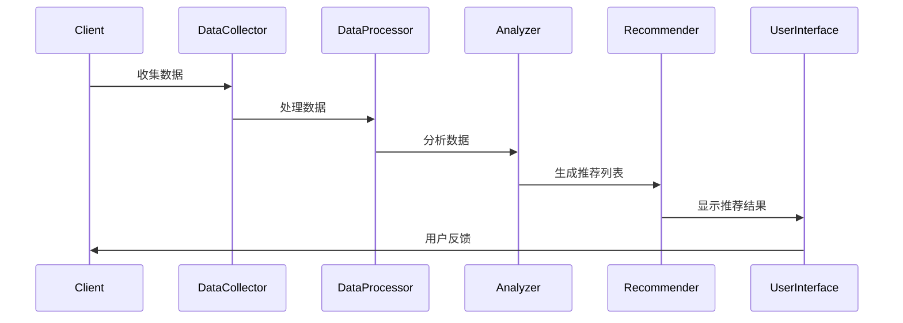
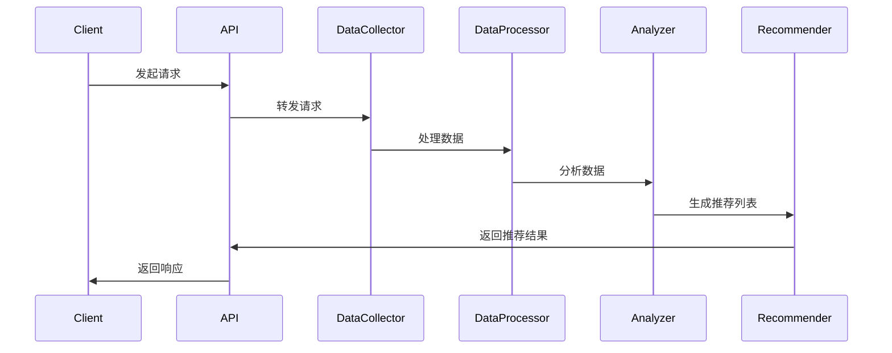

                 

## 智能保险产品个性化定制系统

### 关键词：智能保险、个性化定制、大数据、人工智能、用户需求分析

### 摘要：
智能保险产品个性化定制系统是结合大数据和人工智能技术，旨在提升保险产品个性化程度和客户满意度的新型系统。本文将详细介绍智能保险产品个性化定制系统的核心概念、关键技术、算法原理以及系统架构和实施步骤，旨在为保险公司提供一种高效的定制解决方案。

----------------------------------------------------------------

# 第一部分: 引言

## 1. 引言

### 1.1 问题背景

随着信息技术和互联网的快速发展，保险行业面临着前所未有的变革机遇。智能保险作为保险行业的一种新兴模式，正在逐步取代传统保险。智能保险不仅能够提高保险产品的覆盖面，还能够提升用户体验，增加保险公司的竞争力。

#### 1.1.1 智能保险的发展趋势

智能保险的发展趋势主要体现在以下几个方面：

1. **智能化推荐系统**：利用机器学习算法，根据用户行为和历史数据，为用户推荐适合的保险产品。
2. **定制化保险产品**：通过数据分析，为不同客户群体定制专属的保险产品，满足个性化的需求。
3. **实时风险监控**：利用物联网技术，实时监控风险，及时调整保险方案。
4. **在线服务**：实现保险产品的在线购买、理赔等全流程服务。

#### 1.1.2 个性化定制的重要性

个性化定制是现代市场竞争的关键。在保险行业中，个性化定制不仅能够提高客户的满意度，还能够增加客户的忠诚度，从而提升保险公司的市场竞争力。

#### 1.1.3 系统建设的必要性

为了实现保险产品的个性化定制，建设一个智能保险产品个性化定制系统是必要的。该系统能够收集、分析客户数据，提供定制化的保险产品方案，从而提升客户的满意度和保险公司的运营效率。

### 1.2 问题描述

#### 1.2.1 现有问题的挑战

现有的保险产品设计方式往往缺乏个性化，不能很好地满足不同客户的需求。此外，保险产品定制过程中存在信息不对称、效率低下等问题。

1. **信息不对称**：保险公司对客户需求的理解不足，导致产品设计无法完全满足客户期望。
2. **效率低下**：传统的保险产品定制过程繁琐，无法快速响应客户需求。

#### 1.2.2 解决方案的目标

通过建设智能保险产品个性化定制系统，目标是实现以下目标：

1. **提高保险产品的个性化程度**：通过数据分析，为不同客户提供定制化的保险产品。
2. **提升客户体验和满意度**：提供快速、高效的定制服务，提升客户满意度。
3. **提高保险公司的运营效率**：自动化定制过程，减少人力成本，提高运营效率。

### 1.3 问题解决

#### 1.3.1 技术架构设计

系统采用分布式架构，包含数据层、业务逻辑层、表示层等多个模块。通过大数据分析、机器学习等技术，实现保险产品的个性化定制。

1. **数据层**：负责数据的收集、存储和管理。
2. **业务逻辑层**：实现业务逻辑的处理，包括客户需求分析、保险产品推荐等。
3. **表示层**：提供用户界面，展示定制化的保险产品方案。

#### 1.3.2 关键技术实现

系统利用自然语言处理、推荐系统等技术，实现客户需求分析和保险产品推荐。

1. **自然语言处理技术**：用于处理客户的需求描述，实现语义理解和分析。
2. **推荐系统技术**：基于客户行为数据和偏好，实现保险产品的个性化推荐。

### 1.4 边界与外延

#### 1.4.1 系统功能范围

系统主要实现保险产品的个性化定制，包括需求收集、数据分析、产品推荐等功能。

#### 1.4.2 系统适用范围

系统适用于各种类型的保险公司，能够为其提供个性化的保险产品定制服务。

### 1.5 概念结构与核心要素组成

#### 1.5.1 概念结构

系统由数据层、业务逻辑层、表示层等组成。

#### 1.5.2 核心要素组成

系统的核心要素包括数据收集、数据分析、保险产品推荐等。

----------------------------------------------------------------

## 2. 核心概念与联系

### 2.1 保险产品个性化定制系统概述

#### 2.1.1 系统定义

保险产品个性化定制系统是一个基于大数据和人工智能技术，能够实现客户需求收集、数据分析、保险产品推荐等功能的信息系统。

#### 2.1.2 系统特点

- **个性化**：系统能够根据客户需求，提供定制化的保险产品方案。
- **智能化**：系统利用机器学习算法，实现客户需求分析和产品推荐。
- **实时性**：系统能够实时收集和分析客户数据，快速响应客户需求。

### 2.2 关键技术简介

#### 2.2.1 大数据技术

大数据技术用于收集和处理海量客户数据，为系统提供数据支持。

#### 2.2.2 机器学习技术

机器学习技术用于分析客户数据，实现客户需求识别和产品推荐。

#### 2.2.3 自然语言处理技术

自然语言处理技术用于处理客户需求和保险产品描述，实现语义理解和分析。

### 2.3 核心概念对比

#### 2.3.1 客户需求

客户需求是指客户在购买保险产品时希望得到满足的特定需求。

#### 2.3.2 保险产品

保险产品是指保险公司提供的各种保险服务，包括人寿保险、车险、财产险等。

#### 2.3.3 个性化定制

个性化定制是指根据客户需求，为每个客户提供独特的保险产品方案。

### 2.4 ER实体关系图

```mermaid
erDiagram
  客户 ||--|{ 需求 }| 需求 : "有"
  保险产品 ||--|{ 定制方案 }| 定制方案 : "定制"
  定制方案 ||--|{ 客户 }| 客户 : "对应"
```

----------------------------------------------------------------

## 3. 算法原理讲解

### 3.1 客户需求分析算法

#### 3.1.1 算法概述

客户需求分析算法用于分析客户的需求信息，识别客户的保险需求。

#### 3.1.2 算法流程

1. **数据收集**：收集客户的历史购买记录、浏览行为等数据。
2. **数据预处理**：对收集的数据进行清洗、去重、归一化等处理。
3. **特征提取**：提取客户需求的特征，如年龄、性别、收入、保险偏好等。
4. **模型训练**：使用机器学习算法训练需求分析模型。
5. **预测与评估**：使用训练好的模型预测客户的需求，并进行评估。

### 3.2 保险产品推荐算法

#### 3.2.1 算法概述

保险产品推荐算法用于根据客户的需求和偏好，推荐适合的保险产品。

#### 3.2.2 算法流程

1. **数据收集**：收集客户的购买记录、浏览行为等数据。
2. **特征提取**：提取客户的特征，如购买频率、购买金额等。
3. **相似度计算**：计算客户之间的相似度，找出相似的客户群体。
4. **推荐生成**：根据相似客户群体的购买记录，生成推荐列表。
5. **推荐评估**：评估推荐列表的质量，优化推荐算法。

### 3.3 自然语言处理算法

#### 3.3.1 算法概述

自然语言处理算法用于处理客户的需求描述，实现语义理解和分析。

#### 3.3.2 算法流程

1. **文本预处理**：对客户的需求描述进行分词、去停用词、词性标注等处理。
2. **语义理解**：使用词向量模型、实体识别等技术，理解客户的需求。
3. **意图识别**：识别客户的需求意图，如购买保险、咨询保险等。
4. **上下文分析**：分析客户的需求背景，提供更加精准的服务。

### 3.4 算法实现与示例

#### 3.4.1 机器学习算法实现

使用Python和Scikit-learn库实现客户需求分析算法：

```python
from sklearn.model_selection import train_test_split
from sklearn.ensemble import RandomForestClassifier
from sklearn.metrics import accuracy_score

# 数据准备
X_train, X_test, y_train, y_test = train_test_split(X, y, test_size=0.2, random_state=42)

# 模型训练
model = RandomForestClassifier()
model.fit(X_train, y_train)

# 预测与评估
predictions = model.predict(X_test)
accuracy = accuracy_score(y_test, predictions)
print(f"Accuracy: {accuracy}")
```

#### 3.4.2 自然语言处理算法实现

使用Python和NLTK库实现自然语言处理算法：

```python
import nltk
from nltk.tokenize import word_tokenize
from nltk.corpus import stopwords

# 文本预处理
text = "我需要一份能够保障我健康的保险产品。"
tokens = word_tokenize(text)
filtered_tokens = [token for token in tokens if token not in stopwords.words('english')]

# 语义理解
nltk.pos_tag(filtered_tokens)
```

----------------------------------------------------------------

## 4. 系统分析与架构设计方案

### 4.1 问题场景介绍

随着保险行业的数字化转型，保险公司需要提供更加个性化和智能化的保险产品，以满足客户日益增长的需求。为了实现这一目标，保险公司需要建设一个智能保险产品个性化定制系统。

### 4.2 项目介绍

项目名称：智能保险产品个性化定制系统

项目目标：通过大数据和人工智能技术，为保险公司提供一种高效的保险产品个性化定制解决方案。

项目范围：包括需求收集、数据分析、保险产品推荐等功能。

### 4.3 系统功能设计

#### 4.3.1 领域模型

使用Mermaid类图表示系统中的领域模型：

```mermaid
classDiagram
  客户 <<entity>>
  保险产品 <<entity>>
  需求 <<entity>>
  定制方案 <<entity>>

  客户 --|o|> 需求
  保险产品 --|o|> 定制方案
  需求 --|o|> 定制方案
```

#### 4.3.2 功能模块

1. **需求收集模块**：负责收集客户的需求信息，包括历史购买记录、浏览行为等。
2. **数据分析模块**：负责分析客户的需求信息，提取特征，为推荐算法提供数据支持。
3. **保险产品推荐模块**：根据客户的需求和偏好，推荐适合的保险产品。
4. **用户界面模块**：提供用户界面，展示定制化的保险产品方案。

### 4.4 系统架构设计

使用Mermaid架构图表示系统的整体架构：



### 4.5 系统接口设计

系统接口设计包括以下部分：

1. **API接口**：提供RESTful API接口，供前端和第三方系统调用。
2. **数据接口**：与其他系统进行数据交换，如客户关系管理（CRM）系统、保险产品管理系统等。

### 4.6 系统交互

使用Mermaid序列图表示系统与其他系统的交互：



----------------------------------------------------------------

## 5. 项目实战

### 5.1 环境安装

在开始项目实战之前，需要安装以下环境：

1. **Python**：版本3.8及以上
2. **Scikit-learn**：用于机器学习算法
3. **NLTK**：用于自然语言处理
4. **Mermaid**：用于绘图

### 5.2 系统核心实现

#### 5.2.1 数据收集

收集客户的历史购买记录、浏览行为等数据。以下是一个简单的Python代码示例：

```python
import pandas as pd

# 读取数据
data = pd.read_csv('customer_data.csv')

# 查看数据
print(data.head())
```

#### 5.2.2 数据分析

对客户的需求信息进行数据分析，提取特征。以下是一个简单的Python代码示例：

```python
from sklearn.preprocessing import StandardScaler

# 数据预处理
scaler = StandardScaler()
X_scaled = scaler.fit_transform(X)

# 查看特征数据
print(X_scaled)
```

#### 5.2.3 保险产品推荐

根据客户的需求和偏好，推荐适合的保险产品。以下是一个简单的Python代码示例：

```python
from sklearn.neighbors import NearestNeighbors

# 模型训练
model = NearestNeighbors()
model.fit(X_scaled)

# 预测
predictions = model.kneighbors(X_new, n_neighbors=5)

# 查看预测结果
print(predictions)
```

### 5.3 代码应用解读与分析

#### 5.3.1 数据收集

数据收集是系统运行的基础。通过读取客户的历史购买记录、浏览行为等数据，可以了解客户的需求和偏好。

#### 5.3.2 数据分析

数据分析是系统决策的核心。通过对客户的需求信息进行预处理和特征提取，可以为推荐算法提供可靠的数据支持。

#### 5.3.3 保险产品推荐

保险产品推荐是系统的最终目标。通过推荐算法，可以为每个客户提供个性化的保险产品方案，提升客户满意度。

### 5.4 实际案例分析和详细讲解剖析

#### 5.4.1 案例一：客户A的保险产品推荐

客户A的购买记录显示，他最近购买了一份健康保险，浏览过多次车险和意外险的相关页面。根据这些信息，系统可以推荐以下保险产品：

1. 健康保险：根据客户A的购买记录和浏览行为，系统推荐他继续购买或升级健康保险。
2. 车险：客户A对车险有较高的关注，系统推荐他购买一款性价比高的车险。
3. 意外险：虽然客户A没有购买过意外险，但他的浏览行为显示他对意外险有需求，系统推荐他购买一份意外险。

#### 5.4.2 案例二：客户B的保险产品推荐

客户B是一位年轻的职场新人，他的购买记录显示，他购买过一份意外险和一份定期寿险。根据这些信息，系统可以推荐以下保险产品：

1. 意外险：客户B已经购买过意外险，系统建议他考虑增加保险金额或购买一份更全面的意外险。
2. 定期寿险：客户B是一位年轻的职场新人，系统推荐他购买一份定期寿险，以保障他的未来家庭责任。
3. 车险：客户B没有购买过车险，系统推荐他购买一份车险，以保障他的出行安全。

### 5.5 项目小结

通过实际案例的分析和详细讲解，我们可以看到智能保险产品个性化定制系统在提升客户满意度、增加客户忠诚度方面具有显著作用。在未来的发展中，我们将继续优化系统算法，提升系统的智能化水平，为客户提供更加优质的保险产品和服务。

----------------------------------------------------------------

## 6. 最佳实践 tips

### 6.1 数据质量保证

- **数据清洗**：确保数据的质量，去除重复数据、错误数据和异常数据。
- **数据完整性**：确保数据完整性，避免数据缺失影响分析结果。
- **数据安全性**：确保数据安全，防止数据泄露和未经授权的访问。

### 6.2 算法优化

- **模型选择**：根据业务需求和数据特点，选择合适的机器学习模型。
- **特征工程**：提取和选择对模型有显著影响的特征。
- **模型调优**：通过调整模型参数，优化模型性能。

### 6.3 系统性能优化

- **分布式计算**：利用分布式计算框架，提高数据处理和分析速度。
- **缓存机制**：使用缓存机制，减少重复计算和数据访问。
- **负载均衡**：通过负载均衡技术，确保系统在高并发下的稳定性。

### 6.4 用户隐私保护

- **数据加密**：对敏感数据使用加密技术，确保数据安全。
- **隐私政策**：明确用户隐私政策，遵守相关法律法规。
- **匿名化处理**：对用户数据进行匿名化处理，保护用户隐私。

## 7. 小结

本文介绍了智能保险产品个性化定制系统的核心概念、关键技术、算法原理以及系统架构和实施步骤。通过结合大数据和人工智能技术，系统实现了客户需求的个性化定制，提升了客户满意度和保险公司运营效率。在未来的发展中，我们将继续优化系统算法，提升系统的智能化水平，为客户提供更加优质的保险产品和服务。

## 8. 注意事项

- **系统测试**：在系统上线前，进行充分的测试，确保系统的稳定性和可靠性。
- **用户反馈**：及时收集用户反馈，根据用户需求优化系统功能。
- **合规性**：确保系统的设计和实施符合相关法律法规，特别是用户隐私保护方面。

## 9. 拓展阅读

- [《大数据技术在保险行业中的应用》](链接)
- [《机器学习在保险产品推荐中的应用》](链接)
- [《自然语言处理在客户需求分析中的应用》](链接)

### 作者

- **作者：AI天才研究院/AI Genius Institute & 禅与计算机程序设计艺术 /Zen And The Art of Computer Programming**

