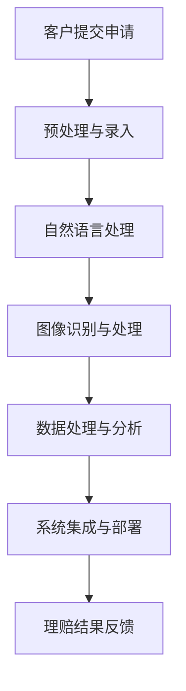
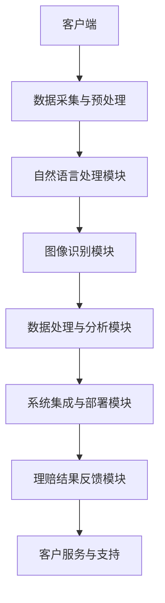

                 

# 智能保险理赔处理系统

关键词：智能理赔、保险处理系统、自然语言处理、图像识别、数据处理、系统集成、安全与隐私保护

摘要：本文将深入探讨智能保险理赔处理系统的设计与实现。通过分析系统概述、技术实现、数据处理与分析、系统安全与隐私保护以及系统集成与部署，我们将了解如何利用人工智能技术提升保险理赔效率，提高用户体验。本文旨在为读者提供一个全面、系统的智能保险理赔处理系统解析。

## 第一部分：系统概述

### 第1章：问题背景与解决方案

#### 1.1 保险理赔处理的问题背景

保险理赔是保险行业中的重要环节，然而，传统的理赔处理方式存在效率低下、人工成本高、处理速度慢等问题。一方面，大量的理赔申请需要人工审核，耗费大量时间和人力资源；另一方面，人工审核容易出现错误，导致理赔结果不公。此外，随着保险业务的不断扩展，理赔流程中的信息录入、审批、支付等环节复杂，使得整个理赔过程变得更加繁琐。

#### 1.1.1 保险理赔流程的现状

当前的保险理赔流程主要包括以下几个步骤：

1. 客户提交理赔申请：客户通过线上或线下渠道提交理赔申请，填写相关信息。
2. 核赔部门受理：核赔部门根据客户提交的申请，进行初步审核，判断是否符合理赔条件。
3. 资料审核：核赔部门对客户提供的相关资料进行审核，包括医疗报告、发票等。
4. 核损定损：对财产损失进行评估，确定损失金额。
5. 理赔支付：审核通过后，保险公司根据理赔金额向客户支付赔偿金。

#### 1.1.2 现存问题的分析

1. **效率低下**：传统理赔流程中，人工审核、录入、审批等环节繁琐，导致理赔周期较长。
2. **成本高**：人工处理理赔申请，需要支付大量的薪资、培训等成本。
3. **错误率高**：人工审核容易出现错误，导致理赔结果不公。
4. **用户体验差**：理赔流程复杂，客户需要反复提交资料，导致用户体验差。

#### 1.1.3 智能化理赔处理的必要性

1. **提高效率**：通过引入人工智能技术，可以实现自动化审核、自动录入、自动审批等功能，大大提高理赔效率。
2. **降低成本**：减少人工操作，降低人力成本和运营成本。
3. **减少错误率**：通过智能算法，可以减少人工审核错误，提高理赔结果的准确性。
4. **提升用户体验**：简化理赔流程，减少客户等待时间，提高客户满意度。

#### 1.2 智能理赔处理系统总体架构

智能理赔处理系统是一个集成了自然语言处理、图像识别、数据处理与分析、系统集成与部署等技术的综合系统。其总体架构如图1.1所示。



#### 1.2.1 系统设计目标

1. **提高理赔效率**：通过自动化处理，实现快速理赔。
2. **降低成本**：减少人工操作，降低运营成本。
3. **提高准确性**：减少人工审核错误，提高理赔准确性。
4. **提升用户体验**：简化理赔流程，提供便捷的理赔服务。

#### 1.2.2 系统总体架构

智能理赔处理系统总体架构如图1.2所示。



#### 1.2.3 系统功能模块划分

1. **数据采集与预处理模块**：负责从客户端获取理赔申请数据，并进行预处理，如数据清洗、去重、格式转换等。
2. **自然语言处理模块**：负责处理文本数据，如理赔申请描述、医疗报告等，实现文本分类、情感分析、语义理解等功能。
3. **图像识别模块**：负责处理图片数据，如医疗影像、财产损失照片等，实现图像分类、特征提取、痕迹识别等功能。
4. **数据处理与分析模块**：负责对预处理后的数据进行分析，提取关键信息，如患者信息、损失金额等。
5. **系统集成与部署模块**：负责将各个功能模块集成到一个统一的系统中，实现数据流转和业务流程管理。
6. **理赔结果反馈模块**：负责将理赔结果反馈给客户，包括理赔金额、支付方式等。

#### 1.3 智能理赔处理系统的核心概念与联系

智能理赔处理系统涉及到多个核心概念，如自然语言处理、图像识别、数据处理与分析等。这些概念之间存在紧密的联系，共同构成了系统的核心。

#### 1.3.1 核心概念简介

1. **自然语言处理（NLP）**：是人工智能的一个重要分支，旨在让计算机理解和处理自然语言。在智能理赔处理系统中，NLP用于处理理赔申请文本，如病历描述、理赔报告等。
2. **图像识别**：是一种计算机视觉技术，用于识别和分类图片。在智能理赔处理系统中，图像识别用于处理理赔申请中的医疗影像、财产损失照片等。
3. **数据处理与分析**：是对数据进行清洗、转换、分析和挖掘的过程。在智能理赔处理系统中，数据处理与分析用于提取理赔申请中的关键信息，如患者信息、损失金额等。

#### 1.3.2 概念属性特征对比

| 概念         | 属性特征                 | 联系与作用           |
| ------------ | ---------------------- | ---------------- |
| 自然语言处理 | 文本数据、语义理解、语言模型 | 处理理赔申请文本     |
| 图像识别     | 图片数据、特征提取、分类算法 | 处理理赔申请图片     |
| 数据处理与分析 | 数据清洗、数据转换、数据挖掘 | 提取理赔申请关键信息 |

#### 1.3.3 智能理赔处理系统ER图

智能理赔处理系统的ER图如图1.3所示。

```mermaid
erDiagram
    |--|{ 理赔申请 }|<|--|{ 客户信息 }
    |--|{ 理赔申请 }|<|--|{ 理赔资料 }
    |--|{ 理赔申请 }|<|--|{ 理赔结果 }
    |--|{ 客户信息 }|<|--|{ 个人信息 }
    |--|{ 理赔资料 }|<|--|{ 医疗报告 }
    |--|{ 理赔资料 }|<|--|{ 发票 }
```

#### 1.4 智能理赔处理系统的研究方法与数据来源

1. **研究方法**：本文采用系统分析方法，对智能理赔处理系统的架构、功能模块、核心概念等进行深入研究。同时，结合案例分析和实际应用，对系统性能进行评估和优化。

2. **数据来源**：数据来源主要包括保险公司的理赔数据、医疗影像数据、财产损失照片等。这些数据将用于系统训练和测试，以提高系统的准确性和效率。

3. **数据预处理**：对收集到的数据进行清洗、去重、格式转换等预处理操作，以确保数据的质量和一致性。

#### 1.5 本章小结

本章对智能保险理赔处理系统进行了概述，分析了系统的问题背景、解决方案、总体架构、核心概念与联系以及研究方法与数据来源。通过本章的介绍，读者可以初步了解智能保险理赔处理系统的概念和架构，为后续的技术实现和系统部署提供基础。接下来，我们将深入探讨智能理赔处理系统的技术实现部分。

## 第二部分：技术实现

### 第2章：自然语言处理与文本分析

#### 2.1 自然语言处理基础

自然语言处理（NLP）是人工智能的一个重要分支，旨在让计算机理解和处理人类语言。在智能保险理赔处理系统中，NLP技术被广泛应用于理赔申请文本的处理，如文本分类、情感分析和语义理解等。

#### 2.1.1 自然语言处理概述

自然语言处理的核心任务是让计算机理解和生成自然语言。具体来说，NLP包括以下几个方面的内容：

1. **文本预处理**：包括分词、词性标注、命名实体识别等，将文本转化为计算机可以处理的形式。
2. **文本分类**：根据文本内容将其归类到不同的类别，如疾病类型、理赔原因等。
3. **情感分析**：分析文本的情感倾向，如正面、负面或中性。
4. **语义理解**：理解文本中的语义，如语义角色标注、关系抽取等。
5. **文本生成**：根据输入生成文本，如撰写理赔报告、生成回复等。

#### 2.1.2 词向量模型

词向量模型是将文本数据转化为计算机可以处理的数字形式的一种方法。其中，最常用的词向量模型是Word2Vec模型。

1. **Word2Vec模型**：Word2Vec模型是一种基于神经网络的词向量模型，通过学习词语的上下文信息，将词语映射到一个高维的向量空间中。在Word2Vec模型中，每个词语都被映射为一个向量，这些向量可以在高维空间中相似度较高的词语具有相似向量。

2. **Word2Vec模型的原理**：

   - **CBOW（连续词袋模型）**：通过一个词语的上下文（即周围的一组词语）来预测这个词语。具体来说，CBOW模型输入一个中心词和其上下文中的多个词语，然后输出这个中心词的词向量。

   - **Skip-Gram模型**：与CBOW模型相反，Skip-Gram模型输入一个词语，然后输出这个词语的上下文词语的词向量。Skip-Gram模型的优点是能够更好地捕捉词语的语义信息。

3. **Word2Vec模型的实现**：

   - **数据预处理**：首先对文本数据进行预处理，包括分词、去除停用词、标记化等操作。

   - **构建词汇表**：将所有文本中的词语构建为一个词汇表，并为每个词语分配一个唯一的索引。

   - **生成训练样本**：对于每个词语，生成其上下文的训练样本，即一个中心词和多个背景词。

   - **模型训练**：使用神经网络训练词向量模型，通过优化损失函数来调整模型的参数。

   - **模型评估**：通过计算词向量之间的余弦相似度来评估模型的质量。

#### 2.1.3 语言模型

语言模型是NLP中的一个重要组成部分，它用于预测文本的下一个词语。在智能保险理赔处理系统中，语言模型可以用于文本分类、情感分析和文本生成等任务。

1. **N-gram语言模型**：N-gram语言模型是一种基于统计的模型，它通过学习文本中的N元组（即连续的N个词语）来预测下一个词语。N-gram模型的优点是实现简单、计算速度快，缺点是难以捕捉长距离的语义关系。

2. **神经网络语言模型**：神经网络语言模型是一种基于深度学习的模型，如循环神经网络（RNN）和变压器（Transformer）等。神经网络语言模型可以捕捉长距离的语义关系，提高预测的准确性。

3. **BERT模型**：BERT（Bidirectional Encoder Representations from Transformers）是一种基于变压器的预训练语言模型。BERT模型通过预训练大量文本数据，学习词语的上下文关系，然后通过微调来适应不同的任务，如文本分类、问答和文本生成等。

#### 2.2 文本分类与情感分析

文本分类和情感分析是NLP中的重要应用，在智能保险理赔处理系统中，它们被广泛应用于理赔申请文本的处理。

#### 2.2.1 文本分类技术

文本分类是将文本数据按照一定的标准进行分类的过程。在智能保险理赔处理系统中，文本分类可以用于对理赔申请文本进行分类，如疾病分类、理赔原因分类等。

1. **朴素贝叶斯分类器**：朴素贝叶斯分类器是一种基于贝叶斯理论的分类器，它通过计算文本中各个类别的概率，选择概率最大的类别作为分类结果。朴素贝叶斯分类器的优点是实现简单、计算速度快，缺点是对于文本中的长距离关系处理能力较差。

2. **支持向量机（SVM）分类器**：支持向量机分类器是一种基于优化理论的分类器，它通过找到一个最佳的超平面来分隔不同的类别。SVM分类器的优点是分类效果较好，缺点是计算复杂度较高。

3. **深度学习分类器**：深度学习分类器是一种基于深度学习的分类器，如卷积神经网络（CNN）和循环神经网络（RNN）等。深度学习分类器的优点是能够捕捉长距离的语义关系，提高分类的准确性。

#### 2.2.2 情感分析模型

情感分析是分析文本的情感倾向的过程。在智能保险理赔处理系统中，情感分析可以用于分析理赔申请文本中的情感倾向，如正面、负面或中性。

1. **基于规则的情感分析**：基于规则的情感分析通过定义一系列规则来判断文本的情感倾向。这种方法实现简单，但准确度较低。

2. **基于机器学习的情感分析**：基于机器学习的情感分析通过训练一个分类模型来预测文本的情感倾向。常用的机器学习算法包括朴素贝叶斯、支持向量机和深度学习等。

3. **基于深度学习的情感分析**：基于深度学习的情感分析通过训练一个深度神经网络来预测文本的情感倾向。深度学习模型可以捕捉复杂的语义关系，提高情感分析的准确性。

#### 2.2.3 应用案例分析

以智能保险理赔处理系统中的疾病分类为例，我们可以通过以下步骤实现疾病分类：

1. **数据收集与预处理**：收集大量的疾病相关的理赔申请文本，并进行预处理，包括分词、去除停用词、标记化等操作。

2. **特征提取**：将预处理后的文本转化为计算机可以处理的形式，如词向量或词袋模型。

3. **模型训练**：使用机器学习算法或深度学习模型训练一个疾病分类模型。

4. **模型评估**：通过交叉验证等方法评估模型的分类准确性。

5. **模型应用**：将训练好的模型应用于新的理赔申请文本，预测其疾病类别。

#### 2.3 语义理解与实体识别

语义理解是NLP中的高级任务，它旨在理解文本中的语义，如语义角色标注、关系抽取等。实体识别是语义理解的一个重要组成部分，它旨在识别文本中的实体，如人名、地名、组织名等。

#### 2.3.1 语义理解技术

1. **语义角色标注**：语义角色标注是识别文本中的动作及其相关对象的过程。例如，在句子“医生给病人开了药”中，医生是动作的执行者，病人是动作的承受者，药是动作的对象。

2. **关系抽取**：关系抽取是识别文本中实体之间的关系的过程。例如，在句子“张三是李四的父亲”中，张三和李四是父子关系。

3. **知识图谱**：知识图谱是一种用于表示实体及其关系的图形化结构，它可以帮助我们更好地理解文本中的语义。例如，在知识图谱中，我们可以将医生、病人、药等实体以及它们之间的关系表示出来。

#### 2.3.2 实体识别方法

1. **基于规则的方法**：基于规则的方法通过定义一系列规则来识别文本中的实体。这种方法实现简单，但规则复杂度较高，难以应对复杂的实体识别任务。

2. **基于统计的方法**：基于统计的方法通过统计实体出现的特征来识别实体。例如，使用词性标注、命名实体识别等特征。

3. **基于深度学习的方法**：基于深度学习的方法通过训练一个深度神经网络来识别实体。常用的模型包括卷积神经网络（CNN）和循环神经网络（RNN）等。

#### 2.3.3 应用实例

以智能保险理赔处理系统中的客户信息提取为例，我们可以通过以下步骤实现客户信息提取：

1. **数据收集与预处理**：收集大量的理赔申请文本，并进行预处理，包括分词、去除停用词、标记化等操作。

2. **特征提取**：将预处理后的文本转化为计算机可以处理的形式，如词向量或词袋模型。

3. **实体识别模型训练**：使用深度学习模型（如BiLSTM-CRF模型）训练一个实体识别模型。

4. **模型评估**：通过交叉验证等方法评估模型的实体识别准确性。

5. **模型应用**：将训练好的模型应用于新的理赔申请文本，提取客户信息。

#### 2.4 文本生成与对话系统

文本生成与对话系统是NLP中的另一个重要应用。在智能保险理赔处理系统中，文本生成与对话系统可以用于自动生成理赔报告、回复客户咨询等。

#### 2.4.1 文本生成技术

1. **序列到序列模型（Seq2Seq）**：序列到序列模型是一种基于深度学习的模型，它通过将输入序列转化为输出序列来生成文本。常用的模型包括循环神经网络（RNN）和变压器（Transformer）等。

2. **生成对抗网络（GAN）**：生成对抗网络是一种基于深度学习的生成模型，它由生成器和判别器两部分组成。生成器生成文本，判别器判断文本是否真实。通过对抗训练，生成器可以生成越来越真实的文本。

3. **预训练语言模型**：预训练语言模型（如BERT、GPT）通过预训练大量文本数据，学习词语的上下文关系。在微调过程中，预训练语言模型可以快速适应不同的任务，如文本生成。

#### 2.4.2 对话系统架构

对话系统可以分为基于规则的和基于机器学习的两种。

1. **基于规则的对

