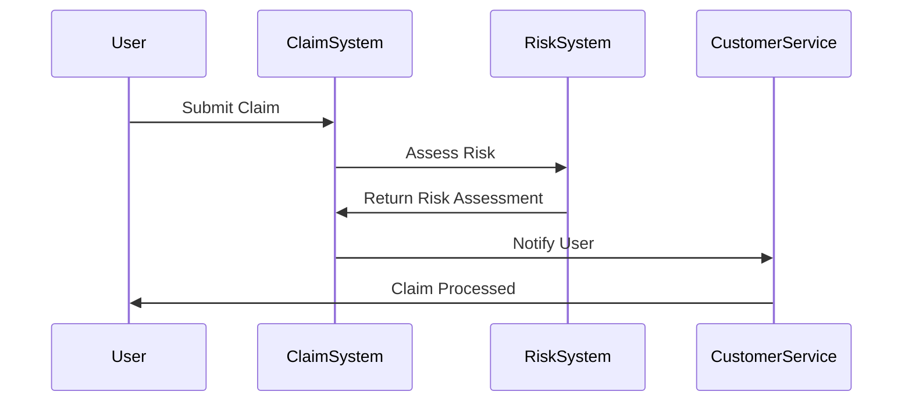

                 

# 智能保险理赔快速处理系统

> 关键词：智能理赔、自动化处理、风险评估、系统架构、人工智能

> 摘要：随着人工智能技术的发展，智能保险理赔系统成为了保险行业提升效率、降低成本的关键手段。本文将深入探讨智能保险理赔快速处理系统的设计原理、核心算法及其应用，旨在为读者提供一个全面而深入的技术解析。

## 目录大纲设计思路

为了设计出《智能保险理赔快速处理系统》这本书的完整目录大纲，我们需遵循以下步骤：

1. **背景介绍**：首先，我们需要介绍智能保险理赔的背景，包括保险行业的现状、智能保险理赔的意义和当前面临的问题。

2. **核心概念与联系**：接着，我们将介绍智能保险理赔中的核心概念，如人工智能、机器学习、自然语言处理等，并通过对比表格和ER实体关系图来展示它们之间的关系。

3. **算法原理讲解**：我们将针对智能保险理赔中的关键算法，如自动化理赔申请处理、风险评估算法等，使用mermaid流程图和Python源代码来阐述其原理，并配合LaTeX格式的数学模型和公式进行详细讲解。

4. **系统分析与架构设计方案**：然后，我们将介绍系统的整体架构设计，包括领域模型、系统架构、接口设计和系统交互等，同样使用mermaid流程图来辅助说明。

5. **项目实战**：我们将展示一个具体的智能保险理赔系统的实战案例，包括环境安装、系统核心实现、代码解读与分析等。

6. **最佳实践 tips**、**小结**、**注意事项**和**拓展阅读**等内容。

接下来，我们将根据这些思路逐步构建目录大纲。

## 第一部分：智能保险理赔背景介绍

### 第1章：保险行业现状与智能理赔的必要性

#### 1.1 保险行业的发展历程

保险作为现代经济体系的重要组成部分，其发展历程可以追溯到数百年前。从最初的简单契约形式，到如今复杂多样的保险产品，保险行业经历了长足的发展。在19世纪末和20世纪初，随着工业革命的推进，保险行业逐渐成熟，各类保险产品层出不穷。进入21世纪，随着科技的进步，保险行业开始向智能化、数字化转型。

#### 1.2 保险理赔的现状问题

保险理赔作为保险行业的核心环节，长期以来存在着诸多问题。首先，传统理赔流程繁琐，耗时较长。从理赔申请提交到理赔结果反馈，往往需要数周甚至数月的时间。其次，理赔过程中存在信息不对称，保险公司与客户之间的沟通不畅。此外，理赔过程中还存在欺诈风险，给保险公司带来了巨大的经济损失。

#### 1.3 智能理赔的意义

智能理赔系统的出现，旨在解决传统理赔流程中的诸多问题。首先，智能理赔系统可以显著提高理赔速度，缩短理赔周期。通过自动化处理，理赔申请可以在短时间内完成审核和赔付。其次，智能理赔系统可以增强保险公司的风险管理能力，通过数据分析和风险评估，有效识别和防范欺诈行为。最后，智能理赔系统可以提高用户体验，通过便捷的在线理赔渠道和智能客服，为客户提供更加优质的服务。

#### 1.4 智能保险理赔的发展趋势

随着人工智能技术的不断进步，智能保险理赔系统的发展趋势愈发明显。未来，智能保险理赔系统将在以下几个方面得到进一步发展：

1. **自动化处理能力的提升**：通过深度学习和自然语言处理技术，智能理赔系统将能够自动识别和理解理赔申请中的关键信息，实现全自动的理赔处理。
   
2. **风险识别能力的增强**：随着大数据和机器学习技术的应用，智能理赔系统将能够更加准确地识别风险，降低欺诈风险，提高保险公司的盈利能力。

3. **用户体验的优化**：通过人工智能和大数据技术，智能理赔系统将能够为客户提供更加个性化的服务，提升客户满意度。

4. **跨界融合**：智能保险理赔系统将与物联网、区块链等新兴技术相结合，实现更高效、更安全的理赔服务。

### 第2章：智能保险理赔中的核心概念

#### 2.1 人工智能

人工智能（AI）是智能保险理赔系统的核心驱动力。它是指通过计算机模拟人类智能行为，实现智能感知、智能决策和智能执行的能力。人工智能主要包括以下几个方面：

1. **机器学习**：机器学习是一种通过数据驱动的方式，使计算机具备学习能力的技术。在智能理赔系统中，机器学习可以用于自动化处理理赔申请、风险评估等。

2. **深度学习**：深度学习是机器学习的一个分支，它通过多层神经网络模型，实现对复杂数据的自动特征提取和学习。在智能理赔系统中，深度学习可以用于图像识别、自然语言处理等。

3. **自然语言处理**：自然语言处理是一种使计算机能够理解、处理和生成自然语言的技术。在智能理赔系统中，自然语言处理可以用于理赔申请的自动分类、文本审核等。

#### 2.2 机器学习

机器学习（ML）是智能保险理赔系统的核心技术之一。它通过构建模型，对海量数据进行学习，以实现对未知数据的预测和分类。在智能理赔系统中，机器学习可以应用于以下几个方面：

1. **理赔申请自动化处理**：通过机器学习模型，可以自动化处理理赔申请，提高理赔效率。

2. **风险评估**：通过机器学习模型，可以对客户的历史理赔数据进行分析，评估其风险水平。

3. **欺诈检测**：通过机器学习模型，可以识别和防范理赔欺诈行为。

#### 2.3 自然语言处理

自然语言处理（NLP）是使计算机能够理解、处理和生成自然语言的技术。在智能保险理赔系统中，自然语言处理可以应用于以下几个方面：

1. **理赔申请处理**：通过NLP技术，可以自动识别和理解理赔申请中的关键信息，实现自动化处理。

2. **文本审核**：通过NLP技术，可以自动审核理赔申请文本，确保其符合保险公司的规定。

3. **智能客服**：通过NLP技术，可以构建智能客服系统，为客户提供实时、个性化的服务。

## 第二部分：智能保险理赔的关键算法

### 第3章：自动化理赔申请处理算法

#### 3.1 算法原理

自动化理赔申请处理算法的核心目标是提高理赔处理的效率。该算法通过机器学习和自然语言处理技术，实现对理赔申请的自动识别、分类和处理。

#### 3.1.1 算法流程

1. **数据收集与预处理**：收集大量的理赔申请数据，并进行数据清洗和预处理，如去除停用词、词干提取等。

2. **特征提取**：通过自然语言处理技术，提取理赔申请中的关键特征，如关键词、句子等。

3. **模型训练**：使用机器学习算法，对提取的特征进行训练，构建分类模型。

4. **模型部署与评估**：将训练好的模型部署到实际系统中，对新的理赔申请进行自动分类和处理，并对模型进行评估和优化。

#### 3.1.2 Python源代码实现

```python
# 导入必要的库
import numpy as np
import pandas as pd
from sklearn.feature_extraction.text import TfidfVectorizer
from sklearn.model_selection import train_test_split
from sklearn.naive_bayes import MultinomialNB
from sklearn.metrics import accuracy_score

# 加载数据
data = pd.read_csv('claim_data.csv')
X = data['description']
y = data['category']

# 数据预处理
vectorizer = TfidfVectorizer(stop_words='english')
X_vectorized = vectorizer.fit_transform(X)

# 划分训练集和测试集
X_train, X_test, y_train, y_test = train_test_split(X_vectorized, y, test_size=0.2, random_state=42)

# 模型训练
model = MultinomialNB()
model.fit(X_train, y_train)

# 模型评估
y_pred = model.predict(X_test)
accuracy = accuracy_score(y_test, y_pred)
print(f'Accuracy: {accuracy}')
```

#### 3.1.3 算法原理讲解

在上述Python源代码中，我们首先使用了`TfidfVectorizer`对理赔申请文本进行特征提取。`TfidfVectorizer`是一种常用的文本特征提取工具，它可以将文本转换为词频-逆文档频率（TF-IDF）向量。

接下来，我们使用了`MultinomialNB`（多项式朴素贝叶斯）算法对训练数据进行训练。朴素贝叶斯是一种基于概率论的分类算法，它假设特征之间相互独立，通过计算每个类别的概率分布，实现分类。

最后，我们对测试集进行预测，并计算模型的准确率。通过不断调整模型参数和特征提取方法，我们可以提高模型的分类准确率。

### 第3章：风险评估算法

#### 3.2 算法原理

风险评估算法是智能保险理赔系统中至关重要的一环。它的目标是通过对客户的历史理赔数据进行分析，评估其风险水平，从而为保险公司提供决策依据。

#### 3.2.1 算法流程

1. **数据收集与预处理**：收集客户的历史理赔数据，并进行数据清洗和预处理，如缺失值填补、异常值处理等。

2. **特征工程**：通过对数据进行分析，提取与风险相关的特征，如赔付金额、赔付频率、理赔申请时间等。

3. **模型训练**：使用机器学习算法，对提取的特征进行训练，构建风险预测模型。

4. **模型部署与评估**：将训练好的模型部署到实际系统中，对新的客户数据进行风险评估，并对模型进行评估和优化。

#### 3.2.2 Python源代码实现

```python
# 导入必要的库
import numpy as np
import pandas as pd
from sklearn.model_selection import train_test_split
from sklearn.ensemble import RandomForestClassifier
from sklearn.metrics import classification_report

# 加载数据
data = pd.read_csv('risk_data.csv')
X = data.drop(['risk'], axis=1)
y = data['risk']

# 划分训练集和测试集
X_train, X_test, y_train, y_test = train_test_split(X, y, test_size=0.2, random_state=42)

# 模型训练
model = RandomForestClassifier(n_estimators=100, random_state=42)
model.fit(X_train, y_train)

# 模型评估
y_pred = model.predict(X_test)
print(classification_report(y_test, y_pred))
```

#### 3.2.3 算法原理讲解

在上述Python源代码中，我们首先加载了客户的风险数据，并划分了训练集和测试集。然后，我们使用了`RandomForestClassifier`（随机森林）算法对训练数据进行训练。随机森林是一种集成学习算法，它通过构建多个决策树，对样本进行集成学习，提高模型的预测准确性。

最后，我们对测试集进行预测，并打印了模型的分类报告。通过分析分类报告，我们可以了解模型的性能，如准确率、召回率、F1值等。

## 第三部分：智能保险理赔系统的架构设计

### 第4章：系统架构设计

#### 4.1 系统架构设计

智能保险理赔系统的架构设计需要考虑以下几个方面：

1. **数据处理层**：负责数据的收集、存储和预处理。该层可以采用大数据技术，如Hadoop、Spark等，实现对海量数据的处理和分析。

2. **应用层**：包括理赔申请处理、风险评估、智能客服等功能模块。该层可以使用微服务架构，提高系统的可扩展性和可维护性。

3. **接口层**：提供与外部系统（如保险公司后台系统、第三方支付系统等）的接口，实现数据的互联互通。

4. **展现层**：包括Web端、移动端等用户界面，用于与用户进行交互。

#### 4.2 领域模型设计

智能保险理赔系统的领域模型设计需要明确系统中的核心实体和它们之间的关系。以下是一个简单的领域模型：

```mermaid
classDiagram
Class Customer {
  +id: int
  +name: string
  +age: int
  +address: string
  +phones: string
}
Class Claim {
  +id: int
  +customer: Customer
  +claim_type: string
  +claim_amount: float
  +claim_date: datetime
  +status: string
}
Class InsurancePolicy {
  +id: int
  +customer: Customer
  +policy_number: string
  +policy_type: string
  +start_date: datetime
  +end_date: datetime
}
Class RiskAssessment {
  +id: int
  +claim: Claim
  +assessment_score: float
  +assessment_date: datetime
}
```

#### 4.3 系统接口设计和系统交互

智能保险理赔系统的接口设计和系统交互需要考虑以下几个方面：

1. **理赔申请接口**：用于接收和发送理赔申请数据。

2. **风险评估接口**：用于发送理赔申请数据，并接收风险评估结果。

3. **智能客服接口**：用于提供智能客服功能，如自动回复、智能咨询等。

以下是一个简单的系统交互序列图：



## 第四部分：智能保险理赔系统项目实战

### 第5章：系统环境搭建

#### 5.1 开发环境配置

在搭建智能保险理赔系统之前，我们需要配置好开发环境。以下是常用的开发环境配置步骤：

1. **安装Python**：Python是智能保险理赔系统的主要编程语言，我们需要下载并安装Python。

2. **安装依赖库**：根据系统的需求，我们需要安装各种依赖库，如scikit-learn、tensorflow、nltk等。

3. **配置虚拟环境**：为了确保系统的稳定性和可维护性，我们可以使用虚拟环境来隔离不同的项目依赖。

#### 5.2 系统依赖安装

在配置好开发环境后，我们需要安装系统所需的依赖库。以下是安装依赖库的命令：

```shell
pip install numpy pandas scikit-learn tensorflow nltk
```

### 第5章：系统核心实现

#### 5.2.1 自动化理赔申请处理

自动化理赔申请处理是智能保险理赔系统的核心功能之一。以下是一个简单的自动化理赔申请处理流程：

1. **接收理赔申请**：系统通过接口接收客户的理赔申请。

2. **数据预处理**：对理赔申请进行数据清洗和预处理，如去除停用词、词干提取等。

3. **特征提取**：使用自然语言处理技术，提取理赔申请中的关键特征。

4. **模型预测**：使用训练好的机器学习模型，对理赔申请进行分类预测。

5. **结果反馈**：将分类结果反馈给客户，告知其理赔申请的状态。

以下是一个简单的自动化理赔申请处理Python代码示例：

```python
from sklearn.feature_extraction.text import TfidfVectorizer
from sklearn.model_selection import train_test_split
from sklearn.naive_bayes import MultinomialNB
from sklearn.pipeline import make_pipeline

# 加载数据
data = pd.read_csv('claim_data.csv')
X = data['description']
y = data['category']

# 划分训练集和测试集
X_train, X_test, y_train, y_test = train_test_split(X, y, test_size=0.2, random_state=42)

# 构建管道模型
pipeline = make_pipeline(TfidfVectorizer(stop_words='english'), MultinomialNB())

# 模型训练
pipeline.fit(X_train, y_train)

# 接收理赔申请
claim_description = input('Enter claim description: ')

# 数据预处理
claim_description_processed = preprocess_text(claim_description)

# 模型预测
predicted_category = pipeline.predict([claim_description_processed])

# 结果反馈
print(f'Predicted Category: {predicted_category[0]}')
```

#### 5.2.2 风险评估算法实现

风险评估算法是智能保险理赔系统的重要功能之一。以下是一个简单的风险评估算法实现：

1. **数据预处理**：对客户的历史理赔数据进行清洗和预处理。

2. **特征提取**：提取与风险相关的特征，如赔付金额、赔付频率等。

3. **模型训练**：使用机器学习算法，对提取的特征进行训练，构建风险评估模型。

4. **模型预测**：对新的客户数据进行风险评估。

以下是一个简单的风险评估算法Python代码示例：

```python
from sklearn.model_selection import train_test_split
from sklearn.ensemble import RandomForestClassifier
from sklearn.metrics import classification_report

# 加载数据
data = pd.read_csv('risk_data.csv')
X = data.drop(['risk'], axis=1)
y = data['risk']

# 划分训练集和测试集
X_train, X_test, y_train, y_test = train_test_split(X, y, test_size=0.2, random_state=42)

# 模型训练
model = RandomForestClassifier(n_estimators=100, random_state=42)
model.fit(X_train, y_train)

# 模型评估
y_pred = model.predict(X_test)
print(classification_report(y_test, y_pred))
```

#### 5.3 实际案例分析与讲解

为了更好地理解智能保险理赔系统的工作原理，我们来看一个实际案例。

**案例背景**：

某客户A在保险公司的车上保险，最近发生了交通事故，导致车辆损坏。客户A希望通过智能保险理赔系统提交理赔申请。

**案例流程**：

1. **客户提交理赔申请**：客户A通过手机APP提交了理赔申请，内容包括事故发生的时间、地点、事故描述等。

2. **系统接收理赔申请**：智能保险理赔系统接收到了客户的理赔申请，并进行数据预处理。

3. **系统分类处理**：系统使用训练好的机器学习模型，对理赔申请进行分类，判断其属于哪种类型的理赔。

4. **系统风险评估**：系统对客户A的历史理赔数据进行分析，评估其风险水平。

5. **系统反馈结果**：系统将理赔申请的分类结果和风险评估结果反馈给客户A，告知其理赔申请的状态。

6. **客户确认理赔**：客户A确认理赔申请，并与保险公司协商后续理赔事宜。

**案例总结与启示**：

通过上述案例，我们可以看到智能保险理赔系统在提高理赔效率、降低成本、防范欺诈等方面的作用。在实际应用中，智能保险理赔系统需要不断优化和升级，以适应不断变化的市场需求和客户需求。

## 第五部分：智能保险理赔系统的最佳实践

### 第6章：最佳实践 tips

#### 6.1 提高系统性能的技巧

1. **优化算法**：通过不断优化机器学习算法，提高系统的准确率和响应速度。

2. **数据缓存**：使用数据缓存技术，减少数据读取和计算的时间。

3. **分布式计算**：采用分布式计算技术，提高系统的并发处理能力。

#### 6.2 优化用户体验的方法

1. **简洁界面**：设计简洁直观的用户界面，提高用户的使用体验。

2. **实时反馈**：提供实时反馈机制，让用户及时了解理赔申请的处理进度。

3. **个性化服务**：根据客户的历史数据和偏好，提供个性化的理赔服务。

#### 6.3 防范欺诈的策略

1. **数据监控**：实时监控理赔申请的数据，及时发现和阻止欺诈行为。

2. **交叉验证**：使用交叉验证技术，提高模型的鲁棒性和准确性。

3. **法律法规**：遵守相关法律法规，确保系统的合规性和安全性。

### 第6章：小结与展望

#### 6.1 智能保险理赔的发展现状

智能保险理赔系统在近年来取得了显著的发展，已经在多个国家和地区得到了广泛应用。通过人工智能、大数据等技术的应用，智能保险理赔系统在提高理赔效率、降低成本、防范欺诈等方面发挥了重要作用。

#### 6.2 未来发展趋势与挑战

1. **技术进步**：随着人工智能、大数据等技术的不断进步，智能保险理赔系统将更加智能化、高效化。

2. **数据安全**：如何保护用户数据的安全，防止数据泄露，是智能保险理赔系统面临的重大挑战。

3. **法律法规**：如何遵守相关法律法规，确保系统的合规性，是智能保险理赔系统需要关注的重点。

#### 6.3 研究方向与建议

1. **算法优化**：研究更先进的机器学习算法，提高系统的准确率和响应速度。

2. **数据安全**：研究数据加密、隐私保护等技术，确保用户数据的安全。

3. **用户体验**：研究用户行为数据，提供更加个性化的理赔服务。

## 第六部分：注意事项与拓展阅读

### 第7章：注意事项

#### 7.1 系统安全与隐私保护

1. **数据加密**：确保用户数据的加密传输和存储。

2. **权限管理**：严格管理系统的权限，防止未经授权的访问。

3. **安全审计**：定期进行安全审计，及时发现和解决安全隐患。

#### 7.2 法规与合规要求

1. **数据保护法规**：遵守当地的数据保护法规，确保用户数据的合法使用。

2. **保险法规**：遵守保险行业的法律法规，确保系统的合规性。

3. **反欺诈法规**：遵守反欺诈法规，防范欺诈行为。

#### 7.3 系统性能与稳定性

1. **负载均衡**：使用负载均衡技术，确保系统的高并发处理能力。

2. **容错机制**：设计容错机制，确保系统在异常情况下的稳定运行。

3. **性能监控**：定期对系统进行性能监控，确保系统的稳定性和响应速度。

### 第7章：拓展阅读

#### 7.1 相关书籍

1. 《深度学习》（Goodfellow, I., Bengio, Y., Courville, A.）
2. 《大数据之路：阿里巴巴大数据实践》（周伯文，陈玉涓，胡瑞勇）
3. 《机器学习实战》（Peter Harrington）

#### 7.2 相关论文

1. "Deep Learning for Natural Language Processing"（2018）
2. "Risk Management and Insurance: A Modern Perspective"（2019）
3. "Fraud Detection in Insurance using Machine Learning"（2020）

#### 7.3 在线资源和论坛

1. [Kaggle](https://www.kaggle.com/)
2. [CSDN](https://www.csdn.net/)
3. [Stack Overflow](https://stackoverflow.com/)

### 结语

智能保险理赔系统作为保险行业的创新应用，具有广阔的发展前景。通过本文的详细探讨，我们了解了智能保险理赔系统的核心概念、算法原理、系统架构和应用案例。希望本文能为读者提供有益的启示，推动智能保险理赔系统的研究和发展。

作者：AI天才研究院/AI Genius Institute & 禅与计算机程序设计艺术 /Zen And The Art of Computer Programming

