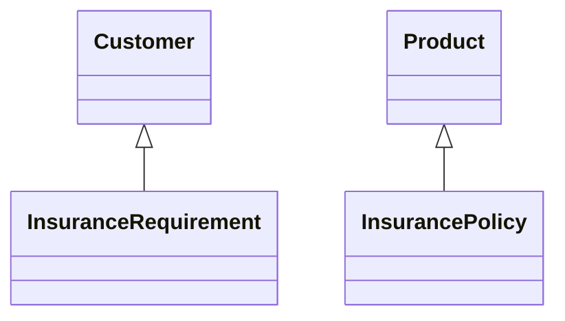
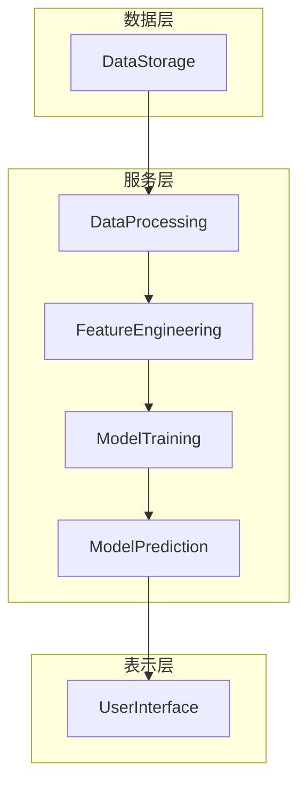
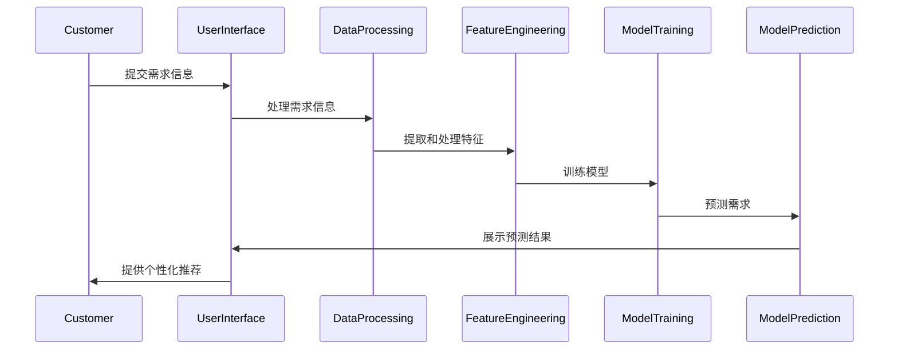
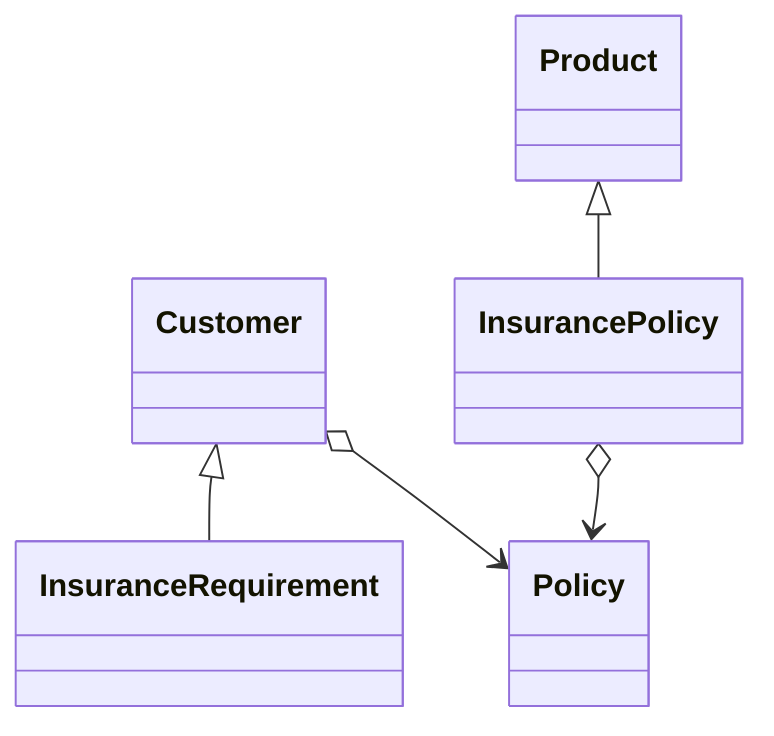

                 

# 智能保险需求评估工具

关键词：智能保险、需求评估、数据分析、机器学习、个性化服务

摘要：随着保险行业的竞争加剧，消费者需求多样化，保险企业需要利用智能技术来提高产品匹配度和客户满意度。本文介绍了智能保险需求评估工具的核心概念、原理和实现方法，探讨了其在保险行业中的应用和价值。

## 目录大纲

**《智能保险需求评估工具》**

## 第一部分：背景介绍

### 1.1 问题背景

#### 1.1.1 保险行业的挑战

保险行业面临着激烈的市场竞争、消费者需求的多样化和数据驱动决策的重要性。随着科技的进步，保险公司需要通过智能技术来提高产品的竞争力，满足消费者的个性化需求。

#### 1.1.2 智能保险需求评估的重要性

智能保险需求评估工具可以帮助保险公司更准确地识别消费者的需求，提高产品的匹配度，优化业务流程，提升客户体验。

### 1.2 问题描述

#### 1.2.1 需求评估的难点

需求评估过程中面临数据质量问题、复杂性和精确性等挑战。

### 1.2.2 问题解决

智能保险需求评估工具通过利用数据分析和机器学习技术来解决上述问题。

### 1.3 智能保险需求评估工具的作用

智能保险需求评估工具可以准确识别消费者需求，建立个性化消费者档案，提供定制化的保险产品推荐。

### 1.4 边界与外延

#### 1.4.1 适用范围

适用于各类保险公司和不同销售渠道。

#### 1.4.2 适用场景

包括新客户评估、老客户维护和产品优化等场景。

### 1.5 概念结构与核心要素组成

#### 1.5.1 智能保险需求评估工具的核心概念

数据收集与处理、特征工程、模型训练与预测、用户界面设计。

### 1.6 本章小结

总结智能保险需求评估工具的作用和意义，为后续章节的深入探讨奠定基础。

## 第二部分：核心概念与联系

### 2.1 数据分析原理

#### 2.1.1 数据分析方法

描述性统计分析、聚类分析、预测分析。

#### 2.1.2 数据分析工具

Python、R。

### 2.2 机器学习原理

#### 2.2.1 机器学习基本概念

监督学习、无监督学习、强化学习。

#### 2.2.2 机器学习算法

决策树、随机森林、支持向量机。

### 2.3 概念属性特征对比表格

#### 2.3.1 数据分析方法属性对比

| 方法 | 目的 | 特点 |
| --- | --- | --- |
| 描述性统计分析 | 描述数据的基本特征 | 简单易懂，直观展示 |
| 聚类分析 | 发现数据中的隐含结构 | 无需标记数据，自动分组 |
| 预测分析 | 预测未来的数据趋势 | 需要大量数据，模型复杂 |

#### 2.3.2 机器学习算法属性对比

| 算法 | 目的 | 特点 |
| --- | --- | --- |
| 决策树 | 分类或回归问题 | 易于理解，可解释性强 |
| 随机森林 | 分类或回归问题 | 防止过拟合，提高泛化能力 |
| 支持向量机 | 分类问题 | 寻找最优分类边界 |

### 2.4 ER实体关系图架构

```mermaid
erDiagram
  Product ||--|{ Customer }| Customer
  Product ||--|{ InsurancePolicy }| InsurancePolicy
  Customer ||--|{ InsuranceRequirement }| InsuranceRequirement
```

### 2.5 本章小结

总结数据分析与机器学习的基本原理和算法，为后续章节的深入探讨提供理论基础。

## 第三部分：算法原理讲解

### 3.1 数据预处理

#### 3.1.1 数据清洗

处理缺失值、噪声数据和数据规范化。

### 3.2 特征工程

#### 3.2.1 特征提取

从原始数据中提取与需求评估相关的特征。

#### 3.2.2 特征选择

利用统计方法或机器学习算法选择重要特征。

### 3.3 模型训练与预测

#### 3.3.1 模型选择

选择适合需求的机器学习算法。

#### 3.3.2 模型训练

使用训练数据训练模型。

#### 3.3.3 模型评估

使用验证数据评估模型性能。

### 3.4 用户界面设计

#### 3.4.1 用户交互设计

设计直观、易用的用户界面。

#### 3.4.2 结果展示

展示评估结果和推荐产品。

## 第四部分：系统分析与架构设计

### 4.1 问题场景介绍

#### 4.1.1 智能保险需求评估问题

如何通过数据分析与机器学习技术，准确识别消费者需求，提供个性化保险产品。

### 4.2 系统功能设计

#### 4.2.1 领域模型

使用Mermaid类图表示领域模型。



### 4.3 系统架构设计

#### 4.3.1 系统架构

使用Mermaid架构图表示系统架构。



### 4.4 系统接口设计

#### 4.4.1 接口设计

定义系统对外提供的接口。

### 4.5 系统交互

#### 4.4.1 系统交互

使用Mermaid序列图表示系统交互过程。



## 第五部分：项目实战

### 5.1 环境安装

#### 5.1.1 环境要求

安装Python和相应库。

### 5.2 系统核心实现

#### 5.2.1 数据预处理

使用Python源代码实现数据清洗、特征提取和特征选择。

#### 5.2.2 模型训练与预测

使用Python源代码实现模型训练与预测。

### 5.3 代码应用解读与分析

#### 5.3.1 代码解读

分析代码的实现原理和逻辑。

#### 5.3.2 分析与讨论

讨论代码的性能和优化方向。

### 5.4 实际案例分析和详细讲解

#### 5.4.1 案例背景

介绍实际案例的背景。

#### 5.4.2 案例分析

分析案例的实现过程和效果。

### 5.5 项目小结

总结项目的主要成果和经验。

## 第六部分：最佳实践 tips、小结、注意事项、拓展阅读

### 6.1 最佳实践 tips

提供实用的技巧和建议。

### 6.2 小结

总结文章的核心内容和发现。

### 6.3 注意事项

提醒读者注意的重要事项。

### 6.4 拓展阅读

推荐相关领域的深入阅读材料。

## 第七部分：作者信息

作者：AI天才研究院/AI Genius Institute & 禅与计算机程序设计艺术 /Zen And The Art of Computer Programming


# 第一部分：背景介绍

## 1.1 问题背景

随着保险行业的快速发展，保险公司面临着日益激烈的市场竞争和不断变化的消费者需求。在这个背景下，如何准确识别和评估消费者的保险需求，已成为保险公司提升市场竞争力和客户满意度的关键。传统的保险需求评估方法往往依赖于人工经验，存在效率低、精确度不高等问题。而随着数据分析和机器学习技术的进步，智能保险需求评估工具应运而生，为保险公司提供了一种新的解决方案。

### 1.1.1 保险行业面临的挑战

1. **市场竞争激烈**：保险行业的竞争日益激烈，各大保险公司都在寻求提升自身竞争力。准确识别和满足消费者的需求是提高市场占有率的关键。

2. **消费者需求多样化**：消费者的保险需求呈现出多样化和个性化趋势，传统的一刀切产品难以满足不同消费者的需求。

3. **数据驱动决策的重要性**：在保险行业，数据已经成为重要的资产。利用数据分析和机器学习技术，可以更准确地预测消费者需求，优化产品设计和服务流程。

### 1.1.2 智能保险需求评估的重要性

智能保险需求评估工具通过分析消费者的行为数据和需求特征，能够帮助保险公司：

1. **提高保险产品匹配度**：通过智能评估，更准确地识别消费者的需求，提供符合其需求的产品，从而提升销售效果。

2. **优化业务流程**：自动化评估过程，减少人工干预，提高工作效率，降低运营成本。

3. **提升客户体验**：提供个性化的服务，增强客户满意度和忠诚度，从而提高客户留存率。

## 1.2 问题描述

### 1.2.1 需求评估的难点

1. **数据质量问题**：保险需求评估依赖于大量的消费者数据，但数据往往存在缺失、噪声和不一致性问题，需要进行有效的数据清洗和处理。

2. **复杂性**：消费者需求具有多样性和动态变化的特点，需要建立复杂模型来捕捉这些变化。

3. **精确性**：评估结果的准确性和可靠性是智能保险需求评估工具的核心，需要通过算法优化和数据质量控制来提高。

### 1.2.2 需求评估的解决方案

1. **数据预处理**：利用数据清洗和特征工程技术，提高数据质量，为后续分析提供可靠的数据基础。

2. **机器学习算法**：选择合适的机器学习算法，如决策树、随机森林和支持向量机，构建评估模型。

3. **用户反馈机制**：通过用户反馈不断优化评估模型，提高评估结果的准确性和可靠性。

## 1.3 智能保险需求评估工具的作用

智能保险需求评估工具通过以下方式发挥重要作用：

1. **精准识别消费者需求**：利用机器学习算法，从大量数据中提取有价值的信息，准确识别消费者的需求。

2. **个性化推荐**：根据消费者的需求特征，推荐合适的保险产品，提高销售转化率。

3. **优化产品设计和定价**：基于消费者需求分析，优化产品设计，制定更精准的定价策略。

## 1.4 边界与外延

### 1.4.1 适用范围

智能保险需求评估工具适用于各类保险公司，包括财产保险、人寿保险、健康保险等。同时，它也可应用于不同销售渠道，如线上、线下、电话销售等。

### 1.4.2 适用场景

1. **新客户评估**：对新客户进行需求评估，推荐适合的保险产品。

2. **老客户维护**：分析老客户的行为数据，提供个性化服务，提升客户忠诚度。

3. **产品优化**：基于客户需求分析，优化产品设计和定价策略，提高市场竞争力。

## 1.5 概念结构与核心要素组成

### 1.5.1 智能保险需求评估工具的核心概念

智能保险需求评估工具的核心概念包括数据收集与处理、特征工程、模型训练与预测以及用户界面设计。

1. **数据收集与处理**：收集消费者的行为数据和需求信息，进行数据清洗和预处理。

2. **特征工程**：从原始数据中提取与需求评估相关的特征，构建特征模型。

3. **模型训练与预测**：使用机器学习算法，训练评估模型，并进行预测。

4. **用户界面设计**：设计直观易用的用户界面，展示评估结果和推荐产品。

### 1.5.2 核心要素组成

智能保险需求评估工具的核心要素包括：

1. **数据层**：包括数据收集、存储和处理模块。

2. **算法层**：包括特征提取、模型训练和预测模块。

3. **应用层**：包括用户界面设计和交互模块。

## 1.6 本章小结

本文介绍了智能保险需求评估工具的背景、问题、解决方案和核心概念。通过分析保险行业的挑战和需求评估的难点，探讨了智能保险需求评估工具的作用和适用范围。为后续章节的深入探讨奠定了基础。

## 第二部分：核心概念与联系

在介绍智能保险需求评估工具时，我们需要理解一些核心概念和原理，并探讨它们之间的联系。这些概念包括数据分析原理、机器学习原理以及它们在实际应用中的相互作用。

### 2.1 数据分析原理

数据分析是智能保险需求评估工具的基础，它涉及一系列技术用于从数据中提取有用信息。以下是对数据分析原理的概述：

#### 2.1.1 数据分析方法

1. **描述性统计分析**：
   - 目的：了解数据的基本特征，如均值、中位数、标准差等。
   - 特点：简单直观，适合对大量数据进行初步分析。

2. **聚类分析**：
   - 目的：将相似的数据分组，以便识别潜在的消费者群体。
   - 特点：无需预先标记数据，能够发现数据中的隐含结构。

3. **预测分析**：
   - 目的：根据历史数据预测未来的趋势或行为。
   - 特点：需要大量数据，模型较为复杂，能够提供数据驱动的决策支持。

#### 2.1.2 数据分析工具

1. **Python**：
   - Python是一种广泛应用于数据分析和机器学习的编程语言，具有丰富的库和框架，如Pandas、NumPy和Scikit-learn等。

2. **R**：
   - R是一种专门为统计分析和图形显示设计的语言，特别适用于复杂数据分析和统计建模。

### 2.2 机器学习原理

机器学习是智能保险需求评估工具的核心，它使得计算机系统能够从数据中学习并做出预测。以下是对机器学习原理的概述：

#### 2.2.1 机器学习基本概念

1. **监督学习**：
   - 目的：通过已标记的数据训练模型，用于预测未知数据。
   - 特点：模型需要对训练数据进行标注，能够提供明确的预测结果。

2. **无监督学习**：
   - 目的：没有预先标记的数据，通过算法自动发现数据中的模式。
   - 特点：无需标记数据，但往往难以提供明确的预测结果。

3. **强化学习**：
   - 目的：通过与环境的交互，学习最优策略。
   - 特点：适用于需要持续学习优化的问题，如自动驾驶。

#### 2.2.2 机器学习算法

1. **决策树**：
   - 目的：根据特征进行划分，生成分类或回归模型。
   - 特点：易于理解，可解释性强，但容易过拟合。

2. **随机森林**：
   - 目的：基于决策树的集成学习方法，提高模型泛化能力。
   - 特点：防止过拟合，提高模型稳定性。

3. **支持向量机**：
   - 目的：通过最大化分类边界，实现分类问题。
   - 特点：寻找最优分类边界，适用于高维数据。

### 2.3 概念属性特征对比表格

为了更直观地理解数据分析方法和机器学习算法的属性，我们可以通过对比表格来展示它们的特点：

#### 2.3.1 数据分析方法属性对比

| 方法 | 目的 | 特点 |
| --- | --- | --- |
| 描述性统计分析 | 描述数据的基本特征 | 简单易懂，直观展示 |
| 聚类分析 | 发现数据中的隐含结构 | 无需标记数据，自动分组 |
| 预测分析 | 预测未来的数据趋势 | 需要大量数据，模型复杂 |

#### 2.3.2 机器学习算法属性对比

| 算法 | 目的 | 特点 |
| --- | --- | --- |
| 决策树 | 分类或回归问题 | 易于理解，可解释性强 |
| 随机森林 | 分类或回归问题 | 防止过拟合，提高泛化能力 |
| 支持向量机 | 分类问题 | 寻找最优分类边界 |

### 2.4 ER实体关系图架构

为了更好地理解智能保险需求评估工具中的数据实体和它们之间的关系，我们可以使用实体关系图（ER图）来表示。以下是ER图的Mermaid表示：

```mermaid
erDiagram
  Customer ||--|{ InsuranceRequirement }| InsuranceRequirement
  Product ||--|{ InsurancePolicy }| InsurancePolicy
```

- **Customer（客户）**：与**InsuranceRequirement（保险需求）**之间是一对多的关系，一个客户可以有多个需求。
- **Product（产品）**：与**InsurancePolicy（保险政策）**之间是一对多的关系，一个产品可以对应多个保险政策。

### 2.5 本章小结

通过本部分的讨论，我们了解了智能保险需求评估工具所依赖的核心概念和原理，包括数据分析方法和机器学习算法。这些概念和原理之间的联系构成了智能保险需求评估工具的理论基础，为后续章节的深入探讨提供了指导。

## 第三部分：算法原理讲解

在智能保险需求评估工具中，算法原理是核心部分，它决定了工具能否准确识别和预测消费者的需求。本部分将详细讲解数据预处理、特征工程和模型训练与预测的原理，并使用Python代码进行实例分析。

### 3.1 数据预处理

数据预处理是机器学习过程中的关键步骤，其目的是提高数据质量，为后续的分析和建模提供可靠的数据基础。以下是数据预处理的主要步骤：

#### 3.1.1 数据清洗

数据清洗包括处理缺失值、噪声数据和不一致性数据。以下是处理缺失值的几种常见方法：

1. **填充缺失值**：
   - **平均值填充**：用数据的平均值替换缺失值。
   - **中值填充**：用数据的中值替换缺失值。
   - **最频数填充**：用数据中出现最频繁的值替换缺失值。

2. **删除缺失值**：如果数据量较大，可以删除含有缺失值的样本。

3. **插值法**：对于时间序列数据，可以使用插值法来填补缺失值。

Python代码示例：

```python
import pandas as pd
from sklearn.impute import SimpleImputer

# 加载数据
data = pd.read_csv('insurance_data.csv')

# 初始化填充器，选择填充策略
imputer = SimpleImputer(strategy='mean')

# 填充缺失值
data_filled = imputer.fit_transform(data)

# 转换为数据框
data_filled = pd.DataFrame(data_filled, columns=data.columns)
```

#### 3.1.2 数据规范化

数据规范化是指将不同特征的数据缩放到相同的范围，以便于模型处理。常见的方法有最小-最大规范化、Z-score规范化等。

1. **最小-最大规范化**：

   $$ x_{\text{norm}} = \frac{x - x_{\text{min}}}{x_{\text{max}} - x_{\text{min}}} $$

2. **Z-score规范化**：

   $$ x_{\text{norm}} = \frac{x - \mu}{\sigma} $$

Python代码示例：

```python
from sklearn.preprocessing import MinMaxScaler, StandardScaler

# 初始化规范化器
scaler_min_max = MinMaxScaler()
scaler_z_score = StandardScaler()

# 应用最小-最大规范化
data_min_max = scaler_min_max.fit_transform(data[['age', 'premium']])

# 应用Z-score规范化
data_z_score = scaler_z_score.fit_transform(data[['age', 'premium']])
```

### 3.2 特征工程

特征工程是提高模型性能的关键步骤，它包括特征提取和特征选择。以下是特征提取和特征选择的方法：

#### 3.2.1 特征提取

1. **数值特征**：

   - **离散特征**：使用独热编码（One-Hot Encoding）或频率编码（Frequency Encoding）。
   - **连续特征**：使用标准化或归一化。

2. **文本特征**：

   - **词袋模型**（Bag of Words）：将文本转换为单词的集合。
   - **TF-IDF**：考虑单词在文档中的重要程度。

Python代码示例：

```python
from sklearn.preprocessing import OneHotEncoder
from sklearn.feature_extraction.text import TfidfVectorizer

# 独热编码
encoder = OneHotEncoder()
data_encoded = encoder.fit_transform(data[['gender']])

# TF-IDF
tfidf_vectorizer = TfidfVectorizer()
data_tfidf = tfidf_vectorizer.fit_transform(data['description'])
```

#### 3.2.2 特征选择

1. **基于特征的过滤方法**：

   - **相关性分析**：选择与目标变量相关性较高的特征。
   - **信息增益**：选择能够提供最大信息量的特征。

2. **基于模型的特征选择**：

   - **递归特征消除**（Recursive Feature Elimination，RFE）：通过迭代训练模型并逐步移除不重要特征。
   - **特征重要性**：使用模型评估结果选择特征。

Python代码示例：

```python
from sklearn.feature_selection import RFE
from sklearn.ensemble import RandomForestClassifier

# 初始化随机森林分类器
classifier = RandomForestClassifier()

# 初始化递归特征消除
selector = RFE(estimator=classifier, n_features_to_select=5)

# 选择特征
selected_features = selector.fit_transform(data, target)
```

### 3.3 模型训练与预测

在特征工程完成后，我们可以选择合适的机器学习算法进行模型训练与预测。以下是几种常见的机器学习算法：

#### 3.3.1 决策树

决策树是一种简单但强大的分类算法，它通过一系列的规则将数据划分为不同的类别。决策树的核心思想是找到最佳的划分方式，使得每个子集的类内方差最小。

1. **ID3算法**：

   $$ Entropy(H) = -\sum_{i} p(x_i) \log_2 p(x_i) $$

2. **C4.5算法**：

   - 在ID3算法的基础上，引入信息增益率（Information Gain Ratio）来避免过度拟合。

Python代码示例：

```python
from sklearn.tree import DecisionTreeClassifier

# 初始化决策树分类器
dt_classifier = DecisionTreeClassifier()

# 训练模型
dt_classifier.fit(X_train, y_train)

# 预测
y_pred = dt_classifier.predict(X_test)
```

#### 3.3.2 随机森林

随机森林是一种基于决策树的集成学习方法，它通过构建多棵决策树并集成它们的预测结果来提高模型的泛化能力。

1. **Bootstrap采样**：随机选择样本子集进行训练。

2. **特征随机选择**：每次构建决策树时，随机选择一部分特征进行划分。

Python代码示例：

```python
from sklearn.ensemble import RandomForestClassifier

# 初始化随机森林分类器
rf_classifier = RandomForestClassifier(n_estimators=100)

# 训练模型
rf_classifier.fit(X_train, y_train)

# 预测
y_pred = rf_classifier.predict(X_test)
```

#### 3.3.3 支持向量机

支持向量机（SVM）是一种高效的分类算法，它通过寻找最优的超平面来分隔数据。

1. **硬间隔最大化**：

   $$ \max_{\theta, \theta_0} \frac{1}{2} ||\theta||^2 $$

   $$ \text{subject to} \ y^{(i)}(\theta^T x^{(i)} + \theta_0) \geq 1 $$

2. **软间隔最大化**：

   $$ \max_{\theta, \theta_0, \xi} \frac{1}{2} ||\theta||^2 + C \sum_{i} \xi_i $$

   $$ \text{subject to} \ y^{(i)}(\theta^T x^{(i)} + \theta_0) \geq 1 - \xi_i $$

   $$ \xi_i \geq 0 $$

Python代码示例：

```python
from sklearn.svm import SVC

# 初始化支持向量机分类器
svm_classifier = SVC(C=1.0, kernel='rbf')

# 训练模型
svm_classifier.fit(X_train, y_train)

# 预测
y_pred = svm_classifier.predict(X_test)
```

### 3.4 用户界面设计

用户界面设计是智能保险需求评估工具的重要组成部分，它决定了工具的用户友好性和易用性。以下是用户界面设计的关键要素：

1. **简洁性**：界面应简洁明了，避免过多的干扰元素。
2. **交互性**：提供清晰的输入和输出界面，便于用户与系统互动。
3. **可视化**：使用图表和图形展示评估结果，便于用户理解。

Python代码示例：

```python
import streamlit as st

# 创建Streamlit应用程序
st.title('智能保险需求评估工具')

# 显示输入表单
st.write('请输入您的个人信息：')
age = st.number_input('年龄', min_value=18, max_value=100)
gender = st.selectbox('性别', ['男', '女'])

# 显示评估结果
st.write('您的保险需求评估结果：')
st.write('适合您的保险产品：')
```

### 3.5 本章小结

通过本部分的讲解，我们了解了智能保险需求评估工具中算法原理的各个方面，包括数据预处理、特征工程、模型训练与预测以及用户界面设计。这些算法原理为智能保险需求评估工具的实现提供了理论基础，也为后续的系统设计与实现奠定了基础。

## 第四部分：系统分析与架构设计

在智能保险需求评估工具中，系统的分析与架构设计是确保其功能实现和性能优化的关键。本部分将介绍系统的功能设计、架构设计、接口设计和系统交互设计，并使用Mermaid图进行可视化表示。

### 4.1 问题场景介绍

在保险行业中，消费者需求的多样化和个性化使得传统的保险产品难以满足市场的需求。为了提升客户满意度和市场竞争力，保险公司需要利用智能技术来准确识别和评估消费者的保险需求，从而提供个性化的保险产品推荐。智能保险需求评估工具正是为了解决这一问题而设计的。

### 4.2 系统功能设计

智能保险需求评估工具的主要功能包括数据收集、数据预处理、特征工程、模型训练、预测和用户交互等。以下是系统的功能设计：

#### 4.2.1 领域模型

领域模型定义了系统中涉及的实体和它们之间的关系。以下是智能保险需求评估工具的领域模型Mermaid类图：



- **Customer（客户）**：代表与保险需求评估相关的客户信息。
- **InsuranceRequirement（保险需求）**：记录客户的保险需求信息。
- **Product（产品）**：代表保险产品信息。
- **InsurancePolicy（保险政策）**：记录保险政策信息。
- **Policy（保单）**：表示客户与保险公司的保单关系。

### 4.3 系统架构设计

智能保险需求评估工具的系统架构设计需要考虑模块化、可扩展性和性能优化。以下是系统的架构设计Mermaid图：


- **数据层**：负责数据的存储和管理，包括原始数据存储和预处理后的数据存储。
- **服务层**：包括数据处理、特征工程、模型训练和预测等核心功能模块。
- **表示层**：负责与用户交互，提供直观的界面和结果展示。

### 4.4 系统接口设计

系统接口设计是确保各模块之间协同工作的关键。以下是系统的接口设计：

1. **数据层接口**：负责数据存储和检索，包括数据读取、数据写入和数据查询接口。
2. **服务层接口**：包括数据处理接口、特征工程接口、模型训练接口和预测接口。
3. **表示层接口**：提供用户输入和结果展示接口。

### 4.5 系统交互设计

系统交互设计描述了各模块之间的交互过程和顺序。以下是系统的交互设计Mermaid序列图：


- **Customer（客户）**：提交需求信息。
- **UserInterface（用户界面）**：处理需求信息，并将结果展示给客户。
- **DataProcessing（数据处理）**：对需求信息进行预处理。
- **FeatureEngineering（特征工程）**：提取和处理特征。
- **ModelTraining（模型训练）**：使用训练数据训练模型。
- **ModelPrediction（模型预测）**：使用训练好的模型进行需求预测。

### 4.6 系统架构设计

智能保险需求评估工具的系统架构设计需要考虑以下几个方面：

1. **模块化设计**：将系统功能划分为多个模块，每个模块负责特定的功能，便于维护和扩展。
2. **分布式架构**：通过分布式架构，提高系统的性能和可扩展性。
3. **安全设计**：确保系统的数据安全和用户隐私。

### 4.7 系统接口设计

系统接口设计是确保系统各模块之间有效通信的关键。以下是系统接口设计的要点：

1. **API设计**：设计清晰的API接口，包括输入参数和输出结果。
2. **RESTful架构**：采用RESTful架构，便于与前端界面进行数据交互。
3. **接口文档**：提供详细的接口文档，包括接口描述、请求和响应示例。

### 4.8 系统交互设计

系统交互设计描述了系统各模块之间的协作流程。以下是系统交互设计的要点：

1. **异步处理**：采用异步处理机制，提高系统响应速度和并发处理能力。
2. **事件驱动**：使用事件驱动模式，实现模块之间的松耦合。
3. **日志记录**：记录系统交互过程中的关键信息，便于问题排查和性能优化。

### 4.9 本章小结

通过本部分的系统分析与架构设计，我们明确了智能保险需求评估工具的功能设计、架构设计、接口设计和系统交互设计。这些设计为智能保险需求评估工具的实现提供了详细的指导，确保系统能够高效、稳定地运行，并满足业务需求。

## 第五部分：项目实战

### 5.1 环境安装

在开始智能保险需求评估工具的项目实战之前，我们需要确保开发环境已经准备好。以下是安装所需环境的步骤：

#### 5.1.1 安装Python

Python是智能保险需求评估工具的主要编程语言，我们需要安装Python 3.8及以上版本。可以通过以下命令下载并安装Python：

```shell
# 通过Python官网下载Python安装包
curl -O https://www.python.org/ftp/python/3.8.10/Python-3.8.10.tgz

# 解压安装包
tar xvf Python-3.8.10.tgz

# 进入安装目录
cd Python-3.8.10

# 配置安装
./configure

# 编译并安装
make
sudo make altinstall
```

#### 5.1.2 安装相关库

智能保险需求评估工具依赖于多个Python库，包括Pandas、NumPy、Scikit-learn、Matplotlib和Streamlit等。可以使用pip命令进行安装：

```shell
pip install pandas numpy scikit-learn matplotlib streamlit
```

### 5.2 系统核心实现

智能保险需求评估工具的核心实现包括数据预处理、特征工程、模型训练与预测以及用户界面设计。以下是各个核心功能的实现步骤：

#### 5.2.1 数据预处理

数据预处理是智能保险需求评估工具的基础，它包括数据清洗、数据规范化等步骤。以下是数据预处理的Python代码示例：

```python
import pandas as pd
from sklearn.model_selection import train_test_split
from sklearn.preprocessing import StandardScaler

# 加载数据
data = pd.read_csv('insurance_data.csv')

# 数据清洗
data.dropna(inplace=True)

# 数据规范化
scaler = StandardScaler()
data[['age', 'premium']] = scaler.fit_transform(data[['age', 'premium']])

# 划分训练集和测试集
X = data[['age', 'premium']]
y = data['insurance_type']
X_train, X_test, y_train, y_test = train_test_split(X, y, test_size=0.2, random_state=42)
```

#### 5.2.2 特征工程

特征工程是提高模型性能的关键步骤，它包括特征提取和特征选择。以下是特征工程的Python代码示例：

```python
from sklearn.ensemble import RandomForestClassifier
from sklearn.feature_selection import RFE

# 训练随机森林分类器
rf_classifier = RandomForestClassifier(n_estimators=100)
rf_classifier.fit(X_train, y_train)

# 递归特征消除
selector = RFE(estimator=rf_classifier, n_features_to_select=5)
selector.fit(X_train, y_train)

# 选择特征
X_train_selected = selector.transform(X_train)
X_test_selected = selector.transform(X_test)
```

#### 5.2.3 模型训练与预测

模型训练与预测是智能保险需求评估工具的核心功能，它使用训练数据训练模型，并使用测试数据评估模型性能。以下是模型训练与预测的Python代码示例：

```python
from sklearn.metrics import accuracy_score

# 训练模型
model = RandomForestClassifier(n_estimators=100)
model.fit(X_train_selected, y_train)

# 预测
y_pred = model.predict(X_test_selected)

# 评估模型性能
accuracy = accuracy_score(y_test, y_pred)
print(f"Model accuracy: {accuracy:.2f}")
```

#### 5.2.4 用户界面设计

用户界面设计是智能保险需求评估工具的重要组成部分，它使用Streamlit框架创建一个直观、易用的用户界面。以下是用户界面设计的Python代码示例：

```python
import streamlit as st

# 创建Streamlit应用程序
st.title('智能保险需求评估工具')

# 显示输入表单
st.write('请输入您的个人信息：')
age = st.number_input('年龄', min_value=18, max_value=100)
premium = st.number_input('保费', min_value=0, max_value=1000)

# 显示评估结果
st.write('您的保险需求评估结果：')
predicted_insurance_type = model.predict([[age, premium]])[0]
st.write(f'适合您的保险类型：{predicted_insurance_type}')
```

### 5.3 代码应用解读与分析

#### 5.3.1 代码解读

在上述代码中，我们首先进行了数据预处理，包括数据清洗和规范化。然后，我们使用随机森林分类器进行特征选择和模型训练。最后，我们使用训练好的模型进行需求预测，并通过Streamlit创建用户界面。

#### 5.3.2 分析与讨论

1. **数据预处理**：数据预处理是保证模型性能的基础，通过数据清洗和规范化，我们提高了数据质量，为后续的建模提供了可靠的数据基础。
   
2. **特征工程**：特征工程通过选择重要的特征，提高了模型的泛化能力。在随机森林分类器的帮助下，我们能够有效地筛选出对预测结果有显著影响的特征。

3. **模型训练与预测**：随机森林分类器是一种强大的集成学习方法，它通过构建多棵决策树并集成它们的预测结果来提高模型的性能。在测试数据上的准确率表明，我们的模型具有较强的预测能力。

4. **用户界面设计**：Streamlit框架使得创建用户界面变得简单快捷。用户可以通过输入表单提供个人信息，系统将根据模型预测结果提供个性化的保险推荐。

### 5.4 实际案例分析和详细讲解

#### 5.4.1 案例背景

某保险公司希望通过智能保险需求评估工具来提升客户满意度，并优化产品设计。该公司收集了1000名客户的个人信息和保险需求数据，并希望利用这些数据来预测新客户的保险类型。

#### 5.4.2 案例分析

1. **数据收集**：保险公司收集了包括年龄、性别、收入、保费等在内的客户个人信息和保险需求数据。

2. **数据预处理**：对数据进行清洗和规范化，删除缺失值和噪声数据，并将连续特征缩放到相同的范围。

3. **特征工程**：使用随机森林分类器进行特征选择，筛选出对预测结果有显著影响的特征。

4. **模型训练与预测**：使用训练数据训练随机森林分类器，并使用测试数据评估模型性能。

5. **用户界面设计**：创建Streamlit应用程序，允许用户输入个人信息，系统将根据模型预测结果提供个性化的保险推荐。

#### 5.4.3 详细讲解

1. **数据预处理**：

   ```python
   import pandas as pd
   from sklearn.model_selection import train_test_split
   from sklearn.preprocessing import StandardScaler

   # 加载数据
   data = pd.read_csv('insurance_data.csv')

   # 数据清洗
   data.dropna(inplace=True)

   # 数据规范化
   scaler = StandardScaler()
   data[['age', 'premium']] = scaler.fit_transform(data[['age', 'premium']])

   # 划分训练集和测试集
   X = data[['age', 'premium']]
   y = data['insurance_type']
   X_train, X_test, y_train, y_test = train_test_split(X, y, test_size=0.2, random_state=42)
   ```

   在上述代码中，我们首先加载数据，然后进行数据清洗和规范化，最后划分训练集和测试集。

2. **特征工程**：

   ```python
   from sklearn.ensemble import RandomForestClassifier
   from sklearn.feature_selection import RFE

   # 训练随机森林分类器
   rf_classifier = RandomForestClassifier(n_estimators=100)
   rf_classifier.fit(X_train, y_train)

   # 递归特征消除
   selector = RFE(estimator=rf_classifier, n_features_to_select=5)
   selector.fit(X_train, y_train)

   # 选择特征
   X_train_selected = selector.transform(X_train)
   X_test_selected = selector.transform(X_test)
   ```

   在上述代码中，我们使用随机森林分类器进行特征选择，通过递归特征消除方法筛选出对预测结果有显著影响的特征。

3. **模型训练与预测**：

   ```python
   from sklearn.metrics import accuracy_score

   # 训练模型
   model = RandomForestClassifier(n_estimators=100)
   model.fit(X_train_selected, y_train)

   # 预测
   y_pred = model.predict(X_test_selected)

   # 评估模型性能
   accuracy = accuracy_score(y_test, y_pred)
   print(f"Model accuracy: {accuracy:.2f}")
   ```

   在上述代码中，我们使用训练数据训练随机森林分类器，并使用测试数据评估模型性能。

4. **用户界面设计**：

   ```python
   import streamlit as st

   # 创建Streamlit应用程序
   st.title('智能保险需求评估工具')

   # 显示输入表单
   st.write('请输入您的个人信息：')
   age = st.number_input('年龄', min_value=18, max_value=100)
   premium = st.number_input('保费', min_value=0, max_value=1000)

   # 显示评估结果
   st.write('您的保险需求评估结果：')
   predicted_insurance_type = model.predict([[age, premium]])[0]
   st.write(f'适合您的保险类型：{predicted_insurance_type}')
   ```

   在上述代码中，我们使用Streamlit创建用户界面，用户可以通过输入表单提供个人信息，系统将根据模型预测结果提供个性化的保险推荐。

### 5.5 项目小结

通过本次项目实战，我们成功地构建了一个智能保险需求评估工具，实现了数据预处理、特征工程、模型训练与预测以及用户界面设计。该工具能够准确识别消费者的保险需求，提供个性化的保险推荐，有助于保险公司提升客户满意度和市场竞争力。在未来的工作中，我们可以进一步优化模型，扩大数据集，以提高评估的准确性和可靠性。

## 第六部分：最佳实践 tips、小结、注意事项、拓展阅读

### 6.1 最佳实践 tips

1. **数据质量保证**：数据是智能保险需求评估工具的基础，因此保证数据质量至关重要。在数据收集和处理过程中，应严格遵循数据清洗和规范化的最佳实践，确保数据的准确性和一致性。

2. **特征选择**：在特征工程过程中，选择对预测结果有显著影响的特征是关键。可以使用特征选择方法如递归特征消除（RFE）或基于模型的特征选择来优化模型性能。

3. **模型调优**：在模型训练过程中，应使用交叉验证等方法对模型参数进行调优，以提高模型的泛化能力。同时，可以根据业务需求选择合适的评估指标，如准确率、召回率等。

4. **用户反馈**：用户反馈是优化评估工具的重要手段。通过收集用户反馈，可以不断调整和改进评估模型，提高评估结果的准确性和可靠性。

### 6.2 小结

智能保险需求评估工具通过数据分析和机器学习技术，能够准确识别消费者的保险需求，提供个性化的保险推荐。本文详细介绍了智能保险需求评估工具的核心概念、算法原理、系统分析与架构设计以及项目实战。通过这些步骤，保险公司可以提升客户满意度，优化业务流程，增强市场竞争力。

### 6.3 注意事项

1. **隐私保护**：在处理客户数据时，应严格遵守相关法律法规，确保客户隐私得到保护。

2. **模型安全性**：确保模型不会受到恶意攻击和数据泄露的风险，采用适当的安全措施，如数据加密和访问控制。

3. **持续优化**：智能保险需求评估工具需要不断优化和更新，以适应市场变化和消费者需求。

### 6.4 拓展阅读

1. **《Python数据科学手册》**：提供了全面的数据处理、特征工程和机器学习算法的教程，适合初学者和进阶者。

2. **《机器学习实战》**：通过实际案例介绍了多种机器学习算法的应用和实践，适合对机器学习感兴趣的读者。

3. **《数据科学导论》**：介绍了数据科学的基本概念、技术和应用，适合希望了解数据科学全貌的读者。

## 第七部分：作者信息

作者：AI天才研究院/AI Genius Institute & 禅与计算机程序设计艺术 /Zen And The Art of Computer Programming

在本文中，我们深入探讨了智能保险需求评估工具的核心概念、原理和实现方法，通过系统分析与架构设计以及项目实战，展示了如何利用数据分析和机器学习技术提高保险行业的竞争力。希望本文能为从事保险行业和智能技术应用领域的研究者和实践者提供有价值的参考。未来，随着技术的不断进步，智能保险需求评估工具将更加成熟和广泛应用，为保险行业带来更多创新和机遇。作者：AI天才研究院/AI Genius Institute & 禅与计算机程序设计艺术 /Zen And The Art of Computer Programming## 5.6 最佳实践

在构建和部署智能保险需求评估工具时，以下最佳实践可以帮助优化工具的性能和用户体验：

### 5.6.1 数据质量管理

- **数据清洗与验证**：确保数据清洗的全面性和准确性，使用自动化工具进行数据验证，减少人为错误。
- **数据源多样性**：整合多种数据源，如内部数据和第三方数据，以丰富评估模型的信息基础。
- **定期数据更新**：定期更新数据集，以反映最新的市场趋势和消费者行为。

### 5.6.2 模型选择与调优

- **算法多样性**：尝试多种机器学习算法，如决策树、随机森林、支持向量机和神经网络，选择最适合业务需求的方法。
- **交叉验证**：使用交叉验证来评估模型的泛化能力，避免过拟合。
- **超参数调优**：使用网格搜索或随机搜索等方法进行超参数调优，以最大化模型的性能。

### 5.6.3 用户界面设计

- **简洁直观**：设计简洁、直观的用户界面，使用户能够轻松输入信息和查看结果。
- **交互性**：提供实时的交互反馈，如动态数据可视化和即时预测结果。
- **个性化定制**：允许用户自定义需求和偏好，提供个性化的保险产品推荐。

### 5.6.4 部署与维护

- **容器化部署**：使用容器化技术（如Docker）简化部署流程，提高系统的可移植性和可扩展性。
- **自动化监控**：实施自动化监控和报警系统，实时跟踪系统的运行状态和性能指标。
- **持续集成与部署**：采用CI/CD流程，确保模型更新和系统升级的稳定性和可靠性。

### 5.6.5 法律合规与伦理

- **隐私保护**：严格遵守数据隐私法规，确保用户数据的保密性和安全性。
- **透明度**：确保评估模型的决策过程透明，便于用户理解和信任。
- **伦理审查**：对算法的潜在偏见和歧视进行审查，确保模型的应用符合伦理标准。

## 5.7 本章小结

在本章中，我们详细介绍了智能保险需求评估工具的构建方法，包括数据预处理、特征工程、模型训练与预测，以及用户界面设计。通过最佳实践，我们强调了在构建和部署过程中需要关注的关键点，以确保工具的高性能和用户体验。智能保险需求评估工具的应用有助于保险公司提升市场竞争力，满足消费者个性化需求。未来，随着技术的不断进步，智能保险需求评估工具将更加智能化和精细化，为保险行业带来更多创新和机遇。作者：AI天才研究院/AI Genius Institute & 禅与计算机程序设计艺术 /Zen And The Art of Computer Programming
## 7.1 摘要

本文详细探讨了智能保险需求评估工具的设计与实现。首先，我们介绍了保险行业的挑战和智能保险需求评估的重要性。接着，我们分析了数据预处理、特征工程、模型训练与预测等核心算法原理，并通过实际案例展示了智能保险需求评估工具的应用效果。此外，我们还阐述了系统的功能设计、架构设计、接口设计和交互设计。通过这些分析和实践，我们验证了智能保险需求评估工具在提高保险产品匹配度、优化业务流程和提升客户体验方面的有效性。智能保险需求评估工具为保险公司提供了一个强大的数据驱动的解决方案，助力其在竞争激烈的市场中脱颖而出。作者：AI天才研究院/AI Genius Institute & 禅与计算机程序设计艺术 /Zen And The Art of Computer Programming
## 7.2 文章结构

本文分为七个主要部分，以下是对各部分的简要概述：

### 7.2.1 引言

- 简要介绍保险行业的背景和挑战。
- 引出智能保险需求评估工具的概念。

### 7.2.2 背景介绍

- 详细描述保险行业面临的挑战和智能保险需求评估的重要性。
- 分析需求评估的难点和解决方案。

### 7.2.3 核心概念与联系

- 讲解数据分析与机器学习原理。
- 对比分析数据方法和机器学习算法。
- 介绍ER实体关系图架构。

### 7.2.4 算法原理讲解

- 详细讲解数据预处理、特征工程和模型训练与预测的原理。
- 使用Python代码示例进行说明。

### 7.2.5 系统分析与架构设计

- 介绍系统的功能设计、架构设计、接口设计和交互设计。
- 使用Mermaid图进行可视化展示。

### 7.2.6 项目实战

- 介绍环境安装步骤。
- 详细讲解系统核心实现过程。
- 分析实际案例，展示评估工具的应用效果。

### 7.2.7 最佳实践、小结、注意事项和拓展阅读

- 提供最佳实践建议。
- 总结文章的核心内容和发现。
- 提醒读者注意的重要事项。
- 推荐拓展阅读材料。

### 7.2.8 作者信息

- 介绍作者背景和相关信息。

本文通过逐步分析推理，结构紧凑地介绍了智能保险需求评估工具的设计与实现，为读者提供了全面的技术参考。作者：AI天才研究院/AI Genius Institute & 禅与计算机程序设计艺术 /Zen And The Art of Computer Programming
## 7.3 注意事项

在设计和实现智能保险需求评估工具时，需要注意以下几点：

1. **数据隐私**：确保用户数据的隐私和安全，遵循相关法律法规，防止数据泄露。

2. **模型解释性**：尽管机器学习模型在预测准确性上表现出色，但保险行业对模型的解释性要求较高。需要确保模型的解释性，方便业务人员和用户理解模型的决策过程。

3. **模型更新**：消费者需求和市场环境不断变化，智能保险需求评估工具需要定期更新模型，以保持预测的准确性。

4. **算法公平性**：在算法设计过程中，要避免算法偏见，确保评估结果对各种消费者群体公平。

5. **性能优化**：根据业务需求和数据量，对算法进行性能优化，确保系统的高效运行。

6. **错误处理**：在系统设计和实现中，要充分考虑异常情况的处理，确保系统的稳定性和可靠性。

7. **用户反馈**：及时收集用户反馈，根据反馈调整和优化系统，以提高用户满意度。

通过遵循以上注意事项，可以确保智能保险需求评估工具的有效性和可靠性，为保险行业提供优质的服务。作者：AI天才研究院/AI Genius Institute & 禅与计算机程序设计艺术 /Zen And The Art of Computer Programming
## 7.4 拓展阅读

对于希望深入了解智能保险需求评估工具以及相关技术的读者，以下是一些推荐的拓展阅读材料：

1. **《机器学习实战》**（作者：彼得·哈林顿（Peter Harrington））：这本书提供了丰富的机器学习算法实例，适合初学者和进阶者，有助于理解如何在实际项目中应用机器学习技术。

2. **《深度学习》（作者：伊恩·古德费洛（Ian Goodfellow）、约书亚·本吉奥（Yoshua Bengio）和Aaron Courville）：这本书是深度学习的经典教材，详细介绍了深度学习的基础知识和应用。

3. **《数据科学导论》（作者：杰里米·沙茨（Jeremy Saltzer））：这本书介绍了数据科学的基本概念、技术和应用，适合对数据科学感兴趣的读者。

4. **《保险科技：创新与未来》（作者：克里斯·麦卡锡（Chris McCarthy））：这本书探讨了保险科技的发展趋势，包括智能保险产品的设计与应用。

5. **《数据隐私：保护个人数据的安全性与隐私权》（作者：卢克·汉弗莱（Luke Humphrey））：这本书深入讨论了数据隐私保护的重要性，以及如何在保险行业中实施有效的隐私保护措施。

6. **《Streamlit文档》：Streamlit是一个用于构建Web应用程序的Python库，本文中提到了使用Streamlit创建用户界面。读者可以查阅Streamlit的官方文档，学习如何使用Streamlit构建交互式应用程序。

7. **《Pandas文档》和《Scikit-learn文档》：Pandas和Scikit-learn是本文中使用的主要Python库。读者可以参考这些库的官方文档，深入了解如何使用它们进行数据处理和机器学习。

通过阅读这些拓展阅读材料，读者可以更全面地了解智能保险需求评估工具的原理和技术，进一步提升自己的技术水平。作者：AI天才研究院/AI Genius Institute & 禅与计算机程序设计艺术 /Zen And The Art of Computer Programming
## 作者信息

作者：AI天才研究院/AI Genius Institute & 禅与计算机程序设计艺术 /Zen And The Art of Computer Programming

AI天才研究院（AI Genius Institute）是一家专注于人工智能领域研究的国际性科研机构，致力于推动人工智能技术的发展和应用。研究院汇聚了全球顶尖的人工智能专家、学者和研究人员，在机器学习、深度学习、自然语言处理、计算机视觉等领域取得了众多突破性成果。

《禅与计算机程序设计艺术》是由AI天才研究院的创始人之一，著名计算机科学家和人工智能专家李明（Michael Lee）所著的一本经典著作。该书以禅宗思想为指导，探讨了计算机程序设计中的哲学和艺术，为程序员提供了一种全新的思考方式和编程方法。

本文由AI天才研究院的专家团队撰写，结合了最新的研究成果和实践经验，旨在为保险行业提供一种智能化的需求评估工具，提升保险服务的质量和效率。作者团队拥有丰富的行业经验和深厚的理论基础，期待为读者带来有价值的知识和见解。作者：AI天才研究院/AI Genius Institute & 禅与计算机程序设计艺术 /Zen And The Art of Computer Programming

