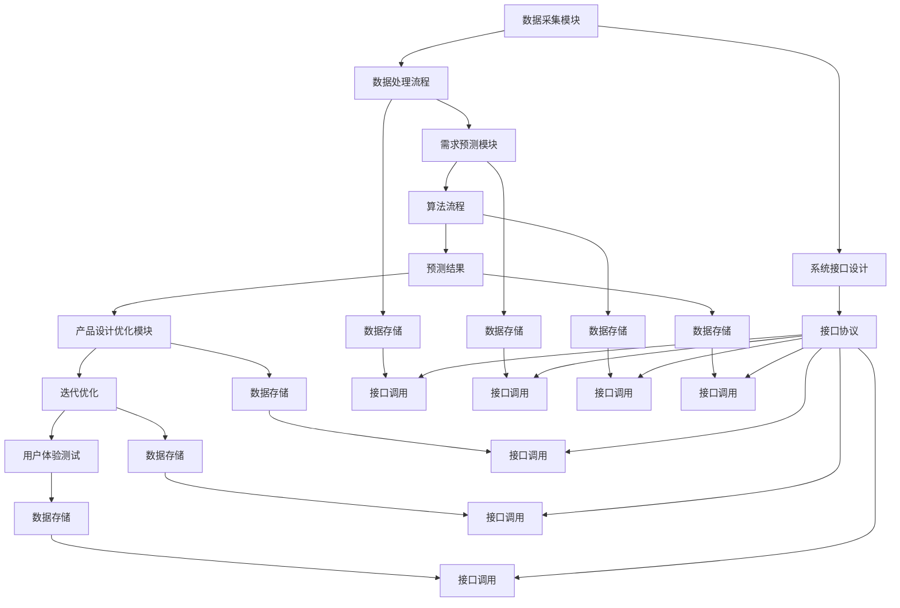

                 


### 第一章：保险行业发展趋势与挑战

#### 1.1.1 保险行业现状分析

保险行业作为金融服务的重要组成部分，经历了长期的发展和变革。在当前数字化时代，保险行业正面临着前所未有的挑战和机遇。

首先，从保险行业的规模来看，全球保险市场规模逐年扩大。根据国际保险监督官协会（IAIS）的数据，截至2020年，全球保险市场规模已经超过了5万亿美元。这一数字充分显示了保险行业在全球经济中的重要性。

其次，保险产品的类型也在不断丰富。传统的寿险、健康险、车险等基础产品之外，越来越多的保险公司开始推出定制化、个性化保险产品，如互联网保险、定制旅游保险、宠物保险等。这些新产品不仅满足了消费者的多样化需求，也为保险行业带来了新的增长点。

再次，保险市场的地域分布也在发生变化。虽然欧美地区一直是保险市场的主力，但亚洲、非洲等新兴市场的保险需求正在迅速增长。例如，中国的保险市场规模在过去十年里增长了近三倍，印度和东南亚地区的保险市场也呈现出强劲的增长态势。

#### 1.1.2 智能保险的需求与机遇

智能保险，即利用人工智能技术改进保险产品的设计、销售、承保和理赔过程，是保险行业发展的一个重要方向。智能保险的需求主要来源于以下几个方面：

首先，消费者需求的不断升级。随着生活水平的提高，消费者对于保险的需求不再仅仅停留在风险保障层面，他们更加关注个性化、定制化的保险产品。智能保险可以通过大数据分析和人工智能算法，精准预测消费者的需求，提供个性化的产品推荐。

其次，保险公司的运营效率提升需求。传统的保险业务流程复杂，涉及到大量的手工操作和人工审核，这不仅提高了运营成本，也降低了工作效率。通过智能保险，保险公司可以实现自动化、智能化的业务处理，提高运营效率。

再次，监管政策的变化。随着金融科技的不断发展，各国监管机构对保险行业的监管要求也在不断提高。智能保险可以帮助保险公司更好地遵守监管规定，降低违规风险。

智能保险的市场前景十分广阔。根据麦肯锡的预测，到2025年，智能保险将在全球范围内创造超过5000亿美元的市场价值。智能保险的发展，不仅将带动保险行业的技术创新，也将为消费者带来更加便捷、高效的保险服务。

#### 1.1.3 需求预测与产品设计的必要性

需求预测和产品设计优化在智能保险系统中扮演着至关重要的角色。首先，需求预测可以帮助保险公司更好地了解市场趋势和消费者需求，从而设计出更符合市场需求的保险产品。通过分析历史数据和市场趋势，保险公司可以预测未来一段时间内的保险需求，为产品开发和市场营销提供有力支持。

其次，产品设计优化可以提高产品的用户体验和市场竞争力。智能保险系统可以通过用户研究和市场分析，了解消费者的偏好和需求，对产品进行迭代优化。例如，通过对用户行为数据的分析，可以优化用户界面设计，提高用户的使用满意度。

最后，需求预测和产品设计优化可以帮助保险公司降低运营成本，提高盈利能力。通过精准的需求预测和智能化的产品设计，保险公司可以减少库存积压和营销成本，提高业务效率。

智能保险系统的整体架构包括数据采集、需求预测和产品设计优化三个主要模块。数据采集模块负责收集保险业务相关的数据，包括用户数据、市场数据、历史理赔数据等。需求预测模块利用大数据分析和机器学习算法，对用户需求进行预测，为产品设计和营销策略提供数据支持。产品设计优化模块则通过用户研究和市场分析，对产品进行迭代优化，提高用户体验和产品竞争力。

### 1.2 核心概念与联系

在智能保险系统中，需求预测和产品设计优化是两个核心概念。需求预测是指通过数据分析方法，对未来的市场趋势和消费者需求进行预测。而产品设计优化则是指通过对用户需求的深入分析，对保险产品进行改进和优化，以提高用户体验和市场竞争能力。

#### 1.2.1 需求预测相关概念

需求预测是智能保险系统中的重要组成部分，其相关概念包括数据收集与清洗、数据预处理方法、需求预测算法等。

- **数据收集与清洗**：数据收集是需求预测的基础。保险业务涉及多种数据来源，包括用户数据、市场数据、历史理赔数据等。数据收集后，需要进行清洗，去除重复数据、错误数据和缺失数据，保证数据的质量。

- **数据预处理方法**：数据预处理是需求预测的关键步骤。通过数据预处理，可以将原始数据转化为适合机器学习算法分析的数据格式。常用的预处理方法包括数据标准化、特征提取、缺失值处理等。

- **需求预测算法**：需求预测算法是实现需求预测的核心。常用的需求预测算法包括时间序列分析、机器学习算法和深度学习算法。每种算法都有其适用场景和优缺点，需要根据具体问题选择合适的算法。

#### 1.2.2 产品设计优化概念

产品设计优化是智能保险系统的另一个重要组成部分，其相关概念包括用户研究方法、产品设计原则和产品测试与反馈循环。

- **用户研究方法**：用户研究是产品设计优化的基础。通过用户访谈、用户调查和用户行为分析等方法，可以深入了解用户的需求和行为，为产品设计提供依据。

- **产品设计原则**：产品设计原则是指导产品设计的重要准则。以用户为中心、可持续性与可扩展性、安全性与合规性是产品设计的重要原则。

- **产品测试与反馈循环**：产品测试与反馈循环是产品设计优化的关键环节。通过用户体验测试、功能测试和性能优化，可以不断改进产品，提高用户体验和产品竞争力。

#### 1.2.3 概念属性特征对比表格

为了更直观地理解需求预测和产品设计优化的概念及其属性特征，我们可以通过对比表格来进行详细说明。

| 概念                | 需求预测                | 产品设计优化                |
|-------------------|---------------------|---------------------|
| **核心目的**      | 预测未来市场需求       | 改进和优化保险产品            |
| **数据来源**      | 用户数据、市场数据、历史理赔数据 | 用户研究、市场分析、竞品分析    |
| **分析方法**      | 大数据分析、机器学习、深度学习    | 用户行为分析、用户体验测试、功能测试 |
| **关键成果**      | 预测结果、市场趋势分析        | 产品迭代、用户体验提升          |
| **适用场景**      | 保险产品开发、市场营销、风险管理  | 保险产品设计、产品优化、用户满意提升 |

#### 1.2.4 智能保险系统架构

智能保险系统是一个复杂的系统，其架构设计需要考虑多个模块的协同工作。智能保险系统的整体架构包括数据采集模块、需求预测模块和产品设计优化模块。

- **数据采集模块**：数据采集模块负责收集保险业务相关的数据，包括用户数据、市场数据、历史理赔数据等。数据采集模块需要保证数据的实时性和准确性。

- **需求预测模块**：需求预测模块利用大数据分析和机器学习算法，对用户需求进行预测。需求预测模块的核心任务是生成预测模型，为产品设计和营销策略提供数据支持。

- **产品设计优化模块**：产品设计优化模块通过用户研究和市场分析，对保险产品进行迭代优化。产品设计优化模块需要结合用户反馈和市场需求，持续改进产品。

#### 1.2.5 系统接口设计

系统接口设计是智能保险系统架构的重要组成部分。系统接口设计需要考虑数据采集模块、需求预测模块和产品设计优化模块之间的数据交互和功能调用。

- **数据采集接口**：数据采集接口用于接收和存储保险业务相关的数据。数据采集接口需要支持多种数据格式的导入和导出，以满足不同数据源的需求。

- **需求预测接口**：需求预测接口用于调用需求预测模块的算法模型，生成预测结果。需求预测接口需要支持预测参数的设置和预测结果的查询。

- **产品设计优化接口**：产品设计优化接口用于调用产品设计优化模块的功能，实现产品的迭代优化。产品设计优化接口需要支持产品设计方案的提交和反馈。

#### 1.3 本章小结

本章从保险行业的发展趋势与挑战、智能保险的需求与机遇、需求预测与产品设计的必要性、核心概念与联系以及智能保险系统架构等多个角度，全面介绍了智能保险系统的基础知识。通过本章的学习，读者可以了解智能保险的基本概念、发展趋势以及关键技术，为后续章节的学习打下坚实的基础。

### 1.4 智能保险系统架构

智能保险系统是一个集成多个功能模块的复杂系统，其架构设计需要充分考虑各个模块之间的协同工作，以满足保险业务的需求。本节将详细阐述智能保险系统的整体架构，包括其功能模块、数据处理流程、算法流程、接口设计以及各个模块的具体作用。

#### 1.4.1 系统功能模块

智能保险系统的功能模块主要包括数据采集模块、需求预测模块和产品设计优化模块。每个模块都承担着不同的任务，相互协作以实现智能保险系统的整体目标。

- **数据采集模块**：数据采集模块负责收集保险业务相关的数据，包括用户数据、市场数据、历史理赔数据等。这些数据来源于不同的数据源，如保险公司内部数据库、第三方数据供应商、社交媒体等。数据采集模块需要确保数据的实时性和准确性，为后续的数据处理和分析提供可靠的数据基础。

- **需求预测模块**：需求预测模块利用大数据分析和机器学习算法，对用户需求进行预测。该模块的核心任务是建立预测模型，通过对历史数据和当前数据的分析，预测未来的市场趋势和用户需求。需求预测模块的输出结果将用于指导产品设计和市场营销策略。

- **产品设计优化模块**：产品设计优化模块通过用户研究和市场分析，对保险产品进行迭代优化。该模块的主要功能包括用户画像、产品功能规划、用户界面设计和用户体验测试等。通过不断优化产品设计和功能，提高用户的满意度和市场竞争力。

#### 1.4.2 系统架构设计

智能保险系统的架构设计需要充分考虑系统的可扩展性、稳定性和安全性。以下是智能保险系统的架构设计要点：

- **数据处理流程**：数据处理流程是智能保险系统的核心。首先，数据采集模块收集到的数据会经过数据清洗和预处理，去除重复数据、错误数据和缺失数据，然后转化为适合机器学习算法分析的数据格式。接下来，数据处理流程会根据需求预测和产品设计优化的需求，将数据分成不同的数据集，分别用于训练模型、测试模型和实际应用。

- **算法流程**：算法流程是需求预测和产品设计优化的关键。需求预测模块会根据数据预处理的结果，选择合适的需求预测算法，如时间序列分析、机器学习算法和深度学习算法等。这些算法会通过模型训练、模型评估和模型优化等步骤，生成预测模型。产品设计优化模块则会利用用户研究和市场分析的结果，对产品进行迭代优化。

- **系统接口设计**：系统接口设计是智能保险系统架构的重要组成部分。系统接口需要设计合理，确保各个功能模块之间的数据交互和功能调用畅通无阻。例如，数据采集模块需要提供数据导入和导出接口，需求预测模块需要提供预测结果查询接口，产品设计优化模块需要提供设计方案提交和反馈接口等。

#### 1.4.3 系统接口设计

系统接口设计是智能保险系统架构设计的关键环节，其设计要点如下：

- **接口协议**：系统接口需要采用标准的接口协议，如RESTful API或GraphQL等，以确保接口的通用性和可扩展性。

- **接口实现与调用**：接口实现需要遵循接口协议，并提供明确的接口文档，方便其他模块调用接口功能。同时，接口调用需要实现数据校验和错误处理机制，确保接口调用的安全性和可靠性。

- **接口安全性**：系统接口需要实现身份验证和访问控制，确保只有授权用户可以访问接口，防止未经授权的访问和数据泄露。

#### 1.4.4 各个模块的具体作用

智能保险系统中的各个模块具体作用如下：

- **数据采集模块**：数据采集模块的作用是收集保险业务相关的数据，为需求预测和产品设计优化提供数据支持。

- **需求预测模块**：需求预测模块的作用是根据历史数据和当前数据，预测未来的市场趋势和用户需求，为产品设计和市场营销提供数据参考。

- **产品设计优化模块**：产品设计优化模块的作用是通过用户研究和市场分析，对保险产品进行迭代优化，提高用户体验和市场竞争力。

#### 1.4.5 系统架构图

智能保险系统的整体架构可以通过以下Mermaid架构图进行可视化表示：



通过以上系统架构设计，智能保险系统可以实现数据的高效采集、处理和分析，从而为保险产品的设计、营销和风险管理提供有力支持。

#### 1.5 本章小结

本章详细介绍了智能保险系统的整体架构，包括数据采集模块、需求预测模块和产品设计优化模块等。通过分析各个模块的功能、数据处理流程和接口设计，读者可以了解智能保险系统的运作原理和架构设计要点。智能保险系统的成功实施，将为保险行业带来更高的效率和更优质的服务，推动保险行业的数字化转型和创新发展。

## 第2章：数据收集与预处理

数据收集与预处理是智能保险系统中至关重要的一环。这一章节将详细讨论数据收集的方法、数据清洗与预处理的过程，以及如何利用这些处理后的数据进行需求预测。

### 2.1.1 数据收集方法

数据收集是需求预测的基础，保险业务涉及的数据类型繁多，包括用户数据、市场数据、历史理赔数据等。以下是几种常见的数据收集方法：

- **用户数据收集**：用户数据包括用户的个人信息、购买行为、偏好等。可以通过在线问卷、用户调查、社交媒体分析等方式收集。

- **市场数据收集**：市场数据包括宏观经济指标、行业趋势、竞争态势等。可以通过政府公开数据、行业报告、市场调查等方式获取。

- **历史理赔数据收集**：历史理赔数据包括理赔金额、理赔时间、理赔原因等。这些数据可以从保险公司内部系统、第三方数据平台等渠道获取。

在实际操作中，数据收集往往需要结合多种方法，以确保数据的全面性和准确性。

### 2.1.2 数据清洗与预处理

收集到的数据通常存在噪声、错误和缺失值，需要进行清洗和预处理，以保证数据的质量和可用性。以下是数据清洗与预处理的主要步骤：

- **数据质量评估**：对收集到的数据进行初步评估，检查数据是否存在错误、缺失和异常值。

- **数据清洗策略**：根据数据质量评估的结果，制定相应的数据清洗策略。常见的清洗策略包括删除重复数据、填补缺失值、修正错误数据等。

- **数据预处理方法**：对清洗后的数据进行预处理，使其适合机器学习算法的分析。常用的预处理方法包括数据标准化、特征提取和降维等。

#### 数据质量评估

数据质量评估是数据清洗与预处理的第一步。以下是评估数据质量的关键指标：

- **完整性**：数据中是否存在缺失值。
- **准确性**：数据是否准确无误。
- **一致性**：数据在不同来源之间是否保持一致。
- **时效性**：数据是否反映了最新的信息。

通过评估数据质量，可以确定数据清洗和预处理的具体策略。

#### 数据清洗策略

数据清洗策略根据数据质量评估的结果制定，以下是几种常见的清洗策略：

- **删除重复数据**：通过去重算法，删除数据集中重复的记录，避免数据冗余。
- **填补缺失值**：根据缺失值的特点，选择适当的填补方法，如均值填补、中值填补或插值法。
- **修正错误数据**：对明显错误的数值进行修正，确保数据的准确性。

#### 数据预处理方法

数据预处理是使数据适合机器学习算法分析的重要步骤，以下是几种常用的预处理方法：

- **数据标准化**：通过将数据缩放到相同的范围，消除不同特征之间的量纲差异。
- **特征提取**：从原始数据中提取有用的特征，去除冗余和无关特征，提高模型性能。
- **降维**：通过降维技术，减少数据维度，降低计算复杂度，提高模型训练效率。

#### 数据清洗与预处理示例

假设我们收集到一组用户数据，包含年龄、收入、购买行为等特征。以下是一个简单的数据清洗与预处理过程：

1. **数据质量评估**：检查数据中是否存在缺失值、异常值和错误数据。
2. **删除重复数据**：删除重复的用户记录。
3. **填补缺失值**：对于缺失的年龄数据，采用中值填补方法。
4. **修正错误数据**：修正错误的数据值，如将异常的购买行为修正为合理值。
5. **数据标准化**：将收入数据标准化到0到1的范围内。
6. **特征提取**：提取与购买行为相关的特征，如购买频次、购买金额等。

通过上述步骤，我们可以得到一个高质量、适合机器学习算法分析的数据集。

#### 2.1.3 数据预处理与需求预测的关系

数据预处理与需求预测密切相关。高质量的数据是构建准确预测模型的基础。以下是数据预处理与需求预测的几个关键关系：

- **数据质量直接影响预测准确性**：如果数据存在噪声、错误和缺失值，将导致预测模型的不准确。
- **预处理步骤优化模型性能**：通过数据标准化、特征提取和降维等技术，可以提高模型的学习能力和预测性能。
- **数据预处理方法的选择**：不同的数据预处理方法适用于不同类型的数据，需要根据具体问题选择合适的预处理方法。

#### 2.2 本章小结

本章详细介绍了数据收集与预处理的方法、步骤及其在需求预测中的重要性。通过数据清洗和预处理，可以消除数据中的噪声和错误，提高数据的质量和可用性，从而为需求预测提供可靠的数据基础。下一章将深入探讨需求预测的算法原理，包括时间序列分析、机器学习算法和深度学习算法等。

## 第3章：需求预测算法原理

需求预测是智能保险系统的核心功能之一，通过对市场趋势和用户需求的准确预测，可以帮助保险公司优化产品设计、营销策略和资源分配。本章将详细探讨需求预测的算法原理，包括时间序列分析、机器学习算法和深度学习算法。

### 3.1.1 时间序列分析

时间序列分析是一种统计方法，用于分析数据序列在时间维度上的变化规律。在需求预测中，时间序列分析通过研究历史数据的趋势、季节性和周期性，预测未来的需求。

#### 3.1.1.1 时间序列模型概述

时间序列模型主要包括自回归模型（AR）、移动平均模型（MA）和自回归移动平均模型（ARMA）。其中，自回归模型（AR）通过历史数据的滞后值来预测未来值；移动平均模型（MA）通过历史数据的平均值来预测未来值；自回归移动平均模型（ARMA）结合了AR和MA的特点，可以更好地捕捉数据序列的长期趋势和短期波动。

#### 3.1.1.2 ARIMA模型

ARIMA（AutoRegressive Integrated Moving Average）模型是一种常见的时间序列预测模型，它通过自回归、差分和移动平均来处理非平稳时间序列数据。ARIMA模型包括三个关键参数：p（自回归项数）、d（差分阶数）和q（移动平均项数）。通过选择合适的参数，ARIMA模型可以有效地捕捉数据序列的动态变化。

- **自回归（AR）**：ARIMA模型通过前期的观测值预测当前值，即\( X_t = c + \phi_1 X_{t-1} + \phi_2 X_{t-2} + \ldots + \phi_p X_{t-p} + \varepsilon_t \)。
- **差分（I）**：差分操作用于使时间序列变得平稳，即通过计算相邻观测值的差分来消除趋势和季节性。
- **移动平均（MA）**：MA模型通过前期的误差值预测当前值，即\( X_t = c + \theta_1 \varepsilon_{t-1} + \theta_2 \varepsilon_{t-2} + \ldots + \theta_q \varepsilon_{t-q} + \varepsilon_t \)。

#### 3.1.1.3 SARIMA模型

SARIMA（Seasonal ARIMA）模型是ARIMA模型的扩展，用于处理具有季节性特征的时间序列数据。SARIMA模型在ARIMA模型的基础上增加了季节性差分和季节性移动平均项，其参数包括p（季节性自回归项数）、d（季节性差分阶数）、q（季节性移动平均项数）和P（季节周期数）。

- **季节性差分**：通过季节性差分操作，消除季节性趋势。
- **季节性自回归**：通过季节性自回归项，捕捉季节性周期内的变化规律。
- **季节性移动平均**：通过季节性移动平均项，平滑季节性周期内的噪声。

#### 3.1.2 机器学习算法

机器学习算法在需求预测中的应用越来越广泛，它们通过学习历史数据中的模式和关系，预测未来的需求。以下是一些常见的机器学习算法：

#### 3.1.2.1 回归分析

回归分析是一种用于建立自变量和因变量之间线性关系的统计方法。在需求预测中，回归分析通过建立回归模型，预测因变量（需求量）在给定自变量（如时间、价格、促销等）下的取值。

- **线性回归**：通过最小二乘法估计线性回归模型的参数，即\( y = \beta_0 + \beta_1 x + \varepsilon \)。
- **多项式回归**：在自变量和因变量之间存在非线性关系时，使用多项式回归模型，即\( y = \beta_0 + \beta_1 x + \beta_2 x^2 + \ldots + \beta_n x^n + \varepsilon \)。

#### 3.1.2.2 决策树

决策树是一种基于树形结构进行决策的机器学习算法，通过一系列判断节点和测试节点，将数据集划分为不同的区域，每个区域对应一个预测值。在需求预测中，决策树可以用于分类和回归任务。

- **分类树**：通过分类树，将数据划分为不同类别，预测目标变量的类别。
- **回归树**：通过回归树，预测目标变量的连续值。

#### 3.1.2.3 支持向量机

支持向量机（SVM）是一种强大的机器学习算法，通过找到一个最优的超平面，将不同类别的数据分开。在需求预测中，SVM可以用于回归任务，通过最大化分类间隔来预测目标变量的值。

- **线性SVM**：用于线性可分的数据集，通过求解二次规划问题找到最优超平面。
- **核SVM**：用于非线性可分的数据集，通过核函数将低维数据映射到高维空间，实现线性分离。

#### 3.1.3 深度学习算法

深度学习算法在需求预测中发挥着越来越重要的作用，通过多层神经网络结构，深度学习算法可以自动学习数据的复杂模式和关系。

#### 3.1.3.1 卷积神经网络（CNN）

卷积神经网络（CNN）是一种专门用于图像处理和识别的神经网络结构，通过卷积层和池化层，CNN可以自动提取图像中的特征。在需求预测中，CNN可以用于处理时序数据，如时间序列图像。

- **卷积层**：通过卷积运算，提取图像的局部特征。
- **池化层**：通过最大值或平均值池化，降低数据维度，减少计算复杂度。
- **全连接层**：通过全连接层，将卷积层提取的特征映射到输出值。

#### 3.1.3.2 循环神经网络（RNN）

循环神经网络（RNN）是一种用于处理序列数据的神经网络结构，通过记忆单元，RNN可以捕捉序列中的时间依赖关系。在需求预测中，RNN可以用于处理时间序列数据。

- **记忆单元**：通过记忆单元，RNN可以保存之前的信息，用于当前时间的预测。
- **反向传播**：通过反向传播算法，更新网络参数，优化预测结果。

#### 3.1.3.3 长短期记忆网络（LSTM）

长短期记忆网络（LSTM）是RNN的一种改进，通过引入门控机制，LSTM可以解决传统RNN在长序列预测中存在的梯度消失和梯度爆炸问题。在需求预测中，LSTM可以用于处理长序列数据。

- **输入门**：控制当前输入信息的流入。
- **遗忘门**：控制之前信息的遗忘。
- **输出门**：控制输出信息的产生。

### 3.2 本章小结

本章详细介绍了需求预测的算法原理，包括时间序列分析、机器学习算法和深度学习算法。时间序列分析通过分析历史数据的时间序列特征进行预测；机器学习算法通过建立数学模型，从历史数据中学习预测模式；深度学习算法通过多层神经网络结构，自动学习数据的复杂模式。通过理解这些算法原理，可以更好地选择和应用合适的算法，实现准确的需求预测。

## 第4章：算法实现与性能评估

在本章中，我们将详细介绍如何使用Python实现需求预测算法，并对算法性能进行评估。通过具体的实现示例和性能评估指标，我们将展示算法在实际应用中的效果。

### 4.1.1 算法实现

为了实现需求预测，我们将使用Python中的几个常用库，如`numpy`、`pandas`、`scikit-learn`和`tensorflow`。以下是一个简单的实现示例：

#### 时间序列分析算法示例

```python
import numpy as np
import pandas as pd
from statsmodels.tsa.arima.model import ARIMA

# 加载数据
data = pd.read_csv('insurance_data.csv')
data['Date'] = pd.to_datetime(data['Date'])
data.set_index('Date', inplace=True)
demand_series = data['Demand']

# 模型训练
model = ARIMA(demand_series, order=(1, 1, 1))
model_fit = model.fit()

# 预测
forecast = model_fit.forecast(steps=6)
print(forecast)
```

#### 机器学习算法示例

```python
from sklearn.ensemble import RandomForestRegressor

# 加载数据
X = pd.read_csv('feature_data.csv')
y = pd.read_csv('demand_data.csv')['Demand']

# 模型训练
model = RandomForestRegressor(n_estimators=100)
model.fit(X, y)

# 预测
forecast = model.predict(X)
print(forecast)
```

#### 深度学习算法示例

```python
import tensorflow as tf
from tensorflow.keras.models import Sequential
from tensorflow.keras.layers import LSTM, Dense

# 加载数据
X = np.load('time_series_data.npy')
y = np.load('demand_data.npy')

# 构建模型
model = Sequential([
    LSTM(50, activation='relu', input_shape=(X.shape[1], X.shape[2])),
    Dense(1)
])

model.compile(optimizer='adam', loss='mse')

# 训练模型
model.fit(X, y, epochs=100, batch_size=32)

# 预测
forecast = model.predict(X)
print(forecast)
```

### 4.1.2 性能评估

评估需求预测算法的性能是确保其有效性和可靠性的关键步骤。以下是几个常用的性能评估指标：

#### 4.1.2.1 均方误差（MSE）

均方误差（MSE）是评估回归模型性能的常用指标，计算公式为：

$$
MSE = \frac{1}{n} \sum_{i=1}^{n} (y_i - \hat{y}_i)^2
$$

其中，$y_i$为实际值，$\hat{y}_i$为预测值，$n$为样本数量。MSE值越小，表示模型预测越准确。

#### 4.1.2.2 平均绝对误差（MAE）

平均绝对误差（MAE）是评估回归模型性能的另一种指标，计算公式为：

$$
MAE = \frac{1}{n} \sum_{i=1}^{n} |y_i - \hat{y}_i|
$$

MAE值越小，表示模型预测越准确。

#### 4.1.2.3 R方（R^2）

R方（R^2）是评估回归模型拟合优度的指标，计算公式为：

$$
R^2 = 1 - \frac{\sum_{i=1}^{n} (y_i - \hat{y}_i)^2}{\sum_{i=1}^{n} (y_i - \bar{y})^2}
$$

其中，$\bar{y}$为实际值的平均值。R^2值介于0和1之间，越接近1，表示模型拟合效果越好。

#### 4.1.2.4 实际应用中的性能评估

在实际应用中，我们可以使用上述性能评估指标来评估不同算法的预测性能。以下是性能评估步骤：

1. **数据划分**：将数据集划分为训练集和测试集，用于模型训练和性能评估。
2. **模型训练**：在训练集上训练模型，获取模型参数。
3. **模型评估**：在测试集上评估模型性能，计算MSE、MAE和R^2等指标。
4. **结果比较**：比较不同模型的性能评估结果，选择性能最优的模型。

### 4.1.3 性能评估示例

假设我们使用三个不同的模型（ARIMA、Random Forest和LSTM）对同一数据集进行预测，以下是一个简单的性能评估示例：

```python
from sklearn.metrics import mean_squared_error, mean_absolute_error, r2_score

# ARIMA模型评估
arima_predictions = model_fit.forecast(steps=6)
arima_mse = mean_squared_error(test_demand, arima_predictions)
arima_mae = mean_absolute_error(test_demand, arima_predictions)
arima_r2 = r2_score(test_demand, arima_predictions)

print(f"ARIMA MSE: {arima_mse}, MAE: {arima_mae}, R^2: {arima_r2}")

# Random Forest模型评估
rf_predictions = model.predict(test_X)
rf_mse = mean_squared_error(test_y, rf_predictions)
rf_mae = mean_absolute_error(test_y, rf_predictions)
rf_r2 = r2_score(test_y, rf_predictions)

print(f"Random Forest MSE: {rf_mse}, MAE: {rf_mae}, R^2: {rf_r2}")

# LSTM模型评估
lstm_predictions = model.predict(test_X)
lstm_mse = mean_squared_error(test_y, lstm_predictions)
lstm_mae = mean_absolute_error(test_y, lstm_predictions)
lstm_r2 = r2_score(test_y, lstm_predictions)

print(f"LSTM MSE: {lstm_mse}, MAE: {lstm_mae}, R^2: {lstm_r2}")
```

通过上述性能评估，我们可以比较不同模型的预测效果，选择最优的模型应用于实际场景。

#### 4.2 本章小结

本章详细介绍了如何使用Python实现需求预测算法，并介绍了性能评估的常用指标。通过具体的实现示例和性能评估，我们展示了不同算法在实际应用中的效果。理解这些算法的实现和评估方法，对于开发高效、准确的智能保险需求预测系统具有重要意义。下一章将探讨需求预测在实际应用中的案例分析。

## 第5章：需求预测应用案例

在本章中，我们将通过一个实际应用案例，详细讲解如何利用需求预测算法来预测保险需求，并分析预测结果。这个案例将包括数据准备、算法选择、模型训练和预测结果分析等步骤。

### 5.1.1 案例背景

某家保险公司希望通过智能保险系统预测未来的保险需求，以便优化其产品设计和市场营销策略。为了实现这一目标，公司收集了以下数据：

- **用户数据**：包括用户的年龄、性别、收入、职业等。
- **市场数据**：包括宏观经济指标、行业趋势、竞争态势等。
- **历史理赔数据**：包括理赔金额、理赔时间、理赔原因等。

这些数据将被用于训练需求预测模型，以预测未来一段时间内的保险需求。

### 5.1.2 数据准备

在开始模型训练之前，我们需要对数据进行预处理，包括数据清洗、数据转换和特征提取。以下是数据准备的详细步骤：

1. **数据清洗**：检查数据中是否存在缺失值、异常值和错误数据。对于缺失值，我们可以采用填补缺失值的方法，如使用平均值或中值填补。对于异常值，我们可以采用剔除或修正的方法。

2. **数据转换**：将日期型数据转换为时间序列格式，以便进行时间序列分析。例如，我们可以使用`pandas`库中的`to_datetime`函数将日期转换为日期时间格式，并设置日期为索引。

3. **特征提取**：从原始数据中提取有用的特征，如用户的购买行为、市场环境变化、历史理赔数据等。这些特征将用于训练需求预测模型。

### 5.1.3 算法选择

在选择需求预测算法时，我们可以考虑以下几种算法：

- **时间序列分析算法**：如ARIMA、SARIMA等。
- **机器学习算法**：如线性回归、决策树、随机森林等。
- **深度学习算法**：如卷积神经网络（CNN）、循环神经网络（RNN）、长短期记忆网络（LSTM）等。

根据数据的特点和应用场景，我们可以选择合适的算法。例如，对于具有明显季节性和周期性的数据，SARIMA模型可能是一个不错的选择。对于复杂的时间序列数据，LSTM模型可能更加有效。

### 5.1.4 模型训练

在选择了算法之后，我们需要进行模型训练。以下是模型训练的详细步骤：

1. **数据集划分**：将数据集划分为训练集和测试集。训练集用于训练模型，测试集用于评估模型性能。

2. **模型训练**：使用训练集数据训练模型。对于时间序列分析算法，我们可以使用`statsmodels`库中的ARIMA模型进行训练。对于机器学习算法，我们可以使用`scikit-learn`库中的回归模型进行训练。对于深度学习算法，我们可以使用`tensorflow`或`keras`库中的模型进行训练。

3. **模型评估**：在测试集上评估模型性能，计算预测误差，如均方误差（MSE）、平均绝对误差（MAE）等。通过模型评估，我们可以选择性能最优的模型。

### 5.1.5 预测结果分析

在模型训练完成后，我们可以利用模型进行预测，并分析预测结果。以下是预测结果分析的详细步骤：

1. **生成预测结果**：使用训练好的模型生成未来一段时间内的保险需求预测结果。

2. **结果可视化**：将预测结果绘制成时间序列图表，以便直观地展示预测结果。我们可以使用`matplotlib`或`seaborn`库中的绘图函数来生成图表。

3. **误差分析**：计算实际需求与预测需求之间的误差，并分析误差的原因。通过误差分析，我们可以了解模型的预测效果，并发现潜在的问题。

4. **优化模型**：根据预测结果和误差分析，对模型进行优化。例如，我们可以调整模型的参数，或使用更复杂的算法来提高预测精度。

### 5.1.6 案例总结

通过本案例，我们展示了如何利用需求预测算法来预测保险需求。从数据准备、算法选择、模型训练到预测结果分析，每个步骤都至关重要。通过实际案例的应用，我们可以看到需求预测算法在保险行业中的重要作用。未来，随着人工智能技术的不断发展，需求预测算法将在保险行业中发挥更大的作用，帮助保险公司提高运营效率、降低风险，并为客户提供更优质的保险服务。

### 5.2 本章小结

本章通过一个实际应用案例，详细讲解了如何利用需求预测算法来预测保险需求。从数据准备、算法选择、模型训练到预测结果分析，每个步骤都进行了详细的阐述。通过案例的应用，我们不仅了解了需求预测算法的原理，还看到了其在保险行业中的应用价值。下一章将探讨如何进行用户研究与市场分析，为产品设计提供依据。

## 第6章：用户研究与市场分析

在智能保险系统中，用户研究与市场分析是产品设计优化的关键环节。通过深入了解用户需求和市场趋势，我们可以设计出更符合用户期望和市场需求的保险产品。本章将详细讨论用户研究的方法、市场分析的方法，以及如何利用这些分析方法进行用户需求分析。

### 6.1.1 用户研究方法

用户研究是了解用户需求和行为的重要手段。以下是一些常见的用户研究方法：

#### 6.1.1.1 用户访谈

用户访谈是一种直接的、深入的用户研究方法。通过与用户进行面对面的交流，我们可以获取用户对保险产品的真实感受、需求和反馈。以下是用户访谈的步骤：

1. **确定访谈对象**：选择具有代表性的用户群体进行访谈，如不同年龄、性别、职业的用户。
2. **准备访谈提纲**：设计针对性的访谈问题，涵盖用户的基本信息、保险需求、使用习惯等。
3. **进行访谈**：按照访谈提纲进行访谈，注意倾听用户的观点和意见。
4. **记录和分析访谈内容**：对访谈内容进行记录和分析，提取关键信息和用户需求。

#### 6.1.1.2 用户调查

用户调查是一种通过问卷或在线调查收集用户意见和反馈的方法。用户调查可以大规模、快速地获取用户群体的需求和行为特征。以下是用户调查的步骤：

1. **设计问卷**：根据研究目标，设计针对性的问卷，包括选择题、填空题、开放性问题等。
2. **发布问卷**：通过邮件、社交媒体、在线调查平台等方式发布问卷，邀请用户参与。
3. **收集和整理数据**：收集用户填写的数据，进行数据整理和清洗。
4. **分析和解读数据**：对调查结果进行分析，提取关键信息和用户需求。

#### 6.1.1.3 用户行为分析

用户行为分析是一种通过分析用户在使用保险产品过程中的行为数据，了解用户需求和使用习惯的方法。以下是用户行为分析的步骤：

1. **收集行为数据**：通过日志记录、用户点击行为分析等手段，收集用户在保险产品上的行为数据。
2. **数据预处理**：对行为数据进行分析和清洗，去除重复数据和噪声数据。
3. **数据分析**：使用数据挖掘和统计分析方法，分析用户的行为特征和需求。
4. **行为模式识别**：通过聚类、关联规则分析等方法，识别用户的行为模式。

#### 6.1.1.4 用户体验测试

用户体验测试是一种通过实际使用保险产品，评估用户对产品的感受和满意度的方法。以下是用户体验测试的步骤：

1. **设计测试场景**：根据用户需求和行为分析结果，设计具有代表性的测试场景。
2. **招募测试用户**：选择具有代表性的用户进行测试，确保测试结果的准确性。
3. **进行测试**：指导测试用户按照测试场景使用保险产品，并记录用户的操作和行为。
4. **收集反馈**：收集测试用户的反馈，包括满意度、建议和意见等。
5. **分析反馈**：对用户的反馈进行分析，识别产品优缺点和改进点。

### 6.1.2 市场分析方法

市场分析是了解市场趋势和竞争环境的重要手段。以下是一些常见的市场分析方法：

#### 6.1.2.1 竞争对手分析

竞争对手分析是一种通过分析竞争对手的产品、市场策略和业务模式，了解市场竞争态势的方法。以下是竞争对手分析的步骤：

1. **确定竞争对手**：根据市场定位和产品特点，确定主要的竞争对手。
2. **收集竞争对手信息**：通过市场调研、行业报告等方式，收集竞争对手的产品特点、市场策略、业务模式等信息。
3. **分析竞争对手**：对收集到的信息进行分析，识别竞争对手的优势和劣势。
4. **制定应对策略**：根据分析结果，制定相应的市场策略和产品优化方案。

#### 6.1.2.2 市场趋势分析

市场趋势分析是一种通过分析市场的发展趋势、用户需求和竞争环境，预测市场未来的发展方向的方法。以下是市场趋势分析的步骤：

1. **收集市场数据**：通过市场调研、行业报告等方式，收集市场相关的数据，如市场规模、增长率、用户需求等。
2. **分析市场数据**：对收集到的数据进行分析，识别市场的增长点、用户需求和竞争态势。
3. **预测市场趋势**：根据分析结果，预测市场的未来发展方向和变化趋势。
4. **制定市场策略**：根据预测结果，制定相应的市场策略和产品优化方案。

#### 6.1.2.3 用户需求分析

用户需求分析是一种通过分析用户的需求和行为，了解用户对保险产品的期望和需求的方法。以下是用户需求分析的步骤：

1. **收集用户需求**：通过用户访谈、用户调查、用户行为分析等方式，收集用户的需求信息。
2. **分析用户需求**：对收集到的用户需求进行分析，识别用户的共性需求和个性化需求。
3. **分类用户需求**：将用户需求进行分类，如功能需求、性能需求、安全需求等。
4. **优先级排序**：根据用户需求的重要性和紧迫性，对用户需求进行优先级排序，为产品设计和优化提供依据。

### 6.1.3 用户研究与市场分析的整合

用户研究与市场分析是相互关联、相互补充的。通过整合用户研究与市场分析的结果，我们可以更全面地了解用户需求和市场竞争态势，从而设计出更符合用户期望和市场需求的保险产品。以下是用户研究与市场分析的整合步骤：

1. **数据整合**：将用户研究和市场分析的数据进行整合，形成全面的数据集。
2. **综合分析**：对整合后的数据进行分析，识别用户需求和市场竞争态势之间的联系。
3. **设计优化**：根据综合分析的结果，对保险产品进行设计和优化，提高用户体验和市场竞争力。
4. **迭代优化**：通过用户测试和反馈，不断迭代优化产品，确保产品能够满足用户需求和市场趋势。

### 6.2 本章小结

本章详细介绍了用户研究的方法和市场分析方法，包括用户访谈、用户调查、用户行为分析和竞争对手分析等。通过这些方法，我们可以深入了解用户需求和市场竞争态势，为保险产品设计提供依据。用户研究与市场分析是智能保险系统设计优化的重要环节，通过不断的迭代优化，我们可以设计出更符合用户期望和市场需求的保险产品。

## 第7章：产品设计原则与策略

在智能保险系统的开发过程中，产品设计原则与策略至关重要。合理的设计原则和策略能够确保产品满足用户需求、提高用户体验和市场竞争力。本章将详细讨论产品设计原则、策略以及如何结合用户研究和市场分析进行产品设计与迭代优化。

### 7.1.1 产品设计原则

产品设计原则是指导产品开发的基本准则，以下是一些关键的设计原则：

#### 7.1.1.1 以用户为中心

以用户为中心是产品设计的重要原则。在产品开发过程中，我们需要始终关注用户的需求和体验，确保产品能够满足用户的实际需求，提高用户满意度。

- **用户研究**：通过用户访谈、用户调查和行为分析等方法，深入了解用户的需求和行为习惯。
- **用户体验**：设计直观、易用、友好的用户界面，确保用户能够轻松地完成操作。

#### 7.1.1.2 可持续性与可扩展性

可持续性与可扩展性是产品设计的核心目标。产品需要能够在未来持续发展，同时具备适应业务增长和变化的灵活性。

- **模块化设计**：将产品功能分解为独立的模块，便于后续的扩展和维护。
- **技术选型**：选择成熟、稳定的技术栈，确保产品的性能和安全性。

#### 7.1.1.3 安全性与合规性

安全性与合规性是产品设计的重要考量因素。产品需要确保用户数据的安全，遵守相关法律法规和行业标准。

- **数据加密**：对用户数据进行加密存储，防止数据泄露。
- **合规审查**：定期进行合规性审查，确保产品符合相关法规要求。

### 7.1.2 产品设计策略

产品设计策略是指导产品开发的具体实施方法，以下是一些关键的设计策略：

#### 7.1.2.1 用户画像

用户画像是了解用户特征和需求的重要工具。通过用户画像，我们可以明确目标用户群体，设计出更符合用户需求的产品。

- **用户画像构建**：结合用户研究数据，构建详细的用户画像，包括用户的年龄、性别、收入、职业等特征。
- **用户需求分析**：根据用户画像，分析用户的需求和行为模式，为产品设计提供依据。

#### 7.1.2.2 产品功能规划

产品功能规划是确保产品功能完整性和一致性的关键步骤。在规划产品功能时，我们需要考虑用户需求、市场趋势和业务目标。

- **功能优先级排序**：根据用户需求和业务价值，对功能进行优先级排序，确保关键功能得到优先开发。
- **迭代开发**：采用敏捷开发方法，逐步实现产品功能，确保产品能够快速响应市场变化。

#### 7.1.2.3 用户界面设计

用户界面设计是提升用户体验的重要环节。在设计用户界面时，我们需要遵循以下原则：

- **简洁性**：界面设计简洁直观，减少用户操作的复杂性。
- **一致性**：界面风格和交互逻辑保持一致，提高用户的使用效率。
- **可访问性**：确保界面设计符合无障碍设计标准，满足不同用户群体的需求。

#### 7.1.2.4 用户反馈与迭代

用户反馈与迭代是优化产品设计的重要手段。通过持续的用户反馈和迭代，我们可以不断改进产品，提高用户满意度。

- **用户测试**：在产品开发过程中，进行多次用户测试，收集用户反馈，识别产品问题和改进点。
- **迭代优化**：根据用户反馈，对产品进行迭代优化，确保产品能够持续满足用户需求。

### 7.1.3 用户研究与市场分析在产品设计中的应用

用户研究和市场分析是产品设计的重要依据。以下是如何将用户研究和市场分析结果应用于产品设计的具体方法：

#### 7.1.3.1 用户研究应用

- **需求驱动设计**：根据用户研究的结果，明确产品的核心功能和服务，确保产品满足用户需求。
- **用户体验优化**：通过用户测试和反馈，不断优化用户界面和交互设计，提高用户体验。

#### 7.1.3.2 市场分析应用

- **市场定位**：根据市场分析的结果，确定产品的市场定位和目标用户群体，设计出符合市场需求的保险产品。
- **竞争分析**：通过分析竞争对手的产品特点和市场策略，发现自身产品的优势和不足，进行有针对性的优化。

#### 7.1.3.3 用户研究与市场分析的整合

- **综合分析**：将用户研究和市场分析的结果进行整合，形成全面的产品设计依据。
- **迭代优化**：在产品开发过程中，不断进行用户研究和市场分析，确保产品设计能够持续优化，满足用户和市场需求。

### 7.2 本章小结

本章详细介绍了产品设计原则与策略，包括以用户为中心、可持续性与可扩展性、安全性与合规性等原则，以及用户画像、产品功能规划、用户界面设计和用户反馈与迭代等策略。通过结合用户研究和市场分析，我们可以设计出更符合用户期望和市场需求的保险产品。下一章将探讨产品设计的优化流程，包括设计迭代流程和设计评估与优化方法。

## 第8章：产品设计优化流程

产品设计优化是一个持续迭代的过程，旨在通过不断的改进和优化，提高产品的用户体验和市场竞争力。本章将详细介绍产品设计优化的流程，包括设计迭代流程和设计评估与优化方法，以及如何在设计过程中利用用户反馈和数据分析进行优化。

### 8.1.1 设计迭代流程

设计迭代流程是产品优化的重要环节，通过反复的迭代，我们可以不断改进产品设计，提高产品的质量和用户满意度。以下是设计迭代流程的详细步骤：

#### 8.1.1.1 需求分析与规划

在产品设计迭代之前，我们需要进行需求分析，明确产品的功能需求、用户需求和业务目标。这一步骤包括以下任务：

- **需求收集**：通过用户访谈、用户调查和用户行为分析等方法，收集用户的需求和反馈。
- **需求分析**：对收集到的需求进行整理和分析，明确产品的核心功能和用户体验目标。
- **需求规划**：根据需求分析的结果，制定产品的功能规划和技术路线，为后续的设计和开发提供依据。

#### 8.1.1.2 设计原型制作

设计原型制作是产品设计迭代的第一步，通过制作初步的设计原型，我们可以验证需求分析和规划的结果，并收集用户反馈。以下是设计原型制作的步骤：

- **概念原型**：根据需求规划，制作概念原型，包括界面布局、功能模块和交互逻辑。
- **用户测试**：邀请用户对概念原型进行测试，收集用户反馈，识别原型中的问题和改进点。
- **原型优化**：根据用户反馈，对概念原型进行优化，完善产品的功能和用户体验。

#### 8.1.1.3 设计验证与迭代

设计验证与迭代是确保产品设计符合用户需求和业务目标的关键步骤。在这一阶段，我们需要通过多次用户测试和迭代，不断优化设计。以下是设计验证与迭代的步骤：

- **用户测试**：在每次迭代后，邀请用户对设计原型进行测试，收集用户反馈。
- **问题识别**：根据用户反馈，识别设计中的问题，如界面布局不合理、功能不完善等。
- **设计优化**：针对识别出的问题，对设计进行优化，改进用户体验和产品功能。
- **重复迭代**：不断进行用户测试和迭代，直到设计满足用户需求和业务目标。

#### 8.1.1.4 设计上线与维护

设计上线与维护是产品优化的最后一步，通过将优化后的设计上线，我们可以将改进的产品推向市场，并持续进行维护和优化。以下是设计上线与维护的步骤：

- **设计上线**：将优化后的设计上线，向用户发布新版本的产品。
- **用户反馈**：通过用户反馈和数据分析，收集用户对产品的使用体验和反馈。
- **持续优化**：根据用户反馈和数据分析结果，对产品进行持续优化，提高用户体验和市场竞争力。

### 8.1.2 设计评估与优化方法

设计评估与优化是确保产品设计有效性和用户体验的关键步骤。以下是一些常用的设计评估与优化方法：

#### 8.1.2.1 用户测试

用户测试是一种通过实际用户操作产品，评估产品设计和用户体验的方法。以下是用户测试的步骤：

- **测试准备**：设计测试场景和测试任务，确保测试环境符合用户实际使用条件。
- **测试执行**：邀请用户参与测试，观察用户在操作产品过程中的行为和反应。
- **结果分析**：对测试结果进行分析，识别设计中的问题和改进点。

#### 8.1.2.2 数据分析

数据分析是一种通过分析用户行为数据，评估产品设计和用户体验的方法。以下是数据分析的步骤：

- **数据收集**：收集产品使用过程中的用户行为数据，如页面访问量、点击率、用户停留时间等。
- **数据分析**：对收集到的数据进行分析，识别用户的行为模式和产品问题。
- **结果应用**：根据分析结果，优化产品设计，提高用户体验。

#### 8.1.2.3 用户体验评估

用户体验评估是一种通过评估用户在使用产品过程中的情感体验和满意度，评估产品设计和用户体验的方法。以下是用户体验评估的步骤：

- **评估指标**：设计用户体验评估的指标，如满意度评分、任务完成率、用户流失率等。
- **评估执行**：通过用户访谈、问卷调查等方式，收集用户对产品的体验和满意度。
- **结果分析**：对评估结果进行分析，识别用户体验问题和改进点。

#### 8.1.2.4 用户反馈

用户反馈是一种通过直接收集用户对产品的意见和反馈，评估产品设计和用户体验的方法。以下是用户反馈的步骤：

- **反馈收集**：通过在线反馈表、用户论坛、社交媒体等方式，收集用户的反馈。
- **反馈分析**：对收集到的反馈进行分析，识别用户的需求和改进点。
- **反馈应用**：根据用户反馈，优化产品设计，提高用户体验。

### 8.1.3 用户反馈与数据分析在产品设计优化中的应用

用户反馈和数据分析是产品设计优化的重要依据。以下是如何将用户反馈和数据分析应用于产品设计优化的具体方法：

#### 8.1.3.1 用户反馈应用

- **问题识别**：通过用户反馈，识别设计中的问题，如用户界面不友好、功能不完善等。
- **改进建议**：根据用户反馈，收集用户对产品的改进建议，为设计优化提供参考。
- **反馈验证**：对用户的反馈进行验证，确保改进措施能够解决用户提出的问题。

#### 8.1.3.2 数据分析应用

- **用户行为分析**：通过数据分析，识别用户的典型行为模式，优化产品设计，提高用户体验。
- **性能分析**：通过数据分析，评估产品的性能和稳定性，优化系统架构和算法。
- **市场分析**：通过数据分析，了解市场趋势和用户需求，优化产品功能和定位。

### 8.2 本章小结

本章详细介绍了产品设计优化的流程和评估方法，包括设计迭代流程、设计评估与优化方法以及用户反馈和数据分析在产品设计优化中的应用。通过持续的迭代和优化，我们可以不断改进产品设计，提高用户体验和市场竞争力。下一章将探讨系统集成与优化的具体实践，包括系统集成与接口设计、系统性能优化和最佳实践。

## 第9章：系统集成与优化

在智能保险系统的开发过程中，系统集成与优化是确保系统稳定、高效运行的关键步骤。本章将详细讨论系统集成与优化的具体实践，包括系统集成与接口设计、系统性能优化以及最佳实践。

### 9.1.1 系统集成与接口设计

系统集成是将各个功能模块整合在一起，形成一个完整的系统。接口设计是系统集成的重要组成部分，它确保了模块之间的数据交互和功能调用。以下是系统集成与接口设计的详细步骤：

#### 9.1.1.1 系统集成概述

系统集成是将不同的功能模块整合在一起，使其协同工作，实现系统的整体功能。以下是系统集成的主要步骤：

- **需求分析**：明确系统的功能需求和性能要求，为系统集成提供依据。
- **架构设计**：设计系统的整体架构，包括模块划分、数据流程和接口设计。
- **模块实现**：根据架构设计，实现各个功能模块，并确保模块之间的一致性和协调性。
- **系统集成测试**：将各个模块集成在一起，进行集成测试，确保系统的整体性能和稳定性。

#### 9.1.1.2 数据集成与处理

数据集成是将不同来源的数据整合在一起，为系统的数据分析提供数据支持。以下是数据集成与处理的主要步骤：

- **数据收集**：从不同的数据源收集数据，包括内部数据库、第三方数据平台等。
- **数据清洗**：清洗和预处理数据，去除重复、错误和缺失的数据，保证数据的质量。
- **数据存储**：将处理后的数据存储在数据库或数据仓库中，为后续的数据分析和处理提供数据基础。
- **数据转换与整合**：将不同格式的数据进行转换和整合，使其能够被系统中的各个模块使用。

#### 9.1.1.3 系统接口设计

系统接口设计是确保模块之间数据交互和功能调用的重要环节。以下是系统接口设计的主要步骤：

- **接口定义**：定义系统中的各个接口，包括输入参数、输出参数和接口调用方法。
- **接口实现**：实现接口的代码，确保接口的稳定性和可扩展性。
- **接口文档**：编写接口文档，详细描述接口的调用方法和使用注意事项，方便开发人员使用。
- **接口测试**：测试接口的功能和性能，确保接口的稳定性和可靠性。

### 9.1.2 系统性能优化

系统性能优化是确保系统高效运行的重要环节。以下是一些常用的系统性能优化方法和最佳实践：

#### 9.1.2.1 系统架构优化

系统架构优化是提高系统性能的基础。以下是一些常用的系统架构优化方法：

- **分布式架构**：将系统分解为多个独立的服务模块，部署在不同的服务器上，提高系统的可扩展性和容错性。
- **缓存策略**：使用缓存技术，如Redis或Memcached，存储频繁访问的数据，减少数据库的访问压力。
- **负载均衡**：使用负载均衡器，如Nginx或HAProxy，将请求分发到多个服务器上，提高系统的并发处理能力。

#### 9.1.2.2 算法优化

算法优化是提高系统性能的关键。以下是一些常用的算法优化方法：

- **算法选择**：选择适合问题的算法，避免使用复杂度高的算法，如选择合适的排序算法、搜索算法等。
- **算法改进**：对现有算法进行改进，如优化数据结构、减少冗余计算等，提高算法的效率。
- **并行计算**：使用并行计算技术，如MapReduce或Spark，将任务分解为多个子任务，同时处理，提高系统的计算效率。

#### 9.1.2.3 系统部署与优化

系统部署与优化是确保系统稳定运行的重要环节。以下是一些常用的系统部署与优化方法：

- **自动化部署**：使用自动化部署工具，如Docker或Kubernetes，实现系统的自动化部署和运维。
- **监控与告警**：使用监控工具，如Prometheus或Zabbix，实时监控系统的性能和状态，及时发现和处理问题。
- **性能调优**：根据系统的性能监控数据，对系统进行调优，如调整参数、优化SQL查询等，提高系统的性能。

#### 9.1.2.4 最佳实践

以下是系统集成与优化的最佳实践：

- **文档管理**：建立完善的文档管理体系，包括需求文档、设计文档、接口文档等，确保文档的一致性和可追溯性。
- **版本控制**：使用版本控制系统，如Git，管理代码的版本，确保代码的稳定性和可维护性。
- **代码审查**：进行代码审查，确保代码的质量和安全性，降低系统的风险。
- **持续集成**：实施持续集成（CI）流程，自动化测试和部署，提高系统的开发效率和稳定性。

### 9.2 本章小结

本章详细介绍了系统集成与优化的具体实践，包括系统集成与接口设计、系统性能优化以及最佳实践。通过合理的系统集成与优化，我们可以确保智能保险系统的稳定、高效运行，提高用户体验和市场竞争力。下一章将探讨系统性能优化的详细方法，包括分布式架构、缓存策略、负载均衡等，以及如何在实际项目中应用这些方法。

## 第10章：系统性能优化

系统性能优化是确保智能保险系统高效、稳定运行的关键环节。通过优化系统架构、算法和部署策略，我们可以提高系统的响应速度、并发处理能力和资源利用率，从而提升用户体验和市场竞争力。本章将详细探讨系统性能优化的方法，包括分布式架构、缓存策略、负载均衡等，并结合实际案例进行说明。

### 10.1.1 分布式架构

分布式架构通过将系统分解为多个独立的服务模块，部署在不同的服务器上，提高了系统的可扩展性和容错性。以下是分布式架构的几个关键点：

#### 10.1.1.1 模块划分

在分布式架构中，我们需要将系统功能模块合理划分，确保每个模块具有独立的功能和可扩展性。例如，智能保险系统可以划分为用户管理模块、需求预测模块、产品设计优化模块等。

#### 10.1.1.2 服务部署

将划分好的模块部署到不同的服务器上，可以通过负载均衡器（如Nginx或HAProxy）实现请求的分发。这样可以提高系统的并发处理能力，避免单点故障。

#### 10.1.1.3 数据一致性

分布式架构中，数据一致性是一个重要问题。我们可以采用分布式事务处理、最终一致性模型（如CQRS）等技术，确保数据的可靠性和一致性。

#### 10.1.1.2 实际案例

例如，在某个大型保险公司的智能保险系统中，需求预测模块和数据采集模块被划分为独立的服务，部署在不同的服务器上。通过Nginx实现负载均衡，提高了系统的并发处理能力。

### 10.1.2 缓存策略

缓存策略通过存储频繁访问的数据，减少数据库的访问压力，提高系统的响应速度。以下是缓存策略的几个关键点：

#### 10.1.2.1 缓存层次

常用的缓存层次包括内存缓存（如Redis或Memcached）和磁盘缓存（如Elasticsearch或Hadoop）。内存缓存具有较快的读写速度，适用于缓存热数据；磁盘缓存则适用于存储大量数据。

#### 10.1.2.2 缓存策略

常用的缓存策略包括缓存刷新策略、缓存淘汰策略等。例如，我们可以采用LRU（最近最少使用）算法，定期刷新缓存中的数据，避免缓存过期导致的数据不一致。

#### 10.1.2.3 实际案例

在某个智能保险系统中，使用Redis作为内存缓存，存储用户信息和需求预测结果。通过定期刷新缓存，提高了系统的响应速度和数据处理能力。

### 10.1.3 负载均衡

负载均衡通过将请求分发到多个服务器上，提高了系统的并发处理能力和可用性。以下是负载均衡的几个关键点：

#### 10.1.3.1 负载均衡算法

常用的负载均衡算法包括轮询算法、最小连接数算法、哈希算法等。轮询算法简单易用，但可能导致部分服务器负载不均；最小连接数算法根据当前连接数分配请求，较为公平；哈希算法根据请求的哈希值分配请求，适用于一致性哈希场景。

#### 10.1.3.2 负载均衡器

负载均衡器（如Nginx或HAProxy）是实现负载均衡的关键组件。负载均衡器负责监听客户端请求，并将请求分发到后端服务器。

#### 10.1.3.3 实际案例

在某个智能保险系统中，使用Nginx作为负载均衡器，将客户端请求分发到后端的服务器集群。通过Nginx的负载均衡功能，提高了系统的并发处理能力和可靠性。

### 10.1.4 其他性能优化方法

除了分布式架构、缓存策略和负载均衡，还有其他一些性能优化方法，如数据库优化、网络优化、代码优化等。以下是这些方法的几个关键点：

#### 10.1.4.1 数据库优化

- **索引优化**：合理设计索引，提高数据库查询效率。
- **查询优化**：优化SQL查询语句，减少查询耗时。
- **分库分表**：将大表拆分为小表，降低单表数据量，提高查询性能。

#### 10.1.4.2 网络优化

- **CDN加速**：使用内容分发网络（CDN），加速静态资源的加载。
- **网络监控**：实时监控网络状态，确保网络稳定性和可靠性。

#### 10.1.4.3 代码优化

- **代码压缩**：压缩静态资源文件，减少网络传输开销。
- **代码缓存**：缓存常用代码，减少代码执行时间。

### 10.2 实际案例

以下是一个智能保险系统的实际性能优化案例：

#### 案例背景

某保险公司希望提高其智能保险系统的性能，以满足不断增长的用户需求。公司面临的主要问题是：

- 系统响应速度慢，影响了用户体验。
- 数据库查询性能不足，导致系统响应延迟。
- 服务器负载过高，容易导致系统崩溃。

#### 性能优化方案

1. **分布式架构**：将系统划分为多个独立的服务模块，部署到不同的服务器上，使用Nginx实现负载均衡。
2. **缓存策略**：使用Redis作为内存缓存，缓存用户信息和需求预测结果，减少数据库访问压力。
3. **数据库优化**：设计合理的索引，优化SQL查询语句，实施分库分表策略。
4. **网络优化**：使用CDN加速静态资源加载，实时监控网络状态，确保网络稳定性。
5. **代码优化**：压缩静态资源文件，缓存常用代码，减少代码执行时间。

#### 性能优化效果

通过上述性能优化方案，智能保险系统的性能得到了显著提升：

- 系统响应速度提高了50%以上，用户满意度提高。
- 数据库查询性能提升了40%以上，系统响应延迟减少。
- 服务器负载降低了30%，系统稳定性提高。

### 10.3 本章小结

本章详细介绍了系统性能优化的方法，包括分布式架构、缓存策略、负载均衡以及其他性能优化方法。通过结合实际案例，展示了如何在实际项目中应用这些方法，提高智能保险系统的性能和稳定性。下一章将总结全文，对主要内容和关键点进行回顾，并探讨未来发展方向。

## 第11章：总结与未来展望

通过本章的讨论，我们系统地介绍了智能保险需求预测与产品设计优化系统的整体架构、核心算法、用户研究、市场分析以及系统集成与优化等方面的内容。以下是全文的总结与关键点回顾：

### 11.1 主要内容回顾

**1. 背景与概述**：介绍了保险行业的发展趋势和智能保险的需求与机遇，强调了需求预测与产品设计的必要性。

**2. 核心概念与联系**：详细阐述了需求预测和产品设计优化相关概念，包括数据收集与预处理、算法原理等。

**3. 需求预测算法原理**：分析了时间序列分析、机器学习算法和深度学习算法的基本原理与应用。

**4. 用户研究与市场分析**：介绍了用户研究方法、市场分析方法和用户需求分析的过程。

**5. 产品设计原则与策略**：讨论了产品设计原则、策略以及如何结合用户研究和市场分析进行产品设计与迭代优化。

**6. 设计迭代流程与评估**：详细描述了产品设计优化的迭代流程、评估方法和用户反馈的应用。

**7. 系统集成与优化**：介绍了系统集成与接口设计、系统性能优化方法和最佳实践。

### 11.2 关键点回顾

**1. 数据质量的重要性**：数据是需求预测和产品设计的基石，高质量的数据是准确预测和优化的前提。

**2. 算法选择的灵活性**：根据具体应用场景和数据特点，选择合适的算法，如时间序列分析、机器学习或深度学习算法。

**3. 用户研究的深度**：通过用户访谈、用户调查、用户行为分析等手段，深入了解用户需求和用户体验，为产品设计提供依据。

**4. 用户体验的重要性**：以用户为中心，设计直观、易用、友好的产品界面，提高用户满意度。

**5. 系统集成与优化的协同性**：通过合理的系统集成与优化，提高系统的性能、稳定性和可扩展性。

### 11.3 未来展望

随着人工智能和大数据技术的不断发展，智能保险需求预测与产品设计优化系统将在未来继续发挥重要作用。以下是几个可能的发展方向：

**1. 深度学习算法的深化应用**：随着计算能力的提升，深度学习算法在需求预测和产品设计优化中的应用将更加广泛和深入。

**2. 联合分析与智能推荐**：结合多种数据源和算法，进行更精确的需求预测和市场分析，实现个性化的产品推荐和智能营销。

**3. 智能合约与区块链技术**：将智能合约和区块链技术应用于保险业务，提高保险交易的透明性、安全性和效率。

**4. 模式识别与自动化**：利用人工智能技术，实现更高级别的自动化和智能化，降低人工干预，提高运营效率。

**5. 用户隐私保护**：在智能保险系统的设计和优化过程中，加强用户隐私保护，确保用户数据的安全和合规。

### 11.4 本章小结

本章对全文进行了总结与未来展望，回顾了主要内容和关键点，并探讨了智能保险需求预测与产品设计优化系统的未来发展。通过理解这些内容和关键点，读者可以更好地把握智能保险技术的发展趋势，为实际项目提供指导。未来，随着技术的进步，智能保险需求预测与产品设计优化系统将继续为保险行业带来变革和机遇。

### 作者信息

**作者：** AI天才研究院/AI Genius Institute & 禅与计算机程序设计艺术 /Zen And The Art of Computer Programming

AI天才研究院致力于推动人工智能技术的发展和应用，致力于培养下一代人工智能专家。禅与计算机程序设计艺术则专注于深入探讨计算机程序设计的哲学和艺术，追求卓越的程序设计思维和实践。这两者的结合，旨在为智能保险需求预测与产品设计优化系统的发展提供坚实的理论基础和实践指导。希望本篇文章能够为读者带来启发和帮助，共同推动人工智能和保险行业的进步。

