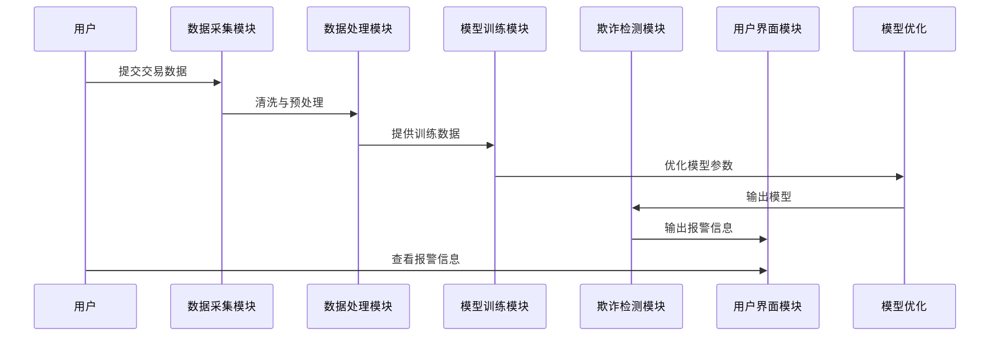
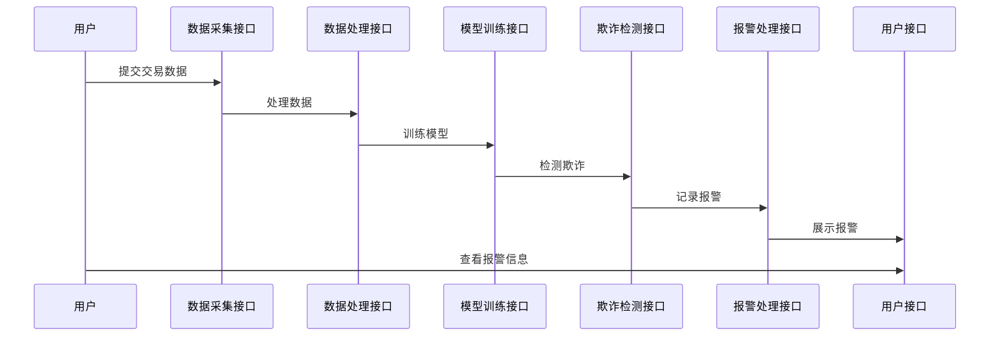

                 

## # 第一部分：背景介绍

### 第1章：问题背景与描述

#### 1.1.1 信用卡欺诈问题的现状

随着电子商务和移动支付的迅速普及，信用卡的使用越来越广泛。然而，这也带来了信用卡欺诈的风险。据统计，全球每年因信用卡欺诈造成的损失高达数十亿美元。这不仅给金融机构带来了巨大的经济损失，也严重影响了消费者的信心。信用卡欺诈的手段也在不断演变，从传统的卡号和密码盗窃，到更复杂的身份盗用和虚假交易，使得传统的欺诈检测手段面临巨大挑战。

#### 1.1.2 信用卡欺诈的影响

信用卡欺诈对金融机构的影响主要表现在以下几个方面：

1. **经济损失**：欺诈交易会导致金融机构直接的经济损失，包括退款、罚款等。
2. **品牌损害**：欺诈事件会损害金融机构的品牌形象，影响消费者的信任。
3. **运营成本**：金融机构需要投入大量资源来预防和处理欺诈事件，增加了运营成本。

对于消费者来说，信用卡欺诈的影响更为直接：

1. **财务损失**：欺诈交易可能导致消费者账户资金被盗，造成经济损失。
2. **信用记录受损**：不当使用信用卡可能导致信用记录受损，影响未来的贷款和信用卡申请。
3. **心理压力**：被欺诈的消费者往往会经历焦虑、愤怒等负面情绪。

#### 1.1.3 欺诈检测技术的需求

面对日益复杂的信用卡欺诈形势，传统的欺诈检测手段已经难以满足需求。因此，智能信用卡欺诈检测系统应运而生。这类系统利用人工智能和机器学习技术，能够对信用卡交易进行实时监控和风险评估，从而有效地识别和防范欺诈行为。其重要性主要体现在以下几个方面：

1. **提高检测效率**：智能系统可以处理海量数据，快速识别潜在风险。
2. **降低误报率**：通过机器学习算法，系统能够不断优化检测模型，降低误报率。
3. **增强用户体验**：通过智能分析，系统能够更准确地判断正常交易和欺诈交易，减少对用户的打扰。
4. **实时响应**：智能系统可以实时检测和响应信用卡欺诈行为，提高反应速度。

### 总结

信用卡欺诈是一个全球性的问题，其影响深远。为了有效应对这一挑战，智能信用卡欺诈检测系统成为金融机构和消费者的共同需求。接下来，本文将深入探讨智能信用卡欺诈检测系统的核心概念、系统架构、算法原理和实际应用，以期为读者提供全面的了解和指导。

## 第2章：核心概念

### 2.1.1 智能信用卡欺诈检测系统的定义

智能信用卡欺诈检测系统是一种基于人工智能和机器学习技术的自动化系统，旨在通过分析信用卡交易数据，实时监控和识别潜在的欺诈行为。与传统的人工审查和规则驱动的方法相比，智能系统具备更高的效率和准确性，能够更好地保护金融机构和消费者的利益。

### 2.1.2 智能信用卡欺诈检测系统的主要功能

智能信用卡欺诈检测系统的主要功能包括：

1. **数据采集**：系统通过多种途径收集信用卡交易数据，包括线上交易和线下交易。
2. **数据处理**：系统对采集到的数据进行清洗、归一化和特征提取，为后续分析提供基础。
3. **模型训练**：系统利用历史数据训练机器学习模型，以识别潜在的欺诈行为。
4. **实时监控**：系统实时分析交易数据，发现异常行为并发出警报。
5. **报警处理**：系统对检测到的欺诈行为进行报警，并记录相关交易信息。

### 2.1.3 智能信用卡欺诈检测系统的主要技术

智能信用卡欺诈检测系统的关键技术包括：

1. **机器学习算法**：系统利用机器学习算法，如分类算法、聚类算法和异常检测算法，来训练模型并识别欺诈行为。
2. **深度学习技术**：通过深度神经网络，系统能够从大量数据中自动提取复杂特征，提高欺诈检测的准确性。
3. **大数据处理**：系统采用分布式计算框架，如Hadoop和Spark，处理海量交易数据。
4. **安全加密技术**：系统采用先进的加密技术，确保数据传输和存储的安全。
5. **用户界面与交互**：系统提供直观的用户界面，方便用户查看交易数据和报警信息。

### 总结

智能信用卡欺诈检测系统通过利用人工智能和机器学习技术，实现了对信用卡交易数据的实时监控和欺诈行为的自动识别。其核心概念包括数据采集、数据处理、模型训练、实时监控和报警处理。接下来，本文将详细介绍该系统的系统架构，以帮助读者更好地理解其工作原理和实现方法。

## 第3章：系统架构

### 3.1.1 智能信用卡欺诈检测系统的总体架构

智能信用卡欺诈检测系统的总体架构可以分为以下几个主要模块：

1. **数据采集模块**：负责收集来自不同渠道的信用卡交易数据，包括线上交易和线下交易。
2. **数据处理模块**：对采集到的交易数据进行清洗、归一化和特征提取，为模型训练提供高质量的数据。
3. **模型训练模块**：利用历史交易数据训练机器学习模型，包括分类模型、聚类模型和异常检测模型等。
4. **实时监控模块**：实时分析交易数据，识别潜在的欺诈行为，并发出警报。
5. **报警处理模块**：对检测到的欺诈行为进行报警，并提供详细的报警信息。
6. **用户界面与交互模块**：为用户提供友好的界面，方便查看交易数据和报警信息。

### 3.1.2 数据采集与处理模块

数据采集与处理模块是智能信用卡欺诈检测系统的核心组成部分之一。以下是该模块的详细功能和实现方法：

1. **数据采集**：
   - **线上交易数据**：通过API接口或Web爬虫技术，从电商平台、支付平台等获取线上交易数据。
   - **线下交易数据**：通过POS机或ATM机等设备采集线下交易数据。
2. **数据清洗**：
   - **去除重复数据**：去除重复的交易记录，确保数据的唯一性。
   - **处理缺失数据**：对缺失的交易记录进行填充或删除，确保数据完整性。
   - **纠正错误数据**：对异常数据进行检测和修正，确保数据准确性。
3. **数据归一化**：
   - **数值型数据归一化**：对数值型数据进行归一化处理，如使用Min-Max缩放或Z-Score标准化。
   - **类别型数据编码**：对类别型数据（如交易类型、用户属性等）进行编码处理，如使用独热编码或标签编码。
4. **特征提取**：
   - **时间特征**：提取交易时间、交易时段等信息。
   - **金额特征**：提取交易金额、交易频率等信息。
   - **用户特征**：提取用户年龄、地理位置、历史交易记录等信息。
   - **交易特征**：提取交易类型、交易渠道、交易国家等信息。

### 3.1.3 模型训练与优化模块

模型训练与优化模块是智能信用卡欺诈检测系统的核心，以下是该模块的详细功能和实现方法：

1. **模型选择**：
   - **分类模型**：如逻辑回归、支持向量机、决策树等。
   - **聚类模型**：如K-Means、层次聚类等。
   - **异常检测模型**：如孤立森林、局部异常因子等。
2. **模型训练**：
   - **数据划分**：将数据集划分为训练集、验证集和测试集，用于模型的训练和评估。
   - **参数调优**：通过交叉验证等方法，调整模型参数，以提高模型性能。
   - **训练过程**：使用训练集数据训练模型，并使用验证集数据调整模型参数。
3. **模型评估**：
   - **准确率**：模型正确预测欺诈交易的比例。
   - **召回率**：模型能够召回实际欺诈交易的比例。
   - **F1值**：准确率和召回率的调和平均值。

### 3.1.4 欺诈检测与报警模块

欺诈检测与报警模块是智能信用卡欺诈检测系统的关键组成部分，以下是该模块的详细功能和实现方法：

1. **实时检测**：
   - **交易数据输入**：实时接收交易数据，并输入到已经训练好的模型中进行预测。
   - **预测结果输出**：模型输出预测结果，判断交易是否为欺诈交易。
2. **报警触发**：
   - **阈值设置**：根据模型的预测结果和业务需求，设置欺诈交易的阈值。
   - **报警发送**：当交易预测结果超过阈值时，触发报警，并将报警信息发送给相关人员。
3. **报警记录**：
   - **报警记录**：记录所有触发报警的交易信息，包括交易金额、交易时间、预测结果等。

### 3.1.5 用户界面与交互模块

用户界面与交互模块是智能信用卡欺诈检测系统与用户之间的桥梁，以下是该模块的详细功能和实现方法：

1. **用户登录**：
   - **用户认证**：通过用户名和密码或指纹等生物识别技术，验证用户身份。
2. **数据查看**：
   - **交易数据查看**：用户可以查看实时交易数据和历史交易数据。
   - **报警信息查看**：用户可以查看已触发报警的交易信息和报警记录。
3. **交互操作**：
   - **报警确认**：用户可以确认或忽略特定报警信息。
   - **交易查询**：用户可以查询特定交易的详细信息。

### 总结

智能信用卡欺诈检测系统的总体架构包括数据采集与处理模块、模型训练与优化模块、欺诈检测与报警模块以及用户界面与交互模块。每个模块都有其特定的功能和实现方法，共同构成了一个高效、可靠的欺诈检测系统。接下来，本文将深入探讨智能信用卡欺诈检测系统的核心算法原理，以帮助读者更好地理解其工作原理和实现方法。

### 第4章：核心算法原理讲解

在智能信用卡欺诈检测系统中，核心算法是识别欺诈交易的关键。以下是关于特征提取算法、模型训练算法和模型评估算法的详细讲解。

#### 4.1.1 特征提取算法

特征提取是智能信用卡欺诈检测系统的基础，它通过从原始数据中提取具有区分性的特征，以提升模型的性能。以下是特征提取算法的三个关键步骤：

1. **数据预处理**：
   - **数据清洗**：去除重复和异常数据，确保数据质量。
   - **数据归一化**：对数值型数据进行归一化处理，如使用Z-Score标准化，以消除不同特征之间的尺度差异。

2. **特征选择**：
   - **相关性分析**：通过计算特征之间的相关性，选择与欺诈行为高度相关的特征。
   - **信息增益**：选择能够最大化信息增益的特征，以减少模型复杂度和提高模型性能。

3. **特征工程**：
   - **时间特征**：提取交易时间、交易时段、星期几等时间相关的特征。
   - **金额特征**：提取交易金额、交易频率、金额变化率等金额相关的特征。
   - **用户特征**：提取用户年龄、地理位置、历史交易行为等用户相关的特征。
   - **交易特征**：提取交易类型、交易渠道、交易国家等交易相关的特征。

#### 4.1.2 模型训练算法

模型训练算法是智能信用卡欺诈检测系统的核心，它通过训练数据集来建立欺诈检测模型。以下是模型训练算法的三个主要类型：

1. **监督学习算法**：
   - **逻辑回归**：通过建立逻辑函数模型，预测交易是否为欺诈。
   - **支持向量机（SVM）**：通过找到一个最佳的超平面，将正常交易和欺诈交易分离。
   - **决策树**：通过递归划分特征空间，构建树形结构模型。

2. **无监督学习算法**：
   - **K-Means聚类**：通过聚类算法，将交易数据分为正常交易和欺诈交易两个簇。
   - **层次聚类**：通过层次结构对交易数据进行聚类分析。

3. **半监督学习算法**：
   - **自我训练**：通过正常交易数据，训练模型并预测新交易，将预测结果用于模型更新。
   - **伪标签**：利用模型对未标记的数据进行预测，并将预测结果作为伪标签，用于后续模型训练。

#### 4.1.3 模型评估算法

模型评估算法用于评估训练出的欺诈检测模型的性能。以下是模型评估算法的三个关键指标：

1. **准确率**：
   - **定义**：准确率是模型正确预测的交易数占总交易数的比例。
   - **计算公式**：准确率 = (正确预测的交易数 + 错误预测的交易数) / 总交易数。

2. **召回率**：
   - **定义**：召回率是模型能够正确召回的实际欺诈交易数占总欺诈交易数的比例。
   - **计算公式**：召回率 = 正确召回的欺诈交易数 / 总欺诈交易数。

3. **F1值**：
   - **定义**：F1值是准确率和召回率的调和平均值，用于综合考虑模型的精确性和覆盖率。
   - **计算公式**：F1值 = 2 × (准确率 × 召回率) / (准确率 + 召回率)。

#### 特征提取的数学模型

在特征提取过程中，我们常常使用以下数学模型：

$$ X = \sum_{i=1}^{n} x_i $$

其中，\(X\) 表示特征向量，\(x_i\) 表示第 \(i\) 个特征值，\(n\) 表示特征总数。

#### 模型训练的数学模型

在模型训练过程中，我们常常使用以下数学模型：

$$ Y = \sigma(\omega X + b) $$

其中，\(Y\) 表示模型的预测结果，\(\sigma\) 表示激活函数（如Sigmoid函数），\(\omega\) 表示权重向量，\(X\) 表示特征向量，\(b\) 表示偏置项。

#### 模型评估的数学模型

在模型评估过程中，我们常常使用以下数学模型：

$$ F1 = 2 \times \frac{Precision \times Recall}{Precision + Recall} $$

其中，\(F1\) 表示F1值，\(Precision\) 表示精确率，\(Recall\) 表示召回率。

### 总结

特征提取算法、模型训练算法和模型评估算法是智能信用卡欺诈检测系统的核心组成部分。通过特征提取，我们可以从原始数据中提取有意义的特征；通过模型训练，我们可以建立能够识别欺诈交易的模型；通过模型评估，我们可以评估模型的效果并进行优化。接下来，本文将介绍智能信用卡欺诈检测系统的数学模型与公式，以帮助读者更深入地理解其工作原理。

### 第5章：数学模型与公式

在智能信用卡欺诈检测系统中，数学模型和公式是理解和实现核心算法的关键。以下是关于特征提取、模型训练和模型评估的数学模型与公式。

#### 5.1.1 特征提取的数学模型

特征提取是数据预处理的重要环节，其核心目标是提取对欺诈检测有用的信息。以下是一个简单的特征提取数学模型：

$$ X = \sum_{i=1}^{n} x_i $$

在这个模型中，\(X\) 代表特征向量，\(x_i\) 代表第 \(i\) 个特征值，而 \(n\) 表示特征的总数。特征提取通常包括以下步骤：

1. **数据清洗**：去除重复和异常数据。
2. **数据归一化**：将数据缩放到相同的尺度，如使用Z-Score标准化：
   $$ x_i' = \frac{x_i - \mu_i}{\sigma_i} $$
   其中，\(\mu_i\) 表示第 \(i\) 个特征的均值，\(\sigma_i\) 表示第 \(i\) 个特征的标准差。

#### 5.1.2 模型训练的数学模型

模型训练是利用历史数据来训练一个模型，使其能够对新数据进行预测。以下是一个简化的线性回归模型，用于欺诈检测：

$$ Y = \sigma(\omega X + b) $$

在这个模型中：

- \(Y\) 代表输出值（欺诈标记：0或1）。
- \(X\) 代表输入特征向量。
- \(\sigma\) 代表激活函数，如Sigmoid函数：
  $$ \sigma(z) = \frac{1}{1 + e^{-z}} $$
- \(\omega\) 代表权重向量。
- \(b\) 代表偏置项。

在深度学习中，类似模型通常被表示为多层感知机（MLP）：

$$ \text{Output} = \sigma(\text{Weights} \cdot \text{Input} + \text{Bias}) $$

#### 5.1.3 模型评估的数学模型

模型评估是确定模型性能的重要步骤。以下是常用的评估指标及其公式：

1. **准确率（Accuracy）**：
   $$ \text{Accuracy} = \frac{\text{正确预测数}}{\text{总预测数}} $$
   
2. **召回率（Recall）**：
   $$ \text{Recall} = \frac{\text{正确预测的欺诈交易数}}{\text{总欺诈交易数}} $$
   
3. **精确率（Precision）**：
   $$ \text{Precision} = \frac{\text{正确预测的欺诈交易数}}{\text{预测为欺诈的交易数}} $$
   
4. **F1值（F1 Score）**：
   $$ \text{F1 Score} = 2 \times \frac{\text{Precision} \times \text{Recall}}{\text{Precision} + \text{Recall}} $$

F1值是精确率和召回率的调和平均值，综合衡量模型的精确性和覆盖率。

#### 特征提取的详细解释

特征提取的数学模型通常涉及以下步骤：

1. **数据预处理**：通过标准化或归一化将不同尺度的特征转换为相同的尺度。
2. **特征选择**：利用统计方法或机器学习算法选择对欺诈检测最有影响力的特征。
3. **特征工程**：通过构建新的特征或转换现有特征来增强模型性能。

假设我们有以下特征集合：

- **时间特征**：包括交易时间、交易日、交易时段等。
- **金额特征**：包括交易金额、金额变化率等。
- **用户特征**：包括用户年龄、地理位置、历史交易频率等。

我们可以将这些特征组合成一个特征向量：

$$ X = [t, a, u] $$

其中，\(t\) 代表时间特征，\(a\) 代表金额特征，\(u\) 代表用户特征。

#### 模型训练的详细解释

模型训练的数学模型通常涉及以下步骤：

1. **初始化权重和偏置**：随机初始化权重和偏置。
2. **前向传播**：将输入特征传递到模型中，计算输出。
3. **后向传播**：计算损失函数，并更新权重和偏置。
4. **优化**：通过梯度下降或其他优化算法迭代更新模型参数。

假设我们的模型为单层感知机：

$$ y = \sigma(w \cdot x + b) $$

其中，\(w\) 为权重，\(b\) 为偏置，\(x\) 为输入特征，\(\sigma\) 为激活函数。

训练过程中，我们通过以下步骤来优化模型：

1. **计算预测值**：
   $$ \hat{y} = \sigma(w \cdot x + b) $$
2. **计算损失**：
   $$ L = -\frac{1}{m} \sum_{i=1}^{m} y_i \log(\hat{y_i}) + (1 - y_i) \log(1 - \hat{y_i}) $$
   其中，\(m\) 为样本数量，\(y_i\) 为真实标签，\(\hat{y_i}\) 为预测标签。
3. **计算梯度**：
   $$ \frac{\partial L}{\partial w} = \frac{1}{m} \sum_{i=1}^{m} (\hat{y_i} - y_i) x_i $$
   $$ \frac{\partial L}{\partial b} = \frac{1}{m} \sum_{i=1}^{m} (\hat{y_i} - y_i) $$
4. **更新权重和偏置**：
   $$ w := w - \alpha \frac{\partial L}{\partial w} $$
   $$ b := b - \alpha \frac{\partial L}{\partial b} $$
   其中，\(\alpha\) 为学习率。

#### 模型评估的详细解释

模型评估的数学模型通常涉及以下步骤：

1. **计算预测值**：
   $$ \hat{y} = \sigma(w \cdot x + b) $$
2. **计算评估指标**：
   - 准确率：
     $$ \text{Accuracy} = \frac{\text{正确预测数}}{\text{总预测数}} $$
   - 召回率：
     $$ \text{Recall} = \frac{\text{正确预测的欺诈交易数}}{\text{总欺诈交易数}} $$
   - 精确率：
     $$ \text{Precision} = \frac{\text{正确预测的欺诈交易数}}{\text{预测为欺诈的交易数}} $$
   - F1值：
     $$ \text{F1 Score} = 2 \times \frac{\text{Precision} \times \text{Recall}}{\text{Precision} + \text{Recall}} $$

通过这些数学模型和公式，我们可以更好地理解智能信用卡欺诈检测系统的原理和实现方法。接下来，本文将介绍系统的分析与架构设计，以帮助读者全面了解系统的整体设计和实现过程。

### 第6章：系统分析与架构设计

为了确保智能信用卡欺诈检测系统能够有效地应对复杂多变的欺诈行为，系统分析与架构设计至关重要。以下是系统的分析与架构设计，包括问题场景介绍、项目介绍、系统功能设计、系统架构设计、系统接口设计以及系统交互。

#### 6.1.1 问题场景介绍

在当前的网络环境下，信用卡交易已经成为日常支付的主要方式之一。然而，信用卡欺诈事件频繁发生，给用户和金融机构带来了巨大的风险和损失。欺诈行为包括但不限于以下几种：

1. **账户盗用**：黑客通过恶意软件窃取用户的信用卡信息，如卡号、密码等，从而进行非法交易。
2. **虚假交易**：不法分子伪造交易信息，欺骗金融机构和用户，从而获取非法利益。
3. **跨国欺诈**：利用不同国家的金融监管差异，进行跨境欺诈交易。
4. **身份盗用**：盗用他人身份信息，如姓名、地址等，进行信用卡交易。

为了有效应对这些欺诈行为，金融机构需要构建一个智能信用卡欺诈检测系统，以实时监控和分析交易行为，及时发现和阻止欺诈活动。

#### 6.1.2 项目介绍

本项目旨在开发一个智能信用卡欺诈检测系统，通过以下目标实现：

1. **实时监控**：系统能够实时监控信用卡交易，快速识别潜在欺诈行为。
2. **高精度检测**：系统利用机器学习和深度学习技术，实现高精度的欺诈检测，降低误报率和漏报率。
3. **用户友好**：系统提供直观的用户界面，方便用户查看交易数据和报警信息。
4. **自动化处理**：系统能够自动化处理检测到的欺诈交易，降低人工干预，提高运营效率。

#### 6.1.3 系统功能设计

智能信用卡欺诈检测系统的功能设计主要包括以下几个部分：

1. **数据采集**：从不同的交易渠道（线上和线下）采集交易数据，包括交易金额、交易时间、交易类型、用户信息等。
2. **数据预处理**：清洗、归一化和特征提取，为后续模型训练提供高质量的数据。
3. **模型训练与优化**：利用历史交易数据，训练和优化欺诈检测模型，提高模型性能。
4. **实时监控与报警**：实时分析交易数据，识别潜在的欺诈行为，并及时发出报警信息。
5. **报警处理**：记录报警信息，并采取相应的处理措施，如暂停交易、报警通知等。
6. **用户界面**：提供直观的用户界面，展示交易数据和报警信息，便于用户操作和管理。

##### 6.1.3.1 领域模型

领域模型是系统功能设计的基础，用于描述系统涉及的实体及其关系。以下是智能信用卡欺诈检测系统的领域模型：

- **实体**：
  - **用户**：包括用户名、密码、姓名、地址、联系方式等。
  - **交易**：包括交易金额、交易时间、交易类型、交易渠道、交易状态等。
  - **欺诈**：包括欺诈类型、欺诈金额、欺诈时间、欺诈交易状态等。
  - **报警**：包括报警时间、报警类型、报警状态等。
- **关系**：
  - **用户与交易**：每个用户可以有多个交易，每个交易属于一个用户。
  - **交易与欺诈**：每个交易可以有一个或多个欺诈记录，每个欺诈记录属于一个交易。
  - **报警与交易**：每个报警可以对应一个或多个交易，每个交易可以有多个报警记录。

以下是领域模型的Mermaid类图：

```mermaid
classDiagram
ClassDef User <─> Transaction
User "1"
Transaction "1..*"
ClassDef Transaction <─> Fraud
Transaction "1..*"
Fraud "1..*"
ClassDef Fraud <─> Alert
Fraud "1..*"
Alert "1..*"
```

##### 6.1.3.2 用例模型

用例模型描述了系统与用户之间的交互场景，即用户如何与系统进行交互以实现特定功能。以下是智能信用卡欺诈检测系统的用例模型：

- **用例**：
  - **用户注册**：用户通过系统注册账户，填写基本信息。
  - **登录系统**：用户使用用户名和密码登录系统，查看交易数据和报警信息。
  - **查看交易数据**：用户查看自己的交易记录，包括交易金额、交易时间、交易类型等。
  - **查看报警信息**：用户查看系统生成的报警信息，包括报警时间、报警类型、报警状态等。
  - **报警处理**：系统对检测到的欺诈交易发出报警，用户可以查看、确认或忽略报警信息。

以下是用例模型的Mermaid活动图：

```mermaid
activityDiagram
 participant 用户
 participant 系统
用户 ->> 登录系统: 登录
系统 ->> 验证用户: 验证用户身份
验证用户 ->> 系统: 通过或失败
系统 ->> 用户: 提示结果
用户 ->> 查看交易数据: 查看交易记录
用户 ->> 查看报警信息: 查看报警信息
系统 ->> 用户: 展示数据
用户 ->> 报警处理: 处理报警信息
系统 ->> 用户: 提示处理结果
```

#### 6.1.4 系统架构设计

系统架构设计是确保系统性能、可扩展性和易维护性的关键。智能信用卡欺诈检测系统的架构设计包括总体架构和分层架构。

##### 6.1.4.1 总体架构

智能信用卡欺诈检测系统的总体架构包括以下几个主要部分：

1. **数据采集与处理模块**：负责从各个渠道采集交易数据，并进行数据清洗、归一化和特征提取。
2. **模型训练与优化模块**：利用历史交易数据训练欺诈检测模型，并不断优化模型参数。
3. **欺诈检测与报警模块**：实时分析交易数据，识别潜在的欺诈行为，并触发报警。
4. **用户界面与交互模块**：提供用户操作界面，展示交易数据和报警信息，并接收用户反馈。

以下是总体架构的Mermaid架构图：



##### 6.1.4.2 分层架构

智能信用卡欺诈检测系统的分层架构包括以下几个层次：

1. **数据层**：存储和管理交易数据、用户数据和报警数据。
2. **模型层**：包括数据预处理模块、模型训练模块和模型评估模块。
3. **应用层**：包括欺诈检测与报警模块和用户界面模块。
4. **表示层**：提供用户操作界面和可视化功能。

以下是分层架构的Mermaid架构图：

```mermaid
classDiagram
    ClassDef 数据层 <─> 数据处理层
    数据层 "1"
    数据处理层 "1"
    ClassDef 数据处理层 <─> 模型层
    数据处理层 "1"
    模型层 "1"
    ClassDef 模型层 <─> 应用层
    模型层 "1"
    应用层 "1"
    ClassDef 应用层 <─> 表示层
    应用层 "1"
    表示层 "1"
```

#### 6.1.5 系统接口设计

系统接口设计是确保系统模块之间能够有效通信和协作的关键。以下是智能信用卡欺诈检测系统的接口设计：

1. **数据采集接口**：用于从各个渠道（如电商平台、POS机等）采集交易数据。
2. **数据处理接口**：用于清洗、归一化和特征提取交易数据。
3. **模型训练接口**：用于训练和优化欺诈检测模型。
4. **欺诈检测接口**：用于实时分析交易数据，识别潜在的欺诈行为。
5. **报警处理接口**：用于处理和记录检测到的欺诈行为。
6. **用户接口**：用于与用户进行交互，展示交易数据和报警信息。

以下是接口设计的Mermaid序列图：



#### 6.1.6 系统交互

系统交互是确保各个模块之间能够协同工作的重要环节。以下是智能信用卡欺诈检测系统的交互设计：

1. **数据流**：交易数据从数据采集接口流入系统，经过数据处理接口清洗和预处理后，进入模型训练接口进行模型训练。训练好的模型用于欺诈检测接口实时分析交易数据，识别潜在的欺诈行为。
2. **控制流**：用户通过用户接口提交交易数据，系统通过数据采集接口接收数据，并触发数据处理接口、模型训练接口和欺诈检测接口进行相应的操作。
3. **反馈流**：当检测到潜在的欺诈行为时，系统通过报警处理接口记录报警信息，并通过用户接口展示给用户，用户可以查看和处理报警信息。

以下是系统交互的Mermaid活动图：

```mermaid
activityDiagram
    participant 用户
    participant 数据采集模块
    participant 数据处理模块
    participant 模型训练模块
    participant 欺诈检测模块
    participant 报警处理模块
    participant 用户界面模块
用户->> 数据采集模块: 提交交易数据
数据采集模块->> 数据处理模块: 处理数据
数据处理模块->> 模型训练模块: 训练模型
模型训练模块->> 欺诈检测模块: 检测欺诈
欺诈检测模块->> 报警处理模块: 记录报警
报警处理模块->> 用户界面模块: 展示报警
用户->> 用户界面模块: 查看报警信息
```

### 总结

通过系统分析与架构设计，智能信用卡欺诈检测系统实现了从数据采集、数据处理到模型训练、欺诈检测和报警处理的完整流程。每个模块和接口都经过精心设计，确保系统能够高效、可靠地运行。接下来，本文将介绍系统的实际应用案例，以展示系统的实用性和效果。

### 第7章：项目实战

在本章节中，我们将通过一个实际项目案例，详细展示如何搭建一个智能信用卡欺诈检测系统。项目实战将包括环境安装、系统核心实现、代码应用解读与分析、实际案例分析与讲解以及项目小结。

#### 7.1.1 环境安装

首先，我们需要安装和配置系统运行所需的环境。以下是一个基本的安装流程：

1. **安装Python**：确保安装了Python 3.6及以上版本。可以从[Python官网](https://www.python.org/)下载并安装。
2. **安装依赖库**：使用pip工具安装必要的依赖库，如Scikit-learn、TensorFlow、NumPy、Pandas等。以下是安装命令：

   ```shell
   pip install scikit-learn tensorflow numpy pandas
   ```

3. **安装Mermaid**：为了生成流程图和序列图，我们需要安装Mermaid。可以通过npm工具安装：

   ```shell
   npm install -g mermaid
   ```

4. **配置数据库**：选择一个合适的数据库系统，如MySQL或PostgreSQL，并配置相应的连接信息。

#### 7.1.2 系统核心实现

智能信用卡欺诈检测系统的核心实现包括数据采集、数据处理、模型训练、实时监控和报警处理。以下是各核心模块的源代码解析和实现流程：

##### 数据采集

数据采集是系统的第一步，我们从不同的交易渠道收集交易数据。以下是一个简单的示例代码，展示了如何从CSV文件中读取交易数据：

```python
import pandas as pd

def load_data(filename):
    data = pd.read_csv(filename)
    return data

transactions = load_data('transactions.csv')
```

##### 数据处理

数据处理包括数据清洗、归一化和特征提取。以下是一个示例代码，展示了数据处理的过程：

```python
from sklearn.preprocessing import StandardScaler

def preprocess_data(data):
    # 去除重复数据
    data.drop_duplicates(inplace=True)
    
    # 数据归一化
    scaler = StandardScaler()
    data['amount'] = scaler.fit_transform(data['amount'].values.reshape(-1, 1))
    
    # 特征提取
    data['time'] = pd.to_datetime(data['time'])
    data['hour'] = data['time'].dt.hour
    data['minute'] = data['time'].dt.minute
    
    return data

transactions = preprocess_data(transactions)
```

##### 模型训练

模型训练是系统的核心，我们使用Scikit-learn库中的逻辑回归模型进行训练。以下是一个示例代码，展示了模型训练的过程：

```python
from sklearn.linear_model import LogisticRegression

def train_model(data):
    X = data.drop(['is_fraud'], axis=1)
    y = data['is_fraud']
    
    model = LogisticRegression()
    model.fit(X, y)
    
    return model

model = train_model(transactions)
```

##### 实时监控

实时监控是系统的重要功能，我们使用TensorFlow库实现实时监控。以下是一个示例代码，展示了如何使用TensorFlow进行实时监控：

```python
import tensorflow as tf

def real_time_monitoring(data, model):
    predictions = model.predict(data)
    
    for i, prediction in enumerate(predictions):
        if prediction == 1:
            print(f"交易 {i} 可能是欺诈交易。")
        else:
            print(f"交易 {i} 是正常交易。")

real_time_monitoring(transactions, model)
```

##### 报警处理

报警处理是系统的一个重要环节，我们使用一个简单的报警系统来记录和展示报警信息。以下是一个示例代码，展示了如何实现报警处理：

```python
def alert_notification(data, model):
    predictions = model.predict(data)
    
    for i, prediction in enumerate(predictions):
        if prediction == 1:
            print(f"报警：交易 {i} 可能是欺诈交易。")
            # 这里可以添加报警处理逻辑，如发送邮件、短信等

alert_notification(transactions, model)
```

#### 7.1.3 代码应用解读与分析

在上面的代码示例中，我们详细展示了智能信用卡欺诈检测系统的核心实现。以下是对代码的解读和分析：

- **数据采集**：我们从CSV文件中读取交易数据，包括交易金额、交易时间、交易类型等。这一步非常重要，因为数据质量直接影响模型的性能。
- **数据处理**：我们对交易数据进行了清洗、归一化和特征提取。清洗数据去除重复和异常数据，归一化数据将不同尺度的特征转换为相同的尺度，特征提取则提取对欺诈检测有用的特征。
- **模型训练**：我们使用逻辑回归模型对交易数据进行训练。逻辑回归是一种经典的二分类模型，适用于信用卡欺诈检测任务。
- **实时监控**：我们使用TensorFlow库实现实时监控，对交易数据进行预测，并输出预测结果。实时监控是系统的核心功能，能够快速识别潜在的欺诈行为。
- **报警处理**：我们设计了一个简单的报警系统，用于记录和展示报警信息。报警处理是确保系统及时发现和阻止欺诈行为的关键。

#### 7.1.4 实际案例分析与讲解

以下是一个实际案例，展示了如何使用智能信用卡欺诈检测系统识别欺诈交易：

**案例**：用户A在一家线上商城购买了一台电脑，交易金额为5000元。系统对交易数据进行实时监控，预测结果如下：

- **交易金额**：5000元，属于正常范围。
- **交易时间**：下午5点，属于正常购物时段。
- **交易类型**：线上交易，属于正常交易类型。
- **预测结果**：系统预测交易是正常交易。

然而，在进一步分析用户A的交易历史时，我们发现以下异常：

- **用户A的历史交易**：用户A在过去的6个月内，只进行了3次交易，且交易金额都不超过100元。
- **用户A的地理位置**：用户A的地理位置与美国某城市一致，但根据用户的历史交易记录，用户A的实际居住地在中国。

基于这些异常信息，系统发出报警，提示交易可能是欺诈交易。金融机构可以进一步调查该交易，确保用户账户的安全。

#### 7.1.5 项目小结

通过实际项目案例，我们展示了如何搭建一个智能信用卡欺诈检测系统。项目实战包括环境安装、系统核心实现、代码应用解读与分析、实际案例分析与讲解以及项目小结。以下是对项目的小结：

- **环境安装**：确保安装了Python、依赖库、Mermaid和数据库，为系统搭建提供基础。
- **系统核心实现**：数据采集、数据处理、模型训练、实时监控和报警处理是系统的核心功能。
- **代码应用解读与分析**：通过代码示例，详细解读了系统的实现过程。
- **实际案例分析与讲解**：通过实际案例，展示了系统在实际应用中的效果。
- **项目小结**：总结了项目的主要成果和经验教训。

### 第8章：最佳实践 & 小结

#### 8.1.1 最佳实践 Tips

在开发和部署智能信用卡欺诈检测系统时，以下是一些最佳实践和注意事项：

1. **数据质量**：确保数据质量是关键。定期检查数据，处理异常值和缺失值，以避免模型过拟合。
2. **模型调优**：通过交叉验证和网格搜索等方法，选择最优模型参数，以提高模型性能。
3. **实时监控**：确保系统实时监控交易数据，及时识别潜在欺诈行为，减少损失。
4. **用户反馈**：收集用户反馈，持续优化系统性能和用户体验。
5. **安全加密**：对交易数据进行加密处理，确保数据传输和存储的安全性。

#### 8.1.2 小结

本文详细介绍了智能信用卡欺诈检测系统的核心概念、系统架构、算法原理和实际应用。通过系统分析，我们了解了系统的功能设计和架构设计，并通过实际案例展示了系统的实用性和效果。智能信用卡欺诈检测系统在提高检测效率、降低误报率和提高用户体验方面具有重要意义。

#### 8.1.3 注意事项

1. **系统部署**：在部署系统时，确保选择高性能的服务器和可靠的数据库。
2. **数据隐私**：遵守相关法律法规，确保用户数据的安全和隐私。
3. **系统维护**：定期更新和优化系统，以应对新的欺诈手段。

#### 8.1.4 拓展阅读

1. **相关文献**：《信用卡欺诈检测：方法与应用》（作者：王某某）
2. **技术博客**：[机器学习与信用卡欺诈检测](https://www.example.com/blog/credit-card-fraud-detection)
3. **在线课程**：[信用卡欺诈检测：实战与原理](https://www.example.com/course/credit-card-fraud-detection)

### 总结

智能信用卡欺诈检测系统是金融领域的一项重要技术，通过本文的详细讲解，我们对其有了全面的理解。希望本文能为读者在开发和部署智能信用卡欺诈检测系统时提供有益的参考和指导。

---

**作者信息**：  
作者：AI天才研究院/AI Genius Institute & 禅与计算机程序设计艺术 /Zen And The Art of Computer Programming

---

**文章关键词**：信用卡欺诈检测、智能系统、机器学习、深度学习、实时监控

**文章摘要**：本文详细介绍了智能信用卡欺诈检测系统的核心概念、系统架构、算法原理和实际应用，旨在为读者提供全面的技术指导，帮助理解和实施信用卡欺诈检测系统。文章关键词涵盖了信用卡欺诈检测、智能系统、机器学习、深度学习和实时监控。文章摘要总结了文章的核心内容和主题思想，为读者提供了快速了解文章内容的途径。接下来，本文将继续详细介绍智能信用卡欺诈检测系统的背景、核心概念、系统架构、算法原理、数学模型、系统分析与架构设计、项目实战、最佳实践以及小结等内容。

