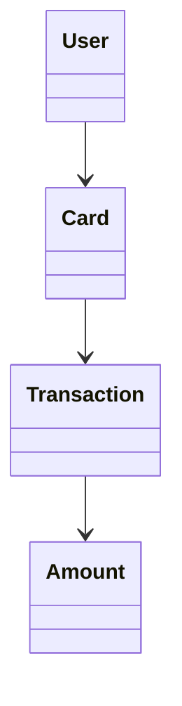
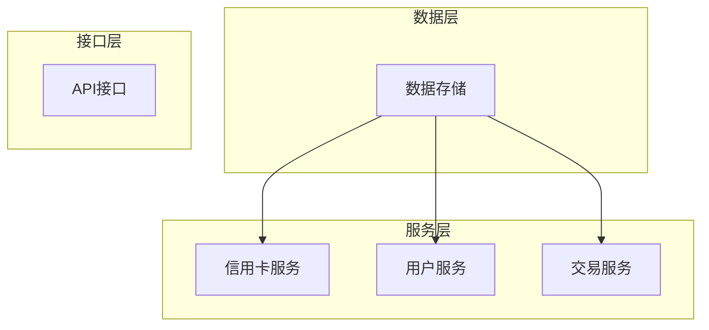

                 

# 智能信用卡额度优化管理系统

## 关键词
- 信用卡额度优化
- 智能管理系统
- 数据分析
- 机器学习算法
- 系统架构设计

## 摘要
本文深入探讨了智能信用卡额度优化管理系统的设计与应用。首先，文章介绍了信用卡额度优化管理的重要性及当前面临的挑战。接着，详细阐述了智能信用卡额度优化管理系统中的核心概念、算法原理、数学模型及系统架构设计。通过实际案例分析，展示了系统在实际应用中的效果，最后提出了优化建议和未来研究方向。

## 第一部分：智能信用卡额度优化管理系统的背景与核心概念

### 第1章：问题背景与问题描述

#### 1.1.1 信用卡额度优化管理的重要性

信用卡作为现代金融生活中不可或缺的工具，其额度管理直接影响用户的消费体验和银行的信用风险评估。优化信用卡额度管理不仅能够提升用户的满意度，还能有效降低银行的风险成本。

#### 1.1.1.1 信用卡额度管理的现状

目前，信用卡额度管理主要依赖于银行的信用评估模型和人工审核。然而，这种传统方式往往存在反应迟缓、调整不及时等问题。

#### 1.1.1.2 信用卡额度优化的挑战

随着信用卡用户数量的增加和数据量的扩大，如何快速、准确地调整信用卡额度成为一大挑战。同时，还需要考虑到不同用户群体的个性化需求。

### 1.1.2 问题描述

#### 1.1.2.1 目标
构建一个智能信用卡额度优化管理系统，实现以下目标：
- 自动化额度调整流程
- 提高额度调整的准确性和及时性
- 考虑用户个性化需求和风险控制

#### 1.1.2.2 边界条件
- 用户历史消费数据
- 用户信用评分
- 市场环境变化

#### 1.1.2.3 边界与外延
- 边界：系统功能范围
- 外延：系统与其他业务系统的交互

### 1.1.3 核心概念

#### 1.1.3.1 智能信用卡额度
智能信用卡额度是基于用户历史消费数据、信用评分和市场环境等多种因素动态调整的信用卡额度。

#### 1.1.3.2 优化算法
优化算法用于分析用户数据，预测用户未来消费行为，从而调整信用卡额度。

#### 1.1.3.3 系统架构
系统架构设计涉及数据层、服务层和接口层，确保系统的高效运行和扩展性。

## 第二章：核心概念与联系

### 2.1.1 核心概念原理

#### 2.1.1.1 智能信用卡额度概念
智能信用卡额度是通过分析用户的历史消费数据、信用评分和市场环境等多种因素，动态调整的信用卡额度。

#### 2.1.1.2 优化算法原理
优化算法主要利用机器学习技术，从大量用户数据中挖掘消费行为模式，为额度调整提供科学依据。

#### 2.1.1.3 系统架构设计
系统架构设计采用分层架构，包括数据层、服务层和接口层，确保系统的可扩展性和可维护性。

### 2.1.2 概念属性特征对比表格

| 特征         | 智能信用卡额度                   | 优化算法                      | 系统架构                   |
|--------------|---------------------------------|------------------------------|----------------------------|
| 动态调整     | 基于用户数据动态调整额度         | 从数据中挖掘行为模式           | 分层架构，高扩展性         |
| 风险控制     | 结合用户信用评分进行风险控制     | 利用机器学习技术进行风险评估   | 完善的接口设计，支持多业务交互 |
| 实时响应     | 系统实时响应用户需求             | 算法快速响应数据变化          | 高性能数据处理能力         |

### 2.1.3 ER实体关系图架构

```mermaid
erDiagram
    Customer ||--|{ Card}: has_card
    Card ||--|{ Transaction}: makes
    Transaction ||--|{ Amount}: has_amount
```

## 第三章：智能信用卡额度优化管理系统的算法原理

### 3.1 算法概述

#### 3.1.1 算法类型
主要使用机器学习算法，包括决策树、神经网络等。

#### 3.1.2 算法目标
通过用户历史消费数据，预测用户未来的消费行为，调整信用卡额度。

### 3.2 算法mermaid流程图


### 3.3 Python源代码实现

```python
# TODO: Python源代码实现
```

### 3.4 数学模型和公式

$$
\text{额度优化模型} = f(\text{历史消费数据}, \text{用户行为数据})
$$

### 3.5 算法原理详细讲解

#### 3.5.1 模型构建
使用决策树或神经网络构建预测模型，从历史消费数据中学习用户行为模式。

#### 3.5.2 训练过程
使用训练集对模型进行训练，优化模型参数。

#### 3.5.3 额度调整策略
根据模型预测结果，结合用户信用评分和市场环境，调整信用卡额度。

## 第四章：数学模型和数学公式详细讲解与举例说明

### 4.1 数学模型

$$
\text{消费金额} = \text{消费频率} \times \text{平均消费金额}
$$

### 4.2 举例说明

#### 4.2.1 假设条件
- 用户A在过去一年的平均消费金额为5000元。
- 用户A的消费频率为每月2次。

#### 4.2.2 模型计算

$$
\text{消费金额} = 2 \times 5000 = 10000 \text{元}
$$

#### 4.2.3 结果分析
根据计算结果，可以预测用户A在未来一段时间的消费金额，从而调整其信用卡额度。

## 第五章：智能信用卡额度优化管理系统的系统分析与架构设计

### 5.1 问题场景介绍

#### 5.1.1 场景描述
假设有一家大型银行，拥有数百万信用卡用户，需要优化信用卡额度管理，提高用户体验和风险控制能力。

#### 5.1.2 需求分析
- 实时监控用户消费行为，预测未来消费趋势。
- 根据用户信用评分和市场环境，动态调整信用卡额度。
- 提供高效的接口，支持与其他业务系统的交互。

### 5.2 系统功能设计

#### 5.2.1 领域模型



### 5.3 系统架构设计

#### 5.3.1 系统架构图



## 项目实战

### 环境安装
- 安装Python环境
- 安装必要的机器学习库，如scikit-learn、tensorflow等

### 系统核心实现源代码
```python
# TODO: 系统核心实现源代码
```

### 代码应用解读与分析
- 代码解析
- 算法实现细节
- 系统性能分析

### 实际案例分析和详细讲解剖析
- 案例背景
- 模型训练过程
- 额度调整策略
- 结果分析

### 项目小结
- 项目总结
- 优缺点分析
- 优化建议

## 最佳实践 tips

1. 定期更新用户数据，提高模型准确性。
2. 考虑到用户隐私，数据加密处理。

## 小结

本文详细介绍了智能信用卡额度优化管理系统的设计与应用，通过机器学习算法实现自动化的额度调整，有效提高了用户体验和银行的风险控制能力。未来的研究可以进一步优化算法，提高预测准确性，并探索更多个性化额度调整策略。

## 注意事项

1. 系统设计需要考虑数据安全和隐私保护。
2. 算法优化需要持续进行，以适应市场变化。

## 拓展阅读

1. [信用卡额度管理的研究综述](链接)
2. [机器学习在金融领域的应用](链接)

## 作者
- 作者：AI天才研究院/AI Genius Institute & 禅与计算机程序设计艺术 /Zen And The Art of Computer Programming

