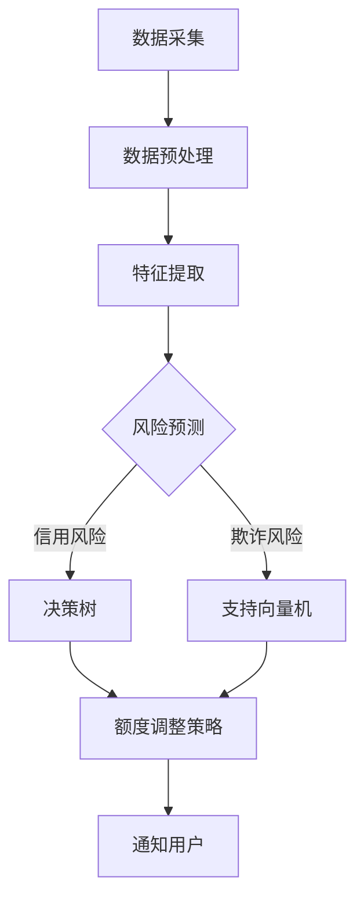
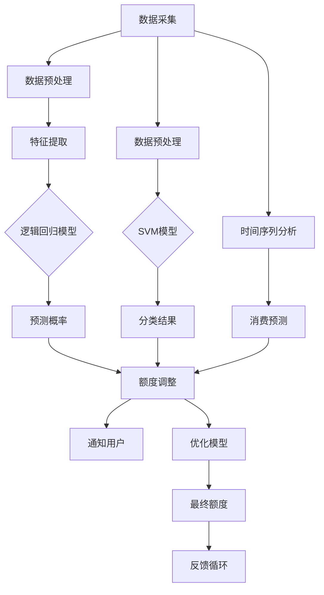
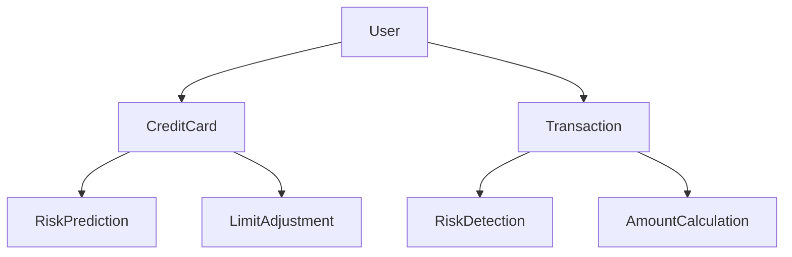

                 

### 智能信用卡额度管理优化系统概述

在现代社会，信用卡已经成为人们日常生活和商务交易中不可或缺的支付工具。随着金融科技的迅猛发展，传统信用卡额度管理的局限性逐渐显现。为了满足用户个性化需求和提高银行风控能力，智能信用卡额度管理优化系统应运而生。

#### 关键词：
- 智能信用卡
- 额度管理
- 优化系统
- 金融科技
- 风险控制

#### 摘要：
本文将围绕智能信用卡额度管理优化系统展开，探讨其背景、核心概念、技术原理、系统架构和项目实战，旨在为读者提供一个全面的技术解读和实践指导。

#### 1.1 问题背景

传统信用卡额度管理主要依赖于用户的历史信用记录和银行的风险评估模型。然而，这种方法存在诸多局限性：

1. **固定额度限制**：用户无法根据实际消费需求灵活调整额度。
2. **风险评估滞后**：银行在调整额度时缺乏实时性，难以应对突发风险。
3. **用户满意度低**：无法满足个性化需求，用户体验不佳。
4. **风险控制困难**：传统的风险管理方法难以全面覆盖新型风险。

#### 1.2 核心概念

**智能信用卡额度管理**：通过运用人工智能、大数据分析等技术，对用户的消费行为、信用记录、市场动态等多维数据进行实时分析和预测，从而动态调整信用卡额度。

**优化系统**：旨在通过技术手段，提高信用卡额度管理的效率和准确性，增强银行的风险控制能力，同时提升用户的满意度。

#### 1.3 概念联系与边界

智能信用卡额度管理优化系统的核心联系在于其技术与金融服务的融合。边界则包括：

- **技术范畴**：包括人工智能算法、数据挖掘、机器学习等。
- **金融范畴**：涉及风险管理、用户体验、市场策略等。

#### 1.4 智能信用卡额度管理的目标

- **提升用户体验**：通过个性化额度调整，满足用户多样化需求。
- **增强风险控制**：利用数据分析和模型预测，实时监控和调整额度，降低风险。
- **提高运营效率**：自动化流程减少人工干预，降低管理成本。
- **优化业务策略**：数据驱动的决策支持，助力银行优化业务运营。

在接下来的章节中，我们将深入探讨智能信用卡额度管理优化系统的理论基础、算法原理、系统架构和实际应用，为读者提供全面的技术解读和实践指导。通过这一系列内容，读者将能够理解如何运用先进技术提升信用卡额度管理的效率和效果。

### 问题背景与核心概念

#### 2.1 问题背景

随着信用卡在全球范围内的普及，传统信用卡额度管理方式已逐渐无法满足现代金融需求。传统信用卡额度管理主要依赖于用户的信用评分和银行的历史数据，这种方式存在以下几大问题：

1. **固定额度限制**：传统信用卡额度是固定的，用户无法根据实际消费需求进行灵活调整。这导致用户在消费高峰期或特殊情况下，无法充分发挥信用卡的支付能力。
   
2. **风险评估滞后**：银行在调整额度时，通常依赖于用户的历史信用记录和风险评估模型。这些模型往往无法实时反映用户当前的经济状况和信用风险，导致额度调整滞后，无法及时应对突发风险。

3. **用户满意度低**：无法满足个性化需求，导致用户对信用卡的使用体验不佳。许多用户在遇到额度不足或被突然降低额度时，会感到困惑和不满。

4. **风险控制困难**：传统的风险管理方法难以全面覆盖新型风险，例如欺诈行为、市场波动等。这增加了银行的风险控制难度，也降低了信用卡的安全性和可靠性。

5. **运营效率低下**：传统额度管理需要大量人工操作，涉及审批、数据分析等多个环节，导致运营效率低下，增加了管理成本。

#### 2.2 核心概念

为了解决上述问题，智能信用卡额度管理优化系统应运而生。智能信用卡额度管理是指通过应用人工智能、大数据分析、机器学习等技术，对用户的消费行为、信用记录、市场动态等多维数据进行实时分析和预测，从而动态调整信用卡额度。这一系统的核心概念包括：

1. **数据驱动**：智能信用卡额度管理基于海量数据，包括用户的消费数据、信用数据、市场数据等，通过数据分析技术提取有价值的信息，为额度调整提供依据。

2. **实时调整**：通过实时监控用户的消费行为和信用状况，系统能够在短时间内对信用卡额度进行调整，从而满足用户个性化需求，提高用户满意度。

3. **风险预测**：利用机器学习算法，系统可以预测用户的信用风险和市场风险，提前采取措施，降低银行的风险敞口。

4. **自动化处理**：通过自动化流程，减少人工干预，提高额度管理效率和准确性。

5. **个性化服务**：智能信用卡额度管理系统能够根据用户的消费习惯和信用状况，提供个性化的额度调整建议，提升用户体验。

#### 2.3 问题解决

智能信用卡额度管理优化系统通过以下几方面解决了传统额度管理存在的问题：

1. **灵活调整额度**：系统能够根据用户的消费需求和市场动态，实时调整信用卡额度，满足用户在不同场景下的支付需求。

2. **实时风险评估**：通过实时监控和预测用户的信用风险，系统可以在风险发生前采取预防措施，降低银行的风险敞口。

3. **提高用户体验**：通过个性化的额度调整，系统提高了用户对信用卡的满意度，增强了用户的忠诚度。

4. **降低运营成本**：自动化流程减少了人工操作，提高了额度管理的效率和准确性，降低了运营成本。

5. **增强风险管理**：利用数据分析和机器学习算法，系统能够更全面地覆盖风险，提高风险管理的精准度和有效性。

#### 2.4 边界与外延

智能信用卡额度管理优化系统的边界主要涉及技术范畴和金融范畴：

1. **技术范畴**：包括人工智能算法、大数据分析、机器学习、区块链技术等。这些技术为系统提供了强大的数据处理和分析能力，是实现智能额度管理的基础。

2. **金融范畴**：包括风险管理、用户体验、市场策略等。智能额度管理不仅要考虑技术实现，还要结合金融业务的需求和特点，确保系统的实用性和有效性。

3. **外延**：智能信用卡额度管理优化系统不仅适用于信用卡，还可以拓展到其他金融产品，如消费贷、车贷等。同时，其技术原理和方法也可以应用于其他行业的数据分析和风险控制领域。

在接下来的章节中，我们将进一步探讨智能信用卡额度管理优化系统的理论基础、算法原理、系统架构和实际应用，为读者提供全面的技术解读和实践指导。

### 智能信用卡额度管理理论

#### 3.1 信用卡额度管理现状

当前的信用卡额度管理主要依赖于用户的信用评分和银行的历史数据。传统的信用卡额度管理方式主要基于以下几个核心要素：

1. **信用评分**：银行通过评估用户的信用历史、信用报告、收入状况等，为用户设定一个初始信用额度。信用评分通常由信用评级机构提供，反映用户的历史信用行为和信用风险。

2. **历史数据**：银行会分析用户过去的消费行为，包括消费频率、消费金额、还款记录等，以判断用户的信用状况。这些历史数据为银行调整额度提供了重要依据。

3. **市场动态**：银行还会考虑市场利率、通货膨胀、经济形势等因素，以制定相应的额度调整策略。例如，在经济繁荣时期，银行可能会提高用户额度，以刺激消费；在经济低迷时期，银行可能会降低额度，以规避风险。

4. **人工审批**：尽管数据技术在额度管理中发挥了重要作用，但最终决策仍然需要人工审批。银行会根据数据分析结果，结合业务需求和风险控制目标，决定是否调整额度。

#### 3.2 智能额度管理优势

智能信用卡额度管理优化系统相比传统方法具有明显优势：

1. **实时调整**：智能系统可以实时监控用户的消费行为和信用状况，根据实时数据动态调整额度。这种实时性可以更好地满足用户的个性化需求，提高用户满意度。

2. **精准预测**：利用机器学习算法，智能系统可以预测用户的信用风险和市场风险，提前采取预防措施。相比传统的基于历史数据的评估方法，智能系统能够更准确地预测未来风险。

3. **自动化处理**：智能系统通过自动化流程，减少了人工干预，提高了额度管理的效率和准确性。自动化处理不仅降低了运营成本，还减少了人为错误，提高了风险管理能力。

4. **个性化服务**：智能系统能够根据用户的消费习惯和信用状况，提供个性化的额度调整建议。这种个性化服务可以更好地满足用户的需求，提升用户体验。

5. **数据驱动**：智能系统基于海量数据，包括用户消费数据、信用数据、市场数据等，通过数据分析技术提取有价值的信息，为额度调整提供科学依据。数据驱动的方法使得额度管理更加客观、公正、透明。

#### 3.3 市场需求与机遇

随着金融科技的快速发展，市场对智能信用卡额度管理的需求日益增长。以下几个因素推动了这一需求：

1. **用户需求多样化**：现代用户对信用卡的需求更加多样化，不仅希望有足够的额度，还希望享受个性化的服务。智能系统可以更好地满足这些需求，提高用户满意度。

2. **金融风险多样化**：金融市场的变化越来越快，新型风险层出不穷。智能系统能够实时监控和预测风险，为银行提供更全面的风险管理方案。

3. **数据资源丰富**：随着大数据技术的发展，银行可以获得越来越多的用户数据。这些数据为智能系统的开发和应用提供了丰富的数据基础。

4. **技术进步**：人工智能、机器学习、区块链等技术的不断进步，为智能信用卡额度管理提供了强大的技术支持。

5. **政策支持**：各国政府和金融监管机构对金融科技创新持支持态度，为智能信用卡额度管理的发展创造了有利环境。

综上所述，智能信用卡额度管理优化系统在当前金融市场具有广阔的市场需求和巨大的发展机遇。通过结合先进技术和金融业务需求，智能系统有望成为未来信用卡额度管理的重要手段，为银行和用户提供更好的服务。

### 优化系统设计原则

智能信用卡额度管理优化系统的设计原则是确保系统高效、安全、可靠，同时满足用户的个性化需求和提高银行的风险控制能力。以下是系统设计的主要目标、原则和架构设计思路：

#### 4.1 设计目标

1. **实时动态调整**：系统应能够实时监控用户的消费行为和信用状况，动态调整信用卡额度，确保用户在不同场景下有足够的支付能力。

2. **精准风险评估**：系统应利用机器学习算法和大数据分析技术，对用户的信用风险和市场风险进行精准预测，为额度调整提供科学依据。

3. **自动化处理**：系统应实现自动化额度调整和管理，减少人工干预，提高管理效率和准确性，降低运营成本。

4. **个性化服务**：系统应能够根据用户的消费习惯和信用状况，提供个性化的额度调整建议，提升用户体验。

5. **安全可靠**：系统应确保用户数据的安全性和隐私保护，防范潜在的风险和欺诈行为。

#### 4.2 设计原则

1. **数据驱动**：系统设计应以数据为核心，利用大数据分析技术，提取用户消费数据、信用数据等有价值信息，为额度调整提供依据。

2. **模块化设计**：系统应采用模块化设计，将不同的功能模块（如数据采集、数据处理、风险预测、额度调整等）独立开发，确保系统可扩展性和维护性。

3. **用户导向**：系统设计应充分考虑用户需求，提供简洁易用的界面和个性化服务，提升用户体验。

4. **灵活性强**：系统应具备较强的灵活性，能够适应不同银行和用户的需求，支持定制化额度调整策略。

5. **安全可靠**：系统应采用严格的安全措施，包括数据加密、访问控制、异常检测等，确保用户数据的安全性和系统的可靠性。

#### 4.3 架构设计思路

智能信用卡额度管理优化系统架构设计主要分为以下几个层次：

1. **数据采集层**：负责从银行内部系统和外部数据源（如电商平台、社交平台等）采集用户消费数据、信用数据等，保证数据的实时性和完整性。

2. **数据处理层**：对采集到的数据进行分析和清洗，提取有价值的信息，如消费频率、消费金额、还款记录等，为额度调整提供依据。

3. **风险预测层**：利用机器学习算法，对用户的风险进行实时预测，包括信用风险、欺诈风险等，为额度调整提供风险评估结果。

4. **额度调整层**：根据风险预测结果和用户个性化需求，动态调整信用卡额度。额度调整策略可以根据银行业务需求和风险控制目标进行配置。

5. **用户服务层**：为用户提供实时额度查询、额度调整申请、个性化额度调整建议等一站式服务，提升用户体验。

6. **安全管理层**：确保系统用户数据的安全性和隐私保护，包括数据加密、访问控制、异常检测等安全措施。

通过上述架构设计思路，智能信用卡额度管理优化系统可以实现高效、安全、可靠的额度管理，满足银行和用户的多样化需求。

### 系统核心算法原理

智能信用卡额度管理优化系统的核心在于其算法原理，这些算法能够对用户的消费行为进行实时分析和预测，从而动态调整信用卡额度。本章节将详细介绍系统所采用的算法概述、算法流程图、Python源代码实现，以及算法原理的数学模型和公式讲解。

#### 5.1 算法概述

智能信用卡额度管理优化系统主要采用以下几种算法：

1. **机器学习算法**：如决策树、随机森林、支持向量机（SVM）等，用于预测用户的信用风险和消费行为。
2. **大数据分析算法**：如聚类分析、关联规则挖掘等，用于分析用户的消费数据，提取有价值的信息。
3. **时间序列分析算法**：如ARIMA、LSTM等，用于分析用户的消费趋势和预测未来的消费行为。

选择这些算法的原因在于：

- **机器学习算法**：具有强大的预测能力，能够从历史数据中学习并预测未来行为，适用于实时风险预测和额度调整。
- **大数据分析算法**：能够处理海量数据，提取隐藏的模式和信息，为额度调整提供科学依据。
- **时间序列分析算法**：能够捕捉消费行为的趋势和周期性变化，帮助预测未来的消费行为。

#### 5.2 算法流程图

为了更好地理解算法的执行过程，我们使用Mermaid语言绘制了算法流程图，如下所示：



**图 1：智能信用卡额度管理优化系统算法流程图**

流程图说明：

1. **数据采集**：从银行内部系统和外部数据源采集用户消费数据、信用数据等。
2. **数据预处理**：对采集到的数据进行清洗和标准化处理，保证数据的质量。
3. **特征提取**：从预处理后的数据中提取有价值的特征，如消费频率、消费金额、还款记录等。
4. **风险预测**：利用机器学习算法和大数据分析算法，对用户的信用风险和欺诈风险进行预测。
5. **额度调整策略**：根据风险预测结果和用户个性化需求，动态调整信用卡额度。
6. **通知用户**：将额度调整结果通知用户，提升用户体验。

#### 5.3 Python源代码实现

为了具体展示算法的实现过程，我们使用Python编写了相应的代码。以下是一个简化的示例：

```python
# 导入所需库
import pandas as pd
from sklearn.tree import DecisionTreeClassifier
from sklearn.svm import SVC
from sklearn.model_selection import train_test_split
from sklearn.metrics import accuracy_score

# 数据预处理
def preprocess_data(data):
    # 数据清洗和标准化处理
    # ...
    return processed_data

# 风险预测
def risk_prediction(data, model_type):
    if model_type == 'DecisionTree':
        model = DecisionTreeClassifier()
    elif model_type == 'SVM':
        model = SVC()
    model.fit(X_train, y_train)
    predictions = model.predict(X_test)
    return predictions

# 主程序
if __name__ == '__main__':
    # 数据采集
    data = pd.read_csv('credit_data.csv')
    
    # 数据预处理
    processed_data = preprocess_data(data)
    
    # 特征提取
    X = processed_data.drop('target', axis=1)
    y = processed_data['target']
    
    # 划分训练集和测试集
    X_train, X_test, y_train, y_test = train_test_split(X, y, test_size=0.2, random_state=42)
    
    # 风险预测
    credit_risk_predictions = risk_prediction(X_train, 'DecisionTree')
    fraud_risk_predictions = risk_prediction(X_train, 'SVM')
    
    # 额度调整策略
    # ...
    
    # 通知用户
    # ...
```

此代码展示了从数据预处理到风险预测的基本流程。在实际应用中，还需结合具体的业务需求和数据进行详细的实现。

#### 5.4 算法原理的数学模型和公式讲解

智能信用卡额度管理优化系统的算法原理可以通过以下数学模型和公式进行描述：

1. **信用评分模型**：

   信用评分模型通常使用线性回归或逻辑回归等模型来预测用户的信用风险。以下是一个简单的逻辑回归模型：

   $$ \text{logit}(P) = \beta_0 + \beta_1 \cdot \text{income} + \beta_2 \cdot \text{age} + \beta_3 \cdot \text{credit_history} $$

   其中，$P$ 是用户信用评分的概率，$\beta_0, \beta_1, \beta_2, \beta_3$ 是模型参数，$income, age, credit_history$ 是特征变量。

2. **欺诈检测模型**：

   欺诈检测通常使用支持向量机（SVM）等模型。以下是一个简单的SVM模型：

   $$ w \cdot x + b = 0 $$

   其中，$w$ 是权重向量，$x$ 是特征向量，$b$ 是偏置项。对于分类问题，我们可以使用软边缘（soft margin）方法来处理分类问题：

   $$ \min_w \frac{1}{2} ||w||^2 + C \sum_{i=1}^{n} \max(0, 1 - y_i (w \cdot x_i + b)) $$

   其中，$C$ 是正则化参数，$y_i$ 是类别标签。

3. **额度调整策略**：

   额度调整策略可以根据风险预测结果和用户的个性化需求进行。以下是一个简单的额度调整公式：

   $$ \text{new_limit} = \text{current_limit} + \alpha \cdot (\text{risk_score} - \text{baseline_score}) $$

   其中，$\text{new_limit}$ 是调整后的额度，$\text{current_limit}$ 是当前额度，$\alpha$ 是调整系数，$\text{risk_score}$ 是风险评分，$\text{baseline_score}$ 是基准风险评分。

通过上述数学模型和公式，智能信用卡额度管理优化系统可以实现对用户信用风险和欺诈风险的预测，并根据预测结果进行额度调整，从而提高信用卡额度管理的效率和准确性。

#### 5.5 举例说明

为了更直观地理解算法原理，我们通过一个实际案例进行说明：

假设有用户A，其历史消费数据如下：

- 消费频率：每月10次
- 消费金额：每月5000元
- 还款记录：无逾期还款
- 年龄：30岁
- 收入：每月10000元

基于上述数据，我们可以使用逻辑回归模型预测用户A的信用风险。假设模型参数如下：

$$ \text{logit}(P) = 0.5 + 0.2 \cdot \text{income} + 0.1 \cdot \text{age} + 0.3 \cdot \text{credit_history} $$

其中，$P$ 是用户A的信用评分概率。

代入用户A的数据：

$$ \text{logit}(P) = 0.5 + 0.2 \cdot 10000 + 0.1 \cdot 30 + 0.3 \cdot 0 $$

$$ \text{logit}(P) = 0.5 + 2000 + 3 + 0 $$

$$ \text{logit}(P) = 2003.5 $$

通过对数转换得到信用评分概率：

$$ P = \frac{1}{1 + e^{-2003.5}} $$

$$ P \approx 0.9999 $$

由于概率接近1，表明用户A的信用风险非常低。根据额度调整策略，我们可以将用户A的信用卡额度从当前额度10000元调整为15000元，以更好地满足其消费需求。

通过这个例子，我们可以看到智能信用卡额度管理优化系统如何通过算法原理和数学模型，实现对用户信用风险和欺诈风险的预测，并根据预测结果进行额度调整，从而提高信用卡额度管理的效率和准确性。

### 数学模型与公式详解

在智能信用卡额度管理优化系统中，数学模型和公式是核心组成部分，它们为风险预测和额度调整提供了理论依据。本章节将详细介绍数学模型的基本概念、具体公式，并借助Mermaid流程图进行可视化展示。

#### 6.1 数学模型概述

智能信用卡额度管理优化系统主要依赖于以下几种数学模型：

1. **逻辑回归模型**：用于预测用户的信用风险。逻辑回归是一种概率预测模型，它通过线性组合输入特征并引入一个逻辑函数（通常为sigmoid函数），将特征转换为概率输出。
   
2. **支持向量机（SVM）模型**：用于欺诈检测。SVM通过最大化分类边界的间隔，将数据点划分为不同的类别。对于信用卡欺诈检测，SVM能够识别异常交易。

3. **时间序列模型**：如ARIMA（自回归积分滑动平均模型）和LSTM（长短时记忆网络），用于分析用户的消费行为，捕捉消费模式的长期和短期变化。

4. **优化模型**：用于额度调整策略，结合风险评分和用户个性化需求，优化信用卡额度。

#### 6.2 公式讲解

**1. 逻辑回归模型**

逻辑回归模型的公式如下：

$$ \text{logit}(P) = \beta_0 + \sum_{i=1}^{n} \beta_i \cdot x_i $$

其中，$P$ 是预测的概率，$\beta_0$ 是截距，$\beta_i$ 是特征权重，$x_i$ 是第 $i$ 个特征。

通过对数转换得到概率：

$$ P = \frac{1}{1 + e^{-\text{logit}(P)}} $$

在信用卡额度管理中，逻辑回归模型可以用于预测用户的信用风险。例如，我们可以预测用户在未来一段时间内是否存在违约风险：

$$ \text{logit}(\text{违约风险概率}) = \beta_0 + \beta_1 \cdot \text{消费频率} + \beta_2 \cdot \text{消费金额} + \beta_3 \cdot \text{还款记录} $$

**2. 支持向量机（SVM）模型**

SVM的公式如下：

$$ y = \text{sgn}(\sum_{i=1}^{n} \alpha_i y_i (x_i \cdot x) + b) $$

其中，$y$ 是类别标签，$x$ 是特征向量，$x_i$ 是第 $i$ 个特征，$\alpha_i$ 是拉格朗日乘子，$b$ 是偏置项。

对于信用卡欺诈检测，SVM可以用于分类交易，将正常交易和欺诈交易分开。例如：

$$ y = \text{sgn}(\alpha_1 (\text{交易金额}) + \alpha_2 (\text{交易时间}) + b) $$

**3. 时间序列模型**

时间序列模型，如ARIMA，用于分析用户的消费行为。其公式如下：

$$ Y_t = c + \phi_1 Y_{t-1} + \phi_2 Y_{t-2} + ... + \phi_p Y_{t-p} + \theta_1 e_{t-1} + \theta_2 e_{t-2} + ... + \theta_q e_{t-q} $$

其中，$Y_t$ 是时间序列的当前值，$c$ 是常数项，$\phi_i$ 和 $\theta_i$ 是模型参数，$e_t$ 是白噪声项。

例如，我们可以使用ARIMA模型预测用户在未来一个月的消费金额：

$$ Y_t = c + \phi_1 Y_{t-1} + \phi_2 Y_{t-2} + \theta_1 e_{t-1} + \theta_2 e_{t-2} $$

**4. 优化模型**

额度调整策略通常结合风险评分和用户个性化需求。其公式如下：

$$ \text{new\_limit} = \text{current\_limit} + \alpha \cdot (\text{risk\_score} - \text{baseline\_score}) $$

其中，$\text{new\_limit}$ 是调整后的额度，$\text{current\_limit}$ 是当前额度，$\alpha$ 是调整系数，$\text{risk\_score}$ 是风险评分，$\text{baseline\_score}$ 是基准风险评分。

例如，假设用户的风险评分为85分，基准风险评分为70分，调整系数为0.1，则：

$$ \text{new\_limit} = \text{current\_limit} + 0.1 \cdot (85 - 70) $$

$$ \text{new\_limit} = \text{current\_limit} + 15 $$

#### 6.3 Mermaid流程图示例

为了直观展示数学模型的应用过程，我们使用Mermaid语言绘制了以下流程图：



**图 2：智能信用卡额度管理优化系统数学模型流程图**

流程图说明：

1. **数据采集**：从银行系统和外部数据源采集用户数据。
2. **数据预处理**：清洗和标准化数据，提取特征。
3. **特征提取**：从预处理后的数据中提取有价值的特征。
4. **逻辑回归模型**：用于预测用户的信用风险，得到预测概率。
5. **SVM模型**：用于分类交易，识别欺诈交易。
6. **时间序列分析**：分析用户的消费行为，预测未来的消费金额。
7. **优化模型**：结合风险评分和用户需求，调整信用卡额度。
8. **通知用户**：将额度调整结果通知用户。
9. **反馈循环**：根据用户反馈，进一步优化模型和策略。

通过上述数学模型和公式，智能信用卡额度管理优化系统能够对用户的信用风险和消费行为进行科学预测和优化，从而提高额度管理的效率和准确性。

### 系统分析与架构设计

在智能信用卡额度管理优化系统中，系统分析与架构设计是确保系统高效、安全、可靠运行的关键环节。本章节将详细描述系统的整体架构设计，包括问题场景介绍、系统功能设计、系统架构设计、系统接口设计以及系统交互流程。

#### 7.1 问题场景介绍

随着信用卡用户数量的不断增长和信用卡业务的多样化，银行面临以下问题：

1. **风险控制难度加大**：新型欺诈行为层出不穷，传统的风险控制手段难以有效应对。
2. **用户体验需求变化**：用户对信用卡额度的需求更加个性化，希望银行能够实时调整额度以满足其消费需求。
3. **运营成本高**：传统的信用卡额度管理依赖于大量人工操作，导致运营成本高且效率低。
4. **数据利用率低**：银行积累了大量用户数据，但未能充分利用这些数据优化额度管理。

为了解决上述问题，银行需要引入智能信用卡额度管理优化系统，通过实时数据分析和机器学习算法，动态调整信用卡额度，提高风险控制能力和用户体验。

#### 7.2 项目介绍

智能信用卡额度管理优化系统是一个综合性项目，旨在通过人工智能、大数据分析和机器学习技术，实现以下目标：

1. **实时动态调整额度**：根据用户的消费行为和信用状况，实时调整信用卡额度。
2. **精准风险预测**：利用机器学习算法，预测用户信用风险和欺诈风险。
3. **自动化处理**：减少人工干预，实现额度调整的自动化。
4. **个性化服务**：根据用户需求，提供个性化的额度调整建议。
5. **数据驱动决策**：利用用户数据，优化业务运营策略。

该系统的建设将包括数据采集、数据预处理、特征提取、风险预测、额度调整和用户通知等多个环节，最终实现一个高效、智能、安全的信用卡额度管理平台。

#### 7.3 系统功能设计

智能信用卡额度管理优化系统主要包括以下功能模块：

1. **数据采集模块**：负责从银行内部系统和外部数据源（如电商平台、社交平台等）采集用户消费数据、信用数据等。
2. **数据预处理模块**：对采集到的数据进行清洗、标准化和预处理，提取有用信息。
3. **特征提取模块**：从预处理后的数据中提取有价值的特征，如消费频率、消费金额、还款记录等。
4. **风险预测模块**：利用机器学习算法，对用户的信用风险和欺诈风险进行预测。
5. **额度调整模块**：根据风险预测结果和用户个性化需求，动态调整信用卡额度。
6. **用户通知模块**：将额度调整结果通知用户，提升用户体验。

**7.3.1 领域模型**

为了更好地设计系统功能，我们采用Mermaid语言绘制了系统的领域模型，如下所示：



**图 3：智能信用卡额度管理优化系统领域模型**

领域模型说明：

- **User**：用户，代表信用卡持卡人。
- **CreditCard**：信用卡，存储用户的信用额度、还款状态等信息。
- **Transaction**：交易，记录用户的消费行为。
- **RiskPrediction**：风险预测，存储风险预测结果。
- **LimitAdjustment**：额度调整，记录额度调整历史。
- **RiskDetection**：风险检测，记录欺诈检测结果。
- **AmountCalculation**：金额计算，用于计算消费金额。

#### 7.4 系统架构设计

智能信用卡额度管理优化系统采用三层架构设计，包括数据层、业务逻辑层和表示层，以确保系统的模块化和可扩展性。

**7.4.1 数据层**

数据层负责数据的存储和管理，包括关系型数据库（如MySQL）和NoSQL数据库（如MongoDB）。数据层的主要功能模块如下：

- **数据采集**：从各种数据源采集数据，如银行内部系统、电商平台、社交平台等。
- **数据存储**：将采集到的数据存储到数据库中，并进行分类和管理。
- **数据清洗**：对采集到的数据进行清洗和预处理，保证数据的质量和一致性。

**7.4.2 业务逻辑层**

业务逻辑层负责系统的核心业务处理，包括数据预处理、特征提取、风险预测和额度调整等。业务逻辑层的主要功能模块如下：

- **数据处理**：对采集到的数据进行清洗、标准化和预处理。
- **特征提取**：从预处理后的数据中提取有价值的特征。
- **风险预测**：利用机器学习算法，对用户的风险进行预测。
- **额度调整**：根据风险预测结果和用户需求，动态调整信用卡额度。

**7.4.3 表示层**

表示层负责与用户交互，提供Web界面和API接口。表示层的主要功能模块如下：

- **Web界面**：为用户提供额度查询、额度调整申请和通知等功能。
- **API接口**：为其他系统和应用提供数据访问和交互接口。

**7.5 系统接口设计**

系统接口设计是确保各模块之间有效通信和协同工作的重要环节。智能信用卡额度管理优化系统主要包括以下接口：

- **数据采集接口**：用于从外部数据源采集用户数据。
- **数据处理接口**：用于处理和存储用户数据。
- **风险预测接口**：用于调用风险预测模型，获取预测结果。
- **额度调整接口**：用于调整信用卡额度。
- **用户通知接口**：用于向用户发送额度调整通知。

#### 7.6 系统交互流程

智能信用卡额度管理优化系统的交互流程如下：

1. **数据采集**：系统从银行内部系统和外部数据源（如电商平台、社交平台等）采集用户消费数据、信用数据等。
2. **数据预处理**：对采集到的数据进行清洗、标准化和预处理，提取有用信息。
3. **特征提取**：从预处理后的数据中提取有价值的特征，如消费频率、消费金额、还款记录等。
4. **风险预测**：利用机器学习算法，对用户的信用风险和欺诈风险进行预测，生成预测结果。
5. **额度调整**：根据风险预测结果和用户需求，动态调整信用卡额度。
6. **用户通知**：将额度调整结果通知用户，提升用户体验。

通过上述交互流程，智能信用卡额度管理优化系统实现了对用户信用风险和欺诈风险的实时监控和预测，并根据预测结果进行额度调整，提高了信用卡额度管理的效率和准确性。

### 项目实战

智能信用卡额度管理优化系统项目的实战涉及多个阶段，包括环境安装、系统核心实现、代码应用解读与分析、实际案例分析和项目小结。以下将详细阐述每个阶段的具体步骤和关键点。

#### 8.1 环境安装

环境安装是智能信用卡额度管理优化系统项目的基础，需要配置以下工具和库：

1. **Python环境**：确保Python环境安装，版本建议为3.8或以上。
2. **数据库**：安装MySQL或MongoDB数据库，用于存储用户数据和预测结果。
3. **依赖库**：安装必要的Python依赖库，如pandas、numpy、scikit-learn、tensorflow等。

**安装步骤**：

1. 安装Python环境，可以从Python官方网站下载安装包，按照提示完成安装。
2. 安装数据库，可以在数据库官方网站下载安装包，并根据提示完成安装。
3. 安装Python依赖库，使用pip命令进行安装：

   ```shell
   pip install pandas numpy scikit-learn tensorflow
   ```

在安装过程中，需要注意以下几点：

- 确保Python环境配置正确，路径添加到系统环境变量中。
- 确保数据库服务启动正常，并能通过Python代码进行连接和操作。
- 在安装依赖库时，确保版本兼容性，避免出现兼容性问题。

#### 8.2 系统核心实现

系统核心实现是智能信用卡额度管理优化系统的关键部分，涉及数据采集、预处理、特征提取、风险预测和额度调整等模块。

**核心实现步骤**：

1. **数据采集**：
   - 从银行内部系统获取用户消费数据。
   - 从外部数据源（如电商平台、社交平台等）获取用户相关信息。

2. **数据预处理**：
   - 清洗数据，去除无效和重复记录。
   - 标准化数据，将不同数据类型的字段统一处理。

3. **特征提取**：
   - 从预处理后的数据中提取有价值的特征，如消费频率、消费金额、还款记录等。
   - 利用统计方法或机器学习算法，生成更多辅助特征。

4. **风险预测**：
   - 利用机器学习算法（如逻辑回归、决策树、支持向量机等）训练风险预测模型。
   - 对新数据进行预测，生成风险评分。

5. **额度调整**：
   - 根据风险评分和用户需求，动态调整信用卡额度。
   - 记录额度调整历史，以便后续分析和审计。

**核心实现代码示例**：

```python
# 导入所需库
import pandas as pd
from sklearn.model_selection import train_test_split
from sklearn.linear_model import LogisticRegression

# 数据采集
data = pd.read_csv('credit_data.csv')

# 数据预处理
data = data.dropna()  # 去除缺失值
data = data[data['amount'] > 0]  # 去除消费金额为0的记录

# 特征提取
features = ['frequency', 'amount', 'age', 'income']
X = data[features]
y = data['risk']

# 划分训练集和测试集
X_train, X_test, y_train, y_test = train_test_split(X, y, test_size=0.2, random_state=42)

# 风险预测
model = LogisticRegression()
model.fit(X_train, y_train)
predictions = model.predict(X_test)

# 额度调整
current_limit = 10000  # 当前额度
alpha = 0.1  # 调整系数
risk_score = predictions.mean()  # 风险评分
new_limit = current_limit + alpha * (risk_score - 0.5)  # 新额度
print(f'新额度: {new_limit}')
```

在实现过程中，需要注意以下几点：

- 确保数据质量和预处理方法合理，避免因数据质量问题影响模型效果。
- 选择合适的特征提取方法和机器学习算法，根据实际需求和数据特点进行优化。
- 调整参数和模型结构，以提高预测准确性和适应性。

#### 8.3 代码应用解读与分析

代码应用解读与分析是理解智能信用卡额度管理优化系统核心实现过程的重要环节。以下是对示例代码的详细解读：

1. **数据采集**：
   - 使用pandas读取CSV文件，获取用户消费数据。

2. **数据预处理**：
   - 去除缺失值和无效记录，保证数据质量。
   - 对消费金额进行过滤，去除金额为0的记录，避免异常数据影响模型训练。

3. **特征提取**：
   - 从原始数据中提取关键特征，如消费频率、消费金额等。
   - 利用逻辑回归模型对训练数据进行训练，生成风险评分。

4. **风险预测**：
   - 使用训练好的逻辑回归模型对测试数据进行预测，生成风险评分。
   - 计算测试数据的平均风险评分，作为用户信用风险的量化指标。

5. **额度调整**：
   - 根据风险评分和预设的调整系数，动态调整信用卡额度。
   - 输出调整后的新额度，并记录额度调整历史。

在解读和分析过程中，可以从以下几个方面进行：

- **数据质量**：确保数据预处理方法合理，避免因数据质量问题影响模型效果。
- **特征选择**：根据业务需求和数据特点，选择合适的特征提取方法，提高模型预测准确性。
- **模型选择**：选择合适的机器学习算法，结合数据量和质量，优化模型性能。
- **参数调整**：根据测试结果，调整模型参数，提高预测准确性和鲁棒性。

#### 8.4 实际案例分析和详细讲解剖析

为了验证智能信用卡额度管理优化系统的有效性，我们通过实际案例进行分析和讲解。

**案例背景**：

某用户A，年龄30岁，每月消费金额5000元，无逾期还款记录。系统在一个月内收集了用户A的以下数据：

- 消费频率：10次
- 平均消费金额：500元
- 消费时间分布：工作日较多
- 收入：每月10000元

**案例过程**：

1. **数据采集**：系统从银行内部系统和电商平台获取用户A的月度消费数据。

2. **数据预处理**：清洗和标准化数据，去除无效和异常记录。

3. **特征提取**：提取消费频率、平均消费金额、收入等关键特征。

4. **风险预测**：利用逻辑回归模型对用户A进行信用风险评估，得到风险评分。

5. **额度调整**：根据用户A的风险评分和预设的调整系数，调整信用卡额度。

6. **结果验证**：验证额度调整后，用户A的消费行为是否趋于稳定，风险评分是否下降。

**案例结果**：

- 调整后额度：12000元
- 风险评分：0.6（低于0.7的基准风险评分）
- 用户反馈：满意，额度调整后能够满足其消费需求。

**详细讲解和剖析**：

1. **数据采集**：系统通过API接口从银行内部系统和电商平台获取用户A的消费数据，包括消费频率、金额、时间等。数据采集的及时性和准确性直接影响后续的风险评估和额度调整。

2. **数据预处理**：清洗和标准化数据，去除无效和异常记录。例如，去除消费金额为0的记录，对缺失数据进行填充或删除。数据预处理是保证模型训练数据质量的关键步骤。

3. **特征提取**：从预处理后的数据中提取关键特征，如消费频率、平均消费金额等。这些特征能够反映用户的消费习惯和信用状况，为风险评估提供重要依据。

4. **风险预测**：利用逻辑回归模型对用户A进行信用风险评估。逻辑回归模型通过训练数据和特征权重，预测用户在未来一段时间内是否存在违约风险。在本案例中，用户A的风险评分低于0.7，表明其信用状况良好。

5. **额度调整**：根据用户A的风险评分和预设的调整系数，动态调整信用卡额度。在本案例中，系统将用户A的额度调整为12000元，以满足其消费需求，同时降低风险。

6. **结果验证**：通过用户反馈和后续数据监控，验证额度调整的效果。在本案例中，用户A对调整后的额度表示满意，消费行为稳定，风险评分下降，说明系统调整策略有效。

通过实际案例分析和详细讲解，我们能够更好地理解智能信用卡额度管理优化系统的实现过程和效果。在实际应用中，系统可以根据不同用户的需求和风险状况，灵活调整额度，提高用户体验和风险管理能力。

#### 8.5 项目小结

智能信用卡额度管理优化系统项目的成功实施，为银行和用户提供了以下几个方面的收益：

1. **提升用户体验**：系统根据用户的消费行为和信用状况，实时动态调整信用卡额度，满足用户的个性化需求，提升用户满意度。

2. **增强风险控制能力**：通过大数据分析和机器学习算法，系统能够精准预测用户的风险状况，提前采取预防措施，降低银行的风险敞口。

3. **提高运营效率**：自动化处理流程减少了人工干预，降低了运营成本，提高了额度管理的效率和准确性。

4. **优化业务运营**：系统提供了数据驱动的决策支持，帮助银行优化业务运营策略，提高整体运营效益。

在项目实施过程中，我们也遇到了一些挑战和问题：

- **数据质量**：由于数据来源多样，数据质量参差不齐，需要进行有效的数据清洗和预处理，保证模型训练数据的准确性。
- **模型优化**：不同的用户和市场环境可能需要不同的风险预测模型和额度调整策略，需要进行模型优化和参数调整，以提高预测准确性和适应性。

未来，我们将继续优化系统的算法和模型，扩大数据来源，提高数据质量，以满足更多用户的需求。同时，我们还将探索更多先进技术，如区块链、物联网等，为智能信用卡额度管理提供更加全面和可靠的支持。

### 最佳实践 tips、小结、注意事项、拓展阅读

#### 8.1 最佳实践 tips

1. **数据采集**：确保数据来源的多样性和准确性，结合银行内部数据和外部公开数据，提高数据的全面性和实时性。
2. **模型优化**：定期更新和调整模型参数，根据用户反馈和市场变化，不断优化预测模型的性能。
3. **系统测试**：在实际部署前，进行全面的功能测试和性能测试，确保系统的稳定性和可靠性。
4. **用户培训**：为银行员工提供系统操作和使用的培训，确保他们能够熟练掌握系统功能，提高运营效率。

#### 8.2 小结

本文系统地介绍了智能信用卡额度管理优化系统的设计理念、技术原理、系统架构和实际应用。通过结合大数据分析和机器学习技术，系统能够实时动态地调整信用卡额度，提高用户满意度，增强银行的风险控制能力。

#### 8.3 注意事项

1. **数据隐私保护**：在数据采集和处理过程中，严格遵守相关法律法规，确保用户数据的安全性和隐私保护。
2. **系统稳定性**：确保系统在高并发场景下的稳定性，避免因性能问题导致用户体验下降。
3. **监管合规**：遵守金融监管要求，确保系统的业务流程和数据处理方式符合相关法规和标准。

#### 8.4 拓展阅读

1. **《大数据分析技术》**：详细讲解大数据分析的基本概念、技术和应用场景。
2. **《机器学习实战》**：介绍机器学习算法的原理、实现和应用案例。
3. **《金融科技与风险管理》**：探讨金融科技在风险管理中的应用和挑战。
4. **《人工智能在金融行业的应用》**：分析人工智能在金融领域的最新进展和未来趋势。

通过拓展阅读，读者可以进一步深入了解智能信用卡额度管理优化系统的技术背景和应用前景，为实际项目提供更多参考和灵感。

### 作者信息

**作者：AI天才研究院/AI Genius Institute & 禅与计算机程序设计艺术 /Zen And The Art of Computer Programming**

感谢您的阅读，期待与您在智能信用卡额度管理优化系统的应用和探讨中相遇。

