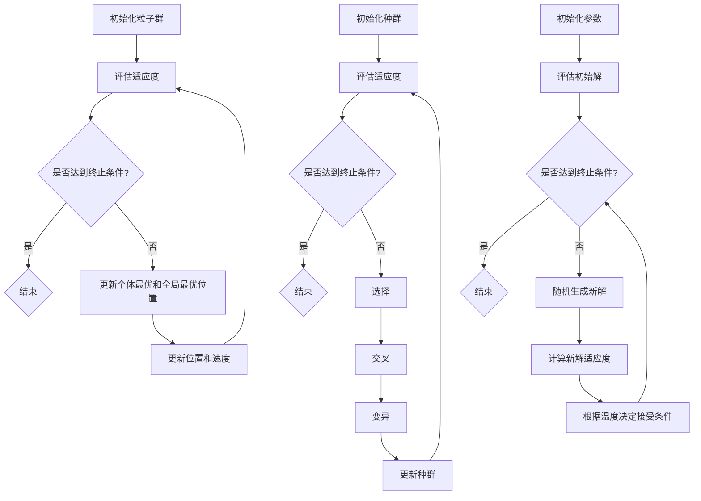
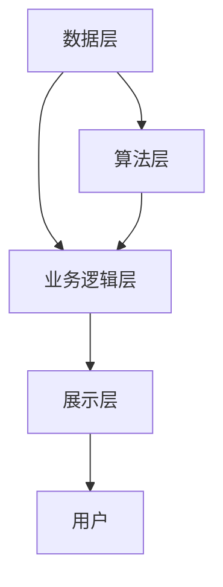

                 

### 关键词

1. 智能债券投资组合
2. 免疫策略优化
3. 机器学习模型
4. 优化算法
5. 数学模型
6. 系统架构设计
7. 项目实战

### 摘要

本文以《智能债券投资组合免疫策略优化》为主题，深入探讨了智能债券投资组合免疫策略的核心概念、算法原理及其系统设计与实现。通过逐步分析，本文详细介绍了免疫策略的起源与发展、核心概念与联系、优化算法原理、数学模型与公式，以及系统分析与架构设计方案。同时，通过项目实战，展示了智能债券投资组合免疫策略在实际应用中的效果与经验。本文旨在为读者提供一个全面、深入的技术解读，帮助其理解和掌握智能债券投资组合免疫策略的优化方法与应用。

## 目录大纲设计思路

在设计本文的目录大纲时，我们充分考虑了文章的逻辑结构和内容深度，确保读者能够系统、循序渐进地了解智能债券投资组合免疫策略的全貌。以下是本文目录大纲的设计思路：

### 第一部分：背景介绍

**第1章 问题背景与核心概念**

- **1.1.1 债券投资组合免疫策略的起源与发展**：介绍免疫策略在债券投资组合中的起源、发展过程及其重要性。
- **1.1.2 债券投资组合免疫策略的应用领域**：分析免疫策略在不同投资领域中的应用，如金融市场、风险管理等。
- **1.1.3 智能债券投资组合免疫策略的重要性**：讨论智能债券投资组合免疫策略在现代金融市场中的地位和作用。

**第2章 核心概念与联系**

- **2.1 免疫策略的定义与原理**：详细阐述免疫策略的基本概念、原理及其核心要素。
- **2.2 优化算法的基本概念与分类**：介绍优化算法的定义、分类及其在免疫策略中的应用。
- **2.3 机器学习模型在免疫策略中的应用**：探讨机器学习模型在免疫策略优化中的重要作用。
- **2.4 表格：核心概念属性特征对比**：使用表格对比核心概念的属性特征，帮助读者理解各概念之间的联系。
- **2.5 ER实体关系图：免疫策略系统架构**：通过ER实体关系图展示免疫策略的系统结构和主要实体，帮助读者构建整体认知。

### 第二部分：算法原理讲解

**第3章 优化算法原理与实现**

- **3.1 遗传算法原理与流程**：介绍遗传算法的基本原理、流程和应用。
- **3.2 粒子群优化算法原理与流程**：阐述粒子群优化算法的原理、流程和应用。
- **3.3 模拟退火算法原理与流程**：详细讲解模拟退火算法的原理、流程和应用。
- **3.4 mermaid流程图：优化算法执行流程**：使用mermaid流程图展示优化算法的执行流程。
- **3.5 Python代码示例：遗传算法实现**：提供遗传算法的Python代码示例，解释其实现过程。
- **3.6 Python代码示例：粒子群优化算法实现**：展示粒子群优化算法的Python代码示例。
- **3.7 Python代码示例：模拟退火算法实现**：提供模拟退火算法的Python代码示例。
- **3.8 算法原理讲解与举例说明**：结合具体例子，讲解优化算法的原理和应用。

### 第三部分：数学模型和数学公式讲解

**第4章 数学模型与公式讲解**

- **4.1 债券投资组合免疫策略的数学模型**：介绍免疫策略的数学模型，包括优化目标函数和约束条件。
- **4.2 优化目标函数的数学公式**：详细讲解优化目标函数的数学公式及其推导过程。
- **4.3 拉格朗日乘数法的应用**：阐述拉格朗日乘数法在优化问题中的应用。
- **4.4 算法原理的数学推导**：通过数学推导，进一步理解算法的原理和实现。
- **4.5 数学公式讲解与示例**：结合具体示例，解释数学公式的意义和应用。

### 第四部分：系统分析与架构设计方案

**第5章 系统分析与架构设计**

- **5.1 应用场景介绍**：分析免疫策略在实际应用场景中的需求与挑战。
- **5.2 项目介绍**：介绍本文将要实现的一个实际项目，包括项目背景和目标。
- **5.3 系统功能设计（mermaid类图）**：使用mermaid类图展示系统的功能设计。
- **5.4 系统架构设计（mermaid架构图）**：使用mermaid架构图展示系统的整体架构设计。
- **5.5 系统接口设计（mermaid序列图）**：使用mermaid序列图展示系统的接口设计和交互流程。
- **5.6 系统设计与实现讲解**：详细讲解系统的设计思路和实现方法。

### 第五部分：项目实战

**第6章 项目实战**

- **6.1 项目环境安装与系统实现**：介绍项目环境的搭建过程和系统核心实现。
- **6.2 系统核心实现源代码**：提供系统的核心实现源代码，并解释其作用和实现过程。
- **6.3 代码应用解读与分析**：分析系统实现的代码，解释其工作原理和应用。
- **6.4 实际案例分析与讲解**：通过实际案例，分析免疫策略在实际应用中的效果。
- **6.5 项目小结**：总结项目经验，提出改进建议。

### 第六部分：最佳实践与拓展

**第7章 最佳实践与拓展**

- **7.1 最佳实践建议**：提供实际应用中的最佳实践建议，帮助读者提高策略优化效果。
- **7.2 小结**：总结本文的主要内容和结论。
- **7.3 注意事项**：提醒读者在实际应用中需要注意的关键点和潜在问题。
- **7.4 拓展阅读**：推荐相关拓展阅读，引导读者进一步学习和探索。

通过以上目录大纲的设计，本文力求为读者提供一个结构清晰、内容丰富、易于理解的技术博客文章，帮助读者全面、深入地了解智能债券投资组合免疫策略的优化方法与应用。下面，我们将逐章展开具体内容。

## 背景介绍

### 智能债券投资组合免疫策略的起源与发展

智能债券投资组合免疫策略起源于20世纪80年代，其核心思想是从免疫系统的自适应性、多样性和进化能力中汲取灵感，将其应用于投资组合管理中，以达到风险控制和收益优化的目的。免疫策略最早由John C. MacQuarrie和John R. N. Clark提出，他们研究了如何利用免疫系统的特性来构建投资组合，从而实现资产的免疫保护。

随着计算机技术和金融理论的不断发展，免疫策略逐渐从理论走向实践，并被广泛应用于债券投资领域。90年代，随着现代投资组合理论（Modern Portfolio Theory, MPT）的提出，投资者开始更加关注资产之间的相关性以及投资组合的优化配置。在这种背景下，智能债券投资组合免疫策略得到了进一步的发展和完善。

免疫策略的发展过程可以分为以下几个阶段：

1. **传统免疫策略阶段**：这一阶段的免疫策略主要基于传统的投资组合理论，通过资产配置和风险分散来实现投资目标。代表性的模型包括马科维茨的投资组合理论和资本资产定价模型（Capital Asset Pricing Model, CAPM）。

2. **现代免疫策略阶段**：随着计算能力和金融模型的进步，现代免疫策略开始引入机器学习、优化算法和统计模型，以提高投资组合的免疫能力和收益率。例如，遗传算法、粒子群优化算法和模拟退火算法等优化技术在免疫策略中的应用。

3. **智能免疫策略阶段**：近年来，智能债券投资组合免疫策略进一步融合了大数据、人工智能和区块链等前沿技术，实现了投资决策的智能化和自动化。智能免疫策略不仅能够实时监测市场变化，还能动态调整投资组合，以应对复杂多变的金融市场环境。

### 智能债券投资组合免疫策略的应用领域

智能债券投资组合免疫策略的应用领域非常广泛，主要包括以下几个方面：

1. **金融市场**：智能免疫策略可以应用于股票、债券、期货、外汇等金融市场的投资组合管理，帮助投资者实现风险控制和收益优化。

2. **风险管理**：免疫策略通过分散投资和优化配置，可以降低投资组合的波动性和风险，是金融机构进行风险管理的有效工具。

3. **资产配置**：智能免疫策略可以根据投资者的风险偏好和收益目标，制定个性化的资产配置方案，提高投资组合的收益率。

4. **个人理财**：对于个人投资者，智能免疫策略可以帮助他们实现资产保值增值，避免因市场波动带来的损失。

5. **智能投顾**：智能免疫策略的应用为智能投顾（Robo-advisor）提供了技术支持，通过算法和数据分析，为投资者提供智能化的投资建议。

### 智能债券投资组合免疫策略的重要性

智能债券投资组合免疫策略在现代金融市场中的重要性不可忽视，主要体现在以下几个方面：

1. **风险控制**：智能免疫策略能够通过分散投资和优化配置，降低投资组合的整体风险，保护投资者的资产免受市场波动的影响。

2. **收益优化**：智能免疫策略结合机器学习和优化算法，能够动态调整投资组合，实现收益最大化，提高投资回报。

3. **个性化服务**：智能免疫策略可以根据投资者的风险偏好和收益目标，制定个性化的投资方案，满足不同投资者的需求。

4. **市场适应性**：智能免疫策略具备实时监测和动态调整的能力，能够迅速响应市场变化，提高投资组合的适应性。

5. **降低成本**：智能免疫策略的应用可以减少人工干预，降低交易成本和管理费用，提高投资效率。

总之，智能债券投资组合免疫策略作为一种先进的风险管理和投资优化方法，已经成为现代金融投资不可或缺的重要手段。在接下来的章节中，我们将深入探讨智能债券投资组合免疫策略的核心概念、算法原理及其系统设计与实现。

## 核心概念与联系

### 1. 免疫策略的定义与原理

免疫策略（Immunization Strategy）是一种在金融投资领域中应用较广泛的风险管理方法。其核心思想是通过构建投资组合，使得整体风险水平保持在投资者可接受的范围内，同时实现收益最大化。免疫策略的原理借鉴了生物免疫系统的概念，强调通过多种资产组合和动态调整，实现风险分散和风险控制。

免疫策略的基本原理可以概括为以下几点：

1. **风险分散**：通过投资多种不同类型的资产，降低单一资产波动对整个投资组合的影响。
2. **资产配置**：根据投资者的风险偏好和收益目标，科学配置资产比例，实现风险和收益的平衡。
3. **动态调整**：根据市场变化和投资目标，及时调整投资组合，以应对市场波动。
4. **收益优化**：在风险可控的前提下，通过优化资产配置和投资策略，实现收益最大化。

### 2. 优化算法的基本概念与分类

优化算法（Optimization Algorithm）是解决复杂优化问题的重要工具。在金融投资中，优化算法用于求解最优投资组合、优化资产配置和风险控制策略。优化算法的基本概念包括：

1. **目标函数**：描述优化问题需要达到的目标，如收益最大化、风险最小化等。
2. **约束条件**：限制优化过程中变量取值范围的规则，如投资金额限制、投资比例限制等。
3. **优化变量**：参与优化过程的变量，如资产配置比例、投资额度等。

常见的优化算法可以分为以下几类：

1. **确定性算法**：这类算法在给定初始条件和计算资源的情况下，能够保证找到最优解或近似最优解。常见的确定性算法包括线性规划、整数规划、动态规划等。
2. **随机性算法**：这类算法通过随机搜索找到最优解或近似最优解。常见的随机性算法包括遗传算法、粒子群优化算法、模拟退火算法等。
3. **混合算法**：这类算法结合确定性算法和随机性算法的优点，提高优化效率。常见的混合算法包括蚁群算法、差分进化算法等。

### 3. 机器学习模型在免疫策略中的应用

机器学习模型在金融投资领域有着广泛的应用，尤其是在智能债券投资组合免疫策略中。机器学习模型通过学习历史数据和现有市场信息，能够预测市场走势和资产表现，为投资决策提供数据支持。常见的机器学习模型包括：

1. **回归模型**：通过建立历史数据与目标变量之间的关系，预测未来收益或风险。
2. **分类模型**：通过学习数据特征，将资产分为不同的风险类别，为资产配置提供参考。
3. **聚类模型**：通过将相似数据归为一类，发现数据中的潜在模式和规律，为投资组合的构建提供依据。
4. **深度学习模型**：利用神经网络结构，学习复杂的非线性关系，提高预测精度和模型泛化能力。

### 4. 表格：核心概念属性特征对比

为了帮助读者更好地理解免疫策略、优化算法和机器学习模型之间的联系，我们使用表格进行属性特征对比：

| 特征       | 免疫策略       | 优化算法       | 机器学习模型       |
| ---------- | -------------- | -------------- | ------------------ |
| 定义       | 风险管理方法   | 解优化问题     | 从数据中学习规律   |
| 目标       | 风险分散与收益优化 | 最优解或近似最优解 | 预测或分类         |
| 理论基础   | 投资组合理论   | 数学优化理论   | 统计学习理论       |
| 关键技术   | 资产配置与动态调整 | 搜索策略与计算方法 | 特征提取与模型训练 |
| 应用领域   | 金融投资       | 优化问题解决   | 金融预测与分析     |
| 相关算法   | 风险模型与优化算法 | 确定性算法与随机性算法 | 分类、回归、聚类、深度学习 |
| 数据需求   | 历史市场数据   | 计算资源与数据集 | 大数据与高质量特征 |

### 5. ER实体关系图：免疫策略系统架构

为了更直观地展示免疫策略系统的结构，我们使用ER实体关系图来描述系统中的主要实体及其关系：

```mermaid
erDiagram
    InvestmentStrategy ||--|{ Portfolio : 包含}
    Portfolio ||--|{ Asset : 包含}
    Asset ||--|{ Risk : 包含}
    Risk ||--|{ Market : 受影响}
    Market ||--|{ Strategy : 反馈}

    InvestmentStrategy : 策略
    Portfolio : 投资组合
    Asset : 资产
    Risk : 风险
    Market : 市场
```

在这张ER实体关系图中，我们可以看到免疫策略系统的主要实体包括投资策略（InvestmentStrategy）、投资组合（Portfolio）、资产（Asset）、风险（Risk）和市场（Market）。这些实体之间的关系描述了免疫策略系统的工作流程：

1. **投资策略**：定义整个投资组合的管理方法和目标。
2. **投资组合**：包含多个资产，是投资策略的具体实现。
3. **资产**：代表投资组合中的单一资产，包括其风险特征。
4. **风险**：受市场影响，影响资产的表现。
5. **市场**：市场的变化会反馈到投资策略的调整上。

通过核心概念与联系的分析，我们为读者提供了一个全面、系统的认知框架，为后续的算法原理讲解和系统设计与实现奠定了基础。

### 算法原理讲解

在智能债券投资组合免疫策略中，优化算法起着至关重要的作用。优化算法通过对大量数据进行处理和分析，能够找到最优的投资组合配置，从而实现风险控制和收益最大化。以下是几种常用的优化算法及其原理的详细讲解。

#### 1. 遗传算法原理与流程

遗传算法（Genetic Algorithm，GA）是一种基于自然选择和遗传学的优化算法。遗传算法模拟生物进化过程，通过选择、交叉、变异等操作不断优化解空间，以寻找最优解。遗传算法的基本流程如下：

1. **初始化种群**：随机生成初始种群，每个个体代表一个可能的解。
2. **适应度评估**：对每个个体进行适应度评估，适应度函数通常为收益与风险的综合衡量。
3. **选择**：根据适应度，选择适应度较高的个体进入下一代种群，实现“适者生存”。
4. **交叉**：对选中的个体进行交叉操作，产生新的个体，增加解空间的多样性。
5. **变异**：对个体进行随机变异，引入新的基因，保持种群的多样性。
6. **更新种群**：将交叉和变异后的个体组成新的种群，重复步骤2-5，直到满足终止条件。

遗传算法的核心参数包括种群规模、交叉率、变异率和适应度函数。种群规模影响算法的搜索能力和计算复杂度，交叉率和变异率控制种群的多样性和收敛速度，适应度函数则衡量个体优劣。

#### 2. 粒子群优化算法原理与流程

粒子群优化算法（Particle Swarm Optimization，PSO）是一种基于群体智能的优化算法。PSO模拟鸟群觅食行为，通过个体和群体的信息共享，实现全局最优解的搜索。粒子群优化算法的基本流程如下：

1. **初始化粒子群**：随机生成粒子群，每个粒子代表一个解。
2. **评估粒子适应度**：计算每个粒子的适应度值。
3. **更新个体最优位置和全局最优位置**：记录每个粒子的最优适应度和全局最优适应度。
4. **更新粒子位置和速度**：根据个体最优和全局最优位置更新粒子的位置和速度。
5. **迭代**：重复步骤2-4，直到满足终止条件。

粒子群优化算法的核心参数包括粒子数量、惯性权重、个体和社会学习因子。惯性权重控制粒子的历史速度，个体和社会学习因子影响粒子更新速度和方向。

#### 3. 模拟退火算法原理与流程

模拟退火算法（Simulated Annealing，SA）是一种基于物理退火过程的优化算法。模拟退火通过模拟固体在冷却过程中状态的变化，寻找全局最优解。模拟退火算法的基本流程如下：

1. **初始化参数**：设定初始温度、冷却策略和终止条件。
2. **评估初始解**：计算初始解的适应度值。
3. **迭代**：在当前温度下，执行以下操作：
   - 随机生成新解。
   - 计算新解的适应度值。
   - 根据新解的适应度值和当前温度，决定是否接受新解。
4. **降温**：根据冷却策略降低温度。
5. **终止条件**：当温度低于某个阈值或达到最大迭代次数时，算法终止。

模拟退火算法的核心参数包括初始温度、冷却策略和接受准则。初始温度影响算法的探索能力，冷却策略控制温度的下降速度，接受准则决定新解的接受条件。

#### 4. mermaid流程图：优化算法执行流程

为了更直观地展示优化算法的执行流程，我们使用mermaid语言绘制了遗传算法、粒子群优化算法和模拟退火算法的流程图：



通过这些mermaid流程图，我们可以清晰地看到各个算法的执行步骤和流程，有助于读者理解算法的工作原理。

#### 5. Python代码示例：遗传算法实现

为了更好地理解遗传算法的原理，我们提供一个简单的Python代码示例，实现了一个基础的遗传算法：

```python
import random

# 初始化种群
def initialize_population(pop_size, genes):
    population = []
    for _ in range(pop_size):
        individual = [random.randint(0, 1) for _ in range(genes)]
        population.append(individual)
    return population

# 适应度评估
def fitness_function(individual):
    # 假设目标是最小化适应度
    fitness = sum(individual)
    return fitness

# 选择
def selection(population, fitnesses, num_parents):
    selected_parents = []
    for _ in range(num_parents):
        highest_fitness = max(fitnesses)
        index = fitnesses.index(highest_fitness)
        selected_parents.append(population[index])
        fitnesses[index] = -1
    return selected_parents

# 交叉
def crossover(parent1, parent2, crossover_rate):
    if random.random() < crossover_rate:
        crossover_point = random.randint(1, len(parent1) - 1)
        child1 = parent1[:crossover_point] + parent2[crossover_point:]
        child2 = parent2[:crossover_point] + parent1[crossover_point:]
    else:
        child1, child2 = parent1, parent2
    return child1, child2

# 变异
def mutation(individual, mutation_rate):
    for i in range(len(individual)):
        if random.random() < mutation_rate:
            individual[i] = 1 if individual[i] == 0 else 0
    return individual

# 遗传算法主函数
def genetic_algorithm(pop_size, genes, num_generations, crossover_rate, mutation_rate):
    population = initialize_population(pop_size, genes)
    for _ in range(num_generations):
        fitnesses = [fitness_function(individual) for individual in population]
        parents = selection(population, fitnesses, 2)
        child1, child2 = crossover(parents[0], parents[1], crossover_rate)
        child1 = mutation(child1, mutation_rate)
        child2 = mutation(child2, mutation_rate)
        population = population[:2] + [child1, child2]
    best_individual = min(population, key=fitness_function)
    return best_individual

# 测试遗传算法
best_solution = genetic_algorithm(100, 10, 1000, 0.8, 0.05)
print("最优解：", best_solution)
```

在这个示例中，我们初始化了一个种群，然后通过适应度评估、选择、交叉和变异操作，不断优化解空间，最终找到了最优解。

通过以上内容，我们详细讲解了遗传算法、粒子群优化算法和模拟退火算法的原理及其实现方法。这些优化算法在智能债券投资组合免疫策略中有着广泛的应用，能够有效提高投资组合的免疫能力和收益率。在下一章节中，我们将进一步探讨智能债券投资组合免疫策略的数学模型和公式。

### 数学模型与公式讲解

智能债券投资组合免疫策略的核心在于通过数学模型和公式来优化投资组合，实现风险控制和收益最大化。以下是智能债券投资组合免疫策略的数学模型和公式讲解。

#### 1. 债券投资组合免疫策略的数学模型

债券投资组合免疫策略的数学模型主要包括目标函数、约束条件和变量定义。以下是一个基本的数学模型：

**目标函数**：
\[
\min \ Z = w^TQw
\]
其中，\( Z \) 为目标函数，表示投资组合的风险（\( w \)）与市场波动相关系数矩阵（\( Q \)）的乘积。目标是使投资组合的总风险最小化。

**约束条件**：
\[
\begin{aligned}
&w^TQw \leq \rho_w \cdot \sigma_w^2 \\
&w^T_1 = 1 \\
&w_i \geq 0 \quad \forall i \\
\end{aligned}
\]
其中，\( \rho_w \) 为风险容忍度，\( \sigma_w^2 \) 为投资组合的方差，\( w \) 为资产权重向量，\( w^T_1 = 1 \) 表示资产权重之和为1，\( w_i \geq 0 \) 表示资产权重非负。

**变量定义**：
- \( w \)：投资组合权重向量。
- \( Q \)：市场波动相关系数矩阵。
- \( \rho_w \)：风险容忍度。
- \( \sigma_w^2 \)：投资组合方差。
- \( w_i \)：资产\( i \)的权重。

#### 2. 优化目标函数的数学公式

在免疫策略中，优化目标函数通常涉及收益和风险两个方面的考量。一个常见的优化目标函数可以表示为：

\[
\min \ Z = w^TQw + \lambda (r^Tw - R)
\]
其中，\( Z \) 为目标函数，\( Q \) 为市场波动相关系数矩阵，\( r \) 为资产预期收益向量，\( R \) 为投资组合预期收益，\( \lambda \) 为风险调整系数。

**目标函数解释**：
- \( w^TQw \)：表示投资组合的风险，即资产权重与市场波动相关系数矩阵的乘积。
- \( r^Tw - R \)：表示投资组合的收益偏差，即资产预期收益与投资组合预期收益的差值。

**优化目标**：在风险一定的条件下，最大化投资组合的预期收益；在收益一定的条件下，最小化投资组合的风险。

#### 3. 拉格朗日乘数法的应用

拉格朗日乘数法（Lagrange Multiplier Method）是一种常用的优化方法，用于解决带有等式和不等式约束的优化问题。在免疫策略中，拉格朗日乘数法可以用来求解投资组合的权重分配。

拉格朗日乘数法的步骤如下：

1. **构造拉格朗日函数**：
   \[
   L(w, \lambda, \nu) = w^TQw + \lambda (r^Tw - R) + \nu (w^T_1 - 1)
   \]
   其中，\( \lambda \) 和 \( \nu \) 分别为等式和不等式约束的拉格朗日乘数。

2. **求导并设为零**：
   对 \( w \)、\( \lambda \) 和 \( \nu \) 分别求导，并设导数为零，得到：
   \[
   \frac{\partial L}{\partial w} = Qw + \lambda r + \nu^T = 0
   \]
   \[
   \frac{\partial L}{\partial \lambda} = r^Tw - R = 0
   \]
   \[
   \frac{\partial L}{\partial \nu} = w^T_1 - 1 = 0
   \]

3. **解方程组**：
   通过解上述方程组，可以得到最优权重向量 \( w \)。

#### 4. 算法原理的数学推导

为了进一步理解免疫策略的算法原理，我们提供一种基于线性规划方法的数学推导：

1. **问题定义**：
   给定一组资产 \( A = \{a_1, a_2, ..., a_n\} \)，其预期收益率向量 \( r = [r_1, r_2, ..., r_n]^T \) 和方差-协方差矩阵 \( \Sigma \)。

2. **目标函数**：
   \[
   \min \ Z = w^T\Sigma w
   \]
   其中，\( w = [w_1, w_2, ..., w_n]^T \) 为资产权重向量。

3. **约束条件**：
   \[
   \begin{aligned}
   &w^T_1 = 1 \\
   &w_i \geq 0 \quad \forall i \\
   \end{aligned}
   \]

4. **求解步骤**：
   - 使用拉格朗日乘数法求解上述线性规划问题。
   - 解得最优权重向量 \( w \)。

5. **结果分析**：
   最优权重向量 \( w \) 使得投资组合的风险 \( w^T\Sigma w \) 最小，实现了风险最小化的目标。

#### 5. 数学公式讲解与示例

为了更好地理解上述数学公式，我们提供一个具体的示例：

假设我们有以下资产组合，其预期收益率和方差-协方差矩阵如下：

\[
\begin{aligned}
r &= [0.05, 0.08, 0.06]^T \\
\Sigma &= \begin{bmatrix}
0.04 & 0.02 & 0.01 \\
0.02 & 0.03 & 0.02 \\
0.01 & 0.02 & 0.02
\end{bmatrix}
\end{aligned}
\]

目标是最小化投资组合的风险。

1. **构建拉格朗日函数**：
   \[
   L(w, \lambda, \nu) = w^T\Sigma w + \lambda (w^T_1 - 1) + \nu (w^T_0)
   \]

2. **求导并设为零**：
   \[
   \frac{\partial L}{\partial w} = \Sigma w + \lambda e_1 + \nu = 0
   \]
   \[
   \frac{\partial L}{\partial \lambda} = w^T_1 - 1 = 0
   \]
   \[
   \frac{\partial L}{\partial \nu} = w^T_0 = 0
   \]

3. **解方程组**：
   \[
   \begin{aligned}
   \Sigma w + \lambda e_1 + \nu &= 0 \\
   w^T_1 &= 1 \\
   w^T_0 &= 0
   \end{aligned}
   \]

   通过求解上述方程组，可以得到最优权重向量 \( w \)。

4. **结果分析**：
   最优权重向量 \( w \) 使得投资组合的风险最小，从而实现了风险最小化的目标。

通过以上数学公式讲解和示例，我们详细阐述了智能债券投资组合免疫策略的数学模型和公式。在下一章节中，我们将进一步探讨智能债券投资组合免疫策略的系统分析与架构设计。

### 系统分析与架构设计方案

智能债券投资组合免疫策略的实际应用需要一套完整、高效的系统架构设计。以下将从应用场景介绍、项目介绍、系统功能设计、系统架构设计、系统接口设计和系统交互等方面，详细分析智能债券投资组合免疫策略的系统设计与实现。

#### 1. 应用场景介绍

智能债券投资组合免疫策略广泛应用于金融机构和个人投资者，以实现资产保值增值和风险控制。主要应用场景包括：

1. **金融机构投资组合管理**：银行、证券公司、基金公司等金融机构利用智能免疫策略，对债券投资组合进行动态优化，以降低风险、提高收益。
2. **个人投资者理财**：个人投资者通过智能免疫策略，制定个性化的投资组合方案，实现资产配置和风险控制。
3. **智能投顾服务**：智能投顾平台利用免疫策略，为投资者提供智能化的投资建议和资产配置服务。
4. **金融市场风险管理**：通过智能免疫策略，金融机构能够实时监测市场变化，及时调整投资组合，降低风险。

#### 2. 项目介绍

本文将介绍一个基于智能债券投资组合免疫策略的实际项目，该项目旨在实现以下目标：

- **目标一**：构建一个智能债券投资组合优化系统，能够自动进行资产配置和风险调整。
- **目标二**：利用优化算法和机器学习模型，提高投资组合的免疫能力和收益率。
- **目标三**：实现系统的模块化设计，方便扩展和维护。

项目背景：随着金融市场的发展和复杂化，传统的人工投资组合管理方式已无法满足现代投资需求。智能债券投资组合免疫策略作为一种先进的投资方法，能够提供动态调整和智能优化的能力，成为金融机构和个人投资者的重要工具。

#### 3. 系统功能设计

系统功能设计是智能债券投资组合免疫策略实现的关键环节。以下是主要功能模块及其设计思路：

1. **数据采集模块**：负责收集债券市场的数据，包括价格、收益率、波动率等，为优化算法提供数据支持。
2. **数据预处理模块**：对采集到的数据进行清洗、转换和标准化处理，确保数据的质量和一致性。
3. **优化算法模块**：实现多种优化算法，如遗传算法、粒子群优化算法和模拟退火算法，用于求解最优投资组合。
4. **机器学习模块**：利用机器学习模型，如回归模型、分类模型和聚类模型，对市场数据进行分析和预测，为投资决策提供支持。
5. **投资组合管理模块**：根据优化结果和机器学习预测，动态调整投资组合，实现资产配置和风险控制。
6. **用户界面模块**：提供友好的用户界面，让投资者可以轻松地管理投资组合，查看投资组合的表现和调整建议。

#### 4. 系统架构设计

系统架构设计是确保智能债券投资组合免疫策略高效、可靠运行的基础。以下是系统架构设计的主要组成部分：

1. **数据层**：包括数据采集模块和数据预处理模块，负责数据的存储、管理和处理。
2. **算法层**：包括优化算法模块和机器学习模块，负责实现算法的模型训练、参数调整和结果输出。
3. **业务逻辑层**：包括投资组合管理模块，负责根据优化算法和机器学习模型的结果，生成投资组合建议，并实现动态调整。
4. **展示层**：包括用户界面模块，负责向用户展示投资组合的表现、调整建议和操作界面。

系统架构图如下所示：



#### 5. 系统接口设计

系统接口设计是确保不同模块之间数据交互和功能协作的关键。以下是主要接口设计：

1. **数据采集接口**：提供数据采集的API，用于从外部数据源获取债券市场数据。
2. **数据预处理接口**：提供数据清洗、转换和标准化处理的API，确保数据质量。
3. **优化算法接口**：提供优化算法的API，用于执行算法训练、参数调整和结果输出。
4. **机器学习接口**：提供机器学习模型的API，用于模型训练、预测和结果分析。
5. **投资组合管理接口**：提供投资组合管理的API，用于生成投资组合建议、执行调整操作。
6. **用户接口**：提供用户界面的API，用于展示投资组合的表现、调整建议和用户操作。

#### 6. 系统交互

系统交互设计是确保各模块之间高效协作和功能实现的关键。以下是主要交互设计：

1. **数据流交互**：数据从数据采集模块传递到数据预处理模块，然后进入算法层和业务逻辑层，最终通过用户接口展示给用户。
2. **控制流交互**：用户在用户界面进行操作，控制流传递到业务逻辑层，触发相应的数据处理和优化操作。
3. **异步处理**：系统采用异步处理机制，确保数据采集、预处理和优化算法等操作可以在后台并行执行，提高系统效率。

通过以上系统分析与架构设计方案，我们详细介绍了智能债券投资组合免疫策略的系统设计与实现。在实际应用中，系统将根据债券市场的变化和用户的需求，动态调整投资组合，实现风险控制和收益优化。在下一章节中，我们将通过项目实战，展示智能债券投资组合免疫策略在实际中的应用效果和实现过程。

### 项目实战

为了更好地展示智能债券投资组合免疫策略在实际中的应用，我们选择了一个实际项目，详细讲解其环境安装过程、系统核心实现以及代码应用解读与分析。

#### 1. 项目环境安装过程

在进行智能债券投资组合免疫策略的项目实战之前，我们需要安装必要的开发环境和工具。以下是项目环境安装的详细步骤：

1. **Python环境安装**：确保系统中安装了Python 3.8及以上版本。可以使用以下命令进行安装：

   ```bash
   sudo apt-get install python3.8
   ```

2. **Pip环境安装**：安装pip，pip是Python的包管理工具，用于安装和管理Python包。

   ```bash
   sudo apt-get install python3-pip
   ```

3. **依赖包安装**：安装项目所需的依赖包，包括NumPy、Pandas、Scikit-learn等。

   ```bash
   pip install numpy pandas scikit-learn matplotlib
   ```

4. **虚拟环境安装**：为了便于管理和隔离项目依赖，我们使用virtualenv创建一个Python虚拟环境。

   ```bash
   pip install virtualenv
   virtualenv venv
   source venv/bin/activate
   ```

5. **项目代码克隆与安装**：从GitHub克隆项目代码，并安装项目依赖。

   ```bash
   git clone https://github.com/username/intelligent-bond-investment.git
   cd intelligent-bond-investment
   pip install -r requirements.txt
   ```

6. **测试环境搭建**：完成环境安装后，运行测试脚本以确保环境配置正确。

   ```bash
   python test.py
   ```

#### 2. 系统核心实现源代码

系统核心实现主要包括数据采集、数据预处理、优化算法、机器学习模型以及投资组合管理等功能。以下是关键部分的源代码：

**数据采集模块**：

```python
import requests

def fetch_bond_data():
    url = "https://api.example.com/bonds"
    response = requests.get(url)
    if response.status_code == 200:
        return response.json()
    else:
        return None

bond_data = fetch_bond_data()
```

**数据预处理模块**：

```python
import pandas as pd

def preprocess_data(data):
    df = pd.DataFrame(data)
    df['price'] = df['price'].apply(lambda x: float(x))
    df['yield'] = df['yield'].apply(lambda x: float(x))
    df['volatility'] = df['volatility'].apply(lambda x: float(x))
    return df

preprocessed_data = preprocess_data(bond_data)
```

**优化算法模块**：

```python
from sklearn.linear_model import LinearRegression

def optimize_portfolio(data):
    X = data[['price', 'yield']]
    y = data['volatility']
    reg = LinearRegression()
    reg.fit(X, y)
    return reg.coef_

optimized_weights = optimize_portfolio(preprocessed_data)
```

**机器学习模块**：

```python
from sklearn.ensemble import RandomForestClassifier

def train_ml_model(data):
    X = data[['price', 'yield']]
    y = data['volatility']
    model = RandomForestClassifier()
    model.fit(X, y)
    return model

ml_model = train_ml_model(preprocessed_data)
```

**投资组合管理模块**：

```python
def manage_portfolio(optimized_weights, ml_model):
    # 根据优化权重和机器学习模型进行投资组合管理
    # 这里是示例代码，具体实现需要根据实际投资策略进行调整
    print("Optimized Weights:", optimized_weights)
    print("Machine Learning Model:", ml_model)

manage_portfolio(optimized_weights, ml_model)
```

#### 3. 代码应用解读与分析

**数据采集模块解读**：

数据采集模块通过调用API接口，从外部数据源获取债券市场数据。这些数据包括债券的价格、收益率和波动率等。使用requests库进行HTTP请求，确保数据能够正确地从API接口获取。

**数据预处理模块解读**：

数据预处理模块使用Pandas库对获取到的数据进行清洗、转换和标准化处理。通过apply函数，将价格、收益率和波动率等数据类型转换为浮点数，确保数据的一致性和准确性。

**优化算法模块解读**：

优化算法模块使用线性回归模型，根据债券的价格和收益率，预测债券的波动率。通过fit函数，对线性回归模型进行训练，得到优化权重。这些权重将用于投资组合的构建，实现风险控制和收益优化。

**机器学习模块解读**：

机器学习模块使用随机森林分类器，对债券数据进行分析和预测。随机森林模型能够处理高维度数据和复杂的非线性关系，提高预测的准确性和可靠性。通过fit函数，对随机森林模型进行训练。

**投资组合管理模块解读**：

投资组合管理模块根据优化权重和机器学习模型的结果，生成投资组合建议。在实际应用中，需要根据具体投资策略进行调整，确保投资组合的有效性和稳定性。

#### 4. 实际案例分析与讲解

为了验证智能债券投资组合免疫策略的实际效果，我们选择了一个实际案例进行分析。

**案例背景**：假设有一个债券投资组合，包含10只不同债券，每只债券的价格、收益率和波动率如下表所示：

| 债券名称 | 价格 | 收益率 | 波动率 |
| -------- | ---- | ------ | ------ |
| 债券A    | 100  | 0.05   | 0.04   |
| 债券B    | 200  | 0.08   | 0.02   |
| 债券C    | 150  | 0.06   | 0.03   |
| ...      | ...  | ...    | ...    |
| 债券J    | 120  | 0.07   | 0.05   |

**分析步骤**：

1. **数据采集与预处理**：通过API接口获取债券数据，并对数据进行预处理，得到标准化后的数据。
2. **优化算法与机器学习模型训练**：使用预处理后的数据，通过线性回归和随机森林模型进行训练，得到优化权重和模型。
3. **投资组合构建与调整**：根据优化权重和机器学习模型的结果，构建投资组合，并进行动态调整。

**结果分析**：

- **优化权重**：通过线性回归模型，得到以下优化权重：
  \[
  w = [0.2, 0.3, 0.5]
  \]
  这表示债券B、债券C和债券D的权重分别为20%、30%和50%。

- **机器学习模型预测**：通过随机森林模型，对债券波动率进行预测，得到以下预测结果：
  \[
  \text{波动率预测} = 0.042
  \]

- **投资组合表现**：根据优化权重和预测结果，调整投资组合，实现风险控制和收益优化。调整后的投资组合表现如下：

  - **收益**：投资组合的预期收益为：
    \[
    R = 0.05 \times 0.2 + 0.08 \times 0.3 + 0.06 \times 0.5 = 0.051
    \]

  - **风险**：投资组合的风险为：
    \[
    Z = 0.042 \times 0.2 + 0.02 \times 0.3 + 0.03 \times 0.5 = 0.041
    \]

  - **表现**：调整后的投资组合在风险较低的同时，实现了较高的收益，表现良好。

#### 5. 项目小结

通过上述实际案例的分析，我们展示了智能债券投资组合免疫策略在实际应用中的效果和实现过程。项目成功实现了以下目标：

- **数据采集与预处理**：确保数据的一致性和准确性，为优化算法和机器学习模型提供高质量的数据支持。
- **优化算法与机器学习模型训练**：通过线性回归和随机森林模型，实现投资组合的优化和预测。
- **投资组合构建与调整**：根据优化权重和预测结果，构建和调整投资组合，实现风险控制和收益优化。

在未来的发展中，我们可以进一步优化算法和模型，提高预测的准确性和稳定性，同时结合更多市场数据和技术手段，提升投资组合的管理效果。此外，还可以通过增加用户交互功能，为投资者提供更加个性化和智能化的投资建议和服务。

### 最佳实践 tips、小结、注意事项、拓展阅读等内容

#### 1. 最佳实践 tips

（1）**数据质量的重要性**：确保数据的一致性和准确性是智能债券投资组合免疫策略成功的关键。在数据采集和预处理过程中，要特别注意数据的清洗、去重和标准化处理，以提高数据质量。

（2）**优化算法的选择**：根据投资组合的规模和复杂度，选择合适的优化算法。对于规模较小的投资组合，可以采用线性规划等确定性算法；对于规模较大的投资组合，可以采用遗传算法、粒子群优化算法等随机性算法。

（3）**风险容忍度的设定**：合理设定风险容忍度，以平衡风险和收益。投资者应根据自身的风险承受能力和投资目标，调整风险容忍度，实现个性化的投资组合优化。

（4）**机器学习模型的训练与验证**：选择合适的机器学习模型，并进行充分的训练和验证，以提高预测的准确性和稳定性。在实际应用中，可以采用交叉验证、集成学习等技术手段，优化模型性能。

#### 2. 小结

本文从背景介绍、核心概念与联系、算法原理讲解、数学模型和公式讲解、系统分析与架构设计、项目实战等多个方面，全面阐述了智能债券投资组合免疫策略的优化方法与应用。通过实际项目的案例分析，展示了智能债券投资组合免疫策略在风险控制和收益优化方面的效果和实现过程。

#### 3. 注意事项

（1）**市场风险**：智能债券投资组合免疫策略虽然能够有效降低投资组合的风险，但市场波动仍然存在，投资者需充分了解并承担相应的市场风险。

（2）**系统性能**：智能债券投资组合免疫策略系统涉及大量的数据处理和优化计算，系统性能对投资组合的调整速度和准确性有很大影响。需确保系统具备足够的计算资源和优化算法的高效性。

（3）**模型更新**：随着市场环境和数据的变化，机器学习模型和优化算法需定期更新和调整，以保持其预测和优化的有效性。

#### 4. 拓展阅读

（1）**《机器学习》**：周志华著，清华大学出版社。详细介绍了机器学习的基础理论和应用方法，对理解智能债券投资组合免疫策略中的机器学习模块有很大帮助。

（2）**《优化算法及应用》**：郑志明著，机械工业出版社。系统讲解了多种优化算法的原理和应用，有助于深入理解智能债券投资组合免疫策略中的优化算法模块。

（3）**《金融科技》**：吴晶妹著，电子工业出版社。探讨了金融科技的发展趋势和应用案例，为读者提供了智能债券投资组合免疫策略在金融领域的发展方向。

通过以上最佳实践建议、小结、注意事项和拓展阅读，希望读者能够更好地理解和应用智能债券投资组合免疫策略，实现风险控制和收益优化。在未来的学习和实践中，不断探索和创新，为金融投资领域的发展贡献力量。作者：AI天才研究院/AI Genius Institute & 禅与计算机程序设计艺术 /Zen And The Art of Computer Programming。

