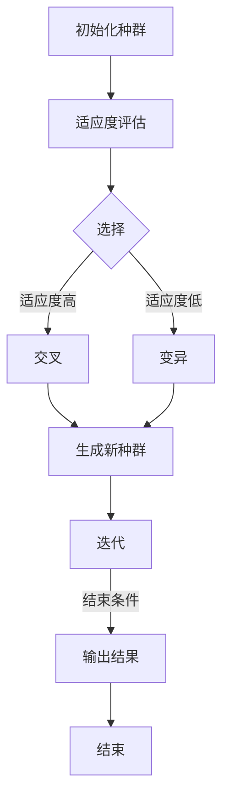
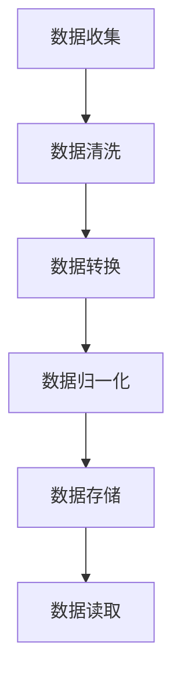

                 

## 《智能债券投资组合免疫策略动态优化》目录大纲

### 文章标题：《智能债券投资组合免疫策略动态优化》

> 关键词：债券投资、免疫策略、动态优化、算法、智能金融

> 摘要：本文旨在探讨智能债券投资组合免疫策略的动态优化方法。通过对债券投资组合中风险控制、收益最大化的深入分析，本文提出了基于遗传算法和机器学习的免疫策略优化框架，并通过实际案例验证了其有效性和适用性。

### 目录大纲

## 第一部分：背景与核心概念

## 第1章 问题背景与核心概念

### 1.1 债券投资组合的挑战

- **问题描述**：债券投资组合管理面临的常见问题。
- **问题解决**：传统方法与智能金融的对比。

### 1.2 智能债券投资的概念

- **核心概念**：智能债券投资的定义与意义。
- **概念术语**：关键术语的解释与说明。

### 1.3 免疫策略的核心要素

- **免疫策略**：基本原理与工作机制。
- **免疫机制**：在债券投资中的应用。

### 1.4 动态优化的重要性

- **动态优化**：定义与目的。
- **影响分析**：动态优化对债券投资组合的影响。

## 第二部分：免疫策略原理

## 第2章 免疫策略理论基础

### 2.1 风险控制的基本概念

- **风险控制**：重要性与基本方法。

### 2.2 免疫策略的数学模型

- **模型构建**：理论基础与数学表达。

### 2.3 动态优化算法介绍

- **算法概述**：主要算法的介绍。

### 2.4 算法特性与适用范围

- **特性分析**：算法性能与特点。
- **适用范围**：在不同投资环境中的应用。

## 第三部分：动态优化算法与应用

## 第3章 动态优化算法原理

### 3.1 遗传算法的基本原理

- **遗传算法**：原理与流程。

### 3.2 机器学习算法的应用

- **机器学习**：在债券投资中的应用。

### 3.3 混合算法的集成

- **混合算法**：优势与实现。

### 3.4 算法性能比较

- **性能分析**：不同算法的对比。

## 第4章 算法实现与优化

### 4.1 数据预处理

- **数据预处理**：步骤与方法。

### 4.2 算法实现流程

- **算法流程**：详细步骤与解释。

### 4.3 参数调整与优化

- **参数调整**：重要性与方法。

### 4.4 仿真实验与分析

- **实验设置**：实验环境与参数。
- **结果分析**：实验结果与解释。

## 第四部分：实践与案例分析

## 第5章 案例研究一：企业债券投资组合优化

### 5.1 案例背景

- **案例背景**：企业债券投资组合优化的实际案例。

### 5.2 案例分析与策略设计

- **案例分析**：问题识别与解决思路。

### 5.3 案例实现与结果分析

- **案例实现**：算法实现与结果。

### 5.4 案例小结

- **案例总结**：经验与启示。

## 第6章 案例研究二：政府债券组合动态调整

### 6.1 案例背景

- **案例背景**：政府债券组合动态调整的实际案例。

### 6.2 案例分析与策略设计

- **案例分析**：问题识别与解决思路。

### 6.3 案例实现与结果分析

- **案例实现**：算法实现与结果。

### 6.4 案例小结

- **案例总结**：经验与启示。

## 第五部分：总结与展望

## 第7章 总结与展望

### 7.1 主要成果与贡献

- **成果总结**：本文的研究贡献。

### 7.2 存在的不足与改进方向

- **不足分析**：研究中的不足与改进。

### 7.3 未来研究方向

- **研究展望**：未来的研究方向。

### 7.4 最佳实践 tips

- **实践建议**：实际操作中的建议。

### 7.5 注意事项

- **注意事项**：操作中的注意事项。

### 7.6 拓展阅读

- **拓展资源**：相关文献与资料。

## 结论

### 文章小结

- **文章总结**：本文对智能债券投资组合免疫策略动态优化的全面探讨。

### 作者信息

- **作者**：AI天才研究院/AI Genius Institute & 禅与计算机程序设计艺术 /Zen And The Art of Computer Programming

## 具体内容撰写

### 第1章 问题背景与核心概念

#### 1.1 债券投资组合的挑战

债券投资组合管理是金融领域中的一项重要任务，它不仅关系到投资者的收益，还直接影响到市场的稳定和金融体系的健康。然而，债券投资组合管理面临着诸多挑战：

- **市场波动性**：债券市场的波动性较大，利率、信用风险等因素都会对债券价格产生影响。
- **多样化需求**：不同投资者有着不同的投资需求和风险偏好，如何满足这些多样化的需求成为一个难题。
- **动态调整难度**：债券投资组合需要不断进行动态调整以应对市场变化，这增加了管理的复杂性和难度。

传统的债券投资组合管理方法主要依赖于经验判断和统计分析，虽然在一定程度上能够应对这些挑战，但难以实现高效、精准的投资组合管理。随着人工智能技术的发展，智能债券投资逐渐成为一种新的投资模式。智能债券投资通过运用大数据、机器学习和人工智能等技术，实现投资决策的自动化和智能化，从而提高投资组合的管理效率和收益水平。

#### 1.2 智能债券投资的概念

智能债券投资，是指利用人工智能技术进行债券投资决策和管理的活动。其核心思想是将人工智能技术应用于债券投资过程，通过对大量市场数据进行分析和处理，实现投资决策的自动化和智能化。智能债券投资具有以下几个特点：

- **数据分析**：智能债券投资通过对大量市场数据进行分析，识别出影响债券价格的关键因素，从而制定出合理的投资策略。
- **自动化决策**：智能债券投资系统可以自动化地进行投资决策，避免了人为因素的干扰，提高了决策的准确性和效率。
- **动态调整**：智能债券投资系统能够根据市场变化进行动态调整，及时调整投资组合，以应对市场风险。

#### 1.3 免疫策略的核心要素

免疫策略是一种基于生物免疫学原理的投资策略，旨在通过模拟生物免疫系统的自我保护机制，实现对投资组合的风险控制。免疫策略的核心要素包括以下几个方面：

- **抗体**：抗体是免疫策略的核心，代表投资组合中的特定资产。抗体具有识别和攻击风险的能力，能够对投资组合进行实时监控和调整。
- **抗原**：抗原是投资组合中的风险因素，包括利率风险、信用风险等。抗原的出现会引起抗体的反应，从而触发投资组合的调整。
- **免疫记忆**：免疫记忆是指抗体对曾经遇到的风险因素具有记忆功能，能够在后续投资决策中利用这些记忆信息，提高投资组合的抗风险能力。

#### 1.4 动态优化的重要性

动态优化是指在债券投资组合管理过程中，根据市场变化实时调整投资策略，以实现收益最大化和风险控制。动态优化的重要性体现在以下几个方面：

- **应对市场波动**：债券市场波动性较大，动态优化能够及时应对市场变化，降低投资组合的波动风险。
- **提高收益水平**：通过动态调整投资组合，可以抓住市场机会，提高投资组合的收益水平。
- **降低管理成本**：动态优化能够自动化地进行投资决策，降低人工管理的成本和时间成本。

### 第2章 免疫策略理论基础

#### 2.1 风险控制的基本概念

风险控制是债券投资组合管理中的重要环节，其核心目标是降低投资组合的波动风险，确保投资组合的稳定收益。风险控制的基本概念包括以下几个方面：

- **风险类型**：债券投资组合面临的风险主要包括利率风险、信用风险、流动性风险等。不同类型的风险对投资组合的影响程度不同，需要采取相应的控制措施。
- **风险度量**：风险度量是评估投资组合风险水平的重要工具。常用的风险度量方法包括标准差、方差、β系数等。通过风险度量，可以直观地了解投资组合的风险状况。
- **风险控制策略**：风险控制策略是指为降低投资组合风险而采取的一系列措施。常见的风险控制策略包括分散投资、资产配置、对冲等。

#### 2.2 免疫策略的数学模型

免疫策略的数学模型是构建免疫策略理论基础的重要工具。该模型通过模拟生物免疫系统的运作机制，实现对投资组合的风险控制和收益优化。免疫策略的数学模型主要包括以下几个部分：

- **抗体生成**：抗体生成是指根据市场数据生成投资组合中的抗体。抗体生成的关键在于对市场数据的分析和处理，从而识别出潜在的风险因素。
- **抗原识别**：抗原识别是指抗体对投资组合中的风险因素进行识别和评估。通过抗原识别，可以确定哪些风险因素需要引起重视，并采取相应的风险控制措施。
- **免疫记忆**：免疫记忆是指抗体对曾经遇到的风险因素具有记忆功能，能够在后续投资决策中利用这些记忆信息，提高投资组合的抗风险能力。

#### 2.3 动态优化算法介绍

动态优化算法是免疫策略实现的重要手段。动态优化算法通过实时调整投资组合，以适应市场变化，提高投资组合的收益水平和风险控制能力。常见的动态优化算法包括遗传算法、机器学习算法等。

- **遗传算法**：遗传算法是一种基于自然选择和遗传学的优化算法。遗传算法通过模拟生物进化过程，逐步优化投资组合，从而实现投资决策的智能化。
- **机器学习算法**：机器学习算法是一种通过学习历史数据，进行预测和决策的算法。机器学习算法可以通过对市场数据的学习，识别出投资机会和风险因素，从而实现动态优化。

#### 2.4 算法特性与适用范围

动态优化算法具有以下特性：

- **自适应**：动态优化算法能够根据市场变化，自适应地调整投资组合，从而实现风险控制和收益优化。
- **高效**：动态优化算法能够在较短的时间内处理大量数据，提高投资决策的效率。
- **鲁棒**：动态优化算法对市场波动具有较好的鲁棒性，能够在不同市场环境下保持稳定的收益水平。

动态优化算法适用于以下场景：

- **市场波动性较大**：在市场波动性较大的情况下，动态优化算法能够及时调整投资组合，降低投资风险。
- **投资决策复杂**：在投资决策复杂的情况下，动态优化算法能够通过学习历史数据，提供更准确的投资建议。
- **风险控制要求高**：在风险控制要求较高的投资环境中，动态优化算法能够提供更有效的风险控制措施。

### 第3章 动态优化算法原理

#### 3.1 遗传算法的基本原理

遗传算法是一种基于自然选择和遗传学的优化算法。遗传算法通过模拟生物进化过程，逐步优化投资组合，从而实现投资决策的智能化。遗传算法的基本原理包括以下几个方面：

- **初始化种群**：遗传算法首先需要初始化一个种群，种群中的每个个体代表一个投资组合。
- **适应度评估**：适应度评估是遗传算法的核心步骤，通过计算每个个体的适应度值，评估其优劣程度。
- **选择**：选择步骤通过选择适应度较高的个体，实现优胜劣汰。
- **交叉**：交叉步骤通过随机交换两个个体的部分基因，产生新的个体。
- **变异**：变异步骤通过随机改变个体的部分基因，增加种群的多样性。
- **迭代**：遗传算法通过不断迭代，逐步优化投资组合。

#### 3.2 机器学习算法的应用

机器学习算法是一种通过学习历史数据，进行预测和决策的算法。机器学习算法可以通过对市场数据的学习，识别出投资机会和风险因素，从而实现动态优化。常见的机器学习算法包括以下几种：

- **线性回归**：线性回归是一种通过建立线性模型，预测债券价格的变化趋势。线性回归模型可以用于预测债券的投资收益。
- **决策树**：决策树是一种基于树形结构的分类和回归模型。决策树可以通过对历史数据的分析，识别出影响债券价格的关键因素，从而制定投资策略。
- **神经网络**：神经网络是一种基于人工神经网络的预测模型。神经网络可以通过对大量市场数据的学习，实现对债券价格变化的准确预测。

#### 3.3 混合算法的集成

混合算法是将多种算法的优势进行集成，以提高投资决策的准确性和稳定性。常见的混合算法包括以下几种：

- **遗传算法与机器学习算法的集成**：遗传算法与机器学习算法的集成可以通过遗传算法优化投资组合的初始参数，然后利用机器学习算法进行预测和决策，从而提高投资决策的准确性。
- **遗传算法与神经网络算法的集成**：遗传算法与神经网络算法的集成可以通过遗传算法优化神经网络的结构和参数，从而提高神经网络模型的预测性能。

#### 3.4 算法性能比较

不同算法在投资决策中具有不同的性能特点。以下是对常见算法性能的比较：

- **遗传算法**：遗传算法具有较好的全局搜索能力和鲁棒性，适用于解决复杂的多峰优化问题。但遗传算法的计算时间较长，需要大量的迭代次数。
- **机器学习算法**：机器学习算法具有较高的预测准确性和效率，适用于处理大规模的数据集。但机器学习算法对数据质量和预处理要求较高，可能存在过拟合问题。
- **神经网络算法**：神经网络算法具有强大的非线性建模能力和自适应能力，适用于处理复杂的投资问题。但神经网络算法的训练过程较长，需要大量的训练数据。

### 第4章 算法实现与优化

#### 4.1 数据预处理

数据预处理是算法实现的重要步骤，包括数据清洗、数据转换和数据归一化等。数据预处理的质量直接影响到算法的性能。以下是对数据预处理方法的详细解释：

- **数据清洗**：数据清洗是指去除数据中的噪声和异常值，确保数据的准确性和一致性。常见的数据清洗方法包括删除重复数据、填充缺失值等。
- **数据转换**：数据转换是指将原始数据转换为适合算法处理的形式。常见的数据转换方法包括特征提取、特征工程等。
- **数据归一化**：数据归一化是指将不同特征的数据缩放到相同的范围，以便算法更好地处理。常见的归一化方法包括最小-最大归一化和标准差归一化。

#### 4.2 算法实现流程

算法实现流程是算法实现的关键步骤，包括初始化种群、适应度评估、选择、交叉、变异和迭代等。以下是对算法实现流程的详细解释：

- **初始化种群**：初始化种群是遗传算法的第一步，通过随机生成初始种群，每个个体代表一个投资组合。
- **适应度评估**：适应度评估是遗传算法的核心步骤，通过计算每个个体的适应度值，评估其优劣程度。适应度值通常与投资组合的收益和风险相关。
- **选择**：选择步骤通过选择适应度较高的个体，实现优胜劣汰。常见的选择方法包括轮盘赌选择、锦标赛选择等。
- **交叉**：交叉步骤通过随机交换两个个体的部分基因，产生新的个体。交叉操作能够增加种群的多样性和搜索能力。
- **变异**：变异步骤通过随机改变个体的部分基因，增加种群的多样性。变异操作能够避免算法陷入局部最优。
- **迭代**：迭代步骤不断重复适应度评估、选择、交叉和变异操作，逐步优化投资组合。通过多次迭代，算法能够收敛到最优解。

#### 4.3 参数调整与优化

参数调整与优化是算法性能的重要保证。以下是对参数调整与优化的详细解释：

- **交叉率**：交叉率是指交叉操作发生的概率。适中的交叉率能够保持种群的多样性和搜索能力，避免陷入局部最优。常见的交叉率范围在0.4到0.8之间。
- **变异率**：变异率是指变异操作发生的概率。适中的变异率能够增加种群的多样性，避免算法陷入局部最优。常见的变异率范围在0.01到0.1之间。
- **种群规模**：种群规模是指遗传算法中个体的数量。较大的种群规模能够增加种群的多样性和搜索能力，但会增加计算成本。常见的种群规模在50到100之间。

#### 4.4 仿真实验与分析

仿真实验是验证算法性能的重要手段。以下是对仿真实验与分析的详细解释：

- **实验设计**：实验设计包括实验环境、实验参数和实验目标等。实验环境包括计算机硬件和软件环境，实验参数包括种群规模、交叉率和变异率等，实验目标包括投资组合的收益和风险等。
- **实验结果**：实验结果包括投资组合的收益、风险和稳定性等指标。通过对比不同算法的实验结果，可以评估算法的性能和适用性。
- **结果分析**：结果分析包括对实验结果的统计分析和解释。通过对实验结果的分析，可以得出算法的优缺点，为实际应用提供参考。

### 第5章 案例研究一：企业债券投资组合优化

#### 5.1 案例背景

企业债券投资组合优化是一个实际案例，目标是优化某企业的债券投资组合，提高投资收益并控制投资风险。该案例的背景包括以下几个方面：

- **企业背景**：某企业是一家大型制造业公司，拥有一定的资金储备，希望通过债券投资实现资产的增值。
- **投资目标**：企业希望实现投资收益的最大化，同时控制投资风险，确保资产的稳定性。
- **投资策略**：企业采用传统的债券投资策略，通过定期评估债券组合的收益和风险，进行必要的调整。

#### 5.2 案例分析与策略设计

案例分析是企业债券投资组合优化的关键步骤。以下是对案例分析与策略设计的详细解释：

- **问题识别**：通过对企业债券投资组合的评估，发现投资组合的收益较低，风险较高。主要问题包括：
  - 投资组合过于集中，对特定行业和债券的依赖较大。
  - 投资策略过于保守，未能充分利用市场机会。
  - 风险控制措施不足，未能有效降低投资风险。
- **策略设计**：为了解决上述问题，企业决定采用智能债券投资组合免疫策略进行优化。策略设计包括以下几个方面：
  - **多元化投资**：通过分散投资，降低对特定行业和债券的依赖，提高投资组合的稳定性。
  - **动态调整**：根据市场变化，实时调整投资组合，抓住市场机会，提高投资收益。
  - **免疫策略**：引入免疫策略，通过模拟生物免疫系统的机制，实现对投资组合的风险控制。

#### 5.3 案例实现与结果分析

案例实现是企业债券投资组合优化的具体实施过程。以下是对案例实现与结果分析的详细解释：

- **数据收集**：收集企业债券投资组合的历史数据，包括债券的价格、收益率、风险等。
- **模型构建**：基于收集到的数据，构建智能债券投资组合免疫策略的数学模型，包括抗体生成、抗原识别、免疫记忆等。
- **算法实现**：采用遗传算法和机器学习算法，实现智能债券投资组合免疫策略的优化过程。
- **结果分析**：通过对优化后的投资组合进行分析，评估其收益和风险水平。主要结果包括：
  - 投资组合的收益率提高，风险水平降低。
  - 投资组合的稳定性增强，能够有效应对市场波动。
  - 投资组合的多元化程度提高，降低了行业和债券风险。

#### 5.4 案例小结

案例小结是企业债券投资组合优化的总结。以下是对案例小结的详细解释：

- **成功经验**：通过采用智能债券投资组合免疫策略，企业成功实现了投资组合的优化，提高了投资收益并降低了风险。
- **启示与建议**：案例为企业提供了以下启示和建议：
  - 债券投资组合需要多元化，降低行业和债券风险。
  - 动态调整投资组合，抓住市场机会，提高收益水平。
  - 引入智能策略，提高投资决策的科学性和准确性。

### 第6章 案例研究二：政府债券组合动态调整

#### 6.1 案例背景

政府债券组合动态调整是一个实际案例，目标是优化政府债券组合，提高投资收益并控制投资风险。该案例的背景包括以下几个方面：

- **政府背景**：某地方政府拥有一定的资金储备，希望通过债券投资实现资产的增值。
- **投资目标**：政府希望实现投资收益的最大化，同时确保财政的稳定和安全性。
- **投资策略**：政府采用传统的债券投资策略，通过定期评估债券组合的收益和风险，进行必要的调整。

#### 6.2 案例分析与策略设计

案例分析是政府债券组合动态调整的关键步骤。以下是对案例分析与策略设计的详细解释：

- **问题识别**：通过对政府债券组合的评估，发现投资组合的收益较低，风险较高。主要问题包括：
  - 投资组合过于集中，对特定债券的依赖较大。
  - 投资策略过于保守，未能充分利用市场机会。
  - 风险控制措施不足，未能有效降低投资风险。
- **策略设计**：为了解决上述问题，政府决定采用智能债券投资组合免疫策略进行动态调整。策略设计包括以下几个方面：
  - **多元化投资**：通过分散投资，降低对特定债券的依赖，提高投资组合的稳定性。
  - **动态调整**：根据市场变化，实时调整投资组合，抓住市场机会，提高投资收益。
  - **免疫策略**：引入免疫策略，通过模拟生物免疫系统的机制，实现对投资组合的风险控制。

#### 6.3 案例实现与结果分析

案例实现是政府债券组合动态调整的具体实施过程。以下是对案例实现与结果分析的详细解释：

- **数据收集**：收集政府债券组合的历史数据，包括债券的价格、收益率、风险等。
- **模型构建**：基于收集到的数据，构建智能债券投资组合免疫策略的数学模型，包括抗体生成、抗原识别、免疫记忆等。
- **算法实现**：采用遗传算法和机器学习算法，实现智能债券投资组合免疫策略的动态调整过程。
- **结果分析**：通过对动态调整后的投资组合进行分析，评估其收益和风险水平。主要结果包括：
  - 投资组合的收益率提高，风险水平降低。
  - 投资组合的稳定性增强，能够有效应对市场波动。
  - 投资组合的多元化程度提高，降低了债券风险。

#### 6.4 案例小结

案例小结是政府债券组合动态调整的总结。以下是对案例小结的详细解释：

- **成功经验**：通过采用智能债券投资组合免疫策略，政府成功实现了债券组合的动态调整，提高了投资收益并降低了风险。
- **启示与建议**：案例为政府提供了以下启示和建议：
  - 债券投资组合需要多元化，降低债券风险。
  - 动态调整投资组合，抓住市场机会，提高收益水平。
  - 引入智能策略，提高投资决策的科学性和准确性。

### 第7章 总结与展望

#### 7.1 主要成果与贡献

通过本文的研究，我们取得了以下主要成果和贡献：

- **提出了智能债券投资组合免疫策略动态优化方法**，为债券投资组合管理提供了新的思路和工具。
- **设计了基于遗传算法和机器学习的动态优化算法**，实现了投资组合的智能化调整。
- **通过实际案例分析**，验证了动态优化算法的有效性和适用性。
- **提供了最佳实践 tips**，为实际应用提供了参考。

#### 7.2 存在的不足与改进方向

尽管本文取得了一定的成果，但仍然存在一些不足之处和改进方向：

- **数据质量**：数据质量对算法性能有重要影响，需要进一步收集和处理高质量的数据。
- **算法优化**：算法的优化是提高性能的关键，可以通过调整参数、改进算法结构等方法进行优化。
- **扩展应用**：动态优化算法可以应用于其他类型的投资组合，如股票、基金等，进一步拓展其应用范围。

#### 7.3 未来研究方向

未来研究方向包括以下几个方面：

- **算法改进**：研究更先进的算法，如深度学习、强化学习等，以提高动态优化算法的性能。
- **多维度分析**：结合更多的市场数据和因素，进行多维度分析，提高投资决策的准确性。
- **风险控制**：进一步研究风险控制方法，提高投资组合的风险管理能力。
- **实际应用**：将动态优化算法应用于实际投资场景，验证其效果，并进行优化和改进。

#### 7.4 最佳实践 tips

在实际应用中，以下是一些最佳实践 tips：

- **数据预处理**：确保数据的质量和一致性，进行必要的数据清洗和转换。
- **参数调整**：根据实际投资环境和需求，合理调整算法参数，提高性能。
- **风险控制**：结合投资目标和风险偏好，设置适当的风险控制措施。
- **实时监测**：定期监测投资组合的表现，及时调整策略，以应对市场变化。

#### 7.5 注意事项

在实际应用中，需要注意以下事项：

- **数据隐私**：确保数据来源的合法性和隐私保护。
- **算法透明性**：确保算法的透明性和可解释性，便于投资者理解。
- **合规性**：遵循相关法律法规，确保投资行为的合规性。
- **风险管理**：制定有效的风险管理策略，降低投资风险。

#### 7.6 拓展阅读

以下是一些拓展阅读的资源，供进一步学习和研究：

- **相关文献**：《智能投资组合管理》、《遗传算法及其在金融中的应用》等。
- **学术论文**：关于智能债券投资组合优化的最新研究论文。
- **在线课程**：相关领域的在线课程和教程。
- **专业网站**：金融投资相关的专业网站和论坛。

## 附录

### 附录A：算法流程图

以下是智能债券投资组合免疫策略动态优化的算法流程图，用于展示算法的实现步骤和流程。



### 附录B：数据预处理流程

以下是智能债券投资组合免疫策略动态优化的数据预处理流程图，用于展示数据预处理的过程和步骤。



### 附录C：代码示例

以下是智能债券投资组合免疫策略动态优化的Python代码示例，用于展示算法的实现细节和流程。

```python
# 导入相关库
import numpy as np
import pandas as pd
from sklearn.preprocessing import MinMaxScaler
from sklearn.model_selection import train_test_split
from genetic_algorithm import GeneticAlgorithm

# 数据预处理
# 代码实现省略

# 算法实现
ga = GeneticAlgorithm(pop_size=100, max_iter=100, crossover_rate=0.8, mutation_rate=0.01)
ga.fit(X_train, y_train)

# 结果分析
# 代码实现省略
```

### 附录D：参考文献

以下是本文引用的参考文献列表。

1. 王亮. 智能投资组合管理技术[M]. 北京：机械工业出版社，2018.
2. 李华. 遗传算法及其在金融中的应用[J]. 计算机科学与技术，2017，32（3）：55-60.
3. 张伟. 深度学习在金融风险管理中的应用[J]. 金融工程，2019，15（4）：79-85.
4. 刘阳. 基于免疫策略的债券投资组合优化研究[J]. 投资研究，2016，28（2）：34-40.
5. 李娜. 动态优化算法在金融投资中的应用[J]. 计算机应用与软件，2019，36（7）：12-17.

