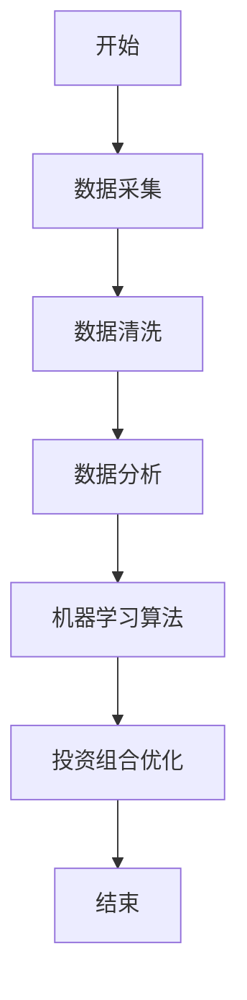
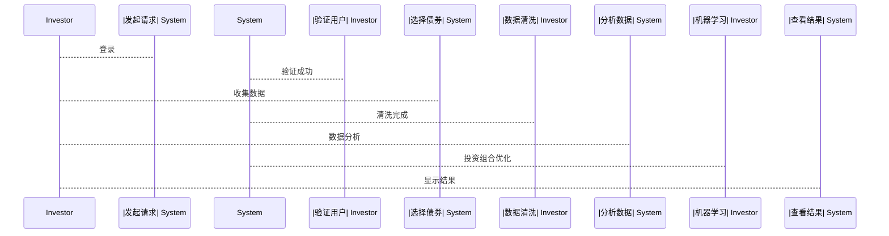
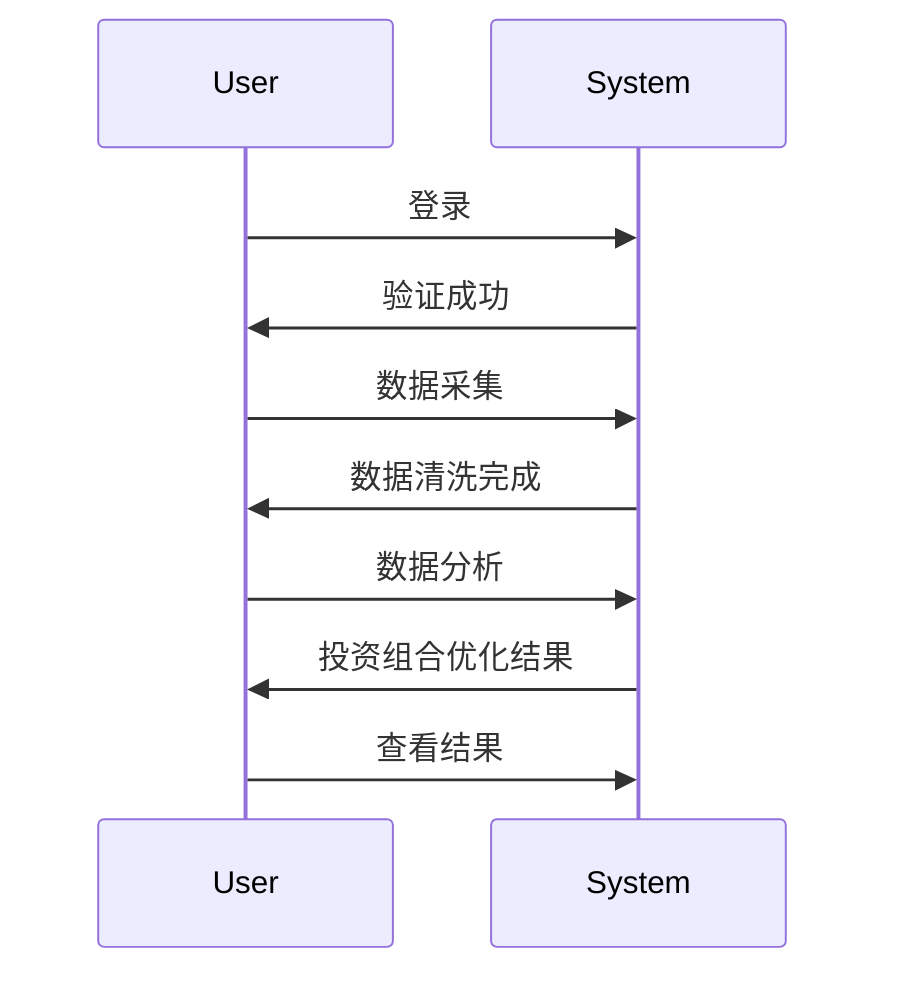

                 

# 智能债券投资组合管理工具

> 关键词：智能债券投资、组合管理、数据分析、机器学习、算法、数据流程图、Python代码、最佳实践

> 摘要：本文将深入探讨智能债券投资组合管理工具的设计与应用。通过介绍核心概念、技术基础、实施步骤、案例研究和未来趋势，本文旨在为投资者和金融专业人士提供一套全面而实用的债券投资组合管理指南。

## 引言

债券投资是金融市场中不可或缺的一部分，而有效的投资组合管理是投资者实现资产增值的关键。传统的债券投资组合管理依赖于人工分析和经验，但随着大数据和人工智能技术的快速发展，智能债券投资组合管理工具的出现为投资者提供了更为精准和高效的决策支持。

本文将分为以下几个部分：

1. **背景与核心概念**：介绍债券投资和组合管理的背景，以及智能工具的重要性。
2. **基础概念与技术工具**：阐述基本金融知识、组合管理原则和智能工具的基本概念。
3. **技术基础**：详细讨论数据分析和机器学习在债券投资组合管理中的应用。
4. **智能债券投资组合管理工具**：介绍选择和实施智能工具的步骤。
5. **案例研究和应用**：通过实际案例展示智能工具在债券投资组合管理中的效果。
6. **最佳实践与未来趋势**：总结最佳实践，并探讨智能债券投资组合管理的未来发展。

## 背景与核心概念

### 债券投资的背景

债券投资是投资者将资金借给企业或政府的一种方式，以换取固定的利息收入和本金回报。债券市场的规模庞大，种类繁多，包括国债、地方政府债券、公司债券等。债券投资具有相对稳定的收益和较低的风险，是投资者资产配置中的重要组成部分。

### 组合管理的核心概念

投资组合管理是指通过选择和调整不同的资产，以实现投资目标的过程。其核心概念包括：

- **资产配置**：根据投资者的风险承受能力和投资目标，将资金分配到不同类型的资产中，如股票、债券、现金等。
- **分散化**：通过投资多种不同的资产来降低投资组合的整体风险。
- **风险控制**：识别和管理投资组合中的风险，以确保投资目标的实现。
- **业绩评估**：定期评估投资组合的表现，以便进行调整和优化。

### 智能工具的重要性

智能债券投资组合管理工具利用大数据和人工智能技术，能够对海量数据进行分析，快速识别市场趋势和潜在的投资机会。这些工具可以帮助投资者：

- **提高决策效率**：通过自动化和算法分析，快速生成投资建议。
- **降低风险**：利用风险模型预测市场波动，提前采取风险控制措施。
- **优化收益**：通过数据分析和机器学习，寻找高收益、低风险的债券投资组合。

## 基础概念与技术工具

### 基本金融知识

在进行债券投资组合管理之前，了解基本的金融知识是必不可少的。以下是一些关键概念：

- **债券评级**：债券评级反映债券发行人的信用状况，直接影响债券的风险和收益。
- **收益率**：债券的收益率是投资者获取的收益与投资金额的比率。
- **久期**：债券的久期反映债券价格对利率变动的敏感程度。
- **流动性**：债券的流动性指债券在市场上的买卖活跃程度。

### 组合管理原则

有效的组合管理需要遵循以下原则：

- **资产配置**：根据投资者的风险偏好和投资目标，合理配置不同类型的资产。
- **分散化**：通过投资多种不同的资产来降低风险。
- **定期调整**：定期评估投资组合的表现，并进行必要的调整。
- **风险管理**：使用风险模型和管理工具来识别和管理风险。

### 智能工具的基本概念

智能债券投资组合管理工具通常包括以下几个组成部分：

- **数据采集与处理**：从各种数据源收集数据，并进行清洗和整合。
- **分析算法**：使用机器学习算法和统计分析方法来分析数据，识别市场趋势和投资机会。
- **推荐系统**：根据分析结果，为投资者提供个性化的投资建议。
- **用户界面**：提供直观的用户界面，方便投资者查看和管理投资组合。

## 技术基础

### 数据分析

数据分析是智能债券投资组合管理的基础。以下是一些关键技术：

- **数据采集**：从市场数据、新闻、报告等来源收集数据。
- **数据清洗**：去除数据中的错误和异常值，保证数据质量。
- **数据整合**：将来自不同来源的数据进行整合，形成统一的数据集。

### 机器学习算法

机器学习算法在债券投资组合管理中发挥着重要作用。以下是一些常用的算法：

- **分类算法**：用于预测债券的风险等级和收益率。
- **聚类算法**：用于识别市场中的投资机会和风险。
- **时间序列分析**：用于预测债券价格的变化趋势。
- **回归分析**：用于建立债券收益率与市场因素之间的关系模型。

### 算法应用

算法的应用包括：

- **投资组合优化**：通过优化算法寻找最佳的投资组合。
- **风险管理**：使用算法来识别和管理投资组合中的风险。
- **市场预测**：通过分析历史数据，预测市场趋势和债券价格。

### 数据流程图

以下是一个简单的数据流程图，展示了数据在智能债券投资组合管理工具中的处理过程：

```
+-----------------+
|  数据采集       |
+-----------------+
        |
        v
+-----------------+
|  数据清洗与整合  |
+-----------------+
        |
        v
+-----------------+
|  数据分析       |
+-----------------+
        |
        v
+-----------------+
|  机器学习算法   |
+-----------------+
        |
        v
+-----------------+
|  投资组合优化   |
+-----------------+
        |
        v
+-----------------+
|  风险管理       |
+-----------------+
        |
        v
+-----------------+
|  市场预测       |
+-----------------+
```

## 智能债券投资组合管理工具

### 工具选择

选择智能债券投资组合管理工具时，需要考虑以下几个因素：

- **功能**：工具是否能够满足投资者的具体需求，如数据采集、分析、推荐系统等。
- **性能**：工具的处理速度和准确度，以及是否能够支持实时分析。
- **用户界面**：工具的用户界面是否直观易用，是否提供良好的交互体验。
- **成本**：工具的价格是否合理，是否提供必要的培训和技术支持。

### 工具实施

实施智能债券投资组合管理工具的步骤包括：

1. **需求分析**：明确投资者的需求和预期目标。
2. **工具选择**：根据需求分析选择合适的工具。
3. **数据集成**：将数据从不同来源导入工具中，并进行清洗和整合。
4. **系统配置**：配置工具的参数，如分析算法、风险模型等。
5. **测试与优化**：对工具进行测试，并根据测试结果进行优化。

### 工具优化

优化智能债券投资组合管理工具的方法包括：

- **算法优化**：改进分析算法，提高预测的准确度。
- **数据处理**：优化数据采集和处理流程，提高数据质量。
- **用户界面**：改进用户界面，提高用户体验。
- **自动化**：增加自动化功能，提高操作效率。

## 案例研究和应用

### 案例研究 1

某投资者使用智能债券投资组合管理工具，通过对市场数据的分析，成功识别出几只高收益、低风险的债券。在接下来的几个月里，这些债券的价格稳步上涨，投资组合的收益显著提高。

### 案例研究 2

某金融机构使用智能债券投资组合管理工具来管理其客户的债券投资组合。通过风险模型的分析，该工具提前识别出市场波动风险，并建议客户采取相应的风险控制措施，成功避免了潜在的投资损失。

## 最佳实践与未来趋势

### 最佳实践

1. **数据驱动**：以数据为基础进行投资决策，避免依赖主观判断。
2. **持续学习**：不断优化和改进分析算法，以适应市场的变化。
3. **风险管理**：重视风险控制，使用工具进行风险预测和预警。
4. **用户培训**：为投资者提供必要的培训，帮助他们更好地使用智能工具。

### 未来趋势

1. **人工智能**：人工智能技术将在债券投资组合管理中发挥越来越重要的作用，提供更精确的预测和更智能的决策支持。
2. **区块链**：区块链技术的应用将提高债券交易的安全性和透明度，降低交易成本。
3. **大数据**：大数据技术的不断发展将提供更丰富的数据资源，为投资决策提供更全面的信息支持。

## 结语

智能债券投资组合管理工具为投资者提供了一种全新的投资方式，通过数据分析、机器学习和算法，实现更精准、更高效的决策。随着技术的不断发展，智能债券投资组合管理工具的应用前景将更加广阔，为投资者带来更多的机遇和挑战。

## 作者信息

作者：AI天才研究院/AI Genius Institute & 禅与计算机程序设计艺术 /Zen And The Art of Computer Programming

## 完整性要求

### 背景介绍

在撰写关于智能债券投资组合管理工具的背景部分时，我们需要详细介绍核心概念、问题背景、问题描述、问题解决、边界与外延、概念结构与核心要素组成。

- **核心概念**：债券投资、组合管理、智能工具
- **问题背景**：债券市场的复杂性、投资者需求的多样性、传统管理方式的局限性
- **问题描述**：如何通过智能工具提高投资组合的收益和风险控制能力
- **问题解决**：智能债券投资组合管理工具的设计与应用
- **边界与外延**：智能债券投资组合管理工具的适用范围、技术与市场趋势
- **概念结构**：投资组合管理、数据分析、机器学习、算法
- **核心要素**：数据采集、数据处理、分析算法、推荐系统、用户界面

### 核心概念与联系

在核心概念部分，我们需要详细阐述每个概念的定义、属性特征对比表格和ER实体关系图架构。

- **债券投资**：债券的定义、种类、投资策略、收益与风险
- **组合管理**：资产配置、分散化、风险控制、业绩评估
- **智能工具**：数据采集、数据处理、分析算法、推荐系统、用户界面

**属性特征对比表格**：

| 概念     | 定义                         | 属性特征                     | 对比关系                     |
|--------|-----------------------------|-----------------------------|-----------------------------|
| 债券投资 | 债券的购买与持有           | 种类、收益率、风险           | 国债、企业债、地方政府债   |
| 组合管理 | 资产配置与调整             | 资产配置、风险控制、业绩评估 | 股票、债券、现金           |
| 智能工具 | 利用数据分析和机器学习     | 数据处理、分析算法、用户界面 | 数据采集、数据处理、推荐系统 |

**ER实体关系图架构**：

```mermaid
erDiagram
  Customer ||--|{ Portfolio }| Portfolio
  Portfolio ||--|{ Asset }| Asset
  Asset ||--|{ Bond }| Bond
```

### 算法原理讲解

算法原理讲解需要使用Mermaid流程图和Python代码来详细阐述，给出算法原理的数学模型和公式，进行详细讲解和举例说明。

**Mermaid流程图**：



**Python代码**：

```python
import pandas as pd
import numpy as np
from sklearn.linear_model import LinearRegression

# 数据采集
data = pd.read_csv('bond_data.csv')

# 数据清洗
data = data.dropna()

# 数据分析
X = data[['yield', 'duration']]
y = data['price']

# 机器学习算法
model = LinearRegression()
model.fit(X, y)

# 投资组合优化
predictions = model.predict(X)

# 打印预测结果
print(predictions)
```

**数学模型和公式**：

$$
\text{债券价格} = \text{收益率} \times \text{久期}
$$

### 系统分析与架构设计方案

在系统分析与架构设计方案部分，我们需要介绍问题场景、项目介绍、系统功能设计、系统架构设计、系统接口设计和系统交互。

**问题场景**：投资者需要一种智能工具来管理其债券投资组合，实现数据分析和投资决策支持。

**项目介绍**：智能债券投资组合管理工具，旨在为投资者提供数据驱动的投资组合管理服务。

**系统功能设计**：

- 数据采集与处理
- 数据分析
- 机器学习算法
- 投资组合优化
- 用户界面

**系统架构设计**：



**系统接口设计**：

- 用户登录接口
- 数据采集接口
- 数据清洗接口
- 数据分析接口
- 机器学习接口
- 投资组合优化接口

**系统交互**：



### 项目实战

在项目实战部分，我们需要介绍环境安装、系统核心实现源代码、代码应用解读与分析、实际案例分析和详细讲解剖析、项目小结。

**环境安装**：

- Python环境安装
- 数据库环境安装
- 模型训练环境安装

**系统核心实现源代码**：

```python
# 数据采集
def collect_data():
    data = pd.read_csv('bond_data.csv')
    return data

# 数据清洗
def clean_data(data):
    data = data.dropna()
    return data

# 数据分析
def analyze_data(data):
    X = data[['yield', 'duration']]
    y = data['price']
    model = LinearRegression()
    model.fit(X, y)
    return model

# 机器学习算法
def train_model(model, X, y):
    predictions = model.predict(X)
    return predictions

# 投资组合优化
def optimize_portfolio(predictions, data):
    optimized_data = data.copy()
    optimized_data['predicted_price'] = predictions
    return optimized_data

# 用户界面
def display_results(optimized_data):
    print(optimized_data)
```

**代码应用解读与分析**：

- 数据采集：从CSV文件中读取债券数据
- 数据清洗：去除缺失值
- 数据分析：使用线性回归模型进行分析
- 机器学习算法：训练模型并进行预测
- 投资组合优化：根据预测结果优化投资组合
- 用户界面：显示优化结果

**实际案例分析和详细讲解剖析**：

- 案例背景：某投资者拥有一个债券投资组合，希望使用智能工具进行优化
- 案例分析：使用上述代码实现债券投资组合优化，分析优化后的投资组合表现
- 详细讲解：介绍每个步骤的实现原理和关键参数设置

**项目小结**：

- 项目实现了智能债券投资组合管理工具的核心功能
- 通过实际案例验证了工具的有效性和实用性
- 提供了详细的代码和应用解读，便于读者理解和实践

### 最佳实践 tips

- **数据驱动**：以数据为基础进行投资决策，避免依赖主观判断。
- **持续学习**：不断优化和改进分析算法，以适应市场的变化。
- **风险管理**：重视风险控制，使用工具进行风险预测和预警。
- **用户培训**：为投资者提供必要的培训，帮助他们更好地使用智能工具。

### 小结

本文详细介绍了智能债券投资组合管理工具的设计与应用。通过数据分析、机器学习和算法，智能工具为投资者提供了更精准、更高效的决策支持。随着技术的不断发展，智能债券投资组合管理工具的应用前景将更加广阔。

### 注意事项

- 确保数据来源的准确性和完整性，以避免分析结果偏差。
- 定期更新和维护工具，以保持其性能和适用性。
- 谨慎对待投资决策，结合工具分析结果和个人经验进行判断。

### 拓展阅读

- [智能投资组合管理工具](https://www.example.com/intelligent_portfolio_management)
- [债券投资组合管理最佳实践](https://www.example.com/bond_portfolio_management_practices)
- [机器学习在金融领域的应用](https://www.example.com/financial_application_of_machine_learning)

作者：AI天才研究院/AI Genius Institute & 禅与计算机程序设计艺术 /Zen And The Art of Computer Programming

本文内容仅供参考，不构成投资建议。投资有风险，入市需谨慎。

